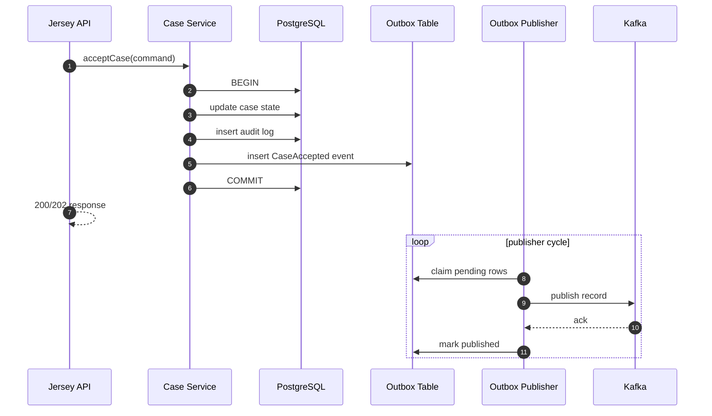
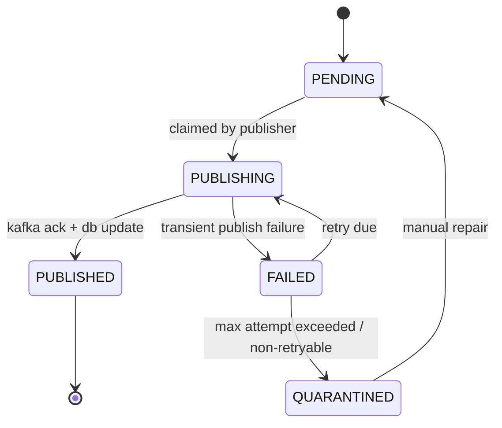

# Part 032 — Producer Outbox Pattern

Di Part 031 kita mendesain event stream. Sekarang kita hadapi masalah yang lebih tajam:

> Bagaimana membuat perubahan state di PostgreSQL dan publikasi event ke Kafka tetap konsisten tanpa distributed transaction antara database dan Kafka?

Jawaban produksi yang umum dan defensible adalah **Transactional Outbox Pattern**.

Bukan karena outbox itu trend. Tetapi karena direct dual-write hampir selalu punya lubang.

---

## 1. Problem: Dual-Write Trap

Bayangkan endpoint `POST /cases/{caseId}/accept`.

Handler melakukan dua hal:

1. update status case di PostgreSQL menjadi `ACCEPTED`;
2. publish `CaseAccepted` ke Kafka.

Implementasi naif:

```java
caseRepository.accept(caseId);
kafkaProducer.send("reg.case.lifecycle.v1", caseId, event);
```

Kelihatannya sederhana. Di produksi, ini berbahaya.

### Failure matrix

| Urutan | Failure | Hasil |
|---|---|---|
| DB commit sukses, Kafka publish gagal | network/Kafka unavailable | state berubah, event hilang |
| Kafka publish sukses, DB rollback | exception setelah publish | event palsu, consumer percaya case accepted |
| Kafka publish timeout | broker sebenarnya menerima record | retry bisa duplicate |
| Service crash setelah DB commit sebelum publish | process mati | event hilang |
| Service crash setelah publish sebelum response | client retry | duplicate request/event |

Tidak ada konfigurasi `try-catch` yang membuat dua sistem berbeda menjadi satu transaksi atomic.

Kita butuh desain yang mengubah problem dari:

```text
"DB dan Kafka harus commit bersama"
```

menjadi:

```text
"DB commit menyimpan state dan event intent secara atomic; publisher mengirim event dari outbox secara retryable"
```

---

## 2. Mental Model Outbox

Transactional outbox adalah tabel di database owner yang menyimpan event yang harus dipublish.

Dalam satu transaksi PostgreSQL:

```text
update domain state
insert audit log
insert outbox event
commit
```

Setelah commit, publisher membaca outbox dan mengirim ke Kafka.



Kunci desainnya:

> Event tidak dibuat setelah transaksi. Event dibuat di dalam transaksi sebagai fakta yang akan dipublish.

Jika transaksi rollback, outbox row juga rollback. Tidak ada event palsu.

Jika Kafka down, outbox row tetap ada. Event tidak hilang.

---

## 3. Delivery Semantics yang Jujur

Outbox tidak memberi exactly-once end-to-end. Outbox memberi:

```text
At-least-once publication + stable event identity + idempotent consumer
```

Kenapa bukan exactly-once?

Karena publisher bisa berhasil publish ke Kafka, lalu gagal update status outbox menjadi `PUBLISHED`. Saat restart, ia publish lagi.

Itu normal. Sistem harus siap duplicate.

Target kita:

- **No lost event** setelah domain commit.
- **No false event** jika domain rollback.
- **Duplicate possible**, tetapi aman karena `eventId` stabil dan consumer idempotent.

Jika tim mengklaim “exactly once” tanpa menjelaskan boundary external side-effect, anggap itu warning sign.

---

## 4. Outbox Table Design

Kita gunakan schema `integration`.

```sql
create table integration.outbox_event (
    outbox_id uuid primary key,
    event_id text not null unique,
    topic_name text not null,
    partition_key text not null,
    aggregate_type text not null,
    aggregate_id text not null,
    aggregate_version bigint not null,
    event_type text not null,
    event_version integer not null,
    schema_ref text not null,
    payload jsonb not null,
    headers jsonb not null default '{}'::jsonb,
    status text not null,
    attempt_count integer not null default 0,
    next_attempt_at timestamptz not null default now(),
    locked_by text,
    locked_at timestamptz,
    published_at timestamptz,
    last_error_code text,
    last_error_message text,
    created_at timestamptz not null default now(),
    updated_at timestamptz not null default now(),

    constraint outbox_event_status_ck check (
        status in ('PENDING', 'PUBLISHING', 'PUBLISHED', 'FAILED', 'QUARANTINED')
    ),
    constraint outbox_event_attempt_count_ck check (attempt_count >= 0)
);
```

Index untuk publisher:

```sql
create index outbox_event_pending_idx
on integration.outbox_event (next_attempt_at, created_at)
where status in ('PENDING', 'FAILED');

create index outbox_event_aggregate_idx
on integration.outbox_event (aggregate_type, aggregate_id, aggregate_version);

create index outbox_event_published_at_idx
on integration.outbox_event (published_at)
where status = 'PUBLISHED';
```

### Field explanation

| Field | Tujuan |
|---|---|
| `outbox_id` | primary key internal row |
| `event_id` | stable id untuk dedupe downstream |
| `topic_name` | target Kafka topic eksplisit |
| `partition_key` | Kafka record key |
| `aggregate_type` | owner semantic |
| `aggregate_id` | usually caseId |
| `aggregate_version` | domain sequence |
| `event_type` | semantic event name |
| `event_version` | version payload |
| `schema_ref` | contract identity |
| `payload` | event envelope atau payload final |
| `headers` | correlation/tenant/trace headers |
| `status` | publisher state machine |
| `attempt_count` | retry control |
| `next_attempt_at` | backoff scheduling |
| `locked_by`, `locked_at` | visibility/debugging |
| `published_at` | publication evidence |

---

## 5. Outbox Status State Machine



### Invariant

```text
Only PUBLISHED means Kafka ack was observed by publisher.
PENDING/FAILED means safe to retry.
PUBLISHING means claimed but may be stale if publisher crashed.
QUARANTINED means operator decision required.
```

`PUBLISHING` tidak boleh permanen. Butuh stale-lock recovery.

---

## 6. Insert Outbox di Dalam Domain Transaction

Saat case diterima:

```sql
update case_core.case_file
set status = 'ACCEPTED',
    version = version + 1,
    updated_at = now()
where case_id = :caseId
  and status = 'SUBMITTED'
returning case_id, version;
```

Lalu insert audit:

```sql
insert into case_core.case_audit_log (
    audit_id,
    case_id,
    action,
    actor_id,
    occurred_at,
    detail
) values (
    gen_random_uuid(),
    :caseId,
    'CASE_ACCEPTED',
    :actorId,
    now(),
    jsonb_build_object('reasonCode', :reasonCode)
);
```

Lalu insert outbox:

```sql
insert into integration.outbox_event (
    outbox_id,
    event_id,
    topic_name,
    partition_key,
    aggregate_type,
    aggregate_id,
    aggregate_version,
    event_type,
    event_version,
    schema_ref,
    payload,
    headers,
    status
) values (
    :outboxId,
    :eventId,
    'reg.case.lifecycle.v1',
    :caseId,
    'Case',
    :caseId,
    :aggregateVersion,
    'CaseAccepted',
    1,
    'reg.case.lifecycle.CaseAccepted.v1',
    :payload::jsonb,
    :headers::jsonb,
    'PENDING'
);
```

Semua terjadi dalam satu database transaction.

---

## 7. Transaction Boundary in Java

Pseudo-code service:

```java
public final class AcceptCaseService {
    private final TransactionRunner tx;
    private final CaseMapper caseMapper;
    private final CaseAuditMapper auditMapper;
    private final OutboxMapper outboxMapper;
    private final EventIdGenerator eventIdGenerator;
    private final JsonCodec jsonCodec;

    public AcceptCaseResult accept(AcceptCaseCommand command, RequestContext ctx) {
        return tx.required(() -> {
            var accepted = caseMapper.acceptSubmittedCase(
                    command.caseId(),
                    command.actorId(),
                    command.reasonCode()
            );

            if (accepted == null) {
                return AcceptCaseResult.conflict("CASE_NOT_SUBMITTED");
            }

            auditMapper.append(new CaseAuditRow(
                    UUID.randomUUID(),
                    command.caseId(),
                    "CASE_ACCEPTED",
                    command.actorId(),
                    Instant.now(),
                    Map.of("reasonCode", command.reasonCode())
            ));

            var eventId = eventIdGenerator.newEventId();
            var payload = new CaseAcceptedPayload(
                    command.caseId(),
                    command.actorId(),
                    command.reasonCode(),
                    accepted.version(),
                    accepted.updatedAt()
            );

            outboxMapper.insert(new OutboxEventRow(
                    UUID.randomUUID(),
                    eventId,
                    "reg.case.lifecycle.v1",
                    command.caseId(),
                    "Case",
                    command.caseId(),
                    accepted.version(),
                    "CaseAccepted",
                    1,
                    "reg.case.lifecycle.CaseAccepted.v1",
                    jsonCodec.toJson(payload),
                    jsonCodec.toJson(Map.of(
                            "eventId", eventId,
                            "correlationId", ctx.correlationId(),
                            "tenantId", ctx.tenantId(),
                            "producer", "case-service"
                    )),
                    "PENDING"
            ));

            return AcceptCaseResult.accepted(command.caseId(), accepted.version());
        });
    }
}
```

Important:

- Kafka producer tidak dipanggil di sini.
- Outbox insert adalah bagian dari transaction.
- `eventId` dibuat sebelum insert dan tidak berubah.
- `aggregateVersion` berasal dari domain update.

---

## 8. MyBatis Mapper

```xml
<mapper namespace="reg.caseplatform.integration.OutboxMapper">

  <insert id="insert" parameterType="OutboxEventRow">
    insert into integration.outbox_event (
      outbox_id,
      event_id,
      topic_name,
      partition_key,
      aggregate_type,
      aggregate_id,
      aggregate_version,
      event_type,
      event_version,
      schema_ref,
      payload,
      headers,
      status
    ) values (
      #{outboxId, jdbcType=OTHER},
      #{eventId},
      #{topicName},
      #{partitionKey},
      #{aggregateType},
      #{aggregateId},
      #{aggregateVersion},
      #{eventType},
      #{eventVersion},
      #{schemaRef},
      #{payload, typeHandler=JsonbTypeHandler},
      #{headers, typeHandler=JsonbTypeHandler},
      #{status}
    )
  </insert>

</mapper>
```

Jangan membangun SQL outbox dengan string concatenation. Pakai parameter binding. Payload JSON tetap harus tervalidasi sebelum insert.

---

## 9. Claim Pending Events Safely

Publisher perlu mengambil batch outbox tanpa dua instance mengirim row yang sama pada saat bersamaan.

Gunakan row locking.

```sql
with candidate as (
    select outbox_id
    from integration.outbox_event
    where status in ('PENDING', 'FAILED')
      and next_attempt_at <= now()
    order by created_at
    limit :batchSize
    for update skip locked
)
update integration.outbox_event o
set status = 'PUBLISHING',
    locked_by = :publisherId,
    locked_at = now(),
    attempt_count = attempt_count + 1,
    updated_at = now()
from candidate c
where o.outbox_id = c.outbox_id
returning
    o.outbox_id,
    o.event_id,
    o.topic_name,
    o.partition_key,
    o.aggregate_type,
    o.aggregate_id,
    o.aggregate_version,
    o.event_type,
    o.event_version,
    o.schema_ref,
    o.payload,
    o.headers,
    o.attempt_count;
```

`SKIP LOCKED` membuat beberapa publisher bisa berjalan paralel tanpa menunggu row yang sedang diklaim publisher lain. Tetapi ini cocok untuk queue-like table, bukan query umum yang membutuhkan snapshot konsisten sempurna.

---

## 10. Publisher Loop

```java
public final class OutboxPublisher implements Runnable {
    private final OutboxMapper outboxMapper;
    private final KafkaProducer<String, byte[]> producer;
    private final EventSerializer serializer;
    private final String publisherId;
    private final int batchSize;

    @Override
    public void run() {
        while (!Thread.currentThread().isInterrupted()) {
            var batch = outboxMapper.claimBatch(publisherId, batchSize);

            if (batch.isEmpty()) {
                sleepQuietly(Duration.ofMillis(500));
                continue;
            }

            for (var event : batch) {
                publishOne(event);
            }
        }
    }

    private void publishOne(OutboxEvent event) {
        try {
            var record = new ProducerRecord<>(
                    event.topicName(),
                    event.partitionKey(),
                    serializer.serialize(event)
            );

            record.headers().add("eventId", event.eventId().getBytes(UTF_8));
            record.headers().add("eventType", event.eventType().getBytes(UTF_8));
            record.headers().add("correlationId", event.header("correlationId").getBytes(UTF_8));

            producer.send(record).get(10, TimeUnit.SECONDS);
            outboxMapper.markPublished(event.outboxId(), publisherId, Instant.now());
        } catch (Exception e) {
            var failure = OutboxFailureClassifier.classify(e);
            outboxMapper.markFailed(
                    event.outboxId(),
                    publisherId,
                    failure.code(),
                    failure.message(),
                    failure.nextAttemptAt(),
                    failure.quarantine()
            );
        }
    }
}
```

Ini sengaja sinkron per event untuk clarity. Di produksi, kamu bisa batch/asynchronous dengan batas concurrency, tetapi jangan kehilangan state machine clarity.

---

## 11. Mark Published

```sql
update integration.outbox_event
set status = 'PUBLISHED',
    published_at = :publishedAt,
    locked_by = null,
    locked_at = null,
    updated_at = now(),
    last_error_code = null,
    last_error_message = null
where outbox_id = :outboxId
  and status = 'PUBLISHING'
  and locked_by = :publisherId;
```

Jika update ini gagal karena publisher kehilangan ownership, jangan panic-publish ulang di loop yang sama. Biarkan recovery job menangani.

---

## 12. Mark Failed with Backoff

```sql
update integration.outbox_event
set status = case when :quarantine then 'QUARANTINED' else 'FAILED' end,
    next_attempt_at = :nextAttemptAt,
    locked_by = null,
    locked_at = null,
    last_error_code = :errorCode,
    last_error_message = left(:errorMessage, 2000),
    updated_at = now()
where outbox_id = :outboxId
  and status = 'PUBLISHING'
  and locked_by = :publisherId;
```

Backoff policy contoh:

| Attempt | Delay |
|---:|---:|
| 1 | 5s |
| 2 | 30s |
| 3 | 2m |
| 4 | 10m |
| 5+ | 1h or quarantine |

Untuk Kafka unavailable, retry. Untuk invalid topic/schema, quarantine. Jangan retry selamanya untuk error non-retryable.

---

## 13. Stale Publishing Recovery

Publisher bisa mati setelah claim row menjadi `PUBLISHING`.

Recovery query:

```sql
update integration.outbox_event
set status = 'FAILED',
    locked_by = null,
    locked_at = null,
    next_attempt_at = now(),
    last_error_code = 'STALE_PUBLISHING_LOCK',
    last_error_message = 'Publisher lock exceeded visibility timeout',
    updated_at = now()
where status = 'PUBLISHING'
  and locked_at < now() - interval '5 minutes';
```

Ini berarti row akan dipublish lagi. Jika sebelumnya sebenarnya sudah sampai Kafka tetapi belum sempat `markPublished`, duplicate bisa terjadi. Itu expected. Consumer harus dedupe.

---

## 14. Direct Polling vs Debezium CDC Outbox

Ada dua pendekatan umum.

### 14.1 Application Poller

Aplikasi sendiri membaca tabel outbox dan publish ke Kafka.

Kelebihan:

- mudah dipahami;
- tidak perlu Kafka Connect/Debezium;
- logic retry/quarantine bisa custom;
- bisa dikelola dalam service yang sama.

Kekurangan:

- menambah beban query ke database;
- perlu membangun publisher lifecycle;
- perlu hati-hati locking/backoff/metrics;
- publisher bug adalah bug aplikasi.

### 14.2 Debezium Outbox Event Router

Aplikasi hanya insert outbox row. Debezium membaca change log database dan EventRouter SMT mengubah row outbox menjadi Kafka message.

Kelebihan:

- tidak polling query application table;
- publication mengikuti CDC log;
- cocok untuk arsitektur Kafka Connect;
- outbox table bisa lebih append-only.

Kekurangan:

- butuh infrastruktur Debezium/Kafka Connect;
- operational model berbeda;
- transform config menjadi kontrak;
- debugging perlu memahami CDC lag, connector status, offset, schema.

### Decision rule

Untuk seri ini, kita implementasikan **application poller** karena kita ingin memahami mechanics. Tetapi secara production, Debezium outbox valid jika organisasi sudah punya Kafka Connect/Debezium operation yang matang.

---

## 15. Debezium-Compatible Outbox Shape

Jika ingin kompatibel dengan Debezium Outbox Event Router, shape minimal yang umum adalah:

```sql
create table integration.outbox_event_debezium_style (
    id uuid not null primary key,
    aggregatetype varchar(255) not null,
    aggregateid varchar(255) not null,
    type varchar(255) not null,
    payload jsonb
);
```

Dalam desain kita, field-nya lebih kaya. Itu tidak salah. Tetapi jika akan memakai Debezium SMT, pastikan mapping column-nya jelas.

Mapping konseptual:

| Debezium default | Desain kita |
|---|---|
| `id` | `event_id` atau `outbox_id` |
| `aggregatetype` | `aggregate_type` |
| `aggregateid` | `partition_key` / `aggregate_id` |
| `type` | `event_type` |
| `payload` | `payload` |

Jika memakai Debezium, jangan update row outbox berulang seperti application poller status machine. Debezium outbox umumnya mengharapkan insert-only outbox event. Status machine adalah pola application poller.

---

## 16. Kafka Producer Configuration Baseline

Untuk publisher:

```properties
acks=all
enable.idempotence=true
retries=2147483647
max.in.flight.requests.per.connection=5
delivery.timeout.ms=120000
request.timeout.ms=30000
linger.ms=10
batch.size=32768
compression.type=zstd
```

Catatan:

- `acks=all` meningkatkan durability expectation.
- `enable.idempotence=true` membantu menghindari duplicate di producer retry path ke Kafka partition.
- Ini tidak menghilangkan duplicate akibat publish-success lalu `markPublished` gagal.
- Compression dan batching harus diuji dengan payload nyata.

Konfigurasi producer tidak menggantikan outbox.

---

## 17. Payload Serialization

Minimal JSON cukup untuk awal, tetapi production contract harus punya schema validation.

Publisher flow:

```text
read outbox row
  -> validate event_type + event_version + schema_ref
  -> build envelope
  -> serialize
  -> send Kafka record with key
  -> mark published
```

Jangan mengirim payload raw tanpa validasi karena outbox bisa terisi dari bug lama, manual repair, atau migration script.

Contoh envelope final:

```json
{
  "eventId": "evt-01J0W7F2Z3M8Q6M4K9Z0C7R9RA",
  "eventType": "CaseAccepted",
  "eventVersion": 1,
  "schemaRef": "reg.case.lifecycle.CaseAccepted.v1",
  "aggregateType": "Case",
  "aggregateId": "CASE-2026-000193",
  "aggregateVersion": 4,
  "producer": "case-service",
  "occurredAt": "2026-07-03T02:20:13Z",
  "publishedAt": "2026-07-03T02:20:14Z",
  "payload": {
    "caseId": "CASE-2026-000193",
    "acceptedBy": "user-48291",
    "acceptedReasonCode": "VALID_JURISDICTION"
  }
}
```

`occurredAt` berasal dari domain transaction. `publishedAt` berasal dari publisher.

---

## 18. Idempotency Interaction

HTTP idempotency dan outbox harus nyambung.

Jika client mengirim request yang sama dengan idempotency key sama, response harus sama dan tidak membuat event baru.

Tabel idempotency:

```text
idempotency_key + operation + request_fingerprint -> result reference
```

Flow:

```text
accept request
  -> check idempotency key
  -> if replay, return prior result
  -> if new, execute domain tx
      -> update case
      -> insert idempotency result
      -> insert outbox event
  -> commit
```

Jika duplicate HTTP request membuat dua outbox event untuk satu domain transition, berarti idempotency boundary gagal.

Tambahkan unique constraint domain jika perlu:

```sql
create unique index case_accepted_event_once_idx
on integration.outbox_event (aggregate_id, event_type, aggregate_version)
where event_type = 'CaseAccepted';
```

Ini pagar tambahan, bukan satu-satunya mekanisme.

---

## 19. Outbox Ordering

Jika event untuk satu aggregate harus publish sesuai `aggregateVersion`, publisher perlu menjaga urutan.

Masalah:

```text
CaseAccepted version 4
InvestigationStarted version 5
```

Jika publisher mengambil batch dan publish parallel tanpa kontrol, version 5 bisa publish sebelum version 4.

### Strategi sederhana

Untuk lifecycle topic keyed by `caseId`, Kafka partition order akan menjaga urutan **jika producer mengirim record untuk key yang sama dalam urutan yang sama**. Maka publisher harus membaca outbox ordered by aggregate/version atau setidaknya tidak parallelize per same key.

Claim query bisa diurutkan:

```sql
order by aggregate_type, aggregate_id, aggregate_version
```

Namun global ordering by aggregate bisa tidak efisien.

Strategi lebih baik:

- maintain ordering per aggregate in domain transaction;
- publisher sends events sequentially per partition key;
- avoid multiple publisher instances claiming same aggregate concurrently if strict per-aggregate publication order is required.

Bisa pakai advisory lock per aggregate saat publish:

```sql
select pg_try_advisory_lock(hashtext(:aggregateType || ':' || :aggregateId));
```

Tetapi advisory lock menambah complexity. Gunakan hanya jika ordering publish per aggregate benar-benar ketat dan tidak cukup dijaga oleh claim ordering.

### Practical rule

Untuk seri ini:

```text
Outbox rows are inserted with aggregateVersion.
Publisher claims oldest rows first.
Consumer projection protects itself with aggregateVersion.
```

Kita tidak mengandalkan publisher ordering saja. Consumer tetap harus punya guard.

---

## 20. Backpressure

Kafka down atau lambat akan membuat outbox bertambah.

Ini bukan bug. Ini buffer. Tetapi buffer harus dimonitor.

Metrics wajib:

| Metric | Makna |
|---|---|
| `outbox_pending_count` | jumlah event belum publish |
| `outbox_oldest_pending_age_seconds` | umur event tertua yang belum publish |
| `outbox_publish_success_total` | jumlah sukses publish |
| `outbox_publish_failure_total` | jumlah gagal publish |
| `outbox_quarantined_count` | jumlah perlu operator |
| `outbox_publish_latency_ms` | waktu claim -> published |
| `kafka_producer_send_latency_ms` | latency producer |
| `kafka_producer_error_total` | error producer |

Alert bukan hanya “publisher error”. Alert paling penting:

```text
oldest pending age > SLA publication window
```

Jika event SLA breach harus memicu escalation dalam 5 menit, outbox pending age tidak boleh 30 menit.

---

## 21. Cleanup and Archival

Outbox bukan audit log permanen. Setelah published dan retention operasional lewat, archive/delete.

```sql
create table integration.outbox_event_archive
(like integration.outbox_event including all);
```

Archival job:

```sql
with moved as (
    delete from integration.outbox_event
    where status = 'PUBLISHED'
      and published_at < now() - interval '30 days'
    returning *
)
insert into integration.outbox_event_archive
select * from moved;
```

Hati-hati:

- Jangan delete `FAILED`/`QUARANTINED` otomatis.
- Jangan archive sebelum consumer lag/replay policy dipahami.
- Jangan jadikan outbox archive sebagai audit source-of-truth jika audit log domain sudah ada.

---

## 22. Reconciliation

Outbox harus punya reconciliation query.

### Domain state without event

Contoh case accepted tetapi tidak ada event:

```sql
select c.case_id, c.version, c.updated_at
from case_core.case_file c
where c.status = 'ACCEPTED'
  and not exists (
      select 1
      from integration.outbox_event o
      where o.aggregate_type = 'Case'
        and o.aggregate_id = c.case_id
        and o.event_type = 'CaseAccepted'
        and o.aggregate_version = c.version
  );
```

Ini harus kosong. Jika tidak kosong, ada bug/migration bypass.

### Published row without Kafka observation

Lebih sulit karena Kafka bukan database query biasa. Kamu bisa menggunakan consumer-side audit/inbox untuk rekonsiliasi:

```text
outbox PUBLISHED eventId not seen by critical consumer after threshold -> investigate
```

---

## 23. Runbook: Kafka Down

Jika Kafka down:

1. Publisher mulai gagal publish.
2. Outbox rows menjadi `FAILED` dengan backoff.
3. `outbox_pending_count` naik.
4. API tetap bisa melayani domain command selama PostgreSQL sehat.
5. Jika pending age melewati threshold, aktifkan incident.
6. Setelah Kafka pulih, publisher drain backlog.
7. Monitor consumer lag karena event burst.

Decision point:

- Jika backlog sangat besar, naikkan publisher batch/concurrency secara bertahap.
- Jangan langsung scale tanpa melihat DB load dan Kafka broker load.
- Jika event tertentu invalid, quarantine agar tidak menahan seluruh drain.

---

## 24. Runbook: Poison Outbox Event

Poison outbox event adalah row yang tidak bisa dipublish karena error non-transient: schema invalid, topic missing, payload corrupt, header invalid.

Langkah:

1. Query `QUARANTINED` rows.
2. Baca `last_error_code` dan payload.
3. Tentukan apakah repair aman.
4. Jika payload salah tetapi domain fact benar, buat correction event atau repair outbox row sesuai policy.
5. Set status kembali ke `PENDING`.
6. Catat operator action di audit log.

Repair SQL harus explicit:

```sql
update integration.outbox_event
set payload = :repairedPayload::jsonb,
    status = 'PENDING',
    next_attempt_at = now(),
    last_error_code = null,
    last_error_message = null,
    updated_at = now()
where outbox_id = :outboxId
  and status = 'QUARANTINED';
```

Jangan repair massal tanpa filter eventId.

---

## 25. Testing Strategy

### 25.1 Unit test

- event factory membuat envelope benar;
- eventId stabil;
- headers wajib ada;
- payload schema valid;
- failure classifier benar.

### 25.2 Integration test with PostgreSQL

- domain update dan outbox insert commit bersama;
- rollback menghapus outbox row;
- unique constraint mencegah duplicate semantic;
- claim batch tidak double-claim;
- stale lock recovery bekerja.

### 25.3 Kafka integration test

- publisher mengirim ke topic dengan key benar;
- duplicate publish possible dan consumer dedupe;
- Kafka unavailable menghasilkan failed/backoff;
- invalid topic/schema masuk quarantine.

### 25.4 Crash test

Simulasikan crash di titik:

| Crash point | Expected result |
|---|---|
| before DB commit | no state, no outbox |
| after DB commit before publisher | state exists, outbox pending |
| after claim before send | row returns to failed after stale recovery |
| after send before mark published | duplicate possible on retry |
| after mark published | done |

Crash test ini lebih penting daripada test happy path.

---

## 26. Failure Model

| Failure | System behavior | Required safeguard |
|---|---|---|
| DB rollback | outbox insert rollback | transaction boundary |
| Kafka unavailable | outbox remains pending/failed | retry/backoff/alert |
| Publisher crash before send | stale PUBLISHING recovered | visibility timeout |
| Publisher crash after send | duplicate on retry possible | eventId + inbox dedupe |
| Invalid payload | quarantine | schema validation + repair |
| Duplicate HTTP request | no duplicate event | idempotency table |
| Outbox table grows | storage pressure | backlog alert + archive |
| Claim race | double publish | `FOR UPDATE SKIP LOCKED` |
| Mark published fails | duplicate possible | idempotent consumer |
| Event ordering violation | projection error | aggregateVersion guard |

---

## 27. Operational Dashboard

Minimal dashboard:

```text
Outbox
  pending count
  failed count
  quarantined count
  oldest pending age
  publish throughput
  publish failure rate
  publish latency p50/p95/p99

Kafka producer
  record send rate
  record error rate
  request latency
  batch size
  compression rate

Database
  outbox claim query latency
  row lock wait
  table bloat
  index size

Consumer impact
  critical consumer lag
  DLQ count
  inbox duplicate count
```

Outbox tanpa dashboard adalah hidden incident.

---

## 28. Production Hardening Checklist

- [ ] Domain transaction inserts outbox row atomically.
- [ ] No direct Kafka publish inside request transaction.
- [ ] Outbox event has stable `eventId`.
- [ ] Outbox event has deterministic `partition_key`.
- [ ] Outbox event contains `aggregateVersion`.
- [ ] Pending index exists.
- [ ] Publisher uses row locking / safe claim.
- [ ] Publisher has retry/backoff.
- [ ] Publisher has quarantine path.
- [ ] Stale lock recovery exists.
- [ ] Kafka producer uses durable baseline config.
- [ ] Payload schema validation exists.
- [ ] Metrics and alerts exist.
- [ ] Cleanup/archive job exists.
- [ ] Reconciliation query exists.
- [ ] Consumer idempotency is implemented.
- [ ] Crash tests cover critical failure points.

---

## 29. Anti-Patterns

### 29.1 Publish directly after DB commit

```java
transaction.commit();
kafka.send(event);
```

Crash between commit and send loses event.

### 29.2 Publish inside DB transaction

```java
tx.begin();
updateDb();
kafka.send(event).get();
tx.commit();
```

Kafka publish can succeed while DB later rolls back. Also transaction is held open during network call.

### 29.3 Treat PUBLISHED as business audit

Outbox publish evidence is integration evidence, not necessarily domain audit. Keep domain audit separate.

### 29.4 Delete failed rows automatically

Failed rows are evidence. Deleting them hides incident.

### 29.5 No stable event ID

If duplicate cannot be identified, at-least-once becomes dangerous.

### 29.6 Infinite retry of poison event

This creates noisy failure loops. Quarantine non-retryable failures.

---

## 30. Relation to Camunda

Outbox is also critical for process integration.

Example:

```text
CaseAccepted -> workflow-correlation-adapter -> correlate message to Camunda process
```

If `CaseAccepted` is lost, process might never move.

If `CaseAccepted` is duplicated, adapter must be idempotent:

- same message correlation should not start duplicate process unless contract allows it;
- use business key `caseId`;
- record processed eventId in inbox table;
- handle Camunda optimistic locking/retry separately.

Outbox protects publication. Inbox protects consumption. Camunda correlation still needs idempotency.

---

## 31. Ringkasan

Transactional outbox mengubah dual-write problem menjadi recoverable pipeline.

Tanpa outbox:

```text
DB state and Kafka event can diverge silently.
```

Dengan outbox:

```text
Domain state and event intent commit atomically.
Publication is retryable, observable, and repairable.
```

Tetapi outbox bukan magic exactly-once. Desain yang jujur adalah:

```text
No false event.
No lost committed event.
Duplicate possible.
Consumer must be idempotent.
```

Di part berikutnya, kita akan membangun sisi consumer:

> Consumer Inbox and Idempotency — bagaimana memastikan event yang duplicate, replayed, delayed, atau out-of-order tetap aman ketika consumer menulis ke database, memanggil Camunda, atau menghasilkan side-effect baru.
