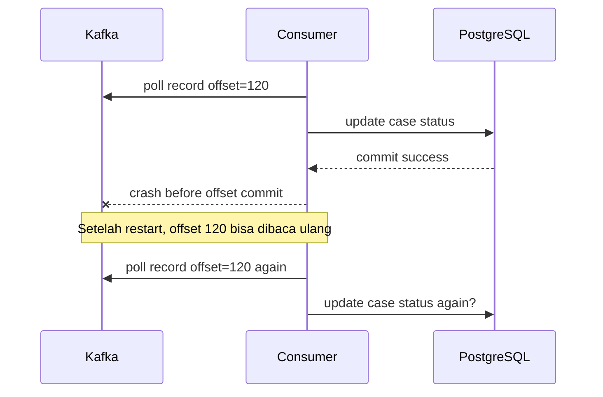
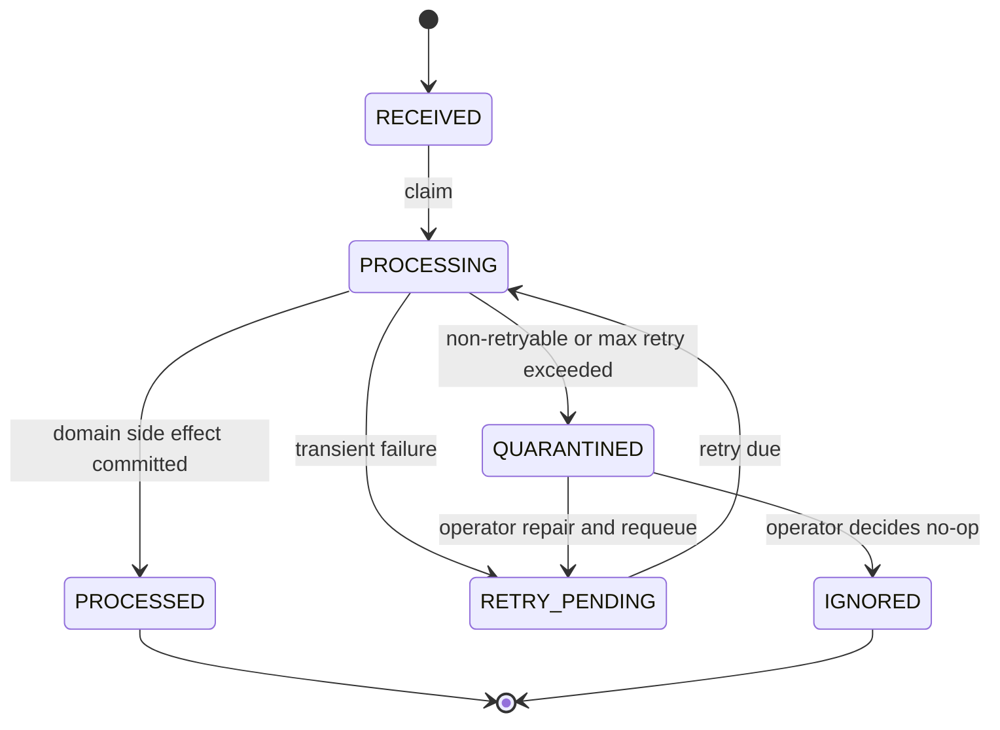
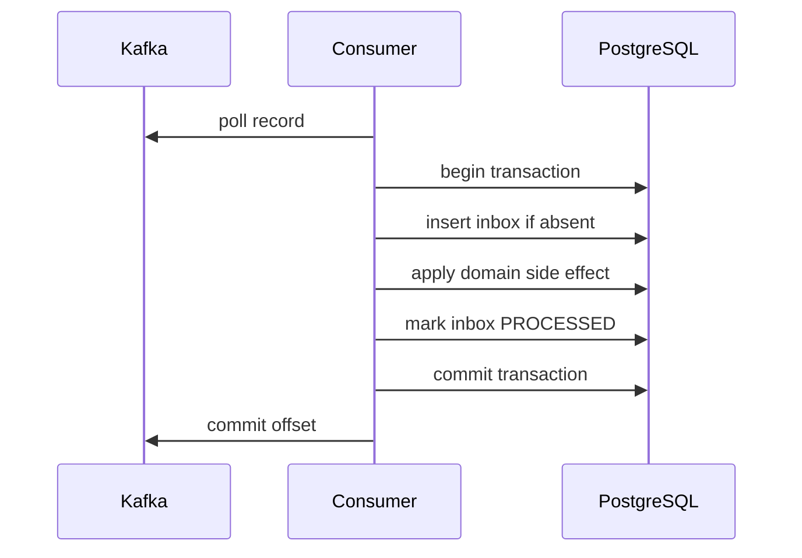
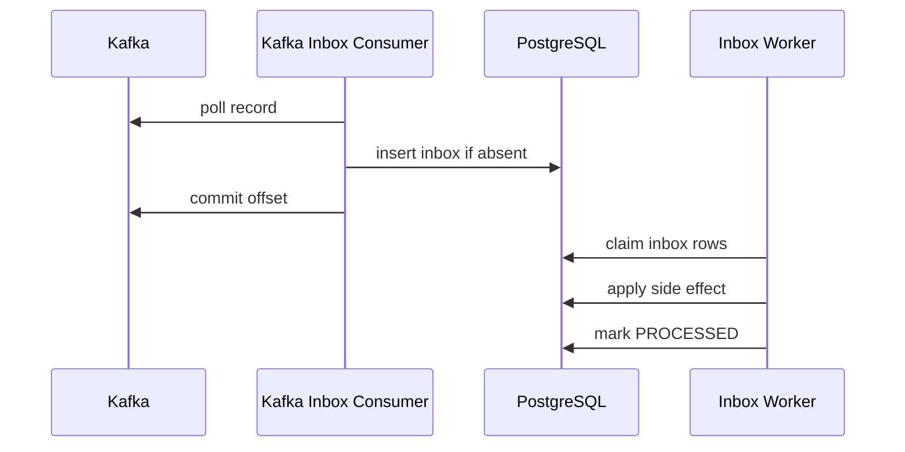

# Part 033 — Consumer Inbox and Idempotency

Di part sebelumnya kita membangun **producer outbox** agar perubahan domain dan event publication tidak menjadi dual-write langsung antara PostgreSQL dan Kafka.

Sekarang kita pindah ke sisi sebaliknya: **consumer**.

Masalahnya sederhana di permukaan:

> "Consumer membaca event dari Kafka lalu melakukan side effect."

Masalah produksinya jauh lebih keras:

> "Bagaimana memastikan event yang sama tidak mengubah state dua kali ketika consumer crash, offset commit gagal, pod restart, rebalance terjadi, DB lambat, Kafka mengirim ulang, atau operator menjalankan replay?"

Di sistem produksi, consumer Kafka hampir selalu harus diperlakukan sebagai **at-least-once input**. Kafka bisa memberikan primitive yang kuat di dalam ekosistem Kafka, tetapi ketika consumer melakukan side effect ke PostgreSQL, Camunda, HTTP API, email, storage, atau sistem lain, kita tetap perlu mendesain idempotency di boundary aplikasi.

Target part ini:

- membangun mental model offset, processing, side effect, dan duplicate delivery;
- mendesain **consumer inbox table** sebagai bukti pemrosesan;
- membuat algorithm consumer yang aman terhadap crash window;
- membedakan retry, quarantine, DLQ, dan replay;
- menghubungkan Kafka offset dengan PostgreSQL transaction secara jujur;
- membuat MyBatis mapper dan Java service skeleton;
- menyiapkan runbook produksi untuk duplicate, poison event, dan consumer lag.

Kita tidak akan mengulang basic Kafka consumer API. Kita akan fokus pada reliability pattern.

---

## 1. Mental Model: Offset Bukan Bukti Business Processing

Kafka offset adalah posisi baca pada partition. Offset menjawab:

> "Consumer group ini sudah sampai posisi mana?"

Offset tidak otomatis menjawab:

> "Apakah side effect domain sudah berhasil?"

Side effect bisa berupa:

- insert/update PostgreSQL;
- complete human task;
- correlate Camunda message;
- call external API;
- publish event baru;
- generate audit record;
- update projection;
- enqueue notification.

Consumer yang hanya mengandalkan offset akan rapuh.

### 1.1 Crash Window yang Harus Dianggap Normal

Misal consumer memproses event `CaseAccepted`.



Kalau update kedua tidak idempotent, sistem rusak.

Contoh kerusakan:

- counter naik dua kali;
- SLA obligation dibuat dua kali;
- Camunda message dikorelasikan dua kali;
- outbox event turunan publish dua kali;
- audit menampilkan dua keputusan yang sama;
- user menerima dua notifikasi;
- case masuk state transition yang tidak valid.

**Kesimpulan desain:**

> Kafka offset commit tidak boleh menjadi satu-satunya bukti business processing. Kita butuh bukti pemrosesan di storage milik consumer.

Itulah peran **consumer inbox**.

---

## 2. Consumer Inbox Pattern

Consumer inbox adalah tabel database yang mencatat event masuk dan status pemrosesannya untuk consumer tertentu.

Inbox menjawab:

- event apa yang sudah pernah dilihat;
- consumer mana yang memproses;
- apakah event sudah diproses sukses;
- kalau gagal, error apa dan berapa kali retry;
- payload asli apa yang diterima;
- kapan harus retry;
- apakah event diparkir untuk manual repair.

### 2.1 Batas Penting

Inbox bukan:

- pengganti Kafka;
- tempat query bisnis utama;
- data warehouse;
- event store canonical;
- alasan untuk menyimpan semua payload selamanya tanpa retention.

Inbox adalah **operational deduplication and recovery ledger**.

### 2.2 State Machine Inbox



State ini sengaja eksplisit. Jangan menyimpan semua kegagalan sebagai `FAILED`. `FAILED` terlalu miskin makna.

Gunakan:

- `RECEIVED`: event baru disimpan;
- `PROCESSING`: worker sedang mengerjakan;
- `PROCESSED`: side effect sudah sukses;
- `RETRY_PENDING`: gagal sementara, boleh dicoba lagi;
- `QUARANTINED`: tidak aman diproses otomatis;
- `IGNORED`: valid untuk diabaikan karena alasan eksplisit.

---

## 3. Event Identity: Kunci Idempotency

Agar consumer bisa mengenali duplikasi, event perlu punya identity stabil.

Dari Part 031, envelope event seharusnya punya minimal:

```json
{
  "eventId": "evt_01HZX...",
  "eventType": "regulatory.case.accepted.v1",
  "eventVersion": 1,
  "occurredAt": "2026-07-03T09:15:30Z",
  "producer": "case-command-service",
  "correlationId": "corr_...",
  "causationId": "cmd_...",
  "aggregateType": "case",
  "aggregateId": "case_123",
  "partitionKey": "case_123",
  "payload": {}
}
```

### 3.1 Unique Key yang Benar

Minimal unique key:

```text
consumer_name + event_id
```

Kenapa bukan hanya `event_id`?

Karena event yang sama boleh dikonsumsi oleh beberapa consumer berbeda:

- `case-projection-consumer`;
- `sla-consumer`;
- `camunda-correlation-consumer`;
- `notification-consumer`;
- `analytics-consumer`.

Setiap consumer punya obligation berbeda.

### 3.2 Offset Bukan Event ID

Jangan jadikan `topic + partition + offset` sebagai satu-satunya event identity untuk idempotency domain.

Offset berguna untuk observability dan debugging. Tetapi event yang sama secara logis bisa muncul lagi pada replay, republish, migration, backfill, atau source connector berbeda.

Simpan keduanya:

- `event_id` untuk logical idempotency;
- `topic/partition/offset` untuk traceability.

---

## 4. PostgreSQL Schema untuk Consumer Inbox

Berikut schema inti.

```sql
create schema if not exists integration;

create table integration.consumer_inbox (
    inbox_id              uuid primary key default gen_random_uuid(),

    consumer_name         text not null,
    event_id              text not null,
    event_type            text not null,
    event_version         integer not null,

    aggregate_type        text not null,
    aggregate_id          text not null,

    topic_name            text not null,
    partition_no          integer not null,
    offset_no             bigint not null,

    correlation_id        text null,
    causation_id          text null,
    producer              text not null,

    occurred_at           timestamptz not null,
    received_at           timestamptz not null default now(),

    status                text not null,
    attempt_count         integer not null default 0,
    next_attempt_at       timestamptz null,

    locked_by             text null,
    locked_at             timestamptz null,

    processed_at          timestamptz null,
    quarantined_at        timestamptz null,

    error_code            text null,
    error_message         text null,
    error_detail          jsonb null,

    payload               jsonb not null,
    headers               jsonb not null default '{}'::jsonb,

    created_at            timestamptz not null default now(),
    updated_at            timestamptz not null default now(),

    constraint consumer_inbox_status_ck check (
        status in (
            'RECEIVED',
            'PROCESSING',
            'PROCESSED',
            'RETRY_PENDING',
            'QUARANTINED',
            'IGNORED'
        )
    ),

    constraint consumer_inbox_attempt_ck check (attempt_count >= 0),
    constraint consumer_inbox_event_version_ck check (event_version > 0),

    constraint consumer_inbox_unique_event_per_consumer_uk
        unique (consumer_name, event_id)
);
```

Tambahkan index operasional.

```sql
create index consumer_inbox_retry_idx
on integration.consumer_inbox (consumer_name, status, next_attempt_at, received_at)
where status in ('RECEIVED', 'RETRY_PENDING');

create index consumer_inbox_aggregate_idx
on integration.consumer_inbox (aggregate_type, aggregate_id, received_at desc);

create index consumer_inbox_topic_offset_idx
on integration.consumer_inbox (topic_name, partition_no, offset_no);

create index consumer_inbox_quarantine_idx
on integration.consumer_inbox (consumer_name, quarantined_at desc)
where status = 'QUARANTINED';
```

### 4.1 Kenapa Payload Disimpan?

Payload disimpan untuk:

- audit teknis;
- replay lokal;
- debugging contract mismatch;
- repair manual;
- membuktikan event apa yang memicu side effect;
- menghindari kehilangan konteks saat Kafka retention sudah lewat.

Tetapi payload retention harus dibatasi. Jangan menyimpan data sensitif selamanya tanpa kebijakan retention.

---

## 5. Dua Cara Menggunakan Inbox

Ada dua pola utama.

### 5.1 Inline Inbox

Consumer membaca Kafka, menyimpan inbox, memproses domain side effect, lalu commit offset.



Kelebihan:

- sederhana;
- latensi rendah;
- cocok untuk side effect DB lokal;
- mudah dites.

Kekurangan:

- Kafka consumer thread menunggu domain processing;
- kalau side effect lambat, poll loop bisa terganggu;
- kalau memanggil sistem eksternal, transaction boundary menjadi berbahaya.

### 5.2 Staged Inbox

Consumer Kafka hanya menyimpan event ke inbox, lalu worker database memproses inbox.



Kelebihan:

- Kafka poll loop ringan;
- retry bisa dikendalikan oleh DB;
- cocok untuk side effect kompleks;
- bisa pause/resume processing tanpa pause consumption;
- bagus untuk Camunda correlation, projection, dan external call.

Kekurangan:

- latensi bertambah;
- perlu worker terpisah;
- perlu runbook untuk backlog inbox;
- offset bisa sudah commit sementara side effect belum selesai, sehingga Kafka lag terlihat aman padahal business lag masih ada.

Untuk sistem case orchestration yang punya Camunda, SLA, dan external dependency, staged inbox sering lebih aman.

---

## 6. Rekomendasi untuk Seri Ini

Untuk platform kita, gunakan kombinasi:

| Consumer Type | Pattern |
|---|---|
| Simple read model projection lokal | Inline inbox boleh |
| Camunda correlation | Staged inbox |
| External API call | Staged inbox |
| Notification/email | Staged inbox |
| SLA obligation update | Inline atau staged, tergantung kompleksitas |
| Analytics sink | Staged/batch |

Rule praktis:

> Kalau side effect hanya DB lokal dan cepat, inline inbox cukup. Kalau side effect menyentuh engine/workflow/external dependency, staged inbox lebih defensible.

---

## 7. Algorithm Inline Inbox

Pseudo algorithm:

```text
for each Kafka record:
    parse envelope
    validate event contract
    begin DB transaction
        inserted = insert inbox row if absent
        if not inserted:
            if existing status is PROCESSED or IGNORED:
                commit DB
                commit Kafka offset
                continue
            if existing status is QUARANTINED:
                commit DB
                do not process automatically
                commit Kafka offset only if policy allows quarantine progress
                continue

        apply domain side effect idempotently
        insert domain audit
        optionally insert outbox events
        mark inbox PROCESSED
    commit DB transaction
    commit Kafka offset
```

### 7.1 Critical Ordering

Offset commit harus dilakukan **setelah** DB commit.

Salah:

```text
commit Kafka offset
apply DB update
```

Kalau consumer crash setelah offset commit tetapi sebelum DB update, event hilang dari sudut pandang consumer group.

Benar:

```text
apply DB update
commit DB
commit Kafka offset
```

Kalau crash setelah DB commit tetapi sebelum offset commit, event akan dibaca ulang. Inbox akan deduplicate.

---

## 8. Algorithm Staged Inbox

Kafka consumer:

```text
for each record:
    parse envelope
    validate envelope minimally
    begin DB transaction
        insert inbox if absent
    commit DB transaction
    commit Kafka offset
```

Inbox worker:

```text
loop:
    begin DB transaction
        claim due inbox rows with FOR UPDATE SKIP LOCKED
    commit

    for each row:
        begin DB transaction
            reload row for update
            if status not PROCESSING: skip
            apply side effect
            mark PROCESSED
        commit

        on transient failure:
            mark RETRY_PENDING with next_attempt_at

        on non-retryable failure:
            mark QUARANTINED
```

Claim query:

```sql
with candidate as (
    select inbox_id
    from integration.consumer_inbox
    where consumer_name = #{consumerName}
      and status in ('RECEIVED', 'RETRY_PENDING')
      and (next_attempt_at is null or next_attempt_at <= now())
    order by received_at asc
    limit #{limit}
    for update skip locked
)
update integration.consumer_inbox i
set status = 'PROCESSING',
    locked_by = #{workerId},
    locked_at = now(),
    attempt_count = attempt_count + 1,
    updated_at = now()
from candidate c
where i.inbox_id = c.inbox_id
returning i.*;
```

### 8.1 Stale Lock Recovery

Worker bisa mati setelah claim.

Tambahkan repair:

```sql
update integration.consumer_inbox
set status = 'RETRY_PENDING',
    next_attempt_at = now(),
    locked_by = null,
    locked_at = null,
    error_code = 'STALE_PROCESSING_LOCK',
    error_message = 'Processing lock exceeded timeout',
    updated_at = now()
where status = 'PROCESSING'
  and locked_at < now() - interval '10 minutes';
```

Jangan terlalu agresif. Kalau side effect eksternal bisa memakan waktu lama, stale timeout harus disesuaikan.

---

## 9. MyBatis Mapper

### 9.1 Interface

```java
public interface ConsumerInboxMapper {

    int insertIfAbsent(ConsumerInboxInsertRow row);

    ConsumerInboxRow findByConsumerAndEventId(
        @Param("consumerName") String consumerName,
        @Param("eventId") String eventId
    );

    List<ConsumerInboxRow> claimDue(
        @Param("consumerName") String consumerName,
        @Param("workerId") String workerId,
        @Param("limit") int limit
    );

    int markProcessed(
        @Param("inboxId") UUID inboxId,
        @Param("processedAt") OffsetDateTime processedAt
    );

    int markRetryPending(
        @Param("inboxId") UUID inboxId,
        @Param("errorCode") String errorCode,
        @Param("errorMessage") String errorMessage,
        @Param("errorDetail") String errorDetailJson,
        @Param("nextAttemptAt") OffsetDateTime nextAttemptAt
    );

    int markQuarantined(
        @Param("inboxId") UUID inboxId,
        @Param("errorCode") String errorCode,
        @Param("errorMessage") String errorMessage,
        @Param("errorDetail") String errorDetailJson
    );
}
```

### 9.2 XML Mapper

```xml
<mapper namespace="com.acme.integration.inbox.ConsumerInboxMapper">

  <insert id="insertIfAbsent" parameterType="ConsumerInboxInsertRow">
    insert into integration.consumer_inbox (
      consumer_name,
      event_id,
      event_type,
      event_version,
      aggregate_type,
      aggregate_id,
      topic_name,
      partition_no,
      offset_no,
      correlation_id,
      causation_id,
      producer,
      occurred_at,
      status,
      payload,
      headers
    )
    values (
      #{consumerName},
      #{eventId},
      #{eventType},
      #{eventVersion},
      #{aggregateType},
      #{aggregateId},
      #{topicName},
      #{partitionNo},
      #{offsetNo},
      #{correlationId},
      #{causationId},
      #{producer},
      #{occurredAt},
      'RECEIVED',
      #{payload,jdbcType=OTHER,typeHandler=com.acme.mybatis.JsonbTypeHandler},
      #{headers,jdbcType=OTHER,typeHandler=com.acme.mybatis.JsonbTypeHandler}
    )
    on conflict (consumer_name, event_id) do nothing
  </insert>

  <select id="findByConsumerAndEventId" resultMap="ConsumerInboxRowMap">
    select *
    from integration.consumer_inbox
    where consumer_name = #{consumerName}
      and event_id = #{eventId}
  </select>

  <select id="claimDue" resultMap="ConsumerInboxRowMap">
    with candidate as (
      select inbox_id
      from integration.consumer_inbox
      where consumer_name = #{consumerName}
        and status in ('RECEIVED', 'RETRY_PENDING')
        and (next_attempt_at is null or next_attempt_at &lt;= now())
      order by received_at asc
      limit #{limit}
      for update skip locked
    )
    update integration.consumer_inbox i
    set status = 'PROCESSING',
        locked_by = #{workerId},
        locked_at = now(),
        attempt_count = attempt_count + 1,
        updated_at = now()
    from candidate c
    where i.inbox_id = c.inbox_id
    returning i.*
  </select>

  <update id="markProcessed">
    update integration.consumer_inbox
    set status = 'PROCESSED',
        processed_at = #{processedAt},
        locked_by = null,
        locked_at = null,
        error_code = null,
        error_message = null,
        error_detail = null,
        updated_at = now()
    where inbox_id = #{inboxId}
      and status = 'PROCESSING'
  </update>

  <update id="markRetryPending">
    update integration.consumer_inbox
    set status = 'RETRY_PENDING',
        next_attempt_at = #{nextAttemptAt},
        locked_by = null,
        locked_at = null,
        error_code = #{errorCode},
        error_message = #{errorMessage},
        error_detail = #{errorDetail,jdbcType=OTHER,typeHandler=com.acme.mybatis.JsonbTypeHandler},
        updated_at = now()
    where inbox_id = #{inboxId}
      and status = 'PROCESSING'
  </update>

  <update id="markQuarantined">
    update integration.consumer_inbox
    set status = 'QUARANTINED',
        quarantined_at = now(),
        locked_by = null,
        locked_at = null,
        error_code = #{errorCode},
        error_message = #{errorMessage},
        error_detail = #{errorDetail,jdbcType=OTHER,typeHandler=com.acme.mybatis.JsonbTypeHandler},
        updated_at = now()
    where inbox_id = #{inboxId}
      and status = 'PROCESSING'
  </update>

</mapper>
```

---

## 10. Java Consumer Skeleton

Kita buat consumer tipis. Ia tidak berisi business logic.

```java
public final class KafkaInboxConsumer implements Runnable {

    private final KafkaConsumer<String, String> consumer;
    private final EventEnvelopeParser parser;
    private final TransactionRunner tx;
    private final ConsumerInboxMapper inboxMapper;
    private final String consumerName;

    private volatile boolean running = true;

    @Override
    public void run() {
        consumer.subscribe(List.of("regulatory.case.events.v1"));

        while (running) {
            ConsumerRecords<String, String> records = consumer.poll(Duration.ofMillis(500));

            for (ConsumerRecord<String, String> record : records) {
                handleRecord(record);
            }

            consumer.commitSync();
        }
    }

    private void handleRecord(ConsumerRecord<String, String> record) {
        EventEnvelope envelope = parser.parse(record.value());

        tx.required(() -> {
            ConsumerInboxInsertRow row = ConsumerInboxInsertRow.from(envelope, record, consumerName);
            inboxMapper.insertIfAbsent(row);
            return null;
        });
    }

    public void shutdown() {
        running = false;
        consumer.wakeup();
    }
}
```

Perhatikan:

- consumer tidak melakukan domain side effect;
- consumer hanya menyimpan event ke inbox;
- offset commit terjadi setelah DB insert;
- duplikasi aman karena unique constraint;
- parsing minimal harus cukup untuk menolak payload rusak.

### 10.1 Apa yang Terjadi Jika Payload Tidak Bisa Diparse?

Jika envelope rusak total, kita tidak punya `event_id`.

Pilihan:

1. jangan commit offset, consumer stuck;
2. kirim ke raw DLQ dengan metadata topic/partition/offset;
3. simpan raw poison record ke table `consumer_raw_poison`;
4. stop consumer dan minta operator.

Untuk sistem produksi, buat policy eksplisit.

Contoh raw poison table:

```sql
create table integration.consumer_raw_poison (
    poison_id      uuid primary key default gen_random_uuid(),
    consumer_name  text not null,
    topic_name     text not null,
    partition_no   integer not null,
    offset_no      bigint not null,
    record_key     text null,
    raw_value      text null,
    headers        jsonb not null default '{}'::jsonb,
    error_message  text not null,
    created_at     timestamptz not null default now(),

    constraint consumer_raw_poison_offset_uk
        unique (consumer_name, topic_name, partition_no, offset_no)
);
```

Jangan membiarkan satu payload rusak menghentikan seluruh partition tanpa runbook.

---

## 11. Inbox Worker Skeleton

```java
public final class InboxWorker implements Runnable {

    private final TransactionRunner tx;
    private final ConsumerInboxMapper inboxMapper;
    private final DomainEventDispatcher dispatcher;
    private final RetryPolicy retryPolicy;
    private final String consumerName;
    private final String workerId;
    private final int batchSize;

    private volatile boolean running = true;

    @Override
    public void run() {
        while (running) {
            List<ConsumerInboxRow> rows = tx.required(() ->
                inboxMapper.claimDue(consumerName, workerId, batchSize)
            );

            if (rows.isEmpty()) {
                sleepQuietly(Duration.ofMillis(250));
                continue;
            }

            for (ConsumerInboxRow row : rows) {
                processOne(row);
            }
        }
    }

    private void processOne(ConsumerInboxRow row) {
        try {
            tx.required(() -> {
                ConsumerInboxRow locked = inboxMapper.findByIdForUpdate(row.inboxId());

                if (!locked.isProcessingBy(workerId)) {
                    return null;
                }

                dispatcher.dispatch(locked);
                inboxMapper.markProcessed(locked.inboxId(), OffsetDateTime.now());
                return null;
            });
        } catch (TransientProcessingException ex) {
            tx.requiresNew(() -> {
                OffsetDateTime next = retryPolicy.nextAttempt(row.attemptCount());
                inboxMapper.markRetryPending(row.inboxId(), ex.code(), ex.getMessage(), ex.detailJson(), next);
                return null;
            });
        } catch (NonRetryableProcessingException ex) {
            tx.requiresNew(() -> {
                inboxMapper.markQuarantined(row.inboxId(), ex.code(), ex.getMessage(), ex.detailJson());
                return null;
            });
        }
    }
}
```

### 11.1 Dispatcher Harus Deterministic

```java
public final class DomainEventDispatcher {

    private final Map<String, DomainEventHandler> handlers;

    public void dispatch(ConsumerInboxRow row) {
        DomainEventHandler handler = handlers.get(row.eventType());

        if (handler == null) {
            throw new NonRetryableProcessingException(
                "UNSUPPORTED_EVENT_TYPE",
                "No handler for event type " + row.eventType()
            );
        }

        handler.handle(row);
    }
}
```

Jangan membuat dispatcher yang mencari class via reflection liar berdasarkan nama event dari payload. Itu membuka attack surface dan membuat behavior sulit diaudit.

---

## 12. Handler Idempotency

Inbox mencegah event yang sama diproses dua kali oleh consumer yang sama. Tetapi handler juga tetap harus idempotent di level domain.

Kenapa?

Karena:

- operator bisa menjalankan repair manual;
- event lama bisa dipublish ulang dengan event id berbeda;
- consumer name bisa berubah;
- bug historical bisa menyebabkan duplikasi;
- side effect eksternal belum tentu terlindungi inbox.

### 12.1 Contoh Handler: Update Projection

```java
public final class CaseAcceptedProjectionHandler implements DomainEventHandler {

    private final CaseProjectionMapper projectionMapper;

    @Override
    public void handle(ConsumerInboxRow row) {
        CaseAcceptedPayload payload = row.payloadAs(CaseAcceptedPayload.class);

        int updated = projectionMapper.upsertAcceptedState(
            payload.caseId(),
            payload.acceptedAt(),
            row.eventId()
        );

        if (updated != 1) {
            throw new TransientProcessingException(
                "PROJECTION_UPSERT_FAILED",
                "Expected one projection row to be upserted"
            );
        }
    }
}
```

SQL:

```sql
insert into read_model.case_summary (
    case_id,
    case_status,
    accepted_at,
    last_event_id,
    updated_at
)
values (
    #{caseId},
    'ACCEPTED',
    #{acceptedAt},
    #{eventId},
    now()
)
on conflict (case_id) do update
set case_status = excluded.case_status,
    accepted_at = excluded.accepted_at,
    last_event_id = excluded.last_event_id,
    updated_at = now()
where read_model.case_summary.last_event_id is distinct from excluded.last_event_id;
```

### 12.2 Contoh Handler: Create SLA Obligation

SLA creation tidak boleh duplicate.

```sql
create unique index sla_obligation_case_type_uk
on case_core.sla_obligation (case_id, obligation_type)
where cancelled_at is null;
```

Handler:

```java
public void handle(ConsumerInboxRow row) {
    CaseAcceptedPayload payload = row.payloadAs(CaseAcceptedPayload.class);

    slaMapper.insertIfAbsent(
        payload.caseId(),
        "INITIAL_ASSESSMENT_DUE",
        payload.acceptedAt().plusDays(5),
        row.eventId()
    );
}
```

SQL:

```sql
insert into case_core.sla_obligation (
    case_id,
    obligation_type,
    due_at,
    source_event_id,
    status
)
values (
    #{caseId},
    #{obligationType},
    #{dueAt},
    #{sourceEventId},
    'OPEN'
)
on conflict do nothing;
```

Idempotency terbaik sering berupa **unique constraint bisnis**, bukan `if` di Java.

---

## 13. Retry Taxonomy

Tidak semua error harus retry.

| Error | Retry? | Action |
|---|---:|---|
| DB connection timeout | yes | retry with backoff |
| PostgreSQL serialization failure | yes | retry transaction |
| Lock timeout | yes | retry |
| Unsupported event version | no | quarantine |
| Missing required field after schema validation | no | quarantine |
| Referenced case not found | depends | retry if eventual consistency expected; otherwise quarantine |
| External API 500 | yes | retry |
| External API 400 | no | quarantine |
| Camunda no matching execution | depends | retry if process may not yet wait; quarantine after threshold |
| Duplicate event | no | mark processed/ignored |

### 13.1 Backoff

```java
public final class RetryPolicy {

    public OffsetDateTime nextAttempt(int attemptCount) {
        long seconds = switch (attemptCount) {
            case 0, 1 -> 5;
            case 2 -> 30;
            case 3 -> 120;
            case 4 -> 600;
            default -> 1800;
        };

        long jitter = ThreadLocalRandom.current().nextLong(0, Math.min(60, seconds));
        return OffsetDateTime.now().plusSeconds(seconds + jitter);
    }

    public boolean shouldQuarantine(int attemptCount) {
        return attemptCount >= 10;
    }
}
```

Backoff tanpa jitter dapat menciptakan retry storm.

---

## 14. DLQ vs Quarantine

DLQ sering dipakai terlalu cepat.

DLQ baik untuk:

- payload tidak bisa diparse;
- schema tidak didukung;
- poison record yang menghambat partition;
- event yang tidak dapat diproses otomatis setelah threshold.

Tetapi DLQ bukan solusi ajaib.

Jika Anda memindahkan record ke DLQ tanpa menyimpan:

- consumer name;
- original topic/partition/offset;
- event id;
- error code;
- contract version;
- handler name;
- correlation id;
- aggregate id;
- timestamp kegagalan;
- retry count;

maka DLQ hanya menjadi kuburan payload.

### 14.1 Quarantine Table Lebih Operasional

Karena kita sudah punya inbox, `QUARANTINED` sering lebih berguna daripada publish ke DLQ topic.

Kelebihan quarantine table:

- bisa query dengan SQL;
- bisa dikaitkan ke case;
- bisa punya UI internal;
- bisa diretry dengan update status;
- bisa diaudit;
- bisa diberi owner.

DLQ topic tetap boleh dipakai untuk integrasi platform observability, tetapi jangan menggantikan operational ledger.

---

## 15. Partition Ordering dan Head-of-Line Blocking

Kafka memberi ordering dalam satu partition. Jika key kita `case_id`, semua event untuk case yang sama berada di partition yang sama dan urut relatif terhadap producer/topic.

Tetapi inbox worker bisa merusak ordering jika memproses rows paralel tanpa aturan.

### 15.1 Risk

Event:

1. `CaseAccepted`
2. `EvidenceRequested`
3. `CaseClosed`

Kalau worker memproses `CaseClosed` sebelum `CaseAccepted`, projection kacau.

### 15.2 Strategy

Untuk event yang butuh ordering per aggregate:

- claim rows ordered by `received_at`;
- batasi parallelism per aggregate;
- gunakan advisory lock per aggregate saat processing;
- atau simpan sequence number di event contract.

Contoh advisory lock:

```sql
select pg_advisory_xact_lock(hashtext(#{aggregateType} || ':' || #{aggregateId}));
```

Gunakan advisory lock secara disiplin. Jangan lock terlalu banyak resource dalam satu transaction.

### 15.3 Sequence Number Contract

Jika producer bisa menyediakan `aggregateVersion`, consumer bisa mendeteksi gap.

```json
{
  "aggregateId": "case_123",
  "aggregateVersion": 17
}
```

Projection table:

```sql
alter table read_model.case_summary
add column last_aggregate_version bigint not null default 0;
```

Update hanya jika versi berikutnya valid:

```sql
update read_model.case_summary
set case_status = #{newStatus},
    last_aggregate_version = #{aggregateVersion},
    updated_at = now()
where case_id = #{caseId}
  and last_aggregate_version = #{aggregateVersion} - 1;
```

Kalau update 0 row:

- duplicate version: ignore if already processed;
- gap: retry later;
- out-of-order: retry;
- invalid event: quarantine.

---

## 16. Rebalance, Pod Shutdown, dan Offset Commit

Kubernetes akan restart pod. Kafka consumer group akan rebalance. Ini normal.

Consumer harus:

- handle graceful shutdown;
- stop polling;
- finish current DB transaction;
- commit offset yang aman;
- close consumer;
- avoid long processing inside poll thread;
- expose readiness false saat shutdown.

### 16.1 Readiness During Shutdown

```text
SIGTERM received
-> readiness = false
-> stop accepting new work
-> stop poll loop
-> finish current record/batch
-> commit offsets
-> close consumer
-> exit before terminationGracePeriodSeconds
```

Untuk staged inbox, shutdown lebih mudah karena poll thread hanya insert inbox.

---

## 17. Observability

Minimum metrics:

| Metric | Meaning |
|---|---|
| `kafka_consumer_lag` | Kafka lag per topic/partition |
| `consumer_inbox_received_total` | event inserted |
| `consumer_inbox_duplicate_total` | duplicate event detected |
| `consumer_inbox_processed_total` | processed success |
| `consumer_inbox_retry_total` | retry scheduled |
| `consumer_inbox_quarantined_total` | poison/non-retryable |
| `consumer_inbox_oldest_pending_age_seconds` | business lag |
| `consumer_inbox_processing_duration_seconds` | side effect latency |
| `consumer_inbox_stale_processing_total` | worker crash indicator |

Structured log fields:

```json
{
  "event": "consumer_inbox_processed",
  "consumerName": "case-camunda-correlation-consumer",
  "eventId": "evt_01HZX...",
  "eventType": "regulatory.case.accepted.v1",
  "aggregateId": "case_123",
  "topic": "regulatory.case.events.v1",
  "partition": 4,
  "offset": 120932,
  "correlationId": "corr_...",
  "attemptCount": 1,
  "durationMs": 37
}
```

Penting:

> Kafka lag rendah tidak berarti sistem sehat jika staged inbox backlog tinggi.

Dashboard harus menampilkan dua lag:

- Kafka lag;
- inbox business lag.

---

## 18. Test Matrix

### 18.1 Unit Tests

- parser menolak envelope tanpa event id;
- retry policy memberi backoff;
- dispatcher memilih handler benar;
- unsupported event type menjadi non-retryable;
- duplicate event tidak memanggil handler.

### 18.2 PostgreSQL Integration Tests

Gunakan Testcontainers PostgreSQL.

Test:

- `insertIfAbsent` duplicate;
- claim batch dengan `SKIP LOCKED`;
- stale lock recovery;
- `markProcessed` hanya bekerja dari `PROCESSING`;
- unique constraint consumer/event;
- index query plan untuk backlog besar.

### 18.3 Kafka Integration Tests

Gunakan Kafka test environment.

Test crash windows:

| Scenario | Expected |
|---|---|
| crash after DB commit before offset commit | event re-read, inbox duplicate, no double side effect |
| crash before DB commit | event re-read, side effect eventually done |
| duplicate event id with different offset | duplicate detected |
| poison payload | raw poison saved or DLQ |
| handler transient failure | retry scheduled |
| handler non-retryable failure | quarantined |
| worker crash after claim | stale lock repair |

### 18.4 Replay Tests

Replay adalah fitur produksi, bukan eksperimen manual.

Test replay harus menjawab:

- Apakah event lama bisa diproses tanpa merusak state?
- Apakah handler idempotent?
- Apakah event version lama masih didukung?
- Apakah replay memicu notifikasi eksternal ulang?
- Apakah outbox event turunan dibuat lagi?

Untuk side effect seperti email, gunakan suppression flag atau separate handler.

---

## 19. Failure Model

| Failure | Detection | Recovery |
|---|---|---|
| Kafka record duplicate | unique constraint conflict | mark skip/processed |
| DB commit success, offset commit fail | duplicate on restart | inbox dedup |
| offset commit success, DB commit fail | should not happen if ordering correct | fix code; data repair if happened |
| worker crash after claim | stale `PROCESSING` | stale lock recovery |
| unsupported event | quarantine | deploy handler or ignore with audit |
| event arrives before referenced aggregate | retry pending | eventual consistency wait |
| event version unsupported | quarantine | compatibility release |
| handler bug | quarantine/retry storm | disable worker, patch, replay |
| backlog grows | metrics | scale worker, inspect bottleneck |
| poison event blocks partition | raw poison policy | DLQ/quarantine and commit offset |

---

## 20. Production Runbook

### 20.1 Duplicate Spike

Check:

```sql
select consumer_name, event_type, count(*)
from integration.consumer_inbox
where received_at > now() - interval '1 hour'
group by consumer_name, event_type
order by count(*) desc;
```

Questions:

- Did producer retry aggressively?
- Did outbox publisher republish?
- Did consumer group reset offset?
- Did replay job run?
- Are duplicates harmless?

### 20.2 Quarantine Review

```sql
select consumer_name,
       event_type,
       error_code,
       count(*) as total,
       min(quarantined_at) as first_seen,
       max(quarantined_at) as last_seen
from integration.consumer_inbox
where status = 'QUARANTINED'
group by consumer_name, event_type, error_code
order by total desc;
```

Decision:

- deploy handler fix;
- patch reference data;
- ignore event with explicit reason;
- replay after repair;
- update contract compatibility.

### 20.3 Requeue Quarantined Event

Jangan update langsung tanpa audit.

```sql
update integration.consumer_inbox
set status = 'RETRY_PENDING',
    next_attempt_at = now(),
    quarantined_at = null,
    error_code = null,
    error_message = null,
    error_detail = null,
    updated_at = now()
where inbox_id = #{inboxId}
  and status = 'QUARANTINED';
```

Tambahkan audit operation di table terpisah.

---

## 21. Anti-Patterns

### 21.1 Commit Offset Sebelum Side Effect

Ini bisa menghilangkan event.

### 21.2 Consumer Handler Tidak Idempotent

Inbox saja tidak cukup jika event logis bisa dipublish ulang dengan ID berbeda.

### 21.3 DLQ sebagai Tempat Sampah

DLQ tanpa owner, metadata, dashboard, dan replay procedure adalah kuburan.

### 21.4 Semua Error Diretry

Unsupported contract tidak akan sembuh karena retry.

### 21.5 Parallel Worker Tanpa Ordering Contract

Throughput naik, correctness turun.

### 21.6 Menyimpan Payload Sensitif Selamanya

Inbox perlu retention dan redaction policy.

### 21.7 Menganggap Kafka Exactly-Once Menyelesaikan Semua Side Effect

Kafka transaction tidak otomatis membuat PostgreSQL, Camunda, email, dan external API menjadi exactly-once.

---

## 22. Production Checklist

Sebelum consumer production:

- [ ] Event envelope punya `eventId`, `eventType`, `eventVersion`, `aggregateId`, `correlationId`.
- [ ] `consumer_name + event_id` unique.
- [ ] Offset commit hanya setelah DB insert/processing aman.
- [ ] Handler idempotent di level domain.
- [ ] Retry taxonomy eksplisit.
- [ ] Quarantine punya owner dan dashboard.
- [ ] Raw poison payload punya policy.
- [ ] Stale processing repair tersedia.
- [ ] Kafka lag dan inbox business lag dimonitor.
- [ ] Replay test tersedia.
- [ ] Duplicate test tersedia.
- [ ] Shutdown behavior dites di Kubernetes.
- [ ] Payload retention/redaction disepakati.
- [ ] Consumer version compatibility diuji.
- [ ] Runbook duplicate/quarantine/replay tersedia.

---

## 23. What You Should Internalize

Consumer inbox bukan pattern tambahan yang "nice to have".

Untuk sistem produksi event-driven, consumer inbox adalah pagar antara:

- **delivery** dan **processing**;
- **offset** dan **side effect**;
- **message arrival** dan **business truth**;
- **retry otomatis** dan **manual recovery**.

Top engineer tidak bertanya:

> "Apakah Kafka akan mengirim duplicate?"

Mereka bertanya:

> "Ketika duplicate terjadi, invariant mana yang tetap aman, dan bukti apa yang kita punya untuk membuktikannya?"

Di part berikutnya, kita pakai consumer inbox ini untuk masalah yang lebih sulit: **menghubungkan Kafka event ke Camunda process instance** tanpa membuat process correlation rapuh, duplicate, atau hilang saat race dengan wait state.
