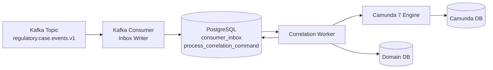
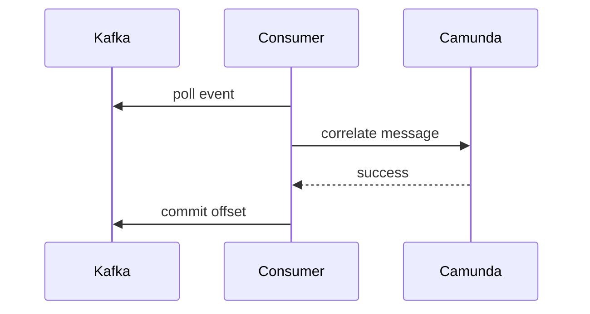
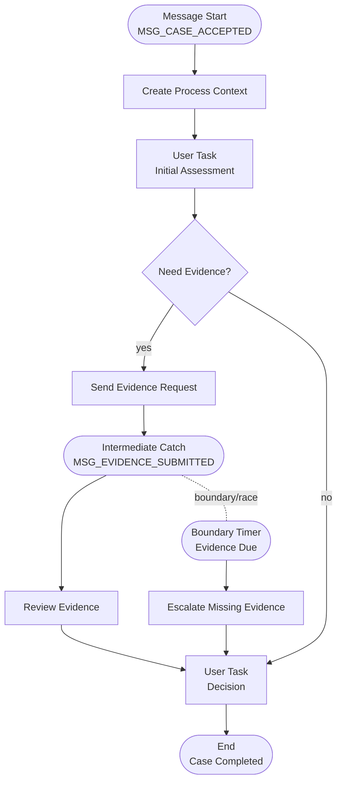
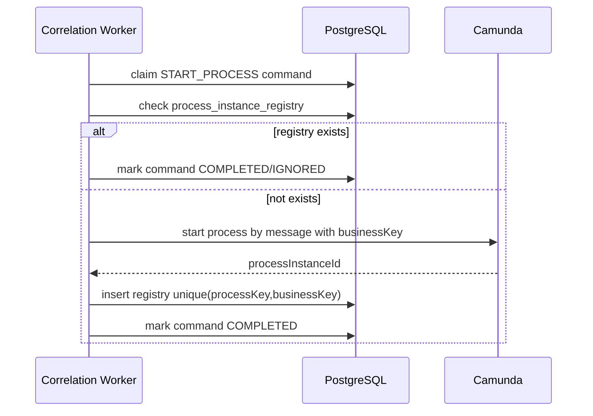
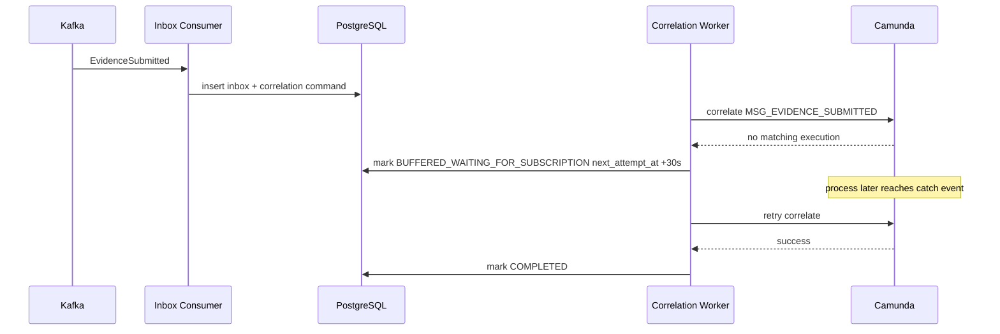
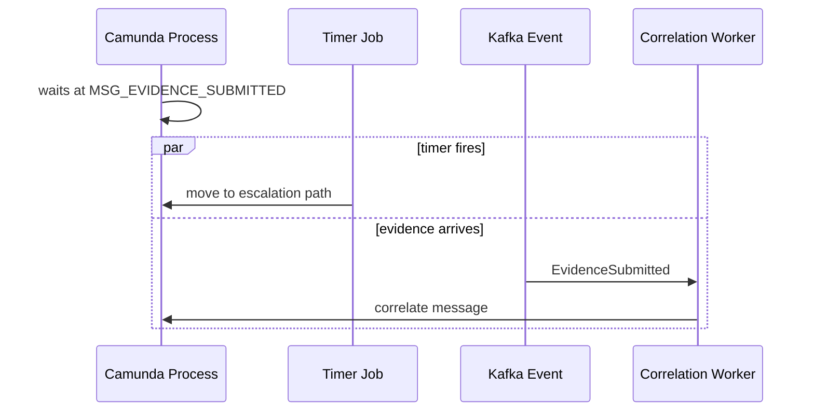
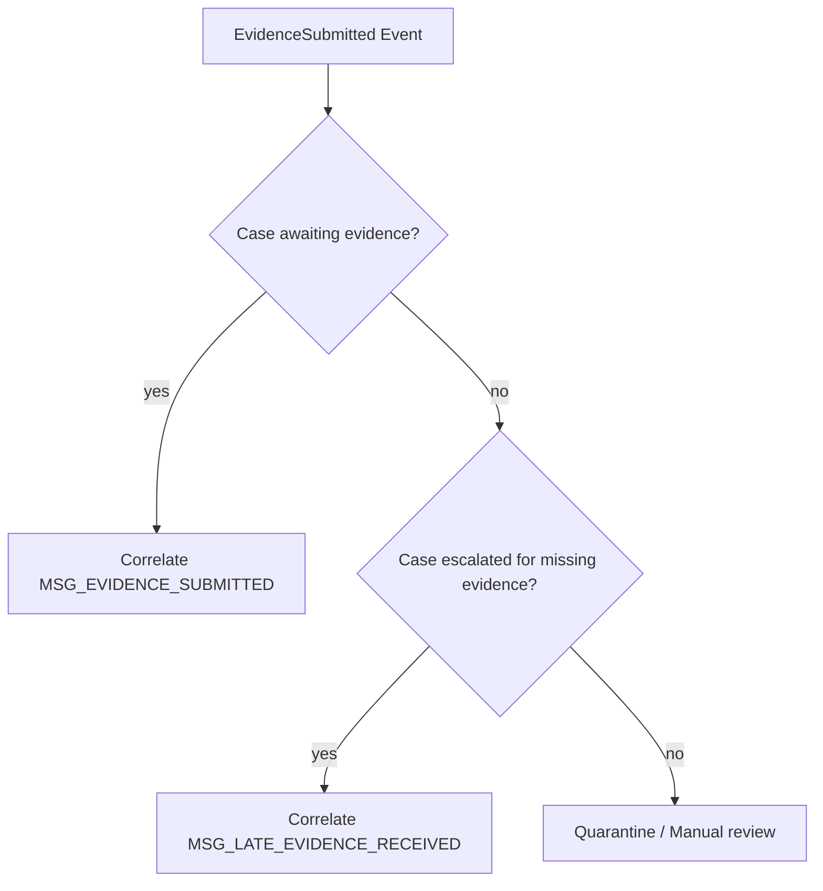
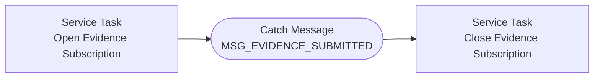
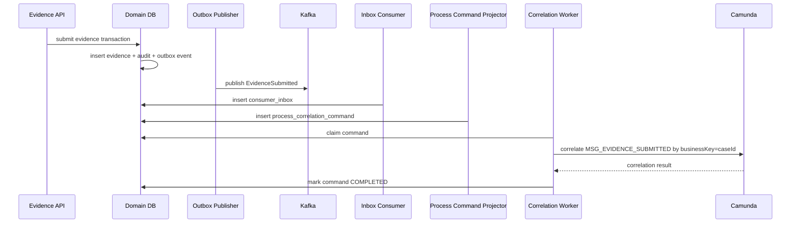

# Part 034 — Event-Driven Process Integration

Di part sebelumnya kita membangun **consumer inbox**. Sekarang kita gunakan pattern itu untuk integrasi yang lebih sulit:

> Kafka event harus membangunkan atau memulai proses Camunda 7 secara aman.

Ini terdengar seperti tugas sederhana:

```java
runtimeService.createMessageCorrelation("CaseAccepted")
    .processInstanceBusinessKey(caseId)
    .correlate();
```

Tetapi dalam produksi, integrasi Kafka → Camunda bisa gagal dalam banyak cara:

- event datang sebelum process instance mencapai message catch event;
- event datang dua kali;
- process instance sudah lanjut karena timer;
- Kafka consumer restart setelah correlation sukses tetapi sebelum offset commit;
- Camunda transaction sukses tetapi DB update consumer gagal;
- message correlation match lebih dari satu execution;
- variable payload terlalu besar;
- business key tidak stabil;
- process definition version berubah;
- tenant boundary salah;
- operator melakukan migration process instance;
- engine incident storm membuat correlation worker backlog.

Part ini membangun desain yang tahan terhadap kondisi tersebut.

---

## 1. Mental Model: Event Tidak Sama dengan Process Command

Kita mulai dengan pemisahan penting.

### 1.1 Domain Event

Domain event menyatakan sesuatu yang sudah terjadi.

Contoh:

```text
regulatory.case.accepted.v1
regulatory.evidence.submitted.v1
regulatory.assessment.completed.v1
regulatory.decision.issued.v1
```

Event bersifat factual:

> "Case sudah diterima."

### 1.2 Process Message

Process message adalah sinyal untuk BPMN engine.

Contoh:

```text
MSG_CASE_ACCEPTED
MSG_EVIDENCE_SUBMITTED
MSG_ASSESSMENT_COMPLETED
MSG_APPEAL_RECEIVED
```

Message bersifat orchestration input:

> "Process instance yang menunggu sinyal ini boleh lanjut."

### 1.3 Process Command

Process command adalah perintah operasional ke process engine.

Contoh:

```text
START_CASE_LIFECYCLE_PROCESS
CORRELATE_EVIDENCE_SUBMITTED
CORRELATE_ASSESSMENT_COMPLETED
```

Command memiliki status, retry, owner, dan error.

**Rule seri ini:**

> Kafka consumer tidak langsung memanggil Camunda untuk side effect penting. Consumer menyimpan event ke inbox dan membuat process correlation command yang durable.

---

## 2. Target Architecture



Boundary:

- Kafka adalah event delivery layer.
- PostgreSQL menyimpan inbox dan command durable.
- Correlation worker melakukan call ke Camunda.
- Camunda DB tetap milik Camunda engine.
- Domain DB tetap canonical untuk domain state.

---

## 3. Kenapa Tidak Direct Kafka Consumer → Camunda?

Direct integration terlihat lebih sederhana.



Masalahnya:

| Failure Window | Consequence |
|---|---|
| Correlation sukses, consumer crash sebelum offset commit | event dikonsumsi ulang, correlation duplicate |
| Event datang sebelum process wait state | `MismatchingMessageCorrelationException`, event bisa hilang jika offset commit |
| Camunda outage | Kafka consumer stuck atau lag tinggi |
| Process model version berubah | correlation failure massal |
| Duplicate event | process bisa lanjut dua kali |
| Timer menang race | message correlation tidak match |
| Consumer rebalance saat call Camunda | ownership ambigu |

Direct call boleh untuk demo. Untuk produksi kompleks, simpan command durable.

---

## 4. Durable Process Correlation Command

Kita buat table khusus.

```sql
create table integration.process_correlation_command (
    command_id               uuid primary key default gen_random_uuid(),

    source_consumer_name      text not null,
    source_event_id           text not null,
    source_event_type         text not null,

    command_type              text not null,
    process_key               text not null,
    message_name              text not null,

    business_key              text not null,
    correlation_key_name      text null,
    correlation_key_value     text null,

    tenant_id                 text null,

    payload                   jsonb not null default '{}'::jsonb,

    status                    text not null,
    attempt_count             integer not null default 0,
    next_attempt_at           timestamptz null,

    locked_by                 text null,
    locked_at                 timestamptz null,

    camunda_process_instance_id text null,
    camunda_execution_id        text null,
    camunda_result_type         text null,

    error_code                text null,
    error_message             text null,
    error_detail              jsonb null,

    created_at                timestamptz not null default now(),
    updated_at                timestamptz not null default now(),
    completed_at              timestamptz null,
    quarantined_at            timestamptz null,

    constraint process_correlation_command_status_ck check (
        status in (
            'PENDING',
            'PROCESSING',
            'COMPLETED',
            'RETRY_PENDING',
            'BUFFERED_WAITING_FOR_SUBSCRIPTION',
            'QUARANTINED',
            'IGNORED'
        )
    ),

    constraint process_correlation_command_type_ck check (
        command_type in (
            'START_PROCESS',
            'CORRELATE_MESSAGE'
        )
    ),

    constraint process_correlation_command_unique_source_uk
        unique (source_consumer_name, source_event_id, command_type, message_name, business_key)
);
```

Index:

```sql
create index process_correlation_command_due_idx
on integration.process_correlation_command (status, next_attempt_at, created_at)
where status in ('PENDING', 'RETRY_PENDING', 'BUFFERED_WAITING_FOR_SUBSCRIPTION');

create index process_correlation_command_business_key_idx
on integration.process_correlation_command (process_key, business_key, created_at desc);

create index process_correlation_command_quarantine_idx
on integration.process_correlation_command (quarantined_at desc)
where status = 'QUARANTINED';
```

### 4.1 Kenapa Command Terpisah dari Inbox?

Inbox menjawab:

> "Event sudah diterima dan diproses oleh consumer ini?"

Correlation command menjawab:

> "Apa aksi durable yang harus dilakukan terhadap Camunda?"

Satu event bisa menghasilkan:

- satu command start process;
- satu command correlate message;
- nol command jika tidak relevan;
- beberapa command jika event perlu membangunkan beberapa process context.

Memisahkan keduanya membuat observability dan recovery jauh lebih jelas.

---

## 5. Event-to-Process Mapping Contract

Buat mapping eksplisit, jangan hardcode tersebar.

```yaml
eventProcessMappings:
  - eventType: regulatory.case.accepted.v1
    commandType: START_PROCESS
    processKey: regulatory-case-lifecycle
    messageName: MSG_CASE_ACCEPTED
    businessKeyExpression: $.payload.caseId
    payloadVariables:
      caseId: $.payload.caseId
      acceptedAt: $.payload.acceptedAt
      jurisdiction: $.payload.jurisdiction

  - eventType: regulatory.evidence.submitted.v1
    commandType: CORRELATE_MESSAGE
    processKey: regulatory-case-lifecycle
    messageName: MSG_EVIDENCE_SUBMITTED
    businessKeyExpression: $.payload.caseId
    correlationKeyName: caseId
    correlationKeyExpression: $.payload.caseId
    payloadVariables:
      evidenceId: $.payload.evidenceId
      submittedAt: $.payload.submittedAt
```

Mapping ini adalah contract. Test dia.

### 5.1 Jangan Masukkan Payload Besar ke Camunda Variables

Camunda variables bukan object storage.

Payload Camunda sebaiknya:

- ID;
- timestamp;
- enum kecil;
- decision primitive;
- pointer ke domain DB;
- correlation metadata.

Jangan masukkan:

- evidence binary;
- request body besar;
- list ratusan item;
- snapshot domain lengkap;
- PII tanpa kebutuhan.

---

## 6. BPMN Modeling untuk Integration Point

Contoh process lifecycle sederhana.



Message start:

- cocok untuk event yang memulai process instance baru;
- harus punya business key stabil;
- perlu idempotency karena duplicate start berbahaya.

Intermediate catch:

- cocok untuk event yang melanjutkan process instance yang sudah berjalan;
- butuh correlation key;
- rentan race jika event datang sebelum token sampai wait state.

---

## 7. Business Key Strategy

Gunakan business key yang stabil dan domain-owned.

Untuk studi kasus kita:

```text
businessKey = caseId
```

Kenapa bukan Camunda process instance id?

Karena process instance id adalah engine identity. Ia bukan identity domain. Migration, restart, repair, atau desain multi-process dapat membuat engine id tidak cocok sebagai correlation contract eksternal.

Business key harus:

- stabil sepanjang lifecycle case;
- tidak berubah karena process migration;
- bisa dilihat operator;
- bisa dihubungkan ke audit domain;
- bukan data sensitif langsung jika muncul di logs.

---

## 8. Start Process Idempotency

Camunda tidak otomatis menjamin hanya satu process instance per business key untuk semua definisi dan semua kondisi model Anda. Jangan bergantung pada asumsi implisit.

Tambahkan domain-side guard.

```sql
create table integration.process_instance_registry (
    registry_id                  uuid primary key default gen_random_uuid(),
    process_key                  text not null,
    business_key                 text not null,
    camunda_process_instance_id   text not null,
    start_source_event_id         text not null,
    started_at                   timestamptz not null default now(),

    constraint process_instance_registry_uk
        unique (process_key, business_key)
);
```

Flow start command:



### 8.1 Important Failure Window

Camunda start succeeds, then DB insert registry fails.

Possible outcomes:

- worker retries and starts duplicate process;
- unique registry missing;
- command stays retrying.

Mitigation options:

1. before start, query Camunda by business key and process definition key;
2. after failure, reconciliation job finds Camunda instance and repairs registry;
3. command worker treats ambiguous success as `RETRY_PENDING` with reconciliation;
4. use Camunda start business key and enforce process uniqueness at domain layer, not just engine call.

There is no free distributed transaction between domain DB and Camunda DB unless you intentionally share transaction infrastructure and accept coupling. Treat cross-resource side effect as at-least-once and make it repairable.

---

## 9. Correlate Message Safely

For intermediate catch event:

```java
MessageCorrelationResult result = runtimeService
    .createMessageCorrelation(command.messageName())
    .processInstanceBusinessKey(command.businessKey())
    .setVariables(command.variables())
    .correlateWithResult();
```

But production code needs more nuance.

### 9.1 Expected Outcomes

| Outcome | Meaning | Action |
|---|---|---|
| exactly one execution matched | success | mark completed |
| no execution matched | event may be early, late, or invalid | retry/buffer/quarantine |
| multiple executions matched | model/correlation bug | quarantine |
| authorization exception | deployment/security bug | quarantine or operator |
| optimistic locking | concurrency race | retry |
| engine/database unavailable | transient | retry |
| incident created downstream | process-level failure | inspect Camunda incident |

### 9.2 No Match Is Not Always Failure

No matching execution can mean:

1. process has not reached wait state yet;
2. process already passed wait state;
3. timer path already won;
4. business key wrong;
5. process not started;
6. process definition version changed;
7. tenant mismatch;
8. message name mismatch;
9. event is duplicate after prior success.

So `MismatchingMessageCorrelationException` needs classification.

---

## 10. Buffered Correlation

Untuk event yang mungkin datang sebelum wait state, gunakan `BUFFERED_WAITING_FOR_SUBSCRIPTION`.



### 10.1 How Long to Buffer?

Depends on domain expectation.

| Event | Buffer Policy |
|---|---|
| Evidence submitted after request | buffer minutes/hours |
| Payment confirmed before invoice process wait | buffer hours |
| Appeal received after case closed | probably quarantine or new process |
| Assessment completed before assessment task exists | short buffer then quarantine |

Buffer policy adalah domain decision.

---

## 11. Correlation Command Creation from Inbox

Kafka consumer stores inbox. Inbox processor creates command.

```java
public final class ProcessCommandProjector implements DomainEventHandler {

    private final ProcessMappingRegistry mappingRegistry;
    private final ProcessCorrelationCommandMapper commandMapper;

    @Override
    public void handle(ConsumerInboxRow row) {
        Optional<EventProcessMapping> mapping = mappingRegistry.find(row.eventType());

        if (mapping.isEmpty()) {
            return;
        }

        ProcessCorrelationCommandInsert command = mapping.get().toCommand(row);

        commandMapper.insertIfAbsent(command);
    }
}
```

SQL insert:

```sql
insert into integration.process_correlation_command (
    source_consumer_name,
    source_event_id,
    source_event_type,
    command_type,
    process_key,
    message_name,
    business_key,
    correlation_key_name,
    correlation_key_value,
    tenant_id,
    payload,
    status
)
values (
    #{sourceConsumerName},
    #{sourceEventId},
    #{sourceEventType},
    #{commandType},
    #{processKey},
    #{messageName},
    #{businessKey},
    #{correlationKeyName},
    #{correlationKeyValue},
    #{tenantId},
    #{payload,jdbcType=OTHER,typeHandler=com.acme.mybatis.JsonbTypeHandler},
    'PENDING'
)
on conflict (
    source_consumer_name,
    source_event_id,
    command_type,
    message_name,
    business_key
) do nothing;
```

---

## 12. Correlation Worker Claim

```sql
with candidate as (
    select command_id
    from integration.process_correlation_command
    where status in ('PENDING', 'RETRY_PENDING', 'BUFFERED_WAITING_FOR_SUBSCRIPTION')
      and (next_attempt_at is null or next_attempt_at <= now())
    order by created_at asc
    limit #{limit}
    for update skip locked
)
update integration.process_correlation_command c
set status = 'PROCESSING',
    locked_by = #{workerId},
    locked_at = now(),
    attempt_count = attempt_count + 1,
    updated_at = now()
from candidate x
where c.command_id = x.command_id
returning c.*;
```

Sama seperti inbox, gunakan stale lock repair.

---

## 13. Java Correlation Worker Skeleton

```java
public final class CamundaCorrelationWorker implements Runnable {

    private final TransactionRunner tx;
    private final ProcessCorrelationCommandMapper commandMapper;
    private final RuntimeService runtimeService;
    private final CamundaCorrelationClassifier classifier;
    private final RetryPolicy retryPolicy;
    private final String workerId;

    @Override
    public void run() {
        while (!Thread.currentThread().isInterrupted()) {
            List<ProcessCorrelationCommand> commands = tx.required(() ->
                commandMapper.claimDue(workerId, 20)
            );

            if (commands.isEmpty()) {
                sleepQuietly(Duration.ofMillis(300));
                continue;
            }

            for (ProcessCorrelationCommand command : commands) {
                handle(command);
            }
        }
    }

    private void handle(ProcessCorrelationCommand command) {
        try {
            CamundaCorrelationOutcome outcome = executeCamundaCommand(command);

            tx.requiresNew(() -> {
                commandMapper.markCompleted(
                    command.commandId(),
                    outcome.processInstanceId(),
                    outcome.executionId(),
                    outcome.resultType()
                );
                return null;
            });

        } catch (Exception ex) {
            CorrelationFailure failure = classifier.classify(command, ex);

            tx.requiresNew(() -> {
                switch (failure.action()) {
                    case RETRY -> commandMapper.markRetryPending(
                        command.commandId(),
                        failure.code(),
                        failure.message(),
                        failure.detailJson(),
                        retryPolicy.nextAttempt(command.attemptCount())
                    );
                    case BUFFER -> commandMapper.markBuffered(
                        command.commandId(),
                        failure.code(),
                        failure.message(),
                        failure.detailJson(),
                        retryPolicy.nextBufferAttempt(command.attemptCount())
                    );
                    case QUARANTINE -> commandMapper.markQuarantined(
                        command.commandId(),
                        failure.code(),
                        failure.message(),
                        failure.detailJson()
                    );
                    case IGNORE -> commandMapper.markIgnored(
                        command.commandId(),
                        failure.code(),
                        failure.message()
                    );
                }
                return null;
            });
        }
    }

    private CamundaCorrelationOutcome executeCamundaCommand(ProcessCorrelationCommand command) {
        if (command.commandType() == CommandType.START_PROCESS) {
            return startProcess(command);
        }
        return correlateMessage(command);
    }
}
```

### 13.1 Why Mark Completed in a New Transaction?

Camunda operation and domain command update are separate resources unless intentionally configured in one transaction. If Camunda succeeds but marking command completed fails, retry may happen.

Therefore the worker must be **reconciliation-aware**:

- retry checks whether process was already started/correlated;
- registry prevents duplicate start;
- command unique prevents duplicate command;
- process variable can include `sourceEventId` to detect prior correlation;
- operator can reconcile ambiguous commands.

---

## 14. Start Process Implementation

```java
private CamundaCorrelationOutcome startProcess(ProcessCorrelationCommand command) {
    Optional<ProcessInstanceRegistryRow> existing =
        registryMapper.find(command.processKey(), command.businessKey());

    if (existing.isPresent()) {
        return CamundaCorrelationOutcome.alreadyStarted(existing.get().processInstanceId());
    }

    Map<String, Object> variables = command.payloadAsVariables();
    variables.put("caseId", command.businessKey());
    variables.put("sourceEventId", command.sourceEventId());
    variables.put("correlationId", command.correlationId());

    ProcessInstance instance = runtimeService
        .createMessageCorrelation(command.messageName())
        .processInstanceBusinessKey(command.businessKey())
        .setVariables(variables)
        .correlateStartMessage();

    registryMapper.insertIfAbsent(
        command.processKey(),
        command.businessKey(),
        instance.getProcessInstanceId(),
        command.sourceEventId()
    );

    return CamundaCorrelationOutcome.started(instance.getProcessInstanceId());
}
```

Caution:

- `correlateStartMessage()` expects exactly one matching message start definition.
- If multiple deployed process definitions match unexpectedly, quarantine.
- If process definition versioning is not controlled, start behavior can change during deploy.

---

## 15. Correlate Intermediate Message Implementation

```java
private CamundaCorrelationOutcome correlateMessage(ProcessCorrelationCommand command) {
    MessageCorrelationBuilder builder = runtimeService
        .createMessageCorrelation(command.messageName())
        .processInstanceBusinessKey(command.businessKey());

    if (command.tenantId() != null) {
        builder.tenantId(command.tenantId());
    }

    command.payloadAsVariables().forEach(builder::setVariable);

    MessageCorrelationResult result = builder.correlateWithResult();

    return CamundaCorrelationOutcome.correlated(
        result.getProcessInstance() == null ? null : result.getProcessInstance().getId(),
        result.getExecution() == null ? null : result.getExecution().getId(),
        result.getResultType().name()
    );
}
```

### 15.1 Variable Naming Discipline

Use stable names:

```text
caseId
sourceEventId
sourceEventType
sourceOccurredAt
correlationId
evidenceId
assessmentId
decisionId
```

Avoid:

```text
payload
data
object
request
event
json
```

Variable names are process contract. Treat them like API fields.

---

## 16. Correlation Failure Classifier

```java
public final class CamundaCorrelationClassifier {

    public CorrelationFailure classify(ProcessCorrelationCommand command, Exception ex) {
        if (isOptimisticLocking(ex) || isDatabaseTimeout(ex) || isEngineUnavailable(ex)) {
            return CorrelationFailure.retry("CAMUNDA_TRANSIENT_FAILURE", ex);
        }

        if (isMismatchingCorrelation(ex)) {
            if (command.canStillBuffer()) {
                return CorrelationFailure.buffer("NO_MATCHING_EXECUTION_YET", ex);
            }
            return CorrelationFailure.quarantine("NO_MATCHING_EXECUTION", ex);
        }

        if (isAuthorization(ex)) {
            return CorrelationFailure.quarantine("CAMUNDA_AUTHORIZATION_FAILURE", ex);
        }

        if (isMultipleMatch(ex)) {
            return CorrelationFailure.quarantine("AMBIGUOUS_MESSAGE_CORRELATION", ex);
        }

        return CorrelationFailure.retry("UNKNOWN_CAMUNDA_FAILURE", ex);
    }
}
```

### 16.1 Multiple Match Is Usually a Model Bug

If one message correlates to multiple executions unintentionally, you likely have:

- insufficient business key;
- insufficient correlation variable;
- duplicate process instances;
- event subprocess pattern wrong;
- multi-instance wait state not modeled correctly;
- tenant boundary missing.

Do not "fix" this by calling `correlateAll()` unless business semantics explicitly require all matching executions to continue.

---

## 17. Handling Message vs Timer Race

Common scenario:

- process waits for evidence;
- boundary timer expires;
- evidence event arrives around same time.



Possible outcomes:

| Winner | Meaning | Action |
|---|---|---|
| message wins | evidence received in time | continue review |
| timer wins | evidence late | escalate or evaluate late evidence policy |
| both attempted | optimistic locking/retry | classifier handles retry/no match |
| no match after timer | event late | correlate to different process path or quarantine |

Do not hide this with technical retry only. This is a **domain policy**.

You may need explicit late event handling:



---

## 18. Process Subscription Shadow

Sometimes the worker cannot reliably know whether a process is supposed to be waiting. Camunda knows internally, but query coupling can be brittle.

A useful pattern is **process subscription shadow** in domain/integration DB.

When process reaches a wait state, service task writes:

```sql
create table integration.process_wait_subscription (
    subscription_id         uuid primary key default gen_random_uuid(),
    process_key             text not null,
    business_key            text not null,
    message_name            text not null,
    correlation_key_name    text null,
    correlation_key_value   text null,
    camunda_process_instance_id text not null,
    camunda_execution_id    text null,
    status                 text not null,
    opened_at              timestamptz not null default now(),
    closed_at              timestamptz null,

    constraint process_wait_subscription_status_ck check (
        status in ('OPEN', 'CLOSED', 'EXPIRED')
    )
);

create unique index process_wait_subscription_open_uk
on integration.process_wait_subscription (
    process_key,
    business_key,
    message_name
)
where status = 'OPEN';
```

Then correlation worker can classify:

- subscription open → correlate;
- no subscription but maybe expected soon → buffer;
- subscription expired → late event policy;
- duplicate open subscription → model bug.

### 18.1 Trade-Off

This shadow table introduces duplication of process state. It must be managed carefully.

Use it when:

- event-before-wait race is common;
- domain needs operational visibility into waits;
- late event policy matters;
- correlation troubleshooting is frequent.

Avoid it if:

- process model is simple;
- Camunda query API is sufficient;
- team cannot maintain shadow state correctly.

---

## 19. BPMN Hook for Subscription Shadow

At wait setup:



The service task writes:

```java
subscriptionMapper.open(
    processKey,
    businessKey,
    "MSG_EVIDENCE_SUBMITTED",
    "caseId",
    caseId,
    execution.getProcessInstanceId(),
    execution.getId()
);
```

After catch message:

```java
subscriptionMapper.close(
    processKey,
    businessKey,
    "MSG_EVIDENCE_SUBMITTED"
);
```

If timer path wins:

```java
subscriptionMapper.expire(
    processKey,
    businessKey,
    "MSG_EVIDENCE_SUBMITTED"
);
```

This makes late event handling explicit.

---

## 20. End-to-End Sequence: Evidence Submitted



Notice:

- API does not call Camunda directly;
- outbox publication is separate;
- Kafka consumer does not directly call Camunda;
- command worker is retryable;
- operator can inspect every stage.

---

## 21. Transaction Boundary Reality

There are at least three transactional systems:

1. domain PostgreSQL transaction;
2. Kafka offset/log;
3. Camunda engine transaction.

Trying to make all of them one magical exactly-once transaction usually creates more coupling than reliability.

The robust approach:

- each boundary has durable state;
- each side effect is idempotent;
- every ambiguous state is reconciliable;
- every command has status;
- every retry is classified;
- every failure has owner.

### 21.1 Failure Matrix

| Failure | Result | Recovery |
|---|---|---|
| event published twice | duplicate inbox/command | unique constraint |
| event before process wait | no matching execution | buffer and retry |
| process already advanced | no matching execution | late policy or ignore |
| correlation success, mark command failed | ambiguous command | reconciliation |
| command duplicate | unique command constraint | ignore duplicate |
| Camunda outage | retry pending | worker retry |
| multiple matching executions | dangerous | quarantine |
| BPMN changed message name | mass no-match | rollback/fix mapping |
| variable serialization error | command failure | quarantine/fix payload |
| timer/message race | domain policy needed | late path/escalation |

---

## 22. Reconciliation Job

Ambiguous command example:

```text
PROCESSING command older than 30 minutes
Camunda may have succeeded
DB command not completed
```

Reconciliation job:

1. query command;
2. inspect command type;
3. query `process_instance_registry`;
4. optionally query Camunda by business key/process key;
5. inspect process variables for `sourceEventId`;
6. mark completed if already applied;
7. otherwise requeue or quarantine.

Pseudo:

```java
public final class ProcessCorrelationReconciler {

    public void reconcile(ProcessCorrelationCommand command) {
        if (command.isStartProcess()) {
            Optional<RegistryRow> registry =
                registryMapper.find(command.processKey(), command.businessKey());

            if (registry.isPresent()) {
                commandMapper.markCompleted(command.commandId(), registry.get().processInstanceId());
                return;
            }

            List<ProcessInstance> instances =
                camundaQuery.findByBusinessKey(command.processKey(), command.businessKey());

            if (instances.size() == 1) {
                registryMapper.insertIfAbsent(...);
                commandMapper.markCompleted(...);
                return;
            }

            if (instances.size() > 1) {
                commandMapper.markQuarantined(command.commandId(), "DUPLICATE_PROCESS_INSTANCE", ...);
                return;
            }

            commandMapper.markRetryPending(command.commandId(), "RECONCILED_NOT_APPLIED", ...);
        }
    }
}
```

---

## 23. Versioning Impact

Event-driven process integration has multiple version axes:

| Contract | Version Risk |
|---|---|
| Kafka event type/version | payload may change |
| Process mapping | event may map to different message |
| BPMN process definition | message catch may move/disappear |
| Camunda process instance | old instances wait at old activity |
| Java correlation worker | handler behavior changes |
| DB command schema | old commands still pending |

### 23.1 Rule

> Never deploy a process model that removes a message catch event while old commands/events can still arrive for that message, unless you have migration and quarantine policy.

### 23.2 Compatibility Strategy

- keep old message name until old instances drain;
- support old event versions in mapping;
- use additive variables;
- avoid renaming BPMN element IDs casually;
- deploy worker before event producer if new event mapping is needed;
- monitor no-match spike after deployment.

---

## 24. Testing Strategy

### 24.1 Contract Tests

- event type maps to expected message name;
- required variables exist;
- unsupported event version rejected;
- mapping expression extracts correct business key;
- command uniqueness works.

### 24.2 Integration Tests with Camunda 7

Scenarios:

1. start process from event;
2. duplicate start event does not create duplicate process;
3. intermediate message correlates when process waits;
4. event arrives before wait state and later succeeds;
5. event arrives after timer path and triggers late policy;
6. no matching execution after max buffer → quarantine;
7. multiple matching executions → quarantine;
8. Camunda transient failure → retry;
9. worker crash after correlation → reconciliation completes;
10. process definition upgrade with old instance still waiting.

### 24.3 Failure Injection

- kill correlation worker after Camunda call;
- block Camunda DB;
- deploy BPMN without expected message;
- send duplicate Kafka event;
- send event with wrong tenant;
- delay process before wait state;
- trigger timer and message concurrently.

---

## 25. Observability

Metrics:

| Metric | Meaning |
|---|---|
| `process_correlation_command_pending_total` | work waiting |
| `process_correlation_command_completed_total` | success |
| `process_correlation_command_buffered_total` | early/no-subscription events |
| `process_correlation_command_quarantined_total` | operator required |
| `process_correlation_command_oldest_pending_age_seconds` | process integration lag |
| `camunda_message_correlation_duration_seconds` | engine latency |
| `camunda_message_correlation_no_match_total` | race/config/model issue |
| `camunda_message_correlation_multiple_match_total` | dangerous model bug |
| `process_correlation_reconciled_total` | ambiguous recovery count |

Log:

```json
{
  "event": "camunda_message_correlated",
  "commandId": "cmd_...",
  "sourceEventId": "evt_...",
  "sourceEventType": "regulatory.evidence.submitted.v1",
  "processKey": "regulatory-case-lifecycle",
  "businessKey": "case_123",
  "messageName": "MSG_EVIDENCE_SUBMITTED",
  "camundaProcessInstanceId": "abc",
  "correlationId": "corr_...",
  "durationMs": 42
}
```

---

## 26. Runbook

### 26.1 Spike in `NO_MATCHING_EXECUTION`

Check:

```sql
select process_key,
       message_name,
       error_code,
       count(*) as total,
       min(updated_at) as first_seen,
       max(updated_at) as last_seen
from integration.process_correlation_command
where status in ('BUFFERED_WAITING_FOR_SUBSCRIPTION', 'QUARANTINED')
group by process_key, message_name, error_code
order by total desc;
```

Ask:

- Was a BPMN model deployed?
- Did message name change?
- Are events arriving earlier than before?
- Did process instances migrate?
- Did tenant id change?
- Did timer path consume the wait state?
- Is the process even started?

### 26.2 Quarantined Multiple Match

Immediate action:

- stop affected correlation worker if duplicates can cause harm;
- inspect process instances by business key;
- find why multiple executions wait on same message;
- decide whether to correlate one, all, or none;
- patch BPMN/mapping;
- document operator action.

### 26.3 Buffered Commands Growing

Possible causes:

- process service task before wait state is slow;
- process never reaches wait state due incident;
- event producer sent event too early;
- wrong business key;
- correlation worker cannot reach Camunda;
- BPMN version mismatch.

### 26.4 Ambiguous Processing Commands

Find stale:

```sql
select *
from integration.process_correlation_command
where status = 'PROCESSING'
  and locked_at < now() - interval '15 minutes'
order by locked_at asc;
```

Run reconciliation, not blind retry.

---

## 27. Anti-Patterns

### 27.1 Kafka Consumer Directly Completes Process Work

It hides side effect state and makes recovery hard.

### 27.2 Process Instance ID as External Correlation Contract

Engine identity is not domain identity.

### 27.3 Big Payload in Process Variables

It bloats engine DB and makes process migration/debugging painful.

### 27.4 Treating No Matching Execution as Fatal Immediately

Early event is common in distributed systems.

### 27.5 Retrying No Match Forever

If process never waits, infinite retry becomes noise.

### 27.6 Using `correlateAll()` to Avoid Ambiguity

This can advance multiple process paths accidentally.

### 27.7 Ignoring Timer vs Message Race

Race is domain behavior, not only technical behavior.

### 27.8 BPMN Message Rename Without Compatibility Plan

Old events and old process instances may still need old message names.

---

## 28. Production Checklist

Before Kafka → Camunda integration goes live:

- [ ] Event-to-process mapping is explicit and tested.
- [ ] Business key is stable and domain-owned.
- [ ] Start process command is idempotent.
- [ ] Intermediate message correlation has buffer policy.
- [ ] No-match classification is domain-aware.
- [ ] Multiple-match is quarantined, not ignored.
- [ ] Payload variables are small and stable.
- [ ] Command table has unique source constraint.
- [ ] Stale command reconciliation exists.
- [ ] BPMN message names are version-compatible.
- [ ] Timer/message race policy is documented.
- [ ] Metrics distinguish Kafka lag, inbox lag, and correlation lag.
- [ ] Operator can inspect pending/buffered/quarantined commands.
- [ ] Tests cover duplicate, early, late, no-match, multiple-match, and crash window.
- [ ] Runbook exists for correlation outage and BPMN deployment regression.

---

## 29. What You Should Internalize

Event-driven process integration is not:

> "Kafka event masuk, Camunda jalan."

It is:

> "Factual domain events are translated into durable process commands, then safely applied to a stateful workflow engine under explicit idempotency, correlation, retry, buffering, and reconciliation rules."

Camunda 7 is powerful because it gives executable process state. Kafka is powerful because it gives durable event streams. PostgreSQL is powerful because it gives transactional constraints and operational ledgers.

A production engineer does not let these three systems blur into one magical pipe.

They define the seam.

In the next phase, we leave the event/process core and move to runtime packaging and operations: **containerization, Kubernetes workload design, NGINX edge behavior, observability, and production readiness drills**.
