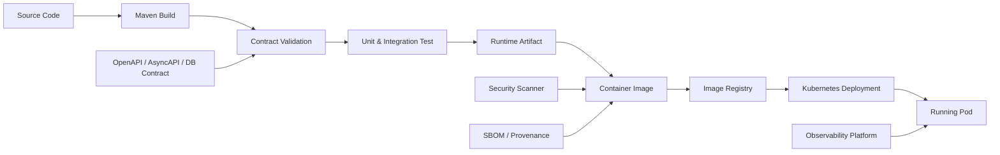
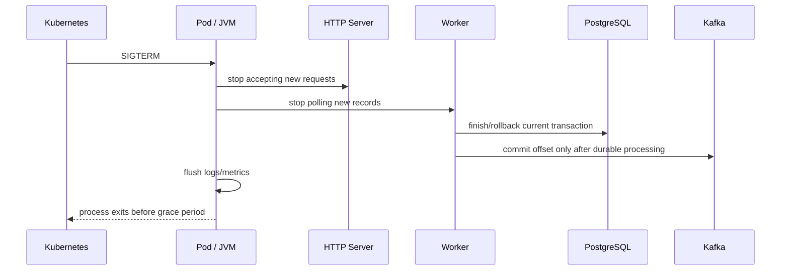
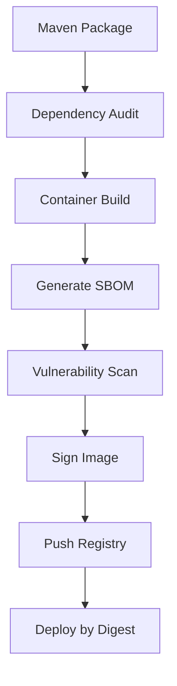

# Part 035 — Containerization and Runtime Image

Container image bukan artefak dekoratif. Dalam sistem produksi, image adalah **runtime contract** antara source code, build system, container runtime, Kubernetes, security scanner, observability stack, dan operator.

Jika image salah, aplikasi yang benar bisa tetap gagal:

- JVM salah membaca limit memory.
- proses Java tidak menerima sinyal shutdown dengan benar.
- `readiness` tetap hijau ketika dependency mati.
- log tidak keluar ke stdout/stderr.
- image terlalu besar sehingga rollout lambat.
- timezone/CA certificate tidak tersedia.
- aplikasi berjalan sebagai root.
- dependency runtime berbeda dari dependency build.
- container menyimpan state lokal yang hilang saat restart.

Di part ini kita tidak belajar “cara membuat Dockerfile basic”. Kita akan membangun cara berpikir container image untuk platform Java contract-first yang menjalankan HTTP API, Kafka publisher/consumer, integration worker, dan Camunda-facing service.

Target akhirnya: setiap service punya image yang **minimal, reproducible, observable, secure by default, graceful on shutdown, dan Kubernetes-aware**.

---

## 1. Posisi Container Image dalam Sistem

Di seri ini, image berada di antara Maven build dan Kubernetes workload.



Mental model yang penting:

> A container image is not the deployment. It is the immutable executable package consumed by the deployment system.

Artinya image harus menjawab pertanyaan:

1. **Apa yang dijalankan?** Jar, classpath, main class, config loader.
2. **Dengan runtime apa?** JRE/JDK, libc, CA cert, timezone, shell/no shell.
3. **Sebagai user siapa?** Root atau non-root.
4. **Bagaimana menerima konfigurasi?** Env var, mounted config, secret file.
5. **Bagaimana mati?** SIGTERM, graceful shutdown, drain, timeout.
6. **Bagaimana diamati?** stdout/stderr, metrics port, health endpoint.
7. **Bagaimana dibuktikan aman?** pinned base image, SBOM, vulnerability scan.
8. **Bagaimana dibuktikan konsisten?** digest, build metadata, reproducible build.

---

## 2. Runtime Shape untuk Platform Ini

Kita akan punya beberapa jenis Java process. Tidak semuanya harus memakai image yang sama, tetapi semuanya harus mengikuti contract yang sama.

| Runtime | Responsibility | Risiko utama |
|---|---|---|
| `case-api` | JAX-RS/Jersey HTTP API untuk command/query | request timeout, idempotency, graceful shutdown |
| `case-worker` | Kafka consumer, inbox processor, outbox publisher | duplicate event, offset mismatch, stuck batch |
| `case-process-adapter` | Integrasi domain event ke Camunda message/process | message correlation race, incident storm |
| `case-scheduler` | Backfill, reconciliation, stale lock recovery | double execution, unsafe batch |
| `migration-runner` | DB migration atau release check | destructive DDL, wrong environment |

Satu image bisa membawa satu aplikasi dengan beberapa mode runtime:

```bash
java -jar app.jar api
java -jar app.jar worker
java -jar app.jar process-adapter
java -jar app.jar scheduler
```

Tetapi untuk produksi, lebih aman memakai **one image, one process mode per Kubernetes workload**, bukan satu Pod yang menjalankan semua mode sekaligus.

Kenapa?

- scaling API berbeda dari scaling worker;
- resource profile berbeda;
- readiness berbeda;
- failure recovery berbeda;
- deployment rollback berbeda;
- alert ownership berbeda.

Prinsip:

> Share build pipeline when useful, separate runtime process when behavior differs.

---

## 3. Artifact Strategy: Fat Jar, Thin Jar, atau Distribution Directory?

Untuk Java service di Kubernetes, tiga bentuk umum:

| Bentuk | Kelebihan | Kekurangan | Cocok untuk |
|---|---|---|---|
| Fat jar | sederhana, satu file | layer cache buruk, ukuran besar, sulit inspeksi dependency | service kecil/sedang |
| Thin jar + lib dir | layer dependency stabil, startup jelas | entrypoint sedikit lebih kompleks | enterprise service |
| App distribution dir | bisa pisah bin/config/lib/contracts | butuh packaging discipline | platform multi-module |

Untuk seri ini kita gunakan **distribution directory**:

```text
/app
  /bin
    run.sh
  /lib
    case-api.jar
    dependency-a.jar
    dependency-b.jar
  /contracts
    openapi/case-api.yaml
    asyncapi/case-events.yaml
  /config
    application-default.yaml
  /meta
    build-info.properties
```

Alasannya:

- dependency layer bisa dicache;
- contract file ikut image untuk runtime introspection;
- build metadata tersedia untuk observability;
- config default bisa dibedakan dari config environment;
- easier debugging without repackaging everything.

Tetapi ada batas keras:

> Runtime config yang berbeda per environment tidak boleh dibake ke image.

Image harus sama untuk dev/staging/prod. Yang berbeda adalah deployment manifest dan secret/config.

---

## 4. Maven Packaging Layout

Misalkan module runtime kita:

```text
case-platform/
  pom.xml
  contracts/
  case-domain/
  case-db/
  case-api/
  case-worker/
  case-process-adapter/
  case-app-distribution/
```

Module `case-app-distribution` bertugas mengumpulkan artefak runtime.

Contoh ide POM, bukan copy-paste final:

```xml
<project>
  <artifactId>case-app-distribution</artifactId>
  <packaging>pom</packaging>

  <dependencies>
    <dependency>
      <groupId>com.example.case</groupId>
      <artifactId>case-api</artifactId>
      <version>${project.version}</version>
    </dependency>
    <dependency>
      <groupId>com.example.case</groupId>
      <artifactId>case-worker</artifactId>
      <version>${project.version}</version>
    </dependency>
  </dependencies>

  <build>
    <plugins>
      <plugin>
        <artifactId>maven-dependency-plugin</artifactId>
        <executions>
          <execution>
            <id>copy-runtime-dependencies</id>
            <phase>package</phase>
            <goals>
              <goal>copy-dependencies</goal>
            </goals>
            <configuration>
              <outputDirectory>${project.build.directory}/app/lib</outputDirectory>
              <includeScope>runtime</includeScope>
            </configuration>
          </execution>
        </executions>
      </plugin>
    </plugins>
  </build>
</project>
```

Dalam produksi, jangan biarkan Docker build menjalankan semua logic yang seharusnya diverifikasi Maven/CI. Docker build sebaiknya mengambil output Maven yang sudah lolos test/contract gate.

---

## 5. Dockerfile Production Baseline

Contoh baseline:

```dockerfile
# syntax=docker/dockerfile:1

FROM eclipse-temurin:17-jre AS runtime

ARG APP_VERSION=unknown
ARG GIT_COMMIT=unknown
ARG BUILD_TIME=unknown

LABEL org.opencontainers.image.title="case-platform"
LABEL org.opencontainers.image.version=$APP_VERSION
LABEL org.opencontainers.image.revision=$GIT_COMMIT
LABEL org.opencontainers.image.created=$BUILD_TIME

RUN groupadd --system app && useradd --system --gid app --home-dir /app app

WORKDIR /app

COPY --chown=app:app target/app/ /app/

RUN chmod +x /app/bin/run.sh

USER app

ENV JAVA_TOOL_OPTIONS=""
ENV APP_MODE="api"

EXPOSE 8080

ENTRYPOINT ["/app/bin/run.sh"]
```

Catatan desain:

- `ARG` dipakai untuk metadata build, bukan secret.
- `LABEL` mengikuti ide metadata OCI image.
- `USER app` memaksa non-root runtime.
- `JAVA_TOOL_OPTIONS` memberi jalur konfigurasi JVM dari deployment.
- `ENTRYPOINT` diarahkan ke script kecil yang mengatur mode runtime dan sinyal.
- `COPY --chown` menghindari file dimiliki root.

Jangan melakukan ini:

```dockerfile
ENV DB_PASSWORD=supersecret
ENV ENVIRONMENT=production
COPY application-prod.yaml /app/config/application.yaml
USER root
```

Itu mencampur image, secret, dan environment.

---

## 6. Multi-stage Build: Kapan Dipakai?

Ada dua pola.

### Pola A — Build di CI, Docker hanya package

```dockerfile
FROM eclipse-temurin:17-jre
WORKDIR /app
COPY target/app/ /app/
USER app
ENTRYPOINT ["/app/bin/run.sh"]
```

Kelebihan:

- CI Maven lifecycle jelas;
- test report mudah dikumpulkan;
- Docker layer lebih stabil;
- build dapat dipisah dari package.

### Pola B — Build di Docker multi-stage

```dockerfile
FROM maven:3.9-eclipse-temurin-17 AS build
WORKDIR /src
COPY pom.xml .
COPY .mvn .mvn
COPY contracts contracts
COPY case-domain case-domain
COPY case-api case-api
RUN mvn -B -DskipTests package

FROM eclipse-temurin:17-jre AS runtime
WORKDIR /app
COPY --from=build /src/case-app-distribution/target/app/ /app/
USER 10001
ENTRYPOINT ["/app/bin/run.sh"]
```

Kelebihan:

- builder environment lebih terkontrol;
- cocok untuk reproducible container build;
- lebih mudah di pipeline sederhana.

Kekurangan:

- test report dan cache Maven harus dikelola dengan hati-hati;
- context Docker bisa besar;
- secret untuk private repository harus aman via build secret, bukan ARG/ENV.

Untuk platform enterprise, saya lebih suka:

1. Maven build/test/contract gate berjalan eksplisit di CI.
2. Docker packaging mengambil distribution output.
3. Image scan dan SBOM setelah image dibuat.

---

## 7. Base Image Decision

Base image bukan detail kecil. Ia menentukan:

- JRE/JDK version;
- patch cadence;
- CA certificates;
- libc compatibility;
- CVE surface;
- shell availability;
- debugging ergonomics;
- image size.

Pilihan umum:

| Base | Kelebihan | Risiko |
|---|---|---|
| Full OS JDK | debugging mudah | terlalu besar, surface luas |
| JRE image | cukup untuk runtime | tidak punya tool compile/debug lengkap |
| Distroless | surface kecil | debugging lebih sulit |
| Alpine/musl | kecil | compatibility Java/native library perlu diuji |
| Custom jlink | sangat minimal | maintenance lebih kompleks |

Untuk sistem ini, baseline aman:

- gunakan JRE 17+ LTS yang dipatch rutin;
- pin major/minor policy di CI;
- gunakan image digest untuk production release;
- hindari image `latest`;
- pastikan CA cert dan timezone tersedia;
- jalankan vulnerability scan sebelum deploy.

Contoh pin digest:

```dockerfile
FROM eclipse-temurin:17-jre@sha256:<digest>
```

Trade-off: pin digest meningkatkan reproducibility, tetapi butuh automation untuk update security patch.

---

## 8. JVM dalam Container

Java modern sudah container-aware, tetapi production engineer tetap harus mengatur batasnya.

Masalah klasik:

- container memory limit 512Mi, JVM heap default terlalu agresif;
- off-heap, metaspace, thread stack, direct buffer, code cache tidak dihitung sebagai heap;
- Kafka client buffer memakai memory;
- Netty/Jersey/server runtime bisa memakai thread/byte buffer;
- PostgreSQL driver dan JSON serialization memakai allocation spike;
- Kubernetes OOMKill terjadi tanpa Java sempat melempar `OutOfMemoryError`.

Mental model:

```text
container memory limit
  = Java heap
  + metaspace
  + thread stacks
  + direct/off-heap buffers
  + JIT/code cache
  + native memory
  + libc/runtime overhead
  + file/page cache effects
```

Baseline JVM flags:

```bash
JAVA_TOOL_OPTIONS="
  -XX:MaxRAMPercentage=60
  -XX:InitialRAMPercentage=20
  -XX:+ExitOnOutOfMemoryError
  -XX:+HeapDumpOnOutOfMemoryError
  -XX:HeapDumpPath=/tmp/heapdump.hprof
  -Djava.security.egd=file:/dev/urandom
  -Duser.timezone=UTC
"
```

Catatan:

- `MaxRAMPercentage` jangan asal 80-90% untuk service dengan Kafka/HTTP concurrency tinggi.
- `ExitOnOutOfMemoryError` membuat process mati sehingga Kubernetes bisa restart.
- Heap dump ke `/tmp` berguna untuk investigasi, tetapi jangan diasumsikan survive restart.
- Untuk data sensitif, heap dump di produksi harus dikontrol ketat.
- Timezone runtime sebaiknya UTC; timezone display adalah concern presentation.

Untuk container kecil:

```bash
-XX:MaxRAMPercentage=50
-XX:ActiveProcessorCount=2
```

`ActiveProcessorCount` kadang berguna saat CPU quota/cgroup behavior membuat thread pool default terlalu agresif atau tidak sesuai ekspektasi. Namun jangan gunakan tanpa measurement.

---

## 9. CPU, Thread Pool, dan Container Quota

Aplikasi Java sering membuat thread berdasarkan jumlah processor yang terlihat.

Risiko:

- ForkJoinPool terlalu besar;
- HTTP worker thread terlalu banyak;
- Kafka consumer processing pool terlalu besar;
- DB connection pool terlalu besar;
- Camunda job executor terlalu agresif;
- pod diberi CPU limit rendah tapi thread pool seperti mesin besar.

Prinsip:

> CPU limit is not just an ops number. It changes safe concurrency.

Untuk setiap process mode, tentukan concurrency budget:

| Mode | Thread penting | Budget utama |
|---|---|---|
| API | HTTP worker, DB pool, async task | latency dan DB connection |
| Worker | Kafka poll thread, processing executor, DB pool | throughput dan duplicate safety |
| Outbox publisher | polling executor, Kafka producer IO | publish latency dan DB load |
| Process adapter | correlation executor, Camunda API thread | incident prevention |

Contoh config:

```yaml
runtime:
  http:
    maxThreads: 64
  db:
    maxPoolSize: 20
  kafka:
    consumerThreads: 4
  outbox:
    publisherThreads: 2
```

Jangan biarkan semua default framework menentukan concurrency sendiri.

---

## 10. Entrypoint yang Benar

`run.sh` harus kecil, eksplisit, dan sinyal-aware.

```bash
#!/usr/bin/env sh
set -eu

MODE="${APP_MODE:-api}"
APP_HOME="${APP_HOME:-/app}"

CLASSPATH="$APP_HOME/lib/*:$APP_HOME/config"
MAIN_CLASS="com.example.caseplatform.Main"

exec java \
  ${JAVA_TOOL_OPTIONS:-} \
  -Dapp.mode="$MODE" \
  -Dapp.home="$APP_HOME" \
  -cp "$CLASSPATH" \
  "$MAIN_CLASS"
```

Yang penting adalah `exec`.

Tanpa `exec`, shell menjadi PID 1 dan Java menjadi child process. Signal handling bisa menjadi tidak konsisten. Dengan `exec`, process Java menggantikan shell sehingga menerima SIGTERM secara langsung.

Anti-pattern:

```bash
java -jar app.jar
```

Ini tidak selalu fatal, tetapi sering membuat shutdown behavior kabur jika script juga menjalankan process lain.

---

## 11. PID 1 dan Signal Handling

Container process utama berjalan sebagai PID 1. PID 1 punya perilaku khusus dalam Linux terutama terkait signal dan zombie process.

Untuk Java service biasa:

- gunakan `exec java ...`;
- jangan menjalankan banyak process dalam satu container;
- jangan daemonize aplikasi;
- jangan pakai `tail -f` untuk membuat container tetap hidup;
- tangani shutdown hook di Java.

Contoh shutdown hook:

```java
public final class RuntimeShutdown {
  private final GracefulShutdownCoordinator coordinator;

  public RuntimeShutdown(GracefulShutdownCoordinator coordinator) {
    this.coordinator = coordinator;
  }

  public void install() {
    Runtime.getRuntime().addShutdownHook(new Thread(() -> {
      coordinator.beginShutdown();
      coordinator.awaitTermination();
    }, "shutdown-hook"));
  }
}
```

Tetapi jangan menaruh semua logic shutdown langsung di hook. Buat coordinator yang bisa dites.

---

## 12. Graceful Shutdown Contract

Kubernetes akan mengirim terminasi ke container saat rollout, scale-down, eviction, atau delete Pod. Aplikasi harus berhenti menerima pekerjaan baru dan menyelesaikan pekerjaan yang aman diselesaikan.

Runtime contract:



Untuk API:

1. mark readiness false;
2. stop accepting new HTTP requests;
3. let in-flight requests finish within timeout;
4. close DB pool;
5. exit.

Untuk Kafka worker:

1. stop poll loop;
2. finish current record/batch safely;
3. commit offset only after inbox/side effect durable;
4. close producer/consumer;
5. release DB locks;
6. exit.

Untuk outbox publisher:

1. stop claiming new events;
2. finish publish for claimed batch;
3. update outbox status;
4. release stale claims via normal recovery if killed.

Aplikasi harus tetap benar jika Kubernetes membunuh process setelah grace period. Graceful shutdown adalah optimization, bukan satu-satunya correctness mechanism.

---

## 13. Health Endpoint: Liveness vs Readiness vs Startup

Health endpoint harus punya semantik berbeda.

| Probe | Pertanyaan | Jawaban buruk jika salah desain |
|---|---|---|
| Startup | apakah aplikasi sudah selesai boot? | liveness membunuh app yang masih warm-up |
| Liveness | apakah process harus direstart? | restart loop saat DB sementara down |
| Readiness | apakah app boleh menerima traffic/work? | request masuk saat dependency belum siap |

Contoh endpoint:

```text
GET /internal/health/live
GET /internal/health/ready
GET /internal/health/startup
```

Liveness harus minimal:

```json
{
  "status": "UP",
  "checks": {
    "jvm": "UP",
    "mainLoop": "UP"
  }
}
```

Readiness lebih ketat:

```json
{
  "status": "DOWN",
  "checks": {
    "database": "UP",
    "kafkaProducer": "UP",
    "camundaApi": "DOWN",
    "configuration": "UP"
  }
}
```

Tetapi hati-hati: readiness untuk API dan worker tidak selalu sama.

API command endpoint mungkin butuh PostgreSQL. Kafka producer down mungkin membuat command tetap bisa menulis outbox, tetapi publisher yang akan gagal. Jadi readiness harus mencerminkan kemampuan Pod menerima **jenis pekerjaan runtime itu**, bukan semua dependency global.

---

## 14. Readiness untuk Worker

Worker tidak menerima HTTP traffic user, tetapi tetap butuh readiness sebagai sinyal operasional dan rollout.

Worker readiness bisa berarti:

- config valid;
- DB reachable;
- Kafka consumer connected atau dapat poll;
- tidak sedang dalam shutdown;
- backlog tidak melebihi threshold tertentu;
- migration version compatible.

Tetapi jangan membuat readiness worker false hanya karena ada satu poison message. Poison message harus masuk quarantine/DLQ, bukan membuat seluruh Pod tidak ready terus-menerus.

---

## 15. Filesystem Contract

Container filesystem harus dianggap ephemeral.

Boleh:

- temporary file di `/tmp`;
- heap dump sementara;
- generated local cache yang bisa hilang;
- mounted secret/config read-only.

Tidak boleh:

- menyimpan business state;
- menyimpan offset Kafka manual tanpa durable store;
- menyimpan upload evidence permanen;
- menyimpan audit log hanya sebagai file lokal;
- menulis config runtime hasil mutation.

Contract:

```text
/app        read-only application files
/tmp        writable temporary files
/var/log    not required; logs go stdout/stderr
/secrets    mounted read-only secrets
/config     mounted read-only external config
```

Di Kubernetes nanti, kita bisa menambahkan:

```yaml
securityContext:
  readOnlyRootFilesystem: true
```

Jika mengaktifkan ini, pastikan JVM dan framework tidak perlu menulis ke lokasi selain `/tmp` atau mounted writable volume.

---

## 16. Logging Contract

Containerized service harus log ke stdout/stderr.

Jangan log ke file lokal sebagai mekanisme utama.

Struktur log minimal:

```json
{
  "timestamp": "2026-07-03T10:15:30.123Z",
  "level": "INFO",
  "service": "case-api",
  "version": "1.8.3",
  "commit": "abc1234",
  "environment": "prod",
  "correlationId": "corr-...",
  "requestId": "req-...",
  "caseId": "case-...",
  "message": "Case intake accepted"
}
```

Untuk worker:

```json
{
  "level": "ERROR",
  "service": "case-worker",
  "topic": "case.lifecycle.events.v1",
  "partition": 3,
  "offset": 192881,
  "eventId": "evt-...",
  "caseId": "case-...",
  "errorCode": "CASE_EVENT_SCHEMA_UNSUPPORTED",
  "retryable": false
}
```

Jangan log:

- access token;
- password;
- full PII payload;
- raw evidence content;
- database URL dengan credential;
- secret env var.

---

## 17. Build Metadata Contract

Setiap image harus membawa metadata yang bisa ditampilkan di endpoint internal.

File:

```properties
# /app/meta/build-info.properties
service=case-platform
version=1.8.3
commit=abc1234
buildTime=2026-07-03T10:00:00Z
contractVersion=2026.07.03
openapiSha256=...
asyncapiSha256=...
databaseMigrationBaseline=202607030900
```

Endpoint:

```text
GET /internal/build-info
```

Response:

```json
{
  "service": "case-api",
  "version": "1.8.3",
  "commit": "abc1234",
  "contract": {
    "openapiSha256": "...",
    "asyncapiSha256": "...",
    "dbBaseline": "202607030900"
  }
}
```

Ini membantu saat incident:

- Pod mana menjalankan commit apa?
- Contract hash apa yang dipakai?
- Apakah pod lama dan baru overlap?
- Apakah event incompatible berasal dari versi tertentu?

---

## 18. Image Tagging Strategy

Jangan hanya memakai tag seperti:

```text
case-api:latest
case-api:prod
case-api:v1
```

Gunakan kombinasi:

```text
case-api:1.8.3
case-api:1.8.3-abc1234
case-api:sha-abc1234
```

Untuk manifest production, gunakan digest:

```yaml
image: registry.example.com/case-api@sha256:...
```

Tag bisa berubah. Digest tidak.

Namun developer workflow tetap boleh memakai tag manusiawi untuk navigasi.

---

## 19. SBOM dan Supply Chain

Untuk production-grade, image harus bisa dijawab:

- dependency apa saja di dalamnya?
- base image apa?
- CVE apa yang terdeteksi?
- lisensi dependency apa?
- siapa yang membangun?
- dari commit mana?
- contract hash apa?

SBOM bukan sekadar compliance checklist. Dalam incident security, SBOM mempercepat jawaban: “apakah kita terdampak library X versi Y?”

Minimal pipeline:



Policy yang masuk akal:

- critical CVE fail build kecuali ada documented exception;
- high CVE fail untuk reachable runtime dependency;
- base image harus dipatch berkala;
- exception punya expiry date;
- dependency upgrade diuji contract/integration test.

---

## 20. Security Context dari Perspektif Image

Beberapa security decision bisa dimulai dari image:

- non-root user;
- no package manager di runtime image jika tidak perlu;
- no compiler/toolchain di runtime image;
- file permission ketat;
- no embedded secret;
- no SSH server;
- no writable app directory;
- minimal shell.

Contoh runtime permission:

```bash
/app/bin/run.sh      executable by app
/app/lib            readable by app
/app/config         readable by app
/app/contracts      readable by app
/tmp                writable
```

Jangan membuat `/app` writable hanya karena framework ingin menulis cache. Atur cache ke `/tmp`.

---

## 21. Handling Secrets

Secret tidak boleh masuk image layer.

Kenapa?

- layer history bisa menyimpan secret meskipun file dihapus di layer berikutnya;
- image registry menyebarkan secret ke banyak environment;
- scanner dan operator bisa membaca image;
- rotasi secret memerlukan rebuild image.

Benar:

```text
Kubernetes Secret -> mounted file /secrets/db/password
Kubernetes Secret -> env var DB_PASSWORD, jika risiko acceptable
External secret operator -> short-lived mounted secret
```

Di Java, lebih baik config loader mendukung secret file:

```yaml
database:
  username: ${DB_USERNAME}
  passwordFile: /secrets/db/password
```

Daripada:

```yaml
database:
  password: ${DB_PASSWORD}
```

Env var mudah bocor lewat process inspection, dump, dan debug output. Banyak organisasi tetap menggunakannya karena sederhana, tetapi untuk secret sensitif file mount sering lebih baik.

---

## 22. Contract Files di Image

Karena pendekatan kita Data Contract First, image harus membawa contract version yang dipakai saat build.

```text
/app/contracts/openapi/case-command-api.yaml
/app/contracts/openapi/case-query-api.yaml
/app/contracts/asyncapi/case-events.yaml
/app/contracts/db/schema-contract.md
/app/contracts/bpmn/case-lifecycle.bpmn
```

Kegunaan:

- debugging runtime version;
- compatibility verification;
- generating docs from deployed artifact;
- comparing pod contract vs expected deployment contract;
- incident analysis saat event incompatible.

Tetapi jangan membuat runtime membaca contract YAML untuk setiap request. Contract file adalah metadata dan validation reference, bukan hot-path dependency kecuali memang desainnya membutuhkan runtime validation.

---

## 23. Time, Locale, dan Encoding

Set default eksplisit:

```bash
-Duser.timezone=UTC
-Dfile.encoding=UTF-8
-Duser.language=en
-Duser.country=US
```

Kenapa?

- audit timestamp harus konsisten;
- PostgreSQL `timestamptz` mapping harus predictable;
- JSON serialization tidak boleh berubah antar image;
- log dan error message tidak bergantung locale base image;
- batch window tidak kacau saat DST.

Domain rule:

> Store time in UTC. Render local time at the edge. Never use local timezone for invariant calculation unless the business rule explicitly says so.

Jika SLA berbasis hari kerja lokal, buat kalender domain eksplisit. Jangan bergantung pada default timezone process.

---

## 24. CA Certificates dan TLS

Service ini akan bicara ke:

- PostgreSQL TLS endpoint;
- Kafka broker TLS/SASL;
- Camunda REST endpoint;
- external regulatory registry;
- internal API.

Runtime image harus punya CA certificate yang benar.

Options:

1. pakai CA bundle dari base image;
2. tambahkan corporate CA ke truststore;
3. mount truststore via Kubernetes Secret/ConfigMap;
4. gunakan JVM truststore custom.

Contoh JVM flag:

```bash
-Djavax.net.ssl.trustStore=/secrets/tls/truststore.p12
-Djavax.net.ssl.trustStorePasswordFile=/secrets/tls/truststore-password
```

Java standard property tidak otomatis mendukung `PasswordFile`, jadi aplikasi/entrypoint harus mengubah file menjadi property secara aman, atau gunakan mekanisme framework yang mendukung secret file. Jangan log password truststore.

---

## 25. Network Assumptions

Container image tidak tahu IP production. Ia harus menerima semua endpoint via config:

```yaml
database:
  jdbcUrl: ${DATABASE_JDBC_URL}
kafka:
  bootstrapServers: ${KAFKA_BOOTSTRAP_SERVERS}
camunda:
  baseUrl: ${CAMUNDA_BASE_URL}
```

Jangan hardcode:

```java
String url = "jdbc:postgresql://postgres:5432/case";
```

Bahkan service name Kubernetes pun environment-specific contract. Untuk local development boleh default, tetapi production harus override.

---

## 26. Startup Order Is Not a Correctness Mechanism

Di Kubernetes, jangan mengandalkan “PostgreSQL start dulu, lalu app start”.

Aplikasi harus:

- retry dependency connection dengan backoff saat startup;
- expose startup probe agar tidak dibunuh terlalu cepat;
- fail fast untuk config invalid;
- fail readiness untuk dependency mandatory down;
- degrade safely jika dependency optional down.

Contoh:

```text
Config invalid          -> fail fast, exit
DB unreachable startup  -> retry bounded, then not ready / exit depending mode
Kafka unavailable API   -> maybe ready if outbox-only command can work
Kafka unavailable worker-> not ready, keep retrying
Camunda down adapter    -> not ready or degraded depending queue durability
```

---

## 27. Runtime Modes

Single main class bisa memilih mode:

```java
public final class Main {
  public static void main(String[] args) {
    var mode = System.getProperty("app.mode", System.getenv().getOrDefault("APP_MODE", "api"));
    switch (mode) {
      case "api" -> ApiRuntime.start();
      case "worker" -> WorkerRuntime.start();
      case "process-adapter" -> ProcessAdapterRuntime.start();
      case "scheduler" -> SchedulerRuntime.start();
      default -> throw new IllegalArgumentException("Unsupported app.mode: " + mode);
    }
  }
}
```

Tetapi mode harus punya config validation berbeda.

API tidak perlu consumer group config. Worker tidak perlu CORS config. Scheduler tidak perlu public HTTP resource selain health/metrics.

---

## 28. Example `run.sh` dengan Mode dan Secret File

```bash
#!/usr/bin/env sh
set -eu

APP_HOME="${APP_HOME:-/app}"
MODE="${APP_MODE:-api}"

if [ -n "${DB_PASSWORD_FILE:-}" ]; then
  if [ ! -r "$DB_PASSWORD_FILE" ]; then
    echo "DB_PASSWORD_FILE is not readable" >&2
    exit 78
  fi
  DB_PASSWORD="$(cat "$DB_PASSWORD_FILE")"
  export DB_PASSWORD
fi

exec java \
  ${JAVA_TOOL_OPTIONS:-} \
  -Dapp.mode="$MODE" \
  -Dapp.home="$APP_HOME" \
  -cp "$APP_HOME/lib/*:$APP_HOME/config" \
  com.example.caseplatform.Main
```

Exit code `78` sering dipakai sebagai config error convention, tetapi yang penting adalah konsisten.

---

## 29. Image Build Context Discipline

`.dockerignore` wajib.

Contoh:

```text
.git
.idea
.vscode
node_modules
target
**/target
*.iml
.env
*.log
*.hprof
secrets
local-data
```

Jika Dockerfile menyalin `target/app`, maka build context sebaiknya minimal:

```text
Dockerfile
case-app-distribution/target/app
```

Build context yang besar:

- memperlambat CI;
- berisiko membawa secret lokal;
- membuat cache invalidation buruk;
- membuat debugging image lebih sulit.

---

## 30. Container Image Testing

Jangan hanya test Java sebelum image. Test image juga.

Minimal smoke test:

```bash
docker run --rm \
  -e APP_MODE=api \
  -e DATABASE_JDBC_URL=jdbc:postgresql://invalid \
  registry.example.com/case-api:sha-abc1234 \
  --version
```

Lebih baik:

```bash
docker run --rm -p 8080:8080 \
  --network test-network \
  -e APP_MODE=api \
  -e DATABASE_JDBC_URL=jdbc:postgresql://postgres:5432/case \
  registry.example.com/case-api:sha-abc1234
```

Lalu cek:

```bash
curl -f http://localhost:8080/internal/health/live
curl -f http://localhost:8080/internal/build-info
```

Test yang harus ada:

| Test | Tujuan |
|---|---|
| image starts | entrypoint benar |
| non-root | user runtime bukan root |
| build-info exists | metadata tersedia |
| health live | process jalan |
| readiness with dependency | dependency check benar |
| SIGTERM test | graceful shutdown benar |
| no secret in image | layer tidak mengandung secret |
| vulnerability scan | CVE policy |

---

## 31. SIGTERM Test

Contoh test manual:

```bash
CID=$(docker run -d registry.example.com/case-api:sha-abc1234)
sleep 5
docker stop --time 30 "$CID"
docker inspect "$CID" --format '{{.State.ExitCode}}'
```

Expected:

- menerima SIGTERM;
- log menunjukkan shutdown started;
- stop accepting new work;
- exit sebelum timeout;
- exit code normal.

Untuk worker, buat test dengan Kafka topic dan record sedang diproses:

1. publish event;
2. worker mulai proses;
3. kirim SIGTERM;
4. pastikan event tidak hilang;
5. jika belum commit, event diproses ulang;
6. inbox idempotency mencegah duplicate side effect.

---

## 32. Runtime Image untuk Migration Runner

Migration runner berbeda dari API.

Karakteristik:

- job sekali jalan;
- butuh DB credential dengan privilege khusus;
- tidak butuh HTTP port;
- harus fail loud;
- harus punya lock agar tidak jalan paralel;
- harus mencatat migration version.

Bisa memakai image yang sama dengan mode berbeda:

```yaml
APP_MODE=migration
```

Tetapi di Kubernetes, jalankan sebagai `Job`, bukan `Deployment`.

Anti-pattern:

- migration dijalankan otomatis setiap API pod start;
- semua pod berlomba menjalankan migration;
- migration pakai credential aplikasi normal;
- migration destructive tanpa compatibility window.

Migration sudah dibahas di Part 025. Di sini intinya: image boleh sama, workload harus berbeda.

---

## 33. Local Development Image vs Production Image

Boleh punya dev image, tetapi jangan confuse dengan prod image.

| Aspek | Dev | Prod |
|---|---|---|
| hot reload | boleh | tidak |
| debug port | boleh | sangat terbatas |
| shell/tools | boleh | minimal |
| mounted source | boleh | tidak |
| secret local | boleh dummy | real secret mounted |
| image tag | local | digest/versioned |

Jangan deploy dev image ke staging karena “lebih gampang debug”. Itu membuat staging tidak merepresentasikan production.

---

## 34. Debugging Tanpa Membesarkan Image

Jika memakai image minimal, debugging bisa dilakukan lewat:

- logs;
- metrics;
- traces;
- health/build-info endpoint;
- ephemeral debug container di Kubernetes;
- heap/thread dump endpoint internal yang protected;
- temporary debug image hanya untuk incident tertentu.

Jangan memasukkan semua debugging tools ke runtime image production hanya karena takut incident. Observability harus menjadi mekanisme utama, bukan SSH ke container.

---

## 35. Example Runtime Directory

```text
/app
├── bin
│   └── run.sh
├── config
│   └── application-default.yaml
├── contracts
│   ├── asyncapi
│   │   └── case-events.yaml
│   ├── bpmn
│   │   └── case-lifecycle.bpmn
│   └── openapi
│       └── case-command-api.yaml
├── lib
│   ├── case-api-1.8.3.jar
│   ├── case-domain-1.8.3.jar
│   ├── case-db-1.8.3.jar
│   ├── jersey-server.jar
│   ├── kafka-clients.jar
│   ├── mybatis.jar
│   └── postgresql.jar
└── meta
    └── build-info.properties
```

File ini bukan random. Ia mencerminkan boundary:

- `/bin`: cara menjalankan;
- `/config`: default config;
- `/contracts`: kontrak build;
- `/lib`: executable code;
- `/meta`: identity runtime.

---

## 36. Example Dockerfile Final

```dockerfile
# syntax=docker/dockerfile:1

FROM eclipse-temurin:17-jre AS runtime

ARG APP_VERSION=unknown
ARG GIT_COMMIT=unknown
ARG BUILD_TIME=unknown
ARG CONTRACT_VERSION=unknown

LABEL org.opencontainers.image.title="case-platform"
LABEL org.opencontainers.image.description="Contract-first Java orchestration platform runtime"
LABEL org.opencontainers.image.version=$APP_VERSION
LABEL org.opencontainers.image.revision=$GIT_COMMIT
LABEL org.opencontainers.image.created=$BUILD_TIME

RUN groupadd --system --gid 10001 app \
 && useradd --system --uid 10001 --gid app --home-dir /app --shell /usr/sbin/nologin app

WORKDIR /app

COPY --chown=app:app case-app-distribution/target/app/ /app/

RUN chmod 0555 /app/bin/run.sh \
 && find /app -type d -exec chmod 0555 {} \; \
 && find /app -type f -exec chmod 0444 {} \; \
 && chmod 0555 /app/bin/run.sh

USER 10001:10001

ENV APP_HOME=/app
ENV APP_MODE=api
ENV JAVA_TOOL_OPTIONS="-Dfile.encoding=UTF-8 -Duser.timezone=UTC"

EXPOSE 8080

ENTRYPOINT ["/app/bin/run.sh"]
```

Jika `readOnlyRootFilesystem: true`, pastikan process masih bisa menulis ke `/tmp`. Di Kubernetes, mount `emptyDir` untuk `/tmp` jika perlu.

---

## 37. Failure Model

| Failure | Penyebab umum | Desain mitigasi |
|---|---|---|
| OOMKilled | heap/off-heap melebihi limit | MaxRAMPercentage, memory testing, metrics |
| CrashLoopBackOff | config invalid/dependency down | fail-fast config, startup/readiness distinction |
| Pod stuck terminating | shutdown hook hang | bounded shutdown, thread dump, grace period |
| duplicate event | worker killed after side effect before offset commit | inbox idempotency |
| lost event | DB commit success, Kafka publish failed | outbox pattern |
| slow rollout | image terlalu besar | smaller runtime, layer cache, no build tools |
| CVE exposure | stale base image/dependency | scan, patch cadence, SBOM |
| secret leak | secret baked into layer/env log | mounted secret, no secret in build args |
| timezone bug | local timezone default | UTC runtime, explicit domain calendar |
| header/log PII leak | raw request logging | structured redacted logging |

---

## 38. Production Checklist

Sebelum image dianggap production-ready:

- [ ] base image pinned dan patch policy jelas;
- [ ] runtime berjalan non-root;
- [ ] tidak ada secret di image layer;
- [ ] image membawa build metadata;
- [ ] contract files ikut image sebagai metadata;
- [ ] entrypoint memakai `exec`;
- [ ] health endpoint tersedia;
- [ ] SIGTERM diuji;
- [ ] JVM memory flags disetel untuk container limit;
- [ ] logs ke stdout/stderr;
- [ ] timezone/encoding eksplisit;
- [ ] CA/truststore strategy jelas;
- [ ] no mutable business state di filesystem;
- [ ] vulnerability scan lulus;
- [ ] SBOM dibuat;
- [ ] image bisa dijalankan local smoke test;
- [ ] deployment memakai digest, bukan `latest`.

---

## 39. Anti-pattern

### Anti-pattern 1 — “Container itu VM kecil”

Akibat:

- menjalankan banyak process;
- install sshd;
- log ke file;
- menyimpan state lokal;
- patch manual di dalam container.

Container harus immutable process package, bukan server mini.

### Anti-pattern 2 — “JVM default pasti aman di container”

Java modern lebih baik, tetapi memory profile tetap harus dihitung. Kafka buffer, thread stack, direct memory, JSON serialization spike, dan metaspace tetap nyata.

### Anti-pattern 3 — “Readiness sama dengan liveness”

Jika DB down lalu liveness false, Kubernetes akan restart semua Pod. Restart tidak memperbaiki DB down; malah membuat storm.

### Anti-pattern 4 — “Satu image prod berisi semua debug tools”

Debuggability penting, tetapi production surface juga penting. Pakai observability, ephemeral debug, dan protected diagnostic endpoints.

### Anti-pattern 5 — “Migration jalan saat app start”

Ini membuat setiap replica menjadi migrator. Migration harus release-controlled, locked, audited, dan biasanya dijalankan sebagai job/step terpisah.

---

## 40. Mental Model Final

Containerization yang matang bukan tentang membuat `docker build` berhasil. Ia tentang membuat artifact runtime yang punya invariant:

```text
same image + different config = different environment behavior
same image + same config = repeatable runtime behavior
same signal = predictable shutdown
same resource limit = predictable concurrency envelope
same contract hash = predictable API/event/schema behavior
```

Kalimat yang harus diingat:

> A production Java container image is a sealed operational contract: code, runtime, metadata, security posture, startup behavior, shutdown behavior, and observability surface.

Part berikutnya akan memakai image ini sebagai input ke Kubernetes Deployment, Service, probes, resource requests/limits, rollout, disruption budget, topology spread, ConfigMap, Secret, dan workload-level runtime policy.

---

## Referensi Primer

- Docker documentation — Build best practices and multi-stage builds: `https://docs.docker.com/build/building/best-practices/`
- Kubernetes documentation — Pod lifecycle and probes: `https://kubernetes.io/docs/concepts/workloads/pods/pod-lifecycle/`
- Kubernetes documentation — Configure liveness, readiness, and startup probes: `https://kubernetes.io/docs/tasks/configure-pod-container/configure-liveness-readiness-startup-probes/`
- Kubernetes documentation — Secrets and ConfigMaps: `https://kubernetes.io/docs/concepts/configuration/secret/`, `https://kubernetes.io/docs/concepts/configuration/configmap/`
- OpenJDK / JDK container awareness notes and release notes: `https://openjdk.org/`, `https://www.oracle.com/java/technologies/javase/17all-relnotes.html`
