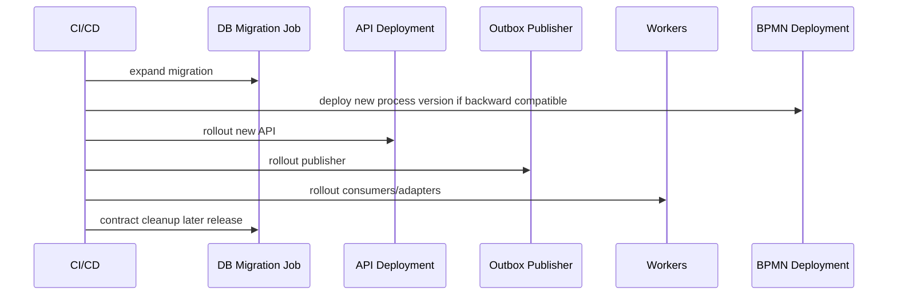
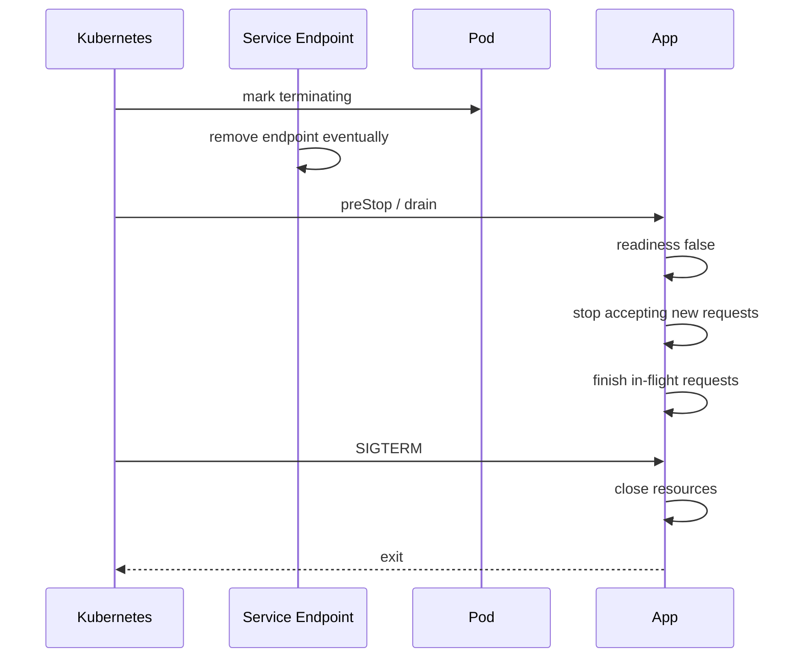

# Part 036 — Kubernetes Workload Design

Part sebelumnya membuat container image sebagai sealed runtime contract. Part ini menjawab pertanyaan berikutnya:

> Bagaimana menjalankan image itu di Kubernetes tanpa menjadikan Kubernetes sebagai tempat menumpuk YAML acak?

Kubernetes workload design adalah desain **operational behavior**. Ia menentukan bagaimana service di-schedule, diberi resource, dinyalakan, dimatikan, di-restart, di-scale, di-rollout, diamankan, dan diamati.

Di sistem contract-first ini, workload bukan hanya “Deployment untuk Java API”. Kita punya beberapa runtime:

- HTTP API dengan JAX-RS/Jersey;
- Kafka consumer;
- outbox publisher;
- process adapter untuk Camunda 7;
- reconciliation scheduler;
- migration job.

Setiap workload punya lifecycle berbeda. Memaksa semuanya memakai manifest yang sama adalah sumber failure produksi.

---

## 1. Kubernetes sebagai Runtime Control Plane

Kubernetes memberi primitives:

- Pod;
- Deployment;
- ReplicaSet;
- Service;
- ConfigMap;
- Secret;
- Job/CronJob;
- Probe;
- Resource request/limit;
- HorizontalPodAutoscaler;
- PodDisruptionBudget;
- NetworkPolicy;
- ServiceAccount;
- SecurityContext;
- Ingress;
- topology spread;
- rollout/rollback.

Tetapi primitive bukan arsitektur.

Arsitektur lahir saat kita memutuskan:

1. workload mana stateless;
2. workload mana queue-driven;
3. workload mana singleton;
4. workload mana safe untuk parallel execution;
5. readiness berarti apa;
6. scaling metric apa;
7. dependency outage harus membuat Pod restart atau tidak;
8. rollout boleh overlap versi lama/baru atau tidak;
9. secret/config berubah harus memicu restart atau tidak.

---

## 2. Workload Taxonomy untuk Platform Ini

```mermaid
flowchart TD
  subgraph Edge
    NGINX[NGINX / Ingress]
  end

  subgraph API
    API[case-api Deployment]
  end

  subgraph Workers
    OUTBOX[case-outbox-publisher Deployment]
    INBOX[case-event-consumer Deployment]
    ADAPTER[case-process-adapter Deployment]
    SCHED[case-reconciliation CronJob]
  end

  subgraph Data
    PG[(PostgreSQL)]
    KF[(Kafka)]
    CAM[(Camunda 7 Engine DB/API)]
  end

  NGINX --> API
  API --> PG
  API --> OUTBOX
  OUTBOX --> PG
  OUTBOX --> KF
  KF --> INBOX
  INBOX --> PG
  KF --> ADAPTER
  ADAPTER --> CAM
  ADAPTER --> PG
  SCHED --> PG
```

| Workload | Kubernetes kind | Scaling | Readiness basis | Shutdown priority |
|---|---|---|---|---|
| `case-api` | Deployment | request rate/latency | HTTP server + DB + config | drain HTTP requests |
| `case-outbox-publisher` | Deployment | outbox lag | DB + Kafka producer + not shutting down | finish claimed batch |
| `case-event-consumer` | Deployment | Kafka lag/processing latency | Kafka + DB + compatible schema | stop poll, finish current records |
| `case-process-adapter` | Deployment | correlation backlog | Kafka/DB/Camunda availability | avoid duplicate correlation |
| `case-reconciliation` | CronJob | schedule | DB migration version | bounded batch |
| `case-migration` | Job | one-shot | N/A | fail loud |

Prinsip:

> Use different Kubernetes workloads when the runtime lifecycle is different.

---

## 3. Namespace Boundary

Untuk platform regulatory case, minimal namespace separation:

```text
case-dev
case-test
case-staging
case-prod
```

Atau per domain:

```text
enforcement-prod
shared-observability
shared-ingress
shared-data
```

Yang penting: namespace bukan security boundary sempurna, tetapi ia adalah boundary operasional untuk:

- RBAC;
- resource quota;
- network policy;
- secret scope;
- deployment ownership;
- observability filter;
- blast radius.

Contoh Namespace:

```yaml
apiVersion: v1
kind: Namespace
metadata:
  name: enforcement-prod
  labels:
    app.kubernetes.io/part-of: case-platform
    environment: prod
```

---

## 4. Label dan Annotation Contract

Label bukan kosmetik. Label dipakai oleh selector, dashboards, alerts, cost allocation, policy, dan deployment tools.

Baseline labels:

```yaml
labels:
  app.kubernetes.io/name: case-api
  app.kubernetes.io/instance: case-api-prod
  app.kubernetes.io/component: api
  app.kubernetes.io/part-of: case-platform
  app.kubernetes.io/version: "1.8.3"
  app.kubernetes.io/managed-by: gitops
  environment: prod
```

Jangan ubah label selector sembarangan. Selector Deployment/Service adalah contract. Perubahan yang salah bisa membuat Service mengarah ke Pod yang salah atau Deployment kehilangan ownership.

Annotation untuk metadata:

```yaml
annotations:
  contracts.example.com/openapi-sha256: "..."
  contracts.example.com/asyncapi-sha256: "..."
  build.example.com/git-commit: "abc1234"
```

---

## 5. Deployment untuk HTTP API

Contoh baseline `case-api`:

```yaml
apiVersion: apps/v1
kind: Deployment
metadata:
  name: case-api
  namespace: enforcement-prod
  labels:
    app.kubernetes.io/name: case-api
    app.kubernetes.io/component: api
    app.kubernetes.io/part-of: case-platform
spec:
  replicas: 4
  revisionHistoryLimit: 5
  strategy:
    type: RollingUpdate
    rollingUpdate:
      maxUnavailable: 0
      maxSurge: 1
  selector:
    matchLabels:
      app.kubernetes.io/name: case-api
      app.kubernetes.io/component: api
  template:
    metadata:
      labels:
        app.kubernetes.io/name: case-api
        app.kubernetes.io/component: api
        app.kubernetes.io/part-of: case-platform
    spec:
      serviceAccountName: case-api
      terminationGracePeriodSeconds: 45
      containers:
        - name: case-api
          image: registry.example.com/case-api@sha256:REPLACE_ME
          imagePullPolicy: IfNotPresent
          ports:
            - name: http
              containerPort: 8080
          env:
            - name: APP_MODE
              value: api
            - name: JAVA_TOOL_OPTIONS
              value: >-
                -XX:MaxRAMPercentage=60
                -XX:InitialRAMPercentage=20
                -XX:+ExitOnOutOfMemoryError
                -Dfile.encoding=UTF-8
                -Duser.timezone=UTC
          envFrom:
            - configMapRef:
                name: case-api-config
          volumeMounts:
            - name: db-secret
              mountPath: /secrets/db
              readOnly: true
            - name: tmp
              mountPath: /tmp
          startupProbe:
            httpGet:
              path: /internal/health/startup
              port: http
            failureThreshold: 30
            periodSeconds: 2
          livenessProbe:
            httpGet:
              path: /internal/health/live
              port: http
            periodSeconds: 10
            timeoutSeconds: 2
            failureThreshold: 3
          readinessProbe:
            httpGet:
              path: /internal/health/ready
              port: http
            periodSeconds: 5
            timeoutSeconds: 2
            failureThreshold: 2
          resources:
            requests:
              cpu: "500m"
              memory: "768Mi"
            limits:
              cpu: "2"
              memory: "1536Mi"
          securityContext:
            allowPrivilegeEscalation: false
            readOnlyRootFilesystem: true
            runAsNonRoot: true
            runAsUser: 10001
            runAsGroup: 10001
            capabilities:
              drop: ["ALL"]
      volumes:
        - name: db-secret
          secret:
            secretName: case-api-db-secret
        - name: tmp
          emptyDir: {}
```

Important decision:

- `maxUnavailable: 0` menjaga kapasitas API saat rolling update;
- startup probe melindungi app dari liveness kill saat warm-up;
- liveness tidak harus cek DB;
- readiness cek kemampuan menerima traffic;
- root filesystem read-only;
- `/tmp` writable explicitly;
- image by digest.

---

## 6. Service untuk API

```yaml
apiVersion: v1
kind: Service
metadata:
  name: case-api
  namespace: enforcement-prod
  labels:
    app.kubernetes.io/name: case-api
spec:
  type: ClusterIP
  selector:
    app.kubernetes.io/name: case-api
    app.kubernetes.io/component: api
  ports:
    - name: http
      port: 80
      targetPort: http
```

Service adalah stable virtual endpoint untuk Pod yang ephemeral.

Jangan expose Pod IP langsung.

Service selector harus match label Deployment. Jika label salah, Service tidak punya endpoint meskipun Pod running.

---

## 7. ConfigMap Contract

ConfigMap untuk non-secret config.

```yaml
apiVersion: v1
kind: ConfigMap
metadata:
  name: case-api-config
  namespace: enforcement-prod
data:
  APP_ENVIRONMENT: prod
  HTTP_REQUEST_TIMEOUT_MS: "25000"
  DATABASE_JDBC_URL: "jdbc:postgresql://postgresql.prod.svc:5432/case"
  KAFKA_BOOTSTRAP_SERVERS: "kafka-bootstrap.kafka.svc:9092"
  CAMUNDA_BASE_URL: "http://camunda.camunda.svc:8080/engine-rest"
  DB_PASSWORD_FILE: "/secrets/db/password"
```

ConfigMap bukan tempat password.

ConfigMap update tidak selalu otomatis membuat aplikasi reload. Jika config perlu immutable per deploy, gunakan checksum annotation untuk memicu rollout:

```yaml
metadata:
  annotations:
    checksum/config: "sha256-of-configmap"
```

Dalam GitOps/Helm/Kustomize, checksum biasanya dihitung dari rendered config.

---

## 8. Secret Contract

```yaml
apiVersion: v1
kind: Secret
metadata:
  name: case-api-db-secret
  namespace: enforcement-prod
type: Opaque
stringData:
  username: case_app
  password: REPLACE_BY_SECRET_MANAGER
```

Mount sebagai file:

```yaml
volumes:
  - name: db-secret
    secret:
      secretName: case-api-db-secret
      defaultMode: 0440
```

Atau env var:

```yaml
- name: DB_PASSWORD
  valueFrom:
    secretKeyRef:
      name: case-api-db-secret
      key: password
```

Untuk secret sensitif, mounted file sering lebih baik daripada env var. Namun operational tooling organisasi bisa menentukan standar berbeda.

Yang tidak boleh:

- secret di ConfigMap;
- secret di image;
- secret di annotation;
- secret di log;
- secret di command args.

---

## 9. Resource Requests and Limits

Resource request memengaruhi scheduling. Limit memengaruhi runtime enforcement.

Untuk Java API:

```yaml
resources:
  requests:
    cpu: "500m"
    memory: "768Mi"
  limits:
    cpu: "2"
    memory: "1536Mi"
```

Rules:

- memory limit harus sesuai JVM memory strategy;
- CPU request harus cukup untuk latency target;
- CPU limit bisa menyebabkan throttling;
- DB pool size harus konsisten dengan replica count;
- Kafka consumer count harus konsisten dengan partition count.

Contoh DB connection budget:

```text
PostgreSQL max app connections: 200
reserved admin/maintenance: 40
usable: 160
case-api replicas: 4, pool 20 = 80
case-worker replicas: 4, pool 10 = 40
outbox publisher replicas: 2, pool 10 = 20
process adapter replicas: 2, pool 5 = 10
remaining buffer: 10
```

Jika HPA bisa menaikkan replicas, budget harus menghitung max replicas, bukan current replicas.

---

## 10. Probe Design

### Startup Probe

Untuk aplikasi Java yang boot lambat karena classloading, schema check, warm-up, atau dependency handshake:

```yaml
startupProbe:
  httpGet:
    path: /internal/health/startup
    port: http
  failureThreshold: 30
  periodSeconds: 2
```

Ini memberi 60 detik sebelum Kubernetes menganggap startup gagal.

### Liveness Probe

```yaml
livenessProbe:
  httpGet:
    path: /internal/health/live
    port: http
  periodSeconds: 10
  timeoutSeconds: 2
  failureThreshold: 3
```

Liveness menjawab: apakah restart process kemungkinan memperbaiki masalah?

DB down biasanya tidak boleh membuat liveness fail. Restart app tidak memperbaiki DB down.

### Readiness Probe

```yaml
readinessProbe:
  httpGet:
    path: /internal/health/ready
    port: http
  periodSeconds: 5
  timeoutSeconds: 2
  failureThreshold: 2
```

Readiness menjawab: bolehkah traffic/work baru dikirim ke Pod ini?

---

## 11. Worker Deployment

Worker tidak perlu Service publik, tetapi tetap butuh health port internal.

```yaml
apiVersion: apps/v1
kind: Deployment
metadata:
  name: case-event-consumer
  namespace: enforcement-prod
spec:
  replicas: 3
  strategy:
    type: RollingUpdate
    rollingUpdate:
      maxUnavailable: 1
      maxSurge: 1
  selector:
    matchLabels:
      app.kubernetes.io/name: case-event-consumer
      app.kubernetes.io/component: worker
  template:
    metadata:
      labels:
        app.kubernetes.io/name: case-event-consumer
        app.kubernetes.io/component: worker
        app.kubernetes.io/part-of: case-platform
    spec:
      serviceAccountName: case-worker
      terminationGracePeriodSeconds: 90
      containers:
        - name: worker
          image: registry.example.com/case-api@sha256:REPLACE_ME
          ports:
            - name: http
              containerPort: 8080
          env:
            - name: APP_MODE
              value: worker
            - name: JAVA_TOOL_OPTIONS
              value: >-
                -XX:MaxRAMPercentage=55
                -XX:+ExitOnOutOfMemoryError
                -Dfile.encoding=UTF-8
                -Duser.timezone=UTC
          envFrom:
            - configMapRef:
                name: case-worker-config
          volumeMounts:
            - name: db-secret
              mountPath: /secrets/db
              readOnly: true
            - name: tmp
              mountPath: /tmp
          livenessProbe:
            httpGet:
              path: /internal/health/live
              port: http
          readinessProbe:
            httpGet:
              path: /internal/health/ready
              port: http
          resources:
            requests:
              cpu: "500m"
              memory: "1024Mi"
            limits:
              cpu: "2"
              memory: "2Gi"
      volumes:
        - name: db-secret
          secret:
            secretName: case-worker-db-secret
        - name: tmp
          emptyDir: {}
```

Worker termination grace lebih lama karena harus menyelesaikan record/batch aman.

---

## 12. Kafka Consumer Scaling

Kafka consumer scaling tidak sama dengan HTTP scaling.

Consumer group parallelism dibatasi oleh partition count per topic.

Jika topic punya 12 partition:

- 1 replica bisa consume semua 12;
- 3 replicas bisa masing-masing sekitar 4 partition;
- 12 replicas bisa masing-masing 1 partition;
- 20 replicas berarti 8 replicas idle untuk topic itu.

Jadi HPA worker harus hati-hati.

Metric yang lebih relevan:

- consumer lag;
- lag age;
- processing latency;
- error rate;
- retry queue depth;
- inbox backlog;
- DB saturation.

Jangan scale worker hanya berdasarkan CPU. Banyak worker bottleneck di DB lock, Kafka partition, atau external Camunda API.

---

## 13. Outbox Publisher Deployment

Outbox publisher membaca table outbox dan publish ke Kafka.

```yaml
apiVersion: apps/v1
kind: Deployment
metadata:
  name: case-outbox-publisher
  namespace: enforcement-prod
spec:
  replicas: 2
  selector:
    matchLabels:
      app.kubernetes.io/name: case-outbox-publisher
  template:
    metadata:
      labels:
        app.kubernetes.io/name: case-outbox-publisher
        app.kubernetes.io/component: publisher
    spec:
      terminationGracePeriodSeconds: 90
      containers:
        - name: publisher
          image: registry.example.com/case-api@sha256:REPLACE_ME
          env:
            - name: APP_MODE
              value: outbox-publisher
          envFrom:
            - configMapRef:
                name: case-outbox-config
          resources:
            requests:
              cpu: "250m"
              memory: "512Mi"
            limits:
              cpu: "1"
              memory: "1024Mi"
```

Karena Part 032 memakai `FOR UPDATE SKIP LOCKED`, beberapa replica publisher bisa berjalan paralel. Tetapi concurrency harus tetap dibatasi agar tidak membanjiri Kafka atau DB.

Config:

```yaml
OUTBOX_BATCH_SIZE: "100"
OUTBOX_POLL_INTERVAL_MS: "500"
OUTBOX_MAX_IN_FLIGHT_BATCHES: "2"
OUTBOX_STALE_CLAIM_AFTER_SECONDS: "300"
```

---

## 14. Process Adapter Deployment

Process adapter menghubungkan Kafka/domain command dengan Camunda 7.

Risiko utama:

- duplicate correlation;
- no matching execution;
- multiple matching executions;
- Camunda API slow;
- incident storm;
- process version mismatch.

Kubernetes design:

```yaml
apiVersion: apps/v1
kind: Deployment
metadata:
  name: case-process-adapter
spec:
  replicas: 2
  selector:
    matchLabels:
      app.kubernetes.io/name: case-process-adapter
  template:
    metadata:
      labels:
        app.kubernetes.io/name: case-process-adapter
        app.kubernetes.io/component: process-adapter
    spec:
      terminationGracePeriodSeconds: 90
      containers:
        - name: adapter
          image: registry.example.com/case-api@sha256:REPLACE_ME
          env:
            - name: APP_MODE
              value: process-adapter
          resources:
            requests:
              cpu: "500m"
              memory: "768Mi"
            limits:
              cpu: "2"
              memory: "1536Mi"
```

Scaling tidak boleh hanya berdasarkan Kafka lag jika Camunda API adalah bottleneck. Jika adapter replicas terlalu banyak, mereka bisa membuat Camunda job/database contention lebih buruk.

---

## 15. Job untuk Migration

Migration harus `Job`, bukan side effect API startup.

```yaml
apiVersion: batch/v1
kind: Job
metadata:
  name: case-db-migration-202607030900
  namespace: enforcement-prod
spec:
  backoffLimit: 0
  template:
    metadata:
      labels:
        app.kubernetes.io/name: case-db-migration
        app.kubernetes.io/component: migration
    spec:
      restartPolicy: Never
      serviceAccountName: case-migration
      containers:
        - name: migration
          image: registry.example.com/case-api@sha256:REPLACE_ME
          env:
            - name: APP_MODE
              value: migration
          envFrom:
            - configMapRef:
                name: case-migration-config
          volumeMounts:
            - name: db-secret
              mountPath: /secrets/db
              readOnly: true
      volumes:
        - name: db-secret
          secret:
            secretName: case-migration-db-secret
```

`backoffLimit: 0` sering lebih aman untuk migration destructive/DDL karena retry otomatis bisa memperparah situasi. Untuk migration idempotent tertentu, retry bisa acceptable, tetapi harus disengaja.

Migration job harus memakai advisory lock atau migration tool lock agar tidak berjalan paralel.

---

## 16. CronJob untuk Reconciliation

Reconciliation memperbaiki ketidaksesuaian operasional:

- outbox stuck;
- inbox stuck;
- stale claim;
- missing projection;
- Camunda correlation pending;
- SLA obligation overdue.

```yaml
apiVersion: batch/v1
kind: CronJob
metadata:
  name: case-reconciliation
  namespace: enforcement-prod
spec:
  schedule: "*/10 * * * *"
  concurrencyPolicy: Forbid
  successfulJobsHistoryLimit: 3
  failedJobsHistoryLimit: 5
  jobTemplate:
    spec:
      backoffLimit: 1
      template:
        spec:
          restartPolicy: Never
          containers:
            - name: reconciliation
              image: registry.example.com/case-api@sha256:REPLACE_ME
              env:
                - name: APP_MODE
                  value: reconciliation
```

`concurrencyPolicy: Forbid` mencegah job overlap. Jika reconciliation satu run terlalu lama, run berikutnya dilewati. Ini biasanya lebih aman daripada dua reconciliation memperbaiki baris yang sama.

---

## 17. PodDisruptionBudget

PDB melindungi availability saat voluntary disruption seperti node drain.

Untuk API:

```yaml
apiVersion: policy/v1
kind: PodDisruptionBudget
metadata:
  name: case-api-pdb
  namespace: enforcement-prod
spec:
  minAvailable: 3
  selector:
    matchLabels:
      app.kubernetes.io/name: case-api
      app.kubernetes.io/component: api
```

Jika replicas 4, `minAvailable: 3` berarti hanya satu Pod boleh unavailable karena voluntary disruption.

Untuk worker, PDB tergantung tolerance backlog. Worker kadang boleh lebih fleksibel, tetapi jangan semua worker mati saat node maintenance jika backlog critical.

---

## 18. Topology Spread Constraints

Agar replica tidak terkumpul di satu node/zone:

```yaml
spec:
  topologySpreadConstraints:
    - maxSkew: 1
      topologyKey: topology.kubernetes.io/zone
      whenUnsatisfiable: ScheduleAnyway
      labelSelector:
        matchLabels:
          app.kubernetes.io/name: case-api
    - maxSkew: 1
      topologyKey: kubernetes.io/hostname
      whenUnsatisfiable: ScheduleAnyway
      labelSelector:
        matchLabels:
          app.kubernetes.io/name: case-api
```

`ScheduleAnyway` memberi scheduler preferensi tanpa memblokir deployment jika cluster tidak cukup seimbang. Untuk sistem yang sangat critical, `DoNotSchedule` bisa dipakai, tetapi harus siap menghadapi pending Pod saat kapasitas kurang.

---

## 19. Affinity dan Anti-affinity

Anti-affinity bisa membantu memisahkan replica:

```yaml
podAntiAffinity:
  preferredDuringSchedulingIgnoredDuringExecution:
    - weight: 100
      podAffinityTerm:
        labelSelector:
          matchLabels:
            app.kubernetes.io/name: case-api
        topologyKey: kubernetes.io/hostname
```

Tetapi topology spread sering lebih ekspresif untuk distribusi seimbang.

Jangan over-constrain scheduling sampai Pod tidak bisa dijadwalkan.

---

## 20. Security Context

Pod-level:

```yaml
securityContext:
  runAsNonRoot: true
  seccompProfile:
    type: RuntimeDefault
```

Container-level:

```yaml
securityContext:
  allowPrivilegeEscalation: false
  readOnlyRootFilesystem: true
  runAsUser: 10001
  runAsGroup: 10001
  capabilities:
    drop: ["ALL"]
```

Ini harus cocok dengan image Part 035. Kubernetes security context tidak bisa memperbaiki image yang butuh root untuk berjalan.

---

## 21. ServiceAccount dan RBAC

Jangan gunakan default ServiceAccount untuk semua workload.

```yaml
apiVersion: v1
kind: ServiceAccount
metadata:
  name: case-api
  namespace: enforcement-prod
automountServiceAccountToken: false
```

Jika aplikasi tidak perlu bicara ke Kubernetes API, matikan token automount.

Untuk workload yang perlu membaca ConfigMap atau lease, beri permission minimal.

RBAC example:

```yaml
apiVersion: rbac.authorization.k8s.io/v1
kind: Role
metadata:
  name: case-scheduler-lease-reader
rules:
  - apiGroups: ["coordination.k8s.io"]
    resources: ["leases"]
    verbs: ["get", "create", "update"]
```

Jangan memberikan `cluster-admin` ke aplikasi.

---

## 22. NetworkPolicy

Network policy membatasi komunikasi.

API boleh menerima traffic dari ingress/nginx dan bicara ke PostgreSQL/Kafka jika perlu.

```yaml
apiVersion: networking.k8s.io/v1
kind: NetworkPolicy
metadata:
  name: case-api-network-policy
  namespace: enforcement-prod
spec:
  podSelector:
    matchLabels:
      app.kubernetes.io/name: case-api
  policyTypes:
    - Ingress
    - Egress
  ingress:
    - from:
        - namespaceSelector:
            matchLabels:
              name: ingress-nginx
      ports:
        - protocol: TCP
          port: 8080
  egress:
    - to:
        - namespaceSelector:
            matchLabels:
              name: data-prod
      ports:
        - protocol: TCP
          port: 5432
    - to:
        - namespaceSelector:
            matchLabels:
              name: kafka-prod
      ports:
        - protocol: TCP
          port: 9092
```

Actual label/namespace tergantung cluster. Yang penting: deny-by-default lalu allow eksplisit.

---

## 23. Rolling Update Semantics

Rolling update aman jika versi lama dan baru bisa overlap.

Untuk contract-first platform, overlap berarti:

- HTTP API backward compatible;
- event schema backward/forward compatible;
- DB schema expand-contract compatible;
- BPMN process version compatible;
- MyBatis mapper bisa jalan di schema transisi;
- worker lama dan baru bisa consume event yang sama.

Jika tidak, rolling update bisa menimbulkan split-brain contract.

Release sequence typical:



Jangan menjalankan contract cleanup di release yang sama dengan rollout app yang masih mungkin berjalan versi lama.

---

## 24. Deployment Strategy per Workload

| Workload | Strategy | Catatan |
|---|---|---|
| API | RollingUpdate maxUnavailable 0 | menjaga serving capacity |
| Worker | RollingUpdate maxUnavailable 1 | backlog bisa naik sementara |
| Outbox publisher | RollingUpdate hati-hati | claimed rows harus recoverable |
| Process adapter | RollingUpdate hati-hati | avoid correlation storm |
| Migration | Job | one-shot, controlled |
| Reconciliation | CronJob | concurrencyPolicy Forbid |

Untuk worker dengan strict ordering, kadang rollout harus lebih konservatif.

---

## 25. HorizontalPodAutoscaler

API HPA contoh:

```yaml
apiVersion: autoscaling/v2
kind: HorizontalPodAutoscaler
metadata:
  name: case-api-hpa
spec:
  scaleTargetRef:
    apiVersion: apps/v1
    kind: Deployment
    name: case-api
  minReplicas: 4
  maxReplicas: 12
  metrics:
    - type: Resource
      resource:
        name: cpu
        target:
          type: Utilization
          averageUtilization: 60
```

CPU HPA untuk API bisa acceptable sebagai baseline, tetapi production-grade biasanya butuh:

- request rate;
- p95 latency;
- queue depth;
- saturation;
- DB connection pool utilization.

Worker HPA sebaiknya memakai external/custom metrics seperti Kafka lag. Tetapi scale-out worker harus mempertimbangkan partition count dan DB load.

---

## 26. Readiness Gates dan Migration Compatibility

Aplikasi harus mengecek database migration baseline.

Readiness API harus fail jika schema terlalu lama atau terlalu baru:

```json
{
  "status": "DOWN",
  "checks": {
    "database": "UP",
    "schemaCompatibility": "DOWN",
    "requiredBaseline": "202607030900",
    "actualBaseline": "202606290800"
  }
}
```

Lebih baik Pod tidak menerima traffic daripada menulis data dengan mapper yang tidak kompatibel.

Tetapi liveness tetap boleh UP. Ini bukan process dead; ini deployment ordering issue.

---

## 27. Graceful Shutdown di Kubernetes

Kubernetes flow saat Pod dihapus:

1. Pod diberi deletion timestamp;
2. endpoint mulai dikeluarkan dari Service;
3. kubelet menjalankan preStop jika ada;
4. kubelet mengirim SIGTERM;
5. menunggu terminationGracePeriodSeconds;
6. jika belum keluar, SIGKILL.

Untuk API, kadang preStop sleep kecil dipakai untuk memberi waktu endpoint propagation:

```yaml
lifecycle:
  preStop:
    exec:
      command: ["/bin/sh", "-c", "sleep 5"]
```

Tetapi jangan mengandalkan sleep sebagai correctness. Aplikasi tetap harus menolak work baru saat shutdown.

Untuk worker, preStop bisa memanggil endpoint internal drain:

```yaml
lifecycle:
  preStop:
    httpGet:
      path: /internal/lifecycle/drain
      port: http
```

Endpoint drain harus protected agar tidak bisa dipanggil user biasa.

---

## 28. Pod Lifecycle dan In-flight Request

Untuk API, urutan ideal:



Masalah praktis: traffic bisa tetap datang beberapa detik setelah readiness false karena propagation delay. Karena itu app-level drain berguna.

---

## 29. Observability Annotations and Ports

Port naming membantu ServiceMonitor/Prometheus/Ingress tooling.

```yaml
ports:
  - name: http
    containerPort: 8080
  - name: metrics
    containerPort: 9090
```

Jika metrics ada di port sama:

```text
GET /internal/metrics
```

Label penting:

```yaml
app.kubernetes.io/name: case-api
app.kubernetes.io/component: api
app.kubernetes.io/version: "1.8.3"
```

Metrics harus punya dimensi:

- service;
- component;
- environment;
- version;
- instance/pod;
- topic/partition untuk Kafka;
- process key untuk Camunda;
- db operation untuk PostgreSQL.

Jangan memasukkan `caseId` sebagai label metrics. Cardinality akan meledak.

---

## 30. Log Collection Contract

Kubernetes mengumpulkan stdout/stderr container. App harus log JSON terstruktur.

Pod metadata akan ditambahkan oleh log collector:

- namespace;
- pod name;
- container name;
- node;
- labels;
- annotations.

Aplikasi tidak perlu menulis log file.

Untuk audit, jangan mengandalkan log application. Audit bisnis harus masuk `case_audit` atau audit store yang durable.

---

## 31. Init Containers

Init container bisa dipakai untuk precondition ringan:

- wait DNS dependency;
- fetch config bundle;
- verify mounted secret exists;
- generate truststore from mounted cert.

Tetapi jangan pakai init container untuk:

- menjalankan migration destructive;
- membuat schema production;
- wait dependency tanpa timeout;
- menyembunyikan deployment ordering problem.

Contoh validasi secret:

```yaml
initContainers:
  - name: validate-secret
    image: busybox:1.36
    command: ["sh", "-c", "test -s /secrets/db/password"]
    volumeMounts:
      - name: db-secret
        mountPath: /secrets/db
        readOnly: true
```

---

## 32. Sidecars: Gunakan dengan Hati-hati

Sidecar bisa berguna untuk:

- service mesh proxy;
- log/telemetry collector;
- local TLS proxy;
- config reloader.

Tetapi sidecar menambah:

- resource usage;
- lifecycle complexity;
- startup ordering;
- shutdown ordering;
- debugging complexity.

Untuk platform ini, jangan menggunakan sidecar untuk business logic seperti outbox publisher. Jadikan itu workload terpisah agar scaling dan failure behavior jelas.

---

## 33. Stateful Concerns

Aplikasi kita mostly stateless, tetapi dependent pada stateful systems:

- PostgreSQL;
- Kafka;
- Camunda engine DB;
- possibly Redis/cache if used later.

Jangan menjalankan PostgreSQL/Kafka production sendiri di Kubernetes tanpa operator dan operational maturity. Bisa saja, tetapi itu topik berbeda. Di seri ini, workload Java diperlakukan sebagai consumer dari managed/stateful platform.

---

## 34. Environment Promotion

Manifest harus bisa dipromosikan antar environment dengan perbedaan minimal:

```text
base/
  deployment-case-api.yaml
  service-case-api.yaml
  pdb-case-api.yaml
  networkpolicy-case-api.yaml

overlays/
  dev/
  staging/
  prod/
```

Yang berubah:

- replica count;
- resource size;
- endpoint config;
- secret reference;
- HPA min/max;
- PDB minAvailable;
- ingress host;
- logging level.

Yang tidak berubah:

- container command semantics;
- health endpoint path;
- label model;
- security posture;
- contract versioning discipline.

---

## 35. Failure Model

| Failure | Symptom | Kubernetes reaction | Correct design response |
|---|---|---|---|
| DB down | readiness false | remove API endpoint | no liveness restart storm |
| app deadlock | liveness false | restart Pod | dump/metric before kill if possible |
| memory leak | OOMKilled | restart Pod | fix leak, tune heap, alert |
| rollout incompatible | new Pod not ready | rollout stalls | migration/contract gate failed |
| Kafka lag high | worker backlog | no default reaction | HPA/custom metric or manual scale |
| worker killed mid-record | duplicate delivery | restart/rebalance | inbox idempotency |
| node drain | Pod eviction | PDB controls disruption | enough replicas/spread |
| secret rotated | app still uses old secret | depends reload | restart or dynamic reload policy |
| config typo | CrashLoopBackOff | repeated restart | fail fast, alert, rollback |
| Camunda down | adapter not ready/backlog grows | no auto fix | buffer/quarantine/retry |

---

## 36. Example Full API Manifest Bundle

Di real repository, pecah file. Di sini satu bundle untuk melihat hubungan.

```yaml
apiVersion: v1
kind: ServiceAccount
metadata:
  name: case-api
  namespace: enforcement-prod
automountServiceAccountToken: false
---
apiVersion: v1
kind: ConfigMap
metadata:
  name: case-api-config
  namespace: enforcement-prod
data:
  APP_ENVIRONMENT: prod
  DATABASE_JDBC_URL: jdbc:postgresql://postgresql.prod.svc:5432/case
  DB_PASSWORD_FILE: /secrets/db/password
  HTTP_REQUEST_TIMEOUT_MS: "25000"
---
apiVersion: apps/v1
kind: Deployment
metadata:
  name: case-api
  namespace: enforcement-prod
spec:
  replicas: 4
  revisionHistoryLimit: 5
  strategy:
    type: RollingUpdate
    rollingUpdate:
      maxUnavailable: 0
      maxSurge: 1
  selector:
    matchLabels:
      app.kubernetes.io/name: case-api
      app.kubernetes.io/component: api
  template:
    metadata:
      labels:
        app.kubernetes.io/name: case-api
        app.kubernetes.io/component: api
        app.kubernetes.io/part-of: case-platform
    spec:
      serviceAccountName: case-api
      terminationGracePeriodSeconds: 45
      securityContext:
        runAsNonRoot: true
        seccompProfile:
          type: RuntimeDefault
      containers:
        - name: case-api
          image: registry.example.com/case-api@sha256:REPLACE_ME
          imagePullPolicy: IfNotPresent
          ports:
            - name: http
              containerPort: 8080
          env:
            - name: APP_MODE
              value: api
            - name: JAVA_TOOL_OPTIONS
              value: >-
                -XX:MaxRAMPercentage=60
                -XX:+ExitOnOutOfMemoryError
                -Dfile.encoding=UTF-8
                -Duser.timezone=UTC
          envFrom:
            - configMapRef:
                name: case-api-config
          volumeMounts:
            - name: db-secret
              mountPath: /secrets/db
              readOnly: true
            - name: tmp
              mountPath: /tmp
          startupProbe:
            httpGet:
              path: /internal/health/startup
              port: http
            failureThreshold: 30
            periodSeconds: 2
          livenessProbe:
            httpGet:
              path: /internal/health/live
              port: http
            periodSeconds: 10
            timeoutSeconds: 2
            failureThreshold: 3
          readinessProbe:
            httpGet:
              path: /internal/health/ready
              port: http
            periodSeconds: 5
            timeoutSeconds: 2
            failureThreshold: 2
          resources:
            requests:
              cpu: "500m"
              memory: "768Mi"
            limits:
              cpu: "2"
              memory: "1536Mi"
          securityContext:
            allowPrivilegeEscalation: false
            readOnlyRootFilesystem: true
            runAsUser: 10001
            runAsGroup: 10001
            capabilities:
              drop: ["ALL"]
      volumes:
        - name: db-secret
          secret:
            secretName: case-api-db-secret
        - name: tmp
          emptyDir: {}
---
apiVersion: v1
kind: Service
metadata:
  name: case-api
  namespace: enforcement-prod
spec:
  type: ClusterIP
  selector:
    app.kubernetes.io/name: case-api
    app.kubernetes.io/component: api
  ports:
    - name: http
      port: 80
      targetPort: http
---
apiVersion: policy/v1
kind: PodDisruptionBudget
metadata:
  name: case-api-pdb
  namespace: enforcement-prod
spec:
  minAvailable: 3
  selector:
    matchLabels:
      app.kubernetes.io/name: case-api
      app.kubernetes.io/component: api
```

---

## 37. Production Readiness Checklist

Untuk setiap workload:

- [ ] image by digest;
- [ ] labels konsisten;
- [ ] selector tidak ambiguous;
- [ ] Service hanya untuk workload yang perlu endpoint;
- [ ] ConfigMap tidak berisi secret;
- [ ] Secret tidak dilog;
- [ ] ServiceAccount terpisah;
- [ ] automount token dimatikan jika tidak perlu;
- [ ] securityContext ketat;
- [ ] readOnlyRootFilesystem diuji;
- [ ] resources request/limit ditentukan;
- [ ] JVM memory sesuai memory limit;
- [ ] startup/liveness/readiness probe berbeda;
- [ ] terminationGracePeriod sesuai runtime;
- [ ] graceful shutdown diuji;
- [ ] PDB untuk critical workloads;
- [ ] topology spread/anti-affinity sesuai HA target;
- [ ] HPA metric sesuai workload;
- [ ] NetworkPolicy diterapkan;
- [ ] rollout strategy kompatibel dengan contract/versioning;
- [ ] migration dijalankan sebagai controlled Job;
- [ ] reconciliation CronJob tidak overlap;
- [ ] observability labels/metrics/logging tersedia.

---

## 38. Anti-pattern

### Anti-pattern 1 — Satu Deployment untuk Semua Mode

API, worker, scheduler, dan adapter disatukan dalam satu Pod agar “simple”. Akibatnya scaling, readiness, shutdown, resource, dan failure recovery bercampur.

### Anti-pattern 2 — Liveness Mengecek Semua Dependency

DB down membuat semua Pod restart. Ini membuat outage makin buruk.

### Anti-pattern 3 — Worker Autoscale Tanpa Memahami Kafka Partition

Menambah 50 Pod tidak membantu jika topic hanya 12 partition dan DB sudah saturated.

### Anti-pattern 4 — Secret di ConfigMap

Mudah bocor lewat manifest, dashboard, logs, dan Git.

### Anti-pattern 5 — Migration di Startup API

Replica berlomba menjalankan DDL. Rolling update bisa menghancurkan schema compatibility.

### Anti-pattern 6 — Tidak Menghitung DB Connection Budget

HPA menaikkan replica, semua Pod membuka pool, PostgreSQL kehabisan connection, sistem jatuh.

### Anti-pattern 7 — Menganggap Rolling Update Selalu Aman

Rolling update hanya aman jika versi lama/baru compatible di HTTP, event, DB, BPMN, dan worker behavior.

---

## 39. Mental Model Final

Kubernetes manifest yang matang bukan kumpulan YAML. Ia adalah executable operating model.

Untuk setiap workload, tanyakan:

```text
What work does this Pod accept?
When is it safe to receive work?
When should it be restarted?
How does it stop?
How much resource is safe?
How many replicas are useful?
What happens during rollout?
What happens when dependency is down?
What happens when node disappears?
What contract version is running?
```

Kalimat kunci:

> Kubernetes does not make an application production-grade. It amplifies whatever lifecycle behavior the application already has.

Jika aplikasi tidak idempotent, Kubernetes restart akan memperlihatkan duplicate side effect. Jika shutdown buruk, rolling update akan membocorkan pekerjaan. Jika readiness salah, Service akan mengirim traffic ke Pod yang belum siap. Jika resource salah, scheduler dan JVM akan bertengkar.

Production-grade Kubernetes workload design adalah menyelaraskan **application contract** dengan **orchestration contract**.

---

## 40. Koneksi ke Part Berikutnya

Part berikutnya akan membahas NGINX edge dan ingress design. Ini penting karena workload `case-api` tidak berdiri sendiri. Ia menerima traffic lewat edge:

- TLS termination;
- host/path routing;
- forwarded headers;
- request size limit;
- timeout chain;
- buffering;
- rate limiting;
- failure response;
- correlation ID propagation.

Jika Kubernetes workload sudah benar tetapi NGINX timeout salah, request tetap bisa gagal secara aneh. Jika NGINX forwarding header dipercaya tanpa boundary, security bisa bocor. Karena itu edge design harus mengikuti contract yang sudah kita bangun di API, runtime image, dan workload.

---

## Referensi Primer

- Kubernetes documentation — Deployments: `https://kubernetes.io/docs/concepts/workloads/controllers/deployment/`
- Kubernetes documentation — Pods and Pod lifecycle: `https://kubernetes.io/docs/concepts/workloads/pods/pod-lifecycle/`
- Kubernetes documentation — Configure liveness, readiness, and startup probes: `https://kubernetes.io/docs/tasks/configure-pod-container/configure-liveness-readiness-startup-probes/`
- Kubernetes documentation — Resource management for Pods and containers: `https://kubernetes.io/docs/concepts/configuration/manage-resources-containers/`
- Kubernetes documentation — ConfigMaps: `https://kubernetes.io/docs/concepts/configuration/configmap/`
- Kubernetes documentation — Secrets: `https://kubernetes.io/docs/concepts/configuration/secret/`
- Kubernetes documentation — PodDisruptionBudget: `https://kubernetes.io/docs/tasks/run-application/configure-pdb/`
- Kubernetes documentation — Pod topology spread constraints: `https://kubernetes.io/docs/concepts/scheduling-eviction/topology-spread-constraints/`
- Kubernetes documentation — Network Policies: `https://kubernetes.io/docs/concepts/services-networking/network-policies/`
