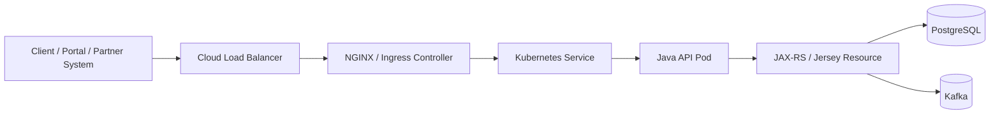
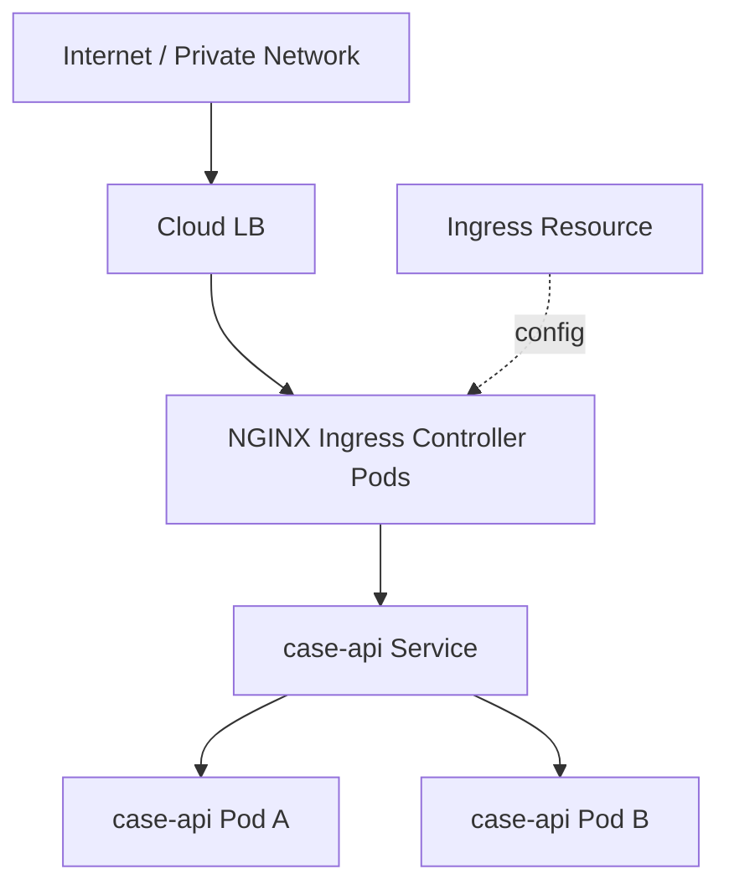
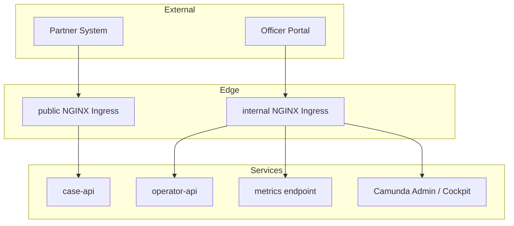
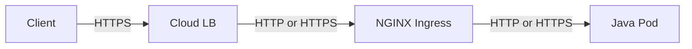
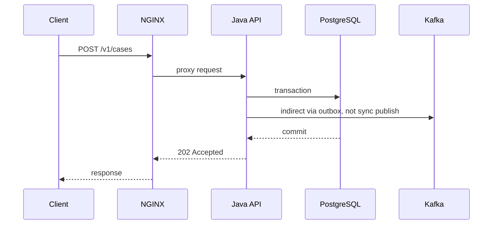
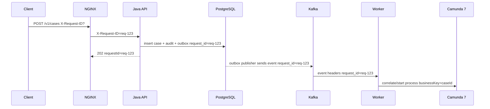
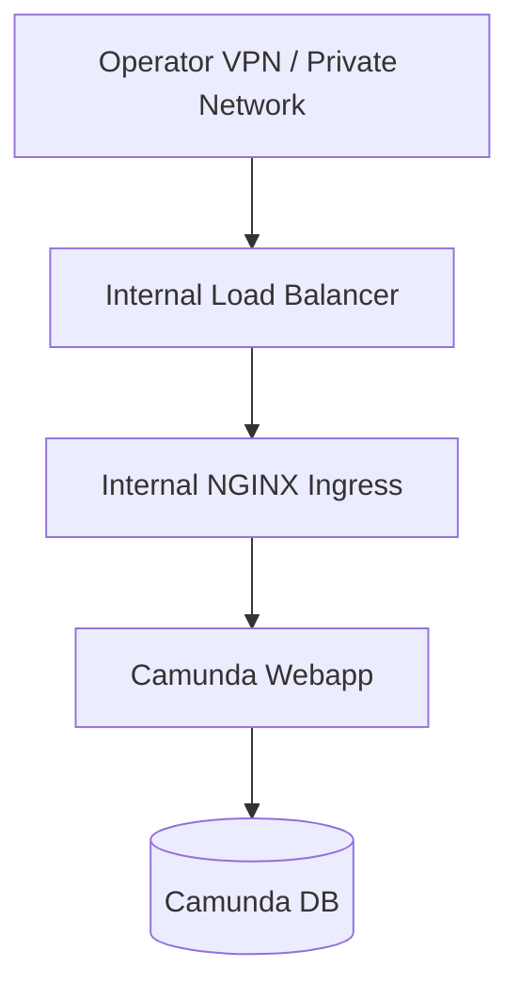
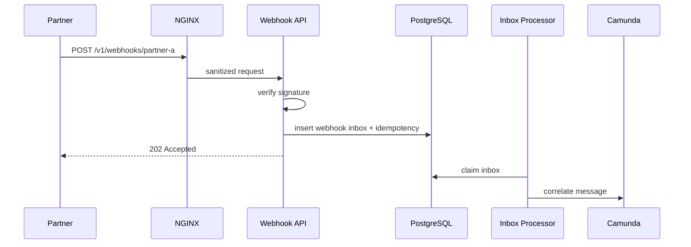

# Part 037 — NGINX Edge and Ingress Design

Part sebelumnya menempatkan workload di Kubernetes. Sekarang kita membahas pintu masuknya.

NGINX/Ingress bukan dekorasi infra. Untuk sistem produksi, edge adalah **policy boundary pertama** sebelum request menyentuh Java service, Camunda adapter, PostgreSQL transaction, atau Kafka publishing flow.

Edge menentukan:

- request mana yang boleh masuk;
- host/path mana yang valid;
- ukuran body yang diterima;
- timeout mana yang berlaku;
- header mana yang dipercaya;
- IP client mana yang dianggap benar;
- apakah request diberi rate limit;
- bagaimana TLS dihentikan;
- bagaimana error upstream diterjemahkan;
- apakah service bisa dilindungi dari slow client;
- apakah observability punya correlation yang konsisten.

Kesalahan edge sering terlihat seperti bug aplikasi:

- user mendapat 504, padahal API masih memproses;
- audit log kehilangan client IP;
- request id berubah di setiap hop;
- duplicate submit terjadi karena client retry saat edge timeout;
- upload evidence gagal dengan 413;
- path rewrite membuat endpoint contract rusak;
- semua request tampak berasal dari IP NGINX;
- service dipercaya menerima `X-User-Id` palsu dari internet.

Part ini membangun desain edge untuk platform contract-first regulatory enforcement case orchestration.

---

## 1. Mental Model: Edge adalah Contract Firewall

Service contract tidak dimulai dari `@Path` di Jersey.

Ia dimulai dari edge.



Kontrak request melewati beberapa boundary:

| Boundary | Pertanyaan utama |
|---|---|
| Load balancer | Apakah koneksi masuk secara network-level valid? |
| NGINX/Ingress | Apakah host/path/header/body/timeout sesuai policy? |
| Kubernetes Service | Pod mana yang menerima traffic? |
| Java server | Apakah request bisa diparsing dan diterima runtime? |
| Jersey resource | Apakah request sesuai OpenAPI contract? |
| Application service | Apakah command valid terhadap state domain? |
| PostgreSQL | Apakah invariant data tetap benar? |

Edge tidak boleh menjalankan business rule. Tetapi edge harus menolak request yang secara protocol, transport, dan security boundary sudah tidak layak masuk.

**Invariant edge:** request yang mencapai aplikasi harus sudah memiliki transport context yang bersih, ukuran yang terkendali, timeout yang masuk akal, correlation id yang stabil, dan forwarding metadata yang tidak bisa dipalsukan oleh client.

---

## 2. NGINX sebagai Reverse Proxy vs Kubernetes Ingress

Ada dua bentuk umum:

1. NGINX langsung sebagai reverse proxy di VM/bare-metal;
2. NGINX Ingress Controller di Kubernetes.

Di seri ini, kita fokus pada Kubernetes, sehingga bentuk utamanya:



Kubernetes `Ingress` adalah API object yang mengelola external access ke Service, biasanya HTTP/HTTPS, berdasarkan host/path rules. Tetapi Ingress tidak bekerja sendiri: cluster harus punya Ingress Controller yang menjalankan rule tersebut.

Perbedaan tanggung jawab:

| Komponen | Tanggung jawab |
|---|---|
| Ingress object | Deklarasi host/path/TLS/backend |
| Ingress Controller | Menerjemahkan deklarasi menjadi konfigurasi proxy nyata |
| NGINX | Reverse proxy runtime: headers, buffering, timeout, upstream, logs |
| Service | Stable virtual endpoint di dalam cluster |
| EndpointSlice/Pod | Pod aktual yang menerima traffic |

Jangan menganggap semua annotation Ingress portable. Annotation biasanya spesifik controller.

---

## 3. Edge Topology untuk Platform Ini

Platform ini punya beberapa endpoint class:

1. public/partner API;
2. internal operator API;
3. webhook callback;
4. health endpoint;
5. metrics endpoint;
6. Camunda/admin endpoint bila ada;
7. evidence upload/download endpoint bila disediakan;
8. async/event administration endpoint bila ada.

Tidak semua boleh lewat edge yang sama.



Aturan praktis:

- public API dan internal operator API dipisahkan host-nya;
- metrics tidak exposed ke internet;
- Camunda admin UI tidak exposed ke internet;
- health readiness untuk Kubernetes tidak sama dengan public health;
- upload besar tidak dicampur dengan endpoint transactional biasa;
- webhook external diberi rate limit dan signature verification;
- semua request membawa correlation id atau dibuatkan di edge/app boundary.

---

## 4. Host dan Path Strategy

Contoh host:

| Host | Audience | Service |
|---|---|---|
| `api.enforcement.example.gov` | partner/external system | `case-api` |
| `ops.enforcement.example.gov` | internal officer/admin | `operator-api` |
| `workflow.enforcement.internal` | internal platform team | Camunda/admin |
| `metrics.enforcement.internal` | observability stack | metrics scrape |

Path public API:

```text
/v1/cases
/v1/cases/{caseId}
/v1/cases/{caseId}/evidence
/v1/cases/{caseId}/decisions
/v1/cases/{caseId}/events
```

Edge rule sebaiknya tidak melakukan rewrite yang mengubah contract URL kecuali benar-benar dibutuhkan.

Buruk:

```text
External: /case-api/v1/cases
Internal: /v1/cases
```

Lalu NGINX rewrite `/case-api` sebelum aplikasi.

Masalahnya:

- OpenAPI contract berbeda dari path internal;
- generated client bingung;
- observability mencatat path berbeda;
- signature verification bisa rusak;
- cache/rate limit key bisa salah;
- troubleshooting menjadi lebih mahal.

Lebih baik:

```text
External contract == Application contract
/v1/cases
```

Jika butuh tenant/partner-specific host, gunakan host, bukan path prefix acak:

```text
partner-a.api.enforcement.example.gov/v1/cases
partner-b.api.enforcement.example.gov/v1/cases
```

Tetapi tenant tetap harus divalidasi di aplikasi, bukan dipercaya hanya dari host.

---

## 5. Trust Boundary dan Header Sanitization

Header dari internet tidak boleh otomatis dipercaya.

Contoh header berbahaya bila dipercaya mentah:

```text
X-User-Id: admin
X-Role: supervisor
X-Forwarded-For: 10.0.0.1
X-Request-Id: malicious-value
X-Tenant-Id: regulator-root
```

Edge harus mengambil keputusan:

1. header mana yang dihapus;
2. header mana yang dibuat ulang;
3. header mana yang diteruskan;
4. header mana yang hanya boleh datang dari trusted upstream;
5. header mana yang divalidasi formatnya.

### 5.1 Header yang sebaiknya dibuat/ditetapkan edge

```nginx
proxy_set_header Host              $host;
proxy_set_header X-Real-IP         $remote_addr;
proxy_set_header X-Forwarded-For   $proxy_add_x_forwarded_for;
proxy_set_header X-Forwarded-Proto $scheme;
proxy_set_header X-Request-ID      $request_id;
```

Tetapi hati-hati: `$proxy_add_x_forwarded_for` menambahkan IP saat ini ke header lama. Kalau NGINX langsung menghadapi internet dan client mengirim `X-Forwarded-For`, nilai lama bisa ikut terbawa.

Untuk public internet edge, strategi lebih aman:

```nginx
proxy_set_header X-Forwarded-For $remote_addr;
```

Atau, bila ada trusted load balancer di depan NGINX, gunakan konfigurasi real IP yang hanya mempercayai CIDR load balancer.

### 5.2 Header identity tidak boleh dipercaya dari public edge

Jangan teruskan ini dari client public:

```text
X-User-Id
X-User-Role
X-Authorities
X-Tenant-Id
X-Internal-Actor
X-Service-Name
```

Jika identity berasal dari token, aplikasi atau trusted auth gateway harus memverifikasi token dan membentuk principal internal.

### 5.3 Header correlation boleh diterima dengan sanitasi

`X-Request-ID` bisa datang dari client untuk support tracing antar organisasi. Tetapi harus dibatasi:

- panjang maksimum;
- karakter aman;
- tidak mengandung newline;
- tidak mengandung data pribadi;
- fallback generate jika invalid;
- tidak dipakai sebagai security credential.

Contoh aplikasi Java dapat menerima request id dari edge, lalu membuat `trace_id` sendiri melalui OpenTelemetry.

---

## 6. TLS Termination dan Scheme Awareness

TLS bisa berhenti di beberapa tempat:



Pilihan umum:

| Model | Kelebihan | Risiko |
|---|---|---|
| TLS terminate di LB | sederhana, certificate managed cloud | NGINX harus percaya header proto dari LB |
| TLS terminate di NGINX | kontrol lebih besar di Ingress | certificate lifecycle di cluster |
| TLS passthrough ke Pod | end-to-end encryption | kompleks, observability/routing terbatas |
| mTLS service-to-service | strong internal identity | butuh platform/service mesh/PKI discipline |

Untuk platform ini, baseline praktis:

- public TLS terminate di managed load balancer atau NGINX Ingress;
- internal cluster traffic bisa HTTP bila network boundary kuat, tetapi jangan menganggap ini otomatis aman;
- jika regulatory/security requirement tinggi, gunakan mTLS antar service melalui platform yang jelas;
- aplikasi jangan membuat absolute URL berdasarkan `http://localhost` atau scheme internal;
- aplikasi harus memahami `X-Forwarded-Proto` hanya jika header itu berasal dari trusted edge.

Security headers yang relevan untuk UI/browser-facing endpoint:

```nginx
add_header Strict-Transport-Security "max-age=31536000; includeSubDomains" always;
add_header X-Content-Type-Options "nosniff" always;
add_header X-Frame-Options "DENY" always;
add_header Referrer-Policy "no-referrer" always;
```

Untuk pure API, beberapa header browser tetap berguna, tetapi jangan menganggap security headers menggantikan auth, authorization, dan input validation.

---

## 7. Timeout Chain: Jangan Biarkan Setiap Layer Mengarang Sendiri

Timeout harus didesain sebagai satu rantai.



Jika client timeout 10s, NGINX timeout 60s, API transaction timeout 120s, DB statement timeout 300s, maka failure behavior kacau:

- client sudah retry;
- NGINX masih menunggu;
- API masih menulis DB;
- idempotency harus menyelamatkan duplicate;
- user melihat error meski command berhasil.

### 7.1 Timeout budget baseline

Untuk `POST /v1/cases` synchronous intake:

| Layer | Timeout | Catatan |
|---|---:|---|
| client request timeout | 15s | partner harus tahu SLA response |
| load balancer idle timeout | 30s | lebih besar dari app response budget |
| NGINX `proxy_connect_timeout` | 2s | gagal cepat jika upstream tidak reachable |
| NGINX `proxy_read_timeout` | 20s | sedikit lebih besar dari app request budget |
| Java request budget | 12s | internal deadline |
| PostgreSQL statement timeout | 8s | query tidak boleh melewati request budget |
| Kafka publish | tidak di request path | via outbox |

Untuk endpoint search:

| Layer | Timeout |
|---|---:|
| client | 10s |
| NGINX proxy read | 12s |
| Java budget | 8s |
| PostgreSQL statement timeout | 5s |

Untuk evidence upload besar:

| Layer | Timeout |
|---|---:|
| client | lebih panjang |
| NGINX body timeout | eksplisit |
| API processing | jangan blocking workflow transaction |
| DB transaction | pendek; metadata dulu |

### 7.2 NGINX timeout directives contoh

```nginx
location /v1/ {
  proxy_connect_timeout 2s;
  proxy_send_timeout    15s;
  proxy_read_timeout    20s;
  send_timeout          20s;

  proxy_pass http://case_api_upstream;
}
```

Makna high-level:

- `proxy_connect_timeout`: waktu membangun koneksi ke upstream;
- `proxy_send_timeout`: waktu mengirim request ke upstream;
- `proxy_read_timeout`: waktu menunggu response dari upstream;
- `send_timeout`: waktu mengirim response ke client.

Jangan menaikkan timeout sebagai solusi permanen untuk query lambat. Timeout panjang sering hanya menyembunyikan bottleneck dan meningkatkan resource occupancy.

---

## 8. Request Body Size dan Buffering

Regulatory platform sering punya evidence upload.

Pertanyaan yang harus dijawab:

1. apakah evidence binary masuk ke API utama?
2. apakah binary disimpan di PostgreSQL?
3. apakah hanya metadata disimpan di PostgreSQL?
4. apakah upload harus synchronous dengan case intake?
5. ukuran maksimum evidence berapa?
6. berapa lama client boleh upload?
7. apakah upload harus virus-scanned?
8. apakah upload retry aman?

Edge harus punya limit eksplisit.

```nginx
client_max_body_size 10m;
client_body_timeout 30s;
```

Jika evidence bisa besar, jangan menaikkan limit global untuk semua endpoint.

Buruk:

```nginx
server {
  client_max_body_size 500m;
}
```

Akibatnya semua endpoint ikut menerima body besar.

Lebih baik:

```nginx
location /v1/cases {
  client_max_body_size 1m;
  proxy_pass http://case_api_upstream;
}

location ~ ^/v1/cases/[^/]+/evidence$ {
  client_max_body_size 50m;
  client_body_timeout 120s;
  proxy_read_timeout 60s;
  proxy_pass http://case_api_upstream;
}
```

### 8.1 Buffering

NGINX dapat buffering request body sebelum meneruskan ke upstream. Ini melindungi aplikasi dari slow client, tetapi memakai disk/memory NGINX.

Trade-off:

| Mode | Kelebihan | Risiko |
|---|---|---|
| buffering on | aplikasi tidak tersandera slow upload | NGINX butuh storage/temp file |
| buffering off | streaming langsung ke app | app thread/socket tersandera slow client |

Untuk API transactional kecil, buffering default biasanya aman.

Untuk upload besar, desain khusus diperlukan. Jangan mencampur upload besar dengan endpoint command workflow utama.

---

## 9. Rate Limiting dan Backpressure

Edge rate limit bukan pengganti authorization. Tetapi ia sangat berguna untuk:

- mengurangi brute force;
- membatasi partner yang rusak;
- melindungi DB dari traffic burst;
- melindungi Camunda dari start-process storm;
- menjaga worker/event pipeline tidak langsung banjir;
- memberi response 429 sebelum resource mahal dipakai.

Contoh NGINX rate limit:

```nginx
http {
  limit_req_zone $binary_remote_addr zone=public_api_per_ip:10m rate=10r/s;

  server {
    location /v1/ {
      limit_req zone=public_api_per_ip burst=20 nodelay;
      proxy_pass http://case_api_upstream;
    }
  }
}
```

Untuk partner API, rate limit key sebaiknya bukan hanya IP. Banyak partner keluar dari NAT yang sama.

Key yang lebih baik:

- partner id dari verified token;
- client certificate subject;
- API key id;
- tenant id yang sudah diverifikasi;
- route class.

Jika NGINX tidak bisa membaca identity terverifikasi, lakukan rate limit kasar di edge dan fine-grained quota di aplikasi.

Response contract untuk rate limit:

```http
HTTP/1.1 429 Too Many Requests
Retry-After: 10
Content-Type: application/problem+json
```

Body:

```json
{
  "type": "https://errors.enforcement.example.gov/rate-limit-exceeded",
  "title": "Rate limit exceeded",
  "status": 429,
  "detail": "Too many requests for this API client.",
  "instance": "/v1/cases",
  "requestId": "req-..."
}
```

Jangan biarkan NGINX mengembalikan HTML default untuk API error. Bila memungkinkan, gunakan custom error page/API error normalization.

---

## 10. Retry Semantics di Edge

NGINX bisa retry ke upstream lain dalam beberapa kondisi. Ini berbahaya untuk non-idempotent request.

Prinsip:

- GET aman untuk retry terbatas;
- POST command tidak boleh di-retry oleh proxy secara buta;
- idempotency key tetap wajib untuk command;
- retry policy harus paham route/method;
- timeout retry dapat menghasilkan duplicate command bila aplikasi sudah memproses sebagian.

Contoh aman konservatif:

```nginx
proxy_next_upstream error timeout http_502 http_503 http_504;
proxy_next_upstream_tries 1;
```

Untuk command endpoint, lebih aman tidak melakukan retry otomatis di proxy.

Aplikasi harus menjawab dengan idempotency result jika client retry.

---

## 11. Upstream Load Balancing di Kubernetes

Biasanya NGINX Ingress mengarah ke Kubernetes Service, bukan langsung ke Pod.

```yaml
apiVersion: v1
kind: Service
metadata:
  name: case-api
spec:
  selector:
    app: case-api
  ports:
    - name: http
      port: 8080
      targetPort: http
```

Ingress:

```yaml
apiVersion: networking.k8s.io/v1
kind: Ingress
metadata:
  name: case-api-public
spec:
  ingressClassName: nginx
  rules:
    - host: api.enforcement.example.gov
      http:
        paths:
          - path: /v1
            pathType: Prefix
            backend:
              service:
                name: case-api
                port:
                  number: 8080
```

Kubernetes Service melakukan load balancing ke ready endpoints.

Tetapi readiness harus benar. Jika Pod sudah menerima traffic sebelum:

- config terbaca;
- DB pool siap;
- migration compatibility valid;
- essential dependency reachable;
- server benar-benar listen;

maka NGINX akan meneruskan request ke Pod yang belum siap.

---

## 12. Readiness, Liveness, dan Edge Error

Bila readiness gagal, Pod dikeluarkan dari Service endpoint.

Edge behavior:

| Kondisi | Kemungkinan HTTP |
|---|---|
| tidak ada endpoint ready | 503 |
| upstream connection refused | 502/503 |
| upstream lambat | 504 |
| NGINX body too large | 413 |
| route tidak match | 404 |
| TLS/cert problem | browser/client TLS error |

Aplikasi harus membedakan:

- `/livez`: proses masih hidup, jangan cek DB/Kafka;
- `/readyz`: siap menerima traffic, cek dependency minimal;
- `/healthz/public`: optional public health yang tidak membocorkan detail;
- `/metrics`: internal-only scrape.

NGINX tidak perlu expose semua endpoint ini ke public.

Contoh rule:

```nginx
location = /livez {
  return 404;
}

location = /readyz {
  allow 10.0.0.0/8;
  deny all;
  proxy_pass http://case_api_upstream;
}
```

Di Kubernetes, probe mengakses Pod langsung/kubelet path, bukan harus melewati public Ingress.

---

## 13. Error Mapping di Edge

Default NGINX error page biasanya HTML.

Untuk API, kita ingin Problem Details JSON.

Namun jangan terlalu kompleks di NGINX. Ada dua opsi:

1. edge mengembalikan minimal JSON untuk error edge-native;
2. aplikasi mengembalikan Problem Details untuk error application-native.

Edge-native error:

| Error | Owner | Contoh |
|---|---|---|
| 400 malformed request line/header | NGINX | invalid protocol |
| 413 body too large | NGINX | upload melebihi limit |
| 414 URI too long | NGINX | query string abuse |
| 429 rate limited | NGINX/app | burst berlebihan |
| 502 upstream connection failed | NGINX/platform | Pod crash / Service unreachable |
| 503 no upstream ready | NGINX/Kubernetes | rollout/downscale outage |
| 504 upstream timeout | NGINX/app/platform | app lambat atau dependency lambat |

Application-native error:

| Error | Owner |
|---|---|
| 400 schema validation | Jersey/application |
| 401 authentication | auth/app |
| 403 authorization | app/domain |
| 404 resource not found | app/domain |
| 409 state conflict/idempotency conflict | app/domain/DB |
| 422 semantic validation | app/domain |
| 500 unexpected internal failure | app |

Untuk audit, jangan hanya mencatat 500 dari aplikasi. 413, 429, 502, 503, 504 di edge juga penting.

---

## 14. NGINX Access Log sebagai Telemetry Contract

Access log harus mengandung field yang cukup untuk menghubungkan request edge dengan app trace.

Contoh `log_format` JSON:

```nginx
log_format json_combined escape=json
  '{'
    '"time":"$time_iso8601",'
    '"remote_addr":"$remote_addr",'
    '"request_id":"$request_id",'
    '"host":"$host",'
    '"method":"$request_method",'
    '"uri":"$request_uri",'
    '"status":$status,'
    '"bytes_sent":$bytes_sent,'
    '"request_time":$request_time,'
    '"upstream_addr":"$upstream_addr",'
    '"upstream_status":"$upstream_status",'
    '"upstream_response_time":"$upstream_response_time",'
    '"user_agent":"$http_user_agent"'
  '}';

access_log /var/log/nginx/access.log json_combined;
```

Field penting:

| Field | Fungsi |
|---|---|
| `request_id` | join edge log dengan app log |
| `host` | route/tenant edge analysis |
| `method` + `uri` | endpoint behavior |
| `status` | error class |
| `request_time` | total time edge |
| `upstream_response_time` | latency aplikasi |
| `upstream_status` | apakah response dari upstream atau edge |
| `remote_addr` | network source setelah trust sanitization |

Jangan log Authorization header, cookies sensitif, token, full request body, atau evidence payload.

---

## 15. Correlation ID Flow

Correlation harus konsisten dari edge sampai Kafka/Camunda.



Canonical IDs:

| ID | Source | Scope |
|---|---|---|
| `request_id` | edge/app | one HTTP request |
| `trace_id` | tracing instrumentation | distributed execution path |
| `correlation_id` | app/domain | cross-request business operation |
| `case_id` | domain | aggregate identity |
| `event_id` | event producer | unique event |
| `process_instance_id` | Camunda | workflow instance |
| `business_key` | app/Camunda | domain key used by process |

Request id bukan trace id, dan trace id bukan case id. Campur-aduk ID membuat observability tampak lengkap tetapi sulit dipakai saat incident.

---

## 16. NGINX Configuration Blueprint

Contoh reverse proxy NGINX non-Ingress untuk memahami konsep:

```nginx
worker_processes auto;

events {
  worker_connections 4096;
}

http {
  server_tokens off;

  log_format json_combined escape=json
    '{'
      '"time":"$time_iso8601",'
      '"request_id":"$request_id",'
      '"remote_addr":"$remote_addr",'
      '"host":"$host",'
      '"method":"$request_method",'
      '"uri":"$request_uri",'
      '"status":$status,'
      '"request_time":$request_time,'
      '"upstream_status":"$upstream_status",'
      '"upstream_response_time":"$upstream_response_time"'
    '}';

  access_log /var/log/nginx/access.log json_combined;

  upstream case_api_upstream {
    keepalive 64;
    server case-api.default.svc.cluster.local:8080;
  }

  limit_req_zone $binary_remote_addr zone=public_api_per_ip:10m rate=10r/s;

  server {
    listen 443 ssl http2;
    server_name api.enforcement.example.gov;

    client_max_body_size 1m;
    client_body_timeout 30s;
    client_header_timeout 10s;

    add_header X-Content-Type-Options "nosniff" always;
    add_header Referrer-Policy "no-referrer" always;

    location /v1/ {
      limit_req zone=public_api_per_ip burst=20 nodelay;

      proxy_http_version 1.1;
      proxy_set_header Connection "";
      proxy_set_header Host $host;
      proxy_set_header X-Real-IP $remote_addr;
      proxy_set_header X-Forwarded-For $remote_addr;
      proxy_set_header X-Forwarded-Proto $scheme;
      proxy_set_header X-Request-ID $request_id;

      proxy_connect_timeout 2s;
      proxy_send_timeout 15s;
      proxy_read_timeout 20s;

      proxy_pass http://case_api_upstream;
    }

    location ~ ^/v1/cases/[^/]+/evidence$ {
      client_max_body_size 50m;
      client_body_timeout 120s;
      proxy_read_timeout 60s;

      proxy_set_header Host $host;
      proxy_set_header X-Real-IP $remote_addr;
      proxy_set_header X-Forwarded-For $remote_addr;
      proxy_set_header X-Forwarded-Proto $scheme;
      proxy_set_header X-Request-ID $request_id;

      proxy_pass http://case_api_upstream;
    }
  }
}
```

Dalam Kubernetes Ingress Controller, sebagian besar ini menjadi annotation atau ConfigMap controller. Jangan copy mentah tanpa memahami controller yang dipakai.

---

## 17. Kubernetes Ingress YAML Blueprint

Contoh Ingress minimal:

```yaml
apiVersion: networking.k8s.io/v1
kind: Ingress
metadata:
  name: case-api-public
  namespace: enforcement
  annotations:
    nginx.ingress.kubernetes.io/proxy-connect-timeout: "2"
    nginx.ingress.kubernetes.io/proxy-send-timeout: "15"
    nginx.ingress.kubernetes.io/proxy-read-timeout: "20"
    nginx.ingress.kubernetes.io/proxy-body-size: "1m"
spec:
  ingressClassName: nginx
  tls:
    - hosts:
        - api.enforcement.example.gov
      secretName: case-api-public-tls
  rules:
    - host: api.enforcement.example.gov
      http:
        paths:
          - path: /v1
            pathType: Prefix
            backend:
              service:
                name: case-api
                port:
                  number: 8080
```

Ingress untuk evidence upload bisa dipisah jika annotation per path tidak cukup rapi:

```yaml
apiVersion: networking.k8s.io/v1
kind: Ingress
metadata:
  name: case-api-evidence
  namespace: enforcement
  annotations:
    nginx.ingress.kubernetes.io/proxy-body-size: "50m"
    nginx.ingress.kubernetes.io/proxy-read-timeout: "60"
spec:
  ingressClassName: nginx
  tls:
    - hosts:
        - api.enforcement.example.gov
      secretName: case-api-public-tls
  rules:
    - host: api.enforcement.example.gov
      http:
        paths:
          - path: /v1/cases
            pathType: Prefix
            backend:
              service:
                name: case-api
                port:
                  number: 8080
```

Namun hati-hati: dua Ingress dengan host/path overlap bisa menghasilkan behavior sulit diprediksi tergantung controller. Test generated NGINX config atau gunakan rule yang jelas.

---

## 18. Edge-Aware Java Service

Aplikasi Java tidak boleh buta terhadap edge.

Minimal request context:

```java
public record EdgeRequestContext(
    String requestId,
    String traceId,
    String forwardedFor,
    String forwardedProto,
    String host,
    String method,
    String path,
    Instant receivedAt
) {}
```

Jersey filter:

```java
@Provider
public final class RequestContextFilter implements ContainerRequestFilter {
  @Override
  public void filter(ContainerRequestContext request) {
    String requestId = sanitizeOrGenerate(request.getHeaderString("X-Request-ID"));
    request.setProperty("requestId", requestId);
    MDC.put("requestId", requestId);
  }
}
```

Response filter:

```java
@Provider
public final class ResponseContextFilter implements ContainerResponseFilter {
  @Override
  public void filter(ContainerRequestContext request, ContainerResponseContext response) {
    Object requestId = request.getProperty("requestId");
    if (requestId != null) {
      response.getHeaders().putSingle("X-Request-ID", requestId.toString());
    }
  }
}
```

Aplikasi harus:

- echo `X-Request-ID`;
- include request id di Problem Details;
- include request id di audit technical context;
- propagate request id ke outbox event headers;
- log request id di structured logs;
- tidak percaya forwarded headers kecuali deployment trust boundary jelas.

---

## 19. Route Classes dan Policy Matrix

Tidak semua endpoint sama.

| Route class | Example | Body limit | Timeout | Rate limit | Auth | Retry |
|---|---|---:|---:|---:|---|---|
| Command API | `POST /v1/cases` | 1 MB | 20s | strict | required | no proxy retry |
| Query API | `GET /v1/cases` | none | 12s | medium | required | limited safe retry |
| Evidence upload | `POST /evidence` | 50 MB | 60s+ | strict | required | no proxy retry |
| Webhook | `POST /v1/callbacks/...` | 1 MB | 15s | strict per partner | signature/token | no proxy retry |
| Health public | `/health` | none | 2s | high | optional | no |
| Metrics | `/metrics` | none | 5s | internal only | network/RBAC | n/a |
| Admin | `/admin/...` | small | 30s | internal | strong | no |

Policy matrix sebaiknya masuk ke repo, bukan hanya wiki.

---

## 20. NGINX dan Camunda Admin Boundary

Camunda Cockpit/Admin/Tasklist, jika dipakai, jangan diexpose seperti public API.

Aturan:

- internal host only;
- network allowlist/VPN/private LB;
- strong authentication;
- audit admin access;
- no public internet exposure;
- no shared public TLS wildcard tanpa kontrol;
- separate ingress from public API;
- resource/timeouts disesuaikan untuk admin UI;
- history/report endpoints dibatasi agar tidak membebani DB.

Contoh topology:



Jangan menaruh Camunda admin di host `api.enforcement.example.gov/camunda`.

Itu mencampur public API contract dengan operational console.

---

## 21. Webhook Edge Design

Webhook external sering jadi sumber incident.

Risiko:

- duplicate callback;
- retry storm dari partner;
- signature invalid;
- replay attack;
- body terlalu besar;
- clock skew;
- partner timeout sangat pendek;
- partner menganggap 504 sebagai gagal dan retry;
- webhook menyebabkan process correlation langsung tanpa inbox.

Desain:



Webhook handler jangan langsung menjalankan heavy process. Simpan dulu, ack cepat, proses asynchronous.

Edge policy:

- strict body limit;
- short request timeout;
- per-partner rate limit;
- no proxy retry;
- access log dengan partner id bila tersedia;
- deny unknown host/path.

---

## 22. Failure Model Edge

### 22.1 413 Request Entity Too Large

Gejala:

- client upload evidence gagal;
- aplikasi tidak punya log request;
- NGINX access log status 413.

Kemungkinan penyebab:

- `client_max_body_size` terlalu kecil;
- route upload kena location default;
- Ingress annotation tidak diterapkan;
- path overlap salah;
- cloud LB punya limit lebih kecil dari NGINX.

Response:

- cek NGINX/Ingress logs;
- cek generated config;
- cek route/path matching;
- jangan langsung naikkan global limit;
- pisahkan upload route policy.

### 22.2 504 Gateway Timeout

Gejala:

- client menerima 504;
- Java mungkin masih memproses;
- DB transaction mungkin berhasil;
- client retry;
- duplicate command mungkin muncul.

Kemungkinan penyebab:

- `proxy_read_timeout` lebih pendek dari aplikasi;
- query lambat;
- lock contention;
- downstream Camunda/Kafka blocking di request path;
- Pod GC pause;
- thread pool exhaustion.

Response:

- cari `request_id` di NGINX log;
- cari app log/trace dengan request id;
- cek apakah response melewati timeout;
- cek DB slow query/lock;
- cek JVM GC/thread pool;
- cek idempotency table untuk duplicate retry;
- perbaiki request budget, bukan hanya timeout.

### 22.3 502 Bad Gateway

Gejala:

- upstream connection refused/reset;
- Pod mungkin crash/restart;
- NGINX upstream status kosong/502.

Kemungkinan penyebab:

- readiness salah;
- Pod killed saat masih menerima traffic;
- graceful shutdown tidak bekerja;
- container port mismatch;
- Service selector salah;
- app server crash.

Response:

- cek endpoints ready;
- cek Pod restart count;
- cek termination logs;
- cek readinessProbe;
- cek preStop/terminationGracePeriod;
- cek Service targetPort.

### 22.4 Header Spoofing

Gejala:

- audit menunjukkan client IP internal palsu;
- authorization tampak bypass;
- request dianggap berasal dari trusted service.

Kemungkinan penyebab:

- aplikasi percaya `X-Forwarded-For` dari internet;
- NGINX meneruskan identity header dari client;
- real IP config terlalu luas;
- auth gateway boundary tidak jelas.

Response:

- sanitize headers di edge;
- restrict trusted upstream CIDR;
- reject external identity headers;
- log raw/sanitized hanya jika aman;
- audit ulang affected request.

### 22.5 Route Rewrite Bug

Gejala:

- OpenAPI path benar, runtime 404;
- metrics path cardinality kacau;
- signature webhook invalid;
- generated client gagal.

Kemungkinan penyebab:

- rewrite target salah;
- trailing slash behavior berbeda;
- regex path terlalu greedy;
- duplicate Ingress host/path overlap.

Response:

- test route matrix;
- dump generated NGINX config;
- hindari rewrite kecuali perlu;
- contract test terhadap deployed ingress.

---

## 23. Edge Test Matrix

Edge harus diuji seperti kode aplikasi.

| Test | Expected |
|---|---|
| valid `POST /v1/cases` | 202/201 sesuai contract |
| body > limit | 413 dari edge |
| unknown host | reject/404 |
| unknown path | 404 |
| missing auth | 401/403 sesuai auth boundary |
| spoofed `X-User-Id` | ignored/rejected |
| spoofed `X-Forwarded-For` | sanitized |
| slow upload | timeout sesuai policy |
| upstream not ready | 503 |
| upstream slow | 504 |
| rate burst | 429 |
| request id absent | generated |
| request id invalid | replaced/rejected |
| evidence upload small | accepted |
| evidence upload too large | 413 |
| metrics from public | denied |
| Camunda admin public | denied |

Gunakan smoke test setelah deploy:

```bash
curl -i https://api.enforcement.example.gov/v1/cases \
  -H 'Content-Type: application/json' \
  -H 'X-Request-ID: edge-smoke-001' \
  --data @samples/case-intake-valid.json
```

Test negative body size:

```bash
python - <<'PY'
from pathlib import Path
Path('/tmp/large.bin').write_bytes(b'a' * (2 * 1024 * 1024))
PY

curl -i https://api.enforcement.example.gov/v1/cases \
  -H 'Content-Type: application/octet-stream' \
  --data-binary @/tmp/large.bin
```

---

## 24. Deployment Checklist

Sebelum expose service:

- [ ] host/path sesuai OpenAPI contract;
- [ ] tidak ada rewrite yang tidak terdokumentasi;
- [ ] TLS valid dan renewal teruji;
- [ ] public/internal ingress dipisah;
- [ ] Camunda admin tidak public;
- [ ] metrics tidak public;
- [ ] body limit per route jelas;
- [ ] timeout chain disepakati;
- [ ] proxy retry disabled untuk command non-idempotent;
- [ ] rate limit minimal aktif;
- [ ] forwarding headers disanitasi;
- [ ] identity headers dari public client ditolak/diabaikan;
- [ ] request id dibuat/dipropagasi;
- [ ] access log JSON aktif;
- [ ] NGINX log punya upstream status/time;
- [ ] error 413/429/502/503/504 terpantau;
- [ ] readinessProbe valid;
- [ ] smoke test positive/negative ada di CI/CD;
- [ ] rollback ingress config teruji;
- [ ] SRE/runbook tahu membaca NGINX log.

---

## 25. Anti-Pattern

### Anti-pattern 1 — “Ingress cuma YAML routing”

Akibat:

- tidak ada timeout policy;
- no body size policy;
- header spoofing;
- error edge tidak terobservasi;
- 504 dianggap bug random.

Ingress adalah runtime policy layer.

### Anti-pattern 2 — Global body limit besar

```nginx
client_max_body_size 500m;
```

Ini membuka semua endpoint terhadap body besar.

Gunakan route-specific limit.

### Anti-pattern 3 — Trust semua forwarded headers

Jika client bisa mengirim `X-Forwarded-For`, lalu aplikasi percaya, audit rusak.

Sanitize di edge.

### Anti-pattern 4 — Proxy retry untuk POST command

Proxy retry bisa membuat duplicate command saat upstream sudah memproses tetapi response timeout.

Gunakan idempotency key dan biarkan client retry secara sadar.

### Anti-pattern 5 — Menyelesaikan latency dengan menaikkan timeout

Timeout panjang tanpa perbaikan query/thread/lock hanya menambah queueing dan membuat outage lebih lama.

### Anti-pattern 6 — Expose Camunda UI di public path

Operational console bukan public API.

### Anti-pattern 7 — Tidak menguji negative edge behavior

Sistem yang hanya diuji happy path akan gagal di edge pertama kali traffic nyata datang.

---

## 26. Mini Capstone untuk Part Ini

Ambil satu endpoint:

```text
POST /v1/cases
```

Tulis policy-nya:

| Policy | Value |
|---|---|
| Host | `api.enforcement.example.gov` |
| Path | `/v1/cases` |
| Method | `POST` |
| Body max | `1m` |
| Proxy read timeout | `20s` |
| Proxy retry | disabled |
| Rate limit | per client/partner |
| Required headers | `Authorization`, optional `X-Request-ID`, `Idempotency-Key` |
| Rejected headers | public `X-User-Id`, `X-Authorities` |
| Response id | `X-Request-ID` |
| Edge errors | 413, 429, 502, 503, 504 |
| App errors | 400, 401, 403, 409, 422, 500 |
| Logs | request id, upstream status/time, route class |

Kemudian tulis test matrix untuk route itu.

Jika tidak bisa menulis policy ini, endpoint belum production-ready.

---

## 27. Ringkasan

NGINX/Ingress adalah contract firewall:

- menstabilkan host/path boundary;
- mengontrol body size;
- mengatur timeout chain;
- mencegah header spoofing;
- memaksa request id/correlation;
- memberi rate limit/backpressure awal;
- memisahkan public/internal/admin surface;
- menghasilkan telemetry edge;
- membuat 413/429/502/503/504 bisa dijelaskan;
- mengurangi beban aplikasi sebelum request masuk ke domain layer.

Edge yang baik tidak membuat business logic. Edge yang baik membuat request yang sampai ke aplikasi sudah cukup bersih, terukur, dan dapat diobservasi.

Part berikutnya masuk ke observability: logging, metrics, tracing, SLO, dashboard, alert, dan failure drills lintas NGINX, Jersey, Kafka, PostgreSQL, Camunda 7, dan Kubernetes.

---

## References

- NGINX HTTP core module: `https://nginx.org/en/docs/http/ngx_http_core_module.html`
- NGINX proxy module: `https://nginx.org/en/docs/http/ngx_http_proxy_module.html`
- NGINX headers module: `https://nginx.org/en/docs/http/ngx_http_headers_module.html`
- Kubernetes Ingress: `https://kubernetes.io/docs/concepts/services-networking/ingress/`
- Kubernetes Ingress Controllers: `https://kubernetes.io/docs/concepts/services-networking/ingress-controllers/`
- F5 NGINX Ingress annotations: `https://docs.nginx.com/nginx-ingress-controller/configuration/ingress-resources/advanced-configuration-with-annotations/`
