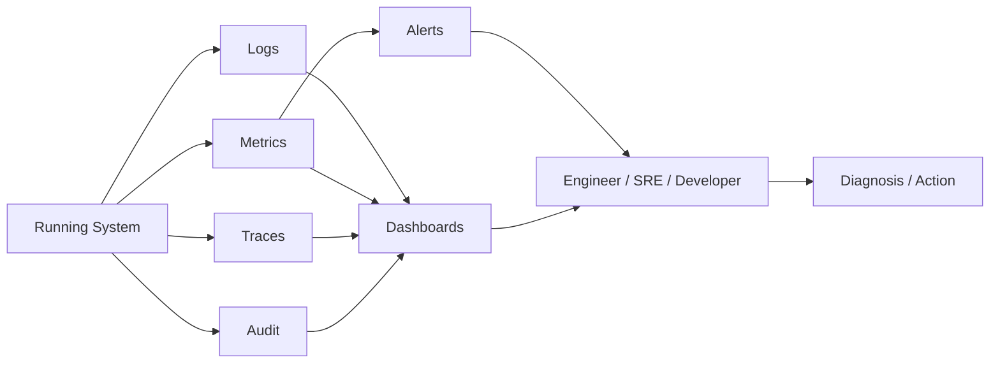
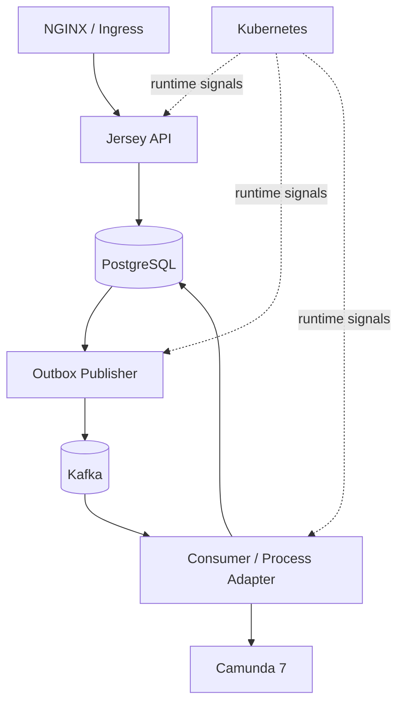
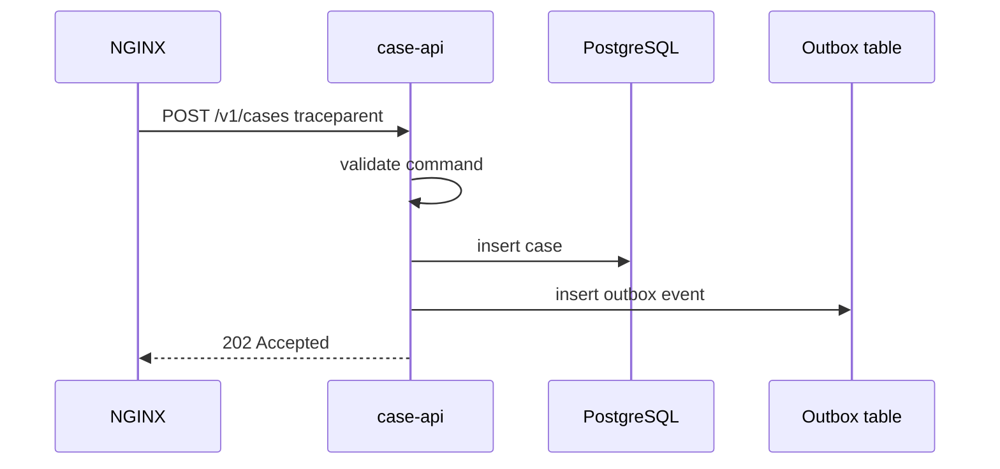
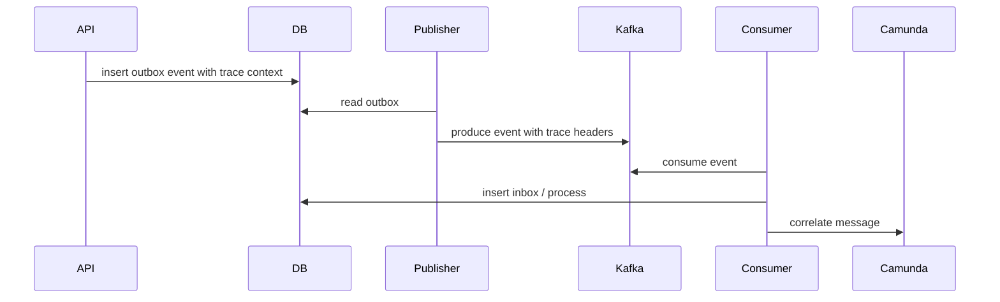
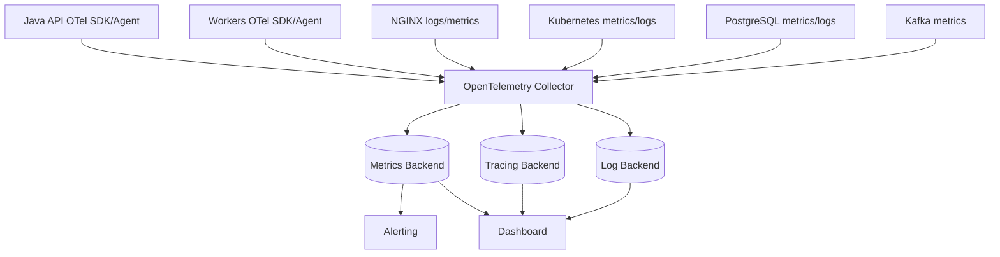

# Part 038 — Observability: Logging, Metrics, Tracing

Part sebelumnya membahas edge. Sekarang kita membahas bagaimana mengetahui apa yang sedang terjadi setelah request masuk ke sistem.

Observability bukan “pasang dashboard”. Observability adalah kemampuan menjawab pertanyaan produksi yang belum kita tahu sebelumnya.

Contoh pertanyaan nyata:

- Mengapa partner A mendapat 504, tetapi case ternyata berhasil dibuat?
- Apakah Kafka lag menyebabkan SLA task terlambat?
- Apakah Camunda incident storm berasal dari satu delegate atau banyak process definition?
- Apakah PostgreSQL lock contention membuat API timeout?
- Apakah release baru meningkatkan p95 latency untuk `POST /v1/cases`?
- Event mana yang membuat process instance tertentu masuk escalation path?
- Apakah duplicate command berasal dari retry client, proxy timeout, atau Kafka replay?
- Mengapa officer queue kosong, padahal case sudah masuk?

Jika telemetry tidak bisa menjawab pertanyaan seperti ini, sistem belum production-grade.

---

## 1. Mental Model: Telemetry bukan Observability

Telemetry adalah data:

- log;
- metric;
- trace;
- event;
- profile;
- audit record;
- health signal.

Observability adalah kemampuan menggunakan data itu untuk memahami behavior internal sistem.



Sistem observability yang buruk punya banyak data tetapi sedikit jawaban.

Sistem observability yang baik punya data yang:

- terstruktur;
- konsisten;
- rendah kardinalitas untuk metric;
- tinggi konteks untuk log/trace;
- tidak membocorkan data sensitif;
- bisa dikorelasikan lintas layer;
- punya owner;
- dipakai untuk alert dan runbook;
- diuji lewat failure drill.

---

## 2. Observability Contract untuk Platform Ini

Stack kita:



Kita butuh menjawab flow end-to-end:

```text
HTTP request -> Java command -> PostgreSQL transaction -> outbox row -> Kafka event -> consumer inbox -> Camunda process/message -> human task/SLA
```

Canonical correlation fields:

| Field | Scope | Masuk ke |
|---|---|---|
| `request_id` | one HTTP request | edge log, app log, response, audit technical context |
| `trace_id` | distributed trace | spans/logs/metrics exemplars |
| `correlation_id` | business operation | command, event, audit, process integration |
| `case_id` | aggregate | domain log, event payload/header, audit, task projection |
| `event_id` | produced event | outbox, Kafka header/payload, consumer inbox |
| `idempotency_key` | command dedupe | request log, DB idempotency table, audit |
| `process_instance_id` | Camunda runtime | process log, incident, operation log |
| `business_key` | domain-process bridge | Camunda correlation, logs, event metadata |
| `tenant_id` | isolation boundary | logs/metrics with caution, auth decision, audit |
| `actor_id` | user/service actor | audit; logs only if safe/pseudonymized |

Do not put high-cardinality values blindly in metrics labels. `case_id`, `request_id`, and `event_id` usually belong in logs/traces, not metric labels.

---

## 3. Golden Signals, RED, and USE

Google SRE popularized four golden signals:

- latency;
- traffic;
- errors;
- saturation.

For services, RED is often useful:

- Rate;
- Errors;
- Duration.

For resources, USE is useful:

- Utilization;
- Saturation;
- Errors.

Mapping to our platform:

| Layer | Primary model |
|---|---|
| NGINX/API endpoint | RED + golden signals |
| Java service/JVM | RED + USE |
| PostgreSQL | USE + query latency/error |
| Kafka producer/consumer | lag/rate/error/duration |
| Camunda 7 | job backlog, incident count, process duration |
| Kubernetes node/pod | USE + restart/availability |
| Business workflow | domain SLO, SLA breach, queue aging |

Observability harus menggabungkan technical dan domain signals.

Technical-only monitoring bisa bilang “semua Pod sehat” saat case queue macet.

Domain-only monitoring bisa bilang “SLA breach naik” tanpa tahu root cause Kafka lag atau DB lock.

---

## 4. Logging Contract

Log adalah catatan event diskret.

Log yang baik menjawab:

- apa yang terjadi;
- kapan;
- di service mana;
- untuk request/event/case/process mana;
- severity-nya apa;
- outcome-nya apa;
- error code apa;
- retryable atau tidak;
- berapa lama;
- apa next action.

### 4.1 JSON log schema baseline

```json
{
  "timestamp": "2026-07-03T10:15:30.123Z",
  "level": "INFO",
  "service": "case-api",
  "environment": "prod",
  "version": "1.12.3",
  "message": "Case intake command accepted",
  "event_type": "case.command.accepted",
  "request_id": "req-abc",
  "trace_id": "4bf92f3577b34da6a3ce929d0e0e4736",
  "correlation_id": "corr-123",
  "case_id": "case-2026-000001",
  "actor_type": "PARTNER_SYSTEM",
  "route": "POST /v1/cases",
  "http_status": 202,
  "duration_ms": 83,
  "error_code": null
}
```

### 4.2 Required log fields by runtime

| Runtime | Required fields |
|---|---|
| NGINX | request id, host, method, path, status, request time, upstream status/time |
| Jersey API | request id, trace id, route template, status, duration, command type |
| PostgreSQL adapter | operation name, duration, SQLSTATE on error, row count, transaction id if available |
| Outbox publisher | event id, outbox id, topic, key, attempt, status, duration |
| Kafka consumer | event id, topic, partition, offset, consumer group, attempt, handling result |
| Camunda adapter | business key, process key, process instance id, message name, correlation result |
| Camunda delegate | activity id, process definition key, process instance id, job id, retry count |
| Kubernetes workload | pod name, namespace, container, version, restart context |

### 4.3 Log levels

| Level | Use |
|---|---|
| DEBUG | local diagnosis, disabled by default in prod |
| INFO | important state transition/outcome |
| WARN | recoverable abnormal behavior requiring attention if frequent |
| ERROR | failed operation requiring operator/developer diagnosis |

Do not log every successful SQL query at INFO.

Do not log expected validation failure as ERROR.

Do not log stack trace for business error like invalid state transition unless it indicates bug.

### 4.4 Safe logging

Never log:

- raw access token;
- password;
- API key;
- full Authorization header;
- full evidence payload;
- large request body;
- personally sensitive data unless explicitly approved;
- unredacted document content;
- database connection string with password;
- private key/certificate.

Use redaction:

```java
public final class SafeLog {
  public static String token(String value) {
    if (value == null || value.length() < 8) return "<redacted>";
    return value.substring(0, 4) + "..." + value.substring(value.length() - 4);
  }
}
```

But best practice is not to pass sensitive values into logger at all.

---

## 5. Metrics Contract

Metric adalah pengukuran numerik dari runtime.

Metric harus:

- punya nama stabil;
- punya unit;
- punya label rendah kardinalitas;
- punya semantic jelas;
- punya owner;
- punya dashboard/alert bila penting;
- tidak menyimpan ID unik sebagai label.

### 5.1 HTTP metrics

| Metric | Type | Labels |
|---|---|---|
| `http_server_requests_total` | counter | service, method, route, status_class |
| `http_server_request_duration_seconds` | histogram | service, method, route, status_class |
| `http_server_active_requests` | gauge | service, route |
| `http_request_body_rejected_total` | counter | route, reason |
| `http_idempotency_conflicts_total` | counter | route, command_type |

Route label harus route template:

```text
/v1/cases/{caseId}
```

bukan actual path:

```text
/v1/cases/case-2026-000001
```

Actual path akan meledakkan cardinality.

### 5.2 NGINX metrics

| Metric | Meaning |
|---|---|
| request rate | traffic masuk |
| 4xx/5xx rate | client/edge/upstream error |
| upstream response time | latency upstream |
| request time | total latency edge |
| active connections | connection pressure |
| 413/429/502/503/504 count | edge failure classes |

NGINX access log sering menjadi sumber utama untuk edge metrics jika tidak memakai exporter khusus.

### 5.3 JVM metrics

| Metric | Why it matters |
|---|---|
| heap used/max | memory pressure |
| non-heap/metaspace | classloading/leak indicators |
| GC pause duration | latency spike |
| thread count | thread leak/pool pressure |
| executor active/queued tasks | backpressure |
| connection pool active/idle/pending | DB bottleneck |
| CPU usage | saturation |
| process uptime/restart | stability |

Jangan hanya memonitor heap. Banyak outage Java berasal dari thread pool, connection pool, GC pause, atau CPU throttling.

### 5.4 PostgreSQL metrics

| Metric | Why it matters |
|---|---|
| active connections | pool/DB pressure |
| waiting sessions | lock/resource contention |
| transaction duration | long transaction risk |
| query duration histogram | performance regression |
| deadlocks total | concurrency bug |
| serialization failures | retry pressure |
| rows scanned/returned | query shape issue |
| replication lag | HA/read replica awareness |
| autovacuum activity | bloat/maintenance |
| table/index bloat indicators | long-term performance |

Application-level DB metrics:

| Metric | Label |
|---|---|
| `db_operation_duration_seconds` | operation, outcome |
| `db_sqlstate_errors_total` | sqlstate_class, operation |
| `db_lock_wait_seconds` | operation |
| `db_transaction_retries_total` | reason |

SQLSTATE label should be class or curated code, not full message.

### 5.5 Kafka metrics

Producer:

| Metric | Why |
|---|---|
| send rate | throughput |
| send error rate | broker/network/schema issue |
| request latency | broker pressure |
| batch size | efficiency |
| record retry rate | transient issue |

Consumer:

| Metric | Why |
|---|---|
| records consumed rate | throughput |
| consumer lag | backlog |
| processing duration | handler speed |
| processing error total | handler correctness |
| DLQ/quarantine count | poison events |
| rebalance count | instability |
| poll interval/max poll risk | stuck consumer |

Outbox/inbox metrics:

| Metric | Why |
|---|---|
| outbox pending count | publication backlog |
| outbox oldest age seconds | event freshness SLO |
| outbox publish failures | publisher issue |
| inbox pending count | consumer backlog |
| inbox oldest age seconds | process delay |
| inbox duplicate count | replay/duplicate behavior |
| quarantined message count | manual action required |

### 5.6 Camunda 7 metrics

Camunda-specific indicators:

| Metric | Why |
|---|---|
| active process instances by key | volume |
| process start rate | traffic |
| process completion rate | throughput |
| process duration | workflow latency |
| open incidents by process/activity | failure hotspot |
| failed jobs count | technical failure |
| job acquisition latency/backlog | executor pressure |
| external task locked/failed count | worker issue |
| user task count by group | workload |
| user task oldest age | SLA risk |
| timer due backlog | scheduler pressure |
| history cleanup duration/failure | maintenance risk |

Domain workflow metrics:

| Metric | Why |
|---|---|
| case intake accepted total | business traffic |
| case triage completed total | process progress |
| investigation task open count | workload |
| SLA breach total | regulatory risk |
| escalation total | risk/control |
| case closure duration | lifecycle performance |
| appeal window expired count | timer correctness |

---

## 6. Tracing Contract

Trace menunjukkan path request/operation lintas service.

OpenTelemetry mendefinisikan signals seperti traces, metrics, logs, baggage, dan profiles. Untuk platform ini, trace dipakai untuk menjawab path, latency breakdown, dan causal relationship.

### 6.1 HTTP trace



Span model:

```text
HTTP POST /v1/cases
  validate.case_intake
  db.transaction.create_case
    db.insert.case
    db.insert.audit
    db.insert.outbox
  response.serialize
```

Attributes:

| Attribute | Example |
|---|---|
| `http.route` | `/v1/cases` |
| `http.method` | `POST` |
| `http.status_code` | `202` |
| `service.name` | `case-api` |
| `case.command_type` | `CASE_INTAKE` |
| `error.code` | `CASE_STATE_CONFLICT` |

Avoid putting full case data in span attributes.

### 6.2 Async trace: HTTP to Kafka to consumer

Async trace is harder because the causal path crosses a database outbox and Kafka.



Outbox row should preserve enough trace/correlation context:

```sql
trace_id text,
span_context jsonb,
request_id text,
correlation_id text,
```

Kafka headers:

```text
traceparent
tracestate
x-request-id
x-correlation-id
x-event-id
x-case-id
```

Consumer creates a new span linked to producer context.

Do not force every async continuation to look like one synchronous trace if tooling cannot represent it cleanly. It is acceptable to use span links or correlation search.

### 6.3 Camunda trace boundary

Camunda 7 internal execution may not automatically produce perfect spans for every BPMN element. We can still instrument boundaries:

- start process;
- correlate message;
- execute delegate;
- complete external task;
- create user task projection;
- handle incident;
- publish process event.

Useful span attributes:

| Attribute | Example |
|---|---|
| `camunda.process_definition_key` | `case_enforcement_lifecycle` |
| `camunda.process_instance_id` | `...` |
| `camunda.business_key` | `case-2026-000001` |
| `camunda.activity_id` | `AssessCaseTask` |
| `camunda.job_id` | `...` |
| `camunda.message_name` | `CaseAccepted` |
| `camunda.incident_type` | `failedJob` |

---

## 7. OpenTelemetry Architecture

Vendor-neutral architecture:



The Collector gives one place to:

- receive telemetry;
- enrich resource attributes;
- sample traces;
- filter unsafe data;
- batch/export;
- route data to vendor backend;
- decouple application from vendor endpoint.

Baseline resource attributes:

| Attribute | Example |
|---|---|
| `service.name` | `case-api` |
| `service.version` | `1.12.3` |
| `deployment.environment` | `prod` |
| `k8s.namespace.name` | `enforcement` |
| `k8s.pod.name` | `case-api-abc` |
| `k8s.container.name` | `case-api` |
| `cloud.region` | if applicable |

---

## 8. Structured Logging in Java

### 8.1 MDC Context

Use MDC for request-scoped log fields:

```java
public final class LogContext implements AutoCloseable {
  private final Map<String, String> previous = new HashMap<>();

  public static LogContext put(String key, String value) {
    LogContext ctx = new LogContext();
    ctx.capture(key);
    if (value != null) MDC.put(key, value);
    return ctx;
  }

  private void capture(String key) {
    previous.put(key, MDC.get(key));
  }

  @Override
  public void close() {
    for (var entry : previous.entrySet()) {
      if (entry.getValue() == null) MDC.remove(entry.getKey());
      else MDC.put(entry.getKey(), entry.getValue());
    }
  }
}
```

Use in request filter:

```java
try (var ignored = LogContext.put("request_id", requestId)) {
  chain.proceed();
}
```

Be careful with thread pools. MDC does not always propagate automatically.

### 8.2 Log Event Naming

Use stable `event_type`:

```text
case.command.received
case.command.accepted
case.command.rejected
case.outbox.event.created
case.outbox.event.published
case.kafka.event.consumed
case.workflow.message.correlated
case.workflow.incident.created
case.task.assigned
case.sla.breached
```

Stable event types make queries and dashboards easier.

---

## 9. API Observability

For every API request log once at the boundary:

```json
{
  "event_type": "http.request.completed",
  "service": "case-api",
  "method": "POST",
  "route": "/v1/cases",
  "status": 202,
  "duration_ms": 83,
  "request_id": "req-abc",
  "trace_id": "...",
  "idempotency_key_hash": "sha256:...",
  "outcome": "ACCEPTED"
}
```

Do not log full payload.

Measure:

- request count;
- duration histogram;
- 4xx by error code;
- 5xx by error code;
- validation failure count;
- idempotency replay count;
- idempotency conflict count;
- auth failure count;
- downstream timeout count.

Dashboard panels:

1. RPS by route;
2. p50/p95/p99 latency by route;
3. error rate by route/status;
4. top error codes;
5. idempotency conflicts/replays;
6. NGINX 504 vs app 500;
7. deployment version comparison.

---

## 10. PostgreSQL Observability

Application should expose operation-level DB metrics instead of raw SQL labels.

Good label:

```text
operation=create_case_transaction
```

Bad label:

```text
sql=insert into case_core.case_record ...
```

DB operation metrics:

```text
db_operation_duration_seconds{operation="create_case_transaction", outcome="success"}
db_operation_errors_total{operation="create_case_transaction", sqlstate_class="23"}
db_transaction_retries_total{operation="assign_case", reason="serialization_failure"}
```

Log SQLSTATE on error:

```json
{
  "event_type": "db.operation.failed",
  "operation": "create_case_transaction",
  "sqlstate": "23505",
  "sqlstate_class": "23",
  "retryable": false,
  "request_id": "req-abc",
  "case_id": "case-2026-000001"
}
```

Important PostgreSQL dashboards:

- active connections vs max;
- waiting locks;
- long-running transactions;
- deadlocks;
- slow query count;
- top operations by latency;
- outbox/inbox pending rows;
- autovacuum lag/bloat indicators;
- table/index size growth;
- replication lag if used.

Failure drill:

1. create lock contention on `case_record`;
2. send concurrent assignment commands;
3. observe API p95 latency;
4. observe DB lock wait;
5. observe SQLSTATE errors/retries;
6. verify runbook points to locking, not random API timeout.

---

## 11. Kafka Observability

Kafka observability must connect broker-level and application-level signals.

Broker/client level:

- produce request latency;
- send error rate;
- consumer lag;
- rebalance count;
- fetch latency;
- records consumed/produced rate.

Application level:

- event handling duration;
- inbox pending count;
- oldest unprocessed event age;
- duplicate event count;
- quarantined event count;
- DLQ publish count;
- event schema/version rejection count;
- event-to-process correlation failure count.

Do not only alert on consumer lag. Lag is meaningful only with context:

| Scenario | Interpretation |
|---|---|
| lag high, incoming rate high, processing rate healthy | capacity issue |
| lag high, processing errors high | poison message/bug |
| lag high, rebalance high | consumer instability |
| lag zero, inbox pending high | consumer wrote inbox but processor stuck |
| lag high only one partition | hot key / ordering bottleneck |

Kafka log example:

```json
{
  "event_type": "kafka.event.handled",
  "service": "case-process-adapter",
  "topic": "case.lifecycle.v1",
  "partition": 3,
  "offset": 912391,
  "event_id": "evt-123",
  "case_id": "case-2026-000001",
  "handler": "CaseAcceptedHandler",
  "duration_ms": 47,
  "outcome": "CORRELATED_TO_PROCESS"
}
```

---

## 12. Outbox/Inbox Observability

Outbox and inbox are reliability infrastructure. They need first-class observability.

### 12.1 Outbox metrics

| Metric | Alert possibility |
|---|---|
| pending count | if rising for N minutes |
| oldest pending age | if exceeds freshness SLO |
| publish success rate | low success indicates broker/publisher issue |
| publish failure rate | high means action needed |
| stale in-flight count | publisher crashed or stuck |
| poison event count | manual triage |

Outbox log:

```json
{
  "event_type": "outbox.publish.failed",
  "outbox_id": "out-123",
  "event_id": "evt-123",
  "topic": "case.lifecycle.v1",
  "key": "case-2026-000001",
  "attempt": 5,
  "error_code": "KAFKA_PRODUCE_TIMEOUT",
  "retryable": true
}
```

### 12.2 Inbox metrics

| Metric | Meaning |
|---|---|
| pending count | backlog |
| oldest pending age | staleness |
| duplicate count | replay/at-least-once evidence |
| processing failure count | handler bug or dependency issue |
| quarantine count | operator action |
| stale lock count | worker crash |

Inbox is where exactly-once illusion is tested. If duplicate count rises, it may be normal during replay, but it must be visible.

---

## 13. Camunda 7 Observability

Camunda has technical runtime state and business workflow state.

Technical:

- job executor backlog;
- failed jobs;
- incidents;
- retries left;
- due timers;
- external task locks;
- process definition version distribution;
- DB query latency against Camunda tables;
- history cleanup.

Business:

- active cases by lifecycle phase;
- tasks open by candidate group;
- oldest task age;
- SLA breach count;
- escalation count;
- case closure duration;
- cases stuck in assessment/investigation/appeal.

Incident log example:

```json
{
  "event_type": "camunda.incident.created",
  "service": "case-process-engine",
  "process_definition_key": "case_enforcement_lifecycle",
  "process_instance_id": "pi-123",
  "business_key": "case-2026-000001",
  "activity_id": "NotifyDecisionServiceTask",
  "incident_type": "failedJob",
  "error_code": "DOWNSTREAM_TIMEOUT",
  "retryable": true
}
```

Dashboard panels:

1. open incidents by process/activity;
2. failed jobs by exception class/error code;
3. job backlog by due date;
4. active process instances by version;
5. open user tasks by group;
6. oldest user task age;
7. SLA timer due/triggered;
8. process duration percentile;
9. migration version distribution.

---

## 14. Kubernetes Observability

Kubernetes tells whether runtime is healthy enough to run the application.

Signals:

- Pod restart count;
- container OOMKilled;
- CPU throttling;
- memory usage vs limit;
- readiness failures;
- liveness restarts;
- pending Pods;
- image pull failures;
- rollout progress;
- HPA scaling;
- node pressure;
- network policy denies if available;
- disk pressure/log volume.

Correlate release with symptoms:

| Symptom | Possible K8s signal |
|---|---|
| p99 latency spike | CPU throttling, GC, node pressure |
| 502 from NGINX | Pod restart/readiness failure |
| Kafka lag rising | consumer Pods crashloop or CPU throttled |
| outbox backlog | publisher not scheduled / blocked / no config |
| Camunda incidents | process adapter version mismatch |
| DB connection exhaustion | too many replicas/pool size too high |

Deployment version must be in telemetry.

Without version label, canary/rollback diagnosis becomes guesswork.

---

## 15. SLO Design

SLO connects telemetry to user/business expectation.

Example SLIs:

| User journey | SLI |
|---|---|
| Case intake | percentage of valid `POST /v1/cases` accepted within 2s |
| Case event publication | outbox event published within 30s of DB commit |
| Workflow start | process instance started/correlated within 60s of `CaseAccepted` event |
| Human task creation | triage task visible within 90s of case acceptance |
| Case search | p95 query response < 1s for standard filters |
| SLA escalation | escalation timer fires within tolerance window |

Example SLO:

```text
99.5% of valid case intake commands are accepted within 2 seconds over 30 days.
```

Another:

```text
99% of outbox events are published to Kafka within 30 seconds of transaction commit over 7 days.
```

Do not define only uptime SLO. A system can be “up” while cases are not moving.

---

## 16. Alerting Principles

Alert on symptoms first, causes second.

Bad alert:

```text
CPU > 70% for 5 minutes
```

May be harmless.

Better:

```text
case intake 5xx rate > threshold and p95 latency > threshold
```

Cause alerts are still useful, but usually lower priority unless they imply imminent user impact.

### 16.1 Alert examples

| Alert | Severity | Why |
|---|---|---|
| valid case intake success rate below SLO | page | user/business impact |
| outbox oldest pending age > 5m | page/warn | event pipeline stuck |
| Camunda open incidents rising rapidly | page | workflow stuck |
| SLA breach count spike | page | regulatory impact |
| NGINX 504 spike | page | user-visible timeout |
| PostgreSQL deadlocks spike | warn/page | concurrency bug |
| Kafka consumer lag rising with processing errors | page | poison/handler failure |
| Pod restart loop for critical workload | page | availability risk |
| metrics scrape missing | warn | blind spot |

### 16.2 Avoid noisy alerts

Avoid:

- alert per single 500;
- alert on every validation error;
- alert on normal duplicate event during replay;
- alert on raw CPU without saturation/user impact;
- alert with no runbook;
- alert without owner;
- alert that fires every deploy.

Each alert should have:

- owner;
- severity;
- runbook;
- dashboard link;
- likely causes;
- immediate mitigation;
- escalation path.

---

## 17. Dashboard Design

### 17.1 Executive/system overview

Panels:

- valid case intake success rate;
- case intake latency p95/p99;
- active case count by phase;
- SLA breaches;
- open Camunda incidents;
- outbox/inbox oldest age;
- Kafka lag summary;
- DB saturation summary;
- current deployment versions.

### 17.2 API dashboard

- RPS by route;
- latency by route/status;
- 4xx/5xx by error code;
- idempotency replays/conflicts;
- auth failures;
- NGINX 413/429/502/503/504;
- app 500s;
- top slow DB operations triggered by route.

### 17.3 Event pipeline dashboard

- outbox pending count/age;
- publish success/failure;
- Kafka producer latency/error;
- consumer lag by topic/partition;
- inbox pending count/age;
- DLQ/quarantine;
- duplicate events;
- event processing duration.

### 17.4 Workflow dashboard

- active process instances;
- process duration p50/p95/p99;
- open incidents by activity;
- failed jobs;
- due timers;
- open user tasks by group;
- oldest task age;
- SLA breaches;
- migration version distribution.

### 17.5 Database dashboard

- connections;
- waiting locks;
- deadlocks;
- slow queries;
- transaction duration;
- table/index growth;
- vacuum/autovacuum indicators;
- outbox/inbox table size;
- DB operation latency from app.

### 17.6 Release dashboard

- request rate by version;
- error rate by version;
- latency by version;
- consumer lag by version;
- Camunda incidents after deployment;
- DB errors after migration;
- Pod restarts after rollout;
- canary vs stable comparison.

---

## 18. End-to-End Diagnostic Example

Incident:

```text
Partner reports 504 when submitting cases. Some cases still appear later.
```

Investigation path:

1. Search NGINX logs by partner/time/status 504.
2. Extract `request_id`.
3. Search app logs by `request_id`.
4. Check whether command accepted and DB transaction committed.
5. Check idempotency table for same key.
6. Check DB operation duration and locks.
7. Check outbox row created.
8. Check outbox publication age.
9. Check Kafka event produced.
10. Check consumer inbox and Camunda correlation.
11. Determine user-visible correction: client should query command status or retry with same idempotency key.

If observability is good, this is minutes.

If observability is poor, this is archaeology.

---

## 19. Failure Drills

### Drill 1 — PostgreSQL lock contention

Action:

- open long transaction locking a case row;
- send assignment command;
- observe timeout/lock wait.

Expected signals:

- DB lock wait rises;
- API latency rises for assignment route;
- SQLSTATE/retry logs appear;
- no duplicate assignment;
- alert if user impact threshold crossed.

### Drill 2 — Kafka broker unavailable

Action:

- block producer from Kafka;
- submit case intake.

Expected:

- API still accepts command if outbox commit succeeds;
- outbox pending grows;
- oldest pending age alert fires;
- no request path sync publish failure;
- publisher logs retryable error.

### Drill 3 — Poison event

Action:

- inject event with unsupported schema version.

Expected:

- consumer rejects with clear error;
- event quarantined/DLQ;
- consumer continues processing other events if ordering policy permits;
- alert includes topic/partition/offset/event id;
- runbook identifies replay/quarantine action.

### Drill 4 — Camunda delegate failure

Action:

- make service task throw retryable technical exception.

Expected:

- failed job/incident visible;
- process instance remains recoverable;
- logs include process instance id/business key/activity id;
- retry policy behaves as expected;
- alert maps to workflow dashboard.

### Drill 5 — NGINX body limit

Action:

- upload evidence above limit.

Expected:

- NGINX returns 413;
- app receives no request;
- access log contains request id/status;
- client error contract is understandable;
- no Pod memory pressure.

### Drill 6 — Pod crash during request

Action:

- kill API Pod during command handling.

Expected:

- NGINX may return 502/504;
- Kubernetes restart count increments;
- idempotency handles retry;
- DB transaction either committed or rolled back;
- outbox consistency preserved.

---

## 20. Observability as Code

Observability should live in repository:

```text
observability/
  dashboards/
    api-dashboard.json
    event-pipeline-dashboard.json
    workflow-dashboard.json
    database-dashboard.json
  alerts/
    case-api-alerts.yaml
    kafka-pipeline-alerts.yaml
    camunda-alerts.yaml
  log-schema/
    application-log.schema.json
    edge-access-log.schema.json
  runbooks/
    nginx-504.md
    outbox-backlog.md
    camunda-incident-storm.md
    db-lock-contention.md
```

Build/release should validate:

- dashboard JSON parseable;
- alert rules syntactically valid;
- runbook links present;
- service emits required metrics in integration test;
- log sample matches schema;
- trace smoke test can find expected spans.

---

## 21. Observability Test Examples

### 21.1 Log schema test

```java
@Test
void commandAcceptedLogContainsRequiredFields() {
  var log = captureLog(() -> submitValidCase());

  assertThat(log.eventType()).isEqualTo("case.command.accepted");
  assertThat(log.requestId()).isNotBlank();
  assertThat(log.caseId()).isNotBlank();
  assertThat(log.durationMs()).isGreaterThanOrEqualTo(0);
  assertThat(log.rawPayload()).isNull();
}
```

### 21.2 Metrics smoke test

```java
@Test
void exposesHttpMetricsWithRouteTemplate() {
  submitValidCase();

  String metrics = scrapeMetrics();

  assertThat(metrics).contains("http_server_request_duration_seconds");
  assertThat(metrics).contains("route=\"/v1/cases\"");
  assertThat(metrics).doesNotContain("case-2026-");
}
```

### 21.3 Trace smoke test

```java
@Test
void createsTraceAcrossApiAndOutbox() {
  var response = submitValidCaseWithTraceparent();
  var traceId = response.traceId();

  assertTraceContains(traceId, "HTTP POST /v1/cases");
  assertTraceContains(traceId, "db.transaction.create_case");
  assertTraceContains(traceId, "outbox.event.created");
}
```

---

## 22. Privacy, Compliance, and Audit Separation

Audit log and application log are not the same.

Application log:

- operational diagnosis;
- can be sampled/rotated;
- avoids sensitive details;
- may go to centralized logging platform.

Audit log:

- evidentiary record;
- immutable/append-only design;
- actor/action/resource/outcome;
- domain-level meaning;
- retention governed by policy;
- not used as debug dumping ground.

Example audit record:

```json
{
  "audit_type": "CASE_DECISION_RECORDED",
  "case_id": "case-2026-000001",
  "actor_id": "officer-123",
  "actor_type": "HUMAN_OFFICER",
  "decision": "ENFORCEMENT_ACTION_APPROVED",
  "occurred_at": "2026-07-03T10:15:30Z",
  "request_id": "req-abc"
}
```

Example application log for same action:

```json
{
  "event_type": "case.decision.recorded",
  "case_id": "case-2026-000001",
  "request_id": "req-abc",
  "duration_ms": 42,
  "outcome": "SUCCESS"
}
```

Do not use application logs as legal audit source unless explicitly designed for it.

---

## 23. Cardinality Discipline

High cardinality kills metrics systems.

Usually safe labels:

- service;
- route template;
- method;
- status class;
- error code from registry;
- environment;
- version;
- topic;
- consumer group;
- process definition key;
- activity id;
- candidate group.

Usually unsafe labels:

- request id;
- trace id;
- case id;
- event id;
- user id;
- raw exception message;
- SQL query text;
- full URL;
- partner-provided arbitrary value.

Put unsafe identifiers in logs/traces, not metric labels.

---

## 24. Sampling Strategy

Not every trace needs to be retained at full rate.

But sampling must preserve rare failures.

Baseline:

- sample all errors;
- sample all high-latency requests above threshold;
- sample small percentage of successful common routes;
- sample all workflow incidents;
- sample all DLQ/quarantine paths;
- preserve trace context even if not sampled.

Do not sample away regulatory failure evidence. Audit remains separate.

---

## 25. Runbook Template

Each major alert needs runbook.

```md
# Runbook: Outbox Oldest Pending Age High

## Meaning
Outbox rows are not being published to Kafka within freshness SLO.

## User impact
Case lifecycle events may be delayed. Camunda workflow may start late. Officer tasks may not appear.

## First checks
1. Open event pipeline dashboard.
2. Check outbox pending count and oldest age.
3. Check publisher Pod readiness/restarts.
4. Check Kafka producer errors.
5. Check DB lock/connection saturation.
6. Check recent deployment.

## Likely causes
- Kafka unavailable.
- Publisher crashed.
- Poison row stuck at head of batch.
- DB lock on outbox table.
- Bad config/secret after deploy.

## Immediate mitigation
- Restart publisher only if stuck and safe.
- Scale publisher if backlog and Kafka healthy.
- Quarantine poison row if identified.
- Rollback recent deployment if error started after release.

## Recovery verification
- Oldest pending age decreases.
- Publish success rate normal.
- Kafka consumer lag acceptable.
- Camunda process starts resume.
```

Runbook without telemetry is wishful thinking.

Telemetry without runbook is noise.

---

## 26. Production Readiness Checklist

- [ ] All services emit `service.name`, `service.version`, environment.
- [ ] Logs are structured JSON.
- [ ] Logs include request/correlation IDs where applicable.
- [ ] Sensitive fields are redacted or never logged.
- [ ] NGINX access logs include upstream status/time.
- [ ] API metrics use route templates, not raw paths.
- [ ] Metric labels have cardinality review.
- [ ] PostgreSQL operation metrics exist.
- [ ] Kafka lag and handler metrics exist.
- [ ] Outbox pending/oldest age metrics exist.
- [ ] Inbox pending/oldest age metrics exist.
- [ ] Camunda incident/job/task metrics exist.
- [ ] Kubernetes restart/readiness/resource metrics visible.
- [ ] Distributed tracing propagates through HTTP.
- [ ] Async trace/correlation propagates through outbox/Kafka.
- [ ] Problem Details includes request id.
- [ ] Audit log is separate from debug log.
- [ ] Dashboards exist for API, event pipeline, workflow, DB, release.
- [ ] Alerts are symptom-oriented and have runbooks.
- [ ] Failure drills prove telemetry works.
- [ ] Release version can be correlated with errors/latency.

---

## 27. Anti-Pattern

### Anti-pattern 1 — Logging everything

Too much log without structure makes diagnosis slower and increases data/privacy risk.

### Anti-pattern 2 — Metrics with unique IDs as labels

This can destroy metric backend performance.

### Anti-pattern 3 — Dashboard without SLO

Dashboard becomes wall decoration.

### Anti-pattern 4 — Alert without runbook

This creates human stress, not reliability.

### Anti-pattern 5 — Only monitoring infrastructure

Pods healthy does not mean workflow healthy.

### Anti-pattern 6 — Only monitoring business state

SLA breach without technical cause path leads to slow recovery.

### Anti-pattern 7 — No edge logs

Without NGINX status/upstream time, 502/504 diagnosis is guesswork.

### Anti-pattern 8 — Treating audit log as debug log

Audit must be evidentiary and stable, not noisy operational dumping.

### Anti-pattern 9 — No observability test

Instrumentation often breaks silently during refactor unless tested.

---

## 28. Mini Capstone untuk Part Ini

Untuk `POST /v1/cases`, desain telemetry lengkap:

| Signal | Required |
|---|---|
| NGINX access log | request id, status, upstream status, request time |
| API log | command received/accepted/rejected |
| API metric | request count/duration/error |
| DB metric | create case transaction duration/error |
| Outbox metric | event created/published age |
| Kafka metric | produce success/failure |
| Consumer metric | event handling duration/error |
| Camunda metric | process started/message correlated/incident |
| Trace | HTTP + DB + outbox + Kafka + consumer + Camunda boundary |
| Audit | case intake accepted/rejected with actor/outcome |
| SLO | valid command accepted within target |
| Alert | success rate/latency breach, outbox age breach |

Then simulate:

1. valid request;
2. invalid schema;
3. duplicate idempotency key;
4. DB lock;
5. Kafka unavailable;
6. Camunda correlation failure;
7. NGINX timeout.

For each scenario, answer:

- where do you see it first?
- what ID connects the signals?
- what dashboard shows impact?
- what runbook gives action?
- what user/business effect occurred?

If you cannot answer these, observability is incomplete.

---

## 29. Ringkasan

Production observability for this platform means:

- structured logs with stable event types;
- metrics with low-cardinality labels;
- traces across sync and async boundaries;
- correlation IDs across HTTP, DB, Kafka, Camunda;
- NGINX edge visibility;
- PostgreSQL lock/query visibility;
- Kafka lag and handler visibility;
- outbox/inbox backlog visibility;
- Camunda incident/job/task visibility;
- Kubernetes runtime visibility;
- SLO-driven dashboards;
- actionable alerts with runbooks;
- failure drills that prove telemetry works.

Observability is not an add-on at the end. It is part of the contract-first architecture.

Part berikutnya membahas production readiness dan failure drills secara lebih sistematis: bagaimana membuktikan sistem siap menghadapi outage, deploy gagal, Kafka lag, DB lock, Camunda incident storm, dan rollback.

---

## References

- OpenTelemetry Documentation: `https://opentelemetry.io/docs/`
- OpenTelemetry Signals: `https://opentelemetry.io/docs/concepts/signals/`
- OpenTelemetry Observability Primer: `https://opentelemetry.io/docs/concepts/observability-primer/`
- Google SRE Book, Monitoring Distributed Systems: `https://sre.google/sre-book/monitoring-distributed-systems/`
- Kubernetes Monitoring, Logging, and Debugging: `https://kubernetes.io/docs/tasks/debug/`
- Apache Kafka Documentation: `https://kafka.apache.org/documentation/`
- PostgreSQL Monitoring: `https://www.postgresql.org/docs/current/monitoring.html`
- Camunda 7 User Guide: `https://docs.camunda.org/manual/7.21/user-guide/`
