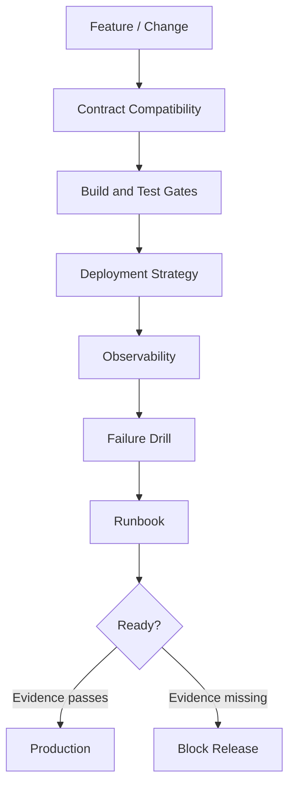
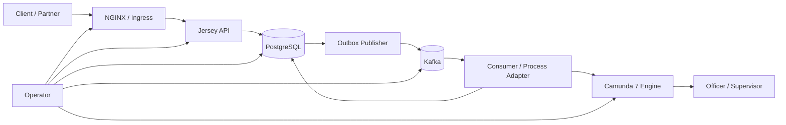
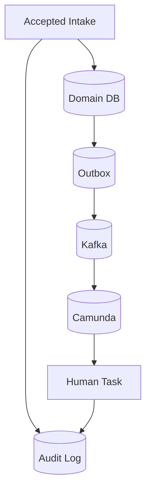
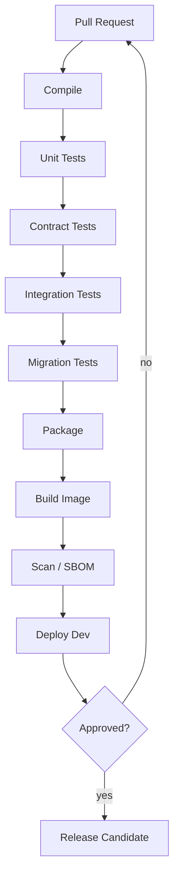
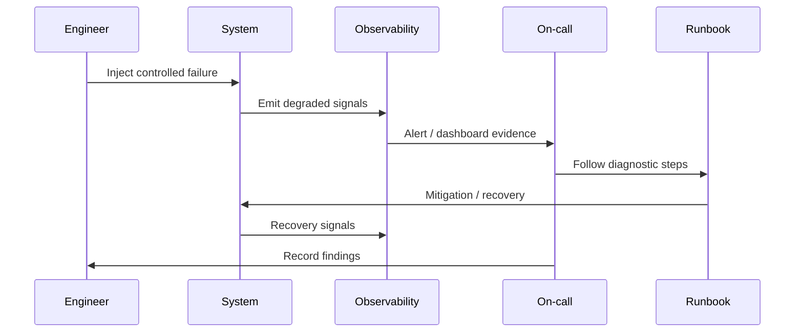
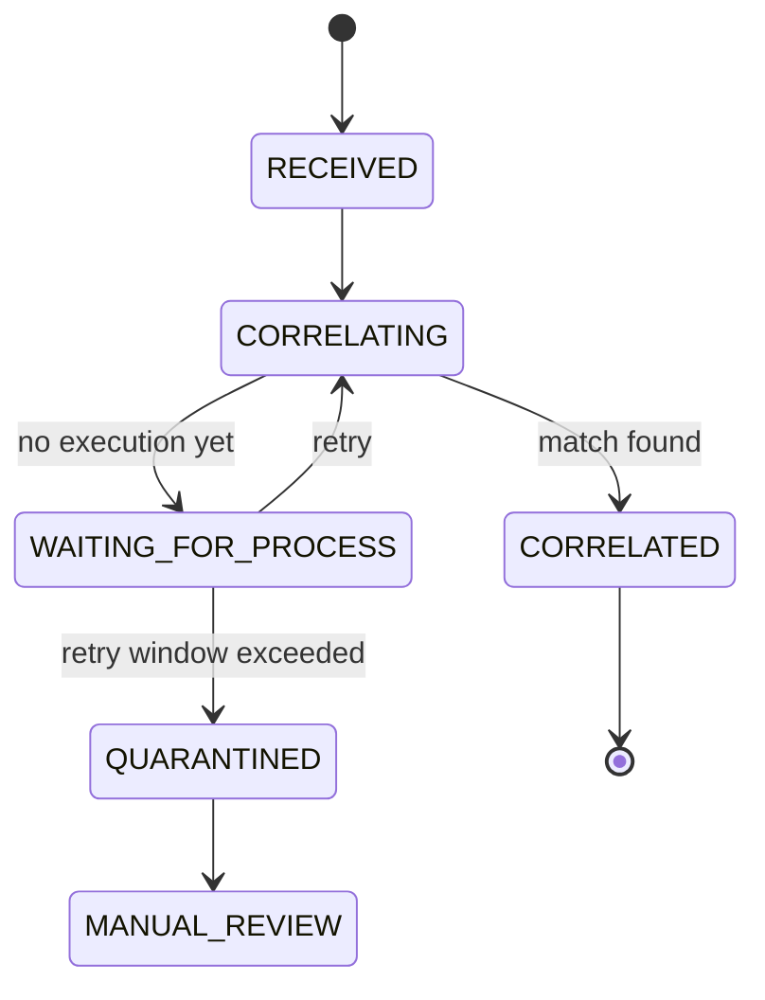
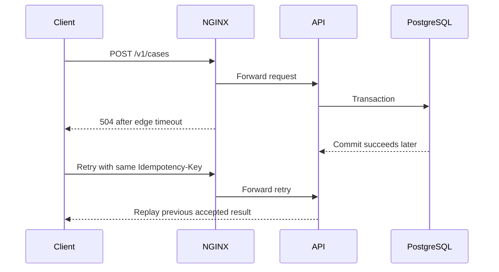
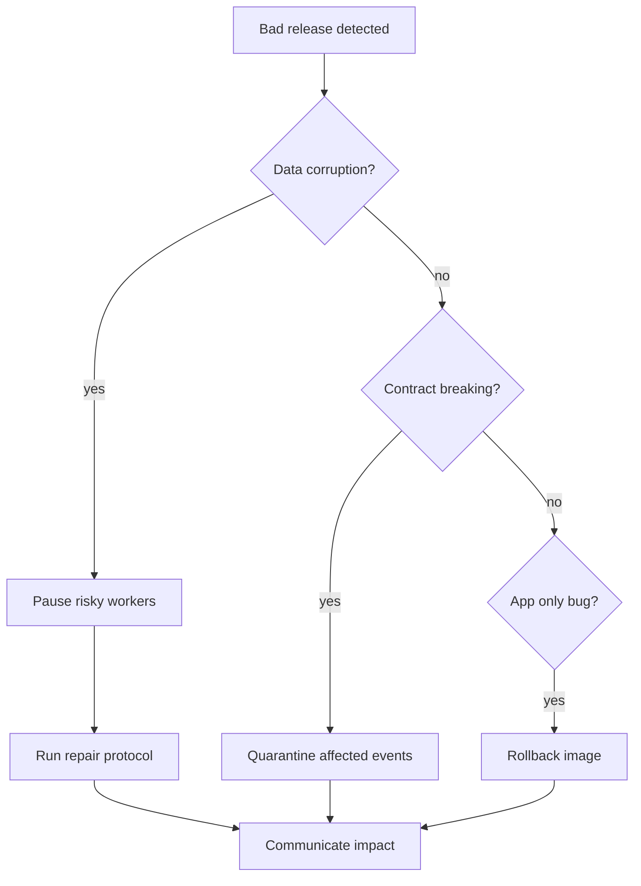

# Part 039 — Production Readiness and Failure Drills

Part sebelumnya membahas observability. Sekarang kita membahas pertanyaan yang lebih brutal:

> “Kalau sistem ini benar-benar masuk production, apa buktinya ia siap?”

Production readiness bukan checklist kosmetik. Production readiness adalah proses membuktikan bahwa sistem:

- punya kontrak yang jelas;
- bisa di-deploy tanpa merusak compatibility;
- bisa diamati saat sehat dan saat rusak;
- punya batas kegagalan yang dipahami;
- bisa recover dari failure tanpa improvisasi liar;
- punya runbook yang bisa dijalankan manusia di bawah tekanan;
- tidak menyembunyikan risiko kritis di balik “harusnya aman”.

Di sistem regulatory enforcement, readiness bukan sekadar uptime. Sistem ini memproses case, deadline, audit, evidence, decision, dan escalation. Kegagalan kecil bisa menjadi kegagalan hukum, operasional, atau reputasi.

Kita tidak mengejar sistem yang tidak pernah gagal. Itu fantasi.

Kita mengejar sistem yang gagal secara terbatas, terdeteksi cepat, bisa dijelaskan, dan bisa dipulihkan.

---

## 1. Mental Model: Production Readiness adalah Bukti, bukan Keyakinan

Banyak tim mengatakan:

> “Sudah dites, harusnya aman.”

Itu bukan readiness. Itu harapan.

Readiness harus menjawab:

1. Apa yang bisa gagal?
2. Bagaimana kita tahu itu gagal?
3. Apa dampaknya ke user, data, process, Kafka, Camunda, dan downstream?
4. Apa aksi mitigasi pertama?
5. Apa aksi recovery yang aman?
6. Apa yang tidak boleh dilakukan?
7. Bagaimana membuktikan recovery berhasil?



Production readiness adalah **evidence pipeline**.

Jika evidence tidak ada, statusnya bukan “belum tentu bermasalah”. Statusnya adalah **unknown risk**.

---

## 2. System Under Test: Apa yang Harus Siap?

Platform kita terdiri dari beberapa runtime boundary:



Readiness harus mencakup semuanya:

| Area | Bukti readiness |
|---|---|
| Contract | OpenAPI, AsyncAPI, DB schema, BPMN variable contract, error registry stabil dan versioned. |
| Build | Maven build reproducible, dependency pinned, test gates jelas, generated code deterministic. |
| API | Validation, idempotency, authorization, error mapping, timeout, request size, rate limit, compatibility. |
| Database | Schema migration aman, index ada, query plan masuk akal, lock behavior diuji, backup/restore terbukti. |
| Kafka | Topic, key, retry, DLQ/quarantine, lag monitoring, replay plan, producer/consumer idempotency. |
| Camunda | Process versioning, incident handling, job retry, migration plan, history cleanup, operator action. |
| Kubernetes | Probes, resources, shutdown, rollout, PDB, secrets/config, network policy, restart behavior. |
| NGINX | Header trust, timeout chain, buffering, body size, TLS, edge error semantics. |
| Observability | Logs, metrics, traces, dashboards, alerts, correlation, audit separation. |
| Operations | Runbook, escalation, rollback, repair, ownership, game day drills. |

Kegagalan satu boundary sering terlihat sebagai kegagalan boundary lain.

Contoh:

- PostgreSQL lock contention muncul sebagai HTTP 504.
- Kafka lag muncul sebagai SLA escalation terlambat.
- Camunda job executor overload muncul sebagai human task tidak muncul.
- NGINX timeout muncul sebagai duplicate case intake karena client retry.
- Migration buruk muncul sebagai MyBatis mapping error.

Readiness harus melihat sistem sebagai graph, bukan komponen tunggal.

---

## 3. Readiness Level

Tidak semua readiness sama. Gunakan level eksplisit.

| Level | Status | Makna |
|---|---|---|
| R0 | Demo-ready | Bisa jalan di laptop, tidak ada bukti production. |
| R1 | Integration-ready | API, DB, Kafka, Camunda bisa terhubung di environment shared. |
| R2 | Pre-production-ready | Contract, migration, observability, test, dan basic recovery sudah terbukti. |
| R3 | Launch-ready | Failure drills kritis lulus, rollback/recovery jelas, SLO dan alert aktif. |
| R4 | Sustain-ready | Sudah punya trend metrics, capacity model, routine drills, dan operational ownership matang. |

Target minimum untuk production pertama adalah **R3**.

R4 datang setelah sistem hidup dan punya data operasional nyata.

---

## 4. Non-Negotiable Production Invariants

Sebelum bicara checklist, tetapkan invariant yang tidak boleh dilanggar.

Untuk platform enforcement ini:

1. **No silent case loss**  
   Case intake yang diterima tidak boleh hilang tanpa audit dan recovery path.

2. **No untraceable decision**  
   Keputusan enforcement harus bisa ditelusuri ke input, actor, process, timestamp, dan version.

3. **No invisible failure**  
   Failure yang berdampak ke case, SLA, event, atau process harus punya signal.

4. **No unsafe duplicate side effect**  
   Retry HTTP, Kafka replay, Camunda job retry, dan worker restart tidak boleh membuat side effect ganda yang merusak.

5. **No process state without domain state**  
   Camunda tidak boleh menjadi satu-satunya sumber kebenaran domain.

6. **No schema migration without compatibility window**  
   Perubahan DB harus kompatibel dengan versi aplikasi yang masih berjalan selama rollout.

7. **No operator action without runbook**  
   Incident Camunda, Kafka poison event, DB lock storm, dan bad release harus punya instruksi operasi.

8. **No alert without action**  
   Alert yang tidak punya tindakan hanya menciptakan noise.



Jika satu garis di diagram ini bisa putus tanpa deteksi, sistem belum production-ready.

---

## 5. Readiness Gate 1 — Contract Compatibility

Contract-first bukan selesai saat file OpenAPI dibuat.

Contract-first siap production kalau perubahan kontrak punya gate.

### 5.1 HTTP API Gate

Minimal gate:

- OpenAPI valid secara syntax.
- Semua endpoint punya `operationId` stabil.
- Semua response sukses dan error punya schema.
- Semua error memakai problem detail model yang konsisten.
- Breaking change ditolak kecuali lewat versioning explicit.
- Example request/response divalidasi.
- Generated server interface tidak menghasilkan diff tak terduga.
- Contract test berjalan terhadap implementation.

Checklist:

```mdx
- [ ] Tidak menghapus field response publik tanpa deprecation window.
- [ ] Tidak mengubah tipe field publik secara breaking.
- [ ] Tidak mengubah semantic enum tanpa version note.
- [ ] Error code baru masuk registry.
- [ ] Idempotent endpoint mendokumentasikan idempotency behavior.
- [ ] Pagination, sorting, filtering terdokumentasi.
- [ ] Security requirement jelas per operation.
```

### 5.2 Event Contract Gate

Minimal gate:

- AsyncAPI valid.
- Topic naming mengikuti taxonomy.
- Event name stabil.
- Envelope wajib ada.
- `eventId`, `eventType`, `aggregateType`, `aggregateId`, `occurredAt`, `schemaVersion`, `correlationId` ada.
- Partition key terdokumentasi.
- Compatibility rule jelas.
- Replay expectation jelas.
- Consumer obligation terdokumentasi.

Checklist:

```mdx
- [ ] Event baru tidak mencampur command dan fact.
- [ ] Event key tidak berubah tanpa migration plan.
- [ ] Field baru additive dan optional/default-safe.
- [ ] Consumer lama bisa mengabaikan field baru.
- [ ] Event tidak mengandung PII yang tidak perlu.
- [ ] DLQ/quarantine reason model tersedia.
```

### 5.3 Database Contract Gate

Minimal gate:

- DDL migration review.
- Lock impact dipahami.
- Backward compatibility dengan versi aplikasi lama dicek.
- Index untuk query baru tersedia sebelum traffic bergantung padanya.
- Constraint baru memakai pola aman jika tabel besar.
- Rollback reality ditulis, bukan diasumsikan.

Checklist:

```mdx
- [ ] Migration expand sebelum code memakai kolom baru.
- [ ] Contract/drop hanya setelah semua runtime lama hilang.
- [ ] Query MyBatis baru punya index strategy.
- [ ] Constraint baru diuji pada data existing.
- [ ] Backfill bisa dihentikan dan dilanjutkan.
- [ ] Migration tidak bergantung pada urutan Pod rollout yang tidak deterministic.
```

### 5.4 BPMN Contract Gate

Minimal gate:

- Process key stabil.
- BPMN element ID stabil.
- Variable contract terdokumentasi.
- Message name dan correlation key stabil.
- Migration plan untuk active instances.
- Retry policy dan incident expectation jelas.
- Timer/SLA behavior diuji.

Checklist:

```mdx
- [ ] Tidak rename BPMN element ID tanpa migration consequence review.
- [ ] Tidak menghapus wait state yang masih ditempati active instance tanpa plan.
- [ ] Tidak mengubah variable type diam-diam.
- [ ] Message correlation uniqueness diuji.
- [ ] Business error vs technical error jelas.
- [ ] Operator tahu apa yang harus dilakukan saat incident.
```

---

## 6. Readiness Gate 2 — Build and Supply Chain

Maven build adalah pagar pertama sebelum runtime.

Minimal:

```bash
mvn -B -U clean verify
```

Tetapi production build harus lebih ketat:

| Gate | Tujuan |
|---|---|
| Format/static check | Mengurangi noise dan diff tidak perlu. |
| Dependency convergence | Mencegah classpath conflict. |
| Enforcer rules | Memaksa Java/Maven/dependency constraints. |
| Unit test | Validasi logic kecil. |
| Contract test | Memastikan API/event contract kompatibel. |
| Integration test | Memastikan PostgreSQL/Kafka/Camunda path nyata berjalan. |
| Migration test | Memastikan schema bisa naik dari versi sebelumnya. |
| Image scan | Menemukan vulnerability dan base image issue. |
| SBOM generation | Mengetahui isi software artifact. |
| Reproducible artifact | Memudahkan audit dan rollback. |

Contoh gate CI:



Anti-pattern:

- `mvn package -DskipTests` sebagai release build.
- Generated code tidak deterministic.
- Dependency version liar di child module.
- Local environment punya behavior berbeda dari CI.
- Integration test memakai mock untuk boundary yang justru sering gagal di production.

---

## 7. Readiness Gate 3 — Deployment Readiness

Deployment readiness bukan hanya “manifest apply berhasil”.

Untuk Kubernetes:

- readiness probe harus berarti “boleh menerima traffic”;
- liveness probe harus berarti “perlu restart kalau gagal”;
- startup probe dipakai jika startup lambat;
- termination grace period cukup untuk drain;
- preStop/shutdown logic menolak traffic baru dan menyelesaikan work in-flight;
- resource request/limit realistis;
- rolling update tidak menurunkan kapasitas di bawah kebutuhan minimum;
- PodDisruptionBudget melindungi availability;
- config/secret update behavior dipahami;
- migration dan rollout sequence aman.

### 7.1 Deployment Checklist

```mdx
- [ ] Image immutable tag/digest digunakan.
- [ ] Pod securityContext non-root.
- [ ] Readiness probe memeriksa dependency minimum sesuai service role.
- [ ] Liveness probe tidak terlalu agresif.
- [ ] Startup probe dipakai untuk service yang cold-start lambat.
- [ ] terminationGracePeriodSeconds cukup untuk HTTP drain / Kafka commit / outbox batch.
- [ ] Resource request/limit berdasarkan load test atau baseline observed metrics.
- [ ] RollingUpdate maxUnavailable/maxSurge sesuai kapasitas.
- [ ] PDB tersedia untuk service kritis.
- [ ] NetworkPolicy minimum tersedia.
- [ ] ServiceAccount/RBAC minimal.
- [ ] ConfigMap/Secret name/version jelas.
- [ ] Deployment annotation menyimpan git SHA dan contract version.
```

### 7.2 Role-Specific Readiness

Tidak semua Pod punya readiness yang sama.

| Runtime | Readiness meaning |
|---|---|
| API Pod | Bisa menerima HTTP, validate request, connect DB, dan tidak sedang draining. |
| Outbox publisher | Bisa claim outbox, connect DB, connect Kafka, dan publish. |
| Kafka consumer | Bisa poll Kafka, connect DB, dan memproses inbox. |
| Camunda process adapter | Bisa correlate/start process dan connect Camunda DB/API. |
| Admin/ops endpoint | Bisa melayani diagnostic tanpa mengganggu traffic utama. |

Anti-pattern:

```java
// Buruk: readiness hanya berarti JVM hidup.
GET /ready -> 200 OK
```

Lebih baik:

```json
{
  "status": "READY",
  "checks": {
    "database": "UP",
    "migrationVersion": "2026.07.03.025",
    "kafkaProducer": "UP",
    "camundaEngine": "UP",
    "draining": false
  }
}
```

Tetapi hati-hati: readiness yang terlalu tergantung pada dependency downstream bisa menyebabkan cascading removal. Bedakan service role.

API mungkin harus tidak ready jika DB tidak bisa diakses. Tetapi API tidak harus tidak ready hanya karena Kafka sementara lambat bila outbox masih bisa menampung event.

---

## 8. Readiness Gate 4 — Observability Readiness

Observability harus siap sebelum traffic production.

Minimal dashboard:

| Dashboard | Signals |
|---|---|
| API | Request rate, p50/p95/p99 latency, error rate, status class, endpoint, dependency time. |
| PostgreSQL | Connection pool, lock waits, slow query, deadlock, transaction duration, replication/backup if applicable. |
| Kafka | Producer error, publish latency, consumer lag, rebalance count, DLQ/quarantine count. |
| Camunda | Job executor backlog, failed jobs, incidents, process start rate, active instances, history cleanup. |
| Kubernetes | Pod restarts, CPU/memory, readiness changes, rollout status, OOMKilled, evictions. |
| NGINX | 4xx/5xx rate, upstream latency, 499/502/503/504, request body rejection, rate limit hits. |
| Business | Case intake accepted, case created, SLA due soon, SLA breached, decision issued, appeal opened. |

### 8.1 Alert Rules Harus Actionable

Alert buruk:

```txt
CPU > 80%
```

Alert lebih baik:

```txt
API p95 latency > 1.5s for 10m AND error_rate_5xx > 2% AND traffic > baseline_min
Runbook: API-LATENCY-001
Owner: case-platform-oncall
Impact: case intake degraded
```

Alert harus punya:

- condition;
- duration;
- severity;
- affected capability;
- probable causes;
- first diagnostic query;
- rollback/mitigation path;
- owner;
- link ke dashboard dan runbook.

### 8.2 Correlation Contract

Semua layer harus membawa correlation:

| Field | Meaning |
|---|---|
| `correlationId` | Menghubungkan request, event, process, dan log. |
| `causationId` | Menunjukkan event/command penyebab langsung. |
| `requestId` | ID request HTTP spesifik. |
| `eventId` | ID event Kafka spesifik. |
| `caseId` | Aggregate/domain ID. |
| `businessKey` | Key process Camunda. |
| `processInstanceId` | ID instance Camunda. |
| `deploymentVersion` | Version runtime. |
| `contractVersion` | Version API/event/process contract. |

Failure drill tanpa correlation akan berubah menjadi forensik manual.

---

## 9. Readiness Gate 5 — Data Safety

Data safety bukan hanya backup.

Data safety mencakup:

- preventing bad writes;
- detecting bad writes;
- stopping propagation;
- repairing safely;
- proving repair outcome;
- preserving audit.

### 9.1 Backup and Restore

Pertanyaan readiness:

- Backup berjalan?
- Restore pernah diuji?
- RPO jelas?
- RTO jelas?
- Restore bisa dilakukan ke environment isolasi?
- Apakah Camunda DB dan domain DB harus konsisten waktu restore?
- Apakah Kafka replay plan setelah restore jelas?
- Apakah outbox/inbox status setelah restore aman?

Backup yang belum pernah direstore bukan bukti recovery.

### 9.2 Data Repair Protocol

Repair script harus punya pola:

```sql
BEGIN;

-- 1. Capture target rows.
CREATE TEMP TABLE repair_target AS
SELECT case_id, status, version
FROM case_core.case
WHERE case_id = :case_id
FOR UPDATE;

-- 2. Validate expectation.
-- Fail if row does not match known bad state.

-- 3. Apply minimal mutation.
UPDATE case_core.case c
SET status = 'UNDER_REVIEW',
    version = version + 1,
    updated_at = clock_timestamp()
FROM repair_target t
WHERE c.case_id = t.case_id
  AND c.version = t.version;

-- 4. Append audit.
INSERT INTO case_audit.audit_log (...)
VALUES (...);

-- 5. Optionally emit repair event through outbox.
INSERT INTO integration.outbox_event (...)
VALUES (...);

COMMIT;
```

Repair anti-pattern:

```sql
UPDATE case_core.case SET status = 'CLOSED';
```

Tanpa predicate, audit, lock, expected old state, dan outbox implication, repair script adalah risiko production.

---

## 10. Readiness Gate 6 — Security and Compliance

Karena ini platform enforcement, security readiness tidak boleh diperlakukan sebagai tambahan.

Checklist:

```mdx
- [ ] Semua endpoint punya authentication requirement.
- [ ] Object-level authorization diuji, bukan hanya role-level.
- [ ] Tenant/agency boundary diuji.
- [ ] Sensitive fields tidak muncul di log.
- [ ] Audit event mencatat actor, action, target, timestamp, reason, dan result.
- [ ] Header dari edge disanitasi.
- [ ] NGINX membatasi request size.
- [ ] Rate limit untuk endpoint mahal atau partner-facing.
- [ ] Secrets tidak masuk image, log, atau config publik.
- [ ] Database role punya privilege minimum.
- [ ] Admin endpoint dilindungi lebih ketat.
- [ ] Manual repair butuh approval dan audit.
```

Security failure drill perlu dilakukan juga.

Contoh drill:

- user mencoba akses case beda tenant;
- partner mengirim header spoofed `X-User-Id`;
- request body besar menyerang API;
- token expired saat retry idempotent;
- officer mencoba complete task yang bukan miliknya;
- admin endpoint dipanggil dari network tidak sah.

---

## 11. Failure Drill Philosophy

Failure drill adalah latihan kecil untuk membuat sistem dan tim jujur.

Tujuannya bukan membuat chaos besar. Tujuannya membuktikan:

- detection bekerja;
- blast radius dipahami;
- runbook bisa dijalankan;
- recovery aman;
- telemetry cukup;
- postmortem menghasilkan perbaikan.



Setiap drill harus punya:

| Field | Description |
|---|---|
| ID | Stable drill identifier. |
| Scenario | Failure yang disimulasikan. |
| Blast radius | Area yang boleh terdampak. |
| Preconditions | Environment, traffic, data, feature flag. |
| Injection method | Cara membuat failure. |
| Expected signal | Metric/log/trace/alert yang harus muncul. |
| Expected behavior | Behavior sistem yang benar. |
| Recovery action | Langkah memulihkan. |
| Abort condition | Kapan drill dihentikan. |
| Evidence | Bukti lulus/gagal. |

---

## 12. Failure Drill Matrix

Ini matrix minimum untuk platform kita.

| Drill ID | Scenario | Expected behavior |
|---|---|---|
| API-001 | Client retry karena timeout edge | Idempotency mencegah duplicate case. |
| API-002 | Payload invalid besar | NGINX/API menolak dengan error jelas, tidak membebani DB. |
| API-003 | Unauthorized cross-tenant access | 403/404 strategy konsisten, audit security event. |
| DB-001 | PostgreSQL restart singkat | API fail fast/degrade, connection pool recover, no silent partial write. |
| DB-002 | Lock contention pada case row | Timeout/409/retry mapping benar, no lost update. |
| DB-003 | Migration add column/index | Old and new app versions tetap kompatibel selama rollout. |
| KAFKA-001 | Broker unavailable sementara | Outbox menahan event, retry publish, API tetap konsisten. |
| KAFKA-002 | Consumer lag tinggi | Alert lag, SLA projection tidak diam-diam salah. |
| KAFKA-003 | Poison event | Event masuk quarantine/DLQ, consumer tidak stuck. |
| CAM-001 | Service task gagal teknis | Retry lalu incident, operator bisa triage. |
| CAM-002 | Message arrives before wait state | Correlation buffer/retry bekerja. |
| CAM-003 | Active process version migration | Instance lama tetap aman atau dimigrasi dengan plan. |
| K8S-001 | Rolling deployment | No traffic to unready Pod, graceful shutdown berhasil. |
| K8S-002 | Pod OOMKilled | Restart signal muncul, capacity issue terlihat. |
| NGINX-001 | Upstream timeout | 504 observable, backend behavior diketahui, idempotency aman. |
| OBS-001 | Correlation trace missing | Gate gagal; tidak boleh release sampai fixed. |
| OPS-001 | Bad release rollback | Rollback app + DB compatibility path terbukti. |

---

## 13. Drill API-001 — Client Retry Karena Timeout Edge

### Goal

Membuktikan bahwa duplicate HTTP request tidak membuat duplicate case atau duplicate process.

### Scenario

Client mengirim `POST /v1/cases` dengan `Idempotency-Key`. NGINX timeout terjadi sebelum client menerima response. Client retry request yang sama.

### Expected behavior

- Request pertama mungkin sukses di backend.
- Request kedua mengembalikan hasil yang sama atau status idempotent replay.
- Hanya satu `case_id` dibuat.
- Hanya satu outbox event `CaseAccepted` dibuat.
- Hanya satu process instance dimulai.
- Audit mencatat duplicate request sebagai idempotency replay, bukan action baru.

### Evidence query

```sql
SELECT idempotency_key, request_fingerprint, response_status, case_id, created_at
FROM case_core.idempotency_request
WHERE idempotency_key = :key;

SELECT case_id, count(*)
FROM case_core.case
WHERE external_reference = :external_reference
GROUP BY case_id;

SELECT aggregate_id, event_type, count(*)
FROM integration.outbox_event
WHERE aggregate_id = :case_id
GROUP BY aggregate_id, event_type;
```

### Pass criteria

```mdx
- [ ] Duplicate request tidak membuat duplicate aggregate.
- [ ] Response retry deterministik.
- [ ] Correlation ID terlihat di log API dan DB audit.
- [ ] Outbox tidak duplicate.
- [ ] Camunda process tidak duplicate.
```

### Failure meaning

Jika gagal, sistem belum aman untuk endpoint command publik.

---

## 14. Drill DB-002 — Lock Contention pada Case Row

### Goal

Membuktikan bahwa concurrent update pada case tidak menyebabkan lost update atau thread starvation.

### Scenario

Dua actor mencoba transisi case yang sama:

- officer A submit recommendation;
- supervisor B escalates case;
- Kafka consumer mencoba apply external update.

### Expected behavior

- Satu transaksi menang.
- Transaksi lain gagal dengan conflict/retryable classification yang benar.
- Tidak ada state campuran.
- Audit hanya mencatat action yang commit.
- Metrics lock wait naik tetapi tidak silent.

### PL/pgSQL pattern

```sql
SELECT *
FROM case_core.case
WHERE case_id = p_case_id
FOR UPDATE;
```

atau optimistic:

```sql
UPDATE case_core.case
SET status = :new_status,
    version = version + 1
WHERE case_id = :case_id
  AND version = :expected_version;
```

Jika affected row = 0, mapping ke conflict.

### Pass criteria

```mdx
- [ ] No lost update.
- [ ] No double audit for failed transaction.
- [ ] API maps conflict to expected error.
- [ ] Kafka consumer can retry or quarantine based on error taxonomy.
- [ ] Lock wait metric visible.
```

---

## 15. Drill KAFKA-001 — Broker Unavailable Sementara

### Goal

Membuktikan bahwa domain transaction tidak bergantung pada synchronous Kafka availability.

### Scenario

Kafka publish gagal selama beberapa menit.

### Expected behavior

- API tetap bisa accept case jika DB sehat.
- Outbox event tersimpan dengan status `PENDING` atau retryable status.
- Publisher retry dengan backoff.
- Alert muncul jika backlog melewati threshold.
- Setelah Kafka pulih, event dipublish.
- Consumer memproses tanpa duplicate harmful effect.

### Evidence query

```sql
SELECT status, count(*)
FROM integration.outbox_event
GROUP BY status;

SELECT event_type, max(next_attempt_at), max(attempt_count)
FROM integration.outbox_event
WHERE status IN ('PENDING', 'CLAIMED', 'FAILED_RETRYABLE')
GROUP BY event_type;
```

### Metrics

- outbox backlog size;
- oldest pending event age;
- publish failure rate;
- Kafka producer error rate;
- consumer lag after recovery.

### Pass criteria

```mdx
- [ ] No accepted case loses event.
- [ ] Backlog visible.
- [ ] Publisher recovers automatically.
- [ ] Operator can manually pause/resume publisher if needed.
- [ ] Replay does not create duplicate Camunda instance.
```

---

## 16. Drill KAFKA-003 — Poison Event

### Goal

Membuktikan bahwa satu event buruk tidak menghentikan seluruh consumer group.

### Scenario

Consumer menerima event dengan schema valid tetapi semantic invalid, misalnya `caseId` tidak ditemukan atau transition impossible.

### Expected behavior

- Consumer tidak infinite retry di hot loop.
- Event masuk inbox status `QUARANTINED` atau DLQ.
- Offset handling tidak membuat partition stuck tanpa visibility.
- Alert muncul.
- Operator bisa inspect payload, reason, dan correlation.

### Inbox fields

```sql
SELECT event_id,
       topic,
       partition_no,
       offset_no,
       status,
       error_code,
       error_message,
       attempt_count,
       next_attempt_at
FROM integration.inbox_event
WHERE status IN ('FAILED_RETRYABLE', 'QUARANTINED');
```

### Pass criteria

```mdx
- [ ] Consumer continues processing other events where ordering rules allow.
- [ ] Poison event reason is visible.
- [ ] Payload is retained safely or redacted according to privacy policy.
- [ ] Manual reprocess path exists.
- [ ] DLQ/quarantine count alert is actionable.
```

---

## 17. Drill CAM-001 — Service Task Gagal Teknis

### Goal

Membuktikan bahwa technical failure di Camunda service task menjadi retry/incident yang bisa dioperasikan.

### Scenario

Service task `GeneratePreliminaryAssessment` gagal karena dependency internal down.

### Expected behavior

- Job retry mengikuti policy.
- Setelah retry habis, incident dibuat.
- Incident terlihat di Cockpit/ops dashboard.
- Operator punya runbook: inspect variable, check dependency, fix data/dependency, retry job.
- Domain state tidak berpura-pura sukses.

### Decision table

| Failure | BPMN behavior | Reason |
|---|---|---|
| Business validation fails | BPMN error / modeled path | Dapat diprediksi dan bagian domain. |
| Dependency timeout | Technical exception + retry | Mungkin pulih. |
| Data corruption | Incident/quarantine | Butuh manusia. |
| Duplicate command | Idempotent success/no-op | Bukan failure. |

### Pass criteria

```mdx
- [ ] Incident visible.
- [ ] Business key and caseId present.
- [ ] Error category clear.
- [ ] Retry action documented.
- [ ] No duplicate domain side effect after retry.
```

---

## 18. Drill CAM-002 — Message Arrives Before Wait State

### Goal

Membuktikan bahwa race antara Kafka event dan BPMN wait state tidak menyebabkan event hilang.

### Scenario

`EvidenceSubmitted` event datang sebelum process instance mencapai message catch event.

### Expected behavior

- Event tidak hilang.
- Correlation attempt gagal dengan reason known.
- Event disimpan di buffer/inbox untuk retry.
- Saat process mencapai wait state, event berhasil correlated.
- Jika timeout, operator melihat unmatched correlation.

### State machine



### Pass criteria

```mdx
- [ ] No event loss.
- [ ] Correlation retry is bounded.
- [ ] Quarantine has reason and payload reference.
- [ ] Process eventually proceeds when valid.
- [ ] Metrics show unmatched correlation count.
```

---

## 19. Drill K8S-001 — Rolling Deployment

### Goal

Membuktikan bahwa rolling update tidak memutus in-flight work atau menerima traffic sebelum siap.

### Scenario

Deploy versi baru API, outbox publisher, dan consumer.

### Expected behavior

- New Pod tidak menerima traffic sampai readiness true.
- Old Pod menyelesaikan in-flight request atau menolak dengan graceful response.
- Kafka consumer commit aman sebelum shutdown.
- Outbox publisher melepas claim atau claim expired safely.
- No duplicate harmful side effects.
- No error spike signifikan.

### Kubernetes behavior expectation

- readiness probe mengontrol traffic eligibility;
- termination sends signal;
- grace period memberi waktu shutdown;
- Deployment rolling strategy mengontrol surge/unavailable.

### Pass criteria

```mdx
- [ ] Zero or acceptable bounded error increase.
- [ ] No stuck outbox CLAIMED beyond timeout.
- [ ] No consumer rebalance storm beyond expected window.
- [ ] No in-flight request lost without idempotency recovery.
- [ ] Rollout status and events observable.
```

---

## 20. Drill NGINX-001 — Upstream Timeout

### Goal

Membuktikan bahwa timeout chain dipahami dan duplicate retry aman.

### Scenario

Backend API lebih lambat dari `proxy_read_timeout`.

### Expected behavior

- Client mendapat 504 dari edge.
- Backend mungkin masih menyelesaikan request.
- Idempotency membuat retry aman.
- Logs menghubungkan NGINX request ID dan backend correlation ID.
- Timeout metric terlihat.

### Timeout chain



### Pass criteria

```mdx
- [ ] Retry returns stable result.
- [ ] No duplicate domain record.
- [ ] NGINX and API logs are correlated.
- [ ] Timeout thresholds are documented.
- [ ] Alert triggers only when impact threshold exceeded.
```

---

## 21. Drill OPS-001 — Bad Release Rollback

### Goal

Membuktikan bahwa tim bisa rollback tanpa memperparah data.

### Scenario

Release baru memiliki bug di mapper atau BPMN delegate.

### Expected behavior

- Rollback app image bisa dilakukan.
- DB migration sudah expand-compatible sehingga old app tetap jalan.
- New events yang sudah dipublish tetap bisa ditangani atau dikarantina.
- Camunda instances yang dibuat versi baru tidak menghancurkan versi lama.
- Operator tahu apakah perlu disable feature flag, pause consumer, atau stop process adapter.

### Rollback decision tree



### Pass criteria

```mdx
- [ ] Rollback command documented.
- [ ] DB compatibility confirmed.
- [ ] Feature flag/off switch works.
- [ ] Impacted cases can be identified.
- [ ] Audit trail preserved.
- [ ] Post-rollback smoke test passes.
```

---

## 22. Load, Capacity, and Saturation Readiness

Production readiness tidak lengkap tanpa kapasitas.

Minimal load profile:

| Capability | Load question |
|---|---|
| Case intake | Berapa request/second yang bisa diterima dengan p95 latency target? |
| Case search | Query mana yang paling mahal? Apakah pagination aman? |
| Outbox publisher | Berapa event/second yang bisa dikirim? Berapa backlog drain rate? |
| Consumer | Berapa event/second per partition? Apa cost per event? |
| Camunda | Berapa process instance/hour? Berapa job executor throughput? |
| Human task queue | Berapa task aktif dan query queue yang aman? |
| PostgreSQL | Connection pool, lock wait, slow query, index size, bloat. |

### 22.1 Capacity Formula Dasar

Untuk outbox:

```txt
required_drain_rate = peak_event_creation_rate * safety_factor
```

Contoh:

```txt
peak_event_creation_rate = 200 events/sec
safety_factor = 2
required_drain_rate = 400 events/sec
```

Jika publisher hanya bisa drain 150 events/sec, backlog akan tumbuh saat peak.

Untuk consumer lag:

```txt
lag_recovery_time = lag_count / (consumer_drain_rate - incoming_rate)
```

Jika incoming rate lebih besar dari drain rate, lag tidak akan pulih.

### 22.2 Saturation Signals

| Component | Saturation signal |
|---|---|
| API | Thread pool exhausted, connection pool waiting, p99 latency naik. |
| PostgreSQL | lock wait, CPU high, IO wait, connection saturation, long transaction. |
| Kafka | consumer lag naik, rebalance frequent, produce latency naik. |
| Camunda | job backlog, acquisition wait, incident increase, history cleanup competing. |
| Kubernetes | CPU throttling, memory pressure, OOMKilled, pending Pod. |
| NGINX | upstream timeout, active connections high, request buffering pressure. |

---

## 23. Environment Readiness

Environment harus diperlakukan sebagai produk.

| Environment | Purpose | Required fidelity |
|---|---|---|
| Local | Development feedback | Docker Compose/Testcontainers acceptable. |
| CI | Deterministic validation | Ephemeral PostgreSQL/Kafka/Camunda where possible. |
| Dev | Integration | Shared services, low data sensitivity. |
| Staging | Release rehearsal | Production-like topology, sanitized realistic data. |
| Production | Real workload | Full observability, security, backup, on-call. |
| Disaster recovery | Recovery proof | Restore/replay/failover test. |

Anti-pattern:

- staging berbeda total dari production;
- migration hanya diuji di empty database;
- load test memakai data kecil;
- Kafka partition count berbeda jauh;
- Camunda history level berbeda;
- NGINX timeout berbeda tanpa alasan.

---

## 24. Launch Readiness Review Template

Gunakan template ini sebelum production launch.

```mdx
# Launch Readiness Review

## Service
- Name:
- Owner:
- On-call rotation:
- Business capability:
- Criticality:

## Contracts
- OpenAPI version:
- AsyncAPI version:
- DB migration version:
- BPMN process version:
- Error registry version:

## Architecture
- Runtime components:
- External dependencies:
- Data stores:
- Kafka topics:
- Camunda process definitions:

## SLO
- Availability target:
- Latency target:
- Error budget:
- Business SLO:

## Capacity
- Expected RPS:
- Peak RPS:
- Event rate:
- Backlog drain rate:
- DB connection pool:
- Kafka partitions:

## Observability
- Dashboards:
- Alerts:
- Log fields:
- Trace coverage:
- Audit coverage:

## Failure Drills
- Completed drills:
- Failed drills:
- Accepted risks:
- Blocking risks:

## Release Plan
- Deployment order:
- Migration plan:
- Feature flags:
- Rollback plan:
- Communication plan:

## Decision
- Go / No-Go:
- Approver:
- Date:
```

---

## 25. Go / No-Go Decision Matrix

| Finding | Severity | Decision |
|---|---|---|
| Missing idempotency on public command endpoint | Critical | No-Go |
| No rollback path for incompatible DB migration | Critical | No-Go |
| No alert for Camunda incidents | High | No-Go for workflow-critical release |
| Kafka lag dashboard missing | High | Conditional only if Kafka path not active |
| NGINX timeout undocumented | Medium | Fix before launch if public traffic involved |
| Non-critical dashboard polish missing | Low | Go with follow-up |
| Load test below peak target | High | No-Go or traffic cap |
| Security object-level authorization untested | Critical | No-Go |

Readiness review harus punya keberanian mengatakan **No-Go**.

---

## 26. Runbook Quality Bar

Runbook yang baik membantu orang yang sedang lelah, tertekan, dan tidak punya konteks penuh.

Runbook buruk:

```txt
Check logs and restart service.
```

Runbook baik:

```mdx
# Runbook: OUTBOX-BACKLOG-001

## Symptom
Outbox oldest pending event age > 5 minutes.

## Impact
Downstream Kafka consumers may not receive case events. Camunda process start may be delayed.

## First checks
1. Check Kafka producer error rate dashboard.
2. Check integration.outbox_event status count.
3. Check publisher Pod restart count.
4. Check PostgreSQL lock wait on outbox table.

## Queries
<SQL here>

## Mitigation
- If Kafka unavailable: wait for broker recovery, do not delete outbox rows.
- If publisher stuck: scale publisher to 0 then 1, verify stale claim recovery.
- If poison event blocks batch: quarantine event ID using approved script.

## Do not
- Do not manually mark events PUBLISHED unless Kafka publish proof exists.
- Do not truncate outbox.
- Do not replay all events without deduplication check.

## Recovery validation
- Oldest pending event age decreasing.
- Published count increasing.
- Consumer lag recovering.
- No increase in duplicate event errors.
```

---

## 27. Production Readiness Checklist Final

### Contract

```mdx
- [ ] OpenAPI compatible.
- [ ] AsyncAPI compatible.
- [ ] Error registry updated.
- [ ] DB migration reviewed.
- [ ] BPMN process version/migration reviewed.
```

### Build

```mdx
- [ ] Maven verify passes.
- [ ] Contract tests pass.
- [ ] Integration tests pass.
- [ ] Migration tests pass.
- [ ] Image scan acceptable.
- [ ] SBOM produced.
```

### Runtime

```mdx
- [ ] Kubernetes probes meaningful.
- [ ] Resource requests/limits set.
- [ ] Graceful shutdown tested.
- [ ] NGINX timeout/body/header behavior tested.
- [ ] Secrets/config validated.
```

### Data

```mdx
- [ ] Backup exists.
- [ ] Restore tested.
- [ ] Repair protocol exists.
- [ ] Audit trail validated.
- [ ] Data retention policy known.
```

### Kafka

```mdx
- [ ] Topic/key/partition strategy documented.
- [ ] Outbox publisher tested.
- [ ] Consumer inbox/idempotency tested.
- [ ] DLQ/quarantine tested.
- [ ] Lag alert active.
```

### Camunda

```mdx
- [ ] Process definition deployed.
- [ ] Message correlation tested.
- [ ] Timer/SLA tested.
- [ ] Incident handling runbook exists.
- [ ] History cleanup configured.
```

### Observability

```mdx
- [ ] Logs structured.
- [ ] Metrics dashboard ready.
- [ ] Trace/correlation works.
- [ ] Alerts actionable.
- [ ] Business metrics available.
```

### Operations

```mdx
- [ ] On-call owner assigned.
- [ ] Runbooks reviewed.
- [ ] Failure drills completed.
- [ ] Rollback tested.
- [ ] Communication path ready.
```

---

## 28. Common Production Readiness Anti-Patterns

### 28.1 “Kita Sudah Punya Kubernetes, Berarti Ready”

Kubernetes menjalankan container. Kubernetes tidak otomatis membuat:

- idempotency;
- safe migration;
- correct timeout;
- process recovery;
- Kafka replay safety;
- audit correctness;
- good runbooks.

### 28.2 “Kafka akan Menjamin Exactly Once End-to-End”

Kafka bisa menyediakan semantics tertentu dalam konteks tertentu, tetapi side effect ke PostgreSQL, Camunda, HTTP downstream, dan external system tetap butuh idempotency.

### 28.3 “Camunda adalah Source of Truth”

Camunda adalah process execution engine. Untuk enforcement platform, domain state dan audit harus tetap dikontrol oleh domain model/database.

### 28.4 “Rollback Tinggal Deploy Image Lama”

Kalau DB migration breaking, event contract berubah, atau BPMN instance sudah masuk versi baru, rollback image saja bisa gagal.

### 28.5 “Alert Banyak Berarti Observability Bagus”

Alert banyak sering berarti noise. Alert bagus mengarah ke tindakan.

### 28.6 “Manual Repair Bisa Nanti”

Repair script yang ditulis saat incident biasanya berisiko tinggi. Minimal template dan approval path harus ada sebelum launch.

---

## 29. What Top Engineers Actually Do Here

Engineer kuat tidak hanya bertanya:

> “Apakah kode sudah benar?”

Mereka bertanya:

- Apa invariant sistem?
- Apa failure mode paling mahal?
- Apa yang terjadi saat retry?
- Apa yang terjadi saat deploy setengah jalan?
- Apa yang terjadi saat event datang terlalu cepat?
- Apa yang terjadi saat migration berjalan di data besar?
- Apa yang terjadi saat operator salah klik?
- Apa yang terjadi saat rollback dilakukan setelah sebagian data sudah berubah?
- Apa bukti bahwa alert, runbook, dan recovery bekerja?

Production readiness adalah disiplin membuat jawaban itu eksplisit.

---

## 30. Output dari Part Ini

Setelah part ini, kamu harus punya:

1. readiness level model;
2. non-negotiable invariants;
3. compatibility gate lintas kontrak;
4. deployment readiness checklist;
5. observability readiness matrix;
6. data safety protocol;
7. failure drill matrix;
8. launch readiness template;
9. go/no-go decision matrix;
10. runbook quality bar.

Part berikutnya adalah part terakhir: **End-to-End Release and Final System Review**.

Di sana kita akan menyatukan semua bagian dari Part 001 sampai Part 039 menjadi satu release walkthrough end-to-end.

---

## References

- Kubernetes Documentation — Pod Lifecycle and probes: https://kubernetes.io/docs/concepts/workloads/pods/pod-lifecycle/
- Kubernetes Documentation — Configure Liveness, Readiness and Startup Probes: https://kubernetes.io/docs/tasks/configure-pod-container/configure-liveness-readiness-startup-probes/
- Kubernetes Documentation — Pod termination flow: https://kubernetes.io/docs/tutorials/services/pods-and-endpoint-termination-flow/
- Google SRE Book — Launch Coordination and Production Readiness Review: https://sre.google/sre-book/launch-checklist/
- Google SRE Book — Evolving SRE Engagement Model: https://sre.google/sre-book/evolving-sre-engagement-model/
- Apache Kafka Documentation: https://kafka.apache.org/documentation/
- Confluent Documentation — Kafka Delivery Semantics: https://docs.confluent.io/kafka/design/delivery-semantics.html
- Confluent Documentation — Monitor Consumer Lag: https://docs.confluent.io/platform/current/monitor/monitor-consumer-lag.html
- Camunda Documentation — Operating Camunda 7: https://docs.camunda.io/docs/8.7/components/best-practices/operations/operating-camunda-c7/
- PostgreSQL Documentation — Explicit Locking: https://www.postgresql.org/docs/current/explicit-locking.html
