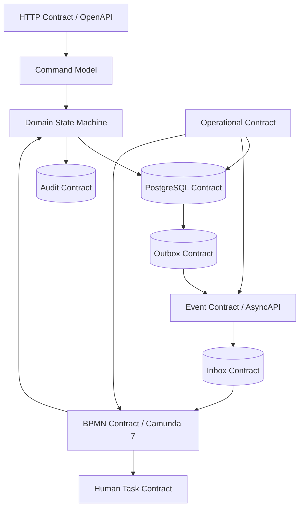
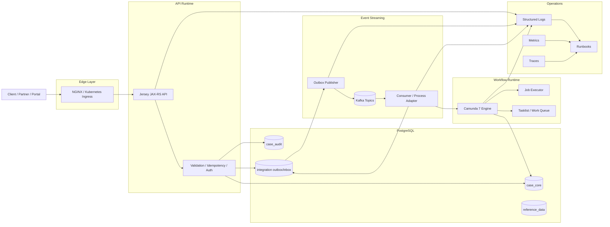
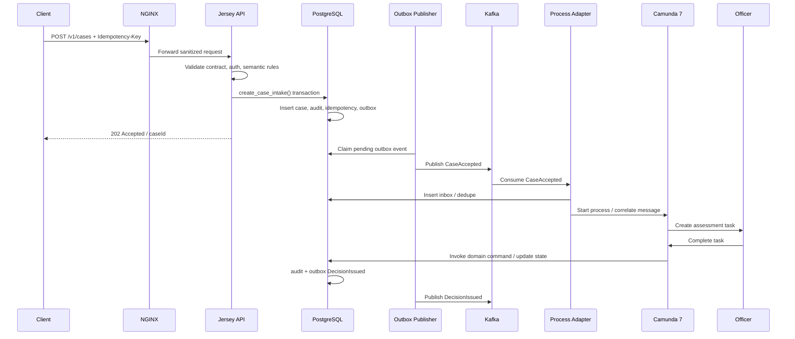
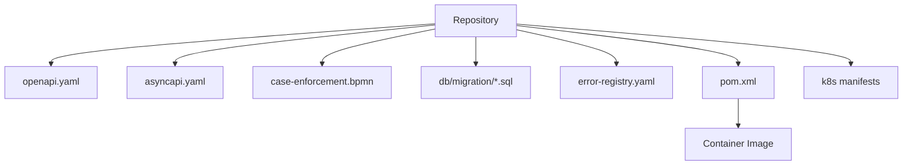
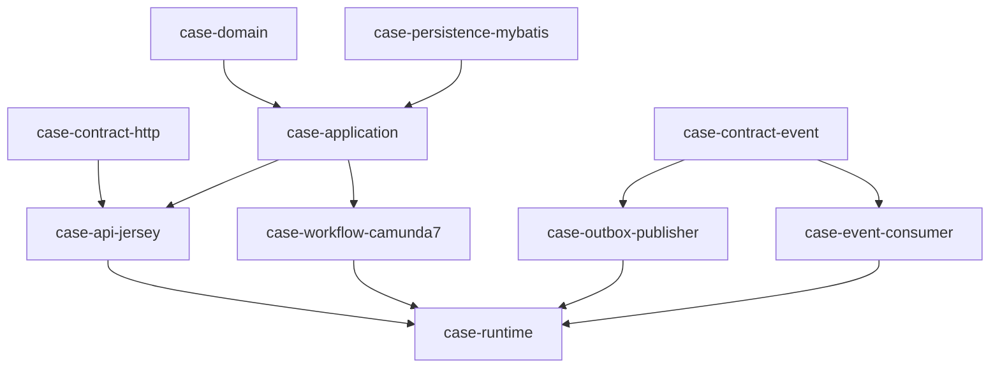
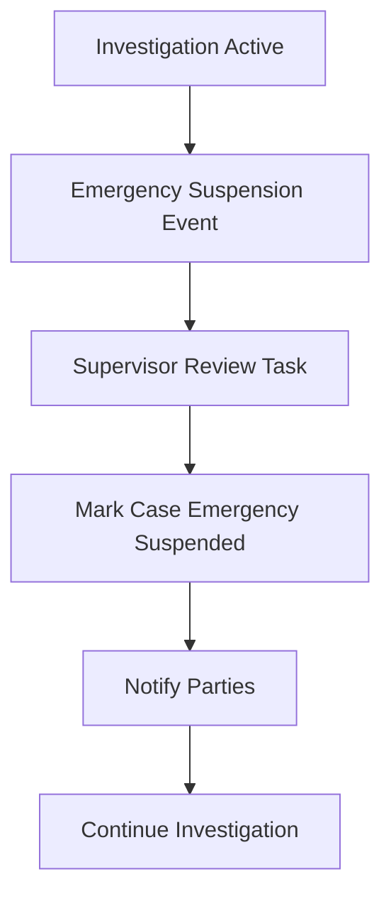
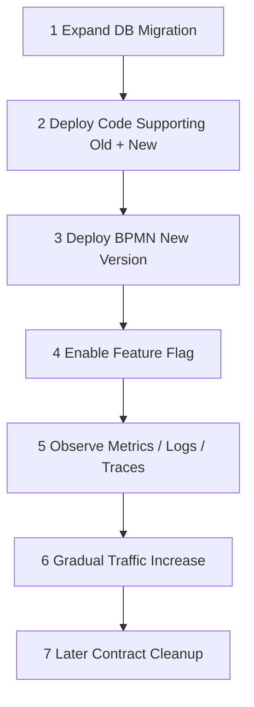
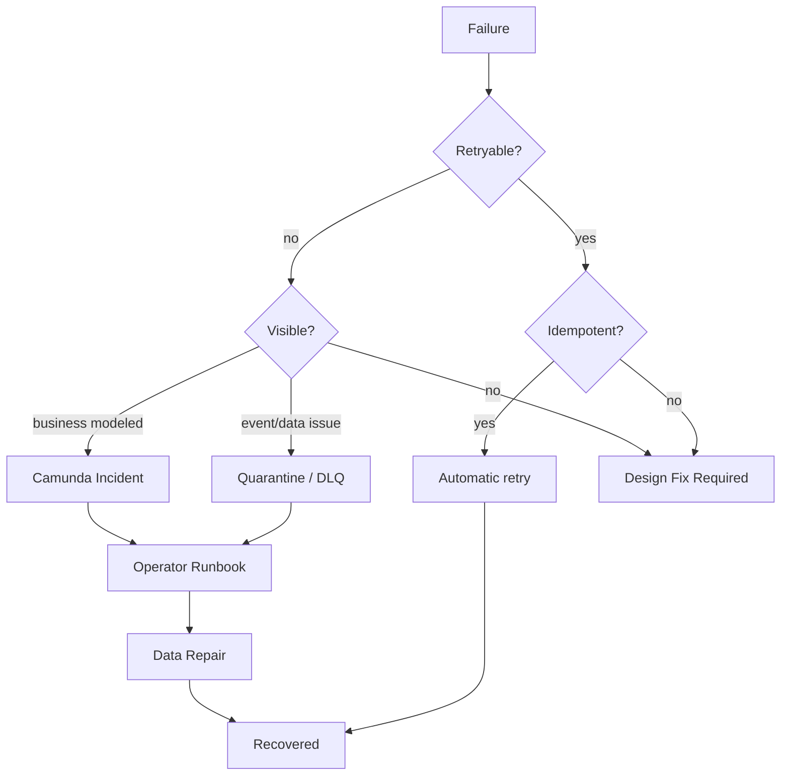

# Part 040 — End-to-End Release and Final System Review

Ini adalah part terakhir dari seri **Learn Production Grade Contract-First Java Orchestration Platform**.

Seri ini dimulai dari skill map dan studi kasus, lalu bergerak melalui contract-first design, Java/Jersey, PostgreSQL/MyBatis/PL/pgSQL, Camunda 7, Kafka, Kubernetes, NGINX, observability, dan production readiness.

Sekarang kita menyatukannya menjadi satu release walkthrough end-to-end.

Tujuan part ini bukan menambah teknologi baru. Tujuannya adalah membuat kamu bisa melihat sistem sebagai satu mesin utuh.

> Engineer biasa melihat service, table, topic, endpoint, dan deployment.  
> Engineer kuat melihat kontrak, invariant, failure boundary, lifecycle, dan operational proof.

---

## 1. Final System Mental Model

Platform ini adalah sistem orchestration berbasis kontrak.

Bukan “Java app dengan database”.

Bukan “Camunda workflow dengan beberapa service”.

Bukan “Kafka pipeline”.

Ini adalah sistem yang memproses enforcement case melalui beberapa state machine yang saling berhubungan:



Setiap boundary punya kontrak:

| Boundary | Contract | Failure question |
|---|---|---|
| Client → API | OpenAPI | Apa yang boleh dikirim dan diterima client? |
| API → Domain | Command/result model | Apakah request valid sebagai intent bisnis? |
| Domain → DB | Schema/function/constraint | Apakah invariant data dipaksa? |
| Domain → Audit | Audit event | Apakah action bisa dibuktikan? |
| DB → Kafka | Outbox | Apakah event tidak hilang saat publish gagal? |
| Kafka → Consumer | AsyncAPI/topic/key | Apakah consumer bisa proses/replay dengan aman? |
| Consumer → Camunda | Correlation contract | Apakah process bangun pada event yang tepat? |
| Camunda → Human | Task contract | Apakah manusia tahu pekerjaan, otorisasi, dan deadline? |
| Runtime → Ops | Observability/runbook | Apakah failure bisa dideteksi dan dipulihkan? |

Inilah bentuk akhir contract-first production engineering.

---

## 2. Final Architecture Blueprint



Kunci desain:

- API menerima intent, bukan menjalankan semua proses panjang.
- PostgreSQL memaksa invariant domain dan menyimpan audit/outbox/inbox.
- Kafka mendistribusikan fakta, bukan menjadi sumber kebenaran domain tunggal.
- Camunda mengorkestrasi lifecycle dan human task, bukan menggantikan domain model.
- Kubernetes menjalankan runtime dengan probes, resource, rollout, dan shutdown discipline.
- NGINX menjadi edge contract firewall.
- Observability menyatukan semua boundary.

---

## 3. End-to-End Use Case: Case Intake sampai Enforcement Decision

Kita pakai use case akhir:

> Partner mengirim case baru. Sistem memvalidasi, membuat case, menerbitkan event, memulai proses Camunda, membuat human task assessment, menjalankan investigation, menghasilkan decision, menerbitkan final event, dan menyimpan audit lengkap.

### 3.1 Sequence Utama



### 3.2 Apa yang Harus Benar?

| Step | Invariant |
|---|---|
| HTTP intake | Request valid, authenticated, authorized, idempotent. |
| DB transaction | Case, audit, idempotency, outbox commit bersama. |
| Outbox publish | Event tidak hilang walau Kafka down. |
| Kafka consume | Duplicate event tidak membuat duplicate process. |
| Camunda start | Business key/correlation unik dan traceable. |
| Human task | Officer authorized dan task state sinkron dengan domain. |
| Decision | Decision punya audit, reason, actor, timestamp, process context. |
| Final event | Downstream menerima fakta final yang replay-safe. |

---

## 4. Contract Artifacts dalam Final Release

Release production harus menyertakan artifact kontrak.



Artifact minimum:

| Artifact | Owner | Gate |
|---|---|---|
| `openapi/case-api.yaml` | API owner | Validate, diff, generate, contract test. |
| `asyncapi/case-events.yaml` | Integration owner | Validate, compatibility, consumer obligation review. |
| `bpmn/case-enforcement.bpmn` | Workflow owner | BPMN parse/deploy test, variable contract review. |
| `db/migration/*.sql` | Persistence owner | Migration test, lock review, backward compatibility. |
| `error-registry.yaml` | Platform owner | No duplicate, mapped to HTTP/Kafka/Camunda. |
| `pom.xml` | Build owner | Enforcer, dependency convergence, reproducible build. |
| `deployment/*.yaml` | Runtime owner | Probe/resource/security review. |
| `runbooks/*.md` | Ops owner | Drill validated. |

---

## 5. Final Repository Shape

Rekomendasi final repository:

```txt
case-platform/
  pom.xml
  README.md
  docs/
    architecture/
    adr/
    runbooks/
    readiness/
  contracts/
    http/
      case-api.yaml
    events/
      case-events.yaml
    errors/
      error-registry.yaml
    bpmn/
      case-enforcement.bpmn
  modules/
    case-contract-http/
    case-contract-event/
    case-domain/
    case-application/
    case-api-jersey/
    case-persistence-mybatis/
    case-workflow-camunda7/
    case-outbox-publisher/
    case-event-consumer/
    case-runtime/
    case-test-support/
  db/
    migration/
    testdata/
    repair/
  deployment/
    docker/
    k8s/
    nginx/
  ci/
```

Dependency direction:



Rule penting:

- `domain` tidak bergantung pada Jersey, Kafka, Camunda, MyBatis, Kubernetes.
- `application` mengorkestrasi use case, bukan HTTP-specific.
- `persistence` mengimplementasi port dengan MyBatis/PostgreSQL.
- `workflow` mengadaptasi Camunda ke domain/application.
- `api` mengadaptasi OpenAPI/JAX-RS ke command model.
- `runtime` wiring composition root.

---

## 6. Final Release Walkthrough

Bayangkan kita akan release capability baru:

> Add “Emergency Suspension” path untuk case yang membutuhkan tindakan cepat.

Capability ini menyentuh:

- HTTP API: endpoint command baru atau action baru;
- DB: status/decision/audit/outbox;
- BPMN: escalation path baru;
- Kafka: event `EmergencySuspensionIssued`;
- Human task: supervisor approval;
- Authorization: role khusus;
- Observability: metric dan alert;
- Runbook: rollback dan repair.

### 6.1 Step 1 — Define Business Invariant

Invariant:

```txt
Emergency suspension can only be issued for an OPEN or UNDER_INVESTIGATION case,
requires supervisor approval,
must produce audit evidence,
must publish integration event,
and must not bypass appeal eligibility calculation.
```

Jangan mulai dari endpoint.

Mulai dari invariant.

### 6.2 Step 2 — HTTP Contract

OpenAPI action:

```yaml
paths:
  /v1/cases/{caseId}/emergency-suspension:
    post:
      operationId: issueEmergencySuspension
      parameters:
        - name: caseId
          in: path
          required: true
          schema:
            type: string
            format: uuid
        - name: Idempotency-Key
          in: header
          required: true
          schema:
            type: string
      requestBody:
        required: true
        content:
          application/json:
            schema:
              $ref: '#/components/schemas/IssueEmergencySuspensionRequest'
      responses:
        '202':
          description: Emergency suspension accepted
        '400':
          description: Invalid request
        '401':
          description: Unauthenticated
        '403':
          description: Not authorized
        '404':
          description: Case not found
        '409':
          description: Invalid case state or idempotency conflict
```

### 6.3 Step 3 — Error Registry

```yaml
errors:
  CASE_INVALID_STATE_FOR_EMERGENCY_SUSPENSION:
    category: DOMAIN_CONFLICT
    httpStatus: 409
    retryable: false
    owner: case-domain
  CASE_EMERGENCY_SUSPENSION_DUPLICATE_REQUEST:
    category: IDEMPOTENCY_REPLAY
    httpStatus: 202
    retryable: false
    owner: case-api
  CASE_EMERGENCY_SUSPENSION_AUTHORIZATION_DENIED:
    category: AUTHORIZATION
    httpStatus: 403
    retryable: false
    owner: case-security
```

### 6.4 Step 4 — DB Migration

Expand migration:

```sql
ALTER TYPE case_core.case_status
ADD VALUE IF NOT EXISTS 'EMERGENCY_SUSPENDED';

CREATE TABLE IF NOT EXISTS case_core.emergency_suspension (
  suspension_id uuid PRIMARY KEY,
  case_id uuid NOT NULL REFERENCES case_core.case(case_id),
  reason text NOT NULL,
  issued_by text NOT NULL,
  issued_at timestamptz NOT NULL DEFAULT clock_timestamp(),
  revoked_at timestamptz NULL,
  version bigint NOT NULL DEFAULT 0
);

CREATE INDEX CONCURRENTLY IF NOT EXISTS idx_emergency_suspension_case_id
ON case_core.emergency_suspension(case_id);
```

Jika enum change sulit rollback, pertimbangkan reference table atau status code table untuk domain yang sering berubah. Di production, enum PostgreSQL perlu dipakai dengan sadar karena evolution-nya tidak sama seperti string biasa.

### 6.5 Step 5 — PL/pgSQL Transition Function

```sql
CREATE OR REPLACE FUNCTION case_core.issue_emergency_suspension(
  p_case_id uuid,
  p_actor_id text,
  p_reason text,
  p_correlation_id text,
  p_idempotency_key text
) RETURNS uuid
LANGUAGE plpgsql
AS $$
DECLARE
  v_case case_core.case%ROWTYPE;
  v_suspension_id uuid := gen_random_uuid();
BEGIN
  SELECT * INTO v_case
  FROM case_core.case
  WHERE case_id = p_case_id
  FOR UPDATE;

  IF NOT FOUND THEN
    RAISE EXCEPTION USING ERRCODE = 'P0002', MESSAGE = 'case not found';
  END IF;

  IF v_case.status NOT IN ('OPEN', 'UNDER_INVESTIGATION') THEN
    RAISE EXCEPTION USING ERRCODE = 'P0001', MESSAGE = 'invalid state for emergency suspension';
  END IF;

  INSERT INTO case_core.emergency_suspension(
    suspension_id, case_id, reason, issued_by
  ) VALUES (
    v_suspension_id, p_case_id, p_reason, p_actor_id
  );

  UPDATE case_core.case
  SET status = 'EMERGENCY_SUSPENDED',
      version = version + 1,
      updated_at = clock_timestamp()
  WHERE case_id = p_case_id;

  INSERT INTO case_audit.audit_log(...)
  VALUES (...);

  INSERT INTO integration.outbox_event(...)
  VALUES (... 'EmergencySuspensionIssued' ...);

  RETURN v_suspension_id;
END;
$$;
```

### 6.6 Step 6 — Event Contract

```yaml
channels:
  case.lifecycle.events.v1:
    messages:
      EmergencySuspensionIssued:
        payload:
          type: object
          required:
            - eventId
            - eventType
            - caseId
            - suspensionId
            - issuedAt
          properties:
            eventId:
              type: string
              format: uuid
            eventType:
              const: EmergencySuspensionIssued
            caseId:
              type: string
              format: uuid
            suspensionId:
              type: string
              format: uuid
            issuedAt:
              type: string
              format: date-time
```

Event adalah fakta bahwa suspension sudah terjadi, bukan command untuk meminta suspension.

### 6.7 Step 7 — BPMN Change

Tambahkan boundary/event path:



BPMN rule:

- jangan ubah ID activity lama tanpa alasan;
- pastikan active instances tahu path baru atau tetap aman di path lama;
- migration plan harus menjawab instance yang sedang berada di `Investigation Active`;
- message correlation key tetap `caseId`/business key stabil.

### 6.8 Step 8 — Java Application Command

```java
public record IssueEmergencySuspensionCommand(
    UUID caseId,
    ActorId actorId,
    String reason,
    IdempotencyKey idempotencyKey,
    CorrelationId correlationId
) {}
```

Application service:

```java
public final class IssueEmergencySuspensionUseCase {
  private final CaseRepository caseRepository;
  private final AuthorizationService authorizationService;

  public Result<IssueEmergencySuspensionResult, DomainError> execute(
      IssueEmergencySuspensionCommand command
  ) {
    var auth = authorizationService.canIssueEmergencySuspension(
        command.actorId(), command.caseId());

    if (!auth.allowed()) {
      return Result.failure(DomainErrors.authorizationDenied());
    }

    return caseRepository.issueEmergencySuspension(command);
  }
}
```

Resource Jersey hanya adapter:

```java
@POST
@Path("/v1/cases/{caseId}/emergency-suspension")
public Response issueEmergencySuspension(
    @PathParam("caseId") UUID caseId,
    @HeaderParam("Idempotency-Key") String idempotencyKey,
    IssueEmergencySuspensionRequest request
) {
  var command = mapper.toCommand(caseId, idempotencyKey, request, requestContext);
  var result = useCase.execute(command);
  return responseMapper.toResponse(result);
}
```

### 6.9 Step 9 — Tests

Test matrix:

| Test | Purpose |
|---|---|
| OpenAPI schema test | Contract valid. |
| Resource test | HTTP mapping valid. |
| Authorization test | Only supervisor role allowed. |
| Domain state test | Invalid state rejected. |
| PL/pgSQL integration test | Lock/update/audit/outbox atomic. |
| Idempotency test | Retry safe. |
| Outbox test | Event written exactly once per accepted command. |
| Consumer test | Event replay safe. |
| BPMN test | Process path works. |
| Migration test | Old version compatibility. |
| Failure drill | Timeout/retry/incident behavior. |

### 6.10 Step 10 — Deployment Plan

Safe rollout order:



Rollback:

- disable feature flag;
- stop accepting new emergency suspension commands;
- rollback app if bug is app-only;
- do not drop DB columns/tables immediately;
- quarantine new event type if old consumer cannot process;
- keep BPMN old instances safe;
- repair only affected cases with approved script.

---

## 7. Final Design Review by Layer

### 7.1 HTTP Layer

Strong signs:

- endpoint describes business intent;
- idempotency required for command;
- error response consistent;
- authorization explicit;
- request/response schema stable;
- generated code does not leak into domain;
- resource class remains thin.

Weak signs:

- resource contains business transaction logic;
- endpoint returns raw exception;
- idempotency optional;
- hidden behavior not in OpenAPI;
- object-level authorization missing;
- HTTP status used inconsistently.

### 7.2 Domain/Application Layer

Strong signs:

- command model explicit;
- result/error typed;
- invariant named;
- workflow state not confused with domain state;
- use case coordinates ports;
- no dependency on Jersey/Kafka/Camunda.

Weak signs:

- `String status` drives everything;
- exception flow is main business protocol;
- domain calls Camunda directly;
- domain object is just DB row mirror;
- authorization done late or scattered.

### 7.3 PostgreSQL Layer

Strong signs:

- constraints enforce invariant;
- index follows query shape;
- migration expand-contract;
- PL/pgSQL used for atomic state transitions where justified;
- audit/outbox commit with domain change;
- locking strategy explicit.

Weak signs:

- no unique constraint for natural idempotency;
- migration assumes empty table;
- backfill has no batch/resume plan;
- all constraints live only in Java;
- repair SQL not audited.

### 7.4 MyBatis Layer

Strong signs:

- mapper is explicit and testable;
- SQL readable;
- resultMap stable;
- dynamic SQL controlled;
- type handlers known;
- transaction managed outside mapper.

Weak signs:

- mapper hides business decision;
- `${}` used for unsafe interpolation;
- result shape changes without test;
- N+1 query appears in hot path;
- pagination with offset on large table.

### 7.5 Kafka Layer

Strong signs:

- topic taxonomy clear;
- key strategy aligned with ordering need;
- event envelope consistent;
- outbox/inbox exist;
- consumer idempotent;
- poison events quarantined;
- replay tested.

Weak signs:

- event used as remote procedure call;
- command and fact mixed;
- consumer relies on exactly-once fantasy;
- partition key changes casually;
- DLQ is a graveyard no one monitors.

### 7.6 Camunda 7 Layer

Strong signs:

- BPMN models wait states and orchestration;
- domain logic not buried in diagram;
- variables contract documented;
- business key stable;
- message correlation tested;
- incidents have runbook;
- process versioning plan exists.

Weak signs:

- every business rule becomes gateway spaghetti;
- JavaDelegate does large non-idempotent side effects;
- technical exception modeled as business path;
- process variable is uncontrolled map;
- active instance migration ignored.

### 7.7 Kubernetes/NGINX Layer

Strong signs:

- readiness/liveness/startup probes meaningful;
- graceful shutdown tested;
- resource sizing observed;
- NGINX timeout chain known;
- edge headers sanitized;
- rollout has compatibility plan;
- security context minimum.

Weak signs:

- probe always returns 200;
- liveness kills slow but healthy service;
- Pod shutdown loses in-flight work;
- timeout mismatch causes duplicate side effect;
- config changes unversioned.

### 7.8 Observability/Ops Layer

Strong signs:

- correlation ID across HTTP/Kafka/Camunda/DB;
- structured logs;
- RED/USE/golden signals;
- business metrics;
- actionable alerts;
- failure drills;
- runbook with “do not” section.

Weak signs:

- logs only strings;
- dashboards exist but answer no questions;
- alerts have no owner;
- audit mixed with debug log;
- no one has tested recovery.

---

## 8. Final Invariant Catalog

Simpan invariant ini sebagai `docs/architecture/invariants.md`.

| ID | Invariant | Enforced by |
|---|---|---|
| INV-001 | Accepted intake creates one domain case or returns deterministic idempotency replay. | API + DB unique + idempotency table. |
| INV-002 | Domain state transition must produce audit. | PL/pgSQL/function/application transaction. |
| INV-003 | Domain state change that must be integrated creates outbox event in same DB transaction. | DB transaction. |
| INV-004 | Kafka duplicate event does not create duplicate side effect. | Inbox/idempotency table. |
| INV-005 | Camunda process business key maps to case identity. | BPMN contract + process adapter. |
| INV-006 | Human task completion must pass authorization and state validation. | Task adapter + domain function. |
| INV-007 | Migration must be compatible with current and next app version during rollout. | Release gate. |
| INV-008 | Operator repair must be audited. | Repair protocol. |
| INV-009 | No critical failure without alert/runbook. | Observability gate. |
| INV-010 | Sensitive data must not leak to logs/events unnecessarily. | Security/logging contract. |

---

## 9. Final Failure Model



Prinsip:

- retry hanya aman jika operation idempotent;
- non-retryable failure harus berhenti dengan alasan jelas;
- invisible failure adalah desain cacat;
- repair harus minimal, audited, dan reversible secara operasional;
- incident bukan kegagalan monitoring, incident adalah mekanisme eksplisit meminta intervensi.

---

## 10. Final Release Checklist

### 10.1 Before Merge

```mdx
- [ ] ADR ditulis untuk perubahan arsitektur penting.
- [ ] OpenAPI/AsyncAPI/BPMN/DB contract updated.
- [ ] Error registry updated.
- [ ] Maven verify passes.
- [ ] Contract diff reviewed.
- [ ] Migration reviewed for lock and compatibility.
- [ ] Security review for endpoint/data/event.
- [ ] Observability fields added.
- [ ] Runbook updated if new failure mode exists.
```

### 10.2 Before Deploy to Staging

```mdx
- [ ] Image built with immutable tag/digest.
- [ ] SBOM generated.
- [ ] Kubernetes manifest validated.
- [ ] Secrets/config present.
- [ ] DB migration applied in staging from production-like snapshot.
- [ ] BPMN deployment tested.
- [ ] Kafka topic/config present.
- [ ] Dashboards updated.
```

### 10.3 Before Production

```mdx
- [ ] Launch readiness review complete.
- [ ] Go/No-Go decision recorded.
- [ ] Rollback plan tested.
- [ ] Failure drills relevant to change passed.
- [ ] On-call owner aware.
- [ ] Communication plan ready.
- [ ] Feature flag default safe.
- [ ] Backup/restore posture acceptable.
```

### 10.4 During Production Deploy

```mdx
- [ ] Apply expand DB migration.
- [ ] Verify migration version.
- [ ] Deploy app with backward compatibility.
- [ ] Deploy BPMN safely.
- [ ] Observe health, errors, latency, lag, incidents.
- [ ] Enable feature gradually.
- [ ] Monitor business metrics.
```

### 10.5 After Deploy

```mdx
- [ ] Smoke test critical flows.
- [ ] Check error rate and latency.
- [ ] Check outbox backlog.
- [ ] Check Kafka consumer lag.
- [ ] Check Camunda incidents/job backlog.
- [ ] Check PostgreSQL lock/slow query.
- [ ] Check NGINX 5xx/timeout.
- [ ] Record release notes and known risks.
```

---

## 11. Capstone Exercise

Untuk benar-benar menguasai seri ini, bangun satu vertical slice lengkap.

### Feature

`POST /v1/cases/{caseId}/appeals`

Capability:

- citizen/representative submits appeal;
- case must be in appealable decision state;
- submission deadline must not be expired;
- evidence can be attached by reference;
- event `AppealSubmitted` published;
- Camunda process moves to appeal review;
- human task assigned to appeal officer;
- SLA starts;
- audit captured.

### Deliverables

```mdx
- [ ] OpenAPI endpoint and schema.
- [ ] Error registry entries.
- [ ] PostgreSQL migration.
- [ ] PL/pgSQL transition function or equivalent transaction design.
- [ ] MyBatis mapper.
- [ ] Java command/result/error model.
- [ ] Jersey resource.
- [ ] AsyncAPI event schema.
- [ ] Outbox publication.
- [ ] Consumer inbox/idempotency.
- [ ] Camunda BPMN message/event path.
- [ ] Human task contract.
- [ ] Kubernetes deployment config if new worker needed.
- [ ] NGINX timeout/body size decision if attachment metadata involved.
- [ ] Logs/metrics/traces.
- [ ] Contract/integration/migration tests.
- [ ] Failure drills.
- [ ] Runbook.
```

### Review Questions

1. Apa aggregate root-nya?
2. Apa invariant domain-nya?
3. Apa yang membuat request idempotent?
4. Apa unique constraint yang mencegah duplicate appeal?
5. Apa event fact yang diterbitkan?
6. Apa partition key Kafka?
7. Apa yang terjadi kalau event duplicate?
8. Apa yang terjadi kalau message correlation gagal?
9. Apa BPMN wait state yang relevan?
10. Apa SLA timer-nya?
11. Apa query hot path untuk work queue?
12. Apa index-nya?
13. Apa rollback plan-nya?
14. Apa failure drill minimal sebelum launch?
15. Apa alert paling penting?

Jika kamu bisa menjawab ini dengan jelas, kamu bukan sekadar tahu stack. Kamu memahami sistem.

---

## 12. Trade-Off Register Final

Tidak ada arsitektur tanpa trade-off.

| Decision | Benefit | Cost/Risk | Mitigation |
|---|---|---|---|
| Contract-first | Compatibility dan clarity | Butuh discipline dan tooling | CI gate dan ownership. |
| PostgreSQL as domain source | Strong consistency dan constraints | DB bisa jadi bottleneck | Index, transaction design, capacity planning. |
| PL/pgSQL for critical transition | Atomic invariant | Logic tersebar jika berlebihan | Gunakan hanya untuk transactional primitive. |
| MyBatis | SQL eksplisit | Boilerplate/manual mapping | Mapper testing dan conventions. |
| Kafka + outbox | Reliable integration | Eventual consistency/backlog | Backlog metrics dan replay design. |
| Camunda 7 | BPMN orchestration mature | Legacy/EOL risk, operational complexity | Boundary isolation dan migration awareness. |
| Kubernetes | Deployment/platform abstraction | Operational complexity | Probes, resource, rollout discipline. |
| NGINX edge | Control timeout/header/body/routing | Misconfig bisa memicu duplicate/timeout | Edge test matrix. |
| Strict observability | Faster diagnosis | Telemetry cost/cardinality risk | Logging policy dan metric cardinality review. |

Top engineer tidak membela arsitektur seolah sempurna. Top engineer tahu trade-off dan mitigasinya.

---

## 13. What This Series Intentionally Did Not Do

Agar pembelajaran efisien, seri ini tidak mengulang:

- basic syntax Java;
- basic SQL;
- basic REST definition;
- basic Kubernetes object introduction;
- basic Kafka producer/consumer tutorial;
- basic BPMN notation tanpa konteks produksi;
- generic clean architecture tanpa runtime consequence.

Seri ini fokus pada hal yang sering membedakan engineer senior/lead dari engineer yang hanya tahu framework:

- boundary design;
- compatibility;
- data correctness;
- failure modelling;
- release safety;
- operational recovery;
- cross-contract consistency;
- human and process integration;
- production evidence.

---

## 14. How to Continue After This Series

Materi lanjutan yang paling natural setelah seri ini:

1. **Build From Scratch: Regulatory Case Management Platform**  
   Fokus penuh pada domain enforcement lifecycle, authorization, audit, evidence, decision, appeal, and legal defensibility.

2. **Advanced PostgreSQL for Workflow and Case Systems**  
   Deep dive ke partitioning, query planner, lock analysis, temporal modelling, audit storage, event sourcing trade-off, and operational repair.

3. **Camunda 7 to Camunda 8 Migration Architecture**  
   Karena Camunda 7 harus diperlakukan dengan migration awareness: BPMN gap analysis, worker model, data migration, dual-run, and process migration.

4. **Enterprise Event-Driven Architecture with Kafka**  
   Topic governance, schema registry, event mesh, replay platform, CDC, event catalog, lineage, and consumer certification.

5. **Production Kubernetes for Java Platforms**  
   HPA/VPA, node topology, pod disruption, service mesh trade-off, policy, secrets, supply chain, and cost/performance.

6. **Formal Verification and Testing of Workflow Systems**  
   State machine testing, model-based testing, property testing, temporal invariants, TLA+/PlusCal style reasoning for workflow and event systems.

7. **Architecture Governance for Contract-First Platforms**  
   ADRs, contract review board, API/event lifecycle, domain ownership, platform paved road, and production readiness governance.

---

## 15. Final Checklist: Are You Operating at Top-Level Depth?

Gunakan ini sebagai self-assessment.

```mdx
- [ ] Saya bisa menjelaskan perbedaan domain state, workflow state, event state, audit state, and operational state.
- [ ] Saya bisa mendesain endpoint command yang idempotent.
- [ ] Saya bisa membuat event contract yang replay-safe.
- [ ] Saya bisa mendesain PostgreSQL schema yang memaksa invariant.
- [ ] Saya bisa menjelaskan kapan PL/pgSQL layak dipakai dan kapan tidak.
- [ ] Saya bisa memakai MyBatis tanpa membuat SQL tersembunyi dan rapuh.
- [ ] Saya bisa memodelkan BPMN tanpa gateway spaghetti.
- [ ] Saya bisa menjelaskan Camunda incident dan retry behavior.
- [ ] Saya bisa mendesain outbox/inbox pattern.
- [ ] Saya bisa menjelaskan Kafka ordering per key/partition.
- [ ] Saya bisa membuat Kubernetes probes yang benar-benar berarti.
- [ ] Saya bisa menjelaskan timeout chain NGINX → API → DB/Kafka/Camunda.
- [ ] Saya bisa membuat observability yang menjawab pertanyaan produksi.
- [ ] Saya bisa menyusun release plan expand-contract.
- [ ] Saya bisa menjalankan failure drill dan membaca hasilnya.
- [ ] Saya bisa menolak release yang belum punya recovery story.
```

Jika sebagian besar sudah bisa kamu jawab dengan contoh konkret, kamu sudah jauh melewati level “bisa pakai teknologi”. Kamu sudah masuk ke level **systems engineer**.

---

## 16. Closing Model

Sistem produksi yang baik bukan sistem yang terlihat rumit.

Sistem produksi yang baik adalah sistem yang:

- punya batas jelas;
- punya kontrak jelas;
- punya invariant jelas;
- punya failure behavior jelas;
- punya recovery path jelas;
- bisa dibaca manusia;
- bisa diuji mesin;
- bisa dioperasikan saat tekanan tinggi.

Stack yang kita gunakan — Java 17+, Jersey, Maven, PostgreSQL, MyBatis, PL/pgSQL, Kafka, Camunda 7, NGINX, Kubernetes — hanyalah alat.

Keahlian sebenarnya adalah mengikat alat-alat itu menjadi sistem yang benar, dapat dijelaskan, dan dapat dipertanggungjawabkan.

**Seri ini selesai di Part 040.**

---

## References

- OpenAPI Specification: https://spec.openapis.org/oas/latest.html
- AsyncAPI Specification: https://www.asyncapi.com/docs/reference/specification/latest
- Kubernetes Documentation: https://kubernetes.io/docs/home/
- Kubernetes Documentation — Pod Lifecycle: https://kubernetes.io/docs/concepts/workloads/pods/pod-lifecycle/
- Apache Kafka Documentation: https://kafka.apache.org/documentation/
- Confluent Documentation — Delivery Semantics: https://docs.confluent.io/kafka/design/delivery-semantics.html
- PostgreSQL Documentation: https://www.postgresql.org/docs/current/
- MyBatis Documentation: https://mybatis.org/mybatis-3/
- Jersey Documentation: https://eclipse-ee4j.github.io/jersey.github.io/documentation/latest/index.html
- Camunda Documentation — Camunda 7 Best Practices: https://docs.camunda.io/docs/8.7/components/best-practices/development/
- Google SRE Book — Launch Checklist: https://sre.google/sre-book/launch-checklist/
