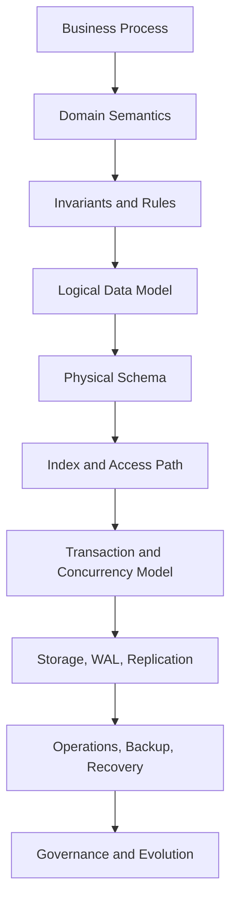
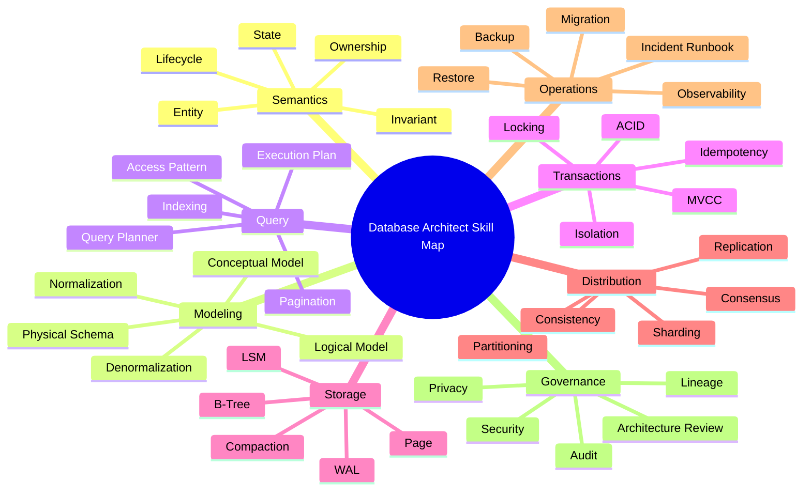
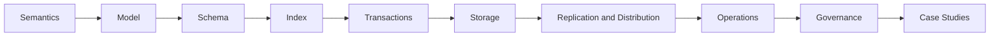
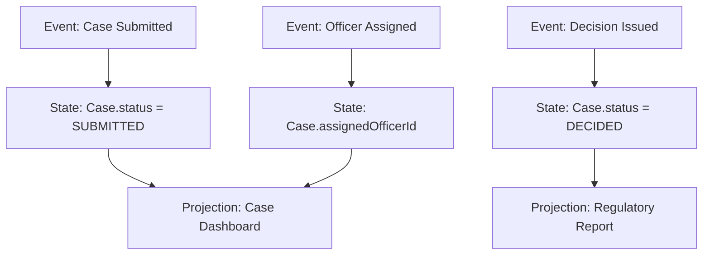
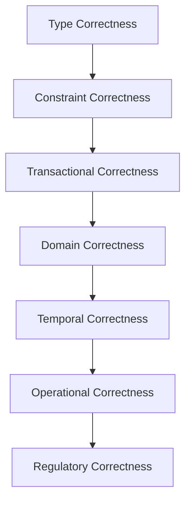
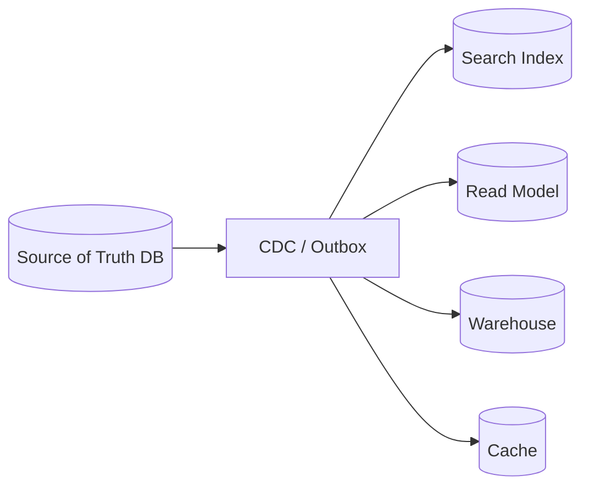
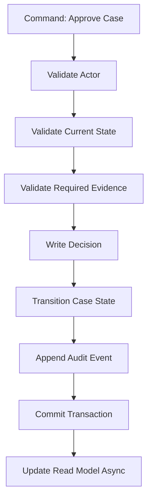
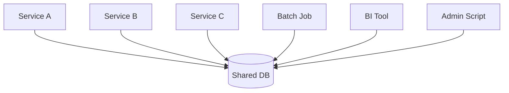
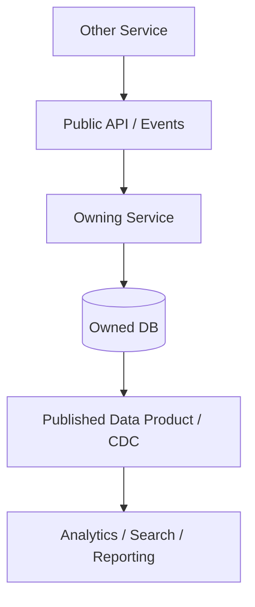
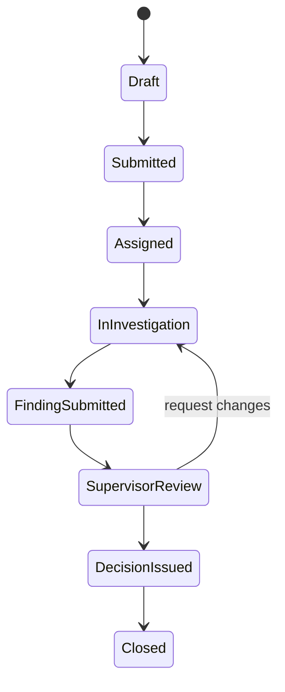

# Part 001 — Skill Map and Mental Model

> Target part ini bukan membuat kamu “tahu banyak istilah database”. Targetnya adalah membentuk **cara berpikir database architect**: mampu membaca sistem sebagai rangkaian state, constraint, access pattern, transaksi, failure mode, dan keputusan operasional.

Database architect yang kuat tidak mendesain tabel dari UI. Ia mendesain **sistem kebenaran** yang bisa bertahan ketika ada concurrency, partial failure, schema evolution, scale, audit, dan perubahan business rule.

Part ini adalah peta besar. Detail teknis seperti indexing, MVCC, WAL, sharding, CDC, temporal modeling, dan distributed SQL akan dibahas di part berikutnya. Di sini kita membangun kerangka mentalnya dulu.

---

## 1. Apa yang Sebenarnya Dipelajari dalam “Database Design and Architect”?

Banyak engineer menyempitkan database design menjadi:

- membuat ERD,
- memilih primary key,
- normalisasi,
- menulis query,
- menambahkan index jika lambat.

Itu perlu, tapi belum cukup.

Database design and architecture yang production-grade mencakup keputusan tentang:

1. **Apa yang dianggap benar oleh sistem.**
2. **Siapa yang boleh mengubah kebenaran itu.**
3. **Bagaimana perubahan state divalidasi.**
4. **Bagaimana data dibaca di bawah beban nyata.**
5. **Bagaimana data dipulihkan saat sistem rusak.**
6. **Bagaimana schema berubah tanpa menghancurkan aplikasi.**
7. **Bagaimana correctness dipertahankan saat concurrency tinggi.**
8. **Bagaimana keputusan database bisa dipertanggungjawabkan.**

Jadi, database bukan hanya tempat menyimpan data. Database adalah **state authority**.

---

## 2. Definisi Praktis: Database Architect

Dalam konteks seri ini, database architect adalah engineer yang mampu merancang, menilai, mengoperasikan, dan mengembangkan data layer dengan mempertimbangkan:

- business semantics,
- relational/data model correctness,
- query performance,
- transaction safety,
- concurrency behavior,
- storage behavior,
- operational reliability,
- security and privacy,
- data lifecycle,
- migration and evolution,
- integration with application and distributed systems.

Database architect tidak harus menjadi DBA tradisional. Namun ia harus cukup memahami database sampai bisa menjawab:

> “Apa yang bisa salah dengan data ini saat sistem berjalan di production selama bertahun-tahun?”

Kalau jawabannya hanya “nanti kita tambahkan index”, itu belum cukup.

---

## 3. Database sebagai Sistem, Bukan Komponen

Cara paling efektif untuk memahami database adalah melihatnya sebagai sistem berlapis.



Kesalahan umum adalah melompat dari **Business Process** langsung ke **Physical Schema**.

Contoh buruk:

> “Ada form pengajuan. Maka bikin table `submission` sesuai field di form.”

Contoh lebih benar:

> “Apa lifecycle pengajuan? State apa saja yang legal? Siapa actor yang boleh mengubah state? Apakah perubahan harus diaudit? Apakah data bisa direvisi? Apakah keputusan final immutable? Apakah ada SLA? Apakah laporan historis harus merekonstruksi kondisi saat keputusan dibuat?”

Tabel adalah output dari pemahaman. Bukan titik awal.

---

## 4. Mental Model Inti: Database Menjawab Empat Pertanyaan

Setiap database design yang baik harus menjawab empat pertanyaan inti.

### 4.1 What is true?

Apa fakta yang dianggap benar oleh sistem?

Contoh:

- customer punya status aktif,
- case sedang dalam tahap investigasi,
- invoice sudah dibayar,
- user memiliki role tertentu,
- dokumen versi 3 adalah versi efektif,
- transaksi ledger sudah posted.

Pertanyaan ini menentukan **system of record**.

### 4.2 What is allowed to change?

Tidak semua data boleh berubah bebas.

Contoh:

- status case tidak boleh lompat dari `DRAFT` ke `CLOSED`,
- pembayaran yang sudah settled tidak boleh dihapus,
- dokumen keputusan final tidak boleh diedit in-place,
- tenant A tidak boleh melihat data tenant B,
- balance tidak boleh negatif jika rule bisnis melarang overdraft.

Ini menentukan **invariant** dan **constraint**.

### 4.3 How is it accessed?

Database yang benar tapi tidak bisa diakses sesuai workload akan gagal secara operasional.

Pertanyaan access pattern:

- query paling sering apa?
- query paling mahal apa?
- query mana yang latency-sensitive?
- query mana yang boleh eventual?
- query mana yang harus strict consistent?
- query mana yang digunakan untuk report historis?
- query mana yang hanya untuk audit/investigation?

Ini menentukan **index, partitioning, projection, denormalization, dan caching**.

### 4.4 How does it fail?

Database design harus mempertimbangkan failure sejak awal.

Contoh failure:

- deadlock,
- lock wait,
- replica lag,
- disk full,
- index bloat,
- migration gagal di tengah jalan,
- partial write,
- duplicate request,
- stale read,
- backup tidak bisa direstore,
- data corrupt secara semantik walau constraint database valid.

Ini menentukan **reliability model**.

---

## 5. Skill Map Database Architect

Skill database architect bisa dipetakan menjadi delapan lapisan.



Kamu tidak harus menjadi expert absolut di semua database engine. Tapi kamu harus tahu konsep yang stabil lintas engine.

Misalnya:

- PostgreSQL memakai MVCC dan WAL.
- MySQL/InnoDB punya clustered index dan MVCC-like behavior.
- MongoDB mendorong embed/reference berdasarkan access pattern.
- Cassandra memaksa query-driven modeling dengan partition key.
- Spanner/CockroachDB membawa SQL ke ranah distributed consensus.
- LSM-based engines mengoptimalkan write path dengan konsekuensi compaction.

Top 1% engineer bukan yang hafal semua syntax. Mereka melihat pola konseptual di balik engine.

---

## 6. Roadmap Belajar Seri Ini

Seri ini tidak mengikuti urutan “SQL tutorial”. Urutannya mengikuti cara database dipakai di dunia nyata.



Kenapa urutan ini penting?

Karena desain database yang buruk sering bukan akibat syntax SQL salah. Biasanya akibat:

- entity boundary salah,
- invariant tidak dinyatakan,
- lifecycle tidak dimodelkan,
- query pattern tidak diketahui,
- migration tidak dipikirkan,
- concurrency dianggap tidak ada,
- audit dianggap fitur tambahan,
- database diperlakukan sebagai detail implementasi.

---

## 7. Empat Tingkat Kedalaman Database Engineer

### Level 1 — Query User

Ciri:

- bisa `SELECT`, `INSERT`, `UPDATE`, `DELETE`,
- bisa join sederhana,
- bisa menambah index berdasarkan error performa,
- memahami primary key dan foreign key secara dasar.

Risiko:

- melihat database sebagai spreadsheet besar,
- query-driven secara reaktif,
- tidak sadar concurrency anomaly,
- sering mendesain table sesuai UI.

### Level 2 — Application Data Modeler

Ciri:

- bisa membuat schema yang cukup rapi,
- memahami normalization,
- memakai migration tools,
- tahu beberapa indexing pattern,
- bisa membaca execution plan dasar.

Risiko:

- terlalu application-centric,
- model mudah bocor saat domain berkembang,
- belum kuat dalam operational failure.

### Level 3 — Production Database Designer

Ciri:

- mendesain berdasarkan invariant dan workload,
- memperhitungkan isolation level,
- punya strategi migration aman,
- memahami backup/restore,
- memisahkan system of record dan read model,
- sadar tradeoff normalization/denormalization.

Risiko:

- bisa terlalu fokus ke satu engine,
- belum tentu kuat untuk distributed data problem.

### Level 4 — Database Architect

Ciri:

- mampu memilih engine berdasarkan workload,
- tahu kapan relational cukup dan kapan tidak,
- bisa merancang multi-tenant, audit, lineage, CDC, partitioning,
- bisa memodelkan failure mode,
- bisa mempertahankan keputusan arsitektur secara teknis dan bisnis,
- bisa membuat database design review yang reusable untuk organisasi.

Target seri ini adalah membawa kamu ke Level 4.

---

## 8. Mental Model: State, Event, and Projection

Sebagian besar sistem bisnis dapat dibaca sebagai kombinasi tiga hal:

1. **State** — kondisi saat ini.
2. **Event** — sesuatu yang pernah terjadi.
3. **Projection** — bentuk data turunan untuk baca/reporting.



Kesalahan umum:

- semua event dijadikan kolom di satu table,
- semua state dijadikan event log tanpa projection yang jelas,
- semua report membaca langsung dari operational table,
- semua data turunan dianggap source of truth.

Database architect harus tahu perbedaan:

| Konsep | Fungsi | Contoh | Risiko Jika Salah |
|---|---|---|---|
| State | Kondisi efektif saat ini | `case.status = IN_REVIEW` | Tidak tahu kondisi final |
| Event | Bukti perubahan | `CASE_ASSIGNED` | Audit hilang |
| Projection | Optimasi baca | dashboard count | Data turunan dianggap kebenaran |
| Snapshot | Rekaman kondisi pada waktu tertentu | report bulanan | Report tidak reproducible |

---

## 9. Mental Model: Invariant Lebih Penting dari Table

Invariant adalah aturan yang harus selalu benar.

Contoh invariant:

- satu invoice hanya boleh punya satu pembayaran settled,
- satu case hanya boleh punya satu active assignment,
- tenant tidak boleh cross-access data tenant lain,
- decision final tidak boleh diedit,
- total debit harus sama dengan total credit dalam ledger entry,
- status transition harus mengikuti state machine.

Sebelum membuat schema, tulis invariant.

Contoh:

```text
Invariant:
A case can have at most one active assignee at any point in time.
```

Baru kemudian desain opsi:

1. kolom `current_assignee_id` di `case`,
2. table `case_assignment` dengan `active = true`,
3. partial unique index untuk `(case_id) WHERE active = true`,
4. assignment history append-only plus projection current assignment.

Setiap opsi punya konsekuensi.

| Opsi | Kelebihan | Kekurangan |
|---|---|---|
| Kolom langsung | Sederhana, cepat dibaca | History hilang jika tidak ada table lain |
| Table assignment aktif | Lebih eksplisit | Perlu constraint agar hanya satu aktif |
| Partial unique index | Invariant kuat di DB | Engine-specific |
| Append-only + projection | Audit kuat | Lebih kompleks |

Database architect tidak hanya bertanya “table-nya apa?”. Ia bertanya:

> “Di mana invariant ini ditegakkan, bagaimana diverifikasi, dan bagaimana gagal?”

---

## 10. Mental Model: Workload Determines Shape

Tidak ada schema yang optimal tanpa workload.

Schema untuk write-heavy ingestion berbeda dari schema untuk dashboard low-latency. Schema untuk audit berbeda dari schema untuk search. Schema untuk regulatory case management berbeda dari schema untuk shopping cart.

Pertanyaan minimum:

1. Berapa banyak write per detik?
2. Berapa banyak read per detik?
3. Query paling sering apa?
4. Query paling kritis apa?
5. Data tumbuh berdasarkan apa: tenant, time, user, case, event?
6. Apakah data harus dihapus, diarsipkan, atau disimpan selamanya?
7. Apakah query butuh strongly consistent read?
8. Apakah laporan harus reproducible secara historis?
9. Apakah ada actor yang melakukan bulk operation?
10. Apakah ada workload musiman/spike?

AWS Well-Architected guidance menekankan pemilihan database berdasarkan workload dan access pattern, bukan preferensi engine semata. Cloud modern juga menawarkan purpose-built database engines untuk relational, key-value, document, in-memory, graph, time series, dan ledger workload. Konsep yang harus diambil bukan “pakai banyak database”, melainkan “jangan memaksa satu model untuk semua problem”.

---

## 11. Mental Model: Correctness Has Layers

Correctness tidak hanya berarti “query berhasil”. Correctness punya beberapa lapisan.



### 11.1 Type Correctness

Contoh:

- `amount` numeric,
- `created_at` timestamp,
- `status` enum/text constrained,
- `tenant_id` not null.

### 11.2 Constraint Correctness

Contoh:

- primary key unik,
- foreign key valid,
- check constraint menjaga range,
- unique constraint mencegah duplicate business fact.

### 11.3 Transactional Correctness

Contoh:

- dua update terkait commit bersama,
- tidak terjadi lost update,
- retry tidak membuat duplikasi,
- isolation cukup untuk invariant.

### 11.4 Domain Correctness

Contoh:

- `CLOSED` case tidak bisa diedit,
- assignment hanya untuk officer aktif,
- decision final harus punya approver.

### 11.5 Temporal Correctness

Contoh:

- report Januari memakai rule yang berlaku pada Januari,
- harga effective-dated tidak overwrite masa lalu,
- audit bisa menjelaskan kapan data berubah.

### 11.6 Operational Correctness

Contoh:

- backup bisa direstore,
- migration bisa rollback,
- replica lag diketahui,
- query tidak membunuh production.

### 11.7 Regulatory Correctness

Contoh:

- bukti keputusan tersimpan,
- perubahan sensitif terekam,
- data bisa diaudit,
- retention dipatuhi.

Engineer biasa fokus pada lapisan 1–2. Database architect harus berpikir sampai lapisan 7.

---

## 12. Mental Model: Database Design Is Mostly Tradeoff Management

Tidak ada desain database yang “selalu benar”. Yang ada adalah desain yang cocok terhadap constraint tertentu.

Contoh tradeoff:

| Keputusan | Mendapat | Membayar |
|---|---|---|
| Normalize | Konsistensi, minim redundancy | Join lebih banyak, query lebih kompleks |
| Denormalize | Read cepat, query sederhana | Redundancy, sync problem |
| Strong consistency | Correctness kuat | Latency/availability cost |
| Eventual consistency | Availability/flexibility | Stale read, reconciliation |
| Single database | Simpler operations | Scaling/fit limitations |
| Polyglot persistence | Engine fit | Data duplication, integration complexity |
| UUID random | Easy distributed ID | Index locality buruk jika random murni |
| Sequence | Index locality bagus | Coordination/global uniqueness issue |
| Soft delete | Recovery/audit mudah | Query leak, index bloat, semantic ambiguity |
| Hard delete | Storage bersih | Audit/recovery sulit |

Top engineer tidak menjual satu pattern sebagai agama. Mereka menjelaskan tradeoff dan memilih berdasarkan konteks.

---

## 13. Mental Model: Source of Truth vs Read Model

Salah satu skill paling penting adalah membedakan:

- **source of truth**,
- **derived data**,
- **cache**,
- **projection**,
- **reporting snapshot**,
- **search index**.



Jika search index berbeda dari database utama, mana yang benar?

Jawaban yang sehat:

> Source of truth adalah database utama. Search index adalah projection yang bisa stale dan harus bisa direbuild.

Jika read model berbeda dari write model, mana yang benar?

> Write model menyimpan invariant. Read model mengoptimalkan query. Read model harus disposable atau punya strategi reconciliation.

Ini tampak sederhana, tetapi banyak incident data besar terjadi karena tim tidak tahu data mana yang authoritative.

---

## 14. Mental Model: Schema Is an API

Schema database adalah API untuk aplikasi, job, report, admin tool, downstream pipeline, dan manusia yang men-debug production.

Perubahan schema adalah perubahan contract.

Contoh perubahan berisiko:

- rename column,
- mengubah meaning `status`,
- mengubah nullability,
- mengganti primary key semantics,
- menghapus enum value,
- mengubah precision amount,
- mengubah retention logic,
- mengubah timezone interpretation.

Schema yang baik memiliki contract eksplisit:

1. field ini berarti apa,
2. siapa pemiliknya,
3. apakah nullable,
4. kapan berubah,
5. apakah historical,
6. apakah derived,
7. apakah PII,
8. apakah bisa dihapus,
9. apakah digunakan downstream.

Akan ada part khusus tentang database contract dan schema evolution.

---

## 15. Mental Model: Reads Are Products, Writes Are Laws

Salah satu cara berpikir yang efektif:

> Write path adalah hukum. Read path adalah produk.

Write path harus menjaga invariant.

Read path harus melayani kebutuhan pengguna secara efisien.

Contoh:



Jika read path butuh bentuk berbeda, jangan paksa write model rusak. Buat projection.

Contoh:

- dashboard count,
- case search,
- SLA queue,
- regulatory report,
- timeline view.

Semua itu bisa menjadi read model berbeda tanpa mengorbankan write model.

---

## 16. Mental Model: Database Boundary Is an Organizational Boundary

Database bukan hanya boundary teknis. Ia sering menjadi boundary ownership.

Pertanyaan ownership:

- tim mana yang boleh mengubah schema?
- siapa owner table tertentu?
- service mana yang boleh write?
- siapa consumer dari data ini?
- apakah downstream diberitahu saat field berubah?
- apakah report official mengambil dari source yang benar?

Anti-pattern umum:



Masalahnya bukan shared DB selalu salah. Masalahnya adalah shared DB tanpa ownership dan contract.

Desain yang lebih sehat:



---

## 17. Database Design Input Checklist

Sebelum mendesain schema, kumpulkan input berikut.

### 17.1 Domain Input

- Apa entity utama?
- Apa lifecycle setiap entity?
- Apa state legal?
- Apa transition legal?
- Apa invariant wajib?
- Apa data yang historical?
- Apa data yang derived?
- Apa data yang sensitif?

### 17.2 Workload Input

- Read/write ratio?
- Query utama?
- Query paling mahal?
- Latency target?
- Throughput target?
- Growth pattern?
- Peak/spike?
- Bulk operation?

### 17.3 Consistency Input

- Mana yang harus strongly consistent?
- Mana yang boleh eventual?
- Apakah read-your-writes diperlukan?
- Apakah stale read dapat menyebabkan keputusan salah?
- Apakah duplicate request mungkin terjadi?

### 17.4 Operational Input

- RPO/RTO?
- Backup strategy?
- Retention?
- Restore testing?
- Monitoring?
- Migration window?
- Downtime tolerance?

### 17.5 Governance Input

- PII/secret?
- Audit requirement?
- Legal hold?
- Data lineage?
- Access control?
- Regulatory evidence?

Jika input ini tidak diketahui, desain yang dihasilkan biasanya hanya “tampak benar” di diagram.

---

## 18. Database Design Output Checklist

Output desain database production-grade minimal mencakup:

1. Entity model.
2. Lifecycle model.
3. Invariant list.
4. Logical schema.
5. Physical schema.
6. Key strategy.
7. Index strategy.
8. Transaction boundary.
9. Isolation assumptions.
10. Migration strategy.
11. Data retention strategy.
12. Backup/restore strategy.
13. Observability plan.
14. Access control model.
15. Failure mode analysis.
16. Architecture decision record.

Dalam organisasi matang, database design bukan hanya DDL. Ia adalah dokumen keputusan.

---

## 19. Example: Dari Requirement ke Design Thinking

Requirement:

> “User bisa submit complaint. Officer bisa assign complaint ke investigator. Investigator bisa menambahkan finding. Supervisor bisa approve final decision. Semua perubahan harus bisa diaudit.”

Engineer pemula mungkin langsung membuat:

```sql
complaint(id, user_id, status, officer_id, investigator_id, finding, decision)
```

Database architect akan memecah:

### 19.1 Entity

- complaint,
- assignment,
- investigation,
- finding,
- decision,
- actor,
- audit event.

### 19.2 Lifecycle



### 19.3 Invariant

- complaint must have submitter,
- submitted complaint cannot return to draft,
- only one active assignment,
- finding cannot be edited after decision issued,
- decision must reference evidence snapshot,
- all status transitions require actor and timestamp,
- final decision must be immutable.

### 19.4 Query Pattern

- officer queue by status,
- investigator assigned cases,
- case timeline,
- SLA breach dashboard,
- audit search by actor,
- monthly regulatory report.

### 19.5 Possible Tables

- `complaint`,
- `complaint_status_transition`,
- `complaint_assignment`,
- `investigation_finding`,
- `decision`,
- `case_evidence_snapshot`,
- `audit_event`,
- `complaint_dashboard_projection`.

Ini lebih banyak table, tetapi lebih defensible.

---

## 20. Anatomy of a Database Decision

Setiap keputusan database harus bisa dijelaskan dengan format:

```text
Decision:
We choose X.

Context:
Given workload A, invariant B, consistency need C, and operational constraint D.

Consequences:
We gain E and accept tradeoff F.

Failure Mode:
If G happens, we detect via H and recover using I.
```

Contoh:

```text
Decision:
Use append-only decision history and immutable final decision records.

Context:
Regulatory decisions must be auditable and reproducible.
A final decision cannot be silently overwritten.

Consequences:
Reads require selecting the effective decision version.
Storage grows over time.

Failure Mode:
If a wrong decision is issued, we do not update the row in-place.
We create a correction/revocation record linked to the original decision.
```

Ini level reasoning yang membedakan engineering handbook dari tutorial biasa.

---

## 21. Top 1% Mental Habits

### Habit 1 — Start from invariant

Jangan mulai dari column. Mulai dari rule yang tidak boleh dilanggar.

### Habit 2 — Separate truth from convenience

Jangan campur source of truth dengan cache/projection/reporting.

### Habit 3 — Treat time as first-class

Banyak bug data berasal dari “kita overwrite saja”. Untuk sistem penting, waktu harus dimodelkan.

### Habit 4 — Design for migration from day one

Schema akan berubah. Design yang tidak bisa berevolusi adalah liability.

### Habit 5 — Ask what happens under concurrency

Jika dua request datang bersamaan, apakah invariant masih benar?

### Habit 6 — Ask how to recover

Backup yang belum pernah direstore hanyalah asumsi.

### Habit 7 — Make ownership explicit

Table tanpa owner akan menjadi shared garbage heap.

### Habit 8 — Read execution plans

Index bukan hiasan. Query planner menentukan kenyataan runtime.

### Habit 9 — Model deletion seriously

Delete bukan hanya `DELETE FROM`. Ada retention, audit, privacy, legal hold, and downstream consistency.

### Habit 10 — Write decisions down

Keputusan database berdampak panjang. Jangan hanya tersimpan di kepala satu engineer.

---

## 22. Anti-Mental Models yang Harus Dihindari

### 22.1 “Database hanya persistence detail”

Untuk sistem CRUD sederhana, mungkin terasa benar. Untuk sistem penting, database adalah enforcement layer untuk correctness.

### 22.2 “Semua constraint cukup di application layer”

Application validation penting, tetapi tidak selalu cukup. Concurrency, multiple writers, batch jobs, admin scripts, dan service evolution bisa melewati asumsi aplikasi.

### 22.3 “NoSQL berarti tidak perlu desain schema”

Document, key-value, wide-column, dan graph database tetap butuh model. Bahkan sering lebih membutuhkan access-pattern clarity karena constraint database lebih sedikit.

### 22.4 “Index selalu mempercepat”

Index mempercepat sebagian read, tetapi menambah write cost, storage, maintenance, dan planner complexity.

### 22.5 “Event sourcing menyelesaikan audit”

Event sourcing bisa membantu audit, tetapi juga membawa kompleksitas replay, schema evolution event, projection lag, dan correction semantics.

### 22.6 “Distributed database menghilangkan tradeoff”

Distributed database memindahkan tradeoff ke latency, consensus, locality, dan operational complexity.

---

## 23. Database Architecture as Layers of Promise

Setiap lapisan memberi janji tertentu.

| Layer | Promise | Contoh |
|---|---|---|
| Type | Bentuk data valid | integer, timestamp, numeric |
| Constraint | Relasi dan rule dasar valid | PK, FK, unique, check |
| Transaction | Perubahan atomic | commit/rollback |
| Isolation | Concurrency terkendali | repeatable read, serializable |
| Durability | Data survive crash | WAL, fsync, checkpoint |
| Replication | Data survive node failure | replica, quorum |
| Backup | Data survive disaster | PITR, snapshot |
| Governance | Data legally defensible | audit, retention, lineage |

Architectural maturity berarti tahu promise mana yang dijamin database, mana yang dijamin aplikasi, dan mana yang belum dijamin sama sekali.

---

## 24. Practical Exercise: Design Review in 15 Minutes

Gunakan exercise ini untuk melatih cara berpikir.

Ambil satu table penting dari sistem kamu. Jawab:

1. Apa entity yang diwakili table ini?
2. Apakah table ini source of truth atau projection?
3. Apa invariant terpenting?
4. Constraint mana yang menegakkan invariant itu?
5. Query utama table ini apa?
6. Index apa yang mendukung query itu?
7. Apakah ada kolom nullable yang ambiguous?
8. Apakah delete semantics jelas?
9. Apakah perubahan historis perlu disimpan?
10. Apa yang terjadi jika dua user update row yang sama?
11. Apakah table ini punya owner?
12. Apakah ada downstream consumer?
13. Apakah table ini aman untuk migration online?
14. Apakah data ini masuk backup/retention policy?
15. Apa failure mode paling mungkin?

Kalau kamu tidak bisa menjawab sebagian besar, desainnya belum production-ready.

---

## 25. What This Series Will Not Do

Seri ini tidak akan menghabiskan waktu untuk:

- tutorial SQL dasar,
- definisi database terlalu umum,
- demo toy app tanpa failure mode,
- pattern tanpa tradeoff,
- vendor marketing,
- mengulang detail yang sudah dibahas di seri lain.

Seri ini akan fokus pada:

- usage and implementation,
- mental model,
- production-grade reasoning,
- design checklist,
- failure modeling,
- schema and architecture review,
- case studies.

---

## 26. Reference Notes

Beberapa fondasi faktual yang akan sering muncul di seri ini:

- PostgreSQL documentation menjelaskan concurrency control dengan tujuan memungkinkan akses efisien oleh banyak session sambil menjaga integritas data; ini penting untuk memahami MVCC dan isolation.
- PostgreSQL `CREATE INDEX` documentation menyatakan index terutama digunakan untuk meningkatkan performance, tetapi penggunaan yang tidak tepat dapat memperlambat performance karena index bukan free lunch.
- AWS Well-Architected database guidance menekankan pemilihan database berdasarkan workload dan purpose-built engine.
- MongoDB data modeling documentation menekankan pilihan embed vs reference berdasarkan model relasi dan optimasi akses data.
- Spanner documentation menggunakan konsep external consistency untuk transaksi distributed yang tampak berjalan dalam urutan serial global.

Referensi resmi akan disertakan di part teknis saat konsepnya dibahas lebih dalam.

---

## 27. Ringkasan Part 001

Database architect berpikir dalam lapisan:

1. **Semantics** — apa arti data.
2. **Invariant** — apa yang tidak boleh rusak.
3. **Model** — bagaimana fakta direpresentasikan.
4. **Workload** — bagaimana data dipakai.
5. **Transactions** — bagaimana perubahan terjadi dengan aman.
6. **Storage** — bagaimana data benar-benar disimpan.
7. **Distribution** — bagaimana data bertahan di banyak node/region.
8. **Operations** — bagaimana sistem dipulihkan dan diamati.
9. **Governance** — bagaimana data dipertanggungjawabkan.

Kalimat paling penting dari part ini:

> Table adalah detail implementasi dari kebenaran, bukan titik awal desain.

Di Part 002, kita akan membahas database sebagai **system of truth**: bagaimana menentukan data authoritative, membedakan source of truth dari projection/cache/report, dan menghindari konflik kebenaran antar sistem.
