# Part 002 — Database as System of Truth

> Database yang baik bukan hanya menyimpan data. Ia menjawab pertanyaan paling penting dalam sistem: **ketika ada konflik, data mana yang benar?**

Dalam production system, masalah terbesar jarang berupa “tidak bisa insert row”. Masalah yang lebih berbahaya adalah:

- dua sistem punya nilai berbeda untuk fakta yang sama,
- cache lebih baru daripada database,
- report memakai snapshot yang tidak reproducible,
- event stream kehilangan event koreksi,
- admin tool update data tanpa audit,
- downstream pipeline menganggap data turunan sebagai data authoritative,
- field yang sama memiliki arti berbeda di dua service.

Part ini membahas database sebagai **system of truth**: bagaimana menentukan kebenaran, authority, ownership, dan batas konsistensi.

---

## 1. Core Question

Pertanyaan utama part ini:

> Bagaimana kita memastikan sistem tahu data mana yang authoritative, siapa yang boleh mengubahnya, dan bagaimana data turunan tetap konsisten terhadap sumbernya?

Ini bukan pertanyaan akademik. Ini pertanyaan production.

Saat incident terjadi, engineer harus bisa menjawab:

- nilai mana yang benar?
- kapan berubah?
- siapa/apa yang mengubahnya?
- apakah perubahan itu legal?
- apakah downstream sudah menerima perubahan?
- bagaimana memperbaiki jika terjadi divergence?

Jika jawaban tidak jelas, database design belum matang.

---

## 2. Istilah yang Harus Dibedakan

Banyak diskusi data kacau karena istilahnya dicampur.

| Istilah | Makna Praktis | Contoh |
|---|---|---|
| System of Truth | Tempat yang dianggap paling benar untuk satu fakta | database utama case management |
| System of Record | Sistem resmi yang menyimpan record authoritative | core banking ledger, registry, master customer DB |
| Source of Truth | Sumber authoritative untuk konsumsi teknis tertentu | `case` table untuk status case |
| Derived Data | Data hasil transformasi dari source | dashboard summary, materialized view |
| Projection | Bentuk baca yang dioptimalkan dari source | search document, queue view |
| Cache | Copy sementara untuk mempercepat akses | Redis cache, local memory cache |
| Snapshot | Rekaman keadaan pada waktu tertentu | monthly regulatory report snapshot |
| Replica | Salinan database untuk read/failover | read replica PostgreSQL |
| Data Product | Dataset yang dipublikasikan dengan contract | curated analytics table |

Tidak semua copy data memiliki authority yang sama.

---

## 3. The First Rule: One Fact, One Authority

Prinsip dasar:

> Untuk setiap business fact penting, harus ada tepat satu authority yang jelas.

Contoh business fact:

- status case,
- owner case,
- current balance,
- final decision,
- tenant membership,
- document effective version,
- payment settlement state.

Jika dua tempat sama-sama bisa mengubah fakta yang sama, kamu punya split-brain secara semantik.

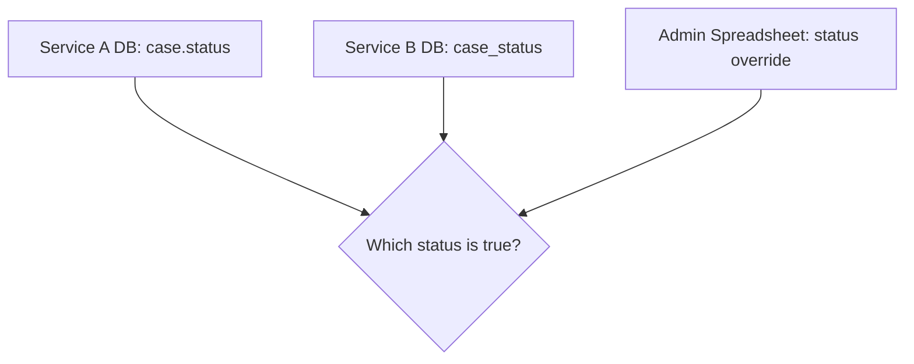

Ini bukan hanya masalah teknis. Ini masalah governance.

---

## 4. Authority Matrix

Untuk setiap data penting, buat authority matrix.

| Data | Authority | Allowed Writers | Allowed Readers | Derived Copies | Correction Path |
|---|---|---|---|---|---|
| Case status | Case DB | Case workflow service | Case API, reporting CDC | dashboard, search index | status correction command |
| Final decision | Decision DB/table | Decision service/supervisor action | case detail, audit report | report snapshot | revocation/correction record |
| Customer legal name | Customer master | Customer master service | case, billing, analytics | denormalized display name | customer amendment process |
| Ledger balance | Ledger DB | ledger posting service | wallet API, finance report | balance projection | reversal entry |

Authority matrix mencegah diskusi kabur seperti:

> “Data di dashboard beda dengan data di database, mana yang benar?”

Jawaban harus sudah ada di desain:

> Dashboard adalah projection. Source of truth adalah table `case`. Dashboard harus direbuild atau direkonsiliasi.

---

## 5. Write Authority vs Read Convenience

Satu fakta boleh dibaca dari banyak tempat, tetapi sebaiknya hanya ditulis oleh satu authority.

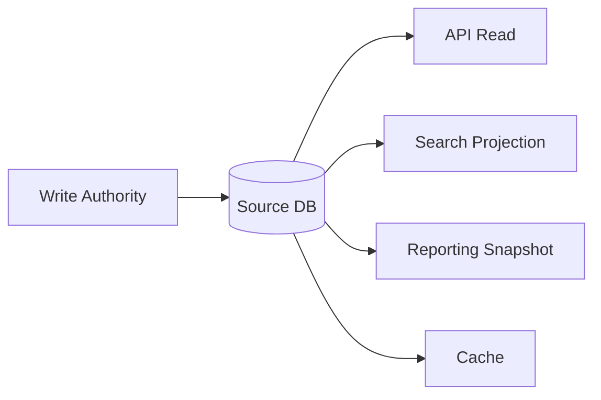

Read copy boleh banyak karena kebutuhan query berbeda. Write authority harus ketat karena correctness bergantung padanya.

### Contoh

Case status bisa muncul di:

- `case.status`,
- case timeline,
- dashboard queue,
- search index,
- regulatory report,
- email notification,
- analytics warehouse.

Tapi status hanya boleh berubah melalui workflow command yang memvalidasi transition.

---

## 6. Anti-Pattern: Multi-Writer Same Fact

Contoh buruk:

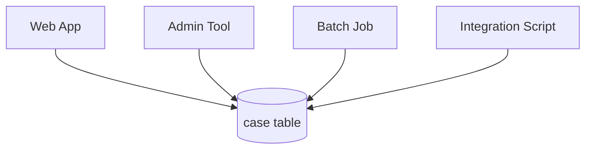

Jika semuanya bisa update `case.status`, invariant akan bocor.

Masalah yang muncul:

- transition ilegal,
- audit tidak lengkap,
- actor tidak jelas,
- status berubah tanpa event,
- dashboard tidak mendapat update,
- downstream report inconsistent.

Desain lebih baik:

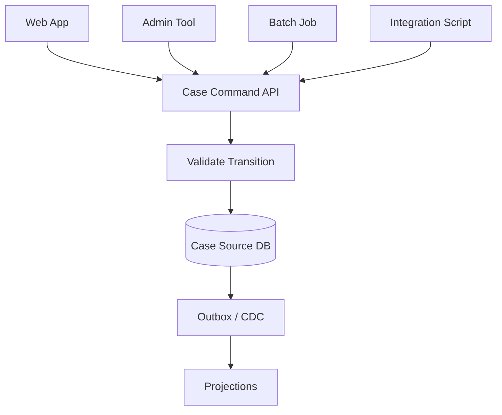

Admin tool tetap boleh ada, tapi harus melewati command path atau correction path yang diaudit.

---

## 7. Database as Legal Boundary

Dalam sistem biasa, database menyimpan data. Dalam sistem penting, database juga menyimpan **bukti**.

Untuk domain seperti finance, healthcare, regulatory enforcement, legal case management, audit, dan compliance, database harus menjawab:

- siapa melakukan apa,
- kapan dilakukan,
- berdasarkan data apa,
- dengan wewenang apa,
- hasilnya apa,
- apakah ada koreksi,
- apakah data asli masih dapat dibuktikan.

Ini mengubah desain.

Contoh desain naïf:

```sql
UPDATE decision SET text = 'new text' WHERE id = ?;
```

Desain yang lebih defensible:

```text
decision_version
- decision_id
- version_no
- decision_text
- effective_at
- created_by
- created_reason
- supersedes_version_no

final_decision_marker
- decision_id
- final_version_no
- finalized_at
- finalized_by
```

Untuk keputusan final, koreksi tidak dilakukan dengan overwrite diam-diam. Koreksi harus berupa record baru dengan hubungan eksplisit ke record lama.

---

## 8. Source of Truth vs Event Log

Event log sering dianggap source of truth. Kadang benar, kadang tidak.

Ada dua model umum:

### 8.1 State as Source of Truth

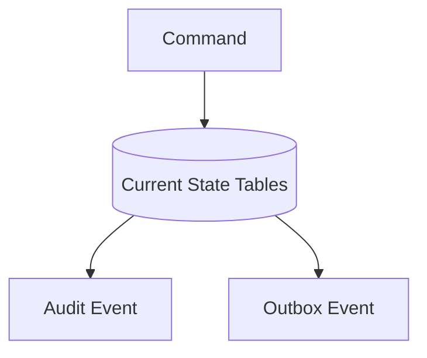

Dalam model ini, table current state adalah authoritative. Event digunakan untuk audit/integration.

Cocok jika:

- query current state dominan,
- relational constraint kuat dibutuhkan,
- domain tidak sepenuhnya event-sourced,
- correction lebih mudah direpresentasikan sebagai state + audit.

### 8.2 Event Log as Source of Truth

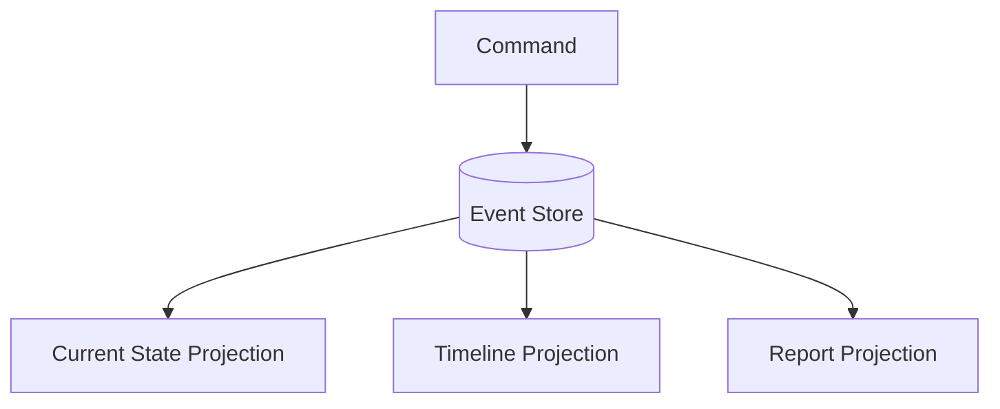

Dalam model ini, event stream adalah authoritative. State dibangun dari replay event.

Cocok jika:

- history perubahan adalah inti domain,
- semua state bisa dibentuk dari event,
- replay dan temporal reconstruction penting,
- tim siap mengelola event schema evolution.

### 8.3 Tradeoff

| Model | Kelebihan | Risiko |
|---|---|---|
| State as truth | Sederhana, relational constraint kuat | Audit bisa lemah jika tidak disiplin |
| Event log as truth | History lengkap, replayable | Projection lag, event evolution, correction kompleks |

Jangan memilih event sourcing hanya karena terdengar modern. Pilih karena domain membutuhkan dan organisasi sanggup mengoperasikannya.

---

## 9. Truth Can Be Current, Historical, or Effective

Kebenaran data tidak selalu satu dimensi.

Ada minimal tiga jenis “benar”:

### 9.1 Current Truth

Apa yang benar sekarang.

Contoh:

```text
case.status = IN_REVIEW
```

### 9.2 Historical Truth

Apa yang benar pada waktu tertentu.

Contoh:

```text
Pada 2026-05-10, case.status = SUBMITTED
```

### 9.3 Effective Truth

Apa yang berlaku untuk periode tertentu menurut business rule.

Contoh:

```text
Policy version 4 applies to cases submitted from 2026-01-01 to 2026-06-30.
```

Kesalahan umum adalah hanya menyimpan current truth lalu berharap historical report bisa dibuat nanti.

---

## 10. Temporal Authority

Jika data bisa berubah seiring waktu, authority harus mencakup waktu.

Contoh:

| Data | Current Authority | Historical Authority | Effective Authority |
|---|---|---|---|
| Case status | `case.status` | `case_status_transition` | transition timestamp |
| Product price | `current_price` | `price_history` | effective date range |
| Regulation version | `regulation_current` | `regulation_version` | valid_from/valid_to |
| User role | `user_role_current` | `user_role_assignment_history` | assignment period |

Untuk sistem audit/regulatory, historical authority sering lebih penting daripada current authority.

---

## 11. The Danger of Overwriting Facts

Overwrite tidak selalu salah. Tetapi overwrite harus sadar konsekuensi.

Aman untuk overwrite:

- display preference,
- draft content,
- temporary calculation,
- cache metadata,
- non-critical description.

Berisiko untuk overwrite:

- final decision,
- legal name history,
- financial posting,
- approval record,
- status transition,
- submitted evidence,
- regulatory classification.

Pertanyaan sebelum overwrite:

1. Apakah nilai lama harus diketahui?
2. Apakah perubahan butuh alasan?
3. Apakah actor harus direkam?
4. Apakah report masa lalu harus tetap sama?
5. Apakah downstream harus tahu perubahan?
6. Apakah koreksi harus terlihat sebagai koreksi?

Jika jawabannya ya, jangan overwrite secara diam-diam.

---

## 12. Derived Data Must Be Rebuildable or Reconciled

Projection, cache, dan report table harus punya strategi jika berbeda dari source.

Tiga strategi umum:

### 12.1 Rebuildable

Projection bisa dihapus dan dibangun ulang dari source.

Contoh:

- search index,
- dashboard count,
- read model CQRS.

### 12.2 Reconciled

Projection dicek berkala terhadap source.

Contoh:

- balance summary,
- warehouse aggregate,
- SLA dashboard.

### 12.3 Official Snapshot

Snapshot menjadi record resmi untuk periode tertentu.

Contoh:

- monthly regulatory report,
- invoice PDF snapshot,
- audit export.

Snapshot tidak selalu rebuildable karena justru harus merekam kondisi saat dibuat.

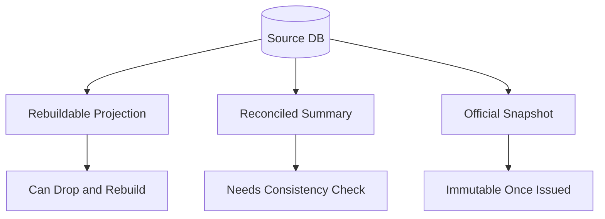

---

## 13. Consistency Boundary

Consistency boundary adalah area di mana sistem menjamin kebenaran secara atomic/transactional.

Dalam single relational database, boundary sering berupa satu transaction.

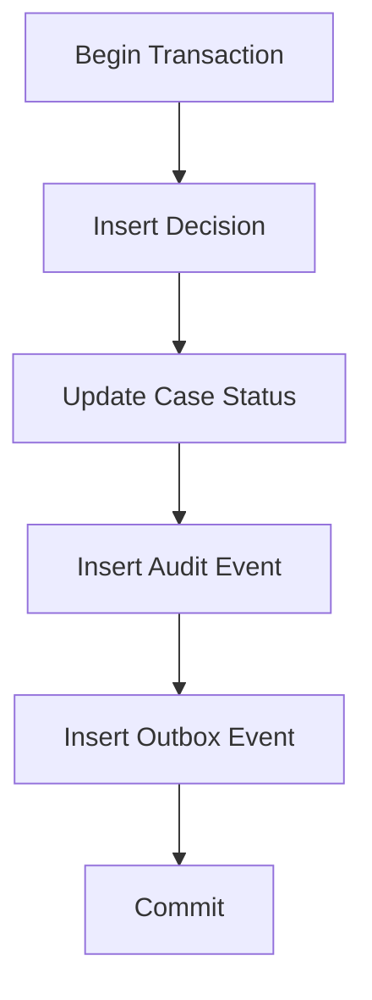

Semua operasi di atas berhasil bersama atau gagal bersama.

Di distributed system, boundary lebih sulit:

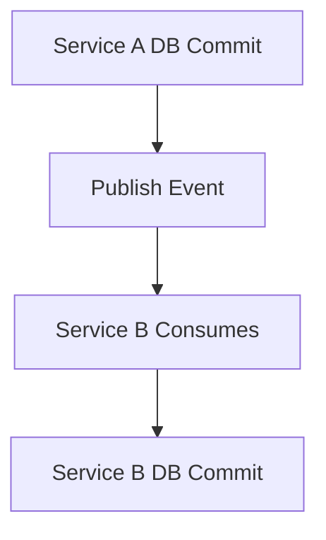

Di sini tidak ada atomicity global kecuali memakai distributed transaction, yang membawa tradeoff besar. Karena itu pattern seperti outbox, saga, idempotency, dan reconciliation menjadi penting.

---

## 14. System of Truth in Microservices

Dalam microservices, idealnya setiap service memiliki data yang ia kuasai.

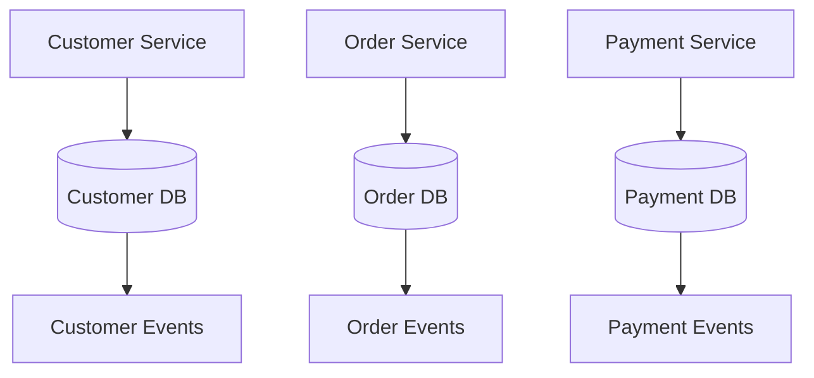

Tapi realitas sering lebih kompleks:

- reporting butuh join lintas domain,
- search butuh gabungan data,
- workflow butuh referensi entity lain,
- regulatory audit butuh timeline menyeluruh.

Prinsipnya:

1. Jangan biarkan service lain menulis database yang bukan miliknya.
2. Publish perubahan authoritative melalui event/data product/API.
3. Nyatakan data mana yang copy.
4. Bangun reconciliation untuk copy penting.
5. Jangan menyembunyikan distributed consistency problem di balik ORM.

---

## 15. Truth Conflict Scenarios

### Scenario 1 — Cache More Recent Than DB

Kemungkinan:

- write-through cache gagal commit DB,
- transaction rollback tapi cache sudah update,
- cache invalidation salah.

Prinsip:

> Cache tidak boleh menjadi authoritative kecuali memang didesain sebagai authoritative store.

Mitigasi:

- update cache after commit,
- short TTL,
- cache invalidation via event,
- read-through with version,
- reconciliation metrics.

### Scenario 2 — Report Differs From Operational DB

Kemungkinan:

- ETL delay,
- timezone conversion,
- snapshot cutoff berbeda,
- business rule berubah,
- late-arriving data.

Prinsip:

> Report harus punya data as-of time, rule version, dan lineage.

### Scenario 3 — Search Index Has Old Status

Kemungkinan:

- projection lag,
- consumer down,
- event lost,
- mapping error.

Prinsip:

> Search index adalah projection. UI harus tahu apakah action kritis perlu recheck ke source.

### Scenario 4 — Admin Fix Bypasses Audit

Kemungkinan:

- direct SQL update,
- emergency script,
- migration hotfix.

Prinsip:

> Emergency path tetap harus menghasilkan audit artifact.

---

## 16. Case Study Mini: Case Status Authority

Requirement:

> Case memiliki status. Status digunakan untuk workflow, dashboard, notification, SLA, dan report bulanan.

### 16.1 Bad Design

```text
case.status
case_dashboard.status
case_report.status
search_index.status
notification_payload.status
```

Semua dianggap benar. Tidak ada authority.

### 16.2 Better Design

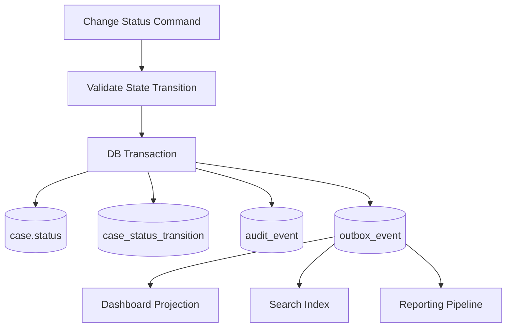

Authority:

- current status: `case.status`,
- status history: `case_status_transition`,
- audit evidence: `audit_event`,
- downstream propagation: `outbox_event`,
- dashboard/search/report: derived.

### 16.3 Correction Path

Jika status salah:

- jangan update langsung tanpa jejak,
- jalankan correction command,
- catat actor/reason,
- append transition/correction event,
- publish outbox event,
- rebuild projection jika perlu.

---

## 17. Designing a Truth Table

Untuk entity penting, buat truth table berikut.

| Question | Example Answer |
|---|---|
| What fact is this? | Current lifecycle status of a regulatory case |
| Where is it authoritative? | `case.status` in Case DB |
| Who can change it? | Case workflow command handler |
| What validates it? | State transition guard + DB transaction |
| Is history required? | Yes, `case_status_transition` |
| Is audit required? | Yes, actor/action/reason/timestamp |
| Is it published? | Yes, outbox event `CaseStatusChanged` |
| What copies exist? | dashboard, search, warehouse |
| Are copies authoritative? | No |
| How to repair divergence? | replay outbox or rebuild projection |
| Can it be overwritten? | No direct overwrite except controlled correction |
| Does it have retention? | Retained according to case retention policy |

Ini sederhana, tetapi sangat powerful untuk design review.

---

## 18. Database Authority and Constraints

Authority tanpa constraint sering hanya dokumentasi lemah.

Jika database adalah authority, gunakan database untuk menegakkan rule yang memang bisa ditegakkan di sana.

Contoh:

| Rule | DB Enforcement |
|---|---|
| ID unik | primary key |
| email unik per tenant | unique constraint `(tenant_id, email)` |
| amount tidak negatif | check constraint |
| child harus punya parent | foreign key |
| satu active assignment per case | partial unique index jika engine mendukung |
| status hanya nilai legal | enum/check/reference table |
| decision harus milik case valid | foreign key |

Tidak semua domain rule cocok di DB. Tetapi rule dasar yang menjaga integritas data sebaiknya tidak hanya ada di aplikasi.

---

## 19. Authority and Isolation

Authority juga bergantung pada isolation.

Contoh invariant:

> Satu case hanya boleh memiliki satu active assignment.

Jika dua transaction berjalan bersamaan:

```text
T1: check no active assignment
T2: check no active assignment
T1: insert active assignment
T2: insert active assignment
```

Tanpa constraint/isolation yang benar, kedua transaction bisa lolos.

Solusi:

- unique constraint/partial unique index,
- serializable isolation,
- row lock pada parent case,
- application-level optimistic concurrency dengan version,
- advisory lock jika benar-benar diperlukan.

Prinsip:

> Jika sebuah fakta authoritative, concurrency behavior-nya harus dirancang, bukan diasumsikan.

---

## 20. Authority and Idempotency

Dalam sistem nyata, request bisa dikirim ulang.

Penyebab:

- timeout,
- retry dari client,
- message redelivery,
- worker crash,
- network failure,
- user double click.

Jika write authority tidak idempotent, source of truth bisa rusak.

Contoh buruk:

```text
POST /payments
timeout
client retry
payment inserted twice
```

Desain lebih baik:

```text
POST /payments with idempotency_key
unique(idempotency_key, actor_or_scope)
return previous result on retry
```

Idempotency adalah bagian dari authority. Jika sebuah command mengubah truth, command harus aman terhadap retry.

---

## 21. Authority and Versioning

Data authoritative sering butuh versi.

Gunakan versioning saat:

- update conflict harus dideteksi,
- dokumen punya revisi,
- policy berubah seiring waktu,
- report harus tahu rule version,
- API consumer butuh compatibility,
- event schema berevolusi.

Contoh optimistic concurrency:

```sql
UPDATE case
SET status = 'IN_REVIEW', version = version + 1
WHERE id = :id
  AND version = :expected_version;
```

Jika affected row = 0, ada concurrent modification.

Versi bukan hanya angka teknis. Versi adalah alat untuk menjaga truth agar tidak silently overwritten.

---

## 22. Authority and Human Correction

Production system selalu membutuhkan correction path.

Pertanyaan desain:

1. Siapa boleh koreksi?
2. Data apa yang boleh dikoreksi?
3. Apakah koreksi overwrite atau append?
4. Apakah butuh approval?
5. Apakah correction event dipublish?
6. Apakah downstream harus reprocess?
7. Apakah report lama berubah atau ada adjustment?

Contoh correction model:

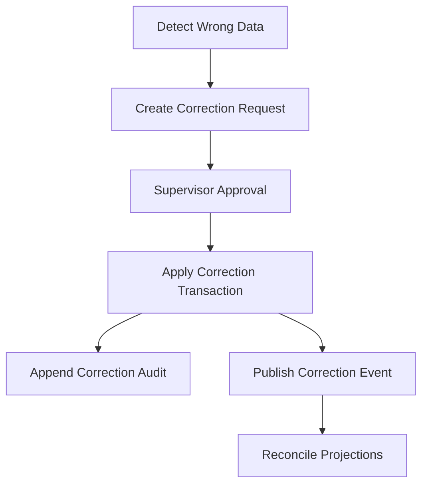

Jangan membuat correction path sebagai direct SQL yang tidak terdokumentasi. Emergency boleh cepat, tapi tidak boleh invisible.

---

## 23. Source of Truth and Reporting

Reporting sering menjadi tempat truth conflict.

Operational DB menjawab:

> “Apa kondisi sistem sekarang?”

Reporting menjawab:

> “Apa yang harus kita nyatakan untuk periode tertentu berdasarkan cutoff dan rule tertentu?”

Contoh:

Monthly regulatory report untuk Juni 2026 harus menjelaskan:

- periode data,
- cutoff time,
- timezone,
- rule version,
- source tables,
- transformation logic,
- late data handling,
- correction handling,
- generated_at,
- generated_by/job version.

Tanpa metadata itu, report hanya query result, bukan artifact yang defensible.

---

## 24. Source of Truth and Search

Search index bukan database utama.

Search index biasanya mengorbankan beberapa hal:

- relational integrity,
- transactional consistency,
- immediate freshness,
- exact authorization semantics jika tidak hati-hati.

Pattern sehat:

1. Search untuk menemukan kandidat.
2. Critical action re-fetch ke source DB.
3. Authorization dicek di source/authoritative layer.
4. Index punya version/source timestamp.
5. Index bisa rebuild.

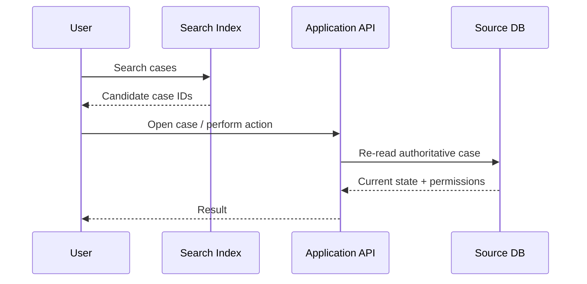

---

## 25. Source of Truth and Cache

Cache harus diberi label mental yang benar:

> Cache adalah performance optimization, bukan semantic authority.

Kecuali cache memang database utama, seperti beberapa use case Redis-as-primary yang didesain khusus. Namun untuk kebanyakan application cache, source tetap database utama.

Pertanyaan cache:

- apa key-nya?
- apa TTL-nya?
- kapan invalidated?
- apakah stale read aman?
- apakah cache menyimpan PII?
- apakah cache per tenant/user?
- apakah authorization berubah harus invalidate cache?
- apakah cache stampede mungkin?

Cache yang tidak jelas authority-nya sering menyebabkan bug data yang sulit dilacak.

---

## 26. Source of Truth and External Integration

External system sering punya authority sendiri.

Contoh:

- payment gateway authoritative untuk settlement response,
- government registry authoritative untuk license validity,
- identity provider authoritative untuk authentication identity,
- bank core ledger authoritative untuk account balance,
- CRM authoritative untuk customer profile.

Saat integrasi, jangan asal copy.

Pertanyaan:

1. Apakah kita menyimpan copy atau mirror?
2. Apakah copy boleh diedit lokal?
3. Bagaimana conflict diselesaikan?
4. Bagaimana freshness diketahui?
5. Apakah external ID menjadi natural key?
6. Apakah external data perlu snapshot untuk audit?

Contoh:

```text
license_status_external = ACTIVE
license_status_checked_at = 2026-07-04T10:15:00+07:00
license_status_source = GOVERNMENT_REGISTRY
license_status_snapshot_payload_id = ...
```

Untuk keputusan penting, simpan bukan hanya hasil, tetapi juga konteks pengecekan.

---

## 27. Authority Failure Modes

| Failure Mode | Penyebab | Dampak | Mitigasi |
|---|---|---|---|
| Split authority | Banyak writer untuk fakta sama | conflict, audit lemah | single write authority |
| Stale projection | consumer lag/error | UI salah | version, lag metric, rebuild |
| Silent overwrite | update in-place | history hilang | append-only/versioning |
| Constraint gap | rule hanya di app | race condition | DB constraint/lock/isolation |
| Missing lineage | transform tidak tercatat | report tidak defensible | lineage metadata |
| Manual fix invisible | direct SQL | audit gap | correction workflow |
| Cache truth confusion | stale cache dipercaya | wrong decision | re-read source for critical action |
| External mismatch | copied external data expired | invalid decision | freshness timestamp/revalidation |

---

## 28. Design Pattern: Authoritative Write + Disposable Projection

Pattern ini sangat umum untuk sistem modern.

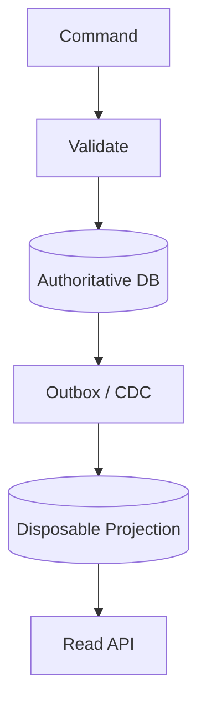

Karakteristik:

- write model menjaga invariant,
- projection melayani query,
- projection bisa direbuild,
- event/outbox membawa perubahan,
- read API tidak mengubah source.

Cocok untuk:

- dashboard,
- search,
- queue,
- analytics serving,
- denormalized read model.

---

## 29. Design Pattern: Immutable Record + Correction Record

Untuk data yang harus defensible.

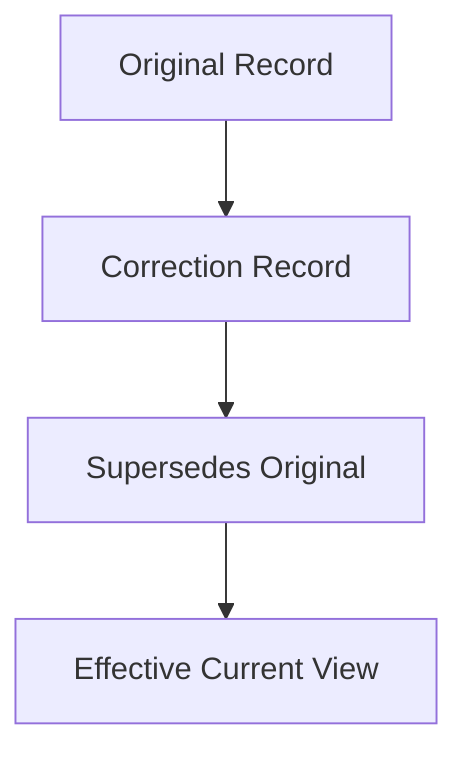

Contoh:

- financial ledger reversal,
- legal decision correction,
- submitted evidence amendment,
- regulatory classification correction.

Prinsip:

- jangan hapus jejak lama,
- correction harus punya reason,
- current view boleh dihitung dari record efektif,
- audit harus bisa mengikuti chain.

---

## 30. Design Pattern: Authority Gateway

Jika banyak client perlu mengubah data penting, buat gateway command.

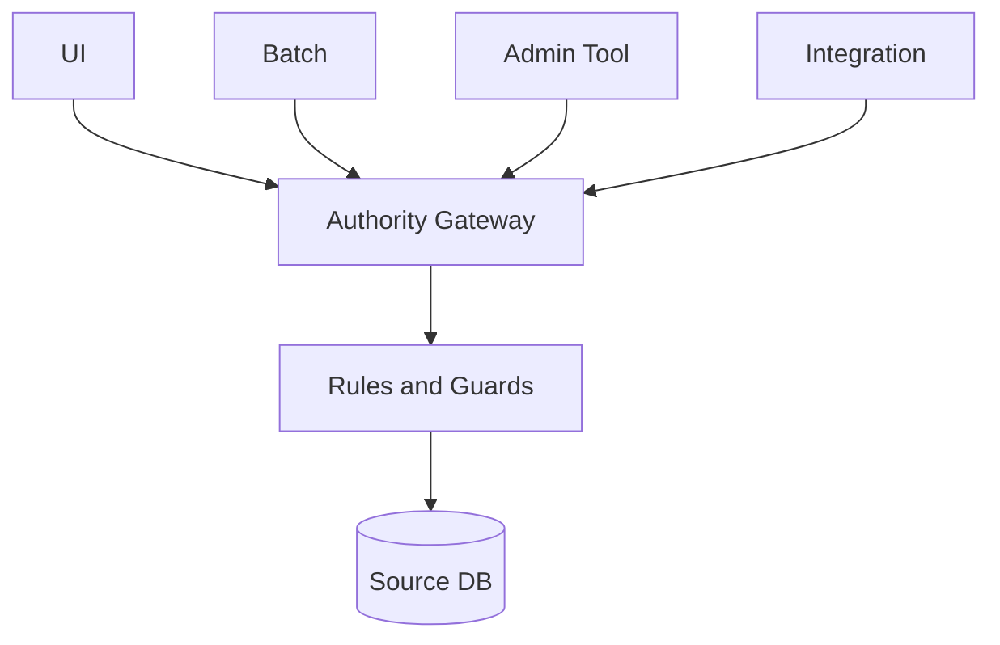

Gateway memastikan semua writer melewati:

- validation,
- authorization,
- transaction,
- audit,
- idempotency,
- event publishing.

Ini bukan selalu microservice baru. Bisa berupa application service/module yang jelas ownership-nya.

---

## 31. Practical Checklist: Is This Database the Truth?

Untuk setiap table penting, jawab:

1. Apakah table ini authoritative atau derived?
2. Jika derived, dari mana sumbernya?
3. Jika authoritative, siapa allowed writer?
4. Apakah ada writer lain lewat script/job/tool?
5. Apa invariant yang dijaga?
6. Constraint apa yang ada?
7. Apakah write path idempotent?
8. Apakah concurrent write aman?
9. Apakah perubahan menghasilkan audit?
10. Apakah perubahan dipublish ke downstream?
11. Apakah downstream tahu ini source atau copy?
12. Apakah data bisa dikoreksi?
13. Apakah correction preserving history?
14. Apakah report historical bisa direproduksi?
15. Apakah backup/restore mempertahankan authority?

---

## 32. Example Authority Document

Gunakan format ini di design doc.

```md
## Data Authority: Case Status

Fact:
Current lifecycle status of a regulatory case.

Authoritative Store:
`case.status` in Case DB.

Allowed Writers:
- Case workflow command handler
- Approved correction workflow

Forbidden Writers:
- Direct BI update
- Dashboard service
- Search indexer
- Notification worker

Validation:
- State transition guard
- Actor authorization
- Required evidence check
- Optimistic version check

History:
`case_status_transition` stores all transitions.

Audit:
`audit_event` records actor, action, reason, source IP/context, timestamp.

Publication:
`outbox_event` emits `CaseStatusChanged` after commit.

Derived Copies:
- case dashboard projection
- search index
- warehouse fact table

Recovery:
Projection can be rebuilt from source state + transition history.
Outbox can be replayed from event table.

Correction:
Use correction command. No direct update except approved emergency runbook.
```

Ini jauh lebih berguna daripada ERD saja.

---

## 33. Review Questions for Engineers

Saat review desain database, ajukan pertanyaan berikut:

1. Apa fakta authoritative di desain ini?
2. Apakah ada fakta yang punya lebih dari satu writer?
3. Apa data yang hanya projection?
4. Apakah projection bisa stale? Apakah aman?
5. Apa action yang wajib re-read dari source?
6. Bagaimana correction dilakukan?
7. Apakah audit lengkap untuk data penting?
8. Bagaimana concurrent update dicegah?
9. Apakah external system punya authority sendiri?
10. Bagaimana report menjelaskan cutoff dan lineage?

Jika desain tidak bisa menjawab, jangan langsung debat schema. Kembali ke authority model.

---

## 34. Connection to Official Database Concepts

Konsep “system of truth” tidak selalu disebut dengan istilah yang sama di setiap dokumentasi database, tetapi fondasinya muncul di banyak fitur:

- transaction menjaga perubahan atomic,
- isolation mengatur visibility antar transaksi,
- constraints menjaga integrity,
- WAL/durability menjaga data survive crash,
- replication menjaga availability/durability di node lain,
- data modeling guidance mengarahkan bentuk data berdasarkan access pattern,
- distributed database membahas consistency dan ordering transaksi.

PostgreSQL documentation tentang concurrency control menekankan integritas data saat banyak session mengakses data bersamaan. Ini relevan karena source of truth hanya bermakna jika tetap benar di bawah concurrency. Spanner documentation tentang external consistency relevan untuk distributed truth karena transaksi harus tampak sesuai urutan serial global. MongoDB data modeling guidance tentang embed/reference relevan karena bentuk data harus mengikuti hubungan dan access pattern, tetapi authority tetap harus jelas.

---

## 35. Ringkasan Part 002

Database sebagai system of truth berarti:

1. Setiap business fact penting punya authority jelas.
2. Write authority harus lebih ketat daripada read access.
3. Derived data harus diberi label sebagai projection/cache/snapshot.
4. Projection harus rebuildable, reconciled, atau official snapshot.
5. Correction path harus eksplisit dan diaudit.
6. Historical/effective truth tidak boleh dikorbankan oleh current truth.
7. Consistency boundary harus diketahui.
8. Multi-writer same fact adalah red flag besar.
9. Cache/search/report tidak boleh diam-diam menjadi authority.
10. Data yang authoritative harus aman terhadap concurrency, retry, migration, dan recovery.

Kalimat paling penting dari part ini:

> Satu fakta boleh punya banyak salinan untuk dibaca, tetapi harus punya satu authority untuk menentukan kebenaran.

Di Part 003, kita akan masuk ke **Data Lifecycle and State Thinking**: bagaimana memodelkan lifecycle data, state transition, mutable/immutable state, historical record, dan failure mode dari state yang tidak dirancang dengan benar.
