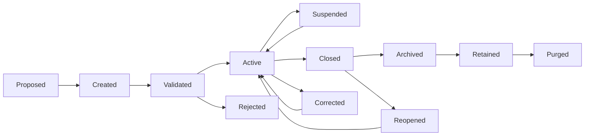
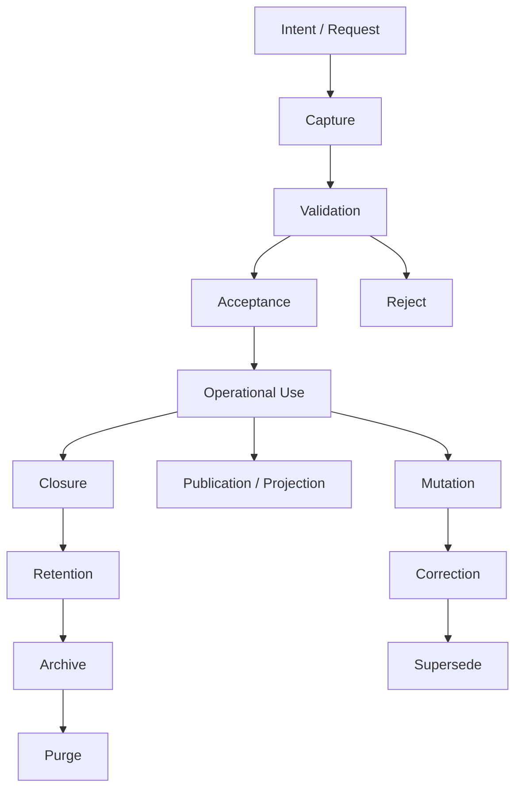
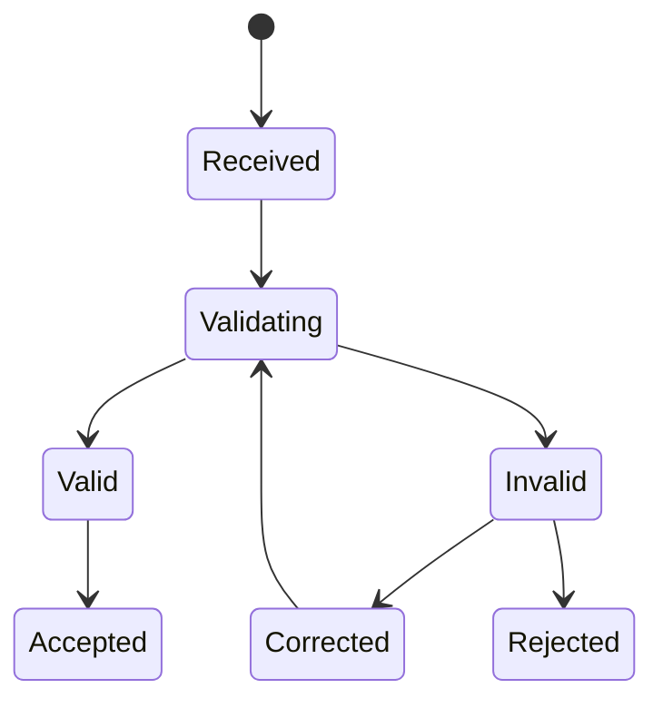
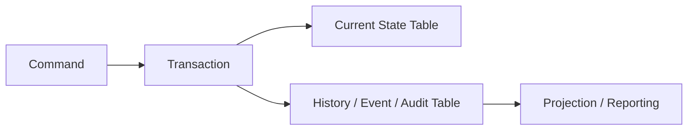
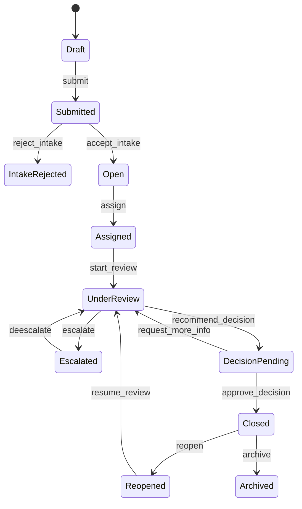
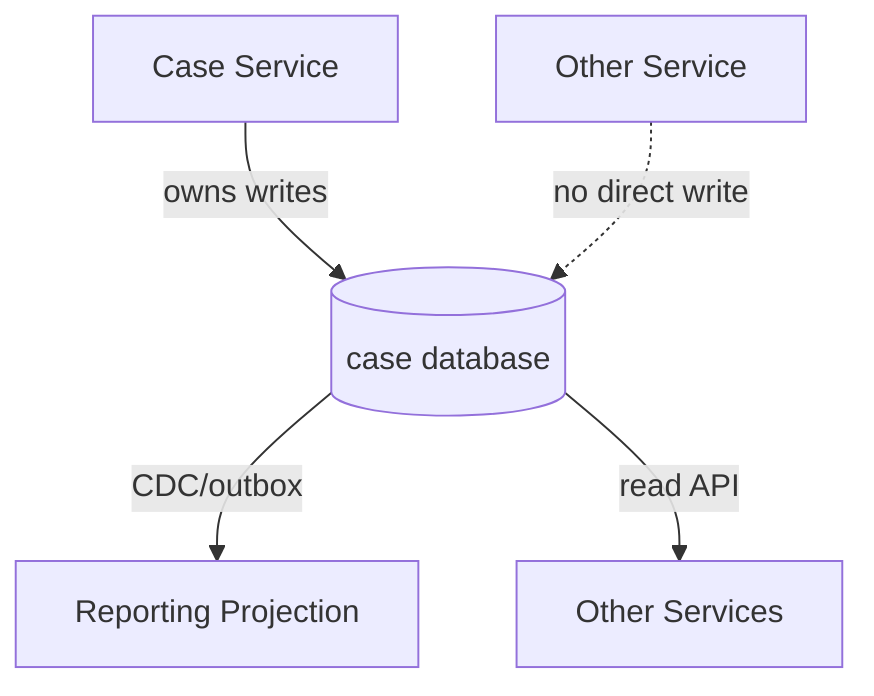
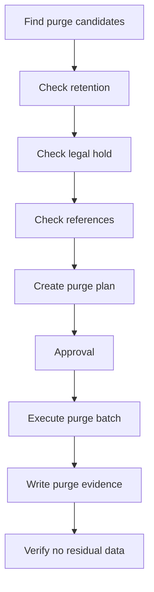
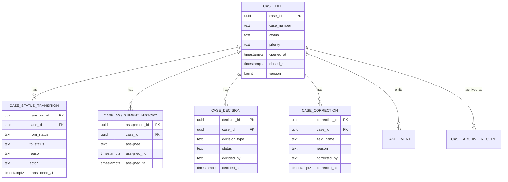

# Part 003 — Data Lifecycle and State Thinking

Database design yang matang tidak dimulai dari pertanyaan:

> “Tabelnya apa saja?”

Database design yang matang dimulai dari pertanyaan:

> “State apa yang sedang kita kelola, siapa yang boleh mengubahnya, kapan state itu valid, bagaimana state itu dikoreksi, dan bukti apa yang harus tetap tersedia saat sistem dipertanyakan?”

Part ini membangun cara berpikir **data lifecycle** dan **state thinking**. Ini adalah fondasi sebelum masuk ke entity modelling, workflow modelling, audit design, temporal design, dan compliance-grade database.

Untuk engineer biasa, database adalah tempat menyimpan record.

Untuk database architect, database adalah **mesin pengelola state yang harus tetap masuk akal ketika waktu berjalan, user melakukan kesalahan, proses berubah, sistem gagal, dan regulator meminta bukti**.

---

## 1. Tujuan Part Ini

Setelah part ini, kamu harus mampu:

1. Melihat data sebagai **state yang hidup**, bukan row statis.
2. Membedakan **current state**, **historical state**, **derived state**, dan **decision state**.
3. Mendesain lifecycle data dari creation sampai retention/purge.
4. Mendeteksi desain yang rapuh karena tidak punya state model eksplisit.
5. Menentukan kapan memakai kolom status sederhana, transition log, event log, temporal table, atau immutable record.
6. Mendesain correction path tanpa merusak auditability.
7. Menghubungkan lifecycle data dengan workflow, legal defensibility, operational safety, dan performance.

---

## 2. Mental Model Utama: Data Is State Over Time

Sebuah row bukan hanya fakta saat ini.

Row adalah titik pada perjalanan state.

Contoh sederhana:

```sql
case_id        = 'C-2026-000812'
status         = 'UNDER_REVIEW'
assigned_to    = 'investigator_17'
priority       = 'HIGH'
due_at         = '2026-07-10T17:00:00+07:00'
updated_at     = '2026-07-04T15:12:31+07:00'
```

Engineer pemula melihat ini sebagai data kasus.

Architect melihat banyak pertanyaan:

- Status sebelumnya apa?
- Siapa yang mengubah status?
- Apakah perubahan itu legal dari status sebelumnya?
- Apakah assignment berubah bersamaan dengan status?
- Apakah perubahan priority perlu alasan?
- Apakah SLA dihitung dari waktu creation, assignment, atau acceptance?
- Apakah due date boleh berubah?
- Jika due date berubah, apakah due date lama harus tetap terlihat?
- Apakah `updated_at` cukup untuk audit? Hampir pasti tidak.
- Jika row ini direplikasi ke sistem reporting, apa makna “current” di sana?
- Jika user salah input, apakah kita update row atau membuat correction record?

Database architecture dimulai ketika pertanyaan-pertanyaan ini dijawab secara eksplisit.

---

## 3. Lifecycle Bukan CRUD

CRUD terlalu sederhana untuk sistem nyata.

CRUD mengatakan:

```text
Create -> Read -> Update -> Delete
```

Sistem produksi biasanya lebih dekat dengan ini:



CRUD hanya operasi teknis.

Lifecycle adalah **semantik bisnis**.

Perbedaan ini penting:

| CRUD | Lifecycle |
|---|---|
| Operasi teknis | Perubahan makna bisnis |
| Biasanya generic | Domain-specific |
| Tidak menjelaskan legal transition | Menjelaskan transition yang valid |
| Tidak cukup untuk audit | Bisa menjadi basis audit |
| Cocok untuk admin sederhana | Cocok untuk sistem kritikal |

Kesalahan umum: membangun sistem kritikal dengan mental model CRUD, lalu menambal dengan status, flag, dan catatan manual.

Hasilnya biasanya:

- status tidak konsisten,
- audit tidak lengkap,
- reporting ambigu,
- deletion berbahaya,
- workflow sulit diubah,
- debugging incident mahal,
- dan keputusan bisnis tidak bisa dipertanggungjawabkan.

---

## 4. Data Lifecycle Canonical Model

Untuk hampir semua domain, lifecycle data dapat dianalisis melalui fase berikut:



Mari pecah secara architectural.

---

## 5. Phase 1 — Intent / Request

Banyak data tidak muncul sebagai fakta final. Data muncul sebagai **intent**.

Contoh:

- user mengajukan permohonan,
- sistem menerima file upload,
- partner mengirim event,
- officer membuat draft enforcement action,
- service menerima request pembayaran,
- sensor mengirim measurement,
- customer submit perubahan profil.

Intent belum tentu valid.

Architectural implication:

- Jangan selalu langsung memasukkan intent ke tabel canonical final.
- Kadang perlu staging table, inbox table, draft table, atau request table.
- Intent perlu idempotency key.
- Intent perlu provenance: dari mana datangnya, kapan diterima, payload apa, signature apa, correlation ID apa.

Contoh desain buruk:

```sql
CREATE TABLE customer (
    id BIGINT PRIMARY KEY,
    name TEXT NOT NULL,
    email TEXT NOT NULL,
    phone TEXT,
    address TEXT
);
```

Lalu semua request update customer langsung mengubah row customer.

Masalah:

- tidak tahu request mana yang menyebabkan perubahan,
- tidak tahu apakah data pernah gagal validasi,
- tidak ada review state,
- tidak ada correction path,
- tidak bisa membedakan proposed data dan accepted data.

Desain lebih matang:

```sql
CREATE TABLE customer_profile_change_request (
    request_id UUID PRIMARY KEY,
    customer_id BIGINT NOT NULL,
    request_type TEXT NOT NULL,
    submitted_by TEXT NOT NULL,
    submitted_at TIMESTAMPTZ NOT NULL,
    idempotency_key TEXT NOT NULL,
    proposed_payload JSONB NOT NULL,
    status TEXT NOT NULL,
    validation_result JSONB,
    reviewed_by TEXT,
    reviewed_at TIMESTAMPTZ,
    decision_reason TEXT,
    UNIQUE (customer_id, idempotency_key)
);
```

Canonical customer row baru berubah setelah request accepted.

Ini bukan overengineering. Ini separation antara **intent** dan **accepted fact**.

---

## 6. Phase 2 — Capture

Capture adalah titik ketika sistem menerima data.

Pertanyaan penting:

1. Apakah captured data harus disimpan walaupun invalid?
2. Apakah payload asli perlu dipertahankan?
3. Apakah capture harus idempotent?
4. Apakah capture harus exactly-once? Biasanya tidak; yang realistis adalah at-least-once + idempotency.
5. Apakah capture time sama dengan business effective time? Biasanya tidak.

Contoh:

```text
submitted_at  = kapan user submit
received_at   = kapan service menerima
validated_at  = kapan validasi selesai
effective_at  = kapan perubahan berlaku
recorded_at   = kapan database mencatat fakta
```

Top 1% engineer tidak mencampur semua waktu ini ke satu `created_at`.

---

## 7. Phase 3 — Validation

Validation bukan hanya `NOT NULL`.

Ada beberapa level validation:

| Level | Contoh | Tempat Ideal |
|---|---|---|
| Syntactic | format email, tipe data, panjang string | app/API/schema |
| Structural | field wajib, enum valid | app + DB constraint |
| Referential | customer harus ada | DB foreign key / validated reference |
| Business invariant | tidak boleh approve closed case | domain service + DB guard bila mungkin |
| Temporal | effective date tidak boleh sebelum submission | domain service + DB constraint tertentu |
| Cross-entity | total exposure tidak boleh melewati limit | transaction + lock/serializable strategy |
| Regulatory | keputusan harus punya alasan dan actor | DB constraint + audit design |

Validation stage bisa menghasilkan beberapa state:



Desain yang matang tidak hanya bertanya “valid atau tidak”. Ia bertanya:

- invalid permanen atau bisa diperbaiki?
- siapa yang boleh memperbaiki?
- apakah invalid data tetap disimpan?
- apakah invalid data boleh masuk reporting?
- apakah invalid data memengaruhi SLA?
- apakah validation rules versioned?

Validation rules versioning penting. Data yang valid pada 2024 bisa invalid pada 2026 karena regulasi berubah.

---

## 8. Phase 4 — Acceptance

Acceptance adalah perubahan dari “data yang diterima” menjadi “fakta yang diakui sistem”.

Contoh:

- application submitted ≠ application accepted,
- payment instruction received ≠ payment executed,
- complaint received ≠ case opened,
- document uploaded ≠ document admitted as evidence,
- user request change address ≠ address changed.

Acceptance biasanya perlu:

- actor,
- timestamp,
- decision reason,
- rule version,
- source payload,
- idempotency guarantee,
- transition guard,
- audit record.

Contoh pattern:

```sql
CREATE TABLE case_intake (
    intake_id UUID PRIMARY KEY,
    external_reference TEXT,
    submitted_at TIMESTAMPTZ NOT NULL,
    received_at TIMESTAMPTZ NOT NULL,
    payload JSONB NOT NULL,
    status TEXT NOT NULL CHECK (status IN ('RECEIVED', 'VALIDATING', 'ACCEPTED', 'REJECTED')),
    rejection_reason TEXT
);

CREATE TABLE enforcement_case (
    case_id UUID PRIMARY KEY,
    intake_id UUID UNIQUE NOT NULL REFERENCES case_intake(intake_id),
    case_number TEXT UNIQUE NOT NULL,
    opened_at TIMESTAMPTZ NOT NULL,
    opened_by TEXT NOT NULL,
    status TEXT NOT NULL,
    priority TEXT NOT NULL
);
```

`case_intake` dan `enforcement_case` bukan duplikasi. Mereka mewakili lifecycle state yang berbeda.

---

## 9. Phase 5 — Operational Use

Begitu data accepted, ia mulai digunakan untuk operasi.

Di sini data menjadi input untuk:

- assignment,
- SLA,
- escalation,
- notifications,
- reporting,
- authorization,
- downstream integration,
- decision support,
- compliance evidence.

Architect harus tahu bahwa semakin banyak data digunakan, semakin mahal perubahan skemanya.

Sebuah field yang awalnya terlihat sederhana bisa menjadi contract lintas sistem.

Contoh:

```sql
status TEXT NOT NULL
```

Awalnya hanya dipakai UI.

Lalu dipakai:

- query inbox,
- SLA calculation,
- notification,
- dashboard,
- export regulator,
- authorization rule,
- data warehouse,
- machine learning feature,
- downstream partner API.

Setelah itu, rename status bukan perubahan kecil.

Ia adalah distributed contract change.

---

## 10. Phase 6 — Mutation

Mutation adalah perubahan terhadap accepted state.

Ada dua jenis mutation:

1. **Business mutation**: perubahan yang punya makna domain.
2. **Technical mutation**: perubahan teknis tanpa makna domain.

Contoh business mutation:

- case assigned,
- case escalated,
- payment captured,
- application approved,
- customer status suspended,
- due date extended.

Contoh technical mutation:

- backfill computed column,
- normalize phone format,
- migrate enum value,
- update search vector,
- recompute materialized summary.

Keduanya tidak boleh dicampur dalam audit.

Business mutation perlu actor dan reason.

Technical mutation perlu job id, migration id, dan safety evidence.

---

## 11. Mutable State vs Immutable Facts

Ini salah satu keputusan paling penting.

### 11.1 Mutable State

Mutable state menyimpan kondisi saat ini.

```sql
UPDATE enforcement_case
SET status = 'CLOSED', closed_at = now()
WHERE case_id = :case_id;
```

Kelebihan:

- mudah query current state,
- sederhana untuk UI,
- hemat storage,
- cocok untuk entity operational.

Kelemahan:

- history hilang jika tidak dicatat,
- audit butuh mekanisme tambahan,
- sulit menjawab “apa yang diketahui saat itu?”,
- rawan lost context.

### 11.2 Immutable Facts

Immutable facts menyimpan kejadian atau fakta yang tidak diubah.

```sql
INSERT INTO case_event (
    event_id,
    case_id,
    event_type,
    occurred_at,
    recorded_at,
    actor,
    payload
) VALUES (
    gen_random_uuid(),
    :case_id,
    'CASE_CLOSED',
    :occurred_at,
    now(),
    :actor,
    :payload
);
```

Kelebihan:

- audit kuat,
- bisa replay,
- bagus untuk provenance,
- correction bisa eksplisit.

Kelemahan:

- query current state lebih kompleks,
- perlu projection/read model,
- event schema evolution sulit,
- tidak semua domain cocok full event sourcing.

### 11.3 Hybrid Pattern

Paling umum di sistem enterprise:



Current state dipakai untuk operational query.

History/event/audit dipakai untuk traceability.

Ini sering lebih realistis daripada full event sourcing.

---

## 12. Pattern: Current Table + Transition Table

Untuk state machine, pattern ini sangat berguna.

```sql
CREATE TABLE case_file (
    case_id UUID PRIMARY KEY,
    case_number TEXT UNIQUE NOT NULL,
    status TEXT NOT NULL,
    assigned_to TEXT,
    opened_at TIMESTAMPTZ NOT NULL,
    closed_at TIMESTAMPTZ,
    version BIGINT NOT NULL DEFAULT 0
);

CREATE TABLE case_status_transition (
    transition_id UUID PRIMARY KEY,
    case_id UUID NOT NULL REFERENCES case_file(case_id),
    from_status TEXT,
    to_status TEXT NOT NULL,
    transition_reason TEXT NOT NULL,
    transitioned_by TEXT NOT NULL,
    transitioned_at TIMESTAMPTZ NOT NULL,
    command_id UUID NOT NULL,
    metadata JSONB NOT NULL DEFAULT '{}'::jsonb,
    UNIQUE (case_id, command_id)
);
```

Why this works:

- `case_file.status` cepat untuk query current inbox.
- `case_status_transition` menyimpan history perubahan state.
- `command_id` membuat transition idempotent.
- `version` mendukung optimistic concurrency.
- `transition_reason` membantu audit dan defensibility.

Namun ada invariant penting:

> Update current status dan insert transition harus terjadi dalam satu transaksi.

```sql
BEGIN;

UPDATE case_file
SET status = :to_status,
    version = version + 1
WHERE case_id = :case_id
  AND status = :from_status
  AND version = :expected_version;

INSERT INTO case_status_transition (...)
VALUES (...);

COMMIT;
```

Kalau update berhasil tapi transition gagal, audit rusak.

Kalau transition berhasil tapi update gagal, current state salah.

Boundary transaksinya harus jelas.

---

## 13. Pattern: Effective-Dated Records

Kadang kita perlu tahu nilai yang berlaku pada waktu tertentu.

Contoh:

- tariff,
- policy rule,
- assignment period,
- membership tier,
- regulatory threshold,
- organization structure,
- customer address validity.

Pattern:

```sql
CREATE TABLE customer_address_history (
    address_record_id UUID PRIMARY KEY,
    customer_id BIGINT NOT NULL,
    address_line_1 TEXT NOT NULL,
    city TEXT NOT NULL,
    country_code TEXT NOT NULL,
    valid_from TIMESTAMPTZ NOT NULL,
    valid_to TIMESTAMPTZ,
    recorded_at TIMESTAMPTZ NOT NULL,
    recorded_by TEXT NOT NULL,
    CHECK (valid_to IS NULL OR valid_to > valid_from)
);
```

Query current address:

```sql
SELECT *
FROM customer_address_history
WHERE customer_id = :customer_id
  AND valid_from <= now()
  AND (valid_to IS NULL OR valid_to > now());
```

Query address at incident time:

```sql
SELECT *
FROM customer_address_history
WHERE customer_id = :customer_id
  AND valid_from <= :incident_time
  AND (valid_to IS NULL OR valid_to > :incident_time);
```

Masalah yang perlu dijaga:

- overlapping validity range,
- open-ended current record,
- late-arriving correction,
- timezone ambiguity,
- backdated effective date,
- future-dated effective date.

Di PostgreSQL, exclusion constraint dengan range type bisa membantu mencegah overlap untuk kasus tertentu.

Konsepnya:

```sql
-- illustrative pattern, details depend on extension/operator class
EXCLUDE USING gist (
  customer_id WITH =,
  tstzrange(valid_from, valid_to) WITH &&
);
```

Ingat: effective time bukan transaction time.

---

## 14. Pattern: Bitemporal Thinking

Bitemporal design membedakan dua dimensi waktu:

1. **Valid time**: kapan fakta berlaku di dunia bisnis.
2. **Transaction/record time**: kapan sistem mengetahui atau mencatat fakta itu.

Contoh:

Pada 10 Juli, sistem menerima koreksi bahwa alamat customer sebenarnya sudah berubah sejak 1 Juli.

```text
valid_from   = 2026-07-01
recorded_at  = 2026-07-10
```

Kalau kita hanya punya satu timestamp, pertanyaan ini sulit dijawab:

- Apa alamat yang berlaku pada 5 Juli?
- Apa alamat yang sistem ketahui pada 5 Juli?
- Apa alamat yang kita ketahui sekarang untuk tanggal 5 Juli?

Untuk regulasi, dispute, dan audit, pertanyaan ini sering sangat penting.

Bitemporal bukan selalu wajib. Tapi architect harus tahu kapan waktunya diperlukan.

Gunakan bitemporal saat:

- keputusan historis harus direkonstruksi,
- data bisa datang terlambat,
- correction backdated legal,
- reporting harus reproducible,
- regulator bisa bertanya “what did you know at the time?”.

---

## 15. Correction Is Not The Same As Update

Ini prinsip penting.

Update biasa mengatakan:

> “Nilainya sekarang X.”

Correction mengatakan:

> “Nilai sebelumnya dianggap salah, alasan koreksinya Y, dikoreksi oleh Z, pada waktu T, dengan efek terhadap periode P.”

Contoh buruk:

```sql
UPDATE customer
SET date_of_birth = '1988-04-11'
WHERE customer_id = 123;
```

Contoh lebih defensible:

```sql
CREATE TABLE customer_identity_correction (
    correction_id UUID PRIMARY KEY,
    customer_id BIGINT NOT NULL,
    field_name TEXT NOT NULL,
    old_value TEXT,
    new_value TEXT NOT NULL,
    correction_reason TEXT NOT NULL,
    evidence_document_id UUID,
    corrected_by TEXT NOT NULL,
    corrected_at TIMESTAMPTZ NOT NULL,
    approved_by TEXT,
    approved_at TIMESTAMPTZ
);
```

Lalu update canonical customer dilakukan dalam transaksi yang sama.

Correction path harus menjawab:

- apa yang salah,
- siapa yang memperbaiki,
- siapa yang menyetujui,
- bukti apa yang digunakan,
- apa dampaknya ke downstream,
- apakah report lama perlu direstate,
- apakah event koreksi perlu dipublish.

---

## 16. Deletion Is A Lifecycle Decision

`DELETE FROM table WHERE id = ?` sering terlalu naif.

Deletion bisa berarti banyak hal:

| Jenis | Makna |
|---|---|
| Soft delete | tidak aktif di UI/operasi, row masih ada |
| Hard delete | row dihapus fisik |
| Logical removal | hubungan/domain membership diakhiri |
| Anonymization | identitas dihapus, record statistik tetap |
| Archival | dipindahkan ke storage/partition arsip |
| Purge | dihancurkan setelah retention selesai |
| Legal hold | deletion ditunda karena investigasi/sengketa |

Sebelum membuat kolom `deleted_at`, jawab dulu:

1. Apakah record boleh benar-benar hilang?
2. Apakah foreign key masih perlu menjaga referential integrity?
3. Apakah deleted data masih muncul di audit?
4. Apakah user boleh melihat deleted data?
5. Apakah deleted data masih masuk reporting historis?
6. Apakah deletion harus reversible?
7. Apakah ada legal retention?
8. Apakah downstream harus diberi tahu?

Soft delete tanpa strategi query bisa menjadi sumber bug.

Contoh masalah:

```sql
SELECT * FROM customer WHERE email = :email;
```

Query lupa `deleted_at IS NULL`, lalu customer deleted tetap dianggap aktif.

Solusi bisa berupa:

- partial unique index,
- view untuk active rows,
- row-level security,
- repository-level invariant,
- archival table,
- state enum eksplisit.

Contoh partial unique index:

```sql
CREATE UNIQUE INDEX uq_customer_active_email
ON customer (lower(email))
WHERE deleted_at IS NULL;
```

---

## 17. State Explosion

Salah satu failure mode database design: terlalu banyak flag.

Contoh:

```sql
is_active BOOLEAN
is_verified BOOLEAN
is_locked BOOLEAN
is_pending_review BOOLEAN
is_suspended BOOLEAN
is_deleted BOOLEAN
is_archived BOOLEAN
```

Kombinasi flag menghasilkan state implisit.

Dengan 7 boolean, ada 128 kemungkinan kombinasi.

Sebagian besar tidak valid.

Contoh kombinasi aneh:

```text
is_active = true
is_deleted = true
is_pending_review = true
is_archived = true
```

Apa artinya?

Desain yang lebih baik biasanya memakai state eksplisit plus auxiliary state bila benar-benar orthogonal.

```sql
status TEXT NOT NULL CHECK (status IN (
  'DRAFT',
  'PENDING_REVIEW',
  'ACTIVE',
  'SUSPENDED',
  'CLOSED',
  'ARCHIVED'
));
```

Namun enum pun bukan obat ajaib. Jika status menjadi terlalu banyak, mungkin domain perlu dipecah menjadi beberapa state machine orthogonal.

Contoh:

```text
Case lifecycle status: OPEN, UNDER_REVIEW, CLOSED
Assignment status: UNASSIGNED, ASSIGNED, REASSIGNMENT_REQUESTED
SLA status: ON_TRACK, AT_RISK, BREACHED
Publication status: INTERNAL, PUBLISHED, WITHDRAWN
```

Ini lebih jelas daripada satu kolom status dengan 40 nilai.

---

## 18. State Machine as Database Design Tool

Untuk entity penting, selalu gambar state machine.

Contoh case lifecycle:



Dari diagram ini, kita bisa derive:

- allowed transitions,
- required fields per transition,
- actor/role per transition,
- audit requirement,
- notification event,
- SLA reset rule,
- reporting milestone,
- possible indexes,
- invariants.

Contoh invariant:

```text
A case cannot enter CLOSED unless it has at least one approved decision record.
```

Schema implication:

- `decision` table diperlukan,
- `decision.status = APPROVED` harus ada,
- close command harus dilakukan dalam transaction yang memeriksa decision,
- audit transition harus mencatat decision id.

---

## 19. Lifecycle-Driven Schema Discovery

Sebelum membuat schema, buat lifecycle matrix.

Contoh:

| State | Required Data | Allowed Actions | Actor | Audit Needed | SLA Impact |
|---|---|---|---|---|---|
| Draft | title, category | edit, submit, discard | creator | low | no |
| Submitted | intake payload | validate, reject, accept | intake officer | medium | yes |
| Open | case number, opened_at | assign, close preliminarily | supervisor | high | yes |
| Assigned | assignee | start review, reassign | supervisor/assignee | high | yes |
| Under Review | review record | add evidence, escalate, recommend | investigator | high | yes |
| Decision Pending | recommendation | approve, reject, request info | approver | very high | yes |
| Closed | decision, closure reason | reopen, archive | authorized role | very high | no active SLA |
| Archived | archive ref | restore under policy | admin/legal | very high | no |

Dari matrix ini, schema lebih mudah muncul secara natural.

Kita mulai melihat entity:

- case,
- intake,
- assignment,
- review,
- evidence,
- decision,
- transition,
- SLA snapshot,
- archive record,
- actor/authorization reference.

Ini jauh lebih baik daripada brainstorming tabel secara acak.

---

## 20. Current State, Historical State, and Derived State

Bedakan tiga hal ini.

### 20.1 Current State

State yang digunakan sistem operasional saat ini.

Contoh:

```sql
case_file.status
case_file.assigned_to
case_file.priority
case_file.current_sla_due_at
```

### 20.2 Historical State

State yang pernah terjadi.

Contoh:

```sql
case_status_transition
case_assignment_history
case_priority_change
case_decision_history
```

### 20.3 Derived State

State yang dihitung dari state lain.

Contoh:

```sql
case_file.current_sla_status
case_summary.total_evidence_count
case_dashboard_projection.age_bucket
```

Derived state perlu aturan:

- sumber kebenarannya apa,
- kapan dihitung,
- apakah boleh stale,
- bagaimana repair/rebuild,
- apakah disimpan atau dihitung on-demand,
- bagaimana invalidation.

Kesalahan umum: derived state diperlakukan sebagai fakta canonical.

Contoh:

```sql
customer.total_active_cases
```

Ini derived dari `case_file`.

Kalau disimpan, harus ada mekanisme menjaga konsistensi.

Pilihan:

1. Hitung on-demand.
2. Maintain dengan trigger.
3. Maintain di application transaction.
4. Maintain lewat async projection.
5. Maintain lewat batch refresh.

Tidak ada pilihan universal. Tergantung workload, freshness, correctness, dan cost.

---

## 21. Lifecycle and Ownership

Setiap lifecycle harus punya owner.

Pertanyaan:

- Service/domain mana yang boleh membuat entity?
- Service/domain mana yang boleh mengubah status?
- Apakah downstream boleh update langsung?
- Siapa yang bertanggung jawab memperbaiki data?
- Siapa yang menentukan retention?
- Siapa yang approve schema change?

Database yang tidak punya ownership akan menjadi shared mutable state tanpa governance.

Anti-pattern:

```text
Multiple services update the same table directly.
```

Dampaknya:

- invariants tersebar,
- audit tidak konsisten,
- migration sulit,
- incident ownership kabur,
- perubahan kecil bisa mematahkan sistem lain.

Pattern yang lebih baik:



Read sharing bisa dipertimbangkan. Write ownership harus ketat.

---

## 22. Lifecycle and Invariants

Invariant adalah aturan yang harus selalu benar.

Lifecycle membantu menemukan invariant.

Contoh:

```text
A closed case must have closed_at.
An archived case must be closed first.
A case cannot have two active primary assignees.
A decision cannot be approved by the same person who created it.
A customer cannot have overlapping active identity verification records.
A payment cannot be captured twice for the same authorization.
```

Setiap invariant harus punya enforcement location:

| Invariant Type | Enforcement |
|---|---|
| Simple non-null | DB constraint |
| Unique active record | partial unique index / exclusion constraint |
| Referential existence | foreign key |
| Transition validity | application transaction + transition table |
| Cross-row aggregate | transaction isolation / lock / materialized counter |
| Cross-service | saga/outbox/compensation |
| Human decision | workflow + audit + authorization |

Prinsip:

> Semakin kritikal invariant, semakin dekat enforcement-nya ke database transaction boundary.

---

## 23. Lifecycle and Versioning

Ada beberapa jenis versioning:

1. **Row version** untuk concurrency.
2. **Schema version** untuk compatibility.
3. **Rule version** untuk validasi/keputusan.
4. **Document version** untuk artifacts.
5. **State version** untuk event/projection ordering.
6. **Policy version** untuk compliance.

Jangan mencampur semuanya dalam satu kolom `version` tanpa definisi.

Contoh:

```sql
CREATE TABLE case_file (
    case_id UUID PRIMARY KEY,
    status TEXT NOT NULL,
    row_version BIGINT NOT NULL DEFAULT 0,
    lifecycle_version BIGINT NOT NULL DEFAULT 0,
    schema_version INT NOT NULL DEFAULT 1
);
```

Namun jangan juga menambahkan version berlebihan. Gunakan saat ada kebutuhan nyata.

Rule of thumb:

- concurrency update? `row_version`.
- event ordering? sequence/event version.
- validation reproducibility? rule version.
- payload compatibility? schema version.

---

## 24. Lifecycle and Late-Arriving Data

Sistem nyata menerima data terlambat.

Contoh:

- partner mengirim correction setelah report final,
- sensor offline lalu sync data lama,
- user upload document setelah deadline,
- payment settlement datang setelah authorization expired,
- regulator mengubah classification efektif bulan lalu.

Pertanyaan:

1. Apakah late data boleh diterima?
2. Apakah late data mengubah current state?
3. Apakah late data mengubah historical report?
4. Apakah perlu restatement?
5. Apakah downstream diberi correction event?
6. Apakah ada cutoff period?

Pattern:

```sql
CREATE TABLE data_arrival_policy (
    policy_id UUID PRIMARY KEY,
    data_type TEXT NOT NULL,
    max_lateness_interval INTERVAL NOT NULL,
    allow_backdated_effective_time BOOLEAN NOT NULL,
    requires_manual_review BOOLEAN NOT NULL,
    effective_from TIMESTAMPTZ NOT NULL
);
```

Dalam domain regulated, late-arriving data sering tidak boleh diperlakukan sebagai update biasa.

Ia adalah correction/revision.

---

## 25. Lifecycle and Reporting Correctness

Reporting sering rusak karena tidak jelas apakah report memakai:

- current state sekarang,
- state saat periode report,
- state saat report dibuat,
- state yang diketahui pada waktu itu,
- state setelah correction.

Contoh pertanyaan:

> “Berapa jumlah kasus high priority pada 30 Juni 2026?”

Ada beberapa jawaban valid tergantung definisi:

1. Kasus yang **saat ini** memiliki priority high dan opened sebelum 30 Juni.
2. Kasus yang **pada 30 Juni** memiliki priority high.
3. Kasus yang **diketahui sistem pada 30 Juni** sebagai high priority.
4. Kasus yang **setelah koreksi terbaru** dianggap high priority pada 30 Juni.

Tanpa temporal model, report bisa tidak defensible.

Untuk report resmi, definisi waktu harus eksplisit.

---

## 26. Lifecycle and Archival

Archival bukan sekadar memindahkan row lama.

Archival harus mempertahankan ability untuk:

- menemukan record,
- membuktikan record,
- restore bila perlu,
- memenuhi retention,
- menjaga referential context,
- melindungi data sensitif,
- menghindari query operasional melambat.

Pattern yang sering digunakan:

1. Partition by time/state.
2. Archive closed records ke cold storage.
3. Snapshot entity + related evidence.
4. Keep searchable metadata di hot DB.
5. Store immutable archive manifest.

Contoh archive manifest:

```sql
CREATE TABLE archive_manifest (
    archive_id UUID PRIMARY KEY,
    entity_type TEXT NOT NULL,
    entity_id UUID NOT NULL,
    archive_location TEXT NOT NULL,
    checksum TEXT NOT NULL,
    archived_at TIMESTAMPTZ NOT NULL,
    archived_by TEXT NOT NULL,
    retention_until DATE NOT NULL,
    legal_hold BOOLEAN NOT NULL DEFAULT false
);
```

---

## 27. Lifecycle and Purge

Purge adalah tindakan destruktif.

Sebelum purge, sistem harus tahu:

- apakah retention sudah selesai,
- apakah legal hold aktif,
- apakah record masih direferensikan,
- apakah ada derived projection yang perlu dibersihkan,
- apakah audit metadata minimal tetap disimpan,
- apakah purge harus menghasilkan certificate/log.

Contoh safe purge workflow:



Purge yang tidak terkontrol bisa melanggar audit, compliance, atau referential integrity.

---

## 28. Designing Lifecycle Tables

Tidak semua entity butuh semua tabel. Tapi untuk entity kritikal, pertimbangkan struktur berikut:



Architectural judgement diperlukan. Jangan membuat semua tabel hanya karena terlihat lengkap. Buat jika lifecycle, audit, compliance, atau operational query memang menuntutnya.

---

## 29. Practical Design Procedure

Gunakan langkah berikut untuk entity penting.

### Step 1 — Define the Entity Meaning

Tulis satu kalimat:

```text
A Case is the accepted operational container for investigating a validated intake that may lead to regulatory action.
```

Kalimat ini membedakan case dari intake, complaint, task, evidence, dan decision.

### Step 2 — Draw Lifecycle States

Jangan mulai dari schema. Mulai dari state.

```text
DRAFT -> SUBMITTED -> OPEN -> UNDER_REVIEW -> DECISION_PENDING -> CLOSED -> ARCHIVED
```

### Step 3 — Define Transitions

Untuk setiap transition:

- command,
- actor,
- precondition,
- postcondition,
- required data,
- audit record,
- emitted event,
- failure mode.

### Step 4 — Classify Data Fields

Kelompokkan field:

| Field Type | Example |
|---|---|
| Identity | case_id, case_number |
| Current state | status, assigned_to |
| Lifecycle timestamp | opened_at, closed_at |
| Derived | age_days, sla_status |
| Historical | status history, assignment history |
| Evidence | source document, decision reason |
| Operational metadata | version, created_at, updated_at |

### Step 5 — Decide Mutability

Untuk setiap field:

- immutable after creation?
- mutable with audit?
- mutable without audit?
- derived/recomputable?
- correction-only?

### Step 6 — Decide Enforcement

Untuk setiap invariant:

- DB constraint,
- foreign key,
- unique index,
- exclusion constraint,
- trigger,
- application transaction,
- workflow engine,
- offline validation.

### Step 7 — Decide History Strategy

Options:

- no history,
- timestamp columns only,
- audit table,
- transition table,
- effective-dated table,
- event log,
- bitemporal model.

### Step 8 — Design Repair Path

Assume data will be wrong.

Define:

- correction request,
- approval,
- backfill,
- downstream notification,
- report restatement,
- audit evidence.

---

## 30. Example: Bad Lifecycle Design

```sql
CREATE TABLE case_file (
    id UUID PRIMARY KEY,
    title TEXT,
    status TEXT,
    assigned_to TEXT,
    priority TEXT,
    created_at TIMESTAMPTZ,
    updated_at TIMESTAMPTZ,
    deleted_at TIMESTAMPTZ
);
```

Masalah:

- status bebas tanpa transition rule,
- tidak ada actor perubahan status,
- assignment tidak punya history,
- priority change tidak punya alasan,
- deleted_at tidak menjelaskan archive/retention/legal hold,
- created_at/updated_at tidak cukup untuk lifecycle,
- tidak ada accepted/opened/closed timestamp yang bermakna,
- tidak ada version untuk concurrency,
- tidak ada correction mechanism.

Ini mungkin cukup untuk CRUD app. Tidak cukup untuk complex case management atau regulated workflow.

---

## 31. Example: Better Lifecycle-Aware Design

```sql
CREATE TABLE case_file (
    case_id UUID PRIMARY KEY,
    case_number TEXT UNIQUE NOT NULL,
    intake_id UUID UNIQUE NOT NULL,
    status TEXT NOT NULL CHECK (status IN (
        'OPEN',
        'ASSIGNED',
        'UNDER_REVIEW',
        'DECISION_PENDING',
        'CLOSED',
        'ARCHIVED'
    )),
    priority TEXT NOT NULL CHECK (priority IN ('LOW', 'MEDIUM', 'HIGH', 'CRITICAL')),
    opened_at TIMESTAMPTZ NOT NULL,
    closed_at TIMESTAMPTZ,
    archived_at TIMESTAMPTZ,
    current_assignee TEXT,
    row_version BIGINT NOT NULL DEFAULT 0,
    created_at TIMESTAMPTZ NOT NULL,
    updated_at TIMESTAMPTZ NOT NULL,
    CHECK (
        (status <> 'CLOSED' AND closed_at IS NULL)
        OR
        (status = 'CLOSED' AND closed_at IS NOT NULL)
        OR
        (status = 'ARCHIVED' AND closed_at IS NOT NULL)
    )
);

CREATE TABLE case_status_transition (
    transition_id UUID PRIMARY KEY,
    case_id UUID NOT NULL REFERENCES case_file(case_id),
    from_status TEXT,
    to_status TEXT NOT NULL,
    command_name TEXT NOT NULL,
    command_id UUID NOT NULL,
    transition_reason TEXT NOT NULL,
    transitioned_by TEXT NOT NULL,
    transitioned_at TIMESTAMPTZ NOT NULL,
    metadata JSONB NOT NULL DEFAULT '{}'::jsonb,
    UNIQUE (case_id, command_id)
);

CREATE TABLE case_assignment_history (
    assignment_id UUID PRIMARY KEY,
    case_id UUID NOT NULL REFERENCES case_file(case_id),
    assignee TEXT NOT NULL,
    assigned_by TEXT NOT NULL,
    assigned_reason TEXT NOT NULL,
    assigned_from TIMESTAMPTZ NOT NULL,
    assigned_to TIMESTAMPTZ,
    CHECK (assigned_to IS NULL OR assigned_to > assigned_from)
);

CREATE TABLE case_correction (
    correction_id UUID PRIMARY KEY,
    case_id UUID NOT NULL REFERENCES case_file(case_id),
    correction_type TEXT NOT NULL,
    correction_reason TEXT NOT NULL,
    requested_by TEXT NOT NULL,
    requested_at TIMESTAMPTZ NOT NULL,
    approved_by TEXT,
    approved_at TIMESTAMPTZ,
    old_payload JSONB NOT NULL,
    new_payload JSONB NOT NULL,
    status TEXT NOT NULL CHECK (status IN ('REQUESTED', 'APPROVED', 'REJECTED', 'APPLIED'))
);
```

Ini belum final, tapi jauh lebih expressive.

---

## 32. Lifecycle Anti-Patterns

### 32.1 Status Without Transition History

```sql
status TEXT NOT NULL
```

Tanpa history, status hanya snapshot tanpa cerita.

### 32.2 Overloaded Status

```text
PENDING_CUSTOMER_REVIEW_WAITING_FOR_PAYMENT_NEEDS_MANAGER_APPROVAL
```

Jika status mengandung terlalu banyak dimensi, pecah state machine.

### 32.3 Boolean State Soup

Banyak flag menciptakan illegal state combinations.

### 32.4 `updated_at` As Audit

`updated_at` bukan audit trail. Ia hanya timestamp update terakhir.

### 32.5 Hard Delete For Regulated Data

Data hilang sebelum retention selesai.

### 32.6 No Correction Path

User salah input, engineer langsung update database manual.

### 32.7 No Late Data Policy

Semua data late dianggap update normal, lalu report berubah diam-diam.

### 32.8 Derived State Without Repair

Counter atau summary disimpan, tapi tidak ada rebuild mechanism.

### 32.9 Shared Write Ownership

Banyak service update lifecycle row yang sama.

### 32.10 Lifecycle Hidden In UI

Valid transition hanya dicegah di frontend. Backend/database tetap menerima illegal transition.

---

## 33. Lifecycle Review Checklist

Gunakan checklist ini saat review desain entity penting.

### Meaning

- Apa definisi entity ini?
- Apa bedanya dengan request/intake/draft/event/projection?
- Apakah entity ini canonical atau derived?

### Lifecycle

- Apa state awal?
- Apa state akhir?
- Apa transition valid?
- Apa transition ilegal?
- Apakah ada reopen/reversal/correction?

### Time

- Apa timestamp yang diperlukan?
- Apakah effective time berbeda dari recorded time?
- Apakah backdating diperbolehkan?
- Apakah report historis harus reproducible?

### Mutation

- Field mana immutable?
- Field mana mutable dengan audit?
- Field mana derived?
- Field mana correction-only?

### Audit

- Perubahan apa yang wajib punya actor?
- Perubahan apa yang wajib punya reason?
- Apakah old/new value perlu disimpan?
- Apakah decision rule version perlu dicatat?

### Deletion and Retention

- Apakah data boleh dihapus?
- Apakah perlu soft delete?
- Apakah perlu archive?
- Apakah ada legal hold?
- Apakah purge menghasilkan evidence?

### Ownership

- Siapa write owner?
- Siapa read consumer?
- Apakah downstream boleh update langsung?
- Bagaimana perubahan disebarkan?

### Failure

- Apa yang terjadi jika transition setengah berhasil?
- Apa yang terjadi jika event publish gagal?
- Apa yang terjadi jika backfill gagal?
- Apa yang terjadi jika correction terlambat?

---

## 34. Practical Exercise

Ambil entity: `enforcement_case`.

Buat lifecycle matrix:

| State | Required Fields | Allowed Actions | Forbidden Actions | Actor | Audit |
|---|---|---|---|---|---|
| Intake Received | payload, source | validate, reject | assign investigator | intake service | capture log |
| Open | case_number, opened_at | assign, classify | archive | supervisor | open transition |
| Under Review | assignee, review_started_at | add evidence, escalate | close without decision | investigator | review log |
| Decision Pending | recommendation | approve, request revision | modify evidence silently | approver | decision log |
| Closed | decision, closed_at | reopen, archive | add normal task | supervisor/legal | closure evidence |
| Archived | archive_id | restore under policy | mutate current data | admin/legal | archive manifest |

Kemudian jawab:

1. Tabel current state apa?
2. Tabel history apa?
3. Invariant apa yang wajib DB enforce?
4. Invariant apa yang cukup di application layer?
5. Apa correction path?
6. Apa retention path?
7. Apa query paling sering?
8. Apa query audit paling penting?

---

## 35. Key Takeaways

1. Database design yang matang adalah design terhadap **state over time**.
2. CRUD bukan lifecycle. CRUD adalah operasi teknis; lifecycle adalah makna domain.
3. Accepted fact harus dibedakan dari intent/request/draft.
4. Current state, historical state, dan derived state harus punya boundary jelas.
5. Correction bukan update biasa.
6. Deletion adalah lifecycle decision, bukan hanya SQL command.
7. Banyak boolean flag menciptakan state explosion.
8. Transition table sering menjadi pattern paling praktis untuk audit dan operational query.
9. Effective time dan recorded time berbeda; jangan disatukan tanpa sadar.
10. Entity penting harus dimodelkan dengan lifecycle matrix sebelum schema final.

---

## 36. What Comes Next

Part berikutnya membahas **Workload-First Design**.

Setelah tahu data sebagai lifecycle state, kita akan melihat bagaimana database architect mendesain dari workload nyata:

- read/write ratio,
- latency target,
- query shape,
- contention point,
- storage growth,
- consistency need,
- reporting need,
- multi-tenant skew,
- operational failure mode.

Prinsipnya:

> Schema yang benar secara teoritis bisa tetap gagal di produksi jika tidak cocok dengan workload.

