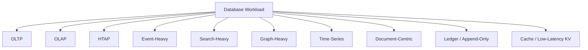
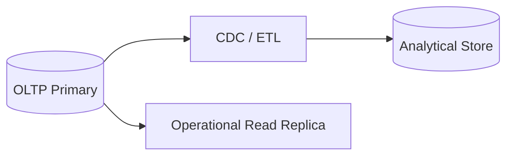
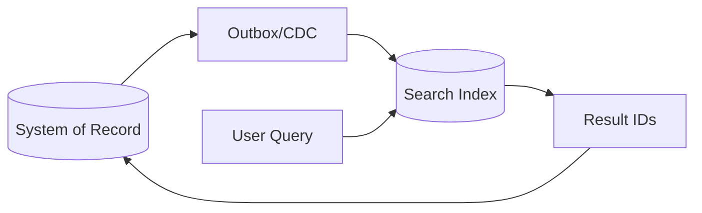
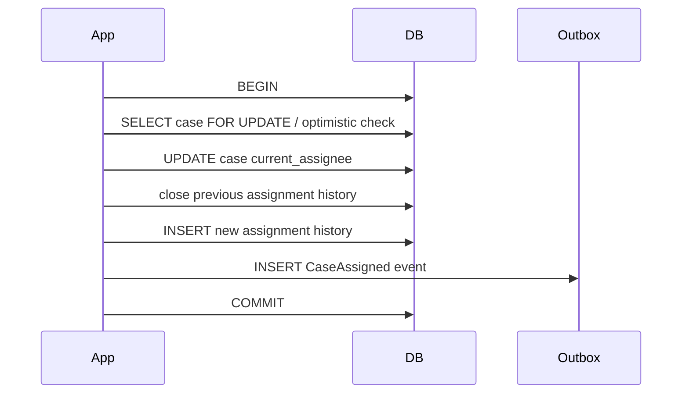
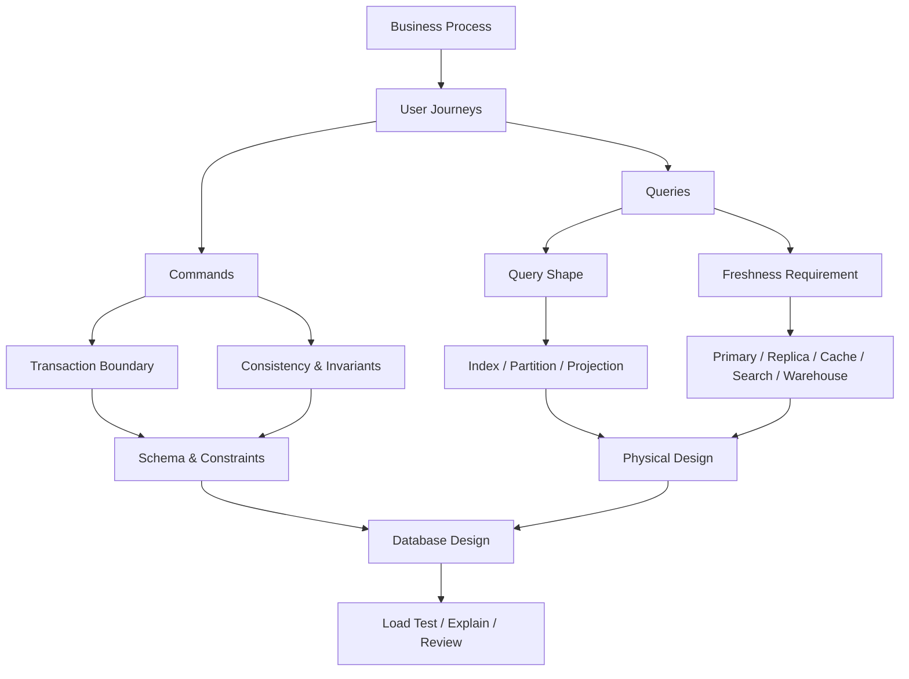

# Part 004 — Workload-First Design

Database design yang buruk sering dimulai dari bentuk data.

Database design yang kuat dimulai dari workload.

Bukan berarti data model tidak penting. Data model sangat penting. Tetapi di sistem produksi, model yang “rapi” bisa tetap gagal jika tidak cocok dengan pola akses, volume, latency target, contention, growth, dan consistency requirement.

Part ini membahas **workload-first design**: cara mendesain database dari perilaku sistem nyata.

Mental model utamanya:

> Database bukan hanya struktur tabel. Database adalah mesin yang menerima workload: reads, writes, transactions, scans, joins, locks, replication, backups, migrations, analytics, and failures.

---

## 1. Tujuan Part Ini

Setelah part ini, kamu harus mampu:

1. Mengklasifikasi workload sebelum memilih database atau schema.
2. Membedakan OLTP, OLAP, HTAP, event-heavy, search-heavy, graph-heavy, dan write-heavy workload.
3. Membaca query shape sebagai input desain fisik.
4. Menentukan kapan normalisasi bagus dan kapan read model/projection diperlukan.
5. Mengidentifikasi contention point sebelum production incident.
6. Menentukan index, partition, sharding, replication, dan caching dari workload, bukan dari tebakan.
7. Membuat workload profile sebagai bagian dari database design document.

---

## 2. The Core Mistake: Schema-First Without Workload

Contoh schema tampak benar:

```sql
CREATE TABLE customer (
    customer_id UUID PRIMARY KEY,
    name TEXT NOT NULL,
    email TEXT NOT NULL UNIQUE
);

CREATE TABLE orders (
    order_id UUID PRIMARY KEY,
    customer_id UUID NOT NULL REFERENCES customer(customer_id),
    status TEXT NOT NULL,
    created_at TIMESTAMPTZ NOT NULL
);

CREATE TABLE order_item (
    order_item_id UUID PRIMARY KEY,
    order_id UUID NOT NULL REFERENCES orders(order_id),
    product_id UUID NOT NULL,
    quantity INT NOT NULL,
    price_amount NUMERIC(19, 4) NOT NULL
);
```

Secara logical, ini masuk akal.

Tetapi workload bisa membuat desain ini gagal.

Pertanyaan yang belum dijawab:

- Apakah order dibuat 10 per menit atau 50.000 per detik?
- Apakah query utama adalah order detail by ID atau dashboard agregasi harian?
- Apakah customer melihat order history dengan pagination?
- Apakah admin filter order berdasarkan status dan date range?
- Apakah reporting butuh join jutaan row setiap menit?
- Apakah order item immutable?
- Apakah status sering berubah?
- Apakah ada hot customer dengan jutaan order?
- Apakah order ID random menyebabkan index locality buruk?
- Apakah created_at partition diperlukan?
- Apakah read replica cukup atau butuh projection table?
- Apakah write transaction menyentuh inventory, payment, fraud, ledger?

Tanpa workload, schema hanya setengah desain.

---

## 3. Workload-First Design Definition

Workload-first design adalah pendekatan yang mendesain database berdasarkan:

1. **Access patterns**: query dan command yang benar-benar dijalankan.
2. **Frequency**: seberapa sering operasi terjadi.
3. **Latency target**: berapa cepat operasi harus selesai.
4. **Throughput target**: berapa banyak operasi per detik/menit.
5. **Consistency need**: seberapa segar/benar data harus terlihat.
6. **Transaction boundary**: apa yang harus atomic.
7. **Contention profile**: row/key mana yang sering diperebutkan.
8. **Data growth**: bagaimana volume bertambah.
9. **Retention**: berapa lama data aktif/arsip.
10. **Failure tolerance**: apa yang boleh degrade.

Schema adalah hasil dari semua ini, bukan starting point tunggal.

---

## 4. Workload Taxonomy

Ada banyak jenis workload. Architect harus bisa mengklasifikasi dengan cepat.



Setiap jenis punya desain berbeda.

---

## 5. OLTP Workload

OLTP adalah workload transaksi operasional.

Ciri-ciri:

- banyak read/write kecil,
- latency rendah,
- transaksi pendek,
- consistency penting,
- query by primary key atau selective index,
- concurrency tinggi,
- rollback harus aman,
- data current state penting.

Contoh:

- create order,
- update case status,
- approve application,
- assign task,
- capture payment,
- change customer profile.

### OLTP Design Priorities

1. Keep transactions short.
2. Keep indexes selective and purposeful.
3. Avoid long-running analytical scans on primary database.
4. Avoid hot counters.
5. Enforce critical invariants close to transaction boundary.
6. Design for idempotency and retry.
7. Control lock ordering.
8. Separate operational read model from heavy reporting when necessary.

### OLTP Query Shape Example

```sql
SELECT *
FROM case_file
WHERE case_id = :case_id;
```

Ini simple primary key lookup.

```sql
SELECT case_id, case_number, priority, due_at
FROM case_file
WHERE assigned_to = :user_id
  AND status IN ('ASSIGNED', 'UNDER_REVIEW')
ORDER BY due_at ASC
LIMIT 50;
```

Ini inbox query. Butuh index yang mengikuti predicate dan ordering.

Contoh index:

```sql
CREATE INDEX idx_case_inbox
ON case_file (assigned_to, status, due_at, case_id);
```

Index ini tidak muncul dari normalisasi. Ia muncul dari workload.

---

## 6. OLAP Workload

OLAP adalah workload analitik.

Ciri-ciri:

- scan data besar,
- aggregation,
- group by,
- joins besar,
- query lebih lama,
- freshness bisa delayed,
- columnar storage sering cocok,
- dimensional model sering lebih cocok.

Contoh:

- monthly enforcement report,
- revenue by region,
- SLA breach trends,
- cohort analysis,
- regulator dashboard,
- historical compliance metrics.

### OLAP Design Priorities

1. Define grain.
2. Separate fact and dimension.
3. Optimize scans and aggregations.
4. Use snapshots when report must be reproducible.
5. Avoid running large analytical queries on OLTP primary.
6. Decide freshness SLA.
7. Design lineage and reconciliation.

### OLAP Query Example

```sql
SELECT
    date_trunc('month', closed_at) AS month,
    violation_type,
    count(*) AS closed_cases,
    avg(extract(epoch FROM closed_at - opened_at) / 86400) AS avg_days_to_close
FROM case_fact
WHERE closed_at >= date '2026-01-01'
  AND closed_at < date '2027-01-01'
GROUP BY 1, 2
ORDER BY 1, 2;
```

Ini bukan query yang ideal dijalankan terus-menerus di OLTP primary jika volume besar.

---

## 7. HTAP Workload

HTAP mencoba menggabungkan operational dan analytical workload.

Ini menggoda, tapi harus hati-hati.

Masalah utama:

- transaksi kecil butuh latency rendah,
- analitik butuh scan besar,
- dua workload bersaing CPU, memory, IO,
- index untuk OLTP tidak sama dengan layout untuk OLAP,
- consistency/freshness expectation berbeda.

HTAP masuk akal jika:

- analytical query tidak terlalu berat,
- freshness sangat penting,
- platform memang dirancang untuk hybrid,
- workload isolation kuat,
- tim punya operational maturity.

Jika tidak, lebih aman:



---

## 8. Event-Heavy Workload

Event-heavy workload berpusat pada append, ordering, replay, dan projection.

Ciri-ciri:

- banyak insert append-only,
- event immutable,
- ordering penting,
- consumers banyak,
- deduplication perlu,
- projection bisa stale,
- replay/rebuild dibutuhkan.

Contoh:

- audit events,
- workflow events,
- payment events,
- activity timeline,
- CDC outbox,
- sensor ingestion.

Schema contoh:

```sql
CREATE TABLE domain_event (
    event_id UUID PRIMARY KEY,
    aggregate_type TEXT NOT NULL,
    aggregate_id UUID NOT NULL,
    event_type TEXT NOT NULL,
    event_version INT NOT NULL,
    occurred_at TIMESTAMPTZ NOT NULL,
    recorded_at TIMESTAMPTZ NOT NULL,
    sequence_no BIGINT NOT NULL,
    payload JSONB NOT NULL,
    metadata JSONB NOT NULL,
    UNIQUE (aggregate_type, aggregate_id, sequence_no)
);
```

Index dari workload:

```sql
CREATE INDEX idx_domain_event_aggregate
ON domain_event (aggregate_type, aggregate_id, sequence_no);

CREATE INDEX idx_domain_event_recorded_at
ON domain_event (recorded_at);
```

Pertanyaan workload:

- query by aggregate?
- query by time?
- replay all events?
- replay one aggregate?
- consume by sequence?
- partition by time atau aggregate?
- event retention berapa lama?

---

## 9. Search-Heavy Workload

Search-heavy workload tidak cocok dipaksa menjadi relational filtering biasa.

Ciri-ciri:

- full-text search,
- fuzzy match,
- ranking,
- highlighting,
- faceting,
- relevance scoring,
- language analyzer,
- partial match,
- large result set.

Contoh:

- search case by free text,
- search document evidence,
- customer support search,
- legal/regulatory document search,
- product catalog search.

Pattern umum:



System of record tetap database utama. Search index adalah projection.

Pertanyaan penting:

- Search result boleh stale berapa lama?
- Apa yang terjadi jika search index tertinggal?
- Apakah authorization filter diterapkan di search index atau setelah fetch dari DB?
- Apakah deleted/hidden records cepat hilang dari index?
- Apakah indexing idempotent?

Search-heavy design bukan hanya “tambahkan Elasticsearch/OpenSearch”. Boundary kebenarannya harus jelas.

---

## 10. Graph-Heavy Workload

Graph-heavy workload muncul ketika pertanyaan utama adalah relationship traversal.

Contoh:

- beneficial ownership,
- fraud ring,
- dependency graph,
- social graph,
- regulatory relationship network,
- case-to-entity-to-document-to-transaction link analysis.

Relational database bisa menyimpan graph, tetapi traversal kompleks bisa sulit.

Pertanyaan workload:

- traversal depth berapa?
- graph berubah sering atau jarang?
- edge punya property?
- perlu shortest path?
- perlu community detection?
- query real-time atau offline?
- correctness requirement tinggi?

Relational edge table:

```sql
CREATE TABLE entity_relationship (
    relationship_id UUID PRIMARY KEY,
    from_entity_id UUID NOT NULL,
    to_entity_id UUID NOT NULL,
    relationship_type TEXT NOT NULL,
    valid_from TIMESTAMPTZ NOT NULL,
    valid_to TIMESTAMPTZ,
    source_document_id UUID,
    confidence_score NUMERIC(5, 4),
    created_at TIMESTAMPTZ NOT NULL
);

CREATE INDEX idx_relationship_from
ON entity_relationship (from_entity_id, relationship_type);

CREATE INDEX idx_relationship_to
ON entity_relationship (to_entity_id, relationship_type);
```

Ini cukup untuk depth rendah dan query sederhana.

Jika traversal mendalam dan dynamic, graph database atau graph projection bisa lebih cocok.

---

## 11. Time-Series Workload

Time-series workload berpusat pada waktu.

Ciri-ciri:

- append-heavy,
- query by time range,
- aggregation by bucket,
- retention/rollup,
- high ingestion,
- late-arriving data mungkin ada,
- compression/partitioning penting.

Contoh:

- metrics,
- audit log,
- sensor data,
- price feed,
- operational events,
- SLA snapshots.

Schema sederhana:

```sql
CREATE TABLE service_metric_sample (
    service_name TEXT NOT NULL,
    metric_name TEXT NOT NULL,
    sampled_at TIMESTAMPTZ NOT NULL,
    value DOUBLE PRECISION NOT NULL,
    tags JSONB NOT NULL DEFAULT '{}'::jsonb,
    PRIMARY KEY (service_name, metric_name, sampled_at)
);
```

Workload questions:

- Ingestion rate?
- Query latest or historical range?
- Retention raw data?
- Rollup resolution?
- Cardinality of tags?
- Late samples allowed?
- Need downsampling?

Time-series failure mode yang sering terjadi: high-cardinality label/tag meledakkan storage dan index.

---

## 12. Ledger / Append-Only Workload

Ledger workload menuntut auditability dan balance correctness.

Ciri-ciri:

- append-only entries,
- no silent update,
- correction via reversal/adjustment,
- idempotency wajib,
- reconciliation penting,
- sum/aggregate consistency penting,
- ordering often important.

Contoh:

- wallet,
- accounting,
- points balance,
- inventory movement,
- enforcement penalty ledger,
- quota usage ledger.

Pattern:

```sql
CREATE TABLE ledger_entry (
    entry_id UUID PRIMARY KEY,
    ledger_id UUID NOT NULL,
    transaction_id UUID NOT NULL,
    entry_type TEXT NOT NULL,
    amount NUMERIC(19, 4) NOT NULL,
    currency TEXT NOT NULL,
    direction TEXT NOT NULL CHECK (direction IN ('DEBIT', 'CREDIT')),
    occurred_at TIMESTAMPTZ NOT NULL,
    recorded_at TIMESTAMPTZ NOT NULL,
    reversal_of_entry_id UUID,
    UNIQUE (ledger_id, transaction_id, entry_type)
);
```

Design principle:

> Jangan update balance sebagai satu-satunya truth. Balance adalah derived state dari movements/entries, walaupun boleh disimpan sebagai cached current balance dengan reconciliation.

---

## 13. Read Workload vs Write Workload

Setiap table punya read/write profile.

Contoh:

| Entity | Write Pattern | Read Pattern | Risk |
|---|---|---|---|
| case_file | moderate updates | frequent inbox/detail | lock contention on status updates |
| case_event | high append | replay/time query | storage growth |
| customer | low update | frequent lookup | PII/security |
| audit_log | high append | rare investigation | retention/index bloat |
| dashboard_summary | batch/async update | frequent dashboard read | stale data |
| SLA snapshot | periodic write | trend analysis | high volume |

A good database design document always contains workload table like this.

---

## 14. Query Shape Is Architecture Input

Query shape means the structure of the query:

- equality lookup,
- range scan,
- prefix search,
- full-text search,
- aggregate,
- join-heavy,
- top-N,
- pagination,
- existence check,
- anti-join,
- recursive traversal.

Each shape has different design implications.

### 14.1 Equality Lookup

```sql
SELECT * FROM customer WHERE customer_id = :id;
```

Design:

- primary key,
- direct lookup,
- cacheable,
- low latency.

### 14.2 Range Query

```sql
SELECT *
FROM case_file
WHERE opened_at >= :from
  AND opened_at < :to
ORDER BY opened_at;
```

Design:

- index on `opened_at`,
- possibly partition by time,
- beware large range scans.

### 14.3 Composite Filter + Sort

```sql
SELECT *
FROM case_file
WHERE assigned_to = :user_id
  AND status = 'UNDER_REVIEW'
ORDER BY due_at
LIMIT 50;
```

Design:

```sql
CREATE INDEX idx_case_assignee_status_due
ON case_file (assigned_to, status, due_at);
```

### 14.4 Top-N Query

```sql
SELECT *
FROM enforcement_case
WHERE status = 'OPEN'
ORDER BY risk_score DESC
LIMIT 100;
```

Design:

- index aligned with status + risk_score,
- precomputed risk_score if expensive,
- avoid sorting huge active set repeatedly.

### 14.5 Aggregation

```sql
SELECT status, count(*)
FROM case_file
GROUP BY status;
```

For small table, okay.

For huge active table with frequent dashboard access, consider summary table/projection.

### 14.6 Pagination

Bad pattern:

```sql
SELECT *
FROM case_file
ORDER BY opened_at DESC
OFFSET 500000
LIMIT 50;
```

Large offset gets expensive.

Better pattern:

```sql
SELECT *
FROM case_file
WHERE opened_at < :last_seen_opened_at
ORDER BY opened_at DESC
LIMIT 50;
```

This is keyset pagination.

---

## 15. Command Shape Is Also Architecture Input

Reads matter. Writes matter more for consistency.

Command shape asks:

- what rows are touched?
- what invariants checked?
- what locks acquired?
- what events emitted?
- what indexes updated?
- what downstream side effects triggered?

Example command: `assignCase`.

```text
Input:
- case_id
- assignee
- assigned_by
- reason
- command_id

Checks:
- case exists
- case not closed
- assignee eligible
- no active primary assignment conflict

Writes:
- update case_file.current_assignee
- insert case_assignment_history
- insert case_event
- maybe update SLA

Emits:
- CaseAssigned event
```

Transaction design:



Command shape determines transaction boundary.

---

## 16. Frequency Matters

A query executed once per day can be inefficient.

A query executed 500 times per second cannot.

A write path executed once per minute can have more checks.

A write path executed 20.000 times per second must be minimal and carefully indexed.

Workload design requires rough numbers.

Example table:

| Operation | Frequency | Latency Target | Consistency | Notes |
|---|---:|---:|---|---|
| Get case detail | 200 rps | p95 < 80ms | strong enough from primary/read replica | user-facing |
| List my active cases | 100 rps | p95 < 120ms | read-your-writes preferred | inbox |
| Assign case | 5 rps | p95 < 300ms | strong | transaction-critical |
| Add evidence | 20 rps | p95 < 500ms | strong metadata, blob async ok | document path |
| Dashboard counts | 50 rps | p95 < 200ms | stale <= 5 min ok | projection acceptable |
| Monthly report | 1/day | minutes ok | reproducible | analytical store |

Without numbers, arguments become taste-based.

---

## 17. Latency Budget Thinking

Database is only part of request latency.

Example target:

```text
API p95 target: 300ms
```

Budget:

| Component | Budget |
|---|---:|
| API gateway/auth | 30ms |
| application logic | 50ms |
| database query | 100ms |
| downstream call | 80ms |
| serialization/network | 40ms |

If one DB query consumes 250ms, the whole API cannot meet target.

Architectural implication:

- avoid N+1 queries,
- avoid unbounded scans,
- avoid lock waits,
- avoid synchronous reporting queries,
- avoid remote cross-region writes in latency-sensitive path unless required.

---

## 18. Throughput and Write Amplification

Every write updates more than the row.

A write may update:

- heap/table page,
- primary key index,
- secondary indexes,
- WAL/log,
- replication stream,
- CDC/outbox,
- triggers,
- materialized counters,
- foreign key checks,
- backups/storage snapshots indirectly.

So this:

```sql
UPDATE case_file SET status = 'UNDER_REVIEW' WHERE case_id = :id;
```

is not “one simple write” if the table has 12 indexes, triggers, replication, and CDC.

Index design must account for write workload.

Rule:

> Every index is a read optimization and a write cost.

---

## 19. Contention Analysis

Contention happens when many transactions compete for the same row, key range, index page, partition, or resource.

Common hotspots:

- global counter row,
- sequential queue head,
- same tenant partition,
- same account balance,
- same inventory item,
- same case updated by many actors,
- monotonically increasing index page,
- leader region in global database,
- lock table for scheduler.

Example bad counter:

```sql
UPDATE sequence_counter
SET value = value + 1
WHERE name = 'case_number';
```

At high throughput, this row is a hotspot.

Alternatives:

- database sequence,
- hi/lo allocation,
- partitioned counters,
- time-prefixed IDs,
- async number assignment,
- per-tenant sequence if domain allows.

Contention should be identified before launch.

---

## 20. Workload and Index Design

Index design should answer actual query shapes.

Bad index strategy:

```text
Add index to every foreign key and every column used somewhere.
```

Better strategy:

1. List critical queries.
2. Identify predicates.
3. Identify join keys.
4. Identify sort/group requirements.
5. Estimate selectivity.
6. Design composite indexes for high-value queries.
7. Remove redundant indexes.
8. Measure execution plans.

Example queries:

```sql
-- Query A: user inbox
WHERE assigned_to = ? AND status IN (?, ?) ORDER BY due_at LIMIT 50

-- Query B: supervisor queue
WHERE region = ? AND status = ? AND priority = ? ORDER BY risk_score DESC LIMIT 100

-- Query C: case lookup
WHERE case_number = ?
```

Possible indexes:

```sql
CREATE INDEX idx_case_user_inbox
ON case_file (assigned_to, status, due_at, case_id);

CREATE INDEX idx_case_supervisor_queue
ON case_file (region, status, priority, risk_score DESC, case_id);

CREATE UNIQUE INDEX uq_case_number
ON case_file (case_number);
```

Do not create one giant index hoping it solves all queries.

---

## 21. Workload and Partitioning

Partitioning solves specific problems:

- large table maintenance,
- time-based retention,
- pruning scans,
- reducing index size per partition,
- archiving old data,
- isolating hot/cold data.

Partitioning does not automatically make all queries faster.

It helps when query predicates align with partition key.

Example time partition:

```text
case_event_2026_01
case_event_2026_02
case_event_2026_03
```

Good query:

```sql
WHERE recorded_at >= '2026-03-01'
  AND recorded_at < '2026-04-01'
```

Bad query for time partition only:

```sql
WHERE aggregate_id = :case_id
```

This may need to search many partitions unless there is additional design.

Partition key is workload decision.

---

## 22. Workload and Sharding

Sharding distributes data across nodes.

It is not just “partitioning at larger scale”.

Sharding impacts:

- transactions,
- joins,
- uniqueness,
- foreign keys,
- resharding,
- operational complexity,
- backup/restore,
- tenant movement,
- query routing,
- incident blast radius.

Shard key must be chosen from workload.

Bad shard key signs:

- low cardinality,
- highly skewed,
- frequently updated,
- not present in common queries,
- causes cross-shard transactions,
- creates hot shard.

Example SaaS:

```text
tenant_id as shard key
```

Good if most queries are tenant-scoped.

Bad if one tenant is 70% of traffic.

Mitigation:

- split large tenants,
- virtual shards,
- tenant tiering,
- dedicated database for huge tenants,
- tenant-aware capacity planning.

---

## 23. Workload and Consistency

Not every read needs the same consistency.

Classify reads:

| Read Type | Consistency Need | Example |
|---|---|---|
| Command precondition | strong | close case only if decision approved |
| User confirmation after write | read-your-writes | show submitted request |
| Dashboard | bounded stale okay | counts refresh every 5 min |
| Audit investigation | exact/reproducible | decision history |
| Search | eventually consistent often okay | free-text search |
| Notification | at-least-once okay with dedupe | email/push |

Overusing strong consistency everywhere hurts scalability.

Underusing strong consistency corrupts invariants.

Architect's job is classification.

---

## 24. Workload and Read Replicas

Read replicas help only certain workloads.

They can reduce load on primary, but introduce replication lag.

Good candidates:

- read-only dashboards with stale tolerance,
- heavy list pages not requiring latest write,
- exports,
- reporting snapshots,
- internal tooling.

Bad candidates:

- command precondition checks,
- read immediately after write when user expects latest,
- authorization-critical reads if lag can leak permissions,
- fraud/risk checks requiring latest state.

Read replica decision must include stale-read risk.

Example:

```text
User changes role from ADMIN to VIEWER.
Replica lags 10 seconds.
Authorization reads from replica.
User still appears ADMIN.
```

This is not just performance issue. This is security issue.

---

## 25. Workload and Caching

Cache is not a substitute for data model.

Cache helps when:

- data is read frequently,
- data changes less frequently,
- stale data acceptable or controllable,
- cache key is clear,
- invalidation strategy exists,
- source of truth remains clear.

Cache hurts when:

- correctness depends on latest data,
- invalidation is unclear,
- cached object embeds authorization-sensitive data,
- write frequency high,
- cache stampede occurs,
- cache becomes hidden database.

Cache design questions:

- cache-aside or write-through?
- TTL or explicit invalidation?
- per-user or global key?
- negative caching?
- stampede prevention?
- what is stale tolerance?
- what happens during cache outage?

Never add cache before knowing query plan and workload.

---

## 26. Workload and Materialized Views / Projections

If read workload is expensive and can tolerate staleness, use projection.

Example operational dashboard:

```sql
CREATE TABLE case_dashboard_summary (
    region TEXT NOT NULL,
    status TEXT NOT NULL,
    priority TEXT NOT NULL,
    count_cases BIGINT NOT NULL,
    last_refreshed_at TIMESTAMPTZ NOT NULL,
    PRIMARY KEY (region, status, priority)
);
```

Maintained by:

- trigger,
- synchronous transaction,
- async event consumer,
- scheduled batch,
- materialized view refresh.

Tradeoff:

| Strategy | Freshness | Write Cost | Failure Mode |
|---|---|---|---|
| Synchronous update | immediate | higher | command fails if summary fails |
| Trigger | immediate | hidden complexity | hard debugging |
| Async event | eventual | lower | projection lag/drift |
| Batch refresh | delayed | lower | stale dashboard |
| Materialized view | depends | medium/high | refresh cost/locking depending DB |

Projection must have rebuild path.

---

## 27. Workload and Data Shape

Relational normalization optimizes correctness and reduces redundancy.

But some read workloads need pre-joined or nested shape.

Example detail page:

```text
Case detail page needs:
- case header
- current assignment
- latest 10 events
- evidence count
- open tasks
- SLA status
- decision summary
```

Naive implementation:

```text
1 query case
1 query assignment
1 query events
1 query evidence count
1 query tasks
1 query SLA
1 query decision
```

Maybe okay. Maybe not.

If page is hot and latency target low, consider:

- joined query with proper indexes,
- read model table,
- materialized case summary,
- API aggregation with batch fetch,
- cache for stable components.

Do not denormalize blindly. Denormalize from measured workload.

---

## 28. Workload and N+1 Query Risk

N+1 pattern:

```text
Fetch 50 cases
For each case, fetch assignee
For each case, fetch latest event
For each case, fetch SLA
```

Result: 151 queries.

At small scale, invisible.

At production scale, latency and database load explode.

Solutions:

- batch queries,
- joins,
- precomputed read model,
- data loader pattern,
- API response redesign,
- pagination limit.

Database architect should review application query behavior, not just schema.

---

## 29. Workload and Transaction Length

Long transactions are dangerous in OLTP.

They can hold locks, delay vacuum/cleanup, increase conflict probability, and create cascading waits.

Bad pattern:

```text
BEGIN
  update case
  call external document service
  call notification service
  write audit
COMMIT
```

Never hold DB transaction while waiting for external service unless absolutely unavoidable.

Better:

```text
BEGIN
  update case
  write audit
  write outbox event
COMMIT

async worker sends notification/document side effect
```

Transaction should cover state change and durable intent for side effects, not the side effects themselves.

---

## 30. Workload and Batch Jobs

Batch jobs are often the hidden killer of OLTP systems.

Examples:

- nightly report,
- backfill,
- cleanup,
- reconciliation,
- export,
- reindex,
- data quality scan,
- retention purge.

Batch workload questions:

- How many rows scanned?
- Does it lock rows?
- Does it update indexed columns?
- Does it run during peak hours?
- Does it compete with OLTP queries?
- Is it resumable?
- Is it chunked?
- Is it idempotent?
- Can it be throttled?

Safe batch pattern:

```text
Process in chunks
Commit per chunk
Track progress
Use stable ordering
Avoid full-table locks
Throttle under load
Make retry idempotent
Record job evidence
```

Example chunking:

```sql
SELECT case_id
FROM case_file
WHERE archived_at IS NULL
  AND closed_at < now() - interval '2 years'
ORDER BY case_id
LIMIT 1000;
```

Then process chunk, commit, repeat.

---

## 31. Workload and Multi-Tenancy

Multi-tenant workload is rarely uniform.

One tenant may dominate:

- storage,
- writes,
- reads,
- reporting,
- search,
- support tickets,
- custom configuration.

Workload profile must include tenant skew.

Example:

| Tenant Tier | Tenant Count | Data Volume | Traffic | Isolation Need |
|---|---:|---:|---:|---|
| small | 10,000 | low | low | shared |
| medium | 500 | medium | medium | shared with limits |
| enterprise | 20 | high | high | dedicated shard/db possible |
| regulated | 5 | high | medium | stricter isolation |

Design impact:

- tenant_id in primary queries,
- tenant-scoped indexes,
- per-tenant rate limits,
- partition/shard strategy,
- backup/restore per tenant,
- noisy neighbor mitigation,
- data residency.

---

## 32. Workload and Data Growth

Data growth has multiple dimensions:

- row count,
- row width,
- index size,
- history size,
- event volume,
- attachment/blob metadata,
- tenant skew,
- retention length,
- cardinality of labels/tags,
- archived data.

Example projection:

```text
case_event:
- 5 million events/day
- average payload 1 KB
- raw table growth ≈ 5 GB/day before index/WAL/replication overhead
- 365 days ≈ 1.8 TB raw payload alone
```

Actual storage can be much higher due to indexes, WAL, bloat, replication, backup, and compression behavior.

Architect must design lifecycle and retention early.

---

## 33. Workload and Backup/Restore

Backup is also workload.

Questions:

- How much data?
- How often backup?
- How fast restore?
- Point-in-time recovery needed?
- Restore whole DB or tenant/entity subset?
- Backup encrypted?
- Backup tested?
- Does backup affect primary performance?
- Are large indexes included/rebuilt?

A database that can serve production traffic but cannot be restored within required RTO is not production-ready.

---

## 34. Workload and Migration

Schema migration is workload too.

A migration can:

- scan table,
- rewrite table,
- lock table,
- build index,
- backfill column,
- validate constraint,
- update many rows,
- cause replication lag,
- break old app version.

Workload-first migration asks:

- table size?
- write rate during migration?
- lock behavior?
- rollback plan?
- dual-version app compatibility?
- backfill speed?
- validation method?
- deploy order?

This will be covered deeply in later parts, but introduce it now: database design includes future change workload.

---

## 35. Building a Workload Profile

A workload profile is a structured artifact.

Template:

```md
## Workload Profile: Case Management Database

### Critical Commands
| Command | Frequency | Rows Touched | Transaction Need | Latency | Failure Risk |
|---|---:|---|---|---:|---|

### Critical Queries
| Query | Frequency | Predicate | Sort | Result Size | Freshness | Latency |
|---|---:|---|---|---:|---|---:|

### Batch Jobs
| Job | Schedule | Rows Scanned | Rows Written | Idempotent | Throttled |
|---|---|---:|---:|---|---|

### Analytical Workloads
| Report | Freshness | Grain | Volume | Store |
|---|---|---|---:|---|

### Growth Assumptions
| Data | Daily Growth | Retention | Partition Needed |
|---|---:|---|---|

### Consistency Classes
| Operation | Consistency | Staleness Allowed | Reason |
|---|---|---:|---|

### Contention Risks
| Resource | Why Hot | Mitigation |
|---|---|---|
```

This artifact prevents architecture by opinion.

---

## 36. Example Workload Profile: Regulatory Case System

### Commands

| Command | Frequency | Rows Touched | Transaction Need | Latency | Risk |
|---|---:|---|---|---:|---|
| Open case | 2 rps | intake, case, transition, outbox | atomic | 300ms | duplicate case |
| Assign case | 10 rps | case, assignment history, outbox | atomic | 200ms | double assignment |
| Add evidence metadata | 30 rps | evidence, case_event, outbox | atomic metadata | 500ms | orphan evidence |
| Close case | 1 rps | case, decision, transition, outbox | atomic | 500ms | close without decision |
| Reopen case | rare | case, transition, reason | atomic | 500ms | unauthorized reopening |

### Queries

| Query | Frequency | Predicate | Result | Freshness |
|---|---:|---|---:|---|
| Case detail | 200 rps | case_id | 1 case + related summary | latest preferred |
| My inbox | 100 rps | assignee/status | 50 rows | read-your-writes |
| Supervisor queue | 50 rps | region/status/priority | 100 rows | stale < 30s ok |
| Case timeline | 40 rps | case_id/order by time | 100 events | latest preferred |
| Dashboard counts | 80 rps | region/status/priority | aggregate | stale < 5 min ok |

### Batch / Reporting

| Job | Schedule | Store | Notes |
|---|---|---|---|
| SLA breach scan | every 5 min | OLTP/projection | chunked, index by due_at |
| Monthly regulator report | monthly | warehouse | reproducible snapshot |
| Archive closed cases | nightly | OLTP + archive store | retention-aware |
| Data quality scan | nightly | replica/warehouse | no OLTP impact |

### Design Consequences

- `case_file` needs indexes for inbox and supervisor queue.
- `case_status_transition` and `case_event` need query by case and by time.
- Dashboard counts should be projection, not repeated full aggregation.
- Monthly report should be generated from analytical snapshot, not mutable current state.
- Close case transaction must enforce decision invariant.
- Evidence metadata transaction should not wait for large file storage if avoidable.

---

## 37. How Workload Changes Data Model

Suppose normalized model:

```text
case
case_assignment
case_sla
case_priority
case_decision
case_event
```

For case detail page, normalized is fine if joins are indexed and result is small.

For inbox page, repeatedly joining many tables may be wasteful.

Workload may justify storing selected current fields in `case_file`:

```sql
current_assignee
current_sla_due_at
current_priority
latest_decision_status
```

This is denormalization, but controlled.

Rules:

1. Identify source of truth for each derived field.
2. Update derived fields in transaction or projection.
3. Add repair/rebuild job.
4. Add consistency checks.
5. Document why denormalization exists.

---

## 38. Workload-First Decision Matrix

| Workload Signal | Likely Design Move |
|---|---|
| Frequent primary key lookup | primary key, maybe cache |
| Frequent filtered list | composite index aligned with predicate/sort |
| Large aggregation dashboard | summary table/materialized projection |
| Heavy historical reporting | warehouse/lakehouse/analytical store |
| High append event stream | append table, partitioning, retention |
| Deep relationship traversal | graph model/projection |
| Full-text relevance search | search index projection |
| High write contention on counter | sequence/hi-lo/partitioned counter |
| Stale reads acceptable | read replica/projection/cache |
| Strong command precondition | primary/transactional read |
| Huge tenant skew | tenant tiering/dedicated shard |
| Long retention history | partition/archive strategy |
| Frequent schema evolution | expand-contract migration discipline |

---

## 39. Workload Smells

### 39.1 “We’ll Add Indexes Later”

Index design should evolve, but critical query paths must be considered early.

### 39.2 “Reporting Can Query Production Tables”

Maybe at small scale. Dangerous at large scale.

### 39.3 “Cache Will Fix It”

Cache can reduce repeated reads. It does not fix bad consistency model, bad query shape, or missing indexes.

### 39.4 “One Database For Everything”

Possible at early stage. Risky when search, analytics, OLTP, and event replay all compete.

### 39.5 “All Reads Must Be Strongly Consistent”

Usually false and expensive.

### 39.6 “Eventual Consistency Is Fine Everywhere”

Also false. Command invariants often need strong consistency.

### 39.7 “The ORM Will Handle It”

ORM can generate queries. It does not understand workload unless you design for it.

### 39.8 “No Need To Estimate Volume Yet”

Rough estimates are better than none. Architecture without scale assumptions is guesswork.

---

## 40. Practical Procedure: Workload-First Database Design

Use this sequence.

### Step 1 — List User Journeys

Example:

- investigator opens inbox,
- investigator reviews case,
- supervisor assigns case,
- approver closes case,
- auditor reviews history,
- regulator exports monthly report.

### Step 2 — Extract Commands and Queries

For each journey, write commands and queries.

```text
Journey: Supervisor assigns case
- Query supervisor queue
- Query case detail
- Command assign case
- Query updated queue
- Notify assignee
```

### Step 3 — Classify Consistency

```text
assign case = strong
supervisor queue = stale 30s acceptable
notification = at-least-once with dedupe
```

### Step 4 — Estimate Frequency and Latency

Even approximate numbers improve design.

### Step 5 — Identify Hot Paths

Hot path = high frequency + user-facing + correctness-sensitive.

Design hot paths first.

### Step 6 — Design Logical Model

Normalize for truth and invariants.

### Step 7 — Design Physical Access

Indexes, partitioning, projections, caches, replicas.

### Step 8 — Design Failure and Repair

For each projection/cache/downstream store:

- how stale?
- how rebuild?
- how detect drift?
- how retry?

### Step 9 — Validate With EXPLAIN and Load Test

Do not trust mental execution plan.

### Step 10 — Document Assumptions

All workload assumptions must be visible.

---

## 41. Mini Case Study: Inbox Query

Requirement:

> Investigator must see 50 most urgent active cases assigned to them, sorted by SLA due time.

Naive query:

```sql
SELECT *
FROM case_file
WHERE assigned_to = :user_id
  AND status != 'CLOSED'
ORDER BY due_at ASC
LIMIT 50;
```

Problems:

- `status != 'CLOSED'` may be less index-friendly than explicit active statuses.
- `SELECT *` may read wide rows unnecessarily.
- No tie-breaker in order.
- If due_at nullable, sort behavior unclear.

Better:

```sql
SELECT case_id, case_number, priority, status, due_at, title
FROM case_file
WHERE assigned_to = :user_id
  AND status IN ('ASSIGNED', 'UNDER_REVIEW', 'DECISION_PENDING')
  AND due_at IS NOT NULL
ORDER BY due_at ASC, case_id ASC
LIMIT 50;
```

Index:

```sql
CREATE INDEX idx_case_file_investigator_inbox
ON case_file (assigned_to, status, due_at, case_id);
```

If priority must dominate due date:

```sql
ORDER BY priority_rank DESC, due_at ASC, case_id ASC
```

Then maybe store `priority_rank` numeric or use expression index depending DB capability and portability requirements.

---

## 42. Mini Case Study: Dashboard Counts

Requirement:

> Dashboard shows number of active cases by region, priority, and status. Refresh can be up to 5 minutes stale.

Bad design:

```sql
SELECT region, priority, status, count(*)
FROM case_file
WHERE status IN ('OPEN', 'ASSIGNED', 'UNDER_REVIEW', 'DECISION_PENDING')
GROUP BY region, priority, status;
```

Run every dashboard request.

At low volume, okay.

At high volume, bad.

Better:

```sql
CREATE TABLE case_dashboard_count (
    region TEXT NOT NULL,
    priority TEXT NOT NULL,
    status TEXT NOT NULL,
    case_count BIGINT NOT NULL,
    last_refreshed_at TIMESTAMPTZ NOT NULL,
    PRIMARY KEY (region, priority, status)
);
```

Refresh strategy:

- scheduled every minute/five minutes,
- or event-driven projection,
- or materialized view depending DB.

Because stale <= 5 minutes is acceptable, we avoid burdening OLTP primary for every dashboard hit.

---

## 43. Mini Case Study: Audit Timeline

Requirement:

> Auditor must see full timeline for a case in chronological order.

Query:

```sql
SELECT event_type, occurred_at, actor, payload
FROM case_event
WHERE case_id = :case_id
ORDER BY occurred_at ASC, event_id ASC;
```

Index:

```sql
CREATE INDEX idx_case_event_timeline
ON case_event (case_id, occurred_at, event_id);
```

If timeline can have thousands of events, paginate by `(occurred_at, event_id)`.

If timeline includes multiple sources, consider unified timeline projection:

```sql
CREATE TABLE case_timeline_item (
    timeline_item_id UUID PRIMARY KEY,
    case_id UUID NOT NULL,
    item_type TEXT NOT NULL,
    occurred_at TIMESTAMPTZ NOT NULL,
    actor TEXT,
    title TEXT NOT NULL,
    payload JSONB NOT NULL,
    source_table TEXT NOT NULL,
    source_id UUID NOT NULL
);
```

This is projection. Source tables remain truth.

---

## 44. Mermaid: Workload-First Design Flow



---

## 45. Workload Review Checklist

### Access Patterns

- Apa 10 query paling penting?
- Apa 10 command paling penting?
- Query mana user-facing?
- Query mana background/internal?
- Query mana audit/regulatory?

### Frequency and Latency

- Berapa rps/tps sekarang?
- Berapa target 12 bulan?
- p50/p95/p99 target?
- Apakah request synchronous?

### Data Volume

- Row count awal?
- Growth harian/bulanan?
- Average row size?
- Index growth?
- Retention?

### Consistency

- Strong consistency di mana wajib?
- Read-your-writes di mana wajib?
- Eventual consistency di mana acceptable?
- Staleness maksimum berapa?

### Transactions

- Command mana atomic?
- Row mana disentuh?
- Lock risk apa?
- External side effect apa?
- Outbox needed?

### Physical Design

- Index apa untuk hot query?
- Partition key apa dan kenapa?
- Apakah sharding perlu sekarang atau nanti?
- Read replica cukup?
- Projection/cache/search needed?

### Operational

- Backup impact?
- Batch job impact?
- Migration impact?
- Monitoring metrics?
- Degraded mode?

---

## 46. Key Takeaways

1. Workload-first design berarti schema, index, partition, cache, replica, dan projection diturunkan dari operasi nyata.
2. OLTP dan OLAP punya prioritas berbeda; mencampurnya tanpa isolasi menciptakan risiko.
3. Query shape menentukan index dan physical access path.
4. Command shape menentukan transaction boundary dan consistency enforcement.
5. Frequency dan latency target mengubah keputusan desain.
6. Every index is both read optimization and write cost.
7. Contention harus dianalisis sebelum incident.
8. Read replica, cache, dan projection hanya aman jika consistency/freshness requirement jelas.
9. Batch, backup, migration, dan reporting juga bagian dari workload.
10. Database design document harus menyertakan workload profile, bukan hanya ERD.

---

## 47. What Comes Next

Part berikutnya adalah **Requirements to Data Model**.

Kita akan mengubah requirement bisnis menjadi model data secara sistematis:

- dari user journey ke entity,
- dari command ke transaction,
- dari invariant ke constraint,
- dari report ke grain,
- dari workflow ke lifecycle,
- dari failure mode ke repair path.

Prinsipnya:

> Requirement yang tidak diterjemahkan menjadi data invariant akan bocor sebagai bug, ambiguity, atau manual process.

