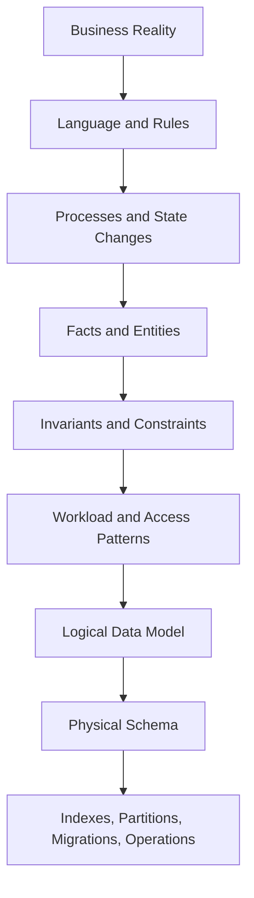
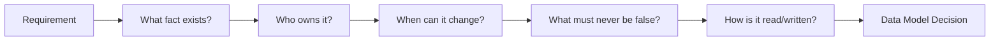
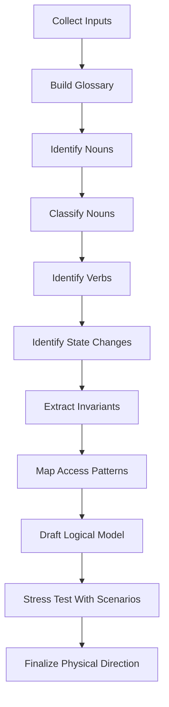
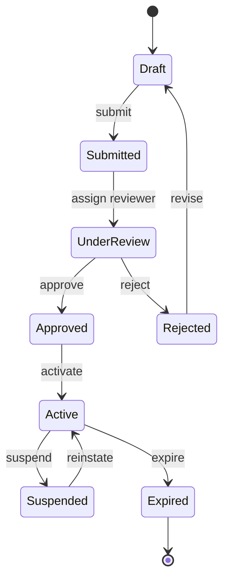
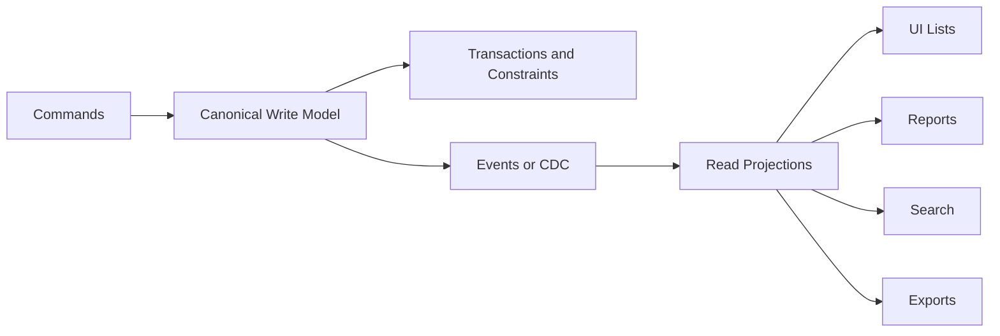
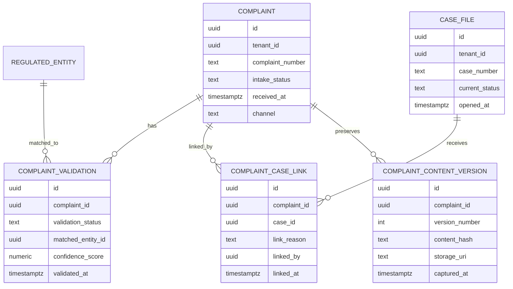
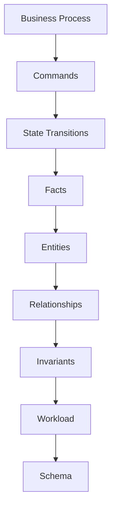
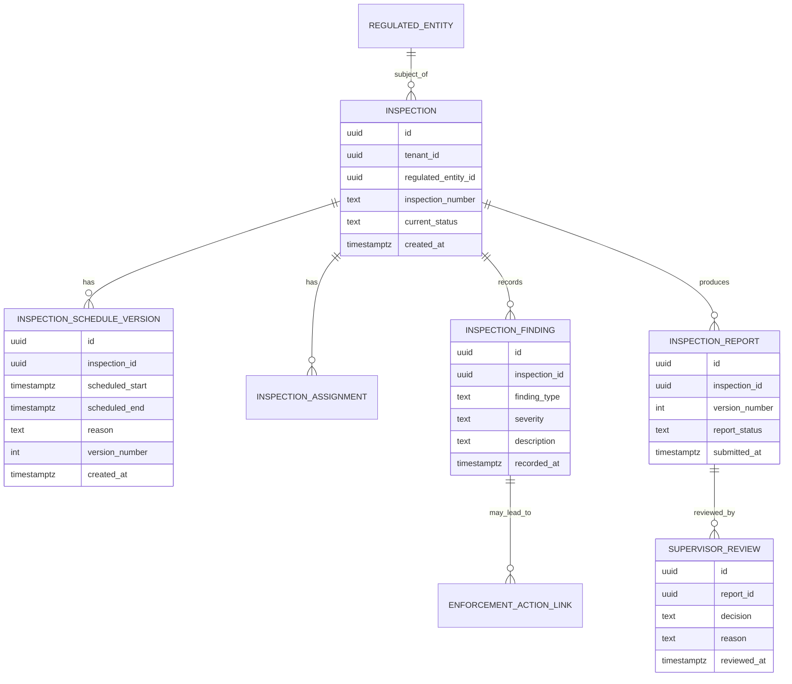
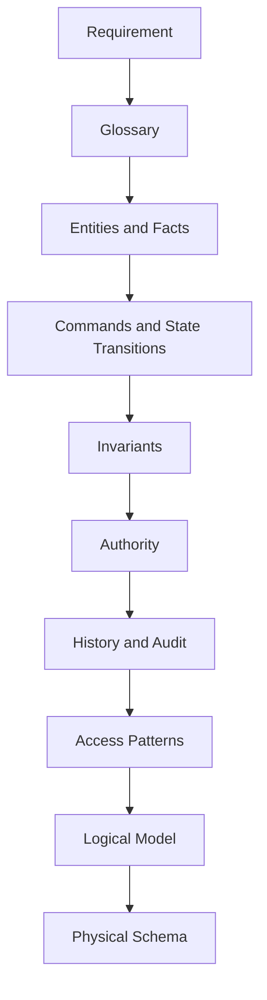

# Part 005 — Requirements to Data Model

A weak database model usually does not fail because the engineer forgot a SQL keyword. It fails because the engineer translated requirements too literally.

A user says:

> “We need to store applications and approvals.”

A beginner sees two tables:

```sql
application(id, applicant_id, status)
approval(id, application_id, approver_id, decision)
```

A production architect hears a different set of questions:

- What is an application legally?
- When does it become official?
- Can it be amended?
- Can approval be delegated?
- Can multiple approvals exist in parallel?
- Is a rejection final?
- What must be preserved after correction?
- Which state transition is illegal?
- Which data is operational, historical, derived, confidential, reportable, or disposable?
- Which user journey reads this data under latency pressure?
- Which downstream process treats this data as truth?

This part teaches the translation layer between human requirements and database design.

The goal is not to produce an entity-relationship diagram quickly. The goal is to discover the **facts, states, identities, invariants, lifecycles, access paths, ownership boundaries, and failure modes** hidden inside requirements.

---

## 1. The Core Mental Model

Database design starts from this pipeline:



A common mistake is jumping from **Business Reality** directly to **Physical Schema**.

That creates tables that look reasonable during design review but become brittle under production pressure.

A top-tier database architect does not ask, “What tables do we need?” first.

They ask:

> “What must always be true, who owns that truth, how does it change, and who depends on it?”

---

## 2. Requirements Are Not Data Models

Requirements usually arrive in forms like:

- product stories
- process diagrams
- legal rules
- screenshots
- existing Excel sheets
- API examples
- reporting requests
- stakeholder interviews
- legacy database schemas
- message/event payloads
- regulatory documents
- operational pain points

None of these is the data model.

They are evidence.

Your job is to extract structure from them.

| Requirement Artifact | What It Often Shows | What It Often Hides |
|---|---|---|
| User story | Desired action | Lifecycle, constraints, exceptions |
| UI mockup | Display fields | Data ownership, normalization, history |
| API sample | Payload shape | Internal canonical model |
| Spreadsheet | Operational workaround | Real workflow and implicit business rules |
| Legacy schema | Existing persistence | Historical accidents and coupling |
| Report | Aggregated answer | Source facts and reproducibility requirements |
| Legal policy | Rule text | Enforceable invariant and evidence need |
| BPMN/workflow | Process order | Transaction boundary and data authority |

The model should be derived from business truth, not copied from the first artifact you see.

---

## 3. The Five Translation Questions

Every requirement should be passed through five questions.



### Question 1: What fact exists?

A fact is not always the same as a field.

Requirement:

> “The case has a risk score.”

Possible facts:

- current risk score
- historical risk score
- risk assessment run
- risk factor contribution
- scoring algorithm version
- manual override
- reviewer justification
- effective date
- expiry date
- source evidence

Bad model:

```sql
case_file(
  id uuid primary key,
  risk_score numeric
);
```

Better model when auditability matters:

```sql
case_risk_assessment(
  id uuid primary key,
  case_id uuid not null,
  score numeric not null,
  scoring_model_version text not null,
  calculated_at timestamptz not null,
  calculated_by text not null,
  overridden_score numeric null,
  override_reason text null,
  effective_from timestamptz not null,
  effective_to timestamptz null
);
```

The first model stores a value.

The second model stores a defensible fact.

### Question 2: Who owns it?

Ownership answers:

- Which service/domain may create it?
- Which process may mutate it?
- Which table is authoritative?
- Which downstream system is only a projection?
- Which team is responsible for schema evolution?

Without ownership, data becomes shared global state.

Shared global state eventually becomes political state.

### Question 3: When can it change?

A value may be:

- immutable after creation
- mutable until submission
- mutable only through amendment
- mutable only by privileged correction
- mutable through scheduled recalculation
- mutable through external synchronization
- append-only with new versions
- derived from other values

Each change pattern implies a different schema.

| Change Pattern | Schema Shape |
|---|---|
| Mutable attribute | Column on entity table |
| Immutable fact | Append-only fact/event table |
| Versioned business state | Version table with effective dates |
| Correction with evidence | Correction table or amendment record |
| Derived value | Projection/materialized view/cache table |
| External sync | Source reference + sync metadata |

### Question 4: What must never be false?

This is the invariant question.

Examples:

- A submitted application must have at least one applicant.
- A case cannot be closed with unresolved mandatory tasks.
- A payment cannot be applied twice.
- A tenant cannot read another tenant’s records.
- A license period cannot overlap another active license period for the same subject.
- A final decision cannot be changed without a correction record.

If an invariant matters, decide where it is enforced:

- database constraint
- transaction logic
- application validation
- workflow engine
- batch reconciliation
- reporting rule
- external policy engine

The database is usually the last line of defense for structural invariants.

### Question 5: How is it read and written?

Data is not designed in isolation from workload.

Ask:

- Is this written once or many times?
- Is it read by primary key or filtered by status/date/tenant?
- Is it used in lists, dashboards, reports, exports, search, or decisioning?
- Is it updated concurrently?
- Does it need read-your-writes?
- Can reads be stale?
- Does the model need point-in-time reproducibility?
- Does the write path need idempotency?

A model that ignores access patterns may be logically beautiful but operationally unusable.

---

## 4. Requirements Extraction Method

Use this sequence when turning requirements into a data model.



This is not bureaucracy. It is a compression mechanism.

It prevents random requirements from becoming random tables.

---

## 5. Step 1 — Build a Domain Glossary

Before tables, define language.

In real systems, the same word often means different things to different groups.

Example:

| Term | Product Meaning | Legal Meaning | Operations Meaning | Database Implication |
|---|---|---|---|---|
| Case | User-facing work item | Enforcement proceeding | Queue item | Might need multiple entities |
| Decision | UI action | Formal legal outcome | Workflow step completion | Requires type separation |
| Applicant | Person submitting | Legal party | Contact record | Identity model matters |
| Status | Screen badge | Legal lifecycle | Task routing state | Avoid one overloaded column |
| Approval | Manager action | Authorization act | SLA checkpoint | Need decision record and assignment |

A glossary is not documentation fluff. It prevents schema corruption.

When a term is ambiguous, the database usually becomes ambiguous too.

### Glossary Template

Use this template per important term:

```md
## Term: <business term>

Definition:
- ...

Not the same as:
- ...

Lifecycle:
- Created when ...
- Changed when ...
- Final when ...

Owner:
- Domain/team/process owner ...

Database representation:
- Table/entity ...
- Key ...
- Important constraints ...
```

---

## 6. Step 2 — Identify Candidate Nouns

From requirements, extract nouns.

Example requirement:

> “An investigator reviews a complaint, links it to an existing regulated entity, creates a case, assigns tasks to officers, records findings, and submits a recommendation for supervisor approval.”

Candidate nouns:

- investigator
- complaint
- regulated entity
- case
- task
- officer
- finding
- recommendation
- supervisor
- approval

But not every noun becomes a table.

Classify nouns first.

| Noun Type | Example | Modeling Direction |
|---|---|---|
| Core entity | Case, Account, Customer | Usually table/document root |
| Actor | Investigator, Approver | Reference to identity/party model |
| Role | Supervisor, Reviewer | Role assignment, not always entity |
| Value object | Address, Money, Period | Embedded columns/table depending reuse/history |
| Event/fact | Submission, Approval, Payment | Often append-only table |
| Classification | Risk Level, Status, Type | Enum/reference table/versioned taxonomy |
| Document/evidence | Attachment, Report | Metadata table + object storage reference |
| Derived concept | Current Balance, Open Task Count | Projection, materialized value, computed query |
| Process artifact | Task, Assignment, Escalation | Workflow/case management model |

The question is not “Is this noun real?”

The question is:

> “Does this noun have identity, lifecycle, ownership, relationships, and independent rules?”

If yes, it probably deserves an entity.

---

## 7. Step 3 — Identify Verbs and Commands

Verbs reveal writes.

Examples:

- submit application
- approve request
- reject request
- assign case
- escalate task
- reopen case
- amend profile
- correct decision
- archive record
- merge customer
- split account
- recalculate risk
- publish report

A database model that only lists nouns misses the write model.

Write commands reveal:

- transaction boundaries
- required locks
- idempotency keys
- state transition rules
- audit records
- side effects
- external integration points

### Command Extraction Table

| Command | Actor | Preconditions | Data Written | Invariants | Side Effects |
|---|---|---|---|---|---|
| Submit Application | Applicant | Draft complete | application status, submission record | required fields present | notify reviewer |
| Approve Application | Reviewer | application submitted | approval decision, status | reviewer authorized | create license |
| Reopen Case | Supervisor | case closed | reopen record, case status | reason required | create task |
| Correct Decision | Compliance admin | final decision exists | correction record | original preserved | update current view |

Commands are closer to database design than generic CRUD screens.

CRUD hides meaning.

Commands expose rules.

---

## 8. Step 4 — Separate Entities, Events, States, and Projections

Many bad schemas mix four different things into one table.

| Concept | Meaning | Example | Persistence Style |
|---|---|---|---|
| Entity | Thing with identity | Case, Customer, Account | Current row + references |
| Event/Fact | Something that happened | Submitted, Approved, Paid | Append-only |
| State | Current lifecycle condition | Open, Closed, Suspended | Column or state table |
| Projection | Derived read shape | Dashboard, count, search doc | Rebuildable table/index |

Example anti-pattern:

```sql
case_file(
  id uuid primary key,
  status text,
  submitted_at timestamptz,
  approved_at timestamptz,
  rejected_at timestamptz,
  reopened_at timestamptz,
  last_escalated_at timestamptz,
  dashboard_label text,
  open_task_count int
);
```

This table mixes:

- current state
- event history
- derived dashboard values
- process facts

Better split:

```sql
case_file(
  id uuid primary key,
  tenant_id uuid not null,
  case_number text not null,
  current_status text not null,
  opened_at timestamptz not null
);

case_event(
  id uuid primary key,
  case_id uuid not null,
  event_type text not null,
  occurred_at timestamptz not null,
  actor_id uuid not null,
  payload jsonb not null
);

case_dashboard_projection(
  case_id uuid primary key,
  current_status text not null,
  open_task_count int not null,
  last_activity_at timestamptz not null
);
```

This is not always necessary for small systems. But the mental separation is always necessary.

---

## 9. Step 5 — Extract Lifecycles

Every important entity has a lifecycle.

A lifecycle is a sequence of valid states and transitions.

Example:



From this lifecycle, derive schema questions:

- Is `status` enough?
- Do transitions need history?
- Do some transitions require reason codes?
- Do some transitions require attachments?
- Can states be skipped?
- Are transitions role-restricted?
- Can a state be effective in the future?
- Can a state be corrected retroactively?
- Is status a legal status, UI status, or workflow status?

A lifecycle without a table design is incomplete.

A status column without a lifecycle is dangerous.

### Lifecycle Extraction Template

```md
Entity: <entity>

States:
- Draft
- Submitted
- Approved
- Rejected

Transitions:
- Draft -> Submitted by Applicant when required data complete
- Submitted -> Approved by Reviewer when review complete
- Submitted -> Rejected by Reviewer when reason provided

Illegal transitions:
- Approved -> Draft
- Rejected -> Approved without resubmission

Required audit:
- actor
- timestamp
- reason
- previous state
- new state

Database implications:
- current status on main entity
- transition history table
- check constraints or application guard
- unique open workflow instance constraint
```

---

## 10. Step 6 — Extract Invariants

An invariant is a truth that must hold regardless of UI, API, retry, batch job, integration, or operator action.

Examples:

```text
A customer cannot have two active primary addresses.
A payment cannot be captured more than once.
A submitted application cannot be missing applicant identity.
A closed case cannot have unresolved mandatory tasks.
A tenant user cannot reference another tenant's entity.
A version's effective period cannot overlap another version's period for the same subject.
```

Translate each invariant into an enforcement strategy.

| Invariant | Strong DB Enforcement | Application Enforcement | Reconciliation |
|---|---|---|---|
| Required field | NOT NULL | Form validation | Data quality scan |
| Unique business key | UNIQUE constraint | Pre-check | Duplicate detector |
| Parent exists | FOREIGN KEY | Service lookup | Orphan scan |
| Status allowed | CHECK/reference FK | State machine logic | Invalid status report |
| No overlap period | Exclusion/trigger/transaction logic | Domain service | Period overlap scan |
| Cross-row aggregate | Trigger/serializable tx/advisory lock | Command handler | Batch audit |
| Tenant isolation | Composite FK/RLS | Auth filter | Leakage detector |

Prefer database constraints for structural rules that are cheap and universal.

Use application logic for rules that require external services, complex workflow context, or human policy.

Use reconciliation for rules that cannot be perfectly prevented but must be detected quickly.

---

## 11. Step 7 — Identify Data Authority

Every important field needs authority.

Ask:

- Who creates this value?
- Who may change it?
- Is it mastered internally or externally?
- Is it copied from another system?
- Is it a user-entered assertion?
- Is it computed?
- Is it verified?
- Is it legally binding?
- Is it allowed to be stale?

Example:

| Field | Authority | Database Implication |
|---|---|---|
| legal_name | Corporate registry | Store source, sync timestamp, verification status |
| display_name | User profile | Mutable user-controlled column |
| risk_score | Risk engine | Store model version and calculated_at |
| approval_decision | Supervisor workflow | Append-only decision table |
| current_status | Case state machine | Guarded transition, history required |
| dashboard_count | Projection job | Rebuildable, not authoritative |

A model without authority becomes hard to reason about during incidents.

When values disagree, nobody knows which one wins.

---

## 12. Step 8 — Map Access Patterns

Requirements often describe behavior, but database design needs access patterns.

For each screen/API/report/job, capture:

- actor
- query filter
- sort order
- expected cardinality
- freshness requirement
- consistency requirement
- latency target
- pagination style
- write frequency
- peak concurrency
- authorization filter

### Access Pattern Table

| Use Case | Access Pattern | Freshness | Consistency | Design Impact |
|---|---|---|---|---|
| Case list | tenant + status + assigned officer + due date sort | seconds | can be slightly stale | composite index/projection |
| Case detail | case id + tenant | immediate | read-your-writes | primary entity + joins |
| Audit export | case id + event time order | exact | reproducible | append-only event table |
| SLA dashboard | tenant + due window + status | minutes | eventually consistent | materialized projection |
| Duplicate check | normalized identity fields | immediate | strong | unique index/search assist |
| Aging report | status + created_at range | daily | snapshot needed | reporting snapshot |

Do not finalize schema before access patterns are known.

---

## 13. Step 9 — Separate Write Model and Read Model

A single perfect model rarely serves every need.

Use this distinction:



The canonical model protects truth.

Read models serve access patterns.

### Example

Canonical tables:

```sql
case_file
case_party
case_assignment
case_transition
case_decision
case_evidence
```

Read projections:

```sql
case_list_projection
case_sla_dashboard_projection
case_search_document
case_export_snapshot
```

Do not force the canonical model to become a dashboard table.

Do not let a dashboard projection become the source of truth.

---

## 14. Step 10 — Draft the Logical Model

After extraction, draft logical entities.

For each entity define:

```md
Entity: Case

Purpose:
- Represents an official unit of regulatory work.

Identity:
- case_id: internal immutable identifier
- case_number: externally visible unique number per tenant/year

Lifecycle:
- Opened -> Under Review -> Decision Pending -> Closed -> Reopened

Owned by:
- Case Management domain

Relationships:
- parties
- assignments
- tasks
- evidence
- decisions
- transitions

Invariants:
- case_number unique per tenant
- current_status must reflect latest valid transition
- closed case cannot have unresolved mandatory tasks
- all child rows must share same tenant_id

Access patterns:
- list open cases by assignee
- retrieve full case detail
- export audit timeline
- calculate SLA aging

History requirement:
- all status transitions retained
- all formal decisions retained

Security:
- tenant isolation required
- officer access limited by assignment and role
```

This becomes the bridge into actual schema design.

---

## 15. Requirement-to-Schema Example: Complaint Intake

### Requirement

> A citizen submits a complaint. The system validates whether the complaint relates to a regulated entity. If valid, an intake officer creates a case. The complaint can be linked to an existing case or become a new case. The original complaint content must remain preserved even if the case is later corrected or reclassified.

### Naive Model

```sql
complaint(
  id uuid primary key,
  citizen_name text,
  regulated_entity_id uuid,
  case_id uuid,
  status text,
  description text
);
```

This is weak because it hides:

- complaint intake lifecycle
- original submitted content
- validation result
- link decision
- case creation decision
- correction/reclassification
- citizen identity handling
- evidence preservation

### Better Logical Model



### Why This Is Better

It separates:

- complaint as received input
- complaint content as preserved evidence
- validation as decision/fact
- case as operational unit
- link as human/system decision

This model can answer:

- What did the citizen originally submit?
- Who linked the complaint to the case?
- Was it matched automatically or manually?
- Was the complaint linked to an existing case or new case?
- Can we reproduce the intake decision later?

That is database architecture, not just schema design.

---

## 16. Requirement-to-Schema Example: Approval Flow

### Requirement

> A manager approves or rejects a request. Some request types require two approvers. If one approver rejects, the request is rejected. The decision must include timestamp and reason. Approver delegation is allowed.

### Hidden Concepts

- request
- approval policy
- approval step
- approval assignment
- decision
- delegation
- final outcome
- reason requirement
- quorum rule

### Naive Model

```sql
request(
  id uuid primary key,
  status text,
  approved_by uuid,
  approved_at timestamptz,
  rejection_reason text
);
```

This fails when:

- there are two approvers
- approval is delegated
- one approver changes role
- decisions need audit
- policy changes over time
- approvals happen in parallel

### Better Model

```sql
approval_process(
  id uuid primary key,
  request_id uuid not null,
  policy_version text not null,
  current_status text not null,
  started_at timestamptz not null,
  completed_at timestamptz null
);

approval_step(
  id uuid primary key,
  approval_process_id uuid not null,
  step_number int not null,
  required_decisions int not null,
  reject_policy text not null
);

approval_assignment(
  id uuid primary key,
  approval_step_id uuid not null,
  assigned_to uuid not null,
  delegated_from uuid null,
  assigned_at timestamptz not null
);

approval_decision(
  id uuid primary key,
  approval_assignment_id uuid not null,
  decision text not null,
  reason text not null,
  decided_at timestamptz not null,
  decided_by uuid not null
);
```

This design captures the actual domain.

The request has an approval process. The process has steps. Steps have assignments. Assignments may be delegated. Decisions are recorded as facts.

---

## 17. The Requirement Ambiguity Trap

A requirement like this is dangerous:

> “Users can update customer data.”

Ambiguities:

- Which users?
- Which customer data?
- Is identity data mutable?
- Does update overwrite or create a new version?
- Is approval needed?
- Are previous values retained?
- Are changes effective immediately?
- Are downstream systems notified?
- Can updates be undone?
- Is update allowed during active investigation?

Do not accept vague verbs.

Replace generic verbs with commands:

| Vague Verb | Better Command |
|---|---|
| update customer | amend contact details |
| change status | transition case to suspended |
| delete record | request erasure / archive / purge |
| approve item | record supervisor approval decision |
| assign task | create assignment for officer |
| upload file | attach evidence document to case |
| edit decision | create decision correction |

Command language improves schema quality.

---

## 18. Do Not Copy the UI

UI shape is often optimized for human interaction.

Database shape is optimized for correctness, durability, and workload.

Example UI:

```text
Case Detail Screen
- Case Number
- Current Status
- Applicant Name
- Latest Risk Score
- Open Tasks
- Latest Note
- Last Decision
```

Bad schema:

```sql
case_detail_screen(
  case_number text,
  current_status text,
  applicant_name text,
  latest_risk_score numeric,
  open_tasks int,
  latest_note text,
  last_decision text
);
```

Better decomposition:

| UI Field | Source |
|---|---|
| Case Number | case_file.case_number |
| Current Status | case_file.current_status or latest transition |
| Applicant Name | party/person model |
| Latest Risk Score | risk assessment projection |
| Open Tasks | task table/projection |
| Latest Note | note table/projection |
| Last Decision | decision table/projection |

UI can drive access patterns.

It should not blindly drive canonical schema.

---

## 19. Do Not Copy the API Payload Either

API payloads are contracts for integration.

They may be shaped for convenience, compatibility, or versioning.

Example API:

```json
{
  "caseNumber": "CASE-2026-001",
  "applicant": {
    "name": "Alice",
    "address": "..."
  },
  "status": "UNDER_REVIEW",
  "lastDecision": "APPROVED"
}
```

That does not imply one table or one document.

API payload shape must be mapped to:

- canonical entities
- references
- value objects
- projections
- derived fields
- historical facts
- authorization boundaries

For integration-heavy systems, define mapping explicitly:

```md
API field: lastDecision
Canonical source: approval_decision latest by decided_at for active approval_process
Staleness allowed: no
Returned to: authorized officers only
Stored redundantly: yes, in case_list_projection
Rebuild source: approval_decision table
```

---

## 20. Modeling Derived Data

A requirement often says:

> “Show total outstanding amount.”

This can mean:

- calculate on every read
- store current balance
- store ledger entries and derive balance
- maintain projection asynchronously
- snapshot at period close
- store report-specific value

Ask:

- Is the value legally binding?
- Is it explainable?
- Can it be recomputed?
- Does it need point-in-time correctness?
- How expensive is recomputation?
- What happens if a correction arrives?

### Derived Data Decision Matrix

| Need | Design |
|---|---|
| Always exact, low volume | Compute from source facts in query |
| Always exact, high volume | Maintain synchronously in transaction |
| Eventually consistent dashboard | Async projection |
| Legal/reporting snapshot | Snapshot table with source version |
| Search/filter convenience | Denormalized read model |
| External BI | Warehouse/lakehouse model |

Never store derived data without naming the source of truth and rebuild path.

---

## 21. Modeling Optional Data

Requirements often include optional fields.

Optionality needs care.

A nullable column can mean many different things:

- unknown
- not applicable
- not yet provided
- intentionally withheld
- pending verification
- removed due to privacy rule
- derived later
- legacy missing

Bad model:

```sql
customer(
  id uuid primary key,
  national_id text null
);
```

Better when semantics matter:

```sql
customer_identity_document(
  id uuid primary key,
  customer_id uuid not null,
  document_type text not null,
  document_number text null,
  collection_status text not null,
  verification_status text not null,
  unavailable_reason text null
);
```

Null is a storage representation, not a business explanation.

Use nullable columns only when the ambiguity is harmless.

---

## 22. Modeling Status

Status is one of the most abused fields in database design.

A status may represent:

- lifecycle state
- workflow queue position
- UI badge
- legal condition
- derived health state
- integration sync state
- processing state
- risk classification

Bad model:

```sql
case_file(status text)
```

Potentially better model:

```sql
case_file(
  id uuid primary key,
  lifecycle_status text not null,
  workflow_status text not null,
  legal_status text not null,
  sync_status text not null
);
```

Or separate tables if each has history:

```sql
case_lifecycle_transition
case_workflow_assignment
case_legal_decision
case_sync_attempt
```

Ask:

- Who changes the status?
- Is the status authoritative or derived?
- Does status need history?
- Can multiple statuses be true at the same time?
- Does status drive permissions?
- Does status drive reporting?
- Does status drive SLA?

One overloaded status column becomes a system-wide coupling point.

---

## 23. Modeling People, Parties, and Actors

A requirement might say:

> “Store customer, applicant, officer, supervisor, owner, contact person.”

Do not immediately create one table per word.

Separate concepts:

| Concept | Meaning |
|---|---|
| Person | Human identity record |
| Organization | Legal/non-human party |
| Party | Person or organization participating in a domain relationship |
| User account | Authentication/login identity |
| Actor | Entity performing an action |
| Role | Capability or responsibility in context |
| Assignment | Time-bound responsibility |

Example:

```sql
person(id, legal_name, date_of_birth)
organization(id, legal_name, registration_number)
party(id, party_type, person_id, organization_id)
case_party(case_id, party_id, role_type, effective_from, effective_to)
user_account(id, subject_id, identity_provider)
case_assignment(case_id, user_account_id, assignment_role, assigned_at)
```

Why it matters:

- A customer may later become a respondent.
- A person may have multiple roles.
- A user account may not equal a legal party.
- A supervisor may delegate a task.
- An organization may be represented by a person.

Identity modeling errors are expensive to fix later.

---

## 24. Modeling Documents and Evidence

A requirement says:

> “Users upload supporting documents.”

Hidden requirements:

- Is the document evidence?
- Can it be replaced?
- Must original bytes be preserved?
- Is the content scanned/extracted?
- Is classification manual or automatic?
- Can access be restricted?
- Is it encrypted?
- Is it retained after deletion of parent record?
- Is there a chain of custody?

Potential model:

```sql
document_object(
  id uuid primary key,
  storage_uri text not null,
  content_hash text not null,
  mime_type text not null,
  size_bytes bigint not null,
  uploaded_at timestamptz not null,
  uploaded_by uuid not null
);

evidence_item(
  id uuid primary key,
  case_id uuid not null,
  document_object_id uuid not null,
  evidence_type text not null,
  chain_of_custody_status text not null,
  received_at timestamptz not null
);
```

Do not store binary data inside relational tables by default unless there is a clear reason.

Store metadata, identity, hash, access policy, and storage reference.

---

## 25. Modeling Corrections

Correction is not the same as update.

An update changes a current value.

A correction explains that a prior value was wrong or superseded.

In regulated systems, this distinction matters.

Example:

```sql
case_decision(
  id uuid primary key,
  case_id uuid not null,
  decision_type text not null,
  decision_text text not null,
  decided_at timestamptz not null,
  decided_by uuid not null,
  superseded_by uuid null
);

case_decision_correction(
  id uuid primary key,
  original_decision_id uuid not null,
  corrected_decision_id uuid not null,
  correction_reason text not null,
  corrected_at timestamptz not null,
  corrected_by uuid not null
);
```

This preserves:

- original decision
- corrected decision
- reason
- actor
- time
- lineage

A destructive update would erase evidence.

---

## 26. Modeling Reports From Requirements

A report requirement is not just a SELECT statement.

Ask:

- What question does the report answer?
- Who consumes it?
- Is it operational or official?
- Must numbers reconcile with finance/legal records?
- Is it a snapshot or live view?
- What is the reporting grain?
- What filters are required?
- Can late-arriving corrections change past reports?
- What is the source of each metric?

Example:

> “Monthly enforcement closure report.”

Potential facts:

- case closed date
- closure reason
- enforcement category
- responsible team
- decision type
- reopened status
- correction after close
- snapshot run time

Potential model:

```sql
monthly_case_closure_snapshot(
  id uuid primary key,
  reporting_month date not null,
  generated_at timestamptz not null,
  source_watermark timestamptz not null,
  case_id uuid not null,
  closure_date date not null,
  closure_reason text not null,
  enforcement_category text not null,
  responsible_team_id uuid not null,
  decision_type text not null
);
```

Official reports need reproducibility.

Live queries usually do not provide that by accident.

---

## 27. Modeling Integration Requirements

Integration requirements often hide database design decisions.

Example:

> “Send approved applications to the licensing system.”

Questions:

- What is the source event?
- Is the integration synchronous or asynchronous?
- What is the retry behavior?
- How is duplication prevented?
- What is the external identifier?
- What if the external system rejects the record?
- What if approval is corrected after sending?
- Is there a reconciliation process?

Potential model:

```sql
integration_outbox(
  id uuid primary key,
  aggregate_type text not null,
  aggregate_id uuid not null,
  event_type text not null,
  payload jsonb not null,
  idempotency_key text not null unique,
  created_at timestamptz not null,
  published_at timestamptz null
);

external_license_sync(
  id uuid primary key,
  application_id uuid not null,
  external_system text not null,
  external_reference text null,
  sync_status text not null,
  last_attempt_at timestamptz null,
  last_error text null
);
```

Integration data is operational state.

Do not hide it in logs only.

---

## 28. Anti-Pattern: Entity-First Modeling

Entity-first modeling says:

> “List the nouns, create tables, add fields.”

It is fast but dangerous.

It misses:

- state transitions
- command semantics
- temporal requirements
- audit requirements
- access patterns
- authority boundaries
- derived data
- correction paths
- regulatory evidence
- lifecycle-specific constraints

Better approach:



Entities are important, but they are not the whole model.

---

## 29. Anti-Pattern: One Table to Rule Them All

This appears often in workflow/case systems:

```sql
case_file(
  id uuid primary key,
  status text,
  assigned_to uuid,
  assigned_at timestamptz,
  reviewed_by uuid,
  reviewed_at timestamptz,
  approved_by uuid,
  approved_at timestamptz,
  rejected_by uuid,
  rejected_at timestamptz,
  rejection_reason text,
  escalation_reason text,
  last_comment text,
  latest_document_id uuid,
  risk_score numeric,
  report_bucket text
);
```

This table becomes:

- entity table
- workflow table
- event log
- dashboard projection
- audit log
- report table
- integration source

Symptoms:

- many nullable columns
- unclear meaning of fields
- difficult constraints
- ambiguous audit
- risky updates
- poor concurrency
- brittle reports

The fix is not always maximum normalization.

The fix is **semantic separation**.

---

## 30. Anti-Pattern: JSON Dump as Requirements Escape Hatch

JSON columns are useful.

They are also dangerous when used to avoid modeling.

Bad use:

```sql
application(
  id uuid primary key,
  payload jsonb not null
);
```

This hides:

- required fields
- key identity
- queryable attributes
- constraints
- lifecycle
- ownership
- versioning
- data quality

Good use cases for JSON:

- externally received raw payload preservation
- flexible metadata with low invariant value
- sparse attributes with controlled schema version
- event payloads where event type has versioned contract
- search/document projections

When using JSON, still define:

- schema version
- required keys
- index strategy
- migration strategy
- validation layer
- ownership
- retention

JSON is not a substitute for thinking.

---

## 31. A Practical Requirement-to-Model Checklist

Use this before schema review.

### Domain Understanding

- [ ] Are core terms defined?
- [ ] Are ambiguous terms resolved?
- [ ] Are legal/business meanings separated from UI meanings?
- [ ] Are process artifacts separated from domain facts?

### Identity

- [ ] What has stable identity?
- [ ] Which identifiers are internal vs external?
- [ ] Which identifiers are user-visible?
- [ ] Which identifiers must be unique and under what scope?
- [ ] Are natural keys trustworthy?

### Lifecycle

- [ ] What states exist?
- [ ] Which transitions are legal?
- [ ] Which transitions need reason, actor, timestamp?
- [ ] Which state changes require approval?
- [ ] Which state changes are irreversible?

### Invariants

- [ ] What must always be true?
- [ ] Which invariants are enforced by database constraints?
- [ ] Which require transaction logic?
- [ ] Which require reconciliation?
- [ ] Which invariants cross aggregate/service boundaries?

### History and Audit

- [ ] Which changes need history?
- [ ] Which records are append-only?
- [ ] Which corrections must preserve original values?
- [ ] Is point-in-time reconstruction needed?
- [ ] Is evidence chain required?

### Workload

- [ ] What are the top reads?
- [ ] What are the top writes?
- [ ] What are the high-concurrency operations?
- [ ] What are the slow batch/reporting operations?
- [ ] What are the required indexes/projections?

### Authority

- [ ] Which system owns each field?
- [ ] Which values are copied?
- [ ] Which values are derived?
- [ ] Which values are externally verified?
- [ ] Which values can be stale?

### Security

- [ ] What is the tenant boundary?
- [ ] What is the row access rule?
- [ ] Which fields are sensitive?
- [ ] Which data needs masking?
- [ ] Which access decisions depend on state?

---

## 32. How to Write a Database Modeling Requirement

A good requirement for database design has this shape:

```md
## Capability
Submit a regulatory complaint.

## Command
Citizen or officer submits complaint intake.

## Facts created
- complaint
- complaint content version
- submission event
- optional identity assertion

## Preconditions
- required complaint content present
- channel is valid
- tenant is known

## State changes
- complaint lifecycle: Draft/Received -> Submitted

## Invariants
- submitted complaint must have received_at
- complaint number unique per tenant/year
- original content must be preserved

## Access patterns
- retrieve by complaint number
- list untriaged complaints by tenant and received_at
- view complaint audit timeline

## History
- preserve original content
- preserve submission actor/channel/time

## Security
- complaint content is sensitive
- access restricted by tenant and role

## Integration
- may trigger validation workflow
- may later link to case
```

This kind of requirement almost writes the data model for you.

---

## 33. The Database Architect’s Requirement Review Questions

Use these in design meetings.

### Entity Questions

- What is this thing really?
- Does it have independent identity?
- Can it exist without its parent?
- Does it have its own lifecycle?
- Who owns it?

### State Questions

- What states can it be in?
- What transitions are legal?
- What transition is most dangerous?
- What state is irreversible?
- What state determines permissions?

### History Questions

- Do we need to know what happened or only current value?
- Can previous values be legally relevant?
- Can values be corrected?
- Do corrections overwrite or supersede?
- Can we reconstruct the state at time T?

### Workload Questions

- What are the top three screens?
- What are the top three writes?
- What query will run most often?
- What query will be most expensive?
- What query must be exact?

### Integration Questions

- Who consumes this data?
- Who publishes changes?
- What if the consumer is down?
- What if the message is duplicated?
- What if a correction arrives after publication?

### Failure Questions

- What happens if this transaction partially fails?
- What happens if two users act at the same time?
- What happens if old and new app versions run concurrently?
- What happens if data is malformed?
- What happens if the report is challenged?

---

## 34. Mini Case Study: From Requirements to Logical Model

### Input Requirements

> Officers manage inspections. An inspection is scheduled for a regulated entity. It may be rescheduled. Inspectors record findings. Findings may lead to enforcement actions. A supervisor reviews the inspection report. The inspection must preserve all schedule changes and findings.

### Extracted Nouns

| Noun | Classification |
|---|---|
| Officer | Actor/user |
| Inspection | Core entity |
| Regulated Entity | External/core entity |
| Schedule | Versioned fact |
| Inspector | Assignment role |
| Finding | Core child entity/fact |
| Enforcement Action | Related downstream entity |
| Supervisor Review | Decision/fact |
| Inspection Report | Document/evidence/output |

### Extracted Commands

| Command | Writes |
|---|---|
| Schedule inspection | inspection, schedule version, assignment |
| Reschedule inspection | schedule version, schedule change reason |
| Record finding | finding, evidence link |
| Submit report | report, inspection transition |
| Review report | review decision, transition |
| Create enforcement action | enforcement action, link |

### Logical Model



### Key Invariants

- Inspection number unique per tenant.
- Inspection must reference one regulated entity.
- Schedule changes are append-only.
- Submitted report must include at least one schedule version.
- Supervisor review decision must include reason.
- Finding severity must use controlled taxonomy.
- Enforcement action links must preserve source finding.

This is already much stronger than starting from `inspection(status, date, inspector, result)`.

---

## 35. Common Review Smells

During review, look for these signals.

| Smell | Meaning | Likely Fix |
|---|---|---|
| Many nullable timestamp columns | Events modeled as attributes | Create event/history table |
| `status` does everything | Multiple state concepts collapsed | Split lifecycle/workflow/legal statuses |
| `type` controls many columns | Polymorphic entity confusion | Separate subtypes or child tables |
| JSON contains important fields | Avoided modeling | Promote queryable/invariant fields |
| Report queries hit OLTP directly | No reporting boundary | Snapshot/projection/warehouse |
| Audit stored only in logs | Not queryable/retained | Add audit/history model |
| No unique constraints | App-only correctness | Add DB constraints where possible |
| No owner for table | Shared global state | Define domain ownership |
| One table used by many services | Hidden coupling | Introduce ownership/API/events |
| Deletes everywhere | History/retention unclear | Define archival/purge strategy |

---

## 36. What Top 1% Engineers Do Differently

They do not worship normalization.

They do not worship NoSQL.

They do not start from ERD aesthetics.

They ask sharper questions:

- What is the business fact?
- What is the lifecycle?
- What is the invariant?
- What is the source of truth?
- What is derived?
- What must be preserved?
- What can be rebuilt?
- What query shape matters?
- What write path can race?
- What breaks during migration?
- What happens under correction?
- What happens under audit?
- What happens when the company reorganizes ownership?

The difference is not syntax.

The difference is **semantic precision under operational constraints**.

---

## 37. Practical Exercise

Take this requirement:

> “A user can create an account, add multiple contact methods, verify email, set one primary contact method, and request deletion. Some records must be retained for compliance.”

Do not create tables yet.

Extract:

1. Glossary
2. Entities
3. Commands
4. Lifecycles
5. Invariants
6. Access patterns
7. History/audit requirements
8. Retention rules
9. Authority per field
10. First logical model

Expected hidden concepts:

- account
- person/user/party distinction
- contact method
- verification event
- primary contact constraint
- deletion request
- retention hold
- erasure/anonymization
- audit event
- identity provider link

A strong database designer sees these before writing DDL.

---

## 38. Summary

Requirements do not become database schemas directly.

They pass through interpretation.

The production-grade flow is:



The key lesson:

> A database model is not a picture of data. It is a machine for preserving truth under change.

Before designing tables, understand facts, state, ownership, constraints, workload, and failure.

That is the difference between a schema that merely stores data and an architecture that can survive production.

---

## 39. References and Further Reading

- PostgreSQL Documentation — Constraints: https://www.postgresql.org/docs/current/ddl-constraints.html
- PostgreSQL Documentation — CREATE TABLE: https://www.postgresql.org/docs/current/sql-createtable.html
- PostgreSQL Documentation — Generated Columns: https://www.postgresql.org/docs/current/ddl-generated-columns.html
- AWS Prescriptive Guidance — Database-per-service pattern: https://docs.aws.amazon.com/prescriptive-guidance/latest/modernization-data-persistence/database-per-service.html
- AWS Prescriptive Guidance — Shared-database-per-service pattern: https://docs.aws.amazon.com/prescriptive-guidance/latest/modernization-data-persistence/shared-database.html
- MongoDB Documentation — Data Modeling: https://www.mongodb.com/docs/manual/data-modeling/
- James Smith — Build Your Own Database From Scratch

