# Part 006 — Entity Boundary and Ownership

Entity modeling is easy when the system is small.

You create `customer`, `order`, `payment`, `invoice`, `product`, and everything looks clean.

Then production happens.

A customer becomes a legal party, account owner, billing contact, fraud subject, tenant admin, employee, and regulated entity.

An order becomes fulfillment workflow, payment authorization, invoice source, warehouse reservation, refund target, dispute record, tax evidence, and analytics dimension.

A table that once looked like a simple noun becomes a battlefield of ownership.

This part is about drawing entity boundaries that survive growth.

The central question:

> “Where does this thing’s identity, lifecycle, authority, and consistency boundary begin and end?”

---

## 1. Why Entity Boundaries Matter

A bad entity boundary creates long-term pain:

- too many tables are tightly coupled
- one table is updated by many domains
- columns have conflicting meanings
- lifecycle rules fight each other
- ownership is unclear
- migrations become risky
- data corrections become political
- security rules become inconsistent
- reports disagree with operations
- services cannot evolve independently

A good boundary makes the system explainable.

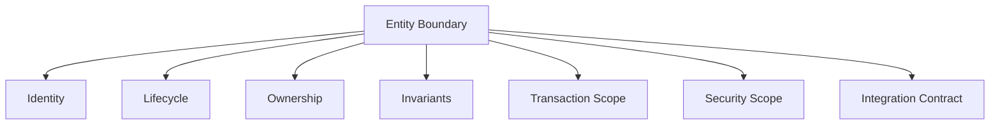

An entity is not just “a table with an id”.

An entity is a durable business object with identity and rules.

---

## 2. The Entity Boundary Test

Before making something an entity, ask:

1. Does it have stable identity?
2. Does it have its own lifecycle?
3. Can it be referenced by other things?
4. Does it have rules/invariants?
5. Does it have an owner?
6. Does it change independently?
7. Does it need history?
8. Does it have security implications?
9. Does it appear in reports as a meaningful unit?
10. Would deleting it affect other business facts?

If most answers are yes, it is probably an entity.

If most answers are no, it may be a value object, event, classification, or projection.

---

## 3. Entity vs Value Object vs Fact vs Projection

Do not force every concept into the same modeling category.

| Concept Type | Has Identity? | Has Lifecycle? | Example | Typical Storage |
|---|---:|---:|---|---|
| Entity | Yes | Yes | Case, Customer, Invoice | Table/document root |
| Value Object | No independent identity | Usually no | Money, Address, DateRange | Columns/embedded record |
| Fact/Event | Yes as record | Immutable occurrence | Approved, Submitted, Paid | Append-only table |
| Classification | Sometimes | Versioned taxonomy | Risk category, License type | Reference table |
| Assignment | Yes | Time-bound relation | Officer assigned to case | Join/entity table |
| Projection | Derived identity | Rebuildable | Case dashboard row | Materialized table/index |

Example:

```text
Address
```

May be:

- value object on a user profile
- entity if independently verified and reused
- historical fact if preserving submitted address
- regulatory evidence if address affects legal notice
- projection field if copied into a report snapshot

The same word can map to different model types depending on the role it plays.

---

## 4. Identity Is the First Boundary

Identity answers:

> “When is this the same thing as before?”

Examples:

- A person changes name. Same person?
- An organization changes registration number. Same organization?
- A case is reopened. Same case?
- A license is renewed. Same license or new license period?
- A product changes SKU. Same product?
- A customer merges with another customer. Which identity survives?

Poor identity decisions cause massive downstream damage.

### Identity Types

| Identity Type | Meaning | Example |
|---|---|---|
| Internal identity | Stable system-generated id | `case_id` UUID |
| External identity | Identifier from outside | company registration number |
| Natural identity | Real-world identifier | email, national id, tax id |
| Display identity | Human-friendly label | case number |
| Composite identity | Unique under scope | tenant + case_number |
| Temporal identity | Unique for period | license number + effective period |
| Derived identity | Computed from source | hash of document content |

Use internal identity for durable references.

Use external/natural/display identity carefully.

Do not confuse human identifiers with stable database identity.

---

## 5. Lifecycle Defines the Second Boundary

Two concepts should not be collapsed into one entity if their lifecycles differ significantly.

Example:

```text
Application and License
```

Bad model:

```sql
application(
  id uuid primary key,
  status text,
  license_number text,
  license_status text,
  issued_at timestamptz,
  expired_at timestamptz
);
```

Why bad?

- application can be rejected
- license can be suspended
- application can be amended before approval
- license can be renewed
- application is an approval process input
- license is an issued entitlement

Better:

```sql
application(
  id uuid primary key,
  applicant_id uuid not null,
  current_status text not null,
  submitted_at timestamptz null
);

license(
  id uuid primary key,
  application_id uuid not null,
  license_number text not null,
  current_status text not null,
  issued_at timestamptz not null,
  valid_from date not null,
  valid_to date not null
);
```

The application and license are related but not the same entity.

Rule:

> When lifecycles diverge, entities probably diverge.

---

## 6. Ownership Defines the Third Boundary

Ownership is not “who can query it”.

Ownership means:

- who defines the meaning
- who may create it
- who may mutate it
- who enforces invariants
- who evolves the schema
- who resolves conflicts
- who answers when data is wrong

A table without ownership becomes a shared dumping ground.

### Ownership Questions

For every table/entity:

```md
Entity: <name>

Business owner:
- Which domain owns the concept?

Technical owner:
- Which service/team owns writes and schema evolution?

Write authority:
- Which commands may create/update/delete?

Read consumers:
- Which services/reports depend on it?

Invariant owner:
- Who is responsible if the invariant breaks?

Correction owner:
- Who may correct wrong data?
```

Ownership must be explicit.

---

## 7. The Four Boundary Axes

Entity boundary is not one-dimensional.

Use four axes:

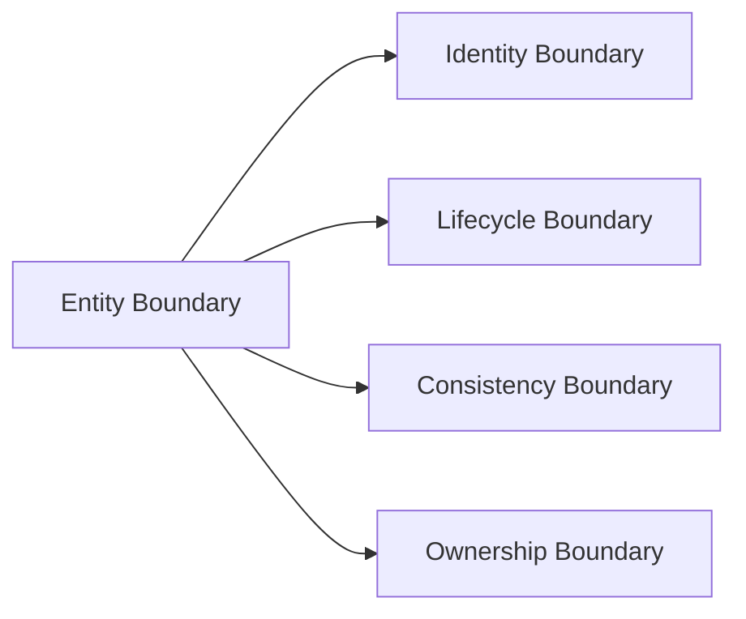

| Axis | Question | Example |
|---|---|---|
| Identity | What is the same thing? | case id survives reopen |
| Lifecycle | What states/transitions belong here? | license renewal separate from application approval |
| Consistency | What must change atomically? | order + order line reservation |
| Ownership | Who controls meaning and mutation? | billing owns invoice, not fulfillment |

When axes disagree, design carefully.

Example:

- Customer identity owned by identity domain.
- Billing profile owned by billing domain.
- Shipping address owned by fulfillment domain.
- Marketing preferences owned by marketing domain.

Do not stuff all of them into one `customer` table just because the UI says “customer profile”.

---

## 8. Entity Boundary Patterns

### Pattern 1: Root Entity With Child Entities

Use when children depend on parent lifecycle.

Example:

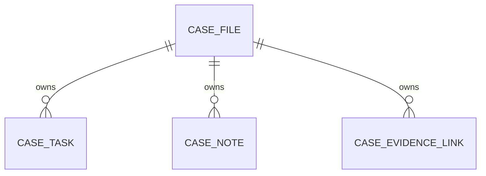

`case_task` can exist only inside a case.

`case_note` is meaningful only inside a case.

`case_evidence_link` links evidence to a case.

The root controls lifecycle and authorization.

### Pattern 2: Independent Entity With Relationship Table

Use when both sides have independent identity.

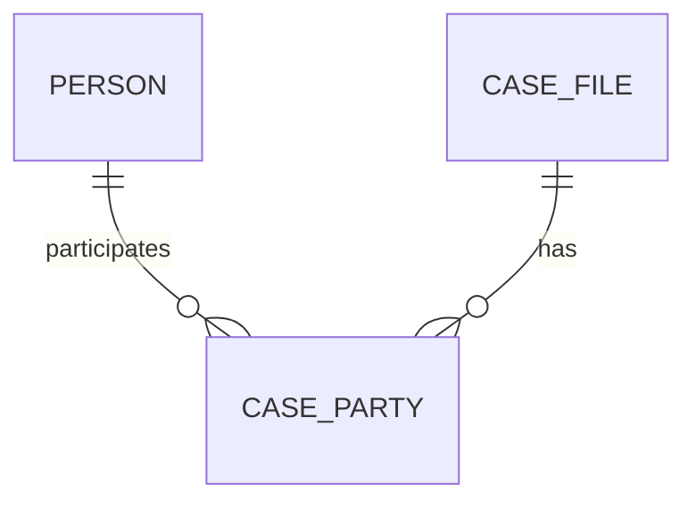

`person` is independent.

`case_file` is independent.

`case_party` is the relationship with role and effective period.

Do not embed `person` permanently inside `case_file` unless the person is just a snapshot/evidence value.

### Pattern 3: Versioned Entity

Use when an entity changes but history matters.

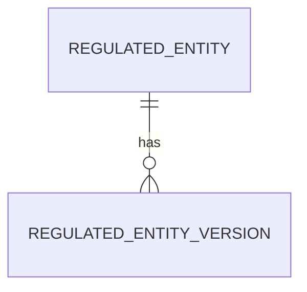

Current identity remains stable.

Attributes are versioned.

### Pattern 4: Event/Facts Around Entity

Use when actions matter.

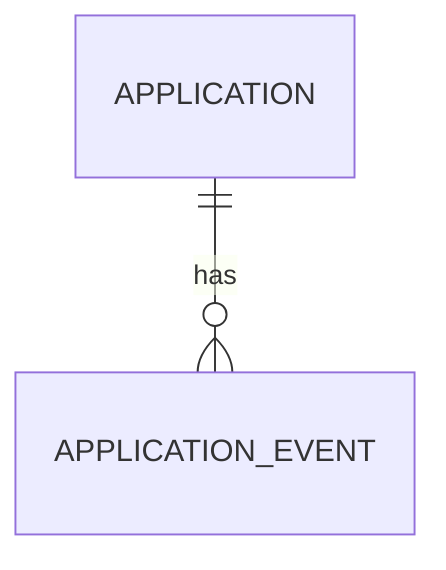

Events record what happened.

Entity stores current state for efficient access.

### Pattern 5: Projection Outside Boundary

Use when read shape is derived.

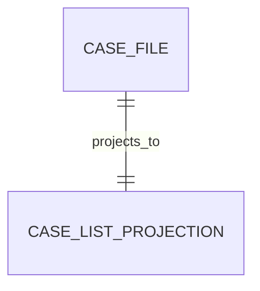

Projection is not the entity.

It can be rebuilt.

---

## 9. Aggregate Boundary vs Table Boundary

In domain-driven design, an aggregate is a consistency boundary.

In database design, a table is a storage structure.

They are related but not identical.

One aggregate can span multiple tables.

One table should rarely span multiple aggregate owners.

Example aggregate:

```text
Case Aggregate
- case_file
- case_transition
- case_assignment
- case_task
```

Possible transaction:

```text
Assign case
- update current assignee
- insert assignment history
- create task
- insert case event
```

The aggregate defines what must be kept consistent during a command.

The physical schema defines how it is stored.

Do not mistake a table diagram for aggregate design.

---

## 10. Aggregate Boundary Heuristics

A concept belongs inside the same aggregate when:

- it is created/deleted with the root
- it cannot be meaningfully changed without the root
- its invariants are enforced with the root
- it is usually loaded with the root for commands
- its lifecycle is subordinate to the root
- it shares the same authorization boundary

A concept should be outside the aggregate when:

- it has independent lifecycle
- it is referenced by multiple roots
- it is owned by another domain
- it changes at different frequency
- it has separate security controls
- it would make transactions too large
- it would cause excessive contention

### Example

Should `evidence_document` be inside `case`?

Maybe not.

- The binary document may be stored globally.
- It may be linked to many cases.
- It may have separate retention policy.
- It may have chain-of-custody rules.

Better:

```sql
document_object(...)
evidence_item(...)
case_evidence_link(...)
```

---

## 11. Ownership Anti-Pattern: Shared Customer Table

Classic enterprise problem:

```sql
customer(
  id uuid primary key,
  name text,
  email text,
  billing_status text,
  shipping_preference text,
  fraud_score numeric,
  marketing_consent boolean,
  kyc_status text,
  support_tier text,
  last_login_at timestamptz
);
```

Many domains write one table:

- identity
- billing
- fulfillment
- fraud
- marketing
- compliance
- support
- authentication

This becomes high-risk.

Better model:

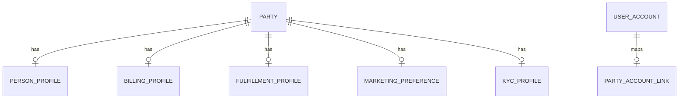

Each profile has its own owner and lifecycle.

The UI can still show a unified customer profile through a read model.

---

## 12. Relationship Is Often an Entity

Many-to-many tables are often treated as technical join tables.

But relationship rows may have business meaning.

Example:

```sql
case_party(case_id, party_id)
```

Weak.

Better:

```sql
case_party(
  id uuid primary key,
  case_id uuid not null,
  party_id uuid not null,
  party_role text not null,
  effective_from timestamptz not null,
  effective_to timestamptz null,
  added_by uuid not null,
  added_reason text not null
);
```

The relationship has:

- identity
- role
- time validity
- actor
- reason
- history

This is no longer just a join table.

It is a relationship entity.

### Rule

If a relationship has attributes, lifecycle, audit, or policy, model it explicitly.

---

## 13. Boundary by Consistency Need

Entity boundaries should respect transaction requirements.

If two pieces of data must always change together, they may belong in the same consistency boundary.

Example:

```text
Payment capture command
```

Must atomically:

- record capture attempt
- prevent duplicate capture
- update payment state
- create ledger entry
- insert outbox event

Possible transaction boundary:

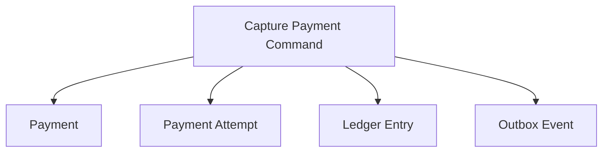

But if ledger is owned by separate accounting service, do not casually mutate both in the same local database unless the architecture deliberately accepts that coupling.

You may instead:

- record payment capture
- publish event
- let ledger service consume and post accounting entry
- reconcile asynchronously

Consistency boundary and ownership boundary must be negotiated explicitly.

---

## 14. Boundary by Change Frequency

Fields that change at very different frequencies may not belong in the same table/entity shape.

Example:

```sql
regulated_entity(
  id uuid primary key,
  legal_name text,
  registration_number text,
  risk_score numeric,
  last_seen_at timestamptz,
  dashboard_rank int,
  sync_attempt_count int
);
```

Problems:

- legal identity changes rarely
- risk score changes periodically
- last_seen changes frequently
- dashboard rank is derived
- sync attempt is operational metadata

Better:

```sql
regulated_entity
regulated_entity_profile_version
regulated_entity_risk_assessment
regulated_entity_activity_summary
regulated_entity_sync_state
```

Different change rates affect:

- write amplification
- row bloat/MVCC churn
- lock contention
- cache invalidation
- audit clarity
- ownership

Do not mix hot operational counters with stable legal identity unless intentionally justified.

---

## 15. Boundary by Security

Security can force entity separation.

Example:

```sql
employee(
  id uuid primary key,
  name text,
  work_email text,
  salary numeric,
  medical_condition text,
  manager_id uuid
);
```

This mixes access levels.

Better:

```sql
employee_profile(
  id uuid primary key,
  name text not null,
  work_email text not null,
  manager_id uuid null
);

employee_compensation(
  employee_id uuid primary key,
  salary numeric not null,
  effective_from date not null
);

employee_health_record(
  employee_id uuid primary key,
  encrypted_payload bytea not null
);
```

Separation supports:

- least privilege
- auditing access
- selective replication
- masking
- retention
- breach blast-radius reduction

A single table can still be protected with column-level controls in some databases, but physical/logical separation often improves operational safety.

---

## 16. Boundary by Retention

Retention rules can split entities.

Example:

```text
User account deletion
```

Some data can be erased.

Some data must be retained.

Some data must be anonymized.

Some data must be preserved as legal evidence.

Better design:

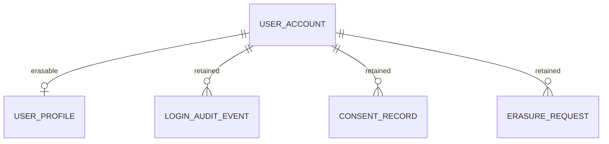

Do not design retention after the fact.

If data has different retention destiny, it may need different storage boundary.

---

## 17. Boundary by Source of Truth

If two fields have different authoritative sources, be careful putting them into one conceptual entity.

Example:

| Field | Source of Truth |
|---|---|
| legal name | company registry |
| trading name | user-entered business profile |
| risk score | risk engine |
| enforcement status | case management |
| billing standing | finance system |

A unified `regulated_entity` view is useful.

But canonical ownership may need split tables or separate services.

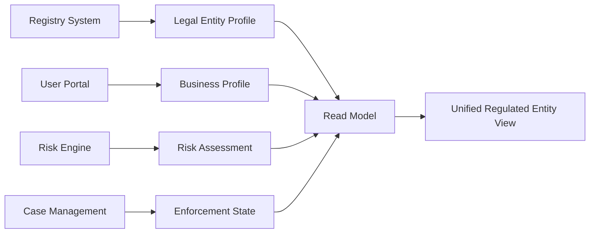

A read model can combine truths.

It should not obscure who owns each truth.

---

## 18. Boundary by Reporting Grain

Reporting grain can reveal bad boundaries.

Example report:

> “Show number of active licenses by regulated entity, license category, region, month.”

Important grains:

- regulated entity
- license
- license category
- region
- month

If the operational model collapses license category into application status, reporting becomes painful.

Ask early:

- What is the grain of official reporting?
- Does this concept appear as a dimension?
- Does it need historical versioning?
- Can historical reports be restated?
- Which entity determines the reporting period?

Operational entity boundaries should not be dictated only by reports, but reports reveal missing concepts.

---

## 19. Boundary by External Contract

External systems may depend on entity identity.

Example:

- external license id
- payment provider charge id
- regulator registration id
- shipment tracking number
- identity provider subject id

Do not hide external references inside random columns without lifecycle.

```sql
external_reference(
  id uuid primary key,
  entity_type text not null,
  entity_id uuid not null,
  external_system text not null,
  external_id text not null,
  reference_status text not null,
  created_at timestamptz not null,
  unique (external_system, external_id)
);
```

Or use domain-specific reference tables when stronger constraints are needed.

External identity is part of boundary design because it affects reconciliation, idempotency, and correction.

---

## 20. When to Split an Entity

Split when:

- multiple owners mutate different parts
- lifecycle rules conflict
- security sensitivity differs
- retention differs
- access frequency differs dramatically
- some fields are derived
- some fields are externally mastered
- some fields need versioning
- concurrency contention is high
- reports require separate grain
- optional data creates sparse table smell

Do not split only for aesthetic purity.

Splitting introduces joins, migrations, and operational complexity.

### Split Decision Matrix

| Signal | Split? | Reason |
|---|---:|---|
| Same lifecycle, same owner, same security | Usually no | Keep simple |
| Different owner, same identity | Often yes | Avoid cross-domain writes |
| Different retention | Often yes | Deletion/purge safety |
| Different security sensitivity | Often yes | Least privilege |
| Different change frequency | Maybe | Performance/contention |
| Derived fields | Yes or projection | Preserve source truth |
| Optional sparse fields | Maybe | Depends on meaning |
| Pure display grouping | No | UI concern only |

---

## 21. When to Merge Entities

Over-splitting also hurts.

Merge or keep together when:

- concepts have no independent lifecycle
- relationship is always one-to-one and inseparable
- data is always loaded/written together
- separation adds no security/retention/ownership benefit
- constraints become harder across split tables
- performance cost is unjustified
- the split reflects UI tabs, not domain boundaries

Example:

```sql
customer_name(
  customer_id uuid primary key,
  first_name text,
  last_name text
);

customer_birthdate(
  customer_id uuid primary key,
  birthdate date
);
```

This may be unnecessary unless security, retention, or ownership requires it.

Good architects know both when to split and when not to.

---

## 22. Boundary Smell: Polymorphic Entity Table

Common anti-pattern:

```sql
entity(
  id uuid primary key,
  entity_type text not null,
  name text,
  status text,
  metadata jsonb
);
```

Used for:

- person
- organization
- case
- license
- invoice
- document

Problems:

- weak constraints
- unclear lifecycle
- no meaningful foreign keys
- type-specific fields hidden in JSON
- hard indexing
- hard access control
- hard migrations

Polymorphic models are not always wrong, but they need strong justification.

Better pattern:

- common supertype only for truly shared identity
- subtype tables for specific attributes and rules
- explicit references where possible

Example:

```sql
party(
  id uuid primary key,
  party_type text not null
);

person(
  party_id uuid primary key references party(id),
  date_of_birth date
);

organization(
  party_id uuid primary key references party(id),
  registration_number text
);
```

This keeps common identity while preserving subtype constraints.

---

## 23. Boundary Smell: EAV Abuse

EAV means entity-attribute-value.

Example:

```sql
attribute_value(
  entity_id uuid,
  attribute_name text,
  attribute_value text
);
```

This may be useful for controlled extensibility.

But abuse creates:

- weak typing
- weak constraints
- hard queries
- poor indexing
- hidden schema
- poor documentation
- application-only correctness

Use EAV only when:

- attributes are genuinely dynamic
- invariants are low or externalized
- query patterns are limited
- validation metadata exists
- attribute definitions are versioned
- reporting consequences are understood

For core domain facts, prefer explicit schema.

---

## 24. Boundary Smell: Status Soup

Status soup happens when one entity accumulates many status-like columns:

```sql
order_status
payment_status
fulfillment_status
invoice_status
risk_status
sync_status
review_status
```

This may be valid if the entity is a read projection.

It is dangerous if it is treated as canonical.

Ask:

- Is `payment_status` owned by payment?
- Is `fulfillment_status` owned by warehouse?
- Is `invoice_status` owned by billing?
- Is this row a source of truth or summary?

Often the correct design is:

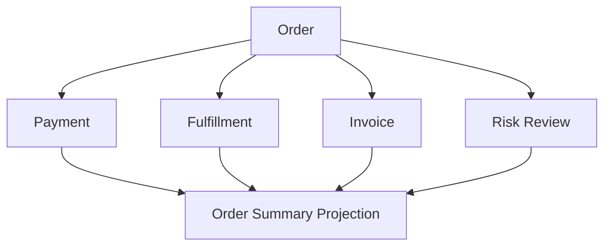

A summary can have many statuses.

A canonical entity should not silently own statuses from other domains.

---

## 25. Boundary Smell: Cross-Service Foreign Keys

In a monolith, foreign keys are useful and often necessary.

In distributed services, foreign keys across service-owned databases usually do not exist.

The problem is not the foreign key itself.

The problem is unclear ownership.

If two services share one database and both write each other’s tables, you have a hidden distributed monolith.

Possible patterns:

| Pattern | Use When | Tradeoff |
|---|---|---|
| Same database + FK | Same ownership/monolith | Strong consistency, tighter coupling |
| Database per service | Independent ownership | No DB FK across services |
| Reference by id | External entity reference | Need validation/reconciliation |
| Local copy/projection | Fast local reads | Staleness and sync complexity |
| API lookup | Fresh remote data | Runtime coupling/latency |
| Event-sourced projection | Async boundary | Eventual consistency |

Architecture decides which tradeoff is acceptable.

Do not accidentally choose by schema habit.

---

## 26. Designing References Across Boundaries

When one boundary references another, choose reference type.

### Strong Local FK

```sql
case_file(
  regulated_entity_id uuid not null references regulated_entity(id)
);
```

Good when same database ownership and strong consistency are needed.

### Scoped Composite FK

```sql
case_file(
  tenant_id uuid not null,
  regulated_entity_id uuid not null,
  foreign key (tenant_id, regulated_entity_id)
    references regulated_entity(tenant_id, id)
);
```

Good for tenant isolation.

### External Reference Without FK

```sql
case_file(
  regulated_entity_external_id text not null
);
```

Good when referenced data is owned elsewhere.

Requires validation/reconciliation.

### Snapshot Reference

```sql
case_subject_snapshot(
  case_id uuid primary key,
  subject_name text not null,
  subject_registration_number text not null,
  captured_at timestamptz not null
);
```

Good when historical context matters.

### Hybrid

```sql
case_file(
  regulated_entity_id uuid not null,
  subject_name_at_opening text not null
);
```

Good when current reference and historical snapshot are both needed.

---

## 27. Entity Ownership in a Modular Monolith

A modular monolith can still have clean ownership.

The database may be physically shared, but logical writes are owned.

Example:

```text
Modules:
- Identity
- Case Management
- Evidence
- Workflow
- Reporting
```

Ownership table:

| Table | Write Owner | Read Consumers | Notes |
|---|---|---|---|
| user_account | Identity | all modules | no direct writes outside Identity |
| case_file | Case Management | Workflow, Reporting | state changes through Case commands |
| evidence_item | Evidence | Case Management | linked, not mutated by Case |
| task_assignment | Workflow | Case Management | workflow-owned |
| case_report_snapshot | Reporting | users | derived, rebuildable |

In a modular monolith, direct SQL joins may be allowed, but write ownership must still be clear.

Otherwise, modularity is fake.

---

## 28. Entity Ownership in Microservices

In microservices, ownership becomes stricter.

A service owns its database.

Other services do not write its tables.

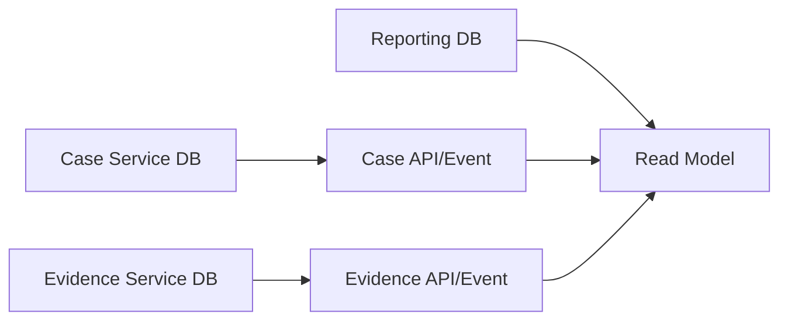

This does not mean every entity needs its own service.

Service boundaries should follow domain and operational boundaries, not table count.

Mistake:

```text
One service per table
```

Better:

```text
One service per cohesive ownership boundary
```

---

## 29. Ownership Metadata in the Schema

Some ownership and boundary rules should be visible in the schema.

Examples:

```sql
tenant_id uuid not null
created_by uuid not null
created_at timestamptz not null
updated_at timestamptz not null
source_system text not null
schema_version int not null
```

But metadata alone is not enough.

You also need:

- naming conventions
- migration ownership
- code ownership
- review process
- data catalog
- lineage documentation
- runbooks

A schema can encode some boundaries.

Organizations must enforce the rest.

---

## 30. Case Study: Regulatory Case Boundary

A regulatory case management platform might include:

- complaint intake
- case file
- regulated entity
- party/person
- task workflow
- evidence
- risk assessment
- decision
- enforcement action
- report snapshot

Do not model this as one `case` entity.

### Boundary Map

```mermaid
flowchart TD
    A[Case File Boundary] --> A1[Case Identity]
    A --> A2[Case Lifecycle]
    A --> A3[Case Transitions]

    B[Party Boundary] --> B1[Person]
    B --> B2[Organization]
    B --> B3[Case Party Role]

    C[Evidence Boundary] --> C1[Document Object]
    C --> C2[Evidence Item]
    C --> C3[Chain of Custody]

    D[Workflow Boundary] --> D1[Task]
    D --> D2[Assignment]
    D --> D3[Escalation]

    E[Decision Boundary] --> E1[Decision]
    E --> E2[Correction]
    E --> E3[Approval]

    F[Reporting Boundary] --> F1[Snapshot]
    F --> F2[Metrics]
```

### Ownership Table

| Boundary | Owns | Does Not Own |
|---|---|---|
| Case File | case identity, lifecycle, current state | document bytes, party master data |
| Party | person/org identity | case role meaning |
| Evidence | document metadata, custody | case decision |
| Workflow | task assignment/escalation | formal legal decision |
| Decision | decision record/correction | task routing |
| Reporting | snapshots/projections | source facts |

This makes system evolution easier.

---

## 31. Case Study: Account vs Ledger Boundary

Requirement:

> Users have accounts. Transactions change balances. Reports show current and historical balances.

Bad model:

```sql
account(
  id uuid primary key,
  balance numeric not null,
  last_transaction_id uuid
);
```

Better boundary:

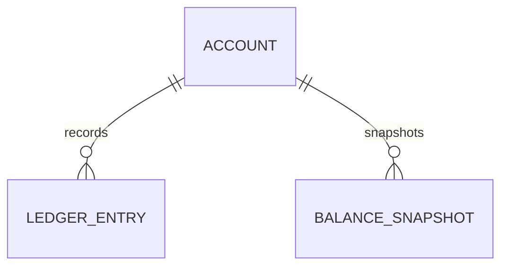

Possible tables:

```sql
account(
  id uuid primary key,
  account_number text not null unique,
  current_status text not null,
  opened_at timestamptz not null
);

ledger_entry(
  id uuid primary key,
  account_id uuid not null,
  entry_type text not null,
  amount numeric not null,
  currency text not null,
  transaction_reference text not null,
  posted_at timestamptz not null,
  unique (transaction_reference, entry_type)
);

balance_snapshot(
  id uuid primary key,
  account_id uuid not null,
  balance numeric not null,
  snapshot_at timestamptz not null
);
```

Boundary logic:

- account owns identity/lifecycle
- ledger owns financial facts
- snapshot is derived/reporting optimization
- current balance may be projection, not source truth

This prevents “balance update” from erasing accounting evidence.

---

## 32. Case Study: Product Catalog Boundary

Product data often becomes messy because many domains touch it.

Potential domains:

- catalog owns product identity and description
- pricing owns price
- inventory owns stock
- fulfillment owns shipping constraints
- promotion owns discounts
- review owns ratings
- search owns search document

Bad table:

```sql
product(
  id uuid primary key,
  name text,
  description text,
  price numeric,
  stock_count int,
  rating numeric,
  discount_percent numeric,
  search_keywords text
);
```

Better boundary:

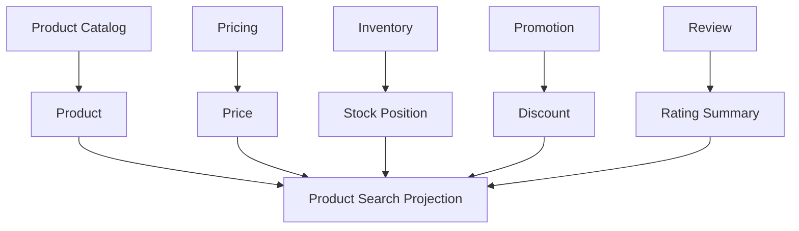

The product detail page can still show everything.

But canonical ownership is separated.

---

## 33. Designing Boundary Documentation

Every important entity should have a boundary note.

Template:

```md
# Entity Boundary: <Entity Name>

## Purpose
What business concept does this entity represent?

## Identity
What makes this entity the same over time?

## Lifecycle
What states/transitions belong to it?

## Owner
Which domain/team owns writes and schema evolution?

## Invariants
What must always be true inside this boundary?

## Children
Which child records are lifecycle-dependent?

## External References
Which external entities are referenced but not owned?

## History
What changes are recorded as history?

## Security
What access boundary applies?

## Retention
What deletion/archive rules apply?

## Read Models
Which projections are derived from it?

## Non-Goals
What this entity explicitly does not own.
```

The “Non-Goals” section is critical.

It prevents boundary creep.

---

## 34. Entity Boundary Review Checklist

### Identity

- [ ] Does the entity have stable internal id?
- [ ] Are external ids separated from internal ids?
- [ ] Are display ids scoped and unique correctly?
- [ ] Are merge/split scenarios understood?
- [ ] Are renewals/reopenings modeled correctly?

### Lifecycle

- [ ] Does the entity have a clear lifecycle?
- [ ] Are child lifecycles subordinate or independent?
- [ ] Are status concepts separated?
- [ ] Are irreversible transitions recorded?
- [ ] Is history required for lifecycle transitions?

### Ownership

- [ ] Is there one write owner?
- [ ] Are other domains read-only consumers?
- [ ] Are derived fields clearly marked?
- [ ] Are correction responsibilities clear?
- [ ] Are schema migrations owned?

### Consistency

- [ ] What must change atomically?
- [ ] Which invariants are inside the boundary?
- [ ] Which invariants cross boundaries?
- [ ] Are cross-boundary invariants reconciled?
- [ ] Is eventual consistency acceptable where used?

### Security

- [ ] Does the entity contain mixed sensitivity data?
- [ ] Is tenant isolation encoded?
- [ ] Are row/column access rules clear?
- [ ] Should sensitive data be split?
- [ ] Is access auditing required?

### Retention

- [ ] Can the entity be deleted?
- [ ] Are child records retained differently?
- [ ] Is anonymization needed?
- [ ] Are legal holds possible?
- [ ] Are projections purged/rebuilt safely?

---

## 35. Practical Decision Framework

When unsure whether to split or keep together, score the dimensions.

| Dimension | Same Boundary | Separate Boundary |
|---|---|---|
| Identity | Same identity | Different identity |
| Lifecycle | Same lifecycle | Different lifecycle |
| Owner | Same owner | Different owner |
| Security | Same access level | Different sensitivity |
| Retention | Same retention | Different retention |
| Transaction | Must be atomic | Can be eventual |
| Workload | Loaded/written together | Different query/write patterns |
| History | Same history need | Different history need |
| Reporting Grain | Same grain | Different grain |

If most columns point separate, split.

If most point same, keep together.

If mixed, identify which dimension is most important for the system’s risk profile.

For regulated systems, history/security/ownership may dominate.

For high-throughput systems, consistency/contention/workload may dominate.

For analytics systems, grain and lineage may dominate.

---

## 36. Boundary Design and Migration Safety

Bad boundaries make migrations dangerous.

Example:

- one table has customer profile, billing, risk, and marketing data
- four teams deploy independently
- one migration changes nullable behavior
- another service still writes old shape
- reporting breaks

Good boundaries support expand-contract migration:

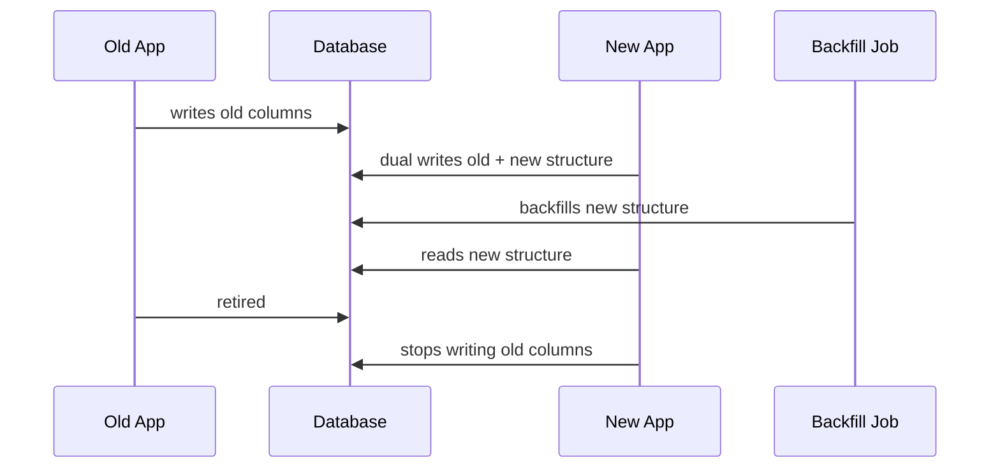

A boundary is not only conceptual.

It affects deployment safety.

---

## 37. Boundary Design and Observability

Ownership should appear in observability.

For each boundary, monitor:

- write throughput
- read throughput
- error rate
- constraint violations
- deadlocks/contention
- data quality exceptions
- replication lag for projections
- reconciliation failures
- orphan references
- unauthorized access attempts

Example:

```text
case_boundary.transition.failure.count
case_boundary.assignment.deadlock.count
evidence_boundary.document_hash_mismatch.count
reporting_boundary.snapshot_staleness.seconds
```

If you cannot observe a boundary, you do not really own it.

---

## 38. Boundary Design and Team Topology

Database boundaries and team boundaries influence each other.

If one team owns the schema but many teams need changes, the schema becomes a bottleneck.

If many teams freely mutate shared tables, the schema becomes chaos.

Better operating model:

- one clear owner per canonical table
- consumers request contract changes
- migrations reviewed by owner
- projections owned by consuming domain
- shared reference data governed deliberately
- cross-boundary changes use ADRs/design docs

A strong entity boundary is both technical and organizational.

---

## 39. What Top 1% Engineers Do Differently

They do not ask only:

> “Should this be a table?”

They ask:

- What identity survives over time?
- Which lifecycle does this belong to?
- Who has write authority?
- What must be transactionally consistent?
- Which facts are immutable?
- Which relationships have business meaning?
- Which data is derived?
- Which fields have different security/retention rules?
- Which references cross ownership boundaries?
- What happens during migration?
- What happens during correction?
- What happens if two domains disagree?

Entity modeling at senior level is boundary modeling.

And boundary modeling is how you keep large systems from becoming ungovernable.

---

## 40. Practical Exercise

Given this requirement:

> “A regulated organization can submit license applications. Officers review applications. Approved applications create licenses. Licenses can be renewed, suspended, transferred, or revoked. Reports must show license status by organization and time period.”

Do not create one `license_application` table with every field.

Identify:

1. Entities
2. Value objects
3. Events/facts
4. Relationship entities
5. Projections
6. Ownership boundaries
7. Lifecycle boundaries
8. Reporting grain
9. Retention/security boundaries
10. Cross-boundary references

Expected concepts:

- regulated organization
- application
- application party
- review assignment
- review decision
- license
- license period
- license status transition
- suspension
- transfer
- revocation
- report snapshot

The key insight:

Application, license, organization, and report are related but not the same boundary.

---

## 41. Summary

Entity boundaries are where database design becomes architecture.

A good boundary defines:

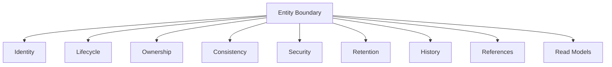

The key rule:

> Do not model nouns. Model durable business objects with identity, lifecycle, ownership, and invariants.

When boundaries are clear, schemas remain evolvable.

When boundaries are vague, every future requirement becomes a dangerous patch.

---

## 42. References and Further Reading

- PostgreSQL Documentation — Constraints: https://www.postgresql.org/docs/current/ddl-constraints.html
- PostgreSQL Documentation — CREATE TABLE: https://www.postgresql.org/docs/current/sql-createtable.html
- AWS Prescriptive Guidance — Database-per-service pattern: https://docs.aws.amazon.com/prescriptive-guidance/latest/modernization-data-persistence/database-per-service.html
- AWS Prescriptive Guidance — Shared-database-per-service pattern: https://docs.aws.amazon.com/prescriptive-guidance/latest/modernization-data-persistence/shared-database.html
- MongoDB Documentation — Data Modeling: https://www.mongodb.com/docs/manual/data-modeling/
- MongoDB Documentation — Data Modeling Best Practices: https://www.mongodb.com/docs/manual/data-modeling/best-practices/
- James Smith — Build Your Own Database From Scratch

