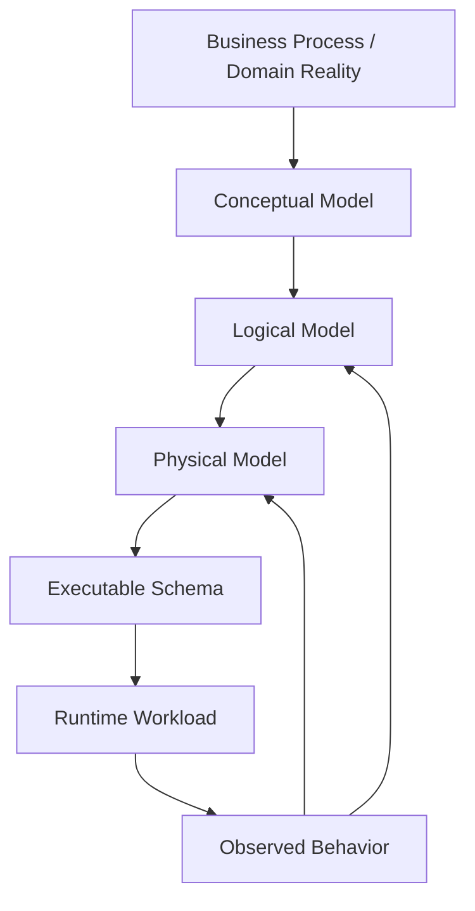
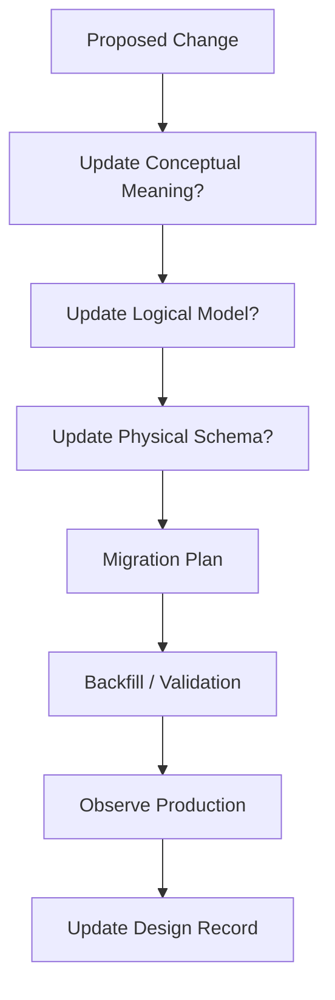

# Part 007 — Conceptual, Logical, Physical Model

Database design fails when teams jump straight from user stories into tables.

A table is already a physical-ish decision. It commits you to names, columns, constraints, nullability, joins, indexes, migration shape, query behavior, ownership, and future compatibility. That is too much commitment too early.

A strong database architect separates three questions:

1. **What does the business mean?**  
   This is the conceptual model.
2. **What facts and rules must exist independently of a specific database engine?**  
   This is the logical model.
3. **How will those facts be represented, constrained, indexed, migrated, secured, and operated in a real database?**  
   This is the physical model.

This part teaches that bridge.

The goal is not to produce pretty ER diagrams. The goal is to prevent accidental data architecture.

---

## 1. The Core Mental Model

A database model is not a drawing of tables.

A database model is a set of decisions about:

- meaning,
- identity,
- ownership,
- lifecycle,
- relationships,
- constraints,
- time,
- access paths,
- correction rules,
- operational risk.

Conceptual, logical, and physical modelling separate those decisions by abstraction level.



The loop matters. Modelling is not one-way. Production behavior often reveals that the logical or physical model is wrong.

Examples:

- The conceptual model says a **Case** has an **Officer**.
- Production reveals that cases can have many officers over time.
- The model must change from `case.assigned_officer_id` to an assignment history or responsibility table.

That is not a small refactor. It changes auditability, access control, reporting, and escalation logic.

---

## 2. Why Three Levels Exist

The three levels exist because different mistakes happen at different levels.

| Level | Main Question | Main Artifact | Typical Mistake |
|---|---|---|---|
| Conceptual | What does the domain mean? | Domain map / ER-style model / glossary | Modelling implementation accidents as business truth |
| Logical | What data facts and rules must be preserved? | Entity, attribute, relationship, constraint model | Missing invariants, weak identity, overloaded fields |
| Physical | How is it implemented in a specific engine? | DDL, indexes, partitions, storage choices, migrations | Premature performance hacks, weak constraints, migration risk |

Top engineers do not debate whether one level is “more important”. They know each level catches a different class of defect.

---

## 3. Conceptual Model

The conceptual model captures business meaning without committing to database technology.

It answers:

- What are the important business things?
- What are their names?
- What relationships exist between them?
- Which relationships are structural and which are temporary?
- Which events change their state?
- Which concepts are independent and which are just descriptions?
- Which words are overloaded?

A conceptual model must be understandable by engineers, business owners, product people, auditors, and support teams.

It should be close to the language of the domain.

### 3.1 Example: Regulatory Case Management

Conceptual entities:

- Case
- Subject
- Allegation
- Evidence
- Investigation
- Officer
- Decision
- Enforcement Action
- Appeal
- SLA
- Assignment

Conceptual relationships:

- A Case concerns one or more Subjects.
- A Case contains one or more Allegations.
- Evidence supports or refutes an Allegation.
- A Decision resolves one or more Allegations.
- An Enforcement Action may result from a Decision.
- An Appeal challenges a Decision.
- An Officer may be assigned to a Case during a time period.

Notice what is missing:

- table names,
- primary key types,
- indexes,
- JSON columns,
- partitioning,
- ORM annotations,
- sequence names.

Those belong later.

### 3.2 Conceptual Model as Shared Language

A conceptual model prevents teams from using the same word for different things.

For example:

| Word | Possible Meanings |
|---|---|
| Case | Business case, workflow instance, legal matter, support ticket, database row |
| Status | Current lifecycle state, display label, workflow step, derived summary |
| Owner | Creator, accountable officer, current assignee, tenant owner, data controller |
| Decision | Formal adjudication, system recommendation, manager approval, workflow transition |
| Evidence | Uploaded file, verified document, extracted metadata, chain-of-custody record |

A weak team says, “we know what Case means”.

A strong team asks:

> Which lifecycle does Case own, and which facts are only attached to it?

### 3.3 Conceptual Modelling Heuristics

Use these heuristics before drawing tables:

#### Noun Test

A noun is a candidate entity when it has:

- independent identity,
- lifecycle,
- relationships,
- rules,
- audit relevance,
- ownership.

If it only describes another thing, it may be an attribute.

Example:

- `Case` is an entity.
- `Case Priority` may be an attribute or reference data.
- `Assignment` is likely an entity, not just `case.assigned_to`, if assignment has time, reason, history, actor, or approval.

#### Verb Test

A verb reveals state changes and relationships.

Examples:

- “Officer assigns Case” → Assignment event or assignment table.
- “Reviewer approves Decision” → Approval state, actor, timestamp.
- “Subject appeals Decision” → Appeal entity.
- “System escalates overdue Case” → Escalation event and SLA state.

#### Time Test

Ask:

- Does this fact change?
- Do we need to know what it was before?
- Do we need to know when it became true?
- Do we need to know who changed it?
- Do reports depend on historical accuracy?

If yes, avoid flattening it into a mutable column too early.

#### Dispute Test

Ask:

- Could two departments disagree about this fact?
- Could the fact be corrected later?
- Could it have evidentiary consequences?

If yes, model provenance and correction path.

---

## 4. Logical Model

The logical model translates conceptual meaning into precise data structure without yet committing to engine-specific storage details.

It answers:

- What entities exist?
- What attributes do they have?
- Which attributes are required?
- What identifies each entity?
- What relationships exist?
- What cardinality exists?
- What constraints must always hold?
- What state transitions are legal?
- What history must be preserved?

The logical model is where ambiguity becomes explicit.

### 4.1 Logical Entity Definition

A logical entity should define:

```txt
Entity: Case
Meaning: A regulatory matter opened to investigate one or more allegations.
Identity: case_id
Lifecycle: draft -> open -> under_review -> decision_pending -> closed
Ownership: Case Management domain
Required facts:
  - case_id
  - case_number
  - opened_at
  - current_state
  - primary_subject_id? depending on domain rule
Relationships:
  - Case has many Allegations
  - Case has many Assignments over time
  - Case has many Evidence Links
  - Case may have many Decisions
Invariants:
  - case_number must be unique within jurisdiction
  - closed case cannot receive new allegations unless reopened
  - assignment periods for same role must not overlap
```

This is not DDL yet, but it is precise enough to review.

### 4.2 Logical Attribute Definition

A logical attribute should define:

- name,
- meaning,
- data type concept,
- required/optional rule,
- valid range,
- lifecycle behavior,
- source of authority,
- correction rule,
- sensitivity classification.

Example:

```txt
Attribute: opened_at
Entity: Case
Meaning: timestamp when case became officially open
Required: yes
Source: case opening command
Mutable: no, except administrative correction
Sensitivity: operational metadata
Rules:
  - must be >= received_at if received_at exists
  - used for SLA calculation
```

This prevents an engineer from casually making it nullable or updating it during migration without understanding consequences.

### 4.3 Logical Relationship Definition

A logical relationship must define more than “has many”.

It should define:

- cardinality,
- optionality,
- lifecycle dependency,
- ownership,
- deletion behavior,
- history requirement,
- cross-boundary impact.

Example:

```txt
Relationship: Case -> Assignment
Cardinality: one Case has many Assignments
Optionality: a Case may temporarily have no active Assignment
Lifecycle: Assignment cannot exist without Case
History: required
Deletion: never physically delete; close assignment with ended_at
Rule: only one active primary assignment per Case
```

A weak model says:

```txt
case.assignee_id nullable
```

A stronger model says:

```txt
case_assignment(
  case_id,
  officer_id,
  role,
  assigned_at,
  ended_at,
  assigned_by,
  reason
)
```

The difference is not style. It is correctness.

### 4.4 Logical Constraint Categories

Constraints are not just database syntax. They are business truth encoded as rules.

| Constraint Type | Example |
|---|---|
| Identity constraint | Each case has one stable ID |
| Uniqueness constraint | Case number unique per jurisdiction |
| Referential constraint | Allegation must belong to an existing case |
| Cardinality constraint | Decision must reference at least one allegation |
| Temporal constraint | Assignment periods must not overlap |
| State constraint | Closed case cannot move directly to draft |
| Authorization constraint | Only assigned reviewer can approve draft decision |
| Classification constraint | Restricted evidence cannot be exposed to normal users |
| Retention constraint | Certain records cannot be purged before retention expiry |

Some constraints can be encoded directly in the database. Some require application/service logic. Some require workflow engine logic. Some require policy enforcement. The architect’s job is to decide where each invariant lives and how it is tested.

---

## 5. Physical Model

The physical model turns logical design into a deployable database schema.

It answers:

- Which database engine?
- Which schema namespace?
- Which table names?
- Which column types?
- Which primary keys?
- Which foreign keys?
- Which check constraints?
- Which uniqueness constraints?
- Which indexes?
- Which partitioning strategy?
- Which views/materialized views?
- Which generated columns?
- Which triggers, if any?
- Which migration order?
- Which operational safeguards?

PostgreSQL documentation frames tables as fixed sets of named columns with variable row counts, and SQL does not guarantee row ordering unless explicitly requested. That single rule already affects physical design: never rely on insertion order as meaning. Use explicit timestamps, sequence values, or ordering keys when order matters.

### 5.1 Physical Model Example

Logical rule:

> Only one active primary assignment may exist for a case.

Physical PostgreSQL-style implementation:

```sql
CREATE TABLE case_assignment (
    case_assignment_id uuid PRIMARY KEY,
    case_id uuid NOT NULL REFERENCES regulatory_case(case_id),
    officer_id uuid NOT NULL REFERENCES officer(officer_id),
    assignment_role text NOT NULL,
    assigned_at timestamptz NOT NULL,
    ended_at timestamptz,
    assigned_by uuid NOT NULL,
    reason text NOT NULL,
    CHECK (ended_at IS NULL OR ended_at > assigned_at)
);

CREATE UNIQUE INDEX uq_one_active_primary_assignment
ON case_assignment(case_id)
WHERE assignment_role = 'PRIMARY' AND ended_at IS NULL;
```

The logical invariant becomes an enforceable physical constraint.

This is architectural maturity.

### 5.2 Physical Design Decisions Are Tradeoffs

Every physical decision buys one property by spending another.

| Decision | Helps | Costs |
|---|---|---|
| Add index | Read performance | Write overhead, storage, planning complexity |
| Add foreign key | Referential integrity | Insert/update dependency, migration complexity |
| Use UUID | Decentralized ID generation | Larger index, possible locality issue depending variant |
| Use sequence | Compact ordered key | Central allocator, predictability, cross-region complexity |
| Normalize | Integrity and reuse | More joins |
| Denormalize | Read simplicity | Redundancy and consistency burden |
| Partition | Manageability and pruning | Query/planner/migration complexity |
| JSON column | Flexibility | Weaker schema guarantees unless constrained |
| Trigger | Centralized database rule | Hidden behavior, testing/debugging complexity |

A top engineer never says “indexes are good” or “normalization is good”. They ask: good for which invariant, workload, and failure mode?

---

## 6. A Running Example Across the Three Levels

Let us model a regulatory case assignment.

### 6.1 Conceptual Model

Business statement:

> A case can be assigned to officers. Assignments can change. The system must know who was responsible at any point in time. Only one officer can be the active primary officer for a case.

Conceptual entities:

- Case
- Officer
- Assignment

Conceptual relationship:

- Case has officer assignments over time.

Conceptual invariant:

- One active primary officer per case.

### 6.2 Logical Model

```txt
Entity: CaseAssignment
Identity: case_assignment_id
Required attributes:
  - case_id
  - officer_id
  - role
  - assigned_at
  - assigned_by
Optional attributes:
  - ended_at
  - end_reason
Rules:
  - ended_at must be after assigned_at
  - one active assignment per case and role=PRIMARY
  - assignment history must be retained
  - assignment cannot reference inactive officer unless rule explicitly permits historical reference
```

### 6.3 Physical Model

```sql
CREATE TABLE regulatory_case (
    case_id uuid PRIMARY KEY,
    case_number text NOT NULL,
    jurisdiction_code text NOT NULL,
    opened_at timestamptz NOT NULL,
    current_state text NOT NULL,
    UNIQUE (jurisdiction_code, case_number)
);

CREATE TABLE officer (
    officer_id uuid PRIMARY KEY,
    officer_number text NOT NULL UNIQUE,
    display_name text NOT NULL,
    active boolean NOT NULL DEFAULT true
);

CREATE TABLE case_assignment (
    case_assignment_id uuid PRIMARY KEY,
    case_id uuid NOT NULL REFERENCES regulatory_case(case_id),
    officer_id uuid NOT NULL REFERENCES officer(officer_id),
    assignment_role text NOT NULL CHECK (assignment_role IN ('PRIMARY', 'SECONDARY', 'REVIEWER')),
    assigned_at timestamptz NOT NULL,
    ended_at timestamptz,
    assigned_by uuid NOT NULL REFERENCES officer(officer_id),
    end_reason text,
    CHECK (ended_at IS NULL OR ended_at > assigned_at)
);

CREATE UNIQUE INDEX uq_case_assignment_active_primary
    ON case_assignment(case_id)
    WHERE assignment_role = 'PRIMARY' AND ended_at IS NULL;

CREATE INDEX ix_case_assignment_case_history
    ON case_assignment(case_id, assigned_at DESC);
```

### 6.4 What the Example Teaches

The conceptual model says what the business means.

The logical model exposes the rule.

The physical model makes the rule executable.

If you skipped straight to `case.assigned_officer_id`, you would lose:

- assignment history,
- temporal accountability,
- support for secondary/reviewer roles,
- audit evidence,
- ability to answer “who was responsible on March 3?”
- ability to enforce one active primary assignment cleanly.

---

## 7. The Model Translation Pipeline

A database architect should be able to trace every physical design choice back to a logical and conceptual reason.


Example trace:

| Layer | Decision |
|---|---|
| Business | A case must have only one current primary officer |
| Conceptual | Case has Assignments; Assignment has role and time period |
| Logical | One active primary assignment per case |
| Physical | Partial unique index on `case_id` where role is primary and ended_at is null |
| Operational | Monitor unique violation rate and failed assignment attempts |

This trace makes designs reviewable.

---

## 8. Model Drift

Model drift happens when the implemented database no longer reflects the intended domain model.

Common causes:

- urgent product changes,
- bypassed migrations,
- undocumented columns,
- reporting shortcuts,
- nullability introduced “temporarily”,
- inconsistent service ownership,
- ad hoc JSON payloads,
- implicit business rules in application code,
- stale diagrams.

### 8.1 Symptoms of Model Drift

You likely have model drift when:

- nobody knows what a column means,
- a status field has too many values,
- reports disagree with operational screens,
- joins require tribal knowledge,
- data fixes require manual scripts,
- constraints are missing because “the app handles it”,
- every new feature adds nullable columns to the same table,
- table names no longer match domain language.

### 8.2 Drift Control

Use this loop:



Drift cannot be prevented by diagrams alone. It requires review discipline and executable checks.

---

## 9. Modelling Granularity

A common mistake is modelling either too coarsely or too finely.

### 9.1 Too Coarse

Example:

```txt
case(id, data_json, status, created_at)
```

This may look flexible. In reality, it hides:

- identity,
- relationships,
- constraints,
- access patterns,
- lifecycle,
- audit semantics,
- query optimization,
- migration safety.

Too coarse is often a failure to understand the domain.

### 9.2 Too Fine

Example:

```txt
case_title_history
case_description_history
case_priority_history
case_category_history
case_visibility_history
```

This may look precise. In reality, it can create:

- join explosion,
- excessive ceremony,
- complicated writes,
- unclear ownership,
- hard-to-understand queries.

Too fine is often a failure to identify aggregate boundaries and actual audit requirements.

### 9.3 Right Granularity

Right granularity comes from asking:

- Does this concept have independent identity?
- Does it change independently?
- Does it need history?
- Does it have different access control?
- Does it have different retention?
- Does it appear in different workflows?
- Does it create important invariants?

If yes, it may deserve its own entity/table.

---

## 10. How to Review a Conceptual Model

Use these questions:

1. Are all major business concepts represented?
2. Are there overloaded words?
3. Are lifecycle concepts visible?
4. Are events and state transitions visible?
5. Are actors and responsibilities clear?
6. Are relationships named in business language?
7. Are temporary relationships separated from structural relationships?
8. Are disputed/correctable facts identified?
9. Are derived concepts separated from authoritative concepts?
10. Can non-engineers validate the model?

A conceptual model that business stakeholders cannot understand is not conceptual enough.

---

## 11. How to Review a Logical Model

Use these questions:

1. Does every entity have stable identity?
2. Are natural keys and surrogate keys clearly distinguished?
3. Are required attributes actually required?
4. Is optionality justified?
5. Are cardinalities explicit?
6. Are relationship lifecycles explicit?
7. Are history requirements explicit?
8. Are invariants listed separately from implementation?
9. Are correction rules explicit?
10. Are sensitive fields classified?
11. Are derived fields identified?
12. Are external references clearly marked?
13. Are deletion/retention rules defined?
14. Are illegal states named?

A logical model that does not name illegal states is not ready for physical design.

---

## 12. How to Review a Physical Model

Use these questions:

1. Does every table map to a logical entity or relationship?
2. Does every column have a defined meaning?
3. Are primary keys stable and appropriate?
4. Are foreign keys used where referential integrity matters?
5. Are check constraints used for local invariants?
6. Are unique constraints used for business uniqueness?
7. Are indexes justified by workload?
8. Are indexes overbuilt?
9. Are nullable columns justified?
10. Are timestamps semantically clear?
11. Are state fields constrained?
12. Are migrations safe under production traffic?
13. Are backfills measurable and reversible?
14. Are high-volume tables partition candidates?
15. Are access-control boundaries supported?
16. Are retention and archival paths designed?

A physical model that cannot explain its indexes is not production-ready.

---

## 13. Conceptual-to-Physical Anti-Patterns

### 13.1 Table-First Design

Symptom:

```txt
Let's create tables first and adjust later.
```

Consequence:

- wrong identity,
- bad nullability,
- missing history,
- weak constraints,
- expensive migrations.

Better:

```txt
Define entities, lifecycle, invariants, and access patterns first.
```

### 13.2 UI-Driven Schema

Symptom:

```txt
The form has these fields, so the table has these columns.
```

Consequence:

- UI layout becomes data architecture,
- hidden lifecycle issues,
- repeated fields across workflows,
- poor reuse.

Better:

```txt
Separate domain facts from UI capture steps.
```

### 13.3 Report-Driven Operational Schema

Symptom:

```txt
The dashboard needs one row per case with all fields.
```

Consequence:

- operational tables become denormalized report blobs,
- write complexity increases,
- inconsistent derived values.

Better:

```txt
Design authoritative operational model first, then build reporting projections.
```

### 13.4 JSON Escape Hatch

Symptom:

```txt
We are not sure about the fields, so put it in JSON.
```

Consequence:

- weak constraints,
- hidden schema drift,
- query pain,
- migration ambiguity.

Better:

```txt
Use JSON only for intentionally flexible substructure, and document validation rules.
```

### 13.5 Status Blob

Symptom:

```txt
One status column represents workflow, lifecycle, assignment, review, and external sync.
```

Consequence:

- state explosion,
- invalid combinations,
- untestable transitions,
- brittle reports.

Better:

```txt
Separate lifecycle state from workflow step, assignment state, review state, and integration state when they evolve independently.
```

---

## 14. Practical Modelling Worksheet

Use this worksheet before creating DDL.

```md
# Data Model Worksheet

## Business Process
What process is this model supporting?

## Conceptual Concepts
- Concept:
  - Meaning:
  - Lifecycle:
  - Related concepts:
  - Ambiguous terms:

## Logical Entities
- Entity:
  - Identity:
  - Required attributes:
  - Optional attributes:
  - Relationships:
  - Invariants:
  - History requirements:
  - Correction rules:
  - Retention rules:
  - Security classification:

## Physical Design
- Table:
  - Primary key:
  - Foreign keys:
  - Unique constraints:
  - Check constraints:
  - Indexes:
  - Partitioning:
  - Migration strategy:
  - Backfill strategy:
  - Monitoring:

## Review
- What illegal states are prevented by the database?
- What illegal states are prevented by the application?
- What illegal states are not yet prevented?
- What is the rollback plan?
```

This worksheet is intentionally plain. A model that cannot be explained in plain text is not understood deeply enough.

---

## 15. Decision Matrix: Which Level Needs Work?

| Situation | Work Needed |
|---|---|
| Stakeholders disagree on meaning | Conceptual model |
| Engineers disagree on relationships/cardinality | Logical model |
| Query is slow | Physical model, maybe logical model |
| Data violates business rules | Logical and physical model |
| Migration is risky | Physical model and evolution plan |
| Reports conflict with screens | Authority model and logical model |
| New feature adds many nullable fields | Conceptual and logical model |
| Auditors ask for historical proof | Logical history model and physical audit design |
| Tenants leak data | Ownership/security boundary and physical enforcement |
| Service boundaries are unclear | Conceptual ownership and logical aggregate boundary |

---

## 16. How This Fits With Previous Parts

Part 003 taught that data is state over time.

Part 004 taught that workload must shape design.

Part 005 taught how to translate requirements.

Part 006 taught entity boundaries and ownership.

This part adds the modelling pipeline:

```txt
meaning -> logical rules -> physical enforcement
```

That pipeline is the bridge from conversation to production schema.

---

## 17. Production-Grade Takeaways

1. Never start with tables when the domain is still ambiguous.
2. A conceptual model exists to stabilize language.
3. A logical model exists to stabilize facts, relationships, and invariants.
4. A physical model exists to make those rules executable under real workload.
5. Every physical column should trace back to a logical attribute or relationship.
6. Every important invariant needs an enforcement location.
7. Model drift is inevitable unless design records and migrations stay aligned.
8. Good database design is not normalized diagrams. It is controlled meaning under change.

---

## 18. References

- PostgreSQL Documentation — Table Basics: https://www.postgresql.org/docs/current/ddl-basics.html
- PostgreSQL Documentation — Constraints: https://www.postgresql.org/docs/current/ddl-constraints.html
- PostgreSQL Documentation — Data Types: https://www.postgresql.org/docs/current/datatype.html
- IBM — What Is Data Modeling?: https://www.ibm.com/think/topics/data-modeling
- AWS Prescriptive Guidance — Database Migration Strategy: https://docs.aws.amazon.com/prescriptive-guidance/latest/strategy-database-migration/welcome.html
