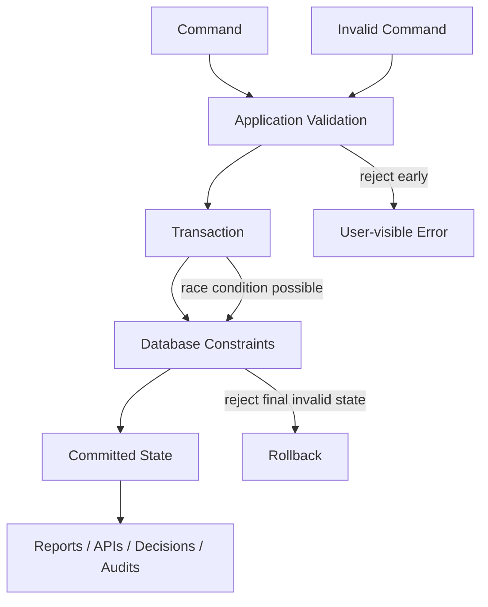
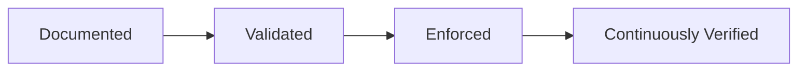
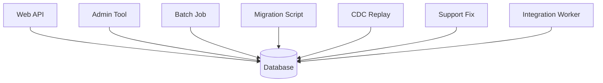
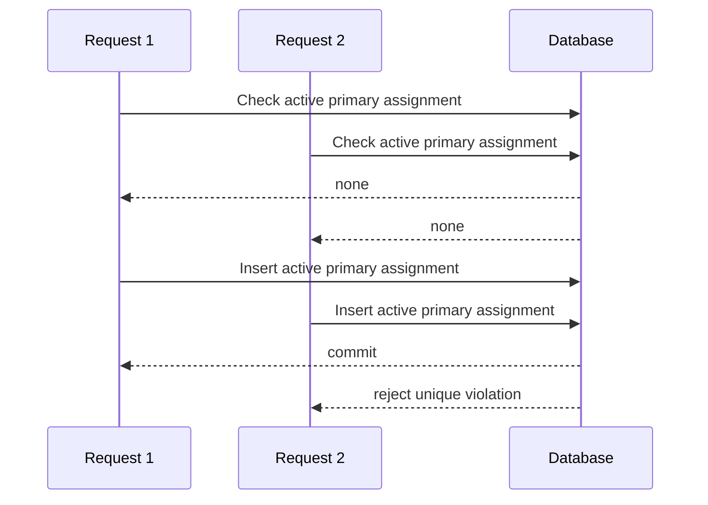

# Part 008 — Invariants-First Database Design

Most bad database designs do not fail because the team forgot tables.

They fail because the team forgot what must **never** be allowed to happen.

That is what an invariant is.

An invariant is a rule that must remain true across valid system states.

Examples:

- A case cannot have two active primary officers.
- A closed case cannot receive new allegations unless reopened.
- A payment ledger entry cannot be edited after posting.
- A username must be unique within a tenant.
- A child record cannot point to a non-existing parent.
- An assignment end time cannot be earlier than its start time.
- A regulatory decision must reference the officer who approved it.
- A retention-protected record cannot be physically deleted before its retention date.

An invariants-first design asks this before table shape:

> What illegal states must this database make impossible, difficult, detectable, or recoverable?

That question is the difference between database design and table drawing.

---

## 1. The Core Mental Model

Application code produces commands.

The database preserves state.

If the database preserves invalid state, the system is already compromised even if the UI looked correct.



Application validation is useful. Database enforcement is final.

The rule is simple:

> If a rule protects the integrity of stored state, prefer enforcing it as close to the database as practical.

Not every rule can be enforced by the database. But every important rule needs an explicit enforcement location.

---

## 2. What Is an Invariant?

An invariant is not just a validation rule.

A validation rule checks an input.

An invariant protects a state.

Example:

```txt
Validation:
  amount must be positive in this request

Invariant:
  posted ledger entries are append-only and total balance is derived from immutable entries
```

Validation can be bypassed by:

- another API,
- background job,
- migration script,
- admin panel,
- race condition,
- direct database fix,
- replayed event,
- integration process.

Invariants must survive those paths.

---

## 3. Invariant Taxonomy

A mature database design classifies invariants.

| Invariant Type | Meaning | Example | Common Enforcement |
|---|---|---|---|
| Type invariant | Value must belong to a domain | amount is numeric, state is known enum | column type, check constraint, domain type |
| Required invariant | Fact must exist | case opened_at is required | NOT NULL |
| Identity invariant | Entity has stable identity | case_id unique | primary key |
| Uniqueness invariant | Business uniqueness | case number unique per jurisdiction | unique constraint/index |
| Referential invariant | Relationship must be valid | allegation belongs to existing case | foreign key |
| Cardinality invariant | Count/relationship limit | one active primary assignment | unique partial index, trigger, transaction logic |
| Temporal invariant | Time relationship must be valid | ended_at > started_at | check constraint, exclusion constraint, application logic |
| State invariant | Lifecycle transition must be legal | closed cannot become draft | transition table, trigger, app workflow guard |
| Aggregate invariant | Rule over multiple rows | invoice total equals line sum | transaction logic, derived validation, trigger |
| Authorization invariant | Actor must be allowed | only reviewer approves decision | app/service policy, RLS, stored procedure |
| Retention invariant | Data cannot be removed early | legal hold prevents purge | policy table, deletion guard, job logic |
| Audit invariant | Change must be traceable | decision correction requires reason | append-only log, trigger, command metadata |

The point is not to force everything into SQL constraints. The point is to know what kind of rule you are dealing with.

---

## 4. Invariant Strength Levels

Not every invariant gets the same enforcement strength.

Use four levels.

### Level 1 — Documented

The rule exists in a design doc or code comment.

This is the weakest level.

Use only for low-risk rules or early discovery.

### Level 2 — Validated

The application checks the rule before writing.

Good for user experience. Not enough for core integrity.

### Level 3 — Enforced

The database rejects invalid state.

Examples:

- `NOT NULL`
- `PRIMARY KEY`
- `UNIQUE`
- `FOREIGN KEY`
- `CHECK`
- exclusion constraint
- generated column rule
- trigger

### Level 4 — Proven / Continuously Verified

The system continuously verifies the rule through tests, reconciliation, monitoring, or formal checks.

Examples:

- migration validation queries,
- nightly consistency checks,
- invariant test suite,
- property-based tests,
- reconciliation reports,
- alert on impossible state count > 0.



For critical systems, Level 2 is not enough.

---

## 5. Why App-Only Validation Fails

App-only validation feels clean because business logic stays in application code.

But databases have multiple write paths.



If the only guard lives in the Web API, every other path can violate the rule.

Even if there is only one application today, future systems will appear:

- reporting imports,
- repair tools,
- integrations,
- backfills,
- data migration jobs,
- operational scripts.

A database architect designs for the full write surface, not just the happy-path API.

---

## 6. Database Constraint Toolkit

Relational databases provide a powerful constraint vocabulary.

PostgreSQL, for example, documents common constraint categories such as check constraints, not-null constraints, unique constraints, primary keys, foreign keys, and exclusion constraints. A primary key is both unique and not null, which matters because identity is not optional.

### 6.1 NOT NULL

Use for facts that must exist for the entity to be valid.

```sql
CREATE TABLE regulatory_case (
    case_id uuid PRIMARY KEY,
    opened_at timestamptz NOT NULL,
    current_state text NOT NULL
);
```

Avoid nullable-by-default design.

A nullable column means at least one of these is true:

- the fact is genuinely optional,
- the fact is unknown at creation time,
- the fact is not applicable for some subtype,
- the model is mixing multiple concepts,
- the migration is incomplete,
- the team did not decide.

Only the first three are healthy long-term reasons.

### 6.2 CHECK Constraint

Use for local row-level rules.

```sql
CREATE TABLE case_assignment (
    case_assignment_id uuid PRIMARY KEY,
    assigned_at timestamptz NOT NULL,
    ended_at timestamptz,
    CHECK (ended_at IS NULL OR ended_at > assigned_at)
);
```

Good fit:

- numeric ranges,
- timestamp ordering inside one row,
- allowed values,
- simple boolean implications.

Weak fit:

- rules requiring other rows,
- rules requiring external service state,
- complex lifecycle transitions.

### 6.3 UNIQUE Constraint

Use for business uniqueness.

```sql
CREATE TABLE regulatory_case (
    case_id uuid PRIMARY KEY,
    jurisdiction_code text NOT NULL,
    case_number text NOT NULL,
    UNIQUE (jurisdiction_code, case_number)
);
```

Do not confuse primary key with business uniqueness.

`case_id` may identify the row technically, but `(jurisdiction_code, case_number)` may identify the case operationally.

Both can matter.

### 6.4 FOREIGN KEY

Use when a relationship must reference an existing parent.

```sql
CREATE TABLE allegation (
    allegation_id uuid PRIMARY KEY,
    case_id uuid NOT NULL REFERENCES regulatory_case(case_id),
    allegation_text text NOT NULL
);
```

Foreign keys encode referential truth.

Without them, invalid references become possible unless every write path is perfectly controlled.

### 6.5 Partial Unique Index

Use for conditional uniqueness.

```sql
CREATE UNIQUE INDEX uq_case_active_primary_assignment
ON case_assignment(case_id)
WHERE assignment_role = 'PRIMARY' AND ended_at IS NULL;
```

This enforces:

> A case may have at most one active primary assignment.

This is a common pattern for temporal/current-state rules.

### 6.6 Exclusion Constraint

In PostgreSQL, exclusion constraints can prevent overlapping values according to operators. They are especially useful for time-range conflicts.

Conceptual rule:

> An officer cannot have overlapping exclusive duty assignments.

Physical direction:

```sql
-- Simplified illustration; real implementation requires appropriate range/index support.
ALTER TABLE officer_duty
ADD CONSTRAINT no_overlapping_exclusive_duty
EXCLUDE USING gist (
    officer_id WITH =,
    duty_period WITH &&
)
WHERE (exclusive = true);
```

This is a high-leverage feature for temporal integrity.

### 6.7 Trigger

Use triggers carefully.

They can enforce cross-row or audit behavior, but they also introduce hidden write-side behavior.

Good trigger uses:

- append audit record,
- maintain immutable history,
- enforce complex local database invariant,
- prevent unsafe update/delete.

Bad trigger uses:

- business workflow orchestration,
- external API calls,
- surprising side effects,
- complex branching logic nobody tests.

A trigger should be boring, deterministic, and documented.

---

## 7. Invariant Discovery Method

Use this method during design review.

### Step 1 — Name the Entity

Example:

```txt
CaseAssignment
```

### Step 2 — Name the Illegal States

Do not start with rules. Start with illegal states.

```txt
Illegal states:
- assignment without case
- assignment without officer
- ended assignment with ended_at before assigned_at
- two active primary assignments for same case
- assignment to inactive officer for new assignment
- assignment ended without reason
```

This is concrete.

### Step 3 — Classify the Illegal States

| Illegal State | Type |
|---|---|
| assignment without case | referential |
| assignment without officer | referential |
| ended_at before assigned_at | temporal row-level |
| two active primary assignments | conditional cardinality |
| assignment to inactive officer | state/reference rule |
| assignment ended without reason | conditional required fact |

### Step 4 — Pick Enforcement Location

| Illegal State | Enforcement |
|---|---|
| assignment without case | foreign key |
| assignment without officer | foreign key |
| ended_at before assigned_at | check constraint |
| two active primary assignments | partial unique index |
| assignment to inactive officer | application transaction or trigger depending risk |
| assignment ended without reason | check constraint |

### Step 5 — Add Verification

Verification examples:

```sql
-- Should always return zero rows.
SELECT case_id, count(*)
FROM case_assignment
WHERE assignment_role = 'PRIMARY'
  AND ended_at IS NULL
GROUP BY case_id
HAVING count(*) > 1;
```

A powerful design review question:

> What query would prove this invariant is currently violated?

If nobody can write the query, the invariant is not understood.

---

## 8. Invariant Register

For production-grade systems, maintain an invariant register.

```md
# Invariant Register

## INV-CASE-001 — Unique case number per jurisdiction

Meaning:
A case number identifies at most one case inside a jurisdiction.

Illegal state:
Two cases with the same jurisdiction_code and case_number.

Severity:
Critical. Causes legal/reporting ambiguity.

Enforcement:
Database unique constraint on (jurisdiction_code, case_number).

Validation:
Application validates before insert for better error message.

Verification:
Daily invariant query returns zero duplicate groups.

Failure response:
Block write. If legacy data violates this, quarantine duplicate rows and run resolution process.
```

This may feel heavy. For high-risk data, it saves systems.

---

## 9. Invariants and Transactions

Many invariants only make sense inside a transaction.

Example:

> Reassign case from Officer A to Officer B.

Bad implementation:

```sql
UPDATE case_assignment
SET ended_at = now()
WHERE case_id = :case_id
  AND assignment_role = 'PRIMARY'
  AND ended_at IS NULL;

-- later, maybe in another transaction
INSERT INTO case_assignment(...);
```

Between those two operations, the case has no primary officer.

That may or may not be legal.

Better implementation:

```sql
BEGIN;

UPDATE case_assignment
SET ended_at = :now,
    end_reason = 'REASSIGNED'
WHERE case_id = :case_id
  AND assignment_role = 'PRIMARY'
  AND ended_at IS NULL;

INSERT INTO case_assignment(
    case_assignment_id,
    case_id,
    officer_id,
    assignment_role,
    assigned_at,
    assigned_by,
    reason
) VALUES (
    :id,
    :case_id,
    :new_officer_id,
    'PRIMARY',
    :now,
    :actor_id,
    :reason
);

COMMIT;
```

The transaction boundary is part of the invariant design.

### 9.1 Transaction Questions

For every invariant, ask:

- Which rows must change atomically?
- Which reads must be consistent?
- Could concurrent commands violate the rule?
- Does the database constraint catch the race?
- Is retry safe?
- Is the command idempotent?

This connects invariant design to concurrency control.

---

## 10. Invariants and Concurrency

The dangerous case is not a single request.

The dangerous case is two valid requests that combine into invalid state.

Example:

Two users assign a primary officer to the same case at the same time.

Both check:

```sql
SELECT count(*)
FROM case_assignment
WHERE case_id = :case_id
  AND assignment_role = 'PRIMARY'
  AND ended_at IS NULL;
```

Both see zero.

Both insert.

Without a database constraint, invalid state is committed.

With a partial unique index, one succeeds and one fails.

That is why app validation alone is insufficient.



The database is the last line of defense against races.

---

## 11. State Machine Invariants

A state machine is a set of legal states and legal transitions.

Weak design:

```sql
current_state text NOT NULL
```

Better design:

```sql
current_state text NOT NULL CHECK (
    current_state IN ('DRAFT', 'OPEN', 'UNDER_REVIEW', 'DECISION_PENDING', 'CLOSED')
)
```

But allowed values are not enough.

You also need legal transitions.

```txt
DRAFT -> OPEN
OPEN -> UNDER_REVIEW
UNDER_REVIEW -> DECISION_PENDING
DECISION_PENDING -> CLOSED
CLOSED -> OPEN only through REOPEN command
```

Transition enforcement may live in application workflow logic, a transition table, a stored procedure, or a workflow engine.

Database design should still preserve transition history.

```sql
CREATE TABLE case_state_transition (
    transition_id uuid PRIMARY KEY,
    case_id uuid NOT NULL REFERENCES regulatory_case(case_id),
    from_state text NOT NULL,
    to_state text NOT NULL,
    changed_at timestamptz NOT NULL,
    changed_by uuid NOT NULL,
    reason text NOT NULL
);
```

The invariant is not only:

> current_state has allowed value.

The invariant is:

> current_state is the result of a legal, auditable transition history.

That is a much stronger model.

---

## 12. Temporal Invariants

Temporal invariants govern time-related truth.

Examples:

- `ended_at > started_at`
- assignment periods cannot overlap,
- a decision cannot be approved before it is drafted,
- evidence cannot be verified before it is received,
- SLA due date must be based on opened date and policy version,
- retention purge date must be after closure date plus retention period.

### 12.1 Avoid Ambiguous Timestamps

Bad:

```sql
created_date timestamp
updated_date timestamp
```

Better:

```sql
received_at timestamptz NOT NULL
opened_at timestamptz
closed_at timestamptz
last_modified_at timestamptz NOT NULL
```

Each timestamp has meaning.

### 12.2 Time Invariant Examples

```sql
CHECK (closed_at IS NULL OR closed_at >= opened_at)
```

```sql
CHECK (verified_at IS NULL OR received_at IS NOT NULL)
```

```sql
CHECK (retention_until IS NULL OR closed_at IS NOT NULL)
```

These small constraints prevent nonsense data.

---

## 13. Derived Data Invariants

Derived data creates another class of risk.

Example:

```txt
case.open_allegation_count
```

This value is derived from allegation rows.

Invariant:

> case.open_allegation_count equals the number of non-closed allegations for that case.

Options:

1. Do not store it. Compute on read.
2. Store it and maintain transactionally.
3. Store it asynchronously as a projection.
4. Store it in a reporting model with reconciliation.

Each option has a different invariant strength.

| Option | Consistency | Cost |
|---|---|---|
| Compute on read | Strong relative to current data | Query cost |
| Transactional counter | Strong if all writes update counter correctly | Write complexity |
| Async projection | Eventually consistent | Staleness and replay complexity |
| Reporting copy | Depends on ETL/ELT | Reconciliation required |

Do not store derived data unless you also design its correction path.

---

## 14. Invariants and Nullability

Null is not bad. Unexplained null is bad.

A nullable column should have a reason.

Valid reasons:

- unknown yet,
- not applicable,
- intentionally optional,
- populated in later lifecycle phase,
- legacy migration in progress.

Dangerous reasons:

- “just in case”,
- “faster to ship”,
- “we will clean it later”,
- “ORM generated it”,
- “frontend may not send it”.

### 14.1 Conditional Required Facts

Some facts are required only in certain states.

Example:

```sql
CHECK (
    current_state <> 'CLOSED'
    OR closed_at IS NOT NULL
)
```

```sql
CHECK (
    ended_at IS NULL
    OR end_reason IS NOT NULL
)
```

These constraints encode lifecycle meaning.

---

## 15. Invariant Placement: Database vs Application

Not every invariant belongs fully in the database.

Use this decision matrix.

| Rule | Prefer Database | Prefer Application/Service |
|---|---|---|
| Required field | yes | also for UX |
| Unique identity | yes | also for UX |
| Referential integrity | yes | sometimes no for distributed boundaries |
| Simple value range | yes | also for UX |
| Cross-row uniqueness | yes if local | service if distributed across stores |
| Complex authorization | rarely alone | yes |
| External system check | no | yes |
| Long-running workflow transition | partially | yes |
| Retention purge eligibility | partially | yes with job policy |
| Derived projection correctness | verify in DB/query | pipeline/service |

A good rule:

> Put simple, local, durable invariants in the database. Put contextual, cross-system, actor-specific rules in the application, but record enough data to audit them.

---

## 16. Invariants Across Service Boundaries

Foreign keys are powerful inside one database boundary.

Across service boundaries, they may not exist.

Example:

```txt
Case Management service references Officer Directory service.
```

The case database may store:

```txt
officer_id
assigned_officer_display_name_snapshot
assigned_officer_unit_snapshot
```

Invariant options:

- validate officer exists during assignment command,
- cache officer reference data locally,
- store snapshot for historical reporting,
- reconcile references periodically,
- tolerate inactive historical officer references.

Do not pretend a cross-service reference has the same guarantees as a local foreign key.

Distributed references are weaker unless explicitly reconciled.

---

## 17. Invariants and Migration

Migrations often violate invariants temporarily.

Example:

- add `closed_at NOT NULL` to existing closed cases,
- backfill values,
- enforce constraint after data is clean.

Safe pattern:

```txt
1. Add nullable column.
2. Backfill in batches.
3. Validate data completeness.
4. Add constraint as NOT VALID if supported/appropriate.
5. Validate constraint.
6. Switch application behavior.
7. Remove compatibility path.
```

In PostgreSQL, constraint validation and table alteration behavior matter operationally, so physical migration strategy must be planned with actual engine behavior.

### 17.1 Migration Invariant Checklist

Before adding a constraint:

- Does existing data satisfy it?
- How many rows violate it?
- Can violations be repaired safely?
- Does adding the constraint lock the table?
- Is there a low-traffic deployment window?
- Can the migration be rolled back?
- Can the application tolerate both old and new schema during rollout?
- Is there an invariant query to prove success?

---

## 18. Invariant Monitoring

Some invariants should be monitored even if enforced.

Why?

Because violations can still enter through:

- disabled constraints,
- legacy imports,
- emergency patches,
- replication bugs,
- manual restore,
- software defects,
- partially completed migrations.

Example invariant monitor:

```sql
SELECT count(*) AS invalid_closed_cases
FROM regulatory_case
WHERE current_state = 'CLOSED'
  AND closed_at IS NULL;
```

Operational rule:

```txt
invalid_closed_cases must always be 0
```

If not, page or create a high-priority data repair incident depending severity.

---

## 19. Invariant-First Schema Review

Use this review format.

```md
# Invariant-First Schema Review

## Entity
What entity or relationship is being introduced/changed?

## Invariants
List rules that must always hold.

## Illegal States
List concrete invalid states.

## Enforcement
For each illegal state, define database/app/workflow/reconciliation enforcement.

## Concurrency
Could two valid concurrent commands produce invalid state?

## Migration
Does existing data satisfy the new invariants?

## Monitoring
What query proves the invariant still holds?

## Failure Handling
What happens when enforcement rejects a write?
```

Do not approve schema changes that cannot answer these questions for critical entities.

---

## 20. Worked Example: Evidence Verification

Business rule:

> Evidence can be uploaded, verified, rejected, or withdrawn. Verified evidence must have verifier, verification timestamp, and verification method. Rejected evidence must have rejection reason.

### 20.1 Illegal States

```txt
- evidence without case
- evidence with unknown status
- verified evidence without verifier
- verified evidence without verified_at
- rejected evidence without rejection reason
- withdrawn evidence still marked verified
```

### 20.2 Physical Sketch

```sql
CREATE TABLE evidence (
    evidence_id uuid PRIMARY KEY,
    case_id uuid NOT NULL REFERENCES regulatory_case(case_id),
    evidence_status text NOT NULL CHECK (
        evidence_status IN ('UPLOADED', 'VERIFIED', 'REJECTED', 'WITHDRAWN')
    ),
    uploaded_at timestamptz NOT NULL,
    uploaded_by uuid NOT NULL,
    verified_at timestamptz,
    verified_by uuid,
    verification_method text,
    rejection_reason text,
    CHECK (
        evidence_status <> 'VERIFIED'
        OR (
            verified_at IS NOT NULL
            AND verified_by IS NOT NULL
            AND verification_method IS NOT NULL
        )
    ),
    CHECK (
        evidence_status <> 'REJECTED'
        OR rejection_reason IS NOT NULL
    ),
    CHECK (
        verified_at IS NULL OR verified_at >= uploaded_at
    )
);
```

### 20.3 Remaining Rules

The database can enforce local shape.

Application/workflow still needs to enforce:

- only authorized verifier can verify,
- verifier cannot verify own upload if policy forbids it,
- status transition must be legal,
- verification method must match evidence type,
- withdrawn evidence cannot be used in decision.

Invariant-first design does not eliminate application logic. It clarifies what the database can and should reject.

---

## 21. Common Invariant Design Smells

### 21.1 “The App Handles It”

This is acceptable only when:

- all write paths go through the app,
- concurrency is safe,
- tests cover it,
- repair/monitoring exists,
- risk is low enough.

Otherwise it is wishful thinking.

### 21.2 Nullable Everything

Nullable everything means the database does not know what valid state means.

### 21.3 One Status to Rule Them All

A single status column often tries to encode lifecycle, workflow, review, sync, and visibility.

Separate independent state dimensions.

### 21.4 Derived Data Without Reconciliation

A cached count, total, or summary without reconciliation is silent corruption waiting to happen.

### 21.5 No Unique Business Key

A surrogate primary key alone does not prevent duplicate business facts.

### 21.6 Foreign Keys Disabled for Convenience

Sometimes foreign keys are deliberately avoided for high-scale or cross-boundary reasons. That is an architectural decision.

Avoiding them because tests fail or imports are messy is not architecture. It is debt.

---

## 22. Production-Grade Takeaways

1. Design from illegal states, not from columns.
2. Validation protects input; invariants protect stored state.
3. Database constraints are not optional decoration. They are executable truth.
4. App-only validation fails under concurrency and multiple write paths.
5. Every critical invariant needs an enforcement location.
6. Every critical invariant needs a violation query.
7. Transactions are part of invariant design.
8. Nullability must be explained by lifecycle or meaning.
9. Derived data needs reconciliation.
10. A schema review without invariant review is incomplete.

---

## 23. References

- PostgreSQL Documentation — Constraints: https://www.postgresql.org/docs/current/ddl-constraints.html
- PostgreSQL Documentation — ALTER TABLE: https://www.postgresql.org/docs/current/sql-altertable.html
- PostgreSQL Documentation — Data Definition: https://www.postgresql.org/docs/current/ddl.html
- AWS Prescriptive Guidance — Database Migration Strategy: https://docs.aws.amazon.com/prescriptive-guidance/latest/strategy-database-migration/welcome.html
- AWS Prescriptive Guidance — CI/CD Pipeline for Database Migration: https://docs.aws.amazon.com/prescriptive-guidance/latest/patterns/set-up-ci-cd-pipeline-for-db-migration-with-terraform.html
