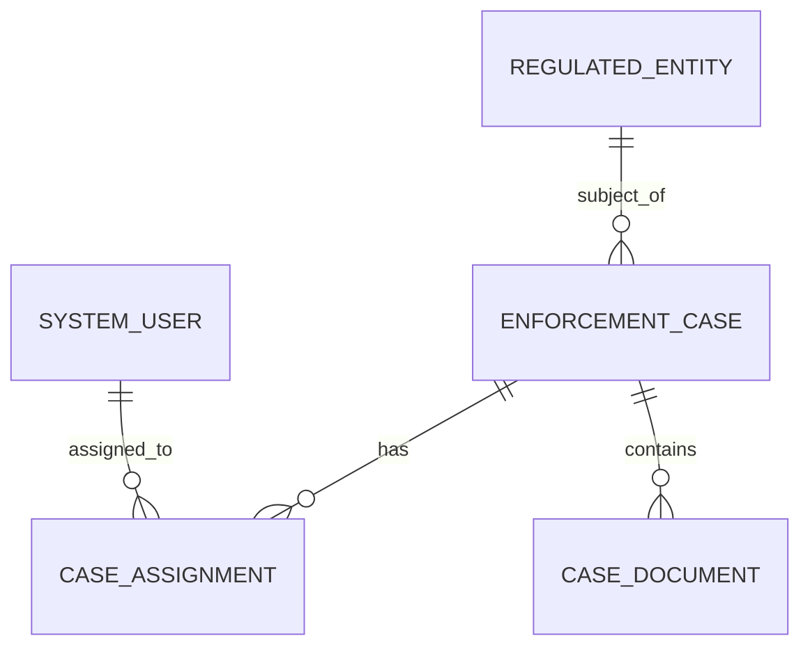
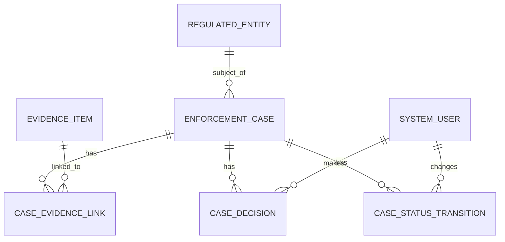

# Part 009 — Relational Model Deep Dive

Relational database design is often taught as table drawing. That is too shallow.

A top-level engineer does not see a relational database as “tables with columns”. They see it as a **machine for preserving declared facts under constraints while allowing safe derivation through queries**.

This part builds that mental model.

We will focus on the relational model itself: relation, tuple, attribute, domain, predicate, key, foreign key, integrity constraint, algebraic operation, and how SQL approximates the formal model in real systems.

The goal is not to memorize relational theory. The goal is to design schemas where the database shape reflects the truth of the business domain and rejects bad states before they become production incidents.

---

## 1. The Core Mental Model

A relational database stores **facts**.

A table is not merely a spreadsheet. A table represents a **predicate**: a statement template that becomes true when a row exists.

For example:

```sql
CREATE TABLE enforcement_case (
    case_id          uuid PRIMARY KEY,
    case_number      text NOT NULL UNIQUE,
    subject_id       uuid NOT NULL,
    opened_at        timestamptz NOT NULL,
    current_status   text NOT NULL
);
```

A row in this table means:

> There exists an enforcement case with this identity, this public case number, this subject, this opening time, and this current status.

That is the predicate interpretation.

Once you think this way, schema design changes:

- a row is an assertion
- a column is part of the assertion
- a constraint is a rule about which assertions are valid
- a foreign key says one assertion depends on another assertion
- a query derives new facts from existing facts
- a transaction changes a consistent set of facts into another consistent set of facts

The relational model gives you a controlled way to represent reality.

---

## 2. Relation vs Table

In formal relational theory, a **relation** is a set of tuples over named attributes.

In SQL, a **table** is the implementation-oriented structure that approximates a relation.

They are close, but not identical.

| Concept | Relational Model | SQL Implementation |
|---|---|---|
| Relation | Set of tuples | Table, usually bag-like in query results |
| Tuple | Unordered record of attribute values | Row |
| Attribute | Named value slot | Column |
| Domain | Set of valid values | Data type plus constraints |
| Candidate key | Minimal unique identifier | Unique constraint candidate |
| Primary key | Chosen identifier | `PRIMARY KEY` constraint |
| Null | Not part of the original clean model | SQL `NULL`, three-valued logic |
| Duplicate tuple | Not allowed in pure relation | Possible in query result unless constrained/distinct |

This distinction matters because SQL lets you create structures that are legal SQL but weak relational design.

Example of weak design:

```sql
CREATE TABLE case_note_bad (
    case_number text,
    note_text   text,
    author_name text,
    created_at  timestamptz
);
```

This table has no declared identity, no declared reference to the case, and no way to distinguish two identical notes. It behaves like a spreadsheet dump.

A better relational form:

```sql
CREATE TABLE case_note (
    note_id     uuid PRIMARY KEY,
    case_id     uuid NOT NULL REFERENCES enforcement_case(case_id),
    author_id   uuid NOT NULL REFERENCES system_user(user_id),
    note_text   text NOT NULL,
    created_at  timestamptz NOT NULL,
    CHECK (length(trim(note_text)) > 0)
);
```

This table states facts with identity, ownership, references, and validity.

---

## 3. The Predicate Interpretation of Tables

A powerful design practice:

> For every table, write the sentence that a row means.

Example:

```sql
CREATE TABLE case_assignment (
    assignment_id uuid PRIMARY KEY,
    case_id       uuid NOT NULL REFERENCES enforcement_case(case_id),
    assignee_id   uuid NOT NULL REFERENCES system_user(user_id),
    assigned_at   timestamptz NOT NULL,
    unassigned_at timestamptz,
    CHECK (unassigned_at IS NULL OR unassigned_at > assigned_at)
);
```

Predicate:

> User `assignee_id` was assigned to case `case_id` starting at `assigned_at`, and optionally stopped being assigned at `unassigned_at`.

This reveals several design questions:

1. Can a case have more than one active assignee?
2. Can the same user be assigned twice to the same case at overlapping periods?
3. Is assignment history required?
4. Is the current assignee derived from assignment history or stored on the case?
5. What happens when a user leaves the organization?

The predicate forces hidden business rules into the open.

Bad table names often expose weak predicates:

| Weak Table Name | Problem | Better Framing |
|---|---|---|
| `case_data` | vague bucket | `enforcement_case` |
| `case_info` | no fact boundary | split into case, subject, assignment, status history |
| `mapping` | relationship unclear | `case_evidence_link`, `user_role_grant` |
| `status_table` | ambiguous meaning | `case_status_transition` or `case_current_status` |
| `misc` | design failure | explicit fact tables |

A table should not be a storage bucket. It should be a fact type.

---

## 4. Relation Components

### 4.1 Attribute

An attribute is a named component of a fact.

In SQL, it becomes a column:

```sql
opened_at timestamptz NOT NULL
```

Good attribute design asks:

- What does this value mean?
- Is it required?
- Who supplies it?
- Can it change?
- Is it raw input or derived output?
- Is it authoritative or copied?
- What values are illegal?
- Does the type encode enough meaning?

Bad:

```sql
status text
```

Better:

```sql
current_status case_status NOT NULL
```

Or, if lifecycle and audit matter:

```sql
CREATE TABLE case_status_transition (
    transition_id uuid PRIMARY KEY,
    case_id       uuid NOT NULL REFERENCES enforcement_case(case_id),
    from_status   text,
    to_status     text NOT NULL,
    changed_at    timestamptz NOT NULL,
    changed_by    uuid NOT NULL REFERENCES system_user(user_id),
    reason        text NOT NULL
);
```

An attribute is not just a field. It is part of the truth contract.

---

### 4.2 Domain

A domain is the set of valid values for an attribute.

In SQL, the domain is usually approximated by:

- data type
- `NOT NULL`
- `CHECK`
- `UNIQUE`
- foreign key
- custom domain type
- enum type
- application validation
- reference table

Example:

```sql
CREATE DOMAIN positive_amount AS numeric(18, 2)
CHECK (VALUE > 0);
```

Usage:

```sql
CREATE TABLE penalty_order (
    order_id uuid PRIMARY KEY,
    case_id  uuid NOT NULL REFERENCES enforcement_case(case_id),
    amount   positive_amount NOT NULL,
    currency char(3) NOT NULL
);
```

This is stronger than repeating `numeric(18,2)` everywhere without meaning.

Domain design is where many production bugs are prevented.

Weak domain examples:

```sql
amount text
created_at text
is_active text
metadata jsonb
```

Stronger domain examples:

```sql
amount numeric(18, 2) CHECK (amount >= 0)
created_at timestamptz NOT NULL
is_active boolean NOT NULL
metadata jsonb NOT NULL CHECK (jsonb_typeof(metadata) = 'object')
```

The more precise the domain, the smaller the illegal-state space.

---

### 4.3 Tuple

A tuple is one fact instance.

In SQL, it is a row.

A row should usually be:

- identifiable
- meaningful
- internally consistent
- constrained
- connected to its parent facts
- explainable as a sentence

Weak row:

```text
case_id = null, status = 'APPROVED', reason = null, date = 'yesterday'
```

Strong row:

```text
case_id = 7a1..., to_status = 'APPROVED', changed_at = 2026-07-04T10:15:00+07, changed_by = user 42, reason = 'Supervisor review completed'
```

A good row should be able to survive review by another engineer, auditor, or future maintainer.

---

## 5. Keys: Identity as a First-Class Design Problem

A key is not just an index.

A key answers:

> How do we know this fact is this fact and not another fact?

There are several key concepts.

| Key Type | Meaning |
|---|---|
| Superkey | Any set of attributes that uniquely identifies a row |
| Candidate key | Minimal superkey |
| Primary key | Candidate key chosen as the main row identifier |
| Alternate key | Candidate key not chosen as primary |
| Natural key | Key from the business domain |
| Surrogate key | Artificial key generated by the system |
| Composite key | Key using multiple attributes |
| Foreign key | Reference to a candidate/primary key in another table |

Example:

```sql
CREATE TABLE regulated_entity (
    entity_id          uuid PRIMARY KEY,
    registration_no    text NOT NULL UNIQUE,
    legal_name         text NOT NULL,
    created_at         timestamptz NOT NULL
);
```

Here:

- `entity_id` is the surrogate primary key
- `registration_no` is a natural alternate key
- both are identity-related, but they serve different purposes

A top-level engineer does not blindly choose UUIDs or sequences. They ask:

- Is this key stable over time?
- Is it externally visible?
- Can it be reused by the issuing authority?
- Can it change due to correction?
- Is it tenant-scoped?
- Does it leak information?
- Does it create index locality problems?
- Does it support idempotency?

Part 012 will go deeper into key design. For now, the important relational lesson is this:

> Every table representing durable facts needs an explicit identity strategy.

---

## 6. Foreign Keys: Relationship as Integrity, Not Documentation

A foreign key is a database-enforced relationship.

Example:

```sql
CREATE TABLE enforcement_case (
    case_id    uuid PRIMARY KEY,
    subject_id uuid NOT NULL REFERENCES regulated_entity(entity_id),
    opened_at  timestamptz NOT NULL
);
```

This says:

> A case cannot reference a non-existent regulated entity.

Without the foreign key, the column is only a convention.

Weak design:

```sql
subject_id uuid NOT NULL
```

Better design:

```sql
subject_id uuid NOT NULL REFERENCES regulated_entity(entity_id)
```

The difference is operationally huge. The first version allows orphan rows. The second version rejects invalid facts.

Foreign keys also force hard design decisions:

| Question | Why It Matters |
|---|---|
| Can parent be deleted? | Determines `ON DELETE` behavior |
| Can parent identity change? | Determines `ON UPDATE` behavior |
| Is child existence dependent on parent? | Determines lifecycle boundary |
| Is relationship mandatory? | Determines nullability |
| Is reference local or cross-service? | Determines enforceability |

Example with explicit delete behavior:

```sql
CREATE TABLE case_document (
    document_id uuid PRIMARY KEY,
    case_id     uuid NOT NULL REFERENCES enforcement_case(case_id) ON DELETE RESTRICT,
    file_name   text NOT NULL,
    uploaded_at timestamptz NOT NULL
);
```

`ON DELETE RESTRICT` communicates that a case with documents must not be silently deleted.

For regulatory systems, this is usually safer than cascading deletion.

---

## 7. Relationship Types in Relational Design

### 7.1 One-to-One

One-to-one usually means one of four things:

1. optional extension data
2. security separation
3. lifecycle separation
4. premature table splitting

Example:

```sql
CREATE TABLE case_confidential_detail (
    case_id              uuid PRIMARY KEY REFERENCES enforcement_case(case_id),
    protected_summary    text NOT NULL,
    access_classification text NOT NULL
);
```

The primary key is also the foreign key. This enforces one confidential detail row per case.

Use one-to-one when the split has meaning.

Do not use it just because a table has “too many columns”.

---

### 7.2 One-to-Many

One parent, many children.

```sql
CREATE TABLE case_event (
    event_id    uuid PRIMARY KEY,
    case_id     uuid NOT NULL REFERENCES enforcement_case(case_id),
    event_type  text NOT NULL,
    occurred_at timestamptz NOT NULL,
    payload     jsonb NOT NULL
);
```

Predicate:

> Event `event_id` occurred for case `case_id` at time `occurred_at`.

Design questions:

- Is the child meaningful without the parent?
- Should children be ordered?
- Can children be corrected?
- Are children append-only?
- Are children used to derive current state?

---

### 7.3 Many-to-Many

Many-to-many is represented through an associative relation.

Weak design:

```sql
CREATE TABLE case_evidence_bad (
    case_id uuid,
    evidence_ids uuid[]
);
```

Better:

```sql
CREATE TABLE case_evidence_link (
    case_id     uuid NOT NULL REFERENCES enforcement_case(case_id),
    evidence_id uuid NOT NULL REFERENCES evidence_item(evidence_id),
    linked_at   timestamptz NOT NULL,
    linked_by   uuid NOT NULL REFERENCES system_user(user_id),
    reason      text NOT NULL,
    PRIMARY KEY (case_id, evidence_id)
);
```

The join table is not a technical annoyance. It is often a real business fact.

Predicate:

> Evidence item `evidence_id` was linked to case `case_id` for reason `reason` at time `linked_at` by user `linked_by`.

Once the relationship has attributes, it is clearly an entity-like fact.

---

## 8. Constraints as Relational Integrity

Relational design is incomplete without constraints.

Common constraint types:

| Constraint | Protects |
|---|---|
| `NOT NULL` | Required fact component |
| `CHECK` | Domain rule |
| `UNIQUE` | Candidate key or uniqueness invariant |
| `PRIMARY KEY` | Main identity |
| `FOREIGN KEY` | Referential integrity |
| Exclusion constraint | Non-overlap or range conflict rule |

Example:

```sql
CREATE TABLE case_assignment (
    assignment_id uuid PRIMARY KEY,
    case_id       uuid NOT NULL REFERENCES enforcement_case(case_id),
    assignee_id   uuid NOT NULL REFERENCES system_user(user_id),
    assigned_at   timestamptz NOT NULL,
    unassigned_at timestamptz,
    CHECK (unassigned_at IS NULL OR unassigned_at > assigned_at)
);
```

This prevents a time interval from ending before it starts.

But it does not prevent overlapping assignments. That requires a stronger design.

Example in PostgreSQL-style range thinking:

```sql
-- Conceptual example. Exact implementation depends on chosen range type and extensions.
CREATE TABLE case_assignment_period (
    assignment_id uuid PRIMARY KEY,
    case_id       uuid NOT NULL REFERENCES enforcement_case(case_id),
    assignee_id   uuid NOT NULL REFERENCES system_user(user_id),
    active_period tstzrange NOT NULL
);
```

Then you can design an exclusion constraint to prevent overlap per case if the business rule says only one active assignee is allowed.

Relational design is not only table shape. It is **state-space restriction**.

---

## 9. Null: Useful, Dangerous, and Often Misused

SQL `NULL` means unknown, missing, not applicable, not yet assigned, hidden, or not collected — depending on how badly the schema was designed.

That ambiguity is dangerous.

Before allowing null, ask:

1. Is the value unknown?
2. Is the value not applicable?
3. Is the value not yet assigned?
4. Is the value intentionally redacted?
5. Is the value pending external input?
6. Is the value optional forever?

Those are different states.

Weak:

```sql
closed_at timestamptz NULL
```

This could mean:

- case is still open
- close time is unknown
- close time was not migrated
- case closure is not applicable
- case was closed but timestamp was lost

Better design often pairs nullability with explicit state:

```sql
current_status text NOT NULL,
closed_at timestamptz,
CHECK (
    (current_status <> 'CLOSED' AND closed_at IS NULL)
    OR
    (current_status = 'CLOSED' AND closed_at IS NOT NULL)
)
```

Even better, for history-heavy systems, derive closure from a status transition event.

The rule:

> Null is acceptable when its meaning is documented and constrained.

---

## 10. Relational Algebra as Query Mental Model

Relational algebra is the theoretical foundation behind relational query languages.

You do not need to write formal algebra every day, but you should understand the operations because they map directly to SQL query shape.

| Operation | Informal Meaning | SQL Approximation |
|---|---|---|
| Selection | Filter rows | `WHERE` |
| Projection | Select attributes | `SELECT column...` |
| Join | Combine related facts | `JOIN` |
| Union | Combine same-shaped relations | `UNION` |
| Difference | Rows in one relation but not another | `EXCEPT`, anti-join |
| Product | Pair every row with every row | `CROSS JOIN` |
| Rename | Rename relation/attribute | alias |

Example:

```sql
SELECT c.case_number, e.legal_name, c.opened_at
FROM enforcement_case c
JOIN regulated_entity e ON e.entity_id = c.subject_id
WHERE c.current_status = 'UNDER_INVESTIGATION';
```

Relationally:

1. select cases where status is under investigation
2. join cases to regulated entities
3. project the case number, legal name, and opened time

A query is a derivation pipeline.

This matters because performance problems often come from bad relational shape:

- filtering after exploding join cardinality
- joining on non-key attributes
- projecting too much data
- using outer joins to compensate for weak mandatory relationships
- aggregating over duplicated facts

Good relational modelling makes queries simpler and safer.

---

## 11. Join Semantics and Fact Composition

A join composes facts.

Example:

```sql
SELECT c.case_number, a.assigned_at, u.display_name
FROM enforcement_case c
JOIN case_assignment a ON a.case_id = c.case_id
JOIN system_user u ON u.user_id = a.assignee_id
WHERE a.unassigned_at IS NULL;
```

This derives:

> Current assignees for each case.

But the correctness depends on the schema.

If multiple active assignments are possible, the query may return multiple rows per case. That may be correct or a bug.

If the business rule says one active assignee per case, the schema should enforce it.

Do not rely on comments like:

```sql
-- assume only one active assignment
```

Design the invariant.

A query should not have to guess whether the data is valid.

---

## 12. Outer Joins Often Reveal Optionality Decisions

Outer joins are not bad. But frequent outer joins often indicate optionality or lifecycle complexity.

Example:

```sql
SELECT c.case_number, p.paid_at
FROM penalty_order o
JOIN enforcement_case c ON c.case_id = o.case_id
LEFT JOIN penalty_payment p ON p.order_id = o.order_id;
```

This says:

> An order may or may not have payment.

That may be valid.

But if every penalty order must eventually have exactly one payment or one waiver, the model needs to represent that lifecycle explicitly.

Possible design:

```sql
CREATE TABLE penalty_order_resolution (
    resolution_id   uuid PRIMARY KEY,
    order_id        uuid NOT NULL UNIQUE REFERENCES penalty_order(order_id),
    resolution_type text NOT NULL CHECK (resolution_type IN ('PAID', 'WAIVED', 'CANCELLED')),
    resolved_at     timestamptz NOT NULL,
    resolved_by     uuid NOT NULL REFERENCES system_user(user_id)
);
```

Now the absence of a resolution means unresolved, and the presence of one resolution means resolved.

Relational design should make absence meaningful, not accidental.

---

## 13. Dependency Direction

A foreign key encodes dependency direction.

Example:

```text
enforcement_case -> regulated_entity
case_assignment -> enforcement_case
case_assignment -> system_user
case_document -> enforcement_case
```

This can be diagrammed:



Architectural reading:

- regulated entity can exist without cases
- case depends on regulated entity
- assignment depends on case and user
- document depends on case

Foreign keys tell you lifecycle and deletion risks.

If deleting a regulated entity would break case history, then deletion should be restricted or represented as deactivation/redaction, not physical deletion.

---

## 14. Relational Model and Aggregate Boundaries

Relational model and domain aggregates are related but not identical.

An aggregate is a consistency boundary in application/domain design.

A relational schema is a fact model in persistent storage.

One aggregate may map to multiple tables:

```text
Case Aggregate
- enforcement_case
- case_status_transition
- case_assignment
- case_evidence_link
- case_note
```

But not every related table belongs inside the same aggregate.

For example:

```text
regulated_entity
system_user
evidence_item
```

may be referenced by case but owned elsewhere.

The relational model lets you reference facts across boundaries. The architecture must decide which updates are transactional together.

Important distinction:

| Concept | Question |
|---|---|
| Foreign key | Does this row reference an existing row? |
| Aggregate boundary | Must these rows change atomically? |
| Service boundary | Which component owns mutation? |
| Reporting model | Which facts are joined for read use cases? |

Do not confuse schema relationships with write ownership.

---

## 15. Table Design by Fact Type

A reliable schema can often be built by classifying fact types.

| Fact Type | Example | Typical Table Pattern |
|---|---|---|
| Core entity | Case, entity, account | identity + lifecycle columns |
| Event | Status changed, document uploaded | append-only event table |
| Relationship | Case assigned to user | associative table |
| Classification | Risk level, case type | reference table or enum |
| Measurement | Score, balance, amount | value + time + source |
| Decision | Approval, rejection, waiver | decision table with actor/reason |
| Snapshot | Daily balance, report result | period + value + generation metadata |
| Projection | Search/read model | derived table with rebuild path |

Example: decision as a first-class fact.

Weak:

```sql
ALTER TABLE enforcement_case ADD COLUMN approved_by uuid;
ALTER TABLE enforcement_case ADD COLUMN approved_at timestamptz;
ALTER TABLE enforcement_case ADD COLUMN rejection_reason text;
```

Better:

```sql
CREATE TABLE case_decision (
    decision_id   uuid PRIMARY KEY,
    case_id       uuid NOT NULL REFERENCES enforcement_case(case_id),
    decision_type text NOT NULL CHECK (decision_type IN ('APPROVE', 'REJECT', 'ESCALATE')),
    decided_at    timestamptz NOT NULL,
    decided_by    uuid NOT NULL REFERENCES system_user(user_id),
    reason        text NOT NULL
);
```

This supports multiple decisions, review history, audit, and future expansion.

---

## 16. Derived Facts vs Stored Facts

A derived fact is computed from other facts.

Example:

```text
case_age_days = now - opened_at
```

You usually do not store this permanently because it changes with time.

But some derived facts are stored for performance or historical reproducibility:

```sql
CREATE TABLE case_daily_snapshot (
    case_id       uuid NOT NULL REFERENCES enforcement_case(case_id),
    snapshot_date date NOT NULL,
    status        text NOT NULL,
    assignee_id   uuid,
    risk_score    numeric(8, 4),
    generated_at  timestamptz NOT NULL,
    PRIMARY KEY (case_id, snapshot_date)
);
```

This stores a derived snapshot.

Design rule:

> If a value is derived, record its source, refresh rule, and rebuild strategy.

Relational systems become fragile when derived data is stored without lineage.

---

## 17. SQL Is Not Pure Relational Algebra

SQL differs from the pure relational model in several important ways:

- SQL tables can contain duplicate rows if no key exists
- SQL uses `NULL` and three-valued logic
- SQL query results can be ordered
- SQL supports bags/multisets, not only sets
- SQL supports procedural and vendor-specific extensions
- SQL allows physical concerns such as indexes, partitions, storage parameters

This means you need two lenses:

1. **Logical relational lens** — what facts and constraints are valid?
2. **Physical SQL lens** — how does the engine store, plan, and execute this efficiently?

A common mistake is using only the physical lens:

> “This query is slow, so denormalize everything.”

Another mistake is using only the logical lens:

> “This schema is normalized, so performance will be fine.”

Top-level design uses both.

---

## 18. Relational Anti-Patterns

### 18.1 Table Without Key

```sql
CREATE TABLE imported_case (
    case_number text,
    status text,
    imported_at timestamptz
);
```

Problem:

- duplicate rows allowed
- update target unclear
- deduplication pushed to application
- no stable identity

Better:

```sql
CREATE TABLE imported_case (
    import_id    uuid PRIMARY KEY,
    source_name  text NOT NULL,
    case_number  text NOT NULL,
    status       text NOT NULL,
    imported_at  timestamptz NOT NULL,
    UNIQUE (source_name, case_number, imported_at)
);
```

---

### 18.2 Polymorphic Foreign Key

```sql
CREATE TABLE comment_bad (
    comment_id uuid PRIMARY KEY,
    target_type text NOT NULL,
    target_id uuid NOT NULL,
    body text NOT NULL
);
```

Problem:

- database cannot enforce `target_id`
- deletes create orphan comments
- joins become conditional and fragile

Possible alternatives:

1. separate comment tables per target type
2. supertype table for commentable objects
3. explicit association tables
4. application-enforced relation if cross-boundary reference is intentional

Example supertype:

```sql
CREATE TABLE comment_target (
    target_id uuid PRIMARY KEY,
    target_kind text NOT NULL
);

CREATE TABLE case_comment_target (
    target_id uuid PRIMARY KEY REFERENCES comment_target(target_id),
    case_id   uuid NOT NULL UNIQUE REFERENCES enforcement_case(case_id)
);

CREATE TABLE comment (
    comment_id uuid PRIMARY KEY,
    target_id  uuid NOT NULL REFERENCES comment_target(target_id),
    body       text NOT NULL,
    created_at timestamptz NOT NULL
);
```

This is heavier, but enforceable.

---

### 18.3 Entity-Attribute-Value Abuse

```sql
CREATE TABLE case_attribute (
    case_id uuid NOT NULL,
    name    text NOT NULL,
    value   text,
    PRIMARY KEY (case_id, name)
);
```

EAV can be useful for genuinely dynamic attributes, but it weakens:

- type safety
- constraints
- query performance
- discoverability
- reporting correctness
- migration discipline

Do not use EAV to avoid schema design.

Use it only when the attribute set is truly dynamic and the tradeoff is explicit.

---

### 18.4 Comma-Separated Values

```sql
assigned_user_ids text
```

Problem:

- cannot enforce references
- cannot index individual values cleanly
- cannot join safely
- hard to update
- invites parsing bugs

Better:

```sql
CREATE TABLE case_assignment (
    case_id     uuid NOT NULL REFERENCES enforcement_case(case_id),
    assignee_id uuid NOT NULL REFERENCES system_user(user_id),
    assigned_at timestamptz NOT NULL,
    PRIMARY KEY (case_id, assignee_id, assigned_at)
);
```

---

### 18.5 Status Soup

```sql
status text NOT NULL
```

with values:

```text
OPEN
OPEN_REVIEW
REVIEWING
REVIEWED
PENDING_APPROVAL
WAITING_FOR_APPROVER
APPROVED
FINAL_APPROVED
CLOSED
CANCELLED
REOPENED
```

Problem:

- status mixes workflow, assignment, approval, and lifecycle
- invalid transitions are hard to prevent
- reporting becomes ambiguous

Better:

Separate dimensions:

- lifecycle state
- review state
- assignment state
- decision state
- closure state

Or represent transitions explicitly:

```sql
CREATE TABLE case_status_transition (
    transition_id uuid PRIMARY KEY,
    case_id       uuid NOT NULL REFERENCES enforcement_case(case_id),
    from_status   text,
    to_status     text NOT NULL,
    changed_at    timestamptz NOT NULL,
    changed_by    uuid NOT NULL REFERENCES system_user(user_id),
    reason        text NOT NULL
);
```

---

## 19. Production Design Example: Case Review Model

Suppose we need to model a regulatory case review.

Requirements:

1. A case can be opened against one regulated entity.
2. A case has a lifecycle status.
3. Status changes must be auditable.
4. Case can have multiple evidence items.
5. Evidence can be linked to multiple cases.
6. A case can have review decisions.
7. Each decision records actor, time, and reason.
8. A case number must be unique.
9. A closed case must have a closure reason.

Relational model:



Possible schema:

```sql
CREATE TABLE regulated_entity (
    entity_id       uuid PRIMARY KEY,
    registration_no text NOT NULL UNIQUE,
    legal_name      text NOT NULL,
    created_at      timestamptz NOT NULL
);

CREATE TABLE enforcement_case (
    case_id        uuid PRIMARY KEY,
    case_number    text NOT NULL UNIQUE,
    subject_id     uuid NOT NULL REFERENCES regulated_entity(entity_id),
    opened_at      timestamptz NOT NULL,
    current_status text NOT NULL,
    closed_at      timestamptz,
    closure_reason text,
    CHECK (
        (current_status <> 'CLOSED' AND closed_at IS NULL AND closure_reason IS NULL)
        OR
        (current_status = 'CLOSED' AND closed_at IS NOT NULL AND closure_reason IS NOT NULL)
    )
);

CREATE TABLE case_status_transition (
    transition_id uuid PRIMARY KEY,
    case_id       uuid NOT NULL REFERENCES enforcement_case(case_id),
    from_status   text,
    to_status     text NOT NULL,
    changed_at    timestamptz NOT NULL,
    changed_by    uuid NOT NULL REFERENCES system_user(user_id),
    reason        text NOT NULL,
    CHECK (from_status IS DISTINCT FROM to_status)
);

CREATE TABLE evidence_item (
    evidence_id uuid PRIMARY KEY,
    source      text NOT NULL,
    captured_at timestamptz NOT NULL,
    checksum    text NOT NULL UNIQUE
);

CREATE TABLE case_evidence_link (
    case_id     uuid NOT NULL REFERENCES enforcement_case(case_id),
    evidence_id uuid NOT NULL REFERENCES evidence_item(evidence_id),
    linked_at   timestamptz NOT NULL,
    linked_by   uuid NOT NULL REFERENCES system_user(user_id),
    reason      text NOT NULL,
    PRIMARY KEY (case_id, evidence_id)
);

CREATE TABLE case_decision (
    decision_id   uuid PRIMARY KEY,
    case_id       uuid NOT NULL REFERENCES enforcement_case(case_id),
    decision_type text NOT NULL CHECK (decision_type IN ('APPROVE', 'REJECT', 'ESCALATE')),
    decided_at    timestamptz NOT NULL,
    decided_by    uuid NOT NULL REFERENCES system_user(user_id),
    reason        text NOT NULL
);
```

This schema is not perfect. It intentionally leaves questions open:

- Should valid status values use enum, reference table, or transition table?
- Should `current_status` be stored or derived from the latest transition?
- Should closure be a decision, a status transition, or both?
- Should case number be globally unique or tenant-scoped?
- Should evidence deletion be impossible?
- Should decision type have a reference table?

Good relational modelling does not eliminate design discussion. It makes the discussion precise.

---

## 20. Relational Review Checklist

Use this checklist when reviewing a relational schema.

### 20.1 Table Meaning

- Can every table be explained as a predicate?
- Does every row represent one fact instance?
- Is the table name specific?
- Is the table a business concept, relationship, event, snapshot, or projection?
- Is it clear whether the table stores source truth or derived data?

### 20.2 Identity

- Does every durable fact have a key?
- Are candidate keys identified?
- Is the chosen primary key stable?
- Are alternate business keys protected with unique constraints?
- Are composite keys used where they express the fact better than surrogate keys?

### 20.3 Relationship

- Are mandatory relationships `NOT NULL`?
- Are enforceable references protected by foreign keys?
- Is delete behavior explicit?
- Are many-to-many relationships represented as associative tables?
- Are relationship attributes stored on the relationship table, not incorrectly pushed to one side?

### 20.4 Domain and Constraint

- Are data types precise enough?
- Are invalid values rejected by the database where possible?
- Are null meanings documented and constrained?
- Are status values controlled?
- Are temporal rules enforced where possible?

### 20.5 Queryability

- Can common questions be answered without fragile parsing?
- Are joins based on keys?
- Are aggregation paths clear?
- Are optional relationships intentional?
- Are derived facts traceable to their sources?

### 20.6 Operational Risk

- Can invalid data enter during concurrent writes?
- Can orphan rows be created?
- Can duplicate business facts be created?
- Can deletion destroy audit evidence?
- Can future schema changes be made safely?

---

## 21. Practical Exercise

Take this weak schema:

```sql
CREATE TABLE cases (
    id text,
    case_no text,
    customer text,
    status text,
    evidence text,
    assigned_to text,
    approved_by text,
    approved_date text,
    notes text
);
```

Refactor it by answering:

1. What predicate does each row currently represent?
2. Which attributes are actually separate facts?
3. Which fields are relationships?
4. Which fields need reference tables or foreign keys?
5. Which values require history?
6. Which values are derived?
7. Which columns are using text because the model is unclear?
8. What are the candidate keys?
9. Which invalid states are currently possible?
10. Which constraints should be enforced by the database?

A likely decomposition:

```text
enforcement_case
regulated_entity
case_assignment
case_status_transition
evidence_item
case_evidence_link
case_decision
case_note
system_user
```

The point is not to create many tables. The point is to separate facts that have different identity, lifecycle, and constraints.

---

## 22. What Top Engineers Internalize

A strong relational designer thinks like this:

- A table is a fact type.
- A row is an assertion.
- A column is part of the assertion.
- A key identifies the assertion.
- A foreign key composes assertions.
- A constraint rejects false assertions.
- A query derives new assertions.
- A transaction preserves invariant boundaries.
- A schema is an executable model of business truth.

Most database design failures come from treating tables as containers instead of predicates.

Relational modelling is not old-fashioned. It is one of the most effective ways to keep complex software honest.

---

## 23. References

- PostgreSQL Documentation — Table Basics: https://www.postgresql.org/docs/current/ddl-basics.html
- PostgreSQL Documentation — Constraints: https://www.postgresql.org/docs/current/ddl-constraints.html
- PostgreSQL Documentation — Foreign Keys Tutorial: https://www.postgresql.org/docs/current/tutorial-fk.html
- PostgreSQL Documentation — CREATE TABLE: https://www.postgresql.org/docs/current/sql-createtable.html
- IBM Documentation — Normalization: https://www.ibm.com/docs/ssw_ibm_i_74/rzaik/normalization.htm
- E. F. Codd — A Relational Model of Data for Large Shared Data Banks, Communications of the ACM, 1970
