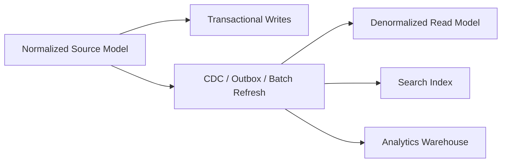

# Part 010 — Normalization With Real Tradeoffs

Normalization is often presented as a school exercise:

> Convert this ugly table into 1NF, 2NF, 3NF.

That framing is too weak for production systems.

In real engineering, normalization is a discipline for controlling **redundancy**, **update anomalies**, **contradictory facts**, and **unclear ownership**.

A normalized design is not automatically good. A denormalized design is not automatically bad. The real skill is knowing what truth must be represented once, what can be derived, what can be copied safely, and which tradeoffs are worth carrying in production.

This part builds that judgment.

---

## 1. The Core Problem Normalization Solves

Normalization protects against storing the same fact in multiple places without control.

When the same fact is stored repeatedly, three things can happen:

1. one copy changes but another does not
2. one copy is missing
3. two copies contradict each other

These are not academic concerns. They become production bugs.

Example weak table:

```sql
CREATE TABLE case_work_queue_bad (
    case_id           uuid,
    case_number       text,
    subject_name      text,
    subject_address   text,
    assignee_id       uuid,
    assignee_name     text,
    assignee_email    text,
    current_status    text,
    last_decision     text,
    last_decision_by  text,
    evidence_checksum text,
    evidence_filename text
);
```

This table mixes facts about:

- case
- subject
- subject address
- assignee user
- status
- decision
- evidence
- queue projection

It may be useful as a read model, but it is dangerous as source truth.

Why?

Because it stores independent facts together as though they have one lifecycle.

If the assignee email changes, how many rows must update?

If subject address changes, do historical cases change?

If evidence is linked to two cases, is the evidence duplicated?

If a decision is corrected, does `last_decision` preserve history?

Normalization forces us to separate facts by dependency.

---

## 2. Normalization in One Sentence

Normalization is the process of structuring relations so that each fact is stored in the right place, at the right grain, with dependencies represented explicitly.

The key word is **dependency**.

An attribute belongs in a relation when it depends on the key, the whole key, and nothing but the key.

That classic phrasing is useful, but we need to make it operational.

Ask:

> If I know the key of this row, does that key determine this attribute?

Example:

```text
case_id -> case_number, opened_at, subject_id
subject_id -> legal_name, registration_no
assignee_id -> assignee_email
```

If `case_id` determines `subject_id`, and `subject_id` determines `legal_name`, then storing `legal_name` directly in the case row creates a transitive dependency.

That may be acceptable for a snapshot, but not for source truth.

---

## 3. Functional Dependency

A functional dependency means:

> For a given value of A, there is exactly one value of B.

Written:

```text
A -> B
```

Example:

```text
registration_no -> legal_name
user_id -> email
case_id -> case_number
case_number -> case_id
order_id -> order_amount
```

If the dependency is true in the business domain, it should influence schema design.

But be careful. Some apparent dependencies are only temporarily true.

Weak assumption:

```text
postal_code -> city
```

May not hold globally.

Weak assumption:

```text
email -> user_id
```

May fail if emails can change, be reused, or be shared by service accounts.

Weak assumption:

```text
legal_name -> regulated_entity
```

May fail because names are not unique.

Top-level engineers challenge dependencies before modelling them.

---

## 4. Anomalies: The Production Failure View

Normalization exists because bad dependency design creates anomalies.

### 4.1 Update Anomaly

Same fact must be updated in multiple places.

Bad table:

```text
case_id | assignee_id | assignee_email
C-001   | U-100       | old@example.com
C-002   | U-100       | old@example.com
C-003   | U-100       | old@example.com
```

If the user email changes, every row must update.

If one row is missed, the database now contains contradictory facts.

Normalized design:

```sql
CREATE TABLE system_user (
    user_id uuid PRIMARY KEY,
    email   text NOT NULL UNIQUE
);

CREATE TABLE case_assignment (
    case_id     uuid NOT NULL REFERENCES enforcement_case(case_id),
    assignee_id uuid NOT NULL REFERENCES system_user(user_id),
    assigned_at timestamptz NOT NULL,
    PRIMARY KEY (case_id, assignee_id, assigned_at)
);
```

Now email lives in one authoritative place.

---

### 4.2 Insert Anomaly

Cannot store one fact unless another unrelated fact exists.

Bad table:

```text
case_id | case_number | evidence_checksum | evidence_filename
```

If evidence exists before it is linked to a case, where do we store it?

Normalized design:

```sql
CREATE TABLE evidence_item (
    evidence_id uuid PRIMARY KEY,
    checksum    text NOT NULL UNIQUE,
    file_name   text NOT NULL,
    captured_at timestamptz NOT NULL
);

CREATE TABLE case_evidence_link (
    case_id     uuid NOT NULL REFERENCES enforcement_case(case_id),
    evidence_id uuid NOT NULL REFERENCES evidence_item(evidence_id),
    linked_at   timestamptz NOT NULL,
    PRIMARY KEY (case_id, evidence_id)
);
```

Evidence can exist independently. Linkage is a separate fact.

---

### 4.3 Delete Anomaly

Deleting one fact accidentally deletes another fact.

Bad table:

```text
case_id | subject_id | subject_name | subject_registration_no
```

If the last case for a subject is deleted, the subject record disappears too.

Normalized design:

```sql
CREATE TABLE regulated_entity (
    entity_id       uuid PRIMARY KEY,
    registration_no text NOT NULL UNIQUE,
    legal_name      text NOT NULL
);

CREATE TABLE enforcement_case (
    case_id    uuid PRIMARY KEY,
    subject_id uuid NOT NULL REFERENCES regulated_entity(entity_id)
);
```

Case deletion does not delete the subject unless explicitly designed to do so.

---

## 5. Grain: The Most Practical Normalization Question

Before discussing normal forms, identify the **grain** of each relation.

Grain answers:

> What does one row represent?

Examples:

| Table | Grain |
|---|---|
| `enforcement_case` | one case |
| `case_status_transition` | one status transition for one case |
| `case_assignment` | one assignment period for one case and one user |
| `evidence_item` | one evidence item |
| `case_evidence_link` | one link between one case and one evidence item |
| `case_daily_snapshot` | one case snapshot for one date |

Mixed grain is a design smell.

Bad:

```sql
CREATE TABLE case_summary_bad (
    case_id uuid,
    case_number text,
    evidence_count integer,
    latest_decision text,
    assignee_email text,
    subject_legal_name text,
    status_changed_at timestamptz
);
```

This row mixes:

- one case
- aggregated evidence
- latest decision
- user contact
- subject name
- status transition

Again: this may be acceptable as a projection. But it is not a clean source model.

Top-level rule:

> Normalize source truth by grain. Denormalize projections by use case.

---

## 6. First Normal Form: Atomic Values and Repeating Groups

First Normal Form is usually summarized as:

> Attributes should contain atomic values, and rows should not contain repeating groups.

But “atomic” depends on the operations the system needs.

Bad:

```sql
CREATE TABLE enforcement_case_bad (
    case_id uuid PRIMARY KEY,
    evidence_ids text,
    assignee_emails text,
    tags text
);
```

Example row:

```text
evidence_ids = 'E1,E2,E3'
assignee_emails = 'a@example.com,b@example.com'
tags = 'urgent,market-abuse,priority'
```

Problems:

- cannot enforce foreign keys
- cannot safely query individual values
- cannot index values properly
- cannot attach attributes to each relationship
- cannot prevent duplicates cleanly
- cannot reason about lifecycle

Better:

```sql
CREATE TABLE case_evidence_link (
    case_id     uuid NOT NULL REFERENCES enforcement_case(case_id),
    evidence_id uuid NOT NULL REFERENCES evidence_item(evidence_id),
    linked_at   timestamptz NOT NULL,
    PRIMARY KEY (case_id, evidence_id)
);

CREATE TABLE case_tag (
    case_id uuid NOT NULL REFERENCES enforcement_case(case_id),
    tag     text NOT NULL,
    PRIMARY KEY (case_id, tag)
);
```

However, atomicity is not always obvious.

Is an address atomic?

```sql
address text
```

Maybe yes if it is only displayed.

Maybe no if you must search by postal code, validate region, route cases by jurisdiction, or enforce country-specific rules.

Is a JSON document atomic?

Maybe yes if it is an immutable external payload.

Maybe no if core business logic queries and updates fields inside it.

1NF is not about blindly splitting everything. It is about making values atomic relative to required operations.

---

## 7. Second Normal Form: Whole-Key Dependency

Second Normal Form matters when a table has a composite key.

A table is in 2NF when every non-key attribute depends on the whole key, not just part of it.

Bad:

```sql
CREATE TABLE case_evidence_bad (
    case_id         uuid,
    evidence_id     uuid,
    case_number     text,
    evidence_hash   text,
    linked_at       timestamptz,
    PRIMARY KEY (case_id, evidence_id)
);
```

Dependencies:

```text
case_id -> case_number
evidence_id -> evidence_hash
(case_id, evidence_id) -> linked_at
```

`case_number` depends only on `case_id`.

`evidence_hash` depends only on `evidence_id`.

Only `linked_at` depends on the full key.

Better:

```sql
CREATE TABLE enforcement_case (
    case_id     uuid PRIMARY KEY,
    case_number text NOT NULL UNIQUE
);

CREATE TABLE evidence_item (
    evidence_id   uuid PRIMARY KEY,
    evidence_hash text NOT NULL UNIQUE
);

CREATE TABLE case_evidence_link (
    case_id     uuid NOT NULL REFERENCES enforcement_case(case_id),
    evidence_id uuid NOT NULL REFERENCES evidence_item(evidence_id),
    linked_at   timestamptz NOT NULL,
    PRIMARY KEY (case_id, evidence_id)
);
```

2NF prevents partial dependency anomalies.

Production translation:

> In relationship tables, store attributes of the relationship, not attributes of either endpoint.

---

## 8. Third Normal Form: No Transitive Dependency

Third Normal Form prevents non-key attributes from depending on other non-key attributes.

Bad:

```sql
CREATE TABLE enforcement_case_bad (
    case_id             uuid PRIMARY KEY,
    subject_id          uuid NOT NULL,
    subject_legal_name  text NOT NULL,
    subject_risk_rating text NOT NULL,
    case_number         text NOT NULL
);
```

Dependencies:

```text
case_id -> subject_id
subject_id -> subject_legal_name
subject_id -> subject_risk_rating
```

`subject_legal_name` and `subject_risk_rating` depend on `subject_id`, not directly on `case_id`.

Better:

```sql
CREATE TABLE regulated_entity (
    entity_id   uuid PRIMARY KEY,
    legal_name  text NOT NULL,
    risk_rating text NOT NULL
);

CREATE TABLE enforcement_case (
    case_id     uuid PRIMARY KEY,
    case_number text NOT NULL UNIQUE,
    subject_id  uuid NOT NULL REFERENCES regulated_entity(entity_id)
);
```

But there is a subtle business question:

> Should a case show the subject's current risk rating or the risk rating at the time the case was opened?

If current value is needed, normalize and join.

If historical snapshot is needed, store a snapshot explicitly:

```sql
CREATE TABLE case_subject_snapshot (
    case_id                  uuid PRIMARY KEY REFERENCES enforcement_case(case_id),
    subject_id               uuid NOT NULL REFERENCES regulated_entity(entity_id),
    legal_name_at_opening    text NOT NULL,
    risk_rating_at_opening   text NOT NULL,
    captured_at              timestamptz NOT NULL
);
```

This is not “bad denormalization”. It is a historical fact.

The design is valid because the meaning is explicit.

---

## 9. Boyce-Codd Normal Form: Stronger Dependency Discipline

BCNF is stricter than 3NF.

A relation is in BCNF when for every non-trivial functional dependency `X -> Y`, `X` is a superkey.

Simpler production phrasing:

> Every determinant should be a candidate key.

Example:

```text
Table: case_reviewer_assignment
Attributes:
- case_id
- reviewer_id
- reviewer_region

Rules:
- each reviewer belongs to one region
- each case-region pair has one reviewer
```

Dependencies:

```text
reviewer_id -> reviewer_region
(case_id, reviewer_region) -> reviewer_id
```

Candidate keys might be:

```text
(case_id, reviewer_region)
(case_id, reviewer_id)
```

But `reviewer_id -> reviewer_region` can violate BCNF if `reviewer_id` is not a superkey for the table.

Better decomposition:

```sql
CREATE TABLE reviewer (
    reviewer_id uuid PRIMARY KEY,
    region_code text NOT NULL
);

CREATE TABLE case_region_reviewer (
    case_id     uuid NOT NULL REFERENCES enforcement_case(case_id),
    region_code text NOT NULL,
    reviewer_id uuid NOT NULL REFERENCES reviewer(reviewer_id),
    PRIMARY KEY (case_id, region_code)
);
```

BCNF becomes relevant when there are overlapping candidate keys or hidden dependencies.

In everyday production design, many teams aim for 3NF as a practical baseline and use BCNF thinking for complex dependency cases.

---

## 10. Fourth Normal Form: Independent Multi-Valued Facts

Fourth Normal Form deals with multi-valued dependencies.

A table violates 4NF when it stores two or more independent many-valued facts in one relation.

Bad:

```sql
CREATE TABLE case_channels_and_tags_bad (
    case_id uuid,
    channel text,
    tag     text,
    PRIMARY KEY (case_id, channel, tag)
);
```

Suppose a case has:

```text
channels: EMAIL, PORTAL
tags: URGENT, MARKET_ABUSE
```

This table requires four rows:

```text
EMAIL  + URGENT
EMAIL  + MARKET_ABUSE
PORTAL + URGENT
PORTAL + MARKET_ABUSE
```

But channels and tags are independent facts.

Better:

```sql
CREATE TABLE case_channel (
    case_id uuid NOT NULL REFERENCES enforcement_case(case_id),
    channel text NOT NULL,
    PRIMARY KEY (case_id, channel)
);

CREATE TABLE case_tag (
    case_id uuid NOT NULL REFERENCES enforcement_case(case_id),
    tag     text NOT NULL,
    PRIMARY KEY (case_id, tag)
);
```

Production symptom of 4NF violation:

- tables with artificial combinations of independent lists
- unexpected row explosion
- accidental duplicates
- confusing counts
- difficult updates

---

## 11. Fifth Normal Form: Join Dependency Discipline

Fifth Normal Form is less common in everyday application design, but the idea is useful.

It deals with cases where a relation can be reconstructed from smaller relations without losing information.

Production translation:

> Do not store a complex association as one table if the real business rules are independent associations that should be constrained separately.

You will rarely label a production review as “5NF violation”. But you may still detect the smell:

- the table contains a three-way relationship
- not every combination is meaningful
- business rules actually apply pairwise or through separate policies
- updates require reasoning about too many dimensions at once

Example smell:

```text
inspector_id, region_id, case_type_id
```

This may mean:

- inspectors are authorized for regions
- inspectors are certified for case types
- case types are valid in regions

Those may be three separate facts, not one fact.

---

## 12. Lossless Decomposition

When you split a table, you must be able to join it back without creating wrong rows or losing rows.

This is called lossless decomposition.

Example safe decomposition:

Original:

```text
case_id, case_number, subject_id, subject_name
```

Dependencies:

```text
case_id -> case_number, subject_id
subject_id -> subject_name
```

Decompose into:

```text
enforcement_case(case_id, case_number, subject_id)
regulated_entity(subject_id, subject_name)
```

Join on `subject_id` reconstructs the intended information.

Dangerous decomposition happens when the join key does not preserve identity.

Bad:

```text
case(case_id, subject_name)
subject(subject_name, registration_no)
```

If two subjects share the same name, joining by name creates false matches.

Lossless decomposition requires stable identifiers and correct dependencies.

---

## 13. Dependency Preservation

A decomposition is dependency-preserving when constraints can still be enforced without expensive or unsafe cross-table checks.

Example:

Rule:

> One case can have only one active primary assignee.

If assignment data is split across too many tables, enforcing this may require complex triggers or application logic.

A practical design:

```sql
CREATE TABLE case_assignment (
    assignment_id   uuid PRIMARY KEY,
    case_id         uuid NOT NULL REFERENCES enforcement_case(case_id),
    assignee_id     uuid NOT NULL REFERENCES system_user(user_id),
    assignment_role text NOT NULL,
    assigned_at     timestamptz NOT NULL,
    unassigned_at   timestamptz,
    CHECK (unassigned_at IS NULL OR unassigned_at > assigned_at)
);
```

Then add a database-level uniqueness strategy for active primary assignment if your database supports it, such as a partial unique index:

```sql
CREATE UNIQUE INDEX one_active_primary_assignee_per_case
ON case_assignment (case_id)
WHERE assignment_role = 'PRIMARY' AND unassigned_at IS NULL;
```

This is normalized enough while preserving an important invariant.

Perfect decomposition is less useful if critical constraints become unenforceable.

---

## 14. Normalization vs Performance

The common objection:

> Normalized schemas are slow because they require joins.

That is sometimes true, but often too simplistic.

A normalized source model can perform very well when:

- indexes match access patterns
- joins use keys
- cardinality is controlled
- query shape is clear
- transactions are scoped correctly
- projections are introduced where needed

A denormalized source model can perform badly when:

- duplicated data bloats indexes
- updates touch many rows
- wide rows reduce cache efficiency
- write amplification increases
- consistency repair jobs become expensive
- reporting queries must resolve contradictions

Performance is not a reason to avoid normalization. Performance is a reason to separate **source truth** from **serving models**.

Design split:



This is a mature pattern:

- normalize where correctness matters
- denormalize where read efficiency matters
- define refresh/rebuild rules
- monitor drift

---

## 15. Valid Denormalization

Denormalization is controlled redundancy.

It is valid when:

1. the source of truth remains clear
2. the copied value has a known refresh path
3. drift is detectable
4. stale reads are acceptable or bounded
5. the performance benefit is measurable
6. the denormalized structure has an owner
7. rebuild is possible

Example read model:

```sql
CREATE TABLE case_work_queue_projection (
    case_id             uuid PRIMARY KEY,
    case_number         text NOT NULL,
    subject_legal_name  text NOT NULL,
    current_status      text NOT NULL,
    primary_assignee_id uuid,
    primary_assignee_email text,
    oldest_sla_due_at   timestamptz,
    risk_score          numeric(8, 4),
    projected_at        timestamptz NOT NULL
);
```

This table is intentionally denormalized.

But the contract must say:

```text
Source:
- enforcement_case
- regulated_entity
- case_assignment
- system_user
- case_sla
- case_risk_score

Refresh:
- updated by projection worker from case events and CDC stream

Staleness:
- allowed up to 30 seconds for work queue display

Rebuild:
- can be fully rebuilt from source tables and event log
```

Without that contract, denormalization becomes data corruption with better latency.

---

## 16. Snapshot vs Duplication

A snapshot intentionally records what was true at a point in time.

This is different from uncontrolled duplication.

Example:

```sql
CREATE TABLE penalty_notice (
    notice_id              uuid PRIMARY KEY,
    case_id                uuid NOT NULL REFERENCES enforcement_case(case_id),
    recipient_entity_id    uuid NOT NULL REFERENCES regulated_entity(entity_id),
    recipient_name_on_notice text NOT NULL,
    recipient_address_on_notice text NOT NULL,
    issued_at              timestamptz NOT NULL
);
```

`recipient_name_on_notice` duplicates the regulated entity name.

But it is not an accidental duplicate. It records what was printed on a legal notice.

That is a historical fact.

Design rule:

> A copied value is acceptable when the copied value has its own meaning at a specific time or in a specific artifact.

Do not “normalize away” legal evidence.

---

## 17. Normalization and Temporal Data

Time changes dependency rules.

Current dependency:

```text
entity_id -> legal_name
```

Temporal dependency:

```text
(entity_id, valid_time) -> legal_name_at_that_time
```

If names change, then a simple `regulated_entity.legal_name` column only represents current name.

For history:

```sql
CREATE TABLE regulated_entity_name_history (
    entity_id    uuid NOT NULL REFERENCES regulated_entity(entity_id),
    legal_name   text NOT NULL,
    valid_from   date NOT NULL,
    valid_to     date,
    recorded_at  timestamptz NOT NULL,
    PRIMARY KEY (entity_id, valid_from),
    CHECK (valid_to IS NULL OR valid_to > valid_from)
);
```

Now the dependency is time-scoped.

Many apparent normalization debates are actually temporal modelling debates.

Ask:

- Do we need current value or historical value?
- Should historical value be corrected or appended?
- Is the old value still legally meaningful?
- Which timestamp defines truth: occurrence time, effective time, or recording time?

---

## 18. Normalization and Workflow State

Workflow systems often become denormalized accidentally.

Bad:

```sql
CREATE TABLE case_workflow_bad (
    case_id uuid PRIMARY KEY,
    status text,
    assigned_to text,
    reviewed_by text,
    approved_by text,
    rejected_by text,
    escalated_to text,
    last_action text,
    last_action_at timestamptz
);
```

This mixes:

- lifecycle status
- task assignment
- review decision
- approval decision
- escalation
- last event summary

A normalized workflow model separates fact types:

```text
enforcement_case
case_status_transition
case_task
case_task_assignment
case_decision
case_escalation
case_event
```

Example:

```sql
CREATE TABLE case_task (
    task_id     uuid PRIMARY KEY,
    case_id     uuid NOT NULL REFERENCES enforcement_case(case_id),
    task_type   text NOT NULL,
    task_status text NOT NULL,
    created_at  timestamptz NOT NULL,
    due_at      timestamptz
);

CREATE TABLE case_task_assignment (
    task_id     uuid NOT NULL REFERENCES case_task(task_id),
    assignee_id uuid NOT NULL REFERENCES system_user(user_id),
    assigned_at timestamptz NOT NULL,
    PRIMARY KEY (task_id, assignee_id, assigned_at)
);

CREATE TABLE case_decision (
    decision_id   uuid PRIMARY KEY,
    case_id       uuid NOT NULL REFERENCES enforcement_case(case_id),
    task_id       uuid REFERENCES case_task(task_id),
    decision_type text NOT NULL,
    decided_by    uuid NOT NULL REFERENCES system_user(user_id),
    decided_at    timestamptz NOT NULL,
    reason        text NOT NULL
);
```

This model is more verbose. It is also more explainable.

For regulatory systems, explainability is often more important than minimal table count.

---

## 19. Normalization and JSON Columns

Modern relational databases often support JSON.

JSON is useful, but it can bypass normalization.

Valid JSON use cases:

- external payload storage
- sparse optional metadata
- immutable evidence payload
- integration envelope
- feature-specific configuration
- temporary migration compatibility

Dangerous JSON use cases:

- core searchable attributes
- authorization-relevant data
- frequently updated subfields
- relational references hidden inside JSON
- status/lifecycle data
- money/amounts that need constraints
- data needed for reporting correctness

Weak:

```sql
CREATE TABLE enforcement_case (
    case_id uuid PRIMARY KEY,
    data jsonb NOT NULL
);
```

Better hybrid:

```sql
CREATE TABLE enforcement_case (
    case_id        uuid PRIMARY KEY,
    case_number    text NOT NULL UNIQUE,
    subject_id     uuid NOT NULL REFERENCES regulated_entity(entity_id),
    current_status text NOT NULL,
    opened_at      timestamptz NOT NULL,
    external_payload jsonb NOT NULL
);
```

Core facts are relational. External or semi-structured payload remains JSON.

Design rule:

> JSON is not a substitute for modelling facts that the system must govern.

---

## 20. A Step-by-Step Normalization Method

Use this method for real schemas.

### Step 1: Write the Raw Wide Row

Start with the messy business view.

```text
case_number, subject_name, subject_registration_no, assignee_email,
status, status_changed_at, decision, decision_by, evidence_hash,
evidence_file_name, linked_at
```

### Step 2: Identify Grain

Ask:

> What does one row represent?

Usually the answer is “multiple things”, which means decomposition is needed.

### Step 3: List Functional Dependencies

```text
case_number -> case_id
subject_registration_no -> subject_id, subject_name
assignee_email -> assignee_id
evidence_hash -> evidence_id, evidence_file_name
case_id -> current_status
(case_id, evidence_id) -> linked_at
```

### Step 4: Separate Independent Entity Facts

```text
regulated_entity
enforcement_case
system_user
evidence_item
```

### Step 5: Separate Relationship Facts

```text
case_evidence_link
case_assignment
```

### Step 6: Separate Event/History Facts

```text
case_status_transition
case_decision
```

### Step 7: Add Keys and Constraints

```sql
UNIQUE (case_number)
UNIQUE (registration_no)
UNIQUE (email)
PRIMARY KEY (case_id, evidence_id)
FOREIGN KEY references
CHECK constraints
```

### Step 8: Decide Current vs Historical Values

Current status may be stored on `enforcement_case` for fast reads.

History lives in `case_status_transition`.

If both exist, define the synchronization rule.

### Step 9: Decide Source vs Projection

Source tables should be normalized.

Read models may be denormalized.

### Step 10: Prove Important Queries

Check that the design supports real queries:

- current case queue
- case audit history
- evidence chain
- decision history
- SLA breach report
- subject exposure report

Normalization must serve usage, not exist as decoration.

---

## 21. Worked Example: From Bad Table to Source Model

### 21.1 Starting Point

```sql
CREATE TABLE case_register_bad (
    case_no text,
    subject_registration_no text,
    subject_name text,
    subject_address text,
    assignee_email text,
    assignee_name text,
    status text,
    status_reason text,
    status_changed_at text,
    evidence_hash text,
    evidence_file_name text,
    decision text,
    decision_by_email text,
    decision_reason text
);
```

Problems:

- no primary key
- everything is text
- mixed grain
- subject duplicated across cases
- assignee details duplicated
- evidence details duplicated
- status history collapsed
- decision history collapsed
- no references
- no constraints

### 21.2 Dependency Analysis

```text
subject_registration_no -> subject_name, subject_address
assignee_email -> assignee_name
decision_by_email -> decision maker identity
evidence_hash -> evidence_file_name
case_no -> case identity
case identity + evidence identity -> evidence link
case identity + status_changed_at -> status transition
case identity + decision timestamp -> decision
```

### 21.3 Normalized Source Tables

```sql
CREATE TABLE regulated_entity (
    entity_id       uuid PRIMARY KEY,
    registration_no text NOT NULL UNIQUE,
    legal_name      text NOT NULL,
    current_address text NOT NULL
);

CREATE TABLE system_user (
    user_id      uuid PRIMARY KEY,
    email        text NOT NULL UNIQUE,
    display_name text NOT NULL
);

CREATE TABLE enforcement_case (
    case_id        uuid PRIMARY KEY,
    case_number    text NOT NULL UNIQUE,
    subject_id     uuid NOT NULL REFERENCES regulated_entity(entity_id),
    opened_at      timestamptz NOT NULL,
    current_status text NOT NULL
);

CREATE TABLE case_assignment (
    assignment_id uuid PRIMARY KEY,
    case_id       uuid NOT NULL REFERENCES enforcement_case(case_id),
    assignee_id   uuid NOT NULL REFERENCES system_user(user_id),
    assigned_at   timestamptz NOT NULL,
    unassigned_at timestamptz,
    CHECK (unassigned_at IS NULL OR unassigned_at > assigned_at)
);

CREATE TABLE evidence_item (
    evidence_id uuid PRIMARY KEY,
    checksum    text NOT NULL UNIQUE,
    file_name   text NOT NULL,
    captured_at timestamptz NOT NULL
);

CREATE TABLE case_evidence_link (
    case_id     uuid NOT NULL REFERENCES enforcement_case(case_id),
    evidence_id uuid NOT NULL REFERENCES evidence_item(evidence_id),
    linked_at   timestamptz NOT NULL,
    linked_by   uuid NOT NULL REFERENCES system_user(user_id),
    PRIMARY KEY (case_id, evidence_id)
);

CREATE TABLE case_status_transition (
    transition_id uuid PRIMARY KEY,
    case_id       uuid NOT NULL REFERENCES enforcement_case(case_id),
    from_status   text,
    to_status     text NOT NULL,
    changed_at    timestamptz NOT NULL,
    changed_by    uuid NOT NULL REFERENCES system_user(user_id),
    reason        text NOT NULL
);

CREATE TABLE case_decision (
    decision_id   uuid PRIMARY KEY,
    case_id       uuid NOT NULL REFERENCES enforcement_case(case_id),
    decision_type text NOT NULL,
    decided_by    uuid NOT NULL REFERENCES system_user(user_id),
    decided_at    timestamptz NOT NULL,
    reason        text NOT NULL
);
```

### 21.4 Optional Read Projection

For UI queue performance:

```sql
CREATE TABLE case_queue_projection (
    case_id          uuid PRIMARY KEY,
    case_number      text NOT NULL,
    subject_name     text NOT NULL,
    assignee_name    text,
    assignee_email   text,
    current_status   text NOT NULL,
    latest_decision  text,
    projected_at     timestamptz NOT NULL
);
```

This projection is allowed only if it has a rebuild path from source tables.

---

## 22. Common Normalization Mistakes

### 22.1 Normalizing Labels but Not Facts

Creating lookup tables for everything is not enough.

```sql
CREATE TABLE status_lookup (
    status text PRIMARY KEY
);
```

This controls values, but does not enforce valid transitions, actors, timing, or reasons.

Normalization is about dependencies and facts, not just lookup tables.

---

### 22.2 Splitting Tables Without Meaning

Bad decomposition:

```text
case_main
case_extra
case_more
case_detail
```

If the split does not reflect lifecycle, security, optionality, or dependency, it may only add complexity.

---

### 22.3 Treating 3NF as the End of Design

3NF does not solve:

- indexing
- partitioning
- isolation levels
- distributed consistency
- schema migration
- access control
- retention
- auditability
- reporting correctness

Normalization is one layer of database design, not the whole discipline.

---

### 22.4 Denormalizing Before Measuring

Do not denormalize because “joins are scary”.

First:

- inspect workload
- read execution plans
- add proper indexes
- check cardinality
- check transaction boundaries
- benchmark realistic queries

Then decide whether a projection is needed.

---

### 22.5 Hiding Relationships in Strings or JSON

Bad:

```json
{
  "caseId": "...",
  "assignees": ["u1", "u2"],
  "evidence": ["e1", "e2"]
}
```

If those IDs are relationally meaningful, the database cannot enforce them inside opaque JSON unless you add specialized constraints and operational discipline.

Use relational tables for governed relationships.

---

## 23. Normalization Decision Matrix

| Question | Prefer Normalized | Consider Denormalized |
|---|---|---|
| Is this source truth? | yes | rarely |
| Is the value independently mutable? | yes | no, unless snapshot |
| Is the value reused across many rows? | yes | maybe projection |
| Is historical value required? | separate history/snapshot | snapshot allowed |
| Is read latency critical? | normalized plus indexes first | projection/read model |
| Is stale data acceptable? | not for source truth | yes, if bounded |
| Can drift be detected? | less drift risk | required |
| Can data be rebuilt? | not always needed | required |
| Does duplication preserve legal evidence? | snapshot table | yes, if explicit |
| Does duplication simplify writes? | be careful | often dangerous |

---

## 24. Normalization Review Checklist

### 24.1 Grain

- Does every table have a clear row grain?
- Are multiple grains mixed in one row?
- Are events, relationships, entities, and snapshots separated?

### 24.2 Dependency

- What are the functional dependencies?
- Do non-key attributes depend on the key?
- In composite-key tables, do attributes depend on the whole key?
- Are there transitive dependencies?
- Are determinants candidate keys where they should be?

### 24.3 Anomalies

- Can updating one fact require many row updates?
- Can inserting one fact require an unrelated fact?
- Can deleting one fact accidentally delete another?
- Can two rows contradict each other?

### 24.4 History

- Are current and historical facts separated?
- Are snapshots intentional?
- Is copied data timestamped and explained?
- Can the system answer “what did we know at the time?”

### 24.5 Denormalization

- What is the authoritative source?
- What process refreshes the copy?
- What is the staleness budget?
- How is drift detected?
- Can the denormalized table be rebuilt?

---

## 25. Practical Exercise

Normalize this table:

```sql
CREATE TABLE complaint_case_bad (
    complaint_no text,
    complainant_name text,
    complainant_email text,
    regulated_entity_name text,
    regulated_entity_registration_no text,
    assigned_officer_email text,
    assigned_officer_name text,
    allegations text,
    evidence_files text,
    current_status text,
    last_status_reason text,
    last_status_changed_by text,
    last_status_changed_at text
);
```

Tasks:

1. Identify row grain.
2. List functional dependencies.
3. Identify repeating groups.
4. Identify transitive dependencies.
5. Separate entities, relationships, events, and snapshots.
6. Decide what should be source truth.
7. Decide what may become a projection.
8. Add primary keys.
9. Add foreign keys.
10. Add minimum useful constraints.

Expected decomposition might include:

```text
complaint_case
complainant
regulated_entity
system_user
case_assignment
allegation
case_allegation
case_status_transition
evidence_item
case_evidence_link
case_queue_projection
```

The final shape depends on business rules. But the decomposition process should be disciplined.

---

## 26. What Top Engineers Internalize

Normalization is not about pleasing a textbook.

It is about making bad states harder to create.

Strong engineers internalize these rules:

- Store each source fact once unless there is a clear reason not to.
- Separate facts with different identity, lifecycle, and dependency.
- Treat relationship tables as real business facts.
- Know the grain of every table.
- Use functional dependencies to detect bad design.
- Use normalized source models for correctness.
- Use denormalized projections for serving speed.
- Never denormalize without source, refresh, staleness, drift, and rebuild contracts.
- Historical snapshots are valid when they represent what was true or recorded at a time.
- Perfect normal form is less important than explicit, enforceable, evolvable truth.

Normalization is the foundation. Architecture is knowing when and how to bend it without breaking the system.

---

## 27. References

- IBM Documentation — Normalization: https://www.ibm.com/docs/ssw_ibm_i_74/rzaik/normalization.htm
- IBM Think — What Is Database Normalization?: https://www.ibm.com/think/topics/database-normalization
- PostgreSQL Documentation — Constraints: https://www.postgresql.org/docs/current/ddl-constraints.html
- PostgreSQL Documentation — CREATE TABLE: https://www.postgresql.org/docs/current/sql-createtable.html
- PostgreSQL Documentation — Indexes: https://www.postgresql.org/docs/current/indexes.html
- E. F. Codd — A Relational Model of Data for Large Shared Data Banks, Communications of the ACM, 1970
