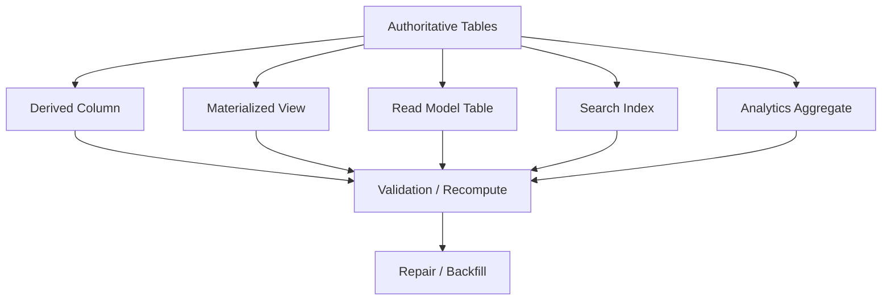
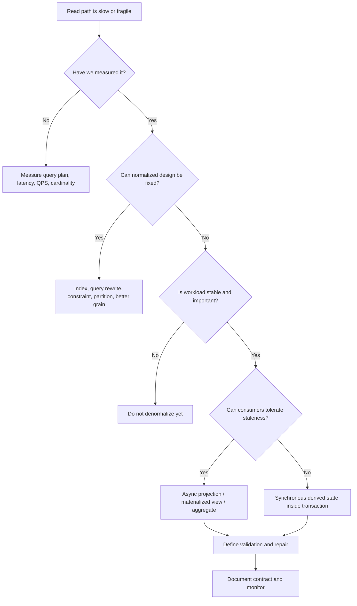
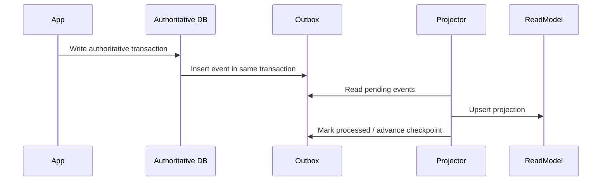
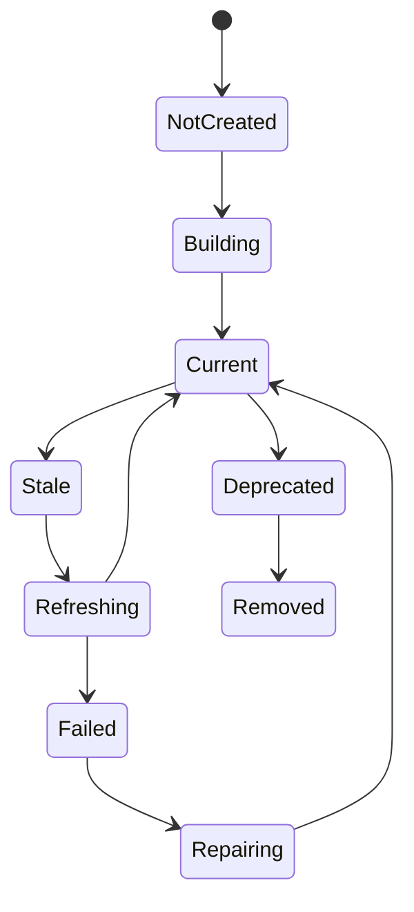
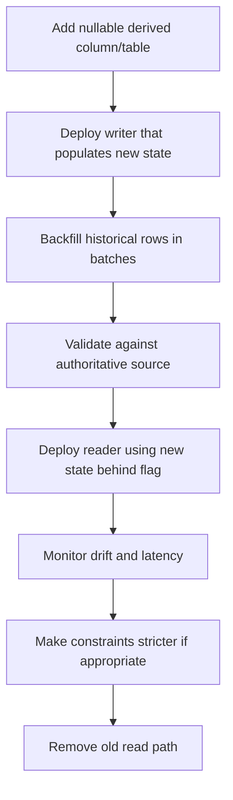

------
title: Learn Database Design and Architect - Part 011
description: Controlled denormalization as an explicit engineering decision: derived state, projections, read models, consistency contracts, refresh strategy, and operational safeguards.
series: learn-database-design-architect
seriesTitle: Learn Database Design and Architect
order: 11
partTitle: Denormalization With Discipline
tags:
  - database
  - database-design
  - architecture
  - denormalization
  - performance
  - data-modeling
date: 2026-07-04
---

# Part 011 — Denormalization With Discipline

Denormalization is not “making schema faster by duplicating columns”. That framing is too shallow and usually dangerous.

A better framing:

> **Denormalization is the deliberate storage of derived, copied, aggregated, or pre-shaped data so a known workload can be served with acceptable latency, cost, availability, or operational complexity — while preserving a clear contract for how that redundant data is produced, refreshed, validated, repaired, and retired.**

A normalized model minimizes redundancy and protects update correctness. A denormalized model introduces redundancy to reduce query cost or dependency cost. The trade is never free. You are buying read-path simplicity by creating write-path, migration, reconciliation, and correctness obligations.

Top engineers do not ask:

> “Should this be normalized or denormalized?”

They ask:

> “Which state is authoritative, which state is derived, what invariant must still hold, and how will we prove that the derived state is correct enough for its purpose?”

That is the discipline.

---

## 1. The Core Mental Model

A database can contain several classes of state:

| State Type | Meaning | Example | Source of Truth? |
|---|---|---|---|
| Authoritative fact | Canonical business fact | `invoice.total_amount`, `case.status` | Yes |
| Derived value | Computed from facts | `case.open_task_count` | No, unless deliberately promoted |
| Snapshot | Historical copy of facts at a point in time | `invoice_customer_name` | Sometimes, by business rule |
| Projection | Query-optimized representation | `case_dashboard_view` | No |
| Cache table | Performance structure | `customer_balance_cache` | No |
| Search document | Read model for search | Elasticsearch/OpenSearch document | No |
| Aggregate | Precomputed summary | `daily_revenue_by_region` | No |
| Denormalized ownership copy | Copied attribute for local boundary | `tenant_name_on_audit_event` | Usually no |

The mistake is treating all rows as equally authoritative.

A disciplined design makes the authority explicit.



Every denormalized field should answer:

1. What authoritative data produced it?
2. What transformation produced it?
3. When is it refreshed?
4. How stale may it be?
5. Who is allowed to depend on it?
6. How do we detect drift?
7. How do we repair drift?
8. How do we remove it safely?

If those questions are not answered, you do not have denormalization. You have uncontrolled duplication.

---

## 2. Why Denormalization Exists

Denormalization is justified when the normalized model cannot satisfy a concrete operational constraint.

Common legitimate drivers:

| Driver | Symptom | Denormalization Candidate |
|---|---|---|
| Query latency | Read path joins too many large tables | Read model table, materialized view |
| Query cost | Repeated aggregation burns CPU/IO | Aggregate table |
| Availability | Read path depends on too many services/databases | Local copy / projection |
| Contention | Hot row repeatedly recalculated or locked | Append + async aggregate |
| Search | Relational model poor for free-text/ranking | Search projection |
| Reporting | Complex report must be reproducible | Snapshot/report table |
| Boundary autonomy | Service needs local data to operate independently | Bounded copied attribute |
| Historical correctness | Current referenced data must not rewrite history | Snapshot columns |
| External integration | Downstream needs stable export shape | Integration projection |

Bad drivers:

| Bad Reason | Why It Is Weak |
|---|---|
| “Joins are bad” | Joins are often the correct relational operation. Bad joins usually mean bad indexing, wrong query shape, or wrong grain. |
| “NoSQL systems denormalize” | Document/wide-column modeling is access-pattern-driven, not random duplication. |
| “It is easier for the UI” | UI convenience is not enough if it corrupts business authority. Build an API/read model deliberately. |
| “We may need this later” | Unused denormalized fields become stale, misunderstood, and hard to remove. |
| “Reports are slow” | Maybe the fix is analytical boundary, not corrupting OLTP schema. |
| “We need one big table” | Wide tables often hide lifecycle mismatch, nullable abuse, and weak ownership. |

---

## 3. Denormalization Is a Contract, Not a Column

A denormalized field without a contract is a liability.

A complete denormalization contract should define:

```text
Denormalized State Contract

Name:
  case_summary.open_task_count

Purpose:
  Serve case list page without counting tasks on every request.

Authoritative source:
  task rows where task.case_id = case.id and task.status in ('OPEN', 'IN_PROGRESS')

Refresh mechanism:
  Synchronous update in the same transaction for task create/complete/reopen.

Staleness allowance:
  Must be immediately consistent for case list authorization and SLA display.

Failure behavior:
  Write transaction fails if summary cannot be updated.

Validation:
  Nightly reconciliation query compares summary count against authoritative task table.

Repair:
  Recompute from task table for affected case_id.

Consumers:
  Case list, supervisor dashboard.

Retirement:
  Remove only after consumers migrate to task_count_v2 projection.
```

This is what turns duplication into architecture.

---

## 4. Denormalization Taxonomy

### 4.1 Copied Attribute

A value is copied from one entity into another table.

Example:

```sql
CREATE TABLE enforcement_action (
    id              bigint GENERATED ALWAYS AS IDENTITY PRIMARY KEY,
    case_id          bigint NOT NULL,
    subject_id       bigint NOT NULL,
    subject_name     text NOT NULL,
    action_type      text NOT NULL,
    issued_at        timestamptz NOT NULL
);
```

`subject_name` may be a snapshot of the name at the time of enforcement action.

This is safe only if one of these is true:

1. The copied value is historical evidence.
2. The copied value is a read optimization and clearly not authoritative.
3. The copied value is controlled by a refresh process.

Dangerous version:

```sql
-- Is this current subject name or historical subject name?
subject_name text NOT NULL
```

Better:

```sql
subject_name_at_issuance text NOT NULL
```

Naming should encode semantics.

---

### 4.2 Stored Derived Column

A field is computed from other fields and stored.

Example:

```sql
CREATE TABLE order_line (
    id          bigint GENERATED ALWAYS AS IDENTITY PRIMARY KEY,
    order_id    bigint NOT NULL,
    quantity    numeric(18, 4) NOT NULL CHECK (quantity > 0),
    unit_price  numeric(18, 4) NOT NULL CHECK (unit_price >= 0),
    line_total  numeric(18, 4) NOT NULL CHECK (line_total >= 0)
);
```

`line_total = quantity * unit_price` is derived.

The risk is drift:

```text
quantity = 3
unit_price = 10
line_total = 20   -- illegal derived state
```

Better options:

1. Compute on read if cheap.
2. Use a generated column if the database supports the needed expression.
3. Use trigger/application enforcement if expression is complex.
4. Store only when you need historical rounding/tax semantics.

Example with stored generated column:

```sql
CREATE TABLE order_line (
    id          bigint GENERATED ALWAYS AS IDENTITY PRIMARY KEY,
    order_id    bigint NOT NULL,
    quantity    numeric(18, 4) NOT NULL CHECK (quantity > 0),
    unit_price  numeric(18, 4) NOT NULL CHECK (unit_price >= 0),
    line_total  numeric(18, 4) GENERATED ALWAYS AS (quantity * unit_price) STORED
);
```

Generated columns reduce drift because the value is not independently writable.

---

### 4.3 Aggregate Table

A table stores precomputed aggregate values.

Example:

```sql
CREATE TABLE case_workload_daily (
    workload_date       date NOT NULL,
    officer_id          bigint NOT NULL,
    open_case_count     integer NOT NULL CHECK (open_case_count >= 0),
    overdue_case_count  integer NOT NULL CHECK (overdue_case_count >= 0),
    calculated_at       timestamptz NOT NULL,
    PRIMARY KEY (workload_date, officer_id)
);
```

Aggregate tables are useful for dashboards and reporting. They require clarity about:

- aggregation grain,
- refresh interval,
- late-arriving data,
- correction policy,
- whether the table is additive or recomputed,
- whether consumers can tolerate staleness.

A dangerous aggregate has unclear grain:

```sql
CREATE TABLE stats (
    officer_id bigint,
    case_count integer
);
```

Better:

```sql
CREATE TABLE officer_case_status_daily_summary (
    summary_date date NOT NULL,
    officer_id bigint NOT NULL,
    status text NOT NULL,
    case_count integer NOT NULL,
    calculated_at timestamptz NOT NULL,
    PRIMARY KEY (summary_date, officer_id, status)
);
```

The table name and primary key reveal the grain.

---

### 4.4 Materialized View

A materialized view stores query results physically.

Conceptually:

```sql
CREATE MATERIALIZED VIEW open_case_summary AS
SELECT
    c.id AS case_id,
    c.reference_no,
    c.status,
    count(t.id) FILTER (WHERE t.status IN ('OPEN', 'IN_PROGRESS')) AS open_task_count,
    max(t.due_at) AS latest_task_due_at
FROM case_file c
LEFT JOIN task t ON t.case_id = c.id
WHERE c.status <> 'CLOSED'
GROUP BY c.id, c.reference_no, c.status;
```

Materialized views are attractive because they preserve a declarative query definition. But they are not magic. You still need refresh strategy.

Key questions:

| Question | Why It Matters |
|---|---|
| Full refresh or incremental refresh? | Full refresh can be expensive. Incremental refresh is harder. |
| Blocking or concurrent refresh? | Blocking refresh can break availability. |
| How stale can it be? | Determines whether it can serve operational decisions. |
| Does it need an index? | Materialized view reads may still be slow without physical design. |
| Can consumers detect `calculated_at`? | Users need freshness semantics. |

Materialized view is good when:

- query is complex but derived entirely from one database,
- refresh window is acceptable,
- consumers can tolerate snapshot semantics,
- correctness can be validated by recomputation.

It is weak when:

- freshness must be immediate,
- per-row changes must propagate instantly,
- refresh is too expensive,
- consumers misread it as live data.

---

### 4.5 Read Model Table

A read model is a table shaped for a specific use case.

Example:

```sql
CREATE TABLE case_list_read_model (
    case_id              bigint PRIMARY KEY,
    reference_no         text NOT NULL,
    tenant_id            bigint NOT NULL,
    subject_display_name text NOT NULL,
    current_status       text NOT NULL,
    assigned_unit_name   text,
    open_task_count      integer NOT NULL,
    overdue_task_count   integer NOT NULL,
    latest_event_at      timestamptz NOT NULL,
    projection_version   integer NOT NULL,
    projected_at         timestamptz NOT NULL
);

CREATE INDEX idx_case_list_read_model_tenant_status_latest
ON case_list_read_model (tenant_id, current_status, latest_event_at DESC);
```

A read model is not “less pure”. It is honest when the workload needs a particular shape.

But it must not become a second domain model.

A read model should be:

- optimized for a named use case,
- rebuildable from authoritative state,
- versioned when shape changes,
- monitored for lag/drift,
- isolated from command writes.

---

### 4.6 Snapshot Table

A snapshot captures state at a meaningful point in time.

Example:

```sql
CREATE TABLE notice_snapshot (
    notice_id             bigint PRIMARY KEY,
    case_id               bigint NOT NULL,
    subject_id            bigint NOT NULL,
    subject_name          text NOT NULL,
    subject_address       text NOT NULL,
    violation_description text NOT NULL,
    penalty_amount        numeric(18, 2) NOT NULL,
    generated_at          timestamptz NOT NULL,
    generated_by_user_id  bigint NOT NULL
);
```

This is denormalized, but it may be authoritative for what was issued.

Important distinction:

| Field Meaning | Better Name |
|---|---|
| Current subject name | `subject.current_name` |
| Name copied for display only | `subject_name_display_cache` |
| Name at issuance | `subject_name_at_issuance` |
| Name at report generation | `subject_name_at_report_generation` |

Snapshot denormalization is often required for legal, financial, regulatory, and reporting correctness.

---

### 4.7 Search Projection

Search systems often need a denormalized document.

Example document shape:

```json
{
  "caseId": 123,
  "referenceNo": "CASE-2026-000123",
  "tenantId": 9,
  "status": "UNDER_INVESTIGATION",
  "subject": {
    "id": 44,
    "name": "ACME Trading Ltd"
  },
  "assignedOfficer": "Rina",
  "tags": ["food-safety", "repeat-offender"],
  "latestEventAt": "2026-07-04T08:30:00Z"
}
```

This should be treated as a projection, not truth.

Search projection risks:

- document not updated after source change,
- partial projection failure,
- stale authorization fields,
- delete not propagated,
- ranking/index settings obscure correctness issues.

If search result visibility depends on authorization, never assume stale search documents are safe. Either filter again against authoritative authorization state or design the projection pipeline with strict invalidation semantics.

---

## 5. Denormalization Decision Framework

Use this sequence before adding duplicate/derived state.



Denormalization should happen only after you know:

- the workload,
- the bottleneck,
- the authoritative source,
- the freshness requirement,
- the correction mechanism,
- the operational owner.

---

## 6. The Freshness Spectrum

Not all denormalized state needs the same consistency.

| Freshness Model | Meaning | Example | Implementation |
|---|---|---|---|
| Immediate | Must change in same transaction | `account.current_balance` if used for authorization | Same transaction, lock/version discipline |
| Read-your-writes | User must see their own write | case list after creating task | session routing, synchronous projection, fallback read |
| Bounded stale | May lag by known interval | dashboard counts | scheduled refresh, CDC projection |
| Eventually consistent | Lag acceptable without strict bound | search index | async queue/CDC |
| Snapshot consistent | Correct as of known time | report export | `as_of` timestamp, report snapshot |
| Rebuildable offline | Can be wrong temporarily | analytics aggregate | batch recompute |

The freshness requirement determines the architecture.

Bad:

```text
We will update the dashboard table eventually.
```

Better:

```text
The dashboard may be stale for up to 5 minutes. It displays projected_at. Operational decisions that require current task count must use the authoritative task table.
```

---

## 7. Synchronous Denormalization

Synchronous denormalization updates redundant state in the same transaction as the authoritative write.

Example:

```sql
BEGIN;

INSERT INTO task (case_id, title, status, created_at)
VALUES (:case_id, :title, 'OPEN', now());

UPDATE case_summary
SET open_task_count = open_task_count + 1,
    updated_at = now()
WHERE case_id = :case_id;

COMMIT;
```

This provides strong freshness but introduces contention and coupling.

### When It Fits

Use synchronous denormalization when:

- derived state is required for command correctness,
- stale value can cause illegal business action,
- update fanout is small,
- affected row is not a severe hotspot,
- failure should abort the command.

### Risks

| Risk | Example |
|---|---|
| Hot row contention | thousands of updates to one `account_balance` row |
| Write amplification | one command updates many summaries |
| Deadlock | inconsistent update order across tables |
| Hidden coupling | unrelated use cases break the write path |
| Partial logic duplication | app path A updates summary, app path B forgets |

### Discipline

If you choose synchronous denormalization:

1. Keep write fanout small.
2. Update rows in deterministic order.
3. Use constraints to prevent impossible values.
4. Add reconciliation jobs anyway.
5. Document that failure of derived update fails the whole command.
6. Avoid using triggers invisibly unless your team has strong database operational discipline.

---

## 8. Asynchronous Denormalization

Asynchronous denormalization updates derived state after the authoritative write.

Common mechanisms:

- outbox table,
- CDC stream,
- message broker,
- scheduled batch job,
- materialized view refresh,
- event replay,
- log tailing.

Conceptual flow:



### When It Fits

Use asynchronous denormalization when:

- consumers can tolerate lag,
- read workload is high,
- write fanout would be expensive synchronously,
- projection is rebuildable,
- availability of write path is more important than immediate read model freshness.

### Risks

| Risk | Example |
|---|---|
| Projection lag | dashboard shows old count |
| Event loss | read model never updated |
| Duplicate event processing | count increment applied twice |
| Out-of-order updates | closed case appears open |
| Poison event | one bad event blocks projector |
| Silent drift | source and projection diverge |

### Required Controls

An async projection needs:

- idempotent event handling,
- checkpointing,
- retry with poison handling,
- projection version,
- lag metric,
- rebuild command,
- reconciliation query,
- consumer-visible freshness when relevant.

---

## 9. Denormalization and Invariants

Denormalization weakens correctness when the invariant is accidentally enforced against derived data.

Example failure:

```text
Rule:
  A case cannot be closed while open_task_count > 0.

Implementation:
  Check case_summary.open_task_count.

Bug:
  Summary is stale; task table has an open task; closure is allowed incorrectly.
```

The decision depends on freshness:

| Invariant Criticality | Safe Source |
|---|---|
| Legal/financial/regulatory command decision | Authoritative rows or immediate consistent derived state |
| UI hint | Stale projection acceptable |
| Dashboard estimate | Aggregate/projection acceptable with freshness label |
| Search ranking | Projection acceptable |
| Audit evidence | Snapshot must be authoritative by design |

Rule:

> If an action can create irreversible, regulated, financial, or externally visible consequences, do not base the decision on stale denormalized state unless the staleness is explicitly acceptable by business rule.

---

## 10. Derived State as a State Machine

Derived state has lifecycle too.



This matters because many teams only model the happy path:

```text
source changed -> projection updated
```

Production needs the failure states:

- source changed but projection failed,
- projection partially updated,
- projection schema is old,
- projection is rebuilding,
- projection is stale beyond SLO,
- projection contains corrupt rows,
- projection consumer uses incompatible version.

---

## 11. Naming Conventions That Prevent Misuse

Names should encode authority and freshness.

Bad names:

```text
customer_name
balance
case_count
status
```

Better names:

```text
customer_name_at_submission
customer_name_display_cache
balance_authoritative
balance_available_snapshot
case_count_projected
case_count_as_of
status_at_export
status_search_projection
```

Suffix conventions:

| Suffix | Meaning |
|---|---|
| `_at_submission` | snapshot from submission moment |
| `_at_issuance` | snapshot from issuance moment |
| `_display_cache` | copied for display, not authority |
| `_projected` | produced by projection pipeline |
| `_as_of` | valid as of timestamp |
| `_calculated_at` | computation timestamp |
| `_source_version` | source event/version used |
| `_projection_version` | projection schema/logic version |

A mature schema tells future engineers how to use the data.

---

## 12. Practical Patterns

### Pattern 1 — Local Display Snapshot

Use when historical document or event must preserve what user saw then.

```sql
CREATE TABLE case_submission (
    id                         bigint GENERATED ALWAYS AS IDENTITY PRIMARY KEY,
    case_id                    bigint NOT NULL,
    submitted_by_subject_id    bigint NOT NULL,
    subject_name_at_submission text NOT NULL,
    submitted_at               timestamptz NOT NULL
);
```

Good because `subject_name_at_submission` has historical semantics.

Do not auto-refresh it when subject name changes.

---

### Pattern 2 — Count Cache With Reconciliation

Use when list pages need counts but exact count from source is expensive.

```sql
CREATE TABLE case_task_counter (
    case_id             bigint PRIMARY KEY,
    open_task_count     integer NOT NULL CHECK (open_task_count >= 0),
    overdue_task_count  integer NOT NULL CHECK (overdue_task_count >= 0),
    updated_at          timestamptz NOT NULL
);
```

Reconciliation query:

```sql
SELECT
    c.case_id,
    c.open_task_count AS cached_open_count,
    actual.open_count AS actual_open_count
FROM case_task_counter c
JOIN (
    SELECT case_id, count(*) AS open_count
    FROM task
    WHERE status IN ('OPEN', 'IN_PROGRESS')
    GROUP BY case_id
) actual ON actual.case_id = c.case_id
WHERE c.open_task_count <> actual.open_count;
```

Repair:

```sql
UPDATE case_task_counter c
SET open_task_count = actual.open_count,
    updated_at = now()
FROM (
    SELECT case_id, count(*) AS open_count
    FROM task
    WHERE status IN ('OPEN', 'IN_PROGRESS')
    GROUP BY case_id
) actual
WHERE c.case_id = actual.case_id
  AND c.open_task_count <> actual.open_count;
```

---

### Pattern 3 — Projection Table With Version

Use when read shape evolves independently from canonical model.

```sql
CREATE TABLE case_dashboard_projection (
    case_id              bigint PRIMARY KEY,
    tenant_id            bigint NOT NULL,
    reference_no         text NOT NULL,
    status               text NOT NULL,
    risk_score           numeric(8, 4),
    open_task_count      integer NOT NULL,
    latest_activity_at   timestamptz NOT NULL,
    projected_at         timestamptz NOT NULL,
    source_version       bigint NOT NULL,
    projection_version   integer NOT NULL
);
```

Why version fields matter:

- `source_version` tells which source state/event is reflected.
- `projection_version` tells which projection logic produced the row.
- `projected_at` tells freshness.

---

### Pattern 4 — Immutable Report Snapshot

Use when report must be reproducible.

```sql
CREATE TABLE report_run (
    id              bigint GENERATED ALWAYS AS IDENTITY PRIMARY KEY,
    report_type     text NOT NULL,
    parameters_json jsonb NOT NULL,
    generated_at    timestamptz NOT NULL,
    generated_by    bigint NOT NULL,
    source_as_of     timestamptz NOT NULL
);

CREATE TABLE report_case_snapshot (
    report_run_id       bigint NOT NULL REFERENCES report_run(id),
    case_id             bigint NOT NULL,
    reference_no        text NOT NULL,
    status_at_report    text NOT NULL,
    officer_name        text,
    open_task_count     integer NOT NULL,
    PRIMARY KEY (report_run_id, case_id)
);
```

This is not a cache. It is an evidence artifact.

Do not mutate report snapshots casually.

---

### Pattern 5 — Denormalized Authorization Projection

Use carefully. Authorization data is high risk.

```sql
CREATE TABLE searchable_case_projection (
    case_id          bigint PRIMARY KEY,
    tenant_id        bigint NOT NULL,
    reference_no     text NOT NULL,
    status           text NOT NULL,
    permitted_role_ids bigint[] NOT NULL,
    projected_at     timestamptz NOT NULL
);
```

Risk:

- if `permitted_role_ids` is stale, user may see records they should not see.

Safer pattern:

1. Use search projection to find candidate IDs.
2. Recheck authorization against authoritative access policy before returning results.
3. Or make projection update/invalidation stricter than normal search freshness.

---

## 13. Denormalization and Write Amplification

Every derived table adds write cost.

```text
One command:
  update case
  insert event
  update counter
  update dashboard projection
  update search index
  update audit summary
  publish integration event
```

This increases:

- transaction duration,
- lock time,
- failure surface,
- retry complexity,
- migration effort,
- test matrix,
- deployment risk.

A useful metric:

```text
write amplification factor = number of physical writes caused by one logical command
```

A high write amplification factor is not automatically wrong, but it must be visible.

Architectural question:

> Which derived writes are required synchronously, and which can move to async projection?

---

## 14. Denormalization and Read Amplification

Normalization can create read amplification.

```text
One case list page:
  query cases
  query subjects
  query assignments
  query tasks
  query last events
  query SLA rules
  query officers
```

Bad fixes:

- N+1 queries,
- loading huge object graphs,
- adding random columns to base table,
- caching everything without invalidation.

Better fixes:

- shape query deliberately,
- add indexes,
- create read model table,
- use materialized view,
- use API composition with clear freshness,
- precompute expensive aggregates.

Denormalization is one way to reduce read amplification. It is not the first or only way.

---

## 15. Denormalization and Locking

Synchronous counters often create hotspot locks.

Example:

```sql
UPDATE tenant_summary
SET total_open_cases = total_open_cases + 1
WHERE tenant_id = :tenant_id;
```

If one tenant has massive traffic, this row becomes hot.

Mitigations:

| Strategy | How It Helps | Cost |
|---|---|---|
| Sharded counter | Spread updates across buckets | Read requires sum |
| Append-only events | Avoid hot summary update | Async aggregation needed |
| Periodic aggregation | Batch updates | Staleness |
| Partition by dimension | Reduce single-row contention | More complex reads |
| Use authoritative query for rare reads | Avoid summary entirely | Higher read cost |

Sharded counter example:

```sql
CREATE TABLE tenant_open_case_counter_bucket (
    tenant_id    bigint NOT NULL,
    bucket_no    integer NOT NULL,
    count_delta  bigint NOT NULL,
    PRIMARY KEY (tenant_id, bucket_no)
);
```

Read:

```sql
SELECT sum(count_delta)
FROM tenant_open_case_counter_bucket
WHERE tenant_id = :tenant_id;
```

This trades exact simple write for distributed write load.

---

## 16. Backfill Strategy for Denormalized State

Adding denormalized state to an existing production system requires a safe migration.

Typical expand-contract plan:



Rules:

1. Do not add a non-null denormalized column with a giant blocking rewrite unless your database/edition/version supports it safely and you have tested it.
2. Backfill in bounded batches.
3. Make backfill idempotent.
4. Include progress checkpoint.
5. Validate before switching consumers.
6. Keep rollback path.

Backfill shape:

```sql
UPDATE case_summary cs
SET open_task_count = actual.open_count,
    updated_at = now()
FROM (
    SELECT case_id, count(*) AS open_count
    FROM task
    WHERE status IN ('OPEN', 'IN_PROGRESS')
    GROUP BY case_id
) actual
WHERE cs.case_id = actual.case_id
  AND cs.open_task_count IS NULL
  AND cs.case_id BETWEEN :min_case_id AND :max_case_id;
```

Operational details matter more than the SQL snippet.

---

## 17. Validation and Drift Detection

Denormalized state will drift eventually unless validated.

Drift causes:

- missed update path,
- failed async projection,
- manual data patch,
- replay bug,
- non-idempotent event handler,
- out-of-order processing,
- migration bug,
- application version mismatch.

Validation types:

| Validation Type | Example |
|---|---|
| Exact comparison | cached count equals actual count |
| Sampling | randomly compare subset |
| Hash comparison | hash of source group equals projection hash |
| Recompute window | recompute last N days |
| Event checkpoint | projection source version equals latest source version |
| Consumer canary | compare old query and new query for same request |

Example drift table:

```sql
CREATE TABLE projection_drift_incident (
    id                 bigint GENERATED ALWAYS AS IDENTITY PRIMARY KEY,
    projection_name    text NOT NULL,
    entity_id          bigint NOT NULL,
    expected_value     jsonb NOT NULL,
    actual_value       jsonb NOT NULL,
    detected_at        timestamptz NOT NULL,
    repaired_at        timestamptz
);
```

This is not over-engineering for high-value data. It is how you make redundant state governable.

---

## 18. Repair and Rebuild

A projection is only safe if it can be repaired.

Repair strategies:

| Strategy | Use When |
|---|---|
| Single-entity recompute | One row/entity is corrupt |
| Range recompute | Known batch/window affected |
| Full rebuild | Projection logic changed or widespread drift |
| Event replay | Event log is complete and deterministic |
| Snapshot reload | Source snapshot can regenerate projection |
| Dual-run compare | New projection version must be proven before cutover |

Every critical read model should have a command like:

```text
rebuild-case-dashboard-projection --case-id=123
rebuild-case-dashboard-projection --tenant-id=9 --from=2026-07-01
rebuild-case-dashboard-projection --all --version=4
```

If you cannot rebuild it, consumers will eventually rely on corrupt data.

---

## 19. Consumer Contracts

Consumers must know what they are reading.

Bad API:

```json
{
  "openTaskCount": 4
}
```

Better API when stale data matters:

```json
{
  "openTaskCount": 4,
  "openTaskCountSource": "case_dashboard_projection",
  "projectedAt": "2026-07-04T09:15:00Z",
  "freshnessPolicy": "bounded-stale-5-minutes"
}
```

Not every API needs this verbosity. Internal operational and regulatory screens often do.

A UI can then say:

```text
Dashboard as of 09:15
```

Instead of pretending it is real-time.

---

## 20. Anti-Patterns

### Anti-Pattern 1 — Shadow Truth

A duplicate field becomes treated as authoritative by some consumers.

Example:

```text
customer.email exists in customer table and invoice table.
Billing uses invoice.email as current email.
Support uses customer.email as current email.
They diverge.
```

Fix:

- rename snapshot fields,
- document authority,
- remove ambiguous duplicates,
- enforce write path,
- migrate consumers.

---

### Anti-Pattern 2 — Summary Table Without Recompute

The table is updated incrementally but cannot be reconstructed.

This is dangerous because a single missed update creates permanent uncertainty.

Fix:

- define authoritative source,
- add recompute job,
- add drift validation,
- add `calculated_at`, `source_version`.

---

### Anti-Pattern 3 — Denormalizing Before Measuring

A team copies data because they assume joins are slow.

Fix:

- inspect execution plan,
- add correct indexes,
- test realistic cardinality,
- only then denormalize if needed.

---

### Anti-Pattern 4 — One Table for Every Screen

Every UI screen gets its own table manually maintained by application logic.

This may be valid CQRS in a high-scale system, but often becomes accidental complexity.

Fix:

- classify read models by value,
- remove unused projections,
- centralize projection pipeline,
- automate rebuild/validation.

---

### Anti-Pattern 5 — Derived Status Soup

Multiple status fields derive from each other ambiguously.

Example:

```text
case.status
case.is_closed
case.is_active
case.lifecycle_stage
case_dashboard.status_label
```

Fix:

- identify canonical lifecycle state,
- make labels derived,
- remove independent writable booleans,
- enforce transitions.

---

## 21. Design Review Checklist

Before approving denormalization, ask:

### Purpose

- What exact workload does this optimize?
- What latency/cost/availability problem does it solve?
- Has the normalized design been measured?
- Is the workload frequent and valuable enough?

### Authority

- What is the authoritative source?
- Is this field a cache, snapshot, projection, or new truth?
- Does the name reveal that meaning?

### Freshness

- Must it be immediately consistent?
- Is bounded staleness acceptable?
- Should consumers see `calculated_at` or `projected_at`?

### Update Path

- Who writes it?
- Is update synchronous or async?
- What happens when update fails?
- Is write fanout acceptable?

### Correctness

- What invariants depend on it?
- Can stale value cause illegal action?
- How is drift detected?
- How is drift repaired?

### Operations

- Can it be rebuilt?
- Can it be backfilled safely?
- How is lag monitored?
- How is schema evolution handled?
- Who owns it?

---

## 22. Regulatory Case Management Example

Suppose we have:

- `case_file`,
- `task`,
- `assignment`,
- `subject`,
- `case_event`,
- `sla_policy`.

The case list page needs:

- case reference,
- subject display name,
- current status,
- assigned officer,
- open task count,
- overdue task count,
- latest activity timestamp,
- SLA breach indicator.

A fully normalized query might be expensive and complex.

A disciplined read model:

```sql
CREATE TABLE regulatory_case_list_projection (
    case_id                    bigint PRIMARY KEY,
    tenant_id                  bigint NOT NULL,
    reference_no               text NOT NULL,
    subject_display_name        text NOT NULL,
    current_status             text NOT NULL,
    assigned_officer_id         bigint,
    assigned_officer_name       text,
    open_task_count             integer NOT NULL CHECK (open_task_count >= 0),
    overdue_task_count          integer NOT NULL CHECK (overdue_task_count >= 0),
    latest_activity_at          timestamptz NOT NULL,
    sla_breach_projected        boolean NOT NULL,
    source_version              bigint NOT NULL,
    projection_version          integer NOT NULL,
    projected_at                timestamptz NOT NULL
);

CREATE INDEX idx_reg_case_list_tenant_status_latest
ON regulatory_case_list_projection (tenant_id, current_status, latest_activity_at DESC);

CREATE INDEX idx_reg_case_list_assignee_overdue
ON regulatory_case_list_projection (assigned_officer_id, overdue_task_count)
WHERE overdue_task_count > 0;
```

Contract:

```text
Authoritative sources:
  case_file, subject, assignment, task, case_event, sla_policy

Refresh:
  async projection from case_event/outbox; max lag 60 seconds

Consumers:
  case list and supervisor dashboard only

Critical command decisions:
  must not use sla_breach_projected; must evaluate authoritative case/task/SLA state

Validation:
  hourly sample check + nightly full tenant-level recompute

Repair:
  rebuild by case_id or tenant_id
```

This is high-quality denormalization because it makes the trade explicit.

---

## 23. Implementation Decision Matrix

| Requirement | Prefer |
|---|---|
| Derived value depends only on same row | Generated column or computed read |
| Derived value needed for command correctness | Same-transaction update, lock/version discipline |
| Derived value serves UI list | Read model/projection |
| Complex join within same database and stale OK | Materialized view |
| Historical document must preserve values | Snapshot table |
| Full-text/ranking search | Search projection |
| High-volume dashboard aggregation | Aggregate table / OLAP boundary |
| Cross-service autonomy | Local projection with explicit authority boundary |
| Regulated evidence | Immutable snapshot/audit event, not cache |

---

## 24. Mini Exercises

### Exercise 1

A `case_file` table has `subject_id`. The UI constantly shows `subject.name` on case lists. The join is measurable but not yet a bottleneck.

Should you add `case_file.subject_name`?

Recommended answer:

No, not yet. First verify query plan, index, and cardinality. If denormalization becomes necessary, do not use ambiguous `subject_name`; use `subject_name_display_cache` or a dedicated `case_list_projection`.

### Exercise 2

An invoice must show the customer address exactly as it was when issued, even if the customer later changes address.

Should invoice copy address fields?

Recommended answer:

Yes. This is historical snapshot semantics, not mere performance denormalization. Name fields as `billing_address_at_issuance` or use an immutable `invoice_snapshot` structure.

### Exercise 3

A command “close case” checks `case_dashboard_projection.open_task_count = 0`. Projection is async and may lag 30 seconds.

Is this safe?

Recommended answer:

No for authoritative closure. The command should check authoritative task state or an immediate consistent counter. The projection can be used for UI hints, not irreversible state transition decisions.

---

## 25. Key Takeaways

1. Denormalization is a deliberate contract, not a shortcut.
2. Always classify state as authoritative, derived, snapshot, projection, cache, or aggregate.
3. Names should reveal authority and freshness semantics.
4. Synchronous denormalization buys freshness but increases contention and write coupling.
5. Asynchronous denormalization buys read scalability but introduces lag, drift, and repair needs.
6. Derived state must be rebuildable, validated, and monitored.
7. Never base high-risk irreversible decisions on stale projections unless the business explicitly accepts that risk.
8. Denormalization without reconciliation is technical debt disguised as performance optimization.

---

## References for Further Study

- PostgreSQL Documentation — Constraints, Generated Columns, Materialized Views, Indexes, and Transaction Behavior.
- MongoDB Manual — Data Modeling, Embedded Data Models, and References.
- AWS Prescriptive Guidance — Database workload design, purpose-built databases, and migration patterns.
- Martin Kleppmann — *Designing Data-Intensive Applications*, especially derived data, replication, and batch/stream processing.
- James Smith — *Build Your Own Database From Scratch*, for bottom-up understanding of storage, B+Tree, durability, and database internals.

