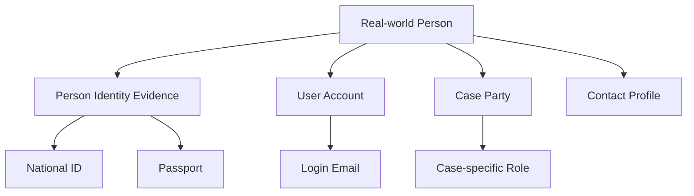

------
title: Learn Database Design and Architect - Part 012
description: A production-grade guide to database keys, identity, references, natural keys, surrogate keys, UUID/ULID, composite keys, external identifiers, and referential integrity design.
series: learn-database-design-architect
seriesTitle: Learn Database Design and Architect
order: 12
partTitle: Keys, Identity, and Reference Design
tags:
  - database
  - database-design
  - architecture
  - primary-key
  - foreign-key
  - identity
  - data-modeling
date: 2026-07-04
---

# Part 012 — Keys, Identity, and Reference Design

Keys look simple until the system is old, distributed, integrated, audited, migrated, merged, partitioned, and regulated.

At small scale, a key is “the ID column”. At architecture scale, a key is a long-term identity contract.

A good key design answers:

1. What makes this thing the same thing over time?
2. Who assigns identity?
3. Can identity change?
4. Is identity meaningful to humans or only to systems?
5. Is it unique globally, per tenant, per source, or per time period?
6. Is it stable across migration, integration, export, and audit?
7. Can it be guessed, leaked, sorted, sharded, cached, and indexed safely?
8. What references are allowed to point to it?

Most database design failures involving keys come from confusing these ideas:

| Concept | Meaning |
|---|---|
| Entity identity | The business concept of sameness over time |
| Row identity | The database row identifier |
| Business identifier | Human/domain-visible identifier |
| Technical identifier | System-generated identifier |
| External identifier | Identifier assigned by another system |
| Reference | A relationship from one record/entity to another |
| Constraint | A database rule that protects identity/reference correctness |

The top-level rule:

> **Never let convenience IDs accidentally become your business identity model.**

---

## 1. Identity Is a Domain Decision Before It Is a Database Decision

Before choosing `bigint`, `uuid`, or `text`, define what the entity is.

Example: `Person`

Bad question:

> Should `person.id` be UUID?

Better questions:

- Is a person identified by national ID, internal account, email, or registry number?
- Can two records refer to the same real person before deduplication?
- Can one real person have multiple legal identities?
- Can identifying documents change?
- Do we need historical identity evidence?
- Are we modeling a real-world person, a user account, a party in a case, or a contact record?

Those may be different entities.



If those concepts are collapsed into one `person` table with one `id`, the key may appear simple but the data model becomes brittle.

---

## 2. Key Taxonomy

| Key Type | Definition | Example |
|---|---|---|
| Primary key | Main row identifier enforced by database | `case_file.id` |
| Candidate key | Any attribute set that could uniquely identify a row | `case_file.reference_no` |
| Alternate key | Candidate key not chosen as primary key | `email`, `external_ref` |
| Natural key | Key derived from domain attributes | `country_code`, `taxpayer_number` |
| Surrogate key | Artificial system-generated key | `bigint id`, `uuid id` |
| Composite key | Key made from multiple columns | `(tenant_id, reference_no)` |
| Foreign key | Reference enforcing related row existence | `task.case_id -> case_file.id` |
| External key | Identifier from another system | `crm_customer_id` |
| Idempotency key | Request/command deduplication key | `payment_request_id` |
| Correlation key | Trace/process linking key | `case_import_batch_id` |
| Partition key | Determines data placement | `tenant_id`, `account_id` |
| Sort/clustering key | Determines physical/logical ordering in some databases | `(tenant_id, created_at)` |

Do not use the word “key” loosely in design docs. Say which kind.

---

## 3. Primary Key Design

A primary key should usually be:

- unique,
- not null,
- stable,
- narrow enough for indexing,
- meaningless unless intentionally domain-visible,
- safe to reference from many tables,
- not reused,
- not recycled,
- not derived from mutable attributes.

Typical relational table:

```sql
CREATE TABLE case_file (
    id             bigint GENERATED ALWAYS AS IDENTITY PRIMARY KEY,
    tenant_id      bigint NOT NULL,
    reference_no   text NOT NULL,
    status         text NOT NULL,
    created_at     timestamptz NOT NULL,
    UNIQUE (tenant_id, reference_no)
);
```

Here:

- `id` is the surrogate primary key.
- `(tenant_id, reference_no)` is an alternate business key.

This is often the most practical design for enterprise systems.

Why? Because technical references stay stable even if business identifiers change format.

---

## 4. Natural Keys

A natural key comes from the domain.

Examples:

- ISO country code,
- currency code,
- tax identifier,
- product SKU,
- email address,
- vehicle VIN,
- case reference number.

Natural keys are attractive because they are meaningful. But meaningful does not mean stable.

### Good Natural Key Candidates

A natural key may be good when it is:

- globally governed,
- immutable for your use case,
- short,
- non-sensitive,
- externally meaningful,
- unlikely to be reused,
- well-defined under edge cases.

Example:

```sql
CREATE TABLE country (
    iso_code char(2) PRIMARY KEY,
    name text NOT NULL
);
```

This is reasonable for many systems.

### Weak Natural Key Candidates

| Natural Key | Risk |
|---|---|
| Email | Can change, can be reused, case normalization issues |
| Phone number | Can change, reused, country formatting issues |
| Name + birthdate | Not unique, sensitive, spelling variation |
| Government ID | Sensitive, format changes, missing for some people |
| SKU | Business may reassign/change SKU |
| Case reference | Format may change, may be tenant-scoped |

Natural keys often still deserve `UNIQUE` constraints, but not necessarily primary key status.

Example:

```sql
CREATE TABLE user_account (
    id              uuid PRIMARY KEY,
    email_normalized text NOT NULL,
    email_original   text NOT NULL,
    created_at       timestamptz NOT NULL,
    UNIQUE (email_normalized)
);
```

Email is unique for login, but the stable reference from other tables should usually be `user_account.id`.

---

## 5. Surrogate Keys

A surrogate key is generated by the system and has no direct domain meaning.

Common choices:

| Type | Strength | Weakness |
|---|---|---|
| Auto-increment integer/bigint | Compact, index-friendly, simple | Guessable, central sequence, ordering leaks volume |
| UUID v4 | Globally unique, decentralized | Random insert pattern, larger index |
| UUID v7 / time-ordered UUID | Decentralized with better locality | Requires ecosystem support and clock discipline |
| ULID | Sortable, readable, decentralized | Not SQL-standard, careful implementation needed |
| Snowflake-style ID | Compact-ish, sortable, distributed | Requires generator coordination |
| Hash-based ID | Deterministic | Collision/normalization/security concerns |

No ID type is universally best.

Pick based on:

- write pattern,
- distribution needs,
- security exposure,
- indexing behavior,
- migration needs,
- external API contract,
- multi-region generation,
- human debugging ergonomics.

---

## 6. Bigint Identity Keys

Example:

```sql
CREATE TABLE case_file (
    id bigint GENERATED ALWAYS AS IDENTITY PRIMARY KEY,
    reference_no text NOT NULL UNIQUE
);
```

Advantages:

- compact indexes,
- fast joins,
- simple foreign keys,
- efficient locality for inserts,
- easy debugging.

Risks:

- sequential IDs reveal count/order,
- easy enumeration in public APIs,
- central sequence may complicate multi-writer distributed systems,
- migration/merge across systems may collide unless namespaced.

Use bigint identity when:

- database is primary generator,
- IDs are mostly internal,
- relational joins are frequent,
- system is not multi-primary distributed,
- API can expose a separate public identifier if needed.

Pattern:

```sql
CREATE TABLE case_file (
    id             bigint GENERATED ALWAYS AS IDENTITY PRIMARY KEY,
    public_id      uuid NOT NULL UNIQUE,
    tenant_id      bigint NOT NULL,
    reference_no   text NOT NULL,
    UNIQUE (tenant_id, reference_no)
);
```

Here `id` is efficient internally; `public_id` is safer externally.

---

## 7. UUID Keys

Example:

```sql
CREATE TABLE document_upload (
    id          uuid PRIMARY KEY,
    tenant_id   bigint NOT NULL,
    file_name   text NOT NULL,
    created_at  timestamptz NOT NULL
);
```

UUIDs are useful when:

- IDs must be generated outside the database,
- clients create objects offline,
- multiple services create records,
- merges across systems are expected,
- public exposure should not reveal sequence.

Risks:

- larger indexes,
- less cache-friendly joins than bigint,
- random UUID versions can cause less-local index inserts,
- harder manual debugging,
- still not authorization; unguessable does not mean accessible.

Guideline:

> UUID solves decentralized uniqueness. It does not solve entity modeling, authorization, or data ownership.

---

## 8. Public ID vs Internal ID

Many production systems should separate internal row identity from public/API identity.

```sql
CREATE TABLE enforcement_case (
    id             bigint GENERATED ALWAYS AS IDENTITY PRIMARY KEY,
    public_id      uuid NOT NULL UNIQUE,
    tenant_id      bigint NOT NULL,
    reference_no   text NOT NULL,
    created_at     timestamptz NOT NULL,
    UNIQUE (tenant_id, reference_no)
);
```

Use:

| Context | Identifier |
|---|---|
| Internal FK joins | `id` |
| API URL | `public_id` or `reference_no` |
| Human documents | `reference_no` |
| External integration | dedicated external mapping table |

API example:

```http
GET /cases/7f23c1e0-31d9-4a35-84ed-5e7a3dd56e94
```

Not:

```http
GET /cases/123
```

This avoids easy enumeration and lets the internal database optimize joins independently.

---

## 9. Business Reference Numbers

Human-visible reference numbers are not the same as primary keys.

Example:

```sql
CREATE TABLE case_file (
    id             bigint GENERATED ALWAYS AS IDENTITY PRIMARY KEY,
    tenant_id      bigint NOT NULL,
    reference_no   text NOT NULL,
    created_at     timestamptz NOT NULL,
    UNIQUE (tenant_id, reference_no)
);
```

`reference_no = CASE-2026-000123` may be used in documents, emails, and UI.

Design questions:

- Is it globally unique or tenant-scoped?
- Does it encode year, region, type, or sequence?
- Can format change?
- Can it be regenerated?
- Is it assigned at draft creation or submission?
- Can gaps exist?
- Does law/regulation require gapless sequence?

Critical point:

> Gapless numbers are operationally expensive under rollback, concurrency, and distributed writes.

If the business truly requires gapless legal numbering, design a dedicated allocation process with locking, audit, and failure handling. Do not accidentally rely on database sequence behavior as legal numbering.

---

## 10. Composite Keys

A composite key uses multiple columns.

Example:

```sql
CREATE TABLE tenant_user_role (
    tenant_id bigint NOT NULL,
    user_id   bigint NOT NULL,
    role_id   bigint NOT NULL,
    assigned_at timestamptz NOT NULL,
    PRIMARY KEY (tenant_id, user_id, role_id)
);
```

Good use cases:

- join tables,
- scoped uniqueness,
- associative entities,
- child entities that only exist within parent context,
- immutable event sequence per aggregate.

Composite keys are good when the key expresses the true grain.

Another example:

```sql
CREATE TABLE case_event (
    case_id        bigint NOT NULL,
    sequence_no    integer NOT NULL,
    event_type     text NOT NULL,
    occurred_at    timestamptz NOT NULL,
    payload_json   jsonb NOT NULL,
    PRIMARY KEY (case_id, sequence_no)
);
```

This says:

> Event identity is sequence number within a case.

That may be more meaningful than a global event ID.

### Composite Key Tradeoffs

Advantages:

- expresses scoped identity,
- prevents accidental duplicates,
- useful for many-to-many relationships,
- can align with partitioning/access pattern.

Costs:

- wider foreign keys,
- more verbose joins,
- harder ORM mapping,
- painful if key components change,
- index order matters.

Guideline:

Use composite keys for true relationship/grain constraints. Use surrogate primary keys when the entity will be referenced widely or key components may evolve.

Hybrid pattern:

```sql
CREATE TABLE case_assignment (
    id             bigint GENERATED ALWAYS AS IDENTITY PRIMARY KEY,
    case_id         bigint NOT NULL,
    officer_id      bigint NOT NULL,
    assignment_type text NOT NULL,
    active_from     timestamptz NOT NULL,
    active_to       timestamptz,
    UNIQUE (case_id, officer_id, assignment_type, active_from)
);
```

This keeps a narrow FK target while preserving natural uniqueness.

---

## 11. Tenant-Scoped Identity

In multi-tenant systems, uniqueness must be explicit.

Bad:

```sql
CREATE TABLE case_file (
    id bigint PRIMARY KEY,
    reference_no text UNIQUE
);
```

If `reference_no` is only unique per tenant, this is wrong.

Better:

```sql
CREATE TABLE case_file (
    id bigint GENERATED ALWAYS AS IDENTITY PRIMARY KEY,
    tenant_id bigint NOT NULL,
    reference_no text NOT NULL,
    UNIQUE (tenant_id, reference_no)
);
```

Reference design should also preserve tenant boundary.

```sql
CREATE TABLE task (
    id bigint GENERATED ALWAYS AS IDENTITY PRIMARY KEY,
    tenant_id bigint NOT NULL,
    case_id bigint NOT NULL,
    title text NOT NULL,
    FOREIGN KEY (case_id) REFERENCES case_file(id)
);
```

This enforces existence but not necessarily tenant consistency. If `case_id` is globally unique, the FK ensures task points to a case, but an application bug could still attach tenant A task to tenant B case if `tenant_id` is separately writable.

Stronger design:

```sql
CREATE TABLE case_file (
    id bigint GENERATED ALWAYS AS IDENTITY PRIMARY KEY,
    tenant_id bigint NOT NULL,
    reference_no text NOT NULL,
    UNIQUE (id, tenant_id),
    UNIQUE (tenant_id, reference_no)
);

CREATE TABLE task (
    id bigint GENERATED ALWAYS AS IDENTITY PRIMARY KEY,
    tenant_id bigint NOT NULL,
    case_id bigint NOT NULL,
    title text NOT NULL,
    FOREIGN KEY (case_id, tenant_id) REFERENCES case_file(id, tenant_id)
);
```

This makes cross-tenant reference harder to create.

Important:

> Multi-tenant identity is not only about ID uniqueness. It is about preventing references from crossing isolation boundaries.

---

## 12. Foreign Key Design

Foreign keys protect referential integrity.

Example:

```sql
CREATE TABLE task (
    id       bigint GENERATED ALWAYS AS IDENTITY PRIMARY KEY,
    case_id  bigint NOT NULL REFERENCES case_file(id),
    title    text NOT NULL
);
```

A foreign key answers:

> This value must refer to an existing parent row.

But a foreign key does not automatically answer:

- Is the referenced row in the same tenant?
- Is the referenced row in the correct lifecycle state?
- Is the relationship allowed by business rules?
- Is the current user authorized to create the relationship?
- Is the reference temporal?

Foreign keys are necessary but not sufficient.

---

## 13. Foreign Key Actions

Typical referential actions:

| Action | Meaning | Use Carefully For |
|---|---|---|
| `RESTRICT` / `NO ACTION` | Prevent parent delete/update if children exist | Core business entities |
| `CASCADE` | Delete/update children automatically | Pure dependent records |
| `SET NULL` | Remove reference when parent removed | Optional association |
| `SET DEFAULT` | Replace with default key | Rare, often dangerous |

Example:

```sql
CREATE TABLE case_note (
    id bigint GENERATED ALWAYS AS IDENTITY PRIMARY KEY,
    case_id bigint NOT NULL REFERENCES case_file(id) ON DELETE RESTRICT,
    body text NOT NULL
);
```

For regulated case records, `CASCADE DELETE` is often dangerous. You usually want retention, archival, or explicit closure rather than deleting evidentiary children.

Good cascade candidate:

```sql
CREATE TABLE user_session (
    id bigint GENERATED ALWAYS AS IDENTITY PRIMARY KEY,
    user_id bigint NOT NULL REFERENCES user_account(id) ON DELETE CASCADE,
    token_hash text NOT NULL
);
```

A session has no independent historical business meaning after the user account is deleted/removed according to policy.

Design rule:

> Use cascade only when the child is truly owned by the parent and has no independent retention/audit requirement.

---

## 14. Optional References

Optional references are often legitimate, but they need semantic clarity.

Bad:

```sql
assigned_user_id bigint NULL
```

Questions:

- Is it null because unassigned?
- Is assignment pending?
- Is assignment not applicable?
- Was assigned user deleted?
- Is the assignment unknown due to migration?

Better:

```sql
assignment_state text NOT NULL CHECK (assignment_state IN ('UNASSIGNED', 'ASSIGNED', 'NOT_APPLICABLE')),
assigned_user_id bigint NULL REFERENCES user_account(id),
CHECK (
    (assignment_state = 'ASSIGNED' AND assigned_user_id IS NOT NULL)
    OR
    (assignment_state <> 'ASSIGNED' AND assigned_user_id IS NULL)
)
```

This prevents ambiguous nulls.

---

## 15. Polymorphic References

Polymorphic reference anti-pattern:

```sql
CREATE TABLE attachment (
    id bigint PRIMARY KEY,
    owner_type text NOT NULL,
    owner_id bigint NOT NULL
);
```

This says attachment can belong to different entity types, but the database cannot enforce foreign key integrity directly.

Risks:

- owner row may not exist,
- owner type typo,
- cascade/retention unclear,
- authorization unclear,
- query performance inconsistent.

Better options:

### Option A — Separate Join Tables

```sql
CREATE TABLE case_attachment (
    case_id bigint NOT NULL REFERENCES case_file(id),
    attachment_id bigint NOT NULL REFERENCES attachment(id),
    PRIMARY KEY (case_id, attachment_id)
);

CREATE TABLE task_attachment (
    task_id bigint NOT NULL REFERENCES task(id),
    attachment_id bigint NOT NULL REFERENCES attachment(id),
    PRIMARY KEY (task_id, attachment_id)
);
```

### Option B — Supertype Table

```sql
CREATE TABLE attachable_resource (
    id bigint GENERATED ALWAYS AS IDENTITY PRIMARY KEY,
    resource_type text NOT NULL
);

CREATE TABLE attachment (
    id bigint GENERATED ALWAYS AS IDENTITY PRIMARY KEY,
    attachable_resource_id bigint NOT NULL REFERENCES attachable_resource(id)
);
```

Use only if your domain really has a shared supertype.

### Option C — Separate Nullable FKs With Check

```sql
CREATE TABLE attachment_link (
    id bigint GENERATED ALWAYS AS IDENTITY PRIMARY KEY,
    attachment_id bigint NOT NULL REFERENCES attachment(id),
    case_id bigint REFERENCES case_file(id),
    task_id bigint REFERENCES task(id),
    CHECK (
        (case_id IS NOT NULL)::int +
        (task_id IS NOT NULL)::int = 1
    )
);
```

This is acceptable when the set of target types is small and stable.

---

## 16. Relationship as Entity

A relationship sometimes deserves its own identity.

Bad simplification:

```sql
case_file.assigned_officer_id
```

If assignment has lifecycle, history, role, reason, and approval, it is not just a foreign key.

Better:

```sql
CREATE TABLE case_assignment (
    id bigint GENERATED ALWAYS AS IDENTITY PRIMARY KEY,
    case_id bigint NOT NULL REFERENCES case_file(id),
    officer_id bigint NOT NULL REFERENCES officer(id),
    assignment_type text NOT NULL,
    assigned_at timestamptz NOT NULL,
    assigned_by_user_id bigint NOT NULL REFERENCES user_account(id),
    unassigned_at timestamptz,
    unassigned_reason text
);
```

Use relationship-as-entity when the relationship has:

- attributes,
- lifecycle,
- history,
- authorization,
- audit requirement,
- workflow behavior,
- external reference.

---

## 17. External Identifiers

External systems assign their own IDs. Do not overload your primary key with external identity.

Bad:

```sql
CREATE TABLE customer (
    id text PRIMARY KEY -- CRM customer ID
);
```

This makes your database identity dependent on an external system's stability and semantics.

Better:

```sql
CREATE TABLE customer (
    id bigint GENERATED ALWAYS AS IDENTITY PRIMARY KEY,
    public_id uuid NOT NULL UNIQUE,
    name text NOT NULL
);

CREATE TABLE customer_external_identity (
    id bigint GENERATED ALWAYS AS IDENTITY PRIMARY KEY,
    customer_id bigint NOT NULL REFERENCES customer(id),
    source_system text NOT NULL,
    external_id text NOT NULL,
    first_seen_at timestamptz NOT NULL,
    last_seen_at timestamptz NOT NULL,
    UNIQUE (source_system, external_id),
    UNIQUE (customer_id, source_system)
);
```

This supports:

- multiple external systems,
- ID changes,
- merges,
- audit,
- source-system migration,
- deduplication.

---

## 18. Identity Merge and Split

Real systems often discover duplicate identities.

Example:

```text
customer_id 1001 and customer_id 2044 are same real customer.
```

Naive approach:

```text
Update all references from 2044 to 1001, delete 2044.
```

This may break audit and historical evidence.

Better pattern:

```sql
CREATE TABLE identity_merge_event (
    id bigint GENERATED ALWAYS AS IDENTITY PRIMARY KEY,
    entity_type text NOT NULL,
    survivor_id bigint NOT NULL,
    merged_id bigint NOT NULL,
    reason text NOT NULL,
    merged_at timestamptz NOT NULL,
    merged_by_user_id bigint NOT NULL,
    UNIQUE (entity_type, merged_id)
);
```

Depending on domain, you may:

- preserve old row as inactive/merged,
- redirect future operations to survivor,
- keep historical references unchanged,
- rewrite only operational references,
- record merge event for audit.

Identity split is even harder:

```text
One customer record actually represents two different customers.
```

If your key model assumes merges only, splits will be painful. Regulatory and case-management systems should expect both correction types.

---

## 19. Idempotency Keys

Idempotency keys prevent duplicate command effects.

Example problem:

```text
Client submits payment.
Network timeout occurs.
Client retries.
System must not create two payments.
```

Table:

```sql
CREATE TABLE idempotency_record (
    idempotency_key text NOT NULL,
    command_type text NOT NULL,
    requester_id bigint NOT NULL,
    request_hash text NOT NULL,
    response_body jsonb,
    status text NOT NULL CHECK (status IN ('IN_PROGRESS', 'COMPLETED', 'FAILED')),
    created_at timestamptz NOT NULL,
    completed_at timestamptz,
    PRIMARY KEY (requester_id, command_type, idempotency_key)
);
```

Rules:

- Same key + same request means return same result.
- Same key + different request should fail.
- Key scope must be clear: per user, tenant, client, command type, or integration partner.
- Expiration/retention must match retry window and audit requirements.

Do not confuse idempotency key with entity primary key. It is command identity, not business entity identity.

---

## 20. Correlation Keys

Correlation keys link distributed work.

Example:

```sql
CREATE TABLE import_batch (
    id bigint GENERATED ALWAYS AS IDENTITY PRIMARY KEY,
    correlation_id uuid NOT NULL UNIQUE,
    source_system text NOT NULL,
    started_at timestamptz NOT NULL
);
```

Correlation ID is useful for:

- tracing,
- debugging,
- log joins,
- replay,
- integration monitoring,
- support investigations.

But correlation ID should not become the primary business identity unless the domain says so.

---

## 21. Key Design and Index Shape

Primary keys and foreign keys create index implications.

Narrow keys are generally better for:

- B-tree fanout,
- cache locality,
- join performance,
- secondary index size,
- foreign key storage.

Wide composite keys can be valid but propagate cost.

Example:

```sql
CREATE TABLE child (
    tenant_id bigint NOT NULL,
    parent_type text NOT NULL,
    parent_ref text NOT NULL,
    sequence_no integer NOT NULL,
    PRIMARY KEY (tenant_id, parent_type, parent_ref, sequence_no)
);
```

If many tables reference this key, every child reference becomes wide.

Alternative:

```sql
CREATE TABLE parent (
    id bigint GENERATED ALWAYS AS IDENTITY PRIMARY KEY,
    tenant_id bigint NOT NULL,
    parent_type text NOT NULL,
    parent_ref text NOT NULL,
    UNIQUE (tenant_id, parent_type, parent_ref)
);
```

Now other tables reference `parent.id`, while the natural uniqueness remains enforced.

---

## 22. Key Design and Sharding

In distributed systems, keys affect data placement.

Questions:

- Is the shard key also the primary access key?
- Will writes concentrate on one shard?
- Does sequential ID create hotspot?
- Do queries need cross-shard joins?
- Can tenant data be co-located?
- Can a tenant grow too large for one shard?

Common shard keys:

| Shard Key | Strength | Weakness |
|---|---|---|
| `tenant_id` | tenant isolation, simple routing | large tenant hotspot |
| `account_id` | domain locality | uneven account sizes |
| hash of entity ID | even distribution | cross-entity queries expensive |
| region + tenant | locality | migration complexity |
| time bucket | good for append/time series | hot current bucket |

Identity strategy must match placement strategy.

Example:

```text
Primary lookup: case by tenant + reference_no
Common list: cases by tenant + status
Isolation: tenant boundary
Potential shard key: tenant_id, with large-tenant escape strategy
```

Do not choose UUID merely because the system may be distributed. Sharding needs access-pattern and locality design.

---

## 23. Key Design and Security

Sequential IDs are not security vulnerabilities by themselves, but exposing them can enable enumeration.

Risky API:

```http
GET /documents/1001
GET /documents/1002
GET /documents/1003
```

Safer API:

```http
GET /documents/f9b6ef26-8694-48db-8552-97d895bd52ac
```

But remember:

> Unguessable IDs reduce enumeration risk; they do not replace authorization checks.

Always enforce access control by user/tenant/policy, not by secrecy of ID.

---

## 24. Temporal References

Some references are valid only during a time interval.

Example:

```sql
CREATE TABLE case_assignment (
    id bigint GENERATED ALWAYS AS IDENTITY PRIMARY KEY,
    case_id bigint NOT NULL REFERENCES case_file(id),
    officer_id bigint NOT NULL REFERENCES officer(id),
    valid_from timestamptz NOT NULL,
    valid_to timestamptz,
    CHECK (valid_to IS NULL OR valid_to > valid_from)
);
```

Question:

> Can one case have two active primary officers at the same time?

This is not solved by simple FK. You need exclusion/unique logic depending on database capabilities.

Conceptually:

```text
For each case_id, assignment_type = 'PRIMARY', time ranges must not overlap.
```

Temporal relationships are common in:

- assignments,
- memberships,
- policies,
- prices,
- addresses,
- roles,
- delegations,
- licenses,
- contracts.

Design temporal references explicitly. Do not overwrite history unless the business truly has no need for it.

---

## 25. Reference Data Keys

Reference data includes things like statuses, categories, countries, violation types, and policy codes.

Two patterns:

### Pattern A — Code as Primary Key

```sql
CREATE TABLE case_status (
    code text PRIMARY KEY,
    display_name text NOT NULL,
    sort_order integer NOT NULL
);
```

Good when code is stable and domain-governed.

### Pattern B — Surrogate ID + Code

```sql
CREATE TABLE violation_type (
    id bigint GENERATED ALWAYS AS IDENTITY PRIMARY KEY,
    code text NOT NULL UNIQUE,
    display_name text NOT NULL,
    effective_from date NOT NULL,
    effective_to date
);
```

Better when reference data has lifecycle, versioning, external mappings, or complex attributes.

Rule:

> Static lookup values can use code keys. Governed evolving reference data often deserves surrogate identity plus unique code/version constraints.

---

## 26. Status Keys

Avoid arbitrary status text scattered through tables.

Weak:

```sql
status text NOT NULL
```

Better:

```sql
CREATE TABLE case_status (
    code text PRIMARY KEY,
    is_terminal boolean NOT NULL,
    display_name text NOT NULL
);

CREATE TABLE case_file (
    id bigint GENERATED ALWAYS AS IDENTITY PRIMARY KEY,
    status_code text NOT NULL REFERENCES case_status(code)
);
```

However, not every status table makes the state machine safe. Transition rules need separate modelling.

```sql
CREATE TABLE case_status_transition (
    from_status_code text NOT NULL REFERENCES case_status(code),
    to_status_code text NOT NULL REFERENCES case_status(code),
    transition_name text NOT NULL,
    PRIMARY KEY (from_status_code, to_status_code)
);
```

This protects allowed transitions structurally, though command logic still needs guard conditions.

---

## 27. Key Immutability

A key used as a reference should not change casually.

Bad:

```sql
-- product SKU used as primary key
product_sku text PRIMARY KEY
```

Then business renames SKU.

You now need cascading update across all references, external integrations, audit logs, and reports.

Better:

```sql
CREATE TABLE product (
    id bigint GENERATED ALWAYS AS IDENTITY PRIMARY KEY,
    sku text NOT NULL UNIQUE,
    name text NOT NULL
);
```

If SKU changes, `product.id` remains stable.

Guideline:

> Mutable domain attributes should not be primary keys for widely referenced entities.

---

## 28. Delete, Retention, and Key Reuse

Do not reuse IDs.

Key reuse destroys historical interpretation.

Bad:

```text
Officer ID 15 used to mean Alice.
Alice deleted.
Officer ID 15 reused for Bob.
Historical assignment now appears assigned to Bob.
```

Production rule:

- IDs are never reused.
- Deleted entities are tombstoned/archived according to retention policy.
- Historical references remain interpretable.

For regulated systems, prefer:

```sql
CREATE TABLE officer (
    id bigint GENERATED ALWAYS AS IDENTITY PRIMARY KEY,
    name text NOT NULL,
    active boolean NOT NULL,
    deactivated_at timestamptz
);
```

Not physical deletion as default.

---

## 29. Designing References Across Bounded Contexts

Inside one database, foreign keys are powerful. Across service/database boundaries, FK constraints usually cannot be enforced directly.

Example:

```text
Case service stores subject_id from Subject service.
No database FK can enforce it.
```

Options:

| Option | Meaning |
|---|---|
| Synchronous validation | Check remote service before write |
| Local projection | Store subject reference projection locally |
| Event-driven consistency | React to subject changes/deletes |
| Shared database FK | Strong but couples services |
| No direct reference | Use integration event/correlation only |

Cross-boundary reference contract:

```text
Referenced entity: Subject
Owning system: Subject Registry
Local field: subject_registry_id
Validation: synchronous at case creation
Change propagation: subject.updated event updates display projection
Deletion policy: subject cannot be hard-deleted while referenced by active case
Fallback: case stores subject_name_at_submission for evidence
```

This is better than merely saying `subject_id`.

---

## 30. Database Key Review Checklist

### Entity Identity

- What entity does this table represent?
- What makes two rows the same business thing?
- Can duplicates exist before resolution?
- Can identity merge or split?

### Primary Key

- Is the primary key stable?
- Is it narrow enough for frequent references?
- Is it exposed externally?
- Is there a separate public ID if needed?
- Is it generated centrally or distributed?

### Business Keys

- What alternate/candidate keys exist?
- Are they enforced with `UNIQUE` constraints?
- Are they tenant-scoped?
- Are they mutable?
- Are they sensitive?

### Foreign Keys

- Are important references enforced?
- Are tenant boundaries enforced?
- Are cascade actions safe?
- Are optional references semantically clear?
- Are polymorphic references avoided or controlled?

### External IDs

- Are external IDs stored separately?
- Is `(source_system, external_id)` unique?
- Can external IDs change?
- Is mapping history needed?

### Distributed/Operational Concerns

- Does ID choice affect index locality?
- Does it create shard hotspot?
- Does it leak volume/order?
- Can IDs be generated during offline/client workflows?
- Can data from multiple systems be merged safely?

---

## 31. Common Design Smells

| Smell | Why It Hurts |
|---|---|
| Every table has `id` but no unique business constraints | Duplicate business entities accumulate |
| Natural key used as PK despite mutability | Cascading changes and broken history |
| UUID everywhere without reason | Larger indexes, harder debugging, no modeling benefit |
| Sequential IDs exposed publicly | Enumeration risk |
| External system ID as local PK | External semantics control your database |
| Polymorphic FK with `type/id` | No referential integrity |
| Nullable FK without state explanation | Ambiguous relationship state |
| Missing tenant in unique constraints | Cross-tenant collisions or leaks |
| Cascade delete on evidentiary records | Accidental data loss |
| Status stored as arbitrary text | Invalid states and inconsistent transitions |

---

## 32. Practical Decision Matrix

| Situation | Recommended Key Strategy |
|---|---|
| Internal OLTP relational entity | `bigint identity` PK + business unique constraints |
| Public API entity | internal PK + `uuid public_id` or domain reference |
| Multi-tenant business reference | `UNIQUE (tenant_id, reference_no)` |
| Join table without lifecycle | composite PK of FKs |
| Relationship with history/attributes | surrogate PK + uniqueness on relationship grain |
| Static reference data | stable code as PK may be fine |
| Evolving reference data | surrogate PK + code/version uniqueness |
| Distributed client-created records | UUID/time-ordered UUID/ULID with validation |
| External integration identity | mapping table `(source_system, external_id)` |
| Legal document number | dedicated business sequence/allocation process |
| High-volume sharded system | key strategy aligned with shard/access pattern |

---

## 33. Regulatory Case Management Example

Entities:

- `case_file`,
- `case_party`,
- `subject`,
- `case_assignment`,
- `case_event`,
- `notice`,
- `evidence_document`.

Design:

```sql
CREATE TABLE case_file (
    id             bigint GENERATED ALWAYS AS IDENTITY PRIMARY KEY,
    public_id      uuid NOT NULL UNIQUE,
    tenant_id      bigint NOT NULL,
    reference_no   text NOT NULL,
    status_code    text NOT NULL,
    created_at     timestamptz NOT NULL,
    UNIQUE (tenant_id, reference_no)
);

CREATE TABLE subject (
    id          bigint GENERATED ALWAYS AS IDENTITY PRIMARY KEY,
    public_id   uuid NOT NULL UNIQUE,
    tenant_id   bigint NOT NULL,
    subject_type text NOT NULL,
    display_name text NOT NULL,
    UNIQUE (id, tenant_id)
);

CREATE TABLE case_party (
    id bigint GENERATED ALWAYS AS IDENTITY PRIMARY KEY,
    tenant_id bigint NOT NULL,
    case_id bigint NOT NULL,
    subject_id bigint NOT NULL,
    party_role_code text NOT NULL,
    added_at timestamptz NOT NULL,
    removed_at timestamptz,
    FOREIGN KEY (case_id, tenant_id) REFERENCES case_file(id, tenant_id),
    FOREIGN KEY (subject_id, tenant_id) REFERENCES subject(id, tenant_id),
    UNIQUE (case_id, subject_id, party_role_code, added_at)
);

CREATE TABLE notice (
    id bigint GENERATED ALWAYS AS IDENTITY PRIMARY KEY,
    public_id uuid NOT NULL UNIQUE,
    tenant_id bigint NOT NULL,
    case_id bigint NOT NULL,
    notice_no text NOT NULL,
    subject_name_at_issuance text NOT NULL,
    issued_at timestamptz NOT NULL,
    FOREIGN KEY (case_id, tenant_id) REFERENCES case_file(id, tenant_id),
    UNIQUE (tenant_id, notice_no)
);
```

Notice the choices:

- internal `id` for efficient joins,
- `public_id` for external API,
- `reference_no` / `notice_no` as human business references,
- tenant-scoped uniqueness,
- composite FK including tenant boundary,
- relationship-as-entity for parties,
- snapshot name for notice issuance.

This is the kind of key/reference design that remains explainable during audit and migration.

---

## 34. Mini Exercises

### Exercise 1

A user logs in with email. Should email be the primary key?

Recommended answer:

Usually no. Email can be a unique login identifier, but it can change, has normalization rules, and may be reused. Use a stable surrogate `user_account.id`, with `UNIQUE(email_normalized)`.

### Exercise 2

A case reference number is `CASE-2026-000123`. Should it be the primary key?

Recommended answer:

Usually no. It should be a unique business reference, likely tenant-scoped. Use a surrogate internal key for joins and keep `reference_no` unique for user/document lookup.

### Exercise 3

A table has `owner_type` and `owner_id`. Is this acceptable?

Recommended answer:

It is a smell. It may be acceptable for low-risk metadata, but for core business records prefer separate join tables, a true supertype table, or constrained nullable FKs.

### Exercise 4

A multi-tenant system has `task.case_id -> case_file.id` and also stores `task.tenant_id`. Is this enough?

Recommended answer:

Not necessarily. If tenant consistency matters, consider enforcing `FOREIGN KEY (case_id, tenant_id) REFERENCES case_file(id, tenant_id)` with a matching unique constraint.

---

## 35. Key Takeaways

1. Identity is a domain decision before it is a datatype decision.
2. Primary keys, business keys, public IDs, external IDs, and idempotency keys solve different problems.
3. Surrogate keys are often practical, but they do not remove the need for unique business constraints.
4. Natural keys are useful when stable and governed; dangerous when mutable or sensitive.
5. Public IDs and internal IDs often should be separate.
6. Composite keys are powerful when they express true grain, but costly when propagated widely.
7. Foreign keys protect existence, not full business validity.
8. Tenant-scoped systems should enforce tenant boundary in references, not only in application code.
9. Polymorphic references trade convenience for weak integrity.
10. External identifiers belong in mapping tables, not as accidental local primary keys.
11. ID secrecy is not authorization.
12. Good key design makes future migration, audit, integration, and refactoring possible.

---

## References for Further Study

- PostgreSQL Documentation — Identity Columns, Constraints, Foreign Keys, Unique Constraints, Generated Columns, and Indexes.
- MongoDB Manual — Data Modeling, References, and Embedded Data Models.
- AWS Prescriptive Guidance — Database-per-service and data ownership considerations.
- Martin Fowler — Patterns of Enterprise Application Architecture, Identity Field and Foreign Key Mapping.
- Martin Kleppmann — *Designing Data-Intensive Applications*, especially data models, replication, partitioning, and distributed identifiers.
- James Smith — *Build Your Own Database From Scratch*, for the lower-level consequences of key choice on B+Tree storage and lookup behavior.
