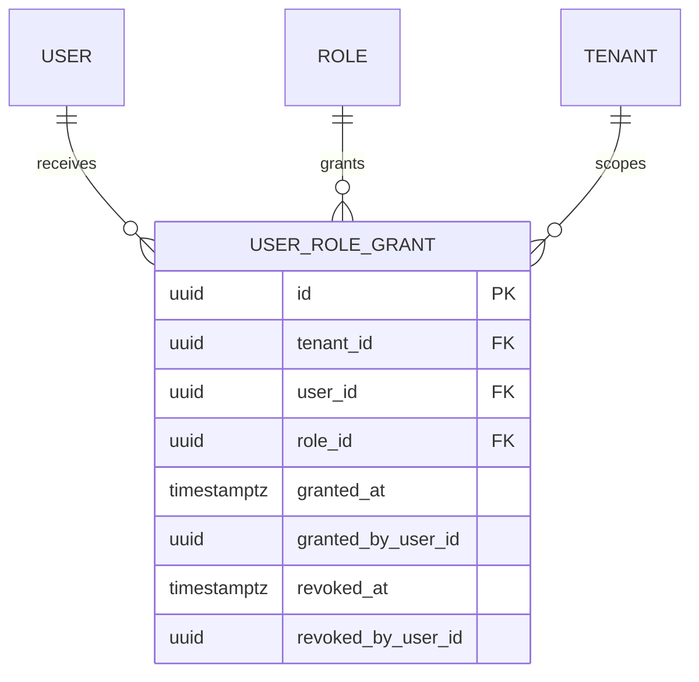
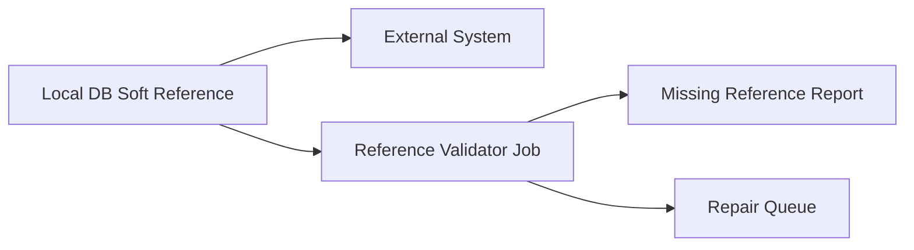
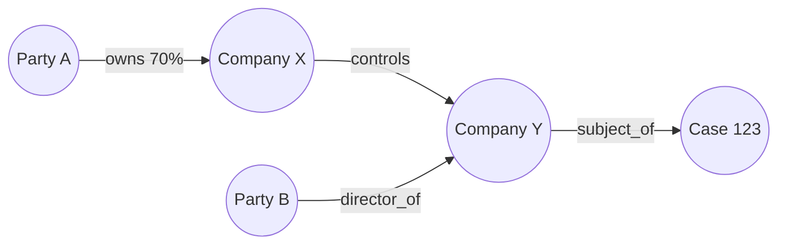
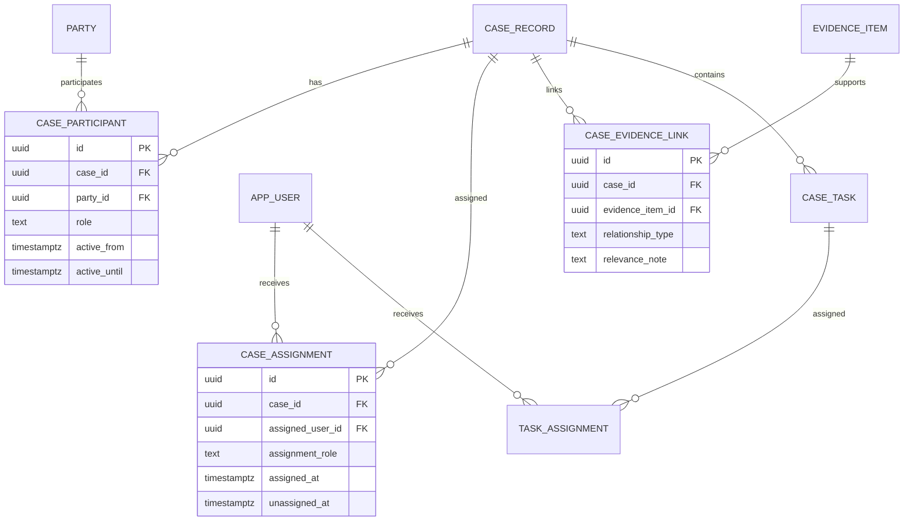
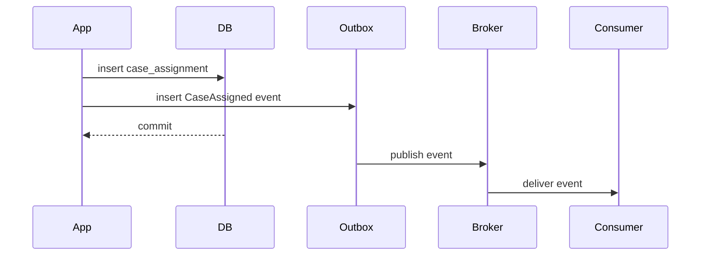

# Part 013 — Cardinality and Relationship Modelling

Database design becomes serious when we stop drawing boxes and start proving relationships.

Most failed schemas do not fail because the table names are ugly. They fail because the system quietly accepts impossible relationships:

- a case has two active owners when the business says it must have one;
- an approval belongs to a document version that no longer exists;
- a customer is deleted while orders still reference it;
- a many-to-many relation hides attributes that should have been first-class;
- an assignment record says who owns a task but not when that ownership became true;
- a foreign key exists, but the real business relationship is temporal, conditional, scoped, or role-based.

The advanced skill is not “knowing ERD notation”. The advanced skill is turning domain relationships into enforceable, evolvable, queryable, and operationally safe structures.

This part focuses on relationship modelling from a production engineering perspective.

---

## 1. What This Part Is Really About

A relationship in a database is not merely a line between two tables.

A relationship is a statement like:

> For every fact of type `X`, there must be zero, one, or many related facts of type `Y`, under these rules, during this period, with this ownership, and with these consequences when either side changes.

That sentence contains the real design work:

1. **Cardinality** — how many related records may exist?
2. **Optionality** — is the relationship required?
3. **Direction of dependency** — which side cannot exist without the other?
4. **Lifecycle coupling** — do the records live and die together?
5. **Ownership** — which aggregate/domain owns the relationship?
6. **Temporal validity** — is the relationship always true, or true only during a period?
7. **Attributes** — does the relationship itself have data?
8. **Constraint enforceability** — can the database enforce it directly?
9. **Query shape** — how will the relationship be traversed under real workload?
10. **Change impact** — what happens when the relationship changes in production?

A top-tier engineer models the relationship, not just the entities.

---

## 2. Mental Model: Relationship as a Fact

A common beginner mistake is to think:

> “User has many roles.”

A better architect asks:

> “What fact are we recording when we say a user has a role?”

The answer may be:

- `user_role_grant` — a role was granted to a user;
- `user_role_assignment` — a user currently holds a role in a tenant;
- `user_role_history` — a user held a role during a time interval;
- `authorization_subject_role` — a subject has a role under a policy scope;
- `case_participant_role` — a person participates in a case with a role.

The relationship is often its own fact.

Bad modelling compresses facts into a loose join table. Good modelling names the relationship according to the business truth it represents.



This is not merely `user_roles`. It is a grant record with lifecycle, authority, auditability, and revocation semantics.

---

## 3. Cardinality Is a Constraint, Not Decoration

Cardinality describes how many records on one side may relate to records on the other side.

The basic forms are:

| Cardinality | Meaning | Common Implementation |
|---|---|---|
| `0..1` | optional one | nullable foreign key or optional unique relation |
| `1..1` | exactly one | non-null foreign key plus uniqueness or shared primary key |
| `0..N` | optional many | foreign key on child table |
| `1..N` | at least one | foreign key plus application/workflow enforcement, sometimes deferred validation |
| `N..M` | many-to-many | association table |
| bounded many | limited count, e.g. max 3 approvers | trigger, exclusion, application + reconciliation, or specialized constraint |
| conditional cardinality | depends on status/type/scope | partial unique index, check constraints, trigger, or state machine guard |
| temporal cardinality | applies during time interval | range/exclusion constraint or transaction logic |

The important point: cardinality must eventually become a constraint somewhere.

If it only exists in a diagram, it is not part of the system.

---

## 4. Optionality: Nullable Does Not Mean Optional in the Domain

A nullable foreign key is often misused.

Example:

```sql
CREATE TABLE task (
  id uuid PRIMARY KEY,
  assigned_user_id uuid NULL REFERENCES app_user(id)
);
```

This says: a task may exist without an assigned user.

But the domain meaning could be many different things:

1. The task has not been assigned yet.
2. The assignment was removed.
3. The assigned user was deleted.
4. Assignment is not required for this task type.
5. The data was migrated from an old system and is incomplete.
6. A bug inserted an invalid task.

All six meanings collapse into `NULL`.

Better design often separates lifecycle state from relationship absence:

```sql
CREATE TABLE task (
  id uuid PRIMARY KEY,
  assignment_state text NOT NULL CHECK (
    assignment_state IN ('UNASSIGNED', 'ASSIGNED', 'UNASSIGNABLE')
  )
);

CREATE TABLE task_assignment (
  task_id uuid PRIMARY KEY REFERENCES task(id),
  assigned_user_id uuid NOT NULL REFERENCES app_user(id),
  assigned_at timestamptz NOT NULL,
  assigned_by_user_id uuid NOT NULL REFERENCES app_user(id)
);
```

Now absence of a row in `task_assignment` is meaningful only when interpreted with `assignment_state`.

The deeper lesson:

> Optionality should represent domain meaning, not developer convenience.

---

## 5. One-to-One Relationship

A one-to-one relationship means one record on side A relates to at most one record on side B, and one record on side B relates to at most one record on side A.

There are several implementation choices.

### 5.1 Shared Primary Key

Use when the dependent record has the same identity and lifecycle as the parent.

```sql
CREATE TABLE person (
  id uuid PRIMARY KEY,
  legal_name text NOT NULL
);

CREATE TABLE person_profile (
  person_id uuid PRIMARY KEY REFERENCES person(id) ON DELETE CASCADE,
  display_name text NOT NULL,
  bio text
);
```

Here `person_profile.person_id` is both primary key and foreign key.

Use this when:

- the child cannot exist without the parent;
- there is exactly one child per parent;
- the child is an extension of the parent;
- delete behavior is lifecycle-coupled.

Avoid it when the child has an independent lifecycle or may become many later.

### 5.2 Unique Foreign Key

Use when the child has its own identity but references one parent uniquely.

```sql
CREATE TABLE employee_account (
  id uuid PRIMARY KEY,
  person_id uuid NOT NULL UNIQUE REFERENCES person(id),
  employee_number text NOT NULL UNIQUE
);
```

This says one person can have at most one employee account.

### 5.3 Optional One-to-One

```sql
CREATE TABLE case_record (
  id uuid PRIMARY KEY,
  reference_no text NOT NULL UNIQUE
);

CREATE TABLE case_closure_summary (
  case_id uuid PRIMARY KEY REFERENCES case_record(id),
  closure_reason text NOT NULL,
  closed_at timestamptz NOT NULL
);
```

A case may or may not have a closure summary. If it has one, it has exactly one.

This is usually better than putting nullable closure columns directly on `case_record` when closure has many attributes, separate authorization, separate lifecycle, or separate audit needs.

---

## 6. One-to-Many Relationship

A one-to-many relationship is implemented by placing a foreign key on the many side.

```sql
CREATE TABLE customer (
  id uuid PRIMARY KEY,
  name text NOT NULL
);

CREATE TABLE customer_address (
  id uuid PRIMARY KEY,
  customer_id uuid NOT NULL REFERENCES customer(id),
  address_line text NOT NULL,
  city text NOT NULL,
  country_code char(2) NOT NULL
);
```

This allows one customer to have many addresses.

But the business rules are rarely that simple.

Questions you must ask:

1. Can a customer have zero addresses?
2. Is one address primary?
3. Can there be multiple active addresses of the same type?
4. Can an address be shared by multiple customers?
5. Is address history required?
6. What happens when a customer moves?
7. Does an old invoice need the historical address snapshot?
8. Can address changes be corrected?
9. Is the address an entity or a value object?

A naive schema answers almost none of these.

### 6.1 One Active Child Per Parent

Example: one active primary address per customer.

```sql
CREATE TABLE customer_address (
  id uuid PRIMARY KEY,
  customer_id uuid NOT NULL REFERENCES customer(id),
  address_type text NOT NULL CHECK (address_type IN ('PRIMARY', 'BILLING', 'SHIPPING')),
  address_line text NOT NULL,
  city text NOT NULL,
  country_code char(2) NOT NULL,
  active boolean NOT NULL DEFAULT true
);

CREATE UNIQUE INDEX uq_customer_one_active_address_type
ON customer_address(customer_id, address_type)
WHERE active = true;
```

This is not just an index. It is a business rule.

A partial unique index can encode conditional cardinality: for each customer and address type, at most one active row may exist.

### 6.2 At Least One Child

“Each customer must have at least one verified contact method” is harder to enforce using only a standard foreign key because the parent row is often inserted before the child row.

Options:

1. enforce in application transaction;
2. use deferred constraints/triggers;
3. use workflow state so the parent is not considered active until child exists;
4. use validation job/reconciliation;
5. model the child as part of the creation command.

A production-safe design usually combines workflow state and validation:

```sql
CREATE TABLE customer (
  id uuid PRIMARY KEY,
  lifecycle_state text NOT NULL CHECK (
    lifecycle_state IN ('DRAFT', 'ACTIVE', 'SUSPENDED', 'CLOSED')
  )
);

CREATE TABLE customer_contact_method (
  id uuid PRIMARY KEY,
  customer_id uuid NOT NULL REFERENCES customer(id),
  contact_type text NOT NULL,
  value text NOT NULL,
  verified_at timestamptz
);
```

Then the invariant is:

> A customer may transition to `ACTIVE` only if at least one verified contact method exists.

This invariant is state transition logic plus database facts. Do not pretend every domain invariant fits neatly into a single DDL constraint.

---

## 7. Many-to-Many Relationship

A many-to-many relationship requires an association table.

```sql
CREATE TABLE user_group_membership (
  user_id uuid NOT NULL REFERENCES app_user(id),
  group_id uuid NOT NULL REFERENCES app_group(id),
  PRIMARY KEY (user_id, group_id)
);
```

This is the minimal form.

But minimal many-to-many design is often insufficient in real systems.

Usually the relationship has attributes:

- when it started;
- who created it;
- whether it is active;
- why it exists;
- what role the user has in the group;
- whether the relationship was imported, approved, delegated, or revoked;
- tenant/scope;
- validity interval;
- audit metadata.

Then the association table becomes a first-class entity:

```sql
CREATE TABLE group_membership (
  id uuid PRIMARY KEY,
  tenant_id uuid NOT NULL REFERENCES tenant(id),
  user_id uuid NOT NULL REFERENCES app_user(id),
  group_id uuid NOT NULL REFERENCES app_group(id),
  membership_role text NOT NULL CHECK (membership_role IN ('MEMBER', 'OWNER')),
  granted_at timestamptz NOT NULL,
  granted_by_user_id uuid NOT NULL REFERENCES app_user(id),
  revoked_at timestamptz,
  revoked_by_user_id uuid REFERENCES app_user(id),
  CHECK (revoked_at IS NULL OR revoked_at >= granted_at)
);

CREATE UNIQUE INDEX uq_active_group_membership
ON group_membership(tenant_id, user_id, group_id)
WHERE revoked_at IS NULL;
```

The difference is huge:

- the minimal table says a membership exists;
- the first-class table says a membership was granted, by whom, in what scope, and whether it is active.

---

## 8. Relationship-as-Entity Pattern

Use relationship-as-entity when the relationship has any of these characteristics:

1. It has attributes.
2. It has lifecycle.
3. It has audit requirements.
4. It has approval/revocation.
5. It can be referenced by other records.
6. It changes independently from both endpoints.
7. It has validity time.
8. It has permissions.
9. It participates in workflow.
10. It needs its own status.

Examples:

| Relationship | Better Entity Name |
|---|---|
| user-role | role_grant |
| case-user | case_participant |
| task-user | task_assignment |
| customer-product | subscription |
| account-transaction | ledger_entry or account_posting |
| document-case | case_evidence_link |
| employee-manager | reporting_line |
| product-price | price_period |
| policy-rule | policy_rule_assignment |

The naming matters because it forces semantic precision.

`case_user` is vague.

`case_participant` is better.

`case_investigator_assignment` is even more precise if the relationship means assignment of an investigator to a case.

---

## 9. Relationship Direction and Dependency

Foreign key direction should reflect dependency, not just query convenience.

A child depends on a parent when the child cannot exist meaningfully without the parent.

Example:

```sql
CREATE TABLE case_record (
  id uuid PRIMARY KEY
);

CREATE TABLE case_note (
  id uuid PRIMARY KEY,
  case_id uuid NOT NULL REFERENCES case_record(id)
);
```

A note belongs to a case. The FK belongs on `case_note`.

But sometimes direction is less obvious.

Example: current owner of a case.

Option A:

```sql
ALTER TABLE case_record
ADD COLUMN current_owner_user_id uuid REFERENCES app_user(id);
```

Option B:

```sql
CREATE TABLE case_assignment (
  id uuid PRIMARY KEY,
  case_id uuid NOT NULL REFERENCES case_record(id),
  assigned_user_id uuid NOT NULL REFERENCES app_user(id),
  assigned_at timestamptz NOT NULL,
  unassigned_at timestamptz
);

CREATE UNIQUE INDEX uq_case_one_active_assignment
ON case_assignment(case_id)
WHERE unassigned_at IS NULL;
```

Option A stores current state directly.

Option B stores the assignment fact and derives current owner from active assignment.

Choose Option A when:

- only current value matters;
- history is not needed;
- assignment has no lifecycle;
- no audit/regulatory trace is needed;
- concurrency is simple.

Choose Option B when:

- assignment history matters;
- reassignment must be explainable;
- assignment has reason, actor, timestamp, escalation, SLA, or approval;
- current assignment is a projection of assignment history;
- regulatory defensibility matters.

In complex systems, Option B is usually the more robust architecture.

---

## 10. Identifying vs Non-Identifying Relationship

An identifying relationship means the child’s identity includes the parent identity.

Example:

```sql
CREATE TABLE order_line (
  order_id uuid NOT NULL REFERENCES customer_order(id),
  line_no integer NOT NULL,
  product_id uuid NOT NULL REFERENCES product(id),
  quantity integer NOT NULL CHECK (quantity > 0),
  PRIMARY KEY (order_id, line_no)
);
```

`order_line` identity is `(order_id, line_no)`. The line number is meaningful only within an order.

A non-identifying relationship means the child has its own independent identity:

```sql
CREATE TABLE order_line (
  id uuid PRIMARY KEY,
  order_id uuid NOT NULL REFERENCES customer_order(id),
  product_id uuid NOT NULL REFERENCES product(id),
  quantity integer NOT NULL CHECK (quantity > 0)
);
```

Neither is universally better.

Composite identifying keys are strong when:

- the child is always accessed through the parent;
- the parent-child structure is stable;
- the child has no external references independent of parent;
- uniqueness is naturally scoped.

Surrogate child IDs are better when:

- child rows are referenced externally;
- child lifecycle may diverge;
- child rows are updated independently;
- APIs expose child resources directly;
- ORM/tooling prefers single-column keys.

Architectural rule:

> Identity shape should follow lifecycle and access path, not personal preference.

---

## 11. Weak Entity

A weak entity cannot be uniquely identified without its owner.

Examples:

- order line within an order;
- document version within a document;
- case transition within a case;
- invoice line within an invoice;
- policy clause within a policy.

Weak entities often use composite keys or at least unique constraints scoped by parent.

```sql
CREATE TABLE document_version (
  document_id uuid NOT NULL REFERENCES document(id),
  version_no integer NOT NULL CHECK (version_no > 0),
  content_hash text NOT NULL,
  created_at timestamptz NOT NULL,
  PRIMARY KEY (document_id, version_no)
);
```

This expresses:

> Version 3 is not globally meaningful. It is version 3 of this document.

If using a surrogate key, preserve the scoped uniqueness:

```sql
CREATE TABLE document_version (
  id uuid PRIMARY KEY,
  document_id uuid NOT NULL REFERENCES document(id),
  version_no integer NOT NULL CHECK (version_no > 0),
  content_hash text NOT NULL,
  created_at timestamptz NOT NULL,
  UNIQUE (document_id, version_no)
);
```

Do not let surrogate keys erase domain uniqueness.

---

## 12. Role-Based Relationships

A relationship often depends on role.

Example: a person can participate in a case as complainant, respondent, investigator, reviewer, witness, or legal representative.

Bad design:

```sql
CREATE TABLE case_record (
  id uuid PRIMARY KEY,
  complainant_person_id uuid REFERENCES person(id),
  respondent_person_id uuid REFERENCES person(id),
  investigator_user_id uuid REFERENCES app_user(id),
  reviewer_user_id uuid REFERENCES app_user(id)
);
```

This design becomes brittle when roles change, multiple people can share a role, role history matters, or role-specific metadata appears.

Better:

```sql
CREATE TABLE case_participant (
  id uuid PRIMARY KEY,
  case_id uuid NOT NULL REFERENCES case_record(id),
  party_id uuid NOT NULL REFERENCES party(id),
  participant_role text NOT NULL CHECK (
    participant_role IN (
      'COMPLAINANT',
      'RESPONDENT',
      'INVESTIGATOR',
      'REVIEWER',
      'WITNESS',
      'REPRESENTATIVE'
    )
  ),
  active_from timestamptz NOT NULL,
  active_until timestamptz,
  created_at timestamptz NOT NULL,
  created_by_user_id uuid NOT NULL REFERENCES app_user(id),
  CHECK (active_until IS NULL OR active_until > active_from)
);
```

Now participation is explicit.

But be careful: role-based relationship can also become too generic.

If `participant_role` has dozens of values with different fields, different lifecycle, and different rules, split it into specific tables or subtype structures.

Genericity is not architecture.

---

## 13. Polymorphic Relationships: Usually a Smell

A polymorphic relationship stores `target_type` and `target_id` instead of a real foreign key.

```sql
CREATE TABLE attachment (
  id uuid PRIMARY KEY,
  target_type text NOT NULL,
  target_id uuid NOT NULL,
  file_id uuid NOT NULL
);
```

This is flexible but dangerous.

The database cannot enforce that `target_id` exists in the correct table. Deletes can orphan attachments. Query planning becomes less precise. Authorization becomes harder. Ownership becomes ambiguous.

Prefer one of these alternatives.

### 13.1 Separate Link Tables

```sql
CREATE TABLE case_attachment (
  case_id uuid NOT NULL REFERENCES case_record(id),
  file_id uuid NOT NULL REFERENCES file_object(id),
  PRIMARY KEY (case_id, file_id)
);

CREATE TABLE task_attachment (
  task_id uuid NOT NULL REFERENCES task(id),
  file_id uuid NOT NULL REFERENCES file_object(id),
  PRIMARY KEY (task_id, file_id)
);
```

This is explicit and enforceable.

### 13.2 Common Supertype Table

```sql
CREATE TABLE attachable_resource (
  id uuid PRIMARY KEY,
  resource_type text NOT NULL CHECK (resource_type IN ('CASE', 'TASK', 'DOCUMENT'))
);

CREATE TABLE attachment (
  id uuid PRIMARY KEY,
  attachable_resource_id uuid NOT NULL REFERENCES attachable_resource(id),
  file_id uuid NOT NULL REFERENCES file_object(id)
);
```

This works when the domain genuinely has a common parent concept.

### 13.3 Event or Audit Stream

For audit logs, polymorphic references are sometimes acceptable because audit events may reference many object types.

But even then, use a stable subject model:

```sql
CREATE TABLE audit_event (
  id uuid PRIMARY KEY,
  subject_type text NOT NULL,
  subject_public_id text NOT NULL,
  event_type text NOT NULL,
  occurred_at timestamptz NOT NULL,
  actor_user_id uuid REFERENCES app_user(id),
  payload jsonb NOT NULL
);
```

This is not referential integrity. It is historical evidence. The design is acceptable only if you intentionally accept that distinction.

---

## 14. Hierarchical Relationships

Hierarchies are common:

- organization units;
- product categories;
- folders;
- regulatory taxonomy;
- case parent-child structures;
- account trees;
- geographic regions.

There are several modelling strategies.

### 14.1 Adjacency List

```sql
CREATE TABLE organization_unit (
  id uuid PRIMARY KEY,
  parent_id uuid REFERENCES organization_unit(id),
  name text NOT NULL
);
```

Simple and write-friendly.

Good for:

- shallow trees;
- simple parent lookup;
- frequent re-parenting;
- small hierarchies.

Weak for:

- querying all descendants;
- enforcing acyclic graph;
- deep traversal performance;
- ancestor path queries.

### 14.2 Materialized Path

```sql
CREATE TABLE organization_unit (
  id uuid PRIMARY KEY,
  parent_id uuid REFERENCES organization_unit(id),
  path text NOT NULL,
  name text NOT NULL
);
```

Example path:

```txt
/root/regional/jakarta/enforcement
```

Good for descendant queries using prefix matching, but re-parenting requires path updates.

### 14.3 Closure Table

```sql
CREATE TABLE organization_unit (
  id uuid PRIMARY KEY,
  name text NOT NULL
);

CREATE TABLE organization_unit_closure (
  ancestor_id uuid NOT NULL REFERENCES organization_unit(id),
  descendant_id uuid NOT NULL REFERENCES organization_unit(id),
  depth integer NOT NULL CHECK (depth >= 0),
  PRIMARY KEY (ancestor_id, descendant_id)
);
```

Good for complex tree queries:

- all ancestors;
- all descendants;
- depth-limited traversal;
- permission inheritance.

Tradeoff: writes are more expensive because closure rows must be maintained.

### 14.4 Nested Set

Uses left/right boundaries. Useful for mostly-read static trees but painful for frequent updates.

Most modern operational systems prefer adjacency list plus recursive query or closure table, depending on workload.

---

## 15. Relationship Cardinality Under Time

Many relationships are not simply true or false. They are true during a time interval.

Examples:

- employee reports to manager during a period;
- user holds a role from grant until revoke;
- price applies from start date to end date;
- case assignment is active until reassignment;
- policy version is effective during a period.

Temporal relationship:

```sql
CREATE TABLE case_assignment (
  id uuid PRIMARY KEY,
  case_id uuid NOT NULL REFERENCES case_record(id),
  assigned_user_id uuid NOT NULL REFERENCES app_user(id),
  valid_from timestamptz NOT NULL,
  valid_until timestamptz,
  CHECK (valid_until IS NULL OR valid_until > valid_from)
);
```

Then cardinality becomes:

> A case may have many assignments historically, but at most one active assignment at a given time.

That is a different invariant from:

> A case has at most one assignment row.

Temporal cardinality often requires range types, exclusion constraints, triggers, or transactional logic.

Simple current-only constraint:

```sql
CREATE UNIQUE INDEX uq_case_one_current_assignment
ON case_assignment(case_id)
WHERE valid_until IS NULL;
```

This enforces at most one open-ended assignment.

But it does not prevent overlapping closed intervals. That requires stronger temporal modelling, covered in Part 014.

---

## 16. Relationship State vs Entity State

Do not confuse entity state with relationship state.

Example:

A case can be open or closed. A participant relationship can be active or inactive.

Bad design:

```sql
CREATE TABLE case_participant (
  id uuid PRIMARY KEY,
  case_id uuid NOT NULL,
  party_id uuid NOT NULL,
  case_status text NOT NULL,
  participant_status text NOT NULL
);
```

This duplicates case state into participant rows.

Better:

```sql
CREATE TABLE case_record (
  id uuid PRIMARY KEY,
  lifecycle_state text NOT NULL
);

CREATE TABLE case_participant (
  id uuid PRIMARY KEY,
  case_id uuid NOT NULL REFERENCES case_record(id),
  party_id uuid NOT NULL REFERENCES party(id),
  participant_status text NOT NULL
);
```

Relationship state belongs on the relationship. Entity state belongs on the entity.

If relationship behavior depends on entity state, express that in transition rules or constraint logic, not by copying status everywhere.

---

## 17. Referential Actions: Delete, Restrict, Cascade, Set Null

Foreign keys also define consequences.

Common actions:

| Action | Meaning | Risk |
|---|---|---|
| `RESTRICT` / `NO ACTION` | prevent parent delete while children exist | safest default for important records |
| `CASCADE` | delete children automatically | dangerous for business records if overused |
| `SET NULL` | keep child, remove parent reference | can create ambiguous orphan semantics |
| `SET DEFAULT` | replace with default reference | rarely appropriate for domain records |

Use cascade for lifecycle-owned dependent data:

```sql
CREATE TABLE draft_form_section (
  id uuid PRIMARY KEY,
  draft_form_id uuid NOT NULL REFERENCES draft_form(id) ON DELETE CASCADE
);
```

Avoid cascade for evidence, audit, ledger, case history, payments, orders, and regulatory records.

For production systems, default to restrict/no-action unless lifecycle coupling is obvious and tested.

Ask:

1. Is the child merely implementation detail?
2. Would deleting the child destroy business evidence?
3. Can a user trigger parent deletion accidentally?
4. Does audit require historical child rows?
5. Is logical deletion more appropriate?
6. Has cascade behavior been tested in staging with realistic data volume?

A cascade delete can become a production incident.

---

## 18. Cross-Boundary Relationships

In modular monoliths or microservices, not every relationship should be a database foreign key.

Inside one database ownership boundary:

```sql
case_record -> case_note
case_record -> case_participant
case_record -> case_assignment
```

Foreign keys are appropriate.

Across domain/service boundaries:

```txt
case_record.assigned_user_id -> identity_service.user.id
case_record.product_id -> product_catalog.product.id
```

A database FK may not be possible or desirable.

Instead store stable references:

```sql
CREATE TABLE case_assignment (
  id uuid PRIMARY KEY,
  case_id uuid NOT NULL REFERENCES case_record(id),
  assigned_user_ref text NOT NULL,
  assigned_user_display_name_snapshot text NOT NULL,
  assigned_at timestamptz NOT NULL
);
```

For cross-boundary references, distinguish:

- **hard local FK** — enforceable inside same ownership boundary;
- **soft reference** — stable external identifier;
- **snapshot** — copied value needed for historical correctness;
- **cache/projection** — derived data for read performance;
- **synchronized replica** — local mirror maintained by events/CDC.

Do not fake referential integrity across boundaries if the database cannot enforce it.

Instead build reconciliation:



---

## 19. Relationship Modelling in Document Databases

In document databases, relationship modelling usually starts from access pattern.

Two main choices:

1. **Embed related data** inside one document.
2. **Reference related documents** by ID.

Embedding is good when:

- related data is read together;
- child lifecycle is owned by parent;
- child cardinality is bounded;
- child updates are not independently high-volume;
- atomic update of parent + children is useful.

Reference is good when:

- child cardinality is unbounded;
- child is shared across parents;
- child is updated independently;
- child is queried independently;
- duplication would cause unacceptable drift.

Example embedded design:

```json
{
  "caseId": "CASE-001",
  "referenceNo": "ENF-2026-0001",
  "participants": [
    {
      "partyId": "PTY-100",
      "role": "COMPLAINANT",
      "displayName": "Alice"
    }
  ]
}
```

Example referenced design:

```json
{
  "caseId": "CASE-001",
  "participantIds": ["CP-001", "CP-002"]
}
```

A relational architect often over-normalizes document models. A document architect often over-embeds. The right answer comes from access pattern, cardinality, lifecycle, and consistency requirements.

---

## 20. Relationship Modelling in Wide-Column Databases

Wide-column systems such as Cassandra-style databases are query-driven.

That changes relationship modelling.

In relational design, you often model normalized facts and join them.

In Cassandra-style design, you model tables for specific queries, accepting duplication when necessary.

Example query:

> Find all active cases assigned to a user ordered by escalation deadline.

A table may be shaped like:

```sql
CREATE TABLE cases_by_assignee_deadline (
  assignee_user_id text,
  escalation_deadline timestamp,
  case_id text,
  reference_no text,
  case_state text,
  PRIMARY KEY ((assignee_user_id), escalation_deadline, case_id)
);
```

This table is not the normalized source of truth. It is a query-serving model.

The relationship between case and assignee is materialized for read access.

Architectural consequence:

> In query-first databases, relationship correctness moves from FK enforcement to write-path discipline, idempotency, repair jobs, and reconciliation.

That is not “bad”; it is a different consistency contract.

---

## 21. Relationship Modelling in Graph Databases

Graph databases make relationships first-class.

Use graph thinking when:

- traversals are central;
- relationships have types and properties;
- path queries matter;
- relationship depth is unpredictable;
- many-to-many networks dominate;
- access-control inheritance or fraud/network analysis is important.

Example graph shape:



A relational database can store this, but recursive/path queries may become complex.

Graph modelling tradeoff:

- excellent for relationship traversal;
- less ideal for classic transactional tabular workloads;
- requires careful governance of edge types;
- still needs data quality and identity resolution.

Do not choose graph because “everything is connected”. Choose graph because the workload asks questions about paths.

---

## 22. Case Study: Regulatory Case Relationship Model

Assume a regulatory enforcement platform.

Key concepts:

- case;
- party;
- person;
- organization;
- allegation;
- evidence;
- task;
- assignment;
- decision;
- escalation;
- document;
- hearing;
- sanction.

Naive schema:

```sql
CREATE TABLE case_record (
  id uuid PRIMARY KEY,
  complainant_id uuid,
  respondent_id uuid,
  investigator_id uuid,
  reviewer_id uuid,
  evidence_file_id uuid,
  status text
);
```

This looks simple but fails quickly.

Better relationship model:



Why this is better:

- participants can be many;
- participant roles are explicit;
- participant history is preserved;
- assignments are temporal;
- evidence links are many-to-many and meaningful;
- tasks can have independent assignment lifecycle;
- relationship records can be audited;
- schema can evolve without adding a new column for every role.

This is the difference between a form-backed table and a case-management database.

---

## 23. Advanced Relationship Constraints

### 23.1 One Active Assignment Per Case and Role

```sql
CREATE UNIQUE INDEX uq_active_case_assignment_per_role
ON case_assignment(case_id, assignment_role)
WHERE unassigned_at IS NULL;
```

### 23.2 One Primary Participant Per Role

```sql
CREATE UNIQUE INDEX uq_primary_case_participant_role
ON case_participant(case_id, participant_role)
WHERE is_primary = true AND active_until IS NULL;
```

### 23.3 No Self Relationship

```sql
CREATE TABLE party_relationship (
  id uuid PRIMARY KEY,
  source_party_id uuid NOT NULL REFERENCES party(id),
  target_party_id uuid NOT NULL REFERENCES party(id),
  relationship_type text NOT NULL,
  CHECK (source_party_id <> target_party_id)
);
```

### 23.4 Undirected Relationship Uniqueness

If A related to B is same as B related to A, normalize the pair.

```sql
CREATE TABLE related_party_pair (
  party_a_id uuid NOT NULL REFERENCES party(id),
  party_b_id uuid NOT NULL REFERENCES party(id),
  relationship_type text NOT NULL,
  CHECK (party_a_id < party_b_id),
  PRIMARY KEY (party_a_id, party_b_id, relationship_type)
);
```

This prevents duplicate inverse relationships.

### 23.5 Role Compatibility

Some constraints are cross-table and conditional.

Example:

> A case reviewer cannot be the same user as the active investigator.

This may require:

- transaction-level validation;
- trigger;
- state-machine guard;
- application service invariant;
- periodic reconciliation query.

Do not force every rule into DDL if that creates brittle magic. But do document where the rule is enforced.

---

## 24. Relationship Indexing

Relationship tables need indexes based on traversal direction.

For this table:

```sql
CREATE TABLE case_participant (
  id uuid PRIMARY KEY,
  case_id uuid NOT NULL REFERENCES case_record(id),
  party_id uuid NOT NULL REFERENCES party(id),
  participant_role text NOT NULL,
  active_until timestamptz
);
```

Common indexes:

```sql
-- Traverse from case to active participants
CREATE INDEX ix_case_participant_case_active
ON case_participant(case_id, participant_role)
WHERE active_until IS NULL;

-- Traverse from party to cases
CREATE INDEX ix_case_participant_party
ON case_participant(party_id, case_id);

-- Enforce one active party-role per case if required
CREATE UNIQUE INDEX uq_case_party_role_active
ON case_participant(case_id, party_id, participant_role)
WHERE active_until IS NULL;
```

Index design follows query shape and invariant shape.

Do not add indexes blindly for every FK. Many databases do not automatically index foreign-key columns. Even when not required for correctness, indexing child FKs is often necessary for join performance and parent updates/deletes.

---

## 25. Relationship Change Events

Relationship changes are domain events.

Examples:

- `CaseParticipantAdded`
- `CaseParticipantRoleChanged`
- `CaseAssigned`
- `CaseReassigned`
- `CaseEvidenceLinked`
- `UserRoleGranted`
- `UserRoleRevoked`

If a relationship change affects downstream systems, model the relationship as a first-class fact and emit an event from the same transaction through an outbox pattern.



This avoids hiding business-critical changes inside a generic table update.

---

## 26. Relationship Anti-Patterns

### 26.1 The Column Explosion Anti-Pattern

```sql
CREATE TABLE case_record (
  id uuid PRIMARY KEY,
  investigator_1_id uuid,
  investigator_2_id uuid,
  investigator_3_id uuid
);
```

This means the model cannot handle cardinality naturally.

Use a child/assignment table.

### 26.2 The CSV Relationship Anti-Pattern

```sql
CREATE TABLE case_record (
  id uuid PRIMARY KEY,
  participant_ids text
);
```

This destroys referential integrity, indexing, joins, and data quality.

### 26.3 The Generic Link Table Anti-Pattern

```sql
CREATE TABLE entity_link (
  source_type text,
  source_id uuid,
  target_type text,
  target_id uuid,
  link_type text
);
```

This can be acceptable for metadata, audit, or flexible graph-like exploration. It is dangerous as the main transactional model.

### 26.4 The Unnamed Join Table Anti-Pattern

`user_case`, `case_doc`, `person_org` are weak names.

Better names:

- `case_assignment`
- `case_participant`
- `case_evidence_link`
- `organization_membership`
- `document_version_attachment`

Name the business fact.

### 26.5 The Relationship Without Lifecycle Anti-Pattern

If a relationship changes over time but the table only stores current state, audit and reconstruction become impossible.

### 26.6 The Relationship Without Scope Anti-Pattern

A relationship often needs tenant, jurisdiction, organization, product, or policy scope.

Without scope, uniqueness constraints become wrong.

```sql
-- Wrong for multi-tenant systems
UNIQUE (user_id, role_id)

-- Better
UNIQUE (tenant_id, user_id, role_id)
```

### 26.7 The Relationship Without Actor Anti-Pattern

For regulated systems, relationship changes often need actor and reason:

```sql
assigned_by_user_id
assignment_reason
created_from_process_id
approval_reference_no
```

Without this, the system records state but not accountability.

---

## 27. Relationship Review Method

When reviewing a relationship, ask these questions.

### 27.1 Meaning

- What is the relationship called in business language?
- Is it a fact, a derived view, or a convenience link?
- Is the name specific enough?
- Does it represent current state or historical fact?

### 27.2 Cardinality

- What is the minimum count?
- What is the maximum count?
- Is the maximum global, per role, per scope, or per time interval?
- Is the relationship optional or required?
- Can the cardinality change by lifecycle state?

### 27.3 Lifecycle

- Can the relationship be created independently?
- Can it be updated independently?
- Can it be ended/revoked/deleted?
- Does ending the parent end the relationship?
- Is history required?

### 27.4 Ownership

- Which domain owns the relationship?
- Which service/table may write it?
- Is it local FK, external reference, snapshot, or projection?
- Who repairs broken references?

### 27.5 Integrity

- Which constraints are in the database?
- Which constraints are in application logic?
- Which constraints are monitored after the fact?
- What happens under concurrent writes?

### 27.6 Query

- Which direction is traversed most often?
- Which filters are common?
- Is the relationship used in authorization checks?
- Is it used in reporting?
- Does it need a read model?

### 27.7 Evolution

- What if the relationship becomes many?
- What if it needs history?
- What if it needs attributes?
- What if it crosses tenants?
- What if it must be soft-deleted?

---

## 28. Production Checklist

Before approving a relationship design, verify:

- [ ] The relationship has a domain name, not just table names.
- [ ] Cardinality is explicit.
- [ ] Optionality has domain meaning.
- [ ] FK direction reflects dependency.
- [ ] Many-to-many relationships use association tables.
- [ ] Association tables become first-class entities when needed.
- [ ] Relationship attributes are not hidden in parent tables.
- [ ] Current-state and historical-state semantics are separate.
- [ ] Temporal relationships have validity fields.
- [ ] At-most-one active relationship is enforced where required.
- [ ] Scope is included in uniqueness constraints.
- [ ] Deletion behavior is intentional.
- [ ] Indexes support both traversal direction and constraints.
- [ ] Cross-boundary references are not pretending to be local FKs.
- [ ] Reconciliation exists for soft references.
- [ ] Concurrency race conditions are considered.
- [ ] Relationship changes can be audited if business-critical.

---

## 29. Practical Exercises

### Exercise 1 — Model Case Participants

Design tables for:

- one case has many participants;
- a participant can have multiple roles;
- only one active primary complainant is allowed;
- respondent history must be preserved;
- each change must record actor and reason.

Expected design elements:

- `case_participant` or `case_participant_role`;
- role field or role reference table;
- active interval;
- partial unique index;
- actor metadata;
- reason field;
- possibly separate party abstraction.

### Exercise 2 — Model Product Price History

Design tables for:

- product has prices;
- price applies during a period;
- periods must not overlap for same product, currency, and region;
- future price can be scheduled;
- old invoices must preserve historical price.

Expected design elements:

- `product_price_period`;
- valid interval;
- non-overlap constraint;
- snapshot price on invoice line;
- future effective dates.

### Exercise 3 — Refactor Column Explosion

Refactor:

```sql
CREATE TABLE document (
  id uuid PRIMARY KEY,
  reviewer_1_id uuid,
  reviewer_2_id uuid,
  reviewer_3_id uuid,
  approver_1_id uuid,
  approver_2_id uuid
);
```

Expected design elements:

- `document_review_assignment`;
- role/type field;
- sequence/order if needed;
- assigned_at;
- completed_at;
- uniqueness per active reviewer if required.

---

## 30. Top 1% Takeaways

1. A relationship is a business fact, not just an ERD line.
2. Cardinality must become an enforceable rule somewhere.
3. Optionality must mean something in the domain.
4. Many-to-many relationships are usually hidden entities.
5. Relationship lifecycle is often more important than endpoint identity.
6. Temporal relationships require different constraints from current-state relationships.
7. Foreign keys are local integrity tools, not universal architecture tools.
8. Cross-boundary references need reconciliation, not fake FK semantics.
9. Relationship naming is a design act.
10. Good relationship modelling prevents entire classes of bugs before code is written.

---

## References

- PostgreSQL Documentation — Constraints: https://www.postgresql.org/docs/current/ddl-constraints.html
- PostgreSQL Documentation — Table Basics: https://www.postgresql.org/docs/current/ddl-basics.html
- MongoDB Manual — Model One-to-Many Relationships with Embedded Documents: https://www.mongodb.com/docs/manual/tutorial/model-embedded-one-to-many-relationships-between-documents/
- MongoDB Manual — Model One-to-Many Relationships with Document References: https://www.mongodb.com/docs/manual/tutorial/model-referenced-one-to-many-relationships-between-documents/
- Apache Cassandra Documentation — CQL: https://cassandra.apache.org/doc/stable/cassandra/developing/cql/index.html
