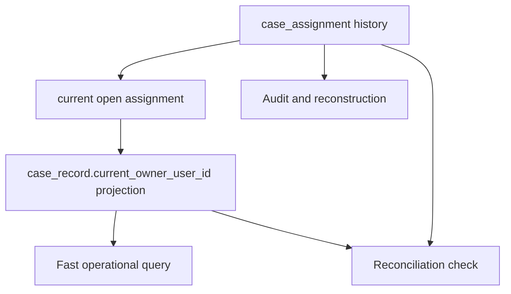
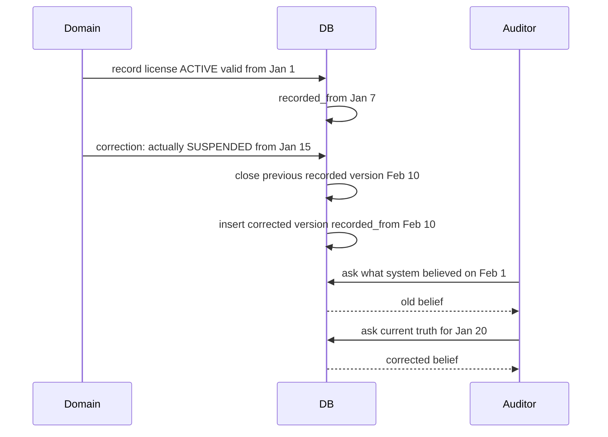

# Part 014 — Time in Database Design

Time is one of the hardest parts of database design because it looks simple until the system must explain what was true, when it was true, when the system knew it, and why it changed.

A beginner adds:

```sql
created_at timestamptz NOT NULL,
updated_at timestamptz NOT NULL
```

An architect asks:

- When did the event happen in the real world?
- When did we observe it?
- When did we record it?
- When did it become effective?
- When did it stop being effective?
- When did a decision become legally valid?
- Can the fact be corrected later?
- Do we need to reconstruct what the system believed last month?
- Do reports need to be reproducible?
- Are local dates legally meaningful?
- Can two intervals overlap?
- Which clock is authoritative?

If your database cannot answer these questions, your system does not really understand time.

---

## 1. Core Mental Model

Time in database design is not one concept. It is several concepts that developers often collapse into one timestamp.

The most important distinction:

> There is the time something is true in the domain, and there is the time the database knows about it.

These are not the same.

Example:

- A license is valid from `2026-01-01`.
- The regulator receives the document on `2026-01-05`.
- The clerk enters it into the system on `2026-01-07`.
- A correction is made on `2026-02-10` because the original valid date was wrong.

Which date is “the date”?

There is no single answer. The correct design stores the different temporal meanings separately.

---

## 2. Vocabulary of Time

Use precise names. Vague timestamp fields create vague systems.

| Field | Meaning |
|---|---|
| `created_at` | when this database row was created |
| `updated_at` | when this database row was last updated |
| `occurred_at` | when the event happened in the real world/domain |
| `observed_at` | when the system/user observed the event |
| `recorded_at` | when the fact was recorded in this database |
| `received_at` | when input arrived at the system boundary |
| `ingested_at` | when input entered a pipeline/storage layer |
| `effective_from` | when the fact starts being valid in the domain |
| `effective_until` | when the fact stops being valid in the domain |
| `valid_from` | often same as effective start; domain validity start |
| `valid_until` | domain validity end |
| `transaction_from` | when the database version became known/recorded |
| `transaction_until` | when the database version was superseded |
| `decided_at` | when a decision was made |
| `approved_at` | when approval occurred |
| `published_at` | when data became visible externally |
| `expires_at` | when a token/offer/permission expires |
| `deadline_at` | when action must be completed |
| `scheduled_for` | when future action is planned |
| `deleted_at` | when row was logically deleted |

Do not reuse `created_at` to mean all of these.

---

## 3. Instant, Local Date, Local Time, Duration, Interval

A top-tier design distinguishes different temporal data types conceptually.

### 3.1 Instant

An instant is a point on the global timeline.

Examples:

- event received at `2026-07-04T10:15:00Z`;
- payment captured at a precise time;
- case assigned at a precise time;
- document uploaded at a precise time.

Use for system events and audit records.

In PostgreSQL, this usually maps to `timestamp with time zone` / `timestamptz`.

### 3.2 Local Date

A local date is a calendar date without time-of-day.

Examples:

- birth date;
- license effective date;
- tax period date;
- court filing date;
- holiday date;
- regulatory reporting date.

Use `date`, not timestamp.

A birth date is not “midnight UTC”. Turning it into a timestamp creates timezone bugs.

### 3.3 Local Time

A local time is clock time without a date.

Examples:

- office opens at `09:00`;
- daily cutoff time;
- scheduled notification time.

Usually you need a timezone/zone ID alongside it.

### 3.4 Duration

A duration is a length of time.

Examples:

- SLA must be completed within 5 business days;
- token valid for 15 minutes;
- timeout of 30 seconds.

Durations are not timestamps.

### 3.5 Interval / Period

An interval has a start and end.

Examples:

- membership valid from X until Y;
- price effective during period;
- assignment active during period;
- policy version applies during period.

Use two columns or a native range type where appropriate.

---

## 4. Timestamp With Time Zone vs Without Time Zone

This is a common source of production bugs.

Conceptual rule:

> Store instants as instants. Store local civil concepts as local civil concepts.

For event timestamps, use a type that represents a point in time unambiguously.

For domain dates such as birth date, license date, or accounting period, use `date`.

For scheduled local times, store:

```sql
local_time time NOT NULL,
time_zone_id text NOT NULL
```

or for a scheduled local date-time:

```sql
scheduled_local_datetime timestamp NOT NULL,
time_zone_id text NOT NULL
```

Then compute the actual instant when needed, using timezone rules.

Why not just UTC everything?

UTC is excellent for instants. It is wrong for pure local dates.

Example:

A license expires on `2026-12-31` in Jakarta. That is a legal local date. Converting it into `2026-12-30T17:00:00Z` may be technically accurate for midnight Jakarta, but it hides the legal concept.

Store the concept directly.

---

## 5. The Four Important Times

For serious systems, at least four time concepts often appear.

### 5.1 Event Time

When the thing happened in the domain.

```sql
occurred_at timestamptz NOT NULL
```

Example: the complaint was submitted at this time.

### 5.2 Effective Time

When the fact becomes true in the domain.

```sql
effective_from date NOT NULL
effective_until date
```

Example: policy version applies from this date.

### 5.3 Transaction Time

When the database knew or recorded the fact.

```sql
recorded_at timestamptz NOT NULL
superseded_at timestamptz
```

Example: system recorded the policy version on this date.

### 5.4 Processing Time

When a pipeline/job processed the record.

```sql
processed_at timestamptz
```

Example: CDC consumer projected the event at this time.

Conflating these creates reporting and audit errors.

---

## 6. `created_at` and `updated_at` Are Not Audit

`created_at` and `updated_at` are operational metadata. They are useful but insufficient.

They cannot answer:

- who changed the record;
- what changed;
- why it changed;
- what the previous value was;
- which business event caused the change;
- whether the change was correction or new fact;
- what the system believed before the correction;
- whether the effective date was retroactive.

For meaningful audit, use either:

1. append-only event/fact table;
2. history table;
3. bitemporal table;
4. audit log with before/after payload;
5. CDC stream plus retention and replay guarantees.

Do not claim auditability from `updated_at` alone.

---

## 7. Effective-Dated Tables

Effective dating records when a fact is valid in the domain.

Example: product price.

```sql
CREATE TABLE product_price_period (
  id uuid PRIMARY KEY,
  product_id uuid NOT NULL REFERENCES product(id),
  currency_code char(3) NOT NULL,
  region_code text NOT NULL,
  amount numeric(18, 2) NOT NULL CHECK (amount >= 0),
  effective_from date NOT NULL,
  effective_until date,
  created_at timestamptz NOT NULL,
  created_by_user_id uuid NOT NULL,
  CHECK (effective_until IS NULL OR effective_until > effective_from)
);
```

A current price query:

```sql
SELECT *
FROM product_price_period
WHERE product_id = :product_id
  AND currency_code = :currency_code
  AND region_code = :region_code
  AND effective_from <= CURRENT_DATE
  AND (effective_until IS NULL OR effective_until > CURRENT_DATE);
```

Use the half-open interval convention:

```txt
[effective_from, effective_until)
```

Meaning:

- start is inclusive;
- end is exclusive.

This prevents boundary overlap.

Example:

```txt
Price A: 2026-01-01 to 2026-02-01
Price B: 2026-02-01 to 2026-03-01
```

There is no gap and no overlap.

---

## 8. Why Half-Open Intervals Are the Default

Avoid inclusive end dates for temporal intervals.

Bad:

```txt
2026-01-01 <= date <= 2026-01-31
2026-02-01 <= date <= 2026-02-28
```

This looks fine for dates but becomes painful for timestamps:

```txt
2026-01-31 23:59:59.999999
```

You will eventually lose precision or create edge-case bugs.

Better:

```txt
2026-01-01 <= time < 2026-02-01
2026-02-01 <= time < 2026-03-01
```

Half-open intervals compose cleanly.

Rule:

> Store intervals as inclusive start, exclusive end unless there is a strong domain reason not to.

---

## 9. Preventing Overlapping Intervals

The business rule:

> For a given product, currency, and region, price periods must not overlap.

A weak design only checks this in application code.

That can fail under concurrency.

Better options:

1. database exclusion constraint if supported;
2. transaction with locking on the business key;
3. serializable isolation;
4. trigger-based validation;
5. append-only command model with deterministic conflict detection.

In PostgreSQL, range types and exclusion constraints can model non-overlap elegantly.

Example using `daterange`:

```sql
CREATE EXTENSION IF NOT EXISTS btree_gist;

CREATE TABLE product_price_period (
  id uuid PRIMARY KEY,
  product_id uuid NOT NULL,
  currency_code char(3) NOT NULL,
  region_code text NOT NULL,
  amount numeric(18, 2) NOT NULL CHECK (amount >= 0),
  effective_period daterange NOT NULL,
  created_at timestamptz NOT NULL,
  CHECK (NOT isempty(effective_period)),
  EXCLUDE USING gist (
    product_id WITH =,
    currency_code WITH =,
    region_code WITH =,
    effective_period WITH &&
  )
);
```

`&&` means overlapping ranges.

This constraint says: for the same product, currency, and region, no two effective periods may overlap.

This is a temporal invariant enforced by the database.

---

## 10. Open-Ended Intervals

Open-ended intervals represent facts currently valid until further notice.

With two columns:

```sql
effective_from date NOT NULL,
effective_until date NULL
```

With range types, an unbounded upper range can represent “no known end”.

Open-ended intervals are useful but dangerous if they are not constrained.

Common rule:

> At most one open-ended current row per business key.

```sql
CREATE UNIQUE INDEX uq_one_open_price_period
ON product_price_period(product_id, currency_code, region_code)
WHERE effective_until IS NULL;
```

But remember: this prevents two current rows, not all historical overlaps.

For full correctness, enforce non-overlap across all periods.

---

## 11. Current State vs Historical Periods

There are two common designs.

### 11.1 Store Only Current State

```sql
CREATE TABLE case_record (
  id uuid PRIMARY KEY,
  current_owner_user_id uuid NOT NULL,
  updated_at timestamptz NOT NULL
);
```

Simple, fast, but history is lost unless audited elsewhere.

### 11.2 Store Historical Periods

```sql
CREATE TABLE case_assignment (
  id uuid PRIMARY KEY,
  case_id uuid NOT NULL,
  assigned_user_id uuid NOT NULL,
  assigned_from timestamptz NOT NULL,
  assigned_until timestamptz,
  assigned_by_user_id uuid NOT NULL,
  unassigned_by_user_id uuid,
  CHECK (assigned_until IS NULL OR assigned_until > assigned_from)
);
```

Current owner is derived:

```sql
SELECT assigned_user_id
FROM case_assignment
WHERE case_id = :case_id
  AND assigned_until IS NULL;
```

This preserves history.

But deriving current state can be costly at scale. A common production pattern is:

- source of truth: assignment history;
- current projection: `case_record.current_owner_user_id`;
- invariant: current projection must match open assignment;
- reconciliation job verifies drift.



This is disciplined denormalization.

---

## 12. Bitemporal Modelling

Bitemporal modelling tracks two timelines:

1. **Valid time** — when the fact is true in the domain.
2. **Transaction time** — when the database recorded that version of the fact.

This allows the system to answer:

- What was true on `2026-01-15`?
- What did the system believe on `2026-02-01` about what was true on `2026-01-15`?
- When did we learn the correction?

Example:

```sql
CREATE TABLE license_status_history (
  id uuid PRIMARY KEY,
  license_id uuid NOT NULL,
  status text NOT NULL,
  valid_from date NOT NULL,
  valid_until date,
  recorded_from timestamptz NOT NULL,
  recorded_until timestamptz,
  correction_reason text,
  recorded_by_user_id uuid NOT NULL,
  CHECK (valid_until IS NULL OR valid_until > valid_from),
  CHECK (recorded_until IS NULL OR recorded_until > recorded_from)
);
```

Interpretation:

- `valid_from` / `valid_until`: when the license status is true in the real domain;
- `recorded_from` / `recorded_until`: when this database version was believed/active.

A correction does not overwrite history. It closes the old recorded version and inserts a new version.



This is extremely valuable in regulated systems.

---

## 13. Bitemporal Query Patterns

Current truth for a domain date:

```sql
SELECT *
FROM license_status_history
WHERE license_id = :license_id
  AND valid_from <= :as_of_date
  AND (valid_until IS NULL OR valid_until > :as_of_date)
  AND recorded_until IS NULL;
```

What the system believed at a past transaction time:

```sql
SELECT *
FROM license_status_history
WHERE license_id = :license_id
  AND valid_from <= :as_of_date
  AND (valid_until IS NULL OR valid_until > :as_of_date)
  AND recorded_from <= :known_at
  AND (recorded_until IS NULL OR recorded_until > :known_at);
```

This query is dense because the model is powerful.

Do not use bitemporal modelling everywhere. Use it where reconstruction, correction, audit, and legal defensibility matter.

---

## 14. Corrections vs New Facts

A correction changes what we believe about a past fact.

A new fact changes the future/current state.

Example:

- New fact: license becomes suspended starting today.
- Correction: license was actually suspended last month, but we recorded it incorrectly.

Do not model both as simple updates.

Bad:

```sql
UPDATE license
SET status = 'SUSPENDED', updated_at = now()
WHERE id = :license_id;
```

Better:

```sql
-- close current recorded version
UPDATE license_status_history
SET recorded_until = now()
WHERE license_id = :license_id
  AND recorded_until IS NULL;

-- insert corrected/new version
INSERT INTO license_status_history (
  id,
  license_id,
  status,
  valid_from,
  valid_until,
  recorded_from,
  recorded_until,
  correction_reason,
  recorded_by_user_id
) VALUES (
  gen_random_uuid(),
  :license_id,
  'SUSPENDED',
  :valid_from,
  :valid_until,
  now(),
  NULL,
  :reason,
  :user_id
);
```

The correction itself becomes explainable.

---

## 15. Time and State Machines

State machines need temporal design.

A current-state table:

```sql
CREATE TABLE case_record (
  id uuid PRIMARY KEY,
  lifecycle_state text NOT NULL,
  state_changed_at timestamptz NOT NULL
);
```

Transition history:

```sql
CREATE TABLE case_state_transition (
  id uuid PRIMARY KEY,
  case_id uuid NOT NULL REFERENCES case_record(id),
  from_state text,
  to_state text NOT NULL,
  occurred_at timestamptz NOT NULL,
  actor_user_id uuid NOT NULL,
  reason text
);
```

The current state is a projection. The transition history explains how the current state came to exist.

For high-assurance systems, keep both:

- current state for fast operational reads;
- transition history for audit and reconstruction.

Constraint:

```sql
CREATE UNIQUE INDEX uq_case_transition_order
ON case_state_transition(case_id, occurred_at, id);
```

But ordering by timestamp alone can be insufficient if two transitions occur very close together. Use a sequence/version number when strict per-entity ordering matters.

```sql
CREATE TABLE case_state_transition (
  id uuid PRIMARY KEY,
  case_id uuid NOT NULL REFERENCES case_record(id),
  transition_no bigint NOT NULL,
  from_state text,
  to_state text NOT NULL,
  occurred_at timestamptz NOT NULL,
  actor_user_id uuid NOT NULL,
  reason text,
  UNIQUE (case_id, transition_no)
);
```

---

## 16. Time and SLA/Escalation Design

SLA is not just a timestamp field.

Example:

```sql
sla_due_at timestamptz NOT NULL
```

This may be enough for simple systems. But real SLA depends on:

- start event;
- SLA policy version;
- calendar/working days;
- holidays;
- pause/resume periods;
- timezone;
- priority;
- case type;
- escalation rules;
- overrides;
- recalculation policy.

Better model:

```sql
CREATE TABLE case_sla_clock (
  id uuid PRIMARY KEY,
  case_id uuid NOT NULL REFERENCES case_record(id),
  sla_policy_id uuid NOT NULL,
  clock_started_at timestamptz NOT NULL,
  clock_paused_at timestamptz,
  accumulated_pause_seconds bigint NOT NULL DEFAULT 0,
  due_at timestamptz NOT NULL,
  breached_at timestamptz,
  recalculated_at timestamptz,
  calculation_basis jsonb NOT NULL
);
```

`due_at` is useful. `calculation_basis` explains how it was computed.

If SLA has regulatory consequence, store policy version and calculation inputs. Otherwise you may not be able to defend why an escalation happened.

---

## 17. Time Zones in Production Design

Timezone bugs come from mixing instant time and local civil time.

Recommended strategy:

### 17.1 For Audit/Event Instants

Store as instant.

```sql
occurred_at timestamptz NOT NULL
```

Render using the viewer’s timezone or domain timezone.

### 17.2 For Local Legal Dates

Store as date.

```sql
license_effective_date date NOT NULL
license_expiry_date date NOT NULL
```

Do not convert legal date to UTC timestamp unless the domain defines exact instant semantics.

### 17.3 For Local Scheduled Events

Store local datetime and zone ID.

```sql
scheduled_local_at timestamp NOT NULL,
time_zone_id text NOT NULL
```

Example:

```txt
2026-08-01 09:00 Asia/Jakarta
```

This preserves the user/domain intent even if timezone rules matter.

### 17.4 For Recurring Schedules

Store recurrence rule, local time, and timezone.

```sql
CREATE TABLE recurring_job_schedule (
  id uuid PRIMARY KEY,
  recurrence_rule text NOT NULL,
  local_time time NOT NULL,
  time_zone_id text NOT NULL,
  next_run_at timestamptz NOT NULL
);
```

`next_run_at` is a projection that can be recomputed.

---

## 18. Precision, Ordering, and Clock Assumptions

Timestamps are not always safe ordering keys.

Problems:

- two events can share same timestamp precision;
- clocks can skew across machines;
- application server time and database time may differ;
- retries can record later than original event;
- imported historical events can have old `occurred_at` but new `recorded_at`.

For strict ordering, use:

- per-entity sequence number;
- database-generated monotonically increasing version;
- event store sequence;
- transaction ID or commit timestamp where available and appropriate;
- `(timestamp, id)` as deterministic tie-breaker for pagination.

Bad pagination:

```sql
SELECT *
FROM audit_event
WHERE occurred_at < :last_seen_occurred_at
ORDER BY occurred_at DESC
LIMIT 50;
```

This can skip rows with the same timestamp.

Better:

```sql
SELECT *
FROM audit_event
WHERE (occurred_at, id) < (:last_seen_occurred_at, :last_seen_id)
ORDER BY occurred_at DESC, id DESC
LIMIT 50;
```

Keyset pagination needs a stable total ordering.

---

## 19. Temporal Uniqueness

Sometimes uniqueness is time-scoped.

Example:

> A person may have only one active license per license type at a time.

Naive uniqueness:

```sql
UNIQUE (person_id, license_type)
```

This prevents historical versions.

Better current-only uniqueness:

```sql
CREATE UNIQUE INDEX uq_one_current_license
ON license(person_id, license_type)
WHERE revoked_at IS NULL;
```

Better full temporal correctness:

```sql
-- Conceptual: prevent overlapping validity periods for same person/type.
-- Implementation depends on database support.
```

Temporal uniqueness usually means:

> Unique for the same business key during overlapping validity intervals.

This is more complex than normal uniqueness.

---

## 20. Temporal Snapshots

Snapshots freeze a value at a time.

Example: invoice line should store product name and price at invoice time.

```sql
CREATE TABLE invoice_line (
  id uuid PRIMARY KEY,
  invoice_id uuid NOT NULL REFERENCES invoice(id),
  product_id uuid NOT NULL REFERENCES product(id),
  product_name_snapshot text NOT NULL,
  unit_price_snapshot numeric(18, 2) NOT NULL,
  quantity integer NOT NULL CHECK (quantity > 0),
  line_total numeric(18, 2) NOT NULL
);
```

Why snapshot?

Because product name or price may change later. Historical invoice must not change.

This is controlled denormalization for temporal correctness.

Do not recompute old financial/regulatory documents from mutable master data unless that is explicitly the business rule.

---

## 21. Temporal Views

A useful pattern is to create views for current state.

```sql
CREATE VIEW current_product_price AS
SELECT *
FROM product_price_period
WHERE effective_from <= CURRENT_DATE
  AND (effective_until IS NULL OR effective_until > CURRENT_DATE);
```

But be careful:

- current date makes the view time-dependent;
- query results change as time passes;
- materialized views need refresh strategy;
- tests need controllable clock.

For critical queries, prefer explicit as-of parameter:

```sql
SELECT *
FROM product_price_period
WHERE product_id = :product_id
  AND effective_from <= :as_of_date
  AND (effective_until IS NULL OR effective_until > :as_of_date);
```

Explicit time makes behavior testable and reproducible.

---

## 22. Reproducible Reports

Reports often need to answer:

> What did the report show when generated?

There are three strategies.

### 22.1 Recompute from Current Data

Simple but not reproducible if source data changes.

### 22.2 Recompute from Historical Data

Requires temporal history. More complex but accurate.

### 22.3 Store Report Snapshot

Store generated output or report facts.

```sql
CREATE TABLE generated_report (
  id uuid PRIMARY KEY,
  report_type text NOT NULL,
  report_period_start date NOT NULL,
  report_period_end date NOT NULL,
  generated_at timestamptz NOT NULL,
  generated_by_user_id uuid NOT NULL,
  parameter_hash text NOT NULL,
  result_hash text NOT NULL,
  storage_uri text NOT NULL
);
```

For regulated reports, store:

- parameters;
- data cutoff time;
- source version;
- generated artifact hash;
- approval state;
- regeneration rules.

---

## 23. Retention and Deletion Time

Retention is temporal design.

Fields:

```sql
created_at timestamptz NOT NULL,
retention_until date,
deleted_at timestamptz,
purged_at timestamptz,
legal_hold_until date
```

But retention is not just fields. It requires policy.

Questions:

1. When does retention start?
2. Is it based on creation, closure, last activity, expiry, or legal period?
3. Can legal hold override deletion?
4. Is deletion logical or physical?
5. Are derived copies deleted too?
6. How is purge audited?
7. Can backups still contain purged data?
8. Who approved deletion?

Retention design belongs in the database architecture, not just compliance documentation.

---

## 24. Event Time vs Ingestion Time in Pipelines

In data pipelines, events often arrive late or out of order.

Example:

```json
{
  "eventId": "evt-123",
  "occurredAt": "2026-07-01T10:00:00Z",
  "ingestedAt": "2026-07-04T09:00:00Z"
}
```

Business reporting may use `occurredAt`.

Operational pipeline monitoring may use `ingestedAt`.

Late-arriving event handling requires:

- watermark strategy;
- correction/recomputation;
- idempotency;
- deduplication;
- versioned aggregations;
- explicit cutoff policy.

Do not overwrite event time with ingestion time just because ingestion time is easier.

---

## 25. Temporal Design for CDC and Outbox

Outbox table example:

```sql
CREATE TABLE outbox_event (
  id uuid PRIMARY KEY,
  aggregate_type text NOT NULL,
  aggregate_id uuid NOT NULL,
  event_type text NOT NULL,
  occurred_at timestamptz NOT NULL,
  recorded_at timestamptz NOT NULL DEFAULT now(),
  payload jsonb NOT NULL,
  published_at timestamptz,
  publish_attempt_count integer NOT NULL DEFAULT 0
);
```

Meanings:

- `occurred_at`: business event time;
- `recorded_at`: database/outbox insertion time;
- `published_at`: broker publication time.

These are different operational facts.

If event publication is delayed, `published_at` may be much later than `occurred_at`. That is important for debugging and SLA.

---

## 26. Testing Temporal Logic

Temporal logic must be tested with controlled clocks.

Do not scatter `now()` everywhere in application code.

Inject clock/time provider:

```java
interface ClockProvider {
    Instant now();
    LocalDate today(ZoneId zoneId);
}
```

Database-side defaults are useful:

```sql
created_at timestamptz NOT NULL DEFAULT now()
```

But for testable business rules, make time explicit in commands:

```txt
AssignCaseCommand(caseId, userId, assignedAt, actorId)
```

Test cases:

- boundary at exact interval start;
- boundary at exact interval end;
- overlapping intervals;
- adjacent intervals;
- open-ended interval;
- late-arriving event;
- correction after report generated;
- daylight-saving transition;
- timezone conversion;
- duplicate timestamp ordering;
- clock skew between services.

---

## 27. Temporal Failure Modes

### 27.1 Current State Cannot Be Reconstructed

Cause: updates overwrite old state.

Fix: history table, event log, or bitemporal model.

### 27.2 Report Changes After Regeneration

Cause: report recomputed from mutable current data.

Fix: snapshot report inputs/outputs or temporal source facts.

### 27.3 Duplicate Active Records

Cause: no uniqueness constraint for open-ended rows.

Fix: partial unique index or non-overlap constraint.

### 27.4 Overlapping Effective Periods

Cause: application-only validation under concurrency.

Fix: exclusion constraint, serializable transaction, or lock business key.

### 27.5 Timezone Off-by-One Day

Cause: storing local legal date as UTC timestamp.

Fix: use `date` for local date concepts.

### 27.6 Pagination Skips Records

Cause: ordering by non-unique timestamp.

Fix: order by `(timestamp, id)` or sequence.

### 27.7 SLA Calculation Cannot Be Defended

Cause: only final `due_at` stored.

Fix: store policy version and calculation basis.

---

## 28. Design Patterns

### 28.1 Current + History

```txt
case_record.current_state
case_state_transition history
```

Use when current reads are frequent and history matters.

### 28.2 Effective-Dated Reference Data

```txt
policy_version effective_from/effective_until
```

Use when rules change over time.

### 28.3 Append-Only Events

```txt
event_log occurred_at recorded_at payload
```

Use when every change must be recorded as a fact.

### 28.4 Bitemporal Table

```txt
valid_from/valid_until + recorded_from/recorded_until
```

Use when corrections and historical beliefs matter.

### 28.5 Snapshot on Transaction

```txt
invoice_line.product_name_snapshot
invoice_line.unit_price_snapshot
```

Use when historical documents must remain stable.

### 28.6 Temporal Projection

```txt
history table -> current projection table
```

Use when correctness and performance are both required.

---

## 29. Production Checklist

Before approving temporal design, verify:

- [ ] Every timestamp/date field has one clear meaning.
- [ ] Instants, dates, durations, and intervals are not mixed.
- [ ] Legal/local dates use date semantics.
- [ ] Event time and recorded time are separate where needed.
- [ ] Effective time and transaction time are separate where corrections matter.
- [ ] Intervals use half-open convention unless explicitly justified.
- [ ] Non-overlap constraints exist for temporal uniqueness where required.
- [ ] Open-ended current rows are constrained.
- [ ] Historical reconstruction is possible if business requires it.
- [ ] Current-state projections can be reconciled against history.
- [ ] Reports define cutoff, parameters, and reproducibility strategy.
- [ ] SLA calculations store enough basis to be explained.
- [ ] Timezone strategy is explicit.
- [ ] Pagination uses stable ordering, not timestamp alone.
- [ ] Tests include boundary, timezone, late event, and correction scenarios.
- [ ] Retention and legal hold are modelled intentionally.

---

## 30. Practical Exercises

### Exercise 1 — License Status History

Design a schema where:

- a license can be active, suspended, revoked, or expired;
- status has valid period;
- corrections are possible;
- system must answer what it believed at a previous date;
- only one status may be valid for a license at a given date.

Expected elements:

- valid time columns;
- transaction time columns;
- non-overlap strategy;
- correction reason;
- actor;
- as-of queries.

### Exercise 2 — SLA Clock

Design an SLA model where:

- due date depends on priority;
- weekends/holidays are excluded;
- clock can pause while waiting for external party;
- policy version must be auditable;
- escalation occurs when due date passes.

Expected elements:

- SLA policy version;
- clock start/pause/resume records;
- calculated due timestamp;
- calculation basis;
- escalation event;
- testable clock.

### Exercise 3 — Price Periods

Design product price periods where:

- future prices can be scheduled;
- historical invoice prices stay stable;
- price intervals cannot overlap;
- different regions and currencies have independent prices.

Expected elements:

- price period table;
- business key includes product/region/currency;
- non-overlap constraint;
- invoice snapshot;
- explicit as-of query.

---

## 31. Top 1% Takeaways

1. Time is not one field. It is multiple dimensions of truth.
2. `created_at` and `updated_at` are metadata, not audit design.
3. Store instants as instants, local dates as dates, and schedules with timezone context.
4. Effective time tells when a fact is true; transaction time tells when the database knew it.
5. Half-open intervals prevent boundary bugs.
6. Temporal uniqueness is uniqueness over overlapping periods, not simple key equality.
7. Corrections should preserve what the system previously believed.
8. Current state is often a projection of temporal history.
9. Reports need reproducibility strategy, not just queries.
10. Regulated systems usually need temporal defensibility, not just timestamp columns.

---

## References

- PostgreSQL Documentation — Date/Time Types: https://www.postgresql.org/docs/current/datatype-datetime.html
- PostgreSQL Documentation — Range Types: https://www.postgresql.org/docs/current/rangetypes.html
- PostgreSQL Documentation — Constraints: https://www.postgresql.org/docs/current/ddl-constraints.html
- PostgreSQL Documentation — Indexes: https://www.postgresql.org/docs/current/indexes.html
- Martin Fowler — Temporal Patterns: https://martinfowler.com/eaaDev/timeNarrative.html
