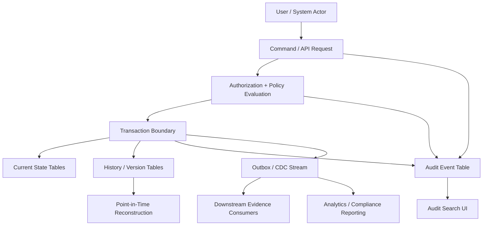
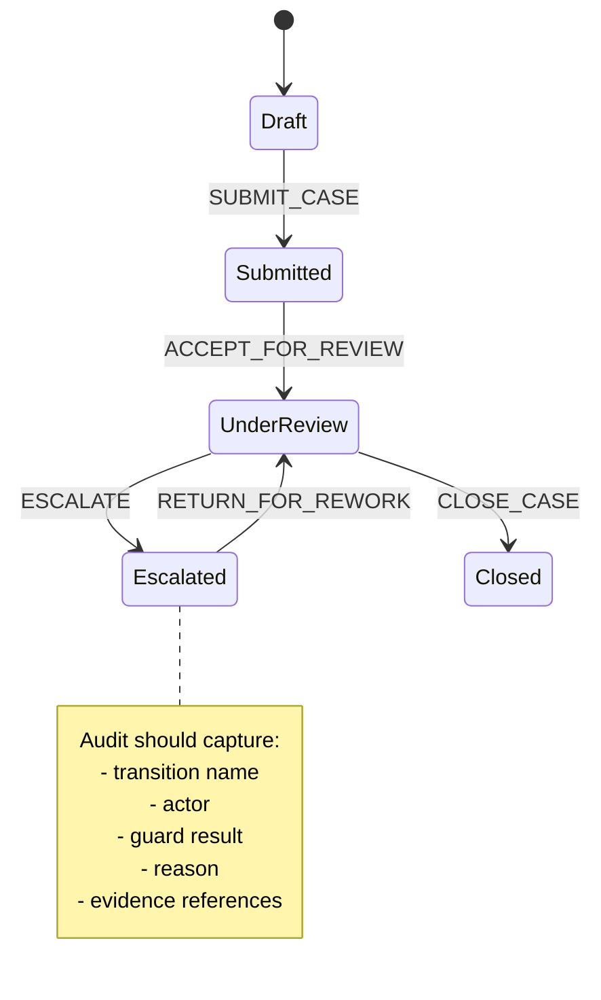
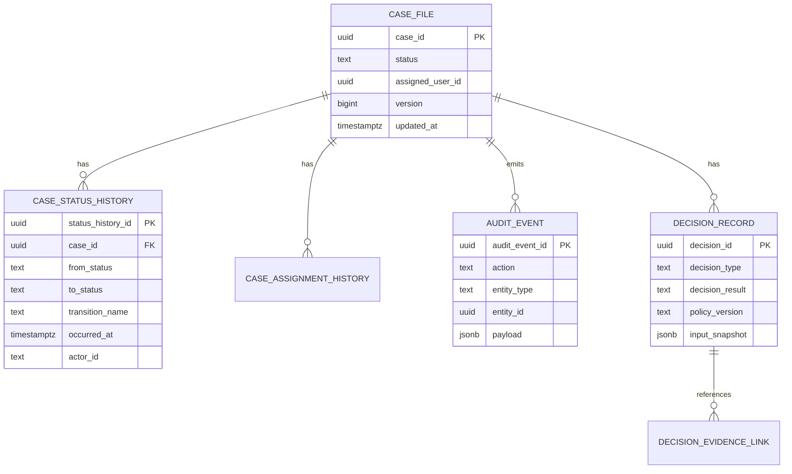
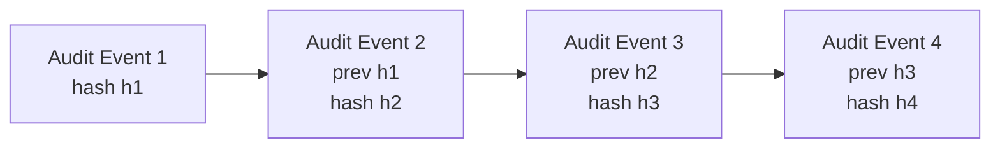
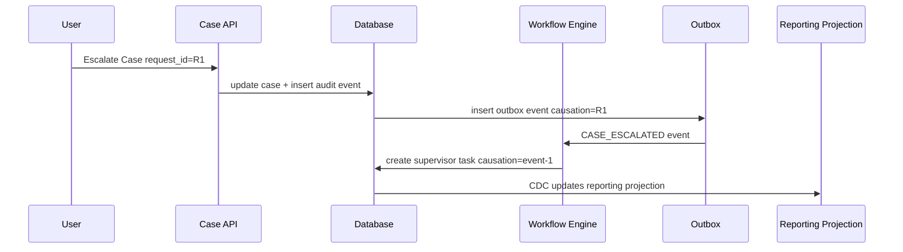

# Part 015 — Audit, History, and Regulatory Traceability

> Goal: setelah bagian ini, kamu tidak lagi melihat audit sebagai “tambah `created_at`, `updated_at`, `created_by`, `updated_by`”. Kamu akan melihat audit sebagai **evidence system**: kemampuan database untuk menjawab *what happened, when, who caused it, why it was allowed, what changed, what was known at the time, and whether the answer is defensible*.

Audit yang buruk biasanya baru terasa saat incident, sengketa, regulator review, fraud investigation, atau debugging data corruption.

Audit yang baik terasa membosankan saat normal operation, tapi menyelamatkan organisasi saat sistem harus membuktikan kebenaran.

---

## 1. Core Mental Model

Database production-grade tidak hanya menyimpan **current state**.

Ia harus bisa menjawab minimal lima jenis pertanyaan:

1. **Current truth**  
   Apa kondisi data sekarang?

2. **Historical truth**  
   Apa kondisi data pada waktu tertentu?

3. **Causal truth**  
   Perubahan ini terjadi karena aksi, proses, request, atau keputusan apa?

4. **Actor truth**  
   Siapa atau sistem apa yang menyebabkan perubahan?

5. **Defensible truth**  
   Bisakah jawaban ini dipercaya, direkonstruksi, dan dijelaskan kepada pihak eksternal?

Kalau database hanya menyimpan current state, ia hanya menjawab nomor 1.

Top-level architect harus mendesain agar nomor 2 sampai 5 bukan hasil kebetulan.

---

## 2. Audit Is Not Logging

Audit sering disamakan dengan logging. Itu salah kaprah.

Log menjawab:

> Apa yang aplikasi tulis saat runtime?

Audit menjawab:

> Apa perubahan yang benar-benar terjadi terhadap business state?

Perbedaannya besar.

| Dimension | Application Log | Audit Trail |
|---|---|---|
| Primary purpose | Observability/debugging | Evidence/accountability |
| Subject | Process execution | Business/data change |
| Reliability requirement | Useful but may be sampled/noisy | Must be complete for audited events |
| Query shape | Time/error/request-oriented | Entity/state/actor/event-oriented |
| Retention | Often shorter | Often policy/regulation-driven |
| Mutability | Usually append-only operationally | Should be append-only logically |
| Consumer | Engineers/SRE | Engineering, product, compliance, legal, audit, regulator |
| Failure impact | Harder debugging | Loss of evidence / legal or operational risk |

A request log that says `PATCH /cases/123 returned 200` is not enough.

A defensible audit record says:

- case `123` changed from `UNDER_REVIEW` to `ESCALATED`,
- at `2026-07-04T10:32:11Z`,
- by actor `user:8841`,
- through workflow transition `ESCALATE_FOR_SUPERVISOR_REVIEW`,
- under policy version `case-policy-v7`,
- with reason `high-risk indicator matched`,
- from request/correlation id `req-...`,
- producing immutable audit event `evt-...`,
- with before/after diff or normalized event payload.

That is evidence.

---

## 3. Vocabulary: Audit, History, Traceability, Provenance

Use precise language. Mixed vocabulary creates weak architecture.

| Term | Meaning |
|---|---|
| Audit trail | Append-only record of significant business/data actions |
| History | Ability to reconstruct prior state or prior versions |
| Traceability | Ability to follow cause/effect across entities, systems, and decisions |
| Provenance | Origin and transformation path of data |
| Lineage | Dependency graph showing how data was derived/transformed |
| Evidence | Data record that can support a defensible claim |
| Current state | Latest accepted state of an entity |
| Fact | Something that happened and should not be rewritten casually |
| Correction | New fact that amends prior information without pretending history never happened |

A good system separates these concepts even if they share storage mechanisms.

---

## 4. The Simplest Useful Audit Model

A minimal audit trail table usually looks like this:

```sql
CREATE TABLE audit_event (
    audit_event_id      uuid PRIMARY KEY,
    occurred_at         timestamptz NOT NULL,
    recorded_at         timestamptz NOT NULL DEFAULT now(),

    actor_type          text NOT NULL,
    actor_id            text NOT NULL,
    actor_display       text,

    action              text NOT NULL,
    entity_type         text NOT NULL,
    entity_id           text NOT NULL,

    reason_code         text,
    reason_text         text,

    request_id          text,
    correlation_id      text,
    causation_id        text,

    before_data         jsonb,
    after_data          jsonb,
    change_data         jsonb,

    metadata            jsonb NOT NULL DEFAULT '{}'::jsonb
);
```

This is useful, but not enough for serious systems.

The missing questions are:

- Which transaction produced it?
- Is it guaranteed to be written when the data changes?
- Is it possible to tamper with it?
- Can it reconstruct state?
- Does it capture policy/authorization context?
- Does it survive async processing?
- Is it queryable at scale?
- Does it have retention and legal hold rules?
- Does it distinguish user intent from system side effect?

The rest of this part is about answering those questions.

---

## 5. Audit Event Design: What Should Be Captured?

A production audit event should capture five groups of information.

### 5.1 Identity of the Event

```sql
audit_event_id
occurred_at
recorded_at
transaction_id
sequence_no
```

Meaning:

| Field | Purpose |
|---|---|
| `audit_event_id` | Stable event identity |
| `occurred_at` | Business occurrence time |
| `recorded_at` | When system persisted audit event |
| `transaction_id` | DB/application transaction that caused it |
| `sequence_no` | Ordering inside same transaction or stream |

Do not assume timestamp alone gives total ordering. Concurrent systems need explicit ordering semantics.

### 5.2 Actor Context

```sql
actor_type
actor_id
actor_role
actor_tenant_id
actor_ip
actor_user_agent
impersonator_actor_id
service_account_id
```

Important distinction:

- **Human actor**: a user intentionally performed action.
- **System actor**: scheduled job, workflow engine, rule engine, integration adapter.
- **Delegated actor**: user acted through admin, support, proxy, impersonation, API client.

Bad audit:

```text
updated_by = system
```

Good audit:

```json
{
  "actor": {
    "type": "service",
    "id": "workflow-engine",
    "caused_by": {
      "type": "user",
      "id": "user-8841"
    },
    "execution_id": "wf-run-5192"
  }
}
```

### 5.3 Entity Context

```sql
entity_type
entity_id
entity_version
parent_entity_type
parent_entity_id
aggregate_id
```

Do not only store table name. Regulatory/business audit usually cares about domain entity:

- `case`
- `investigation`
- `evidence_document`
- `enforcement_action`
- `customer_profile`
- `payment_instruction`

A table may be implementation detail. An entity is business meaning.

### 5.4 Action Context

```sql
action
command_name
workflow_transition
business_operation
reason_code
reason_text
policy_version
decision_id
```

Bad audit action names:

- `UPDATE`
- `SAVE`
- `MODIFY`
- `UPSERT`

Good audit action names:

- `CASE_ESCALATED`
- `EVIDENCE_ACCEPTED`
- `SANCTION_RECOMMENDATION_WITHDRAWN`
- `ADDRESS_CORRECTED`
- `TENANT_ACCESS_REVOKED`

Audit action should describe **business semantics**, not SQL mechanics.

### 5.5 Data Change Context

Options:

1. Store full before/after snapshot.
2. Store field-level diff.
3. Store domain event payload.
4. Store normalized history rows.
5. Store reference to versioned record.

There is no universal best option.

| Option | Strength | Weakness |
|---|---|---|
| Before/after JSON | Easy reconstruction, easy review | Large, schema drift, PII duplication |
| Field diff | Compact, human-friendly | Harder reconstruction |
| Domain event payload | Good semantic meaning | May not capture full state |
| Versioned rows | Queryable, relational integrity | More modelling effort |
| Reference to version | Compact | Needs reliable version store |

For serious systems, combine:

- semantic event payload for meaning,
- entity version for reconstruction,
- request/correlation metadata for traceability.

---

## 6. Four Audit Storage Patterns

### Pattern 1: Inline Audit Columns

```sql
created_at
created_by
updated_at
updated_by
version
```

Use for:

- basic operational visibility,
- simple admin UI,
- optimistic locking,
- convenience.

Do not use as your only audit trail.

Failure modes:

- loses previous values,
- only records last actor,
- cannot explain why,
- cannot distinguish correction vs rewrite,
- cannot reconstruct history.

Inline audit columns are **metadata**, not audit trail.

---

### Pattern 2: Shadow History Table

Current table:

```sql
CREATE TABLE case_file (
    case_id uuid PRIMARY KEY,
    status text NOT NULL,
    assigned_user_id uuid,
    risk_score numeric,
    updated_at timestamptz NOT NULL,
    version bigint NOT NULL
);
```

History table:

```sql
CREATE TABLE case_file_history (
    case_history_id uuid PRIMARY KEY,
    case_id uuid NOT NULL,
    version bigint NOT NULL,

    status text NOT NULL,
    assigned_user_id uuid,
    risk_score numeric,

    valid_from timestamptz NOT NULL,
    valid_to timestamptz,

    changed_at timestamptz NOT NULL,
    changed_by text NOT NULL,
    change_reason text,

    UNIQUE (case_id, version)
);
```

Use when:

- you need reconstructable entity state,
- schema is stable enough,
- historical queries matter,
- relational constraints matter.

Tradeoff:

- more tables,
- migration complexity,
- larger storage,
- every schema change must consider history.

---

### Pattern 3: Generic Audit Event Table

```sql
CREATE TABLE audit_event (
    audit_event_id uuid PRIMARY KEY,
    occurred_at timestamptz NOT NULL,
    actor_id text NOT NULL,
    action text NOT NULL,
    entity_type text NOT NULL,
    entity_id text NOT NULL,
    payload jsonb NOT NULL
);
```

Use when:

- many entity types need audit,
- audit consumers mostly browse/search events,
- schema evolves frequently,
- event payload varies.

Tradeoff:

- weaker relational constraints,
- harder field-level query,
- schema drift hidden inside JSON,
- needs payload versioning.

---

### Pattern 4: Domain Event Log

```sql
CREATE TABLE domain_event (
    event_id uuid PRIMARY KEY,
    aggregate_type text NOT NULL,
    aggregate_id uuid NOT NULL,
    event_type text NOT NULL,
    event_version int NOT NULL,
    occurred_at timestamptz NOT NULL,
    payload jsonb NOT NULL,
    metadata jsonb NOT NULL
);
```

Use when:

- business events are first-class,
- projections/read models derive from event stream,
- replay/reconstruction matters,
- cross-service integration uses events.

Tradeoff:

- more design discipline required,
- event versioning is hard,
- replay semantics must be deterministic enough,
- not every audit question maps cleanly to domain event.

Important: event sourcing and audit trail overlap, but they are not identical.

Audit asks: **who changed what and why?**  
Event sourcing asks: **what facts reconstruct state?**

Sometimes one event log can serve both. Often you still need an audit view over events.

---

## 7. Architecture View



The important part: audit is produced **inside the same transaction boundary** as the state change whenever possible.

If state changes commit but audit fails, evidence is lost.

If audit commits but state change rolls back, audit lies.

---

## 8. Transactional Audit Guarantee

The strongest common design is:

> Write business state and audit event in the same database transaction.

Example:

```sql
BEGIN;

UPDATE case_file
SET status = 'ESCALATED',
    updated_at = now(),
    version = version + 1
WHERE case_id = :case_id
  AND status = 'UNDER_REVIEW';

INSERT INTO audit_event (
    audit_event_id,
    occurred_at,
    actor_type,
    actor_id,
    action,
    entity_type,
    entity_id,
    before_data,
    after_data,
    metadata
)
VALUES (
    gen_random_uuid(),
    now(),
    'user',
    :actor_id,
    'CASE_ESCALATED',
    'case',
    :case_id,
    :before_data,
    :after_data,
    :metadata
);

COMMIT;
```

But this is not enough unless application code cannot bypass it.

Better approaches:

1. database trigger,
2. stored procedure / command procedure,
3. repository-level mandatory audit API,
4. event-sourced aggregate write,
5. outbox table written with state change.

Each has tradeoff.

---

## 9. Trigger-Based Audit

A database trigger can enforce audit at the database layer.

Example pattern:

```sql
CREATE TABLE case_file_audit (
    audit_id bigserial PRIMARY KEY,
    case_id uuid NOT NULL,
    operation text NOT NULL,
    changed_at timestamptz NOT NULL DEFAULT now(),
    changed_by text NOT NULL DEFAULT current_user,
    old_row jsonb,
    new_row jsonb
);
```

```sql
CREATE OR REPLACE FUNCTION audit_case_file_changes()
RETURNS trigger AS $$
BEGIN
    IF TG_OP = 'INSERT' THEN
        INSERT INTO case_file_audit(case_id, operation, old_row, new_row)
        VALUES (NEW.case_id, TG_OP, NULL, to_jsonb(NEW));
        RETURN NEW;
    ELSIF TG_OP = 'UPDATE' THEN
        INSERT INTO case_file_audit(case_id, operation, old_row, new_row)
        VALUES (NEW.case_id, TG_OP, to_jsonb(OLD), to_jsonb(NEW));
        RETURN NEW;
    ELSIF TG_OP = 'DELETE' THEN
        INSERT INTO case_file_audit(case_id, operation, old_row, new_row)
        VALUES (OLD.case_id, TG_OP, to_jsonb(OLD), NULL);
        RETURN OLD;
    END IF;
END;
$$ LANGUAGE plpgsql;
```

```sql
CREATE TRIGGER trg_audit_case_file
AFTER INSERT OR UPDATE OR DELETE ON case_file
FOR EACH ROW
EXECUTE FUNCTION audit_case_file_changes();
```

### Strengths

- catches changes regardless of application path,
- close to data,
- hard to forget,
- good for low-level table history.

### Weaknesses

- business actor context may be missing,
- business reason/policy context is hard unless passed into session variables,
- trigger logic can become invisible complexity,
- migration/testing discipline required,
- high-write tables can create audit amplification.

Trigger-based audit is good for **data-level history**, but not always enough for **business-level traceability**.

---

## 10. Passing Actor Context Into Database Layer

When triggers generate audit rows, the database needs actor context.

One pattern is transaction-local settings.

```sql
SELECT set_config('app.actor_id', :actor_id, true);
SELECT set_config('app.request_id', :request_id, true);
SELECT set_config('app.reason_code', :reason_code, true);
```

Trigger reads:

```sql
current_setting('app.actor_id', true)
```

Example:

```sql
CREATE OR REPLACE FUNCTION audit_case_file_changes()
RETURNS trigger AS $$
DECLARE
    v_actor_id text;
    v_request_id text;
BEGIN
    v_actor_id := current_setting('app.actor_id', true);
    v_request_id := current_setting('app.request_id', true);

    INSERT INTO case_file_audit(
        case_id,
        operation,
        changed_at,
        changed_by,
        request_id,
        old_row,
        new_row
    )
    VALUES (
        COALESCE(NEW.case_id, OLD.case_id),
        TG_OP,
        now(),
        COALESCE(v_actor_id, 'unknown'),
        v_request_id,
        CASE WHEN TG_OP IN ('UPDATE', 'DELETE') THEN to_jsonb(OLD) END,
        CASE WHEN TG_OP IN ('INSERT', 'UPDATE') THEN to_jsonb(NEW) END
    );

    RETURN COALESCE(NEW, OLD);
END;
$$ LANGUAGE plpgsql;
```

This gives stronger audit, but it creates a contract:

> Every write transaction must set audit context before mutation.

That contract should be tested.

---

## 11. Audit Granularity

Audit everything sounds safe. It is often not.

You need deliberate granularity.

| Granularity | Example | Use Case |
|---|---|---|
| Table-level | Any row update to `case_file` | Low-level data history |
| Field-level | `status` changed, `risk_score` changed | Compliance review, user-facing history |
| Domain-event-level | `CASE_ESCALATED` | Business traceability |
| Command-level | `EscalateCaseCommand` | Intent/reason analysis |
| Workflow-level | `UNDER_REVIEW -> ESCALATED` | Lifecycle correctness |
| Decision-level | Rule/policy evaluation result | Regulatory defensibility |

For regulatory systems, field-level alone is too low-level; domain-event-level alone may be too abstract.

Use layered audit:

```text
command intent
  -> policy/authorization decision
    -> entity state transition
      -> field-level data change
        -> downstream event/outbox
```

---

## 12. Audit and Workflow State

State-machine systems need audit around transitions, not just field updates.

Bad model:

```sql
UPDATE case_file SET status = 'CLOSED';
```

Better model:

```sql
INSERT INTO case_transition (
    transition_id,
    case_id,
    from_status,
    to_status,
    transition_name,
    occurred_at,
    actor_id,
    reason_code,
    guard_snapshot
)
VALUES (...);
```

Then update current state:

```sql
UPDATE case_file
SET status = :to_status,
    version = version + 1
WHERE case_id = :case_id
  AND status = :from_status;
```

The transition row records:

- from state,
- to state,
- transition name,
- actor,
- reason,
- guard/policy snapshot,
- supporting evidence.



For enforcement/regulatory systems, transition audit is often more useful than raw column diffs.

---

## 13. Evidence Chain Design

An audit record should not only say “approved”. It should point to the evidence that made approval defensible.

Example:

```sql
CREATE TABLE decision_record (
    decision_id uuid PRIMARY KEY,
    entity_type text NOT NULL,
    entity_id uuid NOT NULL,
    decision_type text NOT NULL,
    decision_result text NOT NULL,
    decided_at timestamptz NOT NULL,
    decided_by text NOT NULL,
    policy_version text NOT NULL,
    input_snapshot jsonb NOT NULL,
    reasoning_summary text,
    created_at timestamptz NOT NULL DEFAULT now()
);
```

```sql
CREATE TABLE decision_evidence_link (
    decision_id uuid NOT NULL REFERENCES decision_record(decision_id),
    evidence_id uuid NOT NULL,
    evidence_role text NOT NULL,
    PRIMARY KEY (decision_id, evidence_id, evidence_role)
);
```

This lets you answer:

- What evidence was available when the decision was made?
- Which policy version was applied?
- Was the decision manual, automated, or hybrid?
- Did later evidence arrive that invalidates the decision?
- Who can defend the decision?

For top-tier systems, decision audit is not optional. It is the spine of explainability.

---

## 14. Current State + History + Audit: Keep Them Separate

A common bad design tries to make one table serve everything.

Example anti-pattern:

```sql
case_file(
  case_id,
  status,
  previous_status,
  status_changed_at,
  status_changed_by,
  status_change_reason,
  previous_assignee,
  previous_risk_score,
  ...
)
```

This collapses history into current state and scales badly.

Better split:



Current table is optimized for current state.  
History tables are optimized for reconstruction.  
Audit table is optimized for accountability and traceability.

---

## 15. Before/After vs Event-Based Audit

### Before/After Audit

```json
{
  "before": {
    "status": "UNDER_REVIEW",
    "assigned_user_id": "u1"
  },
  "after": {
    "status": "ESCALATED",
    "assigned_user_id": "u2"
  }
}
```

Good for:

- debugging,
- data diff,
- generic table audit,
- admin review.

Weak for:

- business semantics,
- intent,
- causal chain.

### Event-Based Audit

```json
{
  "event_type": "CASE_ESCALATED",
  "case_id": "case-123",
  "from_status": "UNDER_REVIEW",
  "to_status": "ESCALATED",
  "reason_code": "HIGH_RISK",
  "policy_version": "case-policy-v7"
}
```

Good for:

- business meaning,
- workflow traceability,
- downstream integration,
- user-facing timeline.

Weak for:

- arbitrary field reconstruction,
- generic diff.

Production approach:

- use event-based audit for business timeline,
- use before/after/version history for reconstruction,
- link them with shared transaction/request/causation id.

---

## 16. Audit Timeline Query Shape

Design audit tables based on query needs.

Common queries:

1. Show timeline for one entity.
2. Show all actions by one actor.
3. Show all changes in tenant during a time window.
4. Find who changed a specific field.
5. Reconstruct entity at time `T`.
6. Find all actions caused by request `R`.
7. Find all decisions using policy version `P`.
8. Find all objects touched by incident window.

Index accordingly.

```sql
CREATE INDEX idx_audit_entity_timeline
ON audit_event (entity_type, entity_id, occurred_at DESC);
```

```sql
CREATE INDEX idx_audit_actor_time
ON audit_event (actor_id, occurred_at DESC);
```

```sql
CREATE INDEX idx_audit_request
ON audit_event (request_id);
```

```sql
CREATE INDEX idx_audit_action_time
ON audit_event (action, occurred_at DESC);
```

For large audit tables, index design is not minor. Audit can become one of the largest write-heavy tables in the system.

---

## 17. Partitioning Audit Tables

Audit/event tables often grow monotonically.

Partition by time when:

- data volume is high,
- retention policy is time-based,
- most queries filter by time,
- archival/purge must be manageable,
- maintenance on huge indexes is painful.

Example:

```sql
CREATE TABLE audit_event (
    audit_event_id uuid NOT NULL,
    occurred_at timestamptz NOT NULL,
    actor_id text NOT NULL,
    action text NOT NULL,
    entity_type text NOT NULL,
    entity_id text NOT NULL,
    payload jsonb NOT NULL,
    PRIMARY KEY (audit_event_id, occurred_at)
) PARTITION BY RANGE (occurred_at);
```

```sql
CREATE TABLE audit_event_2026_07
PARTITION OF audit_event
FOR VALUES FROM ('2026-07-01') TO ('2026-08-01');
```

Time partitioning makes retention and archival operationally safer.

But entity timeline queries now may touch multiple partitions. Keep that tradeoff explicit.

---

## 18. Tamper Evidence

Audit records should be hard to change. In high-assurance systems, they should also be tamper-evident.

Basic controls:

- restrict update/delete privileges,
- use append-only table policy,
- write audit in DB transaction,
- separate application writer from audit reader,
- monitor unexpected DML on audit table,
- ship audit events to separate storage/system,
- periodically hash or sign batches.

Hash-chain pattern:

```sql
CREATE TABLE audit_event_chain (
    audit_event_id uuid PRIMARY KEY,
    occurred_at timestamptz NOT NULL,
    payload jsonb NOT NULL,
    previous_hash bytea,
    payload_hash bytea NOT NULL,
    chain_hash bytea NOT NULL
);
```

Concept:

```text
chain_hash_n = hash(previous_chain_hash + canonical_payload_n)
```



A hash chain does not prevent tampering by itself, but it can reveal tampering if chain checkpoints are stored externally or independently.

Do not invent crypto casually. Use well-reviewed primitives and a clear threat model.

---

## 19. Audit Immutability vs Correction

Never confuse immutability with inability to correct.

Bad correction:

```sql
UPDATE audit_event
SET payload = corrected_payload
WHERE audit_event_id = :id;
```

Better correction:

```sql
INSERT INTO audit_event (
    audit_event_id,
    occurred_at,
    action,
    entity_type,
    entity_id,
    payload,
    metadata
)
VALUES (
    gen_random_uuid(),
    now(),
    'AUDIT_EVENT_CORRECTED',
    'audit_event',
    :original_audit_event_id,
    :correction_payload,
    jsonb_build_object('corrects_event_id', :original_audit_event_id)
);
```

You do not erase wrong history. You add a new fact explaining the correction.

This is critical in regulatory systems.

---

## 20. PII and Audit: Dangerous Duplication

Audit trails often accidentally become PII graveyards.

Example:

- every address change stores full old/new address,
- every profile update stores old/new identity document number,
- every request metadata stores IP/user agent,
- every payload snapshot stores sensitive fields.

Then retention and deletion become hard.

Design options:

| Strategy | Meaning |
|---|---|
| Redaction at write | Do not store sensitive value in audit payload |
| Tokenization | Store stable token/reference instead of raw value |
| Field-level masking | Store masked old/new value |
| Separate sensitive audit store | Stronger access and retention controls |
| Crypto-shredding | Encrypt sensitive audit payload with key that can later be destroyed |
| Purpose-based retention | Keep only what is needed for audit purpose |

Bad:

```json
{
  "old_ssn": "123-45-6789",
  "new_ssn": "987-65-4321"
}
```

Better:

```json
{
  "field": "tax_identifier",
  "changed": true,
  "old_fingerprint": "sha256:...",
  "new_fingerprint": "sha256:...",
  "raw_value_stored": false
}
```

Do not blindly store full row snapshots for sensitive entities.

---

## 21. Schema Evolution for Audit Payloads

JSON audit payloads need versioning.

```json
{
  "event_type": "CASE_ESCALATED",
  "event_version": 3,
  "payload": {
    "case_id": "case-123",
    "from_status": "UNDER_REVIEW",
    "to_status": "ESCALATED",
    "reason_code": "HIGH_RISK"
  }
}
```

Rules:

1. Never assume old audit payloads match current application model.
2. Include `event_version` or `schema_version`.
3. Keep deserializers for old versions if replay/review matters.
4. Prefer additive changes.
5. Do not rewrite old audit payloads just because schema changed.
6. Build migration only when legal/operationally necessary.

Audit payload is a historical artifact. Treat it like a contract.

---

## 22. Point-in-Time Reconstruction

There are two common ways to reconstruct state at time `T`.

### Version Table Reconstruction

```sql
SELECT *
FROM case_file_history
WHERE case_id = :case_id
  AND valid_from <= :as_of
  AND (valid_to > :as_of OR valid_to IS NULL);
```

### Event Replay Reconstruction

```text
state = empty
for event in events where occurred_at <= T order by sequence:
    state = apply(state, event)
```

Tradeoff:

| Approach | Good For | Risk |
|---|---|---|
| Version table | Direct SQL query, reporting, audit review | Storage and migration complexity |
| Event replay | Strong semantic history, event-sourced systems | Replay determinism/versioning complexity |

If you need frequent point-in-time queries, version tables are often simpler.

If you need domain behavior replay, events are more expressive.

---

## 23. Causal Traceability

A good audit system connects actions across boundaries.

Use IDs consistently:

| ID | Meaning |
|---|---|
| `request_id` | One inbound request |
| `correlation_id` | End-to-end operation across services |
| `causation_id` | Event/command that caused this event |
| `transaction_id` | DB or application transaction |
| `workflow_run_id` | Workflow execution instance |
| `job_run_id` | Batch/scheduled job execution |
| `decision_id` | Policy/rule/manual decision |

Example chain:



Without these IDs, you only have isolated records.

With these IDs, you have traceability.

---

## 24. Audit Completeness Testing

Audit should be tested like business functionality.

Test cases:

1. Every audited command creates audit event.
2. Failed transaction does not create committed audit event.
3. Bulk update path creates audit events or is explicitly exempted.
4. Migration scripts do not bypass audit unnoticed.
5. Admin/support tools create audit events.
6. Service account actions identify real causation.
7. Sensitive fields are redacted/masked.
8. Audit event can reconstruct user-facing timeline.
9. Actor context is mandatory where required.
10. Retention/archival jobs do not destroy legally held audit records.

Example test idea:

```text
Given a case in UNDER_REVIEW
When actor user-8841 escalates the case
Then case.status becomes ESCALATED
And an audit event CASE_ESCALATED exists
And the event references user-8841
And the event contains from_status=UNDER_REVIEW
And the event contains to_status=ESCALATED
And the event contains the request_id
And the event contains the policy_version
```

---

## 25. Audit Failure Modes

| Failure Mode | Consequence | Mitigation |
|---|---|---|
| Audit written outside transaction | State/audit mismatch | Same transaction or reliable outbox |
| Only latest updater stored | No historical accountability | Append-only audit event |
| Action names too technical | Business cannot interpret | Domain action vocabulary |
| Missing actor context | Cannot prove accountability | Mandatory actor/session context |
| Audit payload contains raw PII | Retention/privacy risk | Redaction/tokenization |
| Audit table unpartitioned | Slow queries/purge | Time partitioning |
| No schema version | Old audit unreadable | Payload versioning |
| Trigger audit only | Missing business reason | Pass context or command-level audit |
| Audit can be updated | Tampering risk | Privilege, append-only, tamper-evidence |
| No audit completeness tests | Silent gaps | Automated invariant tests |

---

## 26. Practical Design Checklist

Before approving audit/history design, ask:

### Business Meaning

- What actions are audited?
- Are action names business-readable?
- Which entities need timelines?
- Which changes require reason codes?
- Which decisions require evidence references?

### Actor and Causality

- Who/what is the actor?
- Can service actions trace back to user/request/job?
- Are request/correlation/causation IDs propagated?
- Is impersonation/delegation represented?

### Data Change

- Do we store before/after, diff, version, or event payload?
- Can we reconstruct state at time `T`?
- Are sensitive fields redacted or protected?
- Are audit payload schemas versioned?

### Integrity

- Is audit written transactionally with state change?
- Can application code bypass audit?
- Are audit records append-only logically?
- Are updates/deletes restricted and monitored?

### Operations

- How large will audit grow?
- Is partitioning needed?
- What are retention rules?
- Can audit be searched efficiently?
- Is restore/replay tested?

---

## 27. Implementation Pattern: Regulatory Case Audit

Example schema:

```sql
CREATE TABLE case_file (
    case_id uuid PRIMARY KEY,
    tenant_id uuid NOT NULL,
    case_number text NOT NULL,
    status text NOT NULL,
    assigned_unit_id uuid,
    risk_level text,
    version bigint NOT NULL DEFAULT 1,
    created_at timestamptz NOT NULL DEFAULT now(),
    updated_at timestamptz NOT NULL DEFAULT now(),
    UNIQUE (tenant_id, case_number)
);
```

```sql
CREATE TABLE case_audit_event (
    audit_event_id uuid PRIMARY KEY,
    tenant_id uuid NOT NULL,
    case_id uuid NOT NULL REFERENCES case_file(case_id),

    occurred_at timestamptz NOT NULL,
    recorded_at timestamptz NOT NULL DEFAULT now(),

    actor_type text NOT NULL,
    actor_id text NOT NULL,
    actor_role text,
    action text NOT NULL,

    from_status text,
    to_status text,
    reason_code text,
    reason_text text,

    request_id text,
    correlation_id text,
    causation_id text,
    workflow_run_id text,
    decision_id uuid,

    policy_version text,
    before_data jsonb,
    after_data jsonb,
    metadata jsonb NOT NULL DEFAULT '{}'::jsonb
);
```

```sql
CREATE INDEX idx_case_audit_timeline
ON case_audit_event (tenant_id, case_id, occurred_at DESC);

CREATE INDEX idx_case_audit_actor
ON case_audit_event (tenant_id, actor_id, occurred_at DESC);

CREATE INDEX idx_case_audit_decision
ON case_audit_event (decision_id)
WHERE decision_id IS NOT NULL;
```

This schema supports:

- case timeline,
- actor activity review,
- reasoned state transition,
- workflow traceability,
- policy version review,
- decision evidence linking.

---

## 28. What Top Engineers Do Differently

Average design:

> “We added audit columns.”

Strong design:

> “Every state transition creates a domain audit event inside the same transaction. Each event includes actor, reason, policy version, correlation id, and before/after fields for audited attributes. Sensitive values are redacted. Audit is partitioned monthly and immutable by privilege. Decision records link to evidence. We can reconstruct state at time T from version tables and explain why every transition happened.”

That is the difference between metadata and defensible architecture.

---

## 29. Part Summary

Audit/history/traceability is not an afterthought.

It is a first-class architecture dimension for systems where correctness, accountability, and evidence matter.

Key principles:

1. Separate current state, history, audit, and decision evidence.
2. Audit business actions, not just SQL operations.
3. Write audit transactionally with state changes.
4. Capture actor, reason, causality, and policy context.
5. Treat audit payloads as versioned historical contracts.
6. Protect audit from tampering and uncontrolled PII duplication.
7. Design indexes/partitioning based on audit query shape.
8. Test audit completeness like business functionality.

---

## 30. Sources and Further Reading

- PostgreSQL Documentation — Triggers: https://www.postgresql.org/docs/current/triggers.html
- PostgreSQL Documentation — `CREATE TRIGGER`: https://www.postgresql.org/docs/current/sql-createtrigger.html
- PostgreSQL Documentation — Constraints: https://www.postgresql.org/docs/current/ddl-constraints.html
- PostgreSQL Documentation — Table Partitioning: https://www.postgresql.org/docs/current/ddl-partitioning.html
- NIST SP 800-92 — Guide to Computer Security Log Management: https://csrc.nist.gov/pubs/sp/800/92/final
- AWS Well-Architected Framework — Data Protection: https://docs.aws.amazon.com/wellarchitected/latest/framework/sec-dataprot.html
- AWS Well-Architected Framework — Data Classification: https://docs.aws.amazon.com/wellarchitected/latest/security-pillar/data-classification.html
