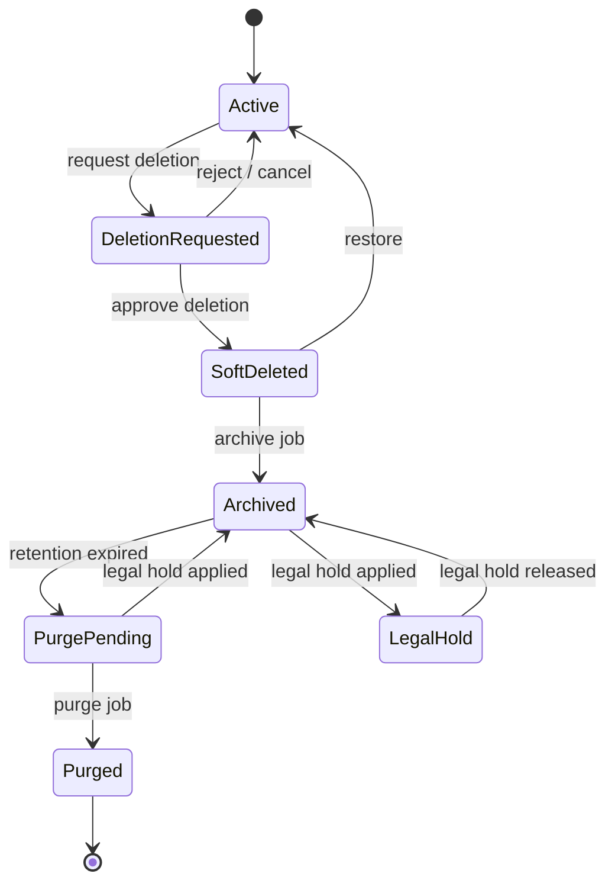
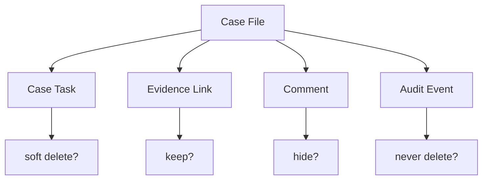
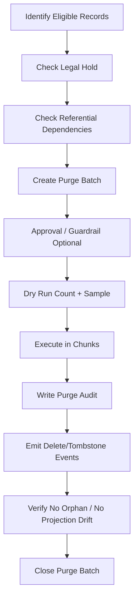
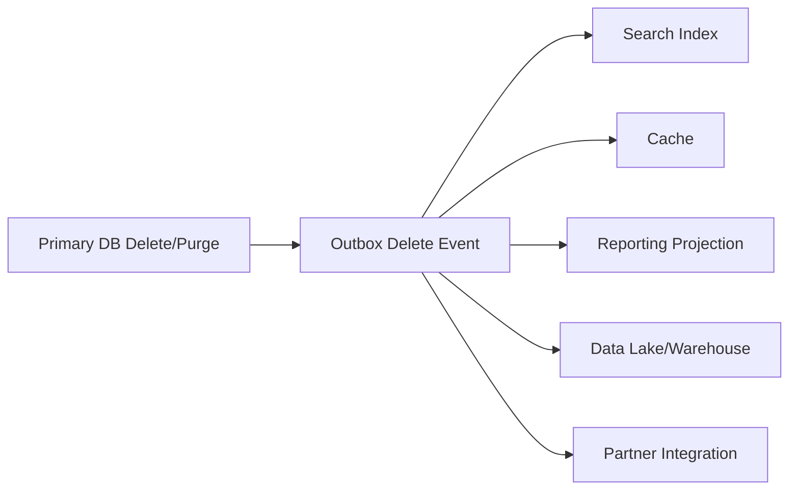

# Part 016 — Soft Delete, Archival, and Retention

> Goal: setelah bagian ini, kamu bisa mendesain deletion lifecycle yang jelas: kapan data disembunyikan, kapan diarsipkan, kapan dipurge, kapan tidak boleh dipurge karena legal hold, dan bagaimana menjaga sistem tetap benar saat data tidak lagi berada di tabel utama.

Di banyak sistem, deletion adalah fitur kecil.

Di sistem serius, deletion adalah **data lifecycle architecture**.

Soft delete yang salah akan membuat query bocor, unique constraint rusak, storage membengkak, laporan salah, audit ambigu, dan data yang seharusnya dihapus malah hidup selamanya.

---

## 1. Core Mental Model

There is no single “delete”.

Ada beberapa makna yang sering dicampur:

| Operation | Meaning |
|---|---|
| Hide | User tidak melihat data di UI normal |
| Deactivate | Entity tidak aktif tapi masih valid sebagai historical reference |
| Cancel | Business process dibatalkan sebelum selesai |
| Withdraw | Pengajuan ditarik tapi record tetap bermakna |
| Revoke | Hak/izin/akses dicabut |
| Supersede | Data digantikan versi baru |
| Archive | Dipindahkan ke storage/query path berbeda |
| Purge | Dihapus permanen dari primary system |
| Erase | Dihapus untuk privacy/right-to-erasure purpose |
| Legal hold | Tidak boleh dihapus walaupun retention normal sudah lewat |

Architect yang kuat tidak bertanya “soft delete atau hard delete?” terlebih dahulu.

Ia bertanya:

> Apa arti business dari penghapusan ini?

---

## 2. Why Soft Delete Exists

Soft delete biasanya dipakai karena:

1. user butuh undo/restore,
2. historical reference masih dibutuhkan,
3. audit/regulatory reason,
4. accidental deletion harus recoverable,
5. reporting butuh historical completeness,
6. foreign key references tidak boleh patah,
7. deletion approval workflow diperlukan,
8. data harus disembunyikan dulu sebelum purge.

Tapi soft delete bukan solusi gratis.

Ia memindahkan kompleksitas dari `DELETE` ke seluruh sistem:

- setiap query harus filter deleted rows,
- unique constraint harus mempertimbangkan deleted rows,
- joins bisa membawa deleted data,
- counts/reporting bisa salah,
- indexes membesar,
- retention bisa terlupakan,
- deletion semantics jadi ambigu,
- security bugs bisa muncul.

Soft delete harus diperlakukan sebagai state model, bukan flag kecil.

---

## 3. Soft Delete Is a State, Not a Boolean

Anti-pattern:

```sql
is_deleted boolean NOT NULL DEFAULT false
```

Ini terlalu miskin makna.

Better:

```sql
lifecycle_status text NOT NULL DEFAULT 'ACTIVE'
deleted_at timestamptz
deleted_by text
deletion_reason_code text
```

Possible statuses:

```text
ACTIVE
INACTIVE
DELETION_REQUESTED
SOFT_DELETED
ARCHIVED
PURGE_PENDING
PURGED_REFERENCE
LEGAL_HOLD
```

However, do not create status soup. Model only states that matter.

For simple tables, `deleted_at IS NULL` may be enough.

For critical domain entities, lifecycle state deserves first-class modelling.

---

## 4. Soft Delete Pattern Options

### Pattern 1: Nullable `deleted_at`

```sql
ALTER TABLE customer_note
ADD COLUMN deleted_at timestamptz,
ADD COLUMN deleted_by text,
ADD COLUMN deletion_reason text;
```

Active rows:

```sql
SELECT *
FROM customer_note
WHERE deleted_at IS NULL;
```

Use when:

- entity is simple,
- restore may be needed,
- no complex deletion workflow,
- deleted rows can remain in same table for some time.

Avoid when:

- status lifecycle is complex,
- archival/purge is mandatory,
- many related child records need coordinated deletion.

---

### Pattern 2: Lifecycle Status

```sql
CREATE TABLE case_file (
    case_id uuid PRIMARY KEY,
    status text NOT NULL,
    lifecycle_status text NOT NULL DEFAULT 'ACTIVE',
    deleted_at timestamptz,
    deleted_by text,
    deletion_reason_code text,
    archived_at timestamptz,
    purge_after timestamptz,
    legal_hold_until timestamptz
);
```

Use when:

- deletion has workflow,
- archival is separate from deletion,
- legal hold exists,
- restore depends on state,
- purge is scheduled.

---

### Pattern 3: Archive Table

Main table:

```sql
CREATE TABLE case_file (
    case_id uuid PRIMARY KEY,
    tenant_id uuid NOT NULL,
    status text NOT NULL,
    created_at timestamptz NOT NULL,
    updated_at timestamptz NOT NULL
);
```

Archive table:

```sql
CREATE TABLE case_file_archive (
    case_id uuid PRIMARY KEY,
    tenant_id uuid NOT NULL,
    status text NOT NULL,
    created_at timestamptz NOT NULL,
    updated_at timestamptz NOT NULL,
    archived_at timestamptz NOT NULL,
    archive_reason text NOT NULL,
    archived_payload jsonb
);
```

Use when:

- primary table must stay small/hot,
- archived data is rarely queried,
- archive has different access path,
- archive retention differs from active data.

Tradeoff:

- queries spanning active + archive become harder,
- foreign keys across active/archive are complicated,
- restore requires movement back,
- schema evolution must cover both tables.

---

### Pattern 4: Event + Tombstone

Instead of keeping full deleted row in primary table, keep a tombstone record.

```sql
CREATE TABLE entity_tombstone (
    entity_type text NOT NULL,
    entity_id uuid NOT NULL,
    tenant_id uuid NOT NULL,
    deleted_at timestamptz NOT NULL,
    deleted_by text NOT NULL,
    deletion_reason text,
    purge_after timestamptz,
    PRIMARY KEY (entity_type, entity_id)
);
```

Use when:

- you need to remember that entity existed,
- idempotency depends on deletion memory,
- downstream systems need delete signal,
- full data must be removed but reference marker remains.

This is common in event-driven systems:

```text
entity deleted -> tombstone retained -> delete event emitted -> projection removes row
```

---

## 5. Deletion Lifecycle Architecture



Do not treat deletion as one step if the business process has multiple states.

---

## 6. Query Safety with Soft Delete

The most common bug:

```sql
SELECT * FROM customer_note WHERE customer_id = :id;
```

Forgot:

```sql
AND deleted_at IS NULL
```

Mitigation options:

### Option 1: Repository/DAO convention

```sql
SELECT *
FROM customer_note
WHERE customer_id = :id
  AND deleted_at IS NULL;
```

Weakness: easy to forget.

### Option 2: Active view

```sql
CREATE VIEW active_customer_note AS
SELECT *
FROM customer_note
WHERE deleted_at IS NULL;
```

Application reads from view.

Weakness: writes via view need discipline; permissions must prevent bypass.

### Option 3: Row-Level Security

Use database policy to restrict visibility.

Conceptually:

```sql
CREATE POLICY only_active_customer_note
ON customer_note
FOR SELECT
USING (deleted_at IS NULL);
```

Strong for safety, but requires careful operational design.

### Option 4: Split active/archive tables

Active queries cannot accidentally see archived rows because archived rows are physically elsewhere.

Weakness: harder reconstruction and cross-state search.

---

## 7. Unique Constraints with Soft Delete

Problem:

```sql
CREATE UNIQUE INDEX ux_user_email
ON app_user(email);
```

If user is soft-deleted, can another user reuse same email?

Business must decide.

### Option A: Deleted rows still reserve uniqueness

Use normal unique constraint.

```sql
CREATE UNIQUE INDEX ux_user_email
ON app_user(email);
```

Meaning: historical identity cannot be reused.

### Option B: Only active rows must be unique

Use partial unique index.

```sql
CREATE UNIQUE INDEX ux_active_user_email
ON app_user(email)
WHERE deleted_at IS NULL;
```

Meaning: email can be reused after soft deletion.

This is not a technical decision only. It affects identity, audit, fraud, privacy, and user support.

Ask:

- Can business identifiers be reused?
- Could reuse confuse audit/history?
- Could external integrations send events for old identity?
- Is there a cooling-off period before reuse?
- Should tombstone reserve the value for some time?

---

## 8. Foreign Keys and Soft Delete

Foreign keys do not automatically understand soft deletion.

Example:

```sql
order_line.product_id REFERENCES product(product_id)
```

If product is soft-deleted, historical order lines still need product reference.

Possible semantics:

| Parent deleted | Child behavior |
|---|---|
| Keep reference | Historical child remains valid |
| Prevent delete | Parent cannot be deleted while active children exist |
| Cascade soft delete | Children become soft-deleted too |
| Reassign | Children point to replacement entity |
| Snapshot | Child stores copied attributes from parent |

Soft delete does not remove referential integrity problems. It changes their shape.

---

## 9. Cascading Soft Delete

Hard delete has `ON DELETE CASCADE`.

Soft delete needs explicit cascade policy.

Example:



For each child entity, define behavior:

| Child | On parent soft delete |
|---|---|
| Task | cancel or close pending tasks |
| Comment | hide from active UI, keep for audit |
| Evidence | keep if legal/regulatory evidence |
| Notification | no new notification, keep history |
| Audit event | keep immutable |
| Projection/read model | remove or mark inactive |

Never blindly cascade soft delete without business review.

---

## 10. Restore Semantics

Soft delete usually implies restore.

But restore is not simply:

```sql
UPDATE table SET deleted_at = NULL;
```

Questions:

- Are child records restored too?
- What if unique value was reused?
- What if parent reference is now deleted?
- What if permissions changed?
- What if workflow status is no longer valid?
- What if retention already archived part of the data?
- What if downstream projections processed delete event?

Restore should be a command with validation.

```text
RestoreCaseCommand
  -> validate case is restorable
  -> validate tenant/access boundary
  -> validate identifiers not conflicting
  -> restore selected children
  -> write audit event
  -> emit restoration event
```

---

## 11. Archival Is Not Deletion

Archive means moving data out of hot operational path.

It does not necessarily mean hidden, deleted, or legally expired.

Archive goals:

1. reduce primary table size,
2. improve hot workload performance,
3. reduce index bloat,
4. lower storage cost,
5. separate access control,
6. support long-term historical lookup,
7. prepare for purge.

Archive design must specify:

- archive trigger condition,
- archive destination,
- archive format,
- query access path,
- restore path,
- retention policy,
- integrity validation.

---

## 12. Archive Storage Patterns

### Pattern 1: Same Database, Archive Tables

```text
case_file -> case_file_archive
case_task -> case_task_archive
```

Strength:

- relational familiarity,
- easy SQL access,
- manageable migration.

Weakness:

- still consumes database resources,
- schema duplication,
- archive tables may grow huge.

### Pattern 2: Separate Archive Schema/Database

```text
primary_db.public.case_file
archive_db.archive.case_file_archive
```

Strength:

- isolates workload,
- separate access control,
- different backup/retention.

Weakness:

- cross-db query complexity,
- restore complexity.

### Pattern 3: Object Storage Archive

```text
primary table -> compressed parquet/json/csv archive -> object storage
```

Strength:

- low cost,
- long-term retention,
- analytics-friendly if columnar.

Weakness:

- no normal FK enforcement,
- slower point lookup unless indexed/cataloged,
- restore pipeline required.

### Pattern 4: Analytical Warehouse/Lakehouse

Operational data is retained in analytical system after purge from OLTP.

Strength:

- reporting preserved,
- operational DB stays lean.

Weakness:

- privacy/retention must apply there too,
- analytical copy can become compliance liability.

---

## 13. Retention Policy Design

Retention policy answers:

> How long should each data class be kept, in which form, for which purpose, under which exception rules?

A retention policy is not just a number of days.

Model it explicitly.

```sql
CREATE TABLE data_retention_policy (
    policy_id uuid PRIMARY KEY,
    data_category text NOT NULL,
    entity_type text NOT NULL,
    retention_period interval NOT NULL,
    archive_after interval,
    purge_after interval NOT NULL,
    legal_basis text,
    policy_version text NOT NULL,
    effective_from date NOT NULL,
    effective_to date
);
```

Example categories:

| Data Category | Archive After | Purge After | Notes |
|---|---:|---:|---|
| Session logs | 30 days | 90 days | Operational/security need |
| User profile inactive | 1 year | 3 years | Depends on policy/law/business |
| Case evidence | 5 years | 10 years | May be legal hold eligible |
| Audit events | never/long-term | policy-specific | Depends on regulatory need |
| Temporary import staging | 7 days | 30 days | High purge priority |

Do not copy these numbers blindly. The real values come from legal, compliance, product, and business risk requirements.

---

## 14. Retention as Data, Not Code Constant

Bad:

```java
if (createdAt.isBefore(now.minusDays(365))) {
    delete(row);
}
```

Better:

```sql
SELECT policy_id, purge_after
FROM data_retention_policy
WHERE entity_type = 'case_file'
  AND data_category = 'regulatory_case'
  AND effective_from <= current_date
  AND (effective_to IS NULL OR effective_to > current_date);
```

Why?

Because retention changes.

Policy can vary by:

- tenant,
- jurisdiction,
- data category,
- customer type,
- product line,
- legal hold,
- investigation status,
- consent/contract terms,
- regulatory regime.

A hard-coded retention period is easy to implement and hard to govern.

---

## 15. Legal Hold

Legal hold means retention policy is temporarily overridden.

```sql
CREATE TABLE legal_hold (
    legal_hold_id uuid PRIMARY KEY,
    entity_type text NOT NULL,
    entity_id uuid NOT NULL,
    hold_reason text NOT NULL,
    hold_reference text,
    applied_at timestamptz NOT NULL,
    applied_by text NOT NULL,
    released_at timestamptz,
    released_by text,
    release_reason text
);
```

Purge job must check legal hold:

```sql
SELECT e.*
FROM purge_candidate e
WHERE NOT EXISTS (
    SELECT 1
    FROM legal_hold h
    WHERE h.entity_type = e.entity_type
      AND h.entity_id = e.entity_id
      AND h.released_at IS NULL
);
```

Legal hold should also be audited.

Applying or releasing legal hold is itself a high-risk action.

---

## 16. Purge Is a Workflow

Purge should not be a random scheduled `DELETE`.

A robust purge flow:



Create a purge batch table:

```sql
CREATE TABLE purge_batch (
    purge_batch_id uuid PRIMARY KEY,
    entity_type text NOT NULL,
    policy_id uuid NOT NULL,
    status text NOT NULL,
    candidate_count bigint,
    purged_count bigint,
    failed_count bigint,
    started_at timestamptz,
    completed_at timestamptz,
    created_by text NOT NULL,
    metadata jsonb NOT NULL DEFAULT '{}'::jsonb
);
```

Candidate table:

```sql
CREATE TABLE purge_batch_item (
    purge_batch_id uuid NOT NULL REFERENCES purge_batch(purge_batch_id),
    entity_id uuid NOT NULL,
    status text NOT NULL,
    failure_reason text,
    purged_at timestamptz,
    PRIMARY KEY (purge_batch_id, entity_id)
);
```

This gives auditability and retry safety.

---

## 17. Chunked Deletes

Large deletes can cause:

- long locks,
- replication lag,
- WAL explosion,
- vacuum pressure,
- index bloat,
- transaction timeout,
- degraded user workload.

Prefer chunked purge.

Example shape:

```sql
WITH candidate AS (
    SELECT entity_id
    FROM purge_batch_item
    WHERE purge_batch_id = :batch_id
      AND status = 'PENDING'
    ORDER BY entity_id
    LIMIT 1000
)
DELETE FROM some_table t
USING candidate c
WHERE t.entity_id = c.entity_id;
```

Then mark candidates purged.

```sql
UPDATE purge_batch_item
SET status = 'PURGED',
    purged_at = now()
WHERE purge_batch_id = :batch_id
  AND entity_id IN (SELECT entity_id FROM candidate);
```

Real implementation must handle transaction boundaries carefully. Sometimes you delete children first, then parent. Sometimes you mark first, async purge later.

---

## 18. Partition-Based Purge

For time-series/log/audit-like data, partition dropping can be much safer than row-by-row delete.

Example:

```sql
CREATE TABLE access_log (
    log_id bigint NOT NULL,
    occurred_at timestamptz NOT NULL,
    tenant_id uuid NOT NULL,
    payload jsonb NOT NULL
) PARTITION BY RANGE (occurred_at);
```

Monthly partition:

```sql
CREATE TABLE access_log_2026_01
PARTITION OF access_log
FOR VALUES FROM ('2026-01-01') TO ('2026-02-01');
```

Purge old month:

```sql
DROP TABLE access_log_2026_01;
```

Advantages:

- faster than deleting millions of rows,
- easier retention boundary,
- less row-level churn,
- easier archival before drop.

Risks:

- retention must align with partition boundaries,
- legal hold inside partition complicates drop,
- queries need partition pruning,
- indexes are per partition.

If legal hold can apply to individual rows, partition drop may not be enough unless held rows are moved out first.

---

## 19. Archival Before Purge

Common flow:

```text
active -> soft deleted -> archived -> purge primary -> retain tombstone/audit
```

Before purging, archive may need verification.

Archive validation checklist:

- record count matches,
- checksum/hash matches,
- required metadata exists,
- archive location is immutable enough,
- archive encryption/access policy is correct,
- restore sample test passes,
- downstream reporting still works,
- legal hold exceptions excluded.

Example archive manifest:

```sql
CREATE TABLE archive_manifest (
    archive_manifest_id uuid PRIMARY KEY,
    entity_type text NOT NULL,
    archive_location text NOT NULL,
    record_count bigint NOT NULL,
    content_hash text,
    archived_from timestamptz NOT NULL,
    archived_to timestamptz NOT NULL,
    created_at timestamptz NOT NULL DEFAULT now(),
    created_by text NOT NULL
);
```

A purge without archive verification is a bet.

---

## 20. Tombstone Design

After purge, you may still need a minimal marker.

Tombstone use cases:

1. prevent ID reuse,
2. deduplicate future events,
3. explain why reference disappeared,
4. propagate deletion downstream,
5. avoid resurrection from stale messages,
6. support privacy-safe existence memory.

Example:

```sql
CREATE TABLE user_tombstone (
    user_id uuid PRIMARY KEY,
    tenant_id uuid NOT NULL,
    deleted_at timestamptz NOT NULL,
    deletion_type text NOT NULL,
    deletion_reason_code text,
    original_created_at timestamptz,
    identifier_fingerprint text
);
```

Be careful: tombstone itself may be personal data if it contains identifiable attributes.

---

## 21. Delete Events and Downstream Systems

Deleting from primary DB is not enough if data was copied to:

- search index,
- cache,
- data warehouse,
- read model,
- object storage,
- ML feature store,
- external partner system,
- backup,
- audit store.

Deletion must be propagated.



Event example:

```json
{
  "event_type": "CUSTOMER_ERASED",
  "event_version": 1,
  "customer_id": "...",
  "tenant_id": "...",
  "erased_at": "2026-07-04T10:00:00Z",
  "erasure_scope": ["profile", "contacts", "preferences"]
}
```

The event should not contain the data being erased.

---

## 22. Backup and Retention Tension

Purging from primary database does not instantly remove data from backups.

This creates a policy question:

- Are backups restored only under strict controls?
- What happens if old backup containing erased data is restored?
- Are restored backups re-subjected to purge jobs?
- How long are backups retained?
- Are backup retention policies aligned with data retention requirements?

For production systems, write this down.

A common control:

> If backup restore occurs, run post-restore purge reconciliation before exposing restored system to users.

---

## 23. Soft Delete and Reporting

Reporting questions often differ from UI questions.

UI may ask:

```text
show active cases
```

Regulatory report may ask:

```text
show all cases opened during period, including closed/deleted/archived
```

Analytics may ask:

```text
count active users at end of each month
```

Therefore, do not blindly filter `deleted_at IS NULL` in reporting pipelines.

Report must define its population:

- active only,
- active + inactive,
- historical as-of date,
- deleted included,
- purged excluded,
- anonymized included,
- legally held included.

Wrong reporting filter can become a regulatory error.

---

## 24. Soft Delete and Access Control

Deleted records may need different permissions.

Examples:

- normal user cannot view deleted records,
- admin can restore within 30 days,
- compliance officer can view archived records,
- legal team can apply hold,
- support cannot view erased PII,
- engineer cannot query raw archive without break-glass.

Model access by lifecycle state.

```text
ACTIVE: normal business permissions
SOFT_DELETED: admin/support restore permissions
ARCHIVED: compliance/reporting permissions
LEGAL_HOLD: legal/compliance only
PURGED: no full data access; tombstone/audit only
```

Access control must follow data lifecycle.

---

## 25. GDPR/Privacy-Style Erasure vs Audit Retention

Privacy erasure and audit retention can conflict.

Simplified tension:

- privacy principle may require deletion/minimization of personal data,
- audit/regulatory need may require keeping proof of actions.

Practical architectural response:

1. minimize what audit stores,
2. separate raw PII from audit facts,
3. retain non-identifying evidence where possible,
4. tokenize or pseudonymize identifiers,
5. document legal basis for retained audit data,
6. apply retention to all copies, not only primary DB,
7. involve legal/compliance for real policy.

Database architect should not decide legal policy alone, but must design mechanisms that can implement it.

---

## 26. Common Anti-Patterns

### Anti-Pattern 1: Boolean Soft Delete Everywhere

```sql
is_deleted boolean
```

No actor, no time, no reason, no restore policy, no purge path.

### Anti-Pattern 2: Never Purging Anything

Soft delete becomes permanent data hoarding.

### Anti-Pattern 3: Purge Without Audit

No proof of what was deleted, when, by what policy.

### Anti-Pattern 4: Unique Constraint Broken by Deleted Rows

Users cannot reuse legitimate values because old deleted rows still block them, or worse, can reuse values when business says they should not.

### Anti-Pattern 5: Archive Without Restore Test

Archive exists only until someone needs it.

### Anti-Pattern 6: Deleting Parent, Forgetting Projections

Primary DB is clean, search index still exposes data.

### Anti-Pattern 7: Legal Hold as Manual Spreadsheet

Purge job has no enforceable knowledge of legal hold.

### Anti-Pattern 8: Backup Retention Ignored

Primary data purged; backups retain it for years without policy.

---

## 27. Decision Matrix

| Requirement | Suggested Pattern |
|---|---|
| Simple undo within short window | `deleted_at`, `deleted_by`, `deleted_reason` |
| Business lifecycle deletion | explicit `lifecycle_status` |
| Hot table growth problem | archive table or partitioning |
| Time-based log retention | partition-based purge |
| Regulatory evidence | audit + history + legal hold |
| Privacy erasure | minimization + purge + tombstone + downstream delete events |
| High-volume deletes | chunked purge or partition drop |
| Reuse identifier after delete | partial unique index or tombstone policy |
| Prevent accidental query leaks | active view or RLS/policy layer |
| Need restore | restore command with validation and audit |

---

## 28. Production Implementation Template

A mature deletion architecture contains:

### Entity Lifecycle Columns

```sql
lifecycle_status
soft_deleted_at
soft_deleted_by
delete_reason_code
archived_at
purge_after
```

### Policy Tables

```sql
data_retention_policy
legal_hold
purge_batch
purge_batch_item
archive_manifest
```

### Events

```text
ENTITY_SOFT_DELETED
ENTITY_RESTORED
ENTITY_ARCHIVED
ENTITY_PURGED
ENTITY_ERASED
LEGAL_HOLD_APPLIED
LEGAL_HOLD_RELEASED
```

### Operational Jobs

```text
archive candidate selector
archive executor
purge candidate selector
purge executor
downstream deletion reconciler
backup restore purge reconciler
```

### Controls

```text
dashboards
alerts
dry-run reports
approval for dangerous purge
sample restore tests
audit completeness tests
legal hold enforcement tests
```

---

## 29. Review Checklist

Before approving deletion/retention design, ask:

### Semantics

- What does delete mean for this entity?
- Is deletion reversible?
- Is deletion business cancellation, deactivation, withdrawal, or erasure?
- Are deleted records still valid historical references?

### Data Model

- Is `deleted_at` enough, or do we need lifecycle status?
- Are actor, time, and reason captured?
- Are unique constraints correct for deleted records?
- Are parent/child soft delete rules defined?

### Query Safety

- Can normal queries accidentally show deleted records?
- Is there an active view, RLS policy, or repository guarantee?
- Are reporting queries intentionally including/excluding deleted rows?

### Retention

- Is retention policy explicit and versioned?
- Does retention vary by tenant/jurisdiction/data category?
- Is legal hold enforceable by database/job logic?
- Is purge audited?

### Operations

- Are deletes chunked or partition-based?
- What is expected table/index growth?
- Is archive verified before purge?
- Is restore tested?
- Are downstream copies deleted?
- Are backups covered by policy?

---

## 30. Part Summary

Soft delete is not a boolean. It is a lifecycle design problem.

Key principles:

1. Define business meaning before choosing implementation.
2. Treat deletion as a state transition with actor, time, and reason.
3. Make query safety explicit.
4. Decide uniqueness semantics for deleted records.
5. Define cascade behavior for child entities.
6. Separate soft delete, archive, purge, erasure, and legal hold.
7. Use retention policy as governed data, not hard-coded constants.
8. Purge in controlled, auditable, retry-safe batches.
9. Propagate deletion to downstream systems.
10. Align backup, archive, audit, and privacy requirements.

A top engineer does not merely ask “should we soft delete?”.

A top engineer asks:

> What lifecycle states must this data pass through, what evidence must survive, what data must disappear, who can prove it, and how do we prevent the rest of the system from lying about it?

---

## 31. Sources and Further Reading

- PostgreSQL Documentation — Constraints: https://www.postgresql.org/docs/current/ddl-constraints.html
- PostgreSQL Documentation — Partial Indexes: https://www.postgresql.org/docs/current/indexes-partial.html
- PostgreSQL Documentation — Row Security Policies: https://www.postgresql.org/docs/current/ddl-rowsecurity.html
- PostgreSQL Documentation — Table Partitioning: https://www.postgresql.org/docs/current/ddl-partitioning.html
- AWS Well-Architected Framework — Use policies to manage lifecycle of datasets: https://docs.aws.amazon.com/wellarchitected/latest/framework/sus_sus_data_a4.html
- AWS Well-Architected Framework — Back up data: https://docs.aws.amazon.com/wellarchitected/latest/reliability-pillar/back-up-data.html
- AWS Well-Architected Framework — Data Classification: https://docs.aws.amazon.com/wellarchitected/latest/security-pillar/data-classification.html
- NIST SP 800-92 — Guide to Computer Security Log Management: https://csrc.nist.gov/pubs/sp/800/92/final
