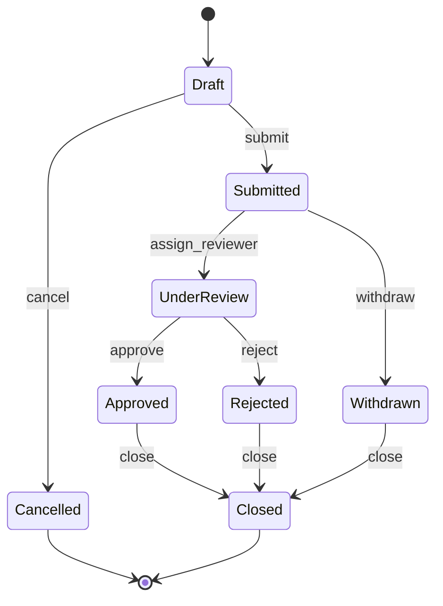
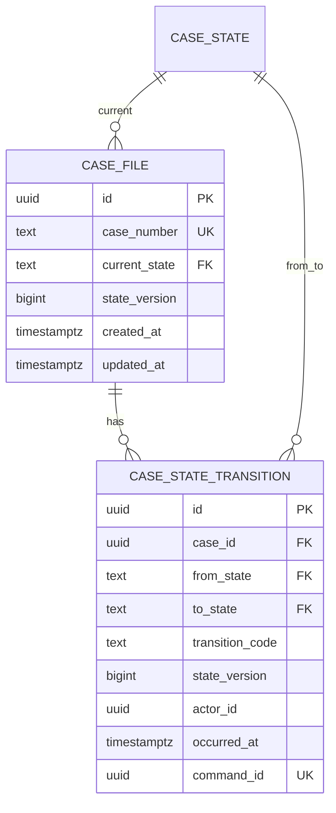
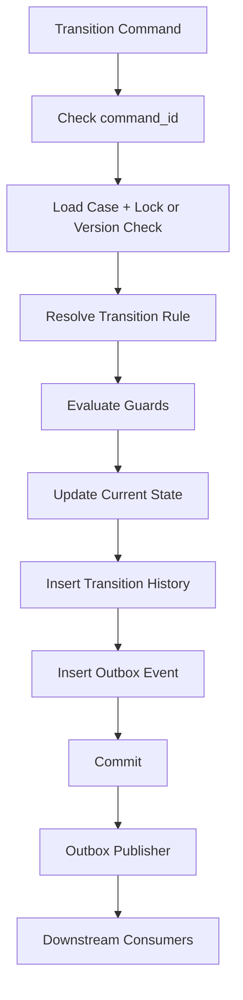

# Part 017 — Schema Design for State Machines

> Goal: setelah bagian ini, kamu bisa mendesain schema database untuk entity yang hidup sebagai **state machine**: memiliki status, transisi legal, guard condition, actor, reason, timestamp, audit trail, concurrency protection, dan failure model yang jelas.

Banyak database buruk bukan rusak karena tipe kolom salah.

Mereka rusak karena **state transition** tidak dimodelkan.

Kolom `status` terlihat sederhana:

```sql
status varchar(30) not null
```

Tapi di sistem produksi, `status` bukan sekadar value. Ia adalah ringkasan dari perjalanan hidup entity.

Pertanyaan yang sebenarnya:

- state apa saja yang mungkin?
- transisi apa saja yang legal?
- siapa boleh melakukan transisi?
- condition apa yang harus benar sebelum transisi?
- apakah transisi reversible?
- apakah transisi harus meninggalkan evidence?
- apakah transisi harus menghasilkan downstream event?
- bagaimana kalau dua actor mengubah state bersamaan?
- bagaimana kalau proses gagal di tengah?
- bagaimana kita membuktikan bahwa state sekarang valid?

State machine design adalah cara membuat database tidak hanya menyimpan keadaan, tetapi juga **mengatur perubahan keadaan**.

---

## 1. Core Mental Model

Sebuah state machine memiliki empat elemen:

| Element | Meaning | Database Representation |
|---|---|---|
| State | Kondisi entity pada satu titik waktu | `current_status`, `state`, `phase`, `lifecycle_status` |
| Transition | Perubahan dari satu state ke state lain | transition table, event table, command handler |
| Guard | Syarat sebelum transisi boleh terjadi | constraint, transaction check, policy check, trigger, application rule |
| Side effect | Efek setelah transisi | audit row, outbox event, task creation, notification, projection update |

Diagram sederhana:



Database architect harus melihat ini bukan sebagai diagram UI, tapi sebagai **integrity boundary**.

Kalau state machine tidak eksplisit, illegal state akan muncul sebagai kombinasi kolom yang tidak masuk akal:

```text
status = 'APPROVED'
approved_at = null
approved_by = null
rejected_reason = 'insufficient evidence'
closed_at = null
```

Atau:

```text
status = 'CLOSED'
active_task_count = 3
final_decision_id = null
```

State machine yang baik membuat illegal state sulit masuk sejak awal.

---

## 2. Status Column Is Not a State Machine

Kolom `status` hanya menyimpan state saat ini.

Ia tidak menjawab:

- bagaimana state itu dicapai,
- apakah transisinya legal,
- siapa yang melakukan,
- kenapa dilakukan,
- apakah ada validasi,
- apakah ada event downstream,
- apakah ada race condition,
- apakah state pernah rollback,
- apakah state pernah dikoreksi.

Bad design:

```sql
create table investigation_case (
  id uuid primary key,
  case_number text not null unique,
  status text not null,
  created_at timestamptz not null default now(),
  updated_at timestamptz not null default now()
);
```

Desain ini terlalu permisif.

Ia menerima:

```sql
update investigation_case
set status = 'APPROVED'
where id = :case_id;
```

Tidak ada database-level clue apakah `APPROVED` boleh dicapai dari state sebelumnya.

Better minimal design:

```sql
create table investigation_case (
  id uuid primary key,
  case_number text not null unique,
  current_state text not null,
  state_version bigint not null default 0,
  created_at timestamptz not null default now(),
  updated_at timestamptz not null default now(),
  constraint investigation_case_state_chk check (
    current_state in (
      'DRAFT',
      'SUBMITTED',
      'UNDER_REVIEW',
      'APPROVED',
      'REJECTED',
      'WITHDRAWN',
      'CANCELLED',
      'CLOSED'
    )
  )
);
```

Tapi ini masih hanya validasi vocabulary. Ia belum memvalidasi **transition legality**.

---

## 3. Vocabulary Table vs Check Constraint

Ada dua cara umum menyimpan daftar state:

1. `CHECK (state in (...))`
2. reference table seperti `case_state`

### 3.1 CHECK Constraint

Cocok bila daftar state:

- kecil,
- jarang berubah,
- bagian dari kode aplikasi,
- perlu constraint cepat,
- tidak butuh metadata kompleks.

```sql
create table case_file (
  id uuid primary key,
  current_state text not null,
  constraint case_file_state_chk check (
    current_state in ('DRAFT', 'SUBMITTED', 'REVIEW', 'APPROVED', 'REJECTED')
  )
);
```

Kelebihan:

- sederhana,
- langsung enforce di database,
- tidak butuh join,
- jelas terlihat di DDL.

Kekurangan:

- perubahan state butuh migration,
- metadata state sulit disimpan,
- tidak cocok untuk configurable workflow.

### 3.2 Reference Table

Cocok bila state punya metadata:

- display order,
- terminal marker,
- SLA class,
- phase,
- severity,
- allowed role,
- UI label,
- external mapping,
- active/inactive version.

```sql
create table case_state (
  code text primary key,
  label text not null,
  phase text not null,
  is_initial boolean not null default false,
  is_terminal boolean not null default false,
  sort_order int not null,
  is_active boolean not null default true,
  constraint case_state_phase_chk check (
    phase in ('OPENING', 'REVIEW', 'DECISION', 'CLOSURE')
  )
);

create table case_file (
  id uuid primary key,
  case_number text not null unique,
  current_state text not null references case_state(code),
  state_version bigint not null default 0,
  created_at timestamptz not null default now(),
  updated_at timestamptz not null default now()
);
```

Kelebihan:

- extensible,
- state bisa punya metadata,
- cocok untuk admin/configuration,
- bisa versioned.

Kekurangan:

- jangan sampai reference table menjadi “config soup”,
- perubahan workflow bisa terlalu mudah tanpa review engineering,
- perlu governance.

Rule praktis:

> Use `CHECK` for product-owned stable state. Use reference tables for governed, metadata-rich, or configurable state.

---

## 4. Transition Table as First-Class Model

Kalau state penting, transisi juga harus menjadi first-class data.

```sql
create table case_state_transition_rule (
  from_state text not null references case_state(code),
  to_state text not null references case_state(code),
  transition_code text not null,
  actor_role text not null,
  requires_reason boolean not null default false,
  requires_evidence boolean not null default false,
  is_reversible boolean not null default false,
  is_active boolean not null default true,
  primary key (from_state, to_state, transition_code)
);
```

Contoh data:

```sql
insert into case_state_transition_rule
  (from_state, to_state, transition_code, actor_role, requires_reason, requires_evidence)
values
  ('DRAFT', 'SUBMITTED', 'SUBMIT_CASE', 'CASE_OWNER', false, false),
  ('SUBMITTED', 'UNDER_REVIEW', 'ASSIGN_REVIEW', 'SUPERVISOR', false, false),
  ('UNDER_REVIEW', 'APPROVED', 'APPROVE_CASE', 'REVIEWER', true, true),
  ('UNDER_REVIEW', 'REJECTED', 'REJECT_CASE', 'REVIEWER', true, false),
  ('SUBMITTED', 'WITHDRAWN', 'WITHDRAW_CASE', 'CASE_OWNER', true, false);
```

Transition table berguna untuk:

- dokumentasi executable,
- validation,
- audit,
- UI action availability,
- role policy alignment,
- process analytics,
- test generation,
- migration review.

Tapi hati-hati:

> Transition table tidak otomatis menjamin transisi legal kecuali write path benar-benar mengeceknya dalam transaksi.

---

## 5. Current State and State History

Untuk sistem serius, gunakan dua representasi:

1. current state di entity utama untuk fast read,
2. transition history untuk audit dan reconstruction.

```sql
create table case_file (
  id uuid primary key,
  case_number text not null unique,
  current_state text not null references case_state(code),
  state_version bigint not null default 0,
  created_at timestamptz not null default now(),
  updated_at timestamptz not null default now()
);

create table case_state_transition (
  id uuid primary key,
  case_id uuid not null references case_file(id),
  from_state text references case_state(code),
  to_state text not null references case_state(code),
  transition_code text not null,
  state_version bigint not null,
  actor_id uuid not null,
  actor_role text not null,
  reason_code text,
  reason_text text,
  occurred_at timestamptz not null default now(),
  correlation_id uuid,
  causation_id uuid,
  command_id uuid not null,
  metadata jsonb not null default '{}'::jsonb,
  constraint case_transition_reason_chk check (
    reason_code is not null or reason_text is not null or transition_code not in ('REJECT_CASE', 'WITHDRAW_CASE')
  ),
  constraint case_transition_command_uk unique (command_id),
  constraint case_transition_version_uk unique (case_id, state_version)
);
```

Kenapa menyimpan `current_state` kalau history bisa dihitung?

Karena current-state query sangat sering:

```sql
select *
from case_file
where current_state = 'UNDER_REVIEW'
order by updated_at desc
limit 50;
```

Menghitung current state dari event history setiap request akan mahal dan rawan salah jika query harus menentukan “last transition” untuk banyak entity.

Tapi current state adalah **derived summary** dari history.

Karena itu harus ada invariant:

```text
case_file.current_state == latest(case_state_transition.to_state for case_id)
case_file.state_version == max(case_state_transition.state_version for case_id)
```

Ini bisa dijaga oleh transaction discipline, trigger, atau reconciliation job.

---

## 6. Transition Write Path

State transition harus diperlakukan seperti command, bukan update bebas.

Bad write path:

```sql
update case_file
set current_state = :to_state
where id = :case_id;
```

Better write path:

```text
transition_case(case_id, transition_code, actor, reason, command_id)
```

Inside transaction:

1. lock/read current case row,
2. load current state,
3. find matching transition rule,
4. evaluate guard conditions,
5. update current state and increment version,
6. insert transition history,
7. insert outbox event if needed,
8. commit.

SQL-ish example:

```sql
begin;

select id, current_state, state_version
from case_file
where id = :case_id
for update;

select *
from case_state_transition_rule
where from_state = :current_state
  and transition_code = :transition_code
  and is_active = true;

-- application or stored procedure evaluates additional guards here

update case_file
set current_state = :to_state,
    state_version = state_version + 1,
    updated_at = now()
where id = :case_id;

insert into case_state_transition (
  id,
  case_id,
  from_state,
  to_state,
  transition_code,
  state_version,
  actor_id,
  actor_role,
  reason_code,
  reason_text,
  command_id,
  occurred_at
)
values (
  :transition_id,
  :case_id,
  :current_state,
  :to_state,
  :transition_code,
  :new_state_version,
  :actor_id,
  :actor_role,
  :reason_code,
  :reason_text,
  :command_id,
  now()
);

commit;
```

The key is not the exact SQL.

The key is the invariant:

> Current state and transition history must change atomically.

---

## 7. Optimistic vs Pessimistic State Transition

Ada dua pola umum untuk concurrency.

### 7.1 Pessimistic Locking

Gunakan `SELECT ... FOR UPDATE` pada entity row.

Cocok bila:

- contention per entity tinggi,
- transition mahal,
- correctness lebih penting daripada throughput,
- user-facing workflow tidak boleh double-transition.

```sql
select id, current_state, state_version
from case_file
where id = :case_id
for update;
```

Kelebihan:

- sederhana,
- mencegah dua transition bersamaan pada entity yang sama,
- mudah reasoning.

Kekurangan:

- blocking,
- deadlock risk kalau lock order buruk,
- tidak ideal untuk high-throughput append-heavy transitions.

### 7.2 Optimistic Version Check

Gunakan `state_version` sebagai compare-and-swap.

```sql
update case_file
set current_state = :to_state,
    state_version = state_version + 1,
    updated_at = now()
where id = :case_id
  and current_state = :expected_from_state
  and state_version = :expected_version;
```

Jika affected row = 0, berarti:

- state sudah berubah,
- version mismatch,
- entity tidak ditemukan,
- command stale.

Cocok bila:

- contention rendah,
- retry acceptable,
- sistem command-driven,
- event ingestion high-throughput.

Rule praktis:

> Use pessimistic locking for human workflow with strong correctness requirement. Use optimistic versioning for distributed command processing with retry discipline.

---

## 8. Guard Conditions

Transition rule hanya mengatakan `from_state -> to_state` legal.

Guard mengatakan apakah transisi legal **untuk instance ini sekarang**.

Contoh:

```text
UNDER_REVIEW -> APPROVED legal only if:
- all required documents are submitted,
- at least one reviewer recommendation exists,
- no unresolved critical finding exists,
- approval actor is not the submitter,
- case is not under legal hold,
- SLA exception has been acknowledged if overdue.
```

Guard bisa berada di beberapa level:

| Guard Type | Example | Best Enforcement |
|---|---|---|
| Simple attribute | `closed_at is null` | DB check / transaction condition |
| Existence | required evidence exists | transaction query |
| Aggregate | no unresolved task | transaction query / materialized counter |
| Authorization | actor has role | application policy + DB boundary |
| Cross-service | external payment cleared | async state / saga |
| Temporal | appeal window still open | transaction query using controlled clock |
| Regulatory | cannot approve without evidence | DB + app + audit |

Bad approach:

```text
UI hides approve button if evidence missing.
```

UI hiding is not a guard. It is convenience.

A real guard lives at the write boundary.

---

## 9. Guard Storage Pattern

Not every guard should be stored as configuration.

Some guards are domain logic and should be version-controlled code.

### 9.1 Static Domain Guard

Example:

```text
A case cannot be approved by the same actor who submitted it.
```

This should be in code and tested.

It can also be supported by database query:

```sql
select submitted_by
from case_file
where id = :case_id;
```

Then command handler checks:

```text
actor_id != submitted_by
```

### 9.2 Configurable Guard

Example:

```text
For enforcement type A, approval requires 2 reviewers.
For enforcement type B, approval requires 1 reviewer.
```

This may belong in configuration table:

```sql
create table approval_policy (
  case_type text primary key,
  min_reviewer_count int not null,
  requires_supervisor_approval boolean not null,
  effective_from timestamptz not null,
  effective_to timestamptz,
  constraint approval_policy_min_reviewer_chk check (min_reviewer_count >= 1)
);
```

### 9.3 Guard Result Audit

For high-regulation systems, store guard evaluation result:

```sql
create table case_transition_guard_result (
  id uuid primary key,
  transition_id uuid not null references case_state_transition(id),
  guard_code text not null,
  passed boolean not null,
  evaluated_at timestamptz not null,
  evidence jsonb not null default '{}'::jsonb,
  constraint case_guard_result_uk unique (transition_id, guard_code)
);
```

This is not always needed.

But when decisions must be defended months later, it is powerful.

It lets you answer:

> At the time of approval, what did the system believe, and which checks passed?

---

## 10. State Machine Design Styles

There are several schema styles. Choose intentionally.

### 10.1 Simple Current-State Table

Use when:

- lifecycle simple,
- audit not critical,
- few transitions,
- no regulatory traceability.

```sql
create table todo_item (
  id uuid primary key,
  title text not null,
  status text not null check (status in ('OPEN', 'DONE', 'CANCELLED'))
);
```

This is fine for low-risk domains.

Do not over-engineer every status.

### 10.2 Current State + Transition History

Use when:

- audit matters,
- transitions matter,
- process analytics matter,
- current query must be fast.

This is the default for serious business workflow.



### 10.3 Event-Sourced State

Use when:

- every change is event,
- replay matters,
- multiple projections needed,
- temporal reconstruction is core,
- team can handle operational complexity.

```sql
create table case_event (
  id uuid primary key,
  stream_id uuid not null,
  stream_version bigint not null,
  event_type text not null,
  payload jsonb not null,
  occurred_at timestamptz not null,
  command_id uuid not null,
  constraint case_event_stream_version_uk unique (stream_id, stream_version),
  constraint case_event_command_uk unique (command_id)
);
```

Then `case_file` is a projection.

But do not call it event sourcing just because you have audit rows.

Event sourcing means state is derived from event stream as source of truth.

Most enterprise systems do not need full event sourcing. They need current-state table plus transition history.

### 10.4 Workflow-Engine State

Use when external workflow engine owns execution state.

Database still needs business state.

Do not blindly expose engine internals as domain state.

Better:

```text
workflow_engine.execution_state = technical process execution
case_file.current_state = business lifecycle state
```

These are related but not identical.

---

## 11. Phase vs State

Many schemas overload status.

Example:

```text
DRAFT
SUBMITTED
UNDER_REVIEW
WAITING_FOR_DOCUMENTS
WAITING_FOR_PAYMENT
APPROVED
REJECTED
CLOSED
ESCALATED
HIGH_PRIORITY
OVERDUE
ASSIGNED
UNASSIGNED
```

This mixes multiple dimensions:

- lifecycle state,
- waiting reason,
- priority,
- SLA condition,
- assignment condition,
- escalation flag.

Better separate dimensions:

```sql
create table case_file (
  id uuid primary key,
  lifecycle_state text not null,
  waiting_reason text,
  priority text not null,
  sla_state text not null,
  assignment_state text not null,
  escalation_level int not null default 0,
  constraint case_lifecycle_state_chk check (
    lifecycle_state in ('DRAFT', 'SUBMITTED', 'UNDER_REVIEW', 'DECIDED', 'CLOSED')
  ),
  constraint case_priority_chk check (
    priority in ('LOW', 'NORMAL', 'HIGH', 'CRITICAL')
  ),
  constraint case_sla_state_chk check (
    sla_state in ('ON_TRACK', 'AT_RISK', 'BREACHED', 'PAUSED')
  )
);
```

Mental model:

> Use one state machine per independent lifecycle dimension. Do not force unrelated dimensions into one giant enum.

But do not over-split either.

If dimensions are tightly coupled and always transition together, they may be one state machine.

---

## 12. Terminal States

Terminal state means no normal transition should leave it.

Examples:

- `CLOSED`,
- `CANCELLED`,
- `REJECTED_FINAL`,
- `EXPIRED`,
- `PURGED`.

Do not assume every terminal state is the same.

| Terminal State | Meaning | Can Reopen? |
|---|---|---|
| `CLOSED` | Completed lifecycle | Maybe via reopen workflow |
| `CANCELLED` | Aborted before completion | Usually no |
| `REJECTED` | Negative decision | Maybe appeal creates new lifecycle |
| `EXPIRED` | Time window elapsed | Rarely |
| `PURGED` | Data removed/anonymized | No |

If reopening is allowed, it is not a casual update.

It is a transition with reason and authorization:

```text
CLOSED -> REOPENED requires:
- supervisor role,
- reopen reason,
- within reopen window OR exceptional approval,
- audit event,
- task recreation.
```

Schema:

```sql
insert into case_state_transition_rule
  (from_state, to_state, transition_code, actor_role, requires_reason)
values
  ('CLOSED', 'UNDER_REVIEW', 'REOPEN_CASE', 'SUPERVISOR', true);
```

---

## 13. Reversible vs Corrective Transition

Do not confuse reversal with correction.

### 13.1 Reversal

Business says previous decision is reversed.

Example:

```text
APPROVED -> REVOKED
```

The approval happened. It remains true historically. Later it was revoked.

### 13.2 Correction

System says previous data was wrong.

Example:

```text
The case was marked APPROVED due to clerical error.
Correct state should have been UNDER_REVIEW.
```

Correction needs a different model.

Option A: corrective transition:

```text
APPROVED -> UNDER_REVIEW with transition_code = CORRECT_STATE
```

Option B: correction record:

```sql
create table case_state_correction (
  id uuid primary key,
  case_id uuid not null references case_file(id),
  incorrect_transition_id uuid not null references case_state_transition(id),
  corrected_by uuid not null,
  corrected_at timestamptz not null,
  correction_reason text not null,
  replacement_transition_id uuid references case_state_transition(id)
);
```

Rule:

> Reversal is a business event. Correction is an error-handling event. Model them differently when audit meaning matters.

---

## 14. State Machine and Audit Trail

A transition history row should answer:

- what changed,
- from what,
- to what,
- by whom,
- under what role,
- when,
- why,
- because of which command,
- under which correlation/request,
- using what evidence,
- under which policy version.

Recommended transition columns:

| Column | Purpose |
|---|---|
| `id` | transition identity |
| `case_id` | affected entity |
| `from_state` | previous state |
| `to_state` | new state |
| `transition_code` | command/action semantics |
| `state_version` | ordering per entity |
| `actor_id` | who performed action |
| `actor_role` | under which role/capacity |
| `reason_code` | structured reason |
| `reason_text` | human explanation |
| `policy_version` | rule version used |
| `occurred_at` | business/system occurrence time |
| `command_id` | idempotency/deduplication |
| `correlation_id` | request/process trace |
| `causation_id` | preceding event/command |
| `metadata` | non-core extensibility |

Avoid storing only:

```text
old_status, new_status, updated_by, updated_at
```

That is usually too weak for serious process reconstruction.

---

## 15. State Machine and Idempotency

Transition command may be retried.

Without idempotency, duplicate commands can create duplicate transition history or double side effects.

Use `command_id`:

```sql
alter table case_state_transition
add constraint case_state_transition_command_uk unique (command_id);
```

Write path:

1. receive command with stable `command_id`,
2. check if transition already exists for that command,
3. if yes, return previous result,
4. if no, attempt transition,
5. insert transition with same `command_id`,
6. commit.

Important nuance:

`command_id` should represent the logical command, not every HTTP request attempt.

Bad:

```text
new command_id generated on every retry
```

Good:

```text
same command_id reused for same business request
```

---

## 16. State Machine and Outbox

Many transitions must notify other systems.

Example:

```text
CASE_APPROVED -> generate certificate, notify applicant, update analytics, close tasks
```

Do not publish external events before the transaction commits.

Use outbox:

```sql
create table outbox_event (
  id uuid primary key,
  aggregate_type text not null,
  aggregate_id uuid not null,
  event_type text not null,
  payload jsonb not null,
  occurred_at timestamptz not null default now(),
  correlation_id uuid,
  causation_id uuid,
  published_at timestamptz,
  publish_attempt_count int not null default 0
);
```

Inside same transaction:

```sql
insert into outbox_event (
  id,
  aggregate_type,
  aggregate_id,
  event_type,
  payload,
  correlation_id,
  causation_id
)
values (
  :event_id,
  'CASE',
  :case_id,
  'CaseApproved',
  :payload,
  :correlation_id,
  :transition_id
);
```

Invariant:

> If current state says approved, the corresponding transition event and outbox event must exist or be reconstructable.

---

## 17. State Machine and Derived Counters

Guard conditions often need aggregate checks:

```text
case can close only if unresolved_task_count = 0
```

Option A: compute live every transition:

```sql
select count(*)
from case_task
where case_id = :case_id
  and status not in ('DONE', 'CANCELLED');
```

Option B: maintain counter:

```sql
alter table case_file
add column unresolved_task_count int not null default 0;
```

Tradeoff:

| Approach | Pros | Cons |
|---|---|---|
| Live query | Always fresh if transactionally visible | Expensive under scale |
| Counter | Fast guard | Can drift if not maintained atomically |

If using counter, update it in same transaction as task change.

And add reconciliation:

```sql
select c.id, c.unresolved_task_count, actual.count
from case_file c
join lateral (
  select count(*) as count
  from case_task t
  where t.case_id = c.id
    and t.status not in ('DONE', 'CANCELLED')
) actual on true
where c.unresolved_task_count <> actual.count;
```

---

## 18. Illegal State Examples

State machine design should identify illegal combinations.

Example table:

```sql
create table case_file (
  id uuid primary key,
  lifecycle_state text not null,
  submitted_at timestamptz,
  approved_at timestamptz,
  rejected_at timestamptz,
  closed_at timestamptz,
  approved_by uuid,
  rejected_by uuid,
  rejection_reason text
);
```

Potential illegal states:

| Illegal Combination | Why Bad |
|---|---|
| `lifecycle_state = 'APPROVED' and approved_at is null` | approved state missing required timestamp |
| `approved_at is not null and rejected_at is not null` | mutually exclusive final outcomes unless appeal model exists |
| `rejected_at is not null and rejection_reason is null` | rejection not explainable |
| `closed_at is not null and lifecycle_state <> 'CLOSED'` | closure marker inconsistent |
| `lifecycle_state = 'DRAFT' and submitted_at is not null` | lifecycle contradiction |

Use `CHECK` constraints for simple row-local invariants:

```sql
alter table case_file add constraint case_approval_consistency_chk check (
  (lifecycle_state <> 'APPROVED')
  or
  (approved_at is not null and approved_by is not null)
);

alter table case_file add constraint case_rejection_consistency_chk check (
  (lifecycle_state <> 'REJECTED')
  or
  (rejected_at is not null and rejected_by is not null and rejection_reason is not null)
);
```

But not all invariants fit `CHECK`.

Cross-row and temporal invariants need transactional code, constraints, triggers, or reconciliation.

---

## 19. Transition Rule Versioning

Workflow rules change.

A transition legal today may have been illegal last year.

Do not overwrite history blindly.

Version transition rules:

```sql
create table case_workflow_definition (
  id uuid primary key,
  workflow_code text not null,
  version int not null,
  effective_from timestamptz not null,
  effective_to timestamptz,
  status text not null check (status in ('DRAFT', 'ACTIVE', 'RETIRED')),
  constraint case_workflow_definition_uk unique (workflow_code, version)
);

create table case_state_transition_rule (
  id uuid primary key,
  workflow_definition_id uuid not null references case_workflow_definition(id),
  from_state text not null,
  to_state text not null,
  transition_code text not null,
  actor_role text not null,
  is_active boolean not null default true,
  constraint case_transition_rule_uk unique (
    workflow_definition_id,
    from_state,
    transition_code
  )
);
```

Store workflow version used by each case:

```sql
alter table case_file
add column workflow_definition_id uuid not null references case_workflow_definition(id);

alter table case_state_transition
add column workflow_definition_id uuid not null references case_workflow_definition(id);
```

This answers:

> Which workflow rule governed this transition when it happened?

Without versioning, old cases become hard to explain after rules change.

---

## 20. Migrating State Machines

State machine migration is more dangerous than column migration.

Changing state values changes business meaning.

Examples:

- split `REVIEW` into `TECHNICAL_REVIEW` and `LEGAL_REVIEW`,
- merge `APPROVED` and `ACCEPTED`,
- add `ESCALATED`,
- retire `PENDING_MANAGER_APPROVAL`,
- allow reopening after `CLOSED`.

Migration strategy:

1. define old state graph,
2. define new state graph,
3. map old state to new state,
4. identify ambiguous mappings,
5. define manual remediation cases,
6. deploy code that understands both old and new if needed,
7. backfill state values,
8. validate invariants,
9. activate new transition rules,
10. retire old states.

Mapping table:

```sql
create table case_state_migration_map (
  migration_id uuid not null,
  old_state text not null,
  new_state text not null,
  requires_manual_review boolean not null default false,
  mapping_reason text not null,
  primary key (migration_id, old_state)
);
```

For ambiguous states, do not guess silently.

Example:

```text
Old state: REVIEW
New states: TECHNICAL_REVIEW, LEGAL_REVIEW
Mapping depends on active task type.
```

Use deterministic rules and record migration evidence.

---

## 21. Status Soup Anti-Pattern

Status soup happens when one column absorbs every business exception.

Example:

```text
NEW
PENDING
PENDING_REVIEW
PENDING_DOCS
PENDING_DOCS_ESCALATED
PENDING_DOCS_ESCALATED_OVERDUE
PENDING_PAYMENT
PENDING_PAYMENT_OVERDUE
APPROVED
APPROVED_WAITING_CERTIFICATE
APPROVED_CERTIFICATE_FAILED
REJECTED
CLOSED
```

Symptoms:

- enum grows endlessly,
- UI has many special cases,
- report semantics unclear,
- transition rules become unreadable,
- same concept appears in different statuses,
- new requirement means adding another status,
- impossible to know whether states are mutually exclusive.

Refactor into dimensions:

```text
lifecycle_state: SUBMITTED, UNDER_REVIEW, DECIDED, CLOSED
waiting_reason: DOCUMENTS, PAYMENT, CERTIFICATE, NULL
sla_state: ON_TRACK, AT_RISK, BREACHED, PAUSED
escalation_state: NONE, ESCALATED, CRITICAL
fulfillment_state: NOT_STARTED, IN_PROGRESS, FAILED, COMPLETED
```

But beware dimensional explosion.

Dimensions must have invariants.

Example:

```text
waiting_reason must be null unless lifecycle_state = UNDER_REVIEW or DECIDED
```

Use check constraints where possible:

```sql
alter table case_file add constraint case_waiting_reason_scope_chk check (
  waiting_reason is null
  or lifecycle_state in ('UNDER_REVIEW', 'DECIDED')
);
```

---

## 22. State Machine and Query Design

Common queries:

```sql
-- active cases needing review
select *
from case_file
where current_state = 'UNDER_REVIEW'
order by updated_at desc
limit 100;

-- cases stuck in submitted for more than 2 days
select *
from case_file
where current_state = 'SUBMITTED'
  and submitted_at < now() - interval '2 days';

-- transition audit for one case
select *
from case_state_transition
where case_id = :case_id
order by state_version;

-- process throughput per state
select to_state, date_trunc('day', occurred_at), count(*)
from case_state_transition
group by to_state, date_trunc('day', occurred_at);
```

Index accordingly:

```sql
create index case_file_current_state_updated_idx
on case_file (current_state, updated_at desc);

create index case_file_submitted_age_idx
on case_file (submitted_at)
where current_state = 'SUBMITTED';

create index case_transition_case_version_idx
on case_state_transition (case_id, state_version);

create index case_transition_type_time_idx
on case_state_transition (transition_code, occurred_at desc);
```

Do not index every status column automatically.

Index based on workload:

- queue query,
- audit query,
- dashboard query,
- SLA query,
- reconciliation query.

---

## 23. State Machine and SLA

SLA should not always be baked into lifecycle state.

Bad:

```text
UNDER_REVIEW_ON_TIME
UNDER_REVIEW_AT_RISK
UNDER_REVIEW_OVERDUE
UNDER_REVIEW_PAUSED
```

Better:

```sql
create table case_file (
  id uuid primary key,
  lifecycle_state text not null,
  sla_state text not null,
  sla_due_at timestamptz,
  sla_paused_at timestamptz,
  sla_total_paused_seconds bigint not null default 0
);
```

SLA transition history:

```sql
create table case_sla_transition (
  id uuid primary key,
  case_id uuid not null references case_file(id),
  from_sla_state text,
  to_sla_state text not null,
  reason_code text,
  occurred_at timestamptz not null,
  actor_id uuid
);
```

Lifecycle and SLA interact, but they are separate state machines.

Example interaction:

```text
case lifecycle: UNDER_REVIEW
sla state: PAUSED
waiting reason: WAITING_FOR_EXTERNAL_DOCUMENT
```

This is cleaner than:

```text
UNDER_REVIEW_WAITING_FOR_EXTERNAL_DOCUMENT_SLA_PAUSED
```

---

## 24. State Machine and Authorization

Allowed transition is not the same as allowed actor.

Transition rule:

```text
UNDER_REVIEW -> APPROVED via APPROVE_CASE
```

Authorization rule:

```text
Only reviewer assigned to case, or supervisor with override, can approve.
```

Store transition permission if it is simple:

```sql
create table case_transition_role_permission (
  transition_rule_id uuid not null references case_state_transition_rule(id),
  role_code text not null,
  primary key (transition_rule_id, role_code)
);
```

But complex authorization often belongs in policy layer.

Database still helps by storing authorization-relevant facts:

```sql
create table case_assignment (
  case_id uuid not null references case_file(id),
  assignee_id uuid not null,
  role_code text not null,
  assigned_at timestamptz not null,
  released_at timestamptz,
  primary key (case_id, assignee_id, role_code, assigned_at)
);
```

The command handler can then verify:

```text
actor has active assignment with required role
```

Do not rely only on client-side action hiding.

---

## 25. State Machine and Human Explanation

For serious workflows, transition must often require reason.

Examples:

- rejection,
- cancellation,
- override,
- reopening,
- manual correction,
- escalation downgrade,
- legal hold release.

Avoid free-text-only reasons.

Use structured reason + optional explanation:

```sql
create table transition_reason_code (
  code text primary key,
  transition_code text not null,
  label text not null,
  is_active boolean not null default true
);

alter table case_state_transition
add column reason_code text references transition_reason_code(code),
add column reason_text text;
```

Structured reason supports:

- reporting,
- trend analysis,
- regulatory review,
- abuse detection,
- consistent UI.

Free text supports nuance.

Use both when decisions matter.

---

## 26. State Machine and Attachments/Evidence

Some transitions require evidence.

Do not store evidence as a vague JSON blob inside transition if evidence is important.

Better:

```sql
create table case_evidence (
  id uuid primary key,
  case_id uuid not null references case_file(id),
  evidence_type text not null,
  storage_uri text not null,
  content_hash text not null,
  submitted_by uuid not null,
  submitted_at timestamptz not null,
  is_active boolean not null default true
);

create table case_transition_evidence (
  transition_id uuid not null references case_state_transition(id),
  evidence_id uuid not null references case_evidence(id),
  purpose text not null,
  primary key (transition_id, evidence_id)
);
```

Now approval can prove which evidence supported it.

This is much stronger than:

```json
{"evidenceIds": ["..."]}
```

JSON can supplement. It should not replace important relational linkage.

---

## 27. Triggers vs Application Transition Service

Should database enforce transition legality via trigger?

It depends.

### 27.1 Trigger-Based Enforcement

Pros:

- cannot bypass from any client,
- central enforcement,
- good for simple and critical invariant,
- protects ad-hoc writes.

Cons:

- harder to test in normal app unit tests,
- hidden behavior,
- deployment/versioning complexity,
- business logic in database can become hard to maintain,
- cross-service guard not possible.

### 27.2 Application Transition Service

Pros:

- clearer domain logic,
- easier unit testing,
- integrates authorization and external checks,
- easier observability.

Cons:

- bypass possible if other writers exist,
- correctness depends on discipline,
- multiple services can diverge.

Practical recommendation:

- database enforces vocabulary, FK, uniqueness, row-local invariants, idempotency,
- transition service enforces guard and orchestration,
- database history/outbox captures authoritative result,
- migrations/admin tools must use same transition path or controlled maintenance procedure.

For highly regulated systems, consider stored procedure or database function as the single write API:

```sql
select transition_case(
  p_case_id => :case_id,
  p_transition_code => :transition_code,
  p_actor_id => :actor_id,
  p_reason_code => :reason_code,
  p_command_id => :command_id
);
```

But only if the team has database engineering maturity to operate it.

---

## 28. Maintenance and Backdoor Writes

State machines are often broken by admin scripts.

Example:

```sql
update case_file
set current_state = 'CLOSED'
where current_state = 'UNDER_REVIEW'
  and created_at < now() - interval '2 years';
```

This bypasses:

- transition history,
- reason,
- actor,
- outbox,
- guard,
- SLA update,
- task closure,
- audit trail.

Maintenance changes must also be commands:

```text
BULK_CLOSE_STALE_CASES
```

And must generate transition history:

```sql
case_state_transition.transition_code = 'ADMIN_BULK_CLOSE'
actor_id = system actor
reason_code = 'RETENTION_POLICY'
correlation_id = maintenance_job_id
```

Production rule:

> No direct state update in production unless it is a documented emergency repair with audit record.

---

## 29. Testing a State Machine Schema

Test not only happy path.

### 29.1 Graph Completeness Tests

Validate:

- exactly one initial state,
- terminal states have no outgoing normal transitions,
- every non-terminal state has at least one outgoing transition,
- no unreachable state,
- no transition points to unknown state,
- no duplicate transition code ambiguity.

### 29.2 Illegal Transition Tests

For each illegal pair:

```text
DRAFT -> APPROVED should fail
CLOSED -> SUBMITTED should fail
REJECTED -> APPROVED should fail unless appeal/reopen path exists
```

### 29.3 Guard Tests

For each guard:

- missing evidence fails,
- wrong actor fails,
- stale version fails,
- duplicate command is idempotent,
- concurrent transition only one succeeds.

### 29.4 Reconciliation Tests

Validate current state vs transition history:

```sql
with latest as (
  select distinct on (case_id)
    case_id,
    to_state,
    state_version
  from case_state_transition
  order by case_id, state_version desc
)
select c.id, c.current_state, l.to_state, c.state_version, l.state_version
from case_file c
join latest l on l.case_id = c.id
where c.current_state <> l.to_state
   or c.state_version <> l.state_version;
```

This query should return zero rows.

---

## 30. Review Checklist

Use this checklist before approving a state-machine schema.

### State Vocabulary

- Are states mutually exclusive?
- Are they lifecycle states or mixed dimensions?
- Are terminal states explicit?
- Is initial state explicit?
- Are state names business-readable?
- Are deprecated states handled?

### Transition Legality

- Are legal transitions documented?
- Is transition rule stored, code-defined, or both?
- Can illegal transitions be executed by direct update?
- Are transition rules versioned if process changes over time?

### Guard Conditions

- Are guards explicit?
- Which guards are DB-enforced?
- Which guards are application-enforced?
- Are cross-row guards transactionally safe?
- Are guard results audited when necessary?

### History and Audit

- Is every transition recorded?
- Does history include actor, role, reason, timestamp, correlation, command id?
- Can current state be reconstructed?
- Can transition evidence be traced?
- Are correction and reversal distinguished?

### Concurrency

- Is there a state version?
- Is locking strategy defined?
- Are stale commands rejected or retried?
- Is command idempotency enforced?
- Are duplicate side effects prevented?

### Operations

- Are indexes aligned with queue/dashboard/audit queries?
- Is reconciliation query defined?
- Are admin scripts forced through transition path?
- Are workflow migrations planned?
- Are orphaned/interrupted transitions detectable?

---

## 31. Common Failure Modes

| Failure Mode | Symptom | Prevention |
|---|---|---|
| Status soup | enum grows endlessly | split independent dimensions |
| Direct update bypass | state changed without audit | transition service / trigger / permissions |
| Lost transition | current state changed but no history | atomic transaction |
| Duplicate transition | retries create repeated events | command id unique constraint |
| Stale approval | two actors approve/reject concurrently | version check / row lock |
| Guard drift | guard result differs later | store guard evidence/policy version |
| Rule overwrite | old decisions impossible to explain | version workflow rules |
| Terminal leak | closed cases still have active tasks | close/cancel child records atomically |
| Enum ambiguity | state meaning unclear | glossary and transition semantics |
| UI-only enforcement | API can perform illegal action | enforce at write boundary |

---

## 32. Production-Grade Reference Design

A practical production baseline:



Minimum tables:

- business entity table with current state,
- state reference table or check constraint,
- transition rule table or code-defined graph,
- transition history table,
- optional guard result table,
- optional evidence link table,
- optional outbox table,
- optional workflow definition/version table.

Minimum invariants:

```text
current_state is valid
transition from_state matches previous current_state
current_state changes atomically with transition history
state_version is monotonic per entity
command_id is unique
terminal states cannot be changed except through explicit exceptional transition
required reasons/evidence exist
outbox event exists for externally visible transition
```

---

## 33. Practical Heuristic

When designing a `status` column, pause and ask:

1. Is this truly one lifecycle dimension?
2. What are the legal states?
3. What are the legal transitions?
4. Which transitions are terminal?
5. Which transitions require reason?
6. Which transitions require evidence?
7. Which transitions require authorization?
8. Which transitions are reversible?
9. Which transitions are correction, not business reversal?
10. What is the concurrency strategy?
11. What must be audited?
12. What downstream systems must know?
13. How will this evolve in two years?

If you cannot answer these, the database design is not done.

---

## 34. Key Takeaways

- `status` is not a state machine; it is only current-state storage.
- Serious systems need current state plus transition history.
- Transition legality, guard conditions, actor, reason, evidence, and timestamp are first-class design elements.
- State machine writes must be command-like and transactional.
- `state_version` and `command_id` are small columns with huge correctness value.
- Do not mix lifecycle, SLA, assignment, priority, waiting reason, and escalation into one status soup.
- Workflow rule changes require versioning and migration discipline.
- Admin scripts must not bypass transition history.
- The database should make illegal states hard, visible, or impossible.

---

## References

- PostgreSQL Documentation — Constraints: https://www.postgresql.org/docs/current/ddl-constraints.html
- PostgreSQL Documentation — Explicit Locking: https://www.postgresql.org/docs/current/explicit-locking.html
- PostgreSQL Documentation — Transaction Isolation: https://www.postgresql.org/docs/current/transaction-iso.html
- PostgreSQL Documentation — Partial Indexes: https://www.postgresql.org/docs/current/indexes-partial.html
- PostgreSQL Documentation — Triggers: https://www.postgresql.org/docs/current/triggers.html
- AWS Prescriptive Guidance — Saga pattern: https://docs.aws.amazon.com/prescriptive-guidance/latest/cloud-design-patterns/saga.html
- Martin Kleppmann — Designing Data-Intensive Applications, state, consistency, replication, transactions.
