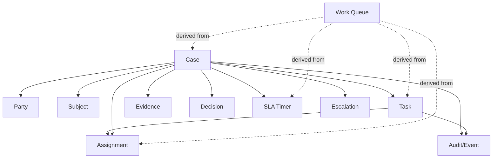
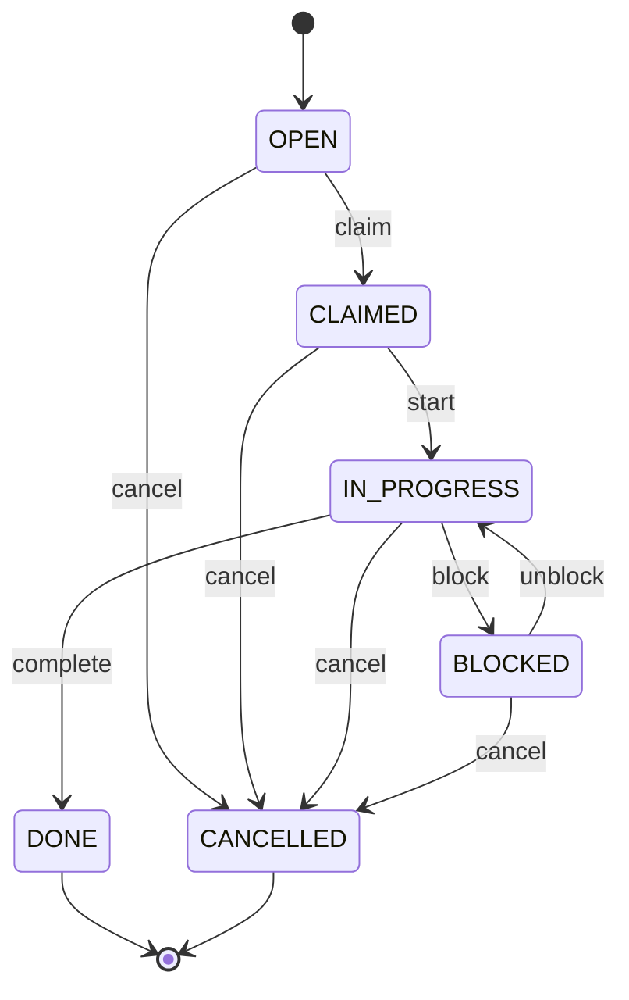
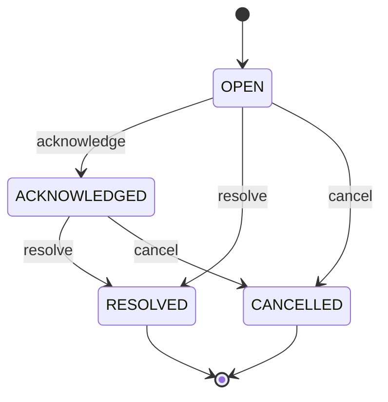
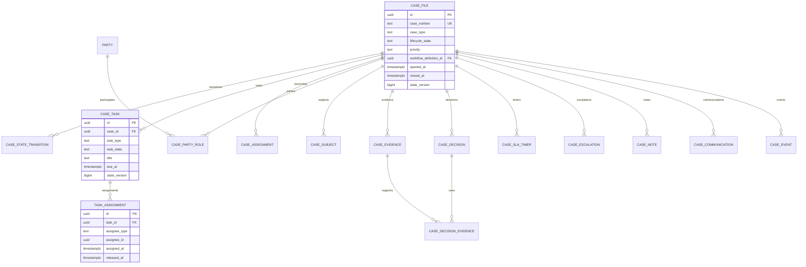

# Part 018 — Modelling Workflows and Case Management

> Goal: setelah bagian ini, kamu bisa mendesain database untuk sistem workflow dan case management yang production-grade: case, task, assignment, queue, SLA, escalation, decision, evidence, comment, audit, notification, handoff, dan reporting — tanpa jatuh ke schema spaghetti atau workflow-engine leakage.

Workflow/case-management system terlihat seperti CRUD.

Padahal bukan.

Ia adalah sistem yang mengelola:

- long-running process,
- manusia dan role,
- state transition,
- decision dan evidence,
- deadline dan SLA,
- escalation,
- assignment,
- auditability,
- exception handling,
- rework,
- handoff antar tim,
- reporting dan accountability.

Kalau schema-nya dirancang seperti CRUD sederhana, sistem akan cepat berubah menjadi:

- `case.status` yang membengkak,
- `task.type` yang ambigu,
- assignment yang tidak bisa diaudit,
- SLA yang tidak bisa dihitung ulang,
- decision yang tidak bisa dipertanggungjawabkan,
- workflow change yang mematahkan kasus lama,
- report yang tidak cocok dengan operational truth.

Bagian ini membangun mental model dan schema pattern untuk menghindari itu.

---

## 1. Core Mental Model

Case management bukan hanya “record with status”.

Ia adalah **coordination system**.

Core elements:

| Element | Meaning |
|---|---|
| Case | Unit of work/business concern yang harus diselesaikan |
| Party | Orang/organisasi yang terkait dengan case |
| Subject | Object utama yang diperiksa/diproses |
| Task | Work item yang harus dikerjakan manusia/sistem |
| Assignment | Siapa bertanggung jawab atas case/task pada periode tertentu |
| State | Lifecycle case/task |
| Transition | Perubahan state dengan actor, reason, evidence |
| SLA | Time obligation dan timer rules |
| Escalation | Perubahan handling karena risk/overdue/severity |
| Decision | Formal outcome yang harus bisa dijelaskan |
| Evidence | Dokumen/fakta pendukung |
| Comment/Note | Human communication/context |
| Event/Audit | Jejak perubahan dan accountability |
| Queue | View operasional untuk kerja harian |

Diagram konseptual:



The most important principle:

> Model the business lifecycle, not the screen flow.

UI can change monthly. Business lifecycle should remain coherent for years.

---

## 2. Case as Aggregate Root, But Not a God Table

A case is usually the main lifecycle owner.

Bad design:

```sql
create table case_file (
  id uuid primary key,
  status text not null,
  applicant_name text,
  applicant_email text,
  reviewer_id uuid,
  supervisor_id uuid,
  document_1_url text,
  document_2_url text,
  document_3_url text,
  decision text,
  decision_reason text,
  sla_due_at timestamptz,
  escalation_status text,
  comment_1 text,
  comment_2 text,
  comment_3 text,
  created_at timestamptz not null
);
```

This table mixes:

- identity,
- party data,
- assignment,
- evidence,
- decision,
- SLA,
- escalation,
- comment,
- workflow state.

It will not age well.

Better baseline:

```sql
create table case_file (
  id uuid primary key,
  case_number text not null unique,
  case_type text not null,
  lifecycle_state text not null,
  priority text not null,
  severity text,
  opened_at timestamptz not null,
  closed_at timestamptz,
  current_owner_team_id uuid,
  state_version bigint not null default 0,
  created_at timestamptz not null default now(),
  updated_at timestamptz not null default now(),
  constraint case_file_lifecycle_chk check (
    lifecycle_state in (
      'DRAFT',
      'SUBMITTED',
      'TRIAGE',
      'UNDER_REVIEW',
      'WAITING',
      'DECIDED',
      'CLOSED',
      'CANCELLED'
    )
  ),
  constraint case_file_priority_chk check (
    priority in ('LOW', 'NORMAL', 'HIGH', 'CRITICAL')
  )
);
```

Keep case table focused on:

- identity,
- lifecycle summary,
- routing summary,
- operational summary,
- timestamps needed for common query.

Move everything else to child tables with clear ownership.

---

## 3. Case Type and Workflow Version

A serious case-management system often has multiple case types.

Example:

- complaint,
- enforcement investigation,
- license application,
- inspection finding,
- appeal,
- incident,
- exception request.

Each may have different workflow.

Do not hardcode everything into one enum if process differs materially.

```sql
create table case_type (
  code text primary key,
  label text not null,
  description text,
  is_active boolean not null default true
);

create table workflow_definition (
  id uuid primary key,
  workflow_code text not null,
  case_type text not null references case_type(code),
  version int not null,
  status text not null check (status in ('DRAFT', 'ACTIVE', 'RETIRED')),
  effective_from timestamptz not null,
  effective_to timestamptz,
  constraint workflow_definition_uk unique (workflow_code, version)
);

alter table case_file
add column workflow_definition_id uuid not null references workflow_definition(id);
```

Why case must store `workflow_definition_id`:

- old cases must remain explainable,
- transition rules may change,
- SLA rules may change,
- required evidence may change,
- decision policy may change.

Do not let today’s workflow rewrite history.

---

## 4. Case Participants: Party, Role, and Relationship

Case usually involves multiple people/organizations.

Bad design:

```sql
applicant_id uuid,
respondent_id uuid,
representative_id uuid,
witness_id uuid
```

This breaks when:

- multiple respondents exist,
- representative changes,
- party has multiple roles,
- historical role period matters,
- party is organization, not person,
- party identity is shared across cases.

Better:

```sql
create table party (
  id uuid primary key,
  party_type text not null check (party_type in ('PERSON', 'ORGANIZATION')),
  display_name text not null,
  external_ref text,
  created_at timestamptz not null default now()
);

create table case_party_role (
  id uuid primary key,
  case_id uuid not null references case_file(id),
  party_id uuid not null references party(id),
  role_code text not null,
  effective_from timestamptz not null,
  effective_to timestamptz,
  created_at timestamptz not null default now(),
  constraint case_party_role_period_chk check (
    effective_to is null or effective_to > effective_from
  )
);
```

Role examples:

```text
APPLICANT
COMPLAINANT
RESPONDENT
SUBJECT
REPRESENTATIVE
WITNESS
INSPECTOR
REVIEWER
DECISION_MAKER
```

Use relationship-as-entity because case participation has its own lifecycle.

A representative may be active only during certain period.

A respondent can be removed or corrected.

A party can have more than one role.

---

## 5. Subject of Case

Sometimes party is not the subject.

Example subjects:

- facility,
- license,
- transaction,
- product,
- inspection report,
- account,
- document,
- property,
- regulated activity.

Do not hide subject inside generic JSON if it drives workflow.

```sql
create table case_subject (
  id uuid primary key,
  case_id uuid not null references case_file(id),
  subject_type text not null,
  subject_ref text not null,
  relationship_code text not null,
  is_primary boolean not null default false,
  created_at timestamptz not null default now(),
  constraint case_subject_uk unique (case_id, subject_type, subject_ref, relationship_code)
);
```

Examples:

```text
subject_type = LICENSE, subject_ref = LIC-123, relationship = TARGET_LICENSE
subject_type = FACILITY, subject_ref = FAC-456, relationship = INSPECTED_FACILITY
subject_type = TRANSACTION, subject_ref = TX-789, relationship = SUSPICIOUS_TRANSACTION
```

This supports generic cross-domain references while retaining queryable structure.

---

## 6. Task Model

Task is a unit of work.

Do not confuse task with case state.

A case can be `UNDER_REVIEW` while having multiple tasks:

- review evidence,
- request document,
- verify address,
- draft decision,
- supervisor approval.

Task baseline:

```sql
create table case_task (
  id uuid primary key,
  case_id uuid not null references case_file(id),
  task_type text not null,
  task_state text not null,
  title text not null,
  description text,
  priority text not null,
  due_at timestamptz,
  created_by uuid,
  created_at timestamptz not null default now(),
  started_at timestamptz,
  completed_at timestamptz,
  cancelled_at timestamptz,
  state_version bigint not null default 0,
  constraint case_task_state_chk check (
    task_state in ('OPEN', 'CLAIMED', 'IN_PROGRESS', 'BLOCKED', 'DONE', 'CANCELLED')
  ),
  constraint case_task_priority_chk check (
    priority in ('LOW', 'NORMAL', 'HIGH', 'CRITICAL')
  )
);
```

Task state machine:



Task is not always human work.

It can be:

- manual task,
- system task,
- review task,
- approval task,
- evidence request,
- external wait task,
- remediation task.

But if system task is purely technical retry job, maybe it belongs in job table, not case task.

---

## 7. Task Definition vs Task Instance

If task types are configurable, split definition and instance.

```sql
create table task_definition (
  id uuid primary key,
  workflow_definition_id uuid not null references workflow_definition(id),
  task_type text not null,
  label text not null,
  default_priority text not null,
  default_due_duration interval,
  is_required boolean not null default true,
  sort_order int not null,
  constraint task_definition_uk unique (workflow_definition_id, task_type)
);

alter table case_task
add column task_definition_id uuid references task_definition(id);
```

Task definition says what task means in the workflow.

Task instance says one actual task exists for one actual case.

Do not put instance state in definition.

Do not put workflow design metadata in every instance unless snapshotting is required.

For defensibility, store snapshot fields if labels/rules can change:

```sql
alter table case_task
add column task_definition_version int,
add column task_label_snapshot text;
```

---

## 8. Assignment Model

Assignment is not just `assignee_id`.

It has history.

Bad:

```sql
alter table case_task add column assignee_id uuid;
```

This loses:

- who assigned,
- when,
- why,
- previous assignee,
- team assignment,
- reassignment history,
- workload analytics,
- accountability.

Better:

```sql
create table task_assignment (
  id uuid primary key,
  task_id uuid not null references case_task(id),
  assignee_type text not null check (assignee_type in ('USER', 'TEAM', 'ROLE')),
  assignee_id uuid not null,
  assignment_role text not null,
  assigned_by uuid,
  assigned_at timestamptz not null default now(),
  released_at timestamptz,
  release_reason text,
  is_primary boolean not null default true,
  constraint task_assignment_period_chk check (
    released_at is null or released_at > assigned_at
  )
);
```

Query current assignment:

```sql
select *
from task_assignment
where task_id = :task_id
  and released_at is null;
```

Index:

```sql
create index task_assignment_current_user_idx
on task_assignment (assignee_id, assigned_at desc)
where released_at is null and assignee_type = 'USER';

create index task_assignment_current_task_idx
on task_assignment (task_id)
where released_at is null;
```

You may also keep current assignment summary on `case_task` for fast queue queries:

```sql
alter table case_task
add column current_assignee_type text,
add column current_assignee_id uuid;
```

But if you do, enforce/update it atomically with `task_assignment`.

---

## 9. Case Assignment vs Task Assignment

Case ownership and task assignment are different.

Case owner:

```text
Team/person accountable for overall case progress.
```

Task assignee:

```text
Person/team responsible for a specific work item.
```

Schema:

```sql
create table case_assignment (
  id uuid primary key,
  case_id uuid not null references case_file(id),
  assignee_type text not null check (assignee_type in ('USER', 'TEAM', 'ROLE')),
  assignee_id uuid not null,
  responsibility_code text not null,
  assigned_by uuid,
  assigned_at timestamptz not null default now(),
  released_at timestamptz,
  release_reason text
);
```

Responsibility examples:

```text
CASE_OWNER
SUPERVISOR
PRIMARY_REVIEWER
SECONDARY_REVIEWER
LEGAL_ADVISOR
```

Keep both if system needs both accountability levels.

Do not overload task assignment to represent case ownership.

---

## 10. Work Queue Design

Queue is usually a read model.

A queue answers:

> What should this user/team work on now?

Queue depends on:

- task state,
- assignment,
- case priority,
- due date,
- SLA state,
- escalation,
- permissions,
- team membership,
- workload balancing,
- case type,
- region/jurisdiction.

Bad queue query:

```sql
select *
from case_task t
join case_file c on c.id = t.case_id
left join task_assignment a on a.task_id = t.id
where t.task_state in ('OPEN', 'CLAIMED', 'IN_PROGRESS')
  and (... 30 dynamic conditions ...)
order by c.priority, t.due_at;
```

This may be okay at small scale. At large scale, design queue read model.

```sql
create table work_queue_item (
  id uuid primary key,
  task_id uuid not null unique references case_task(id),
  case_id uuid not null references case_file(id),
  queue_code text not null,
  visible_to_type text not null check (visible_to_type in ('USER', 'TEAM', 'ROLE')),
  visible_to_id uuid not null,
  priority_rank int not null,
  due_at timestamptz,
  case_type text not null,
  case_priority text not null,
  task_state text not null,
  assignment_state text not null,
  sla_state text,
  escalation_level int not null default 0,
  available_at timestamptz not null default now(),
  removed_at timestamptz,
  created_at timestamptz not null default now(),
  updated_at timestamptz not null default now()
);
```

Index:

```sql
create index work_queue_visible_idx
on work_queue_item (
  visible_to_type,
  visible_to_id,
  queue_code,
  priority_rank,
  due_at
)
where removed_at is null;
```

Queue item is derived data.

Invariant:

```text
Queue item must reflect task/case/assignment eligibility within declared freshness contract.
```

For strict queue correctness, update queue inside same transaction as task/assignment changes.

For high-scale queue, use async projection with reconciliation.

---

## 11. Claiming Work Safely

Claiming a task is a concurrency problem.

Bad:

```sql
select id from case_task
where task_state = 'OPEN'
limit 1;

update case_task
set task_state = 'CLAIMED', assignee_id = :user_id
where id = :task_id;
```

Two users can claim same task.

Better optimistic claim:

```sql
update case_task
set task_state = 'CLAIMED',
    state_version = state_version + 1,
    started_at = coalesce(started_at, now())
where id = :task_id
  and task_state = 'OPEN';
```

If affected row = 1, claim succeeds.

If 0, someone else claimed/cancelled/completed it.

Then insert assignment in same transaction:

```sql
insert into task_assignment (
  id,
  task_id,
  assignee_type,
  assignee_id,
  assignment_role,
  assigned_by,
  assigned_at
)
values (
  :assignment_id,
  :task_id,
  'USER',
  :user_id,
  'OWNER',
  :user_id,
  now()
);
```

For auto-claim from queue, use `FOR UPDATE SKIP LOCKED` carefully:

```sql
with candidate as (
  select t.id
  from case_task t
  where t.task_state = 'OPEN'
  order by t.due_at nulls last, t.created_at
  limit 1
  for update skip locked
)
update case_task t
set task_state = 'CLAIMED',
    state_version = state_version + 1
from candidate c
where t.id = c.id
returning t.*;
```

This is useful for worker pools, but human work queues often need fairness and visibility rules beyond raw locking.

---

## 12. SLA Model

SLA is not just `due_at`.

SLA has:

- start event,
- due rule,
- pause rule,
- resume rule,
- breach rule,
- calendar rule,
- priority override,
- escalation rule,
- measurement target.

Baseline:

```sql
create table case_sla_timer (
  id uuid primary key,
  case_id uuid not null references case_file(id),
  task_id uuid references case_task(id),
  timer_type text not null,
  timer_state text not null,
  started_at timestamptz not null,
  due_at timestamptz not null,
  paused_at timestamptz,
  total_paused_seconds bigint not null default 0,
  breached_at timestamptz,
  completed_at timestamptz,
  policy_version text not null,
  constraint case_sla_timer_state_chk check (
    timer_state in ('RUNNING', 'PAUSED', 'BREACHED', 'COMPLETED', 'CANCELLED')
  )
);
```

SLA event history:

```sql
create table case_sla_event (
  id uuid primary key,
  sla_timer_id uuid not null references case_sla_timer(id),
  event_type text not null,
  from_state text,
  to_state text,
  occurred_at timestamptz not null,
  actor_id uuid,
  reason_code text,
  metadata jsonb not null default '{}'::jsonb
);
```

Important distinction:

```text
due_at = current operational deadline
policy_version = rule used to compute it
sla_event = explanation of changes
```

If due date changes, do not silently overwrite without history.

---

## 13. Business Calendar

SLA often depends on business hours.

Example:

```text
Respond within 5 business days excluding holidays in jurisdiction X.
```

Do not implement this with random application date math without storing policy context.

Schema:

```sql
create table business_calendar (
  code text primary key,
  timezone text not null,
  description text
);

create table business_calendar_holiday (
  id uuid primary key,
  calendar_code text not null references business_calendar(code),
  holiday_date date not null,
  label text not null,
  constraint business_calendar_holiday_uk unique (calendar_code, holiday_date)
);

create table sla_policy (
  id uuid primary key,
  policy_code text not null,
  version int not null,
  calendar_code text not null references business_calendar(code),
  duration_seconds bigint not null,
  duration_type text not null check (duration_type in ('CALENDAR_TIME', 'BUSINESS_TIME')),
  effective_from timestamptz not null,
  effective_to timestamptz,
  constraint sla_policy_uk unique (policy_code, version)
);
```

At timer creation, store policy version.

If holiday calendar changes later, historical due dates must remain explainable.

---

## 14. Escalation Model

Escalation is not only a boolean.

It is a process.

Escalation may be triggered by:

- SLA breach,
- severity,
- risk score,
- manual supervisor action,
- repeated reassignment,
- legal/regulatory flag,
- external complaint,
- VIP/high-profile marker.

Schema:

```sql
create table case_escalation (
  id uuid primary key,
  case_id uuid not null references case_file(id),
  escalation_level int not null,
  escalation_state text not null,
  reason_code text not null,
  reason_text text,
  triggered_by text not null,
  triggered_at timestamptz not null,
  acknowledged_by uuid,
  acknowledged_at timestamptz,
  resolved_by uuid,
  resolved_at timestamptz,
  constraint case_escalation_state_chk check (
    escalation_state in ('OPEN', 'ACKNOWLEDGED', 'RESOLVED', 'CANCELLED')
  )
);
```

Keep summary on case if needed:

```sql
alter table case_file
add column current_escalation_level int not null default 0;
```

But escalation history remains authoritative.

Escalation state machine:



---

## 15. Decision Model

A decision is not just `case.status = APPROVED`.

A decision should capture:

- decision type,
- outcome,
- decision maker,
- decision time,
- reason,
- evidence considered,
- policy version,
- approval level,
- conditions,
- appeal rights,
- correction/revocation.

Schema:

```sql
create table case_decision (
  id uuid primary key,
  case_id uuid not null references case_file(id),
  decision_type text not null,
  outcome text not null,
  decision_state text not null,
  decided_by uuid not null,
  decided_at timestamptz not null,
  reason_code text,
  reason_text text,
  policy_version text,
  effective_from timestamptz,
  effective_to timestamptz,
  created_at timestamptz not null default now(),
  constraint case_decision_state_chk check (
    decision_state in ('DRAFT', 'PROPOSED', 'APPROVED', 'ISSUED', 'REVOKED', 'SUPERSEDED')
  )
);
```

Decision evidence link:

```sql
create table case_decision_evidence (
  decision_id uuid not null references case_decision(id),
  evidence_id uuid not null references case_evidence(id),
  relevance_code text not null,
  primary key (decision_id, evidence_id)
);
```

Decision condition:

```sql
create table case_decision_condition (
  id uuid primary key,
  decision_id uuid not null references case_decision(id),
  condition_type text not null,
  condition_text text not null,
  due_at timestamptz,
  condition_state text not null check (
    condition_state in ('OPEN', 'SATISFIED', 'WAIVED', 'BREACHED')
  )
);
```

This supports outcomes like:

```text
Approved with conditions
Rejected with appeal option
Warning issued
Penalty imposed
License suspended until condition satisfied
```

---

## 16. Evidence Model

Evidence is a first-class concept in many workflows.

Do not bury important evidence in attachments-only table.

```sql
create table case_evidence (
  id uuid primary key,
  case_id uuid not null references case_file(id),
  evidence_type text not null,
  evidence_state text not null,
  title text not null,
  description text,
  source_type text not null,
  source_ref text,
  storage_uri text,
  content_hash text,
  submitted_by uuid,
  submitted_at timestamptz not null,
  received_at timestamptz,
  verified_by uuid,
  verified_at timestamptz,
  constraint case_evidence_state_chk check (
    evidence_state in ('RECEIVED', 'UNDER_VERIFICATION', 'VERIFIED', 'REJECTED', 'SUPERSEDED')
  )
);
```

Evidence source examples:

```text
USER_UPLOAD
SYSTEM_IMPORT
INSPECTION_RESULT
EXTERNAL_AGENCY
EMAIL
MANUAL_ENTRY
```

If evidence can be superseded:

```sql
alter table case_evidence
add column supersedes_evidence_id uuid references case_evidence(id);
```

For chain-of-custody style systems:

```sql
create table evidence_custody_event (
  id uuid primary key,
  evidence_id uuid not null references case_evidence(id),
  event_type text not null,
  actor_id uuid not null,
  occurred_at timestamptz not null,
  location_ref text,
  notes text,
  content_hash text
);
```

---

## 17. Notes, Comments, and Internal Communication

Notes are often underestimated.

Separate types:

- internal note,
- external communication,
- system note,
- decision rationale,
- audit event,
- user comment.

Do not mix them all into one text log without classification.

```sql
create table case_note (
  id uuid primary key,
  case_id uuid not null references case_file(id),
  note_type text not null,
  visibility text not null,
  body text not null,
  created_by uuid not null,
  created_at timestamptz not null default now(),
  edited_at timestamptz,
  deleted_at timestamptz,
  constraint case_note_visibility_chk check (
    visibility in ('INTERNAL', 'EXTERNAL', 'RESTRICTED')
  )
);
```

If notes are audit-relevant, do not allow silent edit.

Use versioning:

```sql
create table case_note_version (
  id uuid primary key,
  note_id uuid not null references case_note(id),
  version_no int not null,
  body text not null,
  edited_by uuid not null,
  edited_at timestamptz not null,
  edit_reason text,
  constraint case_note_version_uk unique (note_id, version_no)
);
```

---

## 18. Communication Model

Case systems often send/receive communication:

- email,
- letter,
- portal message,
- SMS,
- phone call record,
- meeting note.

Model communication separately from notes.

```sql
create table case_communication (
  id uuid primary key,
  case_id uuid not null references case_file(id),
  channel text not null,
  direction text not null check (direction in ('INBOUND', 'OUTBOUND')),
  communication_state text not null,
  subject text,
  body_ref text,
  sent_at timestamptz,
  received_at timestamptz,
  external_message_id text,
  created_at timestamptz not null default now(),
  constraint case_communication_channel_chk check (
    channel in ('EMAIL', 'LETTER', 'PORTAL', 'SMS', 'PHONE', 'MEETING')
  )
);
```

Link participants:

```sql
create table case_communication_party (
  communication_id uuid not null references case_communication(id),
  party_id uuid not null references party(id),
  role_code text not null,
  primary key (communication_id, party_id, role_code)
);
```

This is useful for traceability:

> Which communication informed the decision?

Link communication to evidence or decision if needed.

---

## 19. Case Event Log

Even with transition tables, it is useful to have a broader case event log.

```sql
create table case_event (
  id uuid primary key,
  case_id uuid not null references case_file(id),
  event_type text not null,
  event_time timestamptz not null,
  actor_id uuid,
  source text not null,
  correlation_id uuid,
  causation_id uuid,
  payload jsonb not null default '{}'::jsonb,
  created_at timestamptz not null default now()
);
```

Event examples:

```text
CASE_CREATED
CASE_SUBMITTED
CASE_ASSIGNED
TASK_CREATED
TASK_COMPLETED
EVIDENCE_RECEIVED
EVIDENCE_VERIFIED
SLA_BREACHED
CASE_ESCALATED
DECISION_ISSUED
COMMUNICATION_SENT
CASE_CLOSED
```

This event log can support:

- timeline UI,
- audit review,
- analytics,
- debugging,
- replay to projections,
- integration outbox source.

But be clear:

Is `case_event` the source of truth or a log projection?

If source of truth, every state must derive from it.

If log projection, current tables remain authoritative.

Do not pretend it is both without clear invariants.

---

## 20. Timeline View

Users often need a timeline.

Do not build timeline by making every table look the same.

Use union/projection:

```sql
create view case_timeline as
select
  id,
  case_id,
  'STATE_TRANSITION' as item_type,
  transition_code as title,
  occurred_at as item_time,
  actor_id,
  jsonb_build_object(
    'fromState', from_state,
    'toState', to_state,
    'reasonCode', reason_code
  ) as details
from case_state_transition

union all

select
  id,
  case_id,
  'TASK_CREATED' as item_type,
  task_type as title,
  created_at as item_time,
  created_by as actor_id,
  jsonb_build_object('taskState', task_state) as details
from case_task

union all

select
  id,
  case_id,
  'EVIDENCE' as item_type,
  evidence_type as title,
  submitted_at as item_time,
  submitted_by as actor_id,
  jsonb_build_object('evidenceState', evidence_state) as details
from case_evidence;
```

For high volume, use materialized/projection table.

```sql
create table case_timeline_item (
  id uuid primary key,
  case_id uuid not null,
  item_type text not null,
  item_time timestamptz not null,
  title text not null,
  actor_id uuid,
  source_table text not null,
  source_id uuid not null,
  details jsonb not null default '{}'::jsonb,
  constraint case_timeline_source_uk unique (source_table, source_id)
);
```

Timeline is usually a read model, not the canonical write model.

---

## 21. Parent/Child Cases

Some workflows create related cases.

Examples:

- complaint creates investigation,
- investigation creates enforcement action,
- decision creates appeal,
- incident creates remediation cases,
- bulk inspection creates many findings.

Schema:

```sql
create table case_relation (
  id uuid primary key,
  from_case_id uuid not null references case_file(id),
  to_case_id uuid not null references case_file(id),
  relation_type text not null,
  created_at timestamptz not null default now(),
  created_by uuid,
  constraint case_relation_no_self_chk check (from_case_id <> to_case_id),
  constraint case_relation_uk unique (from_case_id, to_case_id, relation_type)
);
```

Relation types:

```text
CREATED_FROM
APPEAL_OF
REMEDIATION_FOR
DUPLICATE_OF
RELATED_TO
SPLIT_FROM
MERGED_INTO
```

Do not force all relationships into parent-child if semantics differ.

A duplicate relationship is not parent-child.

An appeal has stronger semantics.

A related case may be weak association.

---

## 22. Duplicate, Merge, and Split

Real case systems need duplicate management.

### 22.1 Duplicate Marking

```sql
create table case_duplicate_candidate (
  id uuid primary key,
  case_id uuid not null references case_file(id),
  duplicate_of_case_id uuid not null references case_file(id),
  confidence_score numeric(5,4),
  detection_source text not null,
  review_state text not null check (review_state in ('PENDING', 'CONFIRMED', 'REJECTED')),
  created_at timestamptz not null default now(),
  reviewed_by uuid,
  reviewed_at timestamptz
);
```

### 22.2 Merge

Merging cases is not a simple delete.

Create merge record:

```sql
create table case_merge (
  id uuid primary key,
  survivor_case_id uuid not null references case_file(id),
  merged_case_id uuid not null references case_file(id),
  merged_by uuid not null,
  merged_at timestamptz not null,
  merge_reason text not null,
  constraint case_merge_no_self_chk check (survivor_case_id <> merged_case_id)
);
```

Then transition merged case:

```text
ACTIVE -> MERGED
```

And preserve references.

### 22.3 Split

Splitting is harder.

Record origin:

```sql
create table case_split (
  id uuid primary key,
  source_case_id uuid not null references case_file(id),
  new_case_id uuid not null references case_file(id),
  split_by uuid not null,
  split_at timestamptz not null,
  split_reason text not null
);
```

Do not silently move evidence/tasks without link history.

---

## 23. Waiting States and External Dependencies

A lot of workflows wait.

They wait for:

- applicant response,
- external agency,
- payment,
- document verification,
- background job,
- supervisor availability,
- legal opinion.

Do not model every wait as separate lifecycle state if wait reason varies.

Use waiting reason table:

```sql
create table case_wait_period (
  id uuid primary key,
  case_id uuid not null references case_file(id),
  wait_reason text not null,
  wait_state text not null check (wait_state in ('OPEN', 'RESOLVED', 'CANCELLED')),
  started_at timestamptz not null,
  expected_until timestamptz,
  resolved_at timestamptz,
  resolved_by uuid,
  notes text
);
```

Case lifecycle may be `WAITING`, while wait period explains why.

Multiple wait periods may exist, but usually only one active primary wait reason should exist:

```sql
create unique index case_wait_one_open_primary_idx
on case_wait_period (case_id)
where wait_state = 'OPEN';
```

Only use this if business rule truly allows one active wait period.

---

## 24. Rework and Revision Loops

Many workflows are not linear.

Example:

```text
Submit -> Review -> Request More Info -> Resubmit -> Review -> Decision
```

Do not model loops only by overwriting fields.

Capture cycles.

```sql
create table case_review_cycle (
  id uuid primary key,
  case_id uuid not null references case_file(id),
  cycle_no int not null,
  cycle_state text not null check (cycle_state in ('OPEN', 'COMPLETED', 'CANCELLED')),
  started_at timestamptz not null,
  completed_at timestamptz,
  outcome text,
  constraint case_review_cycle_uk unique (case_id, cycle_no)
);
```

Tasks/evidence/decisions can reference cycle:

```sql
alter table case_task add column review_cycle_id uuid references case_review_cycle(id);
alter table case_evidence add column review_cycle_id uuid references case_review_cycle(id);
```

This helps explain:

> Which evidence was submitted for which review attempt?

---

## 25. Approvals

Approval is often multi-step.

Do not store only:

```sql
approved_by uuid,
approved_at timestamptz
```

Use approval request and approval action.

```sql
create table case_approval_request (
  id uuid primary key,
  case_id uuid not null references case_file(id),
  approval_type text not null,
  approval_state text not null check (
    approval_state in ('REQUESTED', 'APPROVED', 'REJECTED', 'CANCELLED')
  ),
  requested_by uuid not null,
  requested_at timestamptz not null,
  completed_at timestamptz,
  policy_version text
);

create table case_approval_action (
  id uuid primary key,
  approval_request_id uuid not null references case_approval_request(id),
  approver_id uuid not null,
  action text not null check (action in ('APPROVE', 'REJECT', 'ABSTAIN')),
  acted_at timestamptz not null,
  reason_text text,
  constraint case_approval_action_uk unique (approval_request_id, approver_id)
);
```

This supports:

- one approver,
- multi-approver,
- quorum,
- supervisor override,
- rejection reason,
- approval audit.

---

## 26. Dynamic Forms and Attributes

Case systems often need custom fields.

Do not rush into EAV for everything.

Options:

| Option | Use When |
|---|---|
| Normal columns | Stable, queryable, invariant-bearing data |
| Child tables | Repeating structured data |
| JSONB | flexible metadata, sparse fields, low invariant requirement |
| EAV | admin-defined fields with heavy metadata/governance |
| External form engine | complex dynamic form lifecycle |

Bad EAV:

```sql
case_attribute(case_id, name, value)
```

This loses type, constraint, meaning, index, and governance.

If EAV is needed, make it governed:

```sql
create table case_field_definition (
  id uuid primary key,
  case_type text not null references case_type(code),
  field_code text not null,
  label text not null,
  data_type text not null check (data_type in ('TEXT', 'NUMBER', 'DATE', 'BOOLEAN', 'ENUM')),
  is_required boolean not null default false,
  is_queryable boolean not null default false,
  validation_rule jsonb not null default '{}'::jsonb,
  constraint case_field_definition_uk unique (case_type, field_code)
);

create table case_field_value (
  case_id uuid not null references case_file(id),
  field_definition_id uuid not null references case_field_definition(id),
  value_text text,
  value_number numeric,
  value_date date,
  value_boolean boolean,
  value_json jsonb,
  updated_at timestamptz not null default now(),
  primary key (case_id, field_definition_id)
);
```

Still, use normal columns for core workflow-driving data.

---

## 27. Workflow Engine Integration

If using workflow engine, separate these concepts:

| Concept | Owner |
|---|---|
| Business case lifecycle | application/domain database |
| Technical process execution | workflow engine |
| Human task queue | may be engine or application, but define clearly |
| Audit/regulatory timeline | domain database, not only engine history |
| External integration state | domain/saga/outbox tables |

Do not let engine tables become the business database.

Bad dependency:

```text
case status = value from workflow engine internal runtime table
```

Better:

```sql
alter table case_file
add column workflow_instance_id text,
add column workflow_definition_id uuid;
```

Then synchronize via explicit events:

```text
WorkflowTaskCompleted -> transition domain task
DomainCaseApproved -> signal workflow engine
```

Reason:

- workflow engine schema can change,
- engine history may be optimized for execution not reporting,
- business users need domain terms,
- regulatory audit needs stable evidence.

---

## 28. Reporting Model

Operational tables are not always report tables.

Case management reporting needs:

- cases opened/closed per period,
- average time in state,
- SLA breach rate,
- workload per team,
- reassignment count,
- decision outcome distribution,
- evidence request cycles,
- backlog aging,
- escalation trend.

Some can be computed from events.

Example time-in-state:

```sql
with transitions as (
  select
    case_id,
    to_state as state,
    occurred_at as entered_at,
    lead(occurred_at) over (
      partition by case_id
      order by state_version
    ) as exited_at
  from case_state_transition
)
select
  state,
  avg(coalesce(exited_at, now()) - entered_at) as avg_duration
from transitions
group by state;
```

For high volume, build aggregate tables:

```sql
create table case_daily_metric (
  metric_date date not null,
  case_type text not null,
  team_id uuid,
  opened_count int not null default 0,
  closed_count int not null default 0,
  breached_count int not null default 0,
  escalated_count int not null default 0,
  primary key (metric_date, case_type, team_id)
);
```

Do not let dashboard queries destroy OLTP performance.

---

## 29. Search Model

Case search often includes:

- case number,
- party name,
- subject ref,
- task assignee,
- evidence metadata,
- decision outcome,
- full-text notes,
- date ranges.

Do not force everything into one OLTP query if search is broad.

Options:

1. relational search for structured fields,
2. full-text index for text,
3. dedicated search projection,
4. external search engine.

A relational search projection:

```sql
create table case_search_document (
  case_id uuid primary key references case_file(id),
  case_number text not null,
  case_type text not null,
  lifecycle_state text not null,
  party_names text,
  subject_refs text,
  decision_outcome text,
  current_assignee_ids uuid[],
  search_text text,
  updated_at timestamptz not null
);
```

This is derived.

It needs freshness contract and rebuild path.

---

## 30. Security and Visibility

Case systems often have sensitive data.

Visibility may depend on:

- tenant,
- team,
- role,
- jurisdiction,
- case assignment,
- data classification,
- conflict of interest,
- external vs internal user,
- sealed/restricted case flag.

Do not rely only on UI filters.

Data model should include access-relevant facts:

```sql
create table case_access_grant (
  id uuid primary key,
  case_id uuid not null references case_file(id),
  grantee_type text not null check (grantee_type in ('USER', 'TEAM', 'ROLE', 'PARTY')),
  grantee_id uuid not null,
  access_level text not null check (access_level in ('READ', 'WRITE', 'ADMIN')),
  granted_by uuid,
  granted_at timestamptz not null default now(),
  revoked_at timestamptz,
  reason text
);
```

For restricted notes/evidence:

```sql
alter table case_note add column classification text not null default 'NORMAL';
alter table case_evidence add column classification text not null default 'NORMAL';
```

Access must be enforced consistently at API/query boundary.

Database row-level security may help, but it must be designed intentionally.

---

## 31. Retention and Closure

Case closure is not data deletion.

Closure means operational work completed.

Retention says how long data remains.

Add closure facts:

```sql
alter table case_file
add column closure_reason text,
add column retention_class text,
add column retain_until date,
add column legal_hold boolean not null default false;
```

But retention may deserve separate table:

```sql
create table case_retention_policy_assignment (
  id uuid primary key,
  case_id uuid not null references case_file(id),
  retention_policy_code text not null,
  assigned_at timestamptz not null,
  retain_until date not null,
  legal_hold boolean not null default false,
  assigned_by uuid
);
```

Why separate?

- policy can change,
- legal hold can be added/released,
- retention decision may need audit,
- some child records may have different retention.

---

## 32. End-to-End Schema Slice

A practical baseline ERD:



This is not a mandatory template.

It is a starting point for serious case systems.

Remove parts that are not needed.

Add parts only when you can explain their lifecycle and invariants.

---

## 33. Write Path Example: Submit Case

Command:

```text
SubmitCase(case_id, actor_id, command_id)
```

Transaction:

1. lock case,
2. verify current state is `DRAFT`,
3. verify required fields/evidence exist,
4. update case lifecycle to `SUBMITTED`,
5. insert state transition,
6. create initial triage task,
7. create SLA timer,
8. insert case event,
9. insert outbox event,
10. commit.

Pseudo-SQL:

```sql
begin;

select *
from case_file
where id = :case_id
for update;

-- guard checks omitted for brevity

update case_file
set lifecycle_state = 'SUBMITTED',
    state_version = state_version + 1,
    updated_at = now()
where id = :case_id;

insert into case_state_transition (...)
values (... 'DRAFT', 'SUBMITTED', 'SUBMIT_CASE', ...);

insert into case_task (...)
values (..., :case_id, 'TRIAGE', 'OPEN', 'Triage submitted case', ...);

insert into case_sla_timer (...)
values (..., :case_id, null, 'TRIAGE_RESPONSE', 'RUNNING', now(), :due_at, :policy_version);

insert into case_event (...)
values (..., :case_id, 'CASE_SUBMITTED', now(), :actor_id, ...);

insert into outbox_event (...)
values (..., 'CASE', :case_id, 'CaseSubmitted', :payload, ...);

commit;
```

The important part:

> Business transition, task creation, SLA creation, audit event, and outbox are one consistency decision.

---

## 34. Write Path Example: Complete Task

Command:

```text
CompleteTask(task_id, actor_id, outcome, command_id)
```

Transaction:

1. lock task,
2. verify task is active,
3. verify actor is current assignee or authorized supervisor,
4. update task state to `DONE`,
5. release assignment,
6. insert task transition/history,
7. update case counters/read model,
8. maybe transition case if all required tasks complete,
9. insert events/outbox,
10. commit.

Critical guard:

```sql
select *
from task_assignment
where task_id = :task_id
  and released_at is null
  and assignee_type = 'USER'
  and assignee_id = :actor_id;
```

Do not allow task completion by arbitrary user unless policy says so.

---

## 35. Avoiding Workflow Spaghetti

Workflow spaghetti symptoms:

- every feature adds nullable columns to `case_file`,
- every exception adds status value,
- assignment overwritten without history,
- tasks duplicated because there is no idempotency,
- SLA recalculated inconsistently,
- reports query operational tables with huge joins,
- old cases break when workflow changes,
- no one can explain why a case was closed,
- admin scripts update status directly.

Countermeasures:

- state machine per lifecycle dimension,
- transition history,
- task as separate entity,
- assignment as historical entity,
- SLA timer as stateful entity,
- decision as first-class record,
- evidence linkage,
- workflow definition version,
- queue as read model,
- command idempotency,
- reconciliation queries,
- architecture review checklist.

---

## 36. Review Checklist

### Case Model

- What is the case boundary?
- What does one case represent?
- What is the case type taxonomy?
- Can case type change after creation?
- Does each case store workflow version?
- What are terminal states?
- Can case be reopened?

### Task Model

- Are tasks separate from case states?
- Which tasks are human vs system?
- Are task definitions versioned?
- Are task lifecycle states explicit?
- Can tasks be cancelled, reassigned, blocked, reopened?
- Is task completion idempotent?

### Assignment

- Is assignment history preserved?
- Is case ownership separate from task assignment?
- Can teams, roles, and users be assignees?
- How is current assignment queried?
- What prevents double claim?

### SLA and Escalation

- What starts the SLA timer?
- What pauses/resumes it?
- Which calendar applies?
- Is policy version stored?
- How is breach detected?
- Is escalation a process or a flag?

### Decision and Evidence

- Are decisions first-class records?
- Can decision evidence be traced?
- Are reasons structured?
- Are corrections/revocations modelled?
- Is decision policy version stored?

### Audit and Reporting

- Is there a timeline?
- Which table is authoritative for audit?
- Can current state be reconstructed?
- Can time-in-state be calculated?
- Are dashboards isolated from OLTP load?

### Security

- What facts determine visibility?
- Is access history audited?
- Are restricted notes/evidence classified?
- Can external users see only appropriate records?

### Operations

- Are queue queries indexed?
- Are reconciliation jobs defined?
- Are direct status updates blocked?
- Are workflow migrations safe for old cases?
- Are stuck cases detectable?

---

## 37. Common Failure Modes

| Failure Mode | Symptom | Fix |
|---|---|---|
| God case table | hundreds of nullable columns | split child entities by lifecycle |
| Status soup | status encodes SLA/task/wait/priority | separate dimensions |
| Assignment overwrite | no accountability | assignment history table |
| Task/case confusion | case state changes for every small work item | model task explicitly |
| SLA as due date only | cannot explain pause/breach | SLA timer + event history |
| Decision as status | no evidence/reason/policy | decision entity |
| Engine leakage | domain depends on workflow engine internals | domain state + explicit integration |
| Queue query overload | slow operational dashboard | queue projection/read model |
| Dynamic field abuse | everything in EAV/JSON | promote core fields to schema |
| Old workflow rewrite | old cases become inexplicable | workflow version per case |
| Direct admin patch | audit broken | maintenance commands with transition history |

---

## 38. Practical Heuristic

When modelling a case-management workflow, ask in this order:

1. What is the case?
2. What lifecycle does the case follow?
3. What work items exist inside the case?
4. Who can own/perform each work item?
5. What deadlines exist?
6. What pauses deadlines?
7. What causes escalation?
8. What decisions can be made?
9. What evidence supports those decisions?
10. What must be visible in audit/timeline?
11. What must be queryable in daily operations?
12. What must be reportable historically?
13. What can change in the workflow later?
14. What must remain explainable after change?

If a design cannot answer these, it is not ready for production.

---

## 39. Key Takeaways

- Workflow/case-management is coordination modelling, not CRUD modelling.
- Case should be focused; do not turn it into a god table.
- Task, assignment, SLA, escalation, decision, evidence, note, communication, and event history deserve separate models when they have independent lifecycle.
- Queue is usually a read model derived from task/case/assignment/SLA state.
- Assignment must preserve history for accountability.
- SLA must store policy version and state transitions, not just due date.
- Decision must be linked to reason, actor, evidence, and policy.
- Workflow engine state and domain case state must not be blindly conflated.
- Old cases must remain explainable after workflow rules change.
- The best case-management schema optimizes for correctness, accountability, operability, and long-term change.

---

## References

- PostgreSQL Documentation — Constraints: https://www.postgresql.org/docs/current/ddl-constraints.html
- PostgreSQL Documentation — Indexes: https://www.postgresql.org/docs/current/indexes.html
- PostgreSQL Documentation — Partial Indexes: https://www.postgresql.org/docs/current/indexes-partial.html
- PostgreSQL Documentation — Explicit Locking: https://www.postgresql.org/docs/current/explicit-locking.html
- PostgreSQL Documentation — Transaction Isolation: https://www.postgresql.org/docs/current/transaction-iso.html
- AWS Prescriptive Guidance — Saga pattern: https://docs.aws.amazon.com/prescriptive-guidance/latest/cloud-design-patterns/saga.html
- AWS Well-Architected Framework — Reliability and operational excellence principles: https://docs.aws.amazon.com/wellarchitected/latest/framework/welcome.html
- Camunda Documentation — BPMN concepts and process execution reference: https://docs.camunda.org/manual/latest/
