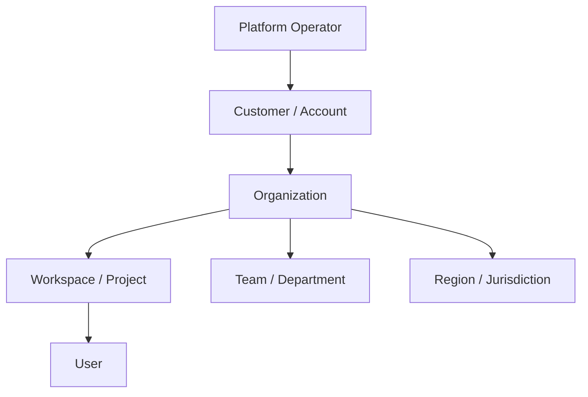
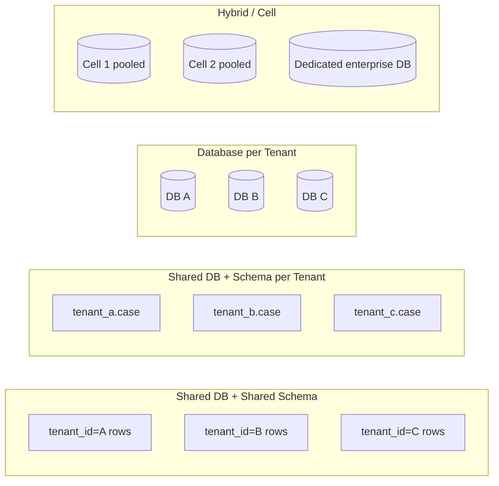
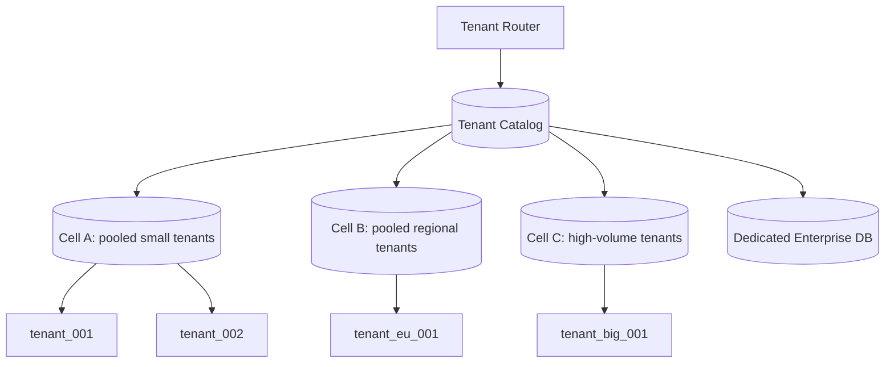
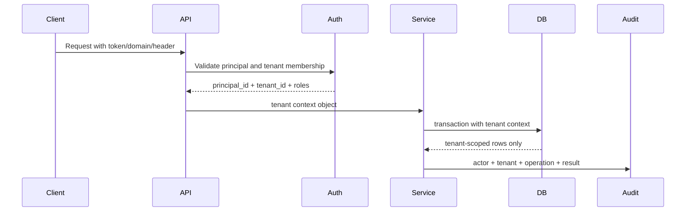
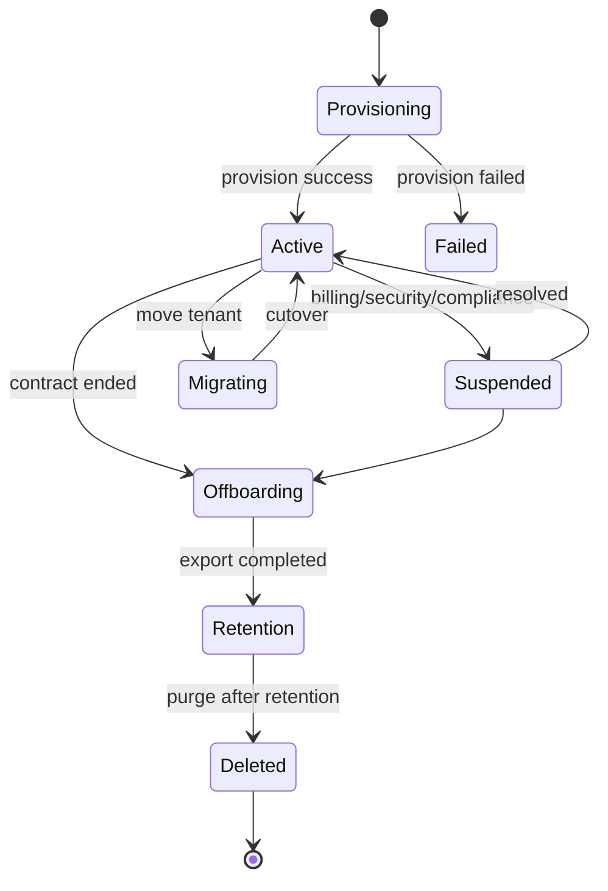
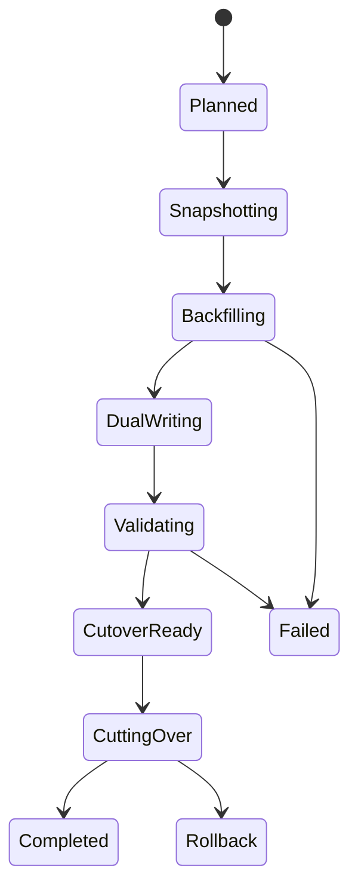

# Part 019 — Multi-Tenant Database Design

> Goal: setelah bagian ini, kamu bisa mendesain database multi-tenant bukan hanya dengan menambahkan kolom `tenant_id`, tetapi dengan memahami isolation model, lifecycle tenant, schema boundary, query safety, migration, backup/restore, noisy-neighbor control, observability, dan tradeoff antara pooled, siloed, schema-per-tenant, database-per-tenant, dan hybrid/cell-based architecture.

Multi-tenancy sering disederhanakan menjadi:

```sql
ALTER TABLE something ADD COLUMN tenant_id uuid NOT NULL;
```

Itu bukan multi-tenant architecture.

Itu baru **satu field**.

Multi-tenancy adalah desain agar banyak tenant bisa berbagi sistem dengan aman, efisien, dan dapat dioperasikan tanpa bocor data, tanpa tenant besar merusak tenant lain, tanpa migration menjadi mimpi buruk, dan tanpa membuat restore satu tenant mengganggu seluruh platform.

Database architect harus bertanya:

- tenant itu apa dalam domain ini?
- apakah tenant adalah customer, organization, workspace, legal entity, regulator, region, atau business unit?
- apa yang harus benar-benar terisolasi?
- apa yang boleh dibagi?
- apakah tenant bisa pindah plan?
- apakah tenant bisa di-merge/split?
- apakah tenant bisa punya konfigurasi schema/custom field?
- bagaimana restore satu tenant dilakukan?
- bagaimana audit membuktikan tidak ada cross-tenant access?
- bagaimana query/reporting bekerja tanpa bocor?
- bagaimana mengontrol tenant yang workload-nya ekstrem?

Kalau jawabanmu hanya “pakai `tenant_id`”, desainmu belum siap produksi.

---

## 1. Core Mental Model

Multi-tenant database design adalah desain **shared system with explicit isolation contracts**.

Ada tiga gaya berpikir:

| Level | Pertanyaan | Contoh |
|---|---|---|
| Business tenancy | Siapa tenant-nya? | Customer, organization, agency, merchant, school |
| Data tenancy | Data mana milik tenant mana? | case, invoice, document, user membership |
| Operational tenancy | Resource mana dipakai bersama atau dipisah? | database, schema, table, index, queue, backup, replica |
| Security tenancy | Siapa boleh melihat apa? | tenant admin, support engineer, regulator, system worker |
| Lifecycle tenancy | Apa yang terjadi saat tenant onboard/offboard/migrate? | provisioning, plan upgrade, export, retention, deletion |

Prinsip utama:

> Tenant boundary harus menjadi invariant, bukan convention.

Artinya, sistem tidak boleh bergantung hanya pada developer selalu ingat menulis:

```sql
WHERE tenant_id = :tenant_id
```

Developer akan lupa. Query ad-hoc akan salah. Background job akan bocor. Report akan join ke table tanpa filter. Migration script akan update tenant lain. Admin tool akan menjadi celah.

Multi-tenant design yang matang membuat kesalahan itu:

- sulit dilakukan,
- mudah terdeteksi,
- terbatas blast radius-nya,
- dan bisa diaudit.

---

## 2. Tenant Is Not Always Customer

Istilah tenant sering ambigu.

Jangan langsung menganggap tenant = customer.

Dalam sistem nyata, ada banyak level:



Contoh:

| Domain | Candidate tenant | Problem |
|---|---|---|
| B2B SaaS | Customer account | Satu customer punya banyak organization |
| Collaboration tool | Workspace | User bisa berada di banyak workspace |
| Regulatory platform | Agency/jurisdiction | Case bisa melibatkan beberapa legal entities |
| Marketplace | Merchant | Buyer/seller relationship bisa cross-tenant |
| Healthcare | Provider organization | Patient data bisa melibatkan multiple providers |
| Enterprise platform | Business unit | Legal ownership belum tentu sama dengan org chart |

Tenant harus dipilih berdasarkan **isolation boundary**, bukan UI grouping.

Pertanyaan desain:

1. Data mana yang tidak boleh terlihat oleh pihak lain?
2. Billing dihitung di level mana?
3. Backup/restore diminta di level mana?
4. Admin tenant mengelola siapa?
5. Custom configuration berlaku di level mana?
6. Compliance/legal boundary berlaku di level mana?
7. Region/data residency berlaku di level mana?
8. Apakah data boleh cross-tenant?

Jika jawaban pertanyaan itu berbeda-beda, kamu mungkin punya lebih dari satu boundary:

- `tenant_id` untuk commercial/account boundary,
- `organization_id` untuk working boundary,
- `region_id` untuk residency boundary,
- `legal_entity_id` untuk regulatory boundary,
- `workspace_id` untuk collaboration boundary.

Jangan memaksa semuanya menjadi satu kolom.

---

## 3. Isolation Dimensions

Multi-tenancy bukan hanya data isolation.

Minimal ada delapan isolation dimension.

| Dimension | Meaning | Failure if ignored |
|---|---|---|
| Data isolation | Tenant tidak melihat data tenant lain | Data breach |
| Compute isolation | Tenant berat tidak mengganggu tenant lain | Noisy neighbor |
| Performance isolation | SLA tenant tidak saling menjatuhkan | Latency spike |
| Operational isolation | Migration/backup/restore bisa scoped | Global downtime |
| Security isolation | Policy dan credential scoped | Privilege leakage |
| Compliance isolation | Residency/retention/legal hold scoped | Regulatory violation |
| Observability isolation | Metrics/log bisa dilihat per tenant | Tidak bisa troubleshoot tenant-specific issue |
| Cost isolation | Resource usage bisa diatribusikan | Tidak bisa chargeback/pricing |

Database topology harus dipilih berdasarkan isolation dimension yang paling penting.

Contoh:

- Startup B2B SaaS kecil: cost efficiency lebih penting → pooled model.
- Enterprise compliance-heavy: data isolation dan backup-per-tenant lebih penting → silo atau hybrid.
- Platform dengan tenant kecil banyak dan beberapa tenant besar: hybrid/cell model.
- Regulated regional platform: region/cell boundary lebih penting dari tenant boundary.

---

## 4. The Four Main Multi-Tenant Database Models

Ada empat model umum:

1. shared database, shared schema, shared tables,
2. shared database, separate schema per tenant,
3. separate database per tenant,
4. hybrid/cell-based model.



Tidak ada model yang selalu terbaik.

Architect yang baik memilih berdasarkan constraint.

---

## 5. Model 1 — Shared Database, Shared Schema, Shared Tables

Ini model paling umum untuk SaaS skala awal-menengah.

Semua tenant berbagi table yang sama.

```sql
CREATE TABLE case_record (
    tenant_id uuid NOT NULL,
    case_id uuid NOT NULL,
    case_number text NOT NULL,
    title text NOT NULL,
    status text NOT NULL,
    created_at timestamptz NOT NULL DEFAULT now(),
    updated_at timestamptz NOT NULL DEFAULT now(),
    PRIMARY KEY (tenant_id, case_id),
    UNIQUE (tenant_id, case_number)
);
```

### Keuntungan

| Benefit | Explanation |
|---|---|
| Cost efficient | Semua tenant berbagi database, connection pool, index, backup |
| Operationally simple at first | Satu schema, satu migration path |
| Easy aggregate analytics | Cross-tenant platform analytics mudah dilakukan |
| Fast onboarding | Tenant baru hanya insert metadata |
| Good for many small tenants | Cocok untuk long tail tenant kecil |

### Kekurangan

| Risk | Explanation |
|---|---|
| Data leakage risk tinggi | Query tanpa tenant filter bisa bocor |
| Noisy neighbor | Tenant besar bisa mempengaruhi table/index/cache |
| Restore per tenant sulit | Backup fisik biasanya database-level, bukan tenant-level |
| Migration blast radius besar | DDL menyentuh semua tenant |
| Index bloat global | Index untuk tenant besar mempengaruhi tenant kecil |
| Compliance limitation | Dedicated isolation/data residency lebih sulit |

### Kapan cocok

Cocok jika:

- jumlah tenant banyak,
- tenant relatif kecil/menengah,
- cost efficiency penting,
- compliance tidak menuntut dedicated storage,
- restore per tenant bisa dilakukan logical/export-based,
- operational maturity cukup untuk guardrail.

Tidak cocok jika:

- tenant enterprise menuntut dedicated database,
- tenant workload sangat berbeda,
- data residency kuat,
- restore single tenant sering diminta,
- customer menuntut encryption key dedicated,
- blast radius harus sangat kecil.

---

## 6. Model 2 — Shared Database, Schema per Tenant

Setiap tenant punya schema sendiri.

```sql
CREATE SCHEMA tenant_acme;
CREATE SCHEMA tenant_globex;

CREATE TABLE tenant_acme.case_record (...);
CREATE TABLE tenant_globex.case_record (...);
```

### Keuntungan

| Benefit | Explanation |
|---|---|
| Better logical separation | Object database terpisah per tenant |
| Easier tenant export | Data tenant lebih mudah dump per schema |
| Customization possible | Schema tenant tertentu bisa berbeda, meskipun ini berbahaya |
| Reduced accidental query leak | Query harus menunjuk schema tertentu |

### Kekurangan

| Risk | Explanation |
|---|---|
| Migration complexity | Setiap schema harus dimigrasikan |
| Object explosion | Ribuan tenant = ribuan schema/tables/indexes |
| Connection/search_path risk | Salah `search_path` bisa fatal |
| Cross-tenant analytics sulit | Harus union banyak schema |
| Schema drift | Tenant bisa tertinggal versi |

### Kapan cocok

Cocok jika:

- jumlah tenant tidak terlalu besar,
- tiap tenant butuh sedikit variasi,
- restore/export per tenant penting,
- tim punya migration automation kuat,
- database engine nyaman dengan banyak schema/object.

Tidak cocok jika:

- jumlah tenant ribuan sampai ratusan ribu,
- migration harus sangat cepat,
- analytics lintas tenant dominan,
- schema customization tidak terkendali.

---

## 7. Model 3 — Database per Tenant

Setiap tenant punya database sendiri.

```text
tenant_acme_db
tenant_globex_db
tenant_initech_db
```

### Keuntungan

| Benefit | Explanation |
|---|---|
| Strong isolation | Data, backup, restore, credential bisa dedicated |
| Easier compliance story | Dedicated storage lebih mudah dijelaskan ke auditor/customer |
| Tenant-specific scaling | Tenant besar bisa diberi instance/resource sendiri |
| Backup/restore tenant mudah | Restore database tenant tanpa menyentuh tenant lain |
| Blast radius kecil | Failure satu DB tidak selalu menjatuhkan tenant lain |

### Kekurangan

| Risk | Explanation |
|---|---|
| Cost tinggi | Banyak DB/instance/connection/backup |
| Operational overhead | Provisioning, monitoring, patching, migration per tenant |
| Fleet management | Harus tahu tenant berada di DB mana |
| Cross-tenant analytics sulit | Data harus dikumpulkan ke warehouse/lake |
| Version drift | Database tenant bisa beda versi schema |

### Kapan cocok

Cocok jika:

- tenant bernilai tinggi,
- enterprise contract menuntut isolation,
- tenant workload besar/unik,
- restore per tenant critical,
- compliance/data residency kuat,
- kamu punya platform automation untuk DB fleet.

Tidak cocok jika:

- tenant sangat banyak dan kecil,
- margin rendah,
- tim operasi kecil,
- migration automation belum matang.

---

## 8. Model 4 — Hybrid / Cell-Based Multi-Tenancy

Hybrid model menggabungkan beberapa strategi.

Contoh:

- tenant kecil masuk pooled database,
- tenant medium masuk pooled cell tertentu,
- tenant enterprise masuk dedicated DB,
- tenant regional masuk region-specific cell,
- tenant high-risk/compliance masuk isolated environment.



### Core idea

Jangan memaksa semua tenant punya isolation/cost model yang sama.

Hybrid memberi kemampuan:

- mulai murah,
- scale tenant besar,
- memenuhi enterprise contract,
- mengurangi blast radius,
- memindahkan tenant tanpa rewrite aplikasi besar.

### Cost

Hybrid membutuhkan komponen tambahan:

- tenant catalog,
- tenant routing,
- provisioning workflow,
- migration orchestration,
- per-cell monitoring,
- tenant movement tooling,
- schema version tracking.

Hybrid adalah pilihan bagus jika platform sudah cukup matang.

---

## 9. Tenant Catalog

Dalam sistem multi-tenant serius, tenant catalog adalah source of truth untuk tenancy topology.

Contoh:

```sql
CREATE TABLE tenant (
    tenant_id uuid PRIMARY KEY,
    tenant_key text NOT NULL UNIQUE,
    display_name text NOT NULL,
    status text NOT NULL CHECK (status IN (
        'provisioning',
        'active',
        'suspended',
        'offboarding',
        'deleted'
    )),
    plan_code text NOT NULL,
    region_code text NOT NULL,
    created_at timestamptz NOT NULL DEFAULT now(),
    activated_at timestamptz,
    suspended_at timestamptz,
    deleted_at timestamptz,
    CHECK (activated_at IS NULL OR activated_at >= created_at)
);

CREATE TABLE tenant_database_location (
    tenant_id uuid NOT NULL REFERENCES tenant(tenant_id),
    location_id uuid NOT NULL,
    role text NOT NULL CHECK (role IN ('primary', 'archive', 'analytics')),
    db_kind text NOT NULL CHECK (db_kind IN ('pooled', 'schema', 'dedicated')),
    region_code text NOT NULL,
    database_name text NOT NULL,
    schema_name text,
    connection_pool_key text NOT NULL,
    active_from timestamptz NOT NULL DEFAULT now(),
    active_until timestamptz,
    PRIMARY KEY (tenant_id, role, active_from),
    CHECK (active_until IS NULL OR active_until > active_from)
);
```

Tenant catalog menjawab:

- tenant aktif atau suspend?
- tenant berada di database mana?
- region tenant apa?
- plan tenant apa?
- tenant sedang migration atau tidak?
- tenant menggunakan topology apa?
- connection pool mana yang harus dipakai?

Jangan hardcode tenant → database mapping di config aplikasi.

Tenant topology berubah seiring platform tumbuh.

---

## 10. Tenant Context Propagation

Tenant context harus mengalir dari entry point ke database.



Tenant context bukan string bebas.

Ia harus typed object:

```text
TenantContext
- tenant_id
- principal_id
- organization_id? optional
- roles/permissions
- auth_time
- request_id
- source_ip
- support_session_id? optional
- reason? optional for privileged access
```

Anti-pattern:

```java
String tenantId = request.getHeader("X-Tenant-Id");
```

Masalah:

- header bisa spoofed,
- tenant membership tidak diverifikasi,
- service internal bisa salah set,
- background job tidak punya context jelas,
- audit tidak tahu actor/context.

Better:

1. Resolve tenant dari trusted auth/session/domain.
2. Verify membership/permission.
3. Build immutable tenant context.
4. Attach ke transaction/session.
5. Enforce di query/RLS/DAO.
6. Emit audit.

---

## 11. Shared-Schema Design Rule

Dalam pooled model, rule paling penting:

> Setiap tenant-owned row harus membawa tenant boundary secara eksplisit.

Contoh table tenant-owned:

```sql
CREATE TABLE project (
    tenant_id uuid NOT NULL,
    project_id uuid NOT NULL,
    project_code text NOT NULL,
    name text NOT NULL,
    status text NOT NULL,
    created_at timestamptz NOT NULL DEFAULT now(),
    PRIMARY KEY (tenant_id, project_id),
    UNIQUE (tenant_id, project_code)
);

CREATE TABLE case_record (
    tenant_id uuid NOT NULL,
    case_id uuid NOT NULL,
    project_id uuid NOT NULL,
    case_number text NOT NULL,
    title text NOT NULL,
    status text NOT NULL,
    created_at timestamptz NOT NULL DEFAULT now(),
    PRIMARY KEY (tenant_id, case_id),
    UNIQUE (tenant_id, case_number),
    FOREIGN KEY (tenant_id, project_id)
        REFERENCES project(tenant_id, project_id)
);
```

Perhatikan foreign key:

```sql
FOREIGN KEY (tenant_id, project_id)
    REFERENCES project(tenant_id, project_id)
```

Ini lebih aman daripada:

```sql
FOREIGN KEY (project_id)
    REFERENCES project(project_id)
```

Karena versi kedua memungkinkan row tenant A mereferensikan project tenant B jika `project_id` global atau salah join.

Untuk pooled multi-tenant schema, biasakan:

- primary key include tenant scope jika entity tenant-owned,
- unique constraint include tenant scope,
- foreign key include tenant scope,
- index include tenant scope untuk tenant-scoped query,
- query selalu anchored by tenant scope.

---

## 12. Global ID vs Tenant-Scoped ID

Ada dua pilihan utama:

### Option A — Tenant-scoped primary key

```sql
PRIMARY KEY (tenant_id, case_id)
```

Keuntungan:

- referential integrity otomatis menjaga tenant boundary,
- natural untuk partitioning by tenant,
- unique rules jelas per tenant,
- query tenant-scoped mudah.

Kekurangan:

- foreign key lebih verbose,
- ORM kadang tidak nyaman dengan composite key,
- API perlu expose `case_id` + tenant context.

### Option B — Global primary key plus tenant_id

```sql
CREATE TABLE case_record (
    case_id uuid PRIMARY KEY,
    tenant_id uuid NOT NULL,
    case_number text NOT NULL,
    UNIQUE (tenant_id, case_number)
);
```

Keuntungan:

- ORM/API lebih sederhana,
- entity reference cukup satu id,
- public URL lebih sederhana.

Kekurangan:

- FK tenant boundary tidak otomatis kecuali dibuat composite unique,
- salah join lebih mudah,
- query harus tetap filter tenant,
- data leak via direct id lookup lebih mungkin.

Safer hybrid:

```sql
CREATE TABLE case_record (
    case_id uuid PRIMARY KEY,
    tenant_id uuid NOT NULL,
    case_number text NOT NULL,
    UNIQUE (tenant_id, case_id),
    UNIQUE (tenant_id, case_number)
);

CREATE TABLE case_task (
    task_id uuid PRIMARY KEY,
    tenant_id uuid NOT NULL,
    case_id uuid NOT NULL,
    title text NOT NULL,
    FOREIGN KEY (tenant_id, case_id)
        REFERENCES case_record(tenant_id, case_id)
);
```

Dengan pola ini:

- API tetap bisa memakai `case_id`,
- database tetap bisa menjaga tenant-scoped FK,
- constraint tetap menutup cross-tenant reference.

---

## 13. Tenant-Scoped Unique Constraint

Hampir semua uniqueness dalam SaaS adalah tenant-scoped.

Salah:

```sql
CREATE UNIQUE INDEX uq_user_email ON app_user(email);
```

Ini membuat email yang sama tidak bisa dipakai di tenant berbeda.

Benar untuk B2B SaaS tertentu:

```sql
CREATE UNIQUE INDEX uq_user_email_per_tenant
ON app_user(tenant_id, lower(email));
```

Tetapi hati-hati.

Ada domain di mana email adalah global principal, bukan tenant-owned user.

Model yang lebih akurat:

```sql
CREATE TABLE principal (
    principal_id uuid PRIMARY KEY,
    email citext NOT NULL UNIQUE,
    created_at timestamptz NOT NULL DEFAULT now()
);

CREATE TABLE tenant_membership (
    tenant_id uuid NOT NULL,
    principal_id uuid NOT NULL,
    role_code text NOT NULL,
    status text NOT NULL,
    created_at timestamptz NOT NULL DEFAULT now(),
    PRIMARY KEY (tenant_id, principal_id),
    FOREIGN KEY (principal_id) REFERENCES principal(principal_id)
);
```

Mental model:

- `principal` = global identity,
- `tenant_membership` = tenant-specific authority,
- tenant-owned data references `tenant_id`, not only `principal_id`.

---

## 14. Shared Tables vs Platform Tables

Tidak semua table tenant-owned.

Klasifikasi table:

| Table kind | Has tenant_id? | Example |
|---|---:|---|
| Platform-global | No | feature catalog, region catalog, public taxonomy |
| Tenant metadata | Yes / primary | tenant, tenant_plan, tenant_location |
| Tenant-owned | Yes mandatory | case, project, invoice, workflow item |
| Cross-tenant relationship | Usually two scopes | marketplace transaction, inter-agency referral |
| Derived/projection | Yes if source is tenant-owned | search_index, aggregate table |
| Audit | Yes if action is tenant-scoped | audit_event |
| Support/admin | Often tenant_id + actor context | support_access_session |

Jangan menambahkan `tenant_id` ke table yang secara konsep global jika itu membuat data model salah.

Contoh:

```sql
CREATE TABLE country_code (
    country_code text PRIMARY KEY,
    country_name text NOT NULL
);
```

Tidak perlu `tenant_id`, kecuali tenant boleh punya custom taxonomy.

Kalau tenant boleh customize taxonomy, pisahkan base dan override:

```sql
CREATE TABLE risk_category (
    category_code text PRIMARY KEY,
    default_label text NOT NULL
);

CREATE TABLE tenant_risk_category_label (
    tenant_id uuid NOT NULL,
    category_code text NOT NULL REFERENCES risk_category(category_code),
    custom_label text NOT NULL,
    PRIMARY KEY (tenant_id, category_code)
);
```

---

## 15. Query Discipline

Dalam pooled model, query harus anchored by tenant.

Good:

```sql
SELECT c.case_id, c.case_number, c.title
FROM case_record c
WHERE c.tenant_id = :tenant_id
  AND c.status = 'open'
ORDER BY c.created_at DESC
LIMIT 50;
```

Bad:

```sql
SELECT c.case_id, c.case_number, c.title
FROM case_record c
WHERE c.status = 'open'
ORDER BY c.created_at DESC
LIMIT 50;
```

Bad query bukan hanya security bug.

Ia juga performance bug karena database tidak bisa menggunakan tenant-scoped access path.

Untuk join:

Good:

```sql
SELECT c.case_number, t.title
FROM case_record c
JOIN case_task t
  ON t.tenant_id = c.tenant_id
 AND t.case_id = c.case_id
WHERE c.tenant_id = :tenant_id
  AND t.status = 'pending';
```

Bad:

```sql
SELECT c.case_number, t.title
FROM case_record c
JOIN case_task t
  ON t.case_id = c.case_id
WHERE c.tenant_id = :tenant_id;
```

Kalau `case_id` globally unique, hasil mungkin tetap benar.

Tetapi join pattern ini melemahkan invariant karena developer terbiasa mengabaikan tenant boundary.

---

## 16. Index Design for Pooled Multi-Tenancy

Index harus mengikuti query shape.

Untuk query tenant-scoped list:

```sql
CREATE INDEX idx_case_tenant_status_created
ON case_record(tenant_id, status, created_at DESC);
```

Untuk lookup by tenant case number:

```sql
CREATE UNIQUE INDEX uq_case_tenant_case_number
ON case_record(tenant_id, case_number);
```

Untuk task queue:

```sql
CREATE INDEX idx_task_tenant_queue_due
ON case_task(tenant_id, queue_code, due_at)
WHERE status = 'pending';
```

Rule of thumb:

- equality tenant filter first,
- then common equality filters,
- then range/order column,
- use partial index for hot operational subsets,
- do not create global index unless query is truly global/platform-level.

### Noisy index problem

Dalam pooled table, tenant besar mendominasi index pages.

Tenant kecil ikut membayar cost:

- larger index,
- poorer cache locality,
- vacuum overhead,
- slower statistics estimation,
- more page splits.

Mitigation:

- partition by tenant group/hash/range,
- isolate large tenant to dedicated cell,
- use partial indexes for active subset,
- archive cold data,
- separate hot/cold table,
- move reporting workload out of OLTP.

---

## 17. Partitioning in Multi-Tenant Design

Partitioning bukan otomatis sharding.

Dalam satu database, partitioning bisa membantu:

- pruning tenant group,
- purging old data,
- reducing index size per partition,
- isolating hot/cold data,
- improving maintenance operations.

Contoh hash partition by tenant:

```sql
CREATE TABLE case_record (
    tenant_id uuid NOT NULL,
    case_id uuid NOT NULL,
    status text NOT NULL,
    created_at timestamptz NOT NULL,
    PRIMARY KEY (tenant_id, case_id)
) PARTITION BY HASH (tenant_id);

CREATE TABLE case_record_p0 PARTITION OF case_record
FOR VALUES WITH (MODULUS 16, REMAINDER 0);

CREATE TABLE case_record_p1 PARTITION OF case_record
FOR VALUES WITH (MODULUS 16, REMAINDER 1);
```

Hash partition helps when:

- many tenants,
- tenant-scoped queries,
- relatively even distribution,
- maintenance benefits matter.

Range partition by time helps when:

- retention/purge is time-based,
- reports query by time window,
- old data becomes cold,
- legal hold/purge policies align with time.

Sometimes you need composite strategy:

- partition by region/cell,
- then tenant hash,
- or partition by time for large append-only data.

Do not partition because it feels advanced.

Partition when it solves a concrete operation/performance problem.

---

## 18. Row-Level Security as Guardrail

In PostgreSQL, Row-Level Security can enforce per-row access policies in the database.

Example:

```sql
ALTER TABLE case_record ENABLE ROW LEVEL SECURITY;

CREATE POLICY tenant_case_isolation
ON case_record
USING (tenant_id = current_setting('app.tenant_id')::uuid)
WITH CHECK (tenant_id = current_setting('app.tenant_id')::uuid);
```

Application transaction:

```sql
BEGIN;
SET LOCAL app.tenant_id = '4c3c5a90-1111-4444-9999-9c2a7e000001';

SELECT *
FROM case_record
WHERE status = 'open';

COMMIT;
```

The query forgot `tenant_id`, but RLS constrains visible rows.

### Why RLS helps

RLS can protect against:

- forgotten tenant filter,
- generic admin query,
- accidental cross-tenant update,
- report query bug,
- malicious low-level query through app role.

### Why RLS is not enough

RLS does not remove the need for:

- correct schema constraints,
- correct tenant context propagation,
- service-level authorization,
- audit,
- test coverage,
- privileged access controls,
- safe migration scripts.

RLS is a guardrail, not the entire highway.

### Important RLS rule

Set tenant context transaction-locally, not globally.

Good:

```sql
SET LOCAL app.tenant_id = '...';
```

Risky:

```sql
SET app.tenant_id = '...';
```

With connection pooling, session-level settings can leak across requests if not reset correctly.

---

## 19. Database Roles for Multi-Tenant Applications

Avoid using superuser-style application account.

A safer structure:

| Role | Purpose |
|---|---|
| `app_runtime` | normal application reads/writes under RLS |
| `app_migration` | schema changes, no runtime traffic |
| `app_readonly` | restricted operational read access |
| `app_support` | support workflows, audited, controlled |
| `app_analytics_export` | export to analytics, limited surfaces |
| `break_glass_admin` | emergency use only, monitored |

Principle:

> Different operational capabilities need different database identities.

If the same credential can:

- read all tenants,
- migrate schema,
- delete data,
- bypass RLS,
- and run ad-hoc queries,

then one credential leak becomes platform-wide breach.

---

## 20. Tenant Lifecycle

Tenant lifecycle is a first-class database concern.



Each state needs database behavior:

| State | Database behavior |
|---|---|
| Provisioning | create tenant metadata, seed config, allocate location |
| Active | normal reads/writes |
| Suspended | block writes or all access depending reason |
| Migrating | dual-write/read-routing/cutover safety |
| Offboarding | export, disable new writes, preserve audit |
| Retention | restricted read, purge schedule |
| Deleted | no operational access; maybe audit tombstone remains |

Tenant status should be checked before write path.

Example:

```sql
CREATE TABLE tenant_status_history (
    tenant_id uuid NOT NULL REFERENCES tenant(tenant_id),
    status text NOT NULL,
    reason_code text NOT NULL,
    changed_by uuid,
    changed_at timestamptz NOT NULL DEFAULT now(),
    PRIMARY KEY (tenant_id, changed_at)
);
```

Do not only store current tenant status if audit/compliance matters.

---

## 21. Tenant Provisioning

Tenant provisioning is not just `INSERT INTO tenant`.

Provisioning steps may include:

1. create tenant record,
2. allocate region/cell/database/schema,
3. seed default roles,
4. seed default workflow configuration,
5. create root admin membership,
6. create storage bucket/prefix,
7. initialize encryption context/key mapping,
8. initialize quotas,
9. enable feature flags,
10. emit audit event,
11. run smoke validation,
12. mark tenant active.

Store provisioning state.

```sql
CREATE TABLE tenant_provisioning_job (
    job_id uuid PRIMARY KEY,
    tenant_id uuid NOT NULL REFERENCES tenant(tenant_id),
    status text NOT NULL CHECK (status IN ('pending', 'running', 'succeeded', 'failed', 'compensating')),
    requested_by uuid,
    requested_at timestamptz NOT NULL DEFAULT now(),
    completed_at timestamptz,
    error_code text,
    error_message text
);

CREATE TABLE tenant_provisioning_step (
    job_id uuid NOT NULL REFERENCES tenant_provisioning_job(job_id),
    step_code text NOT NULL,
    status text NOT NULL CHECK (status IN ('pending', 'running', 'succeeded', 'failed', 'skipped')),
    started_at timestamptz,
    completed_at timestamptz,
    retry_count integer NOT NULL DEFAULT 0,
    PRIMARY KEY (job_id, step_code)
);
```

Provisioning must be idempotent.

If step 5 fails, retry should not duplicate step 1–4.

---

## 22. Tenant Offboarding and Deletion

Offboarding is security-critical.

Typical sequence:

1. mark tenant as offboarding,
2. block new user login or new writes,
3. generate export if contract requires,
4. revoke integrations/API keys,
5. stop background jobs,
6. remove from search/cache/projections,
7. apply retention/legal hold,
8. purge after retention period,
9. keep minimal tombstone/audit record.

Schema support:

```sql
CREATE TABLE tenant_offboarding_job (
    job_id uuid PRIMARY KEY,
    tenant_id uuid NOT NULL REFERENCES tenant(tenant_id),
    requested_by uuid,
    reason_code text NOT NULL,
    export_required boolean NOT NULL DEFAULT false,
    purge_after timestamptz,
    status text NOT NULL CHECK (status IN ('pending', 'exporting', 'retaining', 'purging', 'completed', 'failed')),
    created_at timestamptz NOT NULL DEFAULT now(),
    completed_at timestamptz
);
```

Never delete tenant data with an unscoped statement:

```sql
DELETE FROM case_record;
```

Safer:

```sql
DELETE FROM case_record
WHERE tenant_id = :tenant_id
  AND created_at < :cutoff;
```

Even better for large tenants:

- move tenant to dedicated partition,
- detach/drop partition,
- or perform chunked deletion with audit checkpoints.

---

## 23. Backup and Restore Per Tenant

Backup design depends on tenancy model.

| Model | Full restore | Single tenant restore |
|---|---|---|
| Shared schema | Easy DB-level, hard tenant-level | Requires logical restore/replay/filtering |
| Schema per tenant | DB-level easy, schema-level possible | Easier than pooled |
| DB per tenant | Easiest | Natural fit |
| Hybrid | Depends on cell | Tenant movement required sometimes |

Pooled model restore problem:

> If tenant A asks restore to yesterday, you cannot simply restore the whole database without rolling back tenant B/C/D.

Options:

1. logical export/import per tenant,
2. point-in-time restore to temporary database then extract tenant rows,
3. event sourcing/replay for tenant-owned records,
4. temporal tables/history-based reconstruction,
5. restore into side-by-side tenant clone and reconcile.

Design implication:

If contract requires frequent single-tenant restore, pooled model becomes expensive operationally.

Add this to architecture decision, not after production incident.

---

## 24. Tenant Migration Between Topologies

A mature SaaS platform often needs to move tenant:

- pooled → dedicated,
- dedicated → pooled,
- cell A → cell B,
- region A → region B,
- old schema version → new schema version.

Tenant movement needs a state machine.



Data structures:

```sql
CREATE TABLE tenant_migration_job (
    migration_id uuid PRIMARY KEY,
    tenant_id uuid NOT NULL REFERENCES tenant(tenant_id),
    source_location_id uuid NOT NULL,
    target_location_id uuid NOT NULL,
    status text NOT NULL,
    requested_by uuid,
    requested_at timestamptz NOT NULL DEFAULT now(),
    cutover_at timestamptz,
    completed_at timestamptz,
    failure_reason text
);

CREATE TABLE tenant_migration_validation_result (
    migration_id uuid NOT NULL REFERENCES tenant_migration_job(migration_id),
    check_code text NOT NULL,
    expected_count bigint,
    actual_count bigint,
    checksum_before text,
    checksum_after text,
    status text NOT NULL,
    checked_at timestamptz NOT NULL DEFAULT now(),
    PRIMARY KEY (migration_id, check_code)
);
```

Migration must answer:

- what is source of truth during migration?
- are writes blocked, dual-written, or replayed?
- how is ordering preserved?
- how is validation done?
- how is rollback done?
- how are background jobs paused/resumed?
- how are downstream projections rebuilt?

---

## 25. Noisy Neighbor Control

Noisy neighbor occurs when one tenant consumes disproportionate resources.

Symptoms:

- query latency spike for all tenants,
- cache eviction due to tenant big scans,
- lock contention on shared tables,
- autovacuum pressure,
- disk I/O saturation,
- connection pool exhaustion,
- replication lag,
- background job backlog.

Controls:

| Layer | Control |
|---|---|
| Application | per-tenant rate limit, quota, concurrency limit |
| Database | statement timeout, connection limit, query plan guard |
| Schema | partitioning, index by tenant, hot/cold split |
| Topology | move large tenant to dedicated cell |
| Operations | per-tenant metrics, alerting, workload classification |
| Product | plan-based limits, export throttling, report scheduling |

Store quotas explicitly:

```sql
CREATE TABLE tenant_quota (
    tenant_id uuid NOT NULL REFERENCES tenant(tenant_id),
    quota_code text NOT NULL,
    hard_limit bigint,
    soft_limit bigint,
    window_code text,
    effective_from timestamptz NOT NULL DEFAULT now(),
    effective_until timestamptz,
    PRIMARY KEY (tenant_id, quota_code, effective_from)
);
```

Do not make quota only config-file based.

It must be auditable and often tenant-specific.

---

## 26. Per-Tenant Observability

You cannot operate what you cannot slice by tenant.

Minimum per-tenant signals:

| Signal | Why |
|---|---|
| request count | detect high traffic tenant |
| error rate | tenant-specific incident |
| p95/p99 latency | SLA impact |
| database query count | workload attribution |
| slow query samples | bad tenant-specific access pattern |
| storage size | growth/cost |
| row count by major table | capacity planning |
| background job backlog | operational pressure |
| export/report usage | heavy analytical workload |
| lock wait/timeouts | contention diagnosis |

Database-level observability often does not include tenant_id automatically.

You need application instrumentation and sometimes query tagging.

Example query tag/comment:

```sql
/* tenant_id=4c3c5a90 operation=case_search request_id=abc123 */
SELECT ...
```

But be careful not to log sensitive data.

For audit/metrics, tenant_id is usually okay; raw user data is not.

---

## 27. Cross-Tenant Admin and Support Access

Support access is one of the biggest leak vectors.

Do not let support engineers directly query production tables without tenant-scoped access session.

Model support access:

```sql
CREATE TABLE support_access_session (
    support_session_id uuid PRIMARY KEY,
    tenant_id uuid NOT NULL REFERENCES tenant(tenant_id),
    support_user_id uuid NOT NULL,
    reason_code text NOT NULL,
    approved_by uuid,
    started_at timestamptz NOT NULL DEFAULT now(),
    expires_at timestamptz NOT NULL,
    ended_at timestamptz,
    CHECK (expires_at > started_at)
);
```

Every privileged access should answer:

- who accessed?
- which tenant?
- why?
- approved by whom?
- for how long?
- what data/actions?
- was tenant notified?

Cross-tenant admin is not normal tenant access.

It needs separate policy, audit, and often masking.

---

## 28. Multi-Tenant Search, Cache, and Object Storage

Tenant isolation must extend beyond OLTP database.

Common leak sources:

- search index missing tenant filter,
- cache key missing tenant prefix,
- object storage path predictable across tenants,
- background job payload missing tenant_id,
- analytics export not scoped,
- webhook subscription not scoped,
- message queue topic shared without tenant partitioning.

Cache key rule:

```text
tenant:{tenant_id}:case:{case_id}
```

Bad:

```text
case:{case_id}
```

Object storage rule:

```text
tenants/{tenant_id}/documents/{document_id}/content
```

Search document rule:

```json
{
  "tenant_id": "...",
  "case_id": "...",
  "title": "...",
  "security_scope": ["team:enforcement", "role:case_viewer"]
}
```

Every derived system must carry tenant scope.

Otherwise database isolation gives false confidence.

---

## 29. Reporting in Multi-Tenant Systems

Reporting has two categories:

1. tenant-facing reporting,
2. platform/operator reporting.

Tenant-facing report:

- must be tenant-scoped,
- should use tenant permissions,
- may require reproducibility,
- should not scan global OLTP table without guard.

Platform report:

- may aggregate across tenants,
- must avoid exposing tenant data to unauthorized operator,
- often uses warehouse/lake with masking,
- requires governance.

Danger:

```sql
SELECT tenant_id, count(*)
FROM case_record
GROUP BY tenant_id;
```

This is fine for platform analytics if executed by trusted operator pipeline.

It is not fine in a tenant-facing endpoint.

Architecture should separate:

- tenant API connection role,
- analytics export role,
- operator reporting role,
- support role.

---

## 30. Tenant Customization Without Schema Chaos

Tenant customization is a trap.

Naive options:

- add nullable columns for each custom field,
- alter schema per tenant,
- store everything as JSON without constraints,
- EAV everywhere.

Better strategy depends on use case.

### Option A — Configuration table

For behavior changes:

```sql
CREATE TABLE tenant_feature_setting (
    tenant_id uuid NOT NULL REFERENCES tenant(tenant_id),
    feature_code text NOT NULL,
    enabled boolean NOT NULL,
    config jsonb NOT NULL DEFAULT '{}'::jsonb,
    updated_at timestamptz NOT NULL DEFAULT now(),
    PRIMARY KEY (tenant_id, feature_code)
);
```

### Option B — Custom field definition + typed value tables

For limited custom fields:

```sql
CREATE TABLE tenant_custom_field_definition (
    tenant_id uuid NOT NULL,
    field_id uuid NOT NULL,
    entity_type text NOT NULL,
    field_key text NOT NULL,
    field_label text NOT NULL,
    value_type text NOT NULL CHECK (value_type IN ('text', 'number', 'date', 'boolean', 'enum')),
    required boolean NOT NULL DEFAULT false,
    active boolean NOT NULL DEFAULT true,
    PRIMARY KEY (tenant_id, field_id),
    UNIQUE (tenant_id, entity_type, field_key)
);

CREATE TABLE case_custom_field_value (
    tenant_id uuid NOT NULL,
    case_id uuid NOT NULL,
    field_id uuid NOT NULL,
    text_value text,
    number_value numeric,
    date_value date,
    boolean_value boolean,
    updated_at timestamptz NOT NULL DEFAULT now(),
    PRIMARY KEY (tenant_id, case_id, field_id),
    FOREIGN KEY (tenant_id, case_id)
        REFERENCES case_record(tenant_id, case_id),
    FOREIGN KEY (tenant_id, field_id)
        REFERENCES tenant_custom_field_definition(tenant_id, field_id)
);
```

This is still complex.

Use only when customization is a product requirement, not as an excuse to avoid modelling.

---

## 31. Data Residency and Regional Tenancy

Some systems require tenant data to stay in specific region.

This affects:

- database location,
- backup location,
- replica location,
- object storage,
- search index,
- logs,
- analytics pipeline,
- support access,
- disaster recovery.

Tenant catalog needs region:

```sql
CREATE TABLE tenant_residency_requirement (
    tenant_id uuid NOT NULL REFERENCES tenant(tenant_id),
    region_code text NOT NULL,
    requirement_code text NOT NULL,
    effective_from timestamptz NOT NULL DEFAULT now(),
    effective_until timestamptz,
    PRIMARY KEY (tenant_id, region_code, effective_from)
);
```

Do not assume database region is enough.

If logs contain PII and are shipped globally, residency can still be violated.

---

## 32. Encryption Boundary

Multi-tenant encryption options:

| Model | Explanation |
|---|---|
| Shared key | Simple, weaker tenant-specific isolation |
| Key per cell | Better blast-radius control |
| Key per tenant | Stronger isolation, more operational overhead |
| Customer-managed key | Enterprise/compliance, complex lifecycle |

Database schema may need key mapping metadata:

```sql
CREATE TABLE tenant_encryption_context (
    tenant_id uuid NOT NULL REFERENCES tenant(tenant_id),
    key_alias text NOT NULL,
    key_provider text NOT NULL,
    status text NOT NULL,
    effective_from timestamptz NOT NULL DEFAULT now(),
    effective_until timestamptz,
    PRIMARY KEY (tenant_id, effective_from)
);
```

Key rotation must be planned.

Questions:

- what happens if tenant key is disabled?
- can backup still be restored?
- are derived systems encrypted with same boundary?
- how is key access audited?
- how is customer-managed key offboarding handled?

---

## 33. Testing Multi-Tenant Isolation

Testing must deliberately try to break tenant isolation.

Test categories:

| Test | Goal |
|---|---|
| Query omission test | Query without tenant filter returns no cross-tenant data |
| Join leak test | Join missing tenant condition fails or returns scoped data only |
| Insert check test | Cannot insert row with mismatched tenant reference |
| Update check test | Tenant A cannot update tenant B row |
| Delete check test | Tenant A cannot delete tenant B row |
| Search/cache test | Derived systems carry tenant scope |
| Admin access test | Support access requires approved session |
| Migration test | Migration script cannot affect all tenants accidentally |
| Backup/restore test | Tenant restore runbook works |
| Analytics test | Tenant-facing reports cannot aggregate global data |

Example test fixture:

```text
Tenant A:
- case A1
- project A1

Tenant B:
- case B1
- project B1

Attempt:
- create task in tenant A referencing project B1
Expected:
- rejected by composite FK or policy
```

If you never create two tenants in tests, you are not testing multi-tenancy.

---

## 34. Common Failure Modes

| Failure mode | Cause | Prevention |
|---|---|---|
| Cross-tenant read | Missing tenant filter | RLS, query builder, tests |
| Cross-tenant write | FK not tenant-scoped | Composite FK, WITH CHECK policy |
| Tenant admin sees global data | Role confused with platform admin | Separate role model |
| Report leaks data | Analytics query reused in API | Separate reporting role/surface |
| Cache leak | Key missing tenant prefix | Cache key lint/test |
| Search leak | Index missing tenant_id/security filter | Document schema contract |
| Background job leak | Job payload missing tenant_id | Tenant-scoped job contract |
| Restore impossible | Pooled DB but tenant-level restore promised | Design restore strategy upfront |
| Migration hits all tenants | Unscoped DML | Tenant-scoped migration framework |
| Noisy neighbor | Tenant workload unbounded | quota, rate limit, cell split |
| Schema drift | schema-per-tenant without versioning | migration registry |
| Data residency breach | logs/backups exported globally | residency-aware data map |

---

## 35. Architecture Decision Matrix

Use this matrix before choosing tenancy topology.

| Question | Pushes toward pooled | Pushes toward silo/dedicated |
|---|---|---|
| Many tiny tenants? | Yes | No |
| Enterprise isolation contract? | No | Yes |
| Single-tenant restore frequent? | No | Yes |
| Strong data residency? | Maybe regional pool | Yes/dedicated region |
| Tenant workload highly skewed? | Hybrid | Yes for large tenants |
| Cost sensitivity high? | Yes | No |
| Migration automation mature? | Either | Required for fleet |
| Cross-tenant analytics important? | Easier | Needs pipeline |
| Custom schema per tenant? | No | Schema/db per tenant maybe |
| Regulatory audit strict? | Maybe with guardrails | Often yes |

A defensible decision document should state:

- chosen model,
- alternatives rejected,
- isolation guarantees,
- known risks,
- mitigation,
- migration path if assumptions change.

---

## 36. Example ADR

```md
# ADR: Multi-Tenant Database Topology

## Decision
Use shared database/shared schema for standard tenants, with hybrid escape hatch for enterprise tenants.

## Context
- 95% tenants expected to be small.
- Cost efficiency is important.
- Tenant-level restore is rare but must be possible via logical restore.
- Some enterprise tenants may require dedicated database in year 2.

## Consequences
- All tenant-owned tables must include tenant_id.
- Composite FK must include tenant_id.
- RLS will be enabled for runtime tables.
- Tenant catalog will include location model even while all tenants start pooled.
- Tenant migration tooling must be designed before enterprise dedicated offering.

## Risks
- Cross-tenant data leakage.
- Noisy neighbor from large tenants.
- Tenant-level restore complexity.

## Mitigations
- RLS, policy tests, query linting, per-tenant metrics.
- Quotas and export throttling.
- Tenant movement state machine for future dedicated cells.
```

---

## 37. Implementation Checklist

### Tenant definition

- [ ] Tenant meaning is defined in domain terms.
- [ ] Tenant is not confused with user, org, workspace, or billing account.
- [ ] Cross-tenant relationships are explicitly modelled.
- [ ] Tenant lifecycle states are defined.

### Schema

- [ ] Tenant-owned tables include `tenant_id`.
- [ ] Tenant-scoped unique constraints include `tenant_id`.
- [ ] Tenant-scoped foreign keys include `tenant_id`.
- [ ] Platform-global tables are intentionally global.
- [ ] Cross-tenant tables include both sides explicitly.
- [ ] Derived tables carry tenant scope.

### Query path

- [ ] Runtime queries are anchored by tenant context.
- [ ] Join conditions include tenant scope.
- [ ] RLS/policy guardrail is considered.
- [ ] Background jobs include tenant context.
- [ ] Search/cache/object storage keys include tenant scope.

### Operations

- [ ] Tenant catalog exists.
- [ ] Tenant provisioning is idempotent.
- [ ] Tenant offboarding/deletion is explicit.
- [ ] Tenant migration path exists or is intentionally deferred.
- [ ] Backup/restore story matches contract.
- [ ] Per-tenant metrics exist.
- [ ] Noisy-neighbor control exists.

### Security/compliance

- [ ] Support access is audited and time-bound.
- [ ] Platform admin is separated from tenant admin.
- [ ] Data residency is mapped beyond database only.
- [ ] Encryption boundary is defined.
- [ ] Tenant isolation tests exist.

---

## 38. Practical Heuristics

Use pooled shared schema when:

- you have many tenants,
- most tenants are small,
- cost and operational simplicity matter,
- you can invest in RLS/test/observability guardrails.

Use database-per-tenant when:

- tenant value is high,
- customer demands strong isolation,
- restore/compliance is contractually important,
- workload is large or unpredictable,
- fleet automation exists.

Use schema-per-tenant cautiously when:

- tenant count is moderate,
- export/restore per tenant matters,
- you can automate migration across schemas,
- you can prevent schema drift.

Use hybrid/cell when:

- tenant population is heterogeneous,
- you expect enterprise upgrades,
- regional isolation matters,
- platform scale justifies routing/catalog complexity.

---

## 39. Top 1% Mental Model

A weak engineer asks:

> “Should I add `tenant_id`?”

A stronger engineer asks:

> “Where must tenant isolation be enforced?”

A database architect asks:

> “What is the tenant isolation contract across data, compute, operations, security, backup, observability, compliance, and lifecycle — and how does the schema make violation difficult?”

That is the real design problem.

Multi-tenancy is not a table column.

It is a platform invariant.

---

## 40. References

- PostgreSQL Documentation — Row Security Policies: https://www.postgresql.org/docs/current/ddl-rowsecurity.html
- PostgreSQL Documentation — Constraints: https://www.postgresql.org/docs/current/ddl-constraints.html
- PostgreSQL Documentation — Table Partitioning: https://www.postgresql.org/docs/current/ddl-partitioning.html
- AWS SaaS Architecture Fundamentals — Tenant Isolation: https://docs.aws.amazon.com/whitepapers/latest/saas-architecture-fundamentals/tenant-isolation.html
- AWS SaaS Architecture Fundamentals — Data Partitioning: https://docs.aws.amazon.com/whitepapers/latest/saas-architecture-fundamentals/data-partitioning.html
- AWS Guidance for Multi-Tenant Architectures: https://docs.aws.amazon.com/solutions/multi-tenant-architectures-on-aws/
