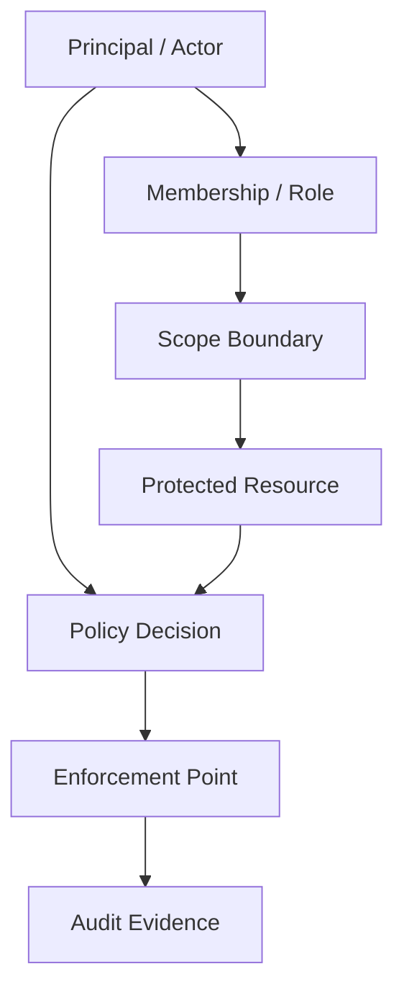
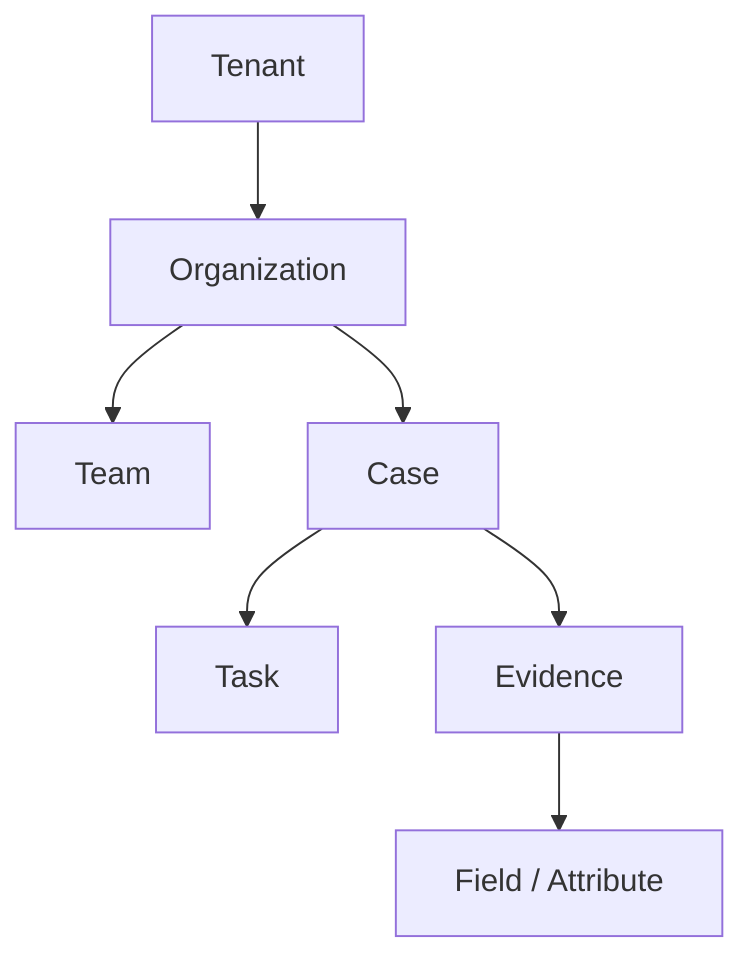
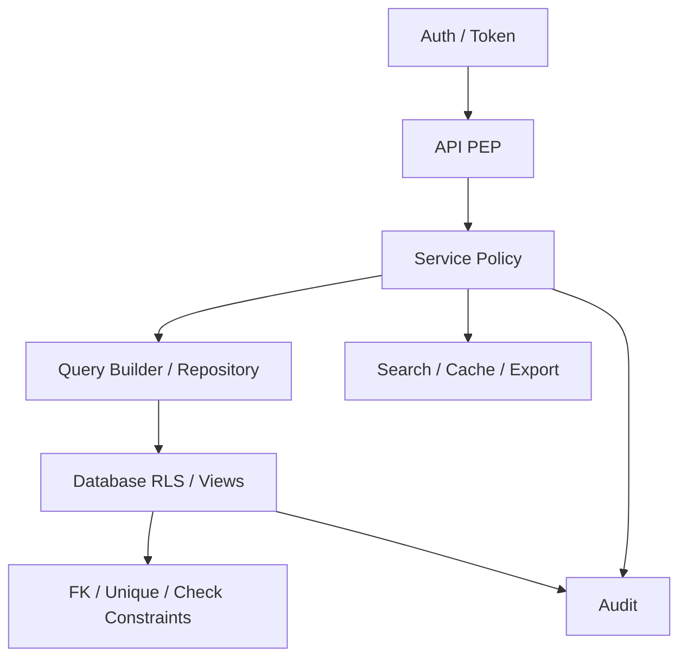

# Part 020 — Security Boundary in Schema Design

> Goal: setelah bagian ini, kamu bisa mendesain schema database yang membuat security boundary terlihat, dapat diuji, dapat diaudit, dan sulit dilanggar. Fokus bagian ini bukan membahas authentication/authorization framework secara umum, tetapi bagaimana access boundary harus tercermin dalam table, key, foreign key, policy, role, audit, query path, dan data lifecycle.

Security yang hanya berada di application code rapuh.

Bukan karena application code tidak penting.

Tetapi karena database sering diakses oleh banyak jalur:

- API utama,
- background worker,
- admin console,
- support tool,
- migration script,
- reporting job,
- data export,
- analytics pipeline,
- incident query,
- integration service,
- ad-hoc maintenance.

Jika security boundary tidak muncul di schema, setiap jalur harus mengingat aturan secara manual.

Itu bukan security design.

Itu harapan.

Database architect harus bertanya:

- siapa subject-nya?
- resource apa yang dilindungi?
- ownership resource ada di level mana?
- boundary tenant/org/team/case/project mana yang berlaku?
- apakah access direct, inherited, delegated, atau temporary?
- bagaimana policy berubah over time?
- bagaimana query tidak bocor lewat join/report/search/cache?
- apa yang database bisa enforce?
- apa yang hanya aplikasi bisa enforce?
- bagaimana membuktikan policy berjalan?

---

## 1. Core Mental Model

Security boundary in schema design adalah proses membuat **access rules menjadi data invariants**.

Bukan semua policy harus dipaksakan ke database constraint.

Tetapi schema harus menyediakan struktur yang membuat policy:

- eksplisit,
- queryable,
- enforceable,
- auditable,
- testable,
- evolvable.



Core objects:

| Concept | Meaning |
|---|---|
| Principal | Human/system identity performing action |
| Role | Named capability bundle, often scoped |
| Permission | Action allowed on resource type/scope |
| Scope | Boundary such as tenant, org, team, case, project |
| Resource | Data object being protected |
| Ownership | Who/what controls the resource |
| Delegation | Temporary/indirect access grant |
| Policy | Rule deciding allow/deny |
| Enforcement | Where policy is applied |
| Audit | Evidence of access decision/action |

---

## 2. Security Boundary Must Match Domain Boundary

A common mistake:

> “Users belong to tenant, so everything is tenant-based.”

That may be too coarse.

In many systems, access boundary is layered:



A user may be:

- tenant admin but not allowed to see restricted cases,
- case owner but not allowed to see sealed evidence,
- investigator assigned to task but not allowed to approve decision,
- external reviewer allowed to view only one case,
- support engineer allowed to view metadata but not PII,
- system worker allowed to update derived fields but not business decisions.

If schema only has `tenant_id`, it cannot express these rules safely.

---

## 3. Subject, Resource, Action, Scope

Design policy using four primitives:

```text
Can SUBJECT perform ACTION on RESOURCE within SCOPE?
```

Examples:

| Subject | Action | Resource | Scope |
|---|---|---|---|
| investigator A | view | case C | tenant T, team X |
| case manager B | assign | task K | case C |
| external reviewer E | comment | evidence D | case C, limited delegation |
| system worker W | update | search projection | tenant T |
| support engineer S | view metadata | tenant T | approved support session |

Schema should allow you to answer these questions without business logic archaeology.

---

## 4. Identity Is Not Membership

Do not confuse login identity with tenant access.

Bad model:

```sql
CREATE TABLE app_user (
    user_id uuid PRIMARY KEY,
    tenant_id uuid NOT NULL,
    email text NOT NULL,
    role text NOT NULL
);
```

Problems:

- one user cannot belong to multiple tenants,
- role is not historical,
- no multiple roles,
- no team/project/case scope,
- tenant admin vs platform admin is ambiguous,
- suspended membership cannot be modelled cleanly,
- audit cannot reconstruct old authority.

Better:

```sql
CREATE TABLE principal (
    principal_id uuid PRIMARY KEY,
    principal_type text NOT NULL CHECK (principal_type IN ('human', 'service', 'system')),
    email text,
    display_name text,
    status text NOT NULL CHECK (status IN ('active', 'disabled', 'deleted')),
    created_at timestamptz NOT NULL DEFAULT now()
);

CREATE TABLE tenant_membership (
    tenant_id uuid NOT NULL,
    principal_id uuid NOT NULL REFERENCES principal(principal_id),
    status text NOT NULL CHECK (status IN ('active', 'suspended', 'revoked')),
    joined_at timestamptz NOT NULL DEFAULT now(),
    revoked_at timestamptz,
    PRIMARY KEY (tenant_id, principal_id)
);
```

Then assign scoped roles separately.

---

## 5. Role Assignment Should Be Scoped

Bad:

```sql
ALTER TABLE tenant_membership ADD COLUMN role text NOT NULL;
```

This assumes one role per tenant.

Real systems need scoped role assignment:

```sql
CREATE TABLE role_definition (
    role_code text PRIMARY KEY,
    role_name text NOT NULL,
    role_kind text NOT NULL CHECK (role_kind IN ('platform', 'tenant', 'org', 'team', 'case', 'system'))
);

CREATE TABLE principal_role_assignment (
    assignment_id uuid PRIMARY KEY,
    tenant_id uuid,
    principal_id uuid NOT NULL REFERENCES principal(principal_id),
    role_code text NOT NULL REFERENCES role_definition(role_code),
    scope_type text NOT NULL CHECK (scope_type IN ('platform', 'tenant', 'organization', 'team', 'case', 'project')),
    scope_id uuid,
    granted_by uuid REFERENCES principal(principal_id),
    granted_at timestamptz NOT NULL DEFAULT now(),
    revoked_at timestamptz,
    reason text,
    CHECK (
        (scope_type = 'platform' AND tenant_id IS NULL AND scope_id IS NULL)
        OR
        (scope_type <> 'platform' AND tenant_id IS NOT NULL AND scope_id IS NOT NULL)
    )
);

CREATE INDEX idx_role_assignment_active
ON principal_role_assignment(tenant_id, principal_id, scope_type, scope_id, role_code)
WHERE revoked_at IS NULL;
```

This supports:

- tenant-level admin,
- organization-level manager,
- team-level reviewer,
- case-level assigned investigator,
- platform-level operator,
- temporary grant with revoke.

---

## 6. Permission Model

Roles are convenient.

Permissions are precise.

A role can map to permissions:

```sql
CREATE TABLE permission_definition (
    permission_code text PRIMARY KEY,
    resource_type text NOT NULL,
    action_code text NOT NULL,
    description text NOT NULL,
    UNIQUE (resource_type, action_code)
);

CREATE TABLE role_permission (
    role_code text NOT NULL REFERENCES role_definition(role_code),
    permission_code text NOT NULL REFERENCES permission_definition(permission_code),
    PRIMARY KEY (role_code, permission_code)
);
```

Example permission definitions:

| Permission | Resource | Action |
|---|---|---|
| `case.view` | case | view |
| `case.update` | case | update |
| `case.assign` | case | assign |
| `case.close` | case | close |
| `evidence.view` | evidence | view |
| `evidence.view_sensitive` | evidence | view_sensitive |
| `decision.approve` | decision | approve |
| `tenant.user.invite` | tenant_member | invite |

Schema does not have to evaluate every permission.

But permissions as data allow:

- review,
- audit,
- migration,
- tooling,
- diffing across environments,
- policy testing.

---

## 7. Resource Ownership Columns

Protected resources should expose their ownership boundary.

Example case table:

```sql
CREATE TABLE case_record (
    tenant_id uuid NOT NULL,
    case_id uuid NOT NULL,
    owning_org_id uuid NOT NULL,
    owning_team_id uuid,
    case_number text NOT NULL,
    title text NOT NULL,
    confidentiality_level text NOT NULL CHECK (confidentiality_level IN ('normal', 'restricted', 'sealed')),
    status text NOT NULL,
    created_by uuid NOT NULL REFERENCES principal(principal_id),
    created_at timestamptz NOT NULL DEFAULT now(),
    PRIMARY KEY (tenant_id, case_id),
    UNIQUE (tenant_id, case_number)
);
```

Ownership columns answer:

- tenant boundary,
- organization boundary,
- team boundary,
- confidentiality boundary,
- actor lineage.

Do not hide all ownership in application-only logic.

Queries, RLS policies, reports, audit, and repair scripts need these columns.

---

## 8. Ownership Is Not Always Creator

Bad assumption:

> `created_by` means owner.

Creator is historical actor.

Owner is current authority/responsibility boundary.

Use separate fields/tables:

```sql
CREATE TABLE case_ownership_history (
    tenant_id uuid NOT NULL,
    case_id uuid NOT NULL,
    owner_type text NOT NULL CHECK (owner_type IN ('organization', 'team', 'principal')),
    owner_id uuid NOT NULL,
    assigned_by uuid REFERENCES principal(principal_id),
    assigned_at timestamptz NOT NULL DEFAULT now(),
    unassigned_at timestamptz,
    reason_code text NOT NULL,
    PRIMARY KEY (tenant_id, case_id, assigned_at),
    FOREIGN KEY (tenant_id, case_id)
        REFERENCES case_record(tenant_id, case_id),
    CHECK (unassigned_at IS NULL OR unassigned_at > assigned_at)
);
```

This supports:

- ownership transfer,
- historical reconstruction,
- escalation,
- responsibility audit,
- workload reporting.

---

## 9. ACL Table Pattern

For resource-specific sharing, use ACL/grant table.

```sql
CREATE TABLE resource_access_grant (
    grant_id uuid PRIMARY KEY,
    tenant_id uuid NOT NULL,
    resource_type text NOT NULL,
    resource_id uuid NOT NULL,
    grantee_type text NOT NULL CHECK (grantee_type IN ('principal', 'team', 'organization', 'role')),
    grantee_id uuid NOT NULL,
    permission_code text NOT NULL REFERENCES permission_definition(permission_code),
    granted_by uuid REFERENCES principal(principal_id),
    granted_at timestamptz NOT NULL DEFAULT now(),
    expires_at timestamptz,
    revoked_at timestamptz,
    reason text,
    CHECK (expires_at IS NULL OR expires_at > granted_at)
);

CREATE INDEX idx_resource_access_grant_lookup
ON resource_access_grant(tenant_id, resource_type, resource_id, grantee_type, grantee_id, permission_code)
WHERE revoked_at IS NULL;
```

Use ACL when:

- access is per-resource,
- sharing/delegation matters,
- access is temporary,
- access must be audited,
- role hierarchy alone is insufficient.

Avoid ACL when simple scoped roles are enough.

ACL can become expensive and complex.

---

## 10. Negative Permission Is Dangerous

Many teams add deny rules:

```text
allow team X view case C
but deny principal P view case C
```

This becomes hard to reason about.

Precedence rules must be explicit:

1. explicit deny wins?
2. sealed resource overrides all?
3. break-glass overrides deny?
4. owner can always view?
5. revoked role removes inherited grants?

If negative permission is required, model it deliberately:

```sql
CREATE TABLE resource_access_rule (
    rule_id uuid PRIMARY KEY,
    tenant_id uuid NOT NULL,
    resource_type text NOT NULL,
    resource_id uuid NOT NULL,
    effect text NOT NULL CHECK (effect IN ('allow', 'deny')),
    grantee_type text NOT NULL,
    grantee_id uuid NOT NULL,
    permission_code text NOT NULL,
    priority integer NOT NULL DEFAULT 0,
    valid_from timestamptz NOT NULL DEFAULT now(),
    valid_until timestamptz,
    created_by uuid REFERENCES principal(principal_id),
    created_at timestamptz NOT NULL DEFAULT now()
);
```

But default recommendation:

- avoid deny unless domain needs it,
- make sealed/restricted states explicit on resource,
- keep policy precedence simple,
- test all combinations.

---

## 11. Row-Level Security Boundary

Database-level row filtering can provide defense-in-depth.

Example PostgreSQL pattern:

```sql
ALTER TABLE case_record ENABLE ROW LEVEL SECURITY;

CREATE POLICY case_tenant_policy
ON case_record
USING (tenant_id = current_setting('app.tenant_id')::uuid)
WITH CHECK (tenant_id = current_setting('app.tenant_id')::uuid);
```

This enforces tenant boundary.

But many policies need more than tenant.

Example team-scoped case access:

```sql
CREATE POLICY case_team_policy
ON case_record
USING (
    tenant_id = current_setting('app.tenant_id')::uuid
    AND (
        owning_team_id IS NULL
        OR owning_team_id = ANY (string_to_array(current_setting('app.team_ids'), ',')::uuid[])
    )
);
```

Be careful.

Complex RLS policies can become:

- hard to debug,
- hard to optimize,
- dependent on session variables,
- surprising for background jobs,
- bypassed by privileged roles,
- difficult for analytics.

Good RLS uses database to enforce coarse, critical boundary:

- tenant isolation,
- soft-deleted visibility,
- organization boundary,
- basic confidentiality level.

Application/policy service can enforce richer action-specific rules.

---

## 12. `USING` vs `WITH CHECK`

For RLS-like systems, understand read vs write guard.

In PostgreSQL policy:

- `USING` controls which existing rows are visible/targetable.
- `WITH CHECK` controls which new/updated rows are allowed.

Example:

```sql
CREATE POLICY case_isolation
ON case_record
USING (tenant_id = current_setting('app.tenant_id')::uuid)
WITH CHECK (tenant_id = current_setting('app.tenant_id')::uuid);
```

Without `WITH CHECK`, a user might be able to insert/update rows into another tenant depending on policy/privilege setup.

Security boundary must cover:

- SELECT,
- INSERT,
- UPDATE,
- DELETE,
- background writes,
- migration writes,
- bulk import.

---

## 13. Least-Privilege Database Roles

Do not run everything through one database super-role.

Suggested role separation:

| DB role | Capabilities |
|---|---|
| `app_runtime` | normal OLTP read/write on selected tables; RLS enforced |
| `app_worker` | background job access; still scoped and audited |
| `app_readonly` | operational read-only; masked views where possible |
| `app_migration` | DDL; not used by app runtime |
| `app_analytics_export` | controlled export surfaces |
| `support_tool` | support-safe views/procedures only |
| `break_glass` | emergency only; logged and monitored |

Bad:

```text
APP_DATABASE_USER = postgres
```

This turns every application vulnerability into database superuser risk.

---

## 14. View-Based Security Boundary

Views can expose safe surfaces.

Example:

```sql
CREATE VIEW support_case_summary AS
SELECT
    tenant_id,
    case_id,
    case_number,
    status,
    created_at,
    updated_at
FROM case_record;
```

Do not include sensitive fields.

Then grant:

```sql
GRANT SELECT ON support_case_summary TO support_tool;
REVOKE SELECT ON case_record FROM support_tool;
```

View-based access works well for:

- support metadata,
- operational dashboards,
- masked PII,
- export whitelist,
- reporting surfaces.

But views must be versioned/reviewed like APIs.

A view is a data contract.

---

## 15. Stored Procedure as Controlled Write Boundary

Some writes should not be direct table writes.

Example: approving a regulatory decision.

Bad:

```sql
UPDATE case_decision
SET status = 'approved'
WHERE decision_id = :decision_id;
```

Better:

```sql
CREATE FUNCTION approve_case_decision(
    p_tenant_id uuid,
    p_decision_id uuid,
    p_actor_id uuid,
    p_reason text
) RETURNS void AS $$
BEGIN
    -- verify decision state
    -- verify actor assignment/role if appropriate
    -- write approval transition
    -- update current state
    -- write audit event
END;
$$ LANGUAGE plpgsql;
```

In application architectures, this logic often lives in service layer rather than DB procedure.

The key design point:

> Dangerous state-changing operations should have a controlled boundary, not arbitrary table updates.

The boundary can be:

- application service transaction,
- database function,
- command handler,
- workflow engine action,
- stored procedure for high-integrity environments.

---

## 16. Sensitive Column Classification

Schema should mark sensitive data explicitly.

Example:

```sql
CREATE TABLE data_classification (
    table_name text NOT NULL,
    column_name text NOT NULL,
    classification text NOT NULL CHECK (classification IN ('public', 'internal', 'confidential', 'pii', 'sensitive_pii', 'secret')),
    reason text NOT NULL,
    owner_team text NOT NULL,
    created_at timestamptz NOT NULL DEFAULT now(),
    PRIMARY KEY (table_name, column_name)
);
```

This supports:

- masking policy,
- export review,
- access review,
- retention policy,
- privacy impact assessment,
- audit evidence.

Sensitive columns include:

- identity numbers,
- address,
- phone/email,
- financial account,
- health data,
- credentials/secrets,
- investigation notes,
- sealed evidence,
- private comments,
- security tokens.

Do not let sensitive data classification live only in a spreadsheet.

---

## 17. Field-Level Security

Sometimes row-level security is not enough.

Example:

- user can see case summary,
- but not complainant identity,
- can see evidence metadata,
- but not document content,
- can see decision outcome,
- but not internal legal memo.

Options:

### Option A — Split sensitive data into separate table

```sql
CREATE TABLE case_record (
    tenant_id uuid NOT NULL,
    case_id uuid NOT NULL,
    case_number text NOT NULL,
    title text NOT NULL,
    status text NOT NULL,
    PRIMARY KEY (tenant_id, case_id)
);

CREATE TABLE case_sensitive_detail (
    tenant_id uuid NOT NULL,
    case_id uuid NOT NULL,
    complainant_name text,
    complainant_identifier text,
    restricted_notes text,
    PRIMARY KEY (tenant_id, case_id),
    FOREIGN KEY (tenant_id, case_id)
        REFERENCES case_record(tenant_id, case_id)
);
```

Grant different access to each table/view.

### Option B — Masked view

```sql
CREATE VIEW case_record_masked AS
SELECT
    tenant_id,
    case_id,
    case_number,
    title,
    status,
    '[restricted]'::text AS complainant_name
FROM case_record;
```

### Option C — Application-level masking

Works when policy is complex, but must be tested and audited.

Top-level rule:

> If a field has materially different access policy, consider modelling it as a separate security surface.

---

## 18. Security Boundary for Evidence/Documents

Evidence and documents often have stricter access than their parent case.

Bad:

```sql
CREATE TABLE document (
    document_id uuid PRIMARY KEY,
    case_id uuid NOT NULL,
    storage_key text NOT NULL
);
```

Better:

```sql
CREATE TABLE case_document (
    tenant_id uuid NOT NULL,
    document_id uuid NOT NULL,
    case_id uuid NOT NULL,
    document_type text NOT NULL,
    confidentiality_level text NOT NULL CHECK (confidentiality_level IN ('normal', 'restricted', 'sealed')),
    storage_object_id uuid NOT NULL,
    uploaded_by uuid NOT NULL REFERENCES principal(principal_id),
    uploaded_at timestamptz NOT NULL DEFAULT now(),
    PRIMARY KEY (tenant_id, document_id),
    FOREIGN KEY (tenant_id, case_id)
        REFERENCES case_record(tenant_id, case_id)
);
```

Avoid exposing raw storage path broadly.

Use signed access or mediated download service that checks:

- tenant,
- principal,
- case access,
- document confidentiality,
- legal hold/restriction,
- support session,
- audit requirement.

---

## 19. Temporal Authorization

Access changes over time.

Question:

> Should a user who had access last month still be visible as actor in audit? Yes. Should they still access the data now? Maybe not.

Model assignments historically:

```sql
CREATE TABLE team_membership_history (
    tenant_id uuid NOT NULL,
    team_id uuid NOT NULL,
    principal_id uuid NOT NULL REFERENCES principal(principal_id),
    role_code text NOT NULL,
    valid_from timestamptz NOT NULL DEFAULT now(),
    valid_until timestamptz,
    granted_by uuid REFERENCES principal(principal_id),
    PRIMARY KEY (tenant_id, team_id, principal_id, valid_from),
    CHECK (valid_until IS NULL OR valid_until > valid_from)
);
```

Current access query uses `valid_until IS NULL` or current timestamp.

Audit reconstruction uses historical validity.

Do not overwrite membership row if audit needs past authority.

---

## 20. Support and Break-Glass Access

Support/break-glass access must be modelled separately from normal tenant access.

```sql
CREATE TABLE privileged_access_session (
    session_id uuid PRIMARY KEY,
    principal_id uuid NOT NULL REFERENCES principal(principal_id),
    tenant_id uuid,
    scope_type text NOT NULL,
    scope_id uuid,
    access_reason text NOT NULL,
    approved_by uuid REFERENCES principal(principal_id),
    started_at timestamptz NOT NULL DEFAULT now(),
    expires_at timestamptz NOT NULL,
    ended_at timestamptz,
    ticket_reference text,
    CHECK (expires_at > started_at)
);
```

Rules:

- time-bound,
- reason required,
- approval required for high-risk access,
- audited at read/action level,
- masked by default,
- tenant-scoped when possible,
- alert on broad access.

Break-glass is not an authorization shortcut.

It is an emergency procedure with evidence.

---

## 21. Access Audit

Not every SELECT can be audited at high volume, but sensitive access should be.

Audit event model:

```sql
CREATE TABLE access_audit_event (
    audit_id uuid PRIMARY KEY,
    tenant_id uuid,
    principal_id uuid NOT NULL REFERENCES principal(principal_id),
    action_code text NOT NULL,
    resource_type text NOT NULL,
    resource_id uuid,
    access_result text NOT NULL CHECK (access_result IN ('allowed', 'denied')),
    policy_reason text,
    request_id text,
    support_session_id uuid,
    source_ip inet,
    user_agent text,
    occurred_at timestamptz NOT NULL DEFAULT now()
);

CREATE INDEX idx_access_audit_tenant_time
ON access_audit_event(tenant_id, occurred_at DESC);

CREATE INDEX idx_access_audit_principal_time
ON access_audit_event(principal_id, occurred_at DESC);
```

Audit should capture:

- actor,
- tenant/scope,
- resource,
- action,
- result,
- reason/policy,
- request correlation,
- privileged session if any,
- timestamp.

For high-volume read systems, audit at boundary:

- export,
- document download,
- sensitive field reveal,
- support access,
- bulk query,
- permission change,
- administrative action.

---

## 22. Permission Change Audit

Changing access is often more sensitive than using access.

Track role/grant changes:

```sql
CREATE TABLE access_change_event (
    event_id uuid PRIMARY KEY,
    tenant_id uuid,
    actor_id uuid NOT NULL REFERENCES principal(principal_id),
    target_principal_id uuid REFERENCES principal(principal_id),
    change_type text NOT NULL CHECK (change_type IN ('grant_role', 'revoke_role', 'grant_permission', 'revoke_permission', 'create_acl', 'revoke_acl')),
    scope_type text NOT NULL,
    scope_id uuid,
    before_value jsonb,
    after_value jsonb,
    reason text,
    occurred_at timestamptz NOT NULL DEFAULT now()
);
```

A regulator/auditor often asks:

- who granted access?
- why?
- when?
- to whom?
- for what scope?
- when was it removed?
- what did they access while having it?

If schema cannot answer, access model is incomplete.

---

## 23. Query Leak Through Joins

Even if base table is tenant-scoped, joins can leak.

Bad:

```sql
SELECT c.case_number, p.email
FROM case_record c
JOIN principal p ON p.principal_id = c.created_by
WHERE c.tenant_id = :tenant_id;
```

This may be okay if `principal` is global identity.

But if principal metadata is sensitive per tenant, this may leak global user details.

Better model:

```sql
CREATE TABLE tenant_principal_profile (
    tenant_id uuid NOT NULL,
    principal_id uuid NOT NULL REFERENCES principal(principal_id),
    display_name text NOT NULL,
    status text NOT NULL,
    PRIMARY KEY (tenant_id, principal_id)
);
```

Then join scoped profile:

```sql
SELECT c.case_number, pp.display_name
FROM case_record c
JOIN tenant_principal_profile pp
  ON pp.tenant_id = c.tenant_id
 AND pp.principal_id = c.created_by
WHERE c.tenant_id = :tenant_id;
```

Principle:

> Shared/global entities can become side channels if their attributes are not safe globally.

---

## 24. Side Channels

Security leaks are not only row leaks.

Side channels include:

- existence checks,
- unique constraint error messages,
- timing differences,
- count endpoints,
- auto-complete search,
- logs,
- error responses,
- foreign key violation details,
- export file names,
- object storage keys,
- analytics dashboards.

Example:

```sql
CREATE UNIQUE INDEX uq_global_case_number ON case_record(case_number);
```

If a tenant tries to create case number used by another tenant and gets duplicate error, they learn existence of data outside their tenant.

Tenant-scoped unique:

```sql
CREATE UNIQUE INDEX uq_tenant_case_number
ON case_record(tenant_id, case_number);
```

Security boundary includes error design.

---

## 25. Data Export Boundary

Export is high-risk because it bypasses UI-level controls.

Model export job:

```sql
CREATE TABLE data_export_job (
    export_id uuid PRIMARY KEY,
    tenant_id uuid NOT NULL,
    requested_by uuid NOT NULL REFERENCES principal(principal_id),
    export_type text NOT NULL,
    scope_type text NOT NULL,
    scope_id uuid,
    status text NOT NULL CHECK (status IN ('pending', 'running', 'completed', 'failed', 'expired')),
    includes_sensitive_data boolean NOT NULL DEFAULT false,
    approved_by uuid REFERENCES principal(principal_id),
    requested_at timestamptz NOT NULL DEFAULT now(),
    completed_at timestamptz,
    expires_at timestamptz
);
```

Export design should enforce:

- tenant scope,
- permission check,
- approval for sensitive data,
- expiry of download link,
- audit of generation and download,
- masking by default,
- rate limit.

Do not implement export as “run arbitrary SQL and dump CSV”.

---

## 26. Analytics and Warehouse Security

Data copied to warehouse must preserve security classification.

OLTP security does not automatically follow data to analytics.

You need:

- tenant_id in analytical facts,
- data classification metadata,
- masking rules,
- row/column access policy,
- governed datasets,
- export lineage,
- separation between operator analytics and tenant-facing analytics.

If warehouse has a table:

```text
fact_case_activity
```

It should include:

- tenant_id,
- source system,
- source table/key,
- classification tags,
- load timestamp,
- access policy grouping.

Otherwise analytics becomes the easiest way to bypass application security.

---

## 27. Soft Delete and Security

Soft-deleted rows can leak if visibility rules ignore lifecycle state.

Example:

```sql
SELECT * FROM case_record WHERE tenant_id = :tenant_id;
```

May return deleted/sealed/archived rows.

Security view:

```sql
CREATE VIEW active_case_record AS
SELECT *
FROM case_record
WHERE deleted_at IS NULL;
```

RLS/policy can include:

```sql
deleted_at IS NULL
```

But beware:

- admin restore needs deleted rows,
- audit may need deleted rows,
- legal hold may preserve deleted rows,
- reports may exclude or include depending definition.

Visibility state is part of access policy.

---

## 28. Multi-Tenant Security Boundary

Tenant isolation should be enforced at multiple layers:



Defense-in-depth means:

- auth validates identity,
- service validates action,
- query carries scope,
- database enforces critical boundaries,
- constraints prevent impossible references,
- derived systems preserve scope,
- audit records access.

No single layer is enough.

---

## 29. Policy Testing Matrix

Create a policy matrix for critical resources.

| Scenario | Expected |
|---|---|
| Tenant A user reads Tenant A case | allowed |
| Tenant A user reads Tenant B case | denied/not found |
| Tenant admin reads restricted case outside team | depends on policy; must be explicit |
| Investigator reads assigned case | allowed |
| Investigator reads unassigned sealed evidence | denied |
| Support user without session reads case | denied |
| Support user with session reads case metadata | allowed + audited |
| Support user with session reads sensitive field | denied or masked |
| Revoked user reads old case | denied |
| Historical audit displays revoked user as actor | allowed in audit context |
| Worker updates projection | allowed only through service role |
| Export sensitive data without approval | denied |

Tests should include:

- positive cases,
- negative cases,
- boundary crossing,
- revoked access,
- expired delegation,
- tenant mismatch,
- support access,
- background worker,
- bulk export.

---

## 30. Schema Review Questions

Before approving schema, ask:

1. What is the protected resource?
2. What is the owner/boundary of this resource?
3. Is boundary represented in columns?
4. Is boundary represented in foreign keys?
5. Are unique constraints scoped correctly?
6. Can resource be shared/delegated?
7. Is access historical or only current?
8. Does resource contain sensitive fields?
9. Should sensitive fields be split?
10. Who can read raw table?
11. Who can read safe view?
12. Who can update state?
13. Does update require audit?
14. Does delete mean hide, revoke, archive, or purge?
15. Can analytics/export bypass this policy?
16. Can support access this data?
17. What should happen after membership revocation?
18. How are policy changes audited?
19. How are policies tested?
20. What is the failure mode if application forgets filter?

---

## 31. Common Security Smells

| Smell | Why dangerous | Better pattern |
|---|---|---|
| `role` column on user | Too coarse and non-historical | Scoped role assignment |
| `created_by` used as owner | Creator is not owner | Ownership table/history |
| Missing tenant in FK | Cross-tenant reference possible | Composite tenant-scoped FK |
| Global unique constraint | Side-channel/excess restriction | Tenant-scoped unique |
| Support uses prod DB credential | Unbounded access | Support views/session/audit |
| Raw table grants everywhere | Hard to control | Views/functions/least privilege |
| Sensitive fields mixed with public fields | Field-level policy impossible | Split table/masked view |
| ACL without expiration/revocation | Permanent accidental access | grant lifecycle |
| Permission changes not audited | Cannot investigate | access_change_event |
| Analytics copy has no policy | Bypass app security | warehouse row/column policy |
| Cache key lacks scope | Cross-tenant leak | scope-prefixed key |
| Search index lacks tenant/security fields | Search leak | document security contract |

---

## 32. Failure Mode Analysis

### Failure: tenant user reads another tenant row

Causes:

- missing tenant filter,
- direct id lookup,
- no RLS,
- global cache key,
- admin endpoint reused.

Controls:

- tenant-scoped FK/unique,
- RLS,
- repository requiring TenantContext,
- negative tests,
- cache key prefix,
- audit and alert.

### Failure: revoked user still has access

Causes:

- membership cached too long,
- token not invalidated,
- role assignment not historical,
- worker uses stale snapshot.

Controls:

- membership version,
- short-lived auth claims,
- policy lookup on sensitive actions,
- revocation event,
- access test.

### Failure: support engineer sees sensitive data

Causes:

- raw table access,
- broad admin role,
- no masking,
- no support session model.

Controls:

- support-safe views,
- privileged session,
- field classification,
- access audit,
- approval workflow.

### Failure: export leaks data

Causes:

- export query bypasses UI filters,
- no classification,
- no approval,
- download link persistent.

Controls:

- export scope table,
- policy evaluation at export creation,
- masking,
- expiring links,
- audit download.

---

## 33. Database Security Boundary Design Document

For critical schema, create a short design doc:

```md
# Security Boundary: Case Record

## Protected Resources
- case_record
- case_sensitive_detail
- case_document
- case_decision

## Scopes
- tenant
- organization
- team
- case assignment
- confidentiality level

## Principals
- tenant admin
- case manager
- investigator
- external reviewer
- support engineer
- system worker

## Access Rules
- tenant boundary is mandatory
- restricted cases require team membership or explicit ACL
- sealed evidence requires special permission
- support access requires approved session

## Database Enforcement
- tenant_id on all tenant-owned rows
- composite FK includes tenant_id
- RLS tenant policy
- sensitive detail split into separate table
- support view excludes sensitive columns

## Application Enforcement
- action-specific permissions
- assignment checks
- approval checks
- break-glass workflow

## Audit
- document download audited
- sensitive field reveal audited
- role/grant changes audited
- support session audited

## Tests
- cross-tenant read denied
- cross-team restricted case denied
- sealed evidence denied without permission
- revoked membership denied
- support no session denied
```

---

## 34. Top 1% Mental Model

A weak design says:

> “We check permission in the API.”

A better design says:

> “We check permission in the service and pass scoped queries.”

A database architect says:

> “The schema, constraints, database roles, policies, views, audit tables, and derived-data contracts all express the same security boundary, so accidental bypass is hard and evidence is available when something goes wrong.”

Security boundary is not a middleware function.

It is a property of the entire data system.

---

## 35. Implementation Checklist

### Domain boundary

- [ ] Protected resources are identified.
- [ ] Tenant/org/team/case/project scopes are defined.
- [ ] Ownership is separate from creator.
- [ ] Delegation/sharing rules are explicit.
- [ ] Confidentiality levels are modelled where needed.

### Schema

- [ ] Resource tables include boundary columns.
- [ ] Foreign keys preserve boundary.
- [ ] Unique constraints do not leak cross-scope information.
- [ ] Sensitive fields are classified.
- [ ] Sensitive fields are split/masked when needed.
- [ ] Role assignment is scoped and historical.
- [ ] ACL/grants have lifecycle fields.

### Enforcement

- [ ] Application service enforces action-specific permission.
- [ ] Database role is least-privileged.
- [ ] RLS/views/functions are used for critical boundaries where appropriate.
- [ ] Runtime DB role cannot bypass policy casually.
- [ ] Support access uses restricted surfaces.
- [ ] Export/reporting uses controlled surfaces.

### Audit

- [ ] Permission changes are audited.
- [ ] Privileged access is audited.
- [ ] Sensitive data access is audited.
- [ ] Export/download is audited.
- [ ] Audit records include actor, scope, resource, action, result, reason, and timestamp.

### Testing

- [ ] Cross-tenant access denied.
- [ ] Cross-scope access denied.
- [ ] Revoked membership denied.
- [ ] Expired grant denied.
- [ ] Support session required.
- [ ] Sensitive field masked/denied.
- [ ] Export policy tested.
- [ ] Derived systems preserve security scope.

---

## 36. References

- PostgreSQL Documentation — Row Security Policies: https://www.postgresql.org/docs/current/ddl-rowsecurity.html
- PostgreSQL Documentation — CREATE POLICY: https://www.postgresql.org/docs/current/sql-createpolicy.html
- PostgreSQL Documentation — Privileges: https://www.postgresql.org/docs/current/ddl-priv.html
- PostgreSQL Documentation — Constraints: https://www.postgresql.org/docs/current/ddl-constraints.html
- AWS SaaS Architecture Fundamentals — Tenant Isolation: https://docs.aws.amazon.com/whitepapers/latest/saas-architecture-fundamentals/tenant-isolation.html
- AWS Prescriptive Guidance — Multi-tenant SaaS authorization and API access control: https://docs.aws.amazon.com/prescriptive-guidance/latest/saas-multitenant-api-access-authorization/introduction.html
