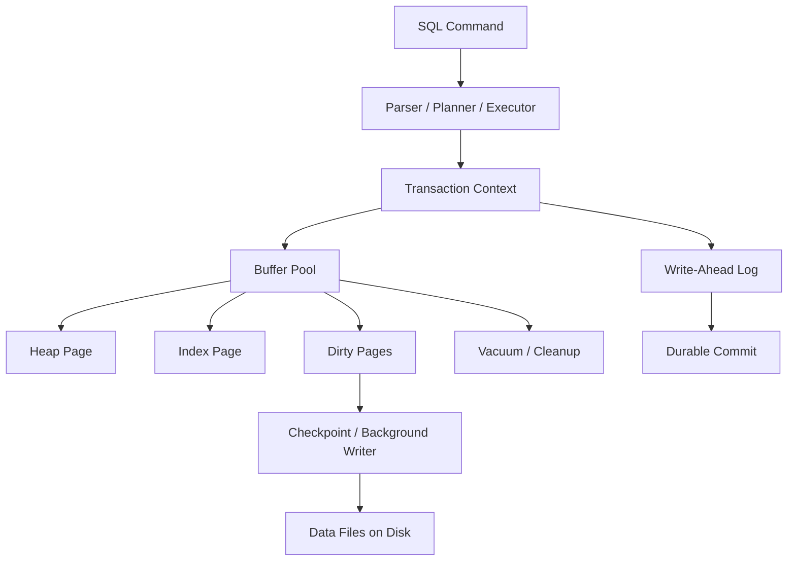
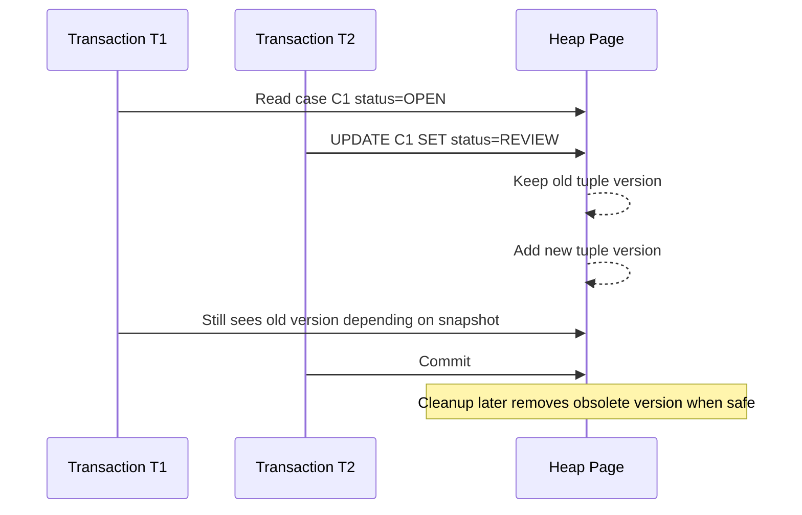
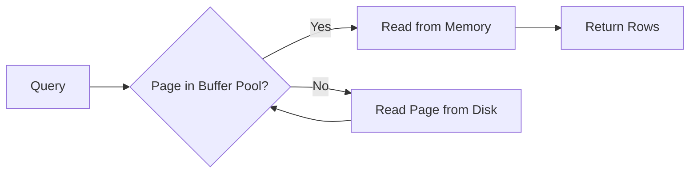
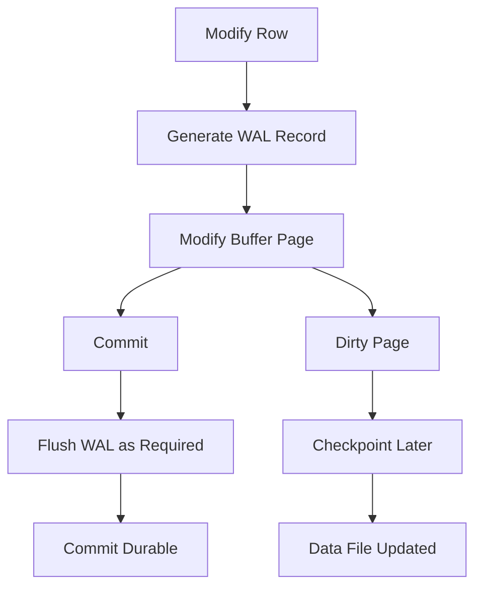
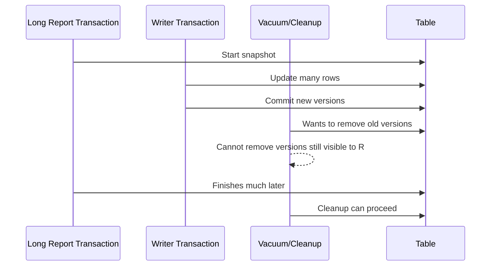

# Part 021 — Physical Storage Mental Model

> Goal: setelah bagian ini, kamu tidak lagi melihat table sebagai spreadsheet abstrak. Kamu akan melihat table sebagai kumpulan page, tuple, pointer, free space, visibility metadata, buffer cache, write-ahead log, dan background maintenance. Ini adalah mental model penting sebelum masuk ke index, query planner, transaction, WAL, replication, backup, dan performance engineering.

Database design yang bagus tidak berhenti di ERD.

ERD menjawab:

- entity apa yang ada,
- relationship apa yang valid,
- constraint apa yang harus dijaga,
- data mana yang authoritative.

Tetapi production database juga harus menjawab:

- bagaimana data diletakkan di disk,
- bagaimana row dibaca dari page,
- berapa banyak page yang disentuh oleh query,
- bagaimana update mengubah physical storage,
- bagaimana dead tuple dibersihkan,
- bagaimana cache bekerja,
- bagaimana write menjadi durable,
- bagaimana schema design memengaruhi I/O, bloat, contention, dan recovery.

Top engineer tidak harus hafal seluruh source code storage engine. Tetapi mereka harus punya model mental yang cukup akurat untuk menghindari keputusan desain yang mahal.

Bad schema sering terlihat rapi secara logical, tetapi buruk secara physical.

Contoh:

- table terlalu lebar sehingga query kecil membaca payload besar,
- kolom yang sering di-update bercampur dengan kolom immutable besar,
- JSON besar dipakai untuk field yang sering difilter,
- index dibuat terlalu banyak sehingga write path lambat,
- soft delete tidak dikombinasikan dengan partial index sehingga semua query membawa sampah historis,
- multi-tenant table tidak mempertimbangkan tenant skew,
- row yang sangat hot menjadi bottleneck walaupun ERD terlihat normal.

Bagian ini membangun fondasi physical storage sebelum Part 022 membahas B-Tree dan index internals.

---

## 1. Mental Model Utama: Database Adalah Mesin State di Atas Storage

Secara logical, kamu menulis:

```sql
INSERT INTO cases (id, case_no, status, created_at)
VALUES ('...', 'CASE-2026-0001', 'OPEN', now());
```

Secara physical, database melakukan pekerjaan yang jauh lebih kompleks:

1. menerima statement,
2. parse dan plan,
3. membuka transaction context,
4. membuat tuple/row representation,
5. mencari page yang punya free space,
6. menulis perubahan ke memory buffer,
7. mencatat perubahan ke WAL agar crash-safe,
8. menandai dirty page,
9. meng-update index terkait,
10. commit transaction,
11. meng-flush WAL sesuai durability policy,
12. nanti checkpoint/background writer menulis page ke data file,
13. nanti vacuum/maintenance membersihkan versi lama.

Diagram sederhananya:



Yang perlu dipahami: commit tidak selalu berarti semua data page langsung ditulis ke disk. Pada banyak storage engine modern, commit durable karena WAL sudah aman, sedangkan data page bisa ditulis belakangan.

Ini penting karena:

- durability bukan sekadar “row ada di table”,
- crash recovery membaca log untuk mengembalikan state konsisten,
- write amplification terjadi karena satu logical write bisa menyentuh heap, beberapa index, WAL, visibility metadata, dan checkpoint,
- desain index dan row shape memengaruhi biaya setiap write.

---

## 2. Logical Table vs Physical Table

Logical table:

```text
case_id | case_no | status | priority | created_at
```

Physical table:

```text
relation file(s)
  ├── page 0
  │   ├── page header
  │   ├── line pointer array
  │   ├── tuple A
  │   ├── tuple B
  │   └── free space
  ├── page 1
  │   ├── page header
  │   ├── line pointer array
  │   ├── tuple C
  │   └── free space
  └── page N
```

A table is not a spreadsheet.

A table is a logical abstraction over physical storage units.

Different engines vary in implementation, but common concepts appear repeatedly:

| Concept | Meaning |
|---|---|
| Page / block | Small fixed-size unit read/written between storage and database buffer |
| Tuple / row | Physical representation of a logical row version |
| Heap | Unordered collection of rows/pages, common in row-store engines |
| Index | Separate access structure pointing to heap rows or containing row data |
| Buffer pool | Memory area where data/index pages are cached |
| Dirty page | Cached page modified in memory but not yet written to data file |
| WAL / redo log | Sequential log used to make changes crash-recoverable |
| Checkpoint | Process that bounds recovery by flushing dirty state |
| Free space map | Metadata to find pages with available space |
| Visibility metadata | Metadata used to know which row versions are visible |
| Bloat | Physical space occupied by obsolete versions or underfilled pages |

The architect-level question is not “what is a page?”

The real question is:

> How does this logical model behave when it becomes millions or billions of physical row versions across pages, indexes, buffers, logs, replicas, backups, and maintenance jobs?

---

## 3. Page: The Fundamental Unit of Physical Access

Most disk-based databases organize storage into pages/blocks.

A page is a fixed-size chunk of data. PostgreSQL commonly uses 8 KB pages by default. Other engines may use different sizes, but the principle is similar: the database does not usually fetch a single column value directly from disk. It fetches a page that contains many bytes and then extracts what it needs.

This means query cost is often page cost, not row count alone.

A query returning 10 rows can be expensive if those 10 rows live in 10,000 scattered pages. A query returning 10,000 rows can be cheap if those rows are laid out sequentially and read efficiently.

Bad mental model:

```text
Query cost = number of returned rows
```

Better mental model:

```text
Query cost = pages touched + index traversal + filtering + join work + sort/hash memory + visibility checks + network output
```

Page-level thinking changes how you design.

Example:

```sql
SELECT id, status
FROM cases
WHERE tenant_id = $1
  AND status = 'OPEN'
ORDER BY created_at DESC
LIMIT 50;
```

The output is only 50 rows. But cost depends on:

- whether an index can find those rows in order,
- how many heap pages must be visited,
- whether dead rows must be skipped,
- whether tenant data is clustered or scattered,
- whether the selected columns can be served from index only,
- whether visibility metadata allows index-only scan,
- whether sort is avoided.

---

## 4. Heap Storage: Rows Are Usually Not Ordered by Business Meaning

In many relational engines, base table storage is heap-like: rows are placed where there is free space, not necessarily ordered by primary key or creation time.

Logical expectation:

```text
CASE-0001
CASE-0002
CASE-0003
```

Physical reality:

```text
page 41: CASE-0002, CASE-8801, CASE-0193
page 42: CASE-0001, CASE-5500
page 77: CASE-0003
```

This matters because:

- primary key does not necessarily mean physical clustering,
- `ORDER BY id` may require index scan or sort,
- range queries may still jump around heap pages,
- updates can move data physically depending on row growth and engine behavior,
- table scan reads physical page order, not business order.

Some engines support clustered storage or clustered indexes where table data is physically organized by a key. For example, InnoDB organizes table data around the primary key as a clustered index. PostgreSQL heap tables are not permanently clustered by primary key, although `CLUSTER` can rewrite a table according to an index at a point in time.

Do not assume one database engine's physical model applies to all engines.

Architectural skill is knowing which assumptions are engine-specific.

---

## 5. Row Layout: A Row Is Not Just Its Columns

A physical row usually contains more than user-defined columns.

It may include:

- row header,
- transaction visibility metadata,
- null bitmap,
- variable-length column metadata,
- alignment padding,
- actual column bytes,
- pointer to overflow/toasted data,
- engine-specific metadata.

Logical row:

```sql
CREATE TABLE case_notes (
    id uuid PRIMARY KEY,
    case_id uuid NOT NULL,
    body text NOT NULL,
    created_at timestamptz NOT NULL
);
```

Physical implications:

- `uuid` is fixed-length but larger than bigint,
- `text` may be stored inline if small,
- large `text` may be compressed or stored out-of-line depending on engine,
- row header and alignment add overhead,
- each index entry also stores key data and pointer/reference,
- updating `body` may create a large new row version,
- selecting only `id` and `created_at` may still interact with heap/index storage depending on access path.

Important distinction:

```text
Logical width = columns you defined
Physical width = row metadata + column bytes + alignment + overflow pointers + index copies
```

Wide rows reduce row density per page.

If fewer rows fit per page, many queries touch more pages.

This is why it is often wise to split rarely-read large payload from frequently-read operational state.

Example:

```sql
CREATE TABLE cases (
    id uuid PRIMARY KEY,
    tenant_id uuid NOT NULL,
    case_no text NOT NULL,
    status text NOT NULL,
    priority text NOT NULL,
    assigned_user_id uuid,
    created_at timestamptz NOT NULL,
    updated_at timestamptz NOT NULL
);

CREATE TABLE case_large_payloads (
    case_id uuid PRIMARY KEY REFERENCES cases(id),
    intake_json jsonb NOT NULL,
    raw_submission text,
    extracted_text text,
    updated_at timestamptz NOT NULL
);
```

This is not premature optimization. It is workload-aligned physical design.

The `cases` table serves hot list/search/assignment workflows. The payload table serves detail screen, investigation, export, or evidence processing.

---

## 6. Tuple Versioning: Update May Mean New Physical Version

A common misconception:

```text
UPDATE changes the row in place.
```

In MVCC engines, update often creates a new row version and marks the old version obsolete for future transactions.

Conceptually:

```text
case id = C1

version 1: status = OPEN      visible to old transactions
version 2: status = REVIEW    visible to new transactions after commit
```

This allows readers and writers to avoid blocking each other in many cases.

But it has physical cost:

- old versions occupy space until cleanup,
- indexes may need new entries,
- vacuum/cleanup must reclaim obsolete versions,
- long-running transactions can prevent cleanup,
- high-update tables can bloat,
- hot rows can cause contention even with MVCC.

Diagram:



Architectural implication:

A table that receives frequent updates is not just “one row per entity.” It is a stream of physical versions over time.

This matters for tables like:

- session state,
- counters,
- workflow queues,
- case status,
- assignment state,
- SLA timers,
- retry jobs,
- aggregate balances,
- inventory quantities.

Design question:

> Is this entity genuinely mutable state, or should some changes be append-only events with a derived current state?

Not every update should become event sourcing. But update-heavy mutable state must be designed with physical churn in mind.

---

## 7. Insert, Update, Delete: Physical Behavior Differs

### 7.1 Insert

Insert usually:

- creates a tuple,
- places it into a page with free space,
- updates indexes,
- writes WAL/redo,
- marks buffers dirty.

Insert is often efficient when:

- data is appended,
- indexes are not excessive,
- primary key distribution avoids random page churn where relevant,
- table/index pages have free space,
- batch insert is used when appropriate.

Insert becomes expensive when:

- every row updates many indexes,
- uniqueness checks hit random pages,
- foreign key checks touch parent tables heavily,
- hot partitions receive all writes,
- row payload is large,
- triggers do heavy work,
- synchronous replication waits on remote confirmation.

### 7.2 Update

Update may:

- create new row version,
- update index entries if indexed columns change,
- leave obsolete version behind,
- increase bloat,
- create lock contention on the row,
- generate WAL for heap and indexes.

Updating non-indexed columns is usually cheaper than updating indexed columns.

Updating a frequently indexed column like `status`, `assigned_user_id`, or `updated_at` can be expensive because each index containing that column may need maintenance.

### 7.3 Delete

Delete may not immediately remove physical bytes.

In MVCC systems, delete often marks a row version as deleted. Space is reclaimed later when no transaction needs the old version.

This means large deletes can cause:

- bloat,
- WAL spikes,
- replica lag,
- long vacuum cleanup,
- lock pressure,
- cache churn,
- backup size growth before cleanup.

For large retention jobs, prefer deliberate strategies:

- partition drop when possible,
- chunked delete,
- archive then purge,
- delete by indexed predicate,
- avoid deleting huge ranges in one transaction,
- measure replication impact.

Part 016 covered lifecycle/retention semantics. Here the physical point is: deletion is a write workload, not free cleanup.

---

## 8. Buffer Pool: The Real Hot Path Is Often Memory, Not Disk

A database does not want to read from disk for every query.

It keeps pages in memory.



The buffer pool/cache means:

- hot pages are fast,
- cold pages are slow,
- sequential scan can evict useful pages if not managed well,
- indexes can be effective if their upper levels stay cached,
- working set size matters more than total database size,
- memory pressure changes latency distribution.

Key term: **working set**.

Working set is the subset of data/index pages actively used by the workload.

A 20 TB database may perform well if the active working set is 50 GB and memory/cache is sufficient.

A 200 GB database may perform poorly if the workload randomly touches 180 GB under a 32 GB cache.

Design implication:

Do not ask only:

```text
How large is the database?
```

Ask:

```text
What is the hot working set per workload?
What pages are touched by the top queries?
How much of the active index fits in memory?
Which tenants dominate the working set?
Which tables churn constantly?
```

---

## 9. Dirty Pages, WAL, and Checkpoint Boundary

When a transaction modifies data, it usually modifies pages in memory first. Those pages become dirty. The database later writes them to disk.

Durability is achieved through WAL/redo log:

```text
Before modified data page is considered safely persisted,
the log record describing the change must be durable.
```

This is the write-ahead principle.

Simplified write path:



Part 031 will go deeper into WAL and crash recovery. For now, understand the design consequences:

- one logical write can generate substantial WAL,
- indexes also generate WAL,
- large bulk updates/deletes can create WAL spikes,
- replica lag often follows WAL generation rate,
- checkpoint tuning affects latency spikes,
- full-page writes or page images may amplify write volume after checkpoint depending on engine,
- durability settings affect latency and safety.

Architectural implication:

A database design is also a log generation design.

Every added index, trigger, mutation, derived table, and audit row changes the write path.

---

## 10. Visibility: Why Old Rows Still Matter

MVCC means each transaction sees a consistent snapshot. The database must decide which row versions are visible to which transaction.

A simplified tuple visibility model:

```text
Tuple version:
  created_by_transaction = xmin
  deleted_or_replaced_by_transaction = xmax

Snapshot:
  visible transaction ids at the time the statement/transaction runs
```

The database uses metadata to answer:

- Was this row committed before my snapshot?
- Was it deleted before my snapshot?
- Is the deleting/updating transaction committed?
- Do I need to ignore this row version?

This is why old row versions cannot always be removed immediately.

Long-running transaction example:



Failure mode:

A long analytical query on primary OLTP database can prevent cleanup, causing bloat and degraded performance.

Mitigations:

- run long reports on replicas or analytical stores,
- set transaction timeouts,
- avoid idle-in-transaction sessions,
- monitor oldest transaction age,
- design reporting snapshots deliberately,
- partition high-churn historical data.

---

## 11. Bloat: The Silent Cost of Mutable Systems

Bloat is wasted physical space that still affects performance.

Bloat can come from:

- obsolete row versions,
- deleted rows not yet reclaimed,
- underfilled pages,
- index page splits,
- repeated updates,
- failed cleanup due to long transactions,
- wide rows that no longer fit old page space,
- frequent churn in indexed columns.

Why bloat matters:

- table scans read more pages,
- indexes become larger and slower,
- backups become larger,
- cache hit ratio drops,
- vacuum/cleanup becomes heavier,
- replication streams more maintenance-related changes,
- storage cost grows faster than business data.

Bloat is not just storage waste. It is performance debt.

For high-update tables, ask:

```text
What is the expected update frequency per row?
Which columns change most often?
Are changing columns indexed?
Does the table mix hot operational fields with cold payload?
Can old rows be partitioned away?
Do we need current-state table plus append-only event/history table?
```

---

## 12. Fill Factor and Free Space

A page that is packed 100% full has no room for updates that make rows larger.

Some engines allow fill factor tuning: leave free space in pages to reduce page splits or row movement for update-heavy workloads.

Mental model:

```text
High fill factor:
  better space density for mostly-read/append workloads
  less free room for updates

Lower fill factor:
  more free room for updates
  larger table/index footprint
  can reduce churn for update-heavy workloads
```

Do not tune fill factor as a random performance trick.

Use it when you have evidence:

- update-heavy table,
- index bloat from page splits,
- frequent row growth,
- hot pages with insufficient free space,
- measurable improvement in test/replay workload.

---

## 13. HOT/Cheap Updates and Column Grouping

Some storage engines can optimize updates when indexed columns do not change and the new row version can fit on the same page. PostgreSQL has HOT updates for this class of scenario.

The general principle is broader than PostgreSQL:

> Updating non-indexed, small, same-page data is usually cheaper than updating indexed, wide, relocated data.

Schema implication:

Separate fields by update pattern.

Bad design:

```sql
CREATE TABLE cases (
    id uuid PRIMARY KEY,
    tenant_id uuid NOT NULL,
    status text NOT NULL,
    assignment_json jsonb NOT NULL,
    full_intake_payload jsonb NOT NULL,
    extracted_document_text text,
    last_viewed_at timestamptz,
    updated_at timestamptz NOT NULL
);
```

This table mixes:

- identity,
- workflow state,
- large payload,
- search text,
- frequently updated view telemetry,
- assignment data.

Better direction:

```sql
CREATE TABLE cases (
    id uuid PRIMARY KEY,
    tenant_id uuid NOT NULL,
    case_no text NOT NULL,
    status text NOT NULL,
    priority text NOT NULL,
    assigned_user_id uuid,
    created_at timestamptz NOT NULL,
    updated_at timestamptz NOT NULL
);

CREATE TABLE case_payloads (
    case_id uuid PRIMARY KEY REFERENCES cases(id),
    intake_payload jsonb NOT NULL,
    extracted_document_text text,
    updated_at timestamptz NOT NULL
);

CREATE TABLE case_view_state (
    case_id uuid NOT NULL REFERENCES cases(id),
    user_id uuid NOT NULL,
    last_viewed_at timestamptz NOT NULL,
    PRIMARY KEY (case_id, user_id)
);
```

Now:

- hot queue queries read `cases`,
- detail view reads `case_payloads`,
- per-user telemetry updates `case_view_state`,
- payload updates do not churn core workflow rows,
- view telemetry does not bloat case rows.

---

## 14. Row Store vs Column Store

Most operational relational databases are row-oriented.

A row store is optimized for retrieving/modifying whole rows or small sets of rows:

```text
Page:
  row1: id, tenant_id, status, priority, created_at, ...
  row2: id, tenant_id, status, priority, created_at, ...
```

A column store is optimized for scanning/aggregating columns across many rows:

```text
Column file: status values
Column file: priority values
Column file: created_at values
```

Row store is good for:

- OLTP commands,
- point lookup,
- transactional mutation,
- entity detail screen,
- workflow queue,
- constraints and referential integrity.

Column store is good for:

- analytical scans,
- aggregation over large datasets,
- compression by column,
- vectorized execution,
- dashboard/report workloads.

Do not force OLAP workload into OLTP schema and then blame indexes.

Example smell:

```sql
SELECT tenant_id, status, count(*), avg(extract(epoch from closed_at - created_at))
FROM cases
WHERE created_at >= now() - interval '3 years'
GROUP BY tenant_id, status;
```

This is an analytical query. On an OLTP primary, it can:

- scan large history,
- compete with transaction workload,
- hold snapshots,
- pollute cache,
- increase I/O,
- affect vacuum cleanup.

Better architectural options:

- daily aggregate table,
- materialized view refreshed off-peak,
- read replica for reporting,
- data warehouse/lakehouse,
- CDC-fed analytical model,
- partitioned historical table.

---

## 15. Variable-Length Data and Overflow Storage

Columns like `text`, `jsonb`, `bytea`, XML, document content, and large arrays may not fit neatly inline.

Engines use strategies such as:

- inline storage for small values,
- compression,
- out-of-line overflow storage,
- pointer/reference from main row,
- chunking large values.

Design implication:

Large values change physical behavior even when logically “just one column.”

Ask:

```text
Is this value frequently read with the parent row?
Is it frequently updated?
Is it filtered or joined on?
Is it needed in list pages?
Is it better as external object storage with metadata in DB?
Does it need transactional consistency with parent row?
Does it contain queryable fields that deserve columns?
```

Example:

- case metadata belongs in relational columns,
- raw uploaded evidence may belong in object storage with DB metadata,
- extracted searchable text may belong in search index/projection,
- structured fields used for workflow routing should not be buried inside a large JSON blob.

---

## 16. JSON and Physical Storage

JSON columns are useful. They are also easy to misuse.

Good uses:

- sparse optional attributes with low query frequency,
- external payload preservation,
- flexible metadata not used for core invariants,
- versioned forms where schema evolves quickly,
- ingest staging before normalization.

Risky uses:

- core business fields hidden in JSON,
- frequently filtered attributes without expression/generated indexes,
- large JSON updated for small field changes,
- constraints enforced only in application code,
- mixed schema versions with no validation boundary,
- query patterns requiring deep JSON extraction at scale.

Physical concern:

Updating one small field inside a large JSON document may rewrite a large value depending on engine/storage representation. Even when partial update syntax exists, physical rewrite and logging costs may be significant.

Architectural rule:

> If a field participates in identity, ownership, security, workflow, constraint, join, routing, reporting correctness, or high-frequency filtering, promote it to a first-class column or a controlled relational child table.

---

## 17. Sequential I/O vs Random I/O

Traditional databases historically optimized around disk behavior:

- sequential read is cheaper than random read,
- random seek on spinning disk is expensive,
- SSDs reduce seek penalty but do not eliminate all I/O cost,
- network storage adds latency variance,
- cloud volume IOPS/throughput limits matter,
- write amplification still matters.

Do not oversimplify with “SSD is fast.”

A bad random I/O workload can still be expensive:

- many index probes,
- scattered heap lookups,
- low cache hit ratio,
- large working set,
- random writes across many indexes,
- checkpoint bursts,
- remote storage latency.

Query planner decisions often reflect I/O tradeoffs:

- sequential scan may be cheaper than many random index lookups,
- bitmap scan may batch heap page visits,
- index-only scan may avoid heap access,
- clustering may improve locality for range workloads,
- partition pruning may reduce pages touched.

Part 024 and 025 will go deeper into planner and execution plans. For now, retain this invariant:

> The cheapest query is often the one that touches the fewest useful pages in the most predictable order.

---

## 18. Physical Locality and Access Pattern

Physical locality means related data is near each other physically or can be accessed with few page reads.

Relational normalization often separates data for correctness. Physical design sometimes reintroduces locality deliberately.

Examples:

- cluster/order table by tenant and created time for tenant-scoped range scans,
- partition by month for retention and reporting,
- store small immutable detail inline if always read with parent,
- use covering index for queue lookup,
- denormalize read model for UI list,
- keep frequently mutated counters outside large parent row.

Locality is workload-specific.

For a regulatory case system:

| Workload | Locality Need |
|---|---|
| Open case queue | tenant, status, priority, assigned user, due time |
| Case detail | case header + participants + latest tasks |
| Evidence review | case evidence sorted by received time/type |
| SLA monitor | due time and current workflow state |
| Audit reconstruction | case id + event time |
| Reporting | period + tenant + status/outcome |
| Retention purge | closure date / retention bucket |

One physical design cannot optimize all equally. Architecture chooses primary workload and creates projections/partitions/indexes for the rest.

---

## 19. Partitioning as Physical Boundary

Partitioning is logical and physical.

It can improve:

- retention purge,
- query pruning,
- bulk load,
- maintenance isolation,
- archive movement,
- tenant isolation,
- hot/cold data separation.

But partitioning can also hurt:

- too many partitions increase planning/management overhead,
- wrong partition key does not prune real queries,
- global uniqueness becomes harder depending on engine,
- cross-partition queries still scan many partitions,
- skewed partitions create hotspots,
- operational complexity increases.

Partitioning should be chosen from lifecycle and workload, not aesthetics.

Good partition key candidates:

- event date for append-only history,
- closed date for retention-bound case archives,
- tenant/cell for isolation,
- region for locality/residency,
- hash key for write distribution.

Bad partition key candidates:

- field rarely used in queries,
- high churn field that changes partition membership,
- low-cardinality status with skew,
- business label that changes meaning,
- field not aligned with retention or maintenance operations.

---

## 20. Physical Design of Regulatory Case Tables

Consider this naive table:

```sql
CREATE TABLE cases (
    id uuid PRIMARY KEY,
    tenant_id uuid NOT NULL,
    case_no text NOT NULL,
    status text NOT NULL,
    priority text NOT NULL,
    assigned_user_id uuid,
    intake_payload jsonb NOT NULL,
    extracted_text text,
    latest_note text,
    total_events int NOT NULL DEFAULT 0,
    last_viewed_at timestamptz,
    created_at timestamptz NOT NULL,
    updated_at timestamptz NOT NULL,
    closed_at timestamptz
);
```

Problems:

- queue query reads around large payload/text,
- user view updates churn the core case row,
- latest note duplicates note history ambiguously,
- total events counter can become hot,
- extracted text belongs to search/evidence concern,
- retention may need closed cases physically separated,
- every update to indexed status/updated fields can touch multiple indexes,
- row grows wide and reduces page density.

A better physical decomposition:

```sql
CREATE TABLE cases (
    id uuid PRIMARY KEY,
    tenant_id uuid NOT NULL,
    case_no text NOT NULL,
    status text NOT NULL,
    priority text NOT NULL,
    assigned_user_id uuid,
    created_at timestamptz NOT NULL,
    updated_at timestamptz NOT NULL,
    closed_at timestamptz,
    UNIQUE (tenant_id, case_no)
);

CREATE TABLE case_intake_payloads (
    case_id uuid PRIMARY KEY REFERENCES cases(id),
    payload_schema_version int NOT NULL,
    payload jsonb NOT NULL,
    created_at timestamptz NOT NULL,
    updated_at timestamptz NOT NULL
);

CREATE TABLE case_notes (
    id uuid PRIMARY KEY,
    case_id uuid NOT NULL REFERENCES cases(id),
    author_user_id uuid NOT NULL,
    body text NOT NULL,
    created_at timestamptz NOT NULL
);

CREATE TABLE case_events (
    id uuid PRIMARY KEY,
    case_id uuid NOT NULL REFERENCES cases(id),
    event_type text NOT NULL,
    event_time timestamptz NOT NULL,
    actor_id uuid,
    payload jsonb NOT NULL
);

CREATE TABLE case_user_view_state (
    case_id uuid NOT NULL REFERENCES cases(id),
    user_id uuid NOT NULL,
    last_viewed_at timestamptz NOT NULL,
    PRIMARY KEY (case_id, user_id)
);
```

This is not merely normalization. It is physical workload separation:

- core workflow state stays compact,
- large payload is isolated,
- notes/events append rather than mutate case row,
- per-user telemetry does not bloat case row,
- audit/event history can be partitioned by time,
- retention can target history/payload separately,
- list screens avoid large values.

---

## 21. Table Scan Is Not Always Bad

Many engineers learn “index good, sequential scan bad.”

That is wrong.

A sequential scan can be better when:

- table is small,
- predicate is not selective,
- most rows are needed,
- index lookup would cause random heap reads,
- pages are already cached,
- query is analytical,
- planner estimates index path as more expensive.

Index scan can be worse when:

- it touches many scattered heap pages,
- index is not selective,
- query returns large fraction of table,
- visibility checks require heap access,
- index is bloated,
- order requirement still needs sort,
- stale statistics mislead planner.

Architectural posture:

Do not argue from dogma. Read the plan, measure the workload, understand page access.

---

## 22. Why `SELECT *` Is a Physical Smell

`SELECT *` is not just style issue.

It can:

- read unnecessary wide columns,
- prevent index-only access,
- increase network transfer,
- increase serialization/deserialization cost,
- couple clients to schema changes,
- expose sensitive columns accidentally,
- make cache behavior worse,
- force detail payload into list queries.

Bad list query:

```sql
SELECT *
FROM cases
WHERE tenant_id = $1
  AND status = 'OPEN'
ORDER BY created_at DESC
LIMIT 50;
```

Better:

```sql
SELECT id, case_no, status, priority, assigned_user_id, created_at
FROM cases
WHERE tenant_id = $1
  AND status = 'OPEN'
ORDER BY created_at DESC
LIMIT 50;
```

Better still: design an index/read model matching this shape when workload justifies it.

---

## 23. Write Amplification: One Write Becomes Many Writes

Suppose table `cases` has these indexes:

```sql
CREATE INDEX idx_cases_tenant_status_created
ON cases (tenant_id, status, created_at DESC);

CREATE INDEX idx_cases_assignee_status_due
ON cases (assigned_user_id, status, due_at);

CREATE INDEX idx_cases_updated_at
ON cases (updated_at);

CREATE INDEX idx_cases_priority
ON cases (priority);
```

Now update:

```sql
UPDATE cases
SET status = 'UNDER_REVIEW',
    updated_at = now()
WHERE id = $1;
```

Physical work may include:

- heap new version,
- WAL for heap,
- update index containing `status`,
- update index containing `updated_at`,
- update any composite indexes containing changed columns,
- uniqueness checks if relevant,
- possible page splits,
- future cleanup of old index entries,
- replica replay work.

Index is not free.

Each index is a read optimization plus a write tax.

Part 022 will explain index internals. For now, remember:

> The fastest unnecessary index is the one you never create.

---

## 24. Storage-Aware Schema Review Questions

When reviewing a schema, ask physical questions:

### Row width

```text
Are frequently listed rows compact?
Are large payloads separated?
Are nullable/sparse attributes modeled deliberately?
Are JSON/text/blob fields part of hot paths?
```

### Mutation pattern

```text
Which columns update often?
Which updated columns are indexed?
Are hot mutable fields separated from cold immutable fields?
Is there a row that many users/workers update concurrently?
```

### Version churn

```text
Will MVCC create many obsolete row versions?
Can cleanup keep up?
Are long transactions expected?
Does reporting run on primary?
```

### Locality

```text
Do top queries access physically related pages?
Is tenant/time/status locality important?
Does partitioning help pruning or retention?
```

### Working set

```text
What are the active tables and indexes?
Will active indexes fit in memory?
Which tenants dominate access?
Are cold archives polluting hot queries?
```

### Write amplification

```text
How many indexes does each write touch?
Are audit/history/outbox writes in same transaction?
Can bulk changes create WAL spikes?
```

### Maintenance

```text
How is bloat monitored?
How is vacuum/cleanup configured?
How are large deletes avoided?
How are old partitions archived or dropped?
```

---

## 25. Physical Failure Modes

### 25.1 Wide Hot Table

Symptom:

- list queries slow,
- high I/O,
- poor cache behavior,
- payload columns rarely needed but always nearby.

Cause:

- core state and large detail payload mixed.

Fix:

- split hot core row and cold payload,
- project list view,
- avoid `SELECT *`,
- index only needed list fields.

### 25.2 Update-Heavy Indexed Status

Symptom:

- workflow transitions slow,
- index bloat,
- write latency spikes,
- vacuum pressure.

Cause:

- status appears in many indexes and changes frequently.

Fix:

- reduce redundant indexes,
- design queue-specific composite index,
- use append-only transition history plus compact current state,
- monitor bloat.

### 25.3 Long Transaction Prevents Cleanup

Symptom:

- table grows unexpectedly,
- vacuum cannot reclaim,
- performance degrades over hours/days.

Cause:

- report, migration, or idle transaction holds old snapshot.

Fix:

- transaction timeout,
- replica/warehouse for reports,
- batch processing discipline,
- monitor oldest transaction.

### 25.4 Delete Storm

Symptom:

- replica lag,
- WAL spike,
- lock contention,
- storage not immediately reduced.

Cause:

- large delete in one transaction.

Fix:

- partition drop,
- chunked delete,
- archive/purge pipeline,
- off-peak scheduling,
- measure WAL/replica impact.

### 25.5 Random UUID Insert Pressure

Symptom:

- index page churn,
- poor locality,
- write amplification.

Cause:

- random primary key distribution in clustered/index-heavy systems.

Fix:

- evaluate UUID version/ULID/time-sortable id where appropriate,
- separate public id from physical key where needed,
- measure engine-specific behavior.

Do not cargo-cult this. Randomized identifiers have security/distribution benefits. The correct choice depends on engine, workload, clustering, sharding, and threat model.

---

## 26. Practical Design Heuristics

### Heuristic 1: Keep hot rows small

Hot operational tables should contain fields needed by high-frequency commands and reads.

Move large or rare payloads out.

### Heuristic 2: Separate mutation rates

Fields updated every request should not live in the same physical row as business facts updated once per lifecycle.

### Heuristic 3: Treat indexes as write-path participants

Every index must justify itself with a real query or constraint.

### Heuristic 4: Design for cleanup

If data changes or expires, design cleanup from day one:

- partitioning,
- archive,
- retention key,
- indexed purge predicate,
- legal hold,
- restore semantics.

### Heuristic 5: Know your working set

Performance depends on hot data and hot indexes, not total data size alone.

### Heuristic 6: Do not run unlimited analytics on OLTP primary

Long scans and snapshots can damage operational workloads.

### Heuristic 7: Measure physical reality

Use execution plans, table/index size, cache hit, bloat estimates, vacuum metrics, lock waits, and WAL volume.

---

## 27. Minimal Observability for Physical Storage

A production database should expose at least:

- table size,
- index size,
- total relation size,
- row estimate,
- dead tuple estimate,
- vacuum/analyze timestamps,
- cache hit ratio,
- sequential vs index scan counts,
- write volume/WAL generation,
- checkpoint frequency/duration,
- replication lag,
- lock waits,
- oldest transaction age,
- slow queries by normalized query shape.

PostgreSQL examples:

```sql
SELECT
    relname,
    n_live_tup,
    n_dead_tup,
    last_vacuum,
    last_autovacuum,
    last_analyze,
    last_autoanalyze
FROM pg_stat_user_tables
ORDER BY n_dead_tup DESC;
```

```sql
SELECT
    relname,
    pg_size_pretty(pg_relation_size(relid)) AS table_size,
    pg_size_pretty(pg_total_relation_size(relid)) AS total_size
FROM pg_catalog.pg_statio_user_tables
ORDER BY pg_total_relation_size(relid) DESC;
```

These queries are not the full observability strategy. They are a reminder that physical design must be visible.

---

## 28. Architecture Review Checklist

Use this checklist before approving a major schema.

### Logical-to-physical fit

- Does the physical table shape match the top workloads?
- Are hot list/query paths protected from large payload columns?
- Are append-only histories separated from current state?
- Are high-churn fields isolated where useful?

### Page and row behavior

- Are rows likely to become very wide?
- Are large variable-length fields used in hot queries?
- Are frequent updates likely to create bloat?
- Are indexed columns frequently updated?

### Index and write path

- How many indexes does each insert/update/delete touch?
- Which indexes support constraints vs read performance?
- Are there redundant indexes?
- Is there a migration path for dropping unused indexes?

### Cleanup and lifecycle

- How are deleted/obsolete rows reclaimed?
- Can retention be implemented without delete storms?
- Are long-running transactions controlled?
- Is archive storage separated from hot operational storage?

### Workload isolation

- Are OLTP and reporting workloads separated when needed?
- Do tenant-heavy workloads create skewed hot pages?
- Are replicas/projections/warehouses used for non-transactional reads?

### Operational evidence

- Which metrics will confirm the design is healthy?
- What thresholds indicate bloat, cache pressure, or write amplification?
- What is the rollback plan for schema/index changes?

---

## 29. Key Takeaways

- A table is a logical abstraction over pages, rows, versions, indexes, buffers, logs, and maintenance metadata.
- Query cost is not just returned row count; it is dominated by pages touched, access path, visibility checks, joins, sorts, and output size.
- MVCC improves concurrency but creates physical version churn that must be cleaned up.
- Wide hot rows are expensive. Separate hot state from cold payload.
- Deletes and updates are write workloads with WAL, index, cleanup, and replication impact.
- Working set matters more than total database size for many OLTP systems.
- Indexes are not free; each index is a read optimization plus write amplification.
- Physical storage thinking is not premature optimization. It is architecture-level risk management.

---

## 30. References

- PostgreSQL Documentation — Database Physical Storage
- PostgreSQL Documentation — Storage Page Layout
- PostgreSQL Documentation — MVCC
- PostgreSQL Documentation — Routine Vacuuming
- PostgreSQL Documentation — TOAST
- PostgreSQL Documentation — Monitoring Database Activity and Statistics
- MySQL 8.4 Reference Manual — InnoDB Storage Engine
- AWS Well-Architected Framework — Performance Efficiency and Reliability pillars
- Designing Data-Intensive Applications — storage, indexing, and replication mental models
- Build Your Own Database From Scratch — page, B-Tree, persistence, and transaction foundations
