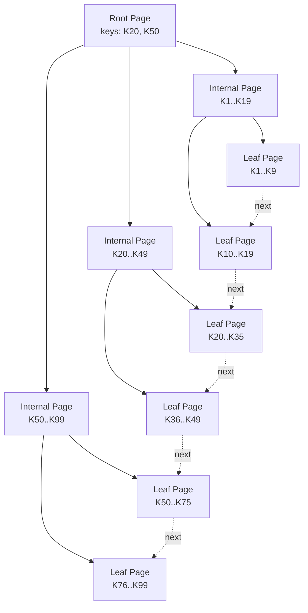

# Part 022 — B-Tree and Index Internals

> Goal: setelah bagian ini, kamu bisa mendesain index dari model mental storage engine, bukan dari kebiasaan “tambahkan index ke semua kolom filter.” Kita akan membahas B-Tree/B+Tree, page traversal, range scan, composite key order, covering index, partial index, expression index, uniqueness, write amplification, dan failure mode index di sistem produksi.

Index adalah salah satu alat paling kuat dalam database.

Index juga salah satu sumber masalah paling mahal.

Index yang tepat dapat mengubah query dari scan jutaan row menjadi lookup beberapa page. Index yang salah dapat memperlambat setiap write, memperbesar WAL, memperbesar backup, memperburuk cache, dan menipu engineer karena terlihat “performance-oriented” padahal tidak dipakai.

Bagian ini tidak hanya mengajarkan syntax `CREATE INDEX`.

Syntax mudah.

Yang sulit adalah menjawab:

- index mana yang benar-benar dibutuhkan,
- urutan kolom mana yang tepat,
- kapan composite index lebih baik daripada beberapa single-column index,
- kapan index tidak akan dipakai,
- kenapa index scan kadang lebih lambat dari sequential scan,
- bagaimana index memengaruhi write path,
- bagaimana index bloat terjadi,
- bagaimana index mendukung constraint dan correctness,
- bagaimana index design mengikuti workload.

---

## 1. Mental Model: Index Adalah Struktur Akses, Bukan Dekorasi Kolom

Bad mental model:

```text
A query filters by column X.
Therefore create index on X.
```

Better mental model:

```text
A query needs to find rows with a certain access pattern.
An index is a sorted/searchable physical structure that can reduce pages touched for that pattern.
```

An index is not attached to a column in isolation. It serves a query shape.

Query shape includes:

- equality predicates,
- range predicates,
- join predicates,
- sort order,
- grouping,
- selected columns,
- LIMIT/OFFSET behavior,
- tenant/security boundary,
- data distribution,
- expected selectivity,
- update frequency,
- concurrency level.

Example query:

```sql
SELECT id, case_no, priority, due_at
FROM cases
WHERE tenant_id = $1
  AND status = 'OPEN'
  AND assigned_user_id = $2
ORDER BY due_at ASC
LIMIT 50;
```

Possible useful index:

```sql
CREATE INDEX idx_cases_queue_by_assignee
ON cases (tenant_id, assigned_user_id, status, due_at ASC)
INCLUDE (case_no, priority);
```

This index is not “on tenant_id” or “on status.” It is on the queue access pattern.

---

## 2. Why B-Tree Became the Default Workhorse

Most relational databases use B-Tree/B+Tree-style indexes as the default general-purpose index.

Why?

Because B-Tree-like structures are good at:

- equality lookup,
- range scan,
- ordered traversal,
- prefix matching for composite keys,
- min/max lookup,
- uniqueness enforcement,
- maintaining sorted data while supporting inserts/deletes,
- keeping tree height small even for large datasets.

A B-Tree index is not a binary tree.

A binary tree node usually has up to 2 children.

A B-Tree page can have many keys and many child pointers. This high fanout keeps the tree shallow.

For millions or billions of rows, the tree height may still be small enough that lookup touches only a few index pages plus heap pages.

Simplified B+Tree shape:



In many B+Tree designs:

- root/internal pages guide search,
- leaf pages contain key entries,
- leaf pages may be linked for range scans,
- entries point to heap rows or contain row data depending on engine,
- upper tree levels often stay cached.

---

## 3. What an Index Entry Contains

An index entry usually contains:

- indexed key value(s),
- pointer/reference to row or primary key,
- optional included columns,
- metadata needed by engine.

PostgreSQL-style mental model:

```text
Index entry:
  key = (tenant_id, status, created_at)
  tuple pointer = heap TID/page+offset
```

InnoDB-style mental model for secondary indexes:

```text
Secondary index entry:
  secondary key = (status, created_at)
  primary key value = clustered row reference
```

Engine differences matter.

In a heap table design, a secondary index points to heap tuple location. In clustered storage, secondary index may point to primary key. This changes lookup cost.

Architectural lesson:

> An index can reduce search work, but it may still require fetching base rows unless the query can be satisfied from index alone.

---

## 4. Equality Lookup

Query:

```sql
SELECT *
FROM cases
WHERE id = $1;
```

With primary key index:

```text
root page -> internal page -> leaf page -> heap row
```

Cost roughly includes:

- index tree traversal,
- heap row access,
- visibility check,
- output serialization.

If upper index levels are cached, lookup can be very fast.

But equality lookup is not always one page.

If the query returns many rows:

```sql
SELECT *
FROM cases
WHERE status = 'OPEN';
```

And `OPEN` is 70% of table, then index on `status` may be unhelpful. The database may prefer sequential scan because using index would require many heap visits.

Selectivity matters.

```text
High selectivity: predicate filters to small fraction of rows.
Low selectivity: predicate matches large fraction of rows.
```

Good index candidates usually have high selectivity in their query context.

Important phrase: **in their query context**.

`status` alone may be low-selectivity globally. But `(tenant_id, status, assigned_user_id, due_at)` may be highly useful for a queue query.

---

## 5. Range Scan

B-Tree indexes are excellent for range queries.

```sql
SELECT id, case_no, created_at
FROM cases
WHERE tenant_id = $1
  AND created_at >= timestamp '2026-01-01'
  AND created_at < timestamp '2026-02-01'
ORDER BY created_at ASC;
```

Useful index:

```sql
CREATE INDEX idx_cases_tenant_created
ON cases (tenant_id, created_at ASC);
```

Access pattern:

1. traverse to first key `(tenant_id, 2026-01-01)`,
2. scan leaf entries forward until end bound,
3. fetch matching rows or return from index if possible.

Why order matters:

The index is sorted lexicographically by columns.

For `(tenant_id, created_at)`:

```text
tenant A, 2026-01-01
tenant A, 2026-01-02
...
tenant B, 2026-01-01
tenant B, 2026-01-02
```

This supports tenant-scoped time range.

But index `(created_at, tenant_id)` sorts differently:

```text
2026-01-01, tenant A
2026-01-01, tenant B
2026-01-02, tenant A
2026-01-02, tenant B
```

That may be better for global time scans, but worse for one tenant's case list.

Index column order encodes access locality.

---

## 6. Composite Index: The Left-to-Right Rule

A composite B-Tree index is sorted by the first column, then second, then third, and so on.

Example:

```sql
CREATE INDEX idx_cases_tenant_status_created
ON cases (tenant_id, status, created_at DESC);
```

Good for:

```sql
WHERE tenant_id = $1
  AND status = 'OPEN'
ORDER BY created_at DESC
```

Also useful for:

```sql
WHERE tenant_id = $1
```

Maybe useful for:

```sql
WHERE tenant_id = $1
  AND status = 'OPEN'
```

Usually not useful as a direct seek for:

```sql
WHERE status = 'OPEN'
```

Because `status` is not the leading column.

Mental model:

```text
Index sorted like phone book:
  last_name, first_name, birth_date

Easy:
  find all Smiths
  find Smith, John
  find Smith, John, birth_date range

Hard:
  find all Johns regardless of last_name
```

This is why composite index design starts from query predicates in order.

Typical ordering heuristic:

1. equality columns that define scope/boundary,
2. additional equality columns,
3. range column,
4. sort column if compatible,
5. included columns for covering when useful.

But this is a heuristic, not law. Data distribution, selectivity, sorting, join order, and planner behavior matter.

---

## 7. Equality Before Range

Consider:

```sql
WHERE tenant_id = $1
  AND status = 'OPEN'
  AND created_at >= $2
ORDER BY created_at DESC
```

Good index:

```sql
CREATE INDEX idx_cases_tenant_status_created
ON cases (tenant_id, status, created_at DESC);
```

Why?

- `tenant_id` narrows tenant scope,
- `status` narrows workflow state,
- `created_at` supports range and ordering.

If index were:

```sql
CREATE INDEX idx_cases_created_tenant_status
ON cases (created_at DESC, tenant_id, status);
```

The time range comes first. This may be useful for global recent cases, but less effective for tenant-specific open cases because entries for all tenants/statuses are interleaved by time.

Once a range condition is used on a B-Tree key, later columns are often less useful for narrowing the index scan, though they may still help filtering, ordering, or covering depending on engine.

Mental model:

```text
Equalities create a narrow starting prefix.
Range scans walk within that prefix.
Columns after the range cannot always reduce the walked range.
```

---

## 8. ORDER BY and Index Direction

B-Tree indexes are sorted, so they can satisfy ordering.

Query:

```sql
SELECT id, case_no, created_at
FROM cases
WHERE tenant_id = $1
ORDER BY created_at DESC
LIMIT 50;
```

Useful index:

```sql
CREATE INDEX idx_cases_tenant_created_desc
ON cases (tenant_id, created_at DESC);
```

This can avoid a sort.

The index allows:

1. seek tenant prefix,
2. walk entries in `created_at DESC` order,
3. stop after 50 rows.

Without order-compatible index, the database may need:

- gather all matching rows,
- sort them,
- return top 50.

For pagination, this matters.

Bad offset pagination:

```sql
SELECT id, case_no, created_at
FROM cases
WHERE tenant_id = $1
ORDER BY created_at DESC
OFFSET 100000
LIMIT 50;
```

The database still has to walk/skip many entries.

Better keyset pagination:

```sql
SELECT id, case_no, created_at
FROM cases
WHERE tenant_id = $1
  AND (created_at, id) < ($last_created_at, $last_id)
ORDER BY created_at DESC, id DESC
LIMIT 50;
```

Index:

```sql
CREATE INDEX idx_cases_tenant_created_id_desc
ON cases (tenant_id, created_at DESC, id DESC);
```

Now pagination follows the index rather than counting skipped rows.

---

## 9. Covering Index and Index-Only Scan

A covering index contains all data needed by a query, so the database may avoid fetching the base table row.

Example:

```sql
SELECT id, case_no, priority, due_at
FROM cases
WHERE tenant_id = $1
  AND status = 'OPEN'
ORDER BY due_at ASC
LIMIT 50;
```

Index:

```sql
CREATE INDEX idx_cases_open_queue
ON cases (tenant_id, status, due_at ASC)
INCLUDE (case_no, priority);
```

Potential benefit:

- index traversal finds matching rows,
- selected columns are available in index,
- heap access may be avoided if visibility rules allow.

Caveat:

Index-only scan is engine-specific and condition-specific. In MVCC systems, the database may need heap visibility checks unless visibility metadata proves the row is visible.

Do not assume `INCLUDE` always means no heap access.

Design tradeoff:

- covering index speeds read path,
- but increases index size,
- increases write cost,
- may reduce cache efficiency,
- may duplicate sensitive data into index pages.

Use covering indexes for high-value hot queries, not everywhere.

---

## 10. Unique Index: Index as Correctness Mechanism

Indexes are not only for speed.

Unique indexes enforce invariants.

Examples:

```sql
ALTER TABLE cases
ADD CONSTRAINT uq_cases_tenant_case_no
UNIQUE (tenant_id, case_no);
```

```sql
CREATE UNIQUE INDEX uq_active_assignment_one_owner
ON case_assignments (case_id)
WHERE revoked_at IS NULL;
```

The second example enforces:

```text
A case can have only one active assignment.
```

This is stronger than application-only checks because it is race-safe under concurrent writes.

Bad application-only pattern:

```text
1. SELECT active assignment
2. if none, INSERT assignment
```

Two concurrent transactions can both see none and both insert.

Database unique constraint prevents illegal state.

Architecture principle:

> If an invariant can be safely expressed as a database constraint or unique index, prefer the database as the final guardrail.

Application validation improves user experience. Database constraint protects truth.

---

## 11. Partial Index

A partial index indexes only rows matching a predicate.

Example:

```sql
CREATE INDEX idx_cases_open_queue
ON cases (tenant_id, priority, created_at DESC)
WHERE status = 'OPEN';
```

Useful when:

- queries repeatedly target a subset,
- subset is much smaller than table,
- predicate is stable and explicit,
- write overhead should apply only to relevant rows,
- soft-delete or active-state filtering is common.

Common patterns:

```sql
CREATE INDEX idx_users_active_email
ON users (tenant_id, lower(email))
WHERE deleted_at IS NULL;
```

```sql
CREATE INDEX idx_tasks_due_pending
ON workflow_tasks (tenant_id, due_at)
WHERE completed_at IS NULL;
```

```sql
CREATE UNIQUE INDEX uq_active_case_assignment
ON case_assignments (case_id)
WHERE revoked_at IS NULL;
```

Partial index is excellent for lifecycle-aware design.

But beware:

- query predicate must match/ imply index predicate sufficiently for planner,
- parameterized queries can complicate matching in some engines,
- changing predicate semantics requires rebuild/migration,
- hidden assumptions can cause stale index strategy.

Partial index should encode stable business state, not arbitrary temporary filters.

---

## 12. Expression Index

Expression index stores computed expression values.

Example:

```sql
CREATE INDEX idx_users_lower_email
ON users (lower(email));
```

Supports:

```sql
SELECT *
FROM users
WHERE lower(email) = lower($1);
```

Without expression index, function-wrapped column can prevent normal index usage:

```sql
WHERE lower(email) = 'a@example.com'
```

Expression index is useful for:

- case-insensitive lookup,
- extracted JSON field,
- normalized phone number,
- date bucket,
- computed search key.

Example JSON extraction:

```sql
CREATE INDEX idx_case_payload_risk_score
ON case_intake_payloads (((payload ->> 'riskScore')::int));
```

But this is a warning sign too.

If `riskScore` is core to routing, SLA, security, or reporting, it may deserve a first-class column with constraints.

Expression index can improve access, but it does not replace good logical modelling.

---

## 13. Foreign Keys and Indexes

A foreign key references parent rows. The parent side usually needs an indexed unique/primary key.

But child-side index is also often important.

Example:

```sql
CREATE TABLE case_tasks (
    id uuid PRIMARY KEY,
    case_id uuid NOT NULL REFERENCES cases(id),
    status text NOT NULL,
    created_at timestamptz NOT NULL
);
```

Queries likely need:

```sql
SELECT *
FROM case_tasks
WHERE case_id = $1
ORDER BY created_at DESC;
```

Index:

```sql
CREATE INDEX idx_case_tasks_case_created
ON case_tasks (case_id, created_at DESC);
```

Child-side FK index also helps when deleting/updating parent rows because the database needs to check referencing child rows.

If parent delete/update checks scan the entire child table, operational pain follows.

Rule:

> Most foreign key columns on child tables should have supporting indexes unless there is a deliberate reason not to.

But do not blindly create `(fk_column)` if actual access pattern needs `(fk_column, status, created_at)`.

Use the workload shape.

---

## 14. Low-Cardinality Columns: Index Alone May Not Help

Columns like `status`, `is_active`, `deleted_at IS NULL`, or `priority` may have low cardinality.

Index on only `status` can be poor if most rows have common values.

Bad:

```sql
CREATE INDEX idx_cases_status
ON cases (status);
```

If 80% of cases are `OPEN`, this index may not help much for:

```sql
WHERE status = 'OPEN'
```

Better query-context index:

```sql
CREATE INDEX idx_cases_tenant_status_created
ON cases (tenant_id, status, created_at DESC);
```

or partial index:

```sql
CREATE INDEX idx_cases_open_by_tenant_due
ON cases (tenant_id, due_at)
WHERE status = 'OPEN';
```

Low cardinality does not mean “never index.” It means “do not index without a selective prefix or useful ordering/subset strategy.”

---

## 15. Index and NULL Semantics

NULL affects indexes and uniqueness.

SQL NULL means unknown/not applicable, not empty value.

In many SQL databases, unique constraints allow multiple NULLs because NULL is not equal to NULL. Some engines provide features to control NULL distinctness.

Design implication:

If business rule says:

```text
Only one active row where revoked_at is null.
```

Use partial unique index:

```sql
CREATE UNIQUE INDEX uq_case_one_active_assignment
ON case_assignments (case_id)
WHERE revoked_at IS NULL;
```

If rule says:

```text
External reference must be unique when present.
```

Use:

```sql
CREATE UNIQUE INDEX uq_cases_external_ref_present
ON cases (tenant_id, external_ref)
WHERE external_ref IS NOT NULL;
```

Do not rely on vague application behavior around NULL uniqueness.

Make the invariant explicit.

---

## 16. Page Split and Write Amplification

B-Tree indexes stay sorted.

When inserting a key into a full leaf page, the page may split.

Simplified:

```text
Before:
  leaf page: [10, 20, 30, 40, 50] full

Insert 35:
  split into:
    [10, 20, 30]
    [35, 40, 50]
  update parent page
```

This creates extra work:

- allocate page,
- move entries,
- update parent,
- generate WAL,
- possibly cascade split upward,
- increase index size,
- affect cache.

Random inserts can cause splits across many pages.

Append-like inserts tend to hit rightmost pages, which can create a different hotspot depending on concurrency and engine.

Tradeoff examples:

| Key Pattern | Benefit | Risk |
|---|---|---|
| Random UUID | good distribution, hard to guess | random index writes, locality loss |
| Sequence bigint | compact, locality-friendly | hotspot/right-edge pressure, guessable public id |
| Time-sortable ID | locality plus distribution | clock/order assumptions, implementation complexity |
| Composite tenant id + local sequence | tenant locality | tenant hotspot, sequence management |

Do not choose ID strategy from ideology. Choose from workload, security, distribution, storage engine, and operational needs.

---

## 17. Index Bloat

Index bloat occurs when index pages contain dead/obsolete entries or become inefficiently sparse.

Causes:

- updates to indexed columns,
- deletes,
- page splits,
- long-running transactions delaying cleanup,
- high churn tables,
- random key distribution,
- insufficient maintenance.

Symptoms:

- index size grows faster than table,
- query becomes slower over time,
- cache hit ratio drops,
- write latency increases,
- vacuum/reindex needed more often.

Index bloat is not solved by adding more indexes.

It is usually solved by:

- reducing unnecessary indexes,
- avoiding indexing high-churn columns unless needed,
- using partial indexes for active subset,
- controlling long transactions,
- periodic reindex where appropriate,
- partitioning high-churn history,
- schema redesign for mutable state.

---

## 18. Multiple Single-Column Indexes vs One Composite Index

Suppose query:

```sql
WHERE tenant_id = $1
  AND status = 'OPEN'
  AND assigned_user_id = $2
ORDER BY due_at
LIMIT 50
```

Single-column indexes:

```sql
CREATE INDEX idx_cases_tenant ON cases (tenant_id);
CREATE INDEX idx_cases_status ON cases (status);
CREATE INDEX idx_cases_assignee ON cases (assigned_user_id);
CREATE INDEX idx_cases_due ON cases (due_at);
```

The database might combine some indexes in certain engines using bitmap operations. But this often does not satisfy ordering and may still touch many heap pages.

Composite workload index:

```sql
CREATE INDEX idx_cases_assignee_queue
ON cases (tenant_id, assigned_user_id, status, due_at);
```

This directly encodes the access path.

Rule:

> Single-column indexes are not a substitute for a composite index that matches a high-value query shape.

But composite indexes are not free either.

Avoid creating every permutation:

```text
(a,b,c)
(a,c,b)
(b,a,c)
(c,b,a)
```

That is usually a sign you have not identified the primary workload or need a read model/search system.

---

## 19. Redundant Indexes

An index can make another index redundant.

Example:

```sql
CREATE INDEX idx_cases_tenant ON cases (tenant_id);
CREATE INDEX idx_cases_tenant_status ON cases (tenant_id, status);
```

The second index can often serve queries filtering only by `tenant_id`, because `tenant_id` is the leading prefix.

But not always. The smaller single-column index may be cheaper in some workloads.

Review with evidence:

- query plans,
- index usage stats,
- index sizes,
- write frequency,
- cache pressure,
- maintenance cost.

Redundant index risk:

- every write pays twice,
- storage doubles for similar access,
- planner may choose suboptimal path,
- migration/reindex cost increases.

Index hygiene is part of architecture governance.

---

## 20. Sargability: Can the Index Be Searched?

A predicate is sargable when it can use an index search efficiently.

Bad:

```sql
WHERE date(created_at) = date '2026-07-04'
```

This wraps the column in a function.

Better:

```sql
WHERE created_at >= timestamp '2026-07-04 00:00:00+07'
  AND created_at <  timestamp '2026-07-05 00:00:00+07'
```

Bad:

```sql
WHERE lower(email) = 'a@example.com'
```

Better options:

- store normalized email,
- use expression index,
- use case-insensitive type/collation if appropriate.

Bad:

```sql
WHERE description LIKE '%fraud%'
```

Leading wildcard usually cannot use normal B-Tree index effectively. Use full-text/search index where appropriate.

Bad:

```sql
WHERE CAST(external_id AS text) = $1
```

Better:

- use correct parameter type,
- avoid casting indexed column,
- normalize data type.

Sargability is a bridge between application query writing and database index design.

---

## 21. Index Types Beyond B-Tree

B-Tree is default, but not universal.

Common index families:

| Index Type | Good For | Notes |
|---|---|---|
| B-Tree | equality, range, order, uniqueness | default general-purpose index |
| Hash | equality only | engine-specific usefulness |
| GIN | inverted membership, arrays, JSONB, full-text | good for containment/search-like queries |
| GiST | geometric/range/custom strategies | supports many operator classes |
| SP-GiST | partitioned search structures | useful for certain spatial/text patterns |
| BRIN | huge naturally ordered tables | summarizes page ranges, tiny indexes |
| Inverted index | full-text/search engines | term-to-document mapping |
| Vector index | approximate nearest neighbor | similarity search, recall/latency tradeoff |

This series will cover search/vector-aware design later. The architect-level lesson here:

> Choose index type from operator and data access pattern, not from habit.

Example:

- B-Tree for `created_at >= ... ORDER BY created_at`,
- GIN for JSON containment or full-text vector depending on engine,
- BRIN for append-only time-series table where physical order follows time,
- search engine inverted index for rich text relevance,
- vector index for embedding similarity.

---

## 22. BRIN-Style Thinking: Tiny Index for Huge Ordered Data

BRIN-like indexes summarize ranges of pages rather than store every key.

Useful when:

- table is very large,
- data is naturally ordered by a column,
- query filters broad ranges,
- approximate page pruning is enough,
- index must stay small.

Example:

```sql
CREATE INDEX idx_case_events_event_time_brin
ON case_events USING brin (event_time);
```

If `case_events` is append-only by event time, this can help time-range scans with much lower index size than B-Tree.

Not good when:

- data is randomly distributed by indexed column,
- query needs precise small lookup,
- physical order does not correlate with value.

This is physical locality again.

Index effectiveness depends on physical layout.

---

## 23. Queue Query Index Design

Workflow/case systems often have queue queries:

```sql
SELECT id, case_no, priority, due_at
FROM cases
WHERE tenant_id = $1
  AND status = 'OPEN'
  AND assigned_user_id = $2
ORDER BY priority DESC, due_at ASC
LIMIT 50;
```

Potential index:

```sql
CREATE INDEX idx_cases_user_open_queue
ON cases (
    tenant_id,
    assigned_user_id,
    status,
    priority DESC,
    due_at ASC,
    id
)
INCLUDE (case_no);
```

Why:

- tenant boundary first,
- assignee narrows queue,
- status narrows active state,
- priority/due supports ordering,
- id makes order deterministic,
- case_no included for list display.

But if most queries are team queues, not user queues:

```sql
WHERE tenant_id = $1
  AND queue_id = $2
  AND status = 'OPEN'
ORDER BY due_at ASC
```

Then user-specific index may be wrong. Use workload reality:

```sql
CREATE INDEX idx_cases_queue_open_due
ON cases (tenant_id, queue_id, status, due_at ASC, id)
INCLUDE (case_no, priority);
```

Index design is not reusable decoration. It is a commitment to a query path.

---

## 24. Soft Delete Index Design

Soft delete often creates accidental performance bugs.

Naive table:

```sql
CREATE TABLE users (
    id uuid PRIMARY KEY,
    tenant_id uuid NOT NULL,
    email text NOT NULL,
    deleted_at timestamptz
);
```

Naive unique index:

```sql
CREATE UNIQUE INDEX uq_users_tenant_email
ON users (tenant_id, lower(email));
```

Problem:

Deleted users still block email reuse.

Better if business allows reuse after delete:

```sql
CREATE UNIQUE INDEX uq_users_active_email
ON users (tenant_id, lower(email))
WHERE deleted_at IS NULL;
```

Query index:

```sql
CREATE INDEX idx_users_active_by_tenant
ON users (tenant_id, created_at DESC)
WHERE deleted_at IS NULL;
```

This keeps active-user index smaller.

But if deleted users must remain visible to admin search, design separate admin query path.

Do not make every operational query carry historical dead business rows by accident.

---

## 25. Multi-Tenant Index Design

In pooled multi-tenant tables, most indexes should include tenant scope when queries are tenant-scoped.

Bad:

```sql
CREATE INDEX idx_cases_status_created
ON cases (status, created_at DESC);
```

For tenant query:

```sql
WHERE tenant_id = $1
  AND status = 'OPEN'
ORDER BY created_at DESC
```

Better:

```sql
CREATE INDEX idx_cases_tenant_status_created
ON cases (tenant_id, status, created_at DESC);
```

Why tenant first?

- supports tenant isolation query shape,
- narrows scan to tenant-specific prefix,
- avoids interleaving all tenants by status,
- aligns with RLS/security predicates,
- improves locality for tenant views.

But if workload is global operations dashboard:

```sql
WHERE status = 'OPEN'
ORDER BY created_at DESC
```

A global index may be justified too.

Multi-tenant index design must consider:

- tenant-scoped product queries,
- operator/global queries,
- noisy tenant skew,
- tenant migration,
- tenant-specific archive/purge,
- RLS predicate shape,
- index size per tenant,
- dedicated tenant partitions/cells.

---

## 26. Indexing JSON Fields

JSON indexing requires caution.

Example query:

```sql
SELECT case_id
FROM case_intake_payloads
WHERE payload ->> 'riskBand' = 'HIGH';
```

Possible expression index:

```sql
CREATE INDEX idx_case_payload_risk_band
ON case_intake_payloads ((payload ->> 'riskBand'));
```

But ask:

```text
Is riskBand a core routing/reporting/security field?
Does it have allowed values?
Does it change over time?
Does it need audit/correction?
Is it used in joins or constraints?
```

If yes, prefer relational column:

```sql
ALTER TABLE cases
ADD COLUMN risk_band text;

ALTER TABLE cases
ADD CONSTRAINT chk_cases_risk_band
CHECK (risk_band IN ('LOW', 'MEDIUM', 'HIGH'));

CREATE INDEX idx_cases_tenant_risk_band
ON cases (tenant_id, risk_band, created_at DESC);
```

JSON index is a useful tool for flexible payloads. It should not become a hiding place for core domain fields.

---

## 27. Index Design Workflow

Use this process.

### Step 1: Capture query shape

Write the exact query or normalized query pattern.

```sql
SELECT id, case_no, priority, due_at
FROM cases
WHERE tenant_id = $1
  AND status = 'OPEN'
  AND queue_id = $2
ORDER BY due_at ASC
LIMIT 100;
```

### Step 2: Classify predicates

| Predicate | Type |
|---|---|
| `tenant_id = $1` | equality/scope |
| `status = 'OPEN'` | equality/subset |
| `queue_id = $2` | equality/scope |
| `ORDER BY due_at ASC` | order |
| `LIMIT 100` | stop early |

### Step 3: Estimate cardinality

Ask:

- rows per tenant,
- open rows per tenant,
- rows per queue,
- due date distribution,
- hot tenant skew,
- percentage returned.

### Step 4: Propose index

```sql
CREATE INDEX idx_cases_queue_due
ON cases (tenant_id, queue_id, status, due_at ASC, id)
INCLUDE (case_no, priority);
```

### Step 5: Validate with plan

Use `EXPLAIN` / execution plan tooling.

Look for:

- index used,
- rows estimated vs actual,
- heap fetches,
- sort avoided or not,
- buffers/pages touched,
- timing under realistic data volume.

### Step 6: Measure write cost

Ask:

- how often rows are inserted/updated/deleted,
- whether indexed columns change,
- whether index increases WAL significantly,
- whether index duplicates another index,
- whether index has maintenance cost.

### Step 7: Add governance

Record:

- which query owns the index,
- expected cardinality,
- reason for column order,
- expected lifetime,
- monitoring signal,
- drop condition.

This sounds heavy, but for production-critical databases it prevents index sprawl.

---

## 28. Reading Basic Execution Signal

Part 025 will go deep into execution plans. For index design, start with these signals:

| Signal | Meaning |
|---|---|
| Sequential scan | planner thinks scanning table is cheaper or no useful index exists |
| Index scan | uses index, then fetches table rows |
| Index-only scan | index satisfies query, maybe avoids heap |
| Bitmap index/heap scan | combines index results, then visits heap pages in batches |
| Sort node | index did not satisfy order, or planner chose sort |
| Rows removed by filter | index narrowed insufficiently |
| Estimated vs actual rows | statistics/cardinality estimate quality |
| Buffers hit/read | page/cache behavior |

If query uses index but is still slow, possible reasons:

- index not selective enough,
- many heap fetches,
- random I/O,
- bloat,
- stale statistics,
- sort still needed,
- output too large,
- lock waits,
- CPU-heavy filters,
- visibility checks,
- wrong join order.

Index usage alone does not prove index quality.

---

## 29. Common Index Anti-Patterns

### 29.1 Index Every Foreign Key Without Query Context

FK indexes are often important, but blindly indexing every FK as single-column may create redundant write cost.

Prefer query-shaped FK indexes:

```sql
-- Instead of only:
CREATE INDEX idx_tasks_case_id ON tasks (case_id);

-- Maybe actual workload needs:
CREATE INDEX idx_tasks_case_status_created
ON tasks (case_id, status, created_at DESC);
```

### 29.2 Index Every Column Used in WHERE

This creates index sprawl.

A query with five filters does not need five single-column indexes. It may need one composite index, a partial index, a search projection, or no index.

### 29.3 Ignoring ORDER BY

An index that filters but does not order may still require expensive sort.

### 29.4 Ignoring LIMIT

Top-N queries benefit greatly from order-compatible indexes.

### 29.5 Function-Wrapped Columns

```sql
WHERE date(created_at) = $1
```

This can defeat normal B-Tree index usage.

### 29.6 Low-Cardinality Standalone Index

```sql
CREATE INDEX idx_cases_status ON cases(status);
```

Often weak unless status is used with scope/order/subset strategy.

### 29.7 Redundant Prefix Indexes

Many overlapping indexes increase write cost.

### 29.8 Indexing Frequently Updated Columns Without Measuring

Status, updated_at, retry_count, lock_owner, heartbeat fields can churn.

### 29.9 Using B-Tree for Full-Text Search

`LIKE '%term%'` is not a normal B-Tree workload.

### 29.10 Forgetting Index Lifecycle

Indexes should be reviewed, measured, and dropped when unused.

---

## 30. Case Study: Regulatory Case Queue

### Scenario

A regulator case management system has these needs:

1. investigator sees assigned open cases sorted by due date,
2. supervisor sees team queue sorted by priority then due date,
3. admin searches by case number,
4. SLA worker finds cases due in next hour,
5. reporting counts cases by status monthly,
6. audit reconstructs case history.

### Base table

```sql
CREATE TABLE cases (
    id uuid PRIMARY KEY,
    tenant_id uuid NOT NULL,
    case_no text NOT NULL,
    status text NOT NULL,
    priority text NOT NULL,
    queue_id uuid,
    assigned_user_id uuid,
    due_at timestamptz,
    created_at timestamptz NOT NULL,
    updated_at timestamptz NOT NULL,
    closed_at timestamptz,
    UNIQUE (tenant_id, case_no)
);
```

### Investigator queue

```sql
CREATE INDEX idx_cases_investigator_queue
ON cases (tenant_id, assigned_user_id, status, due_at ASC, id)
INCLUDE (case_no, priority)
WHERE closed_at IS NULL;
```

### Supervisor queue

```sql
CREATE INDEX idx_cases_team_queue
ON cases (tenant_id, queue_id, status, priority DESC, due_at ASC, id)
INCLUDE (case_no, assigned_user_id)
WHERE closed_at IS NULL;
```

### Case number lookup

The unique constraint already creates/uses an index:

```sql
UNIQUE (tenant_id, case_no)
```

No extra index needed unless lookup pattern differs.

### SLA worker

```sql
CREATE INDEX idx_cases_sla_due
ON cases (tenant_id, due_at ASC, id)
WHERE status IN ('OPEN', 'UNDER_REVIEW')
  AND closed_at IS NULL;
```

Caution: partial index predicates with `IN` and planner matching should be validated with actual queries and engine behavior.

### Reporting

Do not automatically solve monthly reporting with OLTP indexes.

Options:

- aggregate table by day/month/status,
- materialized view,
- data warehouse,
- partitioned history table,
- replica for reporting.

### Audit history

Audit is usually append-heavy:

```sql
CREATE INDEX idx_case_events_case_time
ON case_events (case_id, event_time ASC, id);

CREATE INDEX idx_case_events_time
ON case_events (event_time);
```

For very large append-only `case_events`, consider partitioning by time and BRIN-like index on event time if supported and appropriate.

---

## 31. Index Governance Record

For every non-trivial index, document:

```md
## Index: idx_cases_team_queue

Table: cases
Purpose: supervisor open team queue
Owner query:
  SELECT id, case_no, priority, due_at, assigned_user_id
  FROM cases
  WHERE tenant_id = $1
    AND queue_id = $2
    AND status = 'OPEN'
    AND closed_at IS NULL
  ORDER BY priority DESC, due_at ASC, id ASC
  LIMIT 100;

Column order rationale:
  tenant_id: tenant boundary
  queue_id: queue scope
  status: active workflow subset
  priority, due_at, id: ordering and deterministic pagination

Predicate rationale:
  closed_at IS NULL keeps active queue index smaller

Write cost:
  touched on assignment, status, priority, due date, close

Validation:
  EXPLAIN ANALYZE on production-like data
  monitor idx_scan and index size

Drop condition:
  remove if queue read model replaces direct cases query
```

This level of discipline separates production architecture from ad-hoc tuning.

---

## 32. Index Review Checklist

### Query fit

- Which exact query shape owns this index?
- Does the index support filter, join, order, or uniqueness?
- Does it match equality/range/order pattern?
- Does it help with LIMIT/top-N?
- Does it support tenant/security predicate?

### Selectivity and cardinality

- How selective is the leading column?
- How many rows per prefix?
- Is there skew by tenant/status/queue?
- Are statistics sufficient?

### Column order

- Are equality scope columns first?
- Is range column placed deliberately?
- Is ORDER BY satisfied?
- Is the order deterministic for pagination?

### Coverage

- Does query need heap access?
- Are included columns worth extra size?
- Are sensitive columns duplicated into index?

### Write cost

- How frequently are indexed columns updated?
- How many indexes does each write touch?
- Does this index create WAL/replication pressure?
- Will it bloat quickly?

### Redundancy

- Is this index covered by an existing prefix index?
- Can an existing index be extended instead?
- Are there unused similar indexes?

### Lifecycle

- Who owns this index?
- What metric proves it is useful?
- What is the reindex/drop plan?
- Does migration create it concurrently/online where needed?

---

## 33. Key Takeaways

- Indexes serve query shapes, not isolated columns.
- B-Tree/B+Tree indexes are sorted access structures optimized for equality, range, order, and uniqueness.
- Composite index column order is a physical design decision.
- Equality predicates usually narrow the prefix; range/order walks within it.
- Covering indexes can avoid heap access, but they increase size and write cost.
- Unique and partial unique indexes are correctness tools, not only performance tools.
- Partial indexes are powerful for active-state and soft-delete workloads.
- Function-wrapped predicates, low-cardinality standalone indexes, and leading wildcards often defeat naive index expectations.
- Every index is read optimization plus write amplification.
- Index governance should record purpose, owner query, rationale, validation, and drop condition.

---

## 34. References

- PostgreSQL Documentation — Indexes
- PostgreSQL Documentation — B-Tree Indexes
- PostgreSQL Documentation — Index-Only Scans and Covering Indexes
- PostgreSQL Documentation — Partial Indexes
- PostgreSQL Documentation — Expression Indexes
- PostgreSQL Documentation — Multicolumn Indexes
- PostgreSQL Documentation — BRIN Indexes
- MySQL 8.4 Reference Manual — InnoDB Indexes and Clustered Indexes
- MongoDB Manual — Indexes and ESR guideline for compound indexes
- Designing Data-Intensive Applications — storage and indexing mental models
- Build Your Own Database From Scratch — B-Tree, page, and persistence foundations
