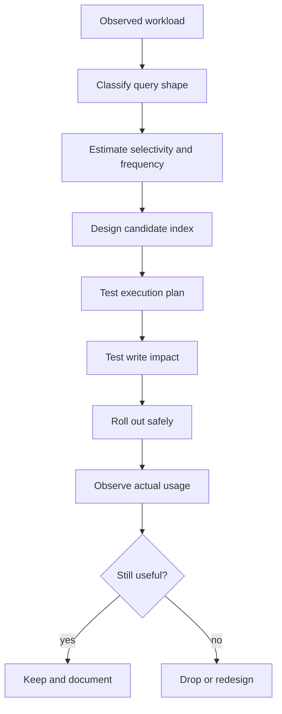
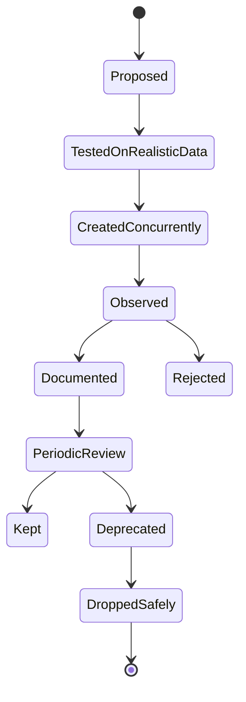

# Part 023 — Index Design for Production Workloads

> Index design is not the act of adding indexes. Index design is the act of choosing which access paths the system is allowed to optimize, which writes the system is allowed to make more expensive, and which correctness guarantees deserve physical enforcement.

In Part 022, we looked inside the B-Tree. In this part, we move from internal structure to production architecture: how to decide **which indexes should exist**, **which indexes should not exist**, and **how to evolve indexes safely under real traffic**.

A senior engineer should be able to answer these questions without guessing:

- Which queries are allowed to be fast?
- Which writes are allowed to become slower because of that speed?
- Which indexes enforce correctness rather than only performance?
- Which indexes are redundant?
- Which indexes are dangerous because they optimize one path while damaging the system globally?
- Which query shapes are unindexable unless the application changes?
- Which index can survive tenant skew, data growth, and query evolution?

The purpose of this part is to build that judgement.

---

## 1. The Real Mental Model

An index is a **physical access path**.

It is not a magic performance flag. It is a maintained data structure that duplicates selected information from a table so the database can avoid reading the entire table for some query shapes.

Every index has two sides:

| Side | Meaning |
|---|---|
| Read benefit | Faster lookup, range scan, ordering, uniqueness check, join lookup, or index-only read |
| Write cost | Extra insert/update/delete work, more WAL, more page splits, more vacuum/maintenance, more storage, more cache pressure |

A production-grade index is justified only when the read benefit exceeds the total lifetime cost.



The trap is designing indexes from table structure. That gives you indexes like:

```sql
CREATE INDEX idx_orders_customer_id ON orders(customer_id);
CREATE INDEX idx_orders_status ON orders(status);
CREATE INDEX idx_orders_created_at ON orders(created_at);
CREATE INDEX idx_orders_updated_at ON orders(updated_at);
```

This looks reasonable, but it says nothing about actual query shape:

- Are queries filtering by customer and status together?
- Are they sorting by creation time?
- Are they only reading active rows?
- Are they paginating?
- Are they joining from `customers` into `orders` or from `orders` into `customers`?
- Are they dominated by one huge tenant?
- Are they latency-sensitive or background reports?

Index design starts from **workload**, not from columns.

---

## 2. Indexes as Workload Contracts

A table can have many possible access paths. You cannot optimize all of them. Index design is therefore a contract about which access paths are first-class.

Example workload for `case_file`:

| Use Case | Query Shape | Frequency | Latency Target | Index Candidate |
|---|---|---:|---:|---|
| Case detail | `WHERE case_id = ?` | Very high | 20 ms | primary key |
| Officer queue | `WHERE tenant_id=? AND assignee_id=? AND state IN (...) ORDER BY due_at` | Very high | 100 ms | composite partial index |
| Case search by external reference | `WHERE tenant_id=? AND external_ref=?` | Medium | 100 ms | unique composite index |
| SLA sweep | `WHERE state IN (...) AND due_at < now()` | Medium | seconds | partial/range index |
| Monthly report | `WHERE created_at BETWEEN ... GROUP BY state` | Low | minutes | maybe no OLTP index; use reporting model |

The table is the same. The access paths are different. The index design should reflect the workload priorities.

A good index design document states:

```md
This index exists to support officer queue retrieval:

Query:
SELECT ...
FROM case_file
WHERE tenant_id = :tenant_id
  AND assignee_id = :assignee_id
  AND state IN ('ASSIGNED', 'IN_REVIEW')
ORDER BY due_at ASC, case_id ASC
LIMIT 50;

Index:
CREATE INDEX CONCURRENTLY idx_case_file_queue
ON case_file (tenant_id, assignee_id, due_at, case_id)
WHERE state IN ('ASSIGNED', 'IN_REVIEW');

Reason:
- tenant-scoped access
- officer-scoped queue
- due date ordering
- stable keyset pagination
- excludes terminal case states
```

That is architecture. The index has a reason, a query, a cost, and an owner.

---

## 3. Index Taxonomy by Purpose

Do not classify indexes only by implementation. Classify them by purpose.

| Purpose | Example | Design Question |
|---|---|---|
| Identity lookup | primary key | What uniquely identifies the row? |
| Business uniqueness | unique constraint/index | Which illegal duplicate must never exist? |
| Referential support | FK lookup index | Which parent-child operation must not scan? |
| Query filtering | `WHERE tenant_id=? AND state=?` | Is the predicate selective enough? |
| Range access | `created_at >= ? AND created_at < ?` | Can the index bound the scan? |
| Ordering | `ORDER BY due_at, id` | Can the index avoid sort? |
| Covering read | index includes selected columns | Can the query avoid table fetch? |
| Partial workload | active rows only | Can we shrink index scope? |
| Expression lookup | `lower(email)` | Is the expression stable and exactly matched? |
| Specialized search | GIN/GiST/BRIN | Is the access pattern non-B-Tree-friendly? |

The production mistake is adding many indexes with no declared purpose. Undocumented indexes become fear-based infrastructure: nobody knows whether they are safe to remove.

---

## 4. The Index Design Algorithm

Use this repeatable sequence.

### Step 1 — Identify the exact query family

A query family is not one SQL string. It is a stable access pattern.

Example:

```sql
SELECT case_id, reference_no, state, due_at
FROM case_file
WHERE tenant_id = :tenant_id
  AND assignee_id = :assignee_id
  AND state IN ('ASSIGNED', 'ESCALATED')
  AND due_at <= :max_due_at
ORDER BY due_at ASC, case_id ASC
LIMIT 50;
```

This query family means:

- tenant-scoped
- assignee-scoped
- active workload states
- due-date range
- ordered queue
- bounded result
- probably high frequency

### Step 2 — Separate equality, range, ordering, and projection

| Query Component | Columns |
|---|---|
| Equality | `tenant_id`, `assignee_id` |
| Small-list filter | `state IN (...)` |
| Range | `due_at <= :max_due_at` |
| Ordering | `due_at ASC, case_id ASC` |
| Projection | `case_id`, `reference_no`, `state`, `due_at` |

### Step 3 — Choose key column order

A common B-Tree heuristic:

```text
equality columns -> highly selective stable filters -> range/order columns -> tie-breaker
```

Candidate:

```sql
CREATE INDEX CONCURRENTLY idx_case_file_assignee_queue
ON case_file (tenant_id, assignee_id, due_at, case_id)
WHERE state IN ('ASSIGNED', 'ESCALATED');
```

Why not put `state` first?

Because if the index is partial on active states, `state` no longer needs to be a leading key column for this access pattern. The index contains only the states we care about.

### Step 4 — Validate the execution plan

Use realistic data volume. Toy data lies.

```sql
EXPLAIN (ANALYZE, BUFFERS)
SELECT case_id, reference_no, state, due_at
FROM case_file
WHERE tenant_id = 't-001'
  AND assignee_id = 'u-009'
  AND state IN ('ASSIGNED', 'ESCALATED')
  AND due_at <= now() + interval '7 days'
ORDER BY due_at ASC, case_id ASC
LIMIT 50;
```

You are looking for:

- index scan or bitmap index scan that matches the query shape
- estimated rows near actual rows
- no large sort if ordering should be index-supported
- small buffer footprint
- no accidental full table scan under realistic cardinality

### Step 5 — Measure write impact

Every additional index is paid on write.

Test:

- insert throughput
- update throughput for indexed columns
- delete throughput
- WAL volume
- autovacuum pressure
- index bloat over time
- lock behavior during index creation

### Step 6 — Document the index

At minimum:

```md
Index: idx_case_file_assignee_queue
Purpose: officer queue retrieval
Owner: case-management service
Primary query: queue-by-assignee
Expected selectivity: tenant + assignee + active states
Write impact: every case insert, assignee change, due date change, terminal-state transition
Removal condition: queue moved to materialized read model
```

---

## 5. Equality, Range, and Sort: The Core B-Tree Pattern

For a composite B-Tree index:

```sql
CREATE INDEX idx_x ON table_name (a, b, c, d);
```

The useful access path depends on the left-to-right structure.

| Query Shape | Usually Good? | Reason |
|---|---:|---|
| `WHERE a=?` | Yes | leftmost prefix |
| `WHERE a=? AND b=?` | Yes | leftmost prefix |
| `WHERE b=?` | Not ideal | missing leading column |
| `WHERE a=? AND c=?` | Partly | `a` narrows, `c` may be post-filtered |
| `WHERE a=? AND b>?` | Good | equality then range |
| `WHERE a>? AND b=?` | Limited | range on first column breaks precise navigation for later column |
| `WHERE a=? ORDER BY b,c` | Good | index order can support sort |
| `WHERE a=? ORDER BY c` | Not ideal | order skips `b` |

This is why index column order is not cosmetic. It is a physical query contract.

### Practical Rule

For a query like:

```sql
WHERE tenant_id = ?
  AND status = ?
  AND created_at >= ?
ORDER BY created_at DESC, id DESC
```

A reasonable index is:

```sql
CREATE INDEX idx_order_tenant_status_created_id
ON customer_order (tenant_id, status, created_at DESC, id DESC);
```

But this only makes sense if:

- `tenant_id` and `status` are common filters
- `created_at` is the range/order column
- `id` is a stable tie-breaker
- result sets are bounded
- write overhead is acceptable

---

## 6. Selectivity and Cardinality

Selectivity answers: **How much of the table does this predicate eliminate?**

| Predicate | Likely Selectivity | Index Usefulness |
|---|---:|---|
| `id = ?` | Extremely high | Excellent |
| `email = ?` | High if unique | Excellent |
| `tenant_id = ?` | Depends on tenant distribution | Mixed |
| `status = 'ACTIVE'` | Often low | Poor alone |
| `created_at >= today` | Depends on data volume and retention | Mixed |
| `is_deleted = false` | Usually low | Poor alone, useful as partial predicate |

Low-cardinality columns are not automatically bad. They are bad **alone** when they do not eliminate enough rows.

Bad:

```sql
CREATE INDEX idx_case_state ON case_file(state);
```

Often better:

```sql
CREATE INDEX idx_case_active_due
ON case_file (tenant_id, due_at, case_id)
WHERE state IN ('ASSIGNED', 'IN_REVIEW', 'ESCALATED');
```

The second index is not indexing `state` as a search key. It uses `state` to define the subset of rows worth indexing.

---

## 7. Composite Indexes: Do Not Design Column-by-Column

A bad schema review often says:

> This query filters by `tenant_id`, `status`, and `created_at`, so we need three indexes.

Usually wrong.

```sql
CREATE INDEX idx_order_tenant ON customer_order(tenant_id);
CREATE INDEX idx_order_status ON customer_order(status);
CREATE INDEX idx_order_created ON customer_order(created_at);
```

The database may combine indexes in some cases, but that is not the same as having a purpose-built access path.

A query like this:

```sql
SELECT order_id, customer_id, created_at, total_amount
FROM customer_order
WHERE tenant_id = :tenant_id
  AND status = 'PAID'
  AND created_at >= :from
  AND created_at < :to
ORDER BY created_at DESC, order_id DESC
LIMIT 100;
```

usually wants one index designed around the access pattern:

```sql
CREATE INDEX CONCURRENTLY idx_order_paid_by_tenant_created
ON customer_order (tenant_id, created_at DESC, order_id DESC)
WHERE status = 'PAID';
```

The index is smaller, more targeted, and more aligned with the query.

---

## 8. Covering Indexes and Included Columns

A covering index allows a query to be satisfied using the index without fetching the full table row, when the database engine can safely do that.

Example:

```sql
CREATE INDEX idx_case_queue_cover
ON case_file (tenant_id, assignee_id, due_at, case_id)
INCLUDE (reference_no, priority, state);
```

Possible query:

```sql
SELECT case_id, reference_no, priority, state, due_at
FROM case_file
WHERE tenant_id = :tenant_id
  AND assignee_id = :assignee_id
ORDER BY due_at, case_id
LIMIT 50;
```

The `INCLUDE` columns are not part of the search order, but they are stored in the index to satisfy projection.

Use covering indexes when:

- the query is very frequent
- the selected columns are small
- table row fetch dominates cost
- write amplification is acceptable
- the covered columns do not change frequently

Avoid covering indexes when:

- you include large text/json/blob fields
- selected columns change often
- you are trying to cover every query
- index size becomes close to table size

A covering index is a performance tool, not a default style.

---

## 9. Partial Indexes: Index the Relevant Subset

A partial index contains only rows matching a predicate.

Common use cases:

- active records only
- non-deleted rows only
- pending jobs only
- failed events awaiting retry
- open cases
- unprocessed outbox rows
- tenant subset in exceptional cases

Example:

```sql
CREATE INDEX idx_outbox_unprocessed
ON outbox_event (created_at, event_id)
WHERE processed_at IS NULL;
```

Query:

```sql
SELECT event_id, aggregate_id, payload
FROM outbox_event
WHERE processed_at IS NULL
ORDER BY created_at, event_id
LIMIT 100;
```

This index is valuable because processed rows may dominate the table. Indexing only unprocessed rows keeps the structure small and efficient.

Partial indexes are excellent when the predicate is:

- stable
- common in queries
- highly selective over time
- semantically meaningful
- not user-random

They are risky when:

- query predicates do not exactly imply the partial predicate
- application query builders generate inconsistent SQL
- the indexed subset grows until it is no longer selective
- the predicate encodes business logic that changes frequently

---

## 10. Unique Indexes as Correctness Tools

A unique index is not merely a performance optimization. It is a correctness boundary.

Example:

```sql
CREATE UNIQUE INDEX uq_case_external_ref
ON case_file (tenant_id, external_ref)
WHERE external_ref IS NOT NULL;
```

This says:

> Within a tenant, no two cases may share the same external reference, when that reference exists.

That is stronger than an application check:

```java
if (!caseRepository.existsByExternalRef(ref)) {
    caseRepository.save(caseFile);
}
```

The application check is race-prone unless protected by a transaction and lock strategy. The unique index makes the database reject the illegal state.

Use unique indexes for:

- idempotency keys
- natural business identifiers
- external references
- active assignment constraints
- one-current-version constraints
- non-overlapping simplified state rules when expressible

Example one active primary contact per organization:

```sql
CREATE UNIQUE INDEX uq_org_primary_contact
ON organization_contact (organization_id)
WHERE is_primary = true AND valid_to IS NULL;
```

This avoids an entire class of race conditions.

---

## 11. Foreign Key Support Indexes

A foreign key on child table columns does not always automatically create the ideal supporting index, depending on engine and direction. Even when the constraint exists, operations may still need efficient lookup paths.

Example:

```sql
CREATE TABLE case_task (
    task_id uuid PRIMARY KEY,
    case_id uuid NOT NULL REFERENCES case_file(case_id),
    state text NOT NULL,
    created_at timestamptz NOT NULL DEFAULT now()
);
```

Common child lookup:

```sql
SELECT *
FROM case_task
WHERE case_id = :case_id
ORDER BY created_at;
```

Supporting index:

```sql
CREATE INDEX idx_case_task_case_created
ON case_task (case_id, created_at, task_id);
```

This helps:

- case detail page load
- cascade/restrict checks
- joins from parent to children
- archival/purge workflows
- aggregate child-state calculations

Do not blindly create single-column FK indexes if the real workload needs a composite index. Prefer an index that supports both referential operations and real query shape.

---

## 12. Expression Indexes

Expression indexes store the result of an expression.

Example:

```sql
CREATE INDEX idx_user_email_lower
ON user_account (lower(email));
```

Query:

```sql
SELECT user_id
FROM user_account
WHERE lower(email) = lower(:email);
```

Expression indexes are useful when:

- the expression is stable
- the query uses the same expression
- normalizing at write time is not feasible or not enough
- the expression is small and deterministic

But prefer canonical storage when possible.

Better for email search:

```sql
ALTER TABLE user_account
ADD COLUMN email_normalized text NOT NULL;

CREATE UNIQUE INDEX uq_user_email_normalized
ON user_account (email_normalized);
```

Why?

Because canonical data makes correctness explicit. Expression indexes are useful, but they can hide important domain rules inside physical design.

---

## 13. Sargability: Make the Query Search-Argument-Friendly

A query is sargable when the database can use an index to narrow the search efficiently.

Bad:

```sql
WHERE date(created_at) = date '2026-07-04'
```

Better:

```sql
WHERE created_at >= timestamptz '2026-07-04 00:00:00+08'
  AND created_at <  timestamptz '2026-07-05 00:00:00+08'
```

Bad:

```sql
WHERE lower(reference_no) = lower(:reference_no)
```

Possible fixes:

```sql
-- Option A: expression index
CREATE INDEX idx_case_reference_lower
ON case_file (lower(reference_no));

-- Option B: canonical column
ALTER TABLE case_file ADD COLUMN reference_no_normalized text;
CREATE INDEX idx_case_reference_normalized
ON case_file (reference_no_normalized);
```

Bad:

```sql
WHERE amount + fee > 1000
```

Better if business meaning is stable:

```sql
ALTER TABLE payment ADD COLUMN gross_amount numeric(18,2);
CREATE INDEX idx_payment_gross_amount ON payment(gross_amount);
```

Sargability is not just SQL syntax. It is an application/database contract.

---

## 14. Indexing for Pagination

Offset pagination becomes expensive as offsets grow.

Problem:

```sql
SELECT case_id, reference_no, created_at
FROM case_file
WHERE tenant_id = :tenant_id
ORDER BY created_at DESC
LIMIT 50 OFFSET 500000;
```

The database still has to walk past a large number of rows.

Prefer keyset pagination when possible:

```sql
SELECT case_id, reference_no, created_at
FROM case_file
WHERE tenant_id = :tenant_id
  AND (created_at, case_id) < (:last_created_at, :last_case_id)
ORDER BY created_at DESC, case_id DESC
LIMIT 50;
```

Supporting index:

```sql
CREATE INDEX idx_case_tenant_created_keyset
ON case_file (tenant_id, created_at DESC, case_id DESC);
```

Keyset pagination requires:

- deterministic ordering
- stable tie-breaker
- no ambiguous cursor
- index matching the order
- API cursor design

Without the tie-breaker, rows with the same timestamp can be skipped or duplicated.

---

## 15. Indexing for `ORDER BY` and `LIMIT`

A powerful production pattern:

```sql
WHERE fixed_prefix = ?
ORDER BY ordered_column
LIMIT n
```

Example:

```sql
SELECT *
FROM notification
WHERE user_id = :user_id
  AND read_at IS NULL
ORDER BY created_at DESC, notification_id DESC
LIMIT 20;
```

Index:

```sql
CREATE INDEX idx_notification_unread_feed
ON notification (user_id, created_at DESC, notification_id DESC)
WHERE read_at IS NULL;
```

This lets the database jump to a narrow part of the index and stop early.

The `LIMIT` matters. Without it, the query may still scan a large subset.

---

## 16. Multi-Tenant Index Design

In a pooled multi-tenant table, most indexes should include `tenant_id` unless the query is explicitly global and controlled.

Example:

```sql
CREATE INDEX idx_case_tenant_state_due
ON case_file (tenant_id, state, due_at, case_id);
```

Why lead with `tenant_id`?

- tenant isolation
- tenant-scoped queries
- RLS policy alignment
- smaller per-tenant scan range
- better locality for tenant dashboards

But this is not always sufficient.

If one tenant owns 80 percent of the data, `tenant_id` alone is not selective for that tenant. You still need workload-specific suffix columns.

Bad assumption:

> We have `tenant_id` in the index, so the query is safe.

Better reasoning:

> For the largest tenant, how many rows match after `tenant_id`, after `state`, after date range, and after assignee?

Production multi-tenancy requires testing against tenant skew, not average tenant size.

---

## 17. Indexing for Soft Delete

Soft delete often breaks index design.

Common query:

```sql
SELECT *
FROM customer
WHERE tenant_id = :tenant_id
  AND email = :email
  AND deleted_at IS NULL;
```

Index:

```sql
CREATE UNIQUE INDEX uq_customer_active_email
ON customer (tenant_id, email_normalized)
WHERE deleted_at IS NULL;
```

This solves two problems:

1. Fast lookup for active customers.
2. Allows a deleted customer's email to be reused if the business permits it.

But this must match the domain rule. Some systems must never reuse an email even after deletion because deletion is only a visibility change. In that case, do not use this partial uniqueness rule.

The index must encode the business invariant, not a convenience assumption.

---

## 18. Indexing JSON and Semi-Structured Data

Semi-structured columns are useful, but they often create indexing ambiguity.

Example:

```sql
CREATE TABLE case_attribute_snapshot (
    case_id uuid PRIMARY KEY,
    attributes jsonb NOT NULL
);
```

Query:

```sql
SELECT case_id
FROM case_attribute_snapshot
WHERE attributes ->> 'riskLevel' = 'HIGH';
```

Potential expression index:

```sql
CREATE INDEX idx_case_attr_risk_level
ON case_attribute_snapshot ((attributes ->> 'riskLevel'));
```

This is acceptable when:

- `riskLevel` is a known query dimension
- value distribution is understood
- the attribute has stable meaning
- the query is important enough

But if many JSON attributes become indexed, the design may be screaming:

> These are not random attributes anymore. They are first-class query dimensions and should probably be modeled explicitly.

A top engineer recognizes when index pressure reveals model pressure.

---

## 19. Redundant and Overlapping Indexes

Indexes can overlap.

Example:

```sql
CREATE INDEX idx_a ON t(a);
CREATE INDEX idx_a_b ON t(a, b);
CREATE INDEX idx_a_b_c ON t(a, b, c);
```

Sometimes `idx_a` is redundant because `idx_a_b` can support `WHERE a = ?`. But not always.

Reasons to keep the smaller index:

- it is much smaller
- it supports high-frequency narrow lookup
- it has better cache residency
- the larger index has different ordering/direction
- the larger index has a partial predicate that does not apply
- the smaller index enforces a unique constraint

Reasons to drop:

- no observed usage
- fully covered by another index
- write overhead is high
- duplicate indexes were created by migration drift
- query family no longer exists

Index cleanup should be evidence-driven.

---

## 20. Index Write Amplification

Each insert into a table may insert into every index.

Each update may update indexes when indexed columns change. Even updates to non-indexed columns can still interact with storage internals depending on engine behavior and row versioning.

High-index tables suffer from:

- slower writes
- more WAL/binlog/redo
- more random I/O
- more memory pressure
- longer vacuum/maintenance windows
- more replication lag
- more storage cost
- more complex migration rollout

A useful review question:

> If this table receives 5,000 writes/second, are we still comfortable with this index set?

Another:

> Which indexed columns change after insert?

Columns that change frequently are expensive index keys.

Example risky index:

```sql
CREATE INDEX idx_task_priority_due_state
ON case_task (priority, due_at, state);
```

If `priority`, `due_at`, and `state` are updated frequently, this index may become a write-hot maintenance burden.

---

## 21. Indexes and Hotspots

Indexes can create write hotspots.

Example:

```sql
CREATE INDEX idx_event_created_at
ON event_log (created_at);
```

If every insert has increasing `created_at`, the right side of the B-Tree receives constant writes. Many engines handle this reasonably, but at very high concurrency this can become a hot area.

Other hotspot patterns:

- monotonic sequence key under extreme insert rate
- one huge tenant with tenant-leading index
- status queue where many workers update the same small indexed subset
- partial index on `processed_at IS NULL` for very hot queue table
- repeated updates to same indexed status column

Mitigations depend on the system:

- partition by time or tenant
- queue sharding
- randomized worker claim strategy
- append-only event design
- reduce hot index width
- separate operational queue from historical table
- use `SKIP LOCKED` patterns carefully for worker queues

Index design is concurrency design.

---

## 22. Index Lifecycle: Create, Validate, Observe, Drop

Production index management is a lifecycle.



### Safe creation principles

- use online/concurrent index creation where supported
- avoid blocking writes on large tables
- test on production-like data
- watch replication lag
- watch disk growth
- watch lock waits
- keep rollback plan

Example PostgreSQL pattern:

```sql
CREATE INDEX CONCURRENTLY idx_case_file_queue
ON case_file (tenant_id, assignee_id, due_at, case_id)
WHERE state IN ('ASSIGNED', 'ESCALATED');
```

### Safe removal principles

- confirm low/no usage over representative period
- confirm no hidden batch/report dependency
- test in staging with workload replay
- drop in a way that avoids unnecessary blocking
- monitor plan regressions after drop

---

## 23. Reading Index Usage Signals

In PostgreSQL, useful signals include:

```sql
SELECT
    schemaname,
    relname AS table_name,
    indexrelname AS index_name,
    idx_scan,
    idx_tup_read,
    idx_tup_fetch
FROM pg_stat_user_indexes
ORDER BY idx_scan ASC;
```

But do not blindly drop indexes with low `idx_scan`.

An index may be low-scan but critical:

- unique index enforcing correctness
- emergency lookup path
- monthly compliance report
- rare but latency-critical admin operation
- FK support for delete/restrict path

Metrics guide investigation. They do not replace design reasoning.

---

## 24. Production Index Design Patterns

### Pattern 1 — Active queue partial index

```sql
CREATE INDEX idx_task_claimable
ON case_task (tenant_id, queue_name, priority DESC, due_at, task_id)
WHERE state = 'READY';
```

Supports:

```sql
SELECT task_id
FROM case_task
WHERE tenant_id = :tenant_id
  AND queue_name = :queue_name
  AND state = 'READY'
ORDER BY priority DESC, due_at, task_id
LIMIT 50;
```

### Pattern 2 — Idempotency uniqueness

```sql
CREATE UNIQUE INDEX uq_payment_idempotency
ON payment_request (tenant_id, idempotency_key);
```

Protects retry-safe writes.

### Pattern 3 — External reference lookup

```sql
CREATE UNIQUE INDEX uq_case_external_reference
ON case_file (tenant_id, source_system, external_reference)
WHERE external_reference IS NOT NULL;
```

Protects integration identity.

### Pattern 4 — Recent timeline query

```sql
CREATE INDEX idx_case_event_timeline
ON case_event (case_id, occurred_at DESC, event_id DESC);
```

Supports case timeline page.

### Pattern 5 — Open SLA breach sweep

```sql
CREATE INDEX idx_case_open_due
ON case_file (due_at, case_id)
WHERE state IN ('ASSIGNED', 'IN_REVIEW', 'ESCALATED');
```

Supports background job finding overdue cases across tenants. This is intentionally not tenant-leading if the job is global and controlled.

---

## 25. Anti-Patterns

### Anti-Pattern 1 — Index every foreign key without workload review

Foreign keys often need indexes, but the index should match query shape.

Bad:

```sql
CREATE INDEX idx_task_case_id ON case_task(case_id);
```

Maybe better:

```sql
CREATE INDEX idx_task_case_state_due
ON case_task(case_id, state, due_at, task_id);
```

### Anti-Pattern 2 — Single-column indexes for composite predicates

Bad:

```sql
CREATE INDEX idx_case_tenant ON case_file(tenant_id);
CREATE INDEX idx_case_state ON case_file(state);
CREATE INDEX idx_case_due ON case_file(due_at);
```

For a queue query, these are usually inferior to a purpose-built index.

### Anti-Pattern 3 — Indexing booleans alone

Bad:

```sql
CREATE INDEX idx_user_active ON user_account(is_active);
```

Usually better:

```sql
CREATE INDEX idx_user_active_tenant_created
ON user_account(tenant_id, created_at DESC, user_id)
WHERE is_active = true;
```

### Anti-Pattern 4 — Covering everything

A giant covering index can be as expensive as another table.

### Anti-Pattern 5 — Indexing unstable business logic

If the business changes the meaning of `eligible_for_review` every month, an index predicate using it may become a migration liability.

### Anti-Pattern 6 — Using indexes to compensate for bad boundaries

If every query joins 12 tables and needs 8 indexes to survive, the problem may be aggregate boundary, read model design, or reporting architecture—not missing indexes.

---

## 26. Index Review Checklist

Use this in schema review.

### Query Fit

- What exact query family does this index support?
- Is the query high frequency, high latency sensitivity, or business critical?
- Does the index match equality, range, order, and limit shape?
- Does it support pagination correctly?
- Does it avoid unnecessary sort?

### Selectivity

- How many rows match the leading column?
- How many rows match the full prefix?
- What happens for the largest tenant/customer/category?
- Is the distribution skewed?
- Will selectivity degrade over time?

### Correctness

- Is this index enforcing a business invariant?
- Should it be a unique constraint/index?
- Is partial uniqueness semantically valid?
- Does it close a race condition?

### Write Cost

- How many writes touch this table?
- Which indexed columns change after insert?
- How much storage will the index consume?
- Will it increase replication lag or WAL pressure?
- Is this acceptable during peak write load?

### Operational Safety

- Can it be created online/concurrently?
- Is there enough disk headroom?
- Is rollback clear?
- How will usage be monitored?
- Who owns future removal?

### Redundancy

- Is an existing index already sufficient?
- Is this index a strict prefix of another?
- Is a smaller index needed for cache or uniqueness reasons?
- Can another index be dropped after this one is deployed?

---

## 27. Mini Case Study: Regulatory Officer Work Queue

### Requirement

Officers need to fetch their next actionable cases:

- tenant-scoped
- assigned to officer
- only open states
- urgent first
- earliest due first
- stable pagination
- high frequency

### Naive Query

```sql
SELECT case_id, reference_no, state, priority, due_at
FROM case_file
WHERE tenant_id = :tenant_id
  AND assignee_id = :officer_id
  AND state IN ('ASSIGNED', 'ESCALATED', 'WAITING_REVIEW')
ORDER BY priority DESC, due_at ASC
LIMIT 50;
```

### Index

```sql
CREATE INDEX CONCURRENTLY idx_case_file_officer_work_queue
ON case_file (
    tenant_id,
    assignee_id,
    priority DESC,
    due_at ASC,
    case_id ASC
)
WHERE state IN ('ASSIGNED', 'ESCALATED', 'WAITING_REVIEW');
```

### Reasoning

- `tenant_id` preserves tenant boundary.
- `assignee_id` narrows to officer queue.
- partial predicate excludes terminal cases.
- `priority DESC, due_at ASC` matches ordering.
- `case_id` gives deterministic tie-breaker.
- high-frequency query justifies write cost.

### Failure Modes

| Failure | Cause | Mitigation |
|---|---|---|
| Large tenant still slow | Assignee has huge queue | Add queue bucketing, pagination, or read model |
| Index not used | Query predicate differs from partial predicate | Standardize query builder or adjust index |
| Write slowdown | Frequent priority/due changes | Evaluate queue projection table |
| Sort still appears | Order mismatch | Align index direction and tie-breaker |
| State transition expensive | state participates in partial index membership | Accept, redesign, or project queue separately |

---

## 28. What Top Engineers Do Differently

Average engineers add indexes after slow queries appear.

Strong engineers design indexes from access patterns.

Top engineers go further:

- They treat indexes as explicit workload contracts.
- They distinguish correctness indexes from performance indexes.
- They model write amplification before production pain appears.
- They test against skew, not averages.
- They can explain why an index exists and when it should be removed.
- They recognize when index pressure reveals bad data modelling.
- They keep index count intentionally small, but not underpowered.
- They connect index design to migration, replication, backup, and operational risk.

The architectural question is not:

> Can this query use an index?

The better question is:

> Should this access path be first-class in this database, given its lifetime read benefit, write cost, correctness value, and operational risk?

That is production index design.

---

## 29. Practice Drills

### Drill 1 — Queue Index

Given:

```sql
SELECT task_id, case_id, due_at
FROM case_task
WHERE tenant_id = :tenant_id
  AND queue_id = :queue_id
  AND state = 'READY'
ORDER BY due_at ASC, task_id ASC
LIMIT 100;
```

Design the index. Then explain:

- why each column is present
- whether `state` should be a key or partial predicate
- what happens when 90 percent of tasks are `READY`
- what happens when one tenant owns 70 percent of all tasks

### Drill 2 — Search by Optional External Reference

Requirement:

- external reference is optional
- if present, it must be unique per tenant and source system
- deleted records may or may not release the reference depending on domain policy

Design two index variants:

1. reference can be reused after soft delete
2. reference can never be reused

### Drill 3 — Report Query

Given a monthly report:

```sql
SELECT state, count(*)
FROM case_file
WHERE tenant_id = :tenant_id
  AND created_at >= :from
  AND created_at < :to
GROUP BY state;
```

Should this be optimized with an OLTP index, a materialized aggregate, or an analytical model? Explain based on frequency, latency target, data volume, and write cost.

---

## 30. References

- PostgreSQL Documentation — Indexes: https://www.postgresql.org/docs/current/indexes.html
- PostgreSQL Documentation — Multicolumn Indexes: https://www.postgresql.org/docs/current/indexes-multicolumn.html
- PostgreSQL Documentation — Partial Indexes: https://www.postgresql.org/docs/current/indexes-partial.html
- PostgreSQL Documentation — CREATE INDEX: https://www.postgresql.org/docs/current/sql-createindex.html
- PostgreSQL Documentation — Using EXPLAIN: https://www.postgresql.org/docs/current/using-explain.html
- MySQL Reference Manual — Optimization and Indexes: https://dev.mysql.com/doc/refman/8.0/en/optimization-indexes.html
- Use The Index, Luke — SQL Indexing and Tuning: https://use-the-index-luke.com/

---

Next: Part 024 will explain how the query planner uses statistics, cost estimates, and access-path choices to decide whether your carefully designed index is actually worth using.
