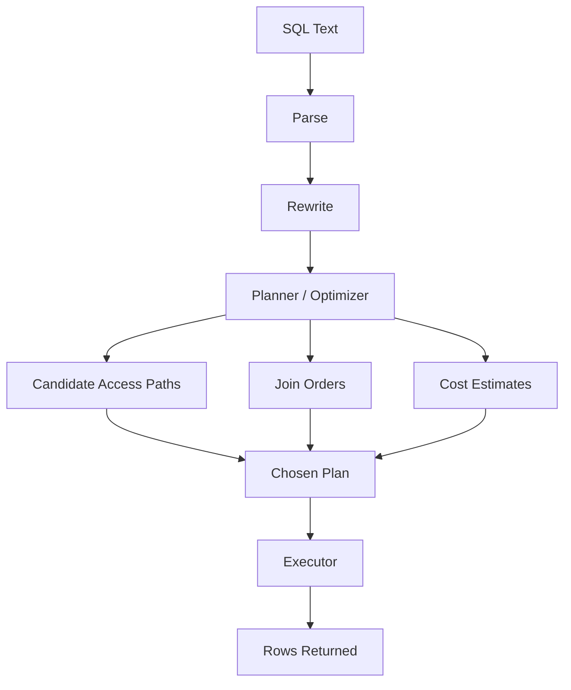

# Part 024 — Query Planner and Cost Model

> The database does not execute your SQL directly. It first invents possible ways to execute it, estimates their cost using statistics, and chooses a plan. Performance engineering starts when you stop reading SQL as text and start reading it as a physical plan.

A query planner is the component that decides how a SQL statement should be executed.

For a simple query, this may look obvious. For a real query with joins, filters, sorting, grouping, limits, stale statistics, skewed tenants, and multiple competing indexes, the planner's choice can make the difference between a 20 ms response and a 20 minute outage.

This part builds the mental model needed to understand:

- why an index exists but is not used
- why a query is fast in staging and slow in production
- why adding an index can make another query worse
- why row estimates are often the root of bad plans
- why the same SQL may use different plans at different data sizes
- why `EXPLAIN` is an architectural tool, not only a DBA tool

---

## 1. Planner Mental Model

SQL is declarative. You describe **what** result you want, not exactly **how** to retrieve it.

Example:

```sql
SELECT c.case_id, c.reference_no, t.task_id
FROM case_file c
JOIN case_task t ON t.case_id = c.case_id
WHERE c.tenant_id = :tenant_id
  AND c.state = 'OPEN'
  AND t.state = 'READY'
ORDER BY t.due_at
LIMIT 50;
```

The database must decide:

- Which table should be read first?
- Should it use an index or scan a table?
- Which join algorithm should be used?
- Should it sort, or can it read in order?
- Should it filter early or late?
- How many rows will each step produce?
- Is the limit enough to stop early?

That decision is the query plan.



The planner is not omniscient. It guesses based on metadata and statistics.

---

## 2. The Core Loop: Estimate, Compare, Choose

A planner roughly works like this:

```text
for each plausible plan:
    estimate number of rows at each node
    estimate cost of reading those rows
    estimate cost of joining, sorting, aggregating
choose the lowest-cost plan
```

A simplified plan choice:

| Candidate Plan | Estimated Rows | Estimated Cost | Chosen? |
|---|---:|---:|---:|
| Sequential scan `case_file` | 2,000,000 | 70,000 | No |
| Index scan by tenant | 400,000 | 25,000 | No |
| Composite index by tenant/state/due | 500 | 400 | Yes |
| Bitmap index scan + sort | 5,000 | 1,100 | No |

If estimates are wrong, the chosen plan can be wrong.

This is the most important idea in query planning:

> Bad plans are often caused by bad estimates, not by a missing magical optimizer feature.

---

## 3. Cost Is Not Time

Planner cost is an abstract unit. It is not milliseconds.

A cost of `1000` does not mean 1000 ms. It means the planner estimates this plan is more expensive than another plan with lower cost, according to its cost constants and statistics.

Example PostgreSQL output:

```sql
EXPLAIN
SELECT *
FROM case_file
WHERE tenant_id = 't-001'
  AND state = 'OPEN';
```

Possible output:

```text
Index Scan using idx_case_tenant_state on case_file
  (cost=0.43..1523.19 rows=1200 width=256)
  Index Cond: ((tenant_id = 't-001') AND (state = 'OPEN'))
```

Interpretation:

| Field | Meaning |
|---|---|
| `cost=0.43..1523.19` | startup cost and total cost estimate |
| `rows=1200` | estimated number of rows returned by this node |
| `width=256` | estimated average row width in bytes |
| `Index Cond` | predicate used to navigate the index |

The `rows` estimate is often more important than the cost number itself.

---

## 4. Why Row Estimates Matter So Much

Suppose the planner thinks a predicate returns 10 rows, but it actually returns 1,000,000 rows.

That can cause:

- wrong join order
- nested loop over huge input
- wrong index selection
- memory spill during sort/hash
- slow aggregation
- unexpected lock duration
- replica lag due to long-running query

Example:

```text
Nested Loop  (cost=1.00..50.00 rows=10)
  actual time=0.100..90000.000 rows=1000000
```

The problem is not merely that the query was slow. The problem is that the planner chose a plan for a tiny result but received a huge result.

A senior engineer asks:

> Where did the cardinality estimate first become wrong?

That is usually where tuning should begin.

---

## 5. Statistics: The Planner's Map of the Data

A planner needs statistics such as:

| Statistic | Purpose |
|---|---|
| table row count | estimate scan size |
| page count | estimate I/O |
| null fraction | estimate `IS NULL` predicates |
| number of distinct values | estimate equality selectivity |
| most common values | handle skewed values |
| histogram bounds | estimate ranges |
| correlation | estimate relationship between physical order and column order |
| extended statistics | estimate multi-column dependency/skew |

Without statistics, the planner is guessing in the dark.

In PostgreSQL, `ANALYZE` collects statistics used by the planner. Autovacuum normally triggers analyze automatically, but high-change tables, bulk loads, partitioned tables, and skewed data may still need explicit attention.

---

## 6. Basic Cardinality Estimation

For equality on a unique column:

```sql
WHERE case_id = :case_id
```

Estimated rows should be close to 1.

For equality on a non-unique column:

```sql
WHERE state = 'OPEN'
```

The planner estimates based on value distribution.

If values are uniform:

```text
rows ≈ table_rows / distinct_values
```

But real production data is rarely uniform.

Example `state` distribution:

| State | Rows |
|---|---:|
| CLOSED | 8,000,000 |
| OPEN | 1,200,000 |
| ESCALATED | 50,000 |
| CANCELLED | 750,000 |

A query for `ESCALATED` and a query for `CLOSED` should not be estimated the same way. That is why most-common-value statistics matter.

---

## 7. Skew: The Enemy of Average-Based Planning

Skew is when values are unevenly distributed.

Common skew sources:

- one tenant is much larger than others
- one status dominates history
- most records are not deleted
- most events are processed
- one region has most users
- one product category dominates traffic
- recent time windows are much hotter than old windows

Example:

```sql
WHERE tenant_id = :tenant_id
```

If there are 1,000 tenants and 100,000,000 rows, an average estimate might assume 100,000 rows per tenant.

But real distribution may be:

| Tenant | Rows |
|---|---:|
| tenant_a | 60,000,000 |
| tenant_b | 10,000,000 |
| tenant_c | 3,000,000 |
| long tail | 27,000,000 total |

A plan good for the average tenant may be disastrous for `tenant_a`.

This is why top engineers test plans against:

- largest tenant
- smallest tenant
- most active tenant
- most historical tenant
- edge-case tenant with unusual data distribution

---

## 8. Multi-Column Correlation

Single-column statistics can mislead the planner when columns are correlated.

Example:

```sql
WHERE country = 'SG'
  AND currency = 'SGD'
```

If the planner assumes independence, it may estimate:

```text
selectivity(country='SG') * selectivity(currency='SGD')
```

But country and currency are correlated. Most Singapore records likely use SGD.

Another example:

```sql
WHERE tenant_id = 'large-tenant'
  AND state = 'OPEN'
```

The state distribution for a specific tenant may differ from global state distribution.

Extended statistics can help some engines estimate multi-column relationships better.

Example PostgreSQL pattern:

```sql
CREATE STATISTICS st_case_tenant_state
ON tenant_id, state
FROM case_file;

ANALYZE case_file;
```

This does not replace indexes. It helps the planner estimate better.

---

## 9. Access Path Choices

The planner chooses among access paths.

### Sequential Scan

Reads the table directly.

Good when:

- table is small
- predicate matches large portion of table
- index would cause too many random lookups
- query needs most rows anyway

A sequential scan is not automatically bad.

### Index Scan

Uses index to find matching rows, then fetches table rows.

Good when:

- predicate is selective
- ordered retrieval matters
- row fetch count is small enough

### Index-Only Scan

Uses index to answer the query without fetching table rows, when visibility/storage rules allow.

Good when:

- query projection is covered by index
- visibility map/storage metadata allows skipping heap fetches
- index is smaller than table

### Bitmap Index Scan

Builds bitmap of matching row locations, then fetches table pages more efficiently.

Good when:

- multiple predicates match moderate row counts
- many rows match, but not enough for full scan
- combining indexes is useful

### Specialized Access

Depending on engine/index type:

- GIN for inverted structures such as arrays/json/full-text-like access
- GiST/SP-GiST for geometric/range-like access
- BRIN for large naturally ordered tables
- hash indexes for equality in some engines

The planner's job is to choose the cheapest access path for the query and data distribution.

---

## 10. Why an Index Is Not Used

An index can exist and still be ignored.

Common reasons:

| Reason | Example |
|---|---|
| Predicate not selective | `WHERE is_active = true` when 99 percent active |
| Function hides column | `WHERE date(created_at) = ...` |
| Type mismatch | comparing uuid column to text expression |
| Collation/operator mismatch | index does not match comparison semantics |
| Leading column missing | index `(tenant_id, state)` but query only filters `state` |
| Sort mismatch | index order does not match `ORDER BY` |
| Partial predicate not implied | partial index on active rows, query does not specify active condition |
| Stale statistics | planner estimates old distribution |
| Table too small | sequential scan cheaper |
| Query returns too many rows | index lookup cost exceeds scan cost |
| Generic prepared plan | planner cannot specialize for parameter value |

Do not ask:

> Why is the database stupid?

Ask:

> Given its statistics, cost model, and query shape, why did this plan look cheapest?

---

## 11. Join Strategy Mental Model

Joins dominate many production performance problems.

### Nested Loop Join

For each row from outer input, find matching rows in inner input.

Good when:

- outer input is small
- inner lookup is indexed
- result is small
- `LIMIT` can stop early

Dangerous when:

- outer estimate is tiny but actual is huge
- inner lookup is expensive
- repeated random access explodes

### Hash Join

Build hash table from one input, scan the other and probe hash.

Good when:

- equality join
- inputs are large enough
- memory is sufficient
- order is not needed

Dangerous when:

- hash spills to disk
- row estimates are wrong
- build side is unexpectedly huge

### Merge Join

Both inputs are sorted by join key, then scanned in order.

Good when:

- inputs are already sorted by indexes
- large ordered joins
- range/order compatibility matters

Dangerous when:

- sorting cost is high
- estimates understate input size

---

## 12. Join Order Is a Search Problem

For three tables, there are several possible join orders. For many tables, the possibilities explode.

Example:

```sql
SELECT ...
FROM case_file c
JOIN case_task t ON t.case_id = c.case_id
JOIN user_account u ON u.user_id = t.assignee_id
JOIN organization o ON o.organization_id = c.organization_id
WHERE c.tenant_id = :tenant_id
  AND t.state = 'READY'
  AND u.active = true;
```

The planner may choose:

```text
case_file -> case_task -> user_account -> organization
```

or:

```text
case_task -> case_file -> user_account -> organization
```

The best order depends on which filters eliminate rows earliest.

If `t.state = 'READY'` matches only 500 tasks, starting from `case_task` may be good.

If `READY` matches 20,000,000 tasks globally but `tenant_id` narrows cases to 5,000 rows, starting from `case_file` may be better.

This is why predicate selectivity and join cardinality matter more than SQL text order.

---

## 13. `EXPLAIN` vs `EXPLAIN ANALYZE`

`EXPLAIN` shows the planned execution without running the query.

```sql
EXPLAIN
SELECT ...;
```

`EXPLAIN ANALYZE` runs the query and shows actual execution information.

```sql
EXPLAIN (ANALYZE, BUFFERS)
SELECT ...;
```

Use caution with mutating statements. If you run `EXPLAIN ANALYZE` on `INSERT`, `UPDATE`, or `DELETE`, the statement executes unless wrapped safely.

For production-like diagnosis, compare:

| Planned | Actual |
|---|---|
| estimated rows | actual rows |
| estimated cost | actual time |
| chosen access path | actual buffer reads/hits |
| estimated loop count | actual loops |

The most valuable question:

> Where does estimated row count diverge from actual row count first?

---

## 14. Anatomy of a Plan Node

Example:

```text
Nested Loop  (cost=0.86..240.44 rows=20 width=128)
  -> Index Scan using idx_case_tenant_state on case_file c
       (cost=0.43..80.11 rows=20 width=80)
       Index Cond: ((tenant_id = 't-001') AND (state = 'OPEN'))
  -> Index Scan using idx_task_case_ready on case_task t
       (cost=0.43..8.00 rows=1 width=48)
       Index Cond: (case_id = c.case_id)
       Filter: (state = 'READY')
```

Read from inside out:

- What is the first table accessed?
- What access method is used?
- Which predicates are index conditions?
- Which predicates are filters after retrieval?
- How many rows are estimated?
- How many loops will happen?

A predicate in `Filter` is not as strong as a predicate in `Index Cond`. It may mean the database retrieved rows and then discarded them.

---

## 15. Index Condition vs Filter

Consider index:

```sql
CREATE INDEX idx_case_tenant_created
ON case_file (tenant_id, created_at);
```

Query:

```sql
SELECT *
FROM case_file
WHERE tenant_id = :tenant_id
  AND state = 'OPEN'
  AND created_at >= :from;
```

Possible plan:

```text
Index Scan using idx_case_tenant_created on case_file
  Index Cond: ((tenant_id = ...) AND (created_at >= ...))
  Filter: (state = 'OPEN')
```

The index helps locate tenant/date rows. The database still filters `state` after retrieval.

This may be fine if tenant/date is selective. It may be bad if many rows are filtered out.

Potential index:

```sql
CREATE INDEX idx_case_tenant_state_created
ON case_file (tenant_id, state, created_at);
```

or partial index:

```sql
CREATE INDEX idx_case_tenant_open_created
ON case_file (tenant_id, created_at)
WHERE state = 'OPEN';
```

The correct choice depends on workload and state distribution.

---

## 16. Sorts and Memory

A query may be slow because of sorting, not scanning.

```sql
SELECT *
FROM case_file
WHERE tenant_id = :tenant_id
ORDER BY updated_at DESC
LIMIT 100;
```

Without a matching index, the database may:

1. find all tenant rows
2. sort them by `updated_at`
3. return top 100

For a large tenant, this is expensive.

Index:

```sql
CREATE INDEX idx_case_tenant_updated
ON case_file (tenant_id, updated_at DESC, case_id DESC);
```

Now the database can read rows in order and stop early.

Sort failure signals:

- high sort time
- disk spill
- large memory usage
- sort before limit
- repeated sorts inside nested loops

---

## 17. Aggregation Plans

Aggregations use strategies such as:

- hash aggregate
- sort aggregate/group aggregate
- index-assisted grouping in some cases
- partial/parallel aggregate in some engines

Example:

```sql
SELECT state, count(*)
FROM case_file
WHERE tenant_id = :tenant_id
GROUP BY state;
```

If tenant has millions of rows, an index may not be enough. The query still counts many rows.

Possible better architecture:

- maintain aggregate table
- use materialized view
- move to analytical store
- precompute tenant dashboard metrics
- use approximate count if acceptable

A top engineer does not blindly index aggregation queries. They ask whether the query belongs in OLTP at all.

---

## 18. `LIMIT` Can Change Plans

A query with `LIMIT 10` may choose a different plan than the same query without limit.

Example:

```sql
SELECT *
FROM case_file
WHERE tenant_id = :tenant_id
ORDER BY due_at
LIMIT 10;
```

The planner may prefer an index that provides order and early stop.

Without limit:

```sql
SELECT *
FROM case_file
WHERE tenant_id = :tenant_id
ORDER BY due_at;
```

The planner may choose scan + sort if it expects many rows.

Do not extrapolate one plan to another query shape. `LIMIT`, `ORDER BY`, projection, and predicates all change the plan space.

---

## 19. Prepared Statements and Parameter Sensitivity

Parameterized queries are good for safety and reuse, but they can create planning nuance.

Example:

```sql
WHERE tenant_id = $1
```

If tenant sizes vary dramatically, the best plan for small tenant and large tenant may differ.

Small tenant:

- index scan is excellent

Large tenant:

- sequential/bitmap scan may be better

If the database uses a generic plan that does not account for the specific parameter value, it may choose a compromise plan that is bad for important cases.

Architectural mitigations:

- test large and small tenant cases
- avoid extreme skew in pooled tables where possible
- consider partitioning/cell architecture for huge tenants
- maintain good statistics
- use query variants for known different access patterns

Parameter sensitivity is not an ORM bug by default. It is a data distribution problem exposed through planning.

---

## 20. Stale Statistics and Plan Regression

Statistics become stale when data changes significantly.

Common triggers:

- bulk import
- large backfill
- tenant migration
- mass state transition
- archival/purge
- new product launch
- sudden traffic skew
- partition creation

After major changes, a query may regress even though schema did not change.

Runbook question:

> Did the data distribution change faster than planner statistics were refreshed?

Operational controls:

- ensure autovacuum/analyze is healthy
- run targeted `ANALYZE` after bulk changes
- monitor plan regressions
- track estimated vs actual rows for critical queries
- include statistics refresh in migration runbooks

---

## 21. Extended Statistics

Single-column stats cannot always represent multi-column relationships.

Example:

```sql
WHERE tenant_id = :tenant_id
  AND region = :region
  AND state = 'OPEN'
```

If tenant, region, and state are correlated, independent estimates can be wrong.

PostgreSQL supports extended statistics objects such as dependencies, ndistinct, and most-common-values for column groups.

Example:

```sql
CREATE STATISTICS st_case_tenant_region_state
ON tenant_id, region, state
FROM case_file;

ANALYZE case_file;
```

Use extended statistics when:

- estimates are wrong despite good indexes
- predicates use correlated columns
- join/filter estimates are unstable
- adding another index would not address estimation root cause

Do not use extended statistics as a random performance knob. Use them to fix a specific estimation problem.

---

## 22. Cost Constants and Hardware Reality

Planners use cost constants to estimate relative expense of operations.

Examples in PostgreSQL include concepts like:

- sequential page cost
- random page cost
- CPU tuple cost
- CPU operator cost
- parallel setup/tuple cost

These defaults may not perfectly match modern SSDs, memory-heavy servers, or cloud storage behavior.

But tuning cost constants is advanced and risky.

Prefer this order:

1. Fix query shape.
2. Fix schema/index design.
3. Refresh statistics.
4. Add extended statistics for correlation.
5. Fix data model or workload boundary.
6. Only then consider cost constant tuning.

If you change cost constants to make one query better, you may make many other plans worse.

---

## 23. Plan Instability

Plan instability means the same query changes plan over time or across environments.

Causes:

- data volume growth
- stale or different statistics
- different parameter values
- different engine versions
- changed cost settings
- changed memory settings
- added/dropped indexes
- partition count growth
- tenant skew

This is why performance tests must use realistic data. A query plan on 10,000 rows may not resemble a query plan on 100,000,000 rows.

PostgreSQL documentation explicitly warns that plans from toy-sized tables should not be extrapolated to much larger tables. The planner may choose sequential scans on tiny tables even when indexes exist because reading the whole table is cheaper.

---

## 24. Reading a Bad Plan: A Method

Use this method.

### Step 1 — Capture the plan

```sql
EXPLAIN (ANALYZE, BUFFERS)
SELECT ...;
```

### Step 2 — Find the slowest node

Look for:

- high actual time
- many loops
- large actual rows
- disk spill
- high buffer reads

### Step 3 — Find first estimate divergence

Compare:

```text
rows=10 actual rows=1000000
```

The first major divergence often explains the rest.

### Step 4 — Classify root cause

| Symptom | Likely Cause |
|---|---|
| sequential scan on huge table | missing/unused index, low selectivity, stale stats |
| nested loop explosion | underestimated outer rows |
| sort spill | missing order index, insufficient memory, large result |
| hash spill | underestimated build side, memory pressure |
| filter removes many rows | predicate not in index condition |
| index scan reads too many rows | low selectivity or wrong column order |
| index-only scan still fetches heap | visibility/storage conditions not favorable |

### Step 5 — Choose smallest effective fix

Potential fixes:

- rewrite predicate to be sargable
- add or adjust composite index
- use partial index
- refresh statistics
- add extended statistics
- split query
- introduce read model
- move report to analytical store
- partition/shard
- change product requirement if necessary

Do not jump straight to adding an index.

---

## 25. Example: Planner Chooses Sequential Scan

Query:

```sql
SELECT *
FROM case_file
WHERE state = 'CLOSED';
```

Index exists:

```sql
CREATE INDEX idx_case_state ON case_file(state);
```

But plan uses sequential scan.

Why?

If 80 percent of rows are `CLOSED`, using the index means:

1. read most of the index
2. fetch most table rows
3. perform many random-ish lookups

Sequential scan may be cheaper.

The fix is not forcing index usage.

Better questions:

- Why are we querying all closed cases from OLTP?
- Is there a date range missing?
- Is this a report that belongs elsewhere?
- Should closed cases be partitioned/archive-separated?
- Is there a partial index for non-closed operational cases?

---

## 26. Example: Composite Index Not Fully Used

Index:

```sql
CREATE INDEX idx_case_tenant_state_due
ON case_file (tenant_id, state, due_at);
```

Query:

```sql
SELECT *
FROM case_file
WHERE tenant_id = :tenant_id
  AND due_at < now();
```

The index can use `tenant_id`, but `state` is skipped. Depending on engine and plan, `due_at` may not be as useful as expected because it comes after missing `state`.

Potential index for this query:

```sql
CREATE INDEX idx_case_tenant_due
ON case_file (tenant_id, due_at);
```

But do not add it blindly. Ask:

- Is this query important enough?
- Is there already a state-filtered operational query?
- Should overdue detection be a background projection?
- Is due-date search global or tenant-scoped?

---

## 27. Example: Wrong Join Order Due to Tenant Skew

Query:

```sql
SELECT c.case_id, t.task_id
FROM case_task t
JOIN case_file c ON c.case_id = t.case_id
WHERE c.tenant_id = :tenant_id
  AND t.state = 'READY';
```

Global `READY` tasks: 20,000,000.

For small tenant: 100 ready tasks.

For large tenant: 8,000,000 ready tasks.

A generic average estimate may choose a plan that is acceptable for neither extreme.

Possible solutions:

- composite index including tenant dimension on task table
- denormalize `tenant_id` into `case_task` if task is tenant-owned and invariant-safe
- partition/cell huge tenants
- maintain queue projection per tenant
- add extended stats if estimation is root cause

This shows a key design principle:

> Query planner problems often expose missing physical ownership columns.

If `case_task` is always tenant-owned, storing `tenant_id` in `case_task` may be a valid physical design to support isolation and query planning.

---

## 28. Planner-Aware Schema Design

Good schema design helps the planner.

Planner-friendly design tends to have:

- explicit ownership columns such as `tenant_id`
- stable foreign keys
- narrow hot tables
- clear lifecycle states
- selective predicates
- consistent query patterns
- bounded result sets
- deterministic ordering
- canonical normalized search fields
- separated OLTP and reporting workloads

Planner-hostile design tends to have:

- generic EAV tables
- polymorphic foreign keys
- JSON fields used as core filters
- functions around indexed columns
- unbounded list pages
- nullable columns with unclear semantics
- status soup
- huge multi-purpose tables
- mixed operational/reporting workloads
- hidden tenant ownership through joins

The optimizer cannot fully rescue a data model that hides meaning.

---

## 29. Query Planner Review Checklist

Use this for critical queries.

### Query Shape

- What is the query family?
- Is the result bounded?
- Is ordering deterministic?
- Are predicates sargable?
- Are functions hiding indexed columns?
- Are types/collations aligned?

### Statistics

- Are table statistics current?
- Is the data distribution skewed?
- Are predicates correlated?
- Are estimates close to actual rows?
- Would extended statistics help?

### Access Path

- Is the chosen scan appropriate?
- Are index conditions strong enough?
- Are filters discarding many rows after retrieval?
- Is a sort avoidable with index order?
- Is index-only scan possible and useful?

### Join Plan

- Is join order sensible?
- Is nested loop safe for actual row counts?
- Is hash join spilling?
- Is merge join requiring expensive sorts?
- Are join keys indexed where needed?

### Workload Boundary

- Does this query belong in OLTP?
- Is it actually reporting/search/analytics?
- Should it use a materialized read model?
- Is it harming write path or replicas?

### Production Risk

- How does the plan behave for largest tenant?
- How does it behave after data doubles?
- What happens after archival/purge?
- Can plan regression be detected?
- Is there a runbook for this query family?

---

## 30. What Top Engineers Do Differently

Average engineers see SQL.

Strong engineers see indexes.

Top engineers see **plans, estimates, data distribution, and workload boundaries**.

They know that:

- the optimizer is cost-based, not magic
- estimates drive plan choice
- skew breaks average assumptions
- staging plans often lie
- indexes are only useful if the query shape can exploit them
- bad plans often reveal missing data ownership or bad workload boundaries
- `EXPLAIN` is part of architecture review
- performance is a property of SQL, schema, data, statistics, hardware, and operations together

The best question after reading a bad plan is not:

> Which index should I add?

The better question is:

> What did the planner believe about this data, and why was that belief wrong or insufficient for the workload?

That question leads to durable fixes.

---

## 31. Practice Drills

### Drill 1 — Sequential Scan Despite Index

A table has 50 million rows and this index:

```sql
CREATE INDEX idx_case_state ON case_file(state);
```

Query:

```sql
SELECT *
FROM case_file
WHERE state = 'CLOSED';
```

The planner uses sequential scan. Explain at least four possible reasons and what you would check before changing anything.

### Drill 2 — Estimate Divergence

Plan fragment:

```text
Nested Loop  (cost=0.86..100.00 rows=50)
  actual time=0.10..65000.00 rows=2500000
```

Explain:

- why nested loop was probably chosen
- why it became disastrous
- where you would look for the first bad estimate
- three possible fixes

### Drill 3 — Correlated Columns

Query:

```sql
SELECT *
FROM payment
WHERE country = 'SG'
  AND currency = 'SGD'
  AND payment_method = 'PAYNOW';
```

Explain why independent single-column statistics may misestimate this query and how extended statistics or schema changes might help.

### Drill 4 — Tenant Skew

A query is fast for 99 percent of tenants but slow for one enterprise tenant. Explain why average cardinality is dangerous and list architecture-level options beyond adding an index.

---

## 32. References

- PostgreSQL Documentation — Using EXPLAIN: https://www.postgresql.org/docs/current/using-explain.html
- PostgreSQL Documentation — EXPLAIN command: https://www.postgresql.org/docs/current/sql-explain.html
- PostgreSQL Documentation — Statistics Used by the Planner: https://www.postgresql.org/docs/current/planner-stats.html
- PostgreSQL Documentation — CREATE STATISTICS: https://www.postgresql.org/docs/current/sql-createstatistics.html
- PostgreSQL Documentation — Indexes: https://www.postgresql.org/docs/current/indexes.html
- MySQL Reference Manual — Optimizer Overview: https://dev.mysql.com/doc/refman/8.0/en/optimizer.html
- MySQL Reference Manual — EXPLAIN Output Format: https://dev.mysql.com/doc/refman/8.0/en/explain-output.html

---

Next: Part 025 will go deeper into reading execution plans node-by-node, including scans, joins, sorts, aggregates, loops, buffers, timing, and systematic diagnosis.
