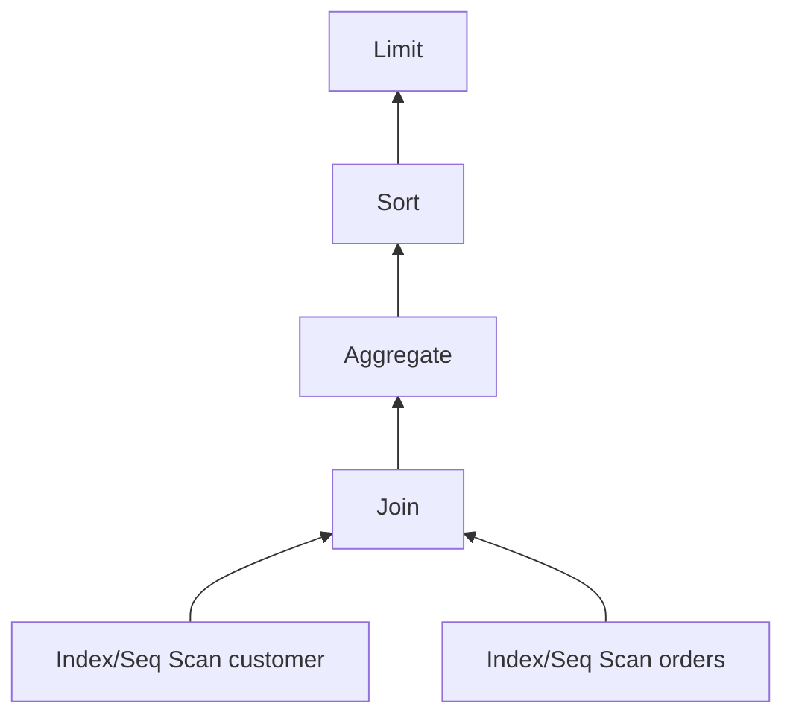
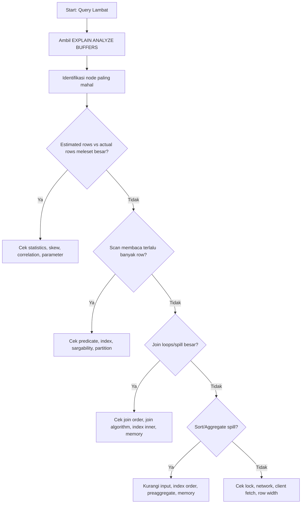

# Part 025 — Reading Execution Plans

Execution plan adalah jembatan antara **SQL yang kita tulis** dan **pekerjaan fisik yang benar-benar dilakukan database**.

Top engineer tidak membaca query hanya dari teks SQL. Mereka membaca query dari sudut pandang engine:

- berapa baris yang diperkirakan masuk ke tiap node;
- berapa baris yang benar-benar keluar;
- table mana yang di-scan;
- index mana yang dipakai atau tidak dipakai;
- join dilakukan dengan algoritma apa;
- sort dan aggregate menghabiskan memory atau spill ke disk;
- query lambat karena I/O, CPU, lock, network, cardinality estimation, atau bentuk query yang salah.

Execution plan bukan alat “mencari index secara random”. Execution plan adalah alat membuktikan **kenapa database memilih rencana tertentu**.

---

## 1. Mental Model: Query Adalah Tree of Work

SQL terlihat deklaratif:

```sql
SELECT c.id, c.name, COUNT(o.id) AS order_count
FROM customer c
JOIN orders o ON o.customer_id = c.id
WHERE c.tenant_id = $1
  AND o.created_at >= $2
GROUP BY c.id, c.name
ORDER BY order_count DESC
LIMIT 20;
```

Kita tidak menulis urutan eksekusi. Planner membangun execution tree.



Cara membaca plan yang benar biasanya **bottom-up**:

1. scan node membaca data dasar;
2. join node menggabungkan input;
3. aggregate/sort/materialize mengubah bentuk intermediate result;
4. root node mengembalikan hasil final.

Kesalahan umum: membaca root dulu dan langsung menyimpulkan query lambat karena `Sort` atau `Nested Loop`, padahal akar masalahnya sering berada di scan node bawah: filter tidak selektif, index tidak cocok, atau row estimate salah.

---

## 2. EXPLAIN vs EXPLAIN ANALYZE

Ada dua mode dasar.

```sql
EXPLAIN
SELECT ...;
```

`EXPLAIN` menunjukkan **rencana yang dipilih** tanpa menjalankan query.

```sql
EXPLAIN (ANALYZE, BUFFERS)
SELECT ...;
```

`EXPLAIN ANALYZE` menjalankan query dan menampilkan metrik aktual.

Gunakan `EXPLAIN` ketika:

- query melakukan perubahan data dan tidak boleh dieksekusi;
- query sangat mahal dan ingin dicek dulu;
- ingin melihat plan shape secara cepat.

Gunakan `EXPLAIN ANALYZE` ketika:

- perlu membandingkan estimated rows vs actual rows;
- perlu tahu node mana yang benar-benar lambat;
- perlu bukti apakah plan buruk karena statistik, index, sort, atau join.

Untuk query mutasi, bungkus dalam transaction lalu rollback.

```sql
BEGIN;

EXPLAIN (ANALYZE, BUFFERS)
UPDATE case_file
SET status = 'ESCALATED'
WHERE tenant_id = 't1'
  AND sla_due_at < now()
  AND status = 'OPEN';

ROLLBACK;
```

Jangan menjalankan `EXPLAIN ANALYZE` pada mutating query di production tanpa memahami efek samping trigger, lock, sequence, audit table, outbox, dan external side effect.

---

## 3. Anatomy Plan PostgreSQL

Contoh sederhana:

```sql
EXPLAIN (ANALYZE, BUFFERS)
SELECT *
FROM case_file
WHERE tenant_id = 't1'
  AND status = 'OPEN'
  AND created_at >= now() - interval '7 days';
```

Output konseptual:

```text
Index Scan using idx_case_file_tenant_status_created on case_file
  (cost=0.43..128.75 rows=120 width=248)
  (actual time=0.051..2.311 rows=97 loops=1)
  Index Cond: ((tenant_id = 't1') AND (status = 'OPEN') AND (created_at >= ...))
  Buffers: shared hit=320 read=8
```

Field penting:

| Field | Arti | Yang Dicek |
|---|---|---|
| `cost=startup..total` | Estimasi biaya relatif | Apakah plan mahal dibanding alternatif? |
| `rows` | Estimasi jumlah baris keluar node | Bandingkan dengan actual rows |
| `width` | Estimasi ukuran baris | Lebar baris memengaruhi memory, sort, I/O |
| `actual time=start..end` | Waktu aktual node | Cari node dengan waktu dominan |
| `actual rows` | Jumlah baris aktual | Deteksi cardinality misestimate |
| `loops` | Berapa kali node dijalankan | Penting untuk nested loop |
| `Buffers` | Page hit/read/dirtied/written | Deteksi I/O vs cache hit |

Rule pertama:

> Jangan melihat `cost` sebagai milliseconds. Cost adalah unit relatif planner.

Rule kedua:

> Jangan melihat `actual time` tanpa melihat `loops`.

Jika node punya `actual time=0.1..1.0 rows=10 loops=10000`, total kerja node itu bisa besar walau angka per-loop kecil.

---

## 4. Estimated Rows vs Actual Rows: Sinyal Paling Penting

Planner memilih plan berdasarkan estimasi cardinality. Jika estimasi salah besar, plan bisa salah total.

Contoh:

```text
Nested Loop
  (cost=1.00..500.00 rows=10 width=120)
  (actual time=0.100..8400.000 rows=250000 loops=1)
```

Planner mengira join menghasilkan 10 baris. Aktualnya 250.000 baris. Ini bukan sekadar “query lambat”. Ini **planner salah memahami data distribution**.

Penyebab umum:

- statistik stale;
- distribusi data skewed;
- kolom correlated tetapi statistik single-column;
- predicate menggunakan function/expression yang tidak punya statistics memadai;
- tenant tertentu jauh lebih besar dari tenant lain;
- nilai `status` low-cardinality tetapi sangat tidak merata;
- join column tidak punya FK/unique/index yang membantu planner memahami relasi;
- parameterized query memilih generic plan yang buruk untuk value tertentu.

Tanda bahaya:

| Estimated vs Actual | Interpretasi |
|---|---|
| Estimasi 10, aktual 12 | Normal |
| Estimasi 1.000, aktual 800 | Masih wajar |
| Estimasi 10, aktual 1.000.000 | Problem cardinality serius |
| Estimasi 1.000.000, aktual 10 | Planner mungkin memilih seq scan/hash join terlalu besar |

Diagnosis cepat:

```sql
ANALYZE case_file;
```

Lalu cek ulang plan. Jika membaik, problemnya statistik stale. Jika tetap buruk, perlu desain statistik/index/query shape.

Untuk korelasi multi-kolom di PostgreSQL:

```sql
CREATE STATISTICS st_case_file_tenant_status
ON tenant_id, status
FROM case_file;

ANALYZE case_file;
```

Gunakan extended statistics ketika planner salah karena kombinasi kolom, bukan karena satu kolom.

---

## 5. Scan Nodes

Scan node menjawab pertanyaan:

> Bagaimana database menemukan row awal?

### 5.1 Sequential Scan

```text
Seq Scan on case_file
  Filter: (tenant_id = 't1' AND status = 'OPEN')
```

Sequential scan membaca table secara linear.

Ini **tidak selalu buruk**.

Baik ketika:

- table kecil;
- query mengambil persentase besar table;
- predicate tidak selektif;
- index lookup lebih mahal daripada baca sequential;
- table sedang diproses untuk full report/batch.

Buruk ketika:

- table besar;
- query dashboard mengambil sedikit row;
- filter harusnya selektif;
- terjadi di path request latency-sensitive;
- scan terjadi berulang sebagai inner node nested loop.

Pertanyaan review:

1. Berapa total row table?
2. Berapa row yang lolos filter?
3. Apakah query path user-facing?
4. Apakah filter cocok dengan index?
5. Apakah planner memilih seq scan karena statistik salah atau karena index memang tidak menguntungkan?

### 5.2 Index Scan

```text
Index Scan using idx_case_tenant_status_created on case_file
  Index Cond: ((tenant_id = 't1') AND (status = 'OPEN'))
  Filter: (priority = 'HIGH')
```

Index scan memakai index untuk menemukan pointer row, lalu mengambil row dari table heap.

Perbedaan penting:

- `Index Cond` berarti predicate dipakai untuk navigasi index.
- `Filter` berarti row sudah diambil lalu dibuang.

Jika predicate penting muncul sebagai `Filter`, index belum benar-benar membantu predicate tersebut.

Contoh buruk:

```text
Index Scan using idx_case_tenant on case_file
  Index Cond: (tenant_id = 't1')
  Filter: (lower(reference_no) = 'abc-123')
```

Solusi bisa berupa expression index:

```sql
CREATE INDEX idx_case_reference_lower
ON case_file (tenant_id, lower(reference_no));
```

### 5.3 Index Only Scan

```text
Index Only Scan using idx_case_list on case_file
  Index Cond: (tenant_id = 't1')
  Heap Fetches: 0
```

Index-only scan bisa menjawab query dari index tanpa membaca table heap, jika semua kolom yang dibutuhkan tersedia di index dan visibility map memungkinkan.

Baik untuk:

- list page;
- lookup ringan;
- high-QPS read path;
- existence check;
- pagination dengan projection kecil.

Tetapi index-only scan bukan gratis. Index menjadi lebih besar jika terlalu banyak kolom dimasukkan.

### 5.4 Bitmap Index Scan + Bitmap Heap Scan

```text
Bitmap Heap Scan on case_file
  Recheck Cond: (status = 'OPEN')
  -> Bitmap Index Scan on idx_case_status
```

Bitmap scan cocok ketika query mengambil cukup banyak row sehingga individual index lookup terlalu acak, tetapi masih lebih baik daripada full table scan.

Biasanya muncul untuk:

- predicate medium-selectivity;
- kombinasi beberapa index;
- table besar dengan filter yang tidak terlalu sempit.

Jika bitmap heap scan membaca terlalu banyak heap block, index mungkin kurang selektif atau predicate terlalu luas.

---

## 6. Join Nodes

Join node menjawab:

> Bagaimana database menggabungkan dua input?

### 6.1 Nested Loop

```text
Nested Loop
  -> Index Scan on tenant
  -> Index Scan on case_file
       Index Cond: (tenant_id = tenant.id)
```

Nested loop menjalankan inner node untuk setiap row outer node.

Baik ketika:

- outer row sedikit;
- inner lookup memakai index sangat selektif;
- join untuk primary-key lookup;
- `LIMIT` kecil dan order mendukung early return.

Buruk ketika:

- outer row besar;
- inner scan tidak indexed;
- estimasi outer row terlalu kecil;
- `loops` tinggi dan inner node mahal.

Tanda bahaya:

```text
Index Scan on task
  actual time=0.050..1.200 rows=40 loops=50000
```

Per-loop terlihat kecil. Tetapi 50.000 loops membuatnya mahal.

### 6.2 Hash Join

```text
Hash Join
  Hash Cond: (case_file.assignee_id = officer.id)
  -> Seq Scan on case_file
  -> Hash
       -> Seq Scan on officer
```

Hash join membangun hash table dari salah satu input, lalu probe dari input lain.

Baik ketika:

- join result besar;
- equality join;
- input tidak cocok untuk index nested loop;
- memory cukup.

Buruk ketika:

- hash table terlalu besar dan spill ke disk;
- build side salah karena estimasi cardinality salah;
- join sebenarnya bisa index lookup kecil tapi planner mengira besar.

Perhatikan:

```text
Hash Batches: 8  Memory Usage: 4096kB
```

Batches banyak dapat mengindikasikan spill atau memory pressure.

### 6.3 Merge Join

```text
Merge Join
  Merge Cond: (a.created_at = b.created_at)
  -> Index Scan using idx_a_created_at on a
  -> Index Scan using idx_b_created_at on b
```

Merge join membutuhkan input terurut berdasarkan join key.

Baik ketika:

- kedua input sudah terurut dari index;
- join besar;
- range/equality join dengan order natural;
- sort cost masih masuk akal.

Buruk ketika sort besar dilakukan hanya untuk merge join dan memory tidak cukup.

---

## 7. Sort Nodes

Sort node sering terlihat sederhana, tapi sering menjadi bottleneck.

```text
Sort
  Sort Key: created_at DESC
  Sort Method: quicksort  Memory: 2048kB
```

Atau:

```text
Sort
  Sort Method: external merge  Disk: 512000kB
```

`external merge` berarti sort spill ke disk.

Penyebab:

- result set terlalu besar;
- `work_mem` tidak cukup;
- index tidak mendukung order;
- query melakukan sort sebelum `LIMIT` karena tidak ada index yang cocok;
- projection terlalu lebar.

Contoh perbaikan:

```sql
CREATE INDEX idx_case_feed
ON case_file (tenant_id, created_at DESC, id DESC);
```

Untuk query:

```sql
SELECT id, reference_no, created_at
FROM case_file
WHERE tenant_id = $1
ORDER BY created_at DESC, id DESC
LIMIT 50;
```

Jika index cocok dengan filter + order, database bisa berhenti setelah 50 row tanpa sort besar.

---

## 8. Aggregate Nodes

Aggregate menjawab:

> Bagaimana database menghitung group, count, sum, max, min?

Jenis umum:

### 8.1 HashAggregate

```text
HashAggregate
  Group Key: tenant_id, status
```

Baik untuk grouping besar jika memory cukup.

Risiko:

- banyak group;
- key lebar;
- spill ke disk;
- input besar karena filter buruk.

### 8.2 GroupAggregate

```text
GroupAggregate
  Group Key: tenant_id, status
  -> Sort
```

Input perlu terurut. Bisa baik jika index sudah memberi order. Bisa buruk jika perlu sort besar.

### 8.3 Aggregate tanpa Group

```text
Aggregate
  -> Index Only Scan using idx_case_open
```

Baik untuk count/existence jika index kecil dan predicate cocok.

Tetapi `COUNT(*)` pada table besar tetap bisa mahal karena database harus memastikan visibility row.

---

## 9. Filter, Recheck, Rows Removed

Bagian ini sering mengungkap query shape yang salah.

```text
Rows Removed by Filter: 980000
```

Artinya database membaca banyak row lalu membuangnya.

Ini bisa normal untuk analytical scan, tapi buruk untuk request path.

Contoh:

```text
Seq Scan on case_file
  Filter: ((tenant_id = 't1') AND (status = 'OPEN'))
  Rows Removed by Filter: 999000
```

Pertanyaan:

- Apakah filter harusnya menjadi `Index Cond`?
- Apakah index leading column salah?
- Apakah function membuat predicate tidak sargable?
- Apakah partial index cocok?
- Apakah tenant besar membuat filter tidak selektif?

---

## 10. Buffers: CPU Problem atau I/O Problem?

Gunakan:

```sql
EXPLAIN (ANALYZE, BUFFERS)
SELECT ...;
```

Contoh:

```text
Buffers: shared hit=120000 read=0
```

Data ada di cache. Problem cenderung CPU, join, sort, aggregate, atau terlalu banyak row diproses.

```text
Buffers: shared hit=1000 read=80000
```

Banyak disk read. Problem bisa I/O, working set terlalu besar, index buruk, atau cache tidak cukup.

```text
Buffers: shared dirtied=500 written=120
```

Query write-heavy atau menyebabkan dirty page.

Mental model:

| Buffer Pattern | Kemungkinan |
|---|---|
| hit tinggi, read rendah, latency tinggi | CPU/query shape/intermediate rows |
| read tinggi | I/O/cache/index/selectivity |
| temp read/write tinggi | sort/hash aggregate/hash join spill |
| dirtied/written tinggi | write amplification/update/bulk mutation |

---

## 11. Temp Files dan Spill

Sort, hash join, dan hash aggregate bisa spill ke disk.

Dalam plan:

```text
Sort Method: external merge  Disk: 102400kB
```

Atau:

```text
Batches: 16  Memory Usage: 4096kB
```

Jika spill terjadi di production:

1. pastikan query memang perlu memproses banyak row;
2. kurangi row sebelum sort/aggregate;
3. buat index untuk order/group path bila cocok;
4. kecilkan projection agar row width turun;
5. pertimbangkan pre-aggregation/materialized view;
6. tuning memory hanya setelah query shape masuk akal.

Jangan menjadikan `work_mem` sebagai solusi pertama. Membesarkan memory per operation bisa berbahaya karena banyak query paralel dapat mengalikan konsumsi memory.

---

## 12. LIMIT Tidak Selalu Membuat Query Murah

Query ini terlihat murah:

```sql
SELECT *
FROM case_file
WHERE tenant_id = $1
ORDER BY created_at DESC
LIMIT 20;
```

Murah jika ada index:

```sql
CREATE INDEX idx_case_file_feed
ON case_file (tenant_id, created_at DESC);
```

Mahal jika database harus:

1. scan semua row tenant;
2. sort semua row;
3. ambil 20 teratas.

Plan buruk:

```text
Limit
  -> Sort
       Sort Key: created_at DESC
       -> Seq Scan on case_file
            Filter: tenant_id = $1
```

Plan baik:

```text
Limit
  -> Index Scan using idx_case_file_feed on case_file
       Index Cond: (tenant_id = $1)
```

Pelajaran:

> `LIMIT` murah hanya jika plan bisa menemukan row pertama dengan cepat.

---

## 13. OFFSET: Plan Smell untuk Deep Pagination

```sql
SELECT id, created_at
FROM case_file
WHERE tenant_id = $1
ORDER BY created_at DESC, id DESC
LIMIT 50 OFFSET 100000;
```

Database tetap harus melewati 100.000 row sebelum mengembalikan 50 row.

Alternatif: keyset pagination.

```sql
SELECT id, created_at
FROM case_file
WHERE tenant_id = $1
  AND (created_at, id) < ($last_created_at, $last_id)
ORDER BY created_at DESC, id DESC
LIMIT 50;
```

Index:

```sql
CREATE INDEX idx_case_keyset
ON case_file (tenant_id, created_at DESC, id DESC);
```

Execution plan keyset biasanya jauh lebih stabil karena predicate memberi anchor pada index traversal.

---

## 14. CTE, Subquery, Materialization

CTE bisa membantu readability. Tetapi dari sisi plan, CTE atau subquery dapat mengubah optimization boundary tergantung engine dan versi.

Contoh pattern berisiko:

```sql
WITH open_cases AS (
  SELECT *
  FROM case_file
  WHERE status = 'OPEN'
)
SELECT *
FROM open_cases
WHERE tenant_id = $1;
```

Jika materialized terlalu awal, database mungkin membaca semua open cases dari semua tenant, lalu filter tenant belakangan.

Bentuk lebih baik:

```sql
WITH open_cases AS (
  SELECT *
  FROM case_file
  WHERE tenant_id = $1
    AND status = 'OPEN'
)
SELECT *
FROM open_cases;
```

Rule praktis:

- dorong predicate selektif sedekat mungkin ke table base;
- jangan membuat intermediate result besar hanya demi “rapi”; 
- cek apakah CTE menjadi optimization fence/materialized;
- gunakan CTE untuk clarity, tapi validasi plan.

---

## 15. Plan Diagnosis Workflow

Gunakan workflow ini setiap membaca plan.



Checklist detail:

1. Apakah query lambat di database atau di application/client?
2. Apakah plan berasal dari value parameter yang representatif?
3. Apakah `actual rows` jauh dari `rows`?
4. Node mana yang memakan waktu terbesar?
5. Apakah banyak `Rows Removed by Filter`?
6. Apakah predicate penting menjadi `Index Cond`?
7. Apakah `loops` tinggi pada inner node?
8. Apakah sort/hash spill ke disk?
9. Apakah buffer read tinggi atau hit tinggi?
10. Apakah row width terlalu besar karena `SELECT *`?
11. Apakah query mengambil data lebih banyak daripada yang dikembalikan?
12. Apakah index existing cocok dengan equality, range, order, dan projection?
13. Apakah tenant/data distribution skew membuat plan buruk hanya untuk sebagian customer?
14. Apakah plan berubah antara dev/staging/prod karena data size berbeda?

---

## 16. Common Plan Smells

### Smell 1 — Seq Scan pada Table Besar untuk Request Path

```text
Seq Scan on case_file
  Rows Removed by Filter: 12000000
```

Kemungkinan:

- index tidak ada;
- predicate tidak sargable;
- index leading column salah;
- planner mengira filter tidak selektif;
- query memang membaca terlalu banyak data.

### Smell 2 — Nested Loop dengan Loops Sangat Tinggi

```text
Nested Loop
  -> Seq Scan on case_file rows=500000
  -> Index Scan on task loops=500000
```

Kemungkinan:

- join result besar;
- planner mengira outer kecil;
- hash join mungkin lebih cocok;
- perlu filtering lebih awal;
- perlu index lebih baik pada join + filter.

### Smell 3 — Sort External Merge

```text
Sort Method: external merge Disk: 204800kB
```

Kemungkinan:

- result set terlalu besar;
- index tidak mendukung order;
- `work_mem` rendah untuk workload tersebut;
- query perlu pre-filter/pre-aggregate.

### Smell 4 — Filter setelah Index Scan

```text
Index Cond: (tenant_id = $1)
Filter: (status = 'OPEN' AND created_at > $2)
```

Kemungkinan:

- index hanya membantu tenant, tidak membantu status/date;
- composite index perlu disesuaikan;
- partial index mungkin cocok.

### Smell 5 — Actual Rows Jauh Lebih Besar dari Estimated Rows

```text
rows=1 actual rows=800000
```

Kemungkinan:

- statistics stale;
- skew;
- correlation;
- generic plan;
- predicate expression sulit diestimasi.

### Smell 6 — Width Besar karena SELECT Star

```text
width=2800
```

Kemungkinan:

- query mengambil JSON/document/blob column yang tidak perlu;
- sort/hash menjadi mahal;
- network transfer mahal;
- index-only scan tidak mungkin.

---

## 17. Case Study: Dashboard Case List Lambat

Query:

```sql
SELECT id, reference_no, status, priority, created_at
FROM case_file
WHERE tenant_id = $1
  AND status IN ('OPEN', 'IN_REVIEW')
ORDER BY created_at DESC
LIMIT 50;
```

Plan buruk:

```text
Limit
  -> Sort
       Sort Key: created_at DESC
       Sort Method: top-N heapsort Memory: 64kB
       -> Bitmap Heap Scan on case_file
            Recheck Cond: (tenant_id = $1)
            Filter: (status = ANY('{OPEN,IN_REVIEW}'))
            Rows Removed by Filter: 450000
            -> Bitmap Index Scan on idx_case_tenant
                 Index Cond: (tenant_id = $1)
```

Diagnosis:

- index hanya pada `tenant_id`;
- database membaca banyak row tenant;
- `status` menjadi filter setelah heap fetch;
- `ORDER BY created_at DESC` tidak didukung index;
- `LIMIT 50` tidak murah karena database harus mencari dan sort candidate besar.

Index kandidat:

```sql
CREATE INDEX CONCURRENTLY idx_case_file_list_active
ON case_file (tenant_id, status, created_at DESC, id DESC)
INCLUDE (reference_no, priority)
WHERE status IN ('OPEN', 'IN_REVIEW');
```

Query disesuaikan agar order deterministic:

```sql
SELECT id, reference_no, status, priority, created_at
FROM case_file
WHERE tenant_id = $1
  AND status IN ('OPEN', 'IN_REVIEW')
ORDER BY created_at DESC, id DESC
LIMIT 50;
```

Plan yang diharapkan:

```text
Limit
  -> Index Only Scan using idx_case_file_list_active on case_file
       Index Cond: (tenant_id = $1)
```

Catatan penting:

- partial index cocok jika dashboard memang hanya active status;
- `INCLUDE` membantu projection tanpa memperbesar key order;
- tambahkan `id DESC` agar pagination deterministic;
- validasi write overhead sebelum deploy.

---

## 18. Case Study: Report Count per Status Lambat

Query:

```sql
SELECT status, COUNT(*)
FROM case_file
WHERE tenant_id = $1
  AND created_at >= $2
  AND created_at < $3
GROUP BY status;
```

Plan:

```text
HashAggregate
  Group Key: status
  -> Seq Scan on case_file
       Filter: tenant_id = $1 AND created_at >= $2 AND created_at < $3
       Rows Removed by Filter: 9000000
```

Opsi perbaikan:

### Opsi A — Index Range Scan

```sql
CREATE INDEX idx_case_tenant_created_status
ON case_file (tenant_id, created_at, status);
```

Cocok jika range date kecil.

### Opsi B — Partition by Date

Cocok jika report dominan per periode dan data sangat besar.

```text
case_file_2026_01
case_file_2026_02
case_file_2026_03
```

### Opsi C — Aggregate Table

Cocok jika report high-QPS dan data besar.

```sql
CREATE TABLE case_status_daily_summary (
    tenant_id uuid NOT NULL,
    day date NOT NULL,
    status text NOT NULL,
    count bigint NOT NULL,
    PRIMARY KEY (tenant_id, day, status)
);
```

Keputusan tidak boleh hanya “tambahkan index”. Tanyakan:

- apakah report harus real-time?
- berapa range date umum?
- berapa tenant size distribution?
- apakah data append-only atau sering update status?
- apakah report perlu reproducible historical truth?

---

## 19. Production Practice: Capture Plan dengan Konteks

Plan tanpa konteks sering menyesatkan.

Saat menyimpan evidence performance issue, catat:

```text
Query name        : case-list-active-v3
Environment       : production
Timestamp         : 2026-07-04T10:30:00+08:00
DB version        : PostgreSQL 18.x
Tenant size       : 4.8M case_file rows
Parameter sample  : tenant_id=t_big, status=OPEN/IN_REVIEW
Latency p95       : 2.7s
Rows returned     : 50
Plan collected    : EXPLAIN ANALYZE BUFFERS
Change candidate  : partial covering index
Rollback plan      : DROP INDEX CONCURRENTLY ...
```

Simpan before/after plan dalam design/change record.

---

## 20. Execution Plan Review Checklist

Gunakan checklist ini untuk review query penting.

### Query Identity

- Query ini milik use case apa?
- Path user-facing, batch, report, integration, atau admin?
- Berapa SLO latency?
- Berapa expected row returned?
- Berapa expected row scanned?
- Parameter value yang diuji representatif atau hanya happy path?

### Scan

- Scan type apa yang digunakan?
- Apakah table besar di-scan penuh?
- Apakah predicate utama masuk `Index Cond`?
- Apakah banyak row removed by filter?
- Apakah index cocok dengan equality/range/order?

### Join

- Join algorithm apa yang dipilih?
- Apakah nested loop punya loops tinggi?
- Apakah inner node indexed?
- Apakah hash join spill?
- Apakah join order masuk akal?

### Sort/Aggregate

- Apakah sort diperlukan?
- Apakah order bisa dipenuhi index?
- Apakah sort spill ke disk?
- Apakah aggregate input terlalu besar?
- Apakah pre-aggregation lebih cocok?

### Cardinality

- Estimated rows vs actual rows seberapa jauh?
- Apakah statistik stale?
- Apakah ada skew/correlation?
- Apakah perlu extended statistics?
- Apakah query memakai parameter yang menyebabkan generic plan buruk?

### I/O and Memory

- Buffer hit/read pattern seperti apa?
- Apakah temp read/write tinggi?
- Apakah row width terlalu besar?
- Apakah query mengambil column besar yang tidak perlu?

### Decision

- Apakah solusi terbaik index, rewrite query, statistics, partition, materialized view, cache, atau redesign use case?
- Apa write overhead dari index baru?
- Apa rollback plan?
- Bagaimana memonitor setelah deploy?

---

## 21. Key Takeaways

Execution plan adalah bukti fisik dari desain query.

Hal yang paling penting:

1. Baca plan bottom-up.
2. Bandingkan estimated rows vs actual rows.
3. Perhatikan `loops`, bukan hanya waktu per node.
4. Bedakan `Index Cond` dan `Filter`.
5. Jangan panik melihat `Seq Scan`; validasi konteksnya.
6. `LIMIT` murah hanya jika index/order mendukung early return.
7. Sort/hash spill adalah sinyal memory dan query shape.
8. Index bukan jawaban otomatis; kadang root cause adalah cardinality, query semantics, atau workload yang salah tempat.
9. Simpan before/after plan sebagai evidence engineering.

Database architect yang kuat tidak bertanya “index apa yang kurang?” terlebih dahulu.

Mereka bertanya:

> “Kerja fisik apa yang dilakukan database, mengapa planner memilihnya, dan apakah kerja itu sesuai dengan contract workload?”

---

## References

- PostgreSQL Documentation — Using `EXPLAIN`: https://www.postgresql.org/docs/current/using-explain.html
- PostgreSQL Documentation — `EXPLAIN`: https://www.postgresql.org/docs/current/sql-explain.html
- PostgreSQL Documentation — Statistics Used by the Planner: https://www.postgresql.org/docs/current/planner-stats.html
- PostgreSQL Documentation — Partial Indexes: https://www.postgresql.org/docs/current/indexes-partial.html
- PostgreSQL Documentation — `LIMIT` and `OFFSET`: https://www.postgresql.org/docs/current/queries-limit.html
- PostgreSQL Documentation — Query Planning Configuration: https://www.postgresql.org/docs/current/runtime-config-query.html
