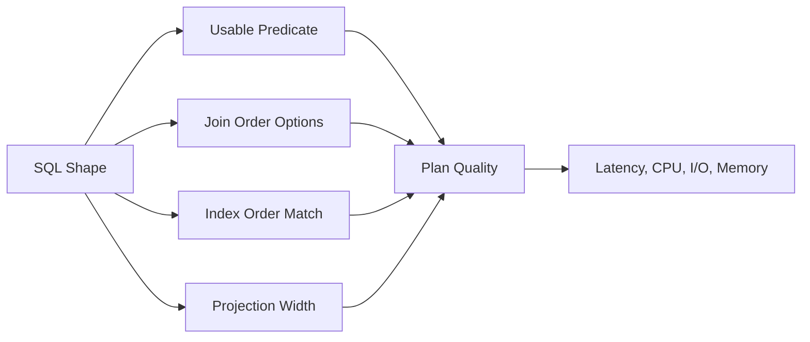

# Part 026 — SQL Query Shape and Performance

SQL adalah bahasa deklaratif, tetapi bentuk query tetap menentukan kerja fisik database.

Dua query bisa menghasilkan output yang sama, tetapi punya cost berbeda beberapa order of magnitude.

Perbedaan itu biasanya berasal dari:

- predicate yang sargable atau tidak;
- urutan kolom composite index;
- apakah query bisa berhenti cepat dengan `LIMIT`;
- apakah `ORDER BY` bisa dipenuhi index;
- apakah join mengalir dari input kecil ke lookup terindex;
- apakah aggregation dilakukan setelah data dipersempit;
- apakah query mengambil column terlalu lebar;
- apakah pagination memaksa database melewati jutaan row;
- apakah query mencampur OLTP path dengan reporting path.

Bagian ini fokus pada **query shape**: bentuk SQL yang membuat planner punya opsi plan yang baik.

---

## 1. Mental Model: Query Shape Adalah Contract Fisik

SQL yang baik memberi database kesempatan untuk:

1. mempersempit data lebih awal;
2. memakai index untuk filter;
3. memakai index untuk order;
4. menghindari intermediate result besar;
5. menghindari sort/hash spill;
6. menghindari repeated lookup yang tidak perlu;
7. mengembalikan row pertama cepat untuk request path.



Query performance bukan hanya urusan index. Index yang benar bisa tetap gagal jika query shape buruk.

---

## 2. Sargability: Predicate yang Bisa Dicari Index

Sargable berarti predicate dapat digunakan engine sebagai search argument untuk index traversal.

### 2.1 Bentuk Baik

```sql
SELECT id, reference_no
FROM case_file
WHERE tenant_id = $1
  AND created_at >= $2
  AND created_at < $3;
```

Index:

```sql
CREATE INDEX idx_case_tenant_created
ON case_file (tenant_id, created_at);
```

Predicate cocok dengan B-Tree:

- equality pada `tenant_id`;
- range pada `created_at`.

### 2.2 Bentuk Buruk: Function di Kolom

```sql
SELECT id, reference_no
FROM case_file
WHERE date(created_at) = DATE '2026-07-04';
```

Masalah:

- database harus menghitung `date(created_at)` untuk banyak row;
- index biasa pada `created_at` sulit dipakai untuk range traversal.

Bentuk lebih baik:

```sql
SELECT id, reference_no
FROM case_file
WHERE created_at >= TIMESTAMPTZ '2026-07-04 00:00:00+08'
  AND created_at <  TIMESTAMPTZ '2026-07-05 00:00:00+08';
```

Atau gunakan expression index jika semantics memang function-based:

```sql
CREATE INDEX idx_case_created_date_sg
ON case_file ((created_at AT TIME ZONE 'Asia/Singapore')::date);
```

Tetapi expression index harus dipilih secara sadar karena menambah write overhead dan hanya membantu expression yang cocok.

### 2.3 Bentuk Buruk: Manipulasi Kolom

```sql
WHERE amount + fee > 1000
```

Lebih baik jika bisa ditulis ulang:

```sql
WHERE amount > 1000 - fee
```

Namun contoh ini tetap tidak selalu bagus karena `fee` juga kolom. Jika rule sering dipakai, pertimbangkan generated/stored derived column dengan constraint atau index.

### 2.4 Bentuk Buruk: Leading Wildcard

```sql
WHERE reference_no LIKE '%ABC123'
```

B-Tree tidak bisa langsung seek ke suffix arbitrary.

Alternatif:

- simpan normalized searchable field;
- gunakan full-text/search engine jika kebutuhan search kompleks;
- gunakan trigram index di PostgreSQL jika cocok;
- ubah UX menjadi prefix search jika memungkinkan.

---

## 3. Equality, Range, Order: Urutan Predicate Penting

Composite B-Tree index bukan kumpulan index independen. Urutan kolom penting.

Untuk query:

```sql
SELECT id, created_at
FROM case_file
WHERE tenant_id = $1
  AND status = 'OPEN'
  AND created_at >= $2
ORDER BY created_at DESC
LIMIT 50;
```

Index baik:

```sql
CREATE INDEX idx_case_tenant_status_created
ON case_file (tenant_id, status, created_at DESC, id DESC);
```

Pola umum:

```text
equality columns -> range/order column -> tie-breaker
```

Kenapa?

- equality mempersempit prefix index;
- range menentukan traversal berikutnya;
- order bisa dipenuhi tanpa sort jika sesuai;
- tie-breaker membuat order deterministic.

Index yang kurang cocok:

```sql
CREATE INDEX idx_case_created_tenant_status
ON case_file (created_at DESC, tenant_id, status);
```

Ini mungkin baik untuk global latest feed, tetapi buruk untuk tenant-specific feed karena database harus melintasi banyak `created_at` lintas tenant.

---

## 4. `ORDER BY` Harus Deterministic

Query ini tidak stabil:

```sql
SELECT id, created_at
FROM case_file
WHERE tenant_id = $1
ORDER BY created_at DESC
LIMIT 50;
```

Jika banyak row punya `created_at` sama, urutan antar row tidak dijamin stabil.

Bentuk lebih baik:

```sql
SELECT id, created_at
FROM case_file
WHERE tenant_id = $1
ORDER BY created_at DESC, id DESC
LIMIT 50;
```

Index:

```sql
CREATE INDEX idx_case_tenant_created_id
ON case_file (tenant_id, created_at DESC, id DESC);
```

Deterministic order penting untuk:

- pagination;
- reproducible report;
- caching;
- user experience;
- audit/debugging.

---

## 5. Keyset Pagination vs OFFSET Pagination

### 5.1 OFFSET Pagination

```sql
SELECT id, created_at
FROM case_file
WHERE tenant_id = $1
ORDER BY created_at DESC, id DESC
LIMIT 50 OFFSET 100000;
```

Masalah:

- database tetap harus melewati 100.000 row;
- semakin dalam page, semakin lambat;
- hasil bisa bergeser jika ada insert/delete baru;
- latency tidak stabil.

### 5.2 Keyset Pagination

```sql
SELECT id, created_at
FROM case_file
WHERE tenant_id = $1
  AND (created_at, id) < ($last_created_at, $last_id)
ORDER BY created_at DESC, id DESC
LIMIT 50;
```

Index:

```sql
CREATE INDEX idx_case_keyset
ON case_file (tenant_id, created_at DESC, id DESC);
```

Keunggulan:

- database seek dari cursor terakhir;
- latency lebih stabil;
- cocok untuk infinite scroll/feed;
- tidak perlu skip row besar.

Tradeoff:

- tidak cocok untuk “jump to page 500”;
- cursor harus menyimpan sort key;
- sort harus deterministic;
- filter harus konsisten antar request.

---

## 6. Projection Width: Jangan `SELECT *` untuk Path Panas

```sql
SELECT *
FROM case_file
WHERE tenant_id = $1
ORDER BY created_at DESC
LIMIT 50;
```

Masalah:

- mengambil column besar yang tidak dibutuhkan;
- memperbesar row width;
- memperbesar memory sort/hash;
- memperbesar network transfer;
- menghambat index-only scan;
- membuat API coupling ke schema internal.

Bentuk lebih baik:

```sql
SELECT id, reference_no, status, priority, created_at
FROM case_file
WHERE tenant_id = $1
ORDER BY created_at DESC, id DESC
LIMIT 50;
```

Untuk detail page, ambil detail dengan query berbeda:

```sql
SELECT id, reference_no, status, priority, description, created_at, updated_at
FROM case_file
WHERE tenant_id = $1
  AND id = $2;
```

Prinsip:

> List query dan detail query adalah workload berbeda. Jangan paksa satu query melayani keduanya.

---

## 7. Existence Check: Jangan Hitung Jika Hanya Perlu Ada/Tidak

Buruk:

```sql
SELECT COUNT(*)
FROM case_assignment
WHERE case_id = $1
  AND assignee_id = $2;
```

Jika aplikasi hanya butuh boolean, gunakan:

```sql
SELECT EXISTS (
    SELECT 1
    FROM case_assignment
    WHERE case_id = $1
      AND assignee_id = $2
);
```

`EXISTS` bisa berhenti setelah menemukan satu row.

Index:

```sql
CREATE INDEX idx_assignment_case_assignee
ON case_assignment (case_id, assignee_id);
```

Gunakan `COUNT(*)` hanya ketika jumlah memang dibutuhkan.

---

## 8. Anti-Join: `NOT EXISTS` Biasanya Lebih Aman dari `NOT IN`

Pattern berisiko:

```sql
SELECT c.id
FROM case_file c
WHERE c.id NOT IN (
    SELECT case_id
    FROM case_hold
);
```

`NOT IN` punya semantik NULL yang sering mengejutkan. Jika subquery menghasilkan NULL, hasil bisa tidak sesuai ekspektasi.

Bentuk lebih aman:

```sql
SELECT c.id
FROM case_file c
WHERE NOT EXISTS (
    SELECT 1
    FROM case_hold h
    WHERE h.case_id = c.id
);
```

Index:

```sql
CREATE INDEX idx_case_hold_case_id
ON case_hold (case_id);
```

---

## 9. Join Shape: Mulai dari Input yang Dipersempit

Buruk:

```sql
SELECT c.id, t.id, t.title
FROM case_file c
JOIN task t ON t.case_id = c.id
WHERE c.tenant_id = $1
  AND t.status = 'OPEN'
  AND t.due_at < now();
```

Ini belum tentu buruk, tetapi shape-nya bisa menyebabkan join besar jika `case_file` tenant besar dan task open sedikit.

Bisa lebih jelas dengan mempersempit task dulu:

```sql
WITH overdue_task AS (
    SELECT id, case_id, title, due_at
    FROM task
    WHERE tenant_id = $1
      AND status = 'OPEN'
      AND due_at < now()
)
SELECT c.id, ot.id, ot.title
FROM overdue_task ot
JOIN case_file c
  ON c.tenant_id = $1
 AND c.id = ot.case_id;
```

Index task:

```sql
CREATE INDEX idx_task_overdue
ON task (tenant_id, status, due_at, case_id);
```

Catatan:

- planner bisa reorder join, tetapi query shape yang eksplisit membantu manusia membaca intent;
- pastikan CTE tidak memaksa materialisasi yang merugikan;
- validasi dengan plan, bukan asumsi.

---

## 10. Avoid Accidental Fan-Out

Query:

```sql
SELECT c.id, c.reference_no, e.file_name, n.body
FROM case_file c
LEFT JOIN case_evidence e ON e.case_id = c.id
LEFT JOIN case_note n ON n.case_id = c.id
WHERE c.id = $1;
```

Jika satu case punya 10 evidence dan 20 notes, hasil menjadi 200 row karena join multiplication.

Solusi tergantung kebutuhan.

### Opsi A — Query Terpisah

```sql
SELECT * FROM case_file WHERE id = $1;
SELECT * FROM case_evidence WHERE case_id = $1 ORDER BY uploaded_at;
SELECT * FROM case_note WHERE case_id = $1 ORDER BY created_at;
```

Baik untuk detail page dengan struktur nested.

### Opsi B — Aggregate per Child

```sql
SELECT c.id,
       c.reference_no,
       ev.evidence_items,
       nt.note_items
FROM case_file c
LEFT JOIN LATERAL (
    SELECT jsonb_agg(jsonb_build_object('id', e.id, 'fileName', e.file_name)) AS evidence_items
    FROM case_evidence e
    WHERE e.case_id = c.id
) ev ON true
LEFT JOIN LATERAL (
    SELECT jsonb_agg(jsonb_build_object('id', n.id, 'body', n.body)) AS note_items
    FROM case_note n
    WHERE n.case_id = c.id
) nt ON true
WHERE c.id = $1;
```

Gunakan hati-hati. JSON aggregation bisa mahal untuk child besar.

Prinsip:

> Jangan join dua atau lebih one-to-many relation secara datar kecuali memang ingin kombinasi kartesian anak-anaknya.

---

## 11. Aggregation: Filter Dulu, Group Kemudian

Buruk:

```sql
SELECT tenant_id, status, COUNT(*)
FROM case_file
GROUP BY tenant_id, status
HAVING tenant_id = $1;
```

Lebih baik:

```sql
SELECT status, COUNT(*)
FROM case_file
WHERE tenant_id = $1
GROUP BY status;
```

`WHERE` memfilter row sebelum grouping. `HAVING` memfilter group setelah aggregation.

Gunakan `HAVING` untuk kondisi pada aggregate:

```sql
SELECT assignee_id, COUNT(*) AS open_count
FROM task
WHERE tenant_id = $1
  AND status = 'OPEN'
GROUP BY assignee_id
HAVING COUNT(*) > 100;
```

---

## 12. Window Function: Powerful tapi Mudah Mahal

Contoh:

```sql
SELECT id,
       tenant_id,
       created_at,
       row_number() OVER (
           PARTITION BY tenant_id
           ORDER BY created_at DESC
       ) AS rn
FROM case_file;
```

Masalah jika table besar:

- perlu sort per partition;
- memproses banyak row;
- tidak cocok untuk request path tanpa filter.

Lebih baik batasi scope:

```sql
SELECT id,
       created_at,
       row_number() OVER (ORDER BY created_at DESC, id DESC) AS rn
FROM case_file
WHERE tenant_id = $1
  AND created_at >= $2
  AND created_at < $3;
```

Index:

```sql
CREATE INDEX idx_case_window_scope
ON case_file (tenant_id, created_at DESC, id DESC);
```

Window function cocok untuk reporting dan ranking, tetapi harus diberi partition/filter boundary yang jelas.

---

## 13. Optional Filter Query: Dynamic SQL Lebih Baik daripada OR Besar

Pattern umum di search API:

```sql
SELECT id, reference_no, status, priority
FROM case_file
WHERE tenant_id = $1
  AND ($2 IS NULL OR status = $2)
  AND ($3 IS NULL OR priority = $3)
  AND ($4 IS NULL OR assignee_id = $4)
ORDER BY created_at DESC
LIMIT 50;
```

Masalah:

- planner sulit memilih index terbaik;
- satu query shape melayani banyak access pattern;
- generic plan bisa buruk;
- predicate menjadi kurang selektif secara planner.

Lebih baik generate query sesuai filter aktif:

```sql
-- status + priority search
SELECT id, reference_no, status, priority
FROM case_file
WHERE tenant_id = $1
  AND status = $2
  AND priority = $3
ORDER BY created_at DESC, id DESC
LIMIT 50;
```

Index spesifik:

```sql
CREATE INDEX idx_case_search_status_priority
ON case_file (tenant_id, status, priority, created_at DESC, id DESC);
```

Namun jangan buat index untuk semua kombinasi optional filter. Pilih berdasarkan workload nyata.

---

## 14. OR Condition: Bisa Memecah Index Path

Query:

```sql
SELECT id
FROM case_file
WHERE tenant_id = $1
  AND (assignee_id = $2 OR reviewer_id = $2)
ORDER BY created_at DESC
LIMIT 50;
```

Sulit didukung satu composite index sempurna.

Opsi rewrite:

```sql
(
    SELECT id, created_at
    FROM case_file
    WHERE tenant_id = $1
      AND assignee_id = $2
    ORDER BY created_at DESC, id DESC
    LIMIT 50
)
UNION ALL
(
    SELECT id, created_at
    FROM case_file
    WHERE tenant_id = $1
      AND reviewer_id = $2
    ORDER BY created_at DESC, id DESC
    LIMIT 50
)
ORDER BY created_at DESC, id DESC
LIMIT 50;
```

Index:

```sql
CREATE INDEX idx_case_assignee_feed
ON case_file (tenant_id, assignee_id, created_at DESC, id DESC);

CREATE INDEX idx_case_reviewer_feed
ON case_file (tenant_id, reviewer_id, created_at DESC, id DESC);
```

Tradeoff:

- rewrite lebih verbose;
- harus menangani duplicate jika assignee dan reviewer bisa sama;
- tetapi memberi planner dua path index yang jelas.

---

## 15. `DISTINCT` Sering Menutupi Join yang Salah

Buruk:

```sql
SELECT DISTINCT c.id, c.reference_no
FROM case_file c
JOIN case_tag ct ON ct.case_id = c.id
JOIN tag t ON t.id = ct.tag_id
WHERE c.tenant_id = $1;
```

Jika duplicate muncul karena join many-to-many, `DISTINCT` bisa menjadi sort/hash mahal.

Jika hanya butuh case yang punya tag tertentu:

```sql
SELECT c.id, c.reference_no
FROM case_file c
WHERE c.tenant_id = $1
  AND EXISTS (
      SELECT 1
      FROM case_tag ct
      JOIN tag t ON t.id = ct.tag_id
      WHERE ct.case_id = c.id
        AND t.name = $2
  );
```

Atau mulai dari tag relation jika lebih selektif:

```sql
SELECT c.id, c.reference_no
FROM tag t
JOIN case_tag ct ON ct.tag_id = t.id
JOIN case_file c ON c.id = ct.case_id
WHERE t.tenant_id = $1
  AND t.name = $2;
```

Prinsip:

> Jika `DISTINCT` dipakai untuk menghapus duplicate yang tidak dipahami, cek ulang cardinality join.

---

## 16. `IN` List Besar dan Batch Lookup

Untuk list kecil:

```sql
SELECT id, status
FROM case_file
WHERE tenant_id = $1
  AND id IN ($2, $3, $4);
```

Aman.

Untuk ribuan ID dari aplikasi, lebih baik gunakan temporary/staging table atau unnest dengan join terkontrol.

```sql
WITH requested_ids AS (
    SELECT unnest($2::uuid[]) AS id
)
SELECT c.id, c.status
FROM requested_ids r
JOIN case_file c
  ON c.tenant_id = $1
 AND c.id = r.id;
```

Untuk batch besar berulang, staging table lebih observable dan bisa di-index.

```sql
CREATE TEMP TABLE requested_case_id (
    id uuid PRIMARY KEY
) ON COMMIT DROP;
```

---

## 17. Write Query Shape: Update Harus Selektif dan Stabil

Buruk:

```sql
UPDATE task
SET status = 'OVERDUE'
WHERE due_at < now()
  AND status = 'OPEN';
```

Jika banyak row, ini bisa:

- lock banyak row;
- membuat WAL besar;
- menyebabkan bloat;
- mengganggu request path;
- memicu trigger/outbox massal;
- membuat replication lag.

Lebih aman dengan batch:

```sql
WITH candidate AS (
    SELECT id
    FROM task
    WHERE status = 'OPEN'
      AND due_at < now()
    ORDER BY due_at, id
    LIMIT 1000
    FOR UPDATE SKIP LOCKED
)
UPDATE task t
SET status = 'OVERDUE',
    updated_at = now()
FROM candidate c
WHERE t.id = c.id;
```

Index:

```sql
CREATE INDEX idx_task_overdue_batch
ON task (status, due_at, id)
WHERE status = 'OPEN';
```

Prinsip:

> Write query di production harus didesain untuk lock scope, WAL volume, retry, dan resume.

---

## 18. Upsert Shape dan Idempotency

Naif:

```sql
SELECT id FROM payment_request WHERE external_id = $1;
-- if not found
INSERT INTO payment_request (...);
```

Race condition jika dua request paralel.

Lebih baik:

```sql
INSERT INTO payment_request (
    tenant_id,
    external_id,
    amount,
    status,
    created_at
)
VALUES ($1, $2, $3, 'RECEIVED', now())
ON CONFLICT (tenant_id, external_id)
DO UPDATE SET
    last_seen_at = now()
RETURNING id, status;
```

Constraint:

```sql
ALTER TABLE payment_request
ADD CONSTRAINT uq_payment_request_external
UNIQUE (tenant_id, external_id);
```

Idempotency bukan hanya application concern. Ia harus didukung unique boundary di database.

---

## 19. Query Shape untuk Soft Delete

Buruk jika semua query lupa filter:

```sql
SELECT id, reference_no
FROM case_file
WHERE tenant_id = $1;
```

Lebih aman:

```sql
SELECT id, reference_no
FROM case_file
WHERE tenant_id = $1
  AND deleted_at IS NULL;
```

Index aktif:

```sql
CREATE INDEX idx_case_active_feed
ON case_file (tenant_id, created_at DESC, id DESC)
WHERE deleted_at IS NULL;
```

Untuk uniqueness active-only:

```sql
CREATE UNIQUE INDEX uq_case_reference_active
ON case_file (tenant_id, reference_no)
WHERE deleted_at IS NULL;
```

Tetapi query harus memakai predicate yang sesuai agar partial index eligible.

---

## 20. Query Shape untuk Multi-Tenant Table

Di pooled multi-tenant design, hampir semua query harus membawa tenant boundary.

Buruk:

```sql
SELECT id, status
FROM case_file
WHERE reference_no = $1;
```

Baik:

```sql
SELECT id, status
FROM case_file
WHERE tenant_id = $1
  AND reference_no = $2;
```

Index:

```sql
CREATE UNIQUE INDEX uq_case_reference_per_tenant
ON case_file (tenant_id, reference_no);
```

Query tanpa tenant boundary berisiko:

- data leak;
- index tidak efisien;
- noisy neighbor;
- plan buruk karena global distribution;
- observability sulit.

Rule:

> Tenant boundary bukan filter opsional. Ia bagian dari identity dan security model.

---

## 21. Query Shape untuk Time Range

Gunakan half-open interval.

Buruk:

```sql
WHERE created_at BETWEEN $start AND $end
```

Masalah: `BETWEEN` inclusive di kedua sisi. Untuk timestamp, boundary akhir sering salah.

Baik:

```sql
WHERE created_at >= $start
  AND created_at <  $end
```

Keuntungan:

- tidak overlap antar window;
- cocok untuk partition pruning;
- mudah untuk daily/hourly bucket;
- menghindari bug microsecond/nanosecond boundary.

---

## 22. Query Shape untuk JSON Column

JSON column bisa berguna, tetapi query shape harus jelas.

Buruk:

```sql
SELECT id
FROM case_file
WHERE metadata->>'riskLevel' = 'HIGH';
```

Jika sering dipakai untuk filter utama, pertimbangkan:

### Opsi A — Expression Index

```sql
CREATE INDEX idx_case_risk_level_expr
ON case_file ((metadata->>'riskLevel'));
```

### Opsi B — Generated/Materialized Column

```sql
ALTER TABLE case_file
ADD COLUMN risk_level text GENERATED ALWAYS AS (metadata->>'riskLevel') STORED;

CREATE INDEX idx_case_risk_level
ON case_file (tenant_id, risk_level, created_at DESC);
```

### Opsi C — Normalize ke Column Biasa

Jika field adalah invariant, lifecycle state, security boundary, join key, atau reporting dimension, jangan kubur dalam JSON.

---

## 23. Query Shape untuk Reporting

Jangan paksa OLTP table melayani semua report ad hoc.

Request path:

```sql
SELECT id, reference_no, status
FROM case_file
WHERE tenant_id = $1
  AND status = 'OPEN'
ORDER BY created_at DESC, id DESC
LIMIT 50;
```

Reporting path:

```sql
SELECT date_trunc('day', created_at) AS day,
       status,
       COUNT(*)
FROM case_file
WHERE tenant_id = $1
  AND created_at >= $2
  AND created_at < $3
GROUP BY day, status
ORDER BY day;
```

Kedua query punya kebutuhan berbeda:

| Aspect | Request Path | Reporting Path |
|---|---|---|
| Latency | rendah | bisa async |
| Rows processed | sedikit | banyak |
| Index | feed/search | time/group |
| Consistency | current | bisa snapshot |
| Output | page kecil | aggregate |

Jika report besar dan sering, gunakan:

- summary table;
- materialized view;
- read replica;
- warehouse/lakehouse;
- async report job.

---

## 24. Query Shape dan Locking

Query read juga bisa berdampak ke write jika isolation/locking salah.

Contoh worker queue:

```sql
SELECT id
FROM outbound_message
WHERE status = 'PENDING'
ORDER BY created_at
LIMIT 100
FOR UPDATE;
```

Jika banyak worker, mereka bisa saling block.

Lebih baik:

```sql
SELECT id
FROM outbound_message
WHERE status = 'PENDING'
ORDER BY created_at, id
LIMIT 100
FOR UPDATE SKIP LOCKED;
```

Kemudian update batch tersebut.

Index:

```sql
CREATE INDEX idx_outbound_pending
ON outbound_message (status, created_at, id)
WHERE status = 'PENDING';
```

Pastikan semantics menerima skip locked. Cocok untuk queue work stealing, tidak cocok untuk semua domain yang butuh strict fairness.

---

## 25. Prepared Statement dan Parameter Sensitivity

Parameterized query baik untuk security dan plan reuse.

Namun data distribution bisa membuat satu generic plan buruk untuk sebagian parameter.

Contoh:

- tenant kecil punya 1.000 case;
- tenant besar punya 50 juta case;
- query sama, parameter `tenant_id` berbeda;
- plan optimal bisa berbeda.

Gejala:

- query cepat untuk mayoritas tenant;
- lambat ekstrem untuk tenant besar;
- plan tidak berubah meski parameter sangat berbeda;
- estimated rows tidak mencerminkan tenant-specific skew.

Solusi potensial:

- statistik lebih baik;
- partition/cell untuk tenant besar;
- query path khusus untuk tenant besar;
- custom plan jika engine mendukung;
- materialized read model untuk heavy tenant;
- workload isolation.

Jangan menyimpulkan “database lambat” jika sebenarnya plan generik tidak cocok untuk skewed tenant.

---

## 26. Query Shape Review Method

Saat review query, jangan mulai dari syntax. Mulai dari contract.

### Step 1 — Define Workload Contract

```text
Use case       : Active case list
Caller         : case dashboard API
SLO            : p95 < 150ms
Returned rows  : 50
Data size      : tenant up to 50M cases
Freshness      : current
Consistency    : read committed acceptable
Sort           : created_at DESC, id DESC
Security       : tenant-scoped
```

### Step 2 — Define Query Shape

```sql
SELECT id, reference_no, status, priority, created_at
FROM case_file
WHERE tenant_id = $1
  AND status IN ('OPEN', 'IN_REVIEW')
  AND deleted_at IS NULL
ORDER BY created_at DESC, id DESC
LIMIT 50;
```

### Step 3 — Define Index Contract

```sql
CREATE INDEX idx_case_dashboard_active
ON case_file (tenant_id, status, created_at DESC, id DESC)
INCLUDE (reference_no, priority)
WHERE deleted_at IS NULL
  AND status IN ('OPEN', 'IN_REVIEW');
```

### Step 4 — Validate Plan

Expected:

```text
Limit
  -> Index Only Scan / Index Scan
       Index Cond: tenant_id + status
       no large sort
       no large filter removal
```

### Step 5 — Validate Failure Modes

- What if tenant has 50M active cases?
- What if status distribution changes?
- What if `created_at` has many duplicate values?
- What if `reference_no` is updated often?
- What if the partial index predicate diverges from query predicate?
- What if query adds optional filters later?

---

## 27. Common SQL Shape Smells

| Smell | Why It Hurts | Better Direction |
|---|---|---|
| `SELECT *` in hot path | Wide rows, network, no index-only scan | Explicit projection |
| Function on indexed column | Index not usable as search path | Range rewrite or expression index |
| Deep `OFFSET` | Must skip many rows | Keyset pagination |
| Non-deterministic order | Duplicate/unstable pages | Add tie-breaker |
| Optional filter with many `OR` | Poor plan/index fit | Dynamic SQL per shape |
| `DISTINCT` after fan-out | Hides bad join cardinality | Fix join/existence shape |
| `COUNT(*)` for boolean | Counts all matches | `EXISTS` |
| Missing tenant predicate | Security/performance risk | Tenant-scoped query |
| `HAVING` for row filter | Aggregates too much | Move to `WHERE` |
| Mass update without batching | Locks/WAL/bloat | Chunked update with resume |
| Reporting query on OLTP path | Scans large data | Summary/read model/warehouse |

---

## 28. Production Query Design Checklist

### Semantics

- Apa use case query ini?
- Apakah query mengembalikan data current, historical, atau derived?
- Apakah result harus deterministic?
- Apakah query tenant-scoped?
- Apakah query menghormati soft delete/security boundary?

### Predicate

- Apakah predicate sargable?
- Apakah function diterapkan ke kolom indexed?
- Apakah range memakai half-open interval?
- Apakah optional filter dibuat eksplisit per shape?
- Apakah OR bisa dipecah menjadi UNION path?

### Index Fit

- Apakah index mengikuti equality -> range/order -> tie-breaker?
- Apakah ORDER BY cocok dengan index?
- Apakah LIMIT bisa early return?
- Apakah partial index predicate sama dengan query predicate?
- Apakah projection bisa dibantu covering index?

### Join

- Apakah join menghasilkan accidental fan-out?
- Apakah join dimulai dari input paling selektif?
- Apakah many-to-many join perlu EXISTS?
- Apakah child collection lebih baik diambil terpisah?

### Aggregation

- Apakah filter terjadi sebelum group?
- Apakah aggregate perlu real-time?
- Apakah perlu summary table/materialized view?
- Apakah grouping key terlalu high-cardinality?

### Write Path

- Apakah update/delete bisa di-batch?
- Apakah query punya deterministic order untuk worker?
- Apakah ada idempotency constraint?
- Apakah lock scope terkendali?
- Apakah retry aman?

### Operational

- Apakah query diuji dengan tenant/data terbesar?
- Apakah plan divalidasi dengan `EXPLAIN ANALYZE BUFFERS`?
- Apakah ada monitor slow query?
- Apakah index baru punya rollback plan?
- Apakah query name/route bisa dilacak di observability?

---

## 29. Key Takeaways

Bentuk SQL adalah desain arsitektur kecil yang dieksekusi ribuan sampai jutaan kali.

Prinsip utama:

1. Tulis predicate agar bisa menjadi search argument index.
2. Desain composite index dari query shape, bukan dari tebakan kolom populer.
3. Pastikan `ORDER BY` deterministic.
4. Gunakan keyset pagination untuk deep/infinite pagination.
5. Jangan `SELECT *` di path panas.
6. Gunakan `EXISTS` untuk existence check.
7. Waspadai accidental fan-out dan `DISTINCT` sebagai masking problem.
8. Filter sebelum aggregate.
9. Batch write besar agar lock, WAL, dan replication lag terkendali.
10. Pisahkan request path dan reporting path.

Query yang baik tidak hanya benar secara output.

Query yang baik memberi database **jalan fisik yang murah, stabil, dan sesuai workload contract**.

---

## References

- PostgreSQL Documentation — Indexes: https://www.postgresql.org/docs/current/indexes.html
- PostgreSQL Documentation — Multicolumn Indexes: https://www.postgresql.org/docs/current/indexes-multicolumn.html
- PostgreSQL Documentation — Partial Indexes: https://www.postgresql.org/docs/current/indexes-partial.html
- PostgreSQL Documentation — Expression Indexes: https://www.postgresql.org/docs/current/indexes-expressional.html
- PostgreSQL Documentation — `LIMIT` and `OFFSET`: https://www.postgresql.org/docs/current/queries-limit.html
- PostgreSQL Documentation — `SELECT`: https://www.postgresql.org/docs/current/sql-select.html
- PostgreSQL Documentation — `INSERT ... ON CONFLICT`: https://www.postgresql.org/docs/current/sql-insert.html
