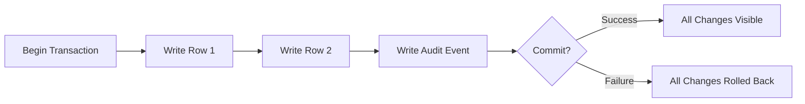
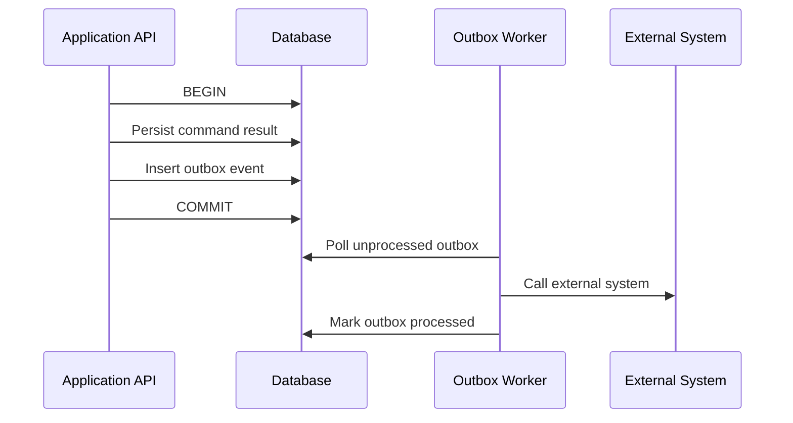
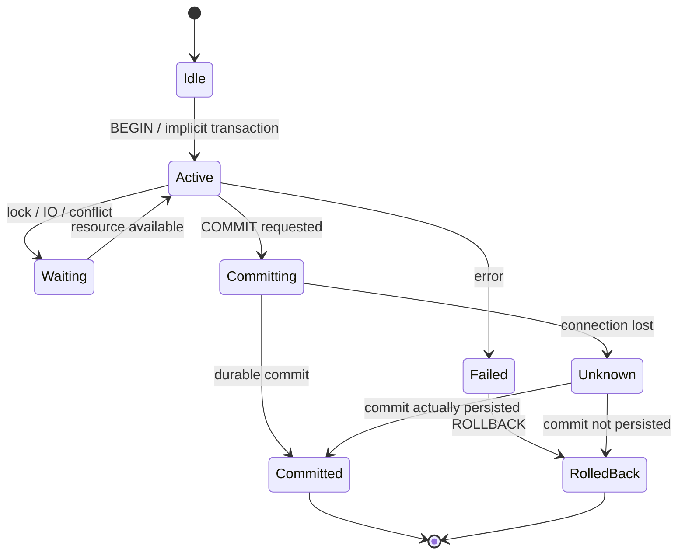

# Part 027 — Transaction Model Deep Dive

> Target pembelajaran: setelah bagian ini, kamu tidak lagi melihat transaction sebagai sekadar `BEGIN` dan `COMMIT`. Kamu akan melihat transaction sebagai **unit perubahan state yang harus menjaga invariant**, memiliki boundary, failure semantics, retry behavior, observability, dan konsekuensi performa.

Transaction adalah salah satu konsep database yang paling sering dianggap “sudah paham” tetapi paling sering menjadi sumber bug produksi: double submit, lost update, inconsistent status, duplicate ledger row, incorrect balance, race condition pada approval, stock minus, case transition loncat, idempotency gagal, dan audit trail tidak sinkron.

Di level top engineer, pertanyaannya bukan:

> “Apakah query ini dibungkus transaction?”

Tetapi:

> “Invariant apa yang harus benar sebelum dan sesudah perubahan state ini, data mana yang harus berubah atomically, isolation apa yang dibutuhkan, failure apa yang mungkin terjadi, dan bagaimana caller harus retry tanpa merusak correctness?”

---

## 1. Mental Model: Transaction adalah Boundary Perubahan State

Database menyimpan state. Transaction adalah cara kita mengatakan:

> “Sekelompok perubahan ini harus diperlakukan sebagai satu perubahan logis terhadap dunia.”

Contoh sederhana:

```sql
BEGIN;

UPDATE account
SET balance = balance - 100
WHERE account_id = 'A';

UPDATE account
SET balance = balance + 100
WHERE account_id = 'B';

INSERT INTO transfer_event (
  transfer_id,
  from_account_id,
  to_account_id,
  amount,
  occurred_at
) VALUES (
  'T-001', 'A', 'B', 100, now()
);

COMMIT;
```

Secara bisnis, transfer bukan tiga operasi. Transfer adalah satu perubahan state:

1. saldo sumber berkurang,
2. saldo tujuan bertambah,
3. bukti transfer tercatat.

Kalau hanya dua dari tiga operasi berhasil, state database mungkin valid secara syntax, tetapi salah secara domain.

**Transaction boundary harus mengikuti invariant domain, bukan mengikuti kenyamanan kode.**

---

## 2. ACID Bukan Checklist Hafalan

ACID sering dijelaskan sebagai:

- Atomicity
- Consistency
- Isolation
- Durability

Penjelasan itu benar, tapi terlalu dangkal kalau tidak dihubungkan ke desain.

### 2.1 Atomicity: All or Nothing terhadap Perubahan Logis

Atomicity berarti perubahan di dalam transaction berhasil semua atau batal semua.



Atomicity menjawab failure seperti:

- koneksi putus di tengah write,
- constraint violation setelah sebagian row ditulis,
- application exception,
- deadlock victim rollback,
- serialization failure,
- process crash sebelum commit.

Atomicity tidak otomatis menjawab:

- apakah data yang ditulis benar secara domain,
- apakah transaksi terlalu besar,
- apakah caller aman melakukan retry,
- apakah efek eksternal seperti email/payment ikut rollback.

Inilah jebakan penting: **database transaction hanya mengontrol state di dalam database itu**, bukan seluruh dunia.

### 2.2 Consistency: Bukan “Database Selalu Konsisten”

Dalam ACID, consistency sering disalahpahami sebagai jaminan database menjaga semua aturan bisnis.

Database hanya bisa menjaga aturan yang dinyatakan lewat mekanisme yang dipahaminya:

- `NOT NULL`
- `CHECK`
- `UNIQUE`
- `FOREIGN KEY`
- exclusion constraint
- trigger
- transaction logic
- isolation level
- lock strategy

Kalau invariant hanya hidup di komentar Jira atau service method yang tidak atomik, database tidak bisa menjaganya.

Contoh invariant:

> Satu case hanya boleh punya satu active primary investigator.

Bisa dijaga dengan partial unique index:

```sql
CREATE UNIQUE INDEX uq_case_active_primary_investigator
ON case_assignment(case_id)
WHERE role = 'PRIMARY_INVESTIGATOR'
  AND ended_at IS NULL;
```

Tanpa constraint, dua request concurrent bisa sama-sama membaca “belum ada primary investigator”, lalu sama-sama insert.

### 2.3 Isolation: Seberapa Terpisah Transaction Concurrent?

Isolation menjawab:

> “Saat banyak transaction berjalan bersamaan, apakah hasil akhirnya setara dengan urutan yang aman?”

Semakin kuat isolation, semakin mudah reasoning correctness. Tetapi semakin besar potensi blocking, abort, retry, atau overhead.

Isolation bukan hanya setting database. Ia adalah bagian dari desain API, retry strategy, dan invariant.

### 2.4 Durability: Commit Harus Bertahan dari Crash

Durability berarti setelah commit berhasil dikonfirmasi, database harus bisa memulihkan perubahan tersebut setelah crash.

Biasanya ini melibatkan:

- write-ahead log,
- fsync/durable flush,
- checkpoint,
- recovery replay,
- replication durability jika HA digunakan.

Durability menjawab:

> “Jika database crash setelah `COMMIT` sukses, apakah perubahan tetap ada?”

Durability tidak menjawab:

- apakah data sudah direplikasi ke region lain,
- apakah backup sudah menangkap perubahan itu,
- apakah downstream system sudah menerima event,
- apakah transaction aman dari human error setelah commit.

---

## 3. Transaction Boundary: Pertanyaan yang Harus Selalu Dijawab

Sebelum menulis transaction, jawab pertanyaan ini:

1. **Apa command bisnisnya?**
2. **Entity mana yang berubah?**
3. **Invariant apa yang harus benar setelah command selesai?**
4. **Data apa yang harus berubah atomically?**
5. **Apakah transaction membaca data yang bisa berubah oleh transaction lain?**
6. **Apakah ada efek eksternal?**
7. **Apakah command boleh di-retry?**
8. **Apa failure response untuk caller?**
9. **Apa yang harus diaudit?**
10. **Bagaimana kita tahu transaction ini bermasalah di production?**

Contoh command:

> Approve enforcement case.

Naive implementation:

```sql
UPDATE enforcement_case
SET status = 'APPROVED'
WHERE case_id = :case_id;
```

Production-grade transaction mungkin perlu:

- verify current state,
- verify current assignee/role,
- verify all mandatory evidence present,
- update case state,
- insert transition history,
- insert decision record,
- create downstream outbox event,
- update SLA clock,
- ensure idempotency key,
- return consistent command result.

```sql
BEGIN;

SELECT case_id, status, version
FROM enforcement_case
WHERE case_id = :case_id
FOR UPDATE;

-- validate state transition in application or DB function
-- validate mandatory evidence exists

UPDATE enforcement_case
SET status = 'APPROVED',
    version = version + 1,
    updated_at = now(),
    updated_by = :actor_id
WHERE case_id = :case_id
  AND status = 'UNDER_REVIEW';

INSERT INTO case_transition (
  case_id,
  from_status,
  to_status,
  actor_id,
  reason,
  occurred_at
) VALUES (
  :case_id,
  'UNDER_REVIEW',
  'APPROVED',
  :actor_id,
  :reason,
  now()
);

INSERT INTO case_decision (
  case_id,
  decision_type,
  decision_payload,
  actor_id,
  decided_at
) VALUES (
  :case_id,
  'APPROVAL',
  :decision_payload,
  :actor_id,
  now()
);

INSERT INTO outbox_event (
  aggregate_type,
  aggregate_id,
  event_type,
  payload,
  occurred_at
) VALUES (
  'ENFORCEMENT_CASE',
  :case_id,
  'CASE_APPROVED',
  :event_payload,
  now()
);

COMMIT;
```

Di sini transaction boundary mengikuti command bisnis, bukan sekadar satu row update.

---

## 4. Unit of Work: Transaction Bukan Tempat Menaruh Semua Hal

Kesalahan umum: memasukkan terlalu banyak operasi ke satu transaction karena ingin “aman”.

Transaction terlalu besar menyebabkan:

- lock ditahan lama,
- MVCC version menumpuk,
- vacuum tertahan,
- deadlock risk naik,
- connection pool cepat habis,
- retry mahal,
- user latency memburuk,
- blast radius membesar.

Transaction terlalu kecil menyebabkan:

- invariant pecah,
- audit tidak sinkron,
- data partial commit,
- race condition,
- state sulit direkonstruksi.

### Rule of Thumb

Transaction harus mencakup **semua perubahan yang harus benar secara atomik**, tetapi tidak boleh mencakup pekerjaan yang tidak perlu berada di critical section.

Jangan lakukan ini:

```text
BEGIN
  update database
  call external payment API
  send email
  upload file to object storage
  update more database rows
COMMIT
```

Masalah:

- external API tidak rollback,
- transaction lama,
- lock ditahan selama network call,
- jika commit gagal setelah payment sukses, state kacau,
- retry bisa double charge.

Lebih baik:



Transaction menjaga state internal dan outbox event. Efek eksternal diproses setelah commit dengan mekanisme retry/idempotency terpisah.

---

## 5. Transaction dan Invariant

Setiap transaction harus bisa dijelaskan dengan format:

```text
Command:
  <nama command>

Precondition:
  <state yang harus benar sebelum command>

Atomic writes:
  <row/table yang berubah bersama>

Invariant preserved:
  <aturan yang tetap benar setelah commit>

Concurrency protection:
  <constraint/lock/version/isolation>

Retry behavior:
  <aman atau tidak aman diulang>
```

Contoh:

```text
Command:
  Assign primary investigator to case

Precondition:
  Case exists and is not closed
  Actor has assignment permission

Atomic writes:
  Insert case_assignment
  Insert case_assignment_event
  Insert audit_event

Invariant preserved:
  One active PRIMARY_INVESTIGATOR per case

Concurrency protection:
  Partial unique index on (case_id) where role='PRIMARY_INVESTIGATOR' and ended_at is null

Retry behavior:
  Safe if request_id/idempotency_key is unique
```

SQL constraint:

```sql
CREATE UNIQUE INDEX uq_one_active_primary_investigator
ON case_assignment(case_id)
WHERE role = 'PRIMARY_INVESTIGATOR'
  AND ended_at IS NULL;
```

Idempotency:

```sql
CREATE TABLE idempotency_record (
  idempotency_key text PRIMARY KEY,
  command_name text NOT NULL,
  request_hash text NOT NULL,
  response_payload jsonb,
  status text NOT NULL,
  created_at timestamptz NOT NULL DEFAULT now()
);
```

---

## 6. Transaction Lifecycle dari Sudut Database

Secara simplified:



Hal penting: dari sisi aplikasi, ada kondisi **commit unknown**.

Contoh:

1. Aplikasi mengirim `COMMIT`.
2. Database berhasil commit.
3. Koneksi putus sebelum aplikasi menerima response.
4. Aplikasi tidak tahu apakah commit berhasil.

Kalau caller melakukan retry tanpa idempotency, bisa terjadi duplicate command.

Karena itu command penting harus punya idempotency key atau natural uniqueness.

---

## 7. Autocommit: Transaction yang Tidak Kamu Lihat Tetap Transaction

Banyak database/client menjalankan setiap statement sebagai transaction sendiri jika autocommit aktif.

```sql
UPDATE account SET balance = balance - 100 WHERE account_id = 'A';
UPDATE account SET balance = balance + 100 WHERE account_id = 'B';
```

Jika autocommit aktif, ini dua transaction terpisah.

Failure di antara dua statement menghasilkan state partial.

Untuk command multi-write, autocommit harus dimatikan atau explicit transaction harus digunakan:

```sql
BEGIN;
UPDATE account SET balance = balance - 100 WHERE account_id = 'A';
UPDATE account SET balance = balance + 100 WHERE account_id = 'B';
COMMIT;
```

Mental model:

> Autocommit aman untuk statement tunggal yang sudah membawa invariant-nya sendiri. Autocommit berbahaya untuk command logis yang terdiri dari beberapa statement.

---

## 8. Implicit Transaction vs Explicit Transaction

Satu SQL statement biasanya atomic sebagai statement.

```sql
UPDATE inventory
SET reserved_qty = reserved_qty + 1
WHERE sku = :sku
  AND available_qty - reserved_qty >= 1;
```

Statement ini bisa menjadi transaction kecil yang cukup aman karena read dan write terjadi dalam satu statement dengan predicate guard.

Bandingkan dengan pola rentan:

```sql
SELECT available_qty, reserved_qty
FROM inventory
WHERE sku = :sku;

-- application checks availability

UPDATE inventory
SET reserved_qty = reserved_qty + 1
WHERE sku = :sku;
```

Jika tidak dikunci atau tidak diberi predicate guard, concurrent request bisa membaca stock yang sama.

Lebih baik:

```sql
UPDATE inventory
SET reserved_qty = reserved_qty + :qty
WHERE sku = :sku
  AND available_qty - reserved_qty >= :qty
RETURNING sku, available_qty, reserved_qty;
```

Ini disebut **atomic conditional update**.

---

## 9. Read-Modify-Write: Pattern Paling Berbahaya

Banyak bug concurrency berasal dari pola:

```text
read current value
calculate new value in application
write new value
```

Contoh lost update:

```sql
-- Transaction A reads balance = 100
-- Transaction B reads balance = 100
-- A writes balance = 90
-- B writes balance = 80
-- expected maybe 70, actual 80
```

Alternatif lebih aman:

### 9.1 Atomic Increment/Decrement

```sql
UPDATE account
SET balance = balance - :amount
WHERE account_id = :account_id
  AND balance >= :amount;
```

### 9.2 Optimistic Version Check

```sql
UPDATE account
SET balance = :new_balance,
    version = version + 1
WHERE account_id = :account_id
  AND version = :expected_version;
```

Jika affected row = 0, caller harus reload dan retry atau return conflict.

### 9.3 Pessimistic Lock

```sql
BEGIN;

SELECT balance
FROM account
WHERE account_id = :account_id
FOR UPDATE;

UPDATE account
SET balance = :new_balance
WHERE account_id = :account_id;

COMMIT;
```

Pilih berdasarkan contention dan business semantics.

---

## 10. Transaction dan External Side Effect

Database transaction tidak bisa rollback:

- email yang sudah terkirim,
- payment yang sudah diproses,
- message yang sudah publish ke broker di luar transaction,
- file yang sudah di-upload,
- API call ke sistem lain.

Anti-pattern:

```java
@Transactional
public void approveCase(String caseId) {
    caseRepository.approve(caseId);
    emailClient.sendApprovalEmail(caseId); // external side effect inside DB transaction
    auditRepository.insert(...);
}
```

Masalah:

- email bisa terkirim tetapi transaction rollback,
- transaction bisa commit tetapi email gagal,
- retry bisa mengirim email dua kali,
- latency external call memperpanjang lock.

Pattern lebih aman:

```java
@Transactional
public void approveCase(String caseId, String requestId) {
    caseRepository.approve(caseId);
    outboxRepository.insert(
        requestId,
        "CASE_APPROVED",
        payload
    );
}
```

Worker:

```java
public void publishOutbox() {
    List<OutboxEvent> events = outboxRepository.claimBatch();
    for (OutboxEvent event : events) {
        publisher.publish(event);
        outboxRepository.markPublished(event.id());
    }
}
```

Transaction boundary menjaga internal correctness; outbox menjaga reliable external propagation.

---

## 11. Savepoint: Partial Recovery di Dalam Transaction

Savepoint memungkinkan rollback sebagian pekerjaan di dalam transaction.

```sql
BEGIN;

INSERT INTO import_batch(batch_id, status)
VALUES (:batch_id, 'PROCESSING');

SAVEPOINT row_1;

INSERT INTO imported_record(batch_id, external_id, payload)
VALUES (:batch_id, :external_id, :payload);

-- if duplicate/invalid row
ROLLBACK TO SAVEPOINT row_1;

INSERT INTO import_error(batch_id, external_id, error_message)
VALUES (:batch_id, :external_id, :error);

COMMIT;
```

Gunakan savepoint untuk:

- bulk import yang ingin mencatat error per row,
- menjalankan beberapa operasi optional,
- recovery dari constraint violation lokal.

Jangan gunakan savepoint untuk menyembunyikan desain transaksi yang buruk. Jika transaction menjadi terlalu panjang dan kompleks, pecah workflow menjadi beberapa stage yang jelas.

---

## 12. Transaction Retry: Bukan Sekadar Loop

Beberapa failure transaction bersifat retryable:

- serialization failure,
- deadlock victim,
- transient connection failure sebelum transaction dimulai,
- lock timeout dalam skenario tertentu,
- distributed transaction restart.

Tetapi retry hanya aman jika command idempotent atau memiliki uniqueness guard.

Naive retry:

```java
for (int i = 0; i < 3; i++) {
    try {
        createPayment(paymentRequest);
        return;
    } catch (Exception e) {
        // retry blindly
    }
}
```

Bahaya:

- duplicate payment,
- duplicate audit event,
- duplicate notification,
- duplicate external call.

Better retry contract:

```java
for (int attempt = 1; attempt <= maxAttempts; attempt++) {
    try {
        return txTemplate.execute(() -> {
            IdempotencyRecord existing = idemRepo.find(requestId);
            if (existing != null && existing.isCompleted()) {
                return existing.response();
            }

            idemRepo.reserve(requestId, requestHash);
            CommandResult result = handler.execute(command);
            idemRepo.complete(requestId, result);
            return result;
        });
    } catch (SerializationFailureException | DeadlockLoserException e) {
        backoff(attempt);
    }
}
```

Retry harus memperhatikan:

- exception mana yang retryable,
- apakah transaction sudah rollback,
- apakah side effect sudah terjadi,
- apakah idempotency key stabil,
- apakah request payload sama dengan request sebelumnya,
- apakah retry memakai backoff dan jitter.

---

## 13. Commit Unknown dan Idempotency

Kasus paling berbahaya:

```text
application sends COMMIT
network drops
application does not receive success/failure
```

Database mungkin sudah commit.

Solusi bukan “retry saja”. Solusinya adalah menyediakan cara untuk menentukan hasil command.

Pattern:

```sql
CREATE TABLE command_result (
  command_id uuid PRIMARY KEY,
  command_type text NOT NULL,
  aggregate_type text NOT NULL,
  aggregate_id text NOT NULL,
  request_hash text NOT NULL,
  result_status text NOT NULL,
  response_payload jsonb,
  created_at timestamptz NOT NULL DEFAULT now()
);
```

Dalam transaction:

```sql
INSERT INTO command_result (
  command_id,
  command_type,
  aggregate_type,
  aggregate_id,
  request_hash,
  result_status
) VALUES (
  :command_id,
  'APPROVE_CASE',
  'CASE',
  :case_id,
  :request_hash,
  'PROCESSING'
);

-- perform state change

UPDATE command_result
SET result_status = 'COMPLETED',
    response_payload = :response
WHERE command_id = :command_id;
```

Saat retry setelah unknown commit:

1. cari `command_id`,
2. jika completed, return response lama,
3. jika request_hash berbeda, reject,
4. jika not found, execute,
5. jika processing terlalu lama, reconcile.

---

## 14. Transaction dan Lock Duration

Lock biasanya ditahan sampai transaction selesai.

Artinya performa transaction bukan hanya total query time, tetapi juga waktu lock dipegang.

Bad:

```text
BEGIN
  SELECT row FOR UPDATE
  perform expensive validation
  call remote service
  update row
COMMIT
```

Better:

```text
perform non-critical validation before transaction
BEGIN
  SELECT row FOR UPDATE
  re-check critical condition
  update row
COMMIT
call remote service via outbox
```

Prinsip:

- lakukan validasi mahal di luar transaction jika tidak membutuhkan lock,
- re-check invariant di dalam transaction,
- jangan melakukan remote call di dalam transaction,
- lock row dalam urutan konsisten,
- commit secepat mungkin setelah write selesai.

---

## 15. Transaction Scope di Application Layer

Application framework sering memberi annotation seperti:

```java
@Transactional
public void process() { ... }
```

Bahaya jika boundary terlalu luas:

```java
@Transactional
public void submitCase(SubmitCaseRequest request) {
    validateLargePayload(request);          // should be outside
    Case c = caseRepo.load(request.caseId());
    permissions.check(user, c);             // maybe outside or rechecked inside
    documentService.upload(request.files()); // external side effect
    caseRepo.submit(c);
    notificationService.send(...);           // external side effect
}
```

Lebih baik:

```java
public SubmitResult submitCase(SubmitCaseRequest request) {
    validatePayloadShape(request);

    UploadedDocument uploaded = documentStaging.store(request.files());

    return tx.execute(() -> {
        Case c = caseRepo.loadForUpdate(request.caseId());
        permissions.requireCanSubmit(user, c);
        caseRepo.attachStagedDocuments(c.id(), uploaded.refs());
        caseRepo.submit(c.id());
        outbox.insert("CASE_SUBMITTED", payload);
        return result;
    });
}
```

Boundary dibuat sadar, bukan dibiarkan mengikuti call stack.

---

## 16. Transaction dan Domain Event

Jika domain event harus merepresentasikan state yang committed, event harus dibuat dalam transaction yang sama dengan state change.

Bad:

```java
caseRepository.approve(caseId);
eventBus.publish(new CaseApproved(caseId));
```

Kalau publish berhasil lalu DB rollback, event bohong.

Better:

```sql
BEGIN;

UPDATE enforcement_case
SET status = 'APPROVED'
WHERE case_id = :case_id;

INSERT INTO outbox_event(event_type, aggregate_id, payload)
VALUES ('CASE_APPROVED', :case_id, :payload);

COMMIT;
```

Outbox event adalah **committed fact waiting to be published**.

---

## 17. Transaction dan Audit Trail

Audit yang ditulis di transaction terpisah bisa tidak konsisten.

Bad:

```text
Transaction 1: update case status commit
Transaction 2: insert audit event fails
```

Hasil: status berubah tanpa audit.

Jika audit event adalah mandatory evidence, tulis dalam transaction yang sama.

```sql
BEGIN;

UPDATE enforcement_case
SET status = 'CLOSED'
WHERE case_id = :case_id;

INSERT INTO audit_event(
  entity_type,
  entity_id,
  action,
  actor_id,
  occurred_at,
  metadata
) VALUES (
  'CASE',
  :case_id,
  'CLOSED',
  :actor_id,
  now(),
  :metadata
);

COMMIT;
```

Kalau audit volume sangat besar dan async diperlukan, gunakan outbox/CDC dengan clear loss semantics. Jangan diam-diam membuat audit best-effort untuk operasi regulatory-critical.

---

## 18. Transaction dan Constraint Violation sebagai Control Signal

Di sistem concurrent, constraint violation bukan selalu bug. Kadang ia adalah mekanisme concurrency control.

Contoh idempotency reservation:

```sql
INSERT INTO idempotency_record(idempotency_key, request_hash, status)
VALUES (:key, :hash, 'PROCESSING');
```

Jika duplicate key:

- request sama: return existing result atau wait/retry,
- request beda: reject conflict.

Contoh one active assignment:

```sql
CREATE UNIQUE INDEX uq_active_assignment
ON case_assignment(case_id, user_id, role)
WHERE ended_at IS NULL;
```

Concurrent insert kedua akan gagal. Itu benar. Application harus mengubah DB error menjadi domain response:

```text
409 Conflict: assignment already exists
```

Jangan selalu memperlakukan constraint violation sebagai 500.

---

## 19. Long-Running Transaction

Long-running transaction adalah musuh database OLTP.

Dampak:

- row version lama tidak bisa dibersihkan,
- vacuum/garbage collection tertahan,
- lock ditahan terlalu lama,
- replication lag meningkat,
- transaction ID wraparound risk pada engine tertentu,
- migration/DDL terblokir,
- query lain menunggu.

Penyebab umum:

- user think time di dalam transaction,
- streaming response sambil transaction terbuka,
- batch job besar tanpa chunking,
- ORM session dibuka terlalu luas,
- report query panjang di primary OLTP,
- background worker lupa commit/rollback.

Mitigasi:

- set transaction timeout,
- set idle-in-transaction timeout,
- chunk batch update,
- gunakan read replica untuk report,
- lakukan pagination/batching,
- pastikan connection pool membersihkan failed transaction,
- observability untuk transaction age.

---

## 20. Batch Transaction: Chunk, Checkpoint, Resume

Bad batch:

```sql
BEGIN;
UPDATE huge_table SET status = 'EXPIRED' WHERE expires_at < now();
COMMIT;
```

Risiko:

- lock besar,
- WAL besar,
- replication lag,
- rollback mahal,
- vacuum pressure,
- timeout.

Better:

```sql
WITH batch AS (
  SELECT id
  FROM huge_table
  WHERE status <> 'EXPIRED'
    AND expires_at < now()
  ORDER BY id
  LIMIT 1000
)
UPDATE huge_table h
SET status = 'EXPIRED'
FROM batch
WHERE h.id = batch.id
RETURNING h.id;
```

Pattern:

1. pilih batch kecil,
2. update dalam transaction singkat,
3. commit,
4. simpan checkpoint/progress,
5. repeat,
6. monitor lag/lock/WAL.

Batch job harus resume-safe.

---

## 21. Transaction dan Deadlock Prevention

Deadlock muncul saat transaction saling menunggu resource.

Contoh:

```text
T1 locks account A, then wants account B
T2 locks account B, then wants account A
```

Prevention:

- lock resource dalam urutan deterministik,
- gunakan index agar row lock tepat sasaran,
- kecilkan transaction scope,
- hindari user-defined arbitrary ordering,
- gunakan timeout,
- retry deadlock victim,
- jangan mix lock modes secara acak.

Transfer aman:

```java
String first = min(fromAccountId, toAccountId);
String second = max(fromAccountId, toAccountId);

SELECT * FROM account WHERE account_id = :first FOR UPDATE;
SELECT * FROM account WHERE account_id = :second FOR UPDATE;
```

Urutan lock konsisten mengurangi deadlock.

---

## 22. Transaction dan Business Idempotency

Idempotency bukan berarti “tidak ada efek”. Idempotency berarti **request yang sama diproses berulang menghasilkan hasil logis yang sama**.

Contoh create payment:

```sql
CREATE TABLE payment_request (
  request_id uuid PRIMARY KEY,
  payer_id uuid NOT NULL,
  amount numeric(18,2) NOT NULL,
  request_hash text NOT NULL,
  payment_id uuid,
  status text NOT NULL,
  created_at timestamptz NOT NULL DEFAULT now()
);
```

Jika retry dengan `request_id` sama:

- hash sama + completed: return existing payment,
- hash sama + processing: return pending/retry later,
- hash beda: reject,
- not found: process.

Idempotency harus berada di durable store, bukan hanya memory/cache.

---

## 23. Transaction dan Read Model

Jangan memaksa semua read model diperbarui dalam transaction utama jika read model bisa direbuild dan eventual consistency diterima.

Core transaction:

```text
Update source of truth
Insert audit/event/outbox
Commit
```

Async projection:

```text
Outbox/CDC consumer updates search index/materialized read model/cache
```

Tetapi jika read model adalah bagian dari invariant command berikutnya, ia bukan sekadar projection. Ia harus masuk source-of-truth boundary atau memiliki correction/rebuild mechanism yang jelas.

---

## 24. Transaction dan ORM

ORM dapat menyembunyikan transaction behavior:

- implicit flush sebelum query,
- lazy loading di dalam transaction,
- N+1 query memperpanjang transaction,
- dirty checking menulis lebih banyak column dari yang perlu,
- optimistic lock tidak dipakai,
- collection update menghasilkan delete/insert besar,
- cascade tidak terlihat jelas,
- transaction boundary mengikuti service method terlalu luas.

ORM aman jika:

- transaction boundary eksplisit,
- aggregate kecil,
- query jelas,
- lock behavior dipahami,
- flush point diketahui,
- generated SQL diperiksa,
- isolation dan retry strategy tidak disembunyikan.

Untuk command critical, SQL eksplisit sering lebih mudah diaudit daripada ORM magic.

---

## 25. Transaction Observability

Minimal metrics:

- transaction duration,
- commit/rollback count,
- deadlock count,
- serialization failure count,
- lock wait time,
- idle-in-transaction count,
- statement timeout count,
- retry count,
- connection pool wait time,
- long transaction age,
- rows affected distribution,
- WAL generation rate,
- replication lag after write-heavy transaction.

Logging penting:

- command name,
- transaction id/correlation id,
- aggregate id,
- idempotency key,
- retry attempt,
- isolation level,
- rows affected,
- duration,
- lock wait,
- failure code.

Tanpa observability, transaction bug terlihat seperti “database lambat”.

---

## 26. Failure Modes

| Failure Mode | Penyebab | Dampak | Mitigasi |
|---|---|---|---|
| Partial state change | Transaction terlalu kecil | Invariant rusak | Atomic boundary |
| Duplicate command | Retry tanpa idempotency | Double create/payment/event | Idempotency key + unique constraint |
| Lost update | Read-modify-write tanpa protection | Update hilang | Atomic update/version/lock |
| Long lock wait | Transaction panjang | Latency tinggi | Scope kecil, no remote call |
| Deadlock | Lock order berbeda | Rollback salah satu transaction | Deterministic lock order + retry |
| Audit gap | Audit di transaction terpisah | Tidak defensible | Audit dalam same transaction/outbox |
| Commit unknown | Network failure after commit | Duplicate retry risk | Command result table |
| Event lie | Publish sebelum commit | Downstream salah | Transactional outbox |
| Retry storm | Blind retry | Load makin buruk | Backoff, jitter, retry budget |
| Batch meltdown | Huge transaction | WAL/lag/lock spike | Chunking + checkpoint |

---

## 27. Transaction Design Checklist

Gunakan checklist ini sebelum approve desain command.

### Business Boundary

- Apa command bisnisnya?
- Apa aggregate/entity yang berubah?
- Apa precondition-nya?
- Apa invariant yang harus tetap benar?
- Apa output command yang durable?

### Atomicity

- Row/table mana harus berubah bersama?
- Apakah audit/event ikut atomic?
- Apakah ada derived data yang tidak harus atomic?
- Apakah transaction terlalu besar?

### Isolation

- Apakah command membaca data yang bisa berubah concurrently?
- Apakah predicate read butuh protection?
- Apakah perlu `FOR UPDATE`?
- Apakah optimistic version cukup?
- Apakah unique constraint bisa menjadi guard?

### Retry

- Failure mana yang retryable?
- Apakah command idempotent?
- Apakah ada request hash?
- Apakah retry bisa menyebabkan duplicate side effect?
- Apakah ada retry budget/backoff?

### External Effect

- Apakah transaction memanggil external API?
- Apakah event dipublish sebelum commit?
- Apakah outbox diperlukan?
- Apakah consumer idempotent?

### Operational

- Berapa expected duration?
- Berapa row yang dikunci?
- Apakah ada timeout?
- Apakah metrics tersedia?
- Apakah runbook deadlock/serialization failure tersedia?

---

## 28. Case Study: Approve Enforcement Case

### Requirement

- Case hanya bisa di-approve dari `UNDER_REVIEW`.
- Approval butuh minimal satu evidence mandatory.
- Approval harus mencatat decision dan audit.
- Event `CASE_APPROVED` harus dikirim ke downstream.
- Double submit dari UI harus aman.
- Concurrent approve/reject hanya boleh salah satu berhasil.

### Schema Sketch

```sql
CREATE TABLE enforcement_case (
  case_id uuid PRIMARY KEY,
  status text NOT NULL,
  version bigint NOT NULL DEFAULT 0,
  updated_at timestamptz NOT NULL DEFAULT now(),
  updated_by uuid NOT NULL
);

CREATE TABLE case_evidence (
  evidence_id uuid PRIMARY KEY,
  case_id uuid NOT NULL REFERENCES enforcement_case(case_id),
  evidence_type text NOT NULL,
  is_mandatory boolean NOT NULL DEFAULT false,
  accepted_at timestamptz,
  created_at timestamptz NOT NULL DEFAULT now()
);

CREATE TABLE case_decision (
  decision_id uuid PRIMARY KEY,
  case_id uuid NOT NULL REFERENCES enforcement_case(case_id),
  decision_type text NOT NULL,
  actor_id uuid NOT NULL,
  reason text NOT NULL,
  decided_at timestamptz NOT NULL DEFAULT now()
);

CREATE TABLE case_transition (
  transition_id uuid PRIMARY KEY,
  case_id uuid NOT NULL REFERENCES enforcement_case(case_id),
  from_status text NOT NULL,
  to_status text NOT NULL,
  actor_id uuid NOT NULL,
  reason text,
  occurred_at timestamptz NOT NULL DEFAULT now()
);

CREATE TABLE command_result (
  command_id uuid PRIMARY KEY,
  command_type text NOT NULL,
  aggregate_id uuid NOT NULL,
  request_hash text NOT NULL,
  result_status text NOT NULL,
  response_payload jsonb,
  created_at timestamptz NOT NULL DEFAULT now()
);

CREATE TABLE outbox_event (
  event_id uuid PRIMARY KEY,
  aggregate_type text NOT NULL,
  aggregate_id uuid NOT NULL,
  event_type text NOT NULL,
  payload jsonb NOT NULL,
  status text NOT NULL DEFAULT 'PENDING',
  created_at timestamptz NOT NULL DEFAULT now()
);
```

### Transaction

```sql
BEGIN;

INSERT INTO command_result (
  command_id,
  command_type,
  aggregate_id,
  request_hash,
  result_status
) VALUES (
  :command_id,
  'APPROVE_CASE',
  :case_id,
  :request_hash,
  'PROCESSING'
);

SELECT status, version
FROM enforcement_case
WHERE case_id = :case_id
FOR UPDATE;

-- application verifies status = UNDER_REVIEW
-- application verifies mandatory evidence exists using query below

SELECT count(*) AS mandatory_evidence_count
FROM case_evidence
WHERE case_id = :case_id
  AND is_mandatory = true
  AND accepted_at IS NOT NULL;

UPDATE enforcement_case
SET status = 'APPROVED',
    version = version + 1,
    updated_at = now(),
    updated_by = :actor_id
WHERE case_id = :case_id
  AND status = 'UNDER_REVIEW';

INSERT INTO case_decision (
  decision_id,
  case_id,
  decision_type,
  actor_id,
  reason
) VALUES (
  :decision_id,
  :case_id,
  'APPROVAL',
  :actor_id,
  :reason
);

INSERT INTO case_transition (
  transition_id,
  case_id,
  from_status,
  to_status,
  actor_id,
  reason
) VALUES (
  :transition_id,
  :case_id,
  'UNDER_REVIEW',
  'APPROVED',
  :actor_id,
  :reason
);

INSERT INTO outbox_event (
  event_id,
  aggregate_type,
  aggregate_id,
  event_type,
  payload
) VALUES (
  :event_id,
  'ENFORCEMENT_CASE',
  :case_id,
  'CASE_APPROVED',
  :payload
);

UPDATE command_result
SET result_status = 'COMPLETED',
    response_payload = :response_payload
WHERE command_id = :command_id;

COMMIT;
```

### Analysis

Protection:

- `FOR UPDATE` serializes competing transitions for same case.
- `command_result` handles idempotency/commit unknown.
- decision, transition, and outbox are atomic with case state.
- event is published after commit by worker.

Remaining concerns:

- mandatory evidence check must be inside transaction,
- if evidence can be removed concurrently, evidence row may also need lock or lifecycle rule,
- command_result duplicate must be mapped to idempotent response,
- outbox worker must be idempotent.

---

## 29. Senior-Level Heuristics

1. **Transaction boundary follows invariant, not method boundary.**
2. **Do not call external systems while holding DB locks.**
3. **Every retryable transaction must be idempotent.**
4. **Every command critical enough to retry needs a durable command identity.**
5. **Constraint violation can be a correct concurrency outcome.**
6. **Long transaction is production debt.**
7. **Read-modify-write requires protection.**
8. **Audit/event must be atomic with source-of-truth state if it represents that state.**
9. **Batch jobs need chunking and resume semantics.**
10. **If you cannot explain failure behavior, the transaction design is incomplete.**

---

## 30. Practical Exercise

Ambil satu command di sistemmu, lalu isi template ini:

```text
Command:

Input:

Idempotency key:

Source-of-truth tables:

Preconditions:

Writes inside transaction:

Writes outside transaction:

External side effects:

Invariant preserved:

Concurrency strategy:

Retryable errors:

Non-retryable errors:

Audit/event emitted:

Expected lock scope:

Expected transaction duration:

Metrics:

Failure runbook:
```

Jika salah satu bagian tidak bisa dijawab, desain transaction belum production-ready.

---

## 31. Penutup

Transaction adalah alat untuk menjaga state tetap benar di tengah failure dan concurrency. Tapi transaction bukan sihir. Ia tidak menggantikan desain invariant, idempotency, lock ordering, retry discipline, outbox, audit strategy, dan observability.

Database architect yang matang melihat transaction sebagai kontrak:

```text
Given current durable state and command input,
perform an atomic state transition,
preserve declared invariants,
make committed facts durable,
and expose safe failure/retry behavior.
```

Di bagian berikutnya kita masuk lebih tajam ke isolation level dan anomaly: dirty read, non-repeatable read, phantom, lost update, write skew, read skew, dan bagaimana memilih isolation tanpa sekadar menaikkan semua ke serializable.

