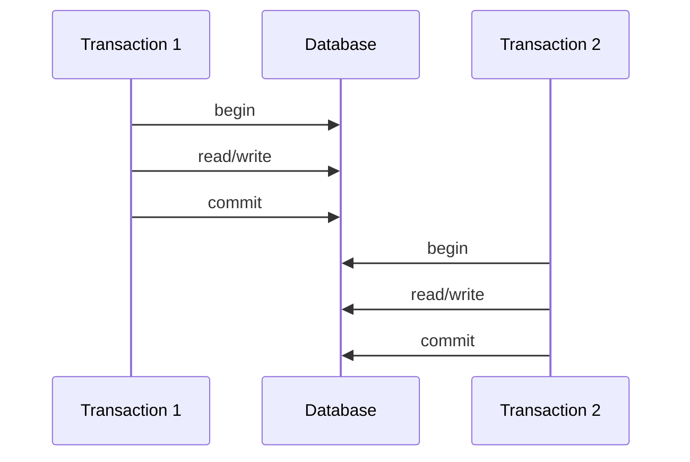
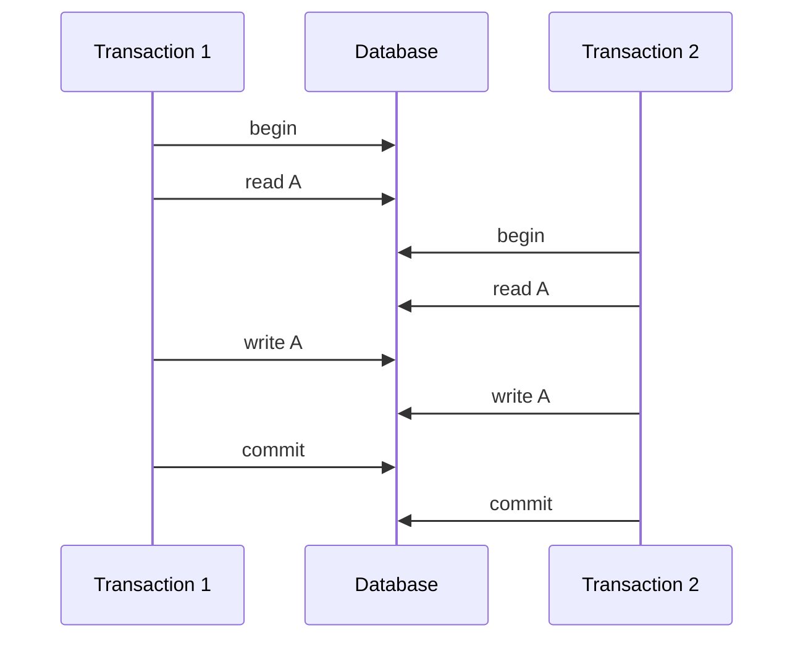
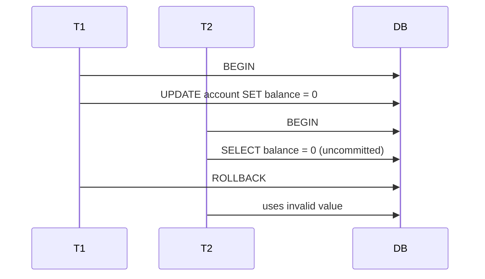
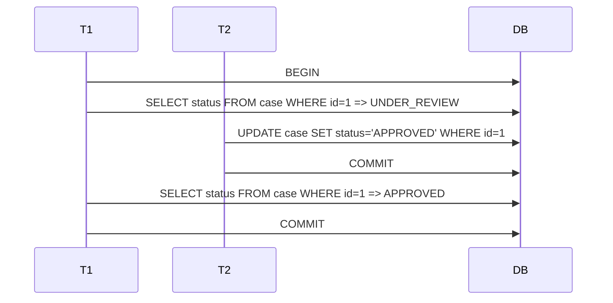
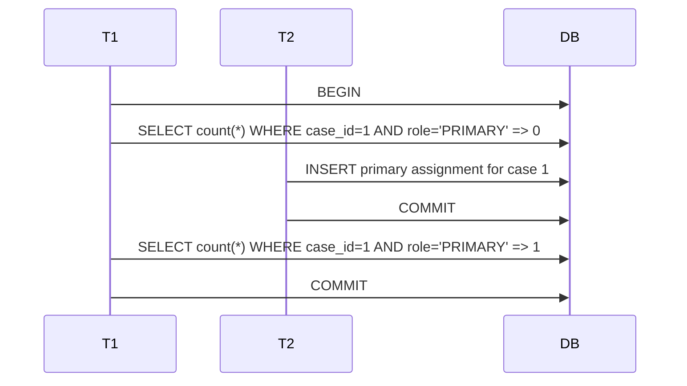
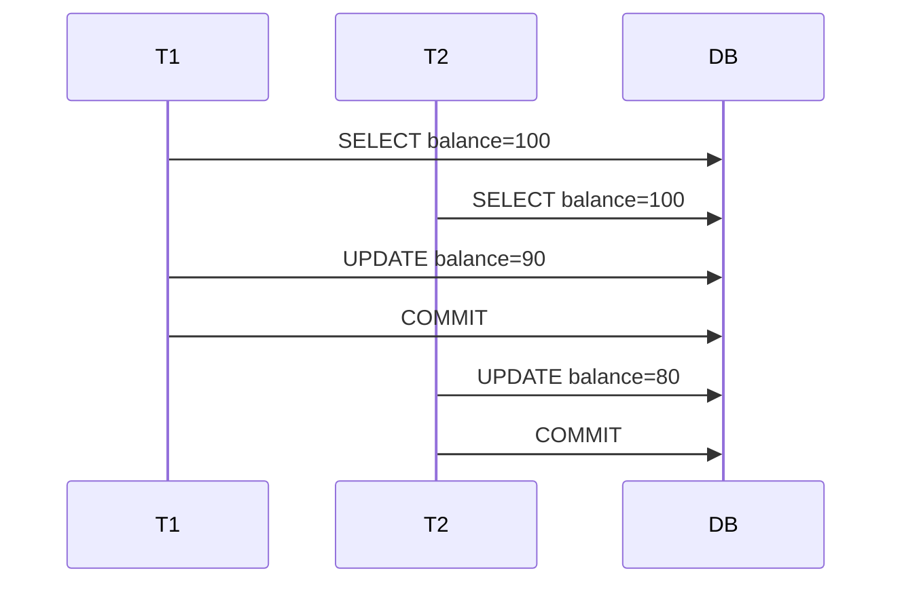
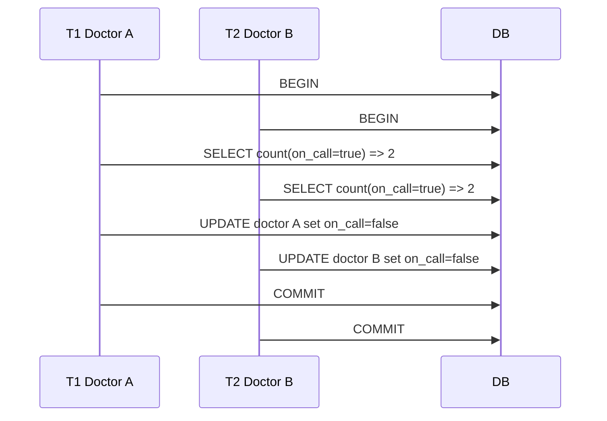

# Part 028 — Isolation Levels and Anomalies

> Target pembelajaran: setelah bagian ini, kamu bisa membaca isolation level bukan sebagai tabel hafalan, tetapi sebagai **risk model untuk invariant di bawah concurrency**. Kamu akan bisa menjawab: anomaly apa yang mungkin terjadi, invariant mana yang terdampak, dan apakah solusinya isolation level, lock, constraint, atomic update, atau redesign transaction.

Isolation adalah bagian ACID yang paling sering disalahpahami. Banyak engineer tahu nama level seperti `READ COMMITTED`, `REPEATABLE READ`, dan `SERIALIZABLE`, tetapi tidak bisa menjelaskan failure konkret yang masih mungkin terjadi.

Akibatnya ada dua ekstrem:

1. Semua dibiarkan default tanpa analisis.
2. Semua dinaikkan ke `SERIALIZABLE` tanpa memahami retry dan contention.

Keduanya berbahaya.

Isolation level harus dipilih berdasarkan:

- invariant yang harus dijaga,
- bentuk read/write transaction,
- data yang dipredicate-kan,
- tingkat contention,
- acceptable retry/abort rate,
- latency budget,
- engine behavior spesifik.

---

## 1. Mental Model: Isolation adalah Cara Database Menyusun Concurrent History

Jika transaction dijalankan satu per satu, reasoning mudah.



Tetapi production tidak seperti itu. Transaction overlap.



Isolation menentukan apakah overlap ini boleh, diblokir, melihat snapshot tertentu, atau gagal saat commit.

Pertanyaan architect:

> “Apakah hasil interleaving transaction concurrent masih menjaga invariant seolah-olah transaction berjalan dalam urutan yang valid?”

---

## 2. Kenapa Isolation Sulit?

Karena correctness bukan hanya tentang row yang sama.

Beberapa invariant berbasis satu row:

```text
balance >= 0
case.status must be valid enum
version must increase
```

Beberapa invariant berbasis banyak row:

```text
only one active primary investigator per case
at least one doctor must remain on call
total allocation must not exceed budget
no overlapping effective-dated rule for same tenant
```

Beberapa invariant berbasis predicate:

```text
no active case assignment where case_id = X and role = PRIMARY
no price rule overlaps date range
no more than 5 pending reviews for reviewer Y
```

Predicate-based invariant lebih sulit karena transaction tidak hanya bergantung pada row yang sudah ada, tetapi juga pada **ketiadaan row**.

---

## 3. Isolation Level bukan Universal Standard Behavior

Nama isolation level berasal dari SQL standard, tetapi implementasi engine berbeda.

Contoh penting:

- beberapa engine memakai lock-based concurrency,
- beberapa memakai MVCC,
- beberapa memakai snapshot isolation,
- beberapa mengimplementasikan serializable dengan SSI,
- beberapa distributed database memakai optimistic concurrency + retry.

Karena itu jangan hanya membaca nama isolation. Baca dokumentasi engine.

Dalam PostgreSQL, `READ UNCOMMITTED` diperlakukan seperti `READ COMMITTED`, dan `REPEATABLE READ` mencegah phantom read dalam cara PostgreSQL mengimplementasikannya. Ini berbeda dari tabel generik SQL standard yang sering muncul di artikel umum.

---

## 4. ANSI Isolation Level secara Konseptual

Secara konseptual:

| Isolation Level | Dirty Read | Non-repeatable Read | Phantom Read | Serial Anomaly |
|---|---:|---:|---:|---:|
| Read Uncommitted | Mungkin | Mungkin | Mungkin | Mungkin |
| Read Committed | Dicegah | Mungkin | Mungkin | Mungkin |
| Repeatable Read | Dicegah | Dicegah | Mungkin secara standard | Mungkin |
| Serializable | Dicegah | Dicegah | Dicegah | Dicegah |

Tetapi ini hanya starting point. Engine-specific behavior bisa lebih kuat atau berbeda.

---

## 5. Dirty Read

Dirty read terjadi saat transaction membaca data yang ditulis transaction lain tetapi belum commit.



Masalah:

- T2 membuat keputusan berdasarkan fakta yang tidak pernah committed.
- Downstream bisa melihat state yang sebenarnya tidak pernah ada.

Di database modern OLTP yang umum, dirty read biasanya tidak diizinkan pada default isolation. Tetapi tetap penting untuk memahami konsepnya.

Mitigasi:

- jangan gunakan isolation yang mengizinkan dirty read untuk command correctness-critical,
- gunakan committed reads,
- jangan gunakan `NOLOCK`-style hint untuk business-critical query.

---

## 6. Non-Repeatable Read

Non-repeatable read terjadi saat transaction membaca row yang sama dua kali dan mendapat nilai berbeda karena transaction lain commit di tengah.



Apakah ini bug? Tergantung.

Untuk dashboard read-only, mungkin acceptable.

Untuk command yang mengambil keputusan berdasarkan status pertama, berbahaya.

Contoh bug:

```text
T1 reads case status = UNDER_REVIEW
T2 approves case
T1 later writes reject decision based on old assumption
```

Mitigasi:

- `SELECT ... FOR UPDATE` untuk command transition,
- optimistic version check,
- single conditional update,
- repeatable read/snapshot untuk long read consistency,
- serializable jika invariant multi-row membutuhkan serial order.

---

## 7. Phantom Read

Phantom read terjadi saat transaction menjalankan predicate query dua kali dan mendapat set row berbeda karena transaction lain insert/delete/update row yang memenuhi predicate.



Phantom penting karena banyak invariant berbasis **ketiadaan**:

- tidak boleh ada overlapping rule,
- tidak boleh ada active primary assignment,
- tidak boleh ada duplicate pending task,
- quota belum melewati batas.

Mitigasi tergantung invariant:

### 7.1 Unique/Exclusion Constraint

Untuk invariant uniqueness, constraint biasanya lebih baik daripada isolation tinggi.

```sql
CREATE UNIQUE INDEX uq_one_active_primary
ON case_assignment(case_id)
WHERE role = 'PRIMARY_INVESTIGATOR'
  AND ended_at IS NULL;
```

### 7.2 Predicate Lock / Serializable

Untuk invariant predicate kompleks, serializable bisa dibutuhkan.

### 7.3 Materialized Counter dengan Lock

Untuk quota:

```sql
UPDATE reviewer_quota
SET pending_count = pending_count + 1
WHERE reviewer_id = :reviewer_id
  AND pending_count < max_pending;
```

Ini mengubah predicate multi-row menjadi single-row guarded update.

---

## 8. Lost Update

Lost update terjadi saat dua transaction membaca nilai yang sama, menghitung nilai baru, lalu salah satu update menimpa update lain.



Jika T1 mengurangi 10 dan T2 mengurangi 20, hasil benar harus 70. Actual 80 berarti update T1 hilang.

Mitigasi:

### 8.1 Atomic Update

```sql
UPDATE account
SET balance = balance - :amount
WHERE account_id = :account_id;
```

### 8.2 Optimistic Locking

```sql
UPDATE account
SET balance = :new_balance,
    version = version + 1
WHERE account_id = :account_id
  AND version = :expected_version;
```

### 8.3 Pessimistic Locking

```sql
SELECT balance
FROM account
WHERE account_id = :account_id
FOR UPDATE;
```

### 8.4 Serializable Isolation

Untuk beberapa engine, serializable akan abort salah satu transaction.

Prinsip: read-modify-write harus punya conflict detector.

---

## 9. Write Skew

Write skew adalah anomaly yang lebih subtle. Dua transaction membaca kondisi bersama, lalu menulis row berbeda sehingga invariant multi-row rusak.

Contoh klasik: minimal satu doctor on call.

Initial state:

| doctor_id | on_call |
|---|---:|
| A | true |
| B | true |

Invariant:

```text
At least one doctor must remain on call.
```

Interleaving:



Final state: zero doctors on call.

Tidak ada row yang sama ditulis oleh kedua transaction, jadi simple row lock pada masing-masing row tidak cukup jika lock tidak mencakup predicate/invariant.

Dalam case management:

```text
At least one active reviewer must remain on a case.
```

T1 remove reviewer A. T2 remove reviewer B. Keduanya membaca masih ada dua reviewer. Final: tidak ada reviewer.

Mitigasi:

### 9.1 Serializable Isolation

Biarkan database mendeteksi serial anomaly dan abort salah satu transaction.

### 9.2 Lock Parent/Aggregate Row

```sql
SELECT case_id
FROM enforcement_case
WHERE case_id = :case_id
FOR UPDATE;
```

Semua transaction yang mengubah reviewer case harus lock parent case row. Ini membuat perubahan terkait reviewer serialized per case.

### 9.3 Materialized Invariant Row

```sql
UPDATE case_assignment_counter
SET active_reviewer_count = active_reviewer_count - 1
WHERE case_id = :case_id
  AND active_reviewer_count > 1;
```

### 9.4 Constraint Redesign

Beberapa invariant bisa diubah menjadi constraint langsung, tetapi “at least one” sering sulit tanpa transaction logic.

---

## 10. Read Skew / Inconsistent Read

Read skew terjadi saat transaction membaca beberapa data yang seharusnya konsisten sebagai snapshot, tetapi mendapatkan campuran old/new state.

Contoh:

```text
T1 transfers 100 from A to B.
T2 reads A after debit but reads B before credit.
T2 sees total money lower than actual.
```

Dalam database dengan statement-level snapshot, satu statement biasanya konsisten. Tetapi multi-statement read pada `READ COMMITTED` bisa melihat snapshot berbeda per statement.

Report yang membaca banyak table dalam transaction panjang bisa menghasilkan output yang tidak merepresentasikan satu titik waktu.

Mitigasi:

- gunakan repeatable read/snapshot untuk report yang butuh point-in-time consistency,
- gunakan materialized snapshot/report table,
- gunakan as-of timestamp jika engine mendukung,
- jangan mencampur multiple reads default isolation untuk financial/regulatory report.

---

## 11. Read Committed

`READ COMMITTED` biasanya default di banyak database OLTP.

Mental model umum:

> Setiap statement hanya melihat data yang sudah committed sebelum statement tersebut berjalan.

Konsekuensi:

- dirty read dicegah,
- non-repeatable read mungkin,
- phantom mungkin,
- write conflict behavior tergantung engine,
- setiap statement bisa melihat snapshot berbeda.

Cocok untuk:

- simple CRUD,
- single-row guarded update,
- command dengan constraint kuat,
- dashboard yang tidak butuh point-in-time consistency,
- short transaction dengan recheck sebelum write.

Berbahaya untuk:

- multi-statement decision tanpa lock/version,
- predicate invariant tanpa constraint,
- long read report yang butuh snapshot konsisten,
- read-modify-write tanpa guard.

### Example Safe Pattern Under Read Committed

```sql
UPDATE inventory
SET reserved_qty = reserved_qty + :qty
WHERE sku = :sku
  AND available_qty - reserved_qty >= :qty
RETURNING sku, reserved_qty;
```

Single guarded update membuat condition dan write terjadi bersama.

### Example Unsafe Pattern Under Read Committed

```sql
SELECT available_qty - reserved_qty AS remaining
FROM inventory
WHERE sku = :sku;

-- application checks remaining >= qty

UPDATE inventory
SET reserved_qty = reserved_qty + :qty
WHERE sku = :sku;
```

Concurrent request bisa melewati check yang sama.

---

## 12. Repeatable Read / Snapshot Isolation

Dalam banyak MVCC database, repeatable read memberi transaction snapshot stabil.

Mental model:

> Transaction melihat database seperti pada satu titik waktu tertentu.

Cocok untuk:

- report multi-query yang butuh konsistensi snapshot,
- read-heavy transaction,
- memastikan row yang sama tidak berubah saat dibaca ulang,
- menghindari read skew.

Tetapi snapshot isolation tidak selalu sama dengan serializable. Write skew masih bisa terjadi di beberapa engine/level.

Contoh write skew di snapshot isolation:

- T1 dan T2 membaca snapshot sama,
- masing-masing menulis row berbeda,
- tidak ada write-write conflict,
- commit keduanya sukses,
- invariant multi-row rusak.

Maka jangan anggap repeatable read otomatis menjaga semua invariant.

---

## 13. Serializable

Serializable adalah isolation paling kuat secara konseptual.

Mental model:

> Hasil transaction concurrent harus setara dengan salah satu urutan serial transaction.

Jika tidak bisa, database harus block atau abort salah satu transaction.

Cocok untuk:

- invariant multi-row/predicate yang sulit dikunci manual,
- financial/regulatory command dengan correctness tinggi,
- workflow transition yang kompleks,
- small critical section dengan retry yang aman,
- desain yang mengutamakan correctness daripada maksimal throughput.

Tradeoff:

- transaction bisa gagal dengan serialization error,
- application wajib retry,
- contention tinggi bisa meningkatkan abort rate,
- long transaction lebih rentan gagal,
- debugging perlu observability.

Serializable bukan “set and forget”. Serializable memindahkan sebagian kompleksitas dari lock design ke retry discipline.

---

## 14. Isolation Level vs Explicit Locking

Isolation level dan locking bukan pengganti total satu sama lain.

| Need | Often Better Tool |
|---|---|
| Prevent duplicate active assignment | Unique partial index |
| Prevent lost update on one row | Atomic update / optimistic version / `FOR UPDATE` |
| Serialize all changes under one aggregate | Lock parent row |
| Preserve complex predicate invariant | Serializable or explicit invariant row |
| Generate consistent report | Repeatable read / snapshot / materialized report |
| Process work queue | `FOR UPDATE SKIP LOCKED` style pattern |
| Avoid duplicate command retry | Idempotency table |

Jangan menaikkan isolation untuk menutupi schema yang tidak punya constraint. Jika invariant bisa dinyatakan sebagai constraint, gunakan constraint.

---

## 15. Lock Parent Row Pattern

Untuk aggregate/case/workflow, sering lebih mudah serialize semua transition pada parent row.

```sql
BEGIN;

SELECT case_id, status
FROM enforcement_case
WHERE case_id = :case_id
FOR UPDATE;

-- modify children safely under parent lock
INSERT INTO case_assignment(...);
UPDATE case_sla(...);
INSERT INTO case_transition(...);

COMMIT;
```

Pattern ini cocok jika:

- semua command terkait aggregate bisa sepakat lock parent,
- contention per aggregate acceptable,
- invariant banyak terjadi di child rows,
- kamu ingin reasoning sederhana.

Kelemahan:

- parent row menjadi hotspot,
- command unrelated bisa saling block,
- harus disiplin: semua writer wajib mengikuti protocol.

Jika ada writer yang bypass parent lock, invariant tetap bisa rusak.

---

## 16. Optimistic Locking Pattern

Optimistic locking cocok saat conflict jarang.

Schema:

```sql
ALTER TABLE enforcement_case
ADD COLUMN version bigint NOT NULL DEFAULT 0;
```

Update:

```sql
UPDATE enforcement_case
SET status = :new_status,
    version = version + 1
WHERE case_id = :case_id
  AND version = :expected_version;
```

Jika affected row = 0:

```text
409 Conflict / reload and retry
```

Kelebihan:

- tidak menahan lock lama saat user berpikir,
- baik untuk UI edit form,
- conflict terlihat eksplisit.

Kekurangan:

- hanya melindungi row yang punya version,
- tidak otomatis melindungi predicate invariant,
- retry/merge logic bisa kompleks.

---

## 17. Pessimistic Locking Pattern

Pessimistic locking cocok saat conflict cukup sering atau command tidak boleh berjalan paralel.

```sql
BEGIN;

SELECT *
FROM enforcement_case
WHERE case_id = :case_id
FOR UPDATE;

-- validate and write

COMMIT;
```

Kelebihan:

- reasoning sederhana,
- command concurrent menunggu,
- baik untuk transition critical.

Kekurangan:

- lock wait,
- deadlock risk,
- long transaction berbahaya,
- user think time tidak boleh masuk transaction.

---

## 18. Atomic Conditional Update Pattern

Banyak invariant row-level bisa dijaga tanpa explicit transaction panjang.

```sql
UPDATE enforcement_case
SET status = 'APPROVED'
WHERE case_id = :case_id
  AND status = 'UNDER_REVIEW'
RETURNING case_id, status;
```

Jika no row returned, transition tidak valid atau sudah diproses.

Pattern ini cocok untuk:

- simple state transition,
- stock reservation,
- quota increment,
- status guard,
- balance debit dengan condition.

Kelemahannya: jika command juga harus menulis audit/outbox, tetap butuh explicit transaction agar audit/outbox atomic dengan update.

---

## 19. Predicate Invariant: Cara Memilih Solusi

Contoh invariant:

```text
No overlapping active pricing rule for same tenant, product, and date range.
```

Opsi:

### 19.1 Exclusion Constraint

Jika database mendukung range/exclusion constraint:

```sql
CREATE EXTENSION IF NOT EXISTS btree_gist;

CREATE TABLE pricing_rule (
  rule_id uuid PRIMARY KEY,
  tenant_id uuid NOT NULL,
  product_id uuid NOT NULL,
  valid_range tstzrange NOT NULL,
  EXCLUDE USING gist (
    tenant_id WITH =,
    product_id WITH =,
    valid_range WITH &&
  )
);
```

Ini kuat karena invariant berada di database.

### 19.2 Serializable Transaction

Baca overlapping rule, lalu insert jika tidak ada. Serializable mencegah interleaving yang tidak serializable.

### 19.3 Lock Scope Row

Buat parent row per product/tenant dan lock sebelum insert rule.

```sql
SELECT *
FROM product_rule_scope
WHERE tenant_id = :tenant_id
  AND product_id = :product_id
FOR UPDATE;
```

### 19.4 Advisory Lock

Gunakan hanya jika benar-benar dipahami dan didukung operational discipline. Advisory lock mudah salah karena tidak terikat FK/constraint natural.

---

## 20. Work Queue Isolation

Pattern worker queue sering butuh concurrency tinggi tanpa worker mengambil task yang sama.

```sql
WITH next_task AS (
  SELECT task_id
  FROM background_task
  WHERE status = 'PENDING'
  ORDER BY priority DESC, created_at
  LIMIT 10
  FOR UPDATE SKIP LOCKED
)
UPDATE background_task t
SET status = 'PROCESSING',
    claimed_at = now(),
    claimed_by = :worker_id
FROM next_task
WHERE t.task_id = next_task.task_id
RETURNING t.*;
```

Mental model:

- row yang sedang dikunci worker lain dilewati,
- worker tidak saling menunggu terlalu lama,
- task harus punya timeout/reclaim mechanism,
- processing harus idempotent.

Cocok untuk internal queue kecil/menengah. Untuk event streaming besar, gunakan broker khusus.

---

## 21. Isolation untuk Reporting

Report regulatory/financial sering butuh snapshot konsisten.

Bad:

```text
SELECT case header
SELECT case evidence
SELECT case decisions
SELECT case penalties
```

Jika tiap query melihat snapshot berbeda, report bisa mencampur state yang tidak pernah benar-benar ada bersama.

Opsi:

1. Jalankan report dalam repeatable read/snapshot transaction.
2. Gunakan materialized report snapshot.
3. Gunakan export job yang mencatat `as_of_time`.
4. Gunakan audit/event log reconstruction.
5. Gunakan warehouse snapshot.

Untuk report yang harus defensible, simpan metadata:

```text
report_id
as_of_time
query_version
schema_version
source_snapshot_id if available
created_by
created_at
```

---

## 22. Isolation dan Multi-Tenancy

Multi-tenant database menambah dimensi isolation.

Risiko:

- query lupa `tenant_id`,
- lock contention antar tenant,
- hot tenant memengaruhi tenant lain,
- report global membaca data tenant campur,
- RLS policy tidak konsisten dengan transaction behavior.

Best practice:

- semua unique key tenant-scoped jika entity tenant-owned,
- index prefix menyertakan `tenant_id` untuk query tenant-scoped,
- RLS/constraint/test untuk tenant boundary,
- long transaction tenant besar tidak boleh menahan migration semua tenant,
- observability per tenant.

Isolation level tidak menyelesaikan tenant isolation. Tenant isolation adalah schema + policy + query + operational design.

---

## 23. Isolation dan Application Cache

Database isolation tidak berlaku untuk cache di luar database.

Masalah:

```text
Transaction commits update status APPROVED
Cache still says UNDER_REVIEW
Another command reads cache and makes stale decision
```

Rule:

- cache boleh mempercepat read,
- cache tidak boleh menjadi authority untuk command invariant kecuali punya consistency protocol kuat,
- command harus re-read/re-check source of truth dalam transaction,
- cache invalidation/eventual update harus punya freshness contract.

Untuk command critical:

```text
Read cache for UX hint boleh.
Validate inside DB transaction wajib.
```

---

## 24. Isolation dan Message Consumers

Consumer event sering melakukan read-modify-write.

Contoh:

```text
Event: PaymentReceived
Consumer updates invoice paid_amount
```

Jika event duplicate atau concurrent:

- paid amount bisa double count,
- status bisa loncat,
- ledger duplicate.

Solusi:

```sql
BEGIN;

INSERT INTO processed_event(event_id, consumer_name, processed_at)
VALUES (:event_id, :consumer_name, now());

UPDATE invoice
SET paid_amount = paid_amount + :amount
WHERE invoice_id = :invoice_id;

COMMIT;
```

Duplicate insert gagal karena unique key, lalu consumer skip.

```sql
CREATE UNIQUE INDEX uq_processed_event
ON processed_event(event_id, consumer_name);
```

Consumer correctness biasanya lebih bergantung pada idempotency + constraint daripada isolation tinggi.

---

## 25. Isolation Decision Matrix

| Scenario | Recommended First Tool | Why |
|---|---|---|
| Single row status transition | Conditional update or `FOR UPDATE` | Simple conflict control |
| UI edit form | Optimistic version | Avoid long lock across user think time |
| One active assignment | Partial unique index | Declarative invariant |
| No date range overlap | Exclusion constraint or serializable | Predicate invariant |
| At least one reviewer remains | Parent lock or serializable | Multi-row invariant |
| Financial transfer | Transaction + row locks/atomic updates + ledger | Strong invariant/audit |
| Regulatory report | Repeatable snapshot/materialized report | Point-in-time consistency |
| Background task claim | `FOR UPDATE SKIP LOCKED` pattern | Concurrent worker coordination |
| Event consumer dedupe | Processed event unique key | Idempotency |
| Global quota | Counter row lock/atomic update | Avoid predicate race |

---

## 26. Isolation Smells

### 26.1 “It works in testing”

Concurrency bugs rarely appear in unit tests.

Add concurrent tests:

- two approvals at once,
- approve and reject at once,
- duplicate submit,
- assign two primary investigators,
- remove last reviewer concurrently,
- overlapping rule insert concurrently.

### 26.2 “We use transactions, so safe”

Transaction without proper isolation/constraint can still allow anomaly.

### 26.3 “Serializable solves everything”

Serializable still requires retry. Long/high-contention serializable transaction can become operational problem.

### 26.4 “Read replica is fine for command validation”

Replica can be stale. Command validation should use source-of-truth primary/consistent read unless stale decision is acceptable.

### 26.5 “Cache says it is allowed”

Cache is not isolation boundary.

---

## 27. Testing Isolation Bugs

Isolation bug test should use real database, not mock repository.

Pseudo test:

```java
@Test
void shouldNotAllowTwoPrimaryInvestigatorsConcurrently() throws Exception {
    ExecutorService pool = Executors.newFixedThreadPool(2);
    CountDownLatch ready = new CountDownLatch(2);
    CountDownLatch start = new CountDownLatch(1);

    Callable<Result> assignA = () -> {
        ready.countDown();
        start.await();
        return service.assignPrimary(caseId, investigatorA, requestIdA);
    };

    Callable<Result> assignB = () -> {
        ready.countDown();
        start.await();
        return service.assignPrimary(caseId, investigatorB, requestIdB);
    };

    Future<Result> f1 = pool.submit(assignA);
    Future<Result> f2 = pool.submit(assignB);

    ready.await();
    start.countDown();

    List<Result> results = List.of(f1.get(), f2.get());

    assertThat(results).hasOneSuccessAndOneConflict();
    assertThat(repository.countActivePrimary(caseId)).isEqualTo(1);
}
```

Test harus memverifikasi final invariant, bukan hanya response.

---

## 28. Observability untuk Isolation Problem

Monitor:

- lock wait duration,
- deadlock count,
- serialization failure count,
- retry count by command,
- conflict response count,
- unique constraint violation by constraint name,
- transaction duration,
- rows affected = 0 for conditional update,
- queue claim empty vs pending count,
- replica lag for read-after-write issues.

Log:

```text
command=APPROVE_CASE
case_id=...
isolation=READ_COMMITTED
retry_attempt=2
failure=serialization_failure
constraint=uq_one_active_primary
lock_wait_ms=530
transaction_duration_ms=890
```

Constraint names harus meaningful karena muncul di error dan metrics.

Bad:

```sql
CREATE UNIQUE INDEX idx_123 ON ...
```

Better:

```sql
CREATE UNIQUE INDEX uq_case_one_active_primary_investigator ON ...
```

---

## 29. Case Study: Prevent Double Approval/Reject

Requirement:

- Case status `UNDER_REVIEW`.
- Actor A approves.
- Actor B rejects at same time.
- Only one transition may commit.

### Option A: Conditional Update

```sql
BEGIN;

UPDATE enforcement_case
SET status = :target_status,
    version = version + 1,
    updated_by = :actor_id,
    updated_at = now()
WHERE case_id = :case_id
  AND status = 'UNDER_REVIEW'
RETURNING case_id, status;

-- if no row returned, conflict

INSERT INTO case_transition(...);
INSERT INTO outbox_event(...);

COMMIT;
```

This is simple and effective if all transition logic fits around the guarded update.

### Option B: Parent Row Lock

```sql
BEGIN;

SELECT status
FROM enforcement_case
WHERE case_id = :case_id
FOR UPDATE;

-- if status != UNDER_REVIEW, conflict
-- validate evidence/reason/etc.

UPDATE enforcement_case
SET status = :target_status
WHERE case_id = :case_id;

INSERT INTO case_transition(...);
INSERT INTO outbox_event(...);

COMMIT;
```

Better if validation needs multiple child reads under same case boundary.

### Option C: Serializable

Useful if transition validity depends on complex predicate across tables and manual lock protocol is hard.

But caller must handle serialization failure retry.

---

## 30. Case Study: No Overlapping Effective-Dated Rule

Requirement:

- For same tenant and rule code, date ranges cannot overlap.

Bad:

```sql
SELECT count(*)
FROM rule
WHERE tenant_id = :tenant_id
  AND rule_code = :rule_code
  AND valid_from < :new_valid_to
  AND valid_to > :new_valid_from;

-- if zero, insert
```

Concurrent inserts can both see zero.

Better options:

### Option A: Exclusion Constraint

```sql
CREATE EXTENSION IF NOT EXISTS btree_gist;

CREATE TABLE rule (
  rule_id uuid PRIMARY KEY,
  tenant_id uuid NOT NULL,
  rule_code text NOT NULL,
  valid_range tstzrange NOT NULL,
  EXCLUDE USING gist (
    tenant_id WITH =,
    rule_code WITH =,
    valid_range WITH &&
  )
);
```

### Option B: Scope Lock

```sql
BEGIN;

SELECT *
FROM rule_scope
WHERE tenant_id = :tenant_id
  AND rule_code = :rule_code
FOR UPDATE;

-- check overlap and insert

COMMIT;
```

### Option C: Serializable

Run check+insert under serializable and retry if serialization failure.

---

## 31. Practical Isolation Review Template

For each critical command:

```text
Command:

Isolation level:

Reads:
  - row reads:
  - predicate reads:
  - aggregate/count reads:

Writes:
  - inserted rows:
  - updated rows:
  - deleted/ended rows:

Invariants:

Possible anomalies:
  - lost update:
  - write skew:
  - phantom:
  - stale read:
  - duplicate command:

Protection:
  - constraints:
  - locks:
  - version check:
  - atomic update:
  - serializable retry:
  - idempotency:

Expected conflict behavior:

Retry behavior:

Observability:

Concurrent tests:
```

Kalau bagian “possible anomalies” kosong karena “sepertinya aman”, itu tanda bahaya. Harus dibuktikan.

---

## 32. Senior-Level Heuristics

1. **Default isolation is not a correctness proof.**
2. **Constraint beats convention.**
3. **Single-statement guarded update beats read-then-write.**
4. **Write skew is the anomaly senior engineers must actively hunt.**
5. **Serializable requires retry discipline.**
6. **Repeatable read helps consistent reads but may not preserve every invariant.**
7. **Lock parent row when aggregate-level invariant is more important than max concurrency.**
8. **Never validate command authority from stale cache/read replica.**
9. **Test final invariant under concurrency, not only response path.**
10. **Name constraints so production errors are understandable.**

---

## 33. Penutup

Isolation level adalah kontrak antara concurrency dan correctness. Tujuan kita bukan memilih level paling kuat secara buta, tetapi memilih protection yang paling tepat untuk invariant tertentu.

Cara berpikir yang benar:

```text
Invariant -> anomaly risk -> protection mechanism -> retry/error contract -> test -> observability
```

Kadang jawabannya `SERIALIZABLE`. Kadang jawabannya partial unique index. Kadang jawabannya parent row lock. Kadang jawabannya atomic conditional update. Kadang jawabannya redesign data model agar invariant tidak tersebar di predicate yang sulit dijaga.

Di bagian berikutnya kita akan membahas **MVCC, locking, dan contention**: bagaimana database memungkinkan reader/writer berjalan bersamaan, mengapa row version menumpuk, kenapa lock wait terjadi, bagaimana deadlock terbentuk, dan bagaimana mendesain transaction agar tetap benar tanpa menghancurkan throughput.

