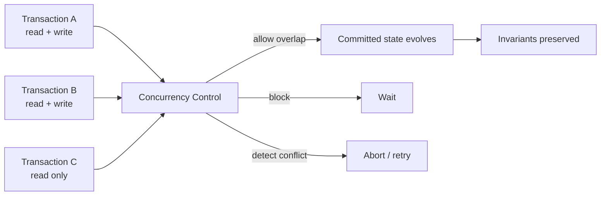
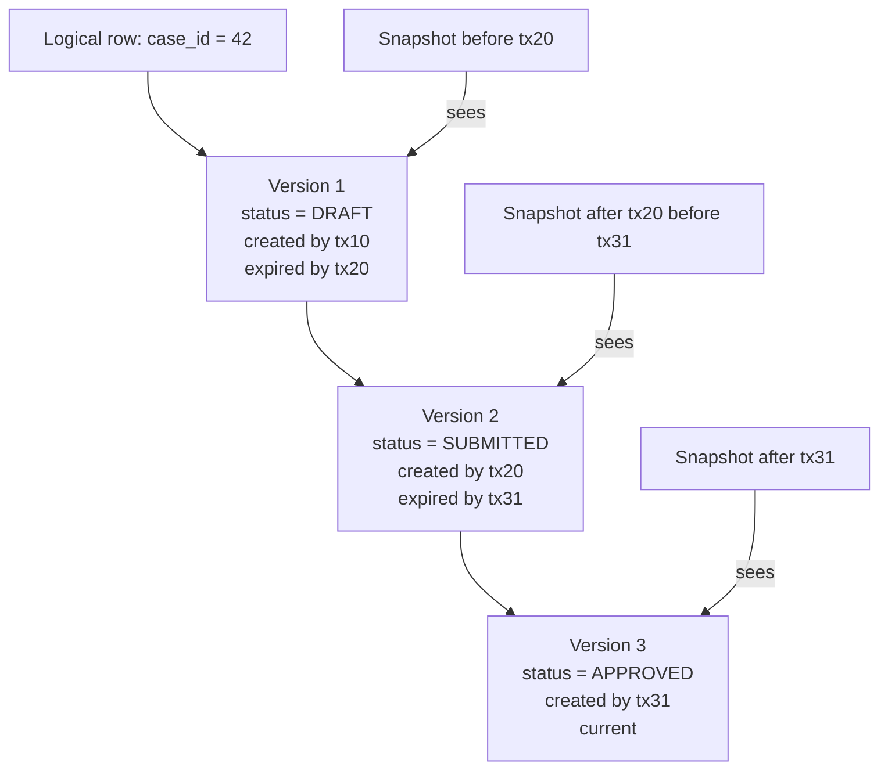
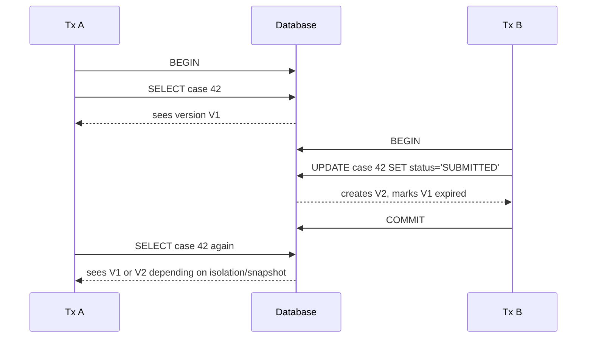
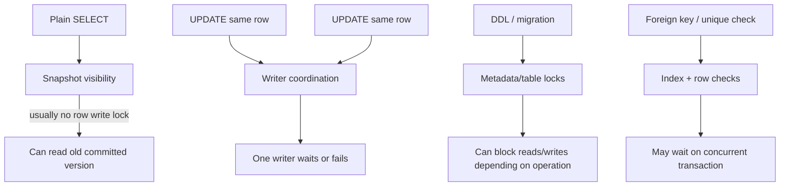
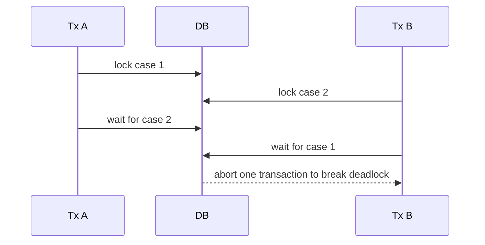
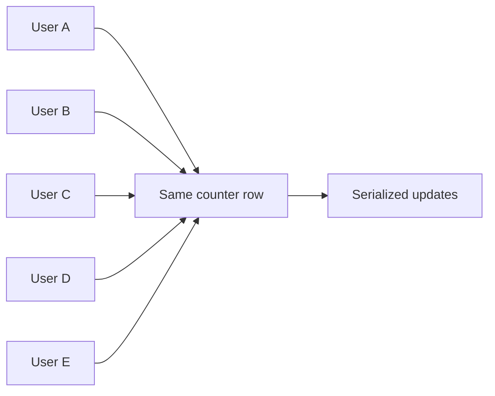
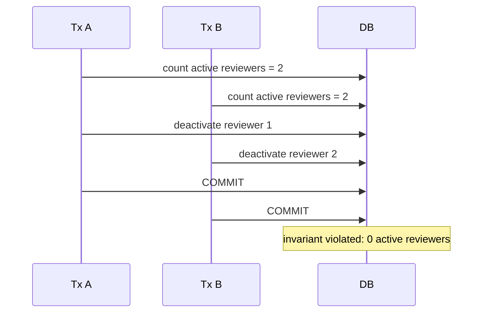

# Part 029 — MVCC, Locking, and Contention

Database concurrency is not mainly about making queries run in parallel.
It is about allowing many actors to read and change shared state while preserving invariants.

A top-tier database architect does not stop at: "the database supports transactions".
They ask sharper questions:

- What state is shared?
- Which writes can race?
- Which read must observe a stable snapshot?
- Which invariant is local to one row, one aggregate, one tenant, or the whole system?
- Which rows, indexes, partitions, or metadata objects become contention points?
- Which lock waits are acceptable, and which ones indicate a broken write path?

This part builds the operational mental model behind MVCC, locks, deadlocks, and contention.
The goal is not to memorize every lock mode in one database engine.
The goal is to understand what the database is doing when production traffic turns a clean schema into a blocked system.

---

## 1. The Core Mental Model

A database is a shared state machine.

Every transaction proposes a state transition.
Concurrency control decides which transitions can safely overlap and which ones must wait, retry, or abort.



The database engine is trying to satisfy three forces at once:

1. **Correctness** — illegal states must not become committed states.
2. **Concurrency** — independent transactions should not block each other unnecessarily.
3. **Performance** — the engine must avoid excessive coordination, disk I/O, and memory pressure.

MVCC is one strategy for balancing those forces.
Locks are another.
Modern transactional databases usually use both.

---

## 2. MVCC in One Sentence

**MVCC, or Multi-Version Concurrency Control, lets transactions see a stable version of data while other transactions are modifying newer versions of the same logical rows.**

Instead of having one physical copy of a row that every reader and writer fights over, the engine may keep multiple row versions.
A reader sees the version that is visible to its snapshot.
A writer creates a new version or marks an old version obsolete.



This is why in MVCC systems, simple readers often do not block simple writers.
But that does **not** mean there are no locks.
It means the database can often separate read visibility from write coordination.

---

## 3. What MVCC Solves

MVCC solves a fundamental problem: if every reader had to lock every row it reads, high-read systems would collapse under blocking.

For example, assume a dashboard reads 10,000 open cases while agents are updating individual cases.
Without MVCC, the dashboard could block agents, or agents could block the dashboard.
With MVCC, the dashboard can read a snapshot while agents continue creating newer row versions.

```sql
-- Dashboard query.
SELECT status, count(*)
FROM regulatory_case
WHERE tenant_id = :tenant_id
GROUP BY status;

-- Agent action at the same time.
UPDATE regulatory_case
SET status = 'UNDER_REVIEW', updated_at = now()
WHERE tenant_id = :tenant_id
  AND case_id = :case_id;
```

The dashboard may not see the newest update depending on its isolation level and snapshot timing.
That is usually acceptable for a dashboard.
It is not acceptable for a command that must enforce a business invariant.

That distinction matters.

MVCC helps reads scale.
MVCC does not automatically make application-level invariants safe.

---

## 4. What MVCC Does Not Solve

MVCC does not remove all conflicts.

It does not make these problems disappear:

- two writers updating the same row;
- two commands checking the same condition and both deciding it is safe to insert;
- a long transaction preventing cleanup of old row versions;
- a hot counter row updated thousands of times per second;
- a slow migration holding locks longer than expected;
- index page contention from monotonically increasing keys;
- stale reads from replicas;
- write skew across multiple rows;
- inconsistent application retry behavior;
- unbounded transactions that combine user think-time, network calls, and database locks.

A dangerous belief is:

> "We use MVCC, so locking is not a problem."

A better belief is:

> "MVCC reduces unnecessary read/write blocking, but write coordination, invariant enforcement, cleanup, and contention still require explicit design."

---

## 5. Snapshot, Visibility, and Row Versions

A transaction does not simply read "the table".
It reads a visibility-filtered view of row versions.

The exact implementation differs by engine, but the mental model is portable:

| Concept | Meaning |
|---|---|
| Transaction id | Logical marker identifying a transaction or commit order |
| Snapshot | The set of transaction effects visible to a statement or transaction |
| Row version | A physical representation of a logical row at some point in time |
| Visible row | A row version valid for the current snapshot |
| Dead row | A row version no longer visible to any active or future transaction |
| Vacuum / cleanup | Process that removes or reclaims obsolete versions |
| Tuple visibility | Engine-specific logic that decides which version a transaction sees |

A simplified update looks like this:



Under `READ COMMITTED`, many engines take a new snapshot per statement.
Under snapshot-style repeatable read, the transaction keeps a stable snapshot.
Under serializable isolation, the engine also tracks conflicts so the final result behaves as if transactions ran one at a time.

---

## 6. Readers, Writers, and the Dangerous Half-Truth

In MVCC systems, a common rule of thumb is:

> Readers do not block writers, and writers do not block readers.

This is useful but incomplete.

It usually applies to ordinary reads and writes on visible row versions.
It does not mean:

- DDL never blocks queries;
- updates to the same row can proceed simultaneously;
- foreign key checks never wait;
- unique index checks never wait;
- serializable transactions never abort;
- vacuum/cleanup has no relationship with long-running transactions;
- `SELECT FOR UPDATE` behaves like a normal `SELECT`;
- materialized view refresh, schema migration, or maintenance tasks are free.

The precise architecture view is:



Use the simple rule to reason quickly.
Use the detailed model to debug production.

---

## 7. Locks Still Exist Under MVCC

MVCC decides what row version a transaction can see.
Locks coordinate access to resources that cannot safely be changed concurrently.

Resources can include:

- rows;
- tables;
- indexes;
- pages;
- metadata/catalog entries;
- advisory application-level resources;
- predicate/range dependencies under serializable isolation;
- internal latches protecting in-memory structures.

At the application design level, the most important categories are:

| Lock type | Used for | Architect concern |
|---|---|---|
| Row lock | Coordinate concurrent updates to the same row | Hot rows, deadlocks, lock ordering |
| Table lock | Protect table-level operations | DDL, migrations, bulk operations |
| Predicate/range dependency | Protect logical conditions under serializable isolation | Write skew, phantom prevention, retry |
| Advisory lock | Application-defined coordination | Non-row resource, distributed job, coarse critical section |
| Internal latch | Protect engine internals | Usually not directly controlled, but can surface as contention |

A plain `SELECT` usually does not acquire row locks that block writers.
A `SELECT ... FOR UPDATE` does.

```sql
BEGIN;

SELECT *
FROM regulatory_case
WHERE tenant_id = :tenant_id
  AND case_id = :case_id
FOR UPDATE;

-- Safe to make decisions based on the locked current row.
UPDATE regulatory_case
SET status = 'ESCALATED'
WHERE tenant_id = :tenant_id
  AND case_id = :case_id;

COMMIT;
```

This is a deliberate pessimistic concurrency pattern.
It is powerful.
It is also easy to overuse.

---

## 8. Row Locking: The Practical Model

A row lock says: "another transaction cannot perform conflicting writes to this row until this transaction finishes."

Typical use cases:

- update account balance;
- transition case status;
- assign task to a worker;
- reserve inventory;
- approve a decision exactly once;
- ensure only one worker processes a job.

Example:

```sql
BEGIN;

SELECT id, status, assigned_to
FROM case_task
WHERE tenant_id = :tenant_id
  AND id = :task_id
FOR UPDATE;

-- Application checks status and permissions.

UPDATE case_task
SET status = 'IN_PROGRESS',
    assigned_to = :user_id,
    started_at = now()
WHERE tenant_id = :tenant_id
  AND id = :task_id;

COMMIT;
```

The important timing property:

> A lock is held until transaction end, not until the statement result is returned.

This means transaction duration is lock duration.

Bad transaction design creates lock contention even when each SQL statement is fast.

```java
// Bad shape: lock is held across external work.
transaction(() -> {
    Task task = taskRepository.lockTask(taskId);
    remotePolicyService.check(task);   // network call while DB lock is held
    emailService.send(...);            // external side effect while DB lock is held
    taskRepository.markApproved(taskId);
});
```

Better shape:

```java
// Better shape: external work happens before or after short DB transaction.
PolicyDecision decision = remotePolicyService.check(input);

transaction(() -> {
    Task task = taskRepository.lockTask(taskId);
    task.assertStillEligibleFor(decision);
    taskRepository.markApproved(taskId, decision.id());
    outboxRepository.enqueueApprovalNotification(taskId);
});

// Outbox worker sends email after commit.
```

---

## 9. Lock Wait vs Deadlock

A lock wait is not automatically a bug.
A transaction may legitimately wait for another transaction to finish.

A deadlock is different.
A deadlock occurs when transactions wait on each other in a cycle.



Deadlocks usually reveal inconsistent lock ordering.

Bad:

```sql
-- Transaction A
SELECT * FROM regulatory_case WHERE case_id = 1 FOR UPDATE;
SELECT * FROM regulatory_case WHERE case_id = 2 FOR UPDATE;

-- Transaction B
SELECT * FROM regulatory_case WHERE case_id = 2 FOR UPDATE;
SELECT * FROM regulatory_case WHERE case_id = 1 FOR UPDATE;
```

Better:

```sql
-- Always lock in deterministic order.
SELECT *
FROM regulatory_case
WHERE case_id IN (:case_id_a, :case_id_b)
ORDER BY case_id
FOR UPDATE;
```

The production rule:

> Any transaction that locks multiple entities must define a deterministic lock order.

---

## 10. Contention Is a Shape Problem

Contention is not just "too much traffic".
It is traffic concentrated on the same resource.

Ten thousand updates per second across ten thousand rows may be fine.
Ten thousand updates per second to one row may destroy throughput.



Common contention shapes:

| Shape | Example | Symptom |
|---|---|---|
| Hot row | `tenant_usage.current_count` updated every request | Lock waits, low write throughput |
| Hot parent | All child inserts validate/update same parent | Parent row lock contention |
| Hot index page | Monotonic inserts into same B-Tree edge | Insert latency, page split pressure |
| Hot tenant | One tenant dominates workload | Noisy neighbor, partition skew |
| Hot queue | Many workers claim from same small pending set | Lock waits, duplicate work risk |
| Long transaction | Report/export keeps snapshot open | Vacuum lag, bloat, old versions retained |
| DDL lock | Migration waits for or blocks active query | Incident during deployment |
| FK check contention | Parent row referenced by many concurrent child writes | Waits around referential integrity |
| Unique constraint contention | Many requests try same unique value/idempotency key | Waits or unique violation storm |

A senior engineer asks: "Where does concurrency collapse into serialization?"

---

## 11. Hot Row Example: Counter Table

A naive counter design:

```sql
CREATE TABLE tenant_usage_counter (
    tenant_id uuid PRIMARY KEY,
    api_call_count bigint NOT NULL DEFAULT 0,
    updated_at timestamptz NOT NULL DEFAULT now()
);
```

Every request does:

```sql
UPDATE tenant_usage_counter
SET api_call_count = api_call_count + 1,
    updated_at = now()
WHERE tenant_id = :tenant_id;
```

For a high-volume tenant, this single row becomes a serialization point.
Only one transaction can update the row at a time.

Better options depend on correctness requirement:

### Option A — Append events, aggregate asynchronously

```sql
CREATE TABLE tenant_usage_event (
    tenant_id uuid NOT NULL,
    event_id uuid NOT NULL,
    occurred_at timestamptz NOT NULL,
    unit_count integer NOT NULL,
    PRIMARY KEY (tenant_id, event_id)
);
```

Pros:

- high write throughput;
- natural audit trail;
- replayable;
- easy deduplication with `event_id`.

Cons:

- current count is eventually consistent unless aggregated in transaction;
- more storage;
- more query complexity.

### Option B — Bucketed counters

```sql
CREATE TABLE tenant_usage_counter_bucket (
    tenant_id uuid NOT NULL,
    bucket_no integer NOT NULL,
    api_call_count bigint NOT NULL DEFAULT 0,
    updated_at timestamptz NOT NULL DEFAULT now(),
    PRIMARY KEY (tenant_id, bucket_no)
);
```

Write path:

```sql
UPDATE tenant_usage_counter_bucket
SET api_call_count = api_call_count + 1,
    updated_at = now()
WHERE tenant_id = :tenant_id
  AND bucket_no = :bucket_no;
```

Read path:

```sql
SELECT sum(api_call_count)
FROM tenant_usage_counter_bucket
WHERE tenant_id = :tenant_id;
```

Pros:

- reduces row-level contention;
- bounded read aggregation.

Cons:

- approximate or delayed semantics if cached;
- more rows to manage;
- not suitable for every invariant.

### Option C — Enforce hard limit with atomic conditional update

```sql
UPDATE tenant_quota
SET used_count = used_count + 1
WHERE tenant_id = :tenant_id
  AND used_count < max_count;
```

Then check affected row count.

This remains a hot row but preserves a hard invariant.
Sometimes serialization is the cost of correctness.
The architect's job is to know when that cost is required.

---

## 12. Hot Parent Example: Aggregate-Level Invariant

Assume a case can have at most 5 active reviewers.

Naive flow:

```sql
SELECT count(*)
FROM case_reviewer
WHERE case_id = :case_id
  AND status = 'ACTIVE';

INSERT INTO case_reviewer(case_id, reviewer_id, status)
VALUES (:case_id, :reviewer_id, 'ACTIVE');
```

Two concurrent transactions can both see count 4 and both insert.
Now count is 6.

A common fix is parent-row locking:

```sql
BEGIN;

SELECT id
FROM regulatory_case
WHERE id = :case_id
FOR UPDATE;

SELECT count(*)
FROM case_reviewer
WHERE case_id = :case_id
  AND status = 'ACTIVE';

INSERT INTO case_reviewer(case_id, reviewer_id, status)
VALUES (:case_id, :reviewer_id, 'ACTIVE');

COMMIT;
```

This serializes reviewer assignment per case.
That may be acceptable because the invariant is per case.
It is much better than serializing reviewer assignment globally.

The design principle:

> Lock the smallest object that represents the invariant boundary.

---

## 13. Foreign Key Contention

Foreign keys are correctness tools.
They are not free.

When many transactions insert child rows referencing the same parent, the database must ensure the parent exists and is not concurrently deleted or changed in a way that violates referential integrity.
Depending on engine and operation, this can create waits around parent rows or indexes.

Example:

```sql
CREATE TABLE enforcement_case (
    id uuid PRIMARY KEY
);

CREATE TABLE evidence_item (
    id uuid PRIMARY KEY,
    case_id uuid NOT NULL REFERENCES enforcement_case(id),
    file_name text NOT NULL
);
```

High-volume evidence ingestion for one case can stress:

- parent row access;
- child foreign key index;
- insert locality;
- storage and WAL throughput;
- downstream audit/outbox writes.

Do not remove foreign keys casually.
Instead, decide deliberately:

| Choice | Use when | Risk |
|---|---|---|
| Keep FK | Same database boundary, correctness important | Possible write overhead |
| Deferrable FK | Complex transaction graph, temporary intermediate states | Error appears at commit |
| Application-enforced reference | Cross-service or cross-database boundary | Orphan risk, needs reconciliation |
| Periodic reconciliation | High-volume ingestion, eventual repair acceptable | Temporary inconsistency |

For strong internal data integrity, foreign keys are usually worth the cost.
If they become bottlenecks, inspect workload shape before deleting integrity.

---

## 14. Unique Constraint Contention

Unique constraints are a strong concurrency control mechanism.

Example:

```sql
CREATE TABLE idempotency_record (
    tenant_id uuid NOT NULL,
    idempotency_key text NOT NULL,
    request_hash text NOT NULL,
    response_status text NOT NULL,
    created_at timestamptz NOT NULL DEFAULT now(),
    PRIMARY KEY (tenant_id, idempotency_key)
);
```

Concurrent inserts for the same idempotency key will converge on one winner.
The loser must read the existing record and decide whether to return the stored result or reject a conflicting request hash.

```sql
INSERT INTO idempotency_record(
    tenant_id,
    idempotency_key,
    request_hash,
    response_status
)
VALUES (
    :tenant_id,
    :key,
    :hash,
    'PROCESSING'
)
ON CONFLICT (tenant_id, idempotency_key) DO NOTHING;
```

This is good contention.
It turns a race into deterministic behavior.

Bad unique contention happens when:

- clients retry with low-entropy keys;
- a sequence generator creates collisions;
- a unique index covers too wide a hot predicate;
- a single natural key is abused for unrelated workflow attempts;
- the application treats unique violation as a 500 error instead of a known concurrency outcome.

---

## 15. Long Transactions and MVCC Cleanup

MVCC keeps old row versions as long as they may still be visible to active transactions.
A long-running transaction can prevent cleanup.

Common causes:

- report/export transaction that runs for minutes or hours;
- open transaction left idle by application bug;
- batch job scanning huge table in one transaction;
- migration script that combines DDL, DML, and validation in one long transaction;
- interactive admin console session with `BEGIN` but no `COMMIT`;
- queue worker that starts transaction before doing slow external work.

Symptoms:

- table bloat;
- index bloat;
- vacuum lag;
- increased disk usage;
- slower sequential scans;
- slower index scans due to more dead entries;
- replication lag if WAL volume grows;
- transaction id wraparound pressure in some engines.

The rule:

> Long-running reads are not free in MVCC systems; they keep old versions alive.

Safer reporting patterns:

- use read replica with known staleness contract;
- chunk export by primary key/time window;
- avoid user think-time inside transaction;
- prefer short repeatable chunks over one giant transaction;
- materialize report snapshots deliberately;
- set transaction timeout and idle-in-transaction timeout.

---

## 16. `SELECT FOR UPDATE`, `NOWAIT`, and `SKIP LOCKED`

`SELECT FOR UPDATE` is a pessimistic lock.
It is useful when the application must read current state and then modify based on that state.

### Wait by default

```sql
SELECT *
FROM case_task
WHERE id = :task_id
FOR UPDATE;
```

If another transaction holds a conflicting lock, this waits.

### Fail fast with `NOWAIT`

```sql
SELECT *
FROM case_task
WHERE id = :task_id
FOR UPDATE NOWAIT;
```

Use this when waiting would harm user experience or when the caller can return a clear conflict response.

Example response:

```text
409 Conflict: task is currently being modified by another operation
```

### Skip locked rows for worker queues

```sql
SELECT id
FROM case_task
WHERE status = 'PENDING'
ORDER BY priority DESC, created_at ASC, id ASC
FOR UPDATE SKIP LOCKED
LIMIT 10;
```

This lets multiple workers claim different rows without waiting on the same locked rows.

But be careful:

- locked high-priority rows may be skipped;
- starvation is possible;
- ordering is not globally fair under concurrency;
- abandoned work needs timeout/reclaim logic;
- long transactions reduce queue throughput;
- `SKIP LOCKED` is not a substitute for idempotent processing.

Worker claim pattern:

```sql
WITH candidate AS (
    SELECT id
    FROM case_task
    WHERE status = 'PENDING'
      AND available_at <= now()
    ORDER BY priority DESC, created_at ASC, id ASC
    FOR UPDATE SKIP LOCKED
    LIMIT 10
)
UPDATE case_task t
SET status = 'IN_PROGRESS',
    locked_by = :worker_id,
    locked_at = now()
FROM candidate c
WHERE t.id = c.id
RETURNING t.*;
```

---

## 17. Advisory Locks

Advisory locks are application-defined locks managed by the database.
They are useful when the resource you need to coordinate does not map cleanly to a single row.

Examples:

- one migration per tenant;
- one scheduled billing run per account;
- one import job per external file;
- one recalculation per case;
- one maintenance task per named resource.

Conceptual example:

```sql
-- Engine-specific syntax; shown as PostgreSQL-style idea.
SELECT pg_try_advisory_xact_lock(hashtext(:resource_key));
```

Use transaction-scoped advisory locks when possible.
They are automatically released when the transaction ends.

Good use:

```text
resource_key = tenant:{tenant_id}:billing-cycle:{cycle_id}
```

Bad use:

```text
resource_key = global-import-lock
```

A global advisory lock can quietly become a platform-wide bottleneck.

Advisory lock rules:

1. Keep resource keys deterministic.
2. Keep critical sections small.
3. Prefer transaction-scoped locks.
4. Treat lock acquisition failure as a normal outcome.
5. Monitor lock wait time.
6. Do not use advisory locks to hide missing database constraints.

---

## 18. Predicate Conflicts and Write Skew

Some invariants are not about one row.
They are about a predicate.

Example:

> A case must always have at least one active reviewer.

Two transactions each deactivate a different reviewer.
Each sees another active reviewer and proceeds.
After both commit, there are zero active reviewers.



Row locks on each reviewer do not help if each transaction locks only its own row.

Possible fixes:

1. lock the parent case row before changing reviewer set;
2. use serializable isolation and retry serialization failures;
3. represent the invariant with a constraint where possible;
4. redesign workflow so one aggregate row owns the reviewer-set state;
5. use a counter with guarded update if exact count is needed.

The recurring design move:

> Convert predicate-level invariants into enforceable boundaries.

---

## 19. Isolation Level and MVCC Interaction

MVCC gives the engine versions.
Isolation level defines visibility and conflict behavior.

| Isolation style | Mental model | Architect consequence |
|---|---|---|
| Read committed | Each statement sees a fresh committed snapshot | Safer than dirty reads, but multi-statement logic can race |
| Repeatable read / snapshot | Transaction sees stable snapshot | Avoids read skew, but may still allow some predicate anomalies depending on engine |
| Serializable | Result equivalent to some serial order | Strongest model, but may require retries or blocking |

Do not choose isolation by superstition.
Choose it by invariant.

For many OLTP commands:

- keep transaction small;
- enforce most invariants with constraints and guarded writes;
- use row locks for aggregate-local state transitions;
- use serializable selectively when predicate invariants are complex;
- implement retry discipline where serializable or optimistic conflicts are expected.

---

## 20. Diagnosing Lock Contention

When production slows down, do not guess.
Build a wait graph.

Questions:

1. Which sessions are waiting?
2. What are they waiting for?
3. Who is blocking them?
4. How long has the blocker been running?
5. Is the blocker active, idle in transaction, or waiting too?
6. What query started the transaction?
7. Which table/index/row/predicate is involved?
8. Is this a normal high-contention path or a new incident?

PostgreSQL-style diagnostic query:

```sql
SELECT
    blocked.pid AS blocked_pid,
    blocked.query AS blocked_query,
    blocking.pid AS blocking_pid,
    blocking.query AS blocking_query,
    blocked.wait_event_type,
    blocked.wait_event,
    now() - blocked.query_start AS blocked_duration,
    now() - blocking.query_start AS blocking_duration
FROM pg_stat_activity blocked
JOIN pg_locks blocked_locks
  ON blocked_locks.pid = blocked.pid
JOIN pg_locks blocking_locks
  ON blocking_locks.locktype = blocked_locks.locktype
 AND blocking_locks.database IS NOT DISTINCT FROM blocked_locks.database
 AND blocking_locks.relation IS NOT DISTINCT FROM blocked_locks.relation
 AND blocking_locks.page IS NOT DISTINCT FROM blocked_locks.page
 AND blocking_locks.tuple IS NOT DISTINCT FROM blocked_locks.tuple
 AND blocking_locks.virtualxid IS NOT DISTINCT FROM blocked_locks.virtualxid
 AND blocking_locks.transactionid IS NOT DISTINCT FROM blocked_locks.transactionid
 AND blocking_locks.classid IS NOT DISTINCT FROM blocked_locks.classid
 AND blocking_locks.objid IS NOT DISTINCT FROM blocked_locks.objid
 AND blocking_locks.objsubid IS NOT DISTINCT FROM blocked_locks.objsubid
 AND blocking_locks.pid <> blocked_locks.pid
JOIN pg_stat_activity blocking
  ON blocking.pid = blocking_locks.pid
WHERE NOT blocked_locks.granted
  AND blocking_locks.granted;
```

Operationally, you want dashboards for:

- lock wait time;
- deadlock count;
- idle-in-transaction sessions;
- transaction age;
- query duration;
- blocking session count;
- row update rate by table;
- dead tuple growth;
- vacuum lag;
- replication lag;
- queue claim latency;
- retry rate;
- unique violation rate by constraint.

---

## 21. Diagnosing Long Transactions

Find old transactions:

```sql
SELECT
    pid,
    usename,
    application_name,
    state,
    now() - xact_start AS transaction_age,
    now() - query_start AS query_age,
    wait_event_type,
    wait_event,
    query
FROM pg_stat_activity
WHERE xact_start IS NOT NULL
ORDER BY xact_start ASC;
```

Things to inspect:

- Is the transaction `idle in transaction`?
- Is it from app, migration, report, admin console, or batch job?
- Does it hold locks?
- Is it preventing vacuum cleanup?
- Is it part of normal business flow?
- Can it be killed safely?
- Should there be timeout configuration?

Design response:

| Finding | Engineering fix |
|---|---|
| App transaction waits on external API | Move external call outside transaction or use outbox |
| Export transaction runs for hours | Chunk export or use snapshot table |
| Migration waiting on active query | Use online migration pattern and short lock windows |
| Worker idle in transaction | Fix worker transaction scope and timeout |
| Transaction age grows during traffic spike | Reduce batch size, shorten unit of work |

---

## 22. Database Contention Is Often Application Design Leaking

The database exposes contention, but the application often creates it.

Common examples:

### Chatty transaction

```text
BEGIN
SELECT entity
SELECT related A
SELECT related B
Call remote service
UPDATE entity
INSERT audit
INSERT outbox
COMMIT
```

Fix:

- fetch non-locking reads before transaction when possible;
- lock only at decision point;
- move external effects after commit;
- combine related writes;
- ensure indexes support locked reads.

### Coarse aggregate

A giant aggregate root forces unrelated operations to lock the same parent.

Fix:

- split aggregate by true invariant boundary;
- move independent counters/statuses to separate rows;
- use event stream or projection for derived summary.

### Global sequence of business events

A system wants one global ordering for everything.

Fix:

- challenge whether global order is needed;
- use per-tenant/per-case/per-account order if sufficient;
- use append-only event table with scoped sequence;
- separate audit order from business causality.

### Read model updated synchronously on every write

Every command updates many summary tables.

Fix:

- separate correctness write from projection update;
- use outbox/CDC to update projection;
- rebuild projection from source when drift occurs;
- define freshness contract.

---

## 23. Lock Granularity

Lock granularity is the size of the protected resource.

| Granularity | Example | Pros | Cons |
|---|---|---|---|
| Row | one task, one case, one account | precise, high concurrency | may not protect predicate invariants |
| Parent aggregate | one case before changing children | protects aggregate invariant | serializes child operations per parent |
| Tenant | one tenant maintenance job | simple isolation | noisy for large tenants |
| Table | bulk migration | simple operationally | blocks too much traffic |
| Global | one platform-wide job | easiest to reason about | worst scalability |

Architectural rule:

> Lock at the smallest boundary that fully protects the invariant.

Not smaller, or the invariant leaks.
Not larger, or throughput collapses.

---

## 24. Lock Ordering Discipline

Lock ordering is one of the simplest ways to prevent deadlocks.

Examples:

- always lock tenants by `tenant_id` ascending;
- always lock cases by `case_id` ascending;
- always lock account rows before ledger rows;
- always lock parent before child;
- always lock source account before destination account using ordered account ids, not transfer direction;
- always lock workflow definition before workflow instance if both must be changed.

Transfer example:

```sql
BEGIN;

SELECT id, balance
FROM account
WHERE id IN (:from_account_id, :to_account_id)
ORDER BY id
FOR UPDATE;

-- Then apply transfer logic.

COMMIT;
```

Do not lock by business action order.
Lock by deterministic resource order.

---

## 25. Deadlock Handling

Even with good design, deadlocks can happen.
The application must treat them as retryable when the operation is idempotent and safe to retry.

Retryable cases often include:

- deadlock detected;
- serialization failure;
- transient lock timeout;
- transient connection fail before known commit outcome;
- optimistic version conflict depending on UX.

Non-retryable cases include:

- unique constraint violation for non-idempotent command;
- foreign key violation due to invalid reference;
- check constraint violation due to bad input;
- permission failure;
- business rule failure.

Retry requires discipline:

```java
for (int attempt = 1; attempt <= maxAttempts; attempt++) {
    try {
        return transactionTemplate.execute(tx -> commandHandler.handle(command));
    } catch (TransientConcurrencyException ex) {
        if (attempt == maxAttempts) throw ex;
        sleep(backoffWithJitter(attempt));
    }
}
```

Never blindly retry every database exception.
That turns deterministic bugs into load amplification.

---

## 26. Contention and Index Design

Index design can create or relieve contention.

Examples:

### Missing index on lock query

```sql
SELECT *
FROM case_task
WHERE status = 'PENDING'
ORDER BY priority DESC, created_at ASC
FOR UPDATE SKIP LOCKED
LIMIT 10;
```

Without a supporting index, workers scan too many rows and may lock inefficiently.

Better:

```sql
CREATE INDEX idx_case_task_claim
ON case_task(status, priority DESC, created_at ASC, id)
WHERE status = 'PENDING';
```

### Monotonic insert hotspot

A B-Tree index on monotonically increasing `created_at` or sequence id may concentrate inserts at the right edge.
Usually this is acceptable in many systems, but at high write rates it can become a hot page or partition problem.

Mitigations:

- partition by time or tenant;
- use hash partitioning for write distribution;
- use batch insert;
- avoid unnecessary secondary indexes on high-write tables;
- separate append-only ingest from query-serving projection.

### Unique key contention

Unique constraints are good, but a hot unique predicate can become a coordination point.
Use them deliberately for correctness, not accidentally for workflow serialization.

---

## 27. Queue Tables and Contention

Database-backed queues are legitimate for moderate throughput and transactional coupling.
They are not magic.

Good queue table design:

```sql
CREATE TABLE background_job (
    id uuid PRIMARY KEY,
    tenant_id uuid NOT NULL,
    job_type text NOT NULL,
    status text NOT NULL,
    priority integer NOT NULL DEFAULT 0,
    available_at timestamptz NOT NULL DEFAULT now(),
    attempts integer NOT NULL DEFAULT 0,
    locked_by text,
    locked_at timestamptz,
    payload jsonb NOT NULL,
    created_at timestamptz NOT NULL DEFAULT now(),
    updated_at timestamptz NOT NULL DEFAULT now(),
    CHECK (status IN ('PENDING', 'IN_PROGRESS', 'DONE', 'FAILED'))
);

CREATE INDEX idx_background_job_claim
ON background_job(status, available_at, priority DESC, created_at, id)
WHERE status = 'PENDING';
```

Claim query:

```sql
WITH picked AS (
    SELECT id
    FROM background_job
    WHERE status = 'PENDING'
      AND available_at <= now()
    ORDER BY priority DESC, created_at ASC, id ASC
    FOR UPDATE SKIP LOCKED
    LIMIT :batch_size
)
UPDATE background_job j
SET status = 'IN_PROGRESS',
    locked_by = :worker_id,
    locked_at = now(),
    attempts = attempts + 1,
    updated_at = now()
FROM picked p
WHERE j.id = p.id
RETURNING j.*;
```

Reclaim abandoned work:

```sql
UPDATE background_job
SET status = 'PENDING',
    locked_by = NULL,
    locked_at = NULL,
    available_at = now() + interval '30 seconds',
    updated_at = now()
WHERE status = 'IN_PROGRESS'
  AND locked_at < now() - interval '10 minutes';
```

Do not use database queues for everything.
They are best when:

- job creation must commit atomically with domain state;
- throughput is moderate;
- job state must be queryable in the same database;
- operational simplicity is worth more than broker-level throughput.

Use a dedicated broker when:

- fan-out is high;
- queue depth is huge;
- ordering semantics are broker-specific;
- consumer groups and streaming semantics are core;
- database write path is already under pressure.

---

## 28. The Contention Budget

A production database design should have a contention budget.

For each critical write path, define:

| Question | Example answer |
|---|---|
| What row/resource is locked? | `case_task.id` |
| How long is it locked? | p95 transaction duration < 50 ms |
| What is expected conflict rate? | < 1% of attempts |
| What happens on conflict? | return 409 or retry up to 3 times |
| Is operation idempotent? | yes, via command id |
| How is lock wait monitored? | metric `db.lock_wait.ms` by query fingerprint |
| What is degradation mode? | queue command for later or fail fast |

Without a contention budget, teams discover limits only during incidents.

---

## 29. Production Failure Modes

### Failure Mode 1 — Idle transaction blocks deployment

A user session opens a transaction and sits idle.
Deployment migration tries to alter the table.
Migration waits.
New queries pile up behind migration lock.
The app becomes unavailable.

Prevention:

- set idle-in-transaction timeout;
- use lock timeout for migrations;
- run DDL in small safe steps;
- inspect blockers before migration;
- avoid wrapping large migration scripts in one transaction unless required.

### Failure Mode 2 — Hot tenant saturates shared table

One tenant has 90% of traffic.
Shared table indexes become hot.
Other tenants see latency.

Prevention:

- tenant-aware metrics;
- partition or shard by tenant when needed;
- per-tenant rate limiting;
- cell architecture for large tenants;
- separate noisy workloads.

### Failure Mode 3 — Queue workers fight for the same rows

Workers scan pending jobs without a good index.
They lock/wait inefficiently.
Throughput drops as workers increase.

Prevention:

- claim query with `FOR UPDATE SKIP LOCKED`;
- partial index for pending jobs;
- bounded batch size;
- short transaction;
- reclaim timeout;
- idempotent job execution.

### Failure Mode 4 — Reporting transaction causes bloat

A long report keeps old snapshots alive.
Heavy OLTP updates produce dead versions.
Cleanup cannot reclaim them.
Disk grows and query performance degrades.

Prevention:

- chunked report;
- replica for reporting;
- snapshot table;
- transaction timeout;
- monitoring transaction age and dead tuples.

### Failure Mode 5 — Retry storm

A contention bug causes many serialization failures or deadlocks.
Application retries immediately.
Load increases.
Conflicts increase.
The system melts down.

Prevention:

- exponential backoff with jitter;
- retry budget;
- circuit breaker for hot operation;
- conflict metrics;
- idempotent command design;
- degrade gracefully instead of infinite retry.

---

## 30. Design Checklist

Use this checklist during database design review.

### MVCC and snapshot

- Which queries require latest committed state?
- Which queries can tolerate snapshot staleness?
- Which workflows are unsafe under multi-statement `READ COMMITTED` logic?
- Are long-running reads expected?
- Are reports/export jobs chunked?
- Do we have transaction timeout and idle-in-transaction timeout?

### Locking

- Which commands lock rows explicitly?
- Are locks held only inside short transactions?
- Are external calls outside lock-holding transactions?
- Do multi-entity operations use deterministic lock order?
- Are lock waits monitored by query fingerprint?
- Are lock timeouts configured for migrations/admin operations?

### Contention

- What are the hottest rows?
- What are the hottest indexes?
- What tenant/account/case can dominate workload?
- Does any write path update a global counter or global metadata row?
- Are high-volume events append-only where possible?
- Are counters bucketed or asynchronous when exact immediate count is not required?

### Invariants

- Is the invariant row-local, aggregate-local, tenant-local, or global?
- Does the lock boundary match the invariant boundary?
- Could write skew occur?
- Are predicate invariants protected by parent lock, constraint, or serializable isolation?
- Are unique constraints used intentionally for concurrency control?

### Retry

- Which errors are retryable?
- Which errors are deterministic business failures?
- Are commands idempotent?
- Is there backoff with jitter?
- Is retry count bounded?
- Are retries observable?

---

## 31. Implementation Heuristics

A few rules that work well in production:

1. **Keep transactions short.**
   Transaction duration is often lock duration and snapshot lifetime.

2. **Use constraints for facts, not comments.**
   If the database can enforce it cheaply and correctly, let it.

3. **Use row locks when the invariant is row/aggregate-local.**
   Locking is not primitive; it is a correctness tool.

4. **Use deterministic lock ordering for multi-row operations.**
   This prevents many deadlocks.

5. **Treat unique violation as a domain outcome when uniqueness is part of the workflow.**
   It is not always an unexpected error.

6. **Use `NOWAIT` when the caller can fail fast.**
   Better a clear conflict than a hanging request.

7. **Use `SKIP LOCKED` only with reclaim and idempotency.**
   It is a worker coordination tool, not a complete queue architecture.

8. **Avoid global mutable rows.**
   They become serialization points.

9. **Monitor the database by wait, not only by CPU.**
   Many database incidents are wait problems.

10. **Retry only when the operation is safe to retry.**
    Retry without idempotency is duplicate damage.

---

## 32. Mini Case Study: Case Escalation Under Contention

Requirement:

> An enforcement case can be escalated once. Escalation creates an audit record and emits an outbox event. Multiple users may click escalate at nearly the same time.

Bad design:

```sql
SELECT status
FROM regulatory_case
WHERE id = :case_id;

-- App checks status.

UPDATE regulatory_case
SET status = 'ESCALATED'
WHERE id = :case_id;

INSERT INTO case_audit(...);
INSERT INTO outbox_event(...);
```

Problems:

- concurrent users may both believe they escalated;
- duplicate audit/outbox events are possible;
- command is not idempotent;
- no clear conflict behavior.

Better design with guarded update:

```sql
BEGIN;

UPDATE regulatory_case
SET status = 'ESCALATED',
    escalated_at = now(),
    updated_at = now()
WHERE id = :case_id
  AND tenant_id = :tenant_id
  AND status IN ('UNDER_REVIEW', 'PENDING_APPROVAL')
RETURNING id, status, escalated_at;

-- If no row returned, command did not transition.
-- App maps this to already escalated / invalid state.

INSERT INTO case_audit(
    id,
    tenant_id,
    case_id,
    event_type,
    occurred_at,
    actor_id
)
VALUES (
    :audit_id,
    :tenant_id,
    :case_id,
    'CASE_ESCALATED',
    now(),
    :actor_id
);

INSERT INTO outbox_event(
    id,
    aggregate_type,
    aggregate_id,
    event_type,
    payload,
    created_at
)
VALUES (
    :event_id,
    'REGULATORY_CASE',
    :case_id,
    'CASE_ESCALATED',
    :payload::jsonb,
    now()
);

COMMIT;
```

Even better with idempotency:

```sql
CREATE TABLE command_idempotency (
    tenant_id uuid NOT NULL,
    command_id uuid NOT NULL,
    command_type text NOT NULL,
    aggregate_id uuid NOT NULL,
    result_code text NOT NULL,
    created_at timestamptz NOT NULL DEFAULT now(),
    PRIMARY KEY (tenant_id, command_id)
);
```

The first command wins.
Retries return the same result.
Concurrent different commands converge through guarded update.

---

## 33. Exercises

### Exercise 1 — Find the contention point

You see this query dominating lock waits:

```sql
UPDATE tenant_summary
SET open_case_count = open_case_count + 1
WHERE tenant_id = :tenant_id;
```

Questions:

1. Is exact synchronous count required?
2. Can count be derived from case events?
3. Can counters be bucketed?
4. Is this used for billing, dashboard, quota, or analytics?
5. What correctness would be lost by making it async?

### Exercise 2 — Prevent reviewer write skew

Invariant:

> A case must always have at least one active reviewer.

Design at least two safe implementations:

1. parent-row lock on case;
2. serializable isolation with retry;
3. state machine where reviewer set changes through one aggregate command;
4. counter row with guarded update.

Explain tradeoffs.

### Exercise 3 — Queue worker review

Given:

```sql
SELECT id
FROM job
WHERE status = 'PENDING'
ORDER BY created_at
LIMIT 1;
```

Then app updates the row.

Find the race.
Design a safe claim query.
Add indexes.
Add reclaim logic.
Add idempotency.

---

## 34. Key Takeaways

- MVCC gives readers stable visibility without forcing every read to block every write.
- MVCC does not remove write conflicts, predicate anomalies, long-transaction costs, or hot-resource contention.
- Locks are not the enemy; uncontrolled lock scope and duration are the enemy.
- Contention is traffic concentration on a resource, not merely high traffic.
- Lock the smallest boundary that fully protects the invariant.
- Use deterministic lock ordering for multi-entity transactions.
- Use constraints, guarded updates, idempotency keys, and short transactions before reaching for complex distributed coordination.
- Monitor lock waits, transaction age, deadlocks, retries, and hot query fingerprints.
- Retrying concurrency failures is valid only when the command is idempotent and retry budget is bounded.

In the next part, we convert these mechanics into reusable concurrency control patterns that can be applied consistently in application and database design.

---

## References and Further Reading

- PostgreSQL Documentation — Chapter 13, Concurrency Control: `https://www.postgresql.org/docs/current/mvcc.html`
- PostgreSQL Documentation — Explicit Locking: `https://www.postgresql.org/docs/current/explicit-locking.html`
- PostgreSQL Documentation — Transaction Isolation: `https://www.postgresql.org/docs/current/transaction-iso.html`
- CockroachDB Documentation — Transaction Retry Error Reference: `https://www.cockroachlabs.com/docs/stable/transaction-retry-error-reference`
