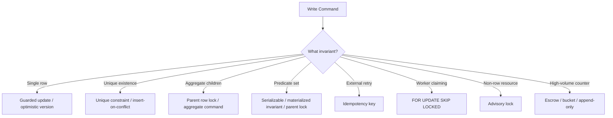
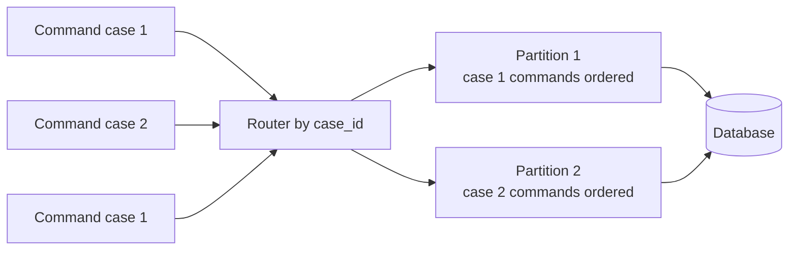

# Part 030 — Concurrency Control Patterns

Concurrency control patterns are reusable ways to make shared-state updates safe.

The wrong way to choose a pattern is by preference:

> "I like optimistic locking."

> "We always use `SELECT FOR UPDATE`."

> "Serializable is too slow."

> "The ORM will handle it."

The right way is by invariant and conflict shape:

- What must never become false?
- Is the invariant local to one row, a set of rows, an aggregate, a tenant, or the whole system?
- How often do concurrent attempts touch the same resource?
- Should conflict be invisible through retry or visible to the user as `409 Conflict`?
- Can the command be retried safely?
- Does the database have enough information to enforce the rule directly?

This part provides a pattern catalog for real systems.
The examples use SQL-heavy designs because SQL makes correctness boundaries visible.
The same ideas apply when implemented through repositories, DAOs, ORMs, stored procedures, or service-layer transaction scripts.

---

## 1. Pattern Selection Mental Model

Every write path should be classified before implementation.



Architectural rule:

> Start from the invariant, then choose the cheapest mechanism that enforces it under concurrency.

Not every invariant needs serializable isolation.
Not every race needs a lock.
Not every conflict should be retried.
Not every uniqueness failure is an error.

---

## 2. Pattern 1 — Unique Constraint as Concurrency Control

Use a unique constraint when the invariant is:

> At most one row may exist for this key.

Examples:

- one active assignment per task;
- one idempotency record per command key;
- one user email per tenant;
- one current default payment method per account if modelled with partial uniqueness;
- one active workflow instance for a case and workflow type.

### Schema

```sql
CREATE TABLE user_account (
    tenant_id uuid NOT NULL,
    user_id uuid NOT NULL,
    email_normalized text NOT NULL,
    display_name text NOT NULL,
    created_at timestamptz NOT NULL DEFAULT now(),
    PRIMARY KEY (tenant_id, user_id),
    UNIQUE (tenant_id, email_normalized)
);
```

### Write path

```sql
INSERT INTO user_account(
    tenant_id,
    user_id,
    email_normalized,
    display_name
)
VALUES (
    :tenant_id,
    :user_id,
    lower(:email),
    :display_name
);
```

Two concurrent inserts for the same email cannot both commit.
The database is the arbiter.

### Application behavior

Map database outcome deliberately:

| Database result | API/domain result |
|---|---|
| Insert success | user created |
| Unique violation on email | email already used |
| Unique violation on command id | duplicate retry, return stored result |
| Unknown commit outcome | retry by idempotency key |

Do not pre-check uniqueness and trust the check.

Bad:

```sql
SELECT count(*) FROM user_account WHERE email_normalized = lower(:email);
-- If zero, insert.
```

This races.
The pre-check is useful for friendly validation, not correctness.

Correctness belongs to the unique constraint.

---

## 3. Pattern 2 — Partial Unique Constraint for Conditional Uniqueness

Use when uniqueness applies only to a subset of rows.

Example:

> A case may have only one primary active reviewer.

```sql
CREATE TABLE case_reviewer (
    id uuid PRIMARY KEY,
    tenant_id uuid NOT NULL,
    case_id uuid NOT NULL,
    reviewer_id uuid NOT NULL,
    reviewer_role text NOT NULL,
    status text NOT NULL,
    created_at timestamptz NOT NULL DEFAULT now(),
    CHECK (status IN ('ACTIVE', 'REMOVED')),
    CHECK (reviewer_role IN ('PRIMARY', 'SECONDARY'))
);

CREATE UNIQUE INDEX uq_case_primary_active_reviewer
ON case_reviewer(tenant_id, case_id)
WHERE reviewer_role = 'PRIMARY'
  AND status = 'ACTIVE';
```

Now the database enforces the invariant even under concurrent insert.

### Good use cases

- one active subscription per customer;
- one active assignment per task;
- one default address per user;
- one active policy version per policy;
- one current record among historical records.

### Be careful

Partial unique constraints depend on predicate correctness.
If application states grow later, the predicate may become incomplete.

Example future state:

```text
SUSPENDED_BUT_ACTIVE_FOR_BILLING
```

If the partial index predicate is not updated, uniqueness semantics drift.

Review partial unique indexes whenever lifecycle states change.

---

## 4. Pattern 3 — Atomic Conditional Update

Use when the invariant can be expressed directly in the `WHERE` clause of the write.

Example:

> Approve a case only if it is currently pending approval.

```sql
UPDATE regulatory_case
SET status = 'APPROVED',
    approved_by = :actor_id,
    approved_at = now(),
    updated_at = now()
WHERE tenant_id = :tenant_id
  AND id = :case_id
  AND status = 'PENDING_APPROVAL'
RETURNING id, status, approved_at;
```

If zero rows are returned, the transition did not happen.
That is not a database error.
It is a domain result.

Possible meanings:

- case does not exist;
- case belongs to another tenant;
- case is already approved;
- case was rejected by another actor;
- case is not in a state that allows approval.

The service should map this carefully.

### Why this pattern is strong

It combines read and write into one atomic database operation.
There is no gap between:

1. checking state;
2. changing state.

Bad:

```sql
SELECT status FROM regulatory_case WHERE id = :case_id;
-- app checks status
UPDATE regulatory_case SET status = 'APPROVED' WHERE id = :case_id;
```

Good:

```sql
UPDATE regulatory_case
SET status = 'APPROVED'
WHERE id = :case_id
  AND status = 'PENDING_APPROVAL';
```

### When to use

- state transitions;
- quota consume if under limit;
- reserve inventory if available;
- mark task claimed if still pending;
- close case if no blocking flags are present via materialized flag;
- update current version if expected state is still true.

---

## 5. Pattern 4 — Compare-and-Swap With Version Column

Use optimistic concurrency when conflicts are expected to be rare and you want to detect stale updates.

### Schema

```sql
CREATE TABLE case_note (
    tenant_id uuid NOT NULL,
    note_id uuid NOT NULL,
    case_id uuid NOT NULL,
    body text NOT NULL,
    version bigint NOT NULL DEFAULT 1,
    updated_by uuid NOT NULL,
    updated_at timestamptz NOT NULL DEFAULT now(),
    PRIMARY KEY (tenant_id, note_id)
);
```

### Read

```sql
SELECT note_id, body, version
FROM case_note
WHERE tenant_id = :tenant_id
  AND note_id = :note_id;
```

### Update

```sql
UPDATE case_note
SET body = :new_body,
    version = version + 1,
    updated_by = :actor_id,
    updated_at = now()
WHERE tenant_id = :tenant_id
  AND note_id = :note_id
  AND version = :expected_version
RETURNING version;
```

If zero rows are updated, someone else changed the note.

### API behavior

Return a conflict response:

```text
409 Conflict: note was modified by another user. Reload before editing.
```

### Best fit

- user-editable forms;
- document metadata;
- admin configuration;
- low-contention updates;
- collaborative but not real-time editing;
- workflows where humans can resolve conflict.

### Poor fit

- high-frequency counters;
- queue claiming with many workers;
- commands where automatic retry would duplicate side effects;
- invariants spanning many rows unless combined with another pattern.

---

## 6. Pattern 5 — Pessimistic Row Lock

Use when you must read current state, perform logic, and then write while preventing competing writers from changing the row.

```sql
BEGIN;

SELECT id, status, assigned_to, version
FROM case_task
WHERE tenant_id = :tenant_id
  AND id = :task_id
FOR UPDATE;

-- Application validates current state.

UPDATE case_task
SET status = 'COMPLETED',
    completed_by = :actor_id,
    completed_at = now(),
    updated_at = now()
WHERE tenant_id = :tenant_id
  AND id = :task_id;

COMMIT;
```

### Best fit

- money movement within an account row;
- state transition with complex validation;
- task claim/complete flow;
- aggregate-level invariant when parent row is locked;
- low-to-moderate contention workflows where waiting is acceptable.

### Risks

- long lock duration;
- deadlocks if lock order is inconsistent;
- lower throughput under high contention;
- poor UX if user request waits too long;
- hidden blocking from external calls inside transaction.

### Fail fast variant

```sql
SELECT *
FROM case_task
WHERE id = :task_id
FOR UPDATE NOWAIT;
```

Use when the caller should not wait.

### Timeout variant

Set a low lock timeout for specific operations where waiting is worse than failing.
This is especially useful for migrations, admin operations, or UI commands that can return conflict.

---

## 7. Pattern 6 — Parent Row Lock for Child-Set Invariant

Use when the invariant is about a child collection.

Example:

> A case may have at most 5 active reviewers.

Schema:

```sql
CREATE TABLE regulatory_case (
    tenant_id uuid NOT NULL,
    case_id uuid NOT NULL,
    status text NOT NULL,
    updated_at timestamptz NOT NULL DEFAULT now(),
    PRIMARY KEY (tenant_id, case_id)
);

CREATE TABLE case_reviewer (
    tenant_id uuid NOT NULL,
    case_id uuid NOT NULL,
    reviewer_id uuid NOT NULL,
    status text NOT NULL,
    created_at timestamptz NOT NULL DEFAULT now(),
    PRIMARY KEY (tenant_id, case_id, reviewer_id),
    FOREIGN KEY (tenant_id, case_id)
      REFERENCES regulatory_case(tenant_id, case_id),
    CHECK (status IN ('ACTIVE', 'REMOVED'))
);
```

Command:

```sql
BEGIN;

SELECT case_id
FROM regulatory_case
WHERE tenant_id = :tenant_id
  AND case_id = :case_id
FOR UPDATE;

SELECT count(*) AS active_reviewer_count
FROM case_reviewer
WHERE tenant_id = :tenant_id
  AND case_id = :case_id
  AND status = 'ACTIVE';

-- If count < 5, insert.
INSERT INTO case_reviewer(
    tenant_id,
    case_id,
    reviewer_id,
    status
)
VALUES (
    :tenant_id,
    :case_id,
    :reviewer_id,
    'ACTIVE'
);

COMMIT;
```

All reviewer-set changes for the same case serialize through the parent case row.
Reviewer changes for different cases still run concurrently.

### Principle

> If the invariant is about the set, lock the set owner.

This pattern is usually simpler and safer than trying to lock all current child rows.
It also protects the empty-set case, where there may be no child rows to lock.

---

## 8. Pattern 7 — Materialized Invariant Row

Use when a child-set invariant must be enforced efficiently and repeatedly.

Example:

> Case must not exceed 5 active reviewers.

Instead of counting children every time, maintain an aggregate state row.

```sql
CREATE TABLE case_reviewer_summary (
    tenant_id uuid NOT NULL,
    case_id uuid NOT NULL,
    active_reviewer_count integer NOT NULL DEFAULT 0,
    version bigint NOT NULL DEFAULT 1,
    PRIMARY KEY (tenant_id, case_id),
    CHECK (active_reviewer_count >= 0),
    CHECK (active_reviewer_count <= 5)
);
```

Add reviewer:

```sql
BEGIN;

UPDATE case_reviewer_summary
SET active_reviewer_count = active_reviewer_count + 1,
    version = version + 1
WHERE tenant_id = :tenant_id
  AND case_id = :case_id
  AND active_reviewer_count < 5
RETURNING active_reviewer_count;

-- If no row returned, limit reached.

INSERT INTO case_reviewer(
    tenant_id,
    case_id,
    reviewer_id,
    status
)
VALUES (
    :tenant_id,
    :case_id,
    :reviewer_id,
    'ACTIVE'
);

COMMIT;
```

Remove reviewer:

```sql
BEGIN;

UPDATE case_reviewer
SET status = 'REMOVED'
WHERE tenant_id = :tenant_id
  AND case_id = :case_id
  AND reviewer_id = :reviewer_id
  AND status = 'ACTIVE';

UPDATE case_reviewer_summary
SET active_reviewer_count = active_reviewer_count - 1,
    version = version + 1
WHERE tenant_id = :tenant_id
  AND case_id = :case_id;

COMMIT;
```

### Tradeoff

You gain fast guarded updates.
You accept the responsibility to keep summary and detail consistent.

Protect it with:

- same-transaction writes;
- reconciliation query;
- check constraints;
- repair procedure;
- monitoring for drift.

---

## 9. Pattern 8 — Serializable Transaction With Retry

Use when the invariant is complex, predicate-based, and hard to represent with simple constraints or parent locks.

Example:

> A reviewer cannot be assigned to two cases with overlapping effective windows if both cases are high-risk.

This may involve checking multiple rows and time ranges.
Serializable isolation can make the database detect dangerous concurrent interleavings.

Pseudo-flow:

```sql
BEGIN TRANSACTION ISOLATION LEVEL SERIALIZABLE;

SELECT 1
FROM case_reviewer_assignment a
JOIN regulatory_case c
  ON c.case_id = a.case_id
WHERE a.reviewer_id = :reviewer_id
  AND c.risk_level = 'HIGH'
  AND a.effective_period && tstzrange(:start_at, :end_at, '[)')
  AND a.status = 'ACTIVE';

-- If none, insert assignment.

INSERT INTO case_reviewer_assignment(...)
VALUES (...);

COMMIT;
```

If the database raises serialization failure, retry the whole transaction.

### Requirements

- transaction must be short;
- operation must be retry-safe;
- retry must have bounded attempts;
- error classification must be correct;
- external side effects must be outside the transaction or behind outbox;
- metrics must track serialization failure rate.

### When not to use casually

Do not use serializable as a blanket replacement for good modelling.
If a simple unique constraint or guarded update can enforce the invariant, prefer that.
Serializable is valuable when the database must reason about a read predicate that may be invalidated by concurrent writes.

---

## 10. Pattern 9 — Idempotency Key

Use when clients, workers, or network layers may retry a command.

The invariant:

> The same logical command must be applied at most once.

### Schema

```sql
CREATE TABLE idempotency_key_record (
    tenant_id uuid NOT NULL,
    idempotency_key text NOT NULL,
    command_type text NOT NULL,
    request_hash text NOT NULL,
    status text NOT NULL,
    response_code integer,
    response_body jsonb,
    created_at timestamptz NOT NULL DEFAULT now(),
    updated_at timestamptz NOT NULL DEFAULT now(),
    PRIMARY KEY (tenant_id, idempotency_key),
    CHECK (status IN ('PROCESSING', 'SUCCEEDED', 'FAILED'))
);
```

### Start command

```sql
INSERT INTO idempotency_key_record(
    tenant_id,
    idempotency_key,
    command_type,
    request_hash,
    status
)
VALUES (
    :tenant_id,
    :key,
    :command_type,
    :request_hash,
    'PROCESSING'
)
ON CONFLICT (tenant_id, idempotency_key) DO NOTHING;
```

If insert wins, execute command.
If insert loses, read existing row.

### Request hash check

```sql
SELECT status, request_hash, response_code, response_body
FROM idempotency_key_record
WHERE tenant_id = :tenant_id
  AND idempotency_key = :key;
```

If request hash differs, return conflict:

```text
409 Conflict: idempotency key reused with different request body
```

### Finish command

```sql
UPDATE idempotency_key_record
SET status = 'SUCCEEDED',
    response_code = :response_code,
    response_body = :response_body::jsonb,
    updated_at = now()
WHERE tenant_id = :tenant_id
  AND idempotency_key = :key;
```

### Design choices

| Choice | Question |
|---|---|
| Key scope | Per tenant? per user? global? per endpoint? |
| Retention | How long must keys be retained? |
| Request hash | What canonical representation is hashed? |
| Stored response | Full response or reference? |
| Processing timeout | What if process dies after creating key? |
| Commit unknown | What happens if DB commit succeeds but client times out? |

Idempotency is not only an API feature.
It is a database concurrency pattern.

---

## 11. Pattern 10 — Transactional Outbox

Use when a database state change must reliably produce an external message or side effect.

Problem:

```text
1. Update case status in database.
2. Publish message to broker.
```

If step 1 commits and step 2 fails, downstream systems miss the event.
If step 2 succeeds and step 1 rolls back, downstream systems see a lie.

Outbox solution:

```sql
BEGIN;

UPDATE regulatory_case
SET status = 'APPROVED'
WHERE tenant_id = :tenant_id
  AND case_id = :case_id
  AND status = 'PENDING_APPROVAL';

INSERT INTO outbox_event(
    id,
    tenant_id,
    aggregate_type,
    aggregate_id,
    event_type,
    payload,
    status,
    created_at
)
VALUES (
    :event_id,
    :tenant_id,
    'REGULATORY_CASE',
    :case_id,
    'CASE_APPROVED',
    :payload::jsonb,
    'PENDING',
    now()
);

COMMIT;
```

A separate worker publishes outbox rows.

### Concurrency properties

- state change and event record commit atomically;
- publisher can retry safely;
- event id gives deduplication key;
- downstream consumers must still be idempotent;
- outbox table needs claim/lock pattern under multiple publishers.

Outbox claim:

```sql
WITH picked AS (
    SELECT id
    FROM outbox_event
    WHERE status = 'PENDING'
    ORDER BY created_at, id
    FOR UPDATE SKIP LOCKED
    LIMIT :batch_size
)
UPDATE outbox_event e
SET status = 'PUBLISHING',
    locked_at = now(),
    locked_by = :worker_id
FROM picked p
WHERE e.id = p.id
RETURNING e.*;
```

---

## 12. Pattern 11 — Inbox / Deduplication Table

Use on the consumer side of at-least-once message delivery.

Invariant:

> Each message id is applied at most once per consumer.

```sql
CREATE TABLE consumed_message (
    consumer_name text NOT NULL,
    message_id uuid NOT NULL,
    consumed_at timestamptz NOT NULL DEFAULT now(),
    PRIMARY KEY (consumer_name, message_id)
);
```

Consumer transaction:

```sql
BEGIN;

INSERT INTO consumed_message(consumer_name, message_id)
VALUES (:consumer_name, :message_id)
ON CONFLICT DO NOTHING;

-- If insert affected 0 rows, message was already consumed.
-- If insert affected 1 row, apply business update.

UPDATE projection_table
SET ...
WHERE ...;

COMMIT;
```

This pattern is essential because exactly-once delivery is rarely a safe assumption across real distributed boundaries.

---

## 13. Pattern 12 — Work Queue Claim With `SKIP LOCKED`

Use when multiple workers claim pending rows from the same table.

Schema:

```sql
CREATE TABLE case_work_item (
    tenant_id uuid NOT NULL,
    work_item_id uuid NOT NULL,
    case_id uuid NOT NULL,
    status text NOT NULL,
    priority integer NOT NULL DEFAULT 0,
    available_at timestamptz NOT NULL DEFAULT now(),
    locked_by text,
    locked_at timestamptz,
    attempts integer NOT NULL DEFAULT 0,
    payload jsonb NOT NULL,
    created_at timestamptz NOT NULL DEFAULT now(),
    updated_at timestamptz NOT NULL DEFAULT now(),
    PRIMARY KEY (tenant_id, work_item_id),
    CHECK (status IN ('PENDING', 'IN_PROGRESS', 'DONE', 'FAILED'))
);

CREATE INDEX idx_case_work_item_claim
ON case_work_item(status, available_at, priority DESC, created_at, tenant_id, work_item_id)
WHERE status = 'PENDING';
```

Claim:

```sql
WITH candidate AS (
    SELECT tenant_id, work_item_id
    FROM case_work_item
    WHERE status = 'PENDING'
      AND available_at <= now()
    ORDER BY priority DESC, created_at ASC, work_item_id ASC
    FOR UPDATE SKIP LOCKED
    LIMIT :batch_size
)
UPDATE case_work_item w
SET status = 'IN_PROGRESS',
    locked_by = :worker_id,
    locked_at = now(),
    attempts = attempts + 1,
    updated_at = now()
FROM candidate c
WHERE w.tenant_id = c.tenant_id
  AND w.work_item_id = c.work_item_id
RETURNING w.*;
```

Complete:

```sql
UPDATE case_work_item
SET status = 'DONE',
    updated_at = now()
WHERE tenant_id = :tenant_id
  AND work_item_id = :work_item_id
  AND status = 'IN_PROGRESS'
  AND locked_by = :worker_id;
```

Fail/retry:

```sql
UPDATE case_work_item
SET status = CASE WHEN attempts >= :max_attempts THEN 'FAILED' ELSE 'PENDING' END,
    available_at = now() + (:backoff_seconds || ' seconds')::interval,
    locked_by = NULL,
    locked_at = NULL,
    updated_at = now()
WHERE tenant_id = :tenant_id
  AND work_item_id = :work_item_id
  AND status = 'IN_PROGRESS'
  AND locked_by = :worker_id;
```

### Rules

- Claim and mark `IN_PROGRESS` in one transaction.
- Keep claim transaction short.
- Process outside the claim transaction unless processing must be DB-atomic.
- Use idempotent work execution.
- Reclaim abandoned work.
- Monitor stuck jobs and attempt counts.

---

## 14. Pattern 13 — Advisory Lock for Non-Row Resource

Use when the resource is real but not naturally represented by one row.

Example:

> Only one reconciliation job may run for a tenant and statement date.

Resource key:

```text
tenant:{tenant_id}:reconcile:{statement_date}
```

Transaction:

```sql
BEGIN;

-- PostgreSQL-style example.
SELECT pg_try_advisory_xact_lock(hashtext(:resource_key)) AS acquired;

-- If acquired is false, another worker owns this reconciliation.

INSERT INTO reconciliation_run(...)
VALUES (...);

COMMIT;
```

### Good fit

- scheduled jobs;
- tenant maintenance;
- external file import;
- report generation;
- cache rebuild;
- coarse operational task.

### Bad fit

- replacing unique constraints;
- protecting high-frequency user commands;
- global locks;
- long-running critical sections;
- situations where you need durable lock ownership after connection loss.

If the lock must survive process/database session failure, use a lease row instead.

---

## 15. Pattern 14 — Lease Row

Use when work ownership must be visible, recoverable, and time-bound.

```sql
CREATE TABLE resource_lease (
    resource_key text PRIMARY KEY,
    owner_id text NOT NULL,
    lease_until timestamptz NOT NULL,
    fencing_token bigint NOT NULL,
    updated_at timestamptz NOT NULL DEFAULT now()
);
```

Acquire or renew:

```sql
INSERT INTO resource_lease(
    resource_key,
    owner_id,
    lease_until,
    fencing_token
)
VALUES (
    :resource_key,
    :owner_id,
    now() + interval '60 seconds',
    1
)
ON CONFLICT (resource_key) DO UPDATE
SET owner_id = EXCLUDED.owner_id,
    lease_until = EXCLUDED.lease_until,
    fencing_token = resource_lease.fencing_token + 1,
    updated_at = now()
WHERE resource_lease.lease_until < now()
RETURNING fencing_token;
```

If no row is returned, lease acquisition failed.

### Fencing token

A fencing token prevents stale owners from writing after their lease expires.
Downstream writes include the token and reject older tokens.

Without fencing, leases can be unsafe under pauses:

```text
Worker A acquires lease.
Worker A pauses for 2 minutes.
Lease expires.
Worker B acquires lease.
Worker A resumes and writes stale result.
```

With fencing, stale result is rejected.

---

## 16. Pattern 15 — Escrow / Bucketed Counter

Use when a single counter is too hot but exact global update on every request is too expensive.

### Bucketed counter

```sql
CREATE TABLE usage_counter_bucket (
    tenant_id uuid NOT NULL,
    bucket_no integer NOT NULL,
    used_count bigint NOT NULL DEFAULT 0,
    updated_at timestamptz NOT NULL DEFAULT now(),
    PRIMARY KEY (tenant_id, bucket_no)
);
```

Write:

```sql
UPDATE usage_counter_bucket
SET used_count = used_count + :delta,
    updated_at = now()
WHERE tenant_id = :tenant_id
  AND bucket_no = :bucket_no;
```

Read:

```sql
SELECT sum(used_count)
FROM usage_counter_bucket
WHERE tenant_id = :tenant_id;
```

### Escrow-style allocation

For quota systems, allocate chunks of quota to workers or partitions.

```text
Tenant quota = 1,000,000
Worker A gets allowance 10,000
Worker B gets allowance 10,000
Each worker consumes locally until allowance is low
Then requests another allocation transactionally
```

This reduces central counter contention while preserving bounded overuse depending on allocation strategy.

### Tradeoff

Bucketed counters improve throughput.
They complicate exact reads, reconciliation, and limit enforcement.
Use only when the contention justifies complexity.

---

## 17. Pattern 16 — Append-Only Ledger

Use when every change must be auditable and reversible by new entries rather than destructive update.

Example ledger:

```sql
CREATE TABLE account_ledger_entry (
    tenant_id uuid NOT NULL,
    account_id uuid NOT NULL,
    entry_id uuid NOT NULL,
    command_id uuid NOT NULL,
    amount numeric(18, 2) NOT NULL,
    direction text NOT NULL,
    occurred_at timestamptz NOT NULL,
    created_at timestamptz NOT NULL DEFAULT now(),
    PRIMARY KEY (tenant_id, account_id, entry_id),
    UNIQUE (tenant_id, command_id),
    CHECK (direction IN ('DEBIT', 'CREDIT'))
);
```

Benefits:

- natural audit trail;
- idempotency via command id;
- corrections are new entries;
- easier reconciliation;
- no lost update on mutable balance if balance is derived.

But many systems still maintain a current balance for fast reads.
Then you need safe balance update:

```sql
UPDATE account_balance
SET current_balance = current_balance + :delta,
    version = version + 1,
    updated_at = now()
WHERE tenant_id = :tenant_id
  AND account_id = :account_id;
```

For hard no-overdraft invariant:

```sql
UPDATE account_balance
SET current_balance = current_balance - :amount,
    version = version + 1,
    updated_at = now()
WHERE tenant_id = :tenant_id
  AND account_id = :account_id
  AND current_balance >= :amount
RETURNING current_balance;
```

The ledger entry and balance update must commit in the same transaction.

---

## 18. Pattern 17 — State Transition Table

Use when workflow transition correctness matters and must be auditable.

### Current state table

```sql
CREATE TABLE case_state (
    tenant_id uuid NOT NULL,
    case_id uuid NOT NULL,
    current_state text NOT NULL,
    version bigint NOT NULL DEFAULT 1,
    updated_at timestamptz NOT NULL DEFAULT now(),
    PRIMARY KEY (tenant_id, case_id)
);
```

### Transition history

```sql
CREATE TABLE case_state_transition (
    tenant_id uuid NOT NULL,
    transition_id uuid NOT NULL,
    case_id uuid NOT NULL,
    from_state text NOT NULL,
    to_state text NOT NULL,
    command_id uuid NOT NULL,
    actor_id uuid NOT NULL,
    occurred_at timestamptz NOT NULL,
    reason text,
    PRIMARY KEY (tenant_id, transition_id),
    UNIQUE (tenant_id, command_id)
);
```

### Guarded transition

```sql
BEGIN;

UPDATE case_state
SET current_state = :to_state,
    version = version + 1,
    updated_at = now()
WHERE tenant_id = :tenant_id
  AND case_id = :case_id
  AND current_state = :expected_from_state
RETURNING current_state;

-- If no row returned, transition failed.

INSERT INTO case_state_transition(
    tenant_id,
    transition_id,
    case_id,
    from_state,
    to_state,
    command_id,
    actor_id,
    occurred_at,
    reason
)
VALUES (
    :tenant_id,
    :transition_id,
    :case_id,
    :expected_from_state,
    :to_state,
    :command_id,
    :actor_id,
    now(),
    :reason
);

COMMIT;
```

The transition is atomic, idempotent, and auditable.

---

## 19. Pattern 18 — Command Table

Use when commands need durable lifecycle tracking.

```sql
CREATE TABLE command_record (
    tenant_id uuid NOT NULL,
    command_id uuid NOT NULL,
    command_type text NOT NULL,
    aggregate_type text NOT NULL,
    aggregate_id uuid NOT NULL,
    status text NOT NULL,
    request_payload jsonb NOT NULL,
    result_payload jsonb,
    error_code text,
    created_at timestamptz NOT NULL DEFAULT now(),
    updated_at timestamptz NOT NULL DEFAULT now(),
    PRIMARY KEY (tenant_id, command_id),
    CHECK (status IN ('RECEIVED', 'PROCESSING', 'SUCCEEDED', 'FAILED', 'REJECTED'))
);
```

This pattern is useful for:

- long-running commands;
- async workflows;
- external callbacks;
- user-submitted regulatory actions;
- commands requiring audit trail;
- retry/recovery after crash.

Command processing can be idempotent by `command_id`.
The command table also gives observability:

- how many commands are stuck;
- how many failed by reason;
- how long command processing takes;
- which aggregate is hot;
- which commands are repeatedly retried.

---

## 20. Pattern 19 — Optimistic Insert-or-Select

Use when concurrent callers may create the same logical resource.

Example:

> Create customer by external reference if it does not already exist.

```sql
CREATE TABLE customer (
    tenant_id uuid NOT NULL,
    customer_id uuid NOT NULL,
    external_ref text NOT NULL,
    display_name text NOT NULL,
    created_at timestamptz NOT NULL DEFAULT now(),
    PRIMARY KEY (tenant_id, customer_id),
    UNIQUE (tenant_id, external_ref)
);
```

Flow:

```sql
INSERT INTO customer(
    tenant_id,
    customer_id,
    external_ref,
    display_name
)
VALUES (
    :tenant_id,
    :customer_id,
    :external_ref,
    :display_name
)
ON CONFLICT (tenant_id, external_ref) DO NOTHING;

SELECT customer_id, external_ref, display_name
FROM customer
WHERE tenant_id = :tenant_id
  AND external_ref = :external_ref;
```

This converges concurrent create attempts.

But define semantic behavior:

- If same external ref with same data: return existing.
- If same external ref with conflicting data: reject or update according to ownership rule.
- If caller-provided id differs from existing id: ignore caller id or reject.

Do not leave conflict semantics accidental.

---

## 21. Pattern 20 — Compare Request Hash Before Reuse

This is a refinement of idempotency.

Problem:

Client sends:

```text
Idempotency-Key: abc
amount: 100
```

Then later incorrectly sends:

```text
Idempotency-Key: abc
amount: 500
```

If the server blindly returns old response, it hides a client bug.
If it executes again, it violates idempotency.

Solution: store canonical request hash.

```sql
SELECT request_hash, status, response_code, response_body
FROM idempotency_key_record
WHERE tenant_id = :tenant_id
  AND idempotency_key = :key;
```

Behavior:

| Existing hash | Incoming hash | Result |
|---|---|---|
| same | same | return or continue existing result |
| different | different | reject as key reuse conflict |

Canonicalization matters.
Hash stable logical content, not raw JSON formatting.

---

## 22. Pattern 21 — Retry With Error Classification

Retry is part of concurrency control.
But retry must be limited and classified.

### Retryable

- deadlock detected;
- serialization failure;
- transient lock timeout;
- transient network failure before commit outcome is known;
- optimistic version conflict if operation is automatic and safe;
- queue claim conflict.

### Not retryable

- check constraint violation from invalid input;
- foreign key violation from invalid reference;
- unique violation where uniqueness means business rejection;
- permission denied;
- insufficient quota if quota is real business state;
- invalid state transition.

### Java-style retry skeleton

```java
public <T> T runWithConcurrencyRetry(Supplier<T> operation) {
    int maxAttempts = 3;

    for (int attempt = 1; attempt <= maxAttempts; attempt++) {
        try {
            return operation.get();
        } catch (DatabaseException ex) {
            if (!isRetryableConcurrencyError(ex) || attempt == maxAttempts) {
                throw ex;
            }
            sleep(backoffWithJitter(attempt));
        }
    }

    throw new IllegalStateException("unreachable");
}
```

Rules:

- retry the whole transaction, not just the failed statement;
- use exponential backoff with jitter;
- preserve idempotency key across retries;
- do not retry external side effects;
- record retry count and final outcome;
- alert on retry rate changes.

---

## 23. Pattern 22 — Single Writer Per Aggregate

Use when conflicts are high and strict ordering per aggregate is needed.

Instead of allowing all app nodes to update the same aggregate concurrently, route commands for one aggregate to one worker/partition.



Benefits:

- fewer database conflicts;
- deterministic order per aggregate;
- simpler state machine logic.

Costs:

- routing infrastructure;
- queue latency;
- partition rebalancing;
- poison command handling;
- weaker immediate synchronous UX.

This pattern is useful for high-contention workflows, but it should not be the default for simple CRUD.

---

## 24. Pattern 23 — Saga With Local Concurrency Control

Distributed workflows cannot rely on one database transaction across all participants unless a real distributed transaction protocol is intentionally used.

Saga design uses local transactions and compensating actions.

But each local transaction still needs concurrency control.

Example:

```text
1. Reserve quota in tenant database.
2. Create case in case database.
3. Assign reviewer in workforce database.
4. Emit workflow started event.
```

Each step must have:

- idempotency key;
- local invariant enforcement;
- retry behavior;
- compensation if later step fails;
- status tracking;
- timeout handling.

Database patterns do not disappear in sagas.
They become more important because partial failure is normal.

---

## 25. Pattern 24 — Constraint-First, Validation-Second

Application validation improves UX.
Database constraints preserve truth.

Example:

```sql
CREATE TABLE case_priority_rule (
    tenant_id uuid NOT NULL,
    rule_id uuid NOT NULL,
    priority integer NOT NULL,
    name text NOT NULL,
    PRIMARY KEY (tenant_id, rule_id),
    CHECK (priority BETWEEN 1 AND 1000),
    UNIQUE (tenant_id, priority)
);
```

The UI can pre-check priority availability.
But concurrent users can still race.
The unique constraint is final.

Pattern:

1. Validate in application for user-friendly messages.
2. Write with database constraints.
3. Catch known constraint violations.
4. Map to domain errors.
5. Monitor unexpected constraint violations.

Do not choose between validation and constraints.
They solve different problems.

---

## 26. Pattern 25 — Conflict as Domain Result

Not every conflict is an exception.

Examples:

| Situation | Domain result |
|---|---|
| Task already claimed | show assigned owner or allow reassign flow |
| Case already approved | return current state |
| Idempotency key reused with same request | return previous result |
| Version conflict on note edit | ask user to reload/merge |
| Quota exhausted | reject command with business error |
| Lock not acquired with `NOWAIT` | return `409 Conflict`, retry later |

Design service APIs to represent conflict explicitly.

Example result type:

```java
sealed interface ApproveCaseResult {
    record Approved(UUID caseId) implements ApproveCaseResult {}
    record AlreadyApproved(UUID caseId) implements ApproveCaseResult {}
    record InvalidState(UUID caseId, String currentState) implements ApproveCaseResult {}
    record ConcurrentModification(UUID caseId) implements ApproveCaseResult {}
}
```

This is better than collapsing all database conflicts into `500 Internal Server Error`.

---

## 27. Decision Matrix

| Invariant / Conflict Shape | Best starting pattern | Notes |
|---|---|---|
| At most one row by key | Unique constraint | Let DB arbitrate concurrent insert |
| Conditional uniqueness | Partial unique index | Review predicate when states evolve |
| Single-row state transition | Atomic conditional update | Check affected row count |
| User edits stale form | Version column CAS | Return conflict for merge/reload |
| Complex current-row decision | `SELECT FOR UPDATE` | Keep transaction short |
| Child-set limit | Parent row lock | Lock aggregate owner |
| Fast child-set count limit | Materialized invariant row | Needs reconciliation |
| Predicate/range invariant | Serializable + retry | Use when constraint/lock model is hard |
| Network retry safety | Idempotency key | Store request hash and result |
| DB state + message publish | Transactional outbox | Consumer still idempotent |
| At-least-once message consume | Inbox/dedup table | Unique message id per consumer |
| Multi-worker DB queue | `SKIP LOCKED` claim | Add reclaim and idempotency |
| Non-row critical section | Advisory lock | Prefer transaction-scoped |
| Recoverable ownership | Lease row + fencing token | Needed for long-running work |
| Hot counter | Bucket / escrow / append-only | Choose based on exactness requirement |
| High contention per aggregate | Single writer per aggregate | Adds async routing complexity |

---

## 28. Anti-Patterns

### Anti-Pattern 1 — Check-Then-Act Without Constraint

```sql
SELECT count(*) FROM user_account WHERE email = :email;
-- if zero
INSERT INTO user_account(...);
```

Race condition.
Use unique constraint.

### Anti-Pattern 2 — Locking Too Much

```sql
LOCK TABLE regulatory_case IN EXCLUSIVE MODE;
```

This may be correct for rare maintenance.
It is usually wrong for normal application commands.

### Anti-Pattern 3 — External Calls Inside Transaction

```java
transaction(() -> {
    repository.lockCase(caseId);
    paymentGateway.charge(...);
    repository.markPaid(caseId);
});
```

Database lock duration now depends on network latency and external reliability.
Use outbox or split transaction design.

### Anti-Pattern 4 — Infinite Retry

```java
while (true) {
    try {
        doTransaction();
        break;
    } catch (Exception e) {
        // retry everything forever
    }
}
```

This can amplify incidents.
Use classified bounded retry.

### Anti-Pattern 5 — Optimistic Lock Without UX Plan

Adding a `version` column is not enough.
You need to decide what the user sees when conflict occurs.

### Anti-Pattern 6 — Queue Table Without Reclaim

Workers die.
If `IN_PROGRESS` rows are never reclaimed, jobs disappear permanently.

### Anti-Pattern 7 — Idempotency Key Without Request Hash

A reused key with a different request can produce silent corruption or confusing responses.

### Anti-Pattern 8 — Audit Outside Transaction

If domain update commits but audit insert fails, traceability breaks.
If audit commits but domain update rolls back, audit lies.

---

## 29. Testing Concurrency Patterns

Concurrency bugs often pass normal unit tests.
You need tests that create races deliberately.

### Test categories

| Test type | Purpose |
|---|---|
| Two-transaction script | Reproduce known anomaly deterministically |
| Multi-thread integration test | Stress command under concurrent calls |
| Property-based test | Check invariant after many random operations |
| Load test | Observe contention, retry, latency, deadlock rate |
| Fault injection | Crash between idempotency/outbox stages |
| Migration concurrency test | Verify DDL does not block production path unexpectedly |

### Example invariant test

Invariant:

> At most one active primary reviewer per case.

Test:

1. Start N concurrent attempts to assign different primary reviewers.
2. Wait for all attempts.
3. Query active primary reviewers.
4. Assert count is 1.
5. Assert failures are domain conflicts, not unknown 500s.

```sql
SELECT count(*)
FROM case_reviewer
WHERE tenant_id = :tenant_id
  AND case_id = :case_id
  AND reviewer_role = 'PRIMARY'
  AND status = 'ACTIVE';
```

### Example idempotency test

1. Send same command id 100 times concurrently.
2. Assert domain effect happened once.
3. Assert all responses are equivalent or correctly report in-progress.
4. Assert one idempotency record exists.
5. Assert outbox has one event.

---

## 30. Observability for Concurrency Control

Track concurrency as a first-class production signal.

Recommended metrics:

| Metric | Why it matters |
|---|---|
| Lock wait time by query | Identifies blocking write paths |
| Deadlock count | Reveals lock ordering bugs |
| Serialization failure count | Shows optimistic/serializable conflict rate |
| Optimistic version conflict count | UX and contention signal |
| Unique violation count by constraint | Can indicate attacks, retries, or races |
| Idempotency duplicate count | Shows retry behavior |
| Idempotency hash conflict count | Shows client misuse |
| Queue claim latency | Shows worker contention |
| Stuck `IN_PROGRESS` jobs | Shows worker crash or reclaim failure |
| Transaction duration | Predicts lock and MVCC cleanup pressure |
| Retry attempt count | Detects retry storms |

Log structured data for conflicts:

```json
{
  "event": "db_concurrency_conflict",
  "tenantId": "...",
  "operation": "ApproveCase",
  "aggregateType": "RegulatoryCase",
  "aggregateId": "...",
  "pattern": "guarded_update",
  "result": "invalid_state",
  "currentState": "REJECTED",
  "expectedState": "PENDING_APPROVAL"
}
```

This makes production behavior explainable.

---

## 31. Case Study: Approval Command

Requirement:

- A case can be approved only from `PENDING_APPROVAL`.
- The same command may be retried.
- Approval must create audit and outbox event.
- Concurrent approval attempts must not duplicate side effects.

### Tables

```sql
CREATE TABLE regulatory_case (
    tenant_id uuid NOT NULL,
    case_id uuid NOT NULL,
    status text NOT NULL,
    approved_by uuid,
    approved_at timestamptz,
    updated_at timestamptz NOT NULL DEFAULT now(),
    PRIMARY KEY (tenant_id, case_id)
);

CREATE TABLE command_idempotency (
    tenant_id uuid NOT NULL,
    command_id uuid NOT NULL,
    command_type text NOT NULL,
    request_hash text NOT NULL,
    result_code text,
    created_at timestamptz NOT NULL DEFAULT now(),
    updated_at timestamptz NOT NULL DEFAULT now(),
    PRIMARY KEY (tenant_id, command_id)
);

CREATE TABLE case_audit_event (
    tenant_id uuid NOT NULL,
    audit_id uuid NOT NULL,
    case_id uuid NOT NULL,
    event_type text NOT NULL,
    actor_id uuid NOT NULL,
    occurred_at timestamptz NOT NULL,
    payload jsonb NOT NULL,
    PRIMARY KEY (tenant_id, audit_id)
);

CREATE TABLE outbox_event (
    tenant_id uuid NOT NULL,
    event_id uuid NOT NULL,
    aggregate_type text NOT NULL,
    aggregate_id uuid NOT NULL,
    event_type text NOT NULL,
    payload jsonb NOT NULL,
    status text NOT NULL,
    created_at timestamptz NOT NULL DEFAULT now(),
    PRIMARY KEY (tenant_id, event_id)
);
```

### Transaction

```sql
BEGIN;

INSERT INTO command_idempotency(
    tenant_id,
    command_id,
    command_type,
    request_hash
)
VALUES (
    :tenant_id,
    :command_id,
    'APPROVE_CASE',
    :request_hash
)
ON CONFLICT (tenant_id, command_id) DO NOTHING;

-- If duplicate, read existing result and return it after hash check.

UPDATE regulatory_case
SET status = 'APPROVED',
    approved_by = :actor_id,
    approved_at = now(),
    updated_at = now()
WHERE tenant_id = :tenant_id
  AND case_id = :case_id
  AND status = 'PENDING_APPROVAL'
RETURNING case_id;

-- If no row, update command result as invalid state.

INSERT INTO case_audit_event(
    tenant_id,
    audit_id,
    case_id,
    event_type,
    actor_id,
    occurred_at,
    payload
)
VALUES (
    :tenant_id,
    :audit_id,
    :case_id,
    'CASE_APPROVED',
    :actor_id,
    now(),
    :audit_payload::jsonb
);

INSERT INTO outbox_event(
    tenant_id,
    event_id,
    aggregate_type,
    aggregate_id,
    event_type,
    payload,
    status
)
VALUES (
    :tenant_id,
    :event_id,
    'REGULATORY_CASE',
    :case_id,
    'CASE_APPROVED',
    :event_payload::jsonb,
    'PENDING'
);

UPDATE command_idempotency
SET result_code = 'APPROVED',
    updated_at = now()
WHERE tenant_id = :tenant_id
  AND command_id = :command_id;

COMMIT;
```

### Properties

- retry is safe by `command_id`;
- state transition is atomic by guarded update;
- audit and outbox commit with state change;
- duplicate side effects are prevented;
- invalid state is a domain result;
- outbox publish can be retried independently.

---

## 32. Design Review Checklist

Before approving a write path, answer these:

### Invariant

- What invariant is being protected?
- Is it single-row, multi-row, aggregate, tenant, or global?
- Can the database enforce it with a constraint?
- If not, what transaction pattern enforces it?

### Conflict

- What concurrent commands can touch the same state?
- Is conflict expected to be rare or common?
- Should conflict be retried, rejected, merged, or ignored as duplicate?
- What is the user-visible behavior?

### Transaction

- What is inside the transaction?
- Are external calls outside it?
- Are locks acquired in deterministic order?
- Are queries indexed?
- Is transaction duration bounded?

### Idempotency

- Can the client retry safely?
- Is there a command id or idempotency key?
- Is request hash stored?
- Is response/result stored or reconstructible?
- How long is idempotency data retained?

### Side effects

- Are messages/emails/webhooks emitted via outbox?
- Are consumers idempotent?
- Can side effects be replayed safely?
- Is there a deduplication key?

### Retry

- Which database errors are retryable?
- Is retry bounded?
- Is there backoff with jitter?
- Are retries measured?
- Is there a retry storm protection?

### Operations

- What metrics show contention?
- What logs explain conflicts?
- What dashboards show stuck work?
- What runbook handles lock waits/deadlocks?
- What test proves the invariant under concurrency?

---

## 33. Practical Pattern Combinations

Real systems combine patterns.

### Idempotent state transition

- idempotency key;
- guarded update;
- audit in same transaction;
- outbox in same transaction.

### Safe assignment

- parent row lock;
- partial unique index for active assignment;
- transition history;
- domain conflict result.

### Reliable worker

- queue claim with `SKIP LOCKED`;
- lease/reclaim;
- idempotent processing;
- outbox or inbox where messages are involved;
- bounded retries.

### High-volume quota

- guarded update for hard limit;
- bucketed usage events for analytics;
- reconciliation job;
- tenant-level metrics;
- explicit consistency contract.

### Distributed workflow

- local transaction per service;
- idempotency key per step;
- outbox for event publishing;
- inbox for event consumption;
- saga status table;
- compensation path.

---

## 34. What Top Engineers Do Differently

Average implementation:

> "Wrap it in a transaction."

Strong implementation:

> "This command protects a case-local state transition. It uses a guarded update, command idempotency, same-transaction audit/outbox, and maps zero-row update to invalid-state domain result. The operation is retry-safe only before outbox publication because publication is async and deduplicated by event id. We monitor guarded-update conflicts and idempotency duplicates."

That is the level of precision you want.

Concurrency control is not a library feature.
It is design language.

---

## 35. Key Takeaways

- Choose concurrency control by invariant and conflict shape.
- Use unique constraints as deterministic concurrency arbiters.
- Use atomic conditional updates to remove check-then-act races.
- Use optimistic version columns for low-contention human-edit flows.
- Use pessimistic row locks for current-state decisions that must block competing writers.
- Use parent-row locks for child-set invariants.
- Use serializable isolation for complex predicate invariants, but implement bounded retry.
- Use idempotency keys for network/client retry safety.
- Use transactional outbox for state change plus message publication.
- Use inbox/dedup tables for at-least-once consumers.
- Use `SKIP LOCKED` carefully for database-backed workers.
- Treat conflict as a domain result, not always as an exception.
- Test concurrency with deliberate races, not only unit tests.

The next parts move from concurrency control into durability, write-ahead logging, crash recovery, backup, restore, and operational recovery objectives.

---

## References and Further Reading

- PostgreSQL Documentation — Concurrency Control: `https://www.postgresql.org/docs/current/mvcc.html`
- PostgreSQL Documentation — Explicit Locking: `https://www.postgresql.org/docs/current/explicit-locking.html`
- PostgreSQL Documentation — Transaction Isolation: `https://www.postgresql.org/docs/current/transaction-iso.html`
- PostgreSQL Documentation — Constraints: `https://www.postgresql.org/docs/current/ddl-constraints.html`
- CockroachDB Documentation — Transaction Retry Error Reference: `https://www.cockroachlabs.com/docs/stable/transaction-retry-error-reference`
