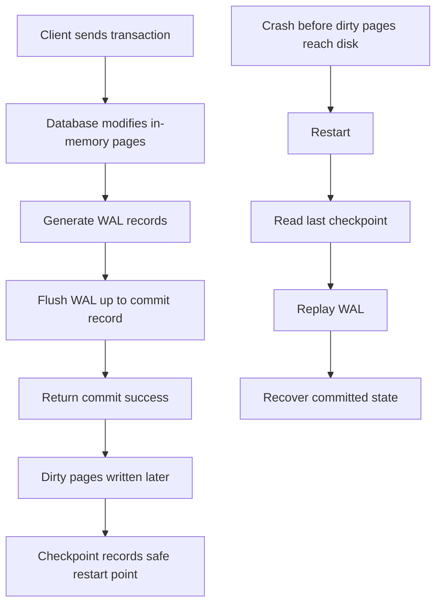
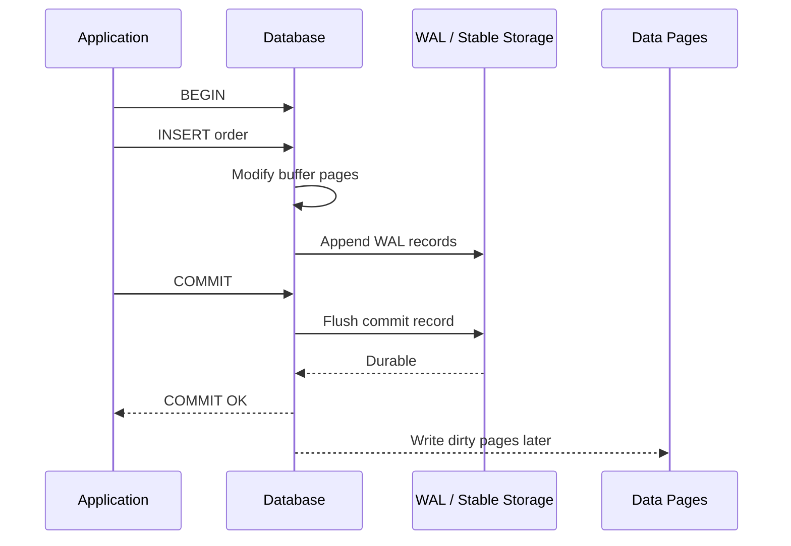
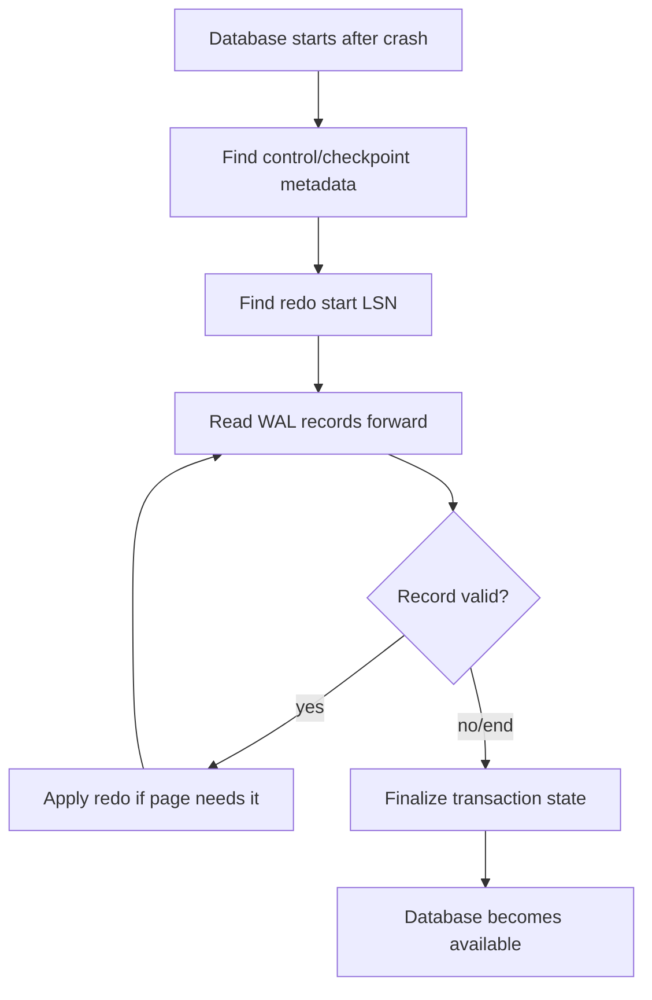
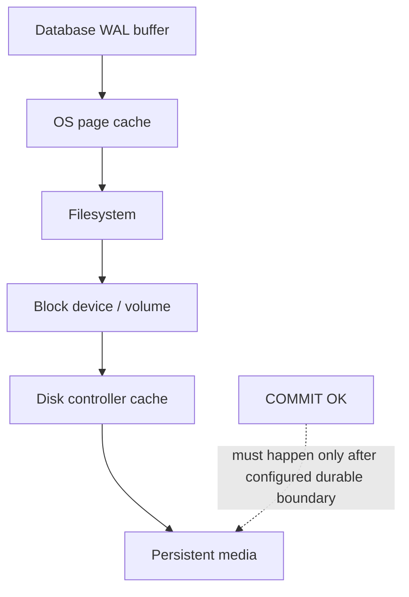
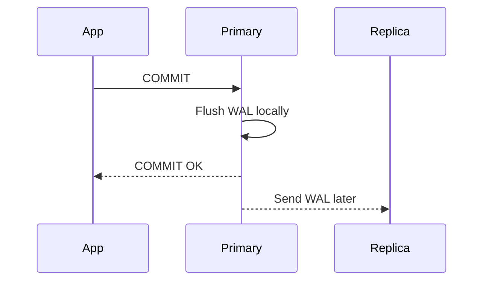
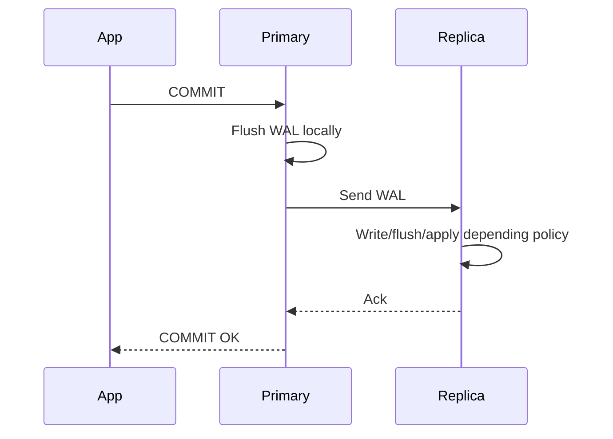
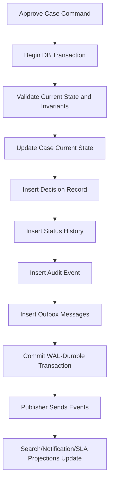

# Part 031 — Durability, WAL, and Crash Recovery

> The interesting question is not: “did the database write the row?”  
> The interesting question is: “after the database says commit succeeded, what failures can happen without losing that fact?”

Durability is the database promise that a committed transaction survives crash.

But in production, that sentence is too vague. A senior engineer asks sharper questions:

- What exactly becomes durable before the client receives `COMMIT OK`?
- Is the row already written to the data file?
- What happens if the process dies after commit but before checkpoint?
- What happens if the OS acknowledges a write that the storage device has not really persisted?
- Does durability protect us from accidental `DELETE`?
- Does synchronous replication mean we no longer need backups?
- Can a database be ACID but still lose data during misconfigured storage, bad fsync settings, or broken backup discipline?

This part builds the mental model behind those questions.

We will use PostgreSQL-flavoured examples because PostgreSQL exposes the concepts clearly, but the model applies to most serious transactional storage engines: relational engines, distributed SQL engines, LSM engines, embedded databases, and custom storage layers.

---

## 1. The Core Mental Model

A database is not durable because it immediately rewrites every affected table page.

That would be too slow.

Instead, most transactional databases use a log-first protocol:

1. describe the change in an append-only log;
2. force enough log records to stable storage;
3. acknowledge commit;
4. write actual data pages later;
5. after crash, replay the log to reconstruct the committed state.

This is **write-ahead logging**.



The essential invariant:

> The log record describing a change must reach durable storage before the changed data page is allowed to become the only copy of that change.

That is why it is called **write-ahead** log.

The database writes the intention/effect of the change ahead of the physical page update.

---

## 2. Durability Is a Contract Boundary

Durability starts at the point where the database tells the caller that the transaction committed.

Before commit success, the client does not own the fact.

After commit success, the system must treat the fact as part of the system of truth.



The subtle but critical point:

> `COMMIT OK` usually means the commit record and required WAL records are durable, not that every affected table/index page has already been rewritten.

This is why a database can survive a crash even when many table pages on disk are stale.

---

## 3. What WAL Usually Contains

WAL is not usually a friendly business event log.

It is a recovery log.

Depending on the engine, WAL may contain:

- tuple insert/update/delete records;
- index modification records;
- transaction commit/abort records;
- page initialization records;
- full-page images after checkpoint to handle torn-page risk;
- metadata changes;
- relation file changes;
- checkpoint records;
- replication stream information.

Do not confuse these:

| Log Type | Purpose | Human Semantic? | Used for Crash Recovery? |
|---|---|---:|---:|
| WAL / redo log | Rebuild physical/logical database state after crash | Usually no | Yes |
| Undo log | Roll back uncommitted transaction or reconstruct old versions | Usually no | Sometimes |
| Audit log | Explain who did what and why | Yes | No, not primary recovery mechanism |
| Domain event log | Communicate business facts | Yes | Not engine crash recovery |
| CDC stream | Publish changed rows downstream | Semi | Not source of local crash recovery |
| Application log | Diagnose application behaviour | Sometimes | No |

A top-tier engineer does not say “we have logs, so we can recover.”

They ask: **which log, with what durability, retention, ordering, and replay semantics?**

---

## 4. The WAL Invariant

The invariant can be expressed like this:

```text
For every durable data-page change P,
the WAL record needed to recover P must already be durable.
```

Or, from the transaction perspective:

```text
A transaction may be acknowledged as committed only after
its commit decision and required redo information are durable enough
for the configured durability policy.
```

This gives the database freedom to write pages lazily.

Without WAL, the database would face a dangerous state:

1. page A written;
2. page B not written;
3. crash happens;
4. after restart, transaction is half-present.

WAL prevents this by making recovery deterministic.

---

## 5. Dirty Pages, Data Files, and Checkpoints

A **dirty page** is an in-memory page whose content differs from the version on disk.

A transaction may commit while its modified data pages remain dirty in memory.

Later, background writer/checkpoint logic writes dirty pages to disk.

A **checkpoint** is a recovery milestone. It says, roughly:

> Data pages have been flushed far enough that crash recovery only needs WAL after this checkpoint position.

Checkpoints balance three forces:

| Force | If Checkpoints Too Frequent | If Checkpoints Too Rare |
|---|---|---|
| Normal workload latency | More write pressure, I/O spikes | Less immediate write pressure |
| WAL storage | Less WAL retained for crash recovery | More WAL retained |
| Crash recovery time | Shorter replay | Longer replay |
| SSD wear / write amplification | Higher | Lower normal, but larger bursts possible |

A poor checkpoint configuration often appears as periodic latency spikes.

You may see normal latency most of the time, then sudden stalls when many dirty pages are forced out.

---

## 6. LSN: The Coordinate System of Recovery

Many WAL-based engines use a log position concept. PostgreSQL calls it an **LSN**: Log Sequence Number.

Think of LSN as a byte-position coordinate in the WAL stream.

Key ideas:

- every WAL record has a position;
- a data page can remember the latest WAL position applied to it;
- checkpoint records refer to WAL positions;
- replication lag can be measured as distance between WAL positions;
- recovery replays WAL from a known safe point.

Mental model:

```text
WAL stream:

LSN 1000: insert row A
LSN 1200: update row B
LSN 1400: commit transaction T1
LSN 1800: checkpoint
LSN 2200: insert row C
LSN 2500: commit transaction T2

Crash happens.
Restart from checkpoint LSN 1800.
Replay WAL after that until end of durable WAL.
```

In real engines, the details are more complex, but the mental model is useful.

LSN lets engineers discuss recovery, replication, checkpointing, and backup using one coordinate system.

---

## 7. Crash Recovery Flow

Crash recovery is not “load latest table files.”

It is closer to:

1. locate the last valid checkpoint;
2. determine where WAL replay must start;
3. scan WAL records forward;
4. redo committed changes as needed;
5. resolve incomplete transactions;
6. rebuild internal state;
7. open database for normal traffic.



Important implication:

> Recovery time is often proportional to how much WAL must be replayed, how many pages must be touched, and how fast storage can read/write during replay.

This is why durability tuning is also availability tuning.

---

## 8. Redo Must Be Idempotent Enough

During recovery, the database may encounter a page that already contains a change.

Why?

Because the dirty data page might have been written before crash, while another page was not.

Therefore, replay logic needs a way to avoid double-applying changes incorrectly.

A simplified page-level rule:

```text
If page_lsn >= wal_record_lsn:
    page already includes this change
else:
    apply redo record
```

This is a storage-engine version of idempotency.

The deeper lesson for application architects:

> Recovery design always needs a replay model. If an operation can be replayed, it must be safe to replay.

This idea reappears in outbox, CDC, event processing, workflow retry, distributed transactions, and migration backfill.

---

## 9. Commit Acknowledgement and fsync

The durability path depends on the difference between:

- writing to memory;
- writing to OS page cache;
- sending bytes to a storage controller;
- forcing bytes to non-volatile media;
- receiving a trustworthy acknowledgement.

`fsync`-like operations exist to force data from volatile buffers to durable storage.

A dangerous but common misunderstanding:

> “The database wrote the file” does not necessarily mean the data survives power loss.

If data is only in OS cache, it can vanish on power failure.

If storage lies about flush completion, the database may believe a commit is durable when it is not.

Durability depends on the whole stack:



Production principle:

> Do not treat database durability as purely a database setting. It is a database + filesystem + kernel + volume + storage-controller + cloud-service contract.

---

## 10. Group Commit

Forcing every transaction separately to durable storage can be expensive.

Many engines optimize by batching commit flushes.

Simplified:

1. transaction A reaches commit;
2. transaction B reaches commit shortly after;
3. transaction C reaches commit shortly after;
4. one WAL flush covers A, B, and C;
5. all can be acknowledged.

This is **group commit**.

It improves throughput by amortizing flush cost.

Tradeoff:

- lower latency requirement pushes toward more frequent flushes;
- higher throughput pushes toward batching;
- synchronous replication adds network acknowledgement to the commit path;
- cloud storage latency can dominate commit latency.

Architectural consequence:

> A write-heavy OLTP system is often limited not by CPU but by durable commit path throughput.

---

## 11. Common Durability Settings and Their Meaning

Names differ by engine. PostgreSQL examples are illustrative.

| Setting / Concept | What It Influences | Wrong Assumption |
|---|---|---|
| `fsync` | Whether database asks OS to force data durably | “Turning it off only affects performance” |
| `synchronous_commit` | Whether commit waits for WAL flush / replica depending mode | “All committed data is equally durable” |
| `full_page_writes` | Protection against torn page after checkpoint | “WAL records alone always fix partial page writes” |
| `checkpoint_timeout` | Maximum time between checkpoints | “Shorter is always safer” |
| `max_wal_size` | WAL growth before checkpoint pressure | “Smaller saves disk without latency cost” |
| `wal_compression` | WAL size for full page images | “WAL size is unrelated to workload shape” |
| `wal_buffers` | Memory for WAL buffering | “WAL buffering never matters” |
| Synchronous replication policy | Commit acknowledgement across nodes | “Replication is backup” |

Do not tune these by folklore.

Tune them by workload, durability objective, crash recovery objective, storage behaviour, and measured latency.

---

## 12. Full-Page Writes and Torn Pages

A database page might be 8 KB.

A storage write may be physically split into smaller writes.

If power fails halfway through, a page may contain half old content and half new content.

That is a **torn page**.

A WAL record describing a logical row change may not be enough if the page itself is structurally corrupted by partial write.

Many engines handle this using page images, checksums, doublewrite buffers, or copy-on-write designs.

PostgreSQL’s `full_page_writes` writes a full page image to WAL after checkpoint when a page is first modified, so recovery can restore the page safely if a torn write occurred.

Mental model:

```text
After checkpoint:
  first modification to page P -> WAL includes full image of P
  later modifications -> WAL may include smaller redo records

After next checkpoint:
  process repeats
```

Tradeoff:

- better crash safety against torn pages;
- more WAL volume;
- possible compression benefit;
- workload with random page modifications can generate significant WAL.

---

## 13. WAL Is Not a Backup

WAL protects against certain crash states.

It does not protect against everything.

| Failure | WAL Helps? | Why |
|---|---:|---|
| Database process crash | Yes | Replay durable WAL |
| OS crash / power loss | Yes, if flush/storage contract holds | Replay WAL after restart |
| Torn page | Yes, if engine/page protection configured correctly | Restore full page / redo |
| Accidental `DELETE` committed | No | WAL faithfully records the bad delete |
| Bad migration committed | No | WAL preserves the bad state |
| Data corruption not detected until later | Limited | WAL may not contain old clean state long enough |
| Storage volume loss | No, unless WAL/data replicated elsewhere | Local log gone too |
| Ransomware with credentialed access | No | Attacker can destroy database and backups if not isolated |
| Region failure | No, unless replicated/archived cross-region | Local durability boundary gone |

WAL is for **crash recovery**.

Backups are for **point-in-time restoration, operator error, corruption recovery, disaster recovery, and long-term recoverability**.

Part 032 covers this deeply.

---

## 14. Replication Changes the Durability Boundary

Replication can extend durability beyond one node.

But replication has modes.

### Asynchronous Replication

Primary commits locally and sends WAL to replica later.



Failure mode:

- primary says commit succeeded;
- primary dies before replica receives WAL;
- failover to replica loses acknowledged transaction.

This may be acceptable if RPO allows small data loss.

### Synchronous Replication

Primary waits for replica acknowledgement according to configured mode.



Tradeoff:

- stronger durability across node failure;
- higher commit latency;
- lower availability if required replica cannot acknowledge;
- still not a substitute for backups;
- still vulnerable to logical corruption replicated everywhere.

Architectural rule:

> Replication reduces some infrastructure-failure risk. It does not remove the need for backup, restore drills, data validation, and blast-radius control.

---

## 15. Durability vs Consistency vs Availability

Do not mix these terms.

| Property | Question |
|---|---|
| Durability | After commit success, will the fact survive crash? |
| Atomicity | Will all-or-nothing transaction effects hold? |
| Isolation | Will concurrent transactions observe safe intermediate states? |
| Consistency | Are declared/application invariants preserved? |
| Availability | Can the system accept/serve requests now? |
| Recoverability | Can we restore to a useful state after bigger failure? |

A system can be durable but wrong.

Example:

```sql
UPDATE account_balance
SET balance = balance - 100
WHERE account_id = 'A';

-- crash-safe and durable, but business-invalid if paired credit never happened
```

A system can be highly available but lose recent committed data during failover.

A system can be consistent under normal operation but unrecoverable from operator error.

A top engineer separates the properties, then designs for the required combination.

---

## 16. Application Design Around Commit Unknown

A nasty failure mode:

1. application sends `COMMIT`;
2. database commits successfully;
3. network fails before app receives response;
4. app does not know whether transaction committed.

This is **commit unknown**.

Bad application response:

```text
Retry blindly -> duplicate command, double charge, duplicate case transition.
```

Better pattern:

```sql
CREATE TABLE payment_command (
    command_id uuid PRIMARY KEY,
    account_id uuid NOT NULL,
    amount_cents bigint NOT NULL,
    status text NOT NULL CHECK (status IN ('accepted', 'applied', 'rejected')),
    created_at timestamptz NOT NULL DEFAULT now()
);
```

The client sends a stable `command_id`.

The write path becomes idempotent:

```sql
INSERT INTO payment_command (command_id, account_id, amount_cents, status)
VALUES (:command_id, :account_id, :amount_cents, 'accepted')
ON CONFLICT (command_id) DO NOTHING;
```

Then the service can safely query command result after ambiguity.

Architectural rule:

> Durability does not remove the need for idempotency. It makes the database remember the result; idempotency lets the application rediscover it safely.

---

## 17. Outbox and Durability Boundary

External side effects are not automatically durable with the database transaction.

Bad sequence:

```text
1. Insert order.
2. Commit database transaction.
3. Publish message to broker.
4. Process crashes before publish.
```

Now the order exists, but no downstream event exists.

Better sequence:

```sql
BEGIN;

INSERT INTO orders (order_id, customer_id, status)
VALUES (:order_id, :customer_id, 'confirmed');

INSERT INTO outbox_message (
    message_id,
    aggregate_type,
    aggregate_id,
    event_type,
    payload,
    created_at
)
VALUES (
    gen_random_uuid(),
    'order',
    :order_id,
    'OrderConfirmed',
    jsonb_build_object('orderId', :order_id),
    now()
);

COMMIT;
```

The outbox message becomes durable in the same transaction as the business fact.

A separate publisher reads outbox rows and publishes them with retry.

This aligns application integration with database durability.

---

## 18. Crash Recovery Is Not Logical Correction

Suppose a migration accidentally sets all open cases to closed:

```sql
UPDATE enforcement_case
SET status = 'closed'
WHERE status = 'open';
```

The database will make this durable if committed.

Crash recovery will restore the wrong committed state faithfully.

WAL does not know business intent.

Therefore, production systems need:

- backup/PITR;
- audit history;
- migration guardrails;
- canary migration;
- row count checks;
- reversible migration design;
- approval gates for dangerous DDL/DML;
- logical repair scripts;
- immutable evidence logs where required.

Crash recovery answers:

> “Can the engine return to a transactionally consistent committed state?”

It does not answer:

> “Was that state the one the business wanted?”

---

## 19. WAL Volume and Workload Shape

Different operations generate different WAL pressure.

High WAL volume can be caused by:

- large batch inserts;
- wide rows;
- large JSON payload updates;
- update-heavy workload touching many indexes;
- random updates after checkpoint causing full-page images;
- index creation/rebuild;
- bulk deletes;
- table rewrites;
- high-churn queues;
- frequent updates to hot rows;
- excessive secondary indexes;
- low fill factor or page split patterns;
- logical replication slots retaining WAL.

WAL pressure affects:

- disk usage;
- replication lag;
- backup/archive bandwidth;
- recovery time;
- commit latency;
- storage cost;
- failover freshness.

Architectural implication:

> Index design, row width, update shape, and retention strategy are durability-path concerns, not only query-performance concerns.

---

## 20. PostgreSQL-Flavoured Inspection Queries

These are examples for diagnosis. Adapt to your engine and environment.

### 20.1 Check Current WAL Position

```sql
SELECT pg_current_wal_lsn();
```

### 20.2 Estimate WAL Distance

```sql
SELECT pg_wal_lsn_diff(pg_current_wal_lsn(), '0/0') AS bytes_from_start_reference;
```

In real work, compare two meaningful LSNs:

```sql
SELECT pg_wal_lsn_diff(:new_lsn, :old_lsn) AS wal_bytes_between_points;
```

### 20.3 Check Replication Lag by LSN

```sql
SELECT
    application_name,
    state,
    sync_state,
    sent_lsn,
    write_lsn,
    flush_lsn,
    replay_lsn,
    pg_wal_lsn_diff(sent_lsn, replay_lsn) AS bytes_not_replayed
FROM pg_stat_replication;
```

Interpretation:

- `sent_lsn`: primary has sent up to this point;
- `write_lsn`: standby has written up to this point;
- `flush_lsn`: standby has flushed up to this point;
- `replay_lsn`: standby has replayed up to this point.

### 20.4 Check Checkpoint/WAL Statistics

```sql
SELECT *
FROM pg_stat_bgwriter;
```

Modern PostgreSQL versions also expose detailed checkpointer statistics in newer views. Always verify the exact view names for your version.

Look for:

- frequent requested checkpoints;
- high checkpoint write time;
- high buffers checkpointed;
- signs of I/O spikes;
- WAL files growing unexpectedly;
- replication/archive retention preventing WAL recycling.

---

## 21. Durability Failure Modes

### 21.1 fsync Disabled for Performance

Symptom:

- benchmark looks fast;
- crash causes data loss/corruption beyond acceptable contract.

Root error:

> Treating a safety setting as a performance knob without changing the business durability contract.

Use only for disposable test environments.

### 21.2 Storage Lies About Flush

Symptom:

- database configured correctly;
- after power loss, committed data missing or corrupted.

Root error:

> The lower storage layer acknowledged durability before actual persistence.

Mitigation:

- use reliable storage;
- validate cloud volume/database guarantees;
- avoid unsafe disk/controller cache settings;
- use checksums where available;
- test crash recovery realistically.

### 21.3 Long Recovery Time After Crash

Symptom:

- database restart takes longer than expected;
- service unavailable while WAL replays.

Likely causes:

- huge WAL since checkpoint;
- slow storage;
- checkpoint configuration too loose;
- massive write workload before crash;
- large dirty-page set;
- replication slots or archive issues retaining WAL.

Mitigation:

- tune checkpoints with measured workload;
- improve storage throughput;
- reduce WAL volume;
- isolate batch writes;
- test restart time under production-like conditions.

### 21.4 WAL Disk Full

Symptom:

- writes stop;
- database cannot create more WAL;
- replication/archive failure caused retention.

Common causes:

- failed archive command;
- inactive replication slot;
- replica down for too long;
- batch workload exceeds WAL capacity;
- backup job broken;
- unexpected table rewrite.

Mitigation:

- alert on WAL directory/volume growth;
- alert on replication slot retained bytes;
- design slot lifecycle;
- size WAL/archive volume with burst allowance;
- test archive failure response.

### 21.5 Synchronous Replica Blocks Commits

Symptom:

- primary is healthy;
- writes hang or slow dramatically;
- synchronous standby unavailable or slow.

Root tension:

> Stronger cross-node durability can reduce write availability.

Mitigation:

- define synchronous replication policy explicitly;
- choose quorum where supported;
- define fail-open/fail-closed decision;
- document data-loss tolerance;
- test replica failure.

---

## 22. Durability Design by Data Class

Not all data deserves the same durability cost.

| Data Class | Example | Durability Expectation | Design |
|---|---|---|---|
| Regulated decision | Enforcement action approval | Must survive crash and be auditable | Strong DB transaction + audit + backup/PITR |
| Financial movement | Ledger entry | Must never be acknowledged then lost | Strong local durability + idempotency + reconciliation |
| User preference | UI setting | Usually durable, moderate risk | Normal transaction durability |
| Telemetry | Page view event | Small loss may be acceptable | Buffered/event pipeline, lower cost path |
| Cache | Derived read model | Rebuildable | No strict durability; rebuild from source |
| Search index | Projection | Rebuildable but operationally costly | Snapshot + replay source/CDC |
| Temporary workflow queue | Internal worker claim | Durable enough for retry | DB queue/outbox or broker with ack semantics |

Architecture is not about making everything maximum durability.

It is about matching durability mechanism to consequence of loss.

---

## 23. Crash-Safe State Machine Transition

Consider an enforcement case transition.

Bad design:

```sql
UPDATE enforcement_case
SET status = 'approved'
WHERE case_id = :case_id;
```

This may be durable, but it lacks explanation, idempotency, and traceability.

Better design:

```sql
BEGIN;

INSERT INTO case_transition_command (
    command_id,
    case_id,
    requested_by,
    requested_transition,
    requested_at
)
VALUES (
    :command_id,
    :case_id,
    :actor_id,
    'approve',
    now()
)
ON CONFLICT (command_id) DO NOTHING;

UPDATE enforcement_case
SET
    status = 'approved',
    version = version + 1,
    updated_at = now()
WHERE case_id = :case_id
  AND status = 'under_review';

INSERT INTO case_status_history (
    case_id,
    from_status,
    to_status,
    changed_by,
    reason_code,
    changed_at,
    command_id
)
VALUES (
    :case_id,
    'under_review',
    'approved',
    :actor_id,
    :reason_code,
    now(),
    :command_id
);

INSERT INTO outbox_message (...)
VALUES (...);

COMMIT;
```

Now crash recovery can restore:

- current state;
- command idempotency marker;
- history row;
- downstream event intent.

All or none.

That is durability used correctly at the workflow level.

---

## 24. Durability and Batch Jobs

Batch jobs often create WAL storms.

Examples:

- backfill derived column for 500 million rows;
- delete expired records;
- rebuild materialized projection;
- migrate JSON field to normalized tables;
- recompute SLA deadlines.

Risks:

- WAL volume exceeds disk/archive capacity;
- replica lag grows;
- PITR archive cost spikes;
- checkpoints become aggressive;
- normal OLTP latency degrades;
- crash recovery becomes long.

Safer batch pattern:

```sql
-- process bounded chunks
UPDATE enforcement_case
SET risk_bucket = computed.new_risk_bucket
FROM computed_case_risk computed
WHERE enforcement_case.case_id = computed.case_id
  AND enforcement_case.case_id > :last_seen_case_id
ORDER BY enforcement_case.case_id
LIMIT 5000;
```

Real SQL syntax varies by engine; the point is chunking.

Operational controls:

- chunk size;
- sleep between chunks;
- WAL volume monitoring;
- replica lag threshold;
- lock timeout;
- statement timeout;
- resume marker;
- validation query;
- rollback/forward-fix script;
- backup before dangerous migration.

---

## 25. Durability Review Checklist

Use this before approving a production database architecture.

### Commit Path

- What must be durable before `COMMIT OK`?
- Does the application handle commit-unknown ambiguity?
- Are idempotency keys used for externally retried commands?
- Are external side effects captured through outbox or equivalent?
- Are transaction scopes small enough to avoid excessive lock and WAL pressure?

### WAL and Storage

- Is WAL stored on reliable persistent storage?
- Are unsafe durability settings disabled in production?
- Is `fsync`/flush behaviour understood for the platform?
- Are full-page/torn-write protections enabled where appropriate?
- Are checksums enabled or corruption detection configured where available?

### Checkpoint and Recovery

- What is expected crash recovery time?
- Has crash recovery been tested under realistic write volume?
- Are checkpoint settings tuned from observed workload?
- Are latency spikes correlated with checkpoint activity?
- Is WAL volume sized for burst writes?

### Replication

- Is replication sync or async?
- What data loss is possible during failover?
- What commit latency is added by synchronous replication?
- Are replication slots monitored?
- Can replica lag break read-your-writes assumptions?

### Operational Safety

- Are WAL archive failures alerted?
- Are disk-full scenarios tested?
- Are batch jobs limited by WAL/replica-lag budget?
- Are dangerous migrations gated?
- Is backup/PITR integrated with WAL strategy?

---

## 26. Senior-Level Design Heuristics

### Heuristic 1 — A Commit Is a Promise, Not a Suggestion

Once commit success is returned, downstream architecture must treat the fact as durable.

If the infrastructure cannot guarantee that, the system must not pretend otherwise.

### Heuristic 2 — WAL Protects Physical Consistency, Not Business Wisdom

WAL restores committed state.

It does not decide whether committed state was correct.

### Heuristic 3 — Every External Side Effect Needs a Recovery Story

Emails, broker messages, webhooks, file writes, search indexing, and third-party API calls are outside the DB transaction unless explicitly designed.

### Heuristic 4 — Replication Is Not Backup

Replicas faithfully copy mistakes.

Backups let you go back.

### Heuristic 5 — Crash Recovery Is Part of Availability

If crash recovery takes 45 minutes, your availability story includes 45-minute restart risk.

### Heuristic 6 — WAL Budget Is a First-Class Capacity Metric

For write-heavy systems, track WAL bytes per business operation.

It is often more predictive than row count.

---

## 27. Mini Case Study — Case Approval Durability

Imagine a regulatory platform where a case approval triggers:

- status change from `under_review` to `approved`;
- approval decision record;
- evidence snapshot hash;
- audit event;
- notification to downstream enforcement unit;
- SLA timer change;
- search index update.

The wrong mental model:

> “Update the case row, then publish events.”

The production-grade model:



Crash scenarios:

| Crash Point | Correct Outcome |
|---|---|
| Before commit | No approval is visible; command may retry |
| After commit before response | Command idempotency lets app discover approval |
| After commit before publish | Outbox publisher resumes later |
| After publish before marking outbox sent | Duplicate publish possible; consumers deduplicate |
| During search update | Search projection repaired from outbox/CDC/source |

This is the heart of production database architecture:

> Use database durability to create a small, correct, replayable source-of-truth boundary. Everything outside it must be reconstructable, idempotent, or explicitly compensated.

---

## 28. Practice Exercises

### Exercise 1 — Commit Unknown

Design an API write path for `CreateEnforcementCase` where the client may retry after timeout.

Specify:

- idempotency key;
- unique constraints;
- transaction steps;
- response reconstruction query;
- failure modes.

### Exercise 2 — WAL Budget

For a table with:

- 20 secondary indexes;
- frequent updates to a JSONB column;
- 5 KB average row size;
- 2,000 updates/sec;

explain why write latency and replication lag may degrade even when SELECT queries are fast.

### Exercise 3 — Crash Recovery Drill

Write a runbook for testing database restart after heavy write workload.

Include:

- load generation;
- forced restart method;
- recovery time measurement;
- data correctness check;
- WAL/checkpoint metrics;
- acceptance criteria.

### Exercise 4 — Batch Migration Safety

You need to backfill `sla_deadline_at` for 200 million cases.

Design:

- chunk strategy;
- transaction size;
- WAL monitoring;
- replica lag guard;
- resume marker;
- validation query;
- rollback or forward-fix plan.

---

## 29. What You Should Remember

Durability is not magic.

It is a layered protocol:

```text
transaction intent
  -> WAL record
  -> durable flush
  -> commit acknowledgement
  -> lazy data page write
  -> checkpoint
  -> crash replay
```

The database does not need every table page to be current at commit time.

It needs enough durable log information to recover the committed state.

For architects, the key lessons are:

- know the commit durability boundary;
- separate crash recovery from backup recovery;
- design idempotency for commit ambiguity;
- use outbox for external side effects;
- treat WAL volume as a capacity metric;
- test crash recovery, not only happy-path performance;
- never confuse replication with historical recoverability.

If Part 027 and 028 were about transactional correctness under concurrency, this part is about what happens when the machine itself fails.

The next part moves from local crash recovery to broader recoverability: backup, restore, RPO, RTO, PITR, disaster recovery, and restore drills.

---

## References

- PostgreSQL Documentation — Write Ahead Log runtime configuration: https://www.postgresql.org/docs/current/runtime-config-wal.html
- PostgreSQL Documentation — Continuous Archiving and Point-in-Time Recovery: https://www.postgresql.org/docs/current/continuous-archiving.html
- PostgreSQL Documentation — `pg_basebackup`: https://www.postgresql.org/docs/current/app-pgbasebackup.html
- PostgreSQL Documentation — Reliability and the Write-Ahead Log: https://www.postgresql.org/docs/current/wal.html
- PostgreSQL Documentation — Monitoring replication and WAL statistics: https://www.postgresql.org/docs/current/monitoring-stats.html
