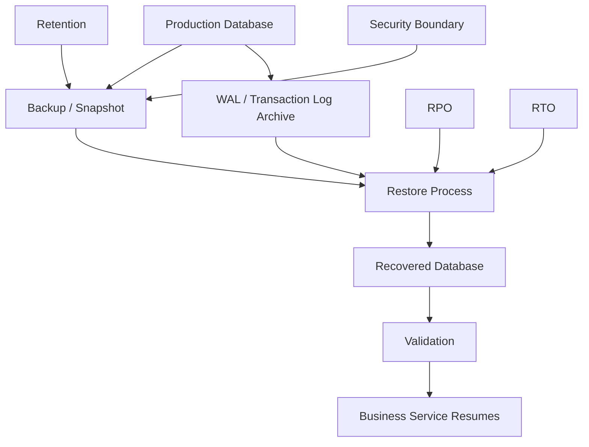
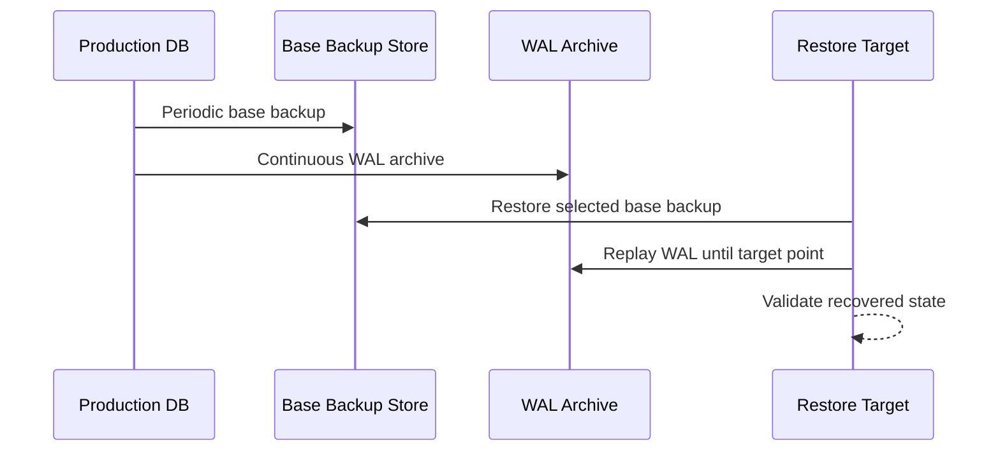
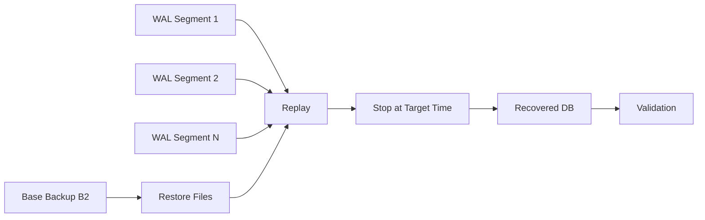
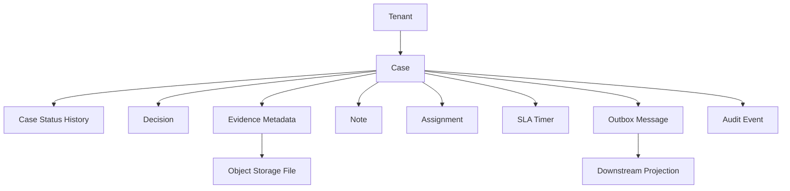

# Part 032 — Backup, Restore, and Recovery Objectives

> A backup that has never been restored is not a recovery mechanism. It is an optimistic file.

Crash recovery protects the database from incomplete physical state after process, OS, or power failure.

Backup and restore protect the organization from broader failure classes:

- accidental delete;
- bad migration;
- bad deploy;
- data corruption discovered late;
- ransomware;
- credential compromise;
- storage loss;
- region failure;
- logical bug that slowly damages data;
- tenant-specific recovery request;
- audit/regulatory reconstruction;
- environment rebuild;
- legal hold and retention conflict.

This part is about designing recoverability as a product capability, not a checkbox.

---

## 1. The Core Mental Model

Backup is not the goal.

Restore is the goal.

Recovery objectives define what restore must achieve.



Architectural rule:

> The system is only recoverable if restore has been tested, timed, secured, automated enough, and validated against business correctness.

---

## 2. RPO and RTO

Two terms matter more than almost everything else.

### RPO — Recovery Point Objective

RPO answers:

> How much data can the business afford to lose?

Examples:

| RPO | Meaning |
|---|---|
| 0 seconds | No acknowledged transaction may be lost |
| 5 seconds | Losing last few seconds may be acceptable |
| 15 minutes | Restore may lose recent quarter-hour of data |
| 24 hours | Daily backup is enough |

RPO is about **data loss**.

### RTO — Recovery Time Objective

RTO answers:

> How long can the service be down or degraded while recovering?

Examples:

| RTO | Meaning |
|---|---|
| < 1 minute | Automated failover / hot standby required |
| < 15 minutes | Warm standby or fast restore path required |
| < 4 hours | Snapshot restore may be acceptable |
| < 24 hours | Manual restore from archive may be acceptable |

RTO is about **time to service restoration**.

Common mistake:

> “We have daily backups” answers neither RPO nor RTO completely.

Daily backups imply up to 24 hours data loss unless combined with logs/PITR. They also say nothing about how long restore takes.

---

## 3. Recovery Objectives Are Business Decisions

Engineers can explain cost and mechanism.

Business owners must accept risk.

For each data domain, capture:

| Data Domain | Loss Consequence | RPO | RTO | Restore Granularity | Owner |
|---|---|---:|---:|---|---|
| Enforcement decision | Legal/regulatory defect | 0-very low | Low | case/database/PITR | Compliance owner |
| Financial ledger | Money mismatch | 0 | Low | database/ledger range | Finance owner |
| User uploaded evidence | Case integrity loss | Very low | Medium | object + metadata | Case owner |
| Search projection | Rebuildable | High | Medium | rebuild index | Platform owner |
| Analytics aggregate | Recomputable | Medium | High | table/date partition | Data owner |
| Audit log | Legal evidence | Very low | Low/medium | append-only archive | Security/compliance |

A single application can have multiple recovery classes.

Treating all data identically usually creates either unnecessary cost or unacceptable risk.

---

## 4. Backup Types

### 4.1 Logical Backup

A logical backup exports database objects and data in logical form.

Examples:

- SQL dump;
- CSV export;
- custom dump format;
- per-table export;
- schema-only export;
- tenant-specific logical export.

Strengths:

- portable across storage layout changes;
- useful for partial restore;
- useful for schema inspection;
- can migrate between versions in some cases;
- smaller for selective data.

Weaknesses:

- slower for large databases;
- restore can be slow due to index rebuild and constraints;
- may not capture cluster-level objects unless explicitly included;
- point-in-time recovery usually requires physical/log backup instead;
- consistency across multiple databases/services is hard.

Use cases:

- small/medium database backup;
- per-tenant export;
- pre-migration safety copy;
- archival extract;
- test data seed;
- partial logical recovery.

### 4.2 Physical Backup

A physical backup copies database storage files in engine-specific format.

Examples:

- base backup;
- file-system copy with correct protocol;
- volume snapshot;
- managed database snapshot;
- storage-level backup.

Strengths:

- usually faster for large databases;
- preserves physical storage state;
- suitable for PITR when combined with WAL/log archive;
- good for whole-cluster restore;
- often integrates with replication.

Weaknesses:

- engine/version/storage specific;
- less flexible for partial restore;
- may require careful consistency protocol;
- can include bloat/dead space;
- restore target compatibility matters.

### 4.3 Continuous Archiving / PITR

Point-in-time recovery uses:

1. a base backup;
2. continuous transaction log archive;
3. restore base backup;
4. replay logs until target time/LSN/restore point.



PITR is essential for recovering from logical mistakes.

Example:

```text
10:00 good state
10:13 bad migration starts
10:15 bad migration commits
10:20 issue detected

Restore to 10:12:59.
```

### 4.4 Snapshot Backup

A snapshot captures a point-in-time view of storage.

Strengths:

- fast to create;
- often incremental at storage layer;
- convenient in cloud environments;
- useful for large volumes.

Weaknesses:

- database consistency depends on snapshot mechanism and database integration;
- cross-volume consistency may be tricky;
- restore can still take time;
- snapshots are not enough if attacker can delete them;
- snapshots may not provide fine-grained PITR without log replay.

### 4.5 Replica as Recovery Aid

A replica can reduce downtime.

But a replica is not a backup.

| Scenario | Replica Helps? | Backup/PITR Needed? |
|---|---:|---:|
| Primary node crash | Yes | Still yes |
| Accidental delete | Usually no; delete replicates | Yes |
| Bad migration | Usually no; bad change replicates | Yes |
| Region failover | Yes if cross-region | Still yes |
| Corruption discovered late | Maybe no | Yes |
| Ransomware deletes primary and replica | No | Yes, isolated backup needed |

---

## 5. Backup Consistency

A backup must represent a consistent database state.

For a transactional database, “consistent” means the backup should not contain half of one committed transaction and half missing.

Logical dump tools often create transactionally consistent snapshots.

Physical backups require engine-specific protocol to ensure copied files plus logs can recover to a consistent state.

Unsafe pattern:

```text
cp -r /var/lib/database /backup/database
```

while the database is running.

That may copy files in mutually inconsistent states.

Safe patterns:

- engine-supported base backup;
- managed snapshot integrated with database engine;
- filesystem snapshot with database backup mode/checkpoint protocol;
- logical dump using consistent snapshot;
- replication-based backup with correct log coverage.

---

## 6. Cross-System Consistency

Modern systems often store truth across multiple components:

- relational database for metadata;
- object storage for evidence files;
- search index for query;
- message broker for integration;
- warehouse for analytics;
- external SaaS for communication.

Restoring only the database may create broken references.

Example:

```text
Database restored to 10:00.
Object storage remains at 10:30.
Search index remains at 10:30.
Broker has messages from 10:20.
```

Questions:

- Are object files versioned?
- Can search index be rebuilt from database/outbox?
- Can events after restore be replayed or discarded?
- Are external messages idempotent?
- Are downstream consumers aware of rewind?
- Is there a global recovery point?

For most systems, the practical pattern is:

1. restore source-of-truth database;
2. rebuild projections from source;
3. reconcile object storage references;
4. replay outbox/CDC from restored point;
5. invalidate incompatible downstream data;
6. document any external side effect that cannot be undone.

---

## 7. Recovery Granularity

Recovery can happen at different scopes.

| Scope | Example | Difficulty | Risk |
|---|---|---:|---:|
| Whole cluster | restore entire database cluster | Medium | downtime/blast radius |
| Single database | restore one database | Medium | cross-db dependencies |
| Single schema | restore tenant schema | Medium-high | dependencies/security |
| Single tenant | recover tenant accidentally deleted data | High | isolation/partial correctness |
| Single table | recover dropped table | High | FK/time consistency |
| Single entity/case | recover one case | Very high | business semantics |
| Single row | repair row | Very high | audit/provenance risk |

Important principle:

> The smaller the restore scope, the more logical understanding is required.

Whole database PITR is mechanically simpler but operationally disruptive.

Single-tenant or single-case restore is business-friendly but technically complex.

Design for required granularity early.

---

## 8. RPO/RTO Design Matrix

Use a matrix like this during architecture review.

| Requirement | Mechanism | Notes |
|---|---|---|
| RPO near zero, local node failure | synchronous replication / quorum commit | increases write latency and availability coupling |
| RPO seconds-minutes | async replication + frequent WAL archive | data loss possible on primary loss |
| RPO to arbitrary recent time | PITR | requires base backup + continuous logs |
| RTO seconds-minutes | hot standby / managed failover | failover correctness must be tested |
| RTO minutes-hours | snapshot restore / warm standby | depends on data size and automation |
| RTO hours-days | cold backup restore | cheaper, but operationally heavy |
| tenant-level restore | tenant isolation + logical export/import + repair scripts | must avoid cross-tenant contamination |
| corruption recovery | backup history + checksums + validation | detection time matters |
| ransomware resilience | immutable/offline/cross-account backups | access separation matters |

There is no free design.

Lower RPO/RTO usually increases:

- cost;
- operational complexity;
- write latency;
- replication complexity;
- test burden;
- security requirements.

---

## 9. PITR Timeline Mental Model

Suppose you take base backups every day and archive WAL continuously.

```text
Day 1 00:00  Base backup B1
Day 1 00:00-23:59 WAL archived continuously
Day 2 00:00  Base backup B2
Day 2 00:00-23:59 WAL archived continuously
```

To restore to Day 2 14:37:

1. pick base backup B2;
2. restore B2 files;
3. fetch WAL from archive after B2 start/checkpoint;
4. replay until Day 2 14:37;
5. stop recovery;
6. validate.



RPO depends on whether WAL is archived up to the desired recovery point.

RTO depends on:

- size of base backup;
- speed of storage provisioning;
- number/size of WAL segments to replay;
- CPU/storage performance during replay;
- validation process;
- DNS/application cutover;
- human approval steps;
- dependent service rebuild time.

---

## 10. Logical Backup vs PITR

Do not use one tool for every recovery problem.

| Need | Logical Dump | Physical + WAL / PITR |
|---|---:|---:|
| Restore entire large DB fast | Weak | Strong |
| Restore to exact time | Weak | Strong |
| Inspect/modify data before import | Strong | Weak |
| Partial table restore | Strong | Medium/weak |
| Cross-version migration | Sometimes strong | Risky/dependent |
| Small DB simplicity | Strong | Maybe overkill |
| Preserve physical layout | No | Yes |
| Rebuild indexes during restore | Usually yes | Usually no, already present |
| Human-readable-ish output | Often yes | No |

Production systems often use both:

- physical/PITR for disaster and point-in-time recovery;
- logical exports for partial recovery, migration, legal archive, and tenant-level tasks.

---

## 11. Backup Security

Backups are high-value targets.

They often contain:

- production PII;
- secrets accidentally stored in tables;
- deleted records still within retention;
- historical data beyond current app visibility;
- audit trails;
- credentials/tokens if schema is poor;
- sensitive evidence files or references.

Security controls:

- encryption at rest;
- encryption in transit;
- separate backup access roles;
- cross-account or isolated backup vault;
- immutable retention / write-once controls where appropriate;
- MFA/delete protection for backup deletion;
- audit access to backups;
- restore approval workflow;
- secrets scanning for exported dumps;
- masking for non-production restore;
- key management lifecycle;
- tested key recovery.

A common failure:

> Backups are encrypted, but the same compromised admin role can delete both database and backups.

Real resilience needs separation of duties and deletion resistance.

---

## 12. Retention Policy

Retention answers:

> How long do we keep recoverable history?

It is constrained by:

- compliance requirements;
- legal hold;
- privacy/erasure obligations;
- storage cost;
- corruption detection window;
- business audit needs;
- incident investigation needs;
- backup restore compatibility;
- encryption key retention.

Example retention tiers:

| Tier | Retention | Purpose |
|---|---:|---|
| PITR logs | 7-35 days | recent mistake recovery |
| Daily backups | 30-90 days | operational restore |
| Monthly backups | 1-7 years | compliance/archive |
| Immutable audit archive | policy-specific | legal/regulatory evidence |
| Non-prod masked restore | short | testing/debugging |

Be careful:

> Retention is not only how long backup files exist. It is how long they remain decryptable, restorable, and legally allowed to exist.

---

## 13. Privacy and Erasure Tension

Backups complicate privacy deletion.

If a user/entity must be erased from active systems, old backups may still contain their data.

Common strategies:

1. expire backups after defined retention;
2. prevent restoring erased data back into active systems without re-erasure process;
3. maintain deletion tombstone list applied after restore;
4. encrypt subject-specific data with keys that can be destroyed in some architectures;
5. document backup retention exception in privacy policy where legally allowed;
6. separate long-term audit facts from unnecessary PII.

Restore runbook must include:

```text
After restoring backup older than erasure time:
  apply erasure replay/tombstone process
  validate erased subjects are not reintroduced
  log the restore and re-erasure action
```

Otherwise, a restore can violate privacy obligations by resurrecting deleted data.

---

## 14. Restore Validation

A restore is not complete when the database starts.

It is complete when the recovered system is validated as fit for purpose.

Validation layers:

### 14.1 Engine-Level Validation

- database starts;
- WAL replay completed;
- no corruption errors;
- checksums pass where available;
- expected databases/schemas exist;
- extension versions compatible.

### 14.2 Structural Validation

- table counts roughly match expected point;
- constraints valid;
- indexes valid;
- migrations at expected version;
- required roles/permissions exist;
- partition metadata correct.

### 14.3 Business Validation

- known canary records exist;
- known post-target records do not exist for PITR;
- critical invariants hold;
- ledger balances reconcile;
- case status history matches current status;
- audit event counts match domain operations;
- tenant boundaries intact.

### 14.4 Application Validation

- application can connect;
- read/write smoke tests pass;
- background workers safe to start;
- outbox position handled;
- search/index projections compatible;
- scheduled jobs do not re-run destructive work unexpectedly.

Example validation queries:

```sql
-- current state must match latest status history
SELECT c.case_id
FROM enforcement_case c
LEFT JOIN LATERAL (
    SELECT h.to_status
    FROM case_status_history h
    WHERE h.case_id = c.case_id
    ORDER BY h.changed_at DESC, h.history_id DESC
    LIMIT 1
) latest ON true
WHERE c.status <> latest.to_status;
```

```sql
-- no duplicate active case number within tenant
SELECT tenant_id, case_number, count(*)
FROM enforcement_case
WHERE deleted_at IS NULL
GROUP BY tenant_id, case_number
HAVING count(*) > 1;
```

```sql
-- outbox should not contain impossible future messages after PITR target
SELECT count(*)
FROM outbox_message
WHERE created_at > :recovery_target_time;
```

---

## 15. Restore Drill Types

### 15.1 Full Restore Drill

Purpose:

- prove entire database can be restored;
- measure RTO;
- validate runbook.

Steps:

1. select backup point;
2. provision restore environment;
3. restore database;
4. run engine validation;
5. run business validation;
6. connect application in isolated mode;
7. record elapsed time and issues;
8. update runbook.

### 15.2 PITR Drill

Purpose:

- prove recovery to a specific time before a bad operation.

Scenario:

1. create canary row at `T1`;
2. create second canary row at `T2`;
3. restore to between `T1` and `T2`;
4. verify first exists and second does not.

### 15.3 Tenant Restore Drill

Purpose:

- recover one tenant without affecting others.

Requires:

- tenant-scoped data map;
- FK dependency graph;
- tenant-safe import process;
- conflict handling;
- audit of restored data;
- validation that other tenants unchanged.

### 15.4 Corruption Drill

Purpose:

- recover from corrupted table/index/file discovered after delay.

Includes:

- detection path;
- selecting clean backup;
- restoring to side environment;
- extracting clean data;
- repairing production;
- documenting data loss window.

### 15.5 Ransomware / Credential Compromise Drill

Purpose:

- prove backups survive admin credential compromise.

Questions:

- Can attacker delete backups using same role?
- Are backups immutable?
- Are backup keys isolated?
- Is there offline/cross-account copy?
- Can restore happen with break-glass credentials?

---

## 16. Restore Runbook Template

```md
# Database Restore Runbook

## 1. Incident Summary
- Incident type:
- Detection time:
- Suspected bad-change time:
- Systems affected:
- Business owner:
- Technical incident commander:

## 2. Recovery Objective
- Target recovery point:
- Maximum accepted data loss:
- Maximum accepted downtime:
- Restore scope:
- Legal/compliance constraints:

## 3. Backup Selection
- Backup ID:
- Backup timestamp:
- WAL/archive range required:
- Encryption key required:
- Backup integrity status:

## 4. Restore Environment
- Target environment:
- Network isolation:
- Credentials:
- Storage size:
- Database version:
- Extensions:

## 5. Restore Steps
1. Provision target.
2. Restore base backup/snapshot.
3. Apply WAL/logs until target.
4. Start database in restricted mode.
5. Run validation.
6. Apply privacy tombstones if needed.
7. Rebuild projections if needed.
8. Cut over application.

## 6. Validation
- Engine checks:
- Structural checks:
- Business invariant checks:
- Application smoke checks:
- Owner sign-off:

## 7. Cutover
- Freeze writes:
- DNS/connection switch:
- Worker restart policy:
- Outbox/CDC handling:
- Monitoring dashboard:

## 8. Post-Recovery
- Root cause:
- Data loss assessment:
- Customer/regulatory notification:
- Backup/runbook improvement:
- Follow-up tasks:
```

This template should live in the engineering handbook, not in one engineer’s head.

---

## 17. Restore Architecture for Multi-Tenant Systems

Multi-tenant restore is hard because tenants share infrastructure but expect isolated recovery.

### Shared Table with `tenant_id`

Pros:

- efficient resource use;
- simpler global operations;
- easier shared schema evolution.

Restore challenge:

- tenant data is interleaved;
- tenant-specific restore requires logical extraction/import;
- global sequences and shared reference data complicate replay;
- accidental cross-tenant import is severe.

### Schema Per Tenant

Pros:

- easier tenant-specific logical restore;
- clearer boundary;
- per-tenant migration possible.

Restore challenge:

- many schemas to manage;
- shared services still exist;
- schema drift risk;
- operational automation required.

### Database Per Tenant

Pros:

- strongest restore isolation;
- database-level PITR per tenant;
- clearer blast radius.

Restore challenge:

- higher cost;
- fleet management;
- cross-tenant reporting complexity;
- migration orchestration.

Architecture principle:

> Tenant isolation is not only a query-security decision. It is also a backup/restore decision.

---

## 18. Data Dependency Map

Before you can restore safely, you need a data dependency map.

Example for case management:



For each node, document:

- source of truth or projection;
- backup mechanism;
- restore order;
- consistency check;
- retention rule;
- security classification;
- tenant ownership;
- rebuild possibility.

Without this map, partial restore becomes guesswork.

---

## 19. Restore Order

A general restore order:

1. infrastructure/network/security prerequisites;
2. database engine and storage;
3. source-of-truth database;
4. object/file storage metadata alignment;
5. audit/security tables;
6. application configuration/secrets;
7. projections/read models/search indexes;
8. background workers;
9. integration/event streams;
10. external-facing application traffic.

Do not start all workers immediately after restore.

Workers may:

- publish old outbox messages;
- replay scheduled jobs;
- send duplicate emails;
- call external APIs;
- mutate restored data before validation;
- rebuild projections from wrong checkpoint.

Safe restore starts in restricted mode.

---

## 20. Backup Monitoring

Monitor the backup system like production.

Key signals:

| Signal | Why It Matters |
|---|---|
| Last successful backup time | detects backup job failure |
| Last successful WAL/log archive time | protects PITR RPO |
| Backup size trend | detects abnormal growth/shrink |
| Backup duration | detects RTO/operational drift |
| Restore test age | detects unproven backup process |
| WAL archive lag | detects RPO risk |
| Replication slot retained bytes | detects disk-full risk |
| Snapshot deletion events | detects attack/operator error |
| Backup encryption/key status | detects unrecoverable backup |
| Validation failure count | detects silent corruption/process drift |

Bad metric:

```text
backup_job_exit_code = 0
```

Better metric:

```text
last_restorable_point_age_seconds
restore_drill_last_success_timestamp
restore_drill_duration_seconds
validated_recovered_database_version
```

A system is not backed up because a cron job succeeded.

It is backed up when you can prove a restorable point exists.

---

## 21. Backup Failure Modes

### 21.1 Backup Succeeds but Restore Fails

Causes:

- missing WAL segments;
- missing encryption key;
- incompatible database version;
- corrupted backup file;
- incomplete snapshot set;
- extension not installed;
- restore procedure undocumented;
- credentials unavailable.

Mitigation:

- automated restore drill;
- checksum verification;
- dependency manifest;
- key recovery test;
- version compatibility matrix.

### 21.2 PITR Gap

Causes:

- WAL archive command failed;
- log retention too short;
- archive bucket access denied;
- replication slot issue;
- wrong timeline selected;
- backup catalog metadata wrong.

Mitigation:

- alert on archive lag;
- periodically restore to random timestamp;
- retain enough logs;
- monitor backup catalog.

### 21.3 Backup Contains Corruption

Causes:

- corruption existed before backup;
- no checksums/validation;
- logical bug damaged data long before detection.

Mitigation:

- keep long enough history;
- validate invariants regularly;
- use checksums where possible;
- sample restore older backups;
- maintain audit/history for logical repair.

### 21.4 Restore Reintroduces Deleted Private Data

Causes:

- restored old backup after privacy erasure;
- no tombstone replay process;
- no post-restore erasure validation.

Mitigation:

- erasure ledger;
- post-restore deletion replay;
- restore runbook privacy step;
- minimized PII retention.

### 21.5 Backup Deleted by Attacker

Causes:

- same admin role controls production and backup deletion;
- no immutable backup retention;
- no cross-account copy;
- no deletion alert.

Mitigation:

- immutable backup vault;
- access separation;
- MFA/delete protection;
- offline/cross-account copy;
- tested break-glass restore.

---

## 22. Pre-Migration Backup Strategy

Before dangerous database migration:

1. classify migration risk;
2. verify latest restorable point;
3. take explicit pre-change backup/snapshot if needed;
4. confirm WAL archiving/PITR is healthy;
5. estimate rollback feasibility;
6. define forward-fix strategy;
7. define validation queries;
8. define abort thresholds;
9. pause conflicting jobs;
10. document restore decision owner.

For high-risk migrations, “rollback” may be impossible once writes continue.

Example:

- drop column;
- rewrite table;
- merge entities;
- destructive deduplication;
- data anonymization;
- partition detach/drop;
- change primary key model.

Safer approach:

- expand-contract migration;
- shadow copy;
- backfill with validation;
- dual read/write where needed;
- cutover;
- delayed cleanup after backup retention window.

---

## 23. Backup and Analytics/Reporting

Do not run heavy analytics directly on backup restore unless designed.

But backups can support:

- forensic analysis;
- regulatory point-in-time report reconstruction;
- debugging bad migration;
- data diff between time points;
- audit evidence extraction.

Pattern:

1. restore backup into isolated forensic environment;
2. disable external side effects;
3. run read-only analysis;
4. export approved evidence/report;
5. destroy environment according to policy.

Never casually restore production backup into low-security dev environment.

Backups have production sensitivity.

---

## 24. Case Study — Accidental Case Closure

Scenario:

A bug deploy runs:

```sql
UPDATE enforcement_case
SET status = 'closed'
WHERE status <> 'closed';
```

Detected 12 minutes later.

Questions:

1. Can you identify exact bad-change time?
2. Are there legitimate updates after the bad change?
3. Is full database rewind acceptable?
4. Can you repair logically using audit/status history?
5. Do downstream systems need compensation?
6. Were notifications sent based on bad closure?
7. Do backups allow PITR to before the bad change?
8. How do you preserve evidence of the incident?

Possible recovery strategies:

### Strategy A — Full PITR Rewind

Use when:

- system can tolerate losing all writes after target time;
- incident detected quickly;
- downstream effects manageable.

Pros:

- clean mechanical recovery.

Cons:

- loses legitimate post-target writes;
- requires outage/cutover;
- downstream rewind complexity.

### Strategy B — Logical Repair

Use when:

- full rewind unacceptable;
- audit/status history can reconstruct prior state;
- bad update is well-scoped.

Pros:

- preserves legitimate writes.

Cons:

- higher logical complexity;
- must prove correctness;
- may need compensating downstream events.

Example repair sketch:

```sql
WITH previous_status AS (
    SELECT DISTINCT ON (case_id)
        case_id,
        from_status AS status_before_bad_change
    FROM case_status_history
    WHERE changed_at >= :bad_change_started_at
      AND changed_at <= :bad_change_ended_at
      AND to_status = 'closed'
      AND reason_code = 'buggy_batch_closure'
    ORDER BY case_id, changed_at ASC
)
UPDATE enforcement_case c
SET status = p.status_before_bad_change,
    updated_at = now()
FROM previous_status p
WHERE c.case_id = p.case_id;
```

A senior architect designs the schema so Strategy B is possible, while keeping Strategy A available through PITR.

---

## 25. Recovery Design Document Section

Every serious database design doc should include this section:

```md
## Recovery Design

### Data Classes
- Source-of-truth tables:
- Rebuildable projections:
- External objects/files:
- Audit/evidence records:

### Objectives
- RPO by data class:
- RTO by incident type:
- Restore granularity:
- Retention requirements:

### Backup Mechanisms
- Logical backup:
- Physical backup:
- PITR/WAL archive:
- Snapshot:
- Cross-region/cross-account copy:

### Restore Procedures
- Full restore:
- PITR restore:
- Tenant restore:
- Partial logical restore:
- Object storage reconciliation:
- Projection rebuild:

### Validation
- Engine checks:
- Structural checks:
- Business invariant checks:
- Security/privacy checks:

### Drills
- Frequency:
- Last drill result:
- Measured RPO:
- Measured RTO:
- Known gaps:
```

If this section is empty, the architecture is not production-ready.

---

## 26. Senior-Level Heuristics

### Heuristic 1 — Restore Is the Product

Backup tooling is implementation detail.

The product is the ability to recover a valid business state within accepted time and loss boundaries.

### Heuristic 2 — RPO/RTO Must Be Measured, Not Claimed

A slide can say RTO is 30 minutes.

A restore drill tells the truth.

### Heuristic 3 — Replicas Copy Mistakes

Use replicas for availability and read scaling.

Use backups/PITR for going back.

### Heuristic 4 — Partial Restore Requires Data Model Discipline

Tenant restore, case restore, and table restore are easier when ownership boundaries, FK relationships, audit history, and tenant keys are clean.

### Heuristic 5 — Security of Backups Is Security of Production

If backups are exposed, production data is exposed.

### Heuristic 6 — Recovery Must Include Downstream Effects

Database restore without search/index/broker/object-store strategy is incomplete.

### Heuristic 7 — Every Dangerous Migration Needs a Recovery Story

Before you run destructive DDL/DML, know the restore point, validation plan, and decision owner.

---

## 27. Practice Exercises

### Exercise 1 — Define Recovery Objectives

For a regulatory case management platform, define RPO/RTO for:

- case metadata;
- evidence files;
- case status history;
- audit logs;
- search index;
- analytics reports.

Explain why they differ.

### Exercise 2 — PITR Drill

Design a PITR test that proves you can restore to a point between two canary writes.

Include:

- canary creation;
- backup/log verification;
- target restore time;
- validation query;
- elapsed time measurement.

### Exercise 3 — Tenant Restore

Assume shared tables with `tenant_id`.

Design a tenant-specific restore procedure after accidental deletion of one tenant’s cases.

Include:

- dependency map;
- extraction source;
- import ordering;
- conflict handling;
- audit trail;
- verification that other tenants are unchanged.

### Exercise 4 — Backup Security Review

Review a backup system where the production DBA role can delete backups.

Identify failure modes and propose controls.

### Exercise 5 — Bad Migration Recovery

A migration incorrectly normalizes `party` records and merges unrelated people.

Choose between PITR and logical repair.

What evidence do you need to decide?

---

## 28. What You Should Remember

Backup is not a checkbox.

Recoverability is a system property.

The architect’s job is to ensure:

- recovery objectives are explicit;
- mechanisms match objectives;
- backups are consistent, secure, and retained;
- restore is tested regularly;
- PITR works end to end;
- partial recovery is designed where required;
- privacy and retention are not afterthoughts;
- downstream projections and external objects are included;
- every dangerous migration has a recovery story.

The core phrase to remember:

> We do not have backups unless we have proven restores.

The next part moves into replication models: leader-follower, synchronous/asynchronous replication, quorum, lag, failover, and the difference between scaling reads and preserving truth.

---

## References

- PostgreSQL Documentation — SQL Dump: https://www.postgresql.org/docs/current/backup-dump.html
- PostgreSQL Documentation — Continuous Archiving and Point-in-Time Recovery: https://www.postgresql.org/docs/current/continuous-archiving.html
- PostgreSQL Documentation — `pg_basebackup`: https://www.postgresql.org/docs/current/app-pgbasebackup.html
- AWS Prescriptive Guidance — Choosing the right database for RTO and RPO: https://docs.aws.amazon.com/prescriptive-guidance/latest/strategy-database-disaster-recovery/choosing-database.html
- AWS Backup Documentation — Continuous backups and point-in-time recovery: https://docs.aws.amazon.com/aws-backup/latest/devguide/point-in-time-recovery.html
- Amazon RDS Documentation — Restoring a DB instance to a specified time: https://docs.aws.amazon.com/AmazonRDS/latest/UserGuide/USER_PIT.html
