# Part 033 — Replication Models

> Replication is not “having another database.” Replication is copying a history of changes while preserving enough order, durability, and authority for the business promise you are making.

In earlier parts we covered transactions, WAL, crash recovery, and backup/restore.

Replication sits between those concerns:

- it can reduce downtime;
- it can reduce data-loss window;
- it can offload reads;
- it can support regional disaster recovery;
- it can feed analytics/search/projections;
- it can become a source of subtle inconsistency if treated casually.

This part builds the mental model for replication itself. The next part focuses specifically on read scaling and replica consistency.

---

## 1. The Core Mental Model

A database changes over time.

Replication copies those changes somewhere else.

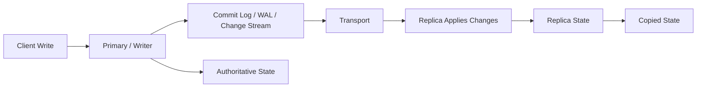

The important question is not:

> Do we have a replica?

The important questions are:

1. **What exactly is being copied?**
2. **In what order?**
3. **Before or after commit acknowledgement?**
4. **How far behind can the copy be?**
5. **Who is allowed to accept writes?**
6. **What happens when the network breaks?**
7. **How do we prevent two nodes from both believing they are the authority?**
8. **Which reads are allowed to use the copy?**
9. **Can the replica be promoted safely?**
10. **How do we prove recovery correctness?**

Architectural rule:

> Replication is a correctness boundary first, then an availability/scaling mechanism.

---

## 2. What Replication Solves

Replication can help with several different goals.

| Goal | How replication helps | Hidden risk |
|---|---|---|
| High availability | Promote replica when writer fails | split brain, data loss, stale routing |
| Disaster recovery | Keep copy in another zone/region | lag, region failover complexity |
| Read scaling | Route read-only queries to replicas | stale reads, inconsistent UX |
| Backup support | Backup from replica to reduce primary load | backing up stale or inconsistent state |
| Analytics feed | Stream changes downstream | ordering, schema evolution, replay bugs |
| Maintenance | Switchover during upgrades | promotion drift, connection handling |
| Geo-latency | Put readable copies near users | local stale read semantics |

Replication does **not** automatically solve:

- bad application writes;
- bad schema migration;
- accidental delete already replicated everywhere;
- logical corruption;
- compromised privileged account;
- missing constraints;
- bad data model;
- write hotspot;
- query inefficiency;
- unbounded storage growth.

A replica faithfully copying bad state is still bad state.

---

## 3. Replication Design Axes

A production replication architecture should be described across multiple axes.

### 3.1 Write Authority

Who can accept writes?

| Model | Write authority | Common use |
|---|---|---|
| Single leader / primary | One writer | Most OLTP systems |
| Leader-follower | One writer, many read replicas | HA + read scale |
| Multi-leader | Multiple writers | Region-local writes, offline sync, special cases |
| Leaderless / quorum | Many replicas participate in reads/writes | Distributed KV/wide-column systems |
| Consensus range leader | Many ranges, each with a leader | Distributed SQL / strongly consistent systems |

### 3.2 Replication Timing

When is the replica involved relative to commit acknowledgement?

| Timing | Meaning | Tradeoff |
|---|---|---|
| Asynchronous | Primary commits before replica confirms | Low latency, possible data loss on failover |
| Synchronous | Commit waits for replica confirmation | Lower data loss, higher latency/availability coupling |
| Semi-synchronous | Waits for receipt but not necessarily full durable apply | Middle ground, engine-specific semantics |
| Quorum | Commit waits for enough replicas | Stronger durability, consensus cost |

### 3.3 Replication Content

What is copied?

| Content | Meaning | Example use |
|---|---|---|
| Physical blocks/WAL | Low-level storage changes | hot standby, physical HA |
| Logical row changes | table-level changes | CDC, selective replication |
| Statement-based changes | SQL statements replayed | older/simple replication models |
| Event stream | domain/change events | integration/read model |
| Snapshot + incremental log | initial copy plus ongoing changes | bootstrap replica, migration |

### 3.4 Replica Role

What is the replica allowed to do?

| Role | Behavior |
|---|---|
| Warm standby | receives changes, not serving application reads |
| Hot standby | receives changes and serves read-only queries |
| Read replica | application read scaling target |
| Delayed replica | intentionally behind for accidental-delete recovery window |
| Analytics replica | query-heavy reporting target |
| DR replica | promoted only during disaster |
| Logical subscriber | consumes selected tables/change stream |

### 3.5 Topology

How are nodes connected?

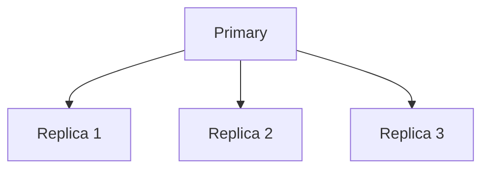

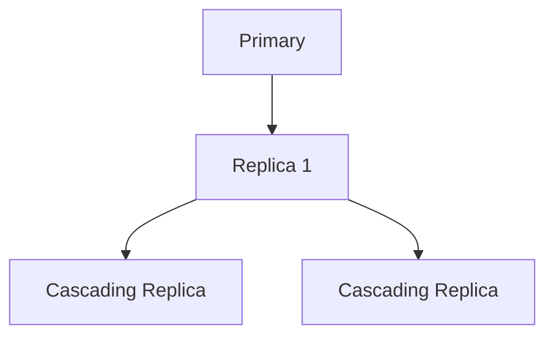

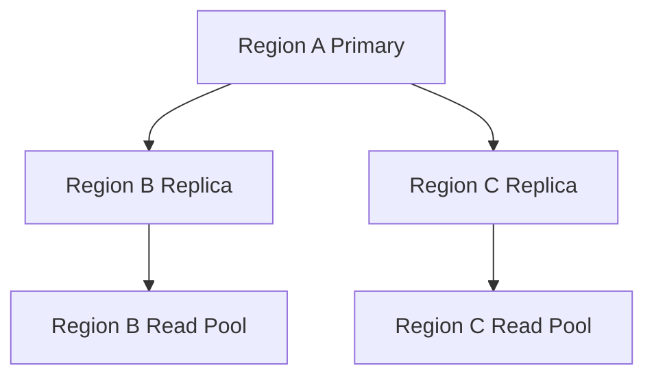

Topology affects:

- network load on primary;
- failover path;
- replication lag;
- operational complexity;
- blast radius;
- promotion ordering;
- region evacuation procedure.

---

## 4. Leader-Follower Replication

The most common OLTP replication model is leader-follower.

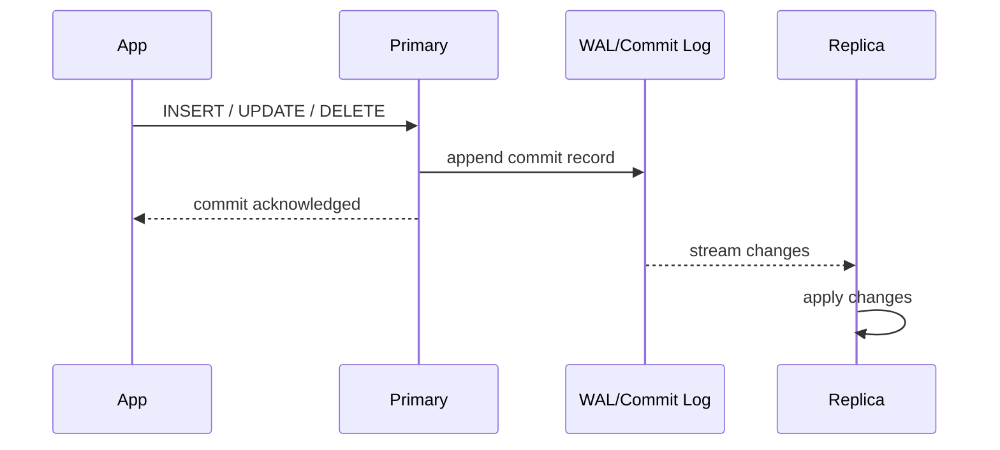

In this model:

- all writes go to the primary;
- replicas receive changes from the primary;
- replicas may serve reads depending on freshness requirements;
- failover promotes a replica to become the new primary.

This model is easy to explain but not trivial to operate.

Critical design questions:

1. Can a committed write be lost after primary failure?
2. How is replica promotion chosen?
3. What prevents the old primary from accepting writes after network recovery?
4. How do applications discover the new writer?
5. Which clients are allowed to read from stale replicas?
6. How is replication lag measured and alerted?
7. What happens to in-flight transactions during failover?
8. How are old replicas rejoined after promotion?

---

## 5. Physical Replication

Physical replication copies low-level storage/WAL changes.

Conceptually:

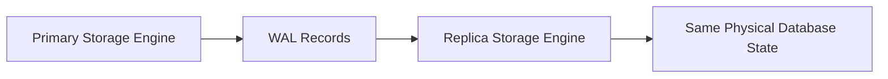

Characteristics:

- close to engine internals;
- usually replicates the whole database cluster or instance;
- efficient for HA/hot standby;
- good for exact physical standby;
- less flexible for selective replication;
- replica version/storage compatibility matters;
- schema changes are replicated as part of the physical stream.

Use physical replication when you want:

- HA standby;
- read replica with same engine;
- disaster recovery copy;
- fast failover candidate;
- backup offload target.

Avoid relying on physical replication when you need:

- selective table replication;
- shape transformation;
- heterogeneous sink;
- event-driven integration;
- per-domain subscription semantics.

---

## 6. Logical Replication

Logical replication copies changes at logical data level.

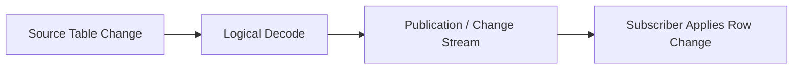

Characteristics:

- table-level or publication-level selection;
- useful for migrations and integration;
- can replicate into different topology;
- easier to reason as data changes;
- more sensitive to schema compatibility;
- may not carry every physical detail;
- conflict behavior must be understood.

Common uses:

- online migration;
- table subset replication;
- CDC pipeline;
- analytics feed;
- cross-version upgrade strategy;
- blue/green database transition;
- zero-downtime refactor support.

Design questions:

1. What tables are published?
2. Are deletes represented?
3. Are primary keys stable?
4. Are schema changes coordinated?
5. Can subscriber apply changes fast enough?
6. What happens on conflict?
7. How is initial snapshot coordinated with incremental changes?
8. Is ordering global, per table, per transaction, or per partition?

---

## 7. Statement-Based, Row-Based, and Log-Based Replication

Some engines distinguish replication by representation.

### Statement-Based Replication

Statement-based replication sends the SQL statement.

Example concept:

```sql
UPDATE account SET balance = balance - 100 WHERE id = 10;
```

Risk:

- non-deterministic functions;
- different execution plans;
- different session settings;
- side effects;
- data drift if statement behaves differently.

### Row-Based Replication

Row-based replication sends row changes.

Example concept:

```text
account[id=10].balance: 1000 -> 900
```

Benefit:

- more deterministic;
- easier to apply exactly;
- often larger change volume;
- still needs key identity and ordering.

### Log-Based Replication

Log-based replication sends records from the commit log/WAL/binlog.

Benefit:

- natural ordering source;
- good for CDC;
- supports incremental propagation;
- can decouple consumers from primary query workload.

Architectural rule:

> The representation determines what can drift, what can be replayed, and what can be audited.

---

## 8. Asynchronous Replication

In asynchronous replication, the primary acknowledges commit before the replica has necessarily received/applied the change.

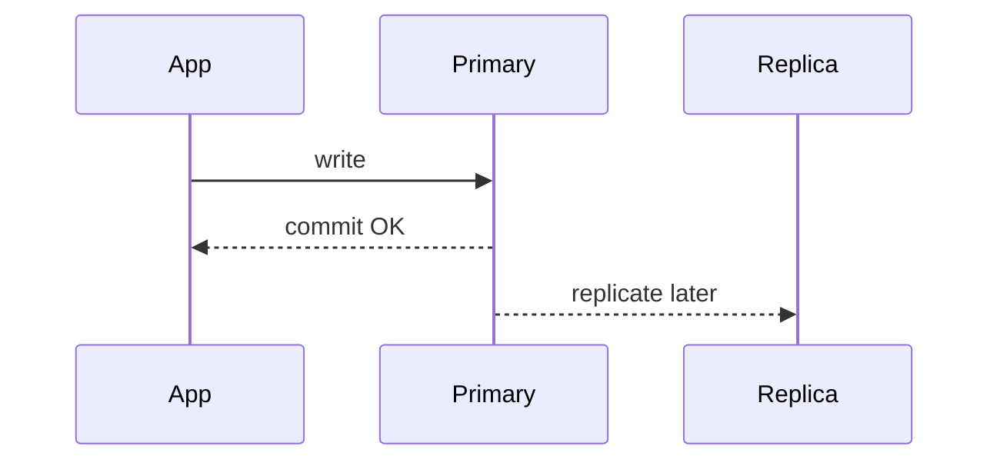

Benefits:

- low write latency;
- replicas do not block primary commit;
- tolerates temporary replica/network slowdown;
- simple operational model;
- common default for read replicas.

Risks:

- replica lag;
- stale reads;
- data loss after primary failure if latest commits were not replicated;
- promotion may choose an outdated replica;
- downstream systems may observe changes later;
- accidental delete quickly propagates once stream catches up.

Use asynchronous replication when:

- low latency is more important than zero data loss;
- read replicas can tolerate freshness limits;
- DR RPO is non-zero;
- failover playbook accepts potential last-write loss;
- application has idempotency/reconciliation paths.

Do not pretend asynchronous replication gives zero RPO.

---

## 9. Synchronous Replication

In synchronous replication, commit waits for one or more replicas to acknowledge according to configured semantics.

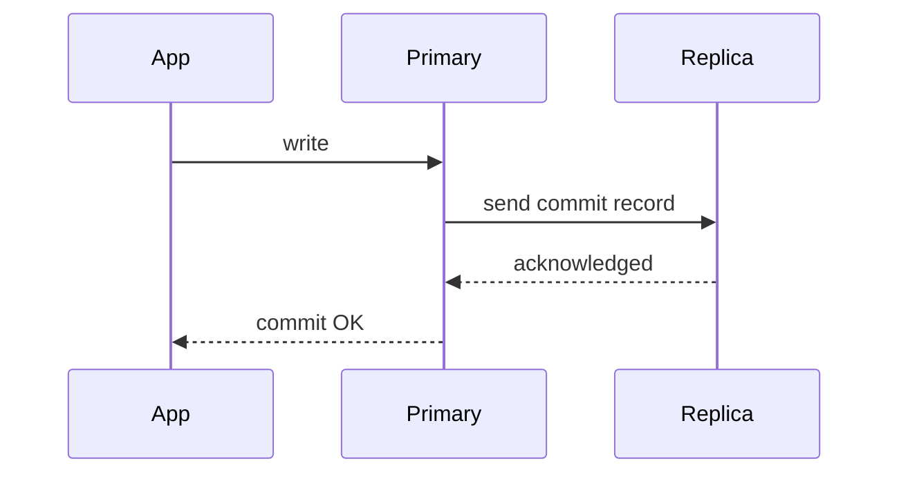

Benefits:

- lowers data-loss window;
- failover candidate is closer to current;
- useful for critical domains;
- improves confidence in HA promotion.

Costs:

- write latency includes replica/network path;
- primary availability can depend on replica availability;
- poor configuration can turn a replica issue into a write outage;
- cross-region synchronous replication can be expensive in latency;
- ambiguous commit states still need careful handling.

Important distinction:

> “Synchronous” does not always mean the same thing across engines.

An engine may wait for:

- replica receive;
- WAL flush;
- apply visibility;
- quorum acknowledgement;
- durable consensus commit.

You must read the specific engine semantics.

---

## 10. Quorum Replication

Quorum replication appears in distributed databases and consensus systems.

Instead of one primary and passive replicas, the system requires enough replicas to participate.

Simplified concept:

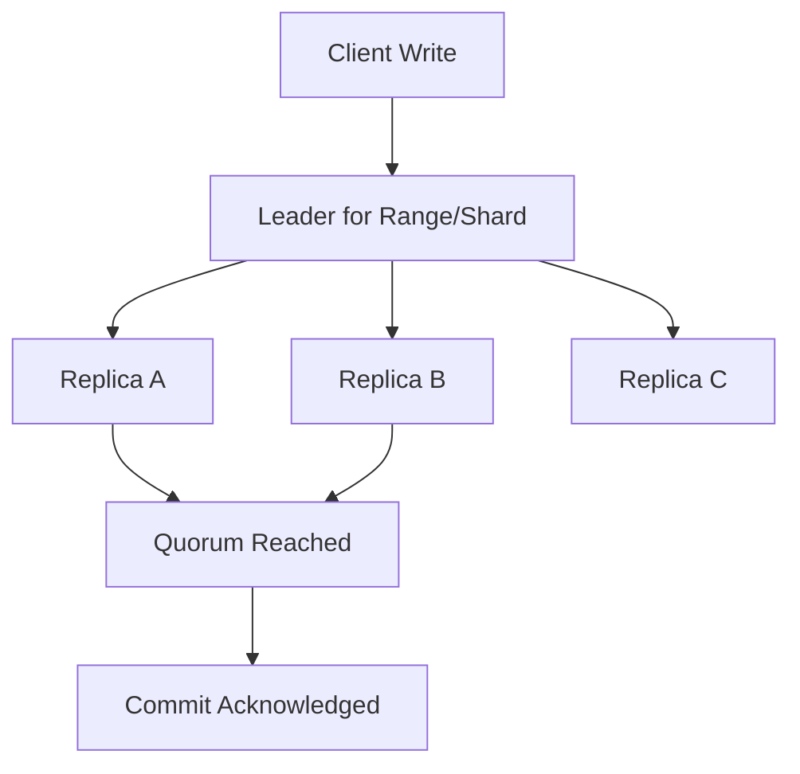

If replication factor is 3, a write may require 2 acknowledgements.

Benefits:

- stronger fault tolerance;
- clear majority authority;
- split-brain prevention through consensus;
- often supports automatic leader election;
- good fit for distributed SQL/KV systems.

Costs:

- coordination latency;
- write path complexity;
- quorum unavailability during correlated failures;
- operational need to understand range placement/locality;
- tail latency impact.

Quorum replication is not magic. It moves the difficult questions into:

- replica placement;
- leader placement;
- consensus latency;
- lease/clock assumptions;
- range split and rebalancing;
- transaction coordination across ranges.

---

## 11. Multi-Leader Replication

Multi-leader replication allows writes in more than one location.

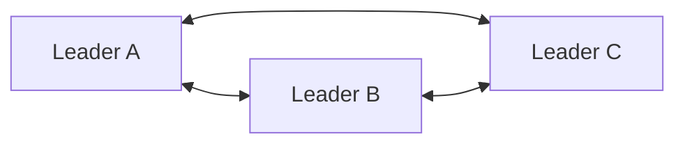

It can be attractive when:

- users need local writes in multiple regions;
- offline systems later synchronize;
- independent business units operate semi-autonomously;
- migration requires temporary dual-write at database layer.

But it introduces a hard problem:

> What happens when two leaders accept conflicting writes?

Conflict examples:

| Conflict | Example |
|---|---|
| Same row update | two regions update customer email differently |
| Unique key collision | same username created in two regions |
| Invariant violation | two approvals exceed limit independently |
| Delete/update race | one leader deletes, another updates |
| Ordering conflict | workflow transition applied in different sequence |

Resolution strategies:

| Strategy | Problem |
|---|---|
| Last-write-wins | can silently lose business facts |
| Region priority | may be arbitrary and unfair |
| Manual conflict queue | operational burden |
| CRDT-like merge | only valid for mergeable data types |
| Domain-specific resolver | correct but expensive to design |
| Partitioned ownership | best if each entity has one writer at a time |

For regulated/case/ledger systems, uncontrolled multi-leader replication is usually dangerous.

Better pattern:

> Use globally unique identity, region-local ownership, explicit transfer of authority, and domain-level conflict handling.

---

## 12. Leaderless Replication

Leaderless replication appears in systems inspired by Dynamo-style designs.

Writes may be sent to multiple replicas, and reads may consult multiple replicas.

Simplified model:

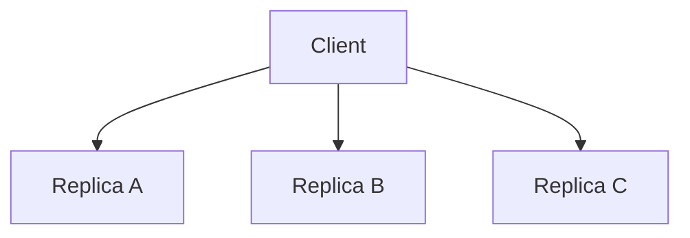

Concepts:

- replication factor `N`;
- write quorum `W`;
- read quorum `R`;
- hinted handoff;
- read repair;
- anti-entropy repair;
- vector clocks or version metadata;
- eventual consistency;
- tunable consistency.

Typical reasoning:

> If `R + W > N`, a read quorum should overlap with a write quorum.

But real systems still have edge cases:

- concurrent writes;
- sloppy quorum;
- hinted handoff windows;
- clock/version conflict;
- repair delay;
- tombstone handling;
- partial failure;
- stale coordinator state.

Use leaderless systems when workload fits:

- high write availability;
- partition tolerance;
- simple access patterns;
- domain can tolerate eventual consistency or conflict resolution;
- data model is query-driven and denormalized.

Avoid for invariants requiring global serializability unless the engine provides the needed guarantees and you understand the cost.

---

## 13. Replication Lag

Replication lag is the distance between primary state and replica state.

It can be measured in several ways:

| Lag type | Meaning |
|---|---|
| Transport lag | change not yet received by replica |
| Flush lag | received but not durably stored |
| Replay/apply lag | stored but not visible/applied |
| Commit timestamp lag | replica visible state is behind primary commit time |
| Byte/LSN lag | WAL/log distance between nodes |
| Queue lag | logical subscriber backlog |

Mental model:

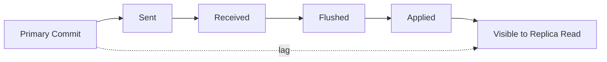

Replica lag can be caused by:

- network latency or interruption;
- insufficient replica CPU;
- insufficient replica I/O;
- slow apply thread;
- large transaction;
- long-running query on hot standby blocking cleanup/apply behavior;
- schema change;
- index creation;
- write burst;
- primary generating WAL faster than replica consumes;
- replication slot retaining WAL;
- lock conflict on replica;
- cross-region latency;
- overloaded storage;
- downstream subscriber error.

Architecture impact:

| Lag | Impact |
|---|---|
| 10 ms | usually invisible except strict read-your-writes |
| 1 second | UX glitches possible |
| 30 seconds | workflows may show stale status |
| 5 minutes | operational reports misleading |
| 1 hour | replica may be unusable for most business reads |
| unbounded | failover/read scaling architecture is broken |

Do not alert only on replica up/down.

Alert on lag against business freshness budget.

---

## 14. Replication Lag Budget

Every replica should have a freshness contract.

Example:

| Replica | Intended use | Max tolerated lag | Action if exceeded |
|---|---|---:|---|
| app-read-replica-1 | normal read scaling | 2 seconds | route critical reads to primary |
| report-replica | dashboard/reporting | 5 minutes | show freshness warning |
| analytics-subscriber | batch analytics | 30 minutes | pause dependent jobs |
| dr-region-replica | disaster recovery | 10 seconds | page on-call |
| delayed-replica | accidental delete recovery | 30 minutes intentional | do not route app reads |

Architectural rule:

> A replica without a lag budget is an unbounded correctness risk.

---

## 15. Replication Slots and Retained Logs

Some engines have mechanisms that preserve logs until subscribers consume them.

The benefit:

- a slow replica/subscriber can catch up;
- changes are not lost while subscriber is disconnected;
- CDC pipelines become more reliable.

The risk:

- retained logs grow without bound;
- primary disk fills;
- write availability can be affected;
- a forgotten subscriber becomes production risk.

Operational rule:

> Every replication slot/subscription must have an owner, lag alert, disk impact budget, and deletion procedure.

Review table:

| Slot/Subscription | Owner | Consumer | Max lag | Drop policy | Disk budget |
|---|---|---|---:|---|---:|
| search-cdc | Search team | indexer | 5 min | manual with approval | 50 GB |
| analytics-cdc | Data team | lake ingest | 30 min | pause jobs first | 200 GB |
| migration-sub | Platform | migration tool | 10 min | after cutover | 100 GB |

---

## 16. Failover and Promotion

Failover means a replica becomes the writer after the current primary is unavailable or unsafe.

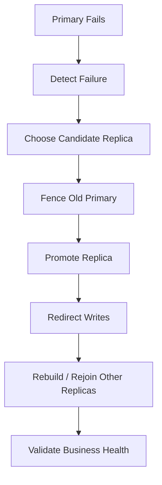

Key distinction:

| Operation | Meaning |
|---|---|
| Switchover | planned, controlled writer transfer |
| Failover | unplanned promotion after failure |
| Promotion | making standby writable |
| Fencing | preventing old primary from accepting writes |
| Rejoin | attaching old primary/replicas to new topology |

The dangerous failure is not “primary down.”

The dangerous failure is:

> Two nodes accept writes independently, and both later claim authority.

That is split brain.

---

## 17. Split Brain

Split brain occurs when more than one node believes it is the writer authority.

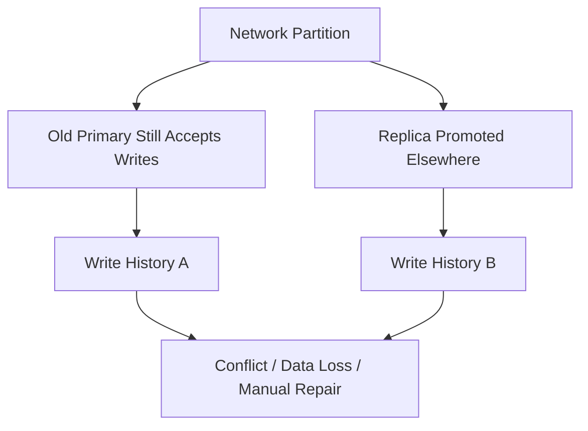

Preventing split brain requires fencing.

Fencing can involve:

- shutting down old primary;
- revoking storage access;
- cloud instance fencing;
- consensus-based leader election;
- VIP/proxy ownership control;
- lease mechanism;
- manual operator confirmation;
- disabling writes before promotion;
- strict runbook.

Application-side routing is not enough. If the old primary can still accept writes from any path, the system is unsafe.

Architecture review question:

> During a partial network partition, what exactly prevents two writers?

If the answer is vague, failover design is incomplete.

---

## 18. Failover Candidate Selection

Not every replica is a safe candidate.

Candidate properties:

| Property | Why it matters |
|---|---|
| Lowest lag | reduces data loss |
| Durable logs | avoids promoting incomplete state |
| Same schema version | avoids app incompatibility |
| Healthy storage | avoids immediate second failure |
| Correct region/AZ | meets DR objective |
| Sufficient capacity | handles write workload |
| Replication topology position | can rebuild others |
| Not intentionally delayed | delayed replica is not normal candidate |

Candidate selection policy:

```text
1. Exclude unhealthy replicas.
2. Exclude replicas beyond data-loss budget.
3. Exclude delayed/reporting-only replicas.
4. Prefer most advanced durable replica.
5. Fence old primary.
6. Promote candidate.
7. Redirect traffic.
8. Validate service-level invariants.
```

For high-stakes systems, failover choice should be deterministic and rehearsed.

---

## 19. Data Loss on Failover

With asynchronous replication, the primary may acknowledge commits that never reached the replica.

Timeline:

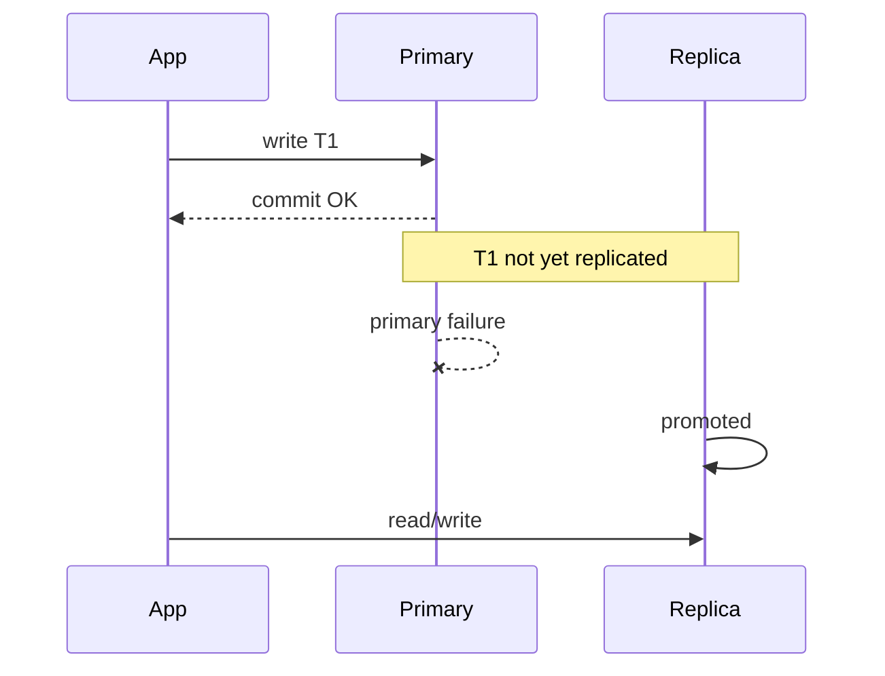

Result:

- application saw T1 as committed;
- new primary may not contain T1;
- user/system observes disappearance;
- downstream events may or may not have been emitted;
- reconciliation may be required.

Mitigations:

| Mitigation | Tradeoff |
|---|---|
| synchronous replication | higher latency/availability coupling |
| semi-sync | engine-specific guarantees |
| commit LSN tracking | route reads/failover by known applied point |
| idempotent commands | safe replay after failure |
| outbox recovery | reconcile emitted/committed events |
| business reconciliation | detect and repair missing effects |
| lower RPO acceptance | explicit risk ownership |

Do not hide this from stakeholders. RPO is a business promise.

---

## 20. Replication and Application Connections

Failover is not complete until applications use the new writer.

Connection concerns:

- connection pool still points to old host;
- DNS TTL delays;
- proxy/router stale state;
- read/write splitting misroutes writes;
- prepared statement/session state invalid;
- in-flight transactions fail;
- retry storm overloads new primary;
- caches still assume old state.

Application behavior during failover:

```text
try transaction
if connection failure:
    reconnect using writer endpoint
    retry only if command is idempotent or commit outcome is known
if commit outcome unknown:
    perform idempotency lookup / reconciliation
```

Never blindly retry non-idempotent commands after failover.

Use:

- idempotency keys;
- command records;
- unique business constraints;
- transaction/outbox consistency;
- explicit retry classification;
- circuit breaking;
- jittered backoff.

---

## 21. HA, DR, and Read Scaling Are Different

A single replica cannot always serve every purpose.

| Purpose | Replica requirement |
|---|---|
| HA failover | low lag, promotable, capacity-ready |
| DR | regional isolation, tested recovery path |
| Read scaling | query capacity, freshness contract |
| Reporting | heavy query isolation, maybe stale acceptable |
| Accidental delete recovery | intentionally delayed |
| CDC | ordered changes, retention, subscriber ownership |

Common mistake:

> Using the same replica for failover, analytics, backups, and application reads.

That creates competing workloads.

Better design:

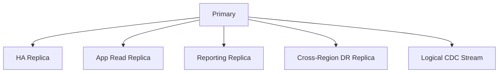

Each replica has a job.

Each job has a contract.

---

## 22. Cascading Replication

Cascading replication lets replicas feed other replicas.

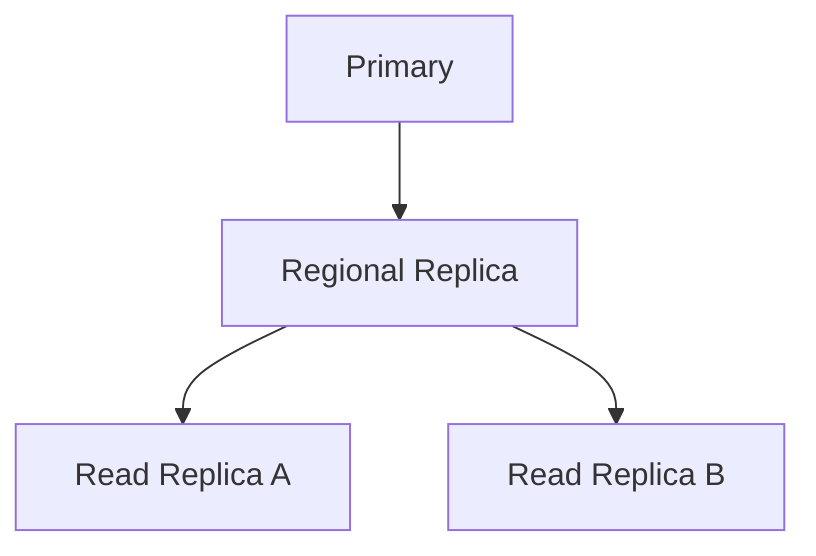

Benefits:

- reduces primary network fan-out;
- useful for regional topology;
- allows local read pools;
- can isolate reporting/analytics downstream.

Risks:

- downstream lag includes upstream lag;
- failure of intermediate node affects downstream replicas;
- promotion logic becomes more complex;
- topology reconstruction needs careful runbook.

Rule:

> In cascading topology, measure lag at every hop, not only relative to immediate upstream.

---

## 23. Delayed Replicas

A delayed replica intentionally applies changes later.

Use case:

- accidental delete detection;
- bad migration rollback window;
- operator mistake protection;
- logical corruption discovery within delay window.

Example:

```text
primary state at 10:00
replica applies only up to 09:30
```

If someone accidentally deletes important data at 10:05, delayed replica may still contain pre-delete state.

Constraints:

- not a normal read replica;
- not a normal failover candidate;
- delay window must match detection capability;
- sensitive data still exists longer;
- retention/privacy rules must account for delay;
- operational recovery must be rehearsed.

Delayed replica is not a substitute for backup. It is a tactical recovery tool.

---

## 24. Replication and Schema Migrations

Schema migrations replicate too.

Failure modes:

- long DDL blocks replication apply;
- replica falls behind during index creation;
- app version expects column not yet available on promoted replica;
- logical subscriber breaks on incompatible schema;
- read replica receives query incompatible with old schema;
- failover occurs mid-expand/contract migration;
- backfill generates huge replication lag.

Safe migration discipline:

```text
1. Expand schema in backward-compatible way.
2. Deploy app that can use old/new schema.
3. Backfill in small chunks.
4. Monitor primary and replica lag.
5. Validate derived state.
6. Cut read/write paths gradually.
7. Contract only after all replicas/consumers safe.
```

Replication-aware migration checklist:

| Check | Question |
|---|---|
| DDL lock | Can this block writes or apply? |
| WAL/log volume | Will backfill saturate replication? |
| Replica query compatibility | Can old and new app versions read safely? |
| Logical subscribers | Do they understand new columns/types? |
| Failover safety | Can any replica be promoted during migration? |
| Rollback | Is rollback schema-compatible? |
| Monitoring | Are lag and apply errors visible? |

---

## 25. Replication and Backups

Replicas are often used for backups to reduce primary load.

This is useful but dangerous if misunderstood.

Questions:

1. Is the replica consistent at backup start?
2. How far behind primary is it?
3. Does the backup include logs needed for PITR?
4. Is the replica missing unreplicated commits?
5. Are replication errors silently present?
6. Does backup load slow replication further?
7. Is restore validated against primary invariants?

Backup from replica is acceptable when recovery objective says so.

It is not acceptable if the business expects zero data loss but the backup source is asynchronous and lagging.

---

## 26. Replication and CDC

CDC often uses the same underlying log mechanics as replication, but the purpose is different.

Replication goal:

> maintain another database copy.

CDC goal:

> expose ordered changes to downstream consumers.

CDC-specific concerns:

- consumer offset;
- schema evolution;
- event ordering;
- exactly-once illusion;
- replay idempotency;
- tombstone/delete representation;
- initial snapshot plus change stream;
- backpressure;
- poison message;
- consumer lag;
- privacy deletion propagation.

Do not treat CDC consumer lag as harmless. A stuck CDC pipeline can cause retained log growth and stale downstream behavior.

---

## 27. Observability for Replication

Minimum replication dashboard:

| Signal | Why it matters |
|---|---|
| replica up/down | basic health |
| transport lag | network/stream delay |
| flush lag | durability delay |
| replay/apply lag | read staleness |
| WAL/log retained bytes | disk pressure |
| replication slot lag | subscriber risk |
| replica CPU/I/O | capacity bottleneck |
| long queries on replica | apply conflict/lag cause |
| promotion readiness | failover candidate health |
| last replay timestamp | freshness visible to app/team |
| replication errors | broken stream/subscriber |
| failover events | topology correctness |

Alert examples:

```text
IF app read replica lag > 2s for 5 minutes
THEN route critical reads to primary and page platform on-call.

IF DR replica lag > 10s for 2 minutes
THEN page database on-call; DR RPO is at risk.

IF replication slot retained WAL > 80% disk budget
THEN stop producer/migrate consumer/drop slot per runbook.
```

---

## 28. Replication Failure Modes

| Failure | Symptom | Likely consequence | Mitigation |
|---|---|---|---|
| Replica lag | stale reads | wrong UX/reporting | route by freshness contract |
| WAL retained | disk growth | primary outage | slot alerts/drop policy |
| Replica apply error | replication stopped | stale/failover unsafe | error alert + repair |
| Network partition | node isolation | failover ambiguity | fencing/consensus |
| Split brain | two writers | divergent histories | strict fencing |
| Wrong failover candidate | data loss | missing committed writes | candidate policy |
| DNS slow switch | app cannot write | extended outage | proxy/short TTL/reconnect logic |
| Retry storm | new primary overload | cascading failure | backoff/circuit breaker |
| Backfill overload | lag spike | stale reads/DR risk | chunking/throttle |
| Heavy replica query | apply delay | stale read pool | query governance |
| Subscriber forgotten | log buildup | disk full | ownership inventory |

---

## 29. Design Pattern: Promotable HA Replica

Use when:

- low downtime is required;
- primary failure must be recovered quickly;
- data loss budget is small;
- application can reconnect/retry safely.

Design:

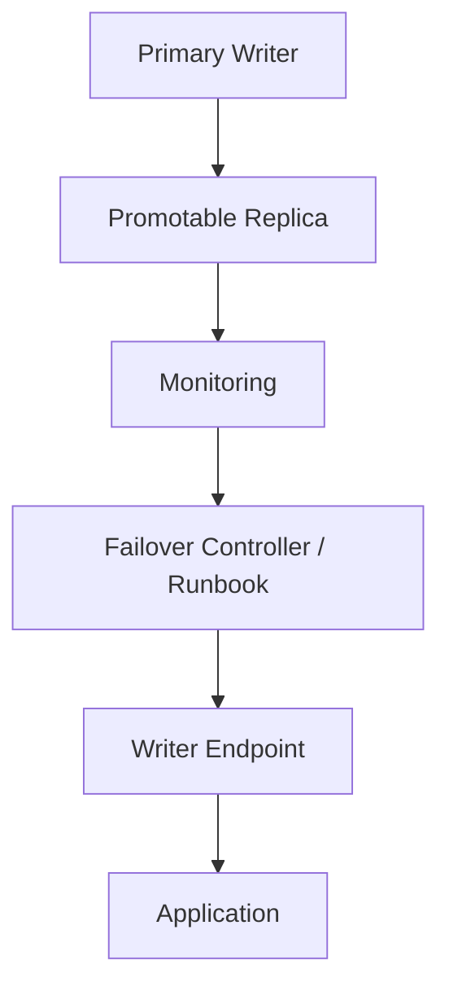

Requirements:

- replica capacity matches primary enough for failover;
- lag monitored;
- promotion tested;
- old primary fenced;
- app connects through writer endpoint/proxy;
- idempotency/retry strategy exists;
- backup/PITR still exists;
- runbook includes validation.

Anti-pattern:

> “We can promote the replica manually if needed” without testing, fencing, or connection strategy.

---

## 30. Design Pattern: Read Replica Pool

Use when:

- read workload exceeds primary capacity;
- reads can be classified by freshness;
- application can route correctly.

Design:

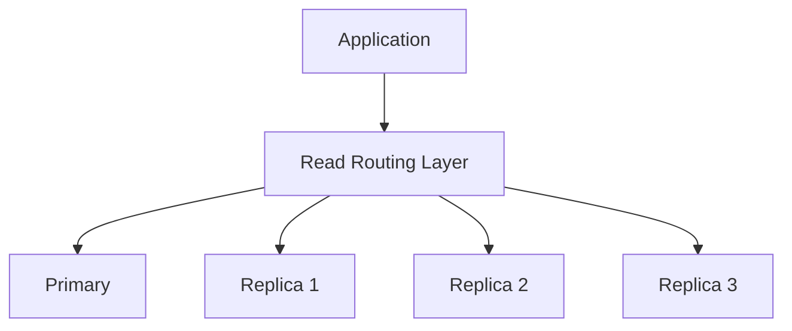

Requirements:

- query-level routing;
- lag-aware routing;
- primary fallback for fresh reads;
- connection pool separation;
- replica query timeout;
- protection against heavy/reporting queries;
- staleness visible to user/admin when needed.

This pattern is expanded in Part 034.

---

## 31. Design Pattern: Regional DR Replica

Use when:

- region failure must be survivable;
- data loss budget is explicit;
- regional failover is part of business continuity.

Design:

```mermaid
flowchart LR
    A[Region A Primary] --> B[Region B DR Replica]
    B --> C[Region B App Stack Standby]
    B --> D[Region B Backup/PITR]
```

Requirements:

- cross-region replication;
- region-level runbook;
- DNS/traffic manager plan;
- secrets/config replicated safely;
- application stack deployable in DR region;
- data residency/compliance review;
- failover and failback tested.

DR is not just database replication. The application, dependencies, identity provider, object storage, queues, and observability stack must also survive.

---

## 32. Design Pattern: Logical Migration Replica

Use when:

- moving database versions;
- splitting monolith database;
- migrating cloud/provider;
- blue/green DB cutover;
- selective table migration.

Design:

```mermaid
flowchart LR
    A[Source DB] --> B[Initial Snapshot]
    A --> C[Logical Change Stream]
    B --> D[Target DB]
    C --> D
    D --> E[Validation]
    E --> F[Cutover]
```

Requirements:

- stable primary keys;
- compatible schema;
- initial snapshot point;
- change stream offset;
- validation checks;
- dual-read/diff tooling;
- rollback decision point;
- cutover freeze or controlled catch-up;
- post-cutover monitoring.

Migration replication is temporary infrastructure. Remove it after the migration is complete.

---

## 33. Replication Decision Matrix

| Requirement | Better fit |
|---|---|
| lowest write latency | async leader-follower |
| near-zero data loss | sync/quorum replication |
| automatic strong failover | consensus/distributed SQL or managed HA |
| read scale with stale tolerance | read replicas |
| local writes in many regions | partitioned ownership or multi-leader with conflict model |
| selective table integration | logical replication/CDC |
| accidental-delete cushion | delayed replica + backups |
| region disaster recovery | cross-region replica + DR stack |
| heavy reporting | reporting replica/warehouse projection |
| strict global invariants | single authority or strong distributed transaction model |

---

## 34. Architecture Review Questions

Ask these before approving replication design:

1. What is the write authority?
2. What is copied: physical log, logical row changes, event stream, or full snapshot?
3. Is replication synchronous, asynchronous, semi-sync, or quorum-based?
4. What is the accepted RPO per domain?
5. What is the accepted RTO per failure class?
6. Which replica is promotable?
7. How is the old primary fenced?
8. How are clients redirected?
9. How are non-idempotent operations handled during failover?
10. How is replica lag measured?
11. What is the maximum allowed lag per replica role?
12. What queries may run on replicas?
13. What query workload is forbidden on HA replicas?
14. How do schema migrations affect replication?
15. How do replication slots/subscribers get owned and cleaned up?
16. How is split brain prevented?
17. How is failover tested?
18. How is failback handled?
19. How do backups interact with replicas?
20. What business validation runs after promotion?

---

## 35. Production Readiness Checklist

A replication setup is not production-ready until the following are true:

- [ ] Write authority is explicit.
- [ ] Replication mode is documented.
- [ ] RPO/RTO are accepted by business owner.
- [ ] Replica roles are separated.
- [ ] Promotable replicas are capacity-ready.
- [ ] Lag dashboard exists.
- [ ] Lag alerts are tied to freshness budgets.
- [ ] Replication slots/subscribers have owners.
- [ ] Retained WAL/log growth is monitored.
- [ ] Failover runbook exists.
- [ ] Fencing mechanism is proven.
- [ ] Application reconnect behavior is tested.
- [ ] Idempotency/retry logic exists for critical commands.
- [ ] Schema migration process accounts for replica lag.
- [ ] Backups are not confused with replication.
- [ ] DR test has been run.
- [ ] Split-brain scenario has been modelled.
- [ ] Post-failover validation queries exist.
- [ ] Operational ownership is clear.

---

## 36. Failure Drill: Primary Down

Scenario:

> Primary database becomes unavailable at 14:03. App write traffic fails. Two replicas exist: one HA replica with 1.2s lag, one reporting replica with 9 minutes lag.

Expected reasoning:

1. Confirm primary failure is real, not monitoring noise.
2. Stop/fence primary if reachable.
3. Exclude reporting replica from candidate list.
4. Promote HA replica if within RPO.
5. Move writer endpoint.
6. Restart/reconnect application pools.
7. Reject unsafe blind retries.
8. Reconcile idempotent command table/outbox.
9. Validate critical business counts.
10. Rebuild old primary as replica from new primary.

Bad response:

> Promote whichever replica is easiest to reach.

Correct response:

> Promote the safest authoritative candidate according to lag, durability, capacity, schema version, and fencing status.

---

## 37. Failure Drill: Replica Lag Spike

Scenario:

> App read replica lag jumps to 90 seconds during a large backfill. Users report that newly submitted cases do not appear in search/list screens.

Expected reasoning:

1. Confirm lag and affected replica.
2. Identify source: backfill WAL volume, replica I/O, heavy query, network.
3. Temporarily route read-your-writes/list-after-create paths to primary.
4. Keep stale-tolerant reads on replica if safe.
5. Throttle/chunk backfill.
6. Alert owner of freshness SLO breach.
7. Add/adjust migration guardrail.

Bad response:

> Add more replicas.

More replicas do not fix a saturated replication apply path unless topology and bottleneck change.

---

## 38. Mental Compression

When reviewing replication, reduce the architecture to four statements:

```text
Writes go here.
Changes are copied this way.
Reads are allowed there only under these freshness rules.
If the writer fails, this exact node becomes authority after this fencing step.
```

If you cannot say those four things clearly, the replication architecture is not understood.

---

## 39. Summary

Replication is the controlled copying of database change history.

A strong database architect understands:

- replication is not backup;
- replication is not automatically HA;
- replication is not automatically read consistency;
- asynchronous replication implies lag and possible data loss;
- synchronous/quorum replication trades latency and availability for durability/consistency;
- failover is unsafe without fencing;
- split brain is a catastrophic authority failure;
- replicas need roles, freshness budgets, owners, and runbooks;
- application retry/idempotency behavior is part of replication correctness;
- migration, backup, CDC, and reporting all interact with replication.

The next part builds on this and asks a more application-level question:

> Given replicas exist, which reads are allowed to use them without lying to the user or violating the business invariant?

---

## References

- PostgreSQL Documentation — High Availability, Load Balancing, and Replication: https://www.postgresql.org/docs/current/high-availability.html
- PostgreSQL Documentation — Log-Shipping Standby Servers and Streaming Replication: https://www.postgresql.org/docs/current/warm-standby.html
- PostgreSQL Documentation — Replication Runtime Configuration: https://www.postgresql.org/docs/current/runtime-config-replication.html
- PostgreSQL Documentation — Monitoring Database Activity and Replication: https://www.postgresql.org/docs/current/monitoring.html
- Amazon RDS Documentation — Working with DB instance read replicas: https://docs.aws.amazon.com/AmazonRDS/latest/UserGuide/USER_ReadRepl.html
- CockroachDB Documentation — Follower Reads: https://www.cockroachlabs.com/docs/stable/follower-reads
