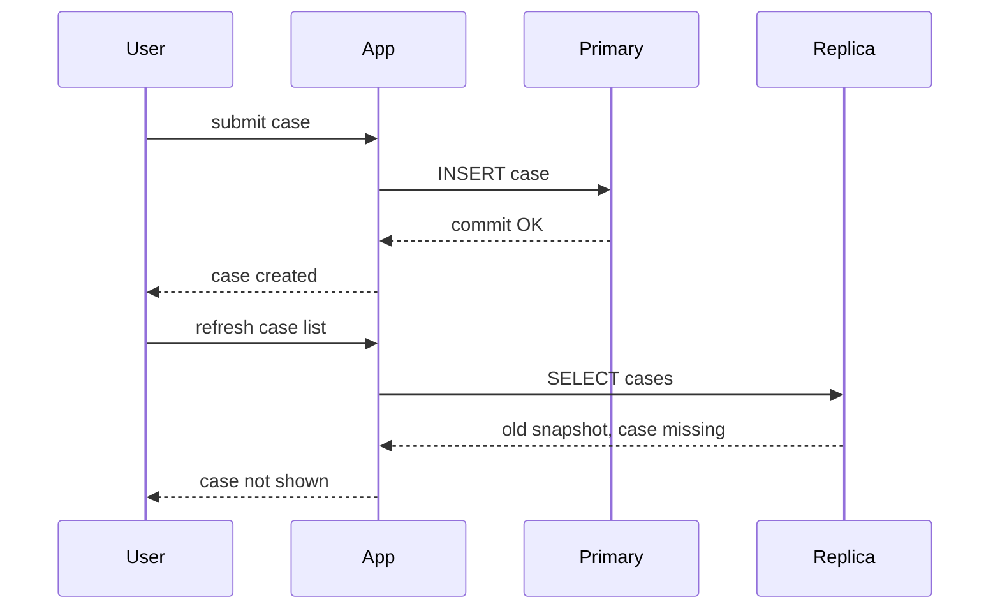
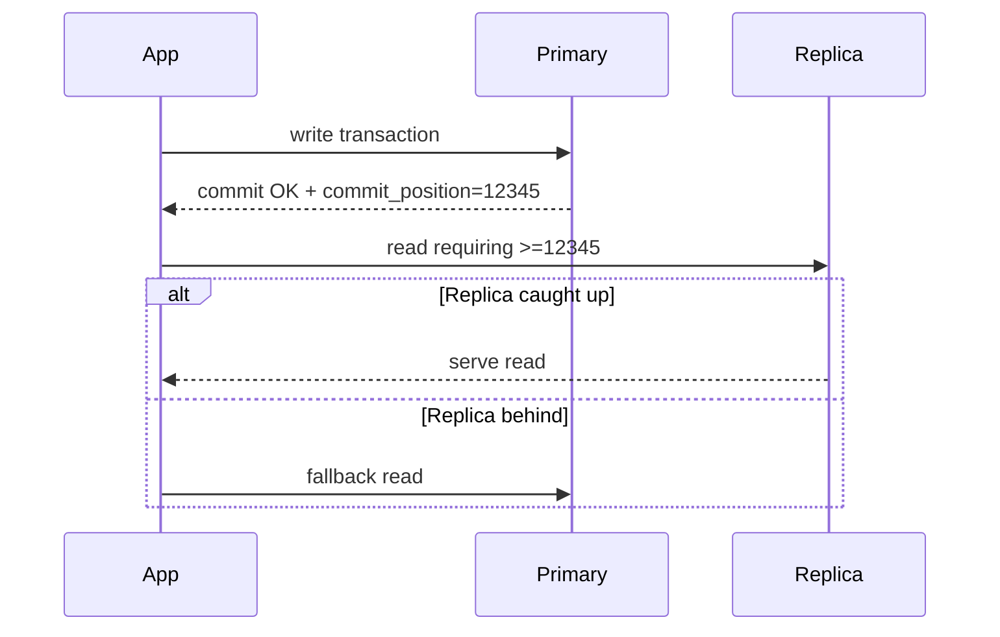
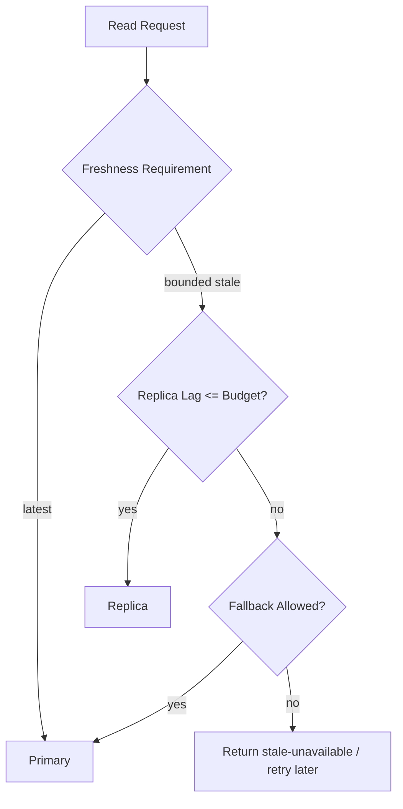
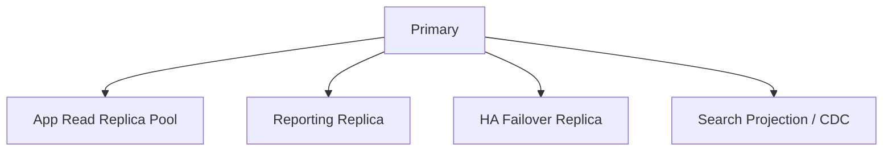
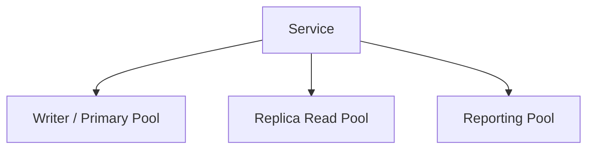
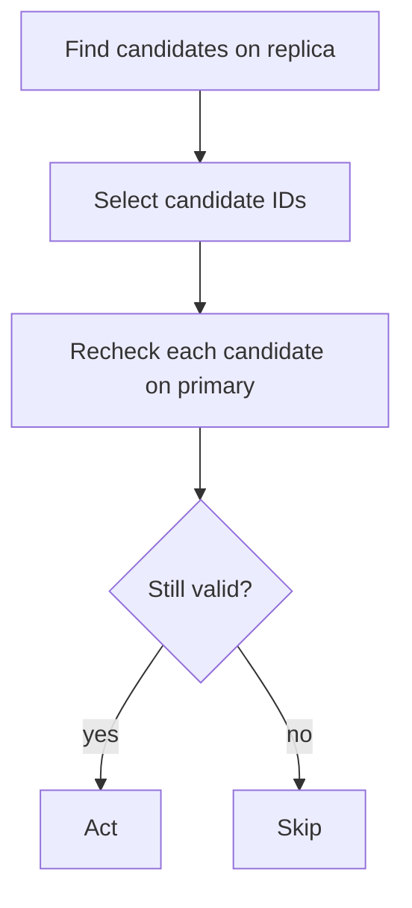
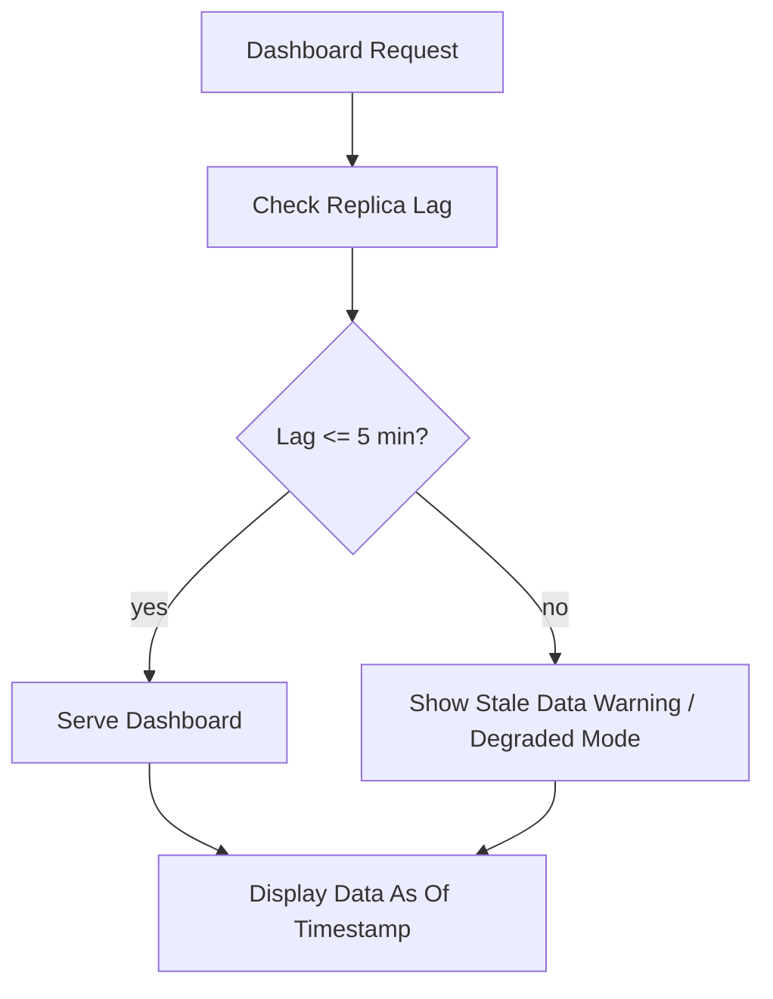

# Part 034 — Read Scaling and Replica Consistency

> Read replicas are not a free performance upgrade. They are a contract that some reads may observe the past.

Part 033 covered replication models.

This part focuses on the application-facing consequence:

> If data is copied asynchronously, a read from a replica may not include the latest committed write.

For many systems this is acceptable.

For some workflows it is catastrophic.

The difference is not technical taste. The difference is the **freshness contract** of each user journey and business invariant.

---

## 1. The Core Mental Model

A primary accepts writes.

A replica catches up.

A user journey expects reality.



The database did not lose the case.

The architecture lied to the user journey.

Architectural rule:

> Do not route a read to a replica unless the read can tolerate the replica's possible staleness.

---

## 2. Read Scaling Is Not One Feature

“Use read replicas” hides multiple decisions.

| Decision | Question |
|---|---|
| Which reads? | all reads, reporting only, list pages, search, background jobs? |
| Which freshness? | latest, read-your-writes, bounded stale, eventual? |
| Which route? | primary, replica, nearest region, lag-aware pool? |
| Which fallback? | primary fallback, wait for replica, stale warning, fail closed? |
| Which visibility? | should user see freshness timestamp? |
| Which consistency? | per request, per session, per entity, per workflow? |
| Which failure behavior? | replica down, replica lag, failover in progress? |

Read scaling is a routing and correctness design problem.

---

## 3. Classify Reads by Freshness Requirement

Every read should be classified.

| Read class | Meaning | Typical route |
|---|---|---|
| Authoritative read | must reflect latest committed truth | primary |
| Read-your-writes | must include user's prior write | primary or caught-up replica |
| Monotonic session read | user should not go backwards in time | session-aware route |
| Bounded-stale read | may be stale within defined limit | lag-checked replica |
| Eventually consistent read | stale acceptable, no strict bound | replica/projection |
| Historical read | intentionally reads past state | replica/time-travel/snapshot |
| Rebuildable projection read | can lag and be rebuilt | search/read model |
| Analytical read | freshness measured in minutes/hours | reporting replica/warehouse |

Bad architecture:

> “GET requests go to replicas, POST/PUT/DELETE go to primary.”

Better architecture:

> Reads are routed by freshness contract, not HTTP method.

---

## 4. Common User Journey Failures

### 4.1 Create Then List

User creates an entity, then list screen does not show it.

Cause:

- create writes to primary;
- list reads from lagging replica.

Fix options:

- route post-create list to primary for a short window;
- include created item optimistically in response;
- track commit position and wait for replica;
- use session consistency token;
- show pending state explicitly.

### 4.2 Submit Then Status Check

User submits workflow transition, then sees old status.

Cause:

- status read from stale replica.

Fix:

- route current-case detail/status reads to primary after commands;
- use command receipt with authoritative status;
- require replica to be caught up to commit marker.

### 4.3 Approval Race

Manager approves item, another screen still shows “pending approval.”

Cause:

- workflow list screen uses stale read replica.

Fix:

- approval queues should use primary or bounded-stale route with strict low lag;
- state-changing work queues should not be driven by stale reads.

### 4.4 Entitlement Drift

User role is revoked, but replica still allows access.

Cause:

- authorization read from stale replica/cache.

Fix:

- security-sensitive reads go to authority;
- session invalidation path;
- short-lived credentials;
- deny-sensitive actions if policy freshness unknown.

### 4.5 Payment/Ledger Confusion

Payment submitted, balance screen still old.

Cause:

- balance read from replica/projection.

Fix:

- ledger write receipt;
- authoritative balance read;
- clearly separate pending/posted/projected balance;
- reconciliation strategy.

---

## 5. Consistency Semantics for Replica Reads

Replica reads can have different consistency promises.

### 5.1 Eventual Consistency

The replica will eventually receive changes if the system is healthy.

Acceptable for:

- non-critical dashboards;
- public catalog listings;
- analytics previews;
- search results;
- recommendations;
- background export queues with retry.

Dangerous for:

- permissions;
- workflow guards;
- payment state;
- enforcement decisions;
- idempotency checks;
- uniqueness checks;
- assignment claiming;
- legal deadlines.

### 5.2 Bounded Staleness

The read may be stale, but within a known limit.

Example:

```text
This report may be up to 5 minutes behind production.
```

This is often acceptable for operational dashboards if visible.

Requirements:

- measure lag;
- enforce maximum lag before routing;
- display freshness when relevant;
- define behavior when lag exceeds bound.

### 5.3 Read-Your-Writes

After a user writes, their later reads should observe that write.

Implementation options:

- route session to primary for N seconds after write;
- store commit timestamp/LSN and require replica catch-up;
- return authoritative state in write response;
- sticky primary read for affected entity;
- cache user-owned newly written item in session/client.

### 5.4 Monotonic Reads

User should not observe time going backwards.

Example failure:

1. User sees case status `APPROVED` from primary.
2. Next request goes to lagging replica.
3. User sees case status `PENDING`.

Fix:

- session freshness token;
- route to replica only if replica has caught up;
- sticky routing to a replica that is at least as fresh as previous read;
- fallback to primary.

### 5.5 Causal Consistency

If operation B depends on operation A, reads after B should include A.

Example:

- create investigation;
- add evidence to investigation;
- read investigation detail.

The detail read must not show evidence without investigation or investigation without expected evidence state depending on journey.

---

## 6. Freshness Tokens

One robust pattern is to attach a freshness marker to write responses.

Conceptually:



Freshness marker could be:

- WAL LSN;
- binlog position;
- commit timestamp;
- transaction id/sequence;
- version vector;
- logical offset;
- engine-specific timestamp.

The application does not need to understand low-level internals deeply. It needs an abstraction:

```java
record FreshnessToken(String source, String position) {}

interface ReadRouter {
    DataSource route(ReadFreshness freshness);
}
```

Where `ReadFreshness` might be:

```java
sealed interface ReadFreshness {
    record Latest() implements ReadFreshness {}
    record AtLeast(FreshnessToken token) implements ReadFreshness {}
    record BoundedStale(Duration maxLag) implements ReadFreshness {}
    record AnyReplica() implements ReadFreshness {}
}
```

Design rule:

> Do not scatter replica-routing decisions across repository methods. Centralize routing by freshness intent.

---

## 7. Primary Fallback Pattern

Replica read path should often include fallback.



Fallback decisions:

| Read type | Fallback behavior |
|---|---|
| user detail after write | fallback to primary |
| permission check | fallback to primary or fail closed |
| dashboard | show stale warning or fallback depending cost |
| heavy report | do not fallback automatically if primary risk high |
| background job | delay/retry |
| search | show eventual consistency indicator |

Do not let a lagging reporting query stampede the primary.

Primary fallback must be controlled.

---

## 8. Sticky Primary After Write

Simple pattern:

```text
After a user/session performs a write, route their relevant reads to primary for 5-30 seconds.
```

Pros:

- simple;
- effective for most UX read-your-writes issues;
- does not require engine-specific LSN handling.

Cons:

- over-routes to primary;
- time window is heuristic;
- does not guarantee correctness under long lag;
- not suitable for strict cross-session workflows;
- fails if another service/user depends immediately on the write.

Good use:

- personal profile update;
- user-created list item;
- post-submit confirmation screen;
- UI consistency after form submit.

Not enough for:

- authorization revocation;
- financial balance;
- case assignment lock;
- distributed workflow guard;
- legal deadline transition.

---

## 9. Lag-Aware Replica Routing

A better pattern is route based on measured replica lag.

```text
if read requires maxLag <= 2s:
    choose replica with lag <= 2s
    else fallback to primary
```

Pseudo-code:

```java
DataSource chooseReplica(Duration maxLag) {
    return replicas.stream()
        .filter(Replica::healthy)
        .filter(r -> r.replayLag().compareTo(maxLag) <= 0)
        .min(Comparator.comparing(Replica::load))
        .orElse(primary);
}
```

But beware:

- lag metrics can be delayed;
- clock skew affects timestamp lag;
- network partitions may make metrics stale;
- “healthy” needs definition;
- routing layer must avoid flapping;
- fallback can overload primary.

Use hysteresis:

```text
Replica enters pool when lag < 1s for 60s.
Replica leaves pool when lag > 2s for 10s.
```

---

## 10. Query Classification Table

For a real service, create a query classification table.

| Query | User journey | Freshness | Route | Fallback | Notes |
|---|---|---|---|---|---|
| `getCaseDetail(caseId)` | investigator opens case | read-your-writes / latest for active case | primary after write, else bounded replica | primary | active workflow state |
| `listMyOpenCases(userId)` | queue screen | bounded stale <= 2s | lag-aware replica | primary if low volume | assignment correctness risk |
| `checkPermission(userId, action)` | every command | latest | primary/cache with invalidation | fail closed | security-sensitive |
| `searchCases(query)` | discovery | eventual | search projection | no | show indexing delay |
| `monthlyReport(month)` | reporting | stale <= 1h | warehouse/report replica | no | heavy query |
| `getAuditTrail(caseId)` | evidence review | latest/authoritative | primary or audit store | primary | legal traceability |
| `lookupReferenceData(code)` | stable lookup | eventual | replica/cache | primary | versioned reference data |
| `idempotencyLookup(key)` | retry command | latest | primary | no | correctness boundary |
| `claimNextTask(queue)` | work assignment | latest with lock | primary | no | stale read unsafe |

This table is a design artifact, not documentation decoration.

It drives repository routing, SLOs, tests, and incident response.

---

## 11. Reads That Must Usually Stay on Primary

Some reads are part of write correctness.

Keep these on primary unless you have engine-supported strong replica consistency:

- uniqueness check before insert;
- idempotency key lookup;
- authorization/entitlement check for sensitive command;
- workflow guard condition;
- balance/limit check;
- assignment/claim candidate selection;
- lock acquisition;
- current version check for optimistic concurrency;
- terminal state check;
- legal deadline/current SLA decision;
- duplicate detection that prevents command execution;
- fraud/risk block decision;
- tenant isolation/security policy lookup;
- feature flag for safety-critical behavior.

Why?

Because stale reads can cause invalid writes.

Example:

```text
Replica says user still has APPROVER role.
Primary has already revoked it.
Command is accepted incorrectly.
```

No performance gain justifies that unless the business explicitly accepts the risk and compensating controls exist.

---

## 12. Reads That Can Often Use Replicas

Good candidates:

- public content/catalog list;
- dashboard with freshness timestamp;
- historical closed records;
- read-only reference data;
- user notification list with eventual consistency;
- analytics previews;
- export generation;
- non-critical admin browsing;
- search result pages;
- recommendation feeds;
- background reconciliation scans;
- cold archive browsing.

Even then, define:

- max acceptable lag;
- fallback behavior;
- user-visible freshness;
- query cost guardrails;
- replica pool separate from HA replica.

---

## 13. Active vs Historical Entity Reads

The same table may have different freshness needs depending on entity state.

Example: regulatory case.

| Case state | Read route |
|---|---|
| newly submitted | primary / read-your-writes |
| under active investigation | primary or very low-lag replica |
| pending assignment | primary |
| closed 2 years ago | replica/archive |
| report snapshot | warehouse/reporting store |

Design implication:

```sql
SELECT *
FROM enforcement_case
WHERE case_id = :case_id;
```

This query alone does not tell the route.

The route depends on use case.

Repository method names should reflect intent:

```java
Case getCaseForWorkflowDecision(CaseId id);      // primary
Case getCaseForHistoricalView(CaseId id);        // replica allowed
Case getCaseForPostSubmitConfirmation(CaseId id, FreshnessToken token); // token-aware
```

---

## 14. Replica Reads and Authorization

Authorization is especially dangerous.

Suppose:

1. Admin revokes user access at `10:00:00`.
2. Replica lags by 20 seconds.
3. User performs sensitive action at `10:00:05`.
4. App checks permission from replica.
5. Replica still says user has access.

This is not a UX issue. It is a security failure.

Patterns:

| Pattern | Use |
|---|---|
| primary permission check | safest for sensitive commands |
| short-lived signed claims | reduce DB reads, but revocation delay must be accepted |
| policy cache with invalidation | good if invalidation reliable and fail-closed possible |
| versioned permission epoch | force refresh after permission changes |
| deny-on-uncertain-freshness | safety-critical commands |

Rule:

> Stale authorization is still authorization.

If the system cannot prove freshness, it must choose whether to fail closed or accept risk.

---

## 15. Replica Reads and Workflow Engines

Workflow state is often read before a transition.

Example:

```text
if case.status == SUBMITTED and user.canReview:
    transition to UNDER_REVIEW
```

If `case.status` comes from a stale replica, the guard may be wrong.

Correct pattern:

```sql
UPDATE enforcement_case
SET status = 'UNDER_REVIEW',
    version = version + 1
WHERE case_id = :case_id
  AND status = 'SUBMITTED'
  AND version = :expected_version;
```

This belongs on primary.

Then insert transition history in the same transaction.

Replica can be used for browsing workflow data, but not for deciding current transition validity unless consistency is guaranteed.

---

## 16. Replica Reads and Work Queues

A common anti-pattern:

```sql
SELECT task_id
FROM task
WHERE status = 'READY'
ORDER BY priority DESC, created_at ASC
LIMIT 1;
```

Run this on a replica, then claim task on primary.

Failure modes:

- replica shows task already claimed on primary;
- multiple workers chase stale candidates;
- task assignment becomes noisy;
- primary receives failed claim attempts;
- queue latency increases.

Better:

```sql
UPDATE task
SET status = 'CLAIMED', claimed_by = :worker_id
WHERE task_id = (
    SELECT task_id
    FROM task
    WHERE status = 'READY'
    ORDER BY priority DESC, created_at ASC
    FOR UPDATE SKIP LOCKED
    LIMIT 1
)
RETURNING *;
```

Run on primary.

Read replicas can support queue monitoring dashboards, not queue claim decisions.

---

## 17. Replica Reads and Reporting

Reporting is a strong use case for replicas, but not all reporting has same freshness.

| Report type | Freshness expectation |
|---|---|
| live operational dashboard | seconds/minutes |
| end-of-day report | daily snapshot |
| regulatory submission | reproducible point-in-time truth |
| trend analytics | hours/days |
| incident dashboard | near real-time |

Reporting design should include:

- data timestamp;
- extract time;
- source replica identity;
- lag at generation;
- reproducible query snapshot;
- report version;
- correction process.

A dashboard that silently shows 40-minute-old data during an incident can be worse than no dashboard.

---

## 18. Showing Freshness to Users

For stale-tolerant reads, expose freshness when it affects decisions.

Examples:

```text
Last updated 43 seconds ago.
```

```text
Report generated from data current as of 2026-07-05 09:15:00 SGT.
```

```text
Search results may take up to 2 minutes to include newly submitted cases.
```

Do not over-expose internals to normal users. But for operators, investigators, support teams, compliance users, and dashboards, freshness is part of truth.

---

## 19. Replica Pool Isolation

Do not mix all replica workloads together.



Recommended separation:

| Pool | Allowed workload |
|---|---|
| HA replica | failover readiness, minimal reads |
| app read replica | latency-sensitive bounded-stale reads |
| reporting replica | heavy analytical SQL |
| delayed replica | recovery only |
| CDC subscriber | integration/search/analytics |

Why separation matters:

- heavy report can cause app read latency;
- app read spikes can harm failover candidate;
- backup workload can increase lag;
- delayed replica must not serve normal reads;
- noisy dashboard query can break freshness SLO.

---

## 20. Replica Query Governance

Replica does not mean unlimited queries.

Governance controls:

- query timeout;
- statement timeout;
- connection pool limits;
- read-only role;
- max result size;
- pagination enforcement;
- blocked query patterns;
- separate reporting endpoint;
- slow-query monitoring per replica;
- workload admission control;
- kill policy for runaway queries.

Example policy:

```text
App read replica:
- max query duration: 2 seconds
- no ad hoc reporting
- no full table export
- no unbounded OFFSET scans
- max connections per service

Reporting replica:
- max query duration: 15 minutes
- no application traffic
- data freshness displayed
- heavy queries scheduled/throttled
```

---

## 21. Connection Pool Design

Application should not treat primary and replicas as interchangeable JDBC URLs.

Use separate pools:



Reasons:

- different timeouts;
- different max connections;
- different credentials;
- different query policies;
- different routing logic;
- separate failure behavior;
- safer operational control.

Example abstraction:

```java
enum DataRoute {
    PRIMARY,
    LAG_AWARE_REPLICA,
    REPORTING_REPLICA,
    ANY_REPLICA
}

interface DatabaseRouter {
    Connection getConnection(DataRoute route, ReadFreshness freshness);
}
```

Avoid:

```java
boolean readOnly = sql.trim().toLowerCase().startsWith("select");
```

SQL text cannot determine business freshness.

---

## 22. Transaction Routing Rules

Within a transaction, avoid mixing primary and replica reads casually.

Bad:

```text
BEGIN on primary
write order
read customer from replica
write audit decision based on stale customer
COMMIT
```

Transaction rule:

> Any read that influences a write in the same command must be from the same consistency authority as the write.

Use primary for:

- command validation;
- invariant checking;
- business decision inside transaction;
- state transition;
- idempotency;
- audit event creation;
- lock acquisition.

Replica reads are safer for:

- independent display data;
- prefilled forms with revalidation on submit;
- non-authoritative suggestions;
- background scans that recheck on primary before acting.

---

## 23. Recheck-on-Primary Pattern

For expensive discovery, use replica first, then primary before action.

Example:



Use cases:

- background cleanup;
- notification candidate discovery;
- fraud review suggestions;
- stale-tolerant task suggestions;
- duplicate detection assistant;
- bulk export candidate list.

Pattern:

```sql
-- replica: broad candidate discovery
SELECT case_id
FROM enforcement_case
WHERE status = 'OVERDUE_CANDIDATE'
LIMIT 1000;

-- primary: authoritative recheck before transition
UPDATE enforcement_case
SET status = 'ESCALATED'
WHERE case_id = :case_id
  AND status = 'OVERDUE_CANDIDATE'
  AND due_at < now()
RETURNING case_id;
```

---

## 24. Bounded-Stale Dashboard Pattern

For dashboards:



Dashboard response should include:

```json
{
  "data": { "openCases": 18234 },
  "freshness": {
    "source": "report-replica-1",
    "dataCurrentAsOf": "2026-07-05T09:15:00+08:00",
    "lagSeconds": 42
  }
}
```

Operators make better decisions when freshness is explicit.

---

## 25. Search Projection vs Read Replica

Search is often eventually consistent.

Do not confuse:

| Read replica | Search projection |
|---|---|
| same database engine copy | search index / projection engine |
| SQL/query model similar to primary | optimized for text/filter ranking |
| replication lag | indexing lag |
| can maybe be promoted | cannot become primary truth |
| row-level truth copy | derived searchable representation |

Search result pages can usually tolerate lag.

But actions from search results must revalidate on primary.

Example:

```text
User searches stale result -> opens case -> primary says case archived -> UI shows current archived state.
```

---

## 26. Replica Reads in Multi-Tenant Systems

Multi-tenancy adds risk.

Questions:

1. Is lag measured globally or per tenant?
2. Can one noisy tenant's reporting query slow shared replica?
3. Are tenant RLS/security policies enforced on replica?
4. Are tenant migrations replicated before tenant traffic moves?
5. Can tenant-specific restore/failover use replica safely?
6. Is data residency affected by cross-region read replica?
7. Are support users reading stale tenant permissions?

Tenant-aware freshness example:

```text
tenant A: high-volume writes, replica lag 20s for hot partitions
tenant B: low-volume writes, effective lag 0.5s
```

Global lag metric may hide tenant-specific experience.

For high-value tenants, consider:

- dedicated read replica;
- cell-based architecture;
- tenant-specific routing;
- per-tenant freshness SLO;
- tenant workload isolation.

---

## 27. Replica Consistency Testing

You need tests that intentionally expose stale reads.

### Test: Create Then Read From Replica

```text
1. Create entity on primary.
2. Immediately read list from replica.
3. Verify system behavior is acceptable:
   - item appears, or
   - primary fallback occurs, or
   - pending state shown, or
   - documented eventual behavior displayed.
```

### Test: Authorization Revocation

```text
1. User has permission.
2. Admin revokes permission.
3. Before replica catches up, user attempts command.
4. Command must fail or route permission check to primary.
```

### Test: Workflow Transition

```text
1. Case transitions from SUBMITTED to UNDER_REVIEW.
2. Replica still shows SUBMITTED.
3. Another command tries invalid transition.
4. Primary conditional update prevents illegal state.
```

### Test: Replica Lag Degradation

```text
1. Inject artificial replica lag.
2. Verify read router removes replica from fresh-read pool.
3. Verify primary fallback is rate-limited.
4. Verify dashboards show stale warning.
```

---

## 28. Monitoring for Read Scaling

Minimum metrics:

| Metric | Why |
|---|---|
| replica lag | freshness correctness |
| read route count by class | routing correctness |
| primary fallback rate | lag/load signal |
| stale-warning count | user impact |
| replica query latency | read SLO |
| primary read pressure | fallback overload risk |
| replica pool health | capacity |
| read-after-write violations | UX/correctness signal |
| permission freshness failures | security signal |
| heavy query kills | governance signal |

Example alerts:

```text
IF fresh-read fallback rate > 30% for 10 minutes
THEN read replica pool is not meeting freshness SLO.

IF authorization checks are served from replica
THEN page/security review; policy route regression.

IF reporting replica lag > report freshness budget
THEN show degraded dashboard and alert data platform owner.
```

---

## 29. Failure Mode: Replica Lag Hidden by Cache

A dangerous chain:

1. Replica lags.
2. Application reads stale data.
3. Application caches stale data.
4. Replica catches up.
5. Cache still serves stale value.

Now the consistency bug outlives the replication lag.

Mitigation:

- cache freshness metadata;
- avoid caching stale-sensitive data;
- invalidate on write;
- use short TTL for replica-sourced data;
- distinguish authoritative vs eventual cache;
- tag cache entries with source and observed version.

Cache record example:

```json
{
  "value": { "status": "PENDING" },
  "source": "replica-2",
  "observedPosition": "lsn:123",
  "maxStaleness": "PT5S",
  "cachedAt": "2026-07-05T10:00:00+08:00"
}
```

---

## 30. Failure Mode: Automatic Read/Write Splitter

Some infrastructure routes `SELECT` to replicas and writes to primary automatically.

This is risky.

Example:

```sql
SELECT status FROM case WHERE case_id = ?;
UPDATE case SET status = 'APPROVED' WHERE case_id = ?;
```

The `SELECT` may be part of command validation.

If a proxy routes it to a stale replica, command correctness breaks.

Safe use requires:

- transaction awareness;
- session consistency;
- explicit hints;
- primary pinning after writes;
- critical query allowlist/denylist;
- app-level freshness intent.

Best rule:

> Automatic SQL-level read/write splitting is acceptable only for systems whose reads are intentionally stale-tolerant or whose router understands transaction/session freshness.

---

## 31. Failure Mode: Replica as Poor Man's Lock Service

Do not use replica reads to decide locks.

Bad:

```text
Read from replica: no active lock.
Write primary: acquire lock.
```

Replica may be stale and miss a lock.

Correct:

- acquire lock on primary;
- use unique constraint/lease row;
- use `SELECT FOR UPDATE` where appropriate;
- use advisory lock if database-specific and justified;
- use atomic conditional update.

Replica can display lock state, but should not decide lock acquisition.

---

## 32. Failure Mode: Stale Config or Feature Flags

Configuration stored in database can be safety-critical.

Examples:

- payment limits;
- enforcement escalation policy;
- tenant suspension flag;
- feature kill switch;
- role policy;
- data retention rule.

If read from stale replica, system may execute disabled behavior.

Classify configuration:

| Config type | Route |
|---|---|
| cosmetic UI config | replica/cache OK |
| experimental feature flag | cache with TTL/invalidation |
| kill switch | primary/strong cache invalidation |
| security policy | primary/fail closed |
| retention/legal rule | primary or versioned effective snapshot |

---

## 33. Design Template: Read Freshness Contract

For each read endpoint/use case:

```md
## Read Freshness Contract: <Read Name>

- User journey:
- Data domain:
- Freshness requirement:
- Maximum tolerated lag:
- Route:
- Fallback:
- User-visible freshness:
- Reads after write behavior:
- Security impact:
- Workflow impact:
- Cache policy:
- Test cases:
- Metrics:
- Owner:
```

Example:

```md
## Read Freshness Contract: List My Open Cases

- User journey: investigator queue page
- Data domain: active workflow case/task
- Freshness requirement: bounded stale, <= 2 seconds
- Route: lag-aware app read replica
- Fallback: primary if replica lag <= 10s breach and primary under safe load; otherwise degraded warning
- User-visible freshness: internal operator timestamp
- Reads after write behavior: primary for 15s after claim/transition
- Security impact: permissions checked separately on primary
- Workflow impact: queue claim always rechecked on primary
- Cache policy: no shared cache; per-request only
- Test cases: create/list, claim/list, revoke permission/list
- Metrics: route count, lag, fallback rate, stale warning
- Owner: Case Platform Team
```

---

## 34. Database Architect Review Checklist

Before approving read replicas for application traffic:

- [ ] Every read class has a freshness requirement.
- [ ] Critical command-validation reads stay on primary.
- [ ] Authorization freshness is explicitly handled.
- [ ] Workflow transition reads are primary/strongly consistent.
- [ ] Idempotency and uniqueness checks are primary-based.
- [ ] Replica lag is measured and exposed to router.
- [ ] Replica pool has health and lag thresholds.
- [ ] Primary fallback is controlled and rate-limited.
- [ ] Heavy reports do not use app read replica pool.
- [ ] HA replica is protected from ad hoc reads.
- [ ] Dashboards display freshness where relevant.
- [ ] Cache policy distinguishes replica-sourced data.
- [ ] Read-after-write user journeys are tested.
- [ ] Permission revocation freshness is tested.
- [ ] Replica lag degradation is tested.
- [ ] Query timeout/connection pool policy exists per pool.
- [ ] Runbook exists for lag spike.
- [ ] Product/business owners accept stale behavior where used.

---

## 35. Runbook: Read Replica Lag Spike

Trigger:

```text
app-read-replica lag > freshness budget for 5 minutes
```

Steps:

1. Confirm lag type: transport, flush, apply, timestamp.
2. Identify impacted read classes.
3. Remove lagging replica from fresh-read pool.
4. Route latest/read-your-writes reads to primary.
5. Keep stale-tolerant reads on replicas if acceptable.
6. Protect primary from report fallback stampede.
7. Identify cause: write burst, backfill, long query, storage, network.
8. Kill/limit offending replica query if safe.
9. Throttle migration/backfill if causing lag.
10. Display dashboard freshness warning.
11. Keep stakeholders informed if business decisions affected.
12. Reintroduce replica only after stable below threshold.
13. Create post-incident action: missing guardrail, poor query, insufficient capacity, bad routing.

---

## 36. Runbook: Stale Read User Incident

Trigger:

```text
User reports data missing/old immediately after update.
```

Steps:

1. Identify user journey and endpoint.
2. Check whether endpoint routed to replica.
3. Compare primary vs replica row version/timestamp.
4. Check recent write response and commit time.
5. Determine if behavior violates freshness contract.
6. If violation, hotfix route to primary or add primary fallback.
7. If expected eventual consistency, improve UX/message if needed.
8. Add regression test for create-then-read path.
9. Update read classification table.
10. Review whether cache prolonged stale state.

---

## 37. Case Study: Enforcement Case Submission

Journey:

1. Officer submits new enforcement case.
2. System creates case, evidence metadata, initial workflow state, audit event.
3. Officer is redirected to case detail page.
4. Supervisor sees queue count.
5. Search index updates asynchronously.

Routing design:

| Read | Freshness | Route |
|---|---|---|
| Redirected case detail | read-your-writes | primary or token-aware replica |
| Officer's “my cases” immediately after submit | read-your-writes | primary for short window |
| Supervisor queue count | bounded stale <= 5s | lag-aware replica |
| Workflow claim | latest | primary |
| Search by keyword | eventual | search projection |
| Audit trail | authoritative | primary/audit store |
| Daily dashboard | stale <= 15m | reporting replica/warehouse |

This design avoids pretending all reads are equal.

---

## 38. Case Study: Permission Revocation

Journey:

1. User is removed from investigation team.
2. User still has browser open.
3. User attempts to download evidence.

Unsafe route:

```text
permission check -> read replica
replica stale -> access granted
```

Safe route:

```text
permission check -> primary or strongly invalidated permission cache
if freshness unknown -> deny sensitive action
```

Add audit:

```sql
INSERT INTO access_decision_audit (
    actor_id,
    resource_id,
    action,
    decision,
    policy_version,
    decision_source,
    decided_at
) VALUES (...);
```

The decision source matters. During investigation, you need to know whether access was granted based on current policy or stale source.

---

## 39. Mental Compression

The read-replica design can be compressed into one sentence:

> A read may go to a replica only when the user journey, business invariant, and security model can tolerate the exact staleness that replica may return.

Everything else follows from that.

---

## 40. Summary

Read replicas are useful, but they introduce visible time-travel into your application.

A strong database architect:

- classifies reads by freshness;
- avoids route-by-HTTP-method thinking;
- keeps command-validation reads on primary;
- treats stale authorization as security risk;
- uses lag-aware routing where needed;
- designs primary fallback carefully;
- separates app, reporting, HA, delayed, and CDC replicas;
- exposes freshness on dashboards/reports;
- tests create-then-read, revoke-then-command, and lag-degradation scenarios;
- prevents stale cache from outliving replica lag;
- gives each read path an explicit freshness contract.

The next part moves from replication to data distribution:

> How do we split data across partitions and shards without creating hotspots, unmovable tenants, or impossible query paths?

---

## References

- PostgreSQL Documentation — Log-Shipping Standby Servers and Streaming Replication: https://www.postgresql.org/docs/current/warm-standby.html
- PostgreSQL Documentation — Replication Runtime Configuration: https://www.postgresql.org/docs/current/runtime-config-replication.html
- Amazon RDS Documentation — Working with DB instance read replicas: https://docs.aws.amazon.com/AmazonRDS/latest/UserGuide/USER_ReadRepl.html
- Amazon Aurora Documentation — Write forwarding and read-after-write consistency: https://docs.aws.amazon.com/AmazonRDS/latest/AuroraUserGuide/aurora-mysql-write-forwarding.html
- CockroachDB Documentation — Follower Reads: https://www.cockroachlabs.com/docs/stable/follower-reads
