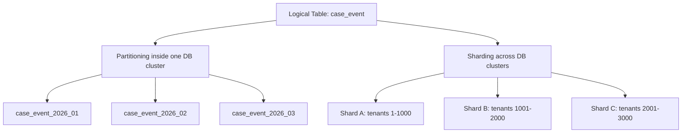
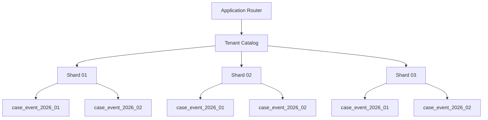
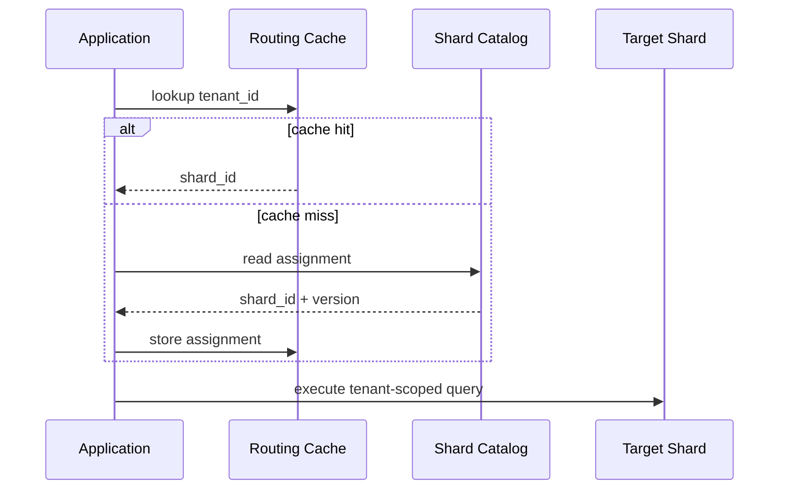
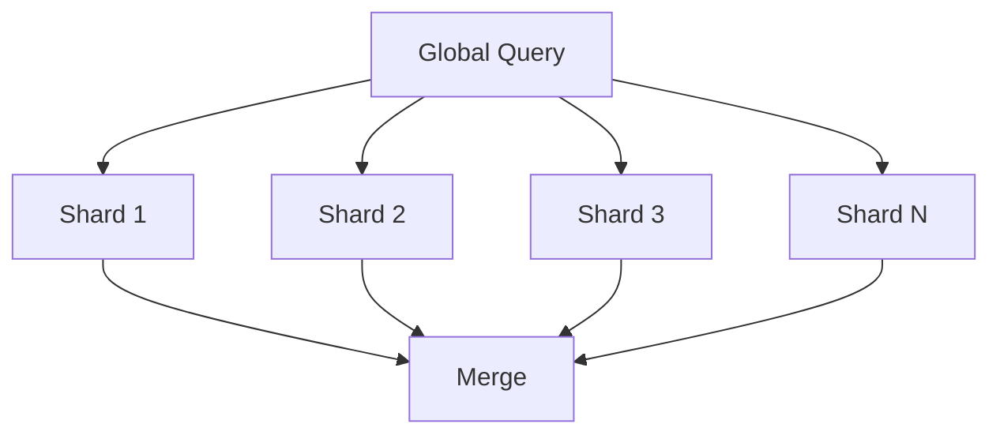
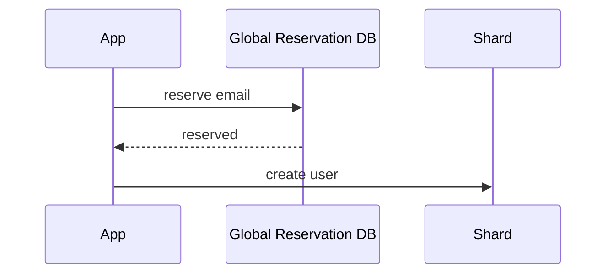
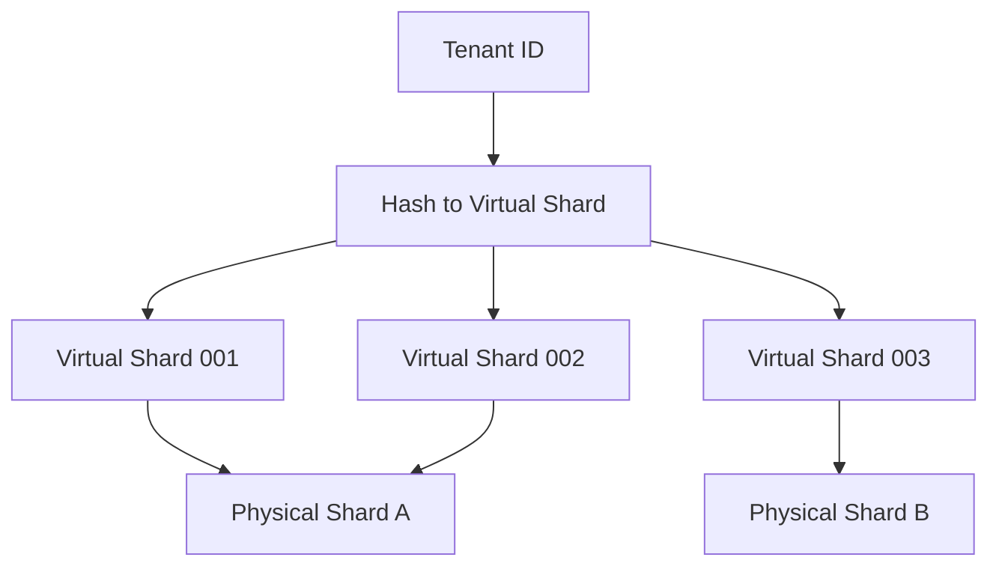
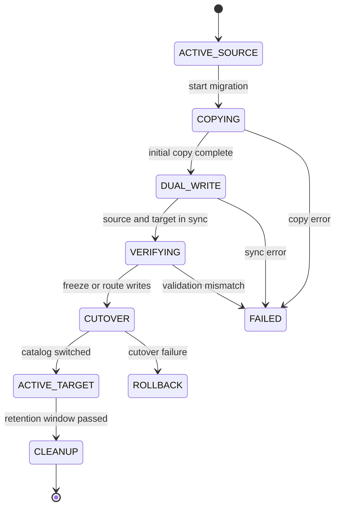
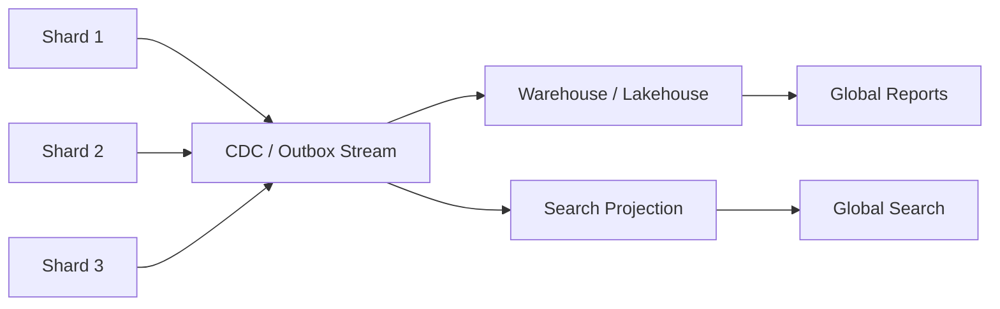

# Part 035 — Partitioning and Sharding

> A database architect does not split data because the table is large.  
> A database architect splits data because a specific workload, failure domain, operational boundary, or growth curve requires it.

Partitioning and sharding are often explained as “split the data into smaller pieces”. That explanation is true but incomplete. In production, the hard part is not splitting. The hard part is choosing the split boundary that keeps queries local, writes balanced, failures contained, migrations possible, and ownership clear.

This part builds the mental model you need before you approve partitioning or sharding in a real system.

---

## 1. Core Mental Model

Partitioning and sharding both divide data. The difference is **where the division is enforced and operated**.

| Concept | Meaning | Usually inside one database cluster? | Main Goal |
|---|---|---:|---|
| Partitioning | Split a logical table into physical child segments | Yes | Manageability, pruning, maintenance, lifecycle, sometimes performance |
| Sharding | Split data across independent database nodes/clusters | Usually no | Horizontal scale, isolation, geographic locality, blast-radius reduction |
| Tenant placement | Assign tenant data to a physical location | Maybe | Isolation, noisy-neighbor control, migration |
| Cell architecture | Group app + database capacity into repeatable cells | No | Blast-radius containment and scale-out by cell |

A practical rule:

- **Partitioning** helps one database deal with large logical tables.
- **Sharding** helps one product deal with workloads too large or too isolated for one database boundary.

Do not jump to sharding before proving that indexing, query shape, lifecycle cleanup, read replicas, archival, and partitioning are insufficient.

---

## 2. Why Split Data?

A table being “big” is not enough information. Big in what dimension?

| Growth Dimension | Symptom | Better Split Candidate |
|---|---|---|
| Time growth | old rows dominate table/index size | range partition by time |
| Tenant growth | few tenants dominate load | tenant shard / tenant cell |
| Write throughput | one table/index write path saturates | hash shard, bucket, queue partition |
| Lifecycle operations | delete/archive/backfill too expensive | partition by retention boundary |
| Query locality | most reads target one tenant/date/status | partition/shard by query-local dimension |
| Geographic latency | users need regional reads/writes | region-aware placement |
| Regulatory residency | data cannot leave jurisdiction | region/country shard |
| Failure isolation | one customer must not affect all | tenant/cell isolation |

The first architecture question is:

> What exact operation becomes safer, cheaper, faster, or more isolated after the split?

If you cannot answer that, the split is probably premature.

---

## 3. Partitioning vs Sharding Diagram



Partitioning changes the physical layout below one logical schema boundary. Sharding changes the topology of the application and data ownership boundary.

---

## 4. Declarative Partitioning Mental Model

In a relational database like PostgreSQL, declarative partitioning usually means:

- There is a parent table.
- Child tables hold disjoint subsets of the data.
- A partition key decides where each row belongs.
- Query planner can prune partitions when predicates match the partition key.
- Maintenance can target partitions instead of the entire logical table.

Example: monthly partitioning for immutable case timeline events.

```sql
CREATE TABLE case_event (
    id              uuid NOT NULL,
    case_id         uuid NOT NULL,
    event_type      text NOT NULL,
    occurred_at     timestamptz NOT NULL,
    payload         jsonb NOT NULL,
    actor_id        uuid,
    created_at      timestamptz NOT NULL DEFAULT now(),
    PRIMARY KEY (id, occurred_at)
) PARTITION BY RANGE (occurred_at);

CREATE TABLE case_event_2026_01
PARTITION OF case_event
FOR VALUES FROM ('2026-01-01') TO ('2026-02-01');

CREATE TABLE case_event_2026_02
PARTITION OF case_event
FOR VALUES FROM ('2026-02-01') TO ('2026-03-01');
```

Notice the key point: the partition key is part of the primary key. Many relational engines require uniqueness constraints on partitioned tables to include partitioning columns because uniqueness is otherwise difficult to enforce globally across child partitions.

---

## 5. Partition Pruning

Partition pruning is the optimization that makes partitioning useful for many read workloads.

Good query:

```sql
SELECT *
FROM case_event
WHERE occurred_at >= timestamptz '2026-02-01'
  AND occurred_at <  timestamptz '2026-03-01'
  AND case_id = :case_id
ORDER BY occurred_at;
```

The planner can eliminate partitions outside February 2026.

Bad query:

```sql
SELECT *
FROM case_event
WHERE date(occurred_at) = date '2026-02-10';
```

The function wrapping `occurred_at` may prevent straightforward pruning or index use depending on engine and expression support. The architect should shape queries to expose partition predicates plainly.

Better:

```sql
SELECT *
FROM case_event
WHERE occurred_at >= timestamptz '2026-02-10 00:00:00+00'
  AND occurred_at <  timestamptz '2026-02-11 00:00:00+00';
```

Partitioning is only effective when queries carry the partition key in a planner-friendly form.

---

## 6. Types of Partitioning

### 6.1 Range Partitioning

Use when data naturally belongs to ordered intervals.

Common keys:

- `created_at`
- `occurred_at`
- `effective_date`
- `reporting_period`
- numeric sequence ranges

Good for:

- time-series tables
- audit logs
- event logs
- append-only history
- retention and archival
- monthly reporting boundaries

Risk:

- recent partition hotspot
- uneven partition sizes
- poor fit for queries that do not filter by range key

Example:

```sql
CREATE TABLE audit_log (
    id          bigserial,
    tenant_id   uuid NOT NULL,
    action      text NOT NULL,
    created_at  timestamptz NOT NULL,
    payload     jsonb NOT NULL
) PARTITION BY RANGE (created_at);
```

### 6.2 List Partitioning

Use when data belongs to discrete known categories.

Common keys:

- region
- country
- jurisdiction
- tenant tier
- product family

Good for:

- data residency
- jurisdiction-based retention
- region-specific maintenance
- operational isolation by category

Risk:

- category skew
- frequent category changes
- large number of partitions

Example:

```sql
CREATE TABLE regulated_document (
    id              uuid NOT NULL,
    jurisdiction    text NOT NULL,
    document_type   text NOT NULL,
    created_at      timestamptz NOT NULL,
    body_ref        text NOT NULL
) PARTITION BY LIST (jurisdiction);
```

### 6.3 Hash Partitioning

Use when you need even distribution and do not have natural range/list locality.

Common keys:

- `tenant_id`
- `account_id`
- `case_id`
- `customer_id`

Good for:

- spreading writes
- avoiding one huge index/table
- balancing tenants when each tenant is not too skewed

Risk:

- range queries across all partitions
- hard retention operations
- cannot easily route by time
- hot key still remains hot

Example:

```sql
CREATE TABLE case_work_item (
    id          uuid NOT NULL,
    case_id     uuid NOT NULL,
    tenant_id   uuid NOT NULL,
    status      text NOT NULL,
    created_at  timestamptz NOT NULL
) PARTITION BY HASH (tenant_id);
```

---

## 7. Choosing the Partition Key

A partition key is not a cosmetic schema choice. It becomes a long-lived operational contract.

Ask these questions:

1. Does the most expensive query include this key?
2. Does retention/archive operate on this key?
3. Does load distribute evenly across this key?
4. Does the key create a hot latest partition?
5. Can future partitions be created safely before data arrives?
6. Can old partitions be detached/dropped without violating FK or audit requirements?
7. Will uniqueness constraints still make sense?
8. Will application queries always include the key?
9. Does the key align with backup/restore granularity?
10. Does the key align with legal/regulatory boundary?

Bad partition key example:

```sql
-- Looks natural, but dangerous if 80% of rows are ACTIVE.
PARTITION BY LIST (status)
```

Why bad?

- `ACTIVE` becomes huge.
- status changes require row movement between partitions.
- most operational queries still hit the largest partition.
- terminal partitions may be tiny while active partition remains overloaded.

Better:

```sql
-- If lifecycle/retention dominates:
PARTITION BY RANGE (created_at)

-- If tenant isolation dominates:
PARTITION BY HASH (tenant_id)

-- If jurisdiction operations dominate:
PARTITION BY LIST (jurisdiction)
```

---

## 8. Composite Partitioning

Sometimes one dimension is not enough.

Example: tenant + time workload.

Options:

1. Range by time, index by tenant.
2. Hash by tenant, index by time.
3. Range by time, subpartition by tenant hash.
4. Shard by tenant, partition by time inside each shard.

Decision matrix:

| Dominant Operation | Better Shape |
|---|---|
| Drop old data monthly | range by time |
| Isolate big tenants | shard/hash by tenant |
| Tenant timeline query | tenant-first index or shard by tenant |
| Global monthly report | time partition |
| Per-tenant monthly report | tenant + time composite strategy |
| Data residency | region/jurisdiction first |

A mature design often combines sharding and partitioning:



Shard by tenant. Partition by time inside the shard. This supports tenant isolation and lifecycle maintenance.

---

## 9. Partitioning for Lifecycle Operations

Partitioning is often more valuable for operations than for query speed.

Without partitioning:

```sql
DELETE FROM audit_log
WHERE created_at < now() - interval '7 years';
```

This can cause:

- huge delete transaction
- WAL spike
- lock pressure
- vacuum pressure
- index bloat
- replication lag

With time partitioning:

```sql
ALTER TABLE audit_log DETACH PARTITION audit_log_2018_01;
DROP TABLE audit_log_2018_01;
```

This turns row-by-row deletion into metadata-level lifecycle management, depending on engine behavior and constraints.

Architectural insight:

> If retention is central to your domain, physical partitioning should often reflect retention windows.

---

## 10. Partitioning and Constraints

Partitioning complicates constraints.

Watch these areas:

### 10.1 Primary Key

If uniqueness must be global, partitioning can make it harder.

```sql
-- Usually safer in partitioned table:
PRIMARY KEY (tenant_id, id)
```

Instead of:

```sql
PRIMARY KEY (id)
```

Why? Because global uniqueness across all partitions may require the partition key to be included.

### 10.2 Foreign Key

Foreign keys involving partitioned tables may be supported by your engine, but operational behavior matters:

- Does FK validation scan all partitions?
- Does dropping/detaching partitions break FK semantics?
- Are child table indexes present?
- Does cascade delete hit many partitions?

### 10.3 Unique Constraint With Soft Delete

For active-only uniqueness:

```sql
CREATE UNIQUE INDEX uq_active_case_ref
ON case_record (tenant_id, external_ref)
WHERE deleted_at IS NULL;
```

On partitioned tables, verify whether the partial unique index behavior and uniqueness scope match your database engine’s rules.

---

## 11. Indexing Partitioned Tables

Each partition often has its own physical indexes.

That means:

- index count multiplies by partition count
- index maintenance cost multiplies
- schema migration must apply across partitions
- too many partitions can create planner overhead
- inconsistent index definitions create unpredictable plans

Bad pattern:

```text
Partition A has index X.
Partition B has index X.
Partition C accidentally missing index X.
```

This creates plan instability and partition-specific latency spikes.

Use automation:

- partition creation function
- schema drift detector
- index consistency check
- partition health dashboard
- migration test on partitioned table clone

---

## 12. Partition Count Is an Architecture Decision

Too few partitions:

- partitions are still huge
- retention operations remain heavy
- index bloat remains concentrated

Too many partitions:

- planner overhead
- migration overhead
- more indexes
- more metadata
- harder operations
- higher risk of missing future partitions

A rough decision framework:

| Table Type | Common Partition Size |
|---|---|
| audit/event log | daily/monthly depending volume |
| financial ledger | monthly/quarterly, sometimes tenant + month |
| workflow task | usually not time partitioned unless enormous |
| case timeline | monthly or tenant-time depending workload |
| metrics/time series | hourly/daily/monthly depending ingestion |
| soft-deleted business entity | usually not partitioned by deletion flag |

Do not choose partition interval by habit. Choose it by:

- row count per partition
- index size per partition
- retention boundary
- query window
- backup/restore needs
- partition maintenance budget

---

## 13. Operational Pattern: Future Partition Creation

Partitioned systems fail in embarrassing ways when the next partition does not exist.

Pattern:

1. Create future partitions ahead of time.
2. Monitor missing partitions.
3. Alert before the write boundary arrives.
4. Test partition routing during deployment.
5. Use default partition carefully.

Example default partition:

```sql
CREATE TABLE case_event_default
PARTITION OF case_event DEFAULT;
```

Default partitions can prevent immediate write failure, but they can also hide routing bugs. If used, monitor them aggressively.

```sql
SELECT count(*)
FROM case_event_default;
```

A non-empty default partition should usually create an alert.

---

## 14. Sharding Mental Model

Sharding is not “partitioning but bigger”. Sharding changes application architecture.

A sharded system needs:

- routing layer
- shard catalog
- shard key
- resharding strategy
- migration tooling
- cross-shard query policy
- cross-shard transaction policy
- shard observability
- backup/restore per shard
- capacity balancing
- tenant movement process

Sharding adds a new invariant:

> Every request that needs authoritative data must know which shard owns that data.

---

## 15. Shard Key Selection

A shard key decides placement.

Good shard key properties:

- high cardinality
- stable over time
- known early in request path
- appears in most critical queries
- distributes write/read load
- aligns with ownership boundary
- allows locality for transactions
- supports tenant/account isolation

Common shard keys:

| Shard Key | Pros | Cons |
|---|---|---|
| `tenant_id` | strong tenant locality, easy isolation | big tenants become hot |
| `account_id` | business-local operations | cross-account reporting harder |
| `user_id` | useful for user-centric apps | org/account workflows may cross shards |
| `case_id` | case operations local | tenant-level queries cross shards |
| hash of entity id | even distribution | weak locality |
| region + tenant | residency + locality | complex movement and reporting |

Never choose a shard key based only on distribution. Locality matters as much as balance.

---

## 16. Shard Catalog

A sharded system needs a catalog.

```sql
CREATE TABLE tenant_shard_assignment (
    tenant_id       uuid PRIMARY KEY,
    shard_id        text NOT NULL,
    region          text NOT NULL,
    status          text NOT NULL CHECK (status IN ('ACTIVE', 'MIGRATING', 'SUSPENDED')),
    assigned_at     timestamptz NOT NULL,
    version         bigint NOT NULL DEFAULT 1
);
```

The catalog answers:

- Which shard owns tenant X?
- Is tenant X migrating?
- Which region stores tenant X?
- What connection pool should be used?
- Is routing cache stale?

Routing flow:



The shard catalog itself becomes critical infrastructure. It must be highly available, small, strongly consistent, and protected from accidental writes.

---

## 17. Routing Discipline

Every sharded query must be classified.

| Query Type | Routing |
|---|---|
| single-tenant command | route to tenant shard |
| single-tenant read | route to tenant shard or replica |
| cross-tenant admin query | fan-out or analytics system |
| global search | search projection, not direct shard scan |
| global report | warehouse/lakehouse, not OLTP fan-out |
| tenant migration read | source/target depending phase |
| support query | explicit tenant context required |

Bad pattern:

```sql
SELECT * FROM case_record WHERE case_number = :case_number;
```

In a sharded system, this is ambiguous unless `case_number` is globally routed.

Better:

```sql
SELECT *
FROM case_record
WHERE tenant_id = :tenant_id
  AND case_number = :case_number;
```

The application must carry the routing key as a first-class request attribute.

---

## 18. Cross-Shard Queries

Cross-shard queries are not forbidden, but they must be intentionally designed.

Options:

1. Fan-out query to shards and merge results.
2. Maintain global secondary index service.
3. Maintain search projection.
4. Maintain analytical warehouse.
5. Move query to tenant/cell boundary.
6. Disallow query in OLTP path.

Fan-out risk:



Failure modes:

- one slow shard slows the whole query
- partial failure semantics are difficult
- pagination across shards is hard
- consistent snapshot across shards is hard
- cost grows with shard count

Fan-out is acceptable for controlled admin/ops workflows, not for hot customer-facing request paths unless carefully bounded.

---

## 19. Global Uniqueness in Sharded Systems

Global uniqueness becomes expensive.

Options:

### 19.1 Use Globally Unique IDs

```text
id = UUID/ULID/Snowflake-like ID
```

Good for entity identity. Does not solve business uniqueness like email or case number.

### 19.2 Scope Uniqueness to Shard/Tenant

```sql
UNIQUE (tenant_id, case_number)
```

Often the best design.

### 19.3 Use Global Reservation Service



Risk:

- new global bottleneck
- compensation needed if shard write fails
- reservation expiry needed

### 19.4 Use Eventually Consistent Detection

Accept temporary duplicates, detect, and repair.

Only valid if business can tolerate it.

---

## 20. Rebalancing and Resharding

A shard design without a resharding story is incomplete.

Common strategies:

| Strategy | Idea | Pros | Cons |
|---|---|---|---|
| Tenant move | move tenant from shard A to B | simple locality | big tenant move can be hard |
| Hash slot | assign hash ranges/slots to shards | flexible balancing | routing more complex |
| Virtual shard | many logical shards mapped to fewer physical shards | easier movement | extra indirection |
| Cell split | create new cell, move tenants gradually | strong isolation | operationally heavier |

Virtual shard pattern:



This gives an extra layer of flexibility. You move virtual shards instead of redefining the hash function.

---

## 21. Tenant Migration Flow

A safe tenant move needs explicit phases.



Checklist:

- catalog versioning
- routing cache invalidation
- source read-only/freeze window or CDC catch-up
- idempotent copy
- validation by row count/checksum/domain invariant
- cutover timestamp
- rollback plan
- post-cutover monitoring
- source retention window

Never move tenant data with a one-off script and no catalog state.

---

## 22. Hotspots and Skew

Sharding solves aggregate scale, not hot-key scale.

If one tenant produces 40% of traffic, tenant sharding creates a hot shard.

Mitigation options:

| Problem | Mitigation |
|---|---|
| hot tenant | isolate tenant to dedicated shard/cell |
| hot account | sub-shard by account or workload class |
| hot counter | bucketed counter |
| hot queue | partition queue by key/status/time |
| hot latest time partition | hash inside recent partition |
| hot global index | scope uniqueness or reservation service |
| hot report | async projection/warehouse |

Hotspot diagnosis:

- top tenants by QPS/TPS
- top tenants by lock wait
- top partitions by size/write rate
- top indexes by write amplification
- top shard by CPU/IO/WAL
- p95/p99 latency by shard and tenant

Architecture principle:

> Averages hide sharding failures. Always inspect distribution.

---

## 23. Sharding and Transactions

Single-shard transactions are still normal database transactions.

Cross-shard transactions are distributed transactions.

Prefer this:

```text
one command -> one aggregate/tenant -> one shard -> one local transaction
```

Avoid this on the hot path:

```text
one command -> many tenants/accounts -> many shards -> cross-shard atomic commit
```

If business process spans shards, use:

- saga
- outbox
- command state machine
- reconciliation
- compensation
- eventually consistent projection

This is covered in Part 036.

---

## 24. Sharding and Reporting

Do not make the OLTP sharded topology serve every global report.

Better pattern:



The OLTP shards own commands and current truth. Analytical/reporting systems serve cross-shard scans.

---

## 25. Sharding and Operational Isolation

A sharded system should allow:

- taking one shard out of rotation
- throttling one tenant
- moving one tenant
- restoring one shard
- running maintenance per shard
- upgrading shard groups gradually
- isolating noisy tenants
- failing over shard independently

But it also creates:

- more connections
- more schemas
- more migrations
- more dashboards
- more backup jobs
- more failover procedures
- more data movement tools

Sharding is an operational multiplier. Only adopt it when the product and team can operate it.

---

## 26. Migration From Single DB to Sharded DB

Common path:

1. Add tenant/routing key everywhere.
2. Enforce tenant-scoped queries.
3. Add tenant catalog but route all tenants to current DB.
4. Make application shard-aware.
5. Build copy/verify/cutover tooling.
6. Move test tenants.
7. Move low-risk tenants.
8. Move large tenants with special playbook.
9. Add analytics/search projection for global queries.
10. Retire direct global OLTP queries.

Intermediate schema:

```sql
CREATE TABLE tenant_catalog (
    tenant_id uuid PRIMARY KEY,
    shard_id text NOT NULL DEFAULT 'main',
    status text NOT NULL DEFAULT 'ACTIVE'
);
```

Even before sharding, this prepares the codebase for routing discipline.

---

## 27. Anti-Patterns

### 27.1 Sharding Because of Large Table Anxiety

Large tables are not automatically bad. Bad query shape, missing indexes, retention failure, and bloat are often the real issue.

### 27.2 Sharding Without Routing Key in API

If APIs do not carry the shard key, every request becomes a lookup or fan-out risk.

### 27.3 Partitioning by Mutable Status

Status changes move rows and create skew.

### 27.4 Too Many Tiny Partitions

The system spends more effort managing metadata than serving workload.

### 27.5 No Resharding Plan

The first shard distribution is always wrong eventually.

### 27.6 Cross-Shard Join as Normal Request Path

This defeats the purpose of sharding.

### 27.7 Reporting Directly From All Shards

This turns OLTP infrastructure into a fragile analytics engine.

### 27.8 Global Sequence Bottleneck

One global sequence or reservation table can re-centralize a sharded design.

---

## 28. Review Checklist

Use this before approving partitioning or sharding.

### Partitioning Checklist

- [ ] What exact workload or operation requires partitioning?
- [ ] Is partition key present in critical queries?
- [ ] Can planner prune partitions?
- [ ] Does partition interval match retention/query window?
- [ ] Are indexes consistent across partitions?
- [ ] Are future partitions created automatically?
- [ ] Is default partition monitored?
- [ ] Are uniqueness/FK rules still correct?
- [ ] Can old partitions be archived/dropped safely?
- [ ] Is partition count bounded?
- [ ] Are migrations tested on partitioned structure?
- [ ] Is partition bloat/size monitored?

### Sharding Checklist

- [ ] What boundary requires sharding: scale, tenant isolation, geography, residency, blast radius?
- [ ] Is shard key stable and available in request path?
- [ ] Do critical transactions fit inside one shard?
- [ ] What queries become cross-shard?
- [ ] What is the fan-out policy?
- [ ] How is global uniqueness handled?
- [ ] Is there a shard catalog?
- [ ] Is routing cache safe and versioned?
- [ ] Is tenant/shard migration designed?
- [ ] Are backup/restore procedures shard-aware?
- [ ] Are dashboards shard-aware and tenant-aware?
- [ ] Is there a hot-tenant isolation strategy?
- [ ] Is reporting moved to analytical/search projection?
- [ ] Can the team operate N shards during incidents?

---

## 29. Production Design Exercise

Scenario:

You are designing a regulatory case management system.

Facts:

- 2,000 tenants.
- 20 very large tenants generate 60% of traffic.
- Case events are immutable and retained for 10 years.
- Most user queries are tenant-scoped.
- Global regulator reports run monthly.
- Some tenants require data residency by country.
- One tenant restore may be required after accidental bulk action.

A strong design might be:

- shard by tenant/cell, with large tenants isolated
- partition `case_event` by month inside each shard
- keep `tenant_catalog` with region and shard assignment
- require `tenant_id` in all request contexts
- use warehouse/lakehouse for global monthly reports
- use search projection for global admin search
- use tenant migration tooling for rebalancing
- use tenant-aware backup/restore runbook

Poor design:

- one global database
- no tenant catalog
- `case_event` unpartitioned
- monthly reports scan OLTP directly
- restore requires full database restore
- large tenants share same physical pool forever

---

## 30. Final Mental Model

Partitioning answers:

> How should one logical table be physically divided for query pruning, maintenance, lifecycle, and local manageability?

Sharding answers:

> How should ownership of data be distributed across independent database boundaries for scale, isolation, locality, and blast-radius control?

The top-level invariant:

> Data splitting must preserve correctness, routing clarity, and operational recoverability.

If a split improves performance but destroys correctness or recoverability, it is not architecture. It is debt.

---

## References

- PostgreSQL Documentation — Table Partitioning: https://www.postgresql.org/docs/current/ddl-partitioning.html
- PostgreSQL Documentation — Logical Replication: https://www.postgresql.org/docs/current/logical-replication.html
- PostgreSQL Documentation — Constraints: https://www.postgresql.org/docs/current/ddl-constraints.html
- AWS SaaS Tenant Isolation Guidance: https://docs.aws.amazon.com/whitepapers/latest/saas-architecture-fundamentals/tenant-isolation.html
- Citus Data — Understanding Partitioning and Sharding in Postgres and Citus: https://www.citusdata.com/blog/2023/08/04/understanding-partitioning-and-sharding-in-postgres-and-citus/
