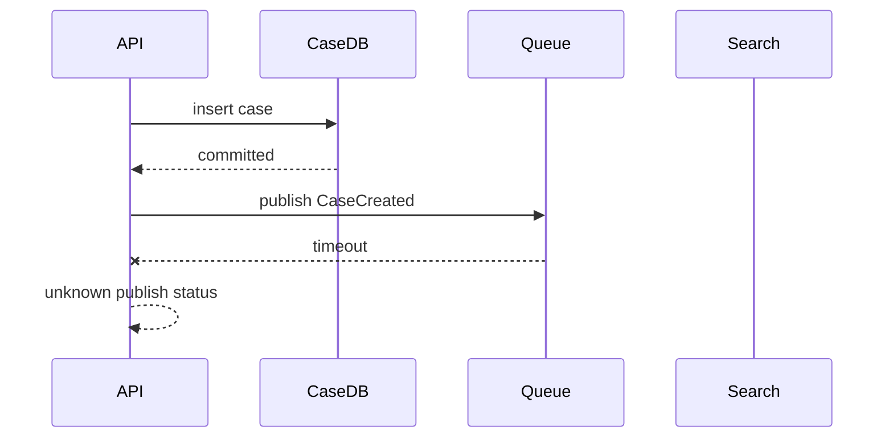
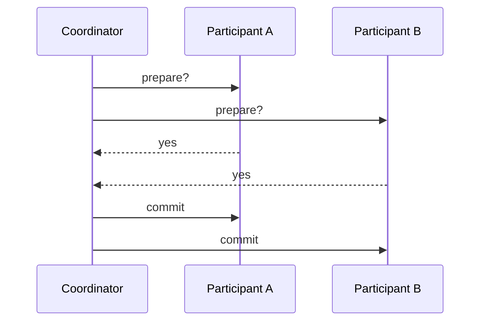
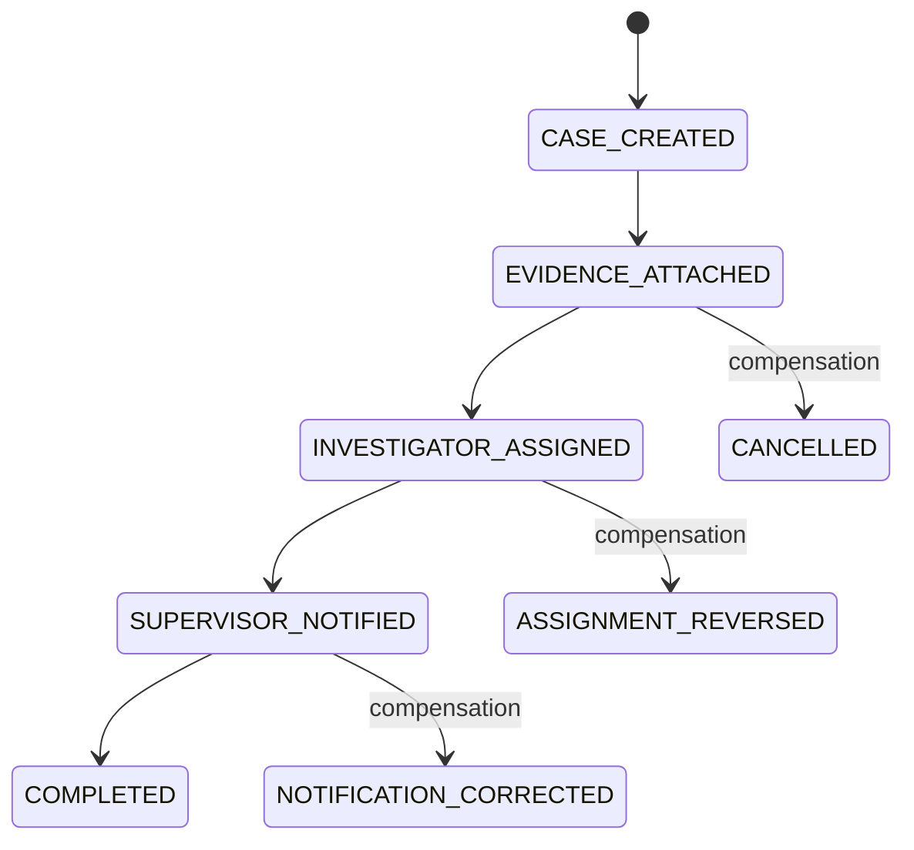
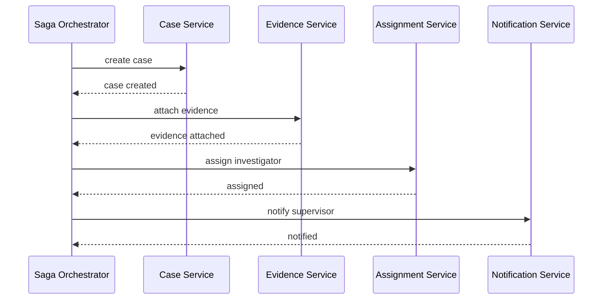
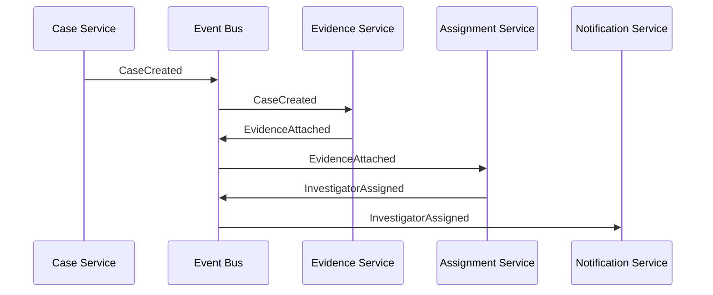
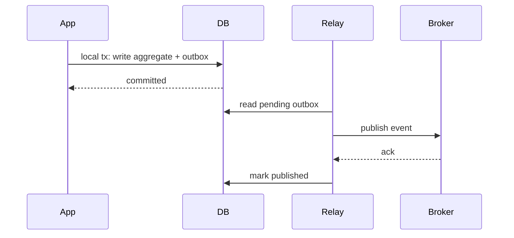
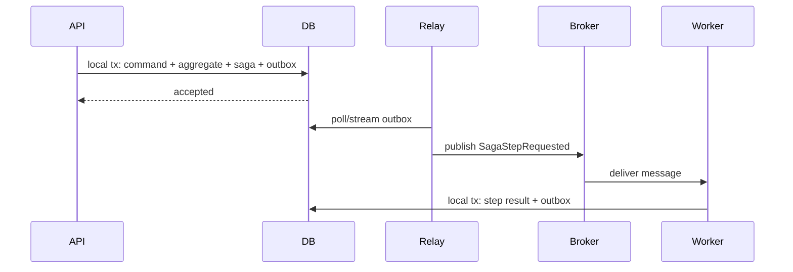

# Part 036 — Distributed Transactions and Sagas

> The hardest distributed transaction problem is not writing to two databases.  
> The hardest problem is knowing what the business state means after one step succeeded, another failed, a message was delayed, and the user retried.

A database transaction gives you a clean boundary: either the local database changes commit or they do not. Distributed business processes do not have that luxury by default.

When one business action spans multiple services, databases, queues, payment providers, search indexes, or external systems, you need a design for partial success.

This part explains distributed transactions and sagas from an architect’s point of view.

---

## 1. Local Transaction vs Distributed Business Transaction

A local transaction:

```text
one database connection
one database engine
one commit decision
one atomic boundary
```

Example:

```sql
BEGIN;

UPDATE account
SET balance = balance - 100
WHERE id = :from_account_id;

UPDATE account
SET balance = balance + 100
WHERE id = :to_account_id;

INSERT INTO ledger_entry (...);

COMMIT;
```

A distributed business transaction:

```text
service A database
service B database
message broker
external provider
search index
notification service
```

Example:

```text
Submit enforcement case
  -> create case record
  -> reserve case number
  -> attach evidence
  -> assign investigator
  -> notify supervisor
  -> publish audit event
  -> update search index
```

Trying to treat this as one giant database transaction is usually the wrong architecture.

---

## 2. The Fundamental Problem: Partial Success

Consider:



Possible realities:

1. DB commit succeeded, event publish failed.
2. DB commit succeeded, event publish succeeded, but API timed out.
3. DB commit succeeded, event publish delayed.
4. DB commit failed, event publish mistakenly succeeded.
5. User retries and creates duplicate intent.

The architect’s job is to make these realities safe.

---

## 3. Two Broad Approaches

| Approach | Meaning | Best Fit | Main Risk |
|---|---|---|---|
| Distributed atomic commit | Try to commit multiple resources as one atomic unit | tightly controlled infrastructure, rare cases | blocking, availability, coordinator failure, complexity |
| Saga / eventual consistency | Break process into local transactions with messages and compensation | microservices, external providers, long workflows | partial state complexity, compensation correctness |

In most service-oriented systems, prefer local transactions plus saga/outbox patterns unless you have a strong reason and platform support for distributed atomic commit.

---

## 4. Two-Phase Commit Mental Model

Two-phase commit, or 2PC, has a coordinator and participants.



Phase 1: prepare.  
Phase 2: commit or abort.

The attractive promise:

> All participants commit or all abort.

The hard production reality:

- participants may hold locks while waiting
- coordinator failure creates uncertainty
- prepared transactions can block resources
- not every resource supports 2PC
- external APIs usually do not participate
- latency grows with participants
- operational recovery is hard

2PC is not evil. It is just a heavy tool. Use it only when its guarantees are worth its operational cost.

---

## 5. Why Sagas Exist

A saga decomposes one distributed business transaction into a sequence of local transactions.

Each step:

1. commits locally
2. records durable progress
3. emits or receives a message
4. triggers the next step
5. may have a compensation path

Example:



A saga does not make the world atomic. It makes the non-atomic reality explicit, durable, observable, and recoverable.

---

## 6. Saga Is a State Machine

A saga should be modelled like a state machine, not as invisible async glue.

```sql
CREATE TABLE saga_instance (
    id                uuid PRIMARY KEY,
    saga_type         text NOT NULL,
    business_key      text NOT NULL,
    status            text NOT NULL CHECK (status IN (
                          'STARTED',
                          'WAITING',
                          'COMPLETED',
                          'COMPENSATING',
                          'COMPENSATED',
                          'FAILED'
                      )),
    current_step      text NOT NULL,
    attempt_count     integer NOT NULL DEFAULT 0,
    last_error_code   text,
    last_error_detail text,
    created_at        timestamptz NOT NULL DEFAULT now(),
    updated_at        timestamptz NOT NULL DEFAULT now(),
    completed_at      timestamptz,
    UNIQUE (saga_type, business_key)
);
```

Step table:

```sql
CREATE TABLE saga_step_execution (
    id                uuid PRIMARY KEY,
    saga_id           uuid NOT NULL REFERENCES saga_instance(id),
    step_name         text NOT NULL,
    direction         text NOT NULL CHECK (direction IN ('FORWARD', 'COMPENSATION')),
    status            text NOT NULL CHECK (status IN (
                          'PENDING', 'RUNNING', 'SUCCEEDED', 'FAILED', 'SKIPPED'
                      )),
    idempotency_key   text NOT NULL,
    started_at        timestamptz,
    completed_at      timestamptz,
    error_code        text,
    error_detail      text,
    UNIQUE (saga_id, step_name, direction),
    UNIQUE (idempotency_key)
);
```

This gives you:

- durable progress
- retry control
- duplicate protection
- auditability
- operator visibility
- compensation trace

---

## 7. Orchestration vs Choreography

### 7.1 Orchestrated Saga

A central orchestrator tells each participant what to do.



Pros:

- clear process visibility
- easier timeout handling
- easier compensation ordering
- easier audit trail
- easier versioning

Cons:

- orchestrator can become central dependency
- services may become passive workers
- process logic concentrated in one place

Best for:

- regulated workflows
- long-running business processes
- explicit approvals
- strong audit requirements
- operational visibility

### 7.2 Choreographed Saga

Services react to events without central coordinator.



Pros:

- loose coupling
- no central process coordinator
- easy to add listeners
- natural event-driven architecture

Cons:

- process is harder to see
- compensation logic scattered
- event cycles possible
- versioning can be difficult
- debugging needs excellent tracing

Best for:

- simple flows
- naturally independent reactions
- notification/projection/update side effects
- low-regulation domains

For enforcement/case-management systems, orchestrated saga is often easier to defend because the workflow is explicit.

---

## 8. Transactional Outbox Pattern

The outbox pattern solves the classic dual-write problem:

```text
write database + publish message
```

Bad pattern:

```java
caseRepository.save(caseRecord);     // commits
messageBroker.publish(event);        // may fail
```

Better pattern:

```sql
BEGIN;

INSERT INTO case_record (id, tenant_id, status, created_at)
VALUES (:case_id, :tenant_id, 'OPEN', now());

INSERT INTO outbox_event (
    id,
    aggregate_type,
    aggregate_id,
    event_type,
    payload,
    created_at,
    status
)
VALUES (
    gen_random_uuid(),
    'CASE',
    :case_id,
    'CaseCreated',
    :payload::jsonb,
    now(),
    'PENDING'
);

COMMIT;
```

Then a relay publishes the outbox event.



The event may still be delivered more than once. Therefore consumers must be idempotent.

---

## 9. Outbox Table Design

```sql
CREATE TABLE outbox_event (
    id                  uuid PRIMARY KEY,
    aggregate_type      text NOT NULL,
    aggregate_id        uuid NOT NULL,
    event_type          text NOT NULL,
    event_version       integer NOT NULL,
    payload             jsonb NOT NULL,
    headers             jsonb NOT NULL DEFAULT '{}'::jsonb,
    idempotency_key     text NOT NULL,
    status              text NOT NULL CHECK (status IN ('PENDING', 'PUBLISHED', 'FAILED')),
    available_at        timestamptz NOT NULL DEFAULT now(),
    attempt_count       integer NOT NULL DEFAULT 0,
    last_attempt_at     timestamptz,
    published_at        timestamptz,
    created_at          timestamptz NOT NULL DEFAULT now(),
    UNIQUE (idempotency_key)
);

CREATE INDEX idx_outbox_pending
ON outbox_event (available_at, id)
WHERE status = 'PENDING';
```

Relay claim pattern:

```sql
WITH picked AS (
    SELECT id
    FROM outbox_event
    WHERE status = 'PENDING'
      AND available_at <= now()
    ORDER BY available_at, id
    LIMIT 100
    FOR UPDATE SKIP LOCKED
)
UPDATE outbox_event o
SET status = 'PUBLISHED',
    published_at = now(),
    attempt_count = attempt_count + 1,
    last_attempt_at = now()
FROM picked
WHERE o.id = picked.id
RETURNING o.*;
```

In many designs, you should mark published after broker ack, not before. If you claim and update before publish, you need a separate `IN_PROGRESS` state and timeout recovery.

Safer relay states:

```text
PENDING -> IN_PROGRESS -> PUBLISHED
                  \-> PENDING after timeout
                  \-> FAILED after max attempts
```

---

## 10. Inbox / Dedup Pattern

Consumers need an inbox table.

```sql
CREATE TABLE consumed_message (
    message_id      uuid PRIMARY KEY,
    consumer_name   text NOT NULL,
    consumed_at     timestamptz NOT NULL DEFAULT now(),
    UNIQUE (consumer_name, message_id)
);
```

Consumer flow:

```sql
BEGIN;

INSERT INTO consumed_message (message_id, consumer_name)
VALUES (:message_id, 'assignment-service')
ON CONFLICT DO NOTHING;

-- If insert affected 0 rows, message was already processed.
-- Otherwise execute side effect inside same local transaction.

UPDATE assignment_queue
SET status = 'READY'
WHERE case_id = :case_id;

COMMIT;
```

Exactly-once delivery is rarely a reliable assumption at system boundary. Design for at-least-once delivery plus idempotent consumers.

---

## 11. Compensation Is Not Rollback

A database rollback erases uncommitted changes.

A compensation is a new business action that semantically counteracts a previous committed action.

Example:

| Forward Step | Compensation |
|---|---|
| reserve inventory | release reservation |
| assign investigator | unassign or reassign |
| debit account | credit reversal entry |
| send notification | send correction notification |
| create case | cancel case with reason |

A compensation must be:

- explicit
- idempotent
- auditable
- allowed by business rules
- safe to retry
- versioned with the saga

Bad compensation:

```sql
DELETE FROM case_record WHERE id = :case_id;
```

Better compensation:

```sql
UPDATE case_record
SET status = 'CANCELLED',
    cancelled_at = now(),
    cancellation_reason = 'SAGA_COMPENSATION'
WHERE id = :case_id
  AND status IN ('DRAFT', 'OPEN');
```

Regulated systems usually need reversal, not deletion.

---

## 12. Saga Failure Modes

### 12.1 Step Succeeds, Reply Lost

The participant completed work but orchestrator did not receive response.

Mitigation:

- idempotency key
- query step status
- retry same command safely

### 12.2 Message Delivered Twice

Mitigation:

- inbox dedup
- unique idempotency key
- atomic consumer transaction

### 12.3 Compensation Fails

Mitigation:

- compensation step state
- retry policy
- manual intervention state
- operator dashboard

### 12.4 Timeout Ambiguity

Mitigation:

- distinguish business timeout vs technical timeout
- reconcile with participant
- use durable status endpoints

### 12.5 Out-of-Order Event

Mitigation:

- aggregate version
- sequence number
- monotonic state transition guard
- ignore stale events

### 12.6 Poison Message

Mitigation:

- dead-letter queue
- max attempts
- structured error code
- replay tooling
- schema validation

### 12.7 Saga Definition Changed Mid-Flight

Mitigation:

- saga version on instance
- old versions remain executable
- migration plan for in-flight sagas

---

## 13. Idempotency Key Design

An idempotency key identifies a business intent, not an HTTP request attempt.

Good keys:

```text
tenant:{tenant_id}:submit-case:{client_request_id}
tenant:{tenant_id}:assign-case:{case_id}:{assignment_command_id}
payment:{payment_intent_id}:capture
```

Bad keys:

```text
random UUID generated by server on every retry
current timestamp
message offset only
```

Command table pattern:

```sql
CREATE TABLE command_request (
    idempotency_key     text PRIMARY KEY,
    tenant_id           uuid NOT NULL,
    command_type        text NOT NULL,
    request_hash        text NOT NULL,
    status              text NOT NULL CHECK (status IN ('STARTED', 'SUCCEEDED', 'FAILED')),
    response_payload    jsonb,
    created_at          timestamptz NOT NULL DEFAULT now(),
    updated_at          timestamptz NOT NULL DEFAULT now()
);
```

Request hash protects against accidental reuse of same idempotency key with different payload.

---

## 14. Designing a Saga Boundary

A saga boundary should follow business process, not technical convenience.

Ask:

1. What business intent starts the saga?
2. What local transaction records the intent?
3. What is the durable business key?
4. Which steps are required vs optional?
5. Which steps are compensatable?
6. Which steps are irreversible?
7. What state is visible to users during progress?
8. What timeout is business-significant?
9. Who can manually intervene?
10. What evidence must be retained?

If a step is irreversible, design the saga so irreversible work happens late, after validations and reservations.

Example:

```text
validate -> reserve -> persist -> notify -> external irreversible action
```

Not:

```text
external irreversible action -> validate -> fail -> panic
```

---

## 15. Saga State Visibility

Users and operators need meaningful intermediate states.

Bad UI/backend state:

```text
PROCESSING
```

Better states:

```text
CASE_SUBMISSION_RECEIVED
VALIDATING_EVIDENCE
WAITING_FOR_ASSIGNMENT
NOTIFICATION_PENDING
SUBMISSION_COMPLETED
SUBMISSION_FAILED_RETRYING
SUBMISSION_REQUIRES_OPERATOR_REVIEW
```

But avoid exposing every internal technical step as domain state. Separate:

- business state
- saga execution state
- technical retry state

Schema split:

```sql
case_record.status          -- domain-visible state
saga_instance.status        -- process execution state
saga_step_execution.status  -- technical step state
```

---

## 16. Distributed Consistency Boundary

A local transaction gives immediate consistency inside one database.

A saga gives eventual consistency across boundaries.

Document this explicitly:

| Data | Owner | Consistency Guarantee |
|---|---|---|
| case status | Case DB | local transaction consistent |
| assignment | Assignment DB | eventually consistent after CaseSubmitted |
| notification | Notification service | at-least-once attempt |
| search index | Search projection | eventually consistent, freshness SLO 30s |
| report warehouse | Analytics | eventually consistent, daily load |

Do not let product, support, and compliance teams assume everything updates atomically when it does not.

---

## 17. External Systems

External APIs rarely support your transaction semantics.

Examples:

- payment gateway
- email/SMS provider
- identity provider
- government registry
- document signing service
- third-party evidence repository

Design rules:

1. Use provider idempotency key when available.
2. Store request and response correlation IDs.
3. Treat timeout as unknown, not failed.
4. Reconcile by querying provider status.
5. Do not retry non-idempotent calls blindly.
6. Keep irreversible external side effects late.
7. Record evidence for audit.

External call table:

```sql
CREATE TABLE external_call_attempt (
    id                  uuid PRIMARY KEY,
    saga_id             uuid NOT NULL,
    provider            text NOT NULL,
    operation           text NOT NULL,
    idempotency_key     text NOT NULL,
    request_payload     jsonb NOT NULL,
    response_payload    jsonb,
    status              text NOT NULL CHECK (status IN (
                          'PENDING', 'SENT', 'SUCCEEDED', 'FAILED', 'UNKNOWN'
                      )),
    provider_ref        text,
    attempt_count       integer NOT NULL DEFAULT 0,
    last_error_code     text,
    created_at          timestamptz NOT NULL DEFAULT now(),
    updated_at          timestamptz NOT NULL DEFAULT now(),
    UNIQUE (provider, operation, idempotency_key)
);
```

---

## 18. Retry Policy

Not every failure deserves the same retry.

| Failure | Retry? | Notes |
|---|---:|---|
| network timeout | yes, with idempotency | status unknown |
| serialization failure | yes | rerun local transaction |
| deadlock | yes with backoff | inspect contention if frequent |
| validation failure | no | business rejection |
| insufficient funds | no or compensate | business failure |
| provider 429 | yes with backoff | respect rate limit |
| provider 400 | usually no | request bug |
| schema validation failure | no until fixed | poison message risk |

Retry policy table:

```sql
CREATE TABLE retry_policy (
    operation       text PRIMARY KEY,
    max_attempts    integer NOT NULL,
    initial_delay_ms integer NOT NULL,
    max_delay_ms     integer NOT NULL,
    backoff_type     text NOT NULL CHECK (backoff_type IN ('FIXED', 'EXPONENTIAL'))
);
```

Architectural rule:

> Retry is safe only when the operation is idempotent or the previous attempt is known not to have happened.

---

## 19. Ordering and Versioning

Event ordering is rarely globally reliable. Design around aggregate-level ordering.

Event payload:

```json
{
  "eventId": "...",
  "aggregateType": "CASE",
  "aggregateId": "...",
  "aggregateVersion": 12,
  "eventType": "CaseAssigned",
  "occurredAt": "2026-07-05T10:15:30Z"
}
```

Consumer guard:

```sql
UPDATE case_projection
SET status = :new_status,
    aggregate_version = :event_version
WHERE case_id = :case_id
  AND aggregate_version < :event_version;
```

This prevents stale events from moving projection backward.

---

## 20. Outbox + Saga Combined

A robust command handler often uses both.



The API does not need to complete the whole business process synchronously. It records the intent and returns a durable accepted state.

---

## 21. Case Management Example

Business command:

```text
Submit Case For Enforcement Review
```

Steps:

1. Create case record.
2. Validate required evidence.
3. Lock evidence package.
4. Assign investigator queue.
5. Create SLA timer.
6. Notify supervisor.
7. Index case for search.
8. Emit audit event.

Schema shape:

```sql
CREATE TABLE case_submission_saga (
    id              uuid PRIMARY KEY,
    tenant_id       uuid NOT NULL,
    case_id         uuid NOT NULL,
    status          text NOT NULL,
    current_step    text NOT NULL,
    version         integer NOT NULL,
    created_at      timestamptz NOT NULL DEFAULT now(),
    updated_at      timestamptz NOT NULL DEFAULT now(),
    UNIQUE (tenant_id, case_id)
);
```

Forward/compensation thinking:

| Step | Forward | Compensation |
|---|---|---|
| create case | insert `case_record` | mark cancelled, not delete |
| validate evidence | mark validated | mark validation invalidated |
| lock evidence | set locked | unlock if no downstream use |
| assign investigator | create assignment | cancel assignment |
| create SLA | create timer | cancel timer |
| notify supervisor | send notification | send correction if needed |
| index search | upsert projection | remove/update projection |

Some compensations may be impossible or undesirable. That is not a problem if explicitly modelled.

---

## 22. Financial Ledger Example

Never compensate ledger by deleting entries.

Bad:

```sql
DELETE FROM ledger_entry WHERE id = :entry_id;
```

Good:

```sql
INSERT INTO ledger_entry (
    id,
    account_id,
    amount,
    direction,
    reference_type,
    reference_id,
    reversal_of_entry_id,
    created_at
)
VALUES (
    gen_random_uuid(),
    :account_id,
    :amount,
    'CREDIT',
    'REVERSAL',
    :saga_id,
    :original_entry_id,
    now()
);
```

A ledger compensation is another immutable fact.

---

## 23. Testing Sagas

Test the failure matrix, not only the happy path.

Minimum tests:

- duplicate command request
- duplicate event delivery
- event delivered out of order
- participant timeout after success
- participant timeout before success
- orchestrator crash after local commit
- relay crash before publish
- relay crash after publish before marking published
- compensation failure
- retry exhaustion
- poison message
- schema version mismatch
- manual intervention path

Chaos-style scenario:

```text
Kill process after DB commit but before outbox relay observes event.
Expected: outbox row remains pending and is eventually published.
```

---

## 24. Observability

A saga architecture without observability becomes invisible failure.

Track:

- saga count by status
- stuck saga age
- retry attempts by step
- compensation count
- failed compensation count
- outbox backlog
- outbox oldest pending age
- inbox duplicate count
- dead-letter count
- event publish latency
- end-to-end saga duration
- participant timeout rate

Dashboard sections:

```text
Saga Health
  - Started / Completed / Failed / Compensating
  - Oldest WAITING saga
  - Top failing steps

Outbox Health
  - Pending count
  - Oldest pending age
  - Publish error rate

Consumer Health
  - Duplicate messages
  - Dead-letter queue
  - Projection lag
```

---

## 25. Manual Intervention

Production sagas need operator states.

```text
FAILED_RETRYABLE
FAILED_REQUIRES_REVIEW
COMPENSATION_REQUIRES_REVIEW
BLOCKED_EXTERNAL_PROVIDER
WAITING_MANUAL_APPROVAL
```

Operator action table:

```sql
CREATE TABLE saga_operator_action (
    id              uuid PRIMARY KEY,
    saga_id         uuid NOT NULL REFERENCES saga_instance(id),
    action_type     text NOT NULL,
    reason          text NOT NULL,
    actor_id        uuid NOT NULL,
    created_at      timestamptz NOT NULL DEFAULT now()
);
```

Operator actions must be audited. Manual repair that bypasses saga state is a future incident.

---

## 26. Versioning Sagas

Long-running workflows outlive deployments.

Design:

```sql
ALTER TABLE saga_instance
ADD COLUMN saga_version integer NOT NULL DEFAULT 1;
```

Rules:

- a saga instance runs under the version it started with
- new deployments can start new version
- old version handlers remain until old sagas complete or migrate
- compensation semantics are versioned
- event payload versions are explicit

Do not assume all in-flight sagas can instantly adopt new logic.

---

## 27. When Not to Use Saga

Do not use saga when:

- one local transaction is sufficient
- process does not cross consistency boundaries
- compensation is impossible and partial success is unacceptable
- business requires immediate atomic result
- team cannot operate async workflows
- product cannot tolerate eventual consistency

Alternative options:

- keep operation inside one database/service boundary
- redesign aggregate boundary
- use synchronous local transaction
- use database constraints instead of async coordination
- use explicit reservation before irreversible action

The best distributed transaction is often the one avoided through better boundary design.

---

## 28. Architecture Review Checklist

### Boundary

- [ ] Which local transaction records the initial business intent?
- [ ] Which data is immediately consistent?
- [ ] Which data is eventually consistent?
- [ ] Is the consistency contract documented?

### Saga Design

- [ ] Is saga state durable?
- [ ] Is each step idempotent?
- [ ] Is each compensation explicit?
- [ ] Are irreversible steps delayed as much as possible?
- [ ] Is saga version stored?
- [ ] Are stuck states visible?

### Outbox/Inbox

- [ ] Are DB write and outbox insert in same transaction?
- [ ] Is relay safe against crash?
- [ ] Are consumers idempotent?
- [ ] Is duplicate delivery expected and tested?
- [ ] Are event versions explicit?

### Failure Handling

- [ ] Are timeouts treated as unknown when appropriate?
- [ ] Is retry policy classified by error type?
- [ ] Is compensation retryable?
- [ ] Is there manual intervention path?
- [ ] Are poison messages isolated?

### Observability

- [ ] Is outbox backlog monitored?
- [ ] Is oldest pending message monitored?
- [ ] Is stuck saga age monitored?
- [ ] Are compensation failures alerted?
- [ ] Can support trace one business key end-to-end?

---

## 29. Common Anti-Patterns

### 29.1 Dual Write Without Outbox

```text
DB commit succeeds, publish fails.
```

This creates silent inconsistency.

### 29.2 Compensation by Delete

Deleting evidence of a committed action destroys auditability.

### 29.3 Retry Without Idempotency

Retry turns transient failure into duplicate side effects.

### 29.4 One Giant `PROCESSING` State

Operators cannot know what is stuck.

### 29.5 Choreography Without Traceability

Nobody can answer where the process is.

### 29.6 Assuming Event Order

Out-of-order messages corrupt projection/state.

### 29.7 Treating Timeout as Failure

Timeout means unknown unless you can prove no side effect occurred.

### 29.8 No Manual Repair Model

Every distributed system eventually needs controlled human intervention.

---

## 30. Final Mental Model

A local transaction protects invariants inside one database.

A saga protects business progress across multiple consistency boundaries by making partial success explicit.

The core design principles:

1. Keep as much correctness as possible inside local transactions.
2. Use outbox to atomically record state change and message intent.
3. Make consumers idempotent with inbox/dedup.
4. Model saga state durably.
5. Treat compensation as business action, not technical rollback.
6. Prefer explicit orchestration for regulated workflows.
7. Make intermediate state observable.
8. Test crash points, duplicates, retries, and timeouts.

The top 1% database architect does not pretend distributed systems are atomic. They design the truth model for when they are not.

---

## References

- AWS Prescriptive Guidance — Transactional Outbox Pattern: https://docs.aws.amazon.com/prescriptive-guidance/latest/cloud-design-patterns/transactional-outbox.html
- AWS Prescriptive Guidance — Saga Choreography Pattern: https://docs.aws.amazon.com/prescriptive-guidance/latest/cloud-design-patterns/saga-choreography.html
- Microsoft Azure Architecture Center — Saga Distributed Transactions Pattern: https://learn.microsoft.com/en-us/azure/architecture/patterns/saga
- Microsoft Azure Architecture Center — Compensating Transaction Pattern: https://learn.microsoft.com/en-us/azure/architecture/patterns/compensating-transaction
- PostgreSQL Documentation — Transaction Isolation: https://www.postgresql.org/docs/current/transaction-iso.html
- PostgreSQL Documentation — Explicit Locking: https://www.postgresql.org/docs/current/explicit-locking.html
