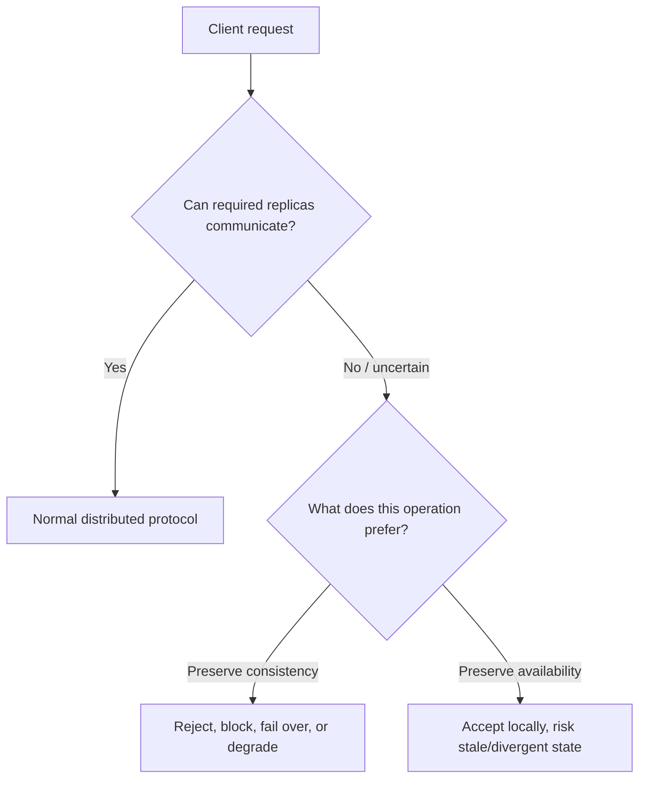
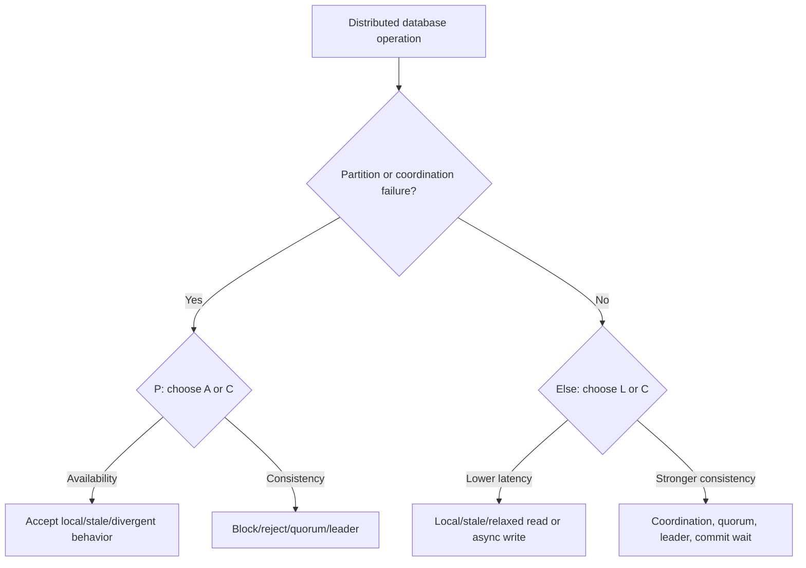
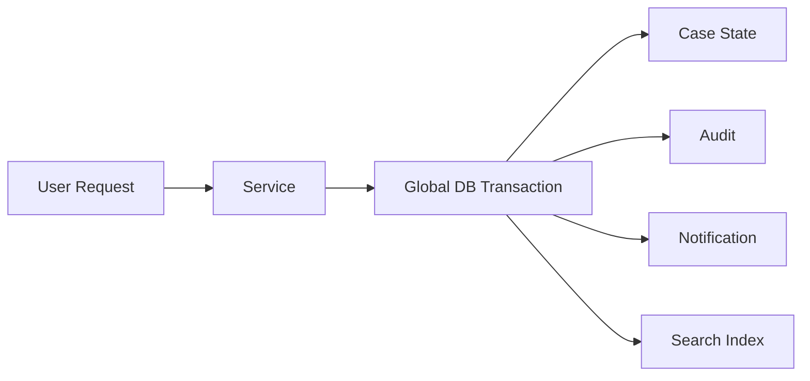
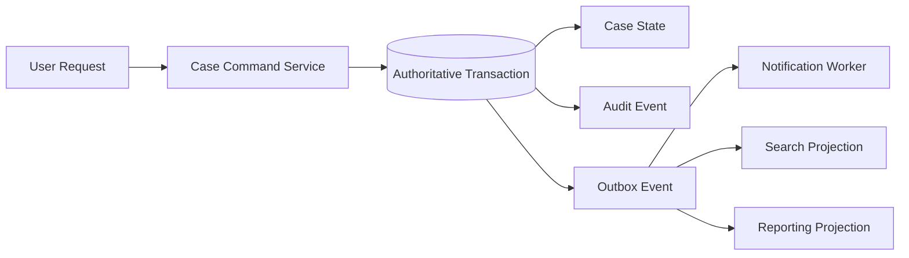
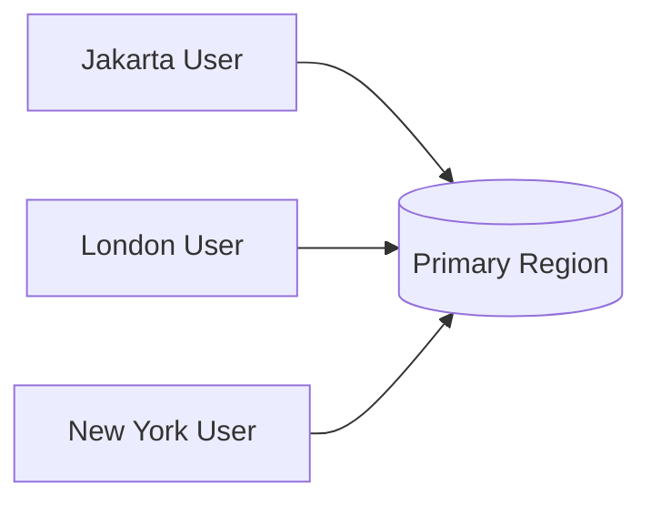
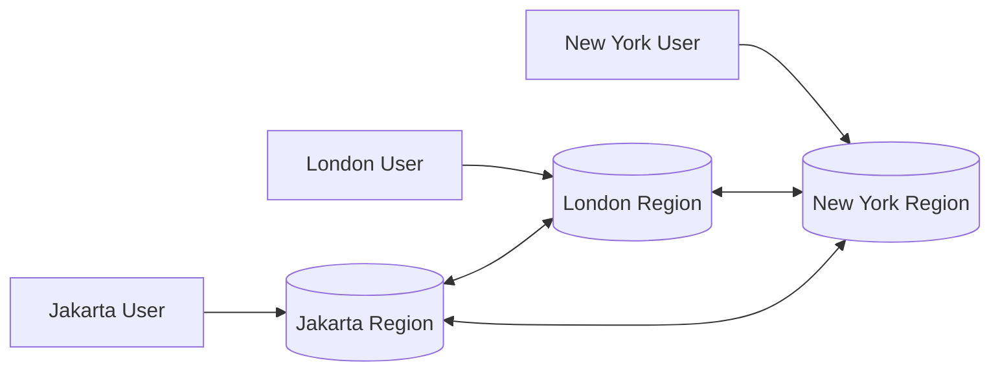
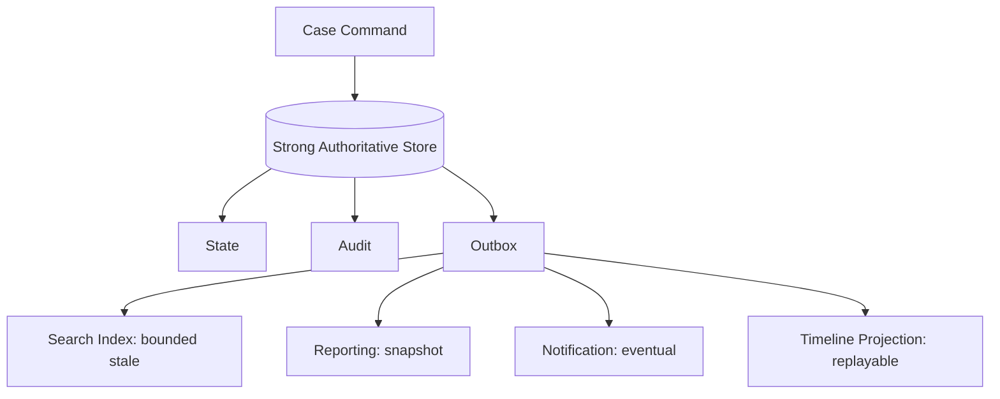
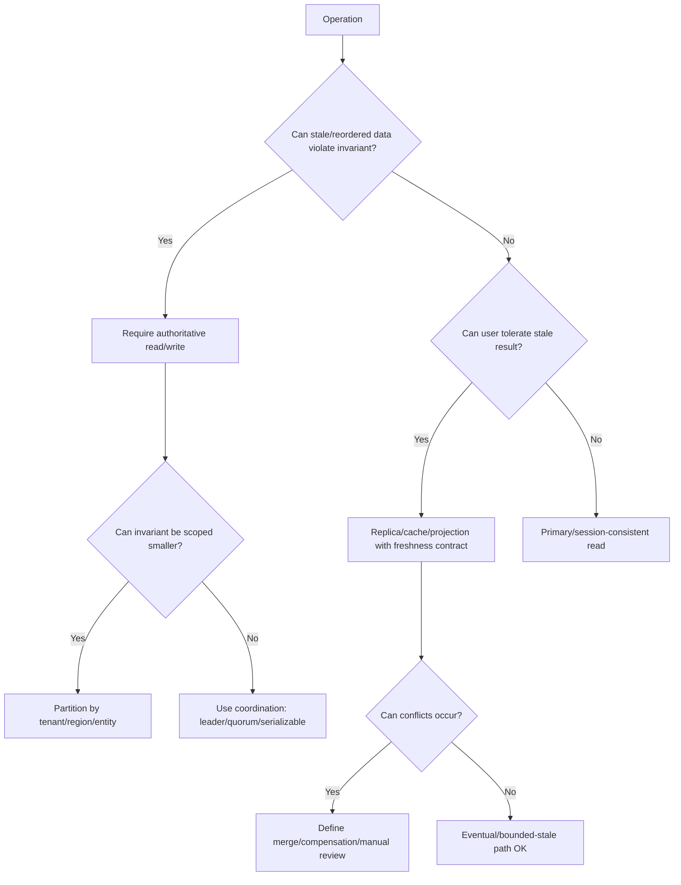

# Part 037 — CAP, PACELC, and Real Tradeoffs

Distributed database design is not about memorizing **CP**, **AP**, **CA**, or repeating “you cannot have all three”. That slogan is useful as a warning, but dangerous as a design method.

A top-tier database architect uses CAP and PACELC as a **failure and latency reasoning framework**:

> What must the system do when communication between parts becomes unreliable, and what latency/consistency price are we paying even when the system is healthy?

This part builds the operational mental model behind those decisions.

---

## 1. The core problem

A single-node database can pretend that “the database” is one place.

A distributed database cannot.

Once data is replicated across nodes, availability zones, regions, or services, the system must answer hard questions:

- Which copy is authoritative?
- Can two clients write at the same time in different locations?
- What happens when replicas cannot talk to each other?
- Should the system reject writes, accept divergent writes, or serve stale reads?
- Can the user tolerate latency from cross-region coordination?
- Can the business tolerate temporary inconsistency?
- Can the business tolerate temporary unavailability?

The real architecture decision is not “choose CP or AP”. It is:

> Choose which guarantees hold for each operation, entity, invariant, tenant, region, and failure mode.

---

## 2. CAP: useful, but often misused

CAP says that when a distributed system experiences a network partition, it cannot simultaneously guarantee all of:

| Property | Practical meaning |
|---|---|
| Consistency | All clients observe a single correct value/order according to the chosen consistency model |
| Availability | Every request to a non-failing node eventually receives a non-error response |
| Partition tolerance | The system continues operating despite lost/delayed communication between nodes |

The important word is **partition**.

CAP is not primarily about normal operation. During normal operation, a well-engineered distributed database can often appear consistent, available, and partition-tolerant enough for common workloads. The hard choice becomes unavoidable when communication is broken, delayed beyond tolerance, or ambiguous.



CAP is a failure-mode lens, not a product-selection shortcut.

---

## 3. The wrong way to use CAP

Weak statements:

- “PostgreSQL is CA.”
- “Cassandra is AP.”
- “Spanner beats CAP.”
- “We need CP because we care about correctness.”
- “We need AP because we need uptime.”

These statements are too coarse.

A database product may provide different behavior for different operations, configurations, replica placement, consistency settings, isolation levels, and failure modes.

A better question:

> For this exact operation, under this exact failure, what will the system return, reject, delay, or later reconcile?

Example:

| Operation | Strong consistency needed? | Availability during partition? | Reason |
|---|---:|---:|---|
| Submit regulatory decision | Yes | Can reject/degrade | Illegal duplicate or inconsistent decision is unacceptable |
| View dashboard count | No, bounded staleness OK | Should remain available | Human-facing monitoring can tolerate freshness label |
| Append audit event | Usually yes locally; durable outbox needed | Depends | Missing audit event can break evidence chain |
| User profile display name edit | Maybe not globally strict | Can be eventually consistent | Conflict can be resolved by last-writer or version policy |
| Money transfer | Yes | Often reject if quorum unavailable | Double-spend is worse than temporary failure |

The system is rarely one CAP choice. It is a set of **operation-level choices**.

---

## 4. Partition is not only “cable cut”

In production, partition-like behavior can appear as:

- region-to-region network outage;
- packet loss;
- asymmetric connectivity;
- DNS failure;
- overloaded node that cannot respond before timeout;
- GC pause;
- storage stall;
- firewall/security group mistake;
- load balancer health check inconsistency;
- Kubernetes network policy error;
- cloud control plane incident;
- clock uncertainty increasing;
- replication link backlog;
- consensus quorum unavailable.

From the application’s perspective, many of these look the same:

> I cannot reliably know whether the other side accepted, rejected, delayed, or committed the operation.

That uncertainty is why idempotency, transaction retry, outbox, deduplication, monotonic reads, and recovery workflows matter.

---

## 5. Consistency is not one thing

“Consistency” in distributed systems can mean different things. Mixing them causes architecture confusion.

| Consistency type | Meaning | Example concern |
|---|---|---|
| Linearizability | Operation appears to happen atomically at one point in real time | “After approval is committed, no one sees pending.” |
| Serializability | Transactions behave like some serial order | “Concurrent updates preserve invariants.” |
| External consistency | Serial order respects real-time order | “If A commits before B starts, B must observe A.” |
| Causal consistency | Effects follow causes | “Reply is not visible before original comment.” |
| Read-your-writes | User sees their own committed write | “After saving profile, user sees updated profile.” |
| Monotonic reads | User does not move backward in observed state | “Page refresh should not show older case version.” |
| Eventual consistency | Replicas converge if no new writes occur | “Search index eventually includes new document.” |
| Bounded staleness | Reads may be stale within a known bound | “Dashboard data can be up to 30 seconds old.” |

When a design doc says “strong consistency”, force it to name the actual guarantee.

For database architecture, this question is critical:

> Which invariant breaks if this read or write is stale, reordered, duplicated, or lost?

---

## 6. Availability is also not one thing

Availability can mean:

- accepts reads;
- accepts writes;
- accepts only local writes;
- accepts only idempotent commands;
- accepts degraded mode;
- accepts stale reads;
- accepts cached reads;
- accepts queueing but not immediate commit;
- accepts only operations for tenants whose shard/quorum is healthy.

A mature system defines availability per capability.

Bad requirement:

> The database must be highly available.

Better requirement:

> Case search may serve stale results up to 60 seconds during replica lag. Case state transition must reject if the authoritative partition cannot confirm the latest case version. Audit append must be accepted only if local durable commit and outbox persistence succeed.

This is architecture-grade specificity.

---

## 7. Partition tolerance does not mean “continues normally”

Partition tolerance means the system has a defined behavior when communication fails.

That behavior can be:

- continue with quorum;
- continue only in primary region;
- reject writes in minority partition;
- serve stale read-only data;
- buffer commands locally;
- accept divergent writes and reconcile later;
- freeze specific workflow transitions;
- fail closed for sensitive operations;
- fail open for low-risk display operations.

Partition tolerance is not magic. It is **failure policy encoded into system behavior**.

---

## 8. The CP-style choice

A CP-style design prefers consistency over availability during partition.

That does not mean the whole system is down. It means operations requiring a consistency guarantee may block or fail when the database cannot safely coordinate.

Typical examples:

- consensus quorum required for write;
- single leader required for state transition;
- primary region required for authoritative command;
- serializable transaction required for invariant;
- reject request when latest version cannot be verified.

Benefits:

- avoids divergent committed truth;
- protects business invariants;
- simpler audit story;
- easier reconciliation;
- safer for financial, regulatory, inventory, identity, entitlement, and workflow-state domains.

Costs:

- user-visible errors during partition;
- higher cross-region write latency;
- dependency on quorum/leader health;
- degraded write availability;
- requires careful retry and idempotency.

CP-style design is appropriate when accepting a wrong answer is worse than temporarily refusing service.

---

## 9. The AP-style choice

An AP-style design prefers availability over strong consistency during partition.

The system accepts requests even when global coordination is not possible. That implies one of the following:

- writes are accepted locally and later reconciled;
- reads may be stale;
- conflicts may occur;
- business rules may be temporarily violated;
- compensating workflows are required;
- users may see different states in different regions.

Benefits:

- local low-latency writes;
- higher write availability during partition;
- good fit for append-heavy or user-facing tolerant data;
- can reduce coordination bottlenecks.

Costs:

- conflict resolution complexity;
- inconsistent user experience;
- harder audit and support story;
- reconciliation backlog risk;
- business invariant may be temporarily false;
- downstream projections may diverge.

AP-style design is appropriate when refusing service is worse than temporary inconsistency, and there is a clear reconciliation model.

No reconciliation model means not AP architecture. It means data corruption with optimism.

---

## 10. PACELC: the missing normal-operation question

CAP focuses on what happens **if there is a partition**.

PACELC extends the thinking:

> If there is a Partition, choose between Availability and Consistency; Else, choose between Latency and Consistency.



PACELC matters because most user experience pain happens when there is no partition.

A global strongly consistent write may require cross-region coordination even on a perfect day. A strongly consistent read may be slower than a local stale read. A serializable distributed transaction may be safer but have more retries under contention.

For architects, PACELC forces the normal-operation question:

> Are we paying coordination latency for every operation, or only for operations whose invariants require it?

---

## 11. Latency is not only performance; it changes behavior

Latency affects:

- user abandonment;
- API timeout;
- retry storm;
- lock duration;
- transaction conflict window;
- queue backlog;
- connection pool saturation;
- SLA breach;
- escalation timing;
- operational cost.

A slow consistent design can become less available in practice because clients timeout and retry.

A low-latency eventually consistent design can become less correct because users make decisions on stale data.

So the real question is not “fast or correct?”

It is:

> Which operations need coordination, and how do we prevent coordination from infecting every path?

---

## 12. Operation classification matrix

Use this classification before choosing distributed database behavior.

| Operation class | Example | Preferred guarantee | Common design |
|---|---|---|---|
| Critical command | Approve case, transfer funds, allocate scarce resource | Strong consistency, serializable or explicit invariant lock | Leader/quorum write, version check, idempotency |
| Local append | Add comment, log event, collect telemetry | Durable local append, later projection | Append log, outbox, async replication |
| Human read | View dashboard, search, list cases | Bounded staleness | Replica/search projection with freshness label |
| Self-read after write | Save form then refresh | Read-your-writes | Sticky primary, session token, freshness token |
| Background analytics | Daily report | Reproducible snapshot | ETL/warehouse snapshot, watermark |
| Cross-region display | Product catalog, public content | Eventual/bounded staleness | CDN/cache/read replica |
| Authorization check | Permission, entitlement, tenant membership | Fresh enough for risk | Usually primary/strong read for sensitive operation |
| Work claim | Pick next task | Strong claim exclusivity | `FOR UPDATE SKIP LOCKED`, queue lease, unique claim |

This is how CAP/PACELC becomes engineering work.

---

## 13. Consistency boundary vs availability boundary

A consistency boundary defines the set of data that must be coordinated atomically to preserve an invariant.

An availability boundary defines what remains usable when part of the system is unavailable.

Poor design couples them accidentally:



In this design, notification and search indexing can reduce availability of case approval.

Better design separates authority from projections and side effects:



The transaction protects authoritative truth. Side effects become retryable projections.

---

## 14. Business invariant drives the tradeoff

Do not classify by technology first. Classify by invariant.

Ask:

1. What illegal state must never be committed?
2. Can the operation be retried safely?
3. Can two regions accept the same command independently?
4. If conflicting writes occur, is there a deterministic merge?
5. Is compensation legally/business-wise acceptable?
6. Can users observe stale state without harm?
7. What must appear in audit if the operation is rejected?
8. What is the maximum tolerable staleness?
9. What happens to downstream systems if state arrives out of order?
10. How will support explain the behavior to a user?

Example: regulatory case decision.

Invariant:

> A case cannot have two final decisions for the same decision authority and version.

Architecture implication:

- final decision command must be coordinated;
- stale read is not acceptable for transition guard;
- idempotency key is required;
- audit event must be atomic with decision state;
- notification can be asynchronous;
- search can be stale with freshness label;
- region partition should reject final decision in minority/unknown partition.

---

## 15. Conflict resolution is domain design, not database magic

AP-style systems often say “we resolve conflicts later”. That phrase hides enormous complexity.

Conflict resolution options:

| Strategy | Works when | Fails when |
|---|---|---|
| Last write wins | Value is low risk and overwrite is acceptable | User intent matters, evidence matters, money matters |
| Highest version wins | There is a clear monotonic version source | Concurrent independent edits both valid |
| Merge set union | Data is naturally additive | Deletion/update semantics matter |
| CRDT-style merge | Data type has mathematically safe merge | Business invariant spans multiple fields/entities |
| Manual review | Conflicts rare and high value | Conflicts frequent or operational capacity low |
| Compensation | Wrong action can be reversed safely | Legal/financial/physical effect irreversible |

For case management, enforcement, finance, identity, and entitlement, “last write wins” is often unacceptable because it erases intent and evidence.

Design rule:

> If you cannot describe conflict detection, resolution, audit, user messaging, and replay behavior, do not choose availability-over-consistency for that operation.

---

## 16. Staleness budget

Bounded staleness is an architecture contract.

A useful staleness contract says:

- maximum tolerated staleness;
- whether stale data is visible to users;
- whether stale data can drive commands;
- how freshness is measured;
- how freshness is surfaced;
- fallback behavior when staleness exceeds budget;
- whether stale reads are tenant-specific, region-specific, or global.

Example:

```md
Case list view:
- May read from search projection.
- Freshness budget: 60 seconds.
- UI must display `Last updated at` watermark.
- Clicking a case detail must load authoritative case by ID.
- State-transition buttons must be enabled only after authoritative read.
```

This is better than saying “eventually consistent search is fine”.

---

## 17. Read-your-writes and user trust

Many systems do not need global linearizability, but they do need user-level monotonic experience.

A common failure:

1. User submits update to primary.
2. Redirect goes to read replica.
3. Replica is lagging.
4. User sees old value.
5. User submits again.
6. Duplicate/conflict occurs.

Mitigations:

- sticky primary for N seconds after write;
- session consistency token;
- replica lag-aware routing;
- read-your-writes cache;
- command result returns authoritative state;
- UI pending state until projection catches up;
- idempotency key for repeated submit.

Distributed consistency is not only a database property. It is a product experience property.

---

## 18. Quorum thinking

Many distributed databases use quorum-like protocols.

Simplified:

- data is replicated to N nodes;
- write may require W acknowledgements;
- read may require R acknowledgements;
- if R + W > N, reads and writes overlap in at least one replica, enabling stronger consistency depending on protocol details.

But quorum is not automatically enough.

Architects must consider:

- leader election;
- write ordering;
- clock behavior;
- read repair;
- hinted handoff;
- stale replica admission;
- multi-key transaction semantics;
- isolation level;
- failure detector behavior;
- latency distribution.

Quorum is a mechanism. The guarantee comes from the whole protocol.

---

## 19. Minority partition behavior

Every distributed database design should document minority behavior.

When a region loses quorum, can it:

- serve reads?
- serve stale reads?
- accept writes?
- queue commands locally?
- reject commands?
- elect a new leader?
- expose admin override?
- recover automatically after network heals?

Minority behavior is where data corruption often begins.

A safe CP-style minority partition usually becomes read-only or unavailable for authoritative writes.

A safe AP-style minority partition may accept writes only if conflict resolution is explicit and tested.

An unsafe partition accepts writes because “we did not want downtime” without a reconciliation model.

---

## 20. Degraded mode design

Availability does not have to mean full functionality.

Degraded mode examples:

| Failure | Degraded behavior |
|---|---|
| Primary region unavailable | Serve read-only case history from replica |
| Search projection lagging | Disable global search, allow direct ID lookup |
| Authorization replica stale | Require primary authorization check for privileged command |
| Reporting warehouse delayed | Show previous snapshot with watermark |
| External notification down | Commit authoritative transaction, retry notification from outbox |
| Cross-region quorum lost | Freeze final approval, allow draft editing locally if safe |

Degraded mode is often the best middle path between correctness and user experience.

---

## 21. Latency/consistency placement

Consider a global application with users in Jakarta, London, and New York.

Option A: one primary region.



Benefits:

- simple consistency;
- easier operational model;
- simpler audit;
- no multi-leader conflict.

Costs:

- remote write latency;
- regional dependency;
- distant users pay network round trip.

Option B: multi-region local writes.



Benefits:

- low local latency;
- region-local availability;
- better user proximity.

Costs:

- conflict resolution;
- coordination or eventual consistency;
- harder audit;
- harder failover semantics;
- more operational complexity.

There is no universal answer. The correct choice follows data ownership, invariants, and latency budget.

---

## 22. Global uniqueness and scarce resources

Scarce resources force consistency decisions.

Examples:

- username uniqueness;
- account number issuance;
- invoice number sequence;
- case reference number;
- inventory count;
- seat reservation;
- entitlement grant;
- final decision per case;
- one active assignment per task.

If the resource is globally scarce, local independent writes can conflict.

Design options:

1. Coordinate globally at write time.
2. Partition the resource by region/tenant/prefix.
3. Allocate ranges ahead of time.
4. Accept conflicts and reconcile.
5. Use generated IDs that do not require central coordination.
6. Make the human-visible unique value assigned after durable acceptance.

Example:

```sql
-- Global uniqueness through database-enforced invariant.
create table case_reference (
    reference_no text primary key,
    case_id uuid not null unique,
    tenant_id uuid not null,
    issued_at timestamptz not null default now()
);
```

If this table is globally coordinated, writes are safer but slower. If references are tenant-prefixed or region-prefixed, coordination scope shrinks.

---

## 23. Designing with coordination scope

Coordination scope is the amount of system that must agree before an operation commits.

Smaller coordination scope usually improves latency and availability.

| Coordination scope | Example | Tradeoff |
|---|---|---|
| Single row | Update case version | Fastest safe invariant if modeled well |
| Single partition/shard | Tenant-local case transition | Good for tenant isolation |
| Single region | Region-local workflow | Lower latency, region ownership required |
| Cross-region quorum | Global account transfer | Stronger global truth, higher latency |
| Cross-service saga | Order + payment + fulfillment | Eventually consistent, compensation needed |

Architectural skill is often about reshaping the model so the necessary invariant fits inside a smaller coordination scope.

Example:

Instead of global case number sequence:

```txt
CASE-0000000001
CASE-0000000002
```

Use scoped reference:

```txt
ID-JKT-2026-000001
ID-LDN-2026-000001
```

This makes uniqueness region/year-scoped and reduces global contention.

---

## 24. CAP/PACELC for regulatory systems

Regulatory and enforcement systems often have mixed consistency needs.

Strong consistency candidates:

- final decision;
- enforcement action creation;
- legal status transition;
- active assignment uniqueness;
- evidence chain append;
- approval quorum;
- permission/role grant;
- deadline extension approval;
- audit event persistence.

Eventual or bounded-stale candidates:

- dashboard metrics;
- search index;
- notification delivery;
- report materialization;
- timeline projection;
- “recent activity” feed;
- analytics exports;
- cross-case similarity index.

This split prevents over-coordination.



---

## 25. Failure-mode matrix

Every distributed database design should include a failure-mode matrix.

| Failure | Critical command | Normal read | Search | Reporting | Audit |
|---|---|---|---|---|---|
| Read replica lag | Route to primary | Use if within budget | Show watermark | Unaffected | Unaffected |
| Primary region down | Reject/failover | Serve stale read-only if safe | Serve stale | Previous snapshot | Must not fake append |
| Network split | Majority accepts, minority rejects | Minority may stale-read | Stale with label | Stale snapshot | Append only if authority available |
| Message broker down | Commit DB + outbox | Unaffected | Projection delayed | Delayed | DB audit still committed |
| CDC connector down | Authoritative OK | OK | Delayed | Delayed | Audit table OK |
| Clock uncertainty high | Avoid timestamp-order assumptions | OK | OK | Delay snapshot boundary | Preserve commit order by DB ID/LSN |

This turns abstract CAP into testable behavior.

---

## 26. Anti-patterns

### Anti-pattern 1: CAP as branding

“We use database X, therefore we are CP/AP.”

Reality: configuration, operation type, deployment topology, consistency settings, and client behavior matter.

### Anti-pattern 2: eventual consistency without a user contract

“Data will show up eventually.”

Eventually is not a contract. Define freshness budget and fallback.

### Anti-pattern 3: accepting writes during partition without conflict design

This is data corruption disguised as availability.

### Anti-pattern 4: global serializability for everything

This preserves correctness but can destroy latency, cost, and availability for operations that did not need it.

### Anti-pattern 5: using cache/replica for authorization-critical reads

If stale permissions allow forbidden action, the read path is part of the security boundary.

### Anti-pattern 6: hiding inconsistency from users

If users can make decisions based on stale data, show freshness, pending state, or authoritative refresh.

---

## 27. Design checklist

Before approving a distributed database design, answer:

- What are the critical invariants?
- Which operations require linearizability, serializability, causal consistency, read-your-writes, or bounded staleness?
- What happens during partition?
- What happens during replica lag?
- What happens if write result is unknown?
- What happens if clients retry?
- Which reads can be stale?
- Which reads must be authoritative?
- What is the staleness budget?
- How is freshness measured and shown?
- Can conflicts happen?
- How are conflicts detected?
- How are conflicts resolved?
- Is compensation legally/business-wise acceptable?
- What is the degraded mode?
- What is minority partition behavior?
- What is quorum behavior?
- What is failover behavior?
- How do we test partition behavior?
- How do we observe inconsistency risk?
- How do we explain behavior to support and users?

---

## 28. Practical decision framework

Use this flow for each operation.



---

## 29. What top engineers internalize

Top database engineers do not ask only:

> Is the database consistent?

They ask:

> Consistent enough for which invariant, at what latency, during which failure, with what user-visible behavior, and with what recovery path?

They do not ask only:

> Is the system available?

They ask:

> Available for which operation, in which region, with what data freshness, and what risk of accepting a wrong command?

That is the difference between database selection and database architecture.

---

## 30. References

- Google Cloud, **Inside Cloud Spanner and the CAP Theorem**.
- Google Cloud, **Spanner: TrueTime and external consistency**.
- Google Research, **Spanner: Google’s Globally-Distributed Database**.
- Daniel J. Abadi, **Problems with CAP, and Yahoo’s little known NoSQL system** / PACELC framing.
- ScyllaDB glossary, **PACELC Theorem**.
- PostgreSQL Documentation, **High Availability, Load Balancing, and Replication**.
- CockroachDB Documentation, **Architecture** and **Life of a Distributed Transaction**.
