# Part 038 — Distributed SQL Architecture

Distributed SQL is an attempt to combine two things that historically fought each other:

1. SQL/relational semantics: schema, indexes, joins, constraints, transactions.
2. Distributed-system scalability/resilience: replication, sharding, failover, locality, horizontal scale.

The promise is attractive:

> Keep the application model close to relational SQL while scaling and surviving like a distributed system.

The reality is more nuanced:

> Distributed SQL can hide distribution from the SQL syntax, but it cannot remove the physics of coordination, latency, consensus, locality, and failure.

This part explains the architecture so you can design with it intentionally.

---

## 1. What distributed SQL is solving

Classic single-primary relational systems are excellent at:

- strong transactions;
- constraints;
- joins;
- mature SQL;
- operational familiarity;
- local consistency;
- predictable development model.

They struggle when one database instance or primary region becomes the bottleneck for:

- global availability;
- horizontal write scaling;
- regional latency;
- region failure tolerance;
- very large tenant distribution;
- online rebalancing;
- multi-region active-active behavior;
- automatic shard management.

NoSQL systems solved many distribution problems by weakening some relational guarantees or changing the data model.

Distributed SQL tries to preserve SQL while distributing storage and transactions under the hood.

---

## 2. Core mental model

A distributed SQL database usually decomposes the system into layers:

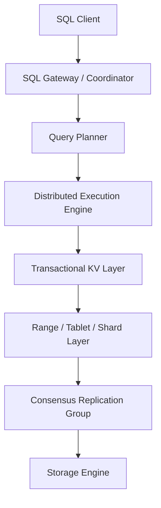

The user sends SQL.

The database turns it into distributed operations over partitions of keyspace, coordinates transactions across them, replicates each partition, and stores data on multiple machines.

The SQL may look familiar:

```sql
select *
from case_file
where tenant_id = $1
  and status = 'UNDER_REVIEW'
order by opened_at desc
limit 50;
```

But the execution may involve:

- locating key ranges;
- routing to leaseholder/leader replicas;
- pushing filters to remote nodes;
- merging partial results;
- coordinating timestamp/transaction state;
- consulting indexes stored as separate distributed key ranges;
- crossing regions if data locality is poor.

---

## 3. Naming: range, tablet, shard, partition

Different systems use different names.

| Concept | Common names | Meaning |
|---|---|---|
| Keyspace fragment | range, tablet, shard, partition | A contiguous or logical slice of data |
| Replica group | Raft group, Paxos group, replica set | Copies of one fragment coordinated together |
| Leader/leaseholder | leader, primary replica, leaseholder | Replica that coordinates writes/reads for that fragment |
| Split | range split, tablet split | Divide a hot/large fragment into smaller fragments |
| Rebalance | movement, relocation | Move replicas/fragments across nodes/regions |

The core idea:

> A table is not necessarily one storage object. It becomes many distributed key ranges, and each range has its own replication/consensus behavior.

---

## 4. From table row to distributed key

Distributed SQL systems often encode SQL rows into an ordered key-value representation.

Simplified:

```txt
/table/case_file/primary/tenant_id/case_id -> row data
/table/case_file/index/status_opened_at/tenant_id/status/opened_at/case_id -> primary key reference
```

This means schema and index design affect physical distribution.

A primary key is not just a logical identifier. It may define physical locality, range boundaries, hotspot risk, and query routing.

Example poor key for high-write global workload:

```sql
id bigint generated always as identity primary key
```

Why it can be poor in some distributed SQL systems:

- monotonically increasing keys concentrate writes at the end of keyspace;
- one range may become hot;
- automatic splitting helps but may not eliminate sequential hotspot;
- cross-region writes may route to same leaseholder/leader.

Better alternatives depend on workload:

```sql
-- Tenant-scoped composite key can preserve locality by tenant.
primary key (tenant_id, case_id)

-- Hash-sharded or random key can spread writes.
primary key (bucket_id, event_id)
```

But spreading writes can hurt range scans and tenant-local queries. There is no free key.

---

## 5. Ranges and automatic splitting

Distributed SQL engines commonly split data into ranges/tablets.

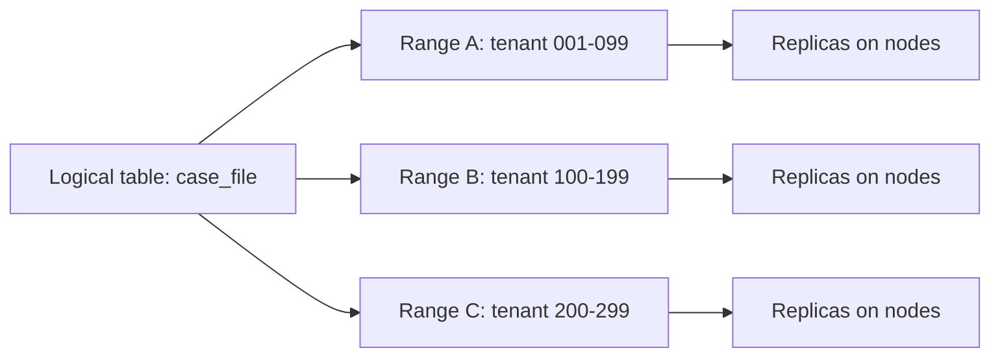

As data grows, ranges can split:

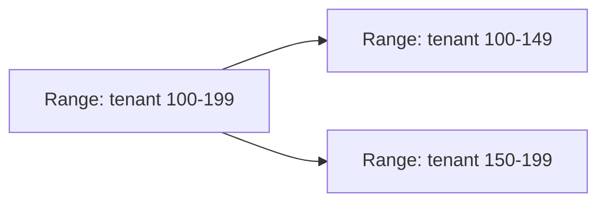

Automatic splitting reduces manual sharding burden, but the architect still owns:

- key design;
- locality design;
- hot tenant behavior;
- query shape;
- index count;
- transaction boundary;
- multi-region placement;
- schema migration risk.

Distributed SQL removes some manual operations. It does not remove architecture.

---

## 6. Consensus replication

Each range/tablet is usually replicated across multiple nodes.

A consensus protocol such as Paxos or Raft is commonly used to ensure replicas agree on the order of writes.

Simplified Raft-like flow:

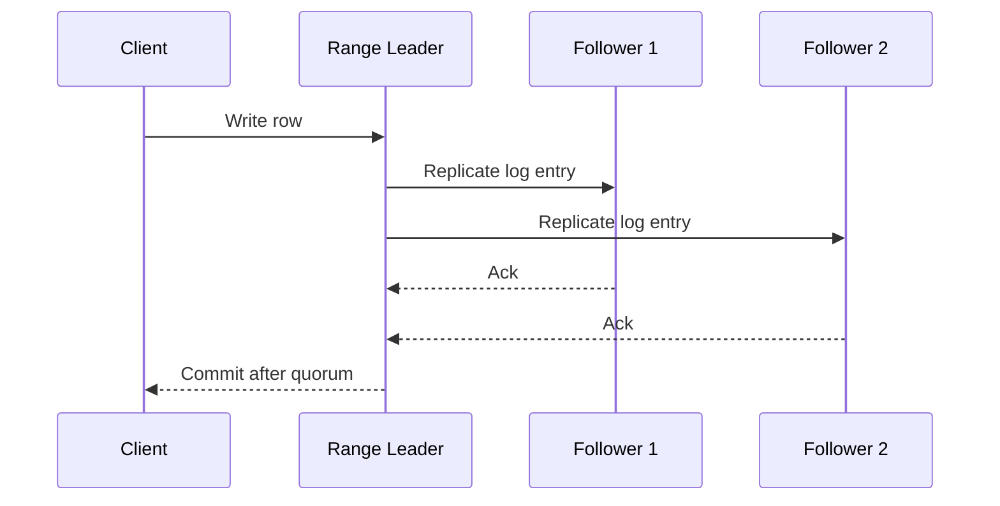

A write usually commits after a quorum acknowledges the log entry. This gives fault tolerance but adds network latency.

Important consequence:

> A distributed SQL write is not “just a disk write”. It is often a consensus operation across replicas, possibly across zones or regions.

---

## 7. Leader, leaseholder, and locality

For a replicated range, one replica often coordinates writes and sometimes consistent reads.

If the leader/leaseholder is near the client, latency is lower.

If it is far away, every operation pays distance.

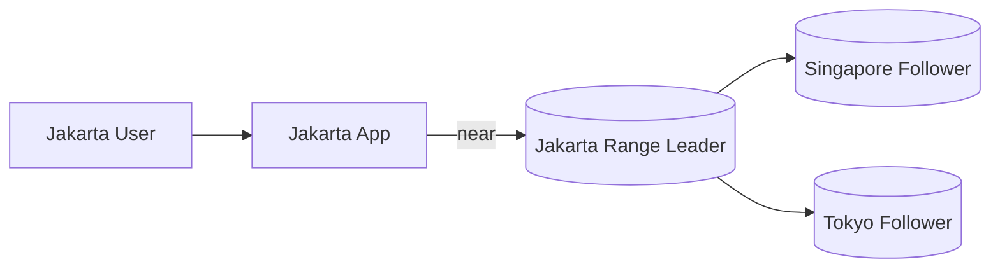

Versus:

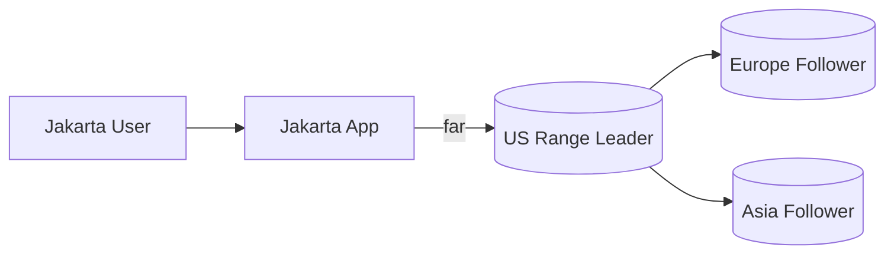

Locality-aware design asks:

- where are users?
- where are writes generated?
- where is data legally allowed to live?
- where should range leaders live?
- can data be partitioned by tenant/region?
- can reads use followers safely?
- which operations require global coordination?

---

## 8. Distributed transactions

A transaction may touch one range or many ranges.

Single-range transaction:

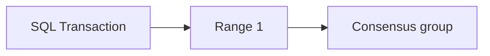

Multi-range transaction:

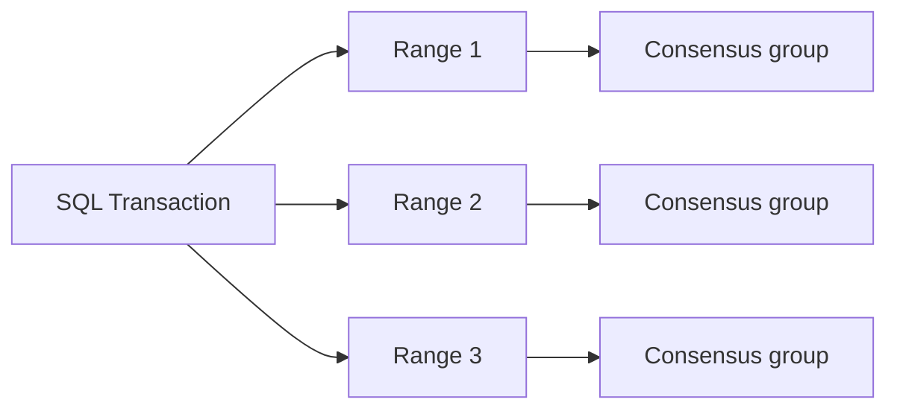

The second case is more expensive because the database must coordinate atomicity and isolation across multiple replicated fragments.

Design implication:

> The cheapest distributed SQL transaction is the one whose hot path stays inside one locality/partition/range as much as possible.

That is why tenant-scoped primary keys and locality-aware schemas matter.

---

## 9. Transaction coordinator

Distributed SQL transactions usually involve a coordinator.

The coordinator tracks:

- transaction timestamp;
- read set/write set;
- lock or intent state;
- participant ranges;
- commit/abort decision;
- retries;
- cleanup of abandoned intents.

Simplified flow:

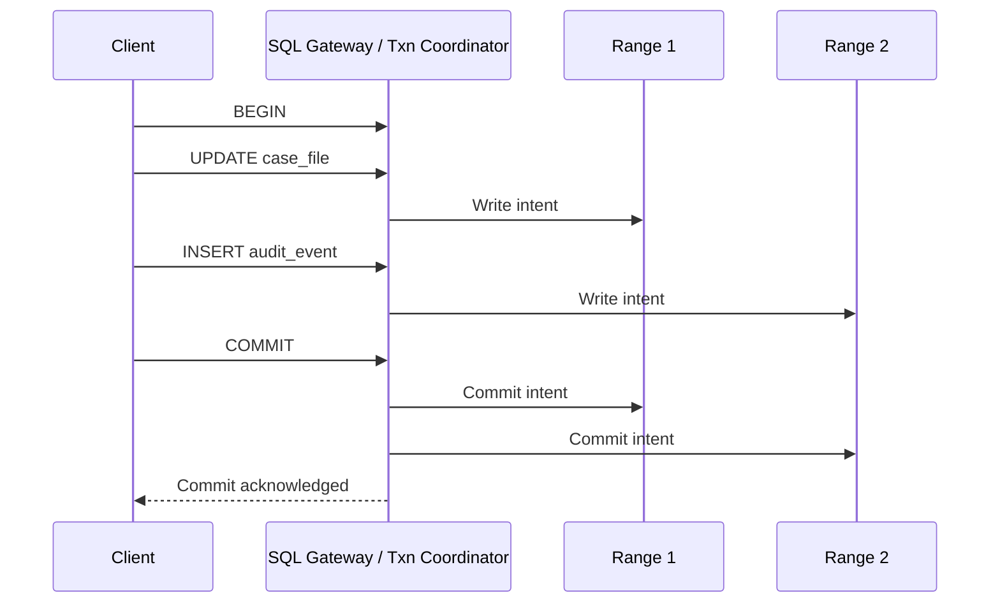

The exact protocol varies by database, but the design lesson is stable:

> More participating ranges means more coordination, more latency, and more failure/retry surface.

---

## 10. Timestamp ordering and external consistency

Some distributed SQL systems use timestamps heavily.

Timestamp may be used for:

- MVCC versioning;
- snapshot reads;
- transaction ordering;
- conflict detection;
- follower/stale reads;
- external consistency;
- garbage collection;
- time travel queries.

Google Spanner is famous for using TrueTime, an API that exposes bounded clock uncertainty, to support externally consistent distributed transactions.

The general principle:

> If transaction order must respect real-world time across nodes, the system needs a way to reason about time uncertainty or coordinate enough to establish order.

Without such mechanisms, clock time alone is not a safe source of truth for distributed transaction ordering.

Application architects should avoid assuming that `created_at` defines authoritative ordering unless the database contract explicitly supports it.

Prefer:

- transaction ID;
- commit timestamp guaranteed by database semantics;
- monotonically increasing per-entity version;
- WAL/LSN/changefeed offset;
- explicit sequence within scoped authority.

---

## 11. Serializable by default does not mean retry-free

Many distributed SQL systems emphasize serializable isolation or strong transaction semantics.

That does not mean every transaction succeeds on the first attempt.

Under contention, systems may return retryable errors such as serialization failures or transaction conflicts.

Application design must include:

- idempotency keys;
- bounded retry;
- retry only safe transaction bodies;
- avoid external side effects inside retryable transaction;
- short transactions;
- stable lock/key ordering;
- hot row mitigation;
- conflict metrics.

Unsafe pattern:

```java
transaction(() -> {
    updateCaseState(caseId);
    sendEmail();        // bad: external side effect inside retryable transaction
    callExternalApi();  // bad: cannot rollback safely
});
```

Safer pattern:

```java
transaction(() -> {
    updateCaseState(caseId);
    insertAuditEvent(caseId);
    insertOutboxEvent(caseId, "CASE_APPROVED");
});

// Worker sends email/API call after durable outbox commit.
```

Distributed SQL strengthens database semantics; it does not remove the need for idempotent application design.

---

## 12. Indexes are distributed objects too

In a distributed SQL database, secondary indexes are often stored separately from the primary table data.

A write to one table may update:

- primary row range;
- unique index range;
- secondary index range;
- inverted/vector/search-like index structure if supported;
- foreign key referenced range;
- changefeed/outbox data.

Example:

```sql
create table case_file (
    tenant_id uuid not null,
    case_id uuid not null,
    status text not null,
    opened_at timestamptz not null,
    assigned_to uuid,
    primary key (tenant_id, case_id)
);

create index idx_case_status_opened
on case_file (tenant_id, status, opened_at desc);
```

A write that changes `status` must update the secondary index. If the secondary index lives in a different range or region, the transaction becomes more distributed.

Design implication:

> Every index is a read optimization and a distributed write participant.

Index discipline matters even more in distributed SQL.

---

## 13. Constraints in distributed SQL

Relational constraints remain powerful:

- primary key;
- unique key;
- foreign key;
- check constraint;
- not null;
- computed/generated column;
- exclusion-like semantics where supported.

But constraints may require distributed coordination.

Global unique constraint example:

```sql
create table user_account (
    id uuid primary key,
    email text not null unique
);
```

Every insert/update of `email` must verify global uniqueness. That may touch a globally distributed unique index.

Tenant-scoped uniqueness example:

```sql
create table user_account (
    tenant_id uuid not null,
    id uuid not null,
    email text not null,
    primary key (tenant_id, id),
    unique (tenant_id, email)
);
```

This can reduce coordination if data is co-located by tenant.

Question for architects:

> Is the invariant global, tenant-scoped, region-scoped, or entity-scoped?

The answer should shape the key and constraint.

---

## 14. Locality-aware schema design

A distributed SQL schema should make common transactions local.

For multi-tenant systems, this often means putting `tenant_id` early in primary keys and indexes.

```sql
create table case_file (
    tenant_id uuid not null,
    case_id uuid not null,
    case_no text not null,
    status text not null,
    primary key (tenant_id, case_id),
    unique (tenant_id, case_no)
);

create table case_task (
    tenant_id uuid not null,
    case_id uuid not null,
    task_id uuid not null,
    status text not null,
    primary key (tenant_id, case_id, task_id),
    foreign key (tenant_id, case_id)
        references case_file (tenant_id, case_id)
);
```

Benefits:

- tenant-local queries scan contiguous keyspace;
- FK checks can be more local;
- backups/exports may be easier by tenant;
- hot tenant can be identified;
- transaction participants may be reduced.

Tradeoffs:

- global query by `case_id` alone needs another index;
- tenant_id must be present in most queries;
- large tenants can still become hot;
- cross-tenant reporting needs projection/warehouse.

---

## 15. Interleaving and co-location

Some distributed SQL databases provide mechanisms to co-locate related child rows with parent rows or to influence placement.

The general pattern:

```txt
Tenant
  Case
    Task
    Evidence
    AuditEvent
```

If common transactions touch parent and child together, co-location improves performance.

But over-co-location can create large hot ranges.

Architectural balance:

- co-locate data that is frequently transacted together;
- split data that grows without bound;
- avoid putting massive event logs inside hot parent keyspace if it creates write hotspots;
- consider time bucketing for append-heavy child tables.

Example:

```sql
-- Good for tenant/case-local lookup.
primary key (tenant_id, case_id, event_id)

-- Better for very high-volume append if one case can be extremely hot.
primary key (tenant_id, case_id, event_bucket, event_id)
```

---

## 16. Hotspots in distributed SQL

Distributed SQL can scale horizontally, but hotspots still exist.

Hotspot sources:

- sequential primary key;
- single global counter;
- single tenant with massive traffic;
- one popular account/case/work queue;
- global secondary index on low-cardinality key;
- timestamp-ordered append into one range;
- unique constraint checked globally;
- foreign key parent row contention;
- materialized aggregate row updated by every transaction.

Mitigations:

| Hotspot | Possible mitigation |
|---|---|
| Sequential key | random/hash-sharded key, sequence cache, bucket prefix |
| Global counter | scoped sequence, preallocated ranges, approximate counter |
| Hot tenant | tenant isolation, dedicated partition/cluster, rate limit |
| Work queue head | partition queue by shard/tenant/priority |
| Low-cardinality index | composite index with tenant/time/id, partial index |
| Hot aggregate | bucketed aggregate, async aggregation, event log |
| FK parent contention | avoid unnecessary parent update, separate invariant row |

Do not assume “distributed” means “no hotspot”. It often means “hotspot can move or be split if your keys allow it”.

---

## 17. Query planning in distributed SQL

Distributed SQL query planners must consider extra dimensions:

- which ranges contain the data;
- which nodes own leaders/leases;
- whether computation can be pushed down;
- whether data must be shuffled;
- whether join inputs are co-located;
- cross-region network cost;
- distributed sort/merge cost;
- stale/follower read eligibility;
- transaction timestamp and uncertainty;
- index locality.

Example: tenant-local query.

```sql
select *
from case_task
where tenant_id = $1
  and case_id = $2
order by created_at desc
limit 20;
```

This can be efficient if the primary/index key is tenant/case-local.

Global query:

```sql
select *
from case_task
where status = 'OVERDUE'
order by created_at desc
limit 100;
```

This may fan out across many ranges/regions unless there is a carefully designed index or projection.

Architectural principle:

> Distributed SQL rewards locality-aware query shapes and punishes accidental global scans.

---

## 18. Joins in distributed SQL

SQL joins still work, but their cost depends on data placement.

Fast-ish join:

```sql
select c.case_no, t.task_id, t.status
from case_file c
join case_task t
  on t.tenant_id = c.tenant_id
 and t.case_id = c.case_id
where c.tenant_id = $1
  and c.case_id = $2;
```

This is tenant/case-scoped and likely local.

Expensive join:

```sql
select c.case_no, u.email, t.status
from case_task t
join case_file c on c.case_id = t.case_id
join user_account u on u.id = t.assigned_to
where t.status = 'OVERDUE';
```

Problems:

- missing tenant key in join;
- broad filter by low-cardinality status;
- possible fan-out across partitions;
- user table may be differently distributed;
- result requires network shuffle.

Distributed SQL does not excuse sloppy relational design. It makes placement mistakes more expensive.

---

## 19. Follower reads and stale reads

Some distributed SQL systems support follower reads or bounded-stale reads from nearby replicas.

Use cases:

- dashboards;
- historical lookup;
- catalog display;
- reporting preview;
- read-only pages;
- human browse screens.

Avoid for:

- authorization-sensitive command guard;
- state transition validation;
- uniqueness check;
- financial balance decision;
- work queue claim;
- immediate read-after-write unless session/freshness is guaranteed.

Design pattern:

```md
Read policy for Case Detail:
- Case state header: authoritative read.
- Timeline projection: follower read allowed with watermark.
- Related documents list: bounded stale up to 30 seconds.
- Action buttons: based on authoritative state and permissions only.
```

This avoids paying strong consistency everywhere while protecting command correctness.

---

## 20. Multi-region topology patterns

### Pattern A: Regional primary, global replicas

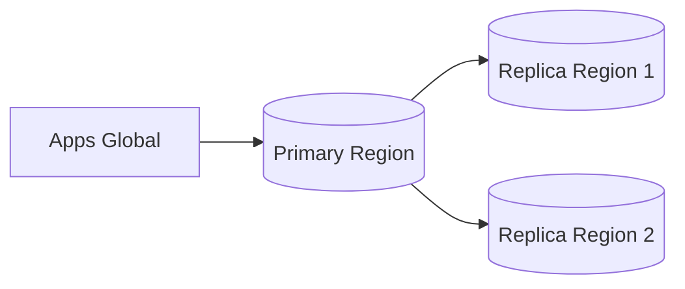

Good for:

- simpler consistency;
- central authority;
- moderate global reads;
- regulatory systems with one legal authority.

Weakness:

- remote write latency;
- primary region dependency.

### Pattern B: Partitioned authority by region/tenant

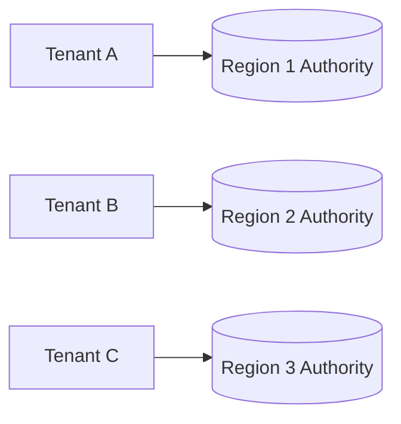

Good for:

- tenant/regional locality;
- scoped compliance;
- lower write latency;
- smaller coordination scope.

Weakness:

- tenant migration complexity;
- cross-tenant reporting complexity;
- global workflow complexity.

### Pattern C: Global strongly consistent database

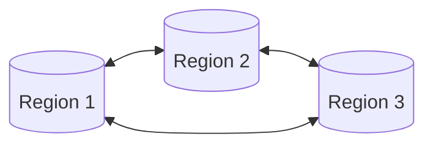

Good for:

- globally consistent truth;
- strong failover story;
- distributed operational model.

Weakness:

- coordination latency;
- cost;
- topology complexity;
- schema/query locality discipline required.

---

## 21. Data residency and locality constraints

Distributed SQL architecture is not only technical. It often intersects with legal and compliance boundaries.

Questions:

- Can tenant data leave a country/region?
- Can backups leave a region?
- Can replicas contain PII in another jurisdiction?
- Can derived indexes contain sensitive values?
- Can support/admin query across regions?
- Is metadata global while payload is regional?
- Are audit records co-located with source records?
- Does failover violate residency requirements?

Possible model:

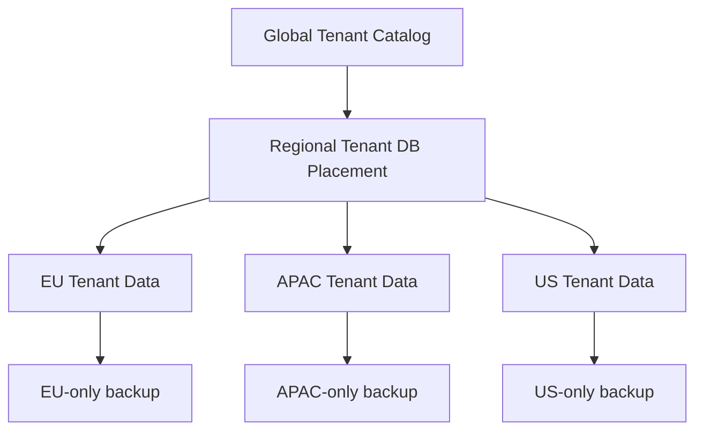

A distributed SQL product may offer placement controls, but the architect must define the residency policy and test it.

---

## 22. Schema migration in distributed SQL

Schema migration becomes harder when data is distributed.

Risks:

- long-running backfill across ranges;
- index backfill consuming cluster resources;
- schema change propagation delay;
- old and new app versions running together;
- cross-region metadata agreement;
- unique index validation across large dataset;
- transaction conflicts during migration;
- rollback limitations.

Safe approach:

1. Add nullable column or compatible structure.
2. Deploy app writing both old/new if needed.
3. Backfill in bounded chunks.
4. Validate counts/checksums/invariants.
5. Add constraints after data is valid.
6. Switch reads.
7. Remove old structure after stability window.

Distributed SQL does not remove expand-contract. It makes expand-contract more important.

---

## 23. Changefeeds and CDC

Distributed SQL systems often support changefeeds/change streams.

CDC is useful for:

- search projection;
- warehouse ingestion;
- cache invalidation;
- event-driven integration;
- audit export;
- materialized read model;
- replication into specialized stores.

But CDC has ordering and locality implications:

- ordering may be per range/partition, not global;
- downstream must handle duplicates;
- downstream must handle reordering;
- schema evolution must be compatible;
- backpressure can accumulate;
- changefeed lag must be observable;
- exactly-once delivery is usually an application-level illusion; idempotency is still needed.

Pattern:

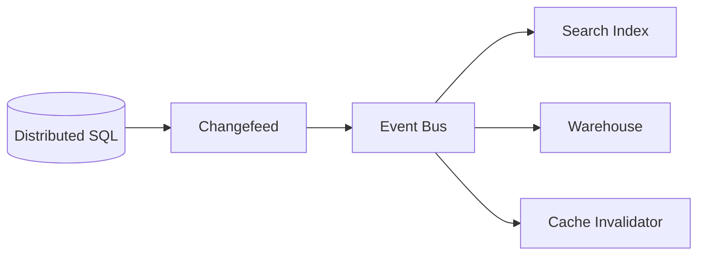

Critical command correctness should not depend on a projection being current unless the freshness contract is enforced.

---

## 24. Operational observability

Distributed SQL observability must include both SQL and distributed-systems signals.

SQL/database signals:

- query latency;
- execution plan;
- slow statements;
- lock/conflict rate;
- transaction retries;
- rows scanned vs returned;
- index usage;
- table/index size;
- connection pool saturation.

Distributed signals:

- range/tablet count;
- range size distribution;
- leader/leaseholder distribution;
- replication health;
- quorum health;
- node liveness;
- region latency;
- clock uncertainty/time sync if relevant;
- rebalancing activity;
- hot ranges;
- changefeed lag;
- storage compaction pressure.

Architecture reviews should require observability for both layers.

---

## 25. Failure modes

| Failure mode | Symptom | Architectural response |
|---|---|---|
| Hot range | High latency on subset of keys | Key redesign, split, bucket, isolate tenant |
| Cross-region transaction explosion | P99 latency high | Co-locate data, reduce participants, redesign workflow |
| Retry storm | Serialization failures + client retries | Backoff, idempotency, reduce contention, shorter transactions |
| Stale follower read misuse | User sees invalid command option | Route command guards to authoritative read |
| Global secondary index bottleneck | Writes slow after new index | Reconsider index, scope key, partial index, projection |
| Region leader imbalance | Users pay remote latency | Locality/leaseholder placement policy |
| Schema backfill overload | Cluster degraded during migration | Throttle, chunk, pause/resume, monitor |
| Changefeed lag | Search/report stale | Freshness labels, lag alert, replay-safe consumer |
| Quorum loss | Writes unavailable | Degraded mode, failover runbook, placement review |
| Data residency violation | Compliance incident | Placement policy, audit, test queries, backup boundary |

---

## 26. When distributed SQL is a strong fit

Distributed SQL is a strong candidate when you need several of these together:

- relational schema and SQL;
- strong transactions;
- horizontal scale;
- high availability across nodes/zones/regions;
- automatic shard/range management;
- online rebalancing;
- multi-region reads/writes;
- operational simplicity compared to manual sharding;
- global or tenant-distributed SaaS;
- strong consistency with distributed resilience.

Example good fit:

> A multi-tenant SaaS platform where tenants can be placed near their region, data must be relational, many workflows require strong transactional updates, and manual sharding would create unacceptable operational burden.

---

## 27. When distributed SQL may be the wrong tool

Distributed SQL may be overkill or poor fit when:

- a single-region PostgreSQL system easily meets scale and availability needs;
- workload is mostly analytical scanning;
- workload is extremely write-heavy append-only with simple key lookup;
- application cannot handle retries;
- team cannot operate distributed systems complexity;
- low-latency global writes are expected without relaxing consistency;
- schema/query patterns are highly global and unscoped;
- cost sensitivity is high;
- product needs specialized search/vector/graph behavior as primary access path.

Do not choose distributed SQL because it sounds modern.

Choose it because its guarantees and operational model match the workload.

---

## 28. Design review checklist

For any distributed SQL proposal, review:

### Workload

- What are the top 20 queries/commands?
- Which are tenant-local/entity-local?
- Which require global scan?
- Which require strong consistency?
- Which can be stale?

### Keys and locality

- What is the primary key strategy?
- Does it create sequential hotspots?
- Are common transactions co-located?
- Are uniqueness constraints scoped correctly?
- Are indexes locality-aware?

### Transactions

- How many ranges/regions do hot transactions touch?
- Are retries safe?
- Are external side effects outside transaction?
- Are idempotency keys used?
- What is the conflict rate target?

### Multi-region

- Where are leaders/leaseholders?
- What is the write latency budget?
- What happens on region failure?
- Is data residency respected?
- Are follower/stale reads used safely?

### Operations

- How are hot ranges detected?
- How are migrations throttled?
- How is changefeed lag monitored?
- What is the backup/restore model?
- What is the failover runbook?
- What is the degraded mode?

---

## 29. Mini case: regulatory case platform on distributed SQL

Assume a regulatory case platform with tenants in multiple jurisdictions.

Core entities:

- tenant;
- case;
- task;
- assignment;
- evidence;
- decision;
- audit event.

Design direction:

```sql
create table case_file (
    tenant_id uuid not null,
    case_id uuid not null,
    case_no text not null,
    jurisdiction_code text not null,
    status text not null,
    version bigint not null,
    opened_at timestamptz not null,
    primary key (tenant_id, case_id),
    unique (tenant_id, case_no)
);

create table case_transition (
    tenant_id uuid not null,
    case_id uuid not null,
    transition_id uuid not null,
    from_status text not null,
    to_status text not null,
    actor_id uuid not null,
    occurred_at timestamptz not null,
    primary key (tenant_id, case_id, transition_id)
);

create table audit_event (
    tenant_id uuid not null,
    case_id uuid not null,
    event_id uuid not null,
    event_type text not null,
    actor_id uuid,
    payload_json jsonb not null,
    occurred_at timestamptz not null,
    primary key (tenant_id, case_id, event_id)
);
```

Why this shape:

- tenant first supports locality and isolation;
- case_id keeps case-local data near each other;
- tenant-scoped uniqueness avoids global coordination for case number;
- transition/audit are append-only and case-local;
- reporting/search should be projected out instead of global-scanning transactional tables;
- final decision transaction should update case state, insert decision/audit/outbox atomically.

Potential issue:

- very large tenants may become hotspots;
- massive audit append for one case may need bucketing;
- cross-tenant analytics should not run on OLTP path;
- global admin search needs separate projection/index.

---

## 30. Final mental model

Distributed SQL gives you relational power on top of distributed machinery.

But every SQL design choice now has distributed consequences:

- primary key shapes locality;
- index shapes write amplification and routing;
- transaction scope shapes coordination;
- region placement shapes latency;
- stale reads shape product correctness;
- retries shape application design;
- schema migration shapes cluster risk;
- changefeeds shape projection consistency;
- backup/restore shape compliance and resilience.

The top 1% mindset is:

> Do not ask whether the database “supports SQL at scale”. Ask which operations remain local, which operations coordinate, which guarantees are paid for, which failures degrade safely, and which invariants remain protected under stress.

---

## 31. References

- Google Cloud Spanner Documentation, **TrueTime and external consistency**.
- Google Cloud Spanner Documentation, **Life of Spanner Reads & Writes**.
- Google Research, **Spanner: Google’s Globally-Distributed Database**.
- CockroachDB Documentation, **Architecture Overview**.
- CockroachDB Documentation, **Life of a Distributed Transaction**.
- CockroachDB Documentation, **Storage Layer**.
- PostgreSQL Documentation, **Partitioning**, **Indexes**, and **High Availability**.
