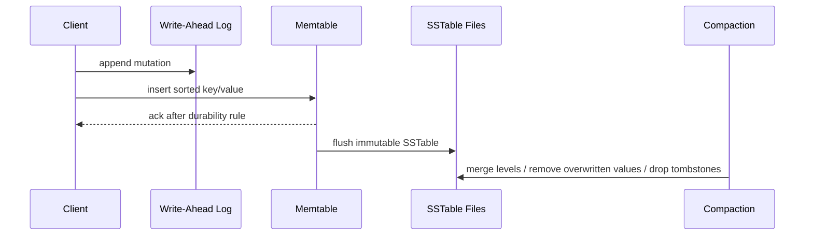
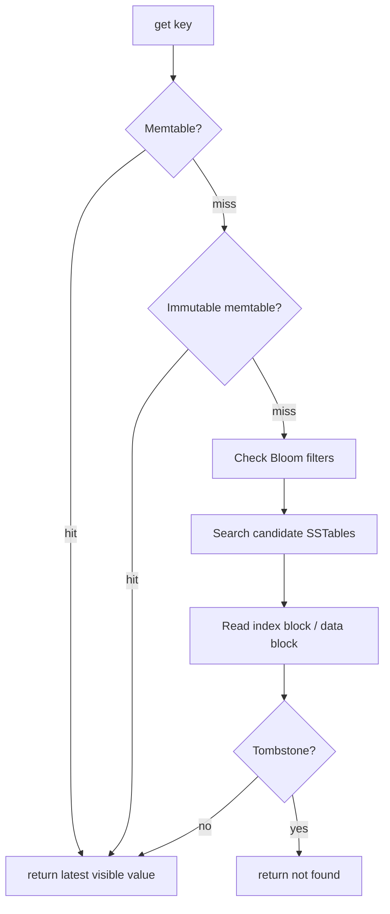
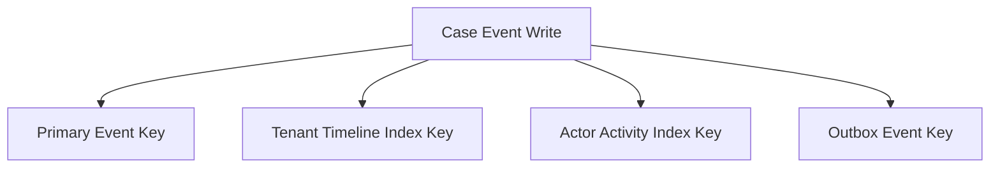
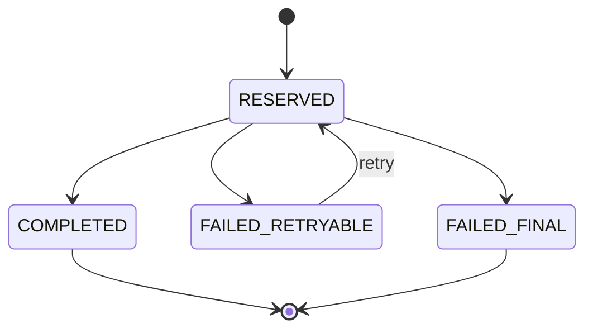

# Part 039 — Key-Value and LSM Database Design

A key-value database looks simple from the outside:

```txt
put(key, value)
get(key)
delete(key)
scan(start_key, end_key)
```

That simplicity is deceptive.

At scale, a key-value design is not just “store JSON by ID”. It is a design discipline about:

- key shape;
- access path;
- sort order;
- write amplification;
- read amplification;
- space amplification;
- compaction;
- tombstones;
- hot keys;
- range scans;
- secondary-index simulation;
- consistency boundaries;
- operational predictability.

A top-tier database architect does not choose a key-value or LSM-backed system because it sounds scalable. They choose it when the workload naturally fits a small number of predictable access paths and when the team can own the consequences of modelling data directly around those access paths.

---

## 1. The core mental model

A relational database says:

> Tell me the logical relationships. I will use indexes, statistics, joins, and a planner to discover an execution path.

A key-value database says:

> Tell me the exact key or key range. I will make that access path extremely efficient.

That changes the responsibility boundary.

In relational design, the database planner has more responsibility. In key-value design, the application and schema designer have more responsibility.


The design sequence is not:

```txt
entity -> table -> query
```

It is:

```txt
operation -> access pattern -> key -> value envelope -> consistency rule -> operational guardrail
```

---

## 2. What key-value databases are good at

Key-value databases are excellent when:

- reads are mostly by primary key;
- range scans are predictable;
- writes are high volume;
- schema is controlled by the application;
- low-latency access matters;
- joins are not required at read time;
- derived projections can be rebuilt;
- denormalization is intentional;
- the domain can tolerate application-owned relationships;
- operational simplicity per access path is more important than ad-hoc query flexibility.

Typical fits:

| Workload | Why KV/LSM fits |
|---|---|
| Session store | Direct lookup by session ID |
| Idempotency store | Lookup by idempotency key, TTL expiry |
| Event inbox/dedup | Exact key or time-window scan |
| Materialized read model | Precomputed projection by query key |
| Time-series bucket | Range scan by tenant + time bucket |
| Feature store online serving | Lookup by entity + feature namespace |
| User preference store | Keyed by user/account |
| Cache with durability | Direct key access, TTL/tombstone semantics |
| Metadata catalog | Small values, exact lookup, versioned update |
| Distributed database storage layer | Ordered KV under SQL/document/graph layer |

Bad fits:

- broad ad-hoc analytics;
- complex joins;
- relationship-heavy graph traversal;
- query patterns not known ahead of time;
- strong cross-entity constraints everywhere;
- many secondary access paths with high write rate;
- regulatory reporting that needs arbitrary slicing unless projected separately;
- teams unwilling to own data duplication and repair.

---

## 3. The LSM storage engine mental model

Many modern write-heavy key-value stores use a Log-Structured Merge Tree design.

The high-level idea:

> Make writes sequential and cheap first. Pay the cost later through background compaction.

A simplified write path:



Core components:

| Component | Role |
|---|---|
| WAL | Durable append log used for crash recovery |
| Memtable | In-memory sorted structure for recent writes |
| Immutable memtable | Frozen memtable waiting for flush |
| SSTable | Immutable sorted string table on disk |
| Manifest/metadata | Tracks files, levels, sequence numbers |
| Bloom filter | Avoids unnecessary disk reads for missing keys |
| Block cache | Caches recently read blocks |
| Compaction | Merges SSTables, removes obsolete versions, controls file layout |
| Tombstone | Delete marker that must live long enough to suppress older values |

The key insight:

> An LSM does not update data in place. It appends newer facts about keys, then later compacts the history.

That is why LSM systems can have high write throughput, but also why compaction debt, tombstone accumulation, and amplification matter.

---

## 4. Write path in detail

A typical `put(k, v)` does not go directly to a random disk page.

It usually follows this path:

```txt
1. Validate request.
2. Assign sequence/version/timestamp.
3. Append mutation to WAL.
4. Add mutation to memtable.
5. Acknowledge based on durability settings.
6. Later: flush memtable to SSTable.
7. Later: compact SSTables across levels.
```

This means foreground writes are usually cheap because they are append-heavy.

But the cost is not gone. It is deferred.

Deferred cost appears as:

- compaction CPU;
- background disk I/O;
- write stalls when flush/compaction cannot keep up;
- extra space from old versions;
- extra reads across multiple SSTables;
- tombstone scanning;
- backup/restore size growth;
- uneven latency during compaction pressure.

A mature architect asks:

> Where will this write debt be paid, and what happens when debt accumulates faster than compaction can repay it?

---

## 5. Read path in detail

A `get(k)` usually checks multiple places:



A range scan is more complex because it may need to merge sorted streams from many memtables and SSTables.

```txt
scan(user#123#events#2026-07-01, user#123#events#2026-07-31)
```

The scan may be logically simple, but physically it can touch many files if compaction layout is poor or if the key range crosses many levels/partitions.

This is why key design and compaction behavior are inseparable.

---

## 6. The three amplification tradeoff

LSM design is dominated by three forms of amplification.

| Amplification | Meaning | Common cause |
|---|---|---|
| Write amplification | Bytes written internally per byte written by user | Compaction rewrites data multiple times |
| Read amplification | Number of structures/files checked per logical read | Many SSTables, poor Bloom filters, wide range scans |
| Space amplification | Extra disk usage beyond live data | Old versions, tombstones, compaction lag |

You rarely minimize all three at once.

A write-optimized setting may increase read or space amplification. A read-optimized setting may increase compaction work. A low-space setting may increase write pressure.

The architect’s job is not to ask, “Is LSM fast?”

The real question is:

> Which amplification can this workload afford?

Examples:

| Workload | Usually acceptable | Usually dangerous |
|---|---|---|
| Ingest pipeline | Some read amplification | Write stalls |
| Online lookup | Some write amplification | Read amplification and tail latency |
| TTL-heavy dedup store | Space amplification temporarily | Tombstone storms |
| Time-window event store | Write amplification if predictable | Random secondary access |
| Feature serving | Storage cost | P99 read latency |

---

## 7. Key design is physical design

In a key-value system, the key is not just an identifier.

It controls:

- lookup path;
- sort order;
- range locality;
- partition distribution;
- hotspot risk;
- data retention boundary;
- sharding strategy;
- backup/restore granularity;
- tenant isolation;
- compaction locality;
- observability grouping.

A weak key shape destroys the system.

A strong key shape encodes the most important access path directly.

---

## 8. Key namespace design

A production KV system should use explicit namespaces.

```txt
<domain>#<entity>#<id>
<tenant>#<domain>#<entity>#<id>
<tenant>#case#<case_id>#event#<event_time>#<event_id>
<tenant>#idem#<operation>#<idempotency_key>
<tenant>#task_due#<bucket>#<due_at>#<task_id>
```

Do not rely on accidental string prefixes. Define a key grammar.

Example key grammar:

```txt
case current:
  t/<tenant_id>/case/<case_id>/current

case event:
  t/<tenant_id>/case/<case_id>/event/<occurred_at>/<event_id>

idempotency:
  t/<tenant_id>/idem/<command_type>/<idempotency_key>

task due index:
  t/<tenant_id>/idx/task_due/<yyyy_mm_dd>/<due_at>/<task_id>
```

A good key grammar should answer:

- Is the key globally unique?
- Is it tenant-scoped?
- Does it support range scan?
- Does it preserve useful ordering?
- Does it avoid hot prefixes?
- Does it support retention deletion?
- Can operators understand it during an incident?
- Can metrics group by namespace?

---

## 9. Composite key ordering

Composite key order matters.

```txt
tenant_id + case_id + event_time
```

optimizes:

```txt
all events for one case in time order
```

But it does not optimize:

```txt
all events for one tenant in a time range across all cases
```

For that, you need a different key:

```txt
tenant_id + event_date_bucket + event_time + case_id + event_id
```

This is the KV equivalent of index design.

In relational systems, you might add another index.

In KV systems, you often add another materialized keyspace.



Every extra keyspace is a write amplification and consistency responsibility.

---

## 10. The value envelope

The value should not be an ungoverned blob.

A production value often needs an envelope:

```json
{
  "schemaVersion": 3,
  "entityType": "case.current",
  "tenantId": "t_123",
  "entityId": "case_456",
  "version": 17,
  "updatedAt": "2026-07-05T10:15:30Z",
  "updatedBy": "user_789",
  "traceId": "trace_abc",
  "payload": {
    "status": "UNDER_REVIEW",
    "priority": "HIGH",
    "assignedTeamId": "team_enforcement"
  }
}
```

Envelope fields are not decoration. They support:

- optimistic concurrency;
- schema evolution;
- repair jobs;
- replay;
- audit reconstruction;
- debugging;
- migration safety;
- compatibility;
- data validation;
- ownership checks.

The minimum envelope for serious systems:

| Field | Purpose |
|---|---|
| `schemaVersion` | Migration and compatibility |
| `entityType` | Type-safe decoding |
| `version` | Optimistic concurrency |
| `updatedAt` | Debugging and ordering hint |
| `traceId` / `commandId` | Causal traceability |
| `tenantId` | Isolation verification |
| `payload` | Domain data |

---

## 11. The danger of “schemaless” thinking

Key-value systems are not schema-free.

They are database-schema-light and application-schema-heavy.

The schema still exists in:

- key grammar;
- value envelope;
- serialization format;
- application decoder;
- migration code;
- secondary index keyspaces;
- compaction/TTL rules;
- observability dashboards;
- repair jobs;
- compatibility tests.

The difference is that the database may not enforce many of these rules for you.

That means you need stronger engineering discipline, not less.

---

## 12. Atomicity and conditional writes

A KV database may support some form of conditional write:

```txt
put key=value if key does not exist
put key=value if version == expected_version
delete key if version == expected_version
```

These primitives enable important patterns.

### 12.1 Create-if-absent

Used for idempotency and uniqueness:

```txt
PUT t/123/idem/create_case/abc123 = result_pointer
IF NOT EXISTS
```

If the write succeeds, this command owns the idempotency key.

If it fails, the system loads the existing result and returns the prior outcome.

### 12.2 Compare-and-swap update

Used for optimistic concurrency:

```txt
GET t/123/case/456/current -> version 17
PUT updated_value IF version == 17
```

If another writer updated the same key first, the CAS fails.

The application must retry, reject, or merge.

### 12.3 Lease acquisition

Used for work claiming:

```txt
PUT worker_lease IF missing OR lease_expired
```

Lease design must include:

- owner ID;
- expiry time;
- fencing token;
- renewal rule;
- clock-skew tolerance;
- stuck lease recovery;
- idempotent worker execution.

---

## 13. Modelling secondary access paths

Key-value databases do not naturally give you arbitrary secondary indexes.

You model them explicitly.

Example: task lookup by ID and lookup by due time.

Primary key:

```txt
t/<tenant>/task/<task_id>
```

Secondary index key:

```txt
t/<tenant>/idx/task_due/<date_bucket>/<due_at>/<task_id>
```

Write path:

```txt
1. Write primary task value.
2. Write due-date index key.
3. If due date changes, delete old index key.
4. If partial failure is possible, repair via reconciliation job or transaction if supported.
```

This is denormalization.

It must have a contract:

| Question | Required answer |
|---|---|
| What is the source of truth? | Usually primary keyspace |
| What is derived? | Index keyspace/projection |
| Can derived data lag? | Define freshness contract |
| How is drift detected? | Reconciliation scan/checksum |
| How is drift repaired? | Rebuild index from source |
| What happens on partial write? | Outbox, transaction, retry, repair |

---

## 14. Range-scan design

A key-value database with sorted keys can be powerful for range scans.

But only if the key order matches the query.

Good range scan:

```txt
List case events for one case between T1 and T2:

t/<tenant>/case/<case_id>/event/<time>/<event_id>
```

Poor range scan:

```txt
List all overdue tasks by due time:

t/<tenant>/task/<task_id>
```

There is no useful due-time ordering. You need an index keyspace:

```txt
t/<tenant>/idx/task_due/<date_bucket>/<due_at>/<task_id>
```

Range-scan design checklist:

- What is the exact start key?
- What is the exact end key?
- Is the range bounded?
- How many keys can it return?
- Is there a limit/page token?
- Is the sort order correct?
- Does the scan cross tenants?
- Does it cross hot partitions?
- Can it be resumed safely?
- Can deleted/tombstoned keys dominate the scan?
- What is the P99 target?

---

## 15. Hot key and hot prefix design

A hot key is a single key receiving too much traffic.

Examples:

```txt
global_counter
tenant/large_tenant/current_stats
task_queue/default_head
feature_flags/global
```

A hot prefix is a key range that concentrates too much traffic on one physical partition.

Examples:

```txt
t/<tenant>/event/<monotonic_timestamp>
t/<tenant>/idx/task_due/2026-07-05/...
```

Mitigation patterns:

| Problem | Pattern |
|---|---|
| Hot counter | Sharded counter/bucketed counter |
| Monotonic timestamp hotspot | Add bucket/hash prefix if ordering can be reconstructed |
| Large tenant hotspot | Tenant split/cell routing |
| Queue head contention | Partitioned queues, leases, claim tokens |
| Global config hot read | Cache with versioned invalidation |
| Sequential IDs | Randomized or time-sortable IDs with shard component |

Example bucketed counter:

```txt
t/<tenant>/counter/open_cases/bucket/00
...
t/<tenant>/counter/open_cases/bucket/63
```

Writes spread across buckets. Reads aggregate buckets.

Tradeoff:

- better write scalability;
- slightly more expensive reads;
- possible eventual consistency;
- more complex repair.

---

## 16. TTL and tombstones

Deletes in LSM-backed systems often create tombstones.

A tombstone says:

> This key is deleted, and older versions must not be returned.

Tombstones are necessary, but dangerous when poorly managed.

Tombstone-heavy workloads occur with:

- TTL expiration;
- frequent updates to same key;
- high churn dedup stores;
- queue claim/delete patterns;
- soft-delete-like behaviour;
- broad range deletes;
- high-cardinality temporary keys.

Failure modes:

- range scans become slow because they scan deleted markers;
- compaction cannot drop tombstones yet;
- disk usage remains high after deletes;
- read latency spikes;
- replica/cdc consumers must process delete markers;
- backup size includes compaction debt.

TTL design checklist:

- Is TTL part of correctness or cost control?
- Does expired data need audit history?
- Is the delete physically immediate or compaction-dependent?
- Can expired tombstones accumulate faster than compaction?
- Are range scans bounded away from tombstone-heavy areas?
- Is there monitoring for tombstone ratio/compaction debt?
- Can retention be implemented by dropping whole partitions/key ranges instead?

For high-volume retention, prefer key designs that allow coarse deletion:

```txt
t/<tenant>/dedup/<yyyy_mm_dd>/<key>
```

This supports bucket-level lifecycle management.

---

## 17. Event log pattern

KV + ordered keyspace works well for append-style event logs.

Example:

```txt
t/<tenant>/case/<case_id>/event/<occurred_at>/<event_id>
```

Value:

```json
{
  "schemaVersion": 2,
  "eventType": "CASE_ASSIGNED",
  "caseId": "case_456",
  "occurredAt": "2026-07-05T12:00:00Z",
  "actorId": "user_789",
  "payload": {
    "assignedTeamId": "team_enforcement"
  }
}
```

Use this pattern when:

- append order matters;
- history is important;
- reads are by entity timeline;
- old data can be archived by time bucket;
- projections can be rebuilt.

Do not confuse it with a full event-sourcing architecture unless you also define:

- replay semantics;
- snapshot rules;
- versioning;
- idempotency;
- compaction/archive;
- projection repair;
- command validation;
- temporal query contract.

---

## 18. Current-state + history pattern

A common production pattern uses two keyspaces:

```txt
t/<tenant>/case/<case_id>/current
t/<tenant>/case/<case_id>/event/<time>/<event_id>
```

Write path:

```txt
1. Validate command against current state.
2. Append event.
3. Update current state using compare-and-swap.
4. Emit outbox event or projection update.
```

Potential problem:

> What happens if event append succeeds but current-state update fails?

Solutions:

- use a database transaction if supported;
- make event append conditional on expected state version;
- store current state and event in same atomic batch if same partition/key group;
- use command table as source of truth and derive both;
- run reconciliation to rebuild current state from event log;
- make writes idempotent with command ID.

The right answer depends on the database’s atomicity model.

---

## 19. Idempotency store pattern

KV systems are excellent for idempotency.

Key:

```txt
t/<tenant>/idem/<command_type>/<idempotency_key>
```

Value:

```json
{
  "status": "COMPLETED",
  "commandHash": "sha256:...",
  "resultType": "CASE_CREATED",
  "resultRef": "case_456",
  "createdAt": "2026-07-05T12:00:00Z",
  "expiresAt": "2026-07-12T12:00:00Z"
}
```

Rules:

- create idempotency record with create-if-absent;
- store command hash to reject same key with different payload;
- store final result pointer;
- use TTL only after retry window is safely over;
- handle `IN_PROGRESS` state;
- handle crashed command after idempotency reservation;
- keep result deterministic.

State machine:



---

## 20. Queue and work-claim pattern

A KV system can implement work queues, but the details matter.

Naive queue key:

```txt
queue/default/<created_at>/<task_id>
```

Worker scans and deletes.

Problems:

- head-of-line contention;
- duplicate processing;
- tombstone-heavy deletes;
- stuck work after worker crash;
- poor fairness;
- hot prefix;
- lack of visibility timeout.

Safer pattern:

```txt
queue/<bucket>/<available_at>/<task_id>
lease/<task_id>
task/<task_id>
```

Claim process:

```txt
1. Scan bounded queue bucket.
2. Try create lease if absent/expired.
3. Process task idempotently.
4. Mark task completed.
5. Delete queue index or move to done keyspace.
```

For high-criticality queues, a purpose-built queue/log system is often better. KV queue design is acceptable only when the failure semantics are explicitly understood.

---

## 21. Value size and large payloads

Key-value databases are not an excuse to put arbitrarily large blobs everywhere.

Large values cause:

- cache inefficiency;
- read amplification;
- network overhead;
- compaction pressure;
- backup size growth;
- poor partial update behavior;
- high tail latency;
- expensive replication.

Guideline:

- store small operational state inline;
- store large documents/blobs in object storage;
- store pointer + checksum + metadata in KV;
- version large payloads explicitly;
- avoid rewriting megabyte values for small field changes.

Example pointer value:

```json
{
  "schemaVersion": 1,
  "documentId": "doc_123",
  "storageUri": "s3://case-evidence/t123/doc_123/v4",
  "sha256": "...",
  "sizeBytes": 5242880,
  "contentType": "application/pdf",
  "createdAt": "2026-07-05T12:00:00Z"
}
```

---

## 22. Consistency model questions

Before choosing KV, answer:

- Is a single key update atomic?
- Is a batch across keys atomic?
- Is a conditional write available?
- Is a range scan snapshot-consistent?
- Are reads linearizable, quorum-based, or eventually consistent?
- Can stale reads return deleted values?
- What is the retry contract after timeout?
- What happens if commit succeeds but client sees an error?
- Is there per-key ordering?
- Is there cross-key ordering?
- Are secondary index updates transactional with primary writes?

Application correctness depends on these answers.

Do not design invariants assuming relational semantics if the KV database does not provide them.

---

## 23. Transaction boundary in KV systems

Some KV systems support only per-key atomicity.

Some support atomic batches within a partition.

Some support distributed transactions.

The modelling consequences are huge.

| Atomicity available | Design consequence |
|---|---|
| Per-key only | Put invariant-critical state in one value or use CAS/compensation |
| Same-partition batch | Co-locate keys that must update together |
| Cross-key transaction | More relational-like but still watch latency/contention |
| Eventually consistent secondary indexes | Build drift detection/repair |

Design rule:

> Put the invariant where the atomicity is.

If your invariant spans multiple keys but the database only guarantees per-key atomicity, the invariant is not actually protected by the database.

---

## 24. Encoding relationships

KV systems do not enforce foreign keys.

Relationship integrity is application-owned.

Example:

```txt
t/<tenant>/case/<case_id>/current
t/<tenant>/party/<party_id>/current
t/<tenant>/case_party/<case_id>/<party_id>
t/<tenant>/party_case/<party_id>/<case_id>
```

The relationship is duplicated for two access paths.

You need:

- write protocol;
- idempotency;
- delete protocol;
- repair job;
- consistency check;
- ownership rule;
- lifecycle rule.

Example invariant:

> A party cannot be deleted while linked to any open case.

In a relational database, this may be a foreign key plus business logic.

In KV, you need a design:

- maintain reverse index `party_case`;
- check bounded relationship list before delete;
- prevent concurrent link creation during delete using a lock/lease/state;
- emit audit event;
- run periodic orphan detection.

---

## 25. Snapshot, backup, and restore

KV/LSM backup is not just copying files.

Questions:

- Is the snapshot crash-consistent?
- Does it include WAL files?
- Does it include manifest metadata?
- Can it restore to a point in time?
- Can it restore one tenant/key prefix?
- Does it preserve tombstones?
- Can it restore derived keyspaces consistently?
- What happens to TTL data after restore?
- Are secondary indexes restored or rebuilt?
- Is encryption metadata included?
- Can backups be validated by scanning key ranges?

A mature design distinguishes:

- source keyspaces;
- derived keyspaces;
- rebuildable projections;
- external blobs;
- backup metadata;
- restore validation queries.

---

## 26. Observability for LSM/KV systems

Monitor more than CPU and memory.

Important metrics:

| Metric | Why it matters |
|---|---|
| P50/P95/P99 get latency | User-facing lookup health |
| P99 scan latency | Range query health |
| Write latency | Foreground write pressure |
| WAL fsync latency | Durability bottleneck |
| Memtable flush rate | Write buffer pressure |
| Compaction pending bytes | Storage debt |
| Write stalls | Compaction cannot keep up |
| Read amplification | SSTable/level lookup cost |
| Write amplification | Internal rewrite cost |
| Space amplification | Disk overhead |
| Bloom filter hit/miss | Missing-key read efficiency |
| Block cache hit ratio | Read locality |
| Tombstone ratio | Delete/TTL debt |
| Hot key/prefix | Skew and partition imbalance |
| Disk utilization | Capacity and compaction safety |

Incident hint:

> If p99 latency spikes without application change, check compaction backlog, disk saturation, WAL sync latency, cache eviction, tombstone-heavy scans, and hot key distribution.

---

## 27. Operational failure modes

### 27.1 Compaction debt

Symptoms:

- write latency rises;
- write stalls appear;
- disk I/O high;
- disk usage grows;
- read latency rises;
- flush queue backs up.

Causes:

- ingest rate exceeds compaction capacity;
- large values;
- tombstone-heavy workload;
- undersized disks/IOPS;
- bad compaction settings;
- sudden backfill;
- too many secondary projections.

Mitigation:

- throttle writers/backfills;
- add capacity;
- tune compaction;
- split hot keyspace;
- reduce value size;
- batch retention by bucket;
- isolate ingest workload.

### 27.2 Tombstone storm

Symptoms:

- scans slow down;
- disk does not shrink after delete;
- compaction backlog increases;
- read amplification rises.

Mitigation:

- avoid per-key delete for massive retention when range/bucket deletion is possible;
- redesign TTL keyspace;
- schedule deletion windows;
- monitor tombstone density;
- compact cold ranges intentionally if supported.

### 27.3 Hot partition

Symptoms:

- one node/shard saturated;
- global capacity looks fine;
- one tenant or prefix dominates;
- p99 high only for one namespace.

Mitigation:

- bucket hot keyspace;
- split large tenant;
- introduce cell routing;
- shard counters/queues;
- randomize write prefix when ordering is not required.

---

## 28. Design example: enforcement case event projection

Requirement:

- store case event history;
- fetch all events for a case;
- fetch recent tenant activity;
- deduplicate commands;
- update current case state;
- support replay/rebuild;
- avoid cross-tenant leakage.

Keyspaces:

```txt
# source of truth for current state
t/<tenant>/case/<case_id>/current

# case-local event history
t/<tenant>/case/<case_id>/event/<event_time>/<event_id>

# tenant timeline projection
t/<tenant>/idx/activity/<date_bucket>/<event_time>/<case_id>/<event_id>

# idempotency
t/<tenant>/idem/<command_type>/<idempotency_key>

# outbox
t/<tenant>/outbox/<date_bucket>/<sequence>/<event_id>
```

Write protocol:

```txt
1. Reserve idempotency key.
2. Read current case state.
3. Validate transition.
4. Write event with command ID.
5. CAS update current state.
6. Write tenant activity projection.
7. Write outbox event.
8. Mark idempotency completed.
```

If the database cannot atomically update all these keys, the design must classify which keyspace is source and which keyspaces are repairable.

Source of truth:

- current state if event log is advisory;
- event log if current state is rebuildable;
- command table if commands are the authoritative ledger.

Pick one. Do not let every keyspace pretend to be authoritative.

---

## 29. When KV/LSM beats relational design

KV/LSM may be the better tool when:

- access patterns are stable and narrow;
- write volume is high;
- joins are avoidable;
- values map naturally to aggregate/document state;
- low-latency point lookup is critical;
- derived projections can be rebuilt;
- data can be partitioned cleanly by key;
- retention can be key-range/bucket based;
- team can own consistency and repair logic.

Relational may remain better when:

- constraints matter more than raw write throughput;
- query patterns are broad or evolving;
- ad-hoc reporting is important;
- join correctness is central;
- secondary access paths are numerous;
- schema governance and data quality enforcement matter;
- team lacks operational maturity for denormalized projections.

---

## 30. Production design checklist

Before approving KV/LSM design, answer:

### Access pattern

- What are the top 10 reads?
- What are the top 10 writes?
- Which reads are exact-key reads?
- Which reads are range scans?
- Are all scans bounded?
- Is pagination deterministic?

### Key design

- What is the key grammar?
- Which key part controls tenant isolation?
- Which key part controls sort order?
- Which key part controls physical distribution?
- Are hot prefixes possible?
- Are retention buckets encoded?

### Value design

- What is the value envelope?
- Is schema version included?
- Is optimistic version included?
- Are large payloads externalized?
- Can old values be decoded after migration?

### Consistency

- What is atomic?
- What is not atomic?
- What uses CAS?
- What is source of truth?
- Which keyspaces are derived?
- How is drift detected and repaired?

### Operations

- What are compaction metrics?
- What is expected write amplification?
- What is expected read amplification?
- What is tombstone strategy?
- What is backup/restore strategy?
- What is tenant restore story?
- What is hot-key detection story?

### Failure

- What happens after commit timeout?
- What happens after partial secondary index write?
- What happens if compaction falls behind?
- What happens if TTL creates tombstone storm?
- What happens if one tenant becomes huge?
- What is the manual repair process?

---

## 31. Senior-level heuristics

1. A key-value database moves schema responsibility from the database into the application.
2. Key design is index design, partition design, and operational design at the same time.
3. Every derived keyspace is a promise to repair drift.
4. LSM performance is about managing deferred write debt.
5. Deletes are writes; TTL is not free.
6. Range scans are only fast when key order matches query shape.
7. Hot keys beat theoretical horizontal scalability.
8. CAS is powerful but not a substitute for modelling invariants correctly.
9. “Schemaless” systems need stronger compatibility discipline, not weaker discipline.
10. KV/LSM is excellent when access paths are known and dangerous when query needs are unknown.

---

## 32. Practice drills

### Drill 1 — Idempotency store

Design a KV schema for payment command idempotency.

Include:

- key grammar;
- value envelope;
- create-if-absent rule;
- in-progress handling;
- retry behavior;
- TTL;
- command hash validation.

### Drill 2 — Case timeline

Design keyspaces for:

- case event history;
- tenant-wide activity timeline;
- actor activity timeline;
- current case state.

Explain which keyspace is source of truth.

### Drill 3 — Hot counter

A tenant has 10,000 updates per second to `open_case_count`.

Design:

- bucketed counter keys;
- read aggregation;
- repair job;
- staleness contract;
- monitoring.

### Drill 4 — TTL-heavy dedup

A dedup store writes 100 million keys/day with 7-day TTL.

Design:

- key bucket strategy;
- compaction/tombstone monitoring;
- deletion strategy;
- backup implication;
- incident runbook for tombstone storm.

---

## 33. Closing mental model

A key-value database is not simpler than a relational database. It is simpler at the API boundary and more explicit at the design boundary.

The architect must deliberately design:

```txt
key -> value -> access path -> atomicity -> consistency -> repair -> operations
```

The strongest KV/LSM designs have boring access paths, explicit key grammar, bounded scans, clear source-of-truth rules, and measurable compaction health.

The weakest designs use KV as a dumping ground and rediscover, too late, that relationships, constraints, secondary indexes, migrations, and auditability did not disappear. They merely moved into application code.

In the next part, we move from key-value modelling to document database design: a model that gives more structure than raw KV but still requires disciplined aggregate boundaries, embed/reference decisions, schema versioning, and consistency design.

---

## References

- RocksDB Overview — WAL, memtable, SST, LSM persistence model: https://github.com/facebook/rocksdb/wiki/RocksDB-Overview
- RocksDB official site — persistent key-value store optimized for fast storage: https://rocksdb.org/
- YugabyteDB Docs — LSM tree and SSTables as storage internals: https://docs.yugabyte.com/stable/architecture/docdb/lsm-sst/
- Apache Cassandra Documentation — partition key and distributed data model: https://cassandra.apache.org/doc/stable/cassandra/data_modeling/index.html
