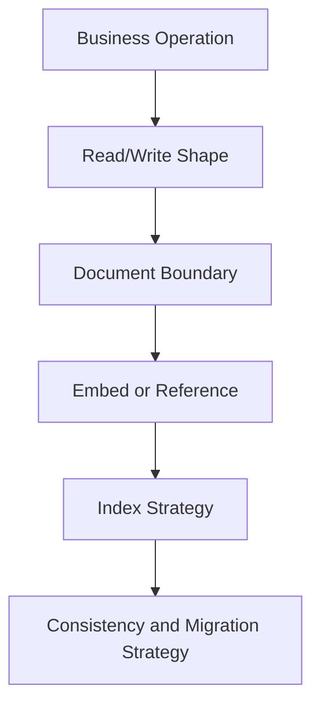
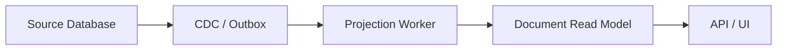

# Part 040 — Document Database Design

A document database stores structured documents, usually JSON-like or BSON-like objects.

That sounds flexible.

But serious document database design is not about dumping arbitrary JSON into collections.

It is about choosing the correct **document boundary**.

A good document boundary makes common reads simple, common writes safe, and lifecycle ownership clear.

A bad document boundary creates huge documents, unbounded arrays, duplicated inconsistent state, weak auditability, broken authorization, painful migrations, and application code that quietly becomes a bad query planner.

The central question is:

> What data should change, be read, be owned, be secured, and be versioned together?

---

## 1. Core mental model

A document is best treated as an aggregate-shaped unit of data.

Not aggregate in the “always DDD” sense, but in the practical database-design sense:

> A document should group data that is commonly read together, commonly updated together, and naturally owned by the same lifecycle boundary.



Document design starts from access pattern and lifecycle, not from object hierarchy.

Poor sequence:

```txt
Java object graph -> JSON -> collection
```

Better sequence:

```txt
operation -> access pattern -> consistency need -> document boundary -> indexes -> evolution plan
```

---

## 2. Document database versus relational database

A relational database normalizes data and lets you recompose views through joins.

A document database often stores data closer to how the application reads it.

Relational thinking:

```txt
Store facts once. Join when needed.
```

Document thinking:

```txt
Store read-owned aggregates together. Duplicate carefully when needed.
```

This makes document databases good for:

- aggregate-centric operational reads;
- flexible or evolving nested structures;
- entity state with local subdocuments;
- product catalogs;
- content/document metadata;
- user profile/preferences;
- case snapshots and view models;
- event payloads;
- read models derived from normalized sources;
- APIs that naturally return object-shaped responses.

They are weaker for:

- complex multi-entity joins;
- heavy cross-document constraints;
- many-to-many relationship integrity;
- arbitrary reporting;
- highly normalized regulatory facts;
- high-churn unbounded child collections inside a parent;
- data that requires strict relational integrity across many entities.

---

## 3. The document boundary question

Do not ask first:

> What JSON shape is convenient?

Ask:

> What is the smallest unit that should be read, changed, authorized, versioned, and restored together?

Boundary dimensions:

| Dimension | Question |
|---|---|
| Read boundary | Is this data commonly fetched together? |
| Write boundary | Is this data commonly updated together? |
| Consistency boundary | Must these fields change atomically? |
| Lifecycle boundary | Are child objects born/deleted with parent? |
| Ownership boundary | Does one domain/team own all fields? |
| Authorization boundary | Do all fields share access policy? |
| Size boundary | Can the document grow without limit? |
| Retention boundary | Is retention/purge the same for all parts? |
| Query boundary | Do queries need to filter/sort children independently? |
| Migration boundary | Can this shape evolve safely over time? |

If answers diverge, the document is probably too large or mixing responsibilities.

---

## 4. Embed versus reference

The most important design choice is whether related data should be embedded or referenced.

### 4.1 Embed when the child belongs to the parent

Embedding works when:

- child is usually read with parent;
- child has no independent lifecycle;
- child is small/bounded;
- child is updated with parent;
- child shares security and retention policy;
- child does not need independent high-cardinality querying;
- atomic parent update is useful.

Example: case assignment summary embedded in case current-state document.

```json
{
  "_id": "case_456",
  "tenantId": "t_123",
  "status": "UNDER_REVIEW",
  "assignment": {
    "teamId": "team_enforcement",
    "assigneeId": "user_789",
    "assignedAt": "2026-07-05T12:00:00Z"
  }
}
```

This is reasonable if assignment summary is part of current case state.

### 4.2 Reference when the child has its own lifecycle

Referencing works when:

- child is large;
- child is shared;
- child changes independently;
- child has different security policy;
- child has different retention policy;
- child needs independent querying;
- child cardinality is unbounded;
- relationship is many-to-many;
- child is owned by another domain.

Example: evidence documents referenced from case.

```json
{
  "_id": "case_456",
  "tenantId": "t_123",
  "status": "UNDER_REVIEW",
  "evidenceRefs": [
    {
      "evidenceId": "ev_001",
      "type": "PDF",
      "submittedAt": "2026-07-05T12:00:00Z"
    }
  ]
}
```

The full evidence record may live separately:

```json
{
  "_id": "ev_001",
  "tenantId": "t_123",
  "caseId": "case_456",
  "storageUri": "s3://evidence/t_123/ev_001.pdf",
  "hash": "sha256:...",
  "classification": "RESTRICTED",
  "createdAt": "2026-07-05T12:00:00Z"
}
```

---

## 5. Embed/reference decision table

| Scenario | Prefer | Reason |
|---|---|---|
| Small address inside user profile | Embed | Usually read together, bounded |
| Product attributes | Embed or attribute pattern | Naturally product-owned |
| Order line items | Embed | Born with order, read with order |
| Payment transactions | Reference | Independent lifecycle/audit/security |
| Case notes | Reference or bounded summary | Potentially large, security/audit concerns |
| Evidence files | Reference | Large payload, separate retention/security |
| User roles | Reference/membership collection | Query/security lifecycle independent |
| Comments on viral post | Reference/bucket | Unbounded array risk |
| Latest status summary | Embed | Operational convenience |
| Full status history | Reference/event collection | Grows over time |

Rule of thumb:

> Embed small, bounded, ownership-local data. Reference large, shared, independently queried, independently secured, or unbounded data.

---

## 6. The unbounded array problem

A common document anti-pattern:

```json
{
  "_id": "case_456",
  "events": [
    { "type": "CREATED", "at": "..." },
    { "type": "ASSIGNED", "at": "..." },
    { "type": "NOTE_ADDED", "at": "..." }
  ]
}
```

This is acceptable only if the event list is truly bounded.

If a case can have thousands or millions of events, embedding all events creates:

- document growth;
- expensive rewrites;
- index bloat;
- memory pressure;
- large network responses;
- difficult pagination;
- write contention on one document;
- document size limit risk;
- audit/history migration pain.

Better pattern:

```txt
cases
case_events
case_event_daily_buckets
```

Case current-state document:

```json
{
  "_id": "case_456",
  "tenantId": "t_123",
  "status": "UNDER_REVIEW",
  "eventSummary": {
    "lastEventType": "ASSIGNED",
    "lastEventAt": "2026-07-05T12:00:00Z",
    "eventCount": 47
  }
}
```

Events stored separately:

```json
{
  "_id": "evt_999",
  "tenantId": "t_123",
  "caseId": "case_456",
  "type": "ASSIGNED",
  "occurredAt": "2026-07-05T12:00:00Z",
  "payload": {
    "teamId": "team_enforcement"
  }
}
```

---

## 7. Document size is a design constraint

Document databases often impose document-size limits, but the practical limit is usually lower than the hard limit.

Large documents cause:

- slow reads;
- expensive writes;
- cache inefficiency;
- network overhead;
- replication pressure;
- large index entries if arrays are indexed;
- update contention;
- poor partial query behavior;
- difficult schema migration.

Architectural rule:

> A document should be sized around common operational reads, not around maximum possible object graph size.

If only a small part of the document is needed for most operations, split the document or maintain a summary document.

---

## 8. Schema flexibility with discipline

Document databases allow flexible fields.

That does not mean every document can have arbitrary shape.

A mature document model defines:

- collection purpose;
- required fields;
- allowed field types;
- schema version;
- compatibility policy;
- migration strategy;
- validation rules;
- index contract;
- ownership boundaries;
- security classification;
- retention behavior.

Example envelope:

```json
{
  "_id": "case_456",
  "schemaVersion": 4,
  "tenantId": "t_123",
  "type": "regulatory_case",
  "version": 17,
  "createdAt": "2026-07-01T09:00:00Z",
  "updatedAt": "2026-07-05T12:00:00Z",
  "createdBy": "user_001",
  "updatedBy": "user_789",
  "status": "UNDER_REVIEW",
  "payload": {}
}
```

Minimum governance:

| Concern | Practice |
|---|---|
| Shape | JSON Schema or application validator |
| Evolution | `schemaVersion` field |
| Decoding | Backward-compatible readers |
| Migration | Online migration or lazy migration |
| Indexes | Declared as part of collection contract |
| Required fields | Enforced by validation/tests |
| Sensitive fields | Classified and protected |
| Unknown fields | Explicit policy: reject, ignore, or preserve |

---

## 9. Schema versioning patterns

Document databases make gradual schema evolution easier, but only if readers are compatible.

Common patterns:

### 9.1 Lazy read migration

When reading an old document:

```txt
if schemaVersion == 2:
  convert to v3 in memory
  optionally write back v3
```

Good for:

- low-risk migrations;
- rarely accessed documents;
- backwards-compatible changes.

Danger:

- old versions linger forever;
- write-back can create unexpected writes;
- migration logic remains in code too long.

### 9.2 Online backfill migration

```txt
1. Deploy reader compatible with v2 and v3.
2. Deploy writer producing v3.
3. Backfill old v2 documents to v3.
4. Validate migration completeness.
5. Remove v2 reader after safe window.
```

Good for:

- index changes;
- required field introduction;
- analytics correctness;
- compliance fields.

### 9.3 Dual field migration

```json
{
  "status": "OPEN",
  "state": "UNDER_REVIEW"
}
```

Temporarily support both old and new fields.

Remove old field only after all readers are updated.

---

## 10. Index design for document databases

Document indexes are still physical design.

Common index types include:

- single-field index;
- compound index;
- multikey/array index;
- text/search index;
- geospatial index;
- partial index;
- TTL index;
- hashed/shard key index depending on database.

The same rule from relational indexing applies:

> Indexes must be designed from query shape, not from field popularity.

Example query:

```txt
Find open high-priority cases for a tenant assigned to a team, ordered by SLA due date.
```

Likely index:

```txt
tenantId + status + priority + assignment.teamId + sla.dueAt
```

But the exact order depends on:

- equality predicates;
- range predicates;
- sort order;
- selectivity;
- cardinality;
- index prefix usage;
- query planner behavior;
- write overhead.

Index review questions:

- Which query does this index serve?
- Is sort covered?
- Are array fields involved?
- Does multikey expansion create high index cardinality?
- Does the index include tenant boundary?
- Is the index selective enough?
- Does it increase write cost too much?
- Is it redundant with another compound index?
- Is the index safe for schema variations?
- Can this index be built online?

---

## 11. Multikey and array indexing risk

Indexing arrays can create many index entries per document.

Example:

```json
{
  "_id": "case_456",
  "tags": ["fraud", "urgent", "banking", "cross-border"]
}
```

Indexing `tags` is fine if the array is bounded.

But indexing a large or unbounded array causes:

- index explosion;
- high write cost;
- large storage usage;
- slower updates;
- planner surprises;
- difficult index builds.

Do not index unbounded arrays casually.

If child elements need heavy querying, they probably deserve their own collection.

---

## 12. Atomicity model

Document databases commonly guarantee atomicity at the document level. Many modern systems also support multi-document transactions, but the design should not blindly rely on them for every operation.

Single-document atomicity is powerful when the document boundary is correct.

Example atomic update:

```json
{
  "$set": {
    "status": "UNDER_REVIEW",
    "updatedAt": "2026-07-05T12:00:00Z"
  },
  "$inc": {
    "version": 1
  }
}
```

With condition:

```json
{
  "_id": "case_456",
  "version": 17,
  "status": "SUBMITTED"
}
```

This implements optimistic state transition:

```txt
update case
where id = case_456
  and version = 17
  and status = SUBMITTED
set status = UNDER_REVIEW,
    version = 18
```

Equivalent mental model:

> Match predicate is the guard. Update is the transition. Modified-count is the success signal.

---

## 13. Cross-document consistency

Once an operation touches multiple documents, you need a clear consistency strategy.

Example operation:

```txt
Assign case to team.
```

Documents:

- `cases` current state;
- `case_events` history;
- `team_work_queue` projection;
- `user_notifications` projection;
- `audit_log`;
- `outbox`.

Possible strategies:

| Strategy | Use when |
|---|---|
| Multi-document transaction | Strong consistency needed and DB supports it safely |
| Source + derived projections | Projections can lag/rebuild |
| Outbox | External events must follow DB write |
| Idempotent command document | Command processing may retry |
| Reconciliation job | Drift is acceptable temporarily |
| Manual repair workflow | Rare critical failures need human judgement |

Important rule:

> Do not pretend denormalized projections are automatically consistent. Define source, freshness, and repair.

---

## 14. Document design patterns

Document databases have recurring schema patterns. Use them as tools, not templates.

### 14.1 Embedded document pattern

Use for bounded local data.

```json
{
  "_id": "case_456",
  "sla": {
    "policyId": "sla_high_priority_v2",
    "dueAt": "2026-07-07T17:00:00Z",
    "breachRisk": "HIGH"
  }
}
```

### 14.2 Extended reference pattern

Store a reference plus stable summary fields to avoid extra lookup.

```json
{
  "caseId": "case_456",
  "party": {
    "partyId": "party_001",
    "displayName": "ACME Finance Ltd",
    "riskTierAtLinkTime": "HIGH"
  }
}
```

Useful when summary must reflect a point-in-time view or common display need.

### 14.3 Subset pattern

Keep recent or important subset embedded, store full list separately.

```json
{
  "_id": "case_456",
  "recentEvents": [
    { "type": "ASSIGNED", "at": "2026-07-05T12:00:00Z" },
    { "type": "REVIEW_STARTED", "at": "2026-07-05T12:10:00Z" }
  ],
  "eventCount": 1842
}
```

### 14.4 Computed pattern

Store derived value when computing repeatedly is expensive.

```json
{
  "_id": "case_456",
  "riskScore": 87,
  "riskScoreComputedAt": "2026-07-05T12:00:00Z",
  "riskScoreVersion": "model_v14"
}
```

Requires freshness and recomputation rules.

### 14.5 Bucket pattern

Group high-volume child records into bounded buckets.

```json
{
  "_id": "case_456:events:2026-07-05",
  "caseId": "case_456",
  "bucketDate": "2026-07-05",
  "events": [
    { "eventId": "evt_1", "type": "NOTE_ADDED" }
  ]
}
```

Useful for time-series/history when each bucket is bounded.

### 14.6 Outlier pattern

Keep normal cases simple, split exceptional cases.

```json
{
  "_id": "case_456",
  "hasLargeEvidenceSet": true,
  "evidenceSummary": {
    "count": 120000,
    "storageRef": "case_evidence_index_456"
  }
}
```

Do not punish every document shape because 1% of records are huge.

### 14.7 Schema versioning pattern

Store version per document and support compatible readers.

```json
{
  "_id": "case_456",
  "schemaVersion": 5,
  "status": "UNDER_REVIEW"
}
```

---

## 15. Regulatory case management example

A naive document:

```json
{
  "_id": "case_456",
  "status": "UNDER_REVIEW",
  "parties": [],
  "evidence": [],
  "events": [],
  "notes": [],
  "tasks": [],
  "communications": [],
  "decisions": []
}
```

This looks convenient.

It is dangerous because every child collection may have different:

- lifecycle;
- access pattern;
- security policy;
- retention rule;
- growth rate;
- audit requirement;
- query pattern.

Better model:

```txt
cases
case_events
case_tasks
case_evidence
case_notes
case_decisions
case_party_links
case_timeline_projection
```

Case document:

```json
{
  "_id": "case_456",
  "schemaVersion": 4,
  "tenantId": "t_123",
  "caseNumber": "ENF-2026-000456",
  "status": "UNDER_REVIEW",
  "priority": "HIGH",
  "assignment": {
    "teamId": "team_enforcement",
    "assigneeId": "user_789"
  },
  "sla": {
    "dueAt": "2026-07-07T17:00:00Z",
    "breachRisk": "HIGH"
  },
  "summary": {
    "partyCount": 3,
    "evidenceCount": 18,
    "openTaskCount": 4,
    "lastEventAt": "2026-07-05T12:00:00Z"
  },
  "version": 17,
  "createdAt": "2026-07-01T09:00:00Z",
  "updatedAt": "2026-07-05T12:00:00Z"
}
```

This keeps operational current state fast while letting high-growth/audit-heavy data live in separate collections.

---

## 16. Current state versus history

Document DBs are often excellent for current state.

But history needs separate thought.

Current-state document:

```json
{
  "_id": "case_456",
  "status": "UNDER_REVIEW",
  "version": 17
}
```

History document:

```json
{
  "_id": "evt_001",
  "caseId": "case_456",
  "eventType": "STATUS_CHANGED",
  "from": "SUBMITTED",
  "to": "UNDER_REVIEW",
  "occurredAt": "2026-07-05T12:00:00Z",
  "actorId": "user_789",
  "commandId": "cmd_abc"
}
```

Do not store all history only as overwritten fields.

For serious systems, maintain:

- current state for operational reads;
- history/event/audit collection for traceability;
- projection for timelines/search/reporting if needed.

---

## 17. Authorization boundary

Document shape affects authorization.

If fields inside one document have different access policies, you have a problem.

Example:

```json
{
  "_id": "case_456",
  "publicSummary": {},
  "internalNotes": {},
  "restrictedEvidenceMetadata": {},
  "legalHoldInfo": {}
}
```

If different users can see different parts, the system must enforce field-level filtering reliably.

Options:

- split restricted data into separate collections;
- use views/projections;
- enforce field-level redaction in service layer;
- maintain separate read models for different audiences;
- classify fields and test redaction;
- audit access to sensitive subdocuments.

Rule:

> A document boundary should not silently bypass security boundaries.

---

## 18. Multi-tenancy in document databases

Common pooled model:

```json
{
  "_id": "case_456",
  "tenantId": "t_123",
  "status": "OPEN"
}
```

Every query must include tenant predicate:

```json
{
  "tenantId": "t_123",
  "status": "OPEN"
}
```

Indexes should usually start with or include tenant boundary:

```txt
tenantId + status + sla.dueAt
```

Risks:

- missing tenant filter leaks data;
- index without tenant causes noisy-neighbor scans;
- large tenant dominates collection/index;
- backup/restore per tenant is hard;
- shard key may not align with tenant isolation;
- analytics export may cross tenant boundary.

Design checklist:

- Is tenant ID required in every document?
- Is tenant ID immutable?
- Are unique constraints tenant-scoped?
- Do all query builders enforce tenant filter?
- Are indexes tenant-aware?
- Can one tenant be moved/split?
- Can one tenant be restored?
- Are field-level security rules tenant-aware?

---

## 19. Document migrations

Document migrations are dangerous because documents may have heterogeneous shapes.

Migration classes:

| Migration | Risk |
|---|---|
| Add optional field | Low if readers tolerate absence |
| Add required field | Requires backfill/validation |
| Rename field | Dual-read/dual-write needed |
| Change type | High risk for queries/indexes |
| Split collection | Requires reference/projection repair |
| Merge collection | Requires conflict resolution |
| Change embedded to referenced | Requires application and query rewrite |
| Index new field | Requires data completeness |

Safe migration sequence:

```txt
1. Deploy readers that tolerate old and new shapes.
2. Deploy writers producing new shape.
3. Backfill old documents in small batches.
4. Validate counts, nulls, indexes, query plans.
5. Remove old shape only after all consumers are safe.
```

Never assume a document migration is easy just because the database did not require `ALTER TABLE`.

---

## 20. Query and aggregation design

Document databases often include aggregation pipelines.

Aggregation is powerful, but it can become a hidden analytics engine inside an operational database.

Use aggregation for:

- bounded operational summaries;
- projection generation;
- small dashboard queries;
- transformation jobs with predictable filters;
- backfills with safe batching.

Be careful with:

- broad collection scans;
- memory-heavy grouping;
- unindexed sort;
- cross-tenant aggregation;
- frequent dashboard queries over large operational collections;
- deeply nested array unwinding;
- high-cardinality grouping;
- user-defined arbitrary filters.

If aggregation becomes central to reporting, consider separate analytical models or materialized reporting collections.

---

## 21. Denormalization discipline

Document databases encourage denormalization.

Denormalization is not wrong.

Unowned denormalization is wrong.

Example duplicated party summary:

```json
{
  "caseId": "case_456",
  "party": {
    "partyId": "party_001",
    "displayName": "ACME Finance Ltd",
    "riskTier": "HIGH"
  }
}
```

Questions:

- Is `displayName` a snapshot or live copy?
- If party name changes, should old cases change?
- If risk tier changes, should case copy update?
- Who owns repair?
- What is freshness SLA?
- Is the copied value used for legal/regulatory evidence?

Denormalized fields must be classified:

| Type | Meaning |
|---|---|
| Snapshot copy | Intentionally preserves point-in-time value |
| Cached copy | Should eventually match source |
| Derived value | Computed from source fields |
| Display copy | Convenience for UI, may be stale |
| Evidence copy | Must not change casually |

---

## 22. Optimistic concurrency pattern

Use a version field for concurrent document updates.

Document:

```json
{
  "_id": "case_456",
  "status": "SUBMITTED",
  "version": 17
}
```

Update predicate:

```json
{
  "_id": "case_456",
  "version": 17,
  "status": "SUBMITTED"
}
```

Update:

```json
{
  "$set": {
    "status": "UNDER_REVIEW",
    "updatedAt": "2026-07-05T12:00:00Z"
  },
  "$inc": {
    "version": 1
  }
}
```

If modified count is zero, one of these happened:

- document not found;
- version changed;
- status guard failed;
- tenant filter failed;
- authorization filter failed.

Treat zero-modified as a business signal, not a generic database error.

---

## 23. Idempotent command pattern

Document DBs can model idempotent commands similarly to KV.

Collection: `command_dedup`

```json
{
  "_id": "t_123:create_case:idem_abc",
  "tenantId": "t_123",
  "commandType": "CREATE_CASE",
  "idempotencyKey": "idem_abc",
  "commandHash": "sha256:...",
  "status": "COMPLETED",
  "resultRef": {
    "caseId": "case_456"
  },
  "createdAt": "2026-07-05T12:00:00Z",
  "expiresAt": "2026-07-12T12:00:00Z"
}
```

Unique key:

```txt
tenantId + commandType + idempotencyKey
```

Rules:

- insert dedup record first;
- reject same key with different command hash;
- store final result;
- keep enough retention for retry window;
- handle in-progress command after crash;
- make side effects recoverable.

---

## 24. Document DB as read model

A very effective use of document databases is as a read model.

Source of truth may remain relational/event/log-based.

Document DB stores API-optimized projections.



Benefits:

- fast object-shaped reads;
- fewer joins at request time;
- flexible API response model;
- scalable search/filter indexes;
- independent read-model evolution.

Costs:

- projection lag;
- drift;
- replay/rebuild requirement;
- duplicate storage;
- version compatibility;
- source/read-model consistency communication.

Read model contract:

```txt
source_of_truth: PostgreSQL case schema
document_model: MongoDB case_read_model
freshness_slo: 99% under 5 seconds
rebuild_source: case_events + current_case tables
repair: replay from offset or full tenant rebuild
api_staleness_label: required for regulator dashboard
```

---

## 25. Failure modes

### 25.1 Giant document failure

Symptoms:

- writes slow down;
- document approaches size limit;
- updates rewrite too much data;
- API responses too large;
- cache hit ratio drops.

Cause:

- embedded unbounded children;
- object graph stored as one document;
- lack of subset/bucket pattern.

Fix:

- split high-growth children;
- keep summary embedded;
- move history to separate collection;
- use buckets for time-series children.

### 25.2 Inconsistent duplicated fields

Symptoms:

- UI shows different names/statuses in different screens;
- reports disagree;
- repair job finds drift;
- customer/regulator disputes data.

Cause:

- copied values not classified;
- no source-of-truth definition;
- no projection repair;
- failed partial updates.

Fix:

- define snapshot vs cached copy;
- use source + projection contract;
- add reconciliation;
- add idempotent update processing.

### 25.3 Missing tenant predicate

Symptoms:

- cross-tenant data exposure;
- unexpectedly large scans;
- noisy-neighbor performance.

Cause:

- query builder allows optional tenant filter;
- index not tenant-aware;
- aggregation pipeline forgot tenant match.

Fix:

- mandatory tenant filter in repository boundary;
- tests for every query;
- tenant-aware indexes;
- collection-per-tenant only if justified.

### 25.4 Schema drift

Symptoms:

- some documents miss required fields;
- index not used due type variation;
- runtime decoder errors;
- old API consumers break.

Cause:

- no schemaVersion;
- no validation;
- lazy migration without cleanup;
- multiple writers with inconsistent shapes.

Fix:

- schema versioning;
- validation rules;
- compatibility tests;
- migration dashboard;
- reject unknown/invalid shapes where appropriate.

---

## 26. Anti-patterns

### 26.1 “Just store the whole object graph”

Bad because object graphs do not equal database boundaries.

### 26.2 “Embed everything to avoid joins”

Bad because it creates unbounded growth, duplicated truth, and poor update behavior.

### 26.3 “Reference everything like relational tables”

Bad because you lose document database benefits and rebuild joins in application code.

### 26.4 “No schema because NoSQL”

Bad because schema moves into application code and becomes harder to govern.

### 26.5 “One collection for everything”

Bad because indexes, validation, lifecycle, and ownership become incoherent.

### 26.6 “Array as relationship table”

Bad when cardinality grows or independent query is needed.

### 26.7 “Use aggregation for all reports”

Bad when operational database becomes overloaded by analytical workloads.

---

## 27. Design review checklist

### Document boundary

- What operation is this document optimized for?
- Is the document read as a whole?
- Are embedded children bounded?
- Do embedded children share lifecycle?
- Do embedded children share authorization?
- Can the document grow indefinitely?

### Relationships

- What is embedded?
- What is referenced?
- Which references need summary fields?
- Which relationship is many-to-many?
- Which relationship needs independent audit?

### Indexes

- What exact queries are supported?
- Are indexes tenant-aware?
- Are arrays indexed safely?
- Is sort covered?
- Are index builds safe online?
- Are indexes redundant or write-heavy?

### Consistency

- What updates are single-document atomic?
- What updates require multi-document consistency?
- What is source of truth?
- Which fields are duplicated?
- How is drift detected?
- How is repair performed?

### Schema evolution

- Is `schemaVersion` present?
- Are readers backward compatible?
- Are writers forward controlled?
- Is migration observable?
- Are old versions retired?

### Operations

- What is average/max document size?
- What is write frequency per document?
- What are top slow queries?
- What are high-growth arrays?
- What are backup/restore boundaries?
- Can a tenant be exported/restored?

### Security

- Does tenant filter exist in every query?
- Do all fields share access policy?
- Are sensitive fields separated or redacted?
- Is access audited?
- Are exports filtered by policy?

---

## 28. When document database is the right choice

Choose document DB when:

- your read model is naturally document-shaped;
- aggregate boundary is clear;
- embedded data is bounded;
- flexible nested fields are valuable;
- schema evolves frequently but can be governed;
- denormalization improves common reads;
- cross-document constraints are limited;
- projections and repair are acceptable;
- the team understands index/query-shape design.

Do not choose it merely because:

- schema design feels hard;
- migrations feel inconvenient;
- joins are slow in the current relational schema;
- someone says NoSQL scales automatically;
- JSON matches the API response;
- the team wants to avoid data governance.

---

## 29. Senior-level heuristics

1. A document is a lifecycle and consistency boundary, not just a JSON object.
2. Embed when ownership, lifecycle, read pattern, and cardinality align.
3. Reference when growth, ownership, security, retention, or query independence diverge.
4. Unbounded arrays are future incidents.
5. Schema flexibility requires explicit schema versioning.
6. Denormalized fields need source, freshness, and repair rules.
7. Document indexes are physical design; array indexes can explode.
8. Single-document atomicity is powerful only when the boundary is correct.
9. Security boundaries should influence document boundaries.
10. A document database is often excellent as a read model even when it is not the source of truth.

---

## 30. Practice drills

### Drill 1 — Case current state

Design a `cases` document for regulatory case current state.

Include:

- assignment;
- SLA;
- priority;
- summary counts;
- version;
- schema version;
- tenant boundary.

Explain which data you refused to embed.

### Drill 2 — Evidence modelling

Design document model for evidence metadata and evidence file storage.

Address:

- large payloads;
- classification;
- hash/checksum;
- retention;
- relationship to case;
- query by party/case/date.

### Drill 3 — Embedded versus referenced notes

Case notes are read frequently on case detail page, but some cases have 100,000 notes.

Design:

- normal case behavior;
- outlier behavior;
- pagination;
- indexing;
- security.

### Drill 4 — Schema migration

`status` field must become `state.code` plus `state.reason`.

Design:

- dual-read;
- dual-write;
- backfill;
- validation;
- rollback;
- index transition.

---

## 31. Closing mental model

Document database design is a boundary discipline.

It is not relational normalization, and it is not arbitrary JSON storage.

The designer must deliberately answer:

```txt
What belongs together?
What grows independently?
What changes atomically?
What is duplicated?
What is source of truth?
What is queryable?
What is secured together?
What can be rebuilt?
```

The strongest document models feel simple because the aggregate boundaries match real operational behavior.

The weakest document models feel simple at first because they hide relationships, constraints, and growth until production data exposes them.

In the next part, we move to wide-column database design, where partition key and clustering key become the primary modelling tools and query-driven schema design becomes even stricter.

---

## References

- MongoDB Manual — Data Modeling: https://www.mongodb.com/docs/manual/data-modeling/
- MongoDB Manual — Embedded Data Models: https://www.mongodb.com/docs/manual/data-modeling/embedding/
- MongoDB Manual — Data Modeling Best Practices: https://www.mongodb.com/docs/manual/data-modeling/best-practices/
- MongoDB Manual — Schema Design Patterns: https://www.mongodb.com/docs/manual/data-modeling/design-patterns/
