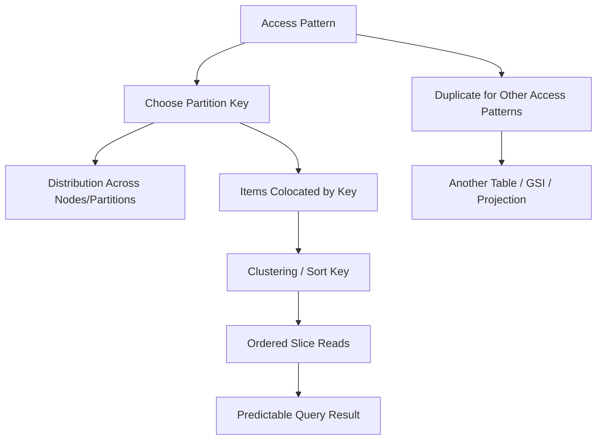
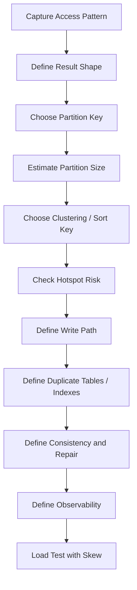
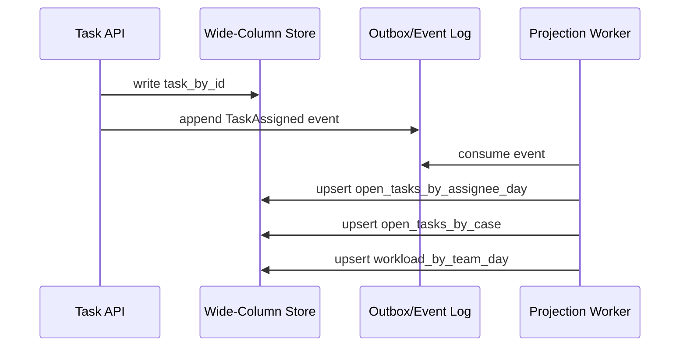

# Part 041 — Wide-Column Database Design

Wide-column databases are often misunderstood because they look table-like, but they are not relational databases with fewer joins. They are distributed storage systems optimized around **partition-key-directed access**.

The core mental shift:

> In a relational database, you usually start from normalized facts and let the optimizer choose access paths.  
> In a wide-column database, you usually start from access patterns and design the physical key layout directly.

This part focuses on Cassandra-style and DynamoDB-style thinking. The names differ, but the architectural problem is similar:

- put related items together;
- distribute load evenly;
- avoid unbounded partitions;
- read with predictable latency;
- duplicate intentionally;
- accept that schema is query-shaped.

This is not a replacement for relational modelling. It is a different design discipline.

---

## 1. The Short Definition

A wide-column design organizes data around:

1. **partition key** — decides where data lives;
2. **clustering key / sort key** — decides how related rows/items are ordered inside the partition;
3. **query-specific table or item collection** — stores data in the shape the application needs to read;
4. **controlled duplication** — the same fact may appear in multiple tables or item collections;
5. **eventual repair/reconciliation** — because duplication creates drift risk.

In Cassandra, the primary key consists of a partition key and optional clustering columns. The partition key determines distribution, while clustering columns determine row order inside a partition.

In DynamoDB, a table can have a partition key and optional sort key. Items with the same partition key form an item collection and are ordered by sort key.

The design target is not arbitrary query flexibility. The target is predictable access under distributed scale.

---

## 2. Why Wide-Column Exists

Wide-column databases are useful when the workload has these characteristics:

| Workload Property | Why Wide-Column Can Fit |
|---|---|
| Very high write volume | Append or upsert by partition key scales horizontally |
| Large time-series or activity data | Partition + clustering/sort key can model ordered feeds |
| Query patterns are known | Data can be pre-shaped per access pattern |
| Low-latency key-based access is required | Request can route to the right partition quickly |
| Horizontal scale matters more than ad hoc joins | Joins are usually avoided or moved to write-time/materialization |
| Availability is more important than relational flexibility | Distributed write/read paths can be tuned by consistency level or service configuration |

A bad reason to use wide-column:

> “We do not want to design relational schema.”

A good reason:

> “Our dominant workload is known, high-volume, partitionable, and requires predictable access at scale.”

---

## 3. Mental Model: Table Is Not the Primary Abstraction

The primary abstraction is not the table. The primary abstraction is the **query-shaped partition**.

A table is a collection of partitions.

A partition is a colocated set of rows/items that share the same partition key.

Inside the partition, clustering/sort keys provide ordering and range access.



The architect asks:

1. What exact query must be answered?
2. Which entity or grouping should be colocated?
3. How large can that group grow?
4. How frequently is it read/written?
5. What ordering is required?
6. What freshness is required?
7. What data is duplicated elsewhere?
8. What repair mechanism detects drift?

---

## 4. The Wide-Column Design Loop

Use this loop before writing schema.



This loop is deliberately physical. A wide-column schema is closer to an access path than to a pure logical model.

---

## 5. Vocabulary Mapping

| Concept | Cassandra-style | DynamoDB-style | Architect Meaning |
|---|---|---|---|
| Distribution key | Partition key | Partition key | Routes data to storage partition/node |
| Per-partition order | Clustering column | Sort key | Orders items under same partition key |
| Group of related rows | Partition | Item collection | Unit of colocated access |
| Query-specific duplication | Table per query | Single-table item patterns / GSI | Precomputed access path |
| Secondary access path | Materialized table / secondary index | GSI / LSI | Additional read path with operational cost |
| Deletion marker | Tombstone | Delete marker/internal delete handling | Needs compaction/cleanup consideration |
| Large partition risk | Wide/hot partition | Hot partition/item collection | Latency and capacity risk |

Do not force exact equivalence. The systems differ. The table above is a mental bridge, not a claim that the engines behave identically.

---

## 6. Partition Key: The Most Important Decision

The partition key decides:

- data distribution;
- request routing;
- maximum partition size;
- hot key risk;
- query boundary;
- multi-tenant isolation shape;
- operational blast radius.

A good partition key has four properties:

1. **Matches the main query boundary**  
   The query can be answered by one or a small bounded number of partitions.

2. **High enough cardinality**  
   Many distinct partition key values prevent one partition from absorbing too much traffic.

3. **Bounded growth**  
   One partition must not grow forever.

4. **Load distribution under real data skew**  
   Cardinality alone is not enough. A million users do not help if one tenant produces 40% of traffic.

### Example: Bad Partition Key

```sql
-- Cassandra-like example
CREATE TABLE case_events_by_agency (
  agency_id text,
  event_time timestamp,
  case_id uuid,
  event_type text,
  payload text,
  PRIMARY KEY (agency_id, event_time, case_id)
);
```

This can be dangerous if one agency is very large. All of its events land under the same logical partition key, possibly creating huge partitions and hot write paths.

### Better Partition Key With Time Bucket

```sql
CREATE TABLE case_events_by_agency_day (
  agency_id text,
  event_day date,
  event_time timestamp,
  case_id uuid,
  event_id uuid,
  event_type text,
  payload text,
  PRIMARY KEY ((agency_id, event_day), event_time, case_id, event_id)
) WITH CLUSTERING ORDER BY (event_time DESC);
```

Now the partition is bounded by agency and day.

The tradeoff: querying 30 days requires 30 partition reads.

That may be acceptable. Wide-column design often trades single flexible queries for multiple predictable bounded reads.

---

## 7. Clustering Key / Sort Key: The Local Access Path

After the partition key chooses the group, the clustering/sort key chooses the order inside that group.

Good clustering/sort keys encode:

- time order;
- sequence order;
- status grouping;
- type prefix;
- hierarchical relation;
- version history;
- relationship edge direction.

### Time-Ordered Feed

```sql
CREATE TABLE user_notifications_by_day (
  user_id uuid,
  bucket_day date,
  created_at timestamp,
  notification_id uuid,
  severity text,
  message text,
  read_at timestamp,
  PRIMARY KEY ((user_id, bucket_day), created_at, notification_id)
) WITH CLUSTERING ORDER BY (created_at DESC);
```

Query:

```sql
SELECT *
FROM user_notifications_by_day
WHERE user_id = ?
  AND bucket_day = ?
LIMIT 50;
```

This is efficient because it reads one partition and takes the top slice in clustering order.

### Type-Prefixed Sort Key

DynamoDB-style item collection:

```txt
PK = CASE#<caseId>
SK = EVENT#2026-07-05T10:15:00Z#<eventId>
SK = TASK#OPEN#<dueAt>#<taskId>
SK = EVIDENCE#<receivedAt>#<evidenceId>
SK = DECISION#<decidedAt>#<decisionId>
```

The sort key encodes multiple access paths under a single case partition.

Queries become prefix or range reads:

```txt
PK = CASE#123
begins_with(SK, 'TASK#OPEN#')
```

This is powerful, but it becomes dangerous if one case can have millions of related items.

---

## 8. Query-Driven Schema

In a relational model, this question is normal:

> “What are the entities and relationships?”

In wide-column design, ask this first:

> “What exact read and write operations must be served at predictable latency?”

For every access pattern, define:

| Field | Example |
|---|---|
| Operation name | `list_open_tasks_for_assignee` |
| Inputs | `tenant_id`, `assignee_id`, `status`, `due_day` |
| Result order | `due_at ASC` |
| Result size | first 100 |
| Freshness | read-after-write required? |
| Consistency | eventual OK or strong required? |
| Frequency | 2,000 QPS peak |
| Growth | per assignee can reach 50,000 open tasks |
| Hotspot | certain teams receive most tasks |
| Write source | task assignment service |
| Duplicate source of truth | canonical task table/event stream |
| Repair mechanism | projection rebuild + checksum |

Then design the table.

### Access Pattern: List Open Tasks by Assignee and Due Day

```sql
CREATE TABLE open_tasks_by_assignee_day (
  tenant_id uuid,
  assignee_id uuid,
  due_day date,
  due_at timestamp,
  task_id uuid,
  case_id uuid,
  priority text,
  title text,
  assigned_at timestamp,
  PRIMARY KEY ((tenant_id, assignee_id, due_day), due_at, task_id)
) WITH CLUSTERING ORDER BY (due_at ASC);
```

This table is not the canonical task model. It is a query-serving model.

When a task is closed, the write path must remove or tombstone it from this table.

---

## 9. Table-Per-Query vs Single-Table Design

Wide-column systems commonly use one of two modelling styles.

### 9.1 Table-Per-Query

Each important access pattern gets a table.

Example:

```txt
case_by_id
cases_by_owner_status
cases_by_tenant_created_day
open_tasks_by_assignee_day
case_events_by_case
case_events_by_agency_day
```

Advantages:

- explicit ownership per query;
- easier capacity modelling per table;
- simpler read logic;
- easier to drop obsolete access paths;
- easier to reason about schema per projection.

Disadvantages:

- duplicated writes;
- more tables;
- more repair/rebuild work;
- consistency drift risk.

### 9.2 Single-Table / Item-Collection Design

Multiple entity types live in one table using encoded keys.

Example:

```txt
PK = TENANT#<tenantId>#CASE#<caseId>
SK = META
SK = EVENT#<eventTime>#<eventId>
SK = TASK#<status>#<dueAt>#<taskId>
SK = EVIDENCE#<receivedAt>#<evidenceId>
```

Advantages:

- flexible item collection;
- colocated entity graph around a root;
- fewer physical tables;
- can reduce round trips when root boundary is right.

Disadvantages:

- key grammar becomes an API;
- harder debugging;
- harder ad hoc inspection;
- risk of overloaded partitions;
- risk of mixing unrelated lifecycle rules;
- schema evolution must preserve key contracts.

Use single-table design only when the item collection boundary is truly stable and bounded.

---

## 10. Denormalization Is the Default, but Not Chaos

Wide-column design duplicates data intentionally.

Example canonical fact:

```txt
Task T-123
- case_id = C-77
- assignee_id = U-9
- status = OPEN
- due_at = 2026-07-06T09:00:00Z
- priority = HIGH
```

Possible projections:

```txt
task_by_id
open_tasks_by_assignee_day
open_tasks_by_case
open_tasks_by_team_priority
sla_breaches_by_tenant_day
```

Every duplicate field needs a freshness contract.

| Field | Can Drift? | Repair Strategy |
|---|---:|---|
| `title` | Yes | Rebuild projection from canonical task event |
| `priority` | Temporarily | Update all projections on priority change |
| `status` | Dangerous | Use transition event and idempotent projection write |
| `due_at` | Dangerous for SLA | Write new row, delete old row, monitor duplicates |

A top-tier design explicitly names the source of truth and each projection's rebuild path.

---

## 11. The Write Path Is More Important Than the Read Path

Because data is duplicated, one command often writes multiple records.

Example: assigning a task.



There are two broad strategies.

### Strategy A: Synchronous Fan-Out

The API writes all duplicate tables before returning.

Use when:

- read-after-write is strict;
- fan-out count is small;
- failure handling is clear;
- latency budget allows it.

Risk:

- partial write failure;
- retry duplicate;
- higher user-facing latency;
- contention on hot projections.

### Strategy B: Event-Driven Projection

The API writes canonical state and emits an event. Workers update read models.

Use when:

- eventual consistency is acceptable;
- fan-out is large;
- projections can be rebuilt;
- the product can display freshness or pending states.

Risk:

- stale read;
- projection lag;
- duplicate event processing;
- out-of-order event handling;
- operational repair complexity.

---

## 12. Idempotency Is Mandatory

Wide-column write paths are often retry-heavy. A failed network response does not prove the write did not happen.

Design writes so retrying is safe.

Patterns:

1. deterministic primary key;
2. idempotency key table;
3. event id as uniqueness boundary;
4. versioned update;
5. compare-and-set / conditional write;
6. inbox dedup table for consumers.

### Idempotent Event Projection

```txt
Projection target:
PK = ASSIGNEE#<assigneeId>#DAY#<dueDay>
SK = DUE#<dueAt>#TASK#<taskId>

Dedup record:
PK = PROJECTION#open_tasks_by_assignee_day
SK = EVENT#<eventId>
```

Worker algorithm:

```txt
1. Read/condition-write dedup event id.
2. If already processed, stop.
3. Apply projection write.
4. Mark projection event processed.
```

In a single-node relational database, you might put this in one transaction. In a distributed NoSQL system, conditional write support and failure semantics must be designed carefully per engine.

---

## 13. Consistency Model

Do not say “eventual consistency” as a vague excuse.

Define consistency per operation.

| Operation | Consistency Need | Reason |
|---|---|---|
| Create case | Strong identity uniqueness | Duplicate cases cause legal/operational confusion |
| Show case timeline | Eventual within seconds may be OK | Timeline can show syncing state |
| Claim work item | Strong/conditional | Two users must not claim same item |
| Show dashboard count | Eventual OK | Aggregate can lag |
| Enforce SLA breach | Strong enough around transition | Incorrect breach has regulatory impact |
| Authorization decision | Must be fresh enough | Stale access can leak sensitive data |

Wide-column engines may expose tunable consistency, quorum reads/writes, conditional writes, or transaction subsets. The architect's job is to tie those mechanisms to business risk, not to use defaults blindly.

---

## 14. Hot Partitions and Skew

A partition key can look good in average metrics and still fail in production.

### Common Hotspot Sources

| Hotspot | Example |
|---|---|
| Large tenant | One tenant produces 70% of writes |
| Celebrity user | One profile receives huge read volume |
| Global feed key | `PK = GLOBAL_FEED` |
| Current day bucket | All events go to `2026-07-05` |
| Monotonic key | Increasing timestamp creates write concentration depending on engine/key layout |
| Status key | `PK = OPEN` concentrates all open items |
| Queue key | `PK = WORK_QUEUE#A` overloaded by workers |

### Mitigation Patterns

| Pattern | How It Works | Cost |
|---|---|---|
| Time bucket | Add day/hour/month to partition key | Queries over time range fan out |
| Hash bucket | Add random or deterministic bucket number | Reads must query multiple buckets |
| Tenant cell | Move large tenants to separate cell/table/account | Operational complexity |
| Work queue sharding | Multiple queue partitions | Fairness and ordering complexity |
| Split projection | Separate hot query from cold query | More write fan-out |
| Adaptive key | Special-case large tenants | Requires tenant catalog and routing rules |

### Example: Bucketed Global Feed

Bad:

```txt
PK = GLOBAL_FEED
SK = <createdAt>#<eventId>
```

Better:

```txt
PK = GLOBAL_FEED#DAY#2026-07-05#BUCKET#07
SK = <createdAt>#<eventId>
```

Read latest feed:

```txt
Query bucket 00..15 in parallel.
Merge-sort by createdAt.
Return top N.
```

This is more complex, but the complexity is explicit and bounded.

---

## 15. Partition Size Governance

Every partition needs a growth model.

Ask:

1. What is the maximum item count per partition?
2. What is the maximum bytes per partition?
3. What is the expected write rate per partition?
4. What is the peak read rate per partition?
5. What is the retention window?
6. What happens when a tenant is 100x larger than expected?
7. How does the partition age out?
8. How do we detect partitions approaching danger?

Example model:

```txt
Access pattern: case_events_by_case_month
Partition key: (tenant_id, case_id, event_month)
Average events per case per month: 200
P99 events per case per month: 5,000
Worst-case investigation case: 100,000
Average row size: 1.2 KB
Worst-case partition size: 120 MB
Action: high-risk cases must spill to event_day partitioning after threshold
```

Do not design from average-only estimates.

---

## 16. Tombstones, TTL, and Delete Path

Wide-column engines commonly handle deletes through markers/tombstones before compaction/cleanup.

Architectural implications:

- delete-heavy workloads can degrade reads;
- TTL creates hidden delete workload;
- scanning over many deleted records hurts latency;
- frequent update/delete of the same partition can create compaction pressure;
- retention design must account for cleanup lag.

### Bad TTL Design

```txt
All notification items use 7-day TTL.
High-volume tenant receives 10 million notifications/day.
Reads query wide time ranges that include expired records.
```

Problem:

- delete markers accumulate;
- compaction lags;
- reads encounter many expired/tombstoned rows.

Better:

- bucket by day;
- query only active buckets;
- drop/archive whole buckets when possible;
- monitor tombstone ratio/read latency;
- avoid wide range reads over heavily expired partitions.

---

## 17. Secondary Indexes Are Not a Relational Escape Hatch

A common mistake:

> “We can model loosely and add secondary indexes later.”

In distributed wide-column systems, secondary indexes can be expensive or limited depending on engine semantics.

Use secondary indexes when:

- cardinality is appropriate;
- query volume is low/moderate;
- partition fan-out is acceptable;
- consistency/freshness semantics are understood;
- index maintenance cost is acceptable.

Prefer query-specific tables/projections when:

- the query is core product flow;
- latency SLO is strict;
- volume is high;
- access pattern is stable;
- backfill/rebuild can be managed.

A top-tier architect treats secondary indexes as separately governed read paths, not magic.

---

## 18. Materialized Views and GSIs

Global secondary indexes and materialized views are convenient because they create alternate access paths.

But they are still duplicated data.

Review questions:

1. Is the index/view updated synchronously or asynchronously?
2. Can it be stale?
3. How is backfill performed?
4. What is the write amplification?
5. What happens if the index is hot?
6. How do we detect index drift?
7. How do we rebuild it?
8. Can the application tolerate missing/late items?

Treat every GSI/materialized view as a projection with operational ownership.

---

## 19. Wide-Column for Regulatory Case Management

A regulatory case platform can use wide-column patterns for high-volume query-serving projections, but the canonical truth may still live in a relational or event-sourced store.

### Good Fit Projections

| Projection | Why It Fits |
|---|---|
| `case_timeline_by_case_month` | Ordered append-heavy timeline reads |
| `open_tasks_by_assignee_day` | Bounded inbox query |
| `sla_deadlines_by_team_day` | Operational queue with due ordering |
| `audit_events_by_actor_day` | Time-bucketed investigation query |
| `evidence_receipts_by_case` | Ordered case evidence access if bounded |

### Dangerous Fits

| Requirement | Why Dangerous |
|---|---|
| Complex ad hoc investigation queries | Wide-column is not a general join engine |
| Cross-case graph reasoning | Better handled by graph/search/relational analytical store |
| Strong multi-row invariant across arbitrary entities | Hard without transaction support matching invariant scope |
| Regulatory report requiring exact historical reconstruction | Need canonical event/history model and reproducible snapshot design |

Use wide-column as a serving layer when its access patterns are known.

Do not hide canonical state only in query-shaped projections unless you also have strong reconciliation, audit, and rebuild mechanics.

---

## 20. Example: Case Timeline Table

### Access Pattern

```txt
Show the latest timeline entries for a case.
Input: tenant_id, case_id
Order: event_time DESC
Limit: 100
Retention: 7 years
Worst-case: major case may have millions of events
```

### Naive Design

```sql
CREATE TABLE case_timeline (
  tenant_id uuid,
  case_id uuid,
  event_time timestamp,
  event_id uuid,
  event_type text,
  actor_id uuid,
  summary text,
  PRIMARY KEY ((tenant_id, case_id), event_time, event_id)
) WITH CLUSTERING ORDER BY (event_time DESC);
```

Problem: one long-lived case can create an unbounded partition.

### Bounded Design

```sql
CREATE TABLE case_timeline_by_month (
  tenant_id uuid,
  case_id uuid,
  event_month text,
  event_time timestamp,
  event_id uuid,
  event_type text,
  actor_id uuid,
  summary text,
  payload_ref text,
  PRIMARY KEY ((tenant_id, case_id, event_month), event_time, event_id)
) WITH CLUSTERING ORDER BY (event_time DESC);
```

Read algorithm:

```txt
1. Query current month partition.
2. If less than 100 results, query previous month.
3. Continue until limit reached or max lookback reached.
4. Merge results in memory if needed.
```

This moves complexity from storage to application logic, but it prevents unbounded partition growth.

---

## 21. Example: Open Tasks by Assignee

### Access Pattern

```txt
Show open tasks assigned to a user, ordered by due date.
Input: tenant_id, assignee_id
Filter: status = OPEN
Order: due_at ASC
Limit: 100
```

### Design

```sql
CREATE TABLE open_tasks_by_assignee_bucket (
  tenant_id uuid,
  assignee_id uuid,
  bucket int,
  due_at timestamp,
  task_id uuid,
  case_id uuid,
  priority text,
  title text,
  assigned_at timestamp,
  PRIMARY KEY ((tenant_id, assignee_id, bucket), due_at, task_id)
) WITH CLUSTERING ORDER BY (due_at ASC);
```

If one assignee can have extremely high volume, add bucket:

```txt
bucket = hash(task_id) % 16
```

Read algorithm:

```txt
1. Query 16 buckets in parallel.
2. Merge by due_at.
3. Return first 100.
```

Tradeoff:

- write distribution improves;
- read fan-out increases;
- global ordering is performed by application;
- pagination becomes more complex.

---

## 22. Pagination in Wide-Column Systems

Avoid offset-based pagination. It is not a good fit for partitioned distributed access.

Use cursor-based pagination.

Cursor fields usually include:

- partition key;
- last clustering/sort key;
- direction;
- bucket set;
- last evaluated key/token if engine provides it;
- query version.

Example cursor:

```json
{
  "tenantId": "t1",
  "assigneeId": "u9",
  "bucket": 3,
  "lastDueAt": "2026-07-05T10:00:00Z",
  "lastTaskId": "7a7d...",
  "queryVersion": 2
}
```

For bucketed reads, cursor design is harder because multiple streams are being merged. A robust cursor may need per-bucket continuation state.

---

## 23. Authorization and Tenant Boundary

Wide-column design must not rely on accidental filtering.

Bad:

```txt
PK = CASE#<caseId>
```

If case IDs are globally guessable or the application forgets authorization, tenant isolation is not encoded in the access path.

Better:

```txt
PK = TENANT#<tenantId>#CASE#<caseId>
```

or Cassandra-style:

```sql
PRIMARY KEY ((tenant_id, case_id, event_month), event_time, event_id)
```

This does not replace authorization checks, but it makes tenant scoping structurally harder to forget.

Security-sensitive projections should include tenant/security domain in the primary access path.

---

## 24. Schema Evolution

Wide-column schema evolves through additive and projection-based changes.

Safe changes:

- add nullable field;
- add new item type;
- add new projection table;
- add new sort-key prefix;
- add new versioned payload shape;
- backfill projection from canonical event stream.

Risky changes:

- change partition key;
- change clustering/sort key grammar;
- change item collection boundary;
- remove field used by old clients;
- change encoded key format without versioning;
- introduce a new GSI without capacity/backfill planning.

### Key Grammar Versioning

```txt
Old:
PK = CASE#<caseId>
SK = TASK#<dueAt>#<taskId>

New:
PK = TENANT#<tenantId>#CASE#<caseId>
SK = TASK#V2#<status>#<dueAt>#<taskId>
```

Migration plan:

1. dual write old and new shape;
2. read new first, fallback old;
3. backfill old to new;
4. validate counts/checksums;
5. cut read path to new;
6. stop old writes;
7. delete old after retention and rollback window.

---

## 25. Observability

Wide-column systems need data-shape observability, not just CPU and memory.

Track:

| Metric | Why It Matters |
|---|---|
| partition size distribution | Detect unbounded/hot partitions |
| top partition keys by QPS | Detect skew |
| read/write latency by table/query | Map SLO to access pattern |
| tombstone/delete marker pressure | Detect delete/TTL issues |
| compaction backlog | Detect storage maintenance lag |
| read repair/reconciliation errors | Detect consistency drift |
| conditional write failures | Detect contention or duplicate commands |
| throttled requests | Detect capacity mismatch |
| GSI/projection lag | Detect stale read model |
| per-tenant capacity | Detect noisy neighbor |

If a system cannot answer “which partition keys are hottest?”, it is not ready for production wide-column scale.

---

## 26. Failure Modes

| Failure Mode | Root Cause | Prevention |
|---|---|---|
| Hot partition | Poor partition key, large tenant, status/global key | bucket, cell, key redesign, tenant isolation |
| Unbounded partition | Missing time/entity bucket | partition-size model and lifecycle bucketing |
| Query impossible without scan | Schema not query-driven | access-pattern catalogue before schema |
| Projection drift | Duplicated writes partially failed | idempotent event projection + reconciliation |
| Tombstone storm | TTL/delete-heavy workload | bucketed retention, compaction-aware design |
| Write amplification overload | Too many projections/GSIs | projection governance and SLO-based prioritization |
| Pagination bugs | Merged bucket reads without stable cursor | cursor contract and deterministic ordering |
| Authorization leak | Tenant/security domain missing from key | tenant-scoped key grammar + policy tests |
| Capacity surprise | Average-only modelling | P95/P99/worst-case partition modelling |
| Backfill incident | New projection built without throttle | controlled backfill, checkpoint, pause/resume |

---

## 27. Design Review Checklist

Before accepting a wide-column design, ask:

### Access Pattern

- What exact operation does this table/item collection serve?
- What are the input keys?
- What is the result order?
- What is the limit/page size?
- Is the query single-partition, bounded multi-partition, or unbounded?

### Partition Key

- Does the partition key match the query boundary?
- Is cardinality high enough?
- Is growth bounded?
- What is worst-case partition size?
- What tenant/key can become hot?

### Clustering / Sort Key

- Does the order match the query?
- Is pagination deterministic?
- Are range scans bounded?
- Is there a stable tie-breaker?

### Duplication

- What is canonical truth?
- Which fields are duplicated?
- How are projections updated?
- What happens on partial failure?
- How is drift detected and repaired?

### Consistency

- Which reads can be stale?
- Which writes need conditional guarantees?
- Which operations need read-after-write?
- What retry semantics are safe?

### Operations

- What is the backfill plan?
- What is the retention plan?
- What is the tombstone/TTL risk?
- What are top partition dashboards?
- What is the incident runbook for hot partition?

---

## 28. Practical Rule Set

Use these rules as a compact memory aid.

1. Design from access patterns, not from generic entities.
2. The partition key is a scalability contract.
3. The clustering/sort key is the local query plan.
4. Never allow unbounded partitions without explicit exception.
5. Duplicate only with a repair path.
6. Treat every GSI/materialized view as an owned projection.
7. Avoid secondary indexes for core high-volume flows unless the engine and workload justify them.
8. Use deterministic keys and idempotent writes.
9. Include tenant/security domain in the access path for sensitive data.
10. Model skew, not just average load.
11. Prefer bounded fan-out over unbounded scans.
12. Load test with real cardinality and pathological tenants.

---

## 29. What Top Engineers Do Differently

Average design says:

> “We need to query tasks by assignee, so create an index.”

Strong design says:

> “The operation `list_open_tasks_by_assignee` has a 100-item limit, due-date ordering, read-after-assignment requirement, P99 under 80ms, and a worst-case assignee with 200k open tasks. We will use `(tenant_id, assignee_id, bucket)` as partition key, `due_at, task_id` as clustering key, 16 buckets for high-volume assignees, idempotent projection writes from `TaskAssigned/TaskClosed`, and per-bucket cursor state.”

That is the difference: not a schema object, but an operationally defensible access path.

---

## 30. References

- Apache Cassandra Documentation — CQL data definition and primary key structure: https://cassandra.apache.org/doc/4.0/cassandra/cql/ddl.html
- DataStax CQL table concepts — partition keys and clustering columns: https://docs.datastax.com/en/cql/hcd/develop/table-concepts.html
- AWS DynamoDB Developer Guide — data modeling: https://docs.aws.amazon.com/amazondynamodb/latest/developerguide/data-modeling.html
- AWS DynamoDB Developer Guide — core components: https://docs.aws.amazon.com/amazondynamodb/latest/developerguide/HowItWorks.CoreComponents.html
- AWS DynamoDB Developer Guide — data modeling foundations and single-table design: https://docs.aws.amazon.com/amazondynamodb/latest/developerguide/data-modeling-foundations.html
